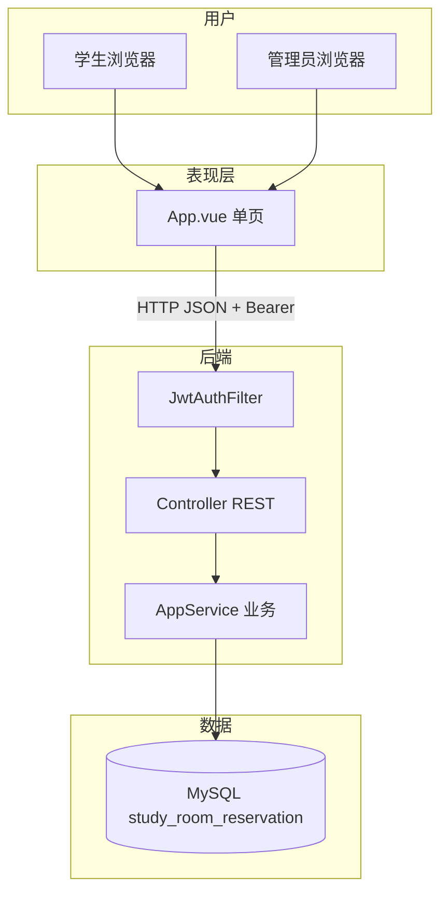
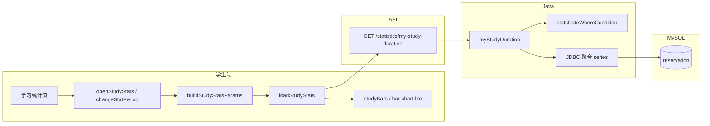
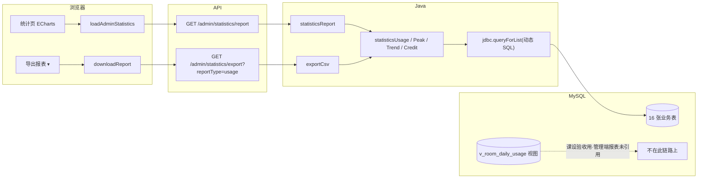

# 02 — 答辩讲解手册

> **演示实体**：小明 `202225220101`/`123456` · 小李（新注册） · 普管 `admin`/`admin123` · 超管 `superadmin`/`super123`  
> **仓库**：[https://github.com/CZF312/CampusStudyRoomReservationManagementSystem](https://github.com/CZF312/CampusStudyRoomReservationManagementSystem)  
> **演示账号**：学生 `202225220101`/`123456` · 普管 `admin`/`admin123` · 超管 `superadmin`/`super123`  
> **标签**：【演】浏览器操作 · 【讲】口述原理 · 【指】点行号（Lx 首行含 `【Fx-y】` 总体讲解）· **与 [01](01-项目理解指南.md#user-content-toc) 同 F 编号**  
> **说明**：正文由 01 同步生成，删去阅读约定与 AI 套话；定位表与行号与 01 一致。

## 功能架构目录（根）

- **[F1 入门基础](#user-content-f1)**
  - [F1.1 环境启动](#user-content-f1-1)
  - [F1.2 技术概念（8 卡）](#user-content-f1-2)
- **[F2 认证与账号](#user-content-f2)**
  - [F2.1 学生登录](#user-content-f2-1)
  - [F2.2 管理员登录](#user-content-f2-2)
  - [F2.3 注册审核登录](#user-content-f2-3)
  - [F2.4 账号资料与安全](#user-content-f2-4)
- **[F3 自习室与预约](#user-content-f3)**
  - [F3.1 查座预约](#user-content-f3-1)
  - [F3.2 取消预约](#user-content-f3-2)
  - [F3.3 我的预约](#user-content-f3-3)
- **[F4 签到签退与信用](#user-content-f4)**
  - [F4.1 签到（学号 / 拍照 QR）](#user-content-f4-1)
  - [F4.2 签退与信用](#user-content-f4-2)
  - [F4.3 定时维护（无 UI）](#user-content-f4-3)
- **[F5 学生端辅助](#user-content-f5)**
  - [F5.1 学习统计（当期 / 往期）](#user-content-f5-1)
  - [F5.2 公告与通知](#user-content-f5-2)
  - [F5.3 问题反馈](#user-content-f5-3)
- **[F6 管理端](#user-content-f6)**
  - [F6.1 统计与 CSV 导出](#user-content-f6-1)
  - [F6.2 系统配置（超管）](#user-content-f6-2)
  - [F6.3 用户管理](#user-content-f6-3)
  - [F6.4 自习室与座位](#user-content-f6-4)
  - [F6.5 预约监管与违约撤销](#user-content-f6-5)
  - [F6.6 运营看板（实时预约）](#user-content-f6-6)
  - [F6.7 管理员与操作日志](#user-content-f6-7)
- **[F7 第三版与数据](#user-content-f7)**
  - [F7.1 数据库与 Java 分工](#user-content-f7-1)
  - [F7.2 第三版规范化](#user-content-f7-2)
  - [F7.3 前端状态 canonical](#user-content-f7-3)
  - [F7.4 十六张表](#user-content-f7-4)
  - [F7.5 教材知识点对照（第7–11章）](#user-content-f7-5)
- **[F8 附录：需求与代码差异](#user-content-f8)**
- **数据库答辩专章（外键/索引/视图）** → [04-数据库设计答辩专章.md](04-数据库设计答辩专章.md#user-content-db-a)

**页内跳转**：上列 `#user-content-f1-2` 等链接在 **GitHub 网页**可跳到对应节（须先运行 `sync_f_doc_anchors.py` 再推送）。  
**代码跳转**：表中 `blob/master/…/App.vue#L2290` 在 GitHub 打开对应行。

---

## 模块总览

本系统按 **F1–F8 八大模块** 组织；每模块含若干 **子项（F x.y）**，各子项用一条 **功能链实例**（演示故事）串起前端 → API → Service → MySQL 全链路。阅读顺序建议：**模块总览（本节）→ 功能架构目录 → 具体 F 节 → 实现定位表 → 点 GitHub 行号看源码**。

### 架构分层（全项目统一）


| 层级        | 目录/技术                                                     | 职责                          | 典型 F 节             |
| --------- | --------------------------------------------------------- | --------------------------- | ------------------ |
| **表现层**   | `frontend/src/App.vue` · Element Plus · ECharts           | 学生/管理 UI、表单、图表、JWT 存取       | F2–F6 大部分          |
| **静态资源**  | `src/main/resources/static/`                              | Vite 构建产物，Spring Boot 同端口托管 | F1.1               |
| **接口层**   | `controller/AppController.java` · `UploadController.java` | REST 路由、鉴权注解、参数绑定           | 各 F 节「Controller」行 |
| **业务层**   | `service/AppService.java` · `ScheduledTaskService.java`   | 业务规则、JDBC 动态 SQL、CSV 导出     | F3–F6 核心           |
| **配置/安全** | `config/JwtAuthFilter.java` · `application*.properties`   | JWT 过滤、跨域、数据源               | F2 · F6.2          |
| **数据层**   | `docs/06-部署配置/schema.sql` · MySQL 16 表                    | 表结构、字典、视图                   | F7                 |
| **运维层**   | `start.bat` · `scripts/start-system.ps1`                  | 一键建库、编译、启动                  | F1.1               |





### 模块一览


| 模块             | 面向角色     | 核心职责                         | 子项链接                                                                                                                                                                                                     |
| -------------- | -------- | ---------------------------- | -------------------------------------------------------------------------------------------------------------------------------------------------------------------------------------------------------- |
| **F1 入门基础**    | 全员 / 新手  | 一键启动环境、八卡技术概念扫盲              | [F1.1 环境启动](#user-content-f1-1) · [F1.2 技术概念（8 卡）](#user-content-f1-2)                                                                                                                                   |
| **F2 认证与账号**   | 学生、管理员   | 登录注册、JWT 会话、资料改密             | [F2.1 学生登录](#user-content-f2-1) · [F2.2 管理员登录](#user-content-f2-2) · [F2.3 注册审核](#user-content-f2-3) · [F2.4 账号资料与安全](#user-content-f2-4)                                                                |
| **F3 自习室与预约**  | 学生       | 查座预约、取消、我的预约列表               | [F3.1 查座预约](#user-content-f3-1) · [F3.2 取消预约](#user-content-f3-2) · [F3.3 我的预约](#user-content-f3-3)                                                                                                      |
| **F4 签到签退与信用** | 学生、管理员   | 学号/QR 签到、签退、信用流水、定时违约        | [F4.1 签到](#user-content-f4-1) · [F4.2 签退与信用](#user-content-f4-2) · [F4.3 定时维护](#user-content-f4-3)                                                                                                       |
| **F5 学生端辅助**   | 学生       | 学习统计、公告通知、问题反馈               | [F5.1 学习统计](#user-content-f5-1) · [F5.2 公告与通知](#user-content-f5-2) · [F5.3 问题反馈](#user-content-f5-3)                                                                                                     |
| **F6 管理端**     | 管理员、超管   | 统计导出、配置、用户/房间/预约监管、看板、日志     | [F6.1](#user-content-f6-1) · [F6.2](#user-content-f6-2) · [F6.3](#user-content-f6-3) · [F6.4](#user-content-f6-4) · [F6.5](#user-content-f6-5) · [F6.6](#user-content-f6-6) · [F6.7](#user-content-f6-7) |
| **F7 第三版与数据**  | 开发者 / 答辩 | DB 与 Java 分工、V3 字典、前端状态、16 表 | [F7.1](#user-content-f7-1) · [F7.2](#user-content-f7-2) · [F7.3](#user-content-f7-3) · [F7.4](#user-content-f7-4)                                                                                        |
| **F8 附录**      | 答辩 / 验收  | 需求与代码差异、65 端点对照              | [F8 附录](#user-content-f8)                                                                                                                                                                                |


---

---

## F1 入门基础

子项：[F1.1 环境启动](#user-content-f1-1) · [F1.2 技术概念](#user-content-f1-2)

---

### F1.1 环境启动

**功能链实例（一条龙）**  
组长双击 `start.bat` → PowerShell 导入 `database-full.sql` 建库 `study_room_reservation` → Spring Boot 监听 8080 → 浏览器打开登录页 → `verify-v3-dictionary.ps1` 输出 **PASS=17**。

#### 实现定位表


<table class="impl-loc-table" style="table-layout:fixed;width:100%;border-collapse:collapse;border:1px solid #d0d7de;">
<colgroup>
  <col style="width:18%" />
  <col style="width:28%" />
  <col style="width:54%" />
</colgroup>
  <thead>
    <tr>
      <th scope="col" style="text-align:left;vertical-align:bottom;padding:8px 10px;border:1px solid #d0d7de;background:#f6f8fa;font-weight:700;">所属层</th>
      <th scope="col" style="text-align:left;vertical-align:bottom;padding:8px 10px;border:1px solid #d0d7de;background:#f6f8fa;font-weight:700;">链路中位置与代码地址</th>
      <th scope="col" style="text-align:left;vertical-align:bottom;padding:8px 10px;border:1px solid #d0d7de;background:#f6f8fa;font-weight:700;">实现讲解</th>
    </tr>
  </thead>
  <tbody>
    <tr>
      <td style="vertical-align:top;word-break:break-word;padding:8px 10px;border:1px solid #d0d7de;"><span style="color:#6639ba;font-weight:700;">运维脚本 · Ops</span><br><span style="color:#0969da;font-weight:700;">相关概念：</span><code style="background:#eff1f3;padding:1px 5px;border-radius:4px;font-size:92%;">@echo off</code>=关闭命令回显；<code style="background:#eff1f3;padding:1px 5px;border-radius:4px;font-size:92%;">%~dp0</code>=bat 所在目录即项目根；<code style="background:#eff1f3;padding:1px 5px;border-radius:4px;font-size:92%;">pom.xml</code>=Maven 项目标志，防在错误目录启动；<code style="background:#eff1f3;padding:1px 5px;border-radius:4px;font-size:92%;">PowerShell</code>=执行 .ps1 的 Windows 脚本引擎；<code style="background:#eff1f3;padding:1px 5px;border-radius:4px;font-size:92%;">ERRORLEVEL</code>=透传 ps1 退出码给 pause；<code style="background:#eff1f3;padding:1px 5px;border-radius:4px;font-size:92%;">pause</code>=答辩时保留窗口看 PASS/FAIL</td>
      <td style="vertical-align:top;word-break:break-word;padding:8px 10px;border:1px solid #d0d7de;"><code style="background:#eff1f3;padding:1px 5px;border-radius:4px;font-size:92%;">start.bat</code> · 启动入口 · <a href="https://github.com/CZF312/CampusStudyRoomReservationManagementSystem/blob/master/start.bat#L1-L31" style="color:#0969da;text-decoration:none;">L1-L31</a><br><span style="color:#0969da;font-weight:700;">链中位置：</span><br><span style="color:#1a7f37;font-weight:700;background:#ddf4ff;padding:1px 6px;border-radius:4px;">1. </span>cd 到 bat 所在项目根，设 UTF-8 与窗口标题<br><span style="color:#953800;font-weight:600;">输入：</span>用户双击 start.bat<br><span style="color:#953800;font-weight:600;">输出：</span>工作目录=项目根；<code style="background:#eff1f3;padding:1px 5px;border-radius:4px;font-size:92%;">CSRRM_SCRIPT_ROOT=%~dp0scripts</code><br><span style="color:#1a7f37;font-weight:700;background:#ddf4ff;padding:1px 6px;border-radius:4px;">2. </span>校验 pom.xml 存在<br><span style="color:#953800;font-weight:600;">输入：</span>当前目录<br><span style="color:#953800;font-weight:600;">输出：</span>有 pom.xml 继续；无则 echo ERROR 并 exit /b 1<br><span style="color:#1a7f37;font-weight:700;background:#ddf4ff;padding:1px 6px;border-radius:4px;">3. </span>Bypass 执行策略调用 start-system.ps1<br><span style="color:#953800;font-weight:600;">输入：</span><code style="background:#eff1f3;padding:1px 5px;border-radius:4px;font-size:92%;">scripts\start-system.ps1</code><br><span style="color:#953800;font-weight:600;">输出：</span>PowerShell 五步链运行；<code style="background:#eff1f3;padding:1px 5px;border-radius:4px;font-size:92%;">ERRORLEVEL</code> 写入 ERR<br><span style="color:#1a7f37;font-weight:700;background:#ddf4ff;padding:1px 6px;border-radius:4px;">4. </span>pause 并透传退出码<br><span style="color:#953800;font-weight:600;">输入：</span>ps1 的 <code style="background:#eff1f3;padding:1px 5px;border-radius:4px;font-size:92%;">%ERRORLEVEL%</code><br><span style="color:#953800;font-weight:600;">输出：</span>窗口保留供答辩看 PASS/FAIL；<code style="background:#eff1f3;padding:1px 5px;border-radius:4px;font-size:92%;">exit /b %ERR%</code><br><span style="color:#bc4c00;font-weight:700;">总输入：</span>双击 bat 或 cmd 调用。<br><span style="color:#bc4c00;font-weight:700;">总输出：</span>调用 start-system.ps1，exit code 原样返回。<br><span style="color:#bc4c00;font-weight:700;">失败时：</span>无 pom.xml 或 ps1 非 0 → ERROR + pause。</td>
      <td style="vertical-align:top;word-break:break-word;padding:8px 10px;border:1px solid #d0d7de;line-height:1.55;"><span style="color:#0550ae;font-weight:700;background:#dbeafe;padding:2px 8px;border-radius:4px;">③ 底层实现：</span><span style="color:#1a7f37;font-weight:700;background:#ddf4ff;padding:1px 6px;border-radius:4px;">1（L1-L9）：</span>@echo off；chcp 65001；<code style="background:#eff1f3;padding:1px 5px;border-radius:4px;font-size:92%;">cd /d %~dp0</code> 固定项目根；首行 REM 含 <code style="background:#eff1f3;padding:1px 5px;border-radius:4px;font-size:92%;">【F1-1】</code> 总体讲解。<br><span style="color:#1a7f37;font-weight:700;background:#ddf4ff;padding:1px 6px;border-radius:4px;">2（L12-L16）：</span>if not exist pom.xml → 错误提示 + pause + exit，防止在错误目录启动。<br><span style="color:#1a7f37;font-weight:700;background:#ddf4ff;padding:1px 6px;border-radius:4px;">3（L18-L22）：</span><code style="background:#eff1f3;padding:1px 5px;border-radius:4px;font-size:92%;">powershell -ExecutionPolicy Bypass -File ...\start-system.ps1</code>；重活交给 ps1。<br><span style="color:#1a7f37;font-weight:700;background:#ddf4ff;padding:1px 6px;border-radius:4px;">4（L24-L32）：</span>根据 ERR 打印 Setup finished 或 ERROR；pause 防窗口闪退。<br><br><span style="color:#7c3aed;font-weight:700;background:#ede9fe;padding:2px 8px;border-radius:4px;">④ 设计取舍：</span>为何放在运维脚本：部署与业务生命周期不同，脚本不进 jar，clone 后不改 Java 也能重建环境。<br>bat 兼容双击与答辩机无 IDE；重活交给 PowerShell（MySQL 检测、导入 SQL、mvnw）。<br>若不这样做：若只给 README 文字步骤，答辩机易漏装 MySQL/忘导库；脚本把多步合成双击，降低人为失误。<br><br><span style="color:#b45309;font-weight:700;background:#ffedd5;padding:2px 8px;border-radius:4px;">⑤ 答辩要点：</span>问：为什么不用纯 PowerShell？答：双击 <code style="background:#eff1f3;padding:1px 5px;border-radius:4px;font-size:92%;">.bat</code> 是 Windows 用户零学习成本入口；<code style="background:#eff1f3;padding:1px 5px;border-radius:4px;font-size:92%;">.ps1</code> 默认策略可能拦截。</td>
    </tr>
    <tr style="background:#f6f8fa;">
      <td style="vertical-align:top;word-break:break-word;padding:8px 10px;border:1px solid #d0d7de;"><span style="color:#6639ba;font-weight:700;">运维脚本 · Ops</span><br><span style="color:#0969da;font-weight:700;">相关概念：</span><code style="background:#eff1f3;padding:1px 5px;border-radius:4px;font-size:92%;">Java/JDK</code>=运行 Spring Boot 后端的程序；<code style="background:#eff1f3;padding:1px 5px;border-radius:4px;font-size:92%;">MySQL</code>=关系型数据库，存预约与用户；<code style="background:#eff1f3;padding:1px 5px;border-radius:4px;font-size:92%;">index.html</code>=static 下预构建的前端登录页（HTML）；<code style="background:#eff1f3;padding:1px 5px;border-radius:4px;font-size:92%;">Spring Boot</code>=<code style="background:#eff1f3;padding:1px 5px;border-radius:4px;font-size:92%;">mvnw spring-boot:run</code> 启动的内嵌 Tomcat Web 框架；<code style="background:#eff1f3;padding:1px 5px;border-radius:4px;font-size:92%;">application-local.properties</code>=本地 MySQL 密码配置文件；<code style="background:#eff1f3;padding:1px 5px;border-radius:4px;font-size:92%;">setup-after-clone.ps1</code>=DROP 库并导入 database-full.sql 的子脚本；<code style="background:#eff1f3;padding:1px 5px;border-radius:4px;font-size:92%;">database-full.sql</code>=整库演示数据快照；<code style="background:#eff1f3;padding:1px 5px;border-radius:4px;font-size:92%;">PASS=17</code>=第三版字典 17 项验收</td>
      <td style="vertical-align:top;word-break:break-word;padding:8px 10px;border:1px solid #d0d7de;"><code style="background:#eff1f3;padding:1px 5px;border-radius:4px;font-size:92%;">start-system.ps1</code> · 系统启动脚本 · <a href="https://github.com/CZF312/CampusStudyRoomReservationManagementSystem/blob/master/scripts/start-system.ps1#L1-L15" style="color:#0969da;text-decoration:none;">L1-L15</a><br><span style="color:#0969da;font-weight:700;">链中位置：</span><br><span style="color:#1a7f37;font-weight:700;background:#ddf4ff;padding:1px 6px;border-radius:4px;">1. </span>检 Java、mysql 客户端与 static/index.html<br><span style="color:#953800;font-weight:600;">输入：</span>PATH 中 java/mysql；预构建 <code style="background:#eff1f3;padding:1px 5px;border-radius:4px;font-size:92%;">static/index.html</code><br><span style="color:#953800;font-weight:600;">输出：</span>打印版本与 [OK] Frontend；缺依赖 exit 1<br><span style="color:#1a7f37;font-weight:700;background:#ddf4ff;padding:1px 6px;border-radius:4px;">2. </span>检查并启动 MySQL Windows 服务<br><span style="color:#953800;font-weight:600;">输入：</span>本机 MySQL/MariaDB 服务<br><span style="color:#953800;font-weight:600;">输出：</span>服务 Status=Running（必要时 Start-Service）<br><span style="color:#1a7f37;font-weight:700;background:#ddf4ff;padding:1px 6px;border-radius:4px;">3. </span>读/写 application-local.properties 中的 root 密码<br><span style="color:#953800;font-weight:600;">输入：</span>可选 <code style="background:#eff1f3;padding:1px 5px;border-radius:4px;font-size:92%;">CSRRM_MYSQL_PASSWORD</code>；或已保存密码；或交互 Read-Host<br><span style="color:#953800;font-weight:600;">输出：</span>Test-MysqlLogin 通过；密码可写回 local 配置<br><span style="color:#1a7f37;font-weight:700;background:#ddf4ff;padding:1px 6px;border-radius:4px;">4. </span>调用 setup-after-clone.ps1 导库并验 PASS=17<br><span style="color:#953800;font-weight:600;">输入：</span>上步 root 密码<br><span style="color:#953800;font-weight:600;">输出：</span>DROP+导入 database-full.sql；verify-v3-dictionary PASS=17<br><span style="color:#1a7f37;font-weight:700;background:#ddf4ff;padding:1px 6px;border-radius:4px;">5. </span>新窗口 mvnw spring-boot:run 并轮询 8080<br><span style="color:#953800;font-weight:600;">输入：</span>8080 空闲或已有实例返回 200<br><span style="color:#953800;font-weight:600;">输出：</span>CSRRMS-Backend 窗口；http://localhost:8080 可访问<br><span style="color:#bc4c00;font-weight:700;">总输入：</span>bat 调用；可选环境变量 CSRRM_MYSQL_PASSWORD。<br><span style="color:#bc4c00;font-weight:700;">总输出：</span>导库 PASS=17、新窗口 mvnw、8080 可访问。<br><span style="color:#bc4c00;font-weight:700;">失败时：</span>Java/MySQL/static 缺失或 verify 失败 → exit 1。</td>
      <td style="vertical-align:top;word-break:break-word;padding:8px 10px;border:1px solid #d0d7de;line-height:1.55;"><span style="color:#0550ae;font-weight:700;background:#dbeafe;padding:2px 8px;border-radius:4px;">③ 底层实现：</span><span style="color:#1a7f37;font-weight:700;background:#ddf4ff;padding:1px 6px;border-radius:4px;">1（L85-L99）：</span>Write-Step [1/5]；Require-Command java/mysql；Test-Path staticIndex；JDK 版本提示。<br><span style="color:#1a7f37;font-weight:700;background:#ddf4ff;padding:1px 6px;border-radius:4px;">2（L109-L129）：</span>Get-Service 匹配 mysql；未 Running 则 Start-Service + Sleep；失败 exit 1。<br><span style="color:#1a7f37;font-weight:700;background:#ddf4ff;padding:1px 6px;border-radius:4px;">3（L131-L147）：</span>Get-ConfiguredMysqlPassword → 空密码/已保存/循环 Read-Host 直至 mysql SELECT 1 成功。<br><span style="color:#1a7f37;font-weight:700;background:#ddf4ff;padding:1px 6px;border-radius:4px;">4（L149-L152）：</span>调用 setup-after-clone.ps1 -MySqlPassword $password -SkipStart；非 0 则 exit。<br><span style="color:#1a7f37;font-weight:700;background:#ddf4ff;padding:1px 6px;border-radius:4px;">5（L154-L191）：</span>netstat 查 8080；<code style="background:#eff1f3;padding:1px 5px;border-radius:4px;font-size:92%;">Start-Process cmd /k mvnw spring-boot:run</code>；Invoke-WebRequest 最多 60 秒轮询。<br><br><span style="color:#7c3aed;font-weight:700;background:#ede9fe;padding:2px 8px;border-radius:4px;">④ 设计取舍：</span>为何放在运维脚本：部署与业务生命周期不同，脚本不进 jar，clone 后不改 Java 也能重建环境。<br>导入与启动解耦：库坏了可只跑 setup；8080 已在线则跳过第二实例。<br>若不这样做：若只给 README 文字步骤，答辩机易漏装 MySQL/忘导库；脚本把多步合成双击，降低人为失误。<br><br><span style="color:#b45309;font-weight:700;background:#ffedd5;padding:2px 8px;border-radius:4px;">⑤ 答辩要点：</span>问：克隆后没 Node 能跑吗？答：可以，仓库已带 <code style="background:#eff1f3;padding:1px 5px;border-radius:4px;font-size:92%;">src/main/resources/static</code> 预构建前端。</td>
    </tr>
    <tr>
      <td style="vertical-align:top;word-break:break-word;padding:8px 10px;border:1px solid #d0d7de;"><span style="color:#6639ba;font-weight:700;">业务层 · Service</span><br><span style="color:#0969da;font-weight:700;">相关概念：</span><code style="background:#eff1f3;padding:1px 5px;border-radius:4px;font-size:92%;">@PostConstruct</code>=Spring Boot 启动后自动执行；<code style="background:#eff1f3;padding:1px 5px;border-radius:4px;font-size:92%;">JdbcTemplate</code>=Java 里执行 SQL 的工具；<code style="background:#eff1f3;padding:1px 5px;border-radius:4px;font-size:92%;">classpath</code> SQL=jar 内补丁脚本；与 database-full.sql 全量导入互补；<code style="background:#eff1f3;padding:1px 5px;border-radius:4px;font-size:92%;">database-full.sql</code>=整库演示数据快照；<code style="background:#eff1f3;padding:1px 5px;border-radius:4px;font-size:92%;">Spring Boot</code>=Java Web 后端框架；<code style="background:#eff1f3;padding:1px 5px;border-radius:4px;font-size:92%;">Java</code>=后端运行时</td>
      <td style="vertical-align:top;word-break:break-word;padding:8px 10px;border:1px solid #d0d7de;"><code style="background:#eff1f3;padding:1px 5px;border-radius:4px;font-size:92%;">DatabaseInitializer.run</code> · 数据库初始化 · <a href="https://github.com/CZF312/CampusStudyRoomReservationManagementSystem/blob/master/src/main/java/com/scau/campusstudyroomreservationmanagementsystem/service/DatabaseInitializer.java#L14-L38" style="color:#0969da;text-decoration:none;">L14-L38</a><br><span style="color:#0969da;font-weight:700;">链中位置：</span><br><span style="color:#1a7f37;font-weight:700;background:#ddf4ff;padding:1px 6px;border-radius:4px;">1. </span>Spring 容器启动后触发 @PostConstruct<br><span style="color:#953800;font-weight:600;">输入：</span>Boot 完成组件扫描<br><span style="color:#953800;font-weight:600;">输出：</span>进入 run() 方法<br><span style="color:#1a7f37;font-weight:700;background:#ddf4ff;padding:1px 6px;border-radius:4px;">2. </span>检测缺表并执行 classpath 补丁 SQL<br><span style="color:#953800;font-weight:600;">输入：</span>当前 MySQL 表结构<br><span style="color:#953800;font-weight:600;">输出：</span>缺表时 DDL/DML 补丁；与 ps1 全量导入互补<br><span style="color:#bc4c00;font-weight:700;">总输入：</span>Spring 容器启动完成（无 HTTP）。<br><span style="color:#bc4c00;font-weight:700;">总输出：</span>缺表时执行 classpath 补丁 SQL。<br><span style="color:#bc4c00;font-weight:700;">失败时：</span>SQL 异常 → Boot 启动失败，8080 不起。</td>
      <td style="vertical-align:top;word-break:break-word;padding:8px 10px;border:1px solid #d0d7de;line-height:1.55;"><span style="color:#0550ae;font-weight:700;background:#dbeafe;padding:2px 8px;border-radius:4px;">③ 底层实现：</span><span style="color:#1a7f37;font-weight:700;background:#ddf4ff;padding:1px 6px;border-radius:4px;">1（L14-L20）：</span>@PostConstruct 标注；JdbcTemplate 已注入。<br><span style="color:#1a7f37;font-weight:700;background:#ddf4ff;padding:1px 6px;border-radius:4px;">2（L21-L38）：</span>读 resources SQL；JdbcTemplate.execute；失败则 Boot 启动失败。<br><br><span style="color:#7c3aed;font-weight:700;background:#ede9fe;padding:2px 8px;border-radius:4px;">④ 设计取舍：</span>为何放在业务层：业务规则 + SQL 是系统「真相来源」，放一层便于单元测试与答辩时打开 AppService 指 SQL。<br>Java 侧可版本化补丁，不必每次手动改 SQL 文件。<br>若不这样做：若用 JPA 全自动 SQL，动态报表（F6.1）与复杂 WHERE（F5.1 时间窗）难写难讲，故课选用 JdbcTemplate 显式 SQL 便于答辩指行。<br><br><span style="color:#b45309;font-weight:700;background:#ffedd5;padding:2px 8px;border-radius:4px;">⑤ 答辩要点：</span>问：数据从哪来？答：答辩机以 start.bat 导入 database-full.sql 为主；Initializer 防表缺失。<br><span style="color:#cf222e;font-weight:700;">问：</span>SQL 在哪看？<span style="color:#0969da;font-weight:600;">答：</span>AppService.java 搜方法名，或 GitHub 定位列 L 行 【行】 注释旁。</td>
    </tr>
    <tr style="background:#f6f8fa;">
      <td style="vertical-align:top;word-break:break-word;padding:8px 10px;border:1px solid #d0d7de;"><span style="color:#6639ba;font-weight:700;">运维脚本 · Ops</span><br><span style="color:#0969da;font-weight:700;">相关概念：</span><code style="background:#eff1f3;padding:1px 5px;border-radius:4px;font-size:92%;">information_schema</code>=MySQL 系统库，查表数/外键；<code style="background:#eff1f3;padding:1px 5px;border-radius:4px;font-size:92%;">Test-Check</code>=脚本内 PASS/FAIL 计数；<code style="background:#eff1f3;padding:1px 5px;border-radius:4px;font-size:92%;">PASS=17</code>=第三版验收标准；<code style="background:#eff1f3;padding:1px 5px;border-radius:4px;font-size:92%;">mysql.exe</code>=命令行连库执行 SQL；<code style="background:#eff1f3;padding:1px 5px;border-radius:4px;font-size:92%;">application-local.properties</code>=本地数据源密码配置；<code style="background:#eff1f3;padding:1px 5px;border-radius:4px;font-size:92%;">setup-after-clone.ps1</code>=导库子脚本；<code style="background:#eff1f3;padding:1px 5px;border-radius:4px;font-size:92%;">MySQL</code>=关系型数据库</td>
      <td style="vertical-align:top;word-break:break-word;padding:8px 10px;border:1px solid #d0d7de;"><code style="background:#eff1f3;padding:1px 5px;border-radius:4px;font-size:92%;">verify-v3-dictionary.ps1</code> · 字典验收 · <a href="https://github.com/CZF312/CampusStudyRoomReservationManagementSystem/blob/master/scripts/verify-v3-dictionary.ps1#L1-L20" style="color:#0969da;text-decoration:none;">L1-L20</a><br><span style="color:#0969da;font-weight:700;">链中位置：</span><br><span style="color:#1a7f37;font-weight:700;background:#ddf4ff;padding:1px 6px;border-radius:4px;">1. </span>连接 MySQL 并读取密码<br><span style="color:#953800;font-weight:600;">输入：</span>mysql 在 PATH；database-full.sql 已导入<br><span style="color:#953800;font-weight:600;">输出：</span>mysql 客户端就绪；$env:MYSQL_PWD 设置<br><span style="color:#1a7f37;font-weight:700;background:#ddf4ff;padding:1px 6px;border-radius:4px;">2. </span>验库存在、16 表、外键与字典<br><span style="color:#953800;font-weight:600;">输入：</span>study_room_reservation 库<br><span style="color:#953800;font-weight:600;">输出：</span>information_schema 查询 PASS/FAIL 计数<br><span style="color:#1a7f37;font-weight:700;background:#ddf4ff;padding:1px 6px;border-radius:4px;">3. </span>抽样演示账号与 uploads 并汇总<br><span style="color:#953800;font-weight:600;">输入：</span>上步 SQL 结果<br><span style="color:#953800;font-weight:600;">输出：</span>控制台 PASS=n FAIL=m；PASS=17 则 exit 0<br><span style="color:#bc4c00;font-weight:700;">总输入：</span>MySQL 已导入 database-full.sql；root 密码。<br><span style="color:#bc4c00;font-weight:700;">总输出：</span>控制台 PASS=17 / FAIL=n；exit 0 或 1。<br><span style="color:#bc4c00;font-weight:700;">失败时：</span>表数/外键/字典不符 → 红色 FAIL，需重跑 setup。</td>
      <td style="vertical-align:top;word-break:break-word;padding:8px 10px;border:1px solid #d0d7de;line-height:1.55;"><span style="color:#0550ae;font-weight:700;background:#dbeafe;padding:2px 8px;border-radius:4px;">③ 底层实现：</span><span style="color:#1a7f37;font-weight:700;background:#ddf4ff;padding:1px 6px;border-radius:4px;">1（L18-L39）：</span>检 mysql 命令；从 application-local.properties 或 Read-Host 取密码。<br><span style="color:#1a7f37;font-weight:700;background:#ddf4ff;padding:1px 6px;border-radius:4px;">2（L68-L120）：</span>Test-Check 包装：表数、temp_leave 不存在、status 中文字典、外键数等。<br><span style="color:#1a7f37;font-weight:700;background:#ddf4ff;padding:1px 6px;border-radius:4px;">3（L121-L176）：</span>查演示学号/管理员；验 uploads 文件；打印 PASS=17 或 exit 1。<br><br><span style="color:#7c3aed;font-weight:700;background:#ede9fe;padding:2px 8px;border-radius:4px;">④ 设计取舍：</span>为何放在运维脚本：部署与业务生命周期不同，脚本不进 jar，clone 后不改 Java 也能重建环境。<br>答辩前一条命令验第三版规范，不需打开数据库客户端。<br>若不这样做：若只给 README 文字步骤，答辩机易漏装 MySQL/忘导库；脚本把多步合成双击，降低人为失误。<br><br><span style="color:#b45309;font-weight:700;background:#ffedd5;padding:2px 8px;border-radius:4px;">⑤ 答辩要点：</span>问：PASS=17 是什么？答：第三版字典 17 条验收，见脚本内注释与 F7.2。</td>
    </tr>
  </tbody>
</table>

[↑ 目录](#user-content-toc) · [↑ F1](#user-content-f1)

---

### F1.2 技术概念（8 卡）

**功能链实例**  
小明点「确认预约」→ 浏览器用 **Vue** 发 **HTTP** **JSON** 到 **REST API** → **Controller** 转 **Service** 写 **MySQL** → 返回 **JSON** `code:200`；登录后请求头带 **JWT token**。

#### 实现定位表


<table class="impl-loc-table" style="table-layout:fixed;width:100%;border-collapse:collapse;border:1px solid #d0d7de;">
<colgroup>
  <col style="width:18%" />
  <col style="width:28%" />
  <col style="width:54%" />
</colgroup>
  <thead>
    <tr>
      <th scope="col" style="text-align:left;vertical-align:bottom;padding:8px 10px;border:1px solid #d0d7de;background:#f6f8fa;font-weight:700;">所属层</th>
      <th scope="col" style="text-align:left;vertical-align:bottom;padding:8px 10px;border:1px solid #d0d7de;background:#f6f8fa;font-weight:700;">链路中位置与代码地址</th>
      <th scope="col" style="text-align:left;vertical-align:bottom;padding:8px 10px;border:1px solid #d0d7de;background:#f6f8fa;font-weight:700;">实现讲解</th>
    </tr>
  </thead>
  <tbody>
    <tr>
      <td style="vertical-align:top;word-break:break-word;padding:8px 10px;border:1px solid #d0d7de;"><span style="color:#6639ba;font-weight:700;">Service 业务层</span><br><span style="color:#0969da;font-weight:700;">相关概念：</span><code style="background:#eff1f3;padding:1px 5px;border-radius:4px;font-size:92%;">JdbcTemplate</code>=Spring 执行 SQL；<code style="background:#eff1f3;padding:1px 5px;border-radius:4px;font-size:92%;">算预约规则 &lt;span style="color:#0969da;fon</code>=业务规则与 SQL</td>
      <td style="vertical-align:top;word-break:break-word;padding:8px 10px;border:1px solid #d0d7de;">算预约规则 &lt;span style="color:#0969da;font-weight:700;"&gt;<br><span style="color:#0969da;font-weight:700;">链中位置：</span><br><span style="color:#1a7f37;font-weight:700;background:#ddf4ff;padding:1px 6px;border-radius:4px;">1. </span>#0969da;fon`<br><span style="color:#953800;font-weight:600;">输入：</span>Controller 传入 DTO/基本类型<br><span style="color:#953800;font-weight:600;">输出：</span>业务校验通过，可读写 MySQL<br><span style="color:#1a7f37;font-weight:700;background:#ddf4ff;padding:1px 6px;border-radius:4px;">2. </span>本方法先业务校验（状态对不对、是不是本人、信用够不够）<br><span style="color:#953800;font-weight:600;">输入：</span>上一步输出<br><span style="color:#953800;font-weight:600;">输出：</span>本步 <code style="background:#eff1f3;padding:1px 5px;border-radius:4px;font-size:92%;">本方法先业务校验（状态对不对、是不是本人、信用够不够）</code> 处理结果交给下一步<br><span style="color:#1a7f37;font-weight:700;background:#ddf4ff;padding:1px 6px;border-radius:4px;">3. </span>通过则 JdbcTemplate 执行 INSERT/UPDATE/SELECT<br><span style="color:#953800;font-weight:600;">输入：</span>上一步输出<br><span style="color:#953800;font-weight:600;">输出：</span>本步 <code style="background:#eff1f3;padding:1px 5px;border-radius:4px;font-size:92%;">通过则 JdbcTemplate 执行 INSERT/UPDATE/SELECT</code> 处理结果交给下一步<br><span style="color:#1a7f37;font-weight:700;background:#ddf4ff;padding:1px 6px;border-radius:4px;">4. </span>必要时写 credit_log 或 notifyUser<br><span style="color:#953800;font-weight:600;">输入：</span>上一步输出<br><span style="color:#953800;font-weight:600;">输出：</span>本步 <code style="background:#eff1f3;padding:1px 5px;border-radius:4px;font-size:92%;">必要时写 credit_log 或 notifyUser</code> 处理结果交给下一步<br><span style="color:#1a7f37;font-weight:700;background:#ddf4ff;padding:1px 6px;border-radius:4px;">5. </span>返回 Map/DTO 给 Controller。<br><span style="color:#953800;font-weight:600;">输入：</span>累积 SQL/校验结果<br><span style="color:#953800;font-weight:600;">输出：</span>返回 DTO 或抛 BusinessException<br><span style="color:#bc4c00;font-weight:700;">总输入：</span>Controller 传入的 DTO/基本类型（userId、seatId、时间段等）。<br><span style="color:#bc4c00;font-weight:700;">总输出：</span>Map/DTO 或 void；副作用为 UPDATE/INSERT MySQL 表。<br><span style="color:#bc4c00;font-weight:700;">失败时：</span>throw new BusinessException("中文原因")，事务回滚，前端看到 message。</td>
      <td style="vertical-align:top;word-break:break-word;padding:8px 10px;border:1px solid #d0d7de;line-height:1.55;"><span style="color:#0550ae;font-weight:700;background:#dbeafe;padding:2px 8px;border-radius:4px;">③ 底层实现：</span>1：定位列 GitHub 链接：`AppService.算预约规则 &lt;span style="color:#0969da<br>2：fon<code style="background:#eff1f3;padding:1px 5px;border-radius:4px;font-size:92%;"> 内 SQL 字符串 + </code>jdbcTemplate.query/update`<br>3：常见表<br>4：status 字段值必须与 schema.sql 第三版中文 CHECK 一致<br>5：失败 <code style="background:#eff1f3;padding:1px 5px;border-radius:4px;font-size:92%;">throw new BusinessException("中文原因")</code>，不会返回 half-done 数据。<br><br><span style="color:#7c3aed;font-weight:700;background:#ede9fe;padding:2px 8px;border-radius:4px;">④ 设计取舍：</span>为何放在Service 业务层：业务规则 + SQL 是系统「真相来源」，放一层便于单元测试与答辩时打开 AppService 指 SQL。<br>业务规则只写一份在 Service：Controller、@Scheduled、导出 CSV 都调这里，改规则不会漏改某一层。<br>若不这样做：若用 JPA 全自动 SQL，动态报表（F6.1）与复杂 WHERE（F5.1 时间窗）难写难讲，故课选用 JdbcTemplate 显式 SQL 便于答辩指行。<br><br><span style="color:#b45309;font-weight:700;background:#ffedd5;padding:2px 8px;border-radius:4px;">⑤ 答辩要点：</span>问：为何不用 JPA？答：F6.1/F5.1 动态 SQL 多，JDBC 字符串答辩时可逐行指；问：<code style="background:#eff1f3;padding:1px 5px;border-radius:4px;font-size:92%;">算预约规则 &lt;span style="color:#0969da;fon</code> 会事务回滚吗？答：关键写操作在 Spring @Transactional 边界内（见方法注解）。<br><span style="color:#cf222e;font-weight:700;">问：</span>SQL 在哪看？<span style="color:#0969da;font-weight:600;">答：</span>AppService.java 搜方法名，或 GitHub 定位列 L 行 【行】 注释旁。</td>
    </tr>
  </tbody>
</table>

[↑ 目录](#user-content-toc) · [↑ F1](#user-content-f1)

---

## F2 认证与账号

子项：[F2.1](#user-content-f2-1) · [F2.2](#user-content-f2-2) · [F2.3](#user-content-f2-3)

---

### F2.1 学生登录

**功能链实例（一条龙）**  
小明在登录页输入 `202225220101` / `123456` → 点「登录」→ 首页显示「你好，小明」→ 再进「我的预约」无需重输密码（`localStorage` 已有 token）。

#### 实现定位表


<table class="impl-loc-table" style="table-layout:fixed;width:100%;border-collapse:collapse;border:1px solid #d0d7de;">
<colgroup>
  <col style="width:18%" />
  <col style="width:28%" />
  <col style="width:54%" />
</colgroup>
  <thead>
    <tr>
      <th scope="col" style="text-align:left;vertical-align:bottom;padding:8px 10px;border:1px solid #d0d7de;background:#f6f8fa;font-weight:700;">所属层</th>
      <th scope="col" style="text-align:left;vertical-align:bottom;padding:8px 10px;border:1px solid #d0d7de;background:#f6f8fa;font-weight:700;">链路中位置与代码地址</th>
      <th scope="col" style="text-align:left;vertical-align:bottom;padding:8px 10px;border:1px solid #d0d7de;background:#f6f8fa;font-weight:700;">实现讲解</th>
    </tr>
  </thead>
  <tbody>
    <tr>
      <td style="vertical-align:top;word-break:break-word;padding:8px 10px;border:1px solid #d0d7de;"><span style="color:#6639ba;font-weight:700;">表现层 Presentation</span><br><span style="color:#0969da;font-weight:700;">相关概念：</span><code style="background:#eff1f3;padding:1px 5px;border-radius:4px;font-size:92%;">BCrypt</code>=密码单向哈希，库中不存明文；<code style="background:#eff1f3;padding:1px 5px;border-radius:4px;font-size:92%;">JWT</code>=登录成功后的 token；<code style="background:#eff1f3;padding:1px 5px;border-radius:4px;font-size:92%;">localStorage</code>=浏览器存 token；<code style="background:#eff1f3;padding:1px 5px;border-radius:4px;font-size:92%;">user_account</code>=学生账号表；<code style="background:#eff1f3;padding:1px 5px;border-radius:4px;font-size:92%;">auditStatus</code>=待审核/已通过；<code style="background:#eff1f3;padding:1px 5px;border-radius:4px;font-size:92%;">Vue</code>=前端单页框架；<code style="background:#eff1f3;padding:1px 5px;border-radius:4px;font-size:92%;">REST</code>=URL+HTTP 动词；<code style="background:#eff1f3;padding:1px 5px;border-radius:4px;font-size:92%;">JSON</code>={键:值} 文本格式</td>
      <td style="vertical-align:top;word-break:break-word;padding:8px 10px;border:1px solid #d0d7de;"><code style="background:#eff1f3;padding:1px 5px;border-radius:4px;font-size:92%;">loginStudent</code> 模板区 · 学生登录表单 · <code style="background:#eff1f3;padding:1px 5px;border-radius:4px;font-size:92%;">frontend/src/App.vue</code> · <a href="https://github.com/CZF312/CampusStudyRoomReservationManagementSystem/blob/master/frontend/src/App.vue#L2457-L2472" style="color:#0969da;text-decoration:none;">L2457-L2472</a><br><span style="color:#0969da;font-weight:700;">链中位置：</span><br><span style="color:#1a7f37;font-weight:700;background:#ddf4ff;padding:1px 6px;border-radius:4px;">1. </span>模板 v-model 绑定 studentLogin<br><span style="color:#953800;font-weight:600;">输入：</span>用户点击/表单输入（ref 绑定值）<br><span style="color:#953800;font-weight:600;">输出：</span>触发本层 JS 函数或更新 computed<br><span style="color:#1a7f37;font-weight:700;background:#ddf4ff;padding:1px 6px;border-radius:4px;">2. </span>@click 调 loginStudent()。<br><span style="color:#953800;font-weight:600;">输入：</span>上一步 ref/表单已就绪<br><span style="color:#953800;font-weight:600;">输出：</span>调用本层 JS 函数，进入同链下一表行<br><span style="color:#bc4c00;font-weight:700;">总输入：</span>用户在页面的点击/表单（ref 里的值）。<br><span style="color:#bc4c00;font-weight:700;">总输出：</span>更新 Vue 的 ref/computed 让页面变样，或发 HTTP 等 JSON 回来。<br><span style="color:#bc4c00;font-weight:700;">失败时：</span>notify()/ElMessage 弹中文错误，不崩溃整页。</td>
      <td style="vertical-align:top;word-break:break-word;padding:8px 10px;border:1px solid #d0d7de;line-height:1.55;"><span style="color:#0550ae;font-weight:700;background:#dbeafe;padding:2px 8px;border-radius:4px;">③ 底层实现：</span><span style="color:#1a7f37;font-weight:700;background:#ddf4ff;padding:1px 6px;border-radius:4px;">1（L2457–L2464）：</span>小明点确认预约时，call 发 POST /api/reservations，body 为 JSON<br><span style="color:#1a7f37;font-weight:700;background:#ddf4ff;padding:1px 6px;border-radius:4px;">2（L2465–L2472）：</span>带 JWT 调用后端 REST API<br><br><span style="color:#7c3aed;font-weight:700;background:#ede9fe;padding:2px 8px;border-radius:4px;">④ 设计取舍：</span>为何放在表现层 Presentation：交互密集、改 UI 频繁，放 Vue 模板/JS 最快；与后端通过 REST 解耦，前端可独立 npm run build。<br>表现层零业务：密码强度/审核状态全在后端 Service。<br>若不这样做：若在前端 <code style="background:#eff1f3;padding:1px 5px;border-radius:4px;font-size:92%;">loginStudent</code> 里算信用/写 SQL，换浏览器结果可能不一致，且规则易泄露，故必须只展示后端返回值。<br><br><span style="color:#b45309;font-weight:700;background:#ffedd5;padding:2px 8px;border-radius:4px;">⑤ 答辩要点：</span>问：前端校验什么？答：非空与格式；密码对错由 BCrypt 在后端比对。<br><span style="color:#cf222e;font-weight:700;">问：</span>数据存在浏览器吗？<span style="color:#0969da;font-weight:600;">答：</span>仅 token 与 UI 状态在 localStorage/ref；预约/信用等权威数据每次从 API 拉。</td>
    </tr>
    <tr style="background:#f6f8fa;">
      <td style="vertical-align:top;word-break:break-word;padding:8px 10px;border:1px solid #d0d7de;"><span style="color:#6639ba;font-weight:700;">表现层 Presentation</span><br><span style="color:#0969da;font-weight:700;">相关概念：</span><code style="background:#eff1f3;padding:1px 5px;border-radius:4px;font-size:92%;">BCrypt</code>=密码单向哈希，库中不存明文；<code style="background:#eff1f3;padding:1px 5px;border-radius:4px;font-size:92%;">JWT</code>=登录成功后的 token；<code style="background:#eff1f3;padding:1px 5px;border-radius:4px;font-size:92%;">localStorage</code>=浏览器存 token；<code style="background:#eff1f3;padding:1px 5px;border-radius:4px;font-size:92%;">user_account</code>=学生账号表；<code style="background:#eff1f3;padding:1px 5px;border-radius:4px;font-size:92%;">auditStatus</code>=待审核/已通过；<code style="background:#eff1f3;padding:1px 5px;border-radius:4px;font-size:92%;">Vue</code>=前端单页框架；<code style="background:#eff1f3;padding:1px 5px;border-radius:4px;font-size:92%;">REST</code>=URL+HTTP 动词；<code style="background:#eff1f3;padding:1px 5px;border-radius:4px;font-size:92%;">JSON</code>={键:值} 文本格式</td>
      <td style="vertical-align:top;word-break:break-word;padding:8px 10px;border:1px solid #d0d7de;"><code style="background:#eff1f3;padding:1px 5px;border-radius:4px;font-size:92%;">loginStudent</code> · 学生登录 · <code style="background:#eff1f3;padding:1px 5px;border-radius:4px;font-size:92%;">frontend/src/App.vue</code> · <a href="https://github.com/CZF312/CampusStudyRoomReservationManagementSystem/blob/master/frontend/src/App.vue#L2457-L2472" style="color:#0969da;text-decoration:none;">L2457-L2472</a><br><span style="color:#0969da;font-weight:700;">链中位置：</span><br><span style="color:#1a7f37;font-weight:700;background:#ddf4ff;padding:1px 6px;border-radius:4px;">1. </span>读 studentLogin ref<br><span style="color:#953800;font-weight:600;">输入：</span>用户点击/表单输入（ref 绑定值）<br><span style="color:#953800;font-weight:600;">输出：</span>触发本层 JS 函数或更新 computed<br><span style="color:#1a7f37;font-weight:700;background:#ddf4ff;padding:1px 6px;border-radius:4px;">2. </span>call('post','/auth/login')<br><span style="color:#953800;font-weight:600;">输入：</span>上一步输出<br><span style="color:#953800;font-weight:600;">输出：</span>本步 <code style="background:#eff1f3;padding:1px 5px;border-radius:4px;font-size:92%;">call('post','/auth/login')</code> 处理结果交给下一步<br><span style="color:#1a7f37;font-weight:700;background:#ddf4ff;padding:1px 6px;border-radius:4px;">3. </span>afterLogin(token,'STUDENT',data)。<br><span style="color:#953800;font-weight:600;">输入：</span>前面 API 返回的 JSON<br><span style="color:#953800;font-weight:600;">输出：</span>页面 ref/computed 更新，用户可见结果<br><span style="color:#bc4c00;font-weight:700;">总输入：</span>用户在页面的点击/表单（ref 里的值）。<br><span style="color:#bc4c00;font-weight:700;">总输出：</span>更新 Vue 的 ref/computed 让页面变样，或发 HTTP 等 JSON 回来。<br><span style="color:#bc4c00;font-weight:700;">失败时：</span>notify()/ElMessage 弹中文错误，不崩溃整页。</td>
      <td style="vertical-align:top;word-break:break-word;padding:8px 10px;border:1px solid #d0d7de;line-height:1.55;"><span style="color:#0550ae;font-weight:700;background:#dbeafe;padding:2px 8px;border-radius:4px;">③ 底层实现：</span><span style="color:#1a7f37;font-weight:700;background:#ddf4ff;padding:1px 6px;border-radius:4px;">1（L2457–L2461）：</span>小明点确认预约时，call 发 POST /api/reservations，body 为 JSON<br><span style="color:#1a7f37;font-weight:700;background:#ddf4ff;padding:1px 6px;border-radius:4px;">2（L2462–L2466）：</span>authLoading 防重复提交<br><span style="color:#1a7f37;font-weight:700;background:#ddf4ff;padding:1px 6px;border-radius:4px;">3（L2467–L2472）：</span>带 JWT 调用后端 REST API<br><br><span style="color:#7c3aed;font-weight:700;background:#ede9fe;padding:2px 8px;border-radius:4px;">④ 设计取舍：</span>为何放在表现层 Presentation：交互密集、改 UI 频繁，放 Vue 模板/JS 最快；与后端通过 REST 解耦，前端可独立 npm run build。<br>JS 不解析 JWT，只存字符串；角色由 login 响应 role 字段决定。<br>若不这样做：若在前端 <code style="background:#eff1f3;padding:1px 5px;border-radius:4px;font-size:92%;">loginStudent</code> 里算信用/写 SQL，换浏览器结果可能不一致，且规则易泄露，故必须只展示后端返回值。<br><br><span style="color:#b45309;font-weight:700;background:#ffedd5;padding:2px 8px;border-radius:4px;">⑤ 答辩要点：</span>问：remember me？答：课设未做，token 存 localStorage 即持久登录。<br><span style="color:#cf222e;font-weight:700;">问：</span>数据存在浏览器吗？<span style="color:#0969da;font-weight:600;">答：</span>仅 token 与 UI 状态在 localStorage/ref；预约/信用等权威数据每次从 API 拉。</td>
    </tr>
    <tr>
      <td style="vertical-align:top;word-break:break-word;padding:8px 10px;border:1px solid #d0d7de;"><span style="color:#6639ba;font-weight:700;">接口层 Controller</span><br><span style="color:#0969da;font-weight:700;">相关概念：</span><code style="background:#eff1f3;padding:1px 5px;border-radius:4px;font-size:92%;">JSON</code>={键:值} 文本格式；<code style="background:#eff1f3;padding:1px 5px;border-radius:4px;font-size:92%;">JWT</code>=登录通行证 token；<code style="background:#eff1f3;padding:1px 5px;border-radius:4px;font-size:92%;">ApiResponse</code>={code,data,message} 统一响应；<code style="background:#eff1f3;padding:1px 5px;border-radius:4px;font-size:92%;">Java</code>=后端运行时</td>
      <td style="vertical-align:top;word-break:break-word;padding:8px 10px;border:1px solid #d0d7de;"><code style="background:#eff1f3;padding:1px 5px;border-radius:4px;font-size:92%;">login</code> · 学生登录接口 · <code style="background:#eff1f3;padding:1px 5px;border-radius:4px;font-size:92%;">controller/AppController.java</code> · <a href="https://github.com/CZF312/CampusStudyRoomReservationManagementSystem/blob/master/src/main/java/com/scau/campusstudyroomreservationmanagementsystem/controller/AppController.java#L40-L42" style="color:#0969da;text-decoration:none;">L40-L42</a><br><span style="color:#0969da;font-weight:700;">链中位置：</span><br><span style="color:#1a7f37;font-weight:700;background:#ddf4ff;padding:1px 6px;border-radius:4px;">1. </span>@RequestBody LoginRequest<br><span style="color:#953800;font-weight:600;">输入：</span>HTTP 请求到达 Tomcat（路径/JSON/ Bearer JWT）<br><span style="color:#953800;font-weight:600;">输出：</span>参数绑定完成，可转发 Service<br><span style="color:#1a7f37;font-weight:700;background:#ddf4ff;padding:1px 6px;border-radius:4px;">2. </span>service.loginStudent<br><span style="color:#953800;font-weight:600;">输入：</span>上一步 HTTP/调用参数<br><span style="color:#953800;font-weight:600;">输出：</span>转发至下一层或返回 DTO<br><span style="color:#1a7f37;font-weight:700;background:#ddf4ff;padding:1px 6px;border-radius:4px;">3. </span>返回 token DTO。<br><span style="color:#953800;font-weight:600;">输入：</span>Service 返回 DTO/void<br><span style="color:#953800;font-weight:600;">输出：</span>ApiResponse JSON 写回 HTTP 响应<br><span style="color:#bc4c00;font-weight:700;">总输入：</span>HTTP 请求（路径 <code style="background:#eff1f3;padding:1px 5px;border-radius:4px;font-size:92%;">/api/...（见 </code>login<code style="background:#eff1f3;padding:1px 5px;border-radius:4px;font-size:92%;">）</code>、JSON body、Header 里 Bearer JWT）。<br><span style="color:#bc4c00;font-weight:700;">总输出：</span>ApiResponse JSON，前端 call() 读 data 字段。<br><span style="color:#bc4c00;font-weight:700;">失败时：</span>Service 抛 BusinessException → 全局处理器转 {code,message}，或 Filter 直接 401。</td>
      <td style="vertical-align:top;word-break:break-word;padding:8px 10px;border:1px solid #d0d7de;line-height:1.55;"><span style="color:#0550ae;font-weight:700;background:#dbeafe;padding:2px 8px;border-radius:4px;">③ 底层实现：</span><span style="color:#1a7f37;font-weight:700;background:#ddf4ff;padding:1px 6px;border-radius:4px;">1（L40–L40）：</span>小明 POST /auth/login，转发至 loginStudent<br><span style="color:#1a7f37;font-weight:700;background:#ddf4ff;padding:1px 6px;border-radius:4px;">2（L41–L41）：</span>包装 Service 结果为 ApiResponse JSON<br><span style="color:#1a7f37;font-weight:700;background:#ddf4ff;padding:1px 6px;border-radius:4px;">3（L42–L42）：</span>return ApiResponse.ok(jwtService...)<br><br><span style="color:#7c3aed;font-weight:700;background:#ede9fe;padding:2px 8px;border-radius:4px;">④ 设计取舍：</span>为何放在接口层 Controller：HTTP 形态（路径、动词、状态码）集中在一层，Service 可被 Controller、定时任务、脚本测试共用。<br>登录端点独立白名单；与学生/管理员分路径见 F2.2。<br>若不这样做：若在 <code style="background:#eff1f3;padding:1px 5px;border-radius:4px;font-size:92%;">login</code> 写 JDBC，则定时任务、导出、多处入口要复制 SQL，一改规则漏改一处就出 bug，故只做 HTTP 适配。<br><br><span style="color:#b45309;font-weight:700;background:#ffedd5;padding:2px 8px;border-radius:4px;">⑤ 答辩要点：</span>问：登录失败 HTTP 码？答：多数仍 200，message 中文说明；403 待审核见 Service 抛错。<br><span style="color:#cf222e;font-weight:700;">问：</span>这行会访问数据库吗？<span style="color:#0969da;font-weight:600;">答：</span>Controller 层一般不写 SQL，查表在下一行 Service 同名方法。</td>
    </tr>
    <tr style="background:#f6f8fa;">
      <td style="vertical-align:top;word-break:break-word;padding:8px 10px;border:1px solid #d0d7de;"><span style="color:#6639ba;font-weight:700;">业务层 Service</span><br><span style="color:#0969da;font-weight:700;">相关概念：</span><code style="background:#eff1f3;padding:1px 5px;border-radius:4px;font-size:92%;">BCrypt</code>=密码单向哈希，库中不存明文；<code style="background:#eff1f3;padding:1px 5px;border-radius:4px;font-size:92%;">JWT</code>=登录成功后的 token；<code style="background:#eff1f3;padding:1px 5px;border-radius:4px;font-size:92%;">localStorage</code>=浏览器存 token；<code style="background:#eff1f3;padding:1px 5px;border-radius:4px;font-size:92%;">user_account</code>=学生账号表；<code style="background:#eff1f3;padding:1px 5px;border-radius:4px;font-size:92%;">auditStatus</code>=待审核/已通过；<code style="background:#eff1f3;padding:1px 5px;border-radius:4px;font-size:92%;">Java</code>=后端运行时</td>
      <td style="vertical-align:top;word-break:break-word;padding:8px 10px;border:1px solid #d0d7de;"><code style="background:#eff1f3;padding:1px 5px;border-radius:4px;font-size:92%;">loginStudent</code> · 学生登录校验 · <code style="background:#eff1f3;padding:1px 5px;border-radius:4px;font-size:92%;">service/AppService.java</code> · <a href="https://github.com/CZF312/CampusStudyRoomReservationManagementSystem/blob/master/src/main/java/com/scau/campusstudyroomreservationmanagementsystem/service/AppService.java#L184-L207" style="color:#0969da;text-decoration:none;">L184-L207</a><br><span style="color:#0969da;font-weight:700;">链中位置：</span><br><span style="color:#1a7f37;font-weight:700;background:#ddf4ff;padding:1px 6px;border-radius:4px;">1. </span>SELECT user_account BY student_no<br><span style="color:#953800;font-weight:600;">输入：</span>Controller 传入 DTO/基本类型<br><span style="color:#953800;font-weight:600;">输出：</span>业务校验通过，可读写 MySQL<br><span style="color:#1a7f37;font-weight:700;background:#ddf4ff;padding:1px 6px;border-radius:4px;">2. </span>校验 auditStatus=已通过、非禁用、非黑名单<br><span style="color:#953800;font-weight:600;">输入：</span>上一步输出<br><span style="color:#953800;font-weight:600;">输出：</span>本步 <code style="background:#eff1f3;padding:1px 5px;border-radius:4px;font-size:92%;">校验 auditStatus=已通过、非禁用、非黑名单</code> 处理结果交给下一步<br><span style="color:#1a7f37;font-weight:700;background:#ddf4ff;padding:1px 6px;border-radius:4px;">3. </span>BCrypt.matches<br><span style="color:#953800;font-weight:600;">输入：</span>上一步输出<br><span style="color:#953800;font-weight:600;">输出：</span>本步 <code style="background:#eff1f3;padding:1px 5px;border-radius:4px;font-size:92%;">BCrypt.matches</code> 处理结果交给下一步<br><span style="color:#1a7f37;font-weight:700;background:#ddf4ff;padding:1px 6px;border-radius:4px;">4. </span>createToken。<br><span style="color:#953800;font-weight:600;">输入：</span>累积 SQL/校验结果<br><span style="color:#953800;font-weight:600;">输出：</span>返回 DTO 或抛 BusinessException<br><span style="color:#bc4c00;font-weight:700;">总输入：</span>Controller 传入的 DTO/基本类型（userId、seatId、时间段等）。<br><span style="color:#bc4c00;font-weight:700;">总输出：</span>Map/DTO 或 void；副作用为 UPDATE/INSERT MySQL 表。<br><span style="color:#bc4c00;font-weight:700;">失败时：</span>throw new BusinessException("中文原因")，事务回滚，前端看到 message。</td>
      <td style="vertical-align:top;word-break:break-word;padding:8px 10px;border:1px solid #d0d7de;line-height:1.55;"><span style="color:#0550ae;font-weight:700;background:#dbeafe;padding:2px 8px;border-radius:4px;">③ 底层实现：</span><span style="color:#1a7f37;font-weight:700;background:#ddf4ff;padding:1px 6px;border-radius:4px;">1（L184–L189）：</span>L184–207 AppService<br><span style="color:#1a7f37;font-weight:700;background:#ddf4ff;padding:1px 6px;border-radius:4px;">2（L190–L195）：</span>抛业务异常<br><span style="color:#1a7f37;font-weight:700;background:#ddf4ff;padding:1px 6px;border-radius:4px;">3（L196–L201）：</span>抛业务异常<br><span style="color:#1a7f37;font-weight:700;background:#ddf4ff;padding:1px 6px;border-radius:4px;">4（L202–L207）：</span>createToken。<br><br><span style="color:#7c3aed;font-weight:700;background:#ede9fe;padding:2px 8px;border-radius:4px;">④ 设计取舍：</span>为何放在业务层 Service：业务规则 + SQL 是系统「真相来源」，放一层便于单元测试与答辩时打开 AppService 指 SQL。<br>所有登录安全策略集中 Service，Controller 与 adminLogin 共用 JwtService。<br>若不这样做：若用 JPA 全自动 SQL，动态报表（F6.1）与复杂 WHERE（F5.1 时间窗）难写难讲，故课选用 JdbcTemplate 显式 SQL 便于答辩指行。<br><br><span style="color:#b45309;font-weight:700;background:#ffedd5;padding:2px 8px;border-radius:4px;">⑤ 答辩要点：</span>问：密码怎么存？答：user_account.password_hash BCrypt，永不回传明文。<br><span style="color:#cf222e;font-weight:700;">问：</span>SQL 在哪看？<span style="color:#0969da;font-weight:600;">答：</span>AppService.java 搜方法名，或 GitHub 定位列 L 行 【行】 注释旁。</td>
    </tr>
    <tr>
      <td style="vertical-align:top;word-break:break-word;padding:8px 10px;border:1px solid #d0d7de;"><span style="color:#6639ba;font-weight:700;">配置层 Config</span><br><span style="color:#0969da;font-weight:700;">相关概念：</span><code style="background:#eff1f3;padding:1px 5px;border-radius:4px;font-size:92%;">JWT</code>=登录通行证 token；<code style="background:#eff1f3;padding:1px 5px;border-radius:4px;font-size:92%;">Java</code>=后端运行时；<code style="background:#eff1f3;padding:1px 5px;border-radius:4px;font-size:92%;">createToken</code>=JWT/安全配置</td>
      <td style="vertical-align:top;word-break:break-word;padding:8px 10px;border:1px solid #d0d7de;"><code style="background:#eff1f3;padding:1px 5px;border-radius:4px;font-size:92%;">createToken</code> · 签发令牌 · <code style="background:#eff1f3;padding:1px 5px;border-radius:4px;font-size:92%;">config/JwtService.java</code> · <a href="https://github.com/CZF312/CampusStudyRoomReservationManagementSystem/blob/master/src/main/java/com/scau/campusstudyroomreservationmanagementsystem/config/JwtService.java#L28-L41" style="color:#0969da;text-decoration:none;">L28-L41</a><br><span style="color:#0969da;font-weight:700;">链中位置：</span><br><span style="color:#1a7f37;font-weight:700;background:#ddf4ff;padding:1px 6px;border-radius:4px;">1. </span>loginStudent 校验通过后：Service 调 JwtService.createToken(userId, role) 生成 HS256 签名字符串。<br><span style="color:#953800;font-weight:600;">输入：</span>功能链起点：用户操作或上游表行输出<br><span style="color:#953800;font-weight:600;">输出：</span>进入本步处理<br><span style="color:#bc4c00;font-weight:700;">总输入：</span>每个 /api/** 请求的 Header 与路径。<br><span style="color:#bc4c00;font-weight:700;">总输出：</span>放行并注入 SecurityContext（userId/role），或 401 JSON 拦截。<br><span style="color:#bc4c00;font-weight:700;">失败时：</span>token 过期/伪造 → 401，前端 bootstrap 清 localStorage。</td>
      <td style="vertical-align:top;word-break:break-word;padding:8px 10px;border:1px solid #d0d7de;line-height:1.55;"><span style="color:#0550ae;font-weight:700;background:#dbeafe;padding:2px 8px;border-radius:4px;">③ 底层实现：</span><span style="color:#1a7f37;font-weight:700;background:#ddf4ff;padding:1px 6px;border-radius:4px;">1（L28–L41）：</span>claims 含 sub=userId、role=STUDENT<br><br><span style="color:#7c3aed;font-weight:700;background:#ede9fe;padding:2px 8px;border-radius:4px;">④ 设计取舍：</span>为何放在配置层 Config：鉴权、CORS、JWT 密钥与所有接口相关，放 config 包一处维护。<br>签发集中在一处，Filter 与 Service 共用同一 JwtService 解析/验证逻辑。<br>若不这样做：若每个 Controller 手写 if(token)，漏写一个接口就裸奔；抽成 Filter 后新增接口默认受保护。<br><br><span style="color:#b45309;font-weight:700;background:#ffedd5;padding:2px 8px;border-radius:4px;">⑤ 答辩要点：</span>问：token 里存密码吗？答：不存，只存 userId 与 role 等非敏感 claims。</td>
    </tr>
    <tr style="background:#f6f8fa;">
      <td style="vertical-align:top;word-break:break-word;padding:8px 10px;border:1px solid #d0d7de;"><span style="color:#6639ba;font-weight:700;">表现层 Presentation</span><br><span style="color:#0969da;font-weight:700;">相关概念：</span><code style="background:#eff1f3;padding:1px 5px;border-radius:4px;font-size:92%;">localStorage</code>=浏览器存 token；<code style="background:#eff1f3;padding:1px 5px;border-radius:4px;font-size:92%;">Vue</code>=前端单页框架；<code style="background:#eff1f3;padding:1px 5px;border-radius:4px;font-size:92%;">afterLogin</code>=前端 UI/事件</td>
      <td style="vertical-align:top;word-break:break-word;padding:8px 10px;border:1px solid #d0d7de;"><code style="background:#eff1f3;padding:1px 5px;border-radius:4px;font-size:92%;">afterLogin</code> · 登录后处理 · <code style="background:#eff1f3;padding:1px 5px;border-radius:4px;font-size:92%;">frontend/src/App.vue</code> · <a href="https://github.com/CZF312/CampusStudyRoomReservationManagementSystem/blob/master/frontend/src/App.vue#L2491-L2499" style="color:#0969da;text-decoration:none;">L2491-L2499</a><br><span style="color:#0969da;font-weight:700;">链中位置：</span><br><span style="color:#1a7f37;font-weight:700;background:#ddf4ff;padding:1px 6px;border-radius:4px;">1. </span>写 token/role ref 与 localStorage<br><span style="color:#953800;font-weight:600;">输入：</span>用户点击/表单输入（ref 绑定值）<br><span style="color:#953800;font-weight:600;">输出：</span>触发本层 JS 函数或更新 computed<br><span style="color:#1a7f37;font-weight:700;background:#ddf4ff;padding:1px 6px;border-radius:4px;">2. </span>toast<br><span style="color:#953800;font-weight:600;">输入：</span>上一步输出<br><span style="color:#953800;font-weight:600;">输出：</span>本步 <code style="background:#eff1f3;padding:1px 5px;border-radius:4px;font-size:92%;">toast</code> 处理结果交给下一步<br><span style="color:#1a7f37;font-weight:700;background:#ddf4ff;padding:1px 6px;border-radius:4px;">3. </span>bootstrap(false) 拉 /auth/me 补全用户信息<br><span style="color:#953800;font-weight:600;">输入：</span>上一步输出<br><span style="color:#953800;font-weight:600;">输出：</span>本步 <code style="background:#eff1f3;padding:1px 5px;border-radius:4px;font-size:92%;">bootstrap(false) 拉 /auth/me 补全用户信息</code> 处理结果交给下一步<br><span style="color:#1a7f37;font-weight:700;background:#ddf4ff;padding:1px 6px;border-radius:4px;">4. </span>切 studentPage。<br><span style="color:#953800;font-weight:600;">输入：</span>前面 API 返回的 JSON<br><span style="color:#953800;font-weight:600;">输出：</span>页面 ref/computed 更新，用户可见结果<br><span style="color:#bc4c00;font-weight:700;">总输入：</span>用户在页面的点击/表单（ref 里的值）。<br><span style="color:#bc4c00;font-weight:700;">总输出：</span>更新 Vue 的 ref/computed 让页面变样，或发 HTTP 等 JSON 回来。<br><span style="color:#bc4c00;font-weight:700;">失败时：</span>notify()/ElMessage 弹中文错误，不崩溃整页。</td>
      <td style="vertical-align:top;word-break:break-word;padding:8px 10px;border:1px solid #d0d7de;line-height:1.55;"><span style="color:#0550ae;font-weight:700;background:#dbeafe;padding:2px 8px;border-radius:4px;">③ 底层实现：</span><span style="color:#1a7f37;font-weight:700;background:#ddf4ff;padding:1px 6px;border-radius:4px;">1（L2491–L2492）：</span>L2491–2498：<code style="background:#eff1f3;padding:1px 5px;border-radius:4px;font-size:92%;">localStorage.setItem('token',t)</code><br><span style="color:#1a7f37;font-weight:700;background:#ddf4ff;padding:1px 6px;border-radius:4px;">2（L2493–L2494）：</span><code style="background:#eff1f3;padding:1px 5px;border-radius:4px;font-size:92%;">await bootstrap(false)</code> 不再跳登录页<br><span style="color:#1a7f37;font-weight:700;background:#ddf4ff;padding:1px 6px;border-radius:4px;">3（L2495–L2496）：</span>me ref 存昵称/学号等展示字段。<br><span style="color:#1a7f37;font-weight:700;background:#ddf4ff;padding:1px 6px;border-radius:4px;">4（L2497–L2499）：</span>切 studentPage。<br><br><span style="color:#7c3aed;font-weight:700;background:#ede9fe;padding:2px 8px;border-radius:4px;">④ 设计取舍：</span>为何放在表现层 Presentation：交互密集、改 UI 频繁，放 Vue 模板/JS 最快；与后端通过 REST 解耦，前端可独立 npm run build。<br>前端会话状态双写 ref+localStorage，刷新时 bootstrap 读 localStorage 恢复。<br>若不这样做：若在前端 <code style="background:#eff1f3;padding:1px 5px;border-radius:4px;font-size:92%;">afterLogin</code> 里算信用/写 SQL，换浏览器结果可能不一致，且规则易泄露，故必须只展示后端返回值。<br><br><span style="color:#b45309;font-weight:700;background:#ffedd5;padding:2px 8px;border-radius:4px;">⑤ 答辩要点：</span>问：为何还要 bootstrap？答：token 只含 id/role，展示名等从 /auth/me 拉最新 profile。<br><span style="color:#cf222e;font-weight:700;">问：</span>数据存在浏览器吗？<span style="color:#0969da;font-weight:600;">答：</span>仅 token 与 UI 状态在 localStorage/ref；预约/信用等权威数据每次从 API 拉。</td>
    </tr>
    <tr>
      <td style="vertical-align:top;word-break:break-word;padding:8px 10px;border:1px solid #d0d7de;"><span style="color:#6639ba;font-weight:700;">配置层 Config</span><br><span style="color:#0969da;font-weight:700;">相关概念：</span><code style="background:#eff1f3;padding:1px 5px;border-radius:4px;font-size:92%;">JWT</code>=登录通行证 token；<code style="background:#eff1f3;padding:1px 5px;border-radius:4px;font-size:92%;">Java</code>=后端运行时；Authorization Bearer；SecurityContext；401 JSON</td>
      <td style="vertical-align:top;word-break:break-word;padding:8px 10px;border:1px solid #d0d7de;"><code style="background:#eff1f3;padding:1px 5px;border-radius:4px;font-size:92%;">doFilterInternal</code> · JWT 过滤 · <code style="background:#eff1f3;padding:1px 5px;border-radius:4px;font-size:92%;">config/JwtAuthFilter.java</code> · <a href="https://github.com/CZF312/CampusStudyRoomReservationManagementSystem/blob/master/src/main/java/com/scau/campusstudyroomreservationmanagementsystem/config/JwtAuthFilter.java#L29-L47" style="color:#0969da;text-decoration:none;">L29-L47</a><br><span style="color:#0969da;font-weight:700;">链中位置：</span><br><span style="color:#1a7f37;font-weight:700;background:#ddf4ff;padding:1px 6px;border-radius:4px;">1. </span>除 login/register 外，每个 <code style="background:#eff1f3;padding:1px 5px;border-radius:4px;font-size:92%;">/api/**</code> 请求先经此过滤器解析 Bearer，再进 Controller。<br><span style="color:#953800;font-weight:600;">输入：</span>功能链起点：用户操作或上游表行输出<br><span style="color:#953800;font-weight:600;">输出：</span>进入本步处理<br><span style="color:#bc4c00;font-weight:700;">总输入：</span>每个 /api/** 请求的 Header 与路径。<br><span style="color:#bc4c00;font-weight:700;">总输出：</span>放行并注入 SecurityContext（userId/role），或 401 JSON 拦截。<br><span style="color:#bc4c00;font-weight:700;">失败时：</span>token 过期/伪造 → 401，前端 bootstrap 清 localStorage。</td>
      <td style="vertical-align:top;word-break:break-word;padding:8px 10px;border:1px solid #d0d7de;line-height:1.55;"><span style="color:#0550ae;font-weight:700;background:#dbeafe;padding:2px 8px;border-radius:4px;">③ 底层实现：</span><span style="color:#1a7f37;font-weight:700;background:#ddf4ff;padding:1px 6px;border-radius:4px;">1（L29–L47）：</span>读 Header Authorization<br><br><span style="color:#7c3aed;font-weight:700;background:#ede9fe;padding:2px 8px;border-radius:4px;">④ 设计取舍：</span>为何放在配置层 Config：鉴权、CORS、JWT 密钥与所有接口相关，放 config 包一处维护。<br>统一鉴权，Controller 用 @AuthenticationPrincipal 取当前用户。<br>若不这样做：若每个 Controller 手写 if(token)，漏写一个接口就裸奔；抽成 Filter 后新增接口默认受保护。<br><br><span style="color:#b45309;font-weight:700;background:#ffedd5;padding:2px 8px;border-radius:4px;">⑤ 答辩要点：</span>问：哪些接口免鉴权？答：登录注册与 static 资源，见 SecurityConfig 白名单。</td>
    </tr>
    <tr style="background:#f6f8fa;">
      <td style="vertical-align:top;word-break:break-word;padding:8px 10px;border:1px solid #d0d7de;"><span style="color:#6639ba;font-weight:700;">表现层 Presentation</span><br><span style="color:#0969da;font-weight:700;">相关概念：</span><code style="background:#eff1f3;padding:1px 5px;border-radius:4px;font-size:92%;">localStorage</code>=浏览器存 token；<code style="background:#eff1f3;padding:1px 5px;border-radius:4px;font-size:92%;">Vue</code>=前端单页框架；<code style="background:#eff1f3;padding:1px 5px;border-radius:4px;font-size:92%;">REST</code>=URL+HTTP 动词；<code style="background:#eff1f3;padding:1px 5px;border-radius:4px;font-size:92%;">JWT</code>=登录通行证 token</td>
      <td style="vertical-align:top;word-break:break-word;padding:8px 10px;border:1px solid #d0d7de;"><code style="background:#eff1f3;padding:1px 5px;border-radius:4px;font-size:92%;">bootstrap</code> · 刷新恢复会话 · <code style="background:#eff1f3;padding:1px 5px;border-radius:4px;font-size:92%;">frontend/src/App.vue</code> · <a href="https://github.com/CZF312/CampusStudyRoomReservationManagementSystem/blob/master/frontend/src/App.vue#L2564-L2581" style="color:#0969da;text-decoration:none;">L2564-L2581</a><br><span style="color:#0969da;font-weight:700;">链中位置：</span><br><span style="color:#1a7f37;font-weight:700;background:#ddf4ff;padding:1px 6px;border-radius:4px;">1. </span>页面 mounted：若 localStorage 有 token 则 GET <code style="background:#eff1f3;padding:1px 5px;border-radius:4px;font-size:92%;">/auth/me</code> 恢复 user，否则回登录页。<br><span style="color:#953800;font-weight:600;">输入：</span>用户点击/表单输入（ref 绑定值）<br><span style="color:#953800;font-weight:600;">输出：</span>触发本层 JS 函数或更新 computed<br><span style="color:#bc4c00;font-weight:700;">总输入：</span>用户在页面的点击/表单（ref 里的值）。<br><span style="color:#bc4c00;font-weight:700;">总输出：</span>更新 Vue 的 ref/computed 让页面变样，或发 HTTP 等 JSON 回来。<br><span style="color:#bc4c00;font-weight:700;">失败时：</span>notify()/ElMessage 弹中文错误，不崩溃整页。</td>
      <td style="vertical-align:top;word-break:break-word;padding:8px 10px;border:1px solid #d0d7de;line-height:1.55;"><span style="color:#0550ae;font-weight:700;background:#dbeafe;padding:2px 8px;border-radius:4px;">③ 底层实现：</span><span style="color:#1a7f37;font-weight:700;background:#ddf4ff;padding:1px 6px;border-radius:4px;">1（L2564–L2581）：</span>带 JWT 调用后端 REST API<br><br><span style="color:#7c3aed;font-weight:700;background:#ede9fe;padding:2px 8px;border-radius:4px;">④ 设计取舍：</span>为何放在表现层 Presentation：交互密集、改 UI 频繁，放 Vue 模板/JS 最快；与后端通过 REST 解耦，前端可独立 npm run build。<br>刷新不掉线，演示体验好；token 无效必须清本地缓存。<br>若不这样做：若在前端 <code style="background:#eff1f3;padding:1px 5px;border-radius:4px;font-size:92%;">bootstrap</code> 里算信用/写 SQL，换浏览器结果可能不一致，且规则易泄露，故必须只展示后端返回值。<br><br><span style="color:#b45309;font-weight:700;background:#ffedd5;padding:2px 8px;border-radius:4px;">⑤ 答辩要点：</span>问：Session 存在哪？答：无服务端 Session，仅 JWT+localStorage。<br><span style="color:#cf222e;font-weight:700;">问：</span>数据存在浏览器吗？<span style="color:#0969da;font-weight:600;">答：</span>仅 token 与 UI 状态在 localStorage/ref；预约/信用等权威数据每次从 API 拉。</td>
    </tr>
    <tr>
      <td style="vertical-align:top;word-break:break-word;padding:8px 10px;border:1px solid #d0d7de;"><span style="color:#6639ba;font-weight:700;">接口层 Controller</span><br><span style="color:#0969da;font-weight:700;">相关概念：</span><code style="background:#eff1f3;padding:1px 5px;border-radius:4px;font-size:92%;">JSON</code>={键:值} 文本格式；<code style="background:#eff1f3;padding:1px 5px;border-radius:4px;font-size:92%;">ApiResponse</code>={code,data,message} 统一响应；<code style="background:#eff1f3;padding:1px 5px;border-radius:4px;font-size:92%;">Java</code>=后端运行时</td>
      <td style="vertical-align:top;word-break:break-word;padding:8px 10px;border:1px solid #d0d7de;"><code style="background:#eff1f3;padding:1px 5px;border-radius:4px;font-size:92%;">me</code> · 当前用户接口 · <code style="background:#eff1f3;padding:1px 5px;border-radius:4px;font-size:92%;">controller/AppController.java</code> · <a href="https://github.com/CZF312/CampusStudyRoomReservationManagementSystem/blob/master/src/main/java/com/scau/campusstudyroomreservationmanagementsystem/controller/AppController.java#L52-L54" style="color:#0969da;text-decoration:none;">L52-L54</a><br><span style="color:#0969da;font-weight:700;">链中位置：</span><br><span style="color:#1a7f37;font-weight:700;background:#ddf4ff;padding:1px 6px;border-radius:4px;">1. </span>GET <code style="background:#eff1f3;padding:1px 5px;border-radius:4px;font-size:92%;">/auth/me</code>（Bearer）<br><span style="color:#953800;font-weight:600;">输入：</span>HTTP 请求到达 Tomcat（路径/JSON/ Bearer JWT）<br><span style="color:#953800;font-weight:600;">输出：</span>参数绑定完成，可转发 Service<br><span style="color:#1a7f37;font-weight:700;background:#ddf4ff;padding:1px 6px;border-radius:4px;">2. </span>本方法取 SecurityContext userId<br><span style="color:#953800;font-weight:600;">输入：</span>上一步输出<br><span style="color:#953800;font-weight:600;">输出：</span>本步 <code style="background:#eff1f3;padding:1px 5px;border-radius:4px;font-size:92%;">本方法取 SecurityContext userId</code> 处理结果交给下一步<br><span style="color:#1a7f37;font-weight:700;background:#ddf4ff;padding:1px 6px;border-radius:4px;">3. </span>Service 查 user_account 返回 DTO。<br><span style="color:#953800;font-weight:600;">输入：</span>Service 返回 DTO/void<br><span style="color:#953800;font-weight:600;">输出：</span>ApiResponse JSON 写回 HTTP 响应<br><span style="color:#bc4c00;font-weight:700;">总输入：</span>HTTP 请求（路径 <code style="background:#eff1f3;padding:1px 5px;border-radius:4px;font-size:92%;">/api/...（见 </code>me<code style="background:#eff1f3;padding:1px 5px;border-radius:4px;font-size:92%;">）</code>、JSON body、Header 里 Bearer JWT）。<br><span style="color:#bc4c00;font-weight:700;">总输出：</span>ApiResponse JSON，前端 call() 读 data 字段。<br><span style="color:#bc4c00;font-weight:700;">失败时：</span>Service 抛 BusinessException → 全局处理器转 {code,message}，或 Filter 直接 401。</td>
      <td style="vertical-align:top;word-break:break-word;padding:8px 10px;border:1px solid #d0d7de;line-height:1.55;"><span style="color:#0550ae;font-weight:700;background:#dbeafe;padding:2px 8px;border-radius:4px;">③ 底层实现：</span><span style="color:#1a7f37;font-weight:700;background:#ddf4ff;padding:1px 6px;border-radius:4px;">1（L52–L52）：</span>bootstrap 刷新后 GET /auth/me 恢复小明或 admin 会话信息<br><span style="color:#1a7f37;font-weight:700;background:#ddf4ff;padding:1px 6px;border-radius:4px;">2（L53–L53）：</span>包装 Service 结果为 ApiResponse JSON<br><span style="color:#1a7f37;font-weight:700;background:#ddf4ff;padding:1px 6px;border-radius:4px;">3（L54–L54）：</span>return ApiResponse.ok(service.getCurrentUser(userId))<br><br><span style="color:#7c3aed;font-weight:700;background:#ede9fe;padding:2px 8px;border-radius:4px;">④ 设计取舍：</span>为何放在接口层 Controller：HTTP 形态（路径、动词、状态码）集中在一层，Service 可被 Controller、定时任务、脚本测试共用。<br>「我是谁」只读接口，支撑刷新恢复与 header 展示，不写库。<br>若不这样做：若在 <code style="background:#eff1f3;padding:1px 5px;border-radius:4px;font-size:92%;">me</code> 写 JDBC，则定时任务、导出、多处入口要复制 SQL，一改规则漏改一处就出 bug，故只做 HTTP 适配。<br><br><span style="color:#b45309;font-weight:700;background:#ffedd5;padding:2px 8px;border-radius:4px;">⑤ 答辩要点：</span>问：与 login 区别？答：login 验密签发 token；me 只解析已有 token 返回资料。<br><span style="color:#cf222e;font-weight:700;">问：</span>这行会访问数据库吗？<span style="color:#0969da;font-weight:600;">答：</span>Controller 层一般不写 SQL，查表在下一行 Service 同名方法。</td>
    </tr>
  </tbody>
</table>

[↑ 目录](#user-content-toc) · [↑ F2](#user-content-f2) · 并列：[F2.2](#user-content-f2-2) · [F2.3](#user-content-f2-3) · [F2.4](#user-content-f2-4)

---

### F2.2 管理员登录

**功能链实例（一条龙）**  
管理员切到「管理员登录」→ 输入 `admin` / `admin123` → 进入管理端签到页；`superadmin` 侧栏额外显示「设置」「管理员管理」。

#### 实现定位表


<table class="impl-loc-table" style="table-layout:fixed;width:100%;border-collapse:collapse;border:1px solid #d0d7de;">
<colgroup>
  <col style="width:18%" />
  <col style="width:28%" />
  <col style="width:54%" />
</colgroup>
  <thead>
    <tr>
      <th scope="col" style="text-align:left;vertical-align:bottom;padding:8px 10px;border:1px solid #d0d7de;background:#f6f8fa;font-weight:700;">所属层</th>
      <th scope="col" style="text-align:left;vertical-align:bottom;padding:8px 10px;border:1px solid #d0d7de;background:#f6f8fa;font-weight:700;">链路中位置与代码地址</th>
      <th scope="col" style="text-align:left;vertical-align:bottom;padding:8px 10px;border:1px solid #d0d7de;background:#f6f8fa;font-weight:700;">实现讲解</th>
    </tr>
  </thead>
  <tbody>
    <tr>
      <td style="vertical-align:top;word-break:break-word;padding:8px 10px;border:1px solid #d0d7de;"><span style="color:#6639ba;font-weight:700;">表现层 Presentation</span><br><span style="color:#0969da;font-weight:700;">相关概念：</span><code style="background:#eff1f3;padding:1px 5px;border-radius:4px;font-size:92%;">Vue</code>=前端单页框架；v-model；el-form；@click → loginStudent</td>
      <td style="vertical-align:top;word-break:break-word;padding:8px 10px;border:1px solid #d0d7de;">管理员登录模板 · admin login template · <code style="background:#eff1f3;padding:1px 5px;border-radius:4px;font-size:92%;">frontend/src/App.vue</code> · <a href="https://github.com/CZF312/CampusStudyRoomReservationManagementSystem/blob/master/frontend/src/App.vue#L28-L41" style="color:#0969da;text-decoration:none;">L28-L41</a><br><span style="color:#0969da;font-weight:700;">链中位置：</span><br><span style="color:#1a7f37;font-weight:700;background:#ddf4ff;padding:1px 6px;border-radius:4px;">1. </span>模板 v-model 绑定 studentLogin<br><span style="color:#953800;font-weight:600;">输入：</span>用户点击/表单输入（ref 绑定值）<br><span style="color:#953800;font-weight:600;">输出：</span>触发本层 JS 函数或更新 computed<br><span style="color:#1a7f37;font-weight:700;background:#ddf4ff;padding:1px 6px;border-radius:4px;">2. </span>@click 调 loginStudent()。<br><span style="color:#953800;font-weight:600;">输入：</span>上一步 ref/表单已就绪<br><span style="color:#953800;font-weight:600;">输出：</span>调用本层 JS 函数，进入同链下一表行<br><span style="color:#bc4c00;font-weight:700;">总输入：</span>用户在页面的点击/表单（ref 里的值）。<br><span style="color:#bc4c00;font-weight:700;">总输出：</span>更新 Vue 的 ref/computed 让页面变样，或发 HTTP 等 JSON 回来。<br><span style="color:#bc4c00;font-weight:700;">失败时：</span>notify()/ElMessage 弹中文错误，不崩溃整页。</td>
      <td style="vertical-align:top;word-break:break-word;padding:8px 10px;border:1px solid #d0d7de;line-height:1.55;"><span style="color:#0550ae;font-weight:700;background:#dbeafe;padding:2px 8px;border-radius:4px;">③ 底层实现：</span><span style="color:#1a7f37;font-weight:700;background:#ddf4ff;padding:1px 6px;border-radius:4px;">1（L28–L34）：</span>v-model 绑定 <code style="background:#eff1f3;padding:1px 5px;border-radius:4px;font-size:92%;">adminLogin.account</code><br><span style="color:#1a7f37;font-weight:700;background:#ddf4ff;padding:1px 6px;border-radius:4px;">2（L35–L41）：</span>v-model 绑定 <code style="background:#eff1f3;padding:1px 5px;border-radius:4px;font-size:92%;">adminLogin.password</code>；@click 触发 <code style="background:#eff1f3;padding:1px 5px;border-radius:4px;font-size:92%;">loginAdmin</code>；@click 触发 <code style="background:#eff1f3;padding:1px 5px;border-radius:4px;font-size:92%;">loginRole = 'student'</code><br><br><span style="color:#7c3aed;font-weight:700;background:#ede9fe;padding:2px 8px;border-radius:4px;">④ 设计取舍：</span>为何放在表现层 Presentation：交互密集、改 UI 频繁，放 Vue 模板/JS 最快；与后端通过 REST 解耦，前端可独立 npm run build。<br>表现层零业务：密码强度/审核状态全在后端 Service。<br>若不这样做：若在前端 <code style="background:#eff1f3;padding:1px 5px;border-radius:4px;font-size:92%;">App.vue</code> 里算信用/写 SQL，换浏览器结果可能不一致，且规则易泄露，故必须只展示后端返回值。<br><br><span style="color:#b45309;font-weight:700;background:#ffedd5;padding:2px 8px;border-radius:4px;">⑤ 答辩要点：</span>问：前端校验什么？答：非空与格式；密码对错由 BCrypt 在后端比对。<br><span style="color:#cf222e;font-weight:700;">问：</span>数据存在浏览器吗？<span style="color:#0969da;font-weight:600;">答：</span>仅 token 与 UI 状态在 localStorage/ref；预约/信用等权威数据每次从 API 拉。</td>
    </tr>
    <tr style="background:#f6f8fa;">
      <td style="vertical-align:top;word-break:break-word;padding:8px 10px;border:1px solid #d0d7de;"><span style="color:#6639ba;font-weight:700;">表现层 Presentation</span><br><span style="color:#0969da;font-weight:700;">相关概念：</span><code style="background:#eff1f3;padding:1px 5px;border-radius:4px;font-size:92%;">Vue</code>=前端单页框架；<code style="background:#eff1f3;padding:1px 5px;border-radius:4px;font-size:92%;">REST</code>=URL+HTTP 动词；<code style="background:#eff1f3;padding:1px 5px;border-radius:4px;font-size:92%;">JWT</code>=登录通行证 token</td>
      <td style="vertical-align:top;word-break:break-word;padding:8px 10px;border:1px solid #d0d7de;"><code style="background:#eff1f3;padding:1px 5px;border-radius:4px;font-size:92%;">loginAdmin</code> · 管理员登录 · <code style="background:#eff1f3;padding:1px 5px;border-radius:4px;font-size:92%;">frontend/src/App.vue</code> · <a href="https://github.com/CZF312/CampusStudyRoomReservationManagementSystem/blob/master/frontend/src/App.vue#L2474-L2489" style="color:#0969da;text-decoration:none;">L2474-L2489</a><br><span style="color:#0969da;font-weight:700;">链中位置：</span><br><span style="color:#1a7f37;font-weight:700;background:#ddf4ff;padding:1px 6px;border-radius:4px;">1. </span>管理员 tab 输入账号密码<br><span style="color:#953800;font-weight:600;">输入：</span>用户点击/表单输入（ref 绑定值）<br><span style="color:#953800;font-weight:600;">输出：</span>触发本层 JS 函数或更新 computed<br><span style="color:#1a7f37;font-weight:700;background:#ddf4ff;padding:1px 6px;border-radius:4px;">2. </span>POST <code style="background:#eff1f3;padding:1px 5px;border-radius:4px;font-size:92%;">/admin/auth/login</code><br><span style="color:#953800;font-weight:600;">输入：</span>上一步产出 + HTTP 参数（见本步 <code style="background:#eff1f3;padding:1px 5px;border-radius:4px;font-size:92%;">POST </code>/admin/auth/login``）<br><span style="color:#953800;font-weight:600;">输出：</span>请求发出或 JSON 返回给下一步<br><span style="color:#1a7f37;font-weight:700;background:#ddf4ff;padding:1px 6px;border-radius:4px;">3. </span>afterLogin(token,'ADMIN',info)<br><span style="color:#953800;font-weight:600;">输入：</span>上一步输出<br><span style="color:#953800;font-weight:600;">输出：</span>本步 <code style="background:#eff1f3;padding:1px 5px;border-radius:4px;font-size:92%;">afterLogin(token,'ADMIN',info)</code> 处理结果交给下一步<br><span style="color:#1a7f37;font-weight:700;background:#ddf4ff;padding:1px 6px;border-radius:4px;">4. </span>adminPage 切 dashboard。<br><span style="color:#953800;font-weight:600;">输入：</span>前面 API 返回的 JSON<br><span style="color:#953800;font-weight:600;">输出：</span>页面 ref/computed 更新，用户可见结果<br><span style="color:#bc4c00;font-weight:700;">总输入：</span>用户在页面的点击/表单（ref 里的值）。<br><span style="color:#bc4c00;font-weight:700;">总输出：</span>更新 Vue 的 ref/computed 让页面变样，或发 HTTP 等 JSON 回来。<br><span style="color:#bc4c00;font-weight:700;">失败时：</span>notify()/ElMessage 弹中文错误，不崩溃整页。</td>
      <td style="vertical-align:top;word-break:break-word;padding:8px 10px;border:1px solid #d0d7de;line-height:1.55;"><span style="color:#0550ae;font-weight:700;background:#dbeafe;padding:2px 8px;border-radius:4px;">③ 底层实现：</span><span style="color:#1a7f37;font-weight:700;background:#ddf4ff;padding:1px 6px;border-radius:4px;">1（L2474–L2477）：</span>L2474–2489 <code style="background:#eff1f3;padding:1px 5px;border-radius:4px;font-size:92%;">【F2-2】</code><br><span style="color:#1a7f37;font-weight:700;background:#ddf4ff;padding:1px 6px;border-radius:4px;">2（L2478–L2481）：</span>adminLoginForm ref<br><span style="color:#1a7f37;font-weight:700;background:#ddf4ff;padding:1px 6px;border-radius:4px;">3（L2482–L2485）：</span>与学生 loginStudent 分表单分 endpoint<br><span style="color:#1a7f37;font-weight:700;background:#ddf4ff;padding:1px 6px;border-radius:4px;">4（L2486–L2489）：</span>带 JWT 调用后端 REST API<br><br><span style="color:#7c3aed;font-weight:700;background:#ede9fe;padding:2px 8px;border-radius:4px;">④ 设计取舍：</span>为何放在表现层 Presentation：交互密集、改 UI 频繁，放 Vue 模板/JS 最快；与后端通过 REST 解耦，前端可独立 npm run build。<br>学生与管理员 JWT role 不同，后端 Security 可限制 /admin/** 仅 ADMIN。<br>若不这样做：若在前端 <code style="background:#eff1f3;padding:1px 5px;border-radius:4px;font-size:92%;">loginAdmin</code> 里算信用/写 SQL，换浏览器结果可能不一致，且规则易泄露，故必须只展示后端返回值。<br><br><span style="color:#b45309;font-weight:700;background:#ffedd5;padding:2px 8px;border-radius:4px;">⑤ 答辩要点：</span>问：同一浏览器能同时登学生和管理员吗？答：会覆盖 localStorage token，演示时分开浏览器或先 logout。<br><span style="color:#cf222e;font-weight:700;">问：</span>数据存在浏览器吗？<span style="color:#0969da;font-weight:600;">答：</span>仅 token 与 UI 状态在 localStorage/ref；预约/信用等权威数据每次从 API 拉。</td>
    </tr>
    <tr>
      <td style="vertical-align:top;word-break:break-word;padding:8px 10px;border:1px solid #d0d7de;"><span style="color:#6639ba;font-weight:700;">接口层 Controller</span><br><span style="color:#0969da;font-weight:700;">相关概念：</span><code style="background:#eff1f3;padding:1px 5px;border-radius:4px;font-size:92%;">BCrypt</code>=密码哈希；<code style="background:#eff1f3;padding:1px 5px;border-radius:4px;font-size:92%;">JSON</code>={键:值} 文本格式；<code style="background:#eff1f3;padding:1px 5px;border-radius:4px;font-size:92%;">JWT</code>=登录通行证 token；<code style="background:#eff1f3;padding:1px 5px;border-radius:4px;font-size:92%;">ApiResponse</code>={code,data,message} 统一响应；<code style="background:#eff1f3;padding:1px 5px;border-radius:4px;font-size:92%;">Java</code>=后端运行时</td>
      <td style="vertical-align:top;word-break:break-word;padding:8px 10px;border:1px solid #d0d7de;"><code style="background:#eff1f3;padding:1px 5px;border-radius:4px;font-size:92%;">adminLogin</code> · 管理员登录接口 · <code style="background:#eff1f3;padding:1px 5px;border-radius:4px;font-size:92%;">controller/AppController.java</code> · <a href="https://github.com/CZF312/CampusStudyRoomReservationManagementSystem/blob/master/src/main/java/com/scau/campusstudyroomreservationmanagementsystem/controller/AppController.java#L46-L48" style="color:#0969da;text-decoration:none;">L46-L48</a><br><span style="color:#0969da;font-weight:700;">链中位置：</span><br><span style="color:#1a7f37;font-weight:700;background:#ddf4ff;padding:1px 6px;border-radius:4px;">1. </span>查 admin_account 表 BCrypt 比对<br><span style="color:#953800;font-weight:600;">输入：</span>HTTP 请求到达 Tomcat（路径/JSON/ Bearer JWT）<br><span style="color:#953800;font-weight:600;">输出：</span>参数绑定完成，可转发 Service<br><span style="color:#1a7f37;font-weight:700;background:#ddf4ff;padding:1px 6px;border-radius:4px;">2. </span>签发 role=ADMIN 的 JWT。<br><span style="color:#953800;font-weight:600;">输入：</span>Service 返回 DTO/void<br><span style="color:#953800;font-weight:600;">输出：</span>ApiResponse JSON 写回 HTTP 响应<br><span style="color:#bc4c00;font-weight:700;">总输入：</span>HTTP 请求（路径 <code style="background:#eff1f3;padding:1px 5px;border-radius:4px;font-size:92%;">/api/...（见 </code>adminlogin<code style="background:#eff1f3;padding:1px 5px;border-radius:4px;font-size:92%;">）</code>、JSON body、Header 里 Bearer JWT）。<br><span style="color:#bc4c00;font-weight:700;">总输出：</span>ApiResponse JSON，前端 call() 读 data 字段。<br><span style="color:#bc4c00;font-weight:700;">失败时：</span>Service 抛 BusinessException → 全局处理器转 {code,message}，或 Filter 直接 401。</td>
      <td style="vertical-align:top;word-break:break-word;padding:8px 10px;border:1px solid #d0d7de;line-height:1.55;"><span style="color:#0550ae;font-weight:700;background:#dbeafe;padding:2px 8px;border-radius:4px;">③ 底层实现：</span><span style="color:#1a7f37;font-weight:700;background:#ddf4ff;padding:1px 6px;border-radius:4px;">1（L46–L46）：</span>admin 登录，转发至 loginAdmin<br><span style="color:#1a7f37;font-weight:700;background:#ddf4ff;padding:1px 6px;border-radius:4px;">2（L47–L48）：</span>包装 Service 结果为 ApiResponse JSON<br><br><span style="color:#7c3aed;font-weight:700;background:#ede9fe;padding:2px 8px;border-radius:4px;">④ 设计取舍：</span>为何放在接口层 Controller：HTTP 形态（路径、动词、状态码）集中在一层，Service 可被 Controller、定时任务、脚本测试共用。<br>与学生 user_account 分表，避免学号与工号混用同一 login SQL。<br>若不这样做：若在 <code style="background:#eff1f3;padding:1px 5px;border-radius:4px;font-size:92%;">adminLogin</code> 写 JDBC，则定时任务、导出、多处入口要复制 SQL，一改规则漏改一处就出 bug，故只做 HTTP 适配。<br><br><span style="color:#b45309;font-weight:700;background:#ffedd5;padding:2px 8px;border-radius:4px;">⑤ 答辩要点：</span>问：superadmin 怎么区分？答：admin_account.role=SUPER_ADMIN，前端部分菜单 v-if 控制。<br><span style="color:#cf222e;font-weight:700;">问：</span>这行会访问数据库吗？<span style="color:#0969da;font-weight:600;">答：</span>Controller 层一般不写 SQL，查表在下一行 Service 同名方法。</td>
    </tr>
    <tr style="background:#f6f8fa;">
      <td style="vertical-align:top;word-break:break-word;padding:8px 10px;border:1px solid #d0d7de;"><span style="color:#6639ba;font-weight:700;">业务层 Service</span><br><span style="color:#0969da;font-weight:700;">相关概念：</span><code style="background:#eff1f3;padding:1px 5px;border-radius:4px;font-size:92%;">Java</code>=后端运行时；admin_account；/admin/auth/login</td>
      <td style="vertical-align:top;word-break:break-word;padding:8px 10px;border:1px solid #d0d7de;"><code style="background:#eff1f3;padding:1px 5px;border-radius:4px;font-size:92%;">loginAdmin</code> · 管理员校验 · <code style="background:#eff1f3;padding:1px 5px;border-radius:4px;font-size:92%;">service/AppService.java</code> · <a href="https://github.com/CZF312/CampusStudyRoomReservationManagementSystem/blob/master/src/main/java/com/scau/campusstudyroomreservationmanagementsystem/service/AppService.java#L209-L224" style="color:#0969da;text-decoration:none;">L209-L224</a><br><span style="color:#0969da;font-weight:700;">链中位置：</span><br><span style="color:#1a7f37;font-weight:700;background:#ddf4ff;padding:1px 6px;border-radius:4px;">1. </span>管理员 tab 输入账号密码<br><span style="color:#953800;font-weight:600;">输入：</span>Controller 传入 DTO/基本类型<br><span style="color:#953800;font-weight:600;">输出：</span>业务校验通过，可读写 MySQL<br><span style="color:#1a7f37;font-weight:700;background:#ddf4ff;padding:1px 6px;border-radius:4px;">2. </span>POST <code style="background:#eff1f3;padding:1px 5px;border-radius:4px;font-size:92%;">/admin/auth/login</code><br><span style="color:#953800;font-weight:600;">输入：</span>上一步产出 + HTTP 参数（见本步 <code style="background:#eff1f3;padding:1px 5px;border-radius:4px;font-size:92%;">POST </code>/admin/auth/login``）<br><span style="color:#953800;font-weight:600;">输出：</span>请求发出或 JSON 返回给下一步<br><span style="color:#1a7f37;font-weight:700;background:#ddf4ff;padding:1px 6px;border-radius:4px;">3. </span>afterLogin(token,'ADMIN',info)<br><span style="color:#953800;font-weight:600;">输入：</span>上一步输出<br><span style="color:#953800;font-weight:600;">输出：</span>本步 <code style="background:#eff1f3;padding:1px 5px;border-radius:4px;font-size:92%;">afterLogin(token,'ADMIN',info)</code> 处理结果交给下一步<br><span style="color:#1a7f37;font-weight:700;background:#ddf4ff;padding:1px 6px;border-radius:4px;">4. </span>adminPage 切 dashboard。<br><span style="color:#953800;font-weight:600;">输入：</span>累积 SQL/校验结果<br><span style="color:#953800;font-weight:600;">输出：</span>返回 DTO 或抛 BusinessException<br><span style="color:#bc4c00;font-weight:700;">总输入：</span>Controller 传入的 DTO/基本类型（userId、seatId、时间段等）。<br><span style="color:#bc4c00;font-weight:700;">总输出：</span>Map/DTO 或 void；副作用为 UPDATE/INSERT MySQL 表。<br><span style="color:#bc4c00;font-weight:700;">失败时：</span>throw new BusinessException("中文原因")，事务回滚，前端看到 message。</td>
      <td style="vertical-align:top;word-break:break-word;padding:8px 10px;border:1px solid #d0d7de;line-height:1.55;"><span style="color:#0550ae;font-weight:700;background:#dbeafe;padding:2px 8px;border-radius:4px;">③ 底层实现：</span><span style="color:#1a7f37;font-weight:700;background:#ddf4ff;padding:1px 6px;border-radius:4px;">1（L209–L212）：</span>L2474–2489 <code style="background:#eff1f3;padding:1px 5px;border-radius:4px;font-size:92%;">【F2-2】</code><br><span style="color:#1a7f37;font-weight:700;background:#ddf4ff;padding:1px 6px;border-radius:4px;">2（L213–L216）：</span>抛业务异常<br><span style="color:#1a7f37;font-weight:700;background:#ddf4ff;padding:1px 6px;border-radius:4px;">3（L217–L220）：</span>抛业务异常<br><span style="color:#1a7f37;font-weight:700;background:#ddf4ff;padding:1px 6px;border-radius:4px;">4（L221–L224）：</span>role 写 ADMIN/SUPER_ADMIN。<br><br><span style="color:#7c3aed;font-weight:700;background:#ede9fe;padding:2px 8px;border-radius:4px;">④ 设计取舍：</span>为何放在业务层 Service：业务规则 + SQL 是系统「真相来源」，放一层便于单元测试与答辩时打开 AppService 指 SQL。<br>学生与管理员 JWT role 不同，后端 Security 可限制 /admin/** 仅 ADMIN。<br>若不这样做：若用 JPA 全自动 SQL，动态报表（F6.1）与复杂 WHERE（F5.1 时间窗）难写难讲，故课选用 JdbcTemplate 显式 SQL 便于答辩指行。<br><br><span style="color:#b45309;font-weight:700;background:#ffedd5;padding:2px 8px;border-radius:4px;">⑤ 答辩要点：</span>问：同一浏览器能同时登学生和管理员吗？答：会覆盖 localStorage token，演示时分开浏览器或先 logout。<br><span style="color:#cf222e;font-weight:700;">问：</span>SQL 在哪看？<span style="color:#0969da;font-weight:600;">答：</span>AppService.java 搜方法名，或 GitHub 定位列 L 行 【行】 注释旁。</td>
    </tr>
    <tr>
      <td style="vertical-align:top;word-break:break-word;padding:8px 10px;border:1px solid #d0d7de;"><span style="color:#6639ba;font-weight:700;">表现层 Presentation</span><br><span style="color:#0969da;font-weight:700;">相关概念：</span><code style="background:#eff1f3;padding:1px 5px;border-radius:4px;font-size:92%;">localStorage</code>=浏览器存 token；<code style="background:#eff1f3;padding:1px 5px;border-radius:4px;font-size:92%;">MySQL</code>=关系型数据库；<code style="background:#eff1f3;padding:1px 5px;border-radius:4px;font-size:92%;">Vue</code>=前端单页框架；<code style="background:#eff1f3;padding:1px 5px;border-radius:4px;font-size:92%;">JSON</code>={键:值} 文本格式</td>
      <td style="vertical-align:top;word-break:break-word;padding:8px 10px;border:1px solid #d0d7de;"><code style="background:#eff1f3;padding:1px 5px;border-radius:4px;font-size:92%;">isSuperAdmin</code> · 超管判断 · <code style="background:#eff1f3;padding:1px 5px;border-radius:4px;font-size:92%;">frontend/src/App.vue</code> · <a href="https://github.com/CZF312/CampusStudyRoomReservationManagementSystem/blob/master/frontend/src/App.vue#L1618-L1619" style="color:#0969da;text-decoration:none;">L1612-L1613</a><br><span style="color:#0969da;font-weight:700;">链中位置：</span><br><span style="color:#1a7f37;font-weight:700;background:#ddf4ff;padding:1px 6px;border-radius:4px;">1. </span>用户操作（点击/切换 Tab/提交表单）触发 <code style="background:#eff1f3;padding:1px 5px;border-radius:4px;font-size:92%;">isSuperAdmin</code><br><span style="color:#953800;font-weight:600;">输入：</span>用户点击/表单输入（ref 绑定值）<br><span style="color:#953800;font-weight:600;">输出：</span>触发本层 JS 函数或更新 computed<br><span style="color:#1a7f37;font-weight:700;background:#ddf4ff;padding:1px 6px;border-radius:4px;">2. </span>改 Vue ref（如 loading=true）<br><span style="color:#953800;font-weight:600;">输入：</span>上一步输出<br><span style="color:#953800;font-weight:600;">输出：</span>本步 <code style="background:#eff1f3;padding:1px 5px;border-radius:4px;font-size:92%;">改 Vue ref（如 loading=true）</code> 处理结果交给下一步<br><span style="color:#1a7f37;font-weight:700;background:#ddf4ff;padding:1px 6px;border-radius:4px;">3. </span><code style="background:#eff1f3;padding:1px 5px;border-radius:4px;font-size:92%;">await call('post/put', '/api/...', ...)</code> 发 HTTP<br><span style="color:#953800;font-weight:600;">输入：</span>上一步输出<br><span style="color:#953800;font-weight:600;">输出：</span>本步 `<code style="background:#eff1f3;padding:1px 5px;border-radius:4px;font-size:92%;">await call('post/put', '/api/...', ...)</code> 处理结果交给下一步<br><span style="color:#1a7f37;font-weight:700;background:#ddf4ff;padding:1px 6px;border-radius:4px;">4. </span>收到 JSON 后写入 ref/computed<br><span style="color:#953800;font-weight:600;">输入：</span>上一步输出<br><span style="color:#953800;font-weight:600;">输出：</span>本步 <code style="background:#eff1f3;padding:1px 5px;border-radius:4px;font-size:92%;">收到 JSON 后写入 ref/computed</code> 处理结果交给下一步<br><span style="color:#1a7f37;font-weight:700;background:#ddf4ff;padding:1px 6px;border-radius:4px;">5. </span>模板自动刷新 DOM；全程不直连 MySQL。<br><span style="color:#953800;font-weight:600;">输入：</span>前面 API 返回的 JSON<br><span style="color:#953800;font-weight:600;">输出：</span>页面 ref/computed 更新，用户可见结果<br><span style="color:#bc4c00;font-weight:700;">总输入：</span>用户在页面的点击/表单（ref 里的值）。<br><span style="color:#bc4c00;font-weight:700;">总输出：</span>更新 Vue 的 ref/computed 让页面变样，或发 HTTP 等 JSON 回来。<br><span style="color:#bc4c00;font-weight:700;">失败时：</span>notify()/ElMessage 弹中文错误，不崩溃整页。</td>
      <td style="vertical-align:top;word-break:break-word;padding:8px 10px;border:1px solid #d0d7de;line-height:1.55;"><span style="color:#0550ae;font-weight:700;background:#dbeafe;padding:2px 8px;border-radius:4px;">③ 底层实现：</span><span style="color:#1a7f37;font-weight:700;background:#ddf4ff;padding:1px 6px;border-radius:4px;">1（L1612–L1612）：</span>GitHub L1612 起 <code style="background:#eff1f3;padding:1px 5px;border-radius:4px;font-size:92%;">【Fx-y】</code>+<code style="background:#eff1f3;padding:1px 5px;border-radius:4px;font-size:92%;">【行】</code>：<code style="background:#eff1f3;padding:1px 5px;border-radius:4px;font-size:92%;">App.vue</code> 中 async function 或模板 <code style="background:#eff1f3;padding:1px 5px;border-radius:4px;font-size:92%;">@click</code>/<code style="background:#eff1f3;padding:1px 5px;border-radius:4px;font-size:92%;">@change</code><br><span style="color:#1a7f37;font-weight:700;background:#ddf4ff;padding:1px 6px;border-radius:4px;">2（L1613–L1613）：</span><code style="background:#eff1f3;padding:1px 5px;border-radius:4px;font-size:92%;">call()</code> 从 localStorage 取 token 加 Authorization Bearer<br><span style="color:#1a7f37;font-weight:700;background:#ddf4ff;padding:1px 6px;border-radius:4px;">3（L1614–L1614）：</span>成功取 res.data，失败 notify/ElMessage 显示后端 message<br><span style="color:#1a7f37;font-weight:700;background:#ddf4ff;padding:1px 6px;border-radius:4px;">4（L1615–L1615）：</span>块首 <code style="background:#eff1f3;padding:1px 5px;border-radius:4px;font-size:92%;">【Fx-y】</code> 讲整体，块内 <code style="background:#eff1f3;padding:1px 5px;border-radius:4px;font-size:92%;">【行】</code> 逐行。<br><span style="color:#1a7f37;font-weight:700;background:#ddf4ff;padding:1px 6px;border-radius:4px;">5（L1616–L1613）：</span>模板自动刷新 DOM；全程不直连 MySQL。<br><br><span style="color:#7c3aed;font-weight:700;background:#ede9fe;padding:2px 8px;border-radius:4px;">④ 设计取舍：</span>为何放在表现层 Presentation：交互密集、改 UI 频繁，放 Vue 模板/JS 最快；与后端通过 REST 解耦，前端可独立 npm run build。<br>前端是「遥控器」：只发请求和展示；信用、时长、status 权威值以后端为准，避免换浏览器结果不一致。<br>若不这样做：若在前端 <code style="background:#eff1f3;padding:1px 5px;border-radius:4px;font-size:92%;">isSuperAdmin</code> 里算信用/写 SQL，换浏览器结果可能不一致，且规则易泄露，故必须只展示后端返回值。<br><br><span style="color:#b45309;font-weight:700;background:#ffedd5;padding:2px 8px;border-radius:4px;">⑤ 答辩要点：</span>问：为何 <code style="background:#eff1f3;padding:1px 5px;border-radius:4px;font-size:92%;">isSuperAdmin</code> 不算信用/时长？答：安全与一致性；分数在 user_account，由 Service 改，前端只 GET 展示。<br><span style="color:#cf222e;font-weight:700;">问：</span>数据存在浏览器吗？<span style="color:#0969da;font-weight:600;">答：</span>仅 token 与 UI 状态在 localStorage/ref；预约/信用等权威数据每次从 API 拉。</td>
    </tr>
  </tbody>
</table>

[↑ 目录](#user-content-toc) · [↑ F2](#user-content-f2)

---

### F2.3 注册审核登录

**功能链实例（一条龙）**  
小李注册并上传 PDF 材料 → 尝试登录得「注册资料待审核」→ 管理员在用户管理点「通过」→ 小李再登录进入首页。

#### 实现定位表


<table class="impl-loc-table" style="table-layout:fixed;width:100%;border-collapse:collapse;border:1px solid #d0d7de;">
<colgroup>
  <col style="width:18%" />
  <col style="width:28%" />
  <col style="width:54%" />
</colgroup>
  <thead>
    <tr>
      <th scope="col" style="text-align:left;vertical-align:bottom;padding:8px 10px;border:1px solid #d0d7de;background:#f6f8fa;font-weight:700;">所属层</th>
      <th scope="col" style="text-align:left;vertical-align:bottom;padding:8px 10px;border:1px solid #d0d7de;background:#f6f8fa;font-weight:700;">链路中位置与代码地址</th>
      <th scope="col" style="text-align:left;vertical-align:bottom;padding:8px 10px;border:1px solid #d0d7de;background:#f6f8fa;font-weight:700;">实现讲解</th>
    </tr>
  </thead>
  <tbody>
    <tr>
      <td style="vertical-align:top;word-break:break-word;padding:8px 10px;border:1px solid #d0d7de;"><span style="color:#6639ba;font-weight:700;">表现层 Presentation</span><br><span style="color:#0969da;font-weight:700;">相关概念：</span><code style="background:#eff1f3;padding:1px 5px;border-radius:4px;font-size:92%;">localStorage</code>=浏览器存 token；<code style="background:#eff1f3;padding:1px 5px;border-radius:4px;font-size:92%;">MySQL</code>=关系型数据库；<code style="background:#eff1f3;padding:1px 5px;border-radius:4px;font-size:92%;">Vue</code>=前端单页框架；<code style="background:#eff1f3;padding:1px 5px;border-radius:4px;font-size:92%;">JSON</code>={键:值} 文本格式</td>
      <td style="vertical-align:top;word-break:break-word;padding:8px 10px;border:1px solid #d0d7de;"><code style="background:#eff1f3;padding:1px 5px;border-radius:4px;font-size:92%;">onRegisterFile</code> · 注册材料上传 · <code style="background:#eff1f3;padding:1px 5px;border-radius:4px;font-size:92%;">frontend/src/App.vue</code> · <a href="https://github.com/CZF312/CampusStudyRoomReservationManagementSystem/blob/master/frontend/src/App.vue#L2435-L2450" style="color:#0969da;text-decoration:none;">L2435-L2450</a><br><span style="color:#0969da;font-weight:700;">链中位置：</span><br><span style="color:#1a7f37;font-weight:700;background:#ddf4ff;padding:1px 6px;border-radius:4px;">1. </span>用户操作（点击/切换 Tab/提交表单）触发 <code style="background:#eff1f3;padding:1px 5px;border-radius:4px;font-size:92%;">onRegisterFile</code><br><span style="color:#953800;font-weight:600;">输入：</span>用户点击/表单输入（ref 绑定值）<br><span style="color:#953800;font-weight:600;">输出：</span>触发本层 JS 函数或更新 computed<br><span style="color:#1a7f37;font-weight:700;background:#ddf4ff;padding:1px 6px;border-radius:4px;">2. </span>改 Vue ref（如 loading=true）<br><span style="color:#953800;font-weight:600;">输入：</span>上一步输出<br><span style="color:#953800;font-weight:600;">输出：</span>本步 <code style="background:#eff1f3;padding:1px 5px;border-radius:4px;font-size:92%;">改 Vue ref（如 loading=true）</code> 处理结果交给下一步<br><span style="color:#1a7f37;font-weight:700;background:#ddf4ff;padding:1px 6px;border-radius:4px;">3. </span><code style="background:#eff1f3;padding:1px 5px;border-radius:4px;font-size:92%;">await call('post/put', '/api/...', ...)</code> 发 HTTP<br><span style="color:#953800;font-weight:600;">输入：</span>上一步输出<br><span style="color:#953800;font-weight:600;">输出：</span>本步 `<code style="background:#eff1f3;padding:1px 5px;border-radius:4px;font-size:92%;">await call('post/put', '/api/...', ...)</code> 处理结果交给下一步<br><span style="color:#1a7f37;font-weight:700;background:#ddf4ff;padding:1px 6px;border-radius:4px;">4. </span>收到 JSON 后写入 ref/computed<br><span style="color:#953800;font-weight:600;">输入：</span>上一步输出<br><span style="color:#953800;font-weight:600;">输出：</span>本步 <code style="background:#eff1f3;padding:1px 5px;border-radius:4px;font-size:92%;">收到 JSON 后写入 ref/computed</code> 处理结果交给下一步<br><span style="color:#1a7f37;font-weight:700;background:#ddf4ff;padding:1px 6px;border-radius:4px;">5. </span>模板自动刷新 DOM；全程不直连 MySQL。<br><span style="color:#953800;font-weight:600;">输入：</span>前面 API 返回的 JSON<br><span style="color:#953800;font-weight:600;">输出：</span>页面 ref/computed 更新，用户可见结果<br><span style="color:#bc4c00;font-weight:700;">总输入：</span>用户在页面的点击/表单（ref 里的值）。<br><span style="color:#bc4c00;font-weight:700;">总输出：</span>更新 Vue 的 ref/computed 让页面变样，或发 HTTP 等 JSON 回来。<br><span style="color:#bc4c00;font-weight:700;">失败时：</span>notify()/ElMessage 弹中文错误，不崩溃整页。</td>
      <td style="vertical-align:top;word-break:break-word;padding:8px 10px;border:1px solid #d0d7de;line-height:1.55;"><span style="color:#0550ae;font-weight:700;background:#dbeafe;padding:2px 8px;border-radius:4px;">③ 底层实现：</span><span style="color:#1a7f37;font-weight:700;background:#ddf4ff;padding:1px 6px;border-radius:4px;">1（L2435–L2437）：</span>GitHub L2435 起 <code style="background:#eff1f3;padding:1px 5px;border-radius:4px;font-size:92%;">【Fx-y】</code>+<code style="background:#eff1f3;padding:1px 5px;border-radius:4px;font-size:92%;">【行】</code>：<code style="background:#eff1f3;padding:1px 5px;border-radius:4px;font-size:92%;">App.vue</code> 中 async function 或模板 <code style="background:#eff1f3;padding:1px 5px;border-radius:4px;font-size:92%;">@click</code>/<code style="background:#eff1f3;padding:1px 5px;border-radius:4px;font-size:92%;">@change</code><br><span style="color:#1a7f37;font-weight:700;background:#ddf4ff;padding:1px 6px;border-radius:4px;">2（L2438–L2440）：</span><code style="background:#eff1f3;padding:1px 5px;border-radius:4px;font-size:92%;">call()</code> 从 localStorage 取 token 加 Authorization Bearer<br><span style="color:#1a7f37;font-weight:700;background:#ddf4ff;padding:1px 6px;border-radius:4px;">3（L2441–L2443）：</span>成功取 res.data，失败 notify/ElMessage 显示后端 message<br><span style="color:#1a7f37;font-weight:700;background:#ddf4ff;padding:1px 6px;border-radius:4px;">4（L2444–L2446）：</span>块首 <code style="background:#eff1f3;padding:1px 5px;border-radius:4px;font-size:92%;">【Fx-y】</code> 讲整体，块内 <code style="background:#eff1f3;padding:1px 5px;border-radius:4px;font-size:92%;">【行】</code> 逐行。<br><span style="color:#1a7f37;font-weight:700;background:#ddf4ff;padding:1px 6px;border-radius:4px;">5（L2447–L2450）：</span>模板自动刷新 DOM；全程不直连 MySQL。<br><br><span style="color:#7c3aed;font-weight:700;background:#ede9fe;padding:2px 8px;border-radius:4px;">④ 设计取舍：</span>为何放在表现层 Presentation：交互密集、改 UI 频繁，放 Vue 模板/JS 最快；与后端通过 REST 解耦，前端可独立 npm run build。<br>前端是「遥控器」：只发请求和展示；信用、时长、status 权威值以后端为准，避免换浏览器结果不一致。<br>若不这样做：若在前端 <code style="background:#eff1f3;padding:1px 5px;border-radius:4px;font-size:92%;">onRegisterFile</code> 里算信用/写 SQL，换浏览器结果可能不一致，且规则易泄露，故必须只展示后端返回值。<br><br><span style="color:#b45309;font-weight:700;background:#ffedd5;padding:2px 8px;border-radius:4px;">⑤ 答辩要点：</span>问：为何 <code style="background:#eff1f3;padding:1px 5px;border-radius:4px;font-size:92%;">onRegisterFile</code> 不算信用/时长？答：安全与一致性；分数在 user_account，由 Service 改，前端只 GET 展示。<br><span style="color:#cf222e;font-weight:700;">问：</span>数据存在浏览器吗？<span style="color:#0969da;font-weight:600;">答：</span>仅 token 与 UI 状态在 localStorage/ref；预约/信用等权威数据每次从 API 拉。</td>
    </tr>
    <tr style="background:#f6f8fa;">
      <td style="vertical-align:top;word-break:break-word;padding:8px 10px;border:1px solid #d0d7de;"><span style="color:#6639ba;font-weight:700;">接口层 Controller</span><br><span style="color:#0969da;font-weight:700;">相关概念：</span><code style="background:#eff1f3;padding:1px 5px;border-radius:4px;font-size:92%;">BCrypt</code>=密码哈希；<code style="background:#eff1f3;padding:1px 5px;border-radius:4px;font-size:92%;">Java</code>=后端运行时；<code style="background:#eff1f3;padding:1px 5px;border-radius:4px;font-size:92%;">registerUpload</code>=REST 接口转发</td>
      <td style="vertical-align:top;word-break:break-word;padding:8px 10px;border:1px solid #d0d7de;"><code style="background:#eff1f3;padding:1px 5px;border-radius:4px;font-size:92%;">registerUpload</code> · 注册上传接口 · <code style="background:#eff1f3;padding:1px 5px;border-radius:4px;font-size:92%;">controller/UploadController.java</code> · <a href="https://github.com/CZF312/CampusStudyRoomReservationManagementSystem/blob/master/src/main/java/com/scau/campusstudyroomreservationmanagementsystem/controller/UploadController.java#L32-L34" style="color:#0969da;text-decoration:none;">L32-L34</a><br><span style="color:#0969da;font-weight:700;">链中位置：</span><br><span style="color:#1a7f37;font-weight:700;background:#ddf4ff;padding:1px 6px;border-radius:4px;">1. </span>小李填表+上传 PDF<br><span style="color:#953800;font-weight:600;">输入：</span>HTTP 请求到达 Tomcat（路径/JSON/ Bearer JWT）<br><span style="color:#953800;font-weight:600;">输出：</span>参数绑定完成，可转发 Service<br><span style="color:#1a7f37;font-weight:700;background:#ddf4ff;padding:1px 6px;border-radius:4px;">2. </span>POST <code style="background:#eff1f3;padding:1px 5px;border-radius:4px;font-size:92%;">/auth/register</code> Multipart<br><span style="color:#953800;font-weight:600;">输入：</span>上一步产出 + HTTP 参数（见本步 <code style="background:#eff1f3;padding:1px 5px;border-radius:4px;font-size:92%;">POST </code>/auth/register<code style="background:#eff1f3;padding:1px 5px;border-radius:4px;font-size:92%;"> Multipart</code>）<br><span style="color:#953800;font-weight:600;">输出：</span>请求发出或 JSON 返回给下一步<br><span style="color:#1a7f37;font-weight:700;background:#ddf4ff;padding:1px 6px;border-radius:4px;">3. </span>auditStatus=待审核<br><span style="color:#953800;font-weight:600;">输入：</span>上一步输出<br><span style="color:#953800;font-weight:600;">输出：</span>本步 <code style="background:#eff1f3;padding:1px 5px;border-radius:4px;font-size:92%;">auditStatus=待审核</code> 处理结果交给下一步<br><span style="color:#1a7f37;font-weight:700;background:#ddf4ff;padding:1px 6px;border-radius:4px;">4. </span>尝试 login 得 403 待审核提示。<br><span style="color:#953800;font-weight:600;">输入：</span>Service 返回 DTO/void<br><span style="color:#953800;font-weight:600;">输出：</span>ApiResponse JSON 写回 HTTP 响应<br><span style="color:#bc4c00;font-weight:700;">总输入：</span>HTTP 请求（路径 <code style="background:#eff1f3;padding:1px 5px;border-radius:4px;font-size:92%;">/api/...（见 </code>registerupload<code style="background:#eff1f3;padding:1px 5px;border-radius:4px;font-size:92%;">）</code>、JSON body、Header 里 Bearer JWT）。<br><span style="color:#bc4c00;font-weight:700;">总输出：</span>ApiResponse JSON，前端 call() 读 data 字段。<br><span style="color:#bc4c00;font-weight:700;">失败时：</span>Service 抛 BusinessException → 全局处理器转 {code,message}，或 Filter 直接 401。</td>
      <td style="vertical-align:top;word-break:break-word;padding:8px 10px;border:1px solid #d0d7de;line-height:1.55;"><span style="color:#0550ae;font-weight:700;background:#dbeafe;padding:2px 8px;border-radius:4px;">③ 底层实现：</span><span style="color:#1a7f37;font-weight:700;background:#ddf4ff;padding:1px 6px;border-radius:4px;">1（L32–L32）：</span>POST /auth/register/upload，返回 materialUrl<br><span style="color:#1a7f37;font-weight:700;background:#ddf4ff;padding:1px 6px;border-radius:4px;">2（L33–L33）：</span>FormData 含 registerUpload<br><span style="color:#1a7f37;font-weight:700;background:#ddf4ff;padding:1px 6px;border-radius:4px;">3（L34–L34）：</span>Service INSERT user_account+profile<br><span style="color:#1a7f37;font-weight:700;background:#ddf4ff;padding:1px 6px;border-radius:4px;">4（L35–L34）：</span>密码 BCrypt 哈希。<br><br><span style="color:#7c3aed;font-weight:700;background:#ede9fe;padding:2px 8px;border-radius:4px;">④ 设计取舍：</span>为何放在接口层 Controller：HTTP 形态（路径、动词、状态码）集中在一层，Service 可被 Controller、定时任务、脚本测试共用。<br>注册成功不等于可登录，须 F2.3 管理员 approve。<br>若不这样做：若在 <code style="background:#eff1f3;padding:1px 5px;border-radius:4px;font-size:92%;">registerUpload</code> 写 JDBC，则定时任务、导出、多处入口要复制 SQL，一改规则漏改一处就出 bug，故只做 HTTP 适配。<br><br><span style="color:#b45309;font-weight:700;background:#ffedd5;padding:2px 8px;border-radius:4px;">⑤ 答辩要点：</span>问：PDF 存哪？答：UploadController 存 uploads/ 目录，路径写 student_profile 字段。<br><span style="color:#cf222e;font-weight:700;">问：</span>这行会访问数据库吗？<span style="color:#0969da;font-weight:600;">答：</span>Controller 层一般不写 SQL，查表在下一行 Service 同名方法。</td>
    </tr>
    <tr>
      <td style="vertical-align:top;word-break:break-word;padding:8px 10px;border:1px solid #d0d7de;"><span style="color:#6639ba;font-weight:700;">表现层 Presentation</span><br><span style="color:#0969da;font-weight:700;">相关概念：</span><code style="background:#eff1f3;padding:1px 5px;border-radius:4px;font-size:92%;">localStorage</code>=浏览器存 token；<code style="background:#eff1f3;padding:1px 5px;border-radius:4px;font-size:92%;">Vue</code>=前端单页框架；<code style="background:#eff1f3;padding:1px 5px;border-radius:4px;font-size:92%;">REST</code>=URL+HTTP 动词；<code style="background:#eff1f3;padding:1px 5px;border-radius:4px;font-size:92%;">JWT</code>=登录通行证 token</td>
      <td style="vertical-align:top;word-break:break-word;padding:8px 10px;border:1px solid #d0d7de;"><code style="background:#eff1f3;padding:1px 5px;border-radius:4px;font-size:92%;">register</code> · 提交注册 · <code style="background:#eff1f3;padding:1px 5px;border-radius:4px;font-size:92%;">frontend/src/App.vue</code> · <a href="https://github.com/CZF312/CampusStudyRoomReservationManagementSystem/blob/master/frontend/src/App.vue#L2501-L2554" style="color:#0969da;text-decoration:none;">L2501-L2554</a><br><span style="color:#0969da;font-weight:700;">链中位置：</span><br><span style="color:#1a7f37;font-weight:700;background:#ddf4ff;padding:1px 6px;border-radius:4px;">1. </span>小李填表+上传 PDF<br><span style="color:#953800;font-weight:600;">输入：</span>用户点击/表单输入（ref 绑定值）<br><span style="color:#953800;font-weight:600;">输出：</span>触发本层 JS 函数或更新 computed<br><span style="color:#1a7f37;font-weight:700;background:#ddf4ff;padding:1px 6px;border-radius:4px;">2. </span>POST <code style="background:#eff1f3;padding:1px 5px;border-radius:4px;font-size:92%;">/auth/register</code> Multipart<br><span style="color:#953800;font-weight:600;">输入：</span>上一步产出 + HTTP 参数（见本步 <code style="background:#eff1f3;padding:1px 5px;border-radius:4px;font-size:92%;">POST </code>/auth/register<code style="background:#eff1f3;padding:1px 5px;border-radius:4px;font-size:92%;"> Multipart</code>）<br><span style="color:#953800;font-weight:600;">输出：</span>请求发出或 JSON 返回给下一步<br><span style="color:#1a7f37;font-weight:700;background:#ddf4ff;padding:1px 6px;border-radius:4px;">3. </span>auditStatus=待审核<br><span style="color:#953800;font-weight:600;">输入：</span>上一步输出<br><span style="color:#953800;font-weight:600;">输出：</span>本步 <code style="background:#eff1f3;padding:1px 5px;border-radius:4px;font-size:92%;">auditStatus=待审核</code> 处理结果交给下一步<br><span style="color:#1a7f37;font-weight:700;background:#ddf4ff;padding:1px 6px;border-radius:4px;">4. </span>尝试 login 得 403 待审核提示。<br><span style="color:#953800;font-weight:600;">输入：</span>前面 API 返回的 JSON<br><span style="color:#953800;font-weight:600;">输出：</span>页面 ref/computed 更新，用户可见结果<br><span style="color:#bc4c00;font-weight:700;">总输入：</span>用户在页面的点击/表单（ref 里的值）。<br><span style="color:#bc4c00;font-weight:700;">总输出：</span>更新 Vue 的 ref/computed 让页面变样，或发 HTTP 等 JSON 回来。<br><span style="color:#bc4c00;font-weight:700;">失败时：</span>notify()/ElMessage 弹中文错误，不崩溃整页。</td>
      <td style="vertical-align:top;word-break:break-word;padding:8px 10px;border:1px solid #d0d7de;line-height:1.55;"><span style="color:#0550ae;font-weight:700;background:#dbeafe;padding:2px 8px;border-radius:4px;">③ 底层实现：</span><span style="color:#1a7f37;font-weight:700;background:#ddf4ff;padding:1px 6px;border-radius:4px;">1（L2501–L2513）：</span>登录成功后 token 写入 localStorage，后续请求带 Bearer<br><span style="color:#1a7f37;font-weight:700;background:#ddf4ff;padding:1px 6px;border-radius:4px;">2（L2514–L2526）：</span>FormData 含 registerUpload<br><span style="color:#1a7f37;font-weight:700;background:#ddf4ff;padding:1px 6px;border-radius:4px;">3（L2527–L2539）：</span>Service INSERT user_account+profile<br><span style="color:#1a7f37;font-weight:700;background:#ddf4ff;padding:1px 6px;border-radius:4px;">4（L2540–L2554）：</span>带 JWT 调用后端 REST API<br><br><span style="color:#7c3aed;font-weight:700;background:#ede9fe;padding:2px 8px;border-radius:4px;">④ 设计取舍：</span>为何放在表现层 Presentation：交互密集、改 UI 频繁，放 Vue 模板/JS 最快；与后端通过 REST 解耦，前端可独立 npm run build。<br>注册成功不等于可登录，须 F2.3 管理员 approve。<br>若不这样做：若在前端 <code style="background:#eff1f3;padding:1px 5px;border-radius:4px;font-size:92%;">register</code> 里算信用/写 SQL，换浏览器结果可能不一致，且规则易泄露，故必须只展示后端返回值。<br><br><span style="color:#b45309;font-weight:700;background:#ffedd5;padding:2px 8px;border-radius:4px;">⑤ 答辩要点：</span>问：PDF 存哪？答：UploadController 存 uploads/ 目录，路径写 student_profile 字段。<br><span style="color:#cf222e;font-weight:700;">问：</span>数据存在浏览器吗？<span style="color:#0969da;font-weight:600;">答：</span>仅 token 与 UI 状态在 localStorage/ref；预约/信用等权威数据每次从 API 拉。</td>
    </tr>
    <tr style="background:#f6f8fa;">
      <td style="vertical-align:top;word-break:break-word;padding:8px 10px;border:1px solid #d0d7de;"><span style="color:#6639ba;font-weight:700;">接口层 Controller</span><br><span style="color:#0969da;font-weight:700;">相关概念：</span><code style="background:#eff1f3;padding:1px 5px;border-radius:4px;font-size:92%;">BCrypt</code>=密码哈希；<code style="background:#eff1f3;padding:1px 5px;border-radius:4px;font-size:92%;">JSON</code>={键:值} 文本格式；<code style="background:#eff1f3;padding:1px 5px;border-radius:4px;font-size:92%;">ApiResponse</code>={code,data,message} 统一响应；<code style="background:#eff1f3;padding:1px 5px;border-radius:4px;font-size:92%;">Java</code>=后端运行时</td>
      <td style="vertical-align:top;word-break:break-word;padding:8px 10px;border:1px solid #d0d7de;"><code style="background:#eff1f3;padding:1px 5px;border-radius:4px;font-size:92%;">register</code> · 注册接口 · <code style="background:#eff1f3;padding:1px 5px;border-radius:4px;font-size:92%;">controller/AppController.java</code> · <a href="https://github.com/CZF312/CampusStudyRoomReservationManagementSystem/blob/master/src/main/java/com/scau/campusstudyroomreservationmanagementsystem/controller/AppController.java#L34-L36" style="color:#0969da;text-decoration:none;">L34-L36</a><br><span style="color:#0969da;font-weight:700;">链中位置：</span><br><span style="color:#1a7f37;font-weight:700;background:#ddf4ff;padding:1px 6px;border-radius:4px;">1. </span>小李填表+上传 PDF<br><span style="color:#953800;font-weight:600;">输入：</span>HTTP 请求到达 Tomcat（路径/JSON/ Bearer JWT）<br><span style="color:#953800;font-weight:600;">输出：</span>参数绑定完成，可转发 Service<br><span style="color:#1a7f37;font-weight:700;background:#ddf4ff;padding:1px 6px;border-radius:4px;">2. </span>POST <code style="background:#eff1f3;padding:1px 5px;border-radius:4px;font-size:92%;">/auth/register</code> Multipart<br><span style="color:#953800;font-weight:600;">输入：</span>上一步产出 + HTTP 参数（见本步 <code style="background:#eff1f3;padding:1px 5px;border-radius:4px;font-size:92%;">POST </code>/auth/register<code style="background:#eff1f3;padding:1px 5px;border-radius:4px;font-size:92%;"> Multipart</code>）<br><span style="color:#953800;font-weight:600;">输出：</span>请求发出或 JSON 返回给下一步<br><span style="color:#1a7f37;font-weight:700;background:#ddf4ff;padding:1px 6px;border-radius:4px;">3. </span>auditStatus=待审核<br><span style="color:#953800;font-weight:600;">输入：</span>上一步输出<br><span style="color:#953800;font-weight:600;">输出：</span>本步 <code style="background:#eff1f3;padding:1px 5px;border-radius:4px;font-size:92%;">auditStatus=待审核</code> 处理结果交给下一步<br><span style="color:#1a7f37;font-weight:700;background:#ddf4ff;padding:1px 6px;border-radius:4px;">4. </span>尝试 login 得 403 待审核提示。<br><span style="color:#953800;font-weight:600;">输入：</span>Service 返回 DTO/void<br><span style="color:#953800;font-weight:600;">输出：</span>ApiResponse JSON 写回 HTTP 响应<br><span style="color:#bc4c00;font-weight:700;">总输入：</span>HTTP 请求（路径 <code style="background:#eff1f3;padding:1px 5px;border-radius:4px;font-size:92%;">/api/...（见 </code>register<code style="background:#eff1f3;padding:1px 5px;border-radius:4px;font-size:92%;">）</code>、JSON body、Header 里 Bearer JWT）。<br><span style="color:#bc4c00;font-weight:700;">总输出：</span>ApiResponse JSON，前端 call() 读 data 字段。<br><span style="color:#bc4c00;font-weight:700;">失败时：</span>Service 抛 BusinessException → 全局处理器转 {code,message}，或 Filter 直接 401。</td>
      <td style="vertical-align:top;word-break:break-word;padding:8px 10px;border:1px solid #d0d7de;line-height:1.55;"><span style="color:#0550ae;font-weight:700;background:#dbeafe;padding:2px 8px;border-radius:4px;">③ 底层实现：</span><span style="color:#1a7f37;font-weight:700;background:#ddf4ff;padding:1px 6px;border-radius:4px;">1（L34–L34）：</span>小李 POST 注册，写入待审核账号与 credit=300<br><span style="color:#1a7f37;font-weight:700;background:#ddf4ff;padding:1px 6px;border-radius:4px;">2（L35–L35）：</span>包装 Service 结果为 ApiResponse JSON<br><span style="color:#1a7f37;font-weight:700;background:#ddf4ff;padding:1px 6px;border-radius:4px;">3（L36–L36）：</span>Service INSERT user_account+profile<br><span style="color:#1a7f37;font-weight:700;background:#ddf4ff;padding:1px 6px;border-radius:4px;">4（L37–L36）：</span>密码 BCrypt 哈希。<br><br><span style="color:#7c3aed;font-weight:700;background:#ede9fe;padding:2px 8px;border-radius:4px;">④ 设计取舍：</span>为何放在接口层 Controller：HTTP 形态（路径、动词、状态码）集中在一层，Service 可被 Controller、定时任务、脚本测试共用。<br>注册成功不等于可登录，须 F2.3 管理员 approve。<br>若不这样做：若在 <code style="background:#eff1f3;padding:1px 5px;border-radius:4px;font-size:92%;">register</code> 写 JDBC，则定时任务、导出、多处入口要复制 SQL，一改规则漏改一处就出 bug，故只做 HTTP 适配。<br><br><span style="color:#b45309;font-weight:700;background:#ffedd5;padding:2px 8px;border-radius:4px;">⑤ 答辩要点：</span>问：PDF 存哪？答：UploadController 存 uploads/ 目录，路径写 student_profile 字段。<br><span style="color:#cf222e;font-weight:700;">问：</span>这行会访问数据库吗？<span style="color:#0969da;font-weight:600;">答：</span>Controller 层一般不写 SQL，查表在下一行 Service 同名方法。</td>
    </tr>
    <tr>
      <td style="vertical-align:top;word-break:break-word;padding:8px 10px;border:1px solid #d0d7de;"><span style="color:#6639ba;font-weight:700;">业务层 Service</span><br><span style="color:#0969da;font-weight:700;">相关概念：</span><code style="background:#eff1f3;padding:1px 5px;border-radius:4px;font-size:92%;">Java</code>=后端运行时；POST /auth/register；BCrypt 哈希入库</td>
      <td style="vertical-align:top;word-break:break-word;padding:8px 10px;border:1px solid #d0d7de;"><code style="background:#eff1f3;padding:1px 5px;border-radius:4px;font-size:92%;">register</code> · 注册入库 · <code style="background:#eff1f3;padding:1px 5px;border-radius:4px;font-size:92%;">service/AppService.java</code> · <a href="https://github.com/CZF312/CampusStudyRoomReservationManagementSystem/blob/master/src/main/java/com/scau/campusstudyroomreservationmanagementsystem/service/AppService.java#L163-L182" style="color:#0969da;text-decoration:none;">L163-L182</a><br><span style="color:#0969da;font-weight:700;">链中位置：</span><br><span style="color:#1a7f37;font-weight:700;background:#ddf4ff;padding:1px 6px;border-radius:4px;">1. </span>模板填表<br><span style="color:#953800;font-weight:600;">输入：</span>Controller 传入 DTO/基本类型<br><span style="color:#953800;font-weight:600;">输出：</span>业务校验通过，可读写 MySQL<br><span style="color:#1a7f37;font-weight:700;background:#ddf4ff;padding:1px 6px;border-radius:4px;">2. </span>POST <code style="background:#eff1f3;padding:1px 5px;border-radius:4px;font-size:92%;">/auth/register</code> + Multipart 证件<br><span style="color:#953800;font-weight:600;">输入：</span>上一步产出 + HTTP 参数（见本步 <code style="background:#eff1f3;padding:1px 5px;border-radius:4px;font-size:92%;">POST </code>/auth/register<code style="background:#eff1f3;padding:1px 5px;border-radius:4px;font-size:92%;"> + Multipart 证件</code>）<br><span style="color:#953800;font-weight:600;">输出：</span>请求发出或 JSON 返回给下一步<br><span style="color:#1a7f37;font-weight:700;background:#ddf4ff;padding:1px 6px;border-radius:4px;">3. </span>auditStatus=待审核<br><span style="color:#953800;font-weight:600;">输入：</span>上一步输出<br><span style="color:#953800;font-weight:600;">输出：</span>本步 <code style="background:#eff1f3;padding:1px 5px;border-radius:4px;font-size:92%;">auditStatus=待审核</code> 处理结果交给下一步<br><span style="color:#1a7f37;font-weight:700;background:#ddf4ff;padding:1px 6px;border-radius:4px;">4. </span>不可 F2.1 登录直至 F2.3 审核。<br><span style="color:#953800;font-weight:600;">输入：</span>累积 SQL/校验结果<br><span style="color:#953800;font-weight:600;">输出：</span>返回 DTO 或抛 BusinessException<br><span style="color:#bc4c00;font-weight:700;">总输入：</span>Controller 传入的 DTO/基本类型（userId、seatId、时间段等）。<br><span style="color:#bc4c00;font-weight:700;">总输出：</span>Map/DTO 或 void；副作用为 UPDATE/INSERT MySQL 表。<br><span style="color:#bc4c00;font-weight:700;">失败时：</span>throw new BusinessException("中文原因")，事务回滚，前端看到 message。</td>
      <td style="vertical-align:top;word-break:break-word;padding:8px 10px;border:1px solid #d0d7de;line-height:1.55;"><span style="color:#0550ae;font-weight:700;background:#dbeafe;padding:2px 8px;border-radius:4px;">③ 底层实现：</span><span style="color:#1a7f37;font-weight:700;background:#ddf4ff;padding:1px 6px;border-radius:4px;">1（L163–L167）：</span>INSERT user_account + student_profile<br><span style="color:#1a7f37;font-weight:700;background:#ddf4ff;padding:1px 6px;border-radius:4px;">2（L168–L172）：</span>抛业务异常<br><span style="color:#1a7f37;font-weight:700;background:#ddf4ff;padding:1px 6px;border-radius:4px;">3（L173–L177）：</span>registerUpload 存 uploads/<br><span style="color:#1a7f37;font-weight:700;background:#ddf4ff;padding:1px 6px;border-radius:4px;">4（L178–L182）：</span>login 时 auditStatus≠已通过抛 403。<br><br><span style="color:#7c3aed;font-weight:700;background:#ede9fe;padding:2px 8px;border-radius:4px;">④ 设计取舍：</span>为何放在业务层 Service：业务规则 + SQL 是系统「真相来源」，放一层便于单元测试与答辩时打开 AppService 指 SQL。<br>注册与登录分离，人工审核符合课设流程。<br>若不这样做：若用 JPA 全自动 SQL，动态报表（F6.1）与复杂 WHERE（F5.1 时间窗）难写难讲，故课选用 JdbcTemplate 显式 SQL 便于答辩指行。<br><br><span style="color:#b45309;font-weight:700;background:#ffedd5;padding:2px 8px;border-radius:4px;">⑤ 答辩要点：</span>问：待审核能登录吗？答：不能，Service 抛 BusinessException 403 中文提示。<br><span style="color:#cf222e;font-weight:700;">问：</span>SQL 在哪看？<span style="color:#0969da;font-weight:600;">答：</span>AppService.java 搜方法名，或 GitHub 定位列 L 行 【行】 注释旁。</td>
    </tr>
    <tr style="background:#f6f8fa;">
      <td style="vertical-align:top;word-break:break-word;padding:8px 10px;border:1px solid #d0d7de;"><span style="color:#6639ba;font-weight:700;">业务层 Service</span><br><span style="color:#0969da;font-weight:700;">相关概念：</span><code style="background:#eff1f3;padding:1px 5px;border-radius:4px;font-size:92%;">BCrypt</code>=密码单向哈希，库中不存明文；<code style="background:#eff1f3;padding:1px 5px;border-radius:4px;font-size:92%;">JWT</code>=登录成功后的 token；<code style="background:#eff1f3;padding:1px 5px;border-radius:4px;font-size:92%;">localStorage</code>=浏览器存 token；<code style="background:#eff1f3;padding:1px 5px;border-radius:4px;font-size:92%;">user_account</code>=学生账号表；<code style="background:#eff1f3;padding:1px 5px;border-radius:4px;font-size:92%;">auditStatus</code>=待审核/已通过；<code style="background:#eff1f3;padding:1px 5px;border-radius:4px;font-size:92%;">Java</code>=后端运行时</td>
      <td style="vertical-align:top;word-break:break-word;padding:8px 10px;border:1px solid #d0d7de;"><code style="background:#eff1f3;padding:1px 5px;border-radius:4px;font-size:92%;">loginStudent</code> 待审核分支 · <code style="background:#eff1f3;padding:1px 5px;border-radius:4px;font-size:92%;">service/AppService.java</code> · <a href="https://github.com/CZF312/CampusStudyRoomReservationManagementSystem/blob/master/src/main/java/com/scau/campusstudyroomreservationmanagementsystem/service/AppService.java#L184-L207" style="color:#0969da;text-decoration:none;">L184-L207</a><br><span style="color:#0969da;font-weight:700;">链中位置：</span><br><span style="color:#1a7f37;font-weight:700;background:#ddf4ff;padding:1px 6px;border-radius:4px;">1. </span>SELECT user_account BY student_no<br><span style="color:#953800;font-weight:600;">输入：</span>Controller 传入 DTO/基本类型<br><span style="color:#953800;font-weight:600;">输出：</span>业务校验通过，可读写 MySQL<br><span style="color:#1a7f37;font-weight:700;background:#ddf4ff;padding:1px 6px;border-radius:4px;">2. </span>校验 auditStatus=已通过、非禁用、非黑名单<br><span style="color:#953800;font-weight:600;">输入：</span>上一步输出<br><span style="color:#953800;font-weight:600;">输出：</span>本步 <code style="background:#eff1f3;padding:1px 5px;border-radius:4px;font-size:92%;">校验 auditStatus=已通过、非禁用、非黑名单</code> 处理结果交给下一步<br><span style="color:#1a7f37;font-weight:700;background:#ddf4ff;padding:1px 6px;border-radius:4px;">3. </span>BCrypt.matches<br><span style="color:#953800;font-weight:600;">输入：</span>上一步输出<br><span style="color:#953800;font-weight:600;">输出：</span>本步 <code style="background:#eff1f3;padding:1px 5px;border-radius:4px;font-size:92%;">BCrypt.matches</code> 处理结果交给下一步<br><span style="color:#1a7f37;font-weight:700;background:#ddf4ff;padding:1px 6px;border-radius:4px;">4. </span>createToken。<br><span style="color:#953800;font-weight:600;">输入：</span>累积 SQL/校验结果<br><span style="color:#953800;font-weight:600;">输出：</span>返回 DTO 或抛 BusinessException<br><span style="color:#bc4c00;font-weight:700;">总输入：</span>Controller 传入的 DTO/基本类型（userId、seatId、时间段等）。<br><span style="color:#bc4c00;font-weight:700;">总输出：</span>Map/DTO 或 void；副作用为 UPDATE/INSERT MySQL 表。<br><span style="color:#bc4c00;font-weight:700;">失败时：</span>throw new BusinessException("中文原因")，事务回滚，前端看到 message。</td>
      <td style="vertical-align:top;word-break:break-word;padding:8px 10px;border:1px solid #d0d7de;line-height:1.55;"><span style="color:#0550ae;font-weight:700;background:#dbeafe;padding:2px 8px;border-radius:4px;">③ 底层实现：</span><span style="color:#1a7f37;font-weight:700;background:#ddf4ff;padding:1px 6px;border-radius:4px;">1（L184–L189）：</span>L184–207 AppService<br><span style="color:#1a7f37;font-weight:700;background:#ddf4ff;padding:1px 6px;border-radius:4px;">2（L190–L195）：</span>抛业务异常<br><span style="color:#1a7f37;font-weight:700;background:#ddf4ff;padding:1px 6px;border-radius:4px;">3（L196–L201）：</span>抛业务异常<br><span style="color:#1a7f37;font-weight:700;background:#ddf4ff;padding:1px 6px;border-radius:4px;">4（L202–L207）：</span>createToken。<br><br><span style="color:#7c3aed;font-weight:700;background:#ede9fe;padding:2px 8px;border-radius:4px;">④ 设计取舍：</span>为何放在业务层 Service：业务规则 + SQL 是系统「真相来源」，放一层便于单元测试与答辩时打开 AppService 指 SQL。<br>所有登录安全策略集中 Service，Controller 与 adminLogin 共用 JwtService。<br>若不这样做：若用 JPA 全自动 SQL，动态报表（F6.1）与复杂 WHERE（F5.1 时间窗）难写难讲，故课选用 JdbcTemplate 显式 SQL 便于答辩指行。<br><br><span style="color:#b45309;font-weight:700;background:#ffedd5;padding:2px 8px;border-radius:4px;">⑤ 答辩要点：</span>问：密码怎么存？答：user_account.password_hash BCrypt，永不回传明文。<br><span style="color:#cf222e;font-weight:700;">问：</span>SQL 在哪看？<span style="color:#0969da;font-weight:600;">答：</span>AppService.java 搜方法名，或 GitHub 定位列 L 行 【行】 注释旁。</td>
    </tr>
    <tr>
      <td style="vertical-align:top;word-break:break-word;padding:8px 10px;border:1px solid #d0d7de;"><span style="color:#6639ba;font-weight:700;">表现层 Presentation</span><br><span style="color:#0969da;font-weight:700;">相关概念：</span><code style="background:#eff1f3;padding:1px 5px;border-radius:4px;font-size:92%;">localStorage</code>=浏览器存 token；<code style="background:#eff1f3;padding:1px 5px;border-radius:4px;font-size:92%;">MySQL</code>=关系型数据库；<code style="background:#eff1f3;padding:1px 5px;border-radius:4px;font-size:92%;">Vue</code>=前端单页框架；<code style="background:#eff1f3;padding:1px 5px;border-radius:4px;font-size:92%;">JSON</code>={键:值} 文本格式</td>
      <td style="vertical-align:top;word-break:break-word;padding:8px 10px;border:1px solid #d0d7de;"><code style="background:#eff1f3;padding:1px 5px;border-radius:4px;font-size:92%;">approve</code> · 审核通过 · <code style="background:#eff1f3;padding:1px 5px;border-radius:4px;font-size:92%;">frontend/src/App.vue</code> · <a href="https://github.com/CZF312/CampusStudyRoomReservationManagementSystem/blob/master/frontend/src/App.vue#L2938-L2946" style="color:#0969da;text-decoration:none;">L2938-L2946</a><br><span style="color:#0969da;font-weight:700;">链中位置：</span><br><span style="color:#1a7f37;font-weight:700;background:#ddf4ff;padding:1px 6px;border-radius:4px;">1. </span>用户操作（点击/切换 Tab/提交表单）触发 <code style="background:#eff1f3;padding:1px 5px;border-radius:4px;font-size:92%;">approve</code><br><span style="color:#953800;font-weight:600;">输入：</span>用户点击/表单输入（ref 绑定值）<br><span style="color:#953800;font-weight:600;">输出：</span>触发本层 JS 函数或更新 computed<br><span style="color:#1a7f37;font-weight:700;background:#ddf4ff;padding:1px 6px;border-radius:4px;">2. </span>改 Vue ref（如 loading=true）<br><span style="color:#953800;font-weight:600;">输入：</span>上一步输出<br><span style="color:#953800;font-weight:600;">输出：</span>本步 <code style="background:#eff1f3;padding:1px 5px;border-radius:4px;font-size:92%;">改 Vue ref（如 loading=true）</code> 处理结果交给下一步<br><span style="color:#1a7f37;font-weight:700;background:#ddf4ff;padding:1px 6px;border-radius:4px;">3. </span><code style="background:#eff1f3;padding:1px 5px;border-radius:4px;font-size:92%;">await call('post/put', 'POST /api/admin/users/{id}/approve', ...)</code> 发 HTTP<br><span style="color:#953800;font-weight:600;">输入：</span>上一步产出 + HTTP 参数（见本步 `<code style="background:#eff1f3;padding:1px 5px;border-radius:4px;font-size:92%;">await call('post/put', 'POST /api/a</code>）<br><span style="color:#953800;font-weight:600;">输出：</span>请求发出或 JSON 返回给下一步<br><span style="color:#1a7f37;font-weight:700;background:#ddf4ff;padding:1px 6px;border-radius:4px;">4. </span>收到 JSON 后写入 ref/computed<br><span style="color:#953800;font-weight:600;">输入：</span>上一步输出<br><span style="color:#953800;font-weight:600;">输出：</span>本步 <code style="background:#eff1f3;padding:1px 5px;border-radius:4px;font-size:92%;">收到 JSON 后写入 ref/computed</code> 处理结果交给下一步<br><span style="color:#1a7f37;font-weight:700;background:#ddf4ff;padding:1px 6px;border-radius:4px;">5. </span>模板自动刷新 DOM；全程不直连 MySQL。<br><span style="color:#953800;font-weight:600;">输入：</span>前面 API 返回的 JSON<br><span style="color:#953800;font-weight:600;">输出：</span>页面 ref/computed 更新，用户可见结果<br><span style="color:#bc4c00;font-weight:700;">总输入：</span>用户在页面的点击/表单（ref 里的值）。<br><span style="color:#bc4c00;font-weight:700;">总输出：</span>更新 Vue 的 ref/computed 让页面变样，或发 HTTP 等 JSON 回来。<br><span style="color:#bc4c00;font-weight:700;">失败时：</span>notify()/ElMessage 弹中文错误，不崩溃整页。</td>
      <td style="vertical-align:top;word-break:break-word;padding:8px 10px;border:1px solid #d0d7de;line-height:1.55;"><span style="color:#0550ae;font-weight:700;background:#dbeafe;padding:2px 8px;border-radius:4px;">③ 底层实现：</span><span style="color:#1a7f37;font-weight:700;background:#ddf4ff;padding:1px 6px;border-radius:4px;">1（L2938–L2938）：</span>GitHub L2938 起 <code style="background:#eff1f3;padding:1px 5px;border-radius:4px;font-size:92%;">【Fx-y】</code>+<code style="background:#eff1f3;padding:1px 5px;border-radius:4px;font-size:92%;">【行】</code>：<code style="background:#eff1f3;padding:1px 5px;border-radius:4px;font-size:92%;">App.vue</code> 中 async function 或模板 <code style="background:#eff1f3;padding:1px 5px;border-radius:4px;font-size:92%;">@click</code>/<code style="background:#eff1f3;padding:1px 5px;border-radius:4px;font-size:92%;">@change</code><br><span style="color:#1a7f37;font-weight:700;background:#ddf4ff;padding:1px 6px;border-radius:4px;">2（L2939–L2939）：</span><code style="background:#eff1f3;padding:1px 5px;border-radius:4px;font-size:92%;">call()</code> 从 localStorage 取 token 加 Authorization Bearer<br><span style="color:#1a7f37;font-weight:700;background:#ddf4ff;padding:1px 6px;border-radius:4px;">3（L2940–L2940）：</span>成功取 res.data，失败 notify/ElMessage 显示后端 message<br><span style="color:#1a7f37;font-weight:700;background:#ddf4ff;padding:1px 6px;border-radius:4px;">4（L2941–L2941）：</span>块首 <code style="background:#eff1f3;padding:1px 5px;border-radius:4px;font-size:92%;">【Fx-y】</code> 讲整体，块内 <code style="background:#eff1f3;padding:1px 5px;border-radius:4px;font-size:92%;">【行】</code> 逐行。<br><span style="color:#1a7f37;font-weight:700;background:#ddf4ff;padding:1px 6px;border-radius:4px;">5（L2942–L2946）：</span>模板自动刷新 DOM；全程不直连 MySQL。<br><br><span style="color:#7c3aed;font-weight:700;background:#ede9fe;padding:2px 8px;border-radius:4px;">④ 设计取舍：</span>为何放在表现层 Presentation：交互密集、改 UI 频繁，放 Vue 模板/JS 最快；与后端通过 REST 解耦，前端可独立 npm run build。<br>前端是「遥控器」：只发请求和展示；信用、时长、status 权威值以后端为准，避免换浏览器结果不一致。<br>若不这样做：若在前端 <code style="background:#eff1f3;padding:1px 5px;border-radius:4px;font-size:92%;">approve</code> 里算信用/写 SQL，换浏览器结果可能不一致，且规则易泄露，故必须只展示后端返回值。<br><br><span style="color:#b45309;font-weight:700;background:#ffedd5;padding:2px 8px;border-radius:4px;">⑤ 答辩要点：</span>问：为何 <code style="background:#eff1f3;padding:1px 5px;border-radius:4px;font-size:92%;">approve</code> 不算信用/时长？答：安全与一致性；分数在 user_account，由 Service 改，前端只 GET 展示。<br><span style="color:#cf222e;font-weight:700;">问：</span>数据存在浏览器吗？<span style="color:#0969da;font-weight:600;">答：</span>仅 token 与 UI 状态在 localStorage/ref；预约/信用等权威数据每次从 API 拉。</td>
    </tr>
    <tr style="background:#f6f8fa;">
      <td style="vertical-align:top;word-break:break-word;padding:8px 10px;border:1px solid #d0d7de;"><span style="color:#6639ba;font-weight:700;">业务层 Service</span><br><span style="color:#0969da;font-weight:700;">相关概念：</span><code style="background:#eff1f3;padding:1px 5px;border-radius:4px;font-size:92%;">Java</code>=后端运行时；auditStatus 已通过；operation_log</td>
      <td style="vertical-align:top;word-break:break-word;padding:8px 10px;border:1px solid #d0d7de;"><code style="background:#eff1f3;padding:1px 5px;border-radius:4px;font-size:92%;">auditUser</code> · 用户审核 · <code style="background:#eff1f3;padding:1px 5px;border-radius:4px;font-size:92%;">service/AppService.java</code> · <a href="https://github.com/CZF312/CampusStudyRoomReservationManagementSystem/blob/master/src/main/java/com/scau/campusstudyroomreservationmanagementsystem/service/AppService.java#L746-L754" style="color:#0969da;text-decoration:none;">L746-L754</a><br><span style="color:#0969da;font-weight:700;">链中位置：</span><br><span style="color:#1a7f37;font-weight:700;background:#ddf4ff;padding:1px 6px;border-radius:4px;">1. </span>POST <code style="background:#eff1f3;padding:1px 5px;border-radius:4px;font-size:92%;">/admin/users/{id}/approve</code><br><span style="color:#953800;font-weight:600;">输入：</span>Controller 传入 DTO/基本类型<br><span style="color:#953800;font-weight:600;">输出：</span>业务校验通过，可读写 MySQL<br><span style="color:#1a7f37;font-weight:700;background:#ddf4ff;padding:1px 6px;border-radius:4px;">2. </span>auditStatus=已通过<br><span style="color:#953800;font-weight:600;">输入：</span>上一步输出<br><span style="color:#953800;font-weight:600;">输出：</span>本步 <code style="background:#eff1f3;padding:1px 5px;border-radius:4px;font-size:92%;">auditStatus=已通过</code> 处理结果交给下一步<br><span style="color:#1a7f37;font-weight:700;background:#ddf4ff;padding:1px 6px;border-radius:4px;">3. </span>小李可走 F2.1 登录。<br><span style="color:#953800;font-weight:600;">输入：</span>累积 SQL/校验结果<br><span style="color:#953800;font-weight:600;">输出：</span>返回 DTO 或抛 BusinessException<br><span style="color:#bc4c00;font-weight:700;">总输入：</span>Controller 传入的 DTO/基本类型（userId、seatId、时间段等）。<br><span style="color:#bc4c00;font-weight:700;">总输出：</span>Map/DTO 或 void；副作用为 UPDATE/INSERT MySQL 表。<br><span style="color:#bc4c00;font-weight:700;">失败时：</span>throw new BusinessException("中文原因")，事务回滚，前端看到 message。</td>
      <td style="vertical-align:top;word-break:break-word;padding:8px 10px;border:1px solid #d0d7de;line-height:1.55;"><span style="color:#0550ae;font-weight:700;background:#dbeafe;padding:2px 8px;border-radius:4px;">③ 底层实现：</span><span style="color:#1a7f37;font-weight:700;background:#ddf4ff;padding:1px 6px;border-radius:4px;">1（L746–L748）：</span>UPDATE user_account SET audit_status='已通过'<br><span style="color:#1a7f37;font-weight:700;background:#ddf4ff;padding:1px 6px;border-radius:4px;">2（L749–L751）：</span>写 operation_log<br><span style="color:#1a7f37;font-weight:700;background:#ddf4ff;padding:1px 6px;border-radius:4px;">3（L752–L754）：</span>拒绝/禁用走 reject/disable 分支。<br><br><span style="color:#7c3aed;font-weight:700;background:#ede9fe;padding:2px 8px;border-radius:4px;">④ 设计取舍：</span>为何放在业务层 Service：业务规则 + SQL 是系统「真相来源」，放一层便于单元测试与答辩时打开 AppService 指 SQL。<br>注册与登录解耦，人工审核合规课设流程。<br>若不这样做：若用 JPA 全自动 SQL，动态报表（F6.1）与复杂 WHERE（F5.1 时间窗）难写难讲，故课选用 JdbcTemplate 显式 SQL 便于答辩指行。<br><br><span style="color:#b45309;font-weight:700;background:#ffedd5;padding:2px 8px;border-radius:4px;">⑤ 答辩要点：</span>问：待审核能登录吗？答：不能，loginStudent 抛 403 中文提示。<br><span style="color:#cf222e;font-weight:700;">问：</span>SQL 在哪看？<span style="color:#0969da;font-weight:600;">答：</span>AppService.java 搜方法名，或 GitHub 定位列 L 行 【行】 注释旁。</td>
    </tr>
  </tbody>
</table>

[↑ 目录](#user-content-toc) · [↑ F2](#user-content-f2)

---

### F2.4 账号资料与安全

**功能链实例**  
小明在「我的 → 设置」改密码 → 成功后强制退出 → 用新密码再登录；或在个人资料里改学院/专业。

#### 实现定位表


<table class="impl-loc-table" style="table-layout:fixed;width:100%;border-collapse:collapse;border:1px solid #d0d7de;">
<colgroup>
  <col style="width:18%" />
  <col style="width:28%" />
  <col style="width:54%" />
</colgroup>
  <thead>
    <tr>
      <th scope="col" style="text-align:left;vertical-align:bottom;padding:8px 10px;border:1px solid #d0d7de;background:#f6f8fa;font-weight:700;">所属层</th>
      <th scope="col" style="text-align:left;vertical-align:bottom;padding:8px 10px;border:1px solid #d0d7de;background:#f6f8fa;font-weight:700;">链路中位置与代码地址</th>
      <th scope="col" style="text-align:left;vertical-align:bottom;padding:8px 10px;border:1px solid #d0d7de;background:#f6f8fa;font-weight:700;">实现讲解</th>
    </tr>
  </thead>
  <tbody>
    <tr>
      <td style="vertical-align:top;word-break:break-word;padding:8px 10px;border:1px solid #d0d7de;"><span style="color:#6639ba;font-weight:700;">表现层 Presentation</span><br><span style="color:#0969da;font-weight:700;">相关概念：</span><code style="background:#eff1f3;padding:1px 5px;border-radius:4px;font-size:92%;">localStorage</code>=浏览器存 token；<code style="background:#eff1f3;padding:1px 5px;border-radius:4px;font-size:92%;">MySQL</code>=关系型数据库；<code style="background:#eff1f3;padding:1px 5px;border-radius:4px;font-size:92%;">Vue</code>=前端单页框架；<code style="background:#eff1f3;padding:1px 5px;border-radius:4px;font-size:92%;">REST</code>=URL+HTTP 动词；<code style="background:#eff1f3;padding:1px 5px;border-radius:4px;font-size:92%;">JSON</code>={键:值} 文本格式；<code style="background:#eff1f3;padding:1px 5px;border-radius:4px;font-size:92%;">JWT</code>=登录通行证 token</td>
      <td style="vertical-align:top;word-break:break-word;padding:8px 10px;border:1px solid #d0d7de;"><code style="background:#eff1f3;padding:1px 5px;border-radius:4px;font-size:92%;">submitChangePassword</code> · 提交改密 · <code style="background:#eff1f3;padding:1px 5px;border-radius:4px;font-size:92%;">App.vue</code> · <a href="https://github.com/CZF312/CampusStudyRoomReservationManagementSystem/blob/master/frontend/src/App.vue#L2961-L2983" style="color:#0969da;text-decoration:none;">L2961-L2983</a><br><span style="color:#0969da;font-weight:700;">链中位置：</span><br><span style="color:#1a7f37;font-weight:700;background:#ddf4ff;padding:1px 6px;border-radius:4px;">1. </span>用户操作（点击/切换 Tab/提交表单）触发 <code style="background:#eff1f3;padding:1px 5px;border-radius:4px;font-size:92%;">submitChangePassword</code><br><span style="color:#953800;font-weight:600;">输入：</span>用户点击/表单输入（ref 绑定值）<br><span style="color:#953800;font-weight:600;">输出：</span>触发本层 JS 函数或更新 computed<br><span style="color:#1a7f37;font-weight:700;background:#ddf4ff;padding:1px 6px;border-radius:4px;">2. </span>改 Vue ref（如 loading=true）<br><span style="color:#953800;font-weight:600;">输入：</span>上一步输出<br><span style="color:#953800;font-weight:600;">输出：</span>本步 <code style="background:#eff1f3;padding:1px 5px;border-radius:4px;font-size:92%;">改 Vue ref（如 loading=true）</code> 处理结果交给下一步<br><span style="color:#1a7f37;font-weight:700;background:#ddf4ff;padding:1px 6px;border-radius:4px;">3. </span><code style="background:#eff1f3;padding:1px 5px;border-radius:4px;font-size:92%;">await call('post/put', '/api/...', ...)</code> 发 HTTP<br><span style="color:#953800;font-weight:600;">输入：</span>上一步输出<br><span style="color:#953800;font-weight:600;">输出：</span>本步 `<code style="background:#eff1f3;padding:1px 5px;border-radius:4px;font-size:92%;">await call('post/put', '/api/...', ...)</code> 处理结果交给下一步<br><span style="color:#1a7f37;font-weight:700;background:#ddf4ff;padding:1px 6px;border-radius:4px;">4. </span>收到 JSON 后写入 ref/computed<br><span style="color:#953800;font-weight:600;">输入：</span>上一步输出<br><span style="color:#953800;font-weight:600;">输出：</span>本步 <code style="background:#eff1f3;padding:1px 5px;border-radius:4px;font-size:92%;">收到 JSON 后写入 ref/computed</code> 处理结果交给下一步<br><span style="color:#1a7f37;font-weight:700;background:#ddf4ff;padding:1px 6px;border-radius:4px;">5. </span>模板自动刷新 DOM；全程不直连 MySQL。<br><span style="color:#953800;font-weight:600;">输入：</span>前面 API 返回的 JSON<br><span style="color:#953800;font-weight:600;">输出：</span>页面 ref/computed 更新，用户可见结果<br><span style="color:#bc4c00;font-weight:700;">总输入：</span>用户在页面的点击/表单（ref 里的值）。<br><span style="color:#bc4c00;font-weight:700;">总输出：</span>更新 Vue 的 ref/computed 让页面变样，或发 HTTP 等 JSON 回来。<br><span style="color:#bc4c00;font-weight:700;">失败时：</span>notify()/ElMessage 弹中文错误，不崩溃整页。</td>
      <td style="vertical-align:top;word-break:break-word;padding:8px 10px;border:1px solid #d0d7de;line-height:1.55;"><span style="color:#0550ae;font-weight:700;background:#dbeafe;padding:2px 8px;border-radius:4px;">③ 底层实现：</span><span style="color:#1a7f37;font-weight:700;background:#ddf4ff;padding:1px 6px;border-radius:4px;">1（L2961–L2964）：</span>GitHub L2961 起 <code style="background:#eff1f3;padding:1px 5px;border-radius:4px;font-size:92%;">【Fx-y】</code>+<code style="background:#eff1f3;padding:1px 5px;border-radius:4px;font-size:92%;">【行】</code>：<code style="background:#eff1f3;padding:1px 5px;border-radius:4px;font-size:92%;">App.vue</code> 中 async function 或模板 <code style="background:#eff1f3;padding:1px 5px;border-radius:4px;font-size:92%;">@click</code>/<code style="background:#eff1f3;padding:1px 5px;border-radius:4px;font-size:92%;">@change</code><br><span style="color:#1a7f37;font-weight:700;background:#ddf4ff;padding:1px 6px;border-radius:4px;">2（L2965–L2968）：</span><code style="background:#eff1f3;padding:1px 5px;border-radius:4px;font-size:92%;">call()</code> 从 localStorage 取 token 加 Authorization Bearer<br><span style="color:#1a7f37;font-weight:700;background:#ddf4ff;padding:1px 6px;border-radius:4px;">3（L2969–L2972）：</span>成功取 res.data，失败 notify/ElMessage 显示后端 message<br><span style="color:#1a7f37;font-weight:700;background:#ddf4ff;padding:1px 6px;border-radius:4px;">4（L2973–L2976）：</span>块首 <code style="background:#eff1f3;padding:1px 5px;border-radius:4px;font-size:92%;">【Fx-y】</code> 讲整体，块内 <code style="background:#eff1f3;padding:1px 5px;border-radius:4px;font-size:92%;">【行】</code> 逐行。<br><span style="color:#1a7f37;font-weight:700;background:#ddf4ff;padding:1px 6px;border-radius:4px;">5（L2977–L2983）：</span>带 JWT 调用后端 REST API<br><br><span style="color:#7c3aed;font-weight:700;background:#ede9fe;padding:2px 8px;border-radius:4px;">④ 设计取舍：</span>为何放在表现层 Presentation：交互密集、改 UI 频繁，放 Vue 模板/JS 最快；与后端通过 REST 解耦，前端可独立 npm run build。<br>前端是「遥控器」：只发请求和展示；信用、时长、status 权威值以后端为准，避免换浏览器结果不一致。<br>若不这样做：若在前端 <code style="background:#eff1f3;padding:1px 5px;border-radius:4px;font-size:92%;">submitChangePassword</code> 里算信用/写 SQL，换浏览器结果可能不一致，且规则易泄露，故必须只展示后端返回值。<br><br><span style="color:#b45309;font-weight:700;background:#ffedd5;padding:2px 8px;border-radius:4px;">⑤ 答辩要点：</span>问：为何 <code style="background:#eff1f3;padding:1px 5px;border-radius:4px;font-size:92%;">submitChangePassword</code> 不算信用/时长？答：安全与一致性；分数在 user_account，由 Service 改，前端只 GET 展示。<br><span style="color:#cf222e;font-weight:700;">问：</span>数据存在浏览器吗？<span style="color:#0969da;font-weight:600;">答：</span>仅 token 与 UI 状态在 localStorage/ref；预约/信用等权威数据每次从 API 拉。</td>
    </tr>
    <tr style="background:#f6f8fa;">
      <td style="vertical-align:top;word-break:break-word;padding:8px 10px;border:1px solid #d0d7de;"><span style="color:#6639ba;font-weight:700;">接口层 Controller</span><br><span style="color:#0969da;font-weight:700;">相关概念：</span><code style="background:#eff1f3;padding:1px 5px;border-radius:4px;font-size:92%;">JSON</code>={键:值} 文本格式；<code style="background:#eff1f3;padding:1px 5px;border-radius:4px;font-size:92%;">JWT</code>=登录通行证 token；<code style="background:#eff1f3;padding:1px 5px;border-radius:4px;font-size:92%;">ApiResponse</code>={code,data,message} 统一响应；<code style="background:#eff1f3;padding:1px 5px;border-radius:4px;font-size:92%;">Java</code>=后端运行时</td>
      <td style="vertical-align:top;word-break:break-word;padding:8px 10px;border:1px solid #d0d7de;"><code style="background:#eff1f3;padding:1px 5px;border-radius:4px;font-size:92%;">changePassword</code> · 改密接口 · <code style="background:#eff1f3;padding:1px 5px;border-radius:4px;font-size:92%;">AppController.java</code> · <a href="https://github.com/CZF312/CampusStudyRoomReservationManagementSystem/blob/master/src/main/java/com/scau/campusstudyroomreservationmanagementsystem/controller/AppController.java#L58-L62" style="color:#0969da;text-decoration:none;">L58-L62</a><br><span style="color:#0969da;font-weight:700;">链中位置：</span><br><span style="color:#1a7f37;font-weight:700;background:#ddf4ff;padding:1px 6px;border-radius:4px;">1. </span>浏览器已带 JWT 发 HTTP 到 <code style="background:#eff1f3;padding:1px 5px;border-radius:4px;font-size:92%;">POST /api/auth/change-password</code><br><span style="color:#953800;font-weight:600;">输入：</span>HTTP 请求到达 Tomcat（路径/JSON/ Bearer JWT）<br><span style="color:#953800;font-weight:600;">输出：</span>参数绑定完成，可转发 Service<br><span style="color:#1a7f37;font-weight:700;background:#ddf4ff;padding:1px 6px;border-radius:4px;">2. </span>进入 <code style="background:#eff1f3;padding:1px 5px;border-radius:4px;font-size:92%;">changePassword</code> 方法<br><span style="color:#953800;font-weight:600;">输入：</span>上一步输出<br><span style="color:#953800;font-weight:600;">输出：</span>本步 <code style="background:#eff1f3;padding:1px 5px;border-radius:4px;font-size:92%;">进入 </code>changePassword<code style="background:#eff1f3;padding:1px 5px;border-radius:4px;font-size:92%;"> 方法</code> 处理结果交给下一步<br><span style="color:#1a7f37;font-weight:700;background:#ddf4ff;padding:1px 6px;border-radius:4px;">3. </span>Spring 自动把 JSON/query 绑成 Java 参数<br><span style="color:#953800;font-weight:600;">输入：</span>上一步输出<br><span style="color:#953800;font-weight:600;">输出：</span>本步 <code style="background:#eff1f3;padding:1px 5px;border-radius:4px;font-size:92%;">Spring 自动把 JSON/query 绑成 Java 参数</code> 处理结果交给下一步<br><span style="color:#1a7f37;font-weight:700;background:#ddf4ff;padding:1px 6px;border-radius:4px;">4. </span>调用 <code style="background:#eff1f3;padding:1px 5px;border-radius:4px;font-size:92%;">service.changePassword(...)</code><br><span style="color:#953800;font-weight:600;">输入：</span>上一步 HTTP/调用参数<br><span style="color:#953800;font-weight:600;">输出：</span>转发至下一层或返回 DTO<br><span style="color:#1a7f37;font-weight:700;background:#ddf4ff;padding:1px 6px;border-radius:4px;">5. </span>把 Service 返回值包进 ApiResponse 写回浏览器。<br><span style="color:#953800;font-weight:600;">输入：</span>Service 返回 DTO/void<br><span style="color:#953800;font-weight:600;">输出：</span>ApiResponse JSON 写回 HTTP 响应<br><span style="color:#bc4c00;font-weight:700;">总输入：</span>HTTP 请求（路径 <code style="background:#eff1f3;padding:1px 5px;border-radius:4px;font-size:92%;">POST /api/auth/change-password</code>、JSON body、Header 里 Bearer JWT）。<br><span style="color:#bc4c00;font-weight:700;">总输出：</span>ApiResponse JSON，前端 call() 读 data 字段。<br><span style="color:#bc4c00;font-weight:700;">失败时：</span>Service 抛 BusinessException → 全局处理器转 {code,message}，或 Filter 直接 401。</td>
      <td style="vertical-align:top;word-break:break-word;padding:8px 10px;border:1px solid #d0d7de;line-height:1.55;"><span style="color:#0550ae;font-weight:700;background:#dbeafe;padding:2px 8px;border-radius:4px;">③ 底层实现：</span><span style="color:#1a7f37;font-weight:700;background:#ddf4ff;padding:1px 6px;border-radius:4px;">1（L58–L58）：</span>小明改密码 POST /auth/change-password；public ApiResponse&lt;Void&gt; changePassword(@AuthenticationPrincip…<br><span style="color:#1a7f37;font-weight:700;background:#ddf4ff;padding:1px 6px;border-radius:4px;">2（L59–L59）：</span>本方法 <code style="background:#eff1f3;padding:1px 5px;border-radius:4px;font-size:92%;">@GetMapping</code>/<code style="background:#eff1f3;padding:1px 5px;border-radius:4px;font-size:92%;">@PostMapping</code> 等注解即 URL 路径<br><span style="color:#1a7f37;font-weight:700;background:#ddf4ff;padding:1px 6px;border-radius:4px;">3（L60–L60）：</span>方法体通常仅 <code style="background:#eff1f3;padding:1px 5px;border-radius:4px;font-size:92%;">return ApiResponse.ok(service.changePassword(...))</code>，不含 SQL<br><span style="color:#1a7f37;font-weight:700;background:#ddf4ff;padding:1px 6px;border-radius:4px;">4（L61–L61）：</span>包装 Service 结果为 ApiResponse JSON<br><span style="color:#1a7f37;font-weight:700;background:#ddf4ff;padding:1px 6px;border-radius:4px;">5（L62–L62）：</span>把 Service 返回值包进 ApiResponse 写回浏览器。<br><br><span style="color:#7c3aed;font-weight:700;background:#ede9fe;padding:2px 8px;border-radius:4px;">④ 设计取舍：</span>为何放在接口层 Controller：HTTP 形态（路径、动词、状态码）集中在一层，Service 可被 Controller、定时任务、脚本测试共用。<br>Controller 像「前台接待」：只懂 HTTP，不懂预约规则；所有 if/else 与 SQL 在 Service，定时任务也能调同一 Service。<br>若不这样做：若在 <code style="background:#eff1f3;padding:1px 5px;border-radius:4px;font-size:92%;">changePassword</code> 写 JDBC，则定时任务、导出、多处入口要复制 SQL，一改规则漏改一处就出 bug，故只做 HTTP 适配。<br><br><span style="color:#b45309;font-weight:700;background:#ffedd5;padding:2px 8px;border-radius:4px;">⑤ 答辩要点：</span>问：<code style="background:#eff1f3;padding:1px 5px;border-radius:4px;font-size:92%;">changePassword</code> 有多厚？答：答辩可指行号证明几乎只有一行 return service；问：会做鉴权吗？答：JwtAuthFilter 在进 Controller 前已完成，本方法只取已解析的 userId。<br><span style="color:#cf222e;font-weight:700;">问：</span>这行会访问数据库吗？<span style="color:#0969da;font-weight:600;">答：</span>Controller 层一般不写 SQL，查表在下一行 Service 同名方法。</td>
    </tr>
    <tr>
      <td style="vertical-align:top;word-break:break-word;padding:8px 10px;border:1px solid #d0d7de;"><span style="color:#6639ba;font-weight:700;">业务层 Service</span><br><span style="color:#0969da;font-weight:700;">相关概念：</span><code style="background:#eff1f3;padding:1px 5px;border-radius:4px;font-size:92%;">JdbcTemplate</code>=Spring 执行 SQL；<code style="background:#eff1f3;padding:1px 5px;border-radius:4px;font-size:92%;">Java</code>=后端运行时；<code style="background:#eff1f3;padding:1px 5px;border-radius:4px;font-size:92%;">changePassword</code>=业务规则与 SQL</td>
      <td style="vertical-align:top;word-break:break-word;padding:8px 10px;border:1px solid #d0d7de;"><code style="background:#eff1f3;padding:1px 5px;border-radius:4px;font-size:92%;">changePassword</code> · 改密校验 · <code style="background:#eff1f3;padding:1px 5px;border-radius:4px;font-size:92%;">AppService.java</code> · <a href="https://github.com/CZF312/CampusStudyRoomReservationManagementSystem/blob/master/src/main/java/com/scau/campusstudyroomreservationmanagementsystem/service/AppService.java#L623-L653" style="color:#0969da;text-decoration:none;">L623-L653</a><br><span style="color:#0969da;font-weight:700;">链中位置：</span><br><span style="color:#1a7f37;font-weight:700;background:#ddf4ff;padding:1px 6px;border-radius:4px;">1. </span>Controller 把参数传入 <code style="background:#eff1f3;padding:1px 5px;border-radius:4px;font-size:92%;">changePassword</code><br><span style="color:#953800;font-weight:600;">输入：</span>Controller 传入 DTO/基本类型<br><span style="color:#953800;font-weight:600;">输出：</span>业务校验通过，可读写 MySQL<br><span style="color:#1a7f37;font-weight:700;background:#ddf4ff;padding:1px 6px;border-radius:4px;">2. </span>本方法先业务校验（状态对不对、是不是本人、信用够不够）<br><span style="color:#953800;font-weight:600;">输入：</span>上一步输出<br><span style="color:#953800;font-weight:600;">输出：</span>本步 <code style="background:#eff1f3;padding:1px 5px;border-radius:4px;font-size:92%;">本方法先业务校验（状态对不对、是不是本人、信用够不够）</code> 处理结果交给下一步<br><span style="color:#1a7f37;font-weight:700;background:#ddf4ff;padding:1px 6px;border-radius:4px;">3. </span>通过则 JdbcTemplate 执行 INSERT/UPDATE/SELECT<br><span style="color:#953800;font-weight:600;">输入：</span>上一步输出<br><span style="color:#953800;font-weight:600;">输出：</span>本步 <code style="background:#eff1f3;padding:1px 5px;border-radius:4px;font-size:92%;">通过则 JdbcTemplate 执行 INSERT/UPDATE/SELECT</code> 处理结果交给下一步<br><span style="color:#1a7f37;font-weight:700;background:#ddf4ff;padding:1px 6px;border-radius:4px;">4. </span>必要时写 credit_log 或 notifyUser<br><span style="color:#953800;font-weight:600;">输入：</span>上一步输出<br><span style="color:#953800;font-weight:600;">输出：</span>本步 <code style="background:#eff1f3;padding:1px 5px;border-radius:4px;font-size:92%;">必要时写 credit_log 或 notifyUser</code> 处理结果交给下一步<br><span style="color:#1a7f37;font-weight:700;background:#ddf4ff;padding:1px 6px;border-radius:4px;">5. </span>返回 Map/DTO 给 Controller。<br><span style="color:#953800;font-weight:600;">输入：</span>累积 SQL/校验结果<br><span style="color:#953800;font-weight:600;">输出：</span>返回 DTO 或抛 BusinessException<br><span style="color:#bc4c00;font-weight:700;">总输入：</span>Controller 传入的 DTO/基本类型（userId、seatId、时间段等）。<br><span style="color:#bc4c00;font-weight:700;">总输出：</span>Map/DTO 或 void；副作用为 UPDATE/INSERT MySQL 表。<br><span style="color:#bc4c00;font-weight:700;">失败时：</span>throw new BusinessException("中文原因")，事务回滚，前端看到 message。</td>
      <td style="vertical-align:top;word-break:break-word;padding:8px 10px;border:1px solid #d0d7de;line-height:1.55;"><span style="color:#0550ae;font-weight:700;background:#dbeafe;padding:2px 8px;border-radius:4px;">③ 底层实现：</span><span style="color:#1a7f37;font-weight:700;background:#ddf4ff;padding:1px 6px;border-radius:4px;">1（L623–L628）：</span>抛业务异常<br><span style="color:#1a7f37;font-weight:700;background:#ddf4ff;padding:1px 6px;border-radius:4px;">2（L629–L634）：</span>抛业务异常<br><span style="color:#1a7f37;font-weight:700;background:#ddf4ff;padding:1px 6px;border-radius:4px;">3（L635–L640）：</span>status 字段值必须与 schema.sql 第三版中文 CHECK 一致<br><span style="color:#1a7f37;font-weight:700;background:#ddf4ff;padding:1px 6px;border-radius:4px;">4（L641–L646）：</span>抛业务异常<br><span style="color:#1a7f37;font-weight:700;background:#ddf4ff;padding:1px 6px;border-radius:4px;">5（L647–L653）：</span>返回 Map/DTO 给 Controller。<br><br><span style="color:#7c3aed;font-weight:700;background:#ede9fe;padding:2px 8px;border-radius:4px;">④ 设计取舍：</span>为何放在业务层 Service：业务规则 + SQL 是系统「真相来源」，放一层便于单元测试与答辩时打开 AppService 指 SQL。<br>业务规则只写一份在 Service：Controller、@Scheduled、导出 CSV 都调这里，改规则不会漏改某一层。<br>若不这样做：若用 JPA 全自动 SQL，动态报表（F6.1）与复杂 WHERE（F5.1 时间窗）难写难讲，故课选用 JdbcTemplate 显式 SQL 便于答辩指行。<br><br><span style="color:#b45309;font-weight:700;background:#ffedd5;padding:2px 8px;border-radius:4px;">⑤ 答辩要点：</span>问：为何不用 JPA？答：F6.1/F5.1 动态 SQL 多，JDBC 字符串答辩时可逐行指；问：<code style="background:#eff1f3;padding:1px 5px;border-radius:4px;font-size:92%;">changePassword</code> 会事务回滚吗？答：关键写操作在 Spring @Transactional 边界内（见方法注解）。<br><span style="color:#cf222e;font-weight:700;">问：</span>SQL 在哪看？<span style="color:#0969da;font-weight:600;">答：</span>AppService.java 搜方法名，或 GitHub 定位列 L 行 【行】 注释旁。</td>
    </tr>
    <tr style="background:#f6f8fa;">
      <td style="vertical-align:top;word-break:break-word;padding:8px 10px;border:1px solid #d0d7de;"><span style="color:#6639ba;font-weight:700;">表现层 Presentation</span><br><span style="color:#0969da;font-weight:700;">相关概念：</span><code style="background:#eff1f3;padding:1px 5px;border-radius:4px;font-size:92%;">localStorage</code>=浏览器存 token；<code style="background:#eff1f3;padding:1px 5px;border-radius:4px;font-size:92%;">MySQL</code>=关系型数据库；<code style="background:#eff1f3;padding:1px 5px;border-radius:4px;font-size:92%;">Vue</code>=前端单页框架；<code style="background:#eff1f3;padding:1px 5px;border-radius:4px;font-size:92%;">JSON</code>={键:值} 文本格式</td>
      <td style="vertical-align:top;word-break:break-word;padding:8px 10px;border:1px solid #d0d7de;"><code style="background:#eff1f3;padding:1px 5px;border-radius:4px;font-size:92%;">saveProfile</code> · 保存资料 · <code style="background:#eff1f3;padding:1px 5px;border-radius:4px;font-size:92%;">App.vue</code> · <a href="https://github.com/CZF312/CampusStudyRoomReservationManagementSystem/blob/master/frontend/src/App.vue#L2665-L2670" style="color:#0969da;text-decoration:none;">L2665-L2670</a><br><span style="color:#0969da;font-weight:700;">链中位置：</span><br><span style="color:#1a7f37;font-weight:700;background:#ddf4ff;padding:1px 6px;border-radius:4px;">1. </span>用户操作（点击/切换 Tab/提交表单）触发 <code style="background:#eff1f3;padding:1px 5px;border-radius:4px;font-size:92%;">saveProfile</code><br><span style="color:#953800;font-weight:600;">输入：</span>用户点击/表单输入（ref 绑定值）<br><span style="color:#953800;font-weight:600;">输出：</span>触发本层 JS 函数或更新 computed<br><span style="color:#1a7f37;font-weight:700;background:#ddf4ff;padding:1px 6px;border-radius:4px;">2. </span>改 Vue ref（如 loading=true）<br><span style="color:#953800;font-weight:600;">输入：</span>上一步输出<br><span style="color:#953800;font-weight:600;">输出：</span>本步 <code style="background:#eff1f3;padding:1px 5px;border-radius:4px;font-size:92%;">改 Vue ref（如 loading=true）</code> 处理结果交给下一步<br><span style="color:#1a7f37;font-weight:700;background:#ddf4ff;padding:1px 6px;border-radius:4px;">3. </span><code style="background:#eff1f3;padding:1px 5px;border-radius:4px;font-size:92%;">await call('post/put', '/api/...', ...)</code> 发 HTTP<br><span style="color:#953800;font-weight:600;">输入：</span>上一步输出<br><span style="color:#953800;font-weight:600;">输出：</span>本步 `<code style="background:#eff1f3;padding:1px 5px;border-radius:4px;font-size:92%;">await call('post/put', '/api/...', ...)</code> 处理结果交给下一步<br><span style="color:#1a7f37;font-weight:700;background:#ddf4ff;padding:1px 6px;border-radius:4px;">4. </span>收到 JSON 后写入 ref/computed<br><span style="color:#953800;font-weight:600;">输入：</span>上一步输出<br><span style="color:#953800;font-weight:600;">输出：</span>本步 <code style="background:#eff1f3;padding:1px 5px;border-radius:4px;font-size:92%;">收到 JSON 后写入 ref/computed</code> 处理结果交给下一步<br><span style="color:#1a7f37;font-weight:700;background:#ddf4ff;padding:1px 6px;border-radius:4px;">5. </span>模板自动刷新 DOM；全程不直连 MySQL。<br><span style="color:#953800;font-weight:600;">输入：</span>前面 API 返回的 JSON<br><span style="color:#953800;font-weight:600;">输出：</span>页面 ref/computed 更新，用户可见结果<br><span style="color:#bc4c00;font-weight:700;">总输入：</span>用户在页面的点击/表单（ref 里的值）。<br><span style="color:#bc4c00;font-weight:700;">总输出：</span>更新 Vue 的 ref/computed 让页面变样，或发 HTTP 等 JSON 回来。<br><span style="color:#bc4c00;font-weight:700;">失败时：</span>notify()/ElMessage 弹中文错误，不崩溃整页。</td>
      <td style="vertical-align:top;word-break:break-word;padding:8px 10px;border:1px solid #d0d7de;line-height:1.55;"><span style="color:#0550ae;font-weight:700;background:#dbeafe;padding:2px 8px;border-radius:4px;">③ 底层实现：</span><span style="color:#1a7f37;font-weight:700;background:#ddf4ff;padding:1px 6px;border-radius:4px;">1（L2665–L2665）：</span>小明取消待使用预约，提示扣 50 信用分<br><span style="color:#1a7f37;font-weight:700;background:#ddf4ff;padding:1px 6px;border-radius:4px;">2（L2666–L2666）：</span><code style="background:#eff1f3;padding:1px 5px;border-radius:4px;font-size:92%;">call()</code> 从 localStorage 取 token 加 Authorization Bearer<br><span style="color:#1a7f37;font-weight:700;background:#ddf4ff;padding:1px 6px;border-radius:4px;">3（L2667–L2667）：</span>成功取 res.data，失败 notify/ElMessage 显示后端 message<br><span style="color:#1a7f37;font-weight:700;background:#ddf4ff;padding:1px 6px;border-radius:4px;">4（L2668–L2668）：</span>块首 <code style="background:#eff1f3;padding:1px 5px;border-radius:4px;font-size:92%;">【Fx-y】</code> 讲整体，块内 <code style="background:#eff1f3;padding:1px 5px;border-radius:4px;font-size:92%;">【行】</code> 逐行。<br><span style="color:#1a7f37;font-weight:700;background:#ddf4ff;padding:1px 6px;border-radius:4px;">5（L2669–L2670）：</span>模板自动刷新 DOM；全程不直连 MySQL。<br><br><span style="color:#7c3aed;font-weight:700;background:#ede9fe;padding:2px 8px;border-radius:4px;">④ 设计取舍：</span>为何放在表现层 Presentation：交互密集、改 UI 频繁，放 Vue 模板/JS 最快；与后端通过 REST 解耦，前端可独立 npm run build。<br>前端是「遥控器」：只发请求和展示；信用、时长、status 权威值以后端为准，避免换浏览器结果不一致。<br>若不这样做：若在前端 <code style="background:#eff1f3;padding:1px 5px;border-radius:4px;font-size:92%;">saveProfile</code> 里算信用/写 SQL，换浏览器结果可能不一致，且规则易泄露，故必须只展示后端返回值。<br><br><span style="color:#b45309;font-weight:700;background:#ffedd5;padding:2px 8px;border-radius:4px;">⑤ 答辩要点：</span>问：为何 <code style="background:#eff1f3;padding:1px 5px;border-radius:4px;font-size:92%;">saveProfile</code> 不算信用/时长？答：安全与一致性；分数在 user_account，由 Service 改，前端只 GET 展示。<br><span style="color:#cf222e;font-weight:700;">问：</span>数据存在浏览器吗？<span style="color:#0969da;font-weight:600;">答：</span>仅 token 与 UI 状态在 localStorage/ref；预约/信用等权威数据每次从 API 拉。</td>
    </tr>
    <tr>
      <td style="vertical-align:top;word-break:break-word;padding:8px 10px;border:1px solid #d0d7de;"><span style="color:#6639ba;font-weight:700;">接口层 Controller</span><br><span style="color:#0969da;font-weight:700;">相关概念：</span><code style="background:#eff1f3;padding:1px 5px;border-radius:4px;font-size:92%;">REST</code>=URL+HTTP 动词；<code style="background:#eff1f3;padding:1px 5px;border-radius:4px;font-size:92%;">JSON</code>={键:值} 文本格式；<code style="background:#eff1f3;padding:1px 5px;border-radius:4px;font-size:92%;">JWT</code>=登录通行证 token；<code style="background:#eff1f3;padding:1px 5px;border-radius:4px;font-size:92%;">ApiResponse</code>={code,data,message} 统一响应；<code style="background:#eff1f3;padding:1px 5px;border-radius:4px;font-size:92%;">Java</code>=后端运行时</td>
      <td style="vertical-align:top;word-break:break-word;padding:8px 10px;border:1px solid #d0d7de;"><code style="background:#eff1f3;padding:1px 5px;border-radius:4px;font-size:92%;">profile</code> PUT · 更新资料 · <code style="background:#eff1f3;padding:1px 5px;border-radius:4px;font-size:92%;">AppController.java</code> · <a href="https://github.com/CZF312/CampusStudyRoomReservationManagementSystem/blob/master/src/main/java/com/scau/campusstudyroomreservationmanagementsystem/controller/AppController.java#L65-L67" style="color:#0969da;text-decoration:none;">L65-L67</a><br><span style="color:#0969da;font-weight:700;">链中位置：</span><br><span style="color:#1a7f37;font-weight:700;background:#ddf4ff;padding:1px 6px;border-radius:4px;">1. </span>浏览器已带 JWT 发 HTTP 到 <code style="background:#eff1f3;padding:1px 5px;border-radius:4px;font-size:92%;">PUT /api/student/profile</code><br><span style="color:#953800;font-weight:600;">输入：</span>HTTP 请求到达 Tomcat（路径/JSON/ Bearer JWT）<br><span style="color:#953800;font-weight:600;">输出：</span>参数绑定完成，可转发 Service<br><span style="color:#1a7f37;font-weight:700;background:#ddf4ff;padding:1px 6px;border-radius:4px;">2. </span>进入 <code style="background:#eff1f3;padding:1px 5px;border-radius:4px;font-size:92%;">profile</code> 方法<br><span style="color:#953800;font-weight:600;">输入：</span>上一步输出<br><span style="color:#953800;font-weight:600;">输出：</span>本步 <code style="background:#eff1f3;padding:1px 5px;border-radius:4px;font-size:92%;">进入 </code>profile<code style="background:#eff1f3;padding:1px 5px;border-radius:4px;font-size:92%;"> 方法</code> 处理结果交给下一步<br><span style="color:#1a7f37;font-weight:700;background:#ddf4ff;padding:1px 6px;border-radius:4px;">3. </span>Spring 自动把 JSON/query 绑成 Java 参数<br><span style="color:#953800;font-weight:600;">输入：</span>上一步输出<br><span style="color:#953800;font-weight:600;">输出：</span>本步 <code style="background:#eff1f3;padding:1px 5px;border-radius:4px;font-size:92%;">Spring 自动把 JSON/query 绑成 Java 参数</code> 处理结果交给下一步<br><span style="color:#1a7f37;font-weight:700;background:#ddf4ff;padding:1px 6px;border-radius:4px;">4. </span>调用 <code style="background:#eff1f3;padding:1px 5px;border-radius:4px;font-size:92%;">service.updateProfile(...)</code><br><span style="color:#953800;font-weight:600;">输入：</span>上一步 HTTP/调用参数<br><span style="color:#953800;font-weight:600;">输出：</span>转发至下一层或返回 DTO<br><span style="color:#1a7f37;font-weight:700;background:#ddf4ff;padding:1px 6px;border-radius:4px;">5. </span>把 Service 返回值包进 ApiResponse 写回浏览器。<br><span style="color:#953800;font-weight:600;">输入：</span>Service 返回 DTO/void<br><span style="color:#953800;font-weight:600;">输出：</span>ApiResponse JSON 写回 HTTP 响应<br><span style="color:#bc4c00;font-weight:700;">总输入：</span>HTTP 请求（路径 <code style="background:#eff1f3;padding:1px 5px;border-radius:4px;font-size:92%;">PUT /api/student/profile</code>、JSON body、Header 里 Bearer JWT）。<br><span style="color:#bc4c00;font-weight:700;">总输出：</span>ApiResponse JSON，前端 call() 读 data 字段。<br><span style="color:#bc4c00;font-weight:700;">失败时：</span>Service 抛 BusinessException → 全局处理器转 {code,message}，或 Filter 直接 401。</td>
      <td style="vertical-align:top;word-break:break-word;padding:8px 10px;border:1px solid #d0d7de;line-height:1.55;"><span style="color:#0550ae;font-weight:700;background:#dbeafe;padding:2px 8px;border-radius:4px;">③ 底层实现：</span><span style="color:#1a7f37;font-weight:700;background:#ddf4ff;padding:1px 6px;border-radius:4px;">1（L65–L65）：</span>GitHub L65 起 <code style="background:#eff1f3;padding:1px 5px;border-radius:4px;font-size:92%;">【Fx-y】</code>+<code style="background:#eff1f3;padding:1px 5px;border-radius:4px;font-size:92%;">【行】</code>：<code style="background:#eff1f3;padding:1px 5px;border-radius:4px;font-size:92%;">@RestController</code> 类<br><span style="color:#1a7f37;font-weight:700;background:#ddf4ff;padding:1px 6px;border-radius:4px;">2（L66–L66）：</span>包装 Service 结果为 ApiResponse JSON<br><span style="color:#1a7f37;font-weight:700;background:#ddf4ff;padding:1px 6px;border-radius:4px;">3（L67–L67）：</span>方法体通常仅 <code style="background:#eff1f3;padding:1px 5px;border-radius:4px;font-size:92%;">return ApiResponse.ok(service.updateProfile(...))</code>，不含 SQL<br><span style="color:#1a7f37;font-weight:700;background:#ddf4ff;padding:1px 6px;border-radius:4px;">4（L68–L68）：</span>当前用户从 <code style="background:#eff1f3;padding:1px 5px;border-radius:4px;font-size:92%;">@AuthenticationPrincipal</code> 或 SecurityContext 取 userId。<br><span style="color:#1a7f37;font-weight:700;background:#ddf4ff;padding:1px 6px;border-radius:4px;">5（L69–L67）：</span>把 Service 返回值包进 ApiResponse 写回浏览器。<br><br><span style="color:#7c3aed;font-weight:700;background:#ede9fe;padding:2px 8px;border-radius:4px;">④ 设计取舍：</span>为何放在接口层 Controller：HTTP 形态（路径、动词、状态码）集中在一层，Service 可被 Controller、定时任务、脚本测试共用。<br>Controller 像「前台接待」：只懂 HTTP，不懂预约规则；所有 if/else 与 SQL 在 Service，定时任务也能调同一 Service。<br>若不这样做：若在 <code style="background:#eff1f3;padding:1px 5px;border-radius:4px;font-size:92%;">profile</code> 写 JDBC，则定时任务、导出、多处入口要复制 SQL，一改规则漏改一处就出 bug，故只做 HTTP 适配。<br><br><span style="color:#b45309;font-weight:700;background:#ffedd5;padding:2px 8px;border-radius:4px;">⑤ 答辩要点：</span>问：<code style="background:#eff1f3;padding:1px 5px;border-radius:4px;font-size:92%;">profile</code> 有多厚？答：答辩可指行号证明几乎只有一行 return service；问：会做鉴权吗？答：JwtAuthFilter 在进 Controller 前已完成，本方法只取已解析的 userId。<br><span style="color:#cf222e;font-weight:700;">问：</span>这行会访问数据库吗？<span style="color:#0969da;font-weight:600;">答：</span>Controller 层一般不写 SQL，查表在下一行 Service 同名方法。</td>
    </tr>
    <tr style="background:#f6f8fa;">
      <td style="vertical-align:top;word-break:break-word;padding:8px 10px;border:1px solid #d0d7de;"><span style="color:#6639ba;font-weight:700;">业务层 Service</span><br><span style="color:#0969da;font-weight:700;">相关概念：</span><code style="background:#eff1f3;padding:1px 5px;border-radius:4px;font-size:92%;">JdbcTemplate</code>=Spring 执行 SQL；<code style="background:#eff1f3;padding:1px 5px;border-radius:4px;font-size:92%;">Java</code>=后端运行时；<code style="background:#eff1f3;padding:1px 5px;border-radius:4px;font-size:92%;">updateProfile</code>=业务规则与 SQL</td>
      <td style="vertical-align:top;word-break:break-word;padding:8px 10px;border:1px solid #d0d7de;"><code style="background:#eff1f3;padding:1px 5px;border-radius:4px;font-size:92%;">updateProfile</code> · 写 profile · <code style="background:#eff1f3;padding:1px 5px;border-radius:4px;font-size:92%;">AppService.java</code> · <a href="https://github.com/CZF312/CampusStudyRoomReservationManagementSystem/blob/master/src/main/java/com/scau/campusstudyroomreservationmanagementsystem/service/AppService.java#L1521-L1537" style="color:#0969da;text-decoration:none;">L1521-L1537</a><br><span style="color:#0969da;font-weight:700;">链中位置：</span><br><span style="color:#1a7f37;font-weight:700;background:#ddf4ff;padding:1px 6px;border-radius:4px;">1. </span>Controller 把参数传入 <code style="background:#eff1f3;padding:1px 5px;border-radius:4px;font-size:92%;">updateProfile</code><br><span style="color:#953800;font-weight:600;">输入：</span>Controller 传入 DTO/基本类型<br><span style="color:#953800;font-weight:600;">输出：</span>业务校验通过，可读写 MySQL<br><span style="color:#1a7f37;font-weight:700;background:#ddf4ff;padding:1px 6px;border-radius:4px;">2. </span>本方法先业务校验（状态对不对、是不是本人、信用够不够）<br><span style="color:#953800;font-weight:600;">输入：</span>上一步输出<br><span style="color:#953800;font-weight:600;">输出：</span>本步 <code style="background:#eff1f3;padding:1px 5px;border-radius:4px;font-size:92%;">本方法先业务校验（状态对不对、是不是本人、信用够不够）</code> 处理结果交给下一步<br><span style="color:#1a7f37;font-weight:700;background:#ddf4ff;padding:1px 6px;border-radius:4px;">3. </span>通过则 JdbcTemplate 执行 INSERT/UPDATE/SELECT<br><span style="color:#953800;font-weight:600;">输入：</span>上一步输出<br><span style="color:#953800;font-weight:600;">输出：</span>本步 <code style="background:#eff1f3;padding:1px 5px;border-radius:4px;font-size:92%;">通过则 JdbcTemplate 执行 INSERT/UPDATE/SELECT</code> 处理结果交给下一步<br><span style="color:#1a7f37;font-weight:700;background:#ddf4ff;padding:1px 6px;border-radius:4px;">4. </span>必要时写 credit_log 或 notifyUser<br><span style="color:#953800;font-weight:600;">输入：</span>上一步输出<br><span style="color:#953800;font-weight:600;">输出：</span>本步 <code style="background:#eff1f3;padding:1px 5px;border-radius:4px;font-size:92%;">必要时写 credit_log 或 notifyUser</code> 处理结果交给下一步<br><span style="color:#1a7f37;font-weight:700;background:#ddf4ff;padding:1px 6px;border-radius:4px;">5. </span>返回 Map/DTO 给 Controller。<br><span style="color:#953800;font-weight:600;">输入：</span>累积 SQL/校验结果<br><span style="color:#953800;font-weight:600;">输出：</span>返回 DTO 或抛 BusinessException<br><span style="color:#bc4c00;font-weight:700;">总输入：</span>Controller 传入的 DTO/基本类型（userId、seatId、时间段等）。<br><span style="color:#bc4c00;font-weight:700;">总输出：</span>Map/DTO 或 void；副作用为 UPDATE/INSERT MySQL 表。<br><span style="color:#bc4c00;font-weight:700;">失败时：</span>throw new BusinessException("中文原因")，事务回滚，前端看到 message。</td>
      <td style="vertical-align:top;word-break:break-word;padding:8px 10px;border:1px solid #d0d7de;line-height:1.55;"><span style="color:#0550ae;font-weight:700;background:#dbeafe;padding:2px 8px;border-radius:4px;">③ 底层实现：</span><span style="color:#1a7f37;font-weight:700;background:#ddf4ff;padding:1px 6px;border-radius:4px;">1（L1521–L1523）：</span>GitHub L1521 起 <code style="background:#eff1f3;padding:1px 5px;border-radius:4px;font-size:92%;">【Fx-y】</code>+<code style="background:#eff1f3;padding:1px 5px;border-radius:4px;font-size:92%;">【行】</code>：<code style="background:#eff1f3;padding:1px 5px;border-radius:4px;font-size:92%;">AppService.updateProfile</code> 内 SQL 字符串 + <code style="background:#eff1f3;padding:1px 5px;border-radius:4px;font-size:92%;">jdbcTemplate.query/update</code><br><span style="color:#1a7f37;font-weight:700;background:#ddf4ff;padding:1px 6px;border-radius:4px;">2（L1524–L1526）：</span>常见表<br><span style="color:#1a7f37;font-weight:700;background:#ddf4ff;padding:1px 6px;border-radius:4px;">3（L1527–L1529）：</span>status 字段值必须与 schema.sql 第三版中文 CHECK 一致<br><span style="color:#1a7f37;font-weight:700;background:#ddf4ff;padding:1px 6px;border-radius:4px;">4（L1530–L1532）：</span>失败 <code style="background:#eff1f3;padding:1px 5px;border-radius:4px;font-size:92%;">throw new BusinessException("中文原因")</code>，不会返回 half-done 数据。<br><span style="color:#1a7f37;font-weight:700;background:#ddf4ff;padding:1px 6px;border-radius:4px;">5（L1533–L1537）：</span>返回 Map/DTO 给 Controller。<br><br><span style="color:#7c3aed;font-weight:700;background:#ede9fe;padding:2px 8px;border-radius:4px;">④ 设计取舍：</span>为何放在业务层 Service：业务规则 + SQL 是系统「真相来源」，放一层便于单元测试与答辩时打开 AppService 指 SQL。<br>业务规则只写一份在 Service：Controller、@Scheduled、导出 CSV 都调这里，改规则不会漏改某一层。<br>若不这样做：若用 JPA 全自动 SQL，动态报表（F6.1）与复杂 WHERE（F5.1 时间窗）难写难讲，故课选用 JdbcTemplate 显式 SQL 便于答辩指行。<br><br><span style="color:#b45309;font-weight:700;background:#ffedd5;padding:2px 8px;border-radius:4px;">⑤ 答辩要点：</span>问：为何不用 JPA？答：F6.1/F5.1 动态 SQL 多，JDBC 字符串答辩时可逐行指；问：<code style="background:#eff1f3;padding:1px 5px;border-radius:4px;font-size:92%;">updateProfile</code> 会事务回滚吗？答：关键写操作在 Spring @Transactional 边界内（见方法注解）。<br><span style="color:#cf222e;font-weight:700;">问：</span>SQL 在哪看？<span style="color:#0969da;font-weight:600;">答：</span>AppService.java 搜方法名，或 GitHub 定位列 L 行 【行】 注释旁。</td>
    </tr>
  </tbody>
</table>

[↑ 目录](#user-content-toc) · [↑ F2](#user-content-f2)

---

## F3 自习室与预约

子项：[F3.1](#user-content-f3-1) · [F3.2](#user-content-f3-2) · [F3.3](#user-content-f3-3)

---

### F3.1 查座预约

**功能链实例（一条龙）**  
小明登录 → 预约 Tab → 选明天 **14:00–16:00** → 座位图点绿色 **A-12** → 确认 → 提示成功，状态「待使用」；库中 `reservation` 一行 + 多条 `reservation_slot`（10 分钟一格）。

#### 实现定位表


<table class="impl-loc-table" style="table-layout:fixed;width:100%;border-collapse:collapse;border:1px solid #d0d7de;">
<colgroup>
  <col style="width:18%" />
  <col style="width:28%" />
  <col style="width:54%" />
</colgroup>
  <thead>
    <tr>
      <th scope="col" style="text-align:left;vertical-align:bottom;padding:8px 10px;border:1px solid #d0d7de;background:#f6f8fa;font-weight:700;">所属层</th>
      <th scope="col" style="text-align:left;vertical-align:bottom;padding:8px 10px;border:1px solid #d0d7de;background:#f6f8fa;font-weight:700;">链路中位置与代码地址</th>
      <th scope="col" style="text-align:left;vertical-align:bottom;padding:8px 10px;border:1px solid #d0d7de;background:#f6f8fa;font-weight:700;">实现讲解</th>
    </tr>
  </thead>
  <tbody>
    <tr>
      <td style="vertical-align:top;word-break:break-word;padding:8px 10px;border:1px solid #d0d7de;"><span style="color:#6639ba;font-weight:700;">表现层 Presentation</span><br><span style="color:#0969da;font-weight:700;">相关概念：</span><code style="background:#eff1f3;padding:1px 5px;border-radius:4px;font-size:92%;">Vue</code>=前端单页框架；studentPage='reserve'；seat 网格；loadAvailableSeats</td>
      <td style="vertical-align:top;word-break:break-word;padding:8px 10px;border:1px solid #d0d7de;">预约页模板 · reservation template · <code style="background:#eff1f3;padding:1px 5px;border-radius:4px;font-size:92%;">frontend/src/App.vue</code> · <a href="https://github.com/CZF312/CampusStudyRoomReservationManagementSystem/blob/master/frontend/src/App.vue#L100-L161" style="color:#0969da;text-decoration:none;">L100-L161</a><br><span style="color:#0969da;font-weight:700;">链中位置：</span><br><span style="color:#1a7f37;font-weight:700;background:#ddf4ff;padding:1px 6px;border-radius:4px;">1. </span>小明选自习室/时段/座位：<code style="background:#eff1f3;padding:1px 5px;border-radius:4px;font-size:92%;">studentPage='reserve'</code> 模板展示 room 列表、快捷时段按钮、座位网格，@click 触发 loadAvailableSeats / submitReservation。<br><span style="color:#953800;font-weight:600;">输入：</span>用户点击/表单输入（ref 绑定值）<br><span style="color:#953800;font-weight:600;">输出：</span>触发本层 JS 函数或更新 computed<br><span style="color:#bc4c00;font-weight:700;">总输入：</span>用户在页面的点击/表单（ref 里的值）。<br><span style="color:#bc4c00;font-weight:700;">总输出：</span>更新 Vue 的 ref/computed 让页面变样，或发 HTTP 等 JSON 回来。<br><span style="color:#bc4c00;font-weight:700;">失败时：</span>notify()/ElMessage 弹中文错误，不崩溃整页。</td>
      <td style="vertical-align:top;word-break:break-word;padding:8px 10px;border:1px solid #d0d7de;line-height:1.55;"><span style="color:#0550ae;font-weight:700;background:#dbeafe;padding:2px 8px;border-radius:4px;">③ 底层实现：</span><span style="color:#1a7f37;font-weight:700;background:#ddf4ff;padding:1px 6px;border-radius:4px;">1（L100–L161）：</span>模板 UI 节点：展示学习统计页对应区域 --&gt;；模板标记：绑定数据或事件到 Vue 实例 --&gt;<br><br><span style="color:#7c3aed;font-weight:700;background:#ede9fe;padding:2px 8px;border-radius:4px;">④ 设计取舍：</span>为何放在表现层 Presentation：交互密集、改 UI 频繁，放 Vue 模板/JS 最快；与后端通过 REST 解耦，前端可独立 npm run build。<br>预约 UI 与 F3.3 我的预约分离 studentPage，减少单页状态交叉。<br>若不这样做：若在前端 <code style="background:#eff1f3;padding:1px 5px;border-radius:4px;font-size:92%;">App.vue</code> 里算信用/写 SQL，换浏览器结果可能不一致，且规则易泄露，故必须只展示后端返回值。<br><br><span style="color:#b45309;font-weight:700;background:#ffedd5;padding:2px 8px;border-radius:4px;">⑤ 答辩要点：</span>问：灰色座位什么意思？答：维修/禁用或已被 reservation_slot 占用，Service availableSeats 过滤。<br><span style="color:#cf222e;font-weight:700;">问：</span>数据存在浏览器吗？<span style="color:#0969da;font-weight:600;">答：</span>仅 token 与 UI 状态在 localStorage/ref；预约/信用等权威数据每次从 API 拉。</td>
    </tr>
    <tr style="background:#f6f8fa;">
      <td style="vertical-align:top;word-break:break-word;padding:8px 10px;border:1px solid #d0d7de;"><span style="color:#6639ba;font-weight:700;">接口层 Controller</span><br><span style="color:#0969da;font-weight:700;">相关概念：</span><code style="background:#eff1f3;padding:1px 5px;border-radius:4px;font-size:92%;">JSON</code>={键:值} 文本格式；<code style="background:#eff1f3;padding:1px 5px;border-radius:4px;font-size:92%;">JWT</code>=登录通行证 token；<code style="background:#eff1f3;padding:1px 5px;border-radius:4px;font-size:92%;">ApiResponse</code>={code,data,message} 统一响应；<code style="background:#eff1f3;padding:1px 5px;border-radius:4px;font-size:92%;">Java</code>=后端运行时</td>
      <td style="vertical-align:top;word-break:break-word;padding:8px 10px;border:1px solid #d0d7de;"><code style="background:#eff1f3;padding:1px 5px;border-radius:4px;font-size:92%;">rooms</code> · 自习室列表 · <code style="background:#eff1f3;padding:1px 5px;border-radius:4px;font-size:92%;">controller/AppController.java</code> · <a href="https://github.com/CZF312/CampusStudyRoomReservationManagementSystem/blob/master/src/main/java/com/scau/campusstudyroomreservationmanagementsystem/controller/AppController.java#L80-L82" style="color:#0969da;text-decoration:none;">L80-L82</a><br><span style="color:#0969da;font-weight:700;">链中位置：</span><br><span style="color:#1a7f37;font-weight:700;background:#ddf4ff;padding:1px 6px;border-radius:4px;">1. </span>浏览器已带 JWT 发 HTTP 到 <code style="background:#eff1f3;padding:1px 5px;border-radius:4px;font-size:92%;">GET /api/rooms</code><br><span style="color:#953800;font-weight:600;">输入：</span>HTTP 请求到达 Tomcat（路径/JSON/ Bearer JWT）<br><span style="color:#953800;font-weight:600;">输出：</span>参数绑定完成，可转发 Service<br><span style="color:#1a7f37;font-weight:700;background:#ddf4ff;padding:1px 6px;border-radius:4px;">2. </span>进入 <code style="background:#eff1f3;padding:1px 5px;border-radius:4px;font-size:92%;">rooms</code> 方法<br><span style="color:#953800;font-weight:600;">输入：</span>上一步输出<br><span style="color:#953800;font-weight:600;">输出：</span>本步 <code style="background:#eff1f3;padding:1px 5px;border-radius:4px;font-size:92%;">进入 </code>rooms<code style="background:#eff1f3;padding:1px 5px;border-radius:4px;font-size:92%;"> 方法</code> 处理结果交给下一步<br><span style="color:#1a7f37;font-weight:700;background:#ddf4ff;padding:1px 6px;border-radius:4px;">3. </span>Spring 自动把 JSON/query 绑成 Java 参数<br><span style="color:#953800;font-weight:600;">输入：</span>上一步输出<br><span style="color:#953800;font-weight:600;">输出：</span>本步 <code style="background:#eff1f3;padding:1px 5px;border-radius:4px;font-size:92%;">Spring 自动把 JSON/query 绑成 Java 参数</code> 处理结果交给下一步<br><span style="color:#1a7f37;font-weight:700;background:#ddf4ff;padding:1px 6px;border-radius:4px;">4. </span>调用 <code style="background:#eff1f3;padding:1px 5px;border-radius:4px;font-size:92%;">service.rooms(...)</code><br><span style="color:#953800;font-weight:600;">输入：</span>上一步 HTTP/调用参数<br><span style="color:#953800;font-weight:600;">输出：</span>转发至下一层或返回 DTO<br><span style="color:#1a7f37;font-weight:700;background:#ddf4ff;padding:1px 6px;border-radius:4px;">5. </span>把 Service 返回值包进 ApiResponse 写回浏览器。<br><span style="color:#953800;font-weight:600;">输入：</span>Service 返回 DTO/void<br><span style="color:#953800;font-weight:600;">输出：</span>ApiResponse JSON 写回 HTTP 响应<br><span style="color:#bc4c00;font-weight:700;">总输入：</span>HTTP 请求（路径 <code style="background:#eff1f3;padding:1px 5px;border-radius:4px;font-size:92%;">GET /api/rooms</code>、JSON body、Header 里 Bearer JWT）。<br><span style="color:#bc4c00;font-weight:700;">总输出：</span>ApiResponse JSON，前端 call() 读 data 字段。<br><span style="color:#bc4c00;font-weight:700;">失败时：</span>Service 抛 BusinessException → 全局处理器转 {code,message}，或 Filter 直接 401。</td>
      <td style="vertical-align:top;word-break:break-word;padding:8px 10px;border:1px solid #d0d7de;line-height:1.55;"><span style="color:#0550ae;font-weight:700;background:#dbeafe;padding:2px 8px;border-radius:4px;">③ 底层实现：</span><span style="color:#1a7f37;font-weight:700;background:#ddf4ff;padding:1px 6px;border-radius:4px;">1（L80–L80）：</span>小明打开预约页，GET /api/rooms 拉自习室列表<br><span style="color:#1a7f37;font-weight:700;background:#ddf4ff;padding:1px 6px;border-radius:4px;">2（L81–L81）：</span>包装 Service 结果为 ApiResponse JSON<br><span style="color:#1a7f37;font-weight:700;background:#ddf4ff;padding:1px 6px;border-radius:4px;">3（L82–L82）：</span>方法体通常仅 <code style="background:#eff1f3;padding:1px 5px;border-radius:4px;font-size:92%;">return ApiResponse.ok(service.rooms(...))</code>，不含 SQL<br><span style="color:#1a7f37;font-weight:700;background:#ddf4ff;padding:1px 6px;border-radius:4px;">4（L83–L83）：</span>当前用户从 <code style="background:#eff1f3;padding:1px 5px;border-radius:4px;font-size:92%;">@AuthenticationPrincipal</code> 或 SecurityContext 取 userId。<br><span style="color:#1a7f37;font-weight:700;background:#ddf4ff;padding:1px 6px;border-radius:4px;">5（L84–L82）：</span>把 Service 返回值包进 ApiResponse 写回浏览器。<br><br><span style="color:#7c3aed;font-weight:700;background:#ede9fe;padding:2px 8px;border-radius:4px;">④ 设计取舍：</span>为何放在接口层 Controller：HTTP 形态（路径、动词、状态码）集中在一层，Service 可被 Controller、定时任务、脚本测试共用。<br>Controller 像「前台接待」：只懂 HTTP，不懂预约规则；所有 if/else 与 SQL 在 Service，定时任务也能调同一 Service。<br>若不这样做：若在 <code style="background:#eff1f3;padding:1px 5px;border-radius:4px;font-size:92%;">rooms</code> 写 JDBC，则定时任务、导出、多处入口要复制 SQL，一改规则漏改一处就出 bug，故只做 HTTP 适配。<br><br><span style="color:#b45309;font-weight:700;background:#ffedd5;padding:2px 8px;border-radius:4px;">⑤ 答辩要点：</span>问：<code style="background:#eff1f3;padding:1px 5px;border-radius:4px;font-size:92%;">rooms</code> 有多厚？答：答辩可指行号证明几乎只有一行 return service；问：会做鉴权吗？答：JwtAuthFilter 在进 Controller 前已完成，本方法只取已解析的 userId。<br><span style="color:#cf222e;font-weight:700;">问：</span>这行会访问数据库吗？<span style="color:#0969da;font-weight:600;">答：</span>Controller 层一般不写 SQL，查表在下一行 Service 同名方法。</td>
    </tr>
    <tr>
      <td style="vertical-align:top;word-break:break-word;padding:8px 10px;border:1px solid #d0d7de;"><span style="color:#6639ba;font-weight:700;">表现层 Presentation</span><br><span style="color:#0969da;font-weight:700;">相关概念：</span><code style="background:#eff1f3;padding:1px 5px;border-radius:4px;font-size:92%;">MySQL</code>=关系型数据库；<code style="background:#eff1f3;padding:1px 5px;border-radius:4px;font-size:92%;">Vue</code>=前端单页框架；<code style="background:#eff1f3;padding:1px 5px;border-radius:4px;font-size:92%;">JSON</code>={键:值} 文本格式</td>
      <td style="vertical-align:top;word-break:break-word;padding:8px 10px;border:1px solid #d0d7de;">快捷时段 · quick time slots · <code style="background:#eff1f3;padding:1px 5px;border-radius:4px;font-size:92%;">frontend/src/App.vue</code> · <a href="https://github.com/CZF312/CampusStudyRoomReservationManagementSystem/blob/master/frontend/src/App.vue#L113-L117" style="color:#0969da;text-decoration:none;">L113-L117</a><br><span style="color:#0969da;font-weight:700;">链中位置：</span><br><span style="color:#1a7f37;font-weight:700;background:#ddf4ff;padding:1px 6px;border-radius:4px;">1. </span>用户操作（点击/切换 Tab/提交表单）触发 <code style="background:#eff1f3;padding:1px 5px;border-radius:4px;font-size:92%;">App.vue</code><br><span style="color:#953800;font-weight:600;">输入：</span>用户点击/表单输入（ref 绑定值）<br><span style="color:#953800;font-weight:600;">输出：</span>触发本层 JS 函数或更新 computed<br><span style="color:#1a7f37;font-weight:700;background:#ddf4ff;padding:1px 6px;border-radius:4px;">2. </span>改 Vue ref（如 loading=true）<br><span style="color:#953800;font-weight:600;">输入：</span>上一步输出<br><span style="color:#953800;font-weight:600;">输出：</span>本步 <code style="background:#eff1f3;padding:1px 5px;border-radius:4px;font-size:92%;">改 Vue ref（如 loading=true）</code> 处理结果交给下一步<br><span style="color:#1a7f37;font-weight:700;background:#ddf4ff;padding:1px 6px;border-radius:4px;">3. </span><code style="background:#eff1f3;padding:1px 5px;border-radius:4px;font-size:92%;">await call('post/put', '/api/...', ...)</code> 发 HTTP<br><span style="color:#953800;font-weight:600;">输入：</span>上一步输出<br><span style="color:#953800;font-weight:600;">输出：</span>本步 `<code style="background:#eff1f3;padding:1px 5px;border-radius:4px;font-size:92%;">await call('post/put', '/api/...', ...)</code> 处理结果交给下一步<br><span style="color:#1a7f37;font-weight:700;background:#ddf4ff;padding:1px 6px;border-radius:4px;">4. </span>收到 JSON 后写入 ref/computed<br><span style="color:#953800;font-weight:600;">输入：</span>上一步输出<br><span style="color:#953800;font-weight:600;">输出：</span>本步 <code style="background:#eff1f3;padding:1px 5px;border-radius:4px;font-size:92%;">收到 JSON 后写入 ref/computed</code> 处理结果交给下一步<br><span style="color:#1a7f37;font-weight:700;background:#ddf4ff;padding:1px 6px;border-radius:4px;">5. </span>模板自动刷新 DOM；全程不直连 MySQL。<br><span style="color:#953800;font-weight:600;">输入：</span>前面 API 返回的 JSON<br><span style="color:#953800;font-weight:600;">输出：</span>页面 ref/computed 更新，用户可见结果<br><span style="color:#bc4c00;font-weight:700;">总输入：</span>用户在页面的点击/表单（ref 里的值）。<br><span style="color:#bc4c00;font-weight:700;">总输出：</span>更新 Vue 的 ref/computed 让页面变样，或发 HTTP 等 JSON 回来。<br><span style="color:#bc4c00;font-weight:700;">失败时：</span>notify()/ElMessage 弹中文错误，不崩溃整页。</td>
      <td style="vertical-align:top;word-break:break-word;padding:8px 10px;border:1px solid #d0d7de;line-height:1.55;"><span style="color:#0550ae;font-weight:700;background:#dbeafe;padding:2px 8px;border-radius:4px;">③ 底层实现：</span><span style="color:#1a7f37;font-weight:700;background:#ddf4ff;padding:1px 6px;border-radius:4px;">1（L113–L113）：</span>模板标记：绑定数据或事件到 Vue 实例 --&gt;<br><span style="color:#1a7f37;font-weight:700;background:#ddf4ff;padding:1px 6px;border-radius:4px;">2（L114–L114）：</span>模板标记：绑定数据或事件到 Vue 实例 --&gt;<br><span style="color:#1a7f37;font-weight:700;background:#ddf4ff;padding:1px 6px;border-radius:4px;">3（L115–L115）：</span>模板 UI 节点：展示学习统计页对应区域 --&gt;<br><span style="color:#1a7f37;font-weight:700;background:#ddf4ff;padding:1px 6px;border-radius:4px;">4（L116–L116）：</span>模板 UI 节点：展示学习统计页对应区域 --&gt;<br><span style="color:#1a7f37;font-weight:700;background:#ddf4ff;padding:1px 6px;border-radius:4px;">5（L117–L117）：</span>模板标记：绑定数据或事件到 Vue 实例 --&gt;<br><br><span style="color:#7c3aed;font-weight:700;background:#ede9fe;padding:2px 8px;border-radius:4px;">④ 设计取舍：</span>为何放在表现层 Presentation：交互密集、改 UI 频繁，放 Vue 模板/JS 最快；与后端通过 REST 解耦，前端可独立 npm run build。<br>前端是「遥控器」：只发请求和展示；信用、时长、status 权威值以后端为准，避免换浏览器结果不一致。<br>若不这样做：若在前端 <code style="background:#eff1f3;padding:1px 5px;border-radius:4px;font-size:92%;">App.vue</code> 里算信用/写 SQL，换浏览器结果可能不一致，且规则易泄露，故必须只展示后端返回值。<br><br><span style="color:#b45309;font-weight:700;background:#ffedd5;padding:2px 8px;border-radius:4px;">⑤ 答辩要点：</span>问：为何 <code style="background:#eff1f3;padding:1px 5px;border-radius:4px;font-size:92%;">App.vue</code> 不算信用/时长？答：安全与一致性；分数在 user_account，由 Service 改，前端只 GET 展示。<br><span style="color:#cf222e;font-weight:700;">问：</span>数据存在浏览器吗？<span style="color:#0969da;font-weight:600;">答：</span>仅 token 与 UI 状态在 localStorage/ref；预约/信用等权威数据每次从 API 拉。</td>
    </tr>
    <tr style="background:#f6f8fa;">
      <td style="vertical-align:top;word-break:break-word;padding:8px 10px;border:1px solid #d0d7de;"><span style="color:#6639ba;font-weight:700;">表现层 Presentation</span><br><span style="color:#0969da;font-weight:700;">相关概念：</span><code style="background:#eff1f3;padding:1px 5px;border-radius:4px;font-size:92%;">localStorage</code>=浏览器存 token；<code style="background:#eff1f3;padding:1px 5px;border-radius:4px;font-size:92%;">MySQL</code>=关系型数据库；<code style="background:#eff1f3;padding:1px 5px;border-radius:4px;font-size:92%;">Vue</code>=前端单页框架；<code style="background:#eff1f3;padding:1px 5px;border-radius:4px;font-size:92%;">REST</code>=URL+HTTP 动词；<code style="background:#eff1f3;padding:1px 5px;border-radius:4px;font-size:92%;">JSON</code>={键:值} 文本格式；<code style="background:#eff1f3;padding:1px 5px;border-radius:4px;font-size:92%;">JWT</code>=登录通行证 token</td>
      <td style="vertical-align:top;word-break:break-word;padding:8px 10px;border:1px solid #d0d7de;"><code style="background:#eff1f3;padding:1px 5px;border-radius:4px;font-size:92%;">loadAvailableSeats</code> · 加载可用座 · <code style="background:#eff1f3;padding:1px 5px;border-radius:4px;font-size:92%;">frontend/src/App.vue</code> · <a href="https://github.com/CZF312/CampusStudyRoomReservationManagementSystem/blob/master/frontend/src/App.vue#L2588-L2594" style="color:#0969da;text-decoration:none;">L2588-L2594</a><br><span style="color:#0969da;font-weight:700;">链中位置：</span><br><span style="color:#1a7f37;font-weight:700;background:#ddf4ff;padding:1px 6px;border-radius:4px;">1. </span>用户操作（点击/切换 Tab/提交表单）触发 <code style="background:#eff1f3;padding:1px 5px;border-radius:4px;font-size:92%;">loadAvailableSeats</code><br><span style="color:#953800;font-weight:600;">输入：</span>用户点击/表单输入（ref 绑定值）<br><span style="color:#953800;font-weight:600;">输出：</span>触发本层 JS 函数或更新 computed<br><span style="color:#1a7f37;font-weight:700;background:#ddf4ff;padding:1px 6px;border-radius:4px;">2. </span>改 Vue ref（如 loading=true）<br><span style="color:#953800;font-weight:600;">输入：</span>上一步输出<br><span style="color:#953800;font-weight:600;">输出：</span>本步 <code style="background:#eff1f3;padding:1px 5px;border-radius:4px;font-size:92%;">改 Vue ref（如 loading=true）</code> 处理结果交给下一步<br><span style="color:#1a7f37;font-weight:700;background:#ddf4ff;padding:1px 6px;border-radius:4px;">3. </span><code style="background:#eff1f3;padding:1px 5px;border-radius:4px;font-size:92%;">await call('get', '/api/...', ...)</code> 发 HTTP<br><span style="color:#953800;font-weight:600;">输入：</span>上一步输出<br><span style="color:#953800;font-weight:600;">输出：</span>本步 &lt;code style="background:#eff1f3;padding:1px 5px;border-radius:4px;font-size:92%;"&gt;<code style="background:#eff1f3;padding:1px 5px;border-radius:4px;font-size:92%;">await call('get', '/api/...', ...)</code> 发 H&lt;/code&gt; 处理结果交给下一步<br><span style="color:#1a7f37;font-weight:700;background:#ddf4ff;padding:1px 6px;border-radius:4px;">4. </span>收到 JSON 后写入 ref/computed<br><span style="color:#953800;font-weight:600;">输入：</span>上一步输出<br><span style="color:#953800;font-weight:600;">输出：</span>本步 <code style="background:#eff1f3;padding:1px 5px;border-radius:4px;font-size:92%;">收到 JSON 后写入 ref/computed</code> 处理结果交给下一步<br><span style="color:#1a7f37;font-weight:700;background:#ddf4ff;padding:1px 6px;border-radius:4px;">5. </span>模板自动刷新 DOM；全程不直连 MySQL。<br><span style="color:#953800;font-weight:600;">输入：</span>前面 API 返回的 JSON<br><span style="color:#953800;font-weight:600;">输出：</span>页面 ref/computed 更新，用户可见结果<br><span style="color:#bc4c00;font-weight:700;">总输入：</span>用户在页面的点击/表单（ref 里的值）。<br><span style="color:#bc4c00;font-weight:700;">总输出：</span>更新 Vue 的 ref/computed 让页面变样，或发 HTTP 等 JSON 回来。<br><span style="color:#bc4c00;font-weight:700;">失败时：</span>notify()/ElMessage 弹中文错误，不崩溃整页。</td>
      <td style="vertical-align:top;word-break:break-word;padding:8px 10px;border:1px solid #d0d7de;line-height:1.55;"><span style="color:#0550ae;font-weight:700;background:#dbeafe;padding:2px 8px;border-radius:4px;">③ 底层实现：</span><span style="color:#1a7f37;font-weight:700;background:#ddf4ff;padding:1px 6px;border-radius:4px;">1（L2588–L2588）：</span>带 JWT 调用后端 REST API<br><span style="color:#1a7f37;font-weight:700;background:#ddf4ff;padding:1px 6px;border-radius:4px;">2（L2589–L2589）：</span><code style="background:#eff1f3;padding:1px 5px;border-radius:4px;font-size:92%;">call()</code> 从 localStorage 取 token 加 Authorization Bearer<br><span style="color:#1a7f37;font-weight:700;background:#ddf4ff;padding:1px 6px;border-radius:4px;">3（L2590–L2590）：</span>成功取 res.data，失败 notify/ElMessage 显示后端 message<br><span style="color:#1a7f37;font-weight:700;background:#ddf4ff;padding:1px 6px;border-radius:4px;">4（L2591–L2591）：</span>块首 <code style="background:#eff1f3;padding:1px 5px;border-radius:4px;font-size:92%;">【Fx-y】</code> 讲整体，块内 <code style="background:#eff1f3;padding:1px 5px;border-radius:4px;font-size:92%;">【行】</code> 逐行。<br><span style="color:#1a7f37;font-weight:700;background:#ddf4ff;padding:1px 6px;border-radius:4px;">5（L2592–L2594）：</span>模板自动刷新 DOM；全程不直连 MySQL。<br><br><span style="color:#7c3aed;font-weight:700;background:#ede9fe;padding:2px 8px;border-radius:4px;">④ 设计取舍：</span>为何放在表现层 Presentation：交互密集、改 UI 频繁，放 Vue 模板/JS 最快；与后端通过 REST 解耦，前端可独立 npm run build。<br>前端是「遥控器」：只发请求和展示；信用、时长、status 权威值以后端为准，避免换浏览器结果不一致。<br>若不这样做：若在前端 <code style="background:#eff1f3;padding:1px 5px;border-radius:4px;font-size:92%;">loadAvailableSeats</code> 里算信用/写 SQL，换浏览器结果可能不一致，且规则易泄露，故必须只展示后端返回值。<br><br><span style="color:#b45309;font-weight:700;background:#ffedd5;padding:2px 8px;border-radius:4px;">⑤ 答辩要点：</span>问：为何 <code style="background:#eff1f3;padding:1px 5px;border-radius:4px;font-size:92%;">loadAvailableSeats</code> 不算信用/时长？答：安全与一致性；分数在 user_account，由 Service 改，前端只 GET 展示。<br><span style="color:#cf222e;font-weight:700;">问：</span>数据存在浏览器吗？<span style="color:#0969da;font-weight:600;">答：</span>仅 token 与 UI 状态在 localStorage/ref；预约/信用等权威数据每次从 API 拉。</td>
    </tr>
    <tr>
      <td style="vertical-align:top;word-break:break-word;padding:8px 10px;border:1px solid #d0d7de;"><span style="color:#6639ba;font-weight:700;">接口层 Controller</span><br><span style="color:#0969da;font-weight:700;">相关概念：</span><code style="background:#eff1f3;padding:1px 5px;border-radius:4px;font-size:92%;">JSON</code>={键:值} 文本格式；<code style="background:#eff1f3;padding:1px 5px;border-radius:4px;font-size:92%;">JWT</code>=登录通行证 token；<code style="background:#eff1f3;padding:1px 5px;border-radius:4px;font-size:92%;">ApiResponse</code>={code,data,message} 统一响应；<code style="background:#eff1f3;padding:1px 5px;border-radius:4px;font-size:92%;">Java</code>=后端运行时</td>
      <td style="vertical-align:top;word-break:break-word;padding:8px 10px;border:1px solid #d0d7de;"><code style="background:#eff1f3;padding:1px 5px;border-radius:4px;font-size:92%;">availableSeats</code> · 可用座接口 · <code style="background:#eff1f3;padding:1px 5px;border-radius:4px;font-size:92%;">controller/AppController.java</code> · <a href="https://github.com/CZF312/CampusStudyRoomReservationManagementSystem/blob/master/src/main/java/com/scau/campusstudyroomreservationmanagementsystem/controller/AppController.java#L96-L101" style="color:#0969da;text-decoration:none;">L96-L101</a><br><span style="color:#0969da;font-weight:700;">链中位置：</span><br><span style="color:#1a7f37;font-weight:700;background:#ddf4ff;padding:1px 6px;border-radius:4px;">1. </span>浏览器已带 JWT 发 HTTP 到 <code style="background:#eff1f3;padding:1px 5px;border-radius:4px;font-size:92%;">GET /api/seats/available</code><br><span style="color:#953800;font-weight:600;">输入：</span>HTTP 请求到达 Tomcat（路径/JSON/ Bearer JWT）<br><span style="color:#953800;font-weight:600;">输出：</span>参数绑定完成，可转发 Service<br><span style="color:#1a7f37;font-weight:700;background:#ddf4ff;padding:1px 6px;border-radius:4px;">2. </span>进入 <code style="background:#eff1f3;padding:1px 5px;border-radius:4px;font-size:92%;">availableSeats</code> 方法<br><span style="color:#953800;font-weight:600;">输入：</span>上一步输出<br><span style="color:#953800;font-weight:600;">输出：</span>本步 <code style="background:#eff1f3;padding:1px 5px;border-radius:4px;font-size:92%;">进入 </code>availableSeats<code style="background:#eff1f3;padding:1px 5px;border-radius:4px;font-size:92%;"> 方法</code> 处理结果交给下一步<br><span style="color:#1a7f37;font-weight:700;background:#ddf4ff;padding:1px 6px;border-radius:4px;">3. </span>Spring 自动把 JSON/query 绑成 Java 参数<br><span style="color:#953800;font-weight:600;">输入：</span>上一步输出<br><span style="color:#953800;font-weight:600;">输出：</span>本步 <code style="background:#eff1f3;padding:1px 5px;border-radius:4px;font-size:92%;">Spring 自动把 JSON/query 绑成 Java 参数</code> 处理结果交给下一步<br><span style="color:#1a7f37;font-weight:700;background:#ddf4ff;padding:1px 6px;border-radius:4px;">4. </span>调用 <code style="background:#eff1f3;padding:1px 5px;border-radius:4px;font-size:92%;">service.availableSeats(...)</code><br><span style="color:#953800;font-weight:600;">输入：</span>上一步 HTTP/调用参数<br><span style="color:#953800;font-weight:600;">输出：</span>转发至下一层或返回 DTO<br><span style="color:#1a7f37;font-weight:700;background:#ddf4ff;padding:1px 6px;border-radius:4px;">5. </span>把 Service 返回值包进 ApiResponse 写回浏览器。<br><span style="color:#953800;font-weight:600;">输入：</span>Service 返回 DTO/void<br><span style="color:#953800;font-weight:600;">输出：</span>ApiResponse JSON 写回 HTTP 响应<br><span style="color:#bc4c00;font-weight:700;">总输入：</span>HTTP 请求（路径 <code style="background:#eff1f3;padding:1px 5px;border-radius:4px;font-size:92%;">GET /api/seats/available</code>、JSON body、Header 里 Bearer JWT）。<br><span style="color:#bc4c00;font-weight:700;">总输出：</span>ApiResponse JSON，前端 call() 读 data 字段。<br><span style="color:#bc4c00;font-weight:700;">失败时：</span>Service 抛 BusinessException → 全局处理器转 {code,message}，或 Filter 直接 401。</td>
      <td style="vertical-align:top;word-break:break-word;padding:8px 10px;border:1px solid #d0d7de;line-height:1.55;"><span style="color:#0550ae;font-weight:700;background:#dbeafe;padding:2px 8px;border-radius:4px;">③ 底层实现：</span><span style="color:#1a7f37;font-weight:700;background:#ddf4ff;padding:1px 6px;border-radius:4px;">1（L96–L96）：</span>小明选 14:00–16:00，查 A 自习室未被 slot 占用的绿色座位；public ApiResponse&lt;List&lt;Map&lt;String, Object&gt;&gt;&gt; availableS…<br><span style="color:#1a7f37;font-weight:700;background:#ddf4ff;padding:1px 6px;border-radius:4px;">2（L97–L97）：</span>本方法 <code style="background:#eff1f3;padding:1px 5px;border-radius:4px;font-size:92%;">@GetMapping</code>/<code style="background:#eff1f3;padding:1px 5px;border-radius:4px;font-size:92%;">@PostMapping</code> 等注解即 URL 路径<br><span style="color:#1a7f37;font-weight:700;background:#ddf4ff;padding:1px 6px;border-radius:4px;">3（L98–L98）：</span>方法体通常仅 <code style="background:#eff1f3;padding:1px 5px;border-radius:4px;font-size:92%;">return ApiResponse.ok(service.availableSeats(...))</code>，不含 SQL<br><span style="color:#1a7f37;font-weight:700;background:#ddf4ff;padding:1px 6px;border-radius:4px;">4（L99–L99）：</span>当前用户从 <code style="background:#eff1f3;padding:1px 5px;border-radius:4px;font-size:92%;">@AuthenticationPrincipal</code> 或 SecurityContext 取 userId。<br><span style="color:#1a7f37;font-weight:700;background:#ddf4ff;padding:1px 6px;border-radius:4px;">5（L100–L101）：</span>包装 Service 结果为 ApiResponse JSON<br><br><span style="color:#7c3aed;font-weight:700;background:#ede9fe;padding:2px 8px;border-radius:4px;">④ 设计取舍：</span>为何放在接口层 Controller：HTTP 形态（路径、动词、状态码）集中在一层，Service 可被 Controller、定时任务、脚本测试共用。<br>Controller 像「前台接待」：只懂 HTTP，不懂预约规则；所有 if/else 与 SQL 在 Service，定时任务也能调同一 Service。<br>若不这样做：若在 <code style="background:#eff1f3;padding:1px 5px;border-radius:4px;font-size:92%;">availableSeats</code> 写 JDBC，则定时任务、导出、多处入口要复制 SQL，一改规则漏改一处就出 bug，故只做 HTTP 适配。<br><br><span style="color:#b45309;font-weight:700;background:#ffedd5;padding:2px 8px;border-radius:4px;">⑤ 答辩要点：</span>问：<code style="background:#eff1f3;padding:1px 5px;border-radius:4px;font-size:92%;">availableSeats</code> 有多厚？答：答辩可指行号证明几乎只有一行 return service；问：会做鉴权吗？答：JwtAuthFilter 在进 Controller 前已完成，本方法只取已解析的 userId。<br><span style="color:#cf222e;font-weight:700;">问：</span>这行会访问数据库吗？<span style="color:#0969da;font-weight:600;">答：</span>Controller 层一般不写 SQL，查表在下一行 Service 同名方法。</td>
    </tr>
    <tr style="background:#f6f8fa;">
      <td style="vertical-align:top;word-break:break-word;padding:8px 10px;border:1px solid #d0d7de;"><span style="color:#6639ba;font-weight:700;">业务层 Service</span><br><span style="color:#0969da;font-weight:700;">相关概念：</span><code style="background:#eff1f3;padding:1px 5px;border-radius:4px;font-size:92%;">JdbcTemplate</code>=Spring 执行 SQL；<code style="background:#eff1f3;padding:1px 5px;border-radius:4px;font-size:92%;">Java</code>=后端运行时；seat 状态 过滤；reservation_slot 占用查询</td>
      <td style="vertical-align:top;word-break:break-word;padding:8px 10px;border:1px solid #d0d7de;"><code style="background:#eff1f3;padding:1px 5px;border-radius:4px;font-size:92%;">availableSeats</code> · 可用座查询 · <code style="background:#eff1f3;padding:1px 5px;border-radius:4px;font-size:92%;">service/AppService.java</code> · <a href="https://github.com/CZF312/CampusStudyRoomReservationManagementSystem/blob/master/src/main/java/com/scau/campusstudyroomreservationmanagementsystem/service/AppService.java#L283-L313" style="color:#0969da;text-decoration:none;">L283-L313</a><br><span style="color:#0969da;font-weight:700;">链中位置：</span><br><span style="color:#1a7f37;font-weight:700;background:#ddf4ff;padding:1px 6px;border-radius:4px;">1. </span>Controller 把参数传入 <code style="background:#eff1f3;padding:1px 5px;border-radius:4px;font-size:92%;">availableSeats</code><br><span style="color:#953800;font-weight:600;">输入：</span>Controller 传入 DTO/基本类型<br><span style="color:#953800;font-weight:600;">输出：</span>业务校验通过，可读写 MySQL<br><span style="color:#1a7f37;font-weight:700;background:#ddf4ff;padding:1px 6px;border-radius:4px;">2. </span>本方法先业务校验（状态对不对、是不是本人、信用够不够）<br><span style="color:#953800;font-weight:600;">输入：</span>上一步输出<br><span style="color:#953800;font-weight:600;">输出：</span>本步 <code style="background:#eff1f3;padding:1px 5px;border-radius:4px;font-size:92%;">本方法先业务校验（状态对不对、是不是本人、信用够不够）</code> 处理结果交给下一步<br><span style="color:#1a7f37;font-weight:700;background:#ddf4ff;padding:1px 6px;border-radius:4px;">3. </span>通过则 JdbcTemplate 执行 INSERT/UPDATE/SELECT<br><span style="color:#953800;font-weight:600;">输入：</span>上一步输出<br><span style="color:#953800;font-weight:600;">输出：</span>本步 <code style="background:#eff1f3;padding:1px 5px;border-radius:4px;font-size:92%;">通过则 JdbcTemplate 执行 INSERT/UPDATE/SELECT</code> 处理结果交给下一步<br><span style="color:#1a7f37;font-weight:700;background:#ddf4ff;padding:1px 6px;border-radius:4px;">4. </span>必要时写 credit_log 或 notifyUser<br><span style="color:#953800;font-weight:600;">输入：</span>上一步输出<br><span style="color:#953800;font-weight:600;">输出：</span>本步 <code style="background:#eff1f3;padding:1px 5px;border-radius:4px;font-size:92%;">必要时写 credit_log 或 notifyUser</code> 处理结果交给下一步<br><span style="color:#1a7f37;font-weight:700;background:#ddf4ff;padding:1px 6px;border-radius:4px;">5. </span>返回 Map/DTO 给 Controller。<br><span style="color:#953800;font-weight:600;">输入：</span>累积 SQL/校验结果<br><span style="color:#953800;font-weight:600;">输出：</span>返回 DTO 或抛 BusinessException<br><span style="color:#bc4c00;font-weight:700;">总输入：</span>Controller 传入的 DTO/基本类型（userId、seatId、时间段等）。<br><span style="color:#bc4c00;font-weight:700;">总输出：</span>Map/DTO 或 void；副作用为 UPDATE/INSERT MySQL 表。<br><span style="color:#bc4c00;font-weight:700;">失败时：</span>throw new BusinessException("中文原因")，事务回滚，前端看到 message。</td>
      <td style="vertical-align:top;word-break:break-word;padding:8px 10px;border:1px solid #d0d7de;line-height:1.55;"><span style="color:#0550ae;font-weight:700;background:#dbeafe;padding:2px 8px;border-radius:4px;">③ 底层实现：</span><span style="color:#1a7f37;font-weight:700;background:#ddf4ff;padding:1px 6px;border-radius:4px;">1（L283–L288）：</span>GitHub L283 起 <code style="background:#eff1f3;padding:1px 5px;border-radius:4px;font-size:92%;">【Fx-y】</code>+<code style="background:#eff1f3;padding:1px 5px;border-radius:4px;font-size:92%;">【行】</code>：<code style="background:#eff1f3;padding:1px 5px;border-radius:4px;font-size:92%;">AppService.availableSeats</code> 内 SQL 字符串 + <code style="background:#eff1f3;padding:1px 5px;border-radius:4px;font-size:92%;">jdbcTemplate.query/update</code><br><span style="color:#1a7f37;font-weight:700;background:#ddf4ff;padding:1px 6px;border-radius:4px;">2（L289–L294）：</span>常见表<br><span style="color:#1a7f37;font-weight:700;background:#ddf4ff;padding:1px 6px;border-radius:4px;">3（L295–L300）：</span>status 字段值必须与 schema.sql 第三版中文 CHECK 一致<br><span style="color:#1a7f37;font-weight:700;background:#ddf4ff;padding:1px 6px;border-radius:4px;">4（L301–L306）：</span>失败 <code style="background:#eff1f3;padding:1px 5px;border-radius:4px;font-size:92%;">throw new BusinessException("中文原因")</code>，不会返回 half-done 数据。<br><span style="color:#1a7f37;font-weight:700;background:#ddf4ff;padding:1px 6px;border-radius:4px;">5（L307–L313）：</span>返回 Map/DTO 给 Controller。<br><br><span style="color:#7c3aed;font-weight:700;background:#ede9fe;padding:2px 8px;border-radius:4px;">④ 设计取舍：</span>为何放在业务层 Service：业务规则 + SQL 是系统「真相来源」，放一层便于单元测试与答辩时打开 AppService 指 SQL。<br>业务规则只写一份在 Service：Controller、@Scheduled、导出 CSV 都调这里，改规则不会漏改某一层。<br>若不这样做：若用 JPA 全自动 SQL，动态报表（F6.1）与复杂 WHERE（F5.1 时间窗）难写难讲，故课选用 JdbcTemplate 显式 SQL 便于答辩指行。<br><br><span style="color:#b45309;font-weight:700;background:#ffedd5;padding:2px 8px;border-radius:4px;">⑤ 答辩要点：</span>问：为何不用 JPA？答：F6.1/F5.1 动态 SQL 多，JDBC 字符串答辩时可逐行指；问：<code style="background:#eff1f3;padding:1px 5px;border-radius:4px;font-size:92%;">availableSeats</code> 会事务回滚吗？答：关键写操作在 Spring @Transactional 边界内（见方法注解）。<br><span style="color:#cf222e;font-weight:700;">问：</span>SQL 在哪看？<span style="color:#0969da;font-weight:600;">答：</span>AppService.java 搜方法名，或 GitHub 定位列 L 行 【行】 注释旁。</td>
    </tr>
    <tr>
      <td style="vertical-align:top;word-break:break-word;padding:8px 10px;border:1px solid #d0d7de;"><span style="color:#6639ba;font-weight:700;">表现层 Presentation</span><br><span style="color:#0969da;font-weight:700;">相关概念：</span><code style="background:#eff1f3;padding:1px 5px;border-radius:4px;font-size:92%;">reservation</code>=预约主表；<code style="background:#eff1f3;padding:1px 5px;border-radius:4px;font-size:92%;">reservation_slot</code>=10 分钟占位表；<code style="background:#eff1f3;padding:1px 5px;border-radius:4px;font-size:92%;">uk_seat_slot</code>=唯一索引防两人同座同时段；<code style="background:#eff1f3;padding:1px 5px;border-radius:4px;font-size:92%;">reservation_no</code>=16 位预约号；<code style="background:#eff1f3;padding:1px 5px;border-radius:4px;font-size:92%;">Vue</code>=前端单页框架；<code style="background:#eff1f3;padding:1px 5px;border-radius:4px;font-size:92%;">REST</code>=URL+HTTP 动词；<code style="background:#eff1f3;padding:1px 5px;border-radius:4px;font-size:92%;">JWT</code>=登录通行证 token</td>
      <td style="vertical-align:top;word-break:break-word;padding:8px 10px;border:1px solid #d0d7de;"><code style="background:#eff1f3;padding:1px 5px;border-radius:4px;font-size:92%;">createReservation</code> · 提交预约 · <code style="background:#eff1f3;padding:1px 5px;border-radius:4px;font-size:92%;">frontend/src/App.vue</code> · <a href="https://github.com/CZF312/CampusStudyRoomReservationManagementSystem/blob/master/frontend/src/App.vue#L2640-L2650" style="color:#0969da;text-decoration:none;">L2640-L2650</a><br><span style="color:#0969da;font-weight:700;">链中位置：</span><br><span style="color:#1a7f37;font-weight:700;background:#ddf4ff;padding:1px 6px;border-radius:4px;">1. </span>前端 POST <code style="background:#eff1f3;padding:1px 5px;border-radius:4px;font-size:92%;">/reservations</code>（seatId+slotStart/End）<br><span style="color:#953800;font-weight:600;">输入：</span>用户点击/表单输入（ref 绑定值）<br><span style="color:#953800;font-weight:600;">输出：</span>触发本层 JS 函数或更新 computed<br><span style="color:#1a7f37;font-weight:700;background:#ddf4ff;padding:1px 6px;border-radius:4px;">2. </span>Service 校验信用/黑名单/时长上限<br><span style="color:#953800;font-weight:600;">输入：</span>上一步 HTTP/调用参数<br><span style="color:#953800;font-weight:600;">输出：</span>转发至下一层或返回 DTO<br><span style="color:#1a7f37;font-weight:700;background:#ddf4ff;padding:1px 6px;border-radius:4px;">3. </span>写 reservation + 占用 reservation_slot<br><span style="color:#953800;font-weight:600;">输入：</span>上一步输出<br><span style="color:#953800;font-weight:600;">输出：</span>本步 <code style="background:#eff1f3;padding:1px 5px;border-radius:4px;font-size:92%;">写 reservation + 占用 reservation_slot</code> 处理结果交给下一步<br><span style="color:#1a7f37;font-weight:700;background:#ddf4ff;padding:1px 6px;border-radius:4px;">4. </span>notifyUser 发通知<br><span style="color:#953800;font-weight:600;">输入：</span>上一步输出<br><span style="color:#953800;font-weight:600;">输出：</span>本步 <code style="background:#eff1f3;padding:1px 5px;border-radius:4px;font-size:92%;">notifyUser 发通知</code> 处理结果交给下一步<br><span style="color:#1a7f37;font-weight:700;background:#ddf4ff;padding:1px 6px;border-radius:4px;">5. </span>返回 reservationNo。<br><span style="color:#953800;font-weight:600;">输入：</span>前面 API 返回的 JSON<br><span style="color:#953800;font-weight:600;">输出：</span>页面 ref/computed 更新，用户可见结果<br><span style="color:#bc4c00;font-weight:700;">总输入：</span>用户在页面的点击/表单（ref 里的值）。<br><span style="color:#bc4c00;font-weight:700;">总输出：</span>更新 Vue 的 ref/computed 让页面变样，或发 HTTP 等 JSON 回来。<br><span style="color:#bc4c00;font-weight:700;">失败时：</span>notify()/ElMessage 弹中文错误，不崩溃整页。</td>
      <td style="vertical-align:top;word-break:break-word;padding:8px 10px;border:1px solid #d0d7de;line-height:1.55;"><span style="color:#0550ae;font-weight:700;background:#dbeafe;padding:2px 8px;border-radius:4px;">③ 底层实现：</span><span style="color:#1a7f37;font-weight:700;background:#ddf4ff;padding:1px 6px;border-radius:4px;">1（L2640–L2641）：</span>表：<code style="background:#eff1f3;padding:1px 5px;border-radius:4px;font-size:92%;">reservation</code>（reservation_no 16 位、status=待使用）、<code style="background:#eff1f3;padding:1px 5px;border-radius:4px;font-size:92%;">reservation_slot</code>（uk_seat_slot 防双占）<br><span style="color:#1a7f37;font-weight:700;background:#ddf4ff;padding:1px 6px;border-radius:4px;">2（L2642–L2643）：</span>冲突则 BusinessException<br><span style="color:#1a7f37;font-weight:700;background:#ddf4ff;padding:1px 6px;border-radius:4px;">3（L2644–L2645）：</span>读 <code style="background:#eff1f3;padding:1px 5px;border-radius:4px;font-size:92%;">system_config</code> 最长时长与可预约天数。<br><span style="color:#1a7f37;font-weight:700;background:#ddf4ff;padding:1px 6px;border-radius:4px;">4（L2646–L2647）：</span>notifyUser 发通知。<br><span style="color:#1a7f37;font-weight:700;background:#ddf4ff;padding:1px 6px;border-radius:4px;">5（L2648–L2650）：</span>带 JWT 调用后端 REST API<br><br><span style="color:#7c3aed;font-weight:700;background:#ede9fe;padding:2px 8px;border-radius:4px;">④ 设计取舍：</span>为何放在表现层 Presentation：交互密集、改 UI 频繁，放 Vue 模板/JS 最快；与后端通过 REST 解耦，前端可独立 npm run build。<br>时间片表实现并发互斥，比仅应用层锁可靠；预约号独立生成规则见 schema 注释。<br>若不这样做：若在前端 <code style="background:#eff1f3;padding:1px 5px;border-radius:4px;font-size:92%;">createReservation</code> 里算信用/写 SQL，换浏览器结果可能不一致，且规则易泄露，故必须只展示后端返回值。<br><br><span style="color:#b45309;font-weight:700;background:#ffedd5;padding:2px 8px;border-radius:4px;">⑤ 答辩要点：</span>问：如何防两人同座同时段？答：插入 reservation_slot 时唯一键冲突即失败。<br><span style="color:#cf222e;font-weight:700;">问：</span>数据存在浏览器吗？<span style="color:#0969da;font-weight:600;">答：</span>仅 token 与 UI 状态在 localStorage/ref；预约/信用等权威数据每次从 API 拉。</td>
    </tr>
    <tr style="background:#f6f8fa;">
      <td style="vertical-align:top;word-break:break-word;padding:8px 10px;border:1px solid #d0d7de;"><span style="color:#6639ba;font-weight:700;">接口层 Controller</span><br><span style="color:#0969da;font-weight:700;">相关概念：</span><code style="background:#eff1f3;padding:1px 5px;border-radius:4px;font-size:92%;">reservation</code>=预约主表；<code style="background:#eff1f3;padding:1px 5px;border-radius:4px;font-size:92%;">reservation_slot</code>=10 分钟占位表；<code style="background:#eff1f3;padding:1px 5px;border-radius:4px;font-size:92%;">uk_seat_slot</code>=唯一索引防两人同座同时段；<code style="background:#eff1f3;padding:1px 5px;border-radius:4px;font-size:92%;">reservation_no</code>=16 位预约号；<code style="background:#eff1f3;padding:1px 5px;border-radius:4px;font-size:92%;">JSON</code>={键:值} 文本格式；<code style="background:#eff1f3;padding:1px 5px;border-radius:4px;font-size:92%;">ApiResponse</code>={code,data,message} 统一响应；<code style="background:#eff1f3;padding:1px 5px;border-radius:4px;font-size:92%;">Java</code>=后端运行时</td>
      <td style="vertical-align:top;word-break:break-word;padding:8px 10px;border:1px solid #d0d7de;"><code style="background:#eff1f3;padding:1px 5px;border-radius:4px;font-size:92%;">createReservation</code> · 创建预约接口 · <code style="background:#eff1f3;padding:1px 5px;border-radius:4px;font-size:92%;">controller/AppController.java</code> · <a href="https://github.com/CZF312/CampusStudyRoomReservationManagementSystem/blob/master/src/main/java/com/scau/campusstudyroomreservationmanagementsystem/controller/AppController.java#L105-L108" style="color:#0969da;text-decoration:none;">L105-L108</a><br><span style="color:#0969da;font-weight:700;">链中位置：</span><br><span style="color:#1a7f37;font-weight:700;background:#ddf4ff;padding:1px 6px;border-radius:4px;">1. </span>前端 POST <code style="background:#eff1f3;padding:1px 5px;border-radius:4px;font-size:92%;">/reservations</code>（seatId+slotStart/End）<br><span style="color:#953800;font-weight:600;">输入：</span>HTTP 请求到达 Tomcat（路径/JSON/ Bearer JWT）<br><span style="color:#953800;font-weight:600;">输出：</span>参数绑定完成，可转发 Service<br><span style="color:#1a7f37;font-weight:700;background:#ddf4ff;padding:1px 6px;border-radius:4px;">2. </span>Service 校验信用/黑名单/时长上限<br><span style="color:#953800;font-weight:600;">输入：</span>上一步 HTTP/调用参数<br><span style="color:#953800;font-weight:600;">输出：</span>转发至下一层或返回 DTO<br><span style="color:#1a7f37;font-weight:700;background:#ddf4ff;padding:1px 6px;border-radius:4px;">3. </span>写 reservation + 占用 reservation_slot<br><span style="color:#953800;font-weight:600;">输入：</span>上一步输出<br><span style="color:#953800;font-weight:600;">输出：</span>本步 <code style="background:#eff1f3;padding:1px 5px;border-radius:4px;font-size:92%;">写 reservation + 占用 reservation_slot</code> 处理结果交给下一步<br><span style="color:#1a7f37;font-weight:700;background:#ddf4ff;padding:1px 6px;border-radius:4px;">4. </span>notifyUser 发通知<br><span style="color:#953800;font-weight:600;">输入：</span>上一步输出<br><span style="color:#953800;font-weight:600;">输出：</span>本步 <code style="background:#eff1f3;padding:1px 5px;border-radius:4px;font-size:92%;">notifyUser 发通知</code> 处理结果交给下一步<br><span style="color:#1a7f37;font-weight:700;background:#ddf4ff;padding:1px 6px;border-radius:4px;">5. </span>返回 reservationNo。<br><span style="color:#953800;font-weight:600;">输入：</span>Service 返回 DTO/void<br><span style="color:#953800;font-weight:600;">输出：</span>ApiResponse JSON 写回 HTTP 响应<br><span style="color:#bc4c00;font-weight:700;">总输入：</span>HTTP 请求（路径 <code style="background:#eff1f3;padding:1px 5px;border-radius:4px;font-size:92%;">POST /api/reservations</code>、JSON body、Header 里 Bearer JWT）。<br><span style="color:#bc4c00;font-weight:700;">总输出：</span>ApiResponse JSON，前端 call() 读 data 字段。<br><span style="color:#bc4c00;font-weight:700;">失败时：</span>Service 抛 BusinessException → 全局处理器转 {code,message}，或 Filter 直接 401。</td>
      <td style="vertical-align:top;word-break:break-word;padding:8px 10px;border:1px solid #d0d7de;line-height:1.55;"><span style="color:#0550ae;font-weight:700;background:#dbeafe;padding:2px 8px;border-radius:4px;">③ 底层实现：</span><span style="color:#1a7f37;font-weight:700;background:#ddf4ff;padding:1px 6px;border-radius:4px;">1（L105–L105）：</span>小明确认 A-12 后 POST，转发 createReservation；public ApiResponse&lt;Map&lt;String, Object&gt;&gt; createReservation…<br><span style="color:#1a7f37;font-weight:700;background:#ddf4ff;padding:1px 6px;border-radius:4px;">2（L106–L106）：</span>冲突则 BusinessException<br><span style="color:#1a7f37;font-weight:700;background:#ddf4ff;padding:1px 6px;border-radius:4px;">3（L107–L107）：</span>包装 Service 结果为 ApiResponse JSON<br><span style="color:#1a7f37;font-weight:700;background:#ddf4ff;padding:1px 6px;border-radius:4px;">4（L108–L108）：</span>notifyUser 发通知。<br><span style="color:#1a7f37;font-weight:700;background:#ddf4ff;padding:1px 6px;border-radius:4px;">5（L109–L108）：</span>返回 reservationNo。<br><br><span style="color:#7c3aed;font-weight:700;background:#ede9fe;padding:2px 8px;border-radius:4px;">④ 设计取舍：</span>为何放在接口层 Controller：HTTP 形态（路径、动词、状态码）集中在一层，Service 可被 Controller、定时任务、脚本测试共用。<br>时间片表实现并发互斥，比仅应用层锁可靠；预约号独立生成规则见 schema 注释。<br>若不这样做：若在 <code style="background:#eff1f3;padding:1px 5px;border-radius:4px;font-size:92%;">createReservation</code> 写 JDBC，则定时任务、导出、多处入口要复制 SQL，一改规则漏改一处就出 bug，故只做 HTTP 适配。<br><br><span style="color:#b45309;font-weight:700;background:#ffedd5;padding:2px 8px;border-radius:4px;">⑤ 答辩要点：</span>问：如何防两人同座同时段？答：插入 reservation_slot 时唯一键冲突即失败。<br><span style="color:#cf222e;font-weight:700;">问：</span>这行会访问数据库吗？<span style="color:#0969da;font-weight:600;">答：</span>Controller 层一般不写 SQL，查表在下一行 Service 同名方法。</td>
    </tr>
    <tr>
      <td style="vertical-align:top;word-break:break-word;padding:8px 10px;border:1px solid #d0d7de;"><span style="color:#6639ba;font-weight:700;">业务层 Service</span><br><span style="color:#0969da;font-weight:700;">相关概念：</span><code style="background:#eff1f3;padding:1px 5px;border-radius:4px;font-size:92%;">reservation</code>=预约主表；<code style="background:#eff1f3;padding:1px 5px;border-radius:4px;font-size:92%;">reservation_slot</code>=10 分钟占位表；<code style="background:#eff1f3;padding:1px 5px;border-radius:4px;font-size:92%;">uk_seat_slot</code>=唯一索引防两人同座同时段；<code style="background:#eff1f3;padding:1px 5px;border-radius:4px;font-size:92%;">reservation_no</code>=16 位预约号；<code style="background:#eff1f3;padding:1px 5px;border-radius:4px;font-size:92%;">Java</code>=后端运行时</td>
      <td style="vertical-align:top;word-break:break-word;padding:8px 10px;border:1px solid #d0d7de;"><code style="background:#eff1f3;padding:1px 5px;border-radius:4px;font-size:92%;">createReservation</code> 校验段 · <code style="background:#eff1f3;padding:1px 5px;border-radius:4px;font-size:92%;">service/AppService.java</code> · <a href="https://github.com/CZF312/CampusStudyRoomReservationManagementSystem/blob/master/src/main/java/com/scau/campusstudyroomreservationmanagementsystem/service/AppService.java#L319-L390" style="color:#0969da;text-decoration:none;">L319-L390</a><br><span style="color:#0969da;font-weight:700;">链中位置：</span><br><span style="color:#1a7f37;font-weight:700;background:#ddf4ff;padding:1px 6px;border-radius:4px;">1. </span>前端 POST <code style="background:#eff1f3;padding:1px 5px;border-radius:4px;font-size:92%;">/reservations</code>（seatId+slotStart/End）<br><span style="color:#953800;font-weight:600;">输入：</span>Controller 传入 DTO/基本类型<br><span style="color:#953800;font-weight:600;">输出：</span>业务校验通过，可读写 MySQL<br><span style="color:#1a7f37;font-weight:700;background:#ddf4ff;padding:1px 6px;border-radius:4px;">2. </span>Service 校验信用/黑名单/时长上限<br><span style="color:#953800;font-weight:600;">输入：</span>上一步 HTTP/调用参数<br><span style="color:#953800;font-weight:600;">输出：</span>转发至下一层或返回 DTO<br><span style="color:#1a7f37;font-weight:700;background:#ddf4ff;padding:1px 6px;border-radius:4px;">3. </span>写 reservation + 占用 reservation_slot<br><span style="color:#953800;font-weight:600;">输入：</span>上一步输出<br><span style="color:#953800;font-weight:600;">输出：</span>本步 <code style="background:#eff1f3;padding:1px 5px;border-radius:4px;font-size:92%;">写 reservation + 占用 reservation_slot</code> 处理结果交给下一步<br><span style="color:#1a7f37;font-weight:700;background:#ddf4ff;padding:1px 6px;border-radius:4px;">4. </span>notifyUser 发通知<br><span style="color:#953800;font-weight:600;">输入：</span>上一步输出<br><span style="color:#953800;font-weight:600;">输出：</span>本步 <code style="background:#eff1f3;padding:1px 5px;border-radius:4px;font-size:92%;">notifyUser 发通知</code> 处理结果交给下一步<br><span style="color:#1a7f37;font-weight:700;background:#ddf4ff;padding:1px 6px;border-radius:4px;">5. </span>返回 reservationNo。<br><span style="color:#953800;font-weight:600;">输入：</span>累积 SQL/校验结果<br><span style="color:#953800;font-weight:600;">输出：</span>返回 DTO 或抛 BusinessException<br><span style="color:#bc4c00;font-weight:700;">总输入：</span>Controller 传入的 DTO/基本类型（userId、seatId、时间段等）。<br><span style="color:#bc4c00;font-weight:700;">总输出：</span>Map/DTO 或 void；副作用为 UPDATE/INSERT MySQL 表。<br><span style="color:#bc4c00;font-weight:700;">失败时：</span>throw new BusinessException("中文原因")，事务回滚，前端看到 message。</td>
      <td style="vertical-align:top;word-break:break-word;padding:8px 10px;border:1px solid #d0d7de;line-height:1.55;"><span style="color:#0550ae;font-weight:700;background:#dbeafe;padding:2px 8px;border-radius:4px;">③ 底层实现：</span><span style="color:#1a7f37;font-weight:700;background:#ddf4ff;padding:1px 6px;border-radius:4px;">1（L319–L332）：</span>多表写在同一 Spring 事务内，失败则回滚；抛业务异常<br><span style="color:#1a7f37;font-weight:700;background:#ddf4ff;padding:1px 6px;border-radius:4px;">2（L333–L346）：</span>抛业务异常<br><span style="color:#1a7f37;font-weight:700;background:#ddf4ff;padding:1px 6px;border-radius:4px;">3（L347–L360）：</span>抛业务异常<br><span style="color:#1a7f37;font-weight:700;background:#ddf4ff;padding:1px 6px;border-radius:4px;">4（L361–L374）：</span>抛业务异常<br><span style="color:#1a7f37;font-weight:700;background:#ddf4ff;padding:1px 6px;border-radius:4px;">5（L375–L390）：</span>抛业务异常<br><br><span style="color:#7c3aed;font-weight:700;background:#ede9fe;padding:2px 8px;border-radius:4px;">④ 设计取舍：</span>为何放在业务层 Service：业务规则 + SQL 是系统「真相来源」，放一层便于单元测试与答辩时打开 AppService 指 SQL。<br>时间片表实现并发互斥，比仅应用层锁可靠；预约号独立生成规则见 schema 注释。<br>若不这样做：若用 JPA 全自动 SQL，动态报表（F6.1）与复杂 WHERE（F5.1 时间窗）难写难讲，故课选用 JdbcTemplate 显式 SQL 便于答辩指行。<br><br><span style="color:#b45309;font-weight:700;background:#ffedd5;padding:2px 8px;border-radius:4px;">⑤ 答辩要点：</span>问：如何防两人同座同时段？答：插入 reservation_slot 时唯一键冲突即失败。<br><span style="color:#cf222e;font-weight:700;">问：</span>SQL 在哪看？<span style="color:#0969da;font-weight:600;">答：</span>AppService.java 搜方法名，或 GitHub 定位列 L 行 【行】 注释旁。</td>
    </tr>
    <tr style="background:#f6f8fa;">
      <td style="vertical-align:top;word-break:break-word;padding:8px 10px;border:1px solid #d0d7de;"><span style="color:#6639ba;font-weight:700;">业务层 Service</span><br><span style="color:#0969da;font-weight:700;">相关概念：</span><code style="background:#eff1f3;padding:1px 5px;border-radius:4px;font-size:92%;">reservation</code>=预约主表；<code style="background:#eff1f3;padding:1px 5px;border-radius:4px;font-size:92%;">reservation_slot</code>=10 分钟占位表；<code style="background:#eff1f3;padding:1px 5px;border-radius:4px;font-size:92%;">uk_seat_slot</code>=唯一索引防两人同座同时段；<code style="background:#eff1f3;padding:1px 5px;border-radius:4px;font-size:92%;">reservation_no</code>=16 位预约号；<code style="background:#eff1f3;padding:1px 5px;border-radius:4px;font-size:92%;">Java</code>=后端运行时</td>
      <td style="vertical-align:top;word-break:break-word;padding:8px 10px;border:1px solid #d0d7de;"><code style="background:#eff1f3;padding:1px 5px;border-radius:4px;font-size:92%;">createReservation</code> 写 reservation · <code style="background:#eff1f3;padding:1px 5px;border-radius:4px;font-size:92%;">service/AppService.java</code> · <a href="https://github.com/CZF312/CampusStudyRoomReservationManagementSystem/blob/master/src/main/java/com/scau/campusstudyroomreservationmanagementsystem/service/AppService.java#L319-L390" style="color:#0969da;text-decoration:none;">L319-L390</a><br><span style="color:#0969da;font-weight:700;">链中位置：</span><br><span style="color:#1a7f37;font-weight:700;background:#ddf4ff;padding:1px 6px;border-radius:4px;">1. </span>前端 POST <code style="background:#eff1f3;padding:1px 5px;border-radius:4px;font-size:92%;">/reservations</code>（seatId+slotStart/End）<br><span style="color:#953800;font-weight:600;">输入：</span>Controller 传入 DTO/基本类型<br><span style="color:#953800;font-weight:600;">输出：</span>业务校验通过，可读写 MySQL<br><span style="color:#1a7f37;font-weight:700;background:#ddf4ff;padding:1px 6px;border-radius:4px;">2. </span>Service 校验信用/黑名单/时长上限<br><span style="color:#953800;font-weight:600;">输入：</span>上一步 HTTP/调用参数<br><span style="color:#953800;font-weight:600;">输出：</span>转发至下一层或返回 DTO<br><span style="color:#1a7f37;font-weight:700;background:#ddf4ff;padding:1px 6px;border-radius:4px;">3. </span>写 reservation + 占用 reservation_slot<br><span style="color:#953800;font-weight:600;">输入：</span>上一步输出<br><span style="color:#953800;font-weight:600;">输出：</span>本步 <code style="background:#eff1f3;padding:1px 5px;border-radius:4px;font-size:92%;">写 reservation + 占用 reservation_slot</code> 处理结果交给下一步<br><span style="color:#1a7f37;font-weight:700;background:#ddf4ff;padding:1px 6px;border-radius:4px;">4. </span>notifyUser 发通知<br><span style="color:#953800;font-weight:600;">输入：</span>上一步输出<br><span style="color:#953800;font-weight:600;">输出：</span>本步 <code style="background:#eff1f3;padding:1px 5px;border-radius:4px;font-size:92%;">notifyUser 发通知</code> 处理结果交给下一步<br><span style="color:#1a7f37;font-weight:700;background:#ddf4ff;padding:1px 6px;border-radius:4px;">5. </span>返回 reservationNo。<br><span style="color:#953800;font-weight:600;">输入：</span>累积 SQL/校验结果<br><span style="color:#953800;font-weight:600;">输出：</span>返回 DTO 或抛 BusinessException<br><span style="color:#bc4c00;font-weight:700;">总输入：</span>Controller 传入的 DTO/基本类型（userId、seatId、时间段等）。<br><span style="color:#bc4c00;font-weight:700;">总输出：</span>Map/DTO 或 void；副作用为 UPDATE/INSERT MySQL 表。<br><span style="color:#bc4c00;font-weight:700;">失败时：</span>throw new BusinessException("中文原因")，事务回滚，前端看到 message。</td>
      <td style="vertical-align:top;word-break:break-word;padding:8px 10px;border:1px solid #d0d7de;line-height:1.55;"><span style="color:#0550ae;font-weight:700;background:#dbeafe;padding:2px 8px;border-radius:4px;">③ 底层实现：</span><span style="color:#1a7f37;font-weight:700;background:#ddf4ff;padding:1px 6px;border-radius:4px;">1（L319–L332）：</span>多表写在同一 Spring 事务内，失败则回滚；抛业务异常<br><span style="color:#1a7f37;font-weight:700;background:#ddf4ff;padding:1px 6px;border-radius:4px;">2（L333–L346）：</span>抛业务异常<br><span style="color:#1a7f37;font-weight:700;background:#ddf4ff;padding:1px 6px;border-radius:4px;">3（L347–L360）：</span>抛业务异常<br><span style="color:#1a7f37;font-weight:700;background:#ddf4ff;padding:1px 6px;border-radius:4px;">4（L361–L374）：</span>抛业务异常<br><span style="color:#1a7f37;font-weight:700;background:#ddf4ff;padding:1px 6px;border-radius:4px;">5（L375–L390）：</span>抛业务异常<br><br><span style="color:#7c3aed;font-weight:700;background:#ede9fe;padding:2px 8px;border-radius:4px;">④ 设计取舍：</span>为何放在业务层 Service：业务规则 + SQL 是系统「真相来源」，放一层便于单元测试与答辩时打开 AppService 指 SQL。<br>时间片表实现并发互斥，比仅应用层锁可靠；预约号独立生成规则见 schema 注释。<br>若不这样做：若用 JPA 全自动 SQL，动态报表（F6.1）与复杂 WHERE（F5.1 时间窗）难写难讲，故课选用 JdbcTemplate 显式 SQL 便于答辩指行。<br><br><span style="color:#b45309;font-weight:700;background:#ffedd5;padding:2px 8px;border-radius:4px;">⑤ 答辩要点：</span>问：如何防两人同座同时段？答：插入 reservation_slot 时唯一键冲突即失败。<br><span style="color:#cf222e;font-weight:700;">问：</span>SQL 在哪看？<span style="color:#0969da;font-weight:600;">答：</span>AppService.java 搜方法名，或 GitHub 定位列 L 行 【行】 注释旁。</td>
    </tr>
    <tr>
      <td style="vertical-align:top;word-break:break-word;padding:8px 10px;border:1px solid #d0d7de;"><span style="color:#6639ba;font-weight:700;">业务层 Service</span><br><span style="color:#0969da;font-weight:700;">相关概念：</span><code style="background:#eff1f3;padding:1px 5px;border-radius:4px;font-size:92%;">reservation</code>=预约主表；<code style="background:#eff1f3;padding:1px 5px;border-radius:4px;font-size:92%;">reservation_slot</code>=10 分钟占位表；<code style="background:#eff1f3;padding:1px 5px;border-radius:4px;font-size:92%;">uk_seat_slot</code>=唯一索引防两人同座同时段；<code style="background:#eff1f3;padding:1px 5px;border-radius:4px;font-size:92%;">reservation_no</code>=16 位预约号；<code style="background:#eff1f3;padding:1px 5px;border-radius:4px;font-size:92%;">Java</code>=后端运行时</td>
      <td style="vertical-align:top;word-break:break-word;padding:8px 10px;border:1px solid #d0d7de;"><code style="background:#eff1f3;padding:1px 5px;border-radius:4px;font-size:92%;">createReservation</code> 写 slot · <code style="background:#eff1f3;padding:1px 5px;border-radius:4px;font-size:92%;">service/AppService.java</code> · <a href="https://github.com/CZF312/CampusStudyRoomReservationManagementSystem/blob/master/src/main/java/com/scau/campusstudyroomreservationmanagementsystem/service/AppService.java#L319-L390" style="color:#0969da;text-decoration:none;">L319-L390</a><br><span style="color:#0969da;font-weight:700;">链中位置：</span><br><span style="color:#1a7f37;font-weight:700;background:#ddf4ff;padding:1px 6px;border-radius:4px;">1. </span>前端 POST <code style="background:#eff1f3;padding:1px 5px;border-radius:4px;font-size:92%;">/reservations</code>（seatId+slotStart/End）<br><span style="color:#953800;font-weight:600;">输入：</span>Controller 传入 DTO/基本类型<br><span style="color:#953800;font-weight:600;">输出：</span>业务校验通过，可读写 MySQL<br><span style="color:#1a7f37;font-weight:700;background:#ddf4ff;padding:1px 6px;border-radius:4px;">2. </span>Service 校验信用/黑名单/时长上限<br><span style="color:#953800;font-weight:600;">输入：</span>上一步 HTTP/调用参数<br><span style="color:#953800;font-weight:600;">输出：</span>转发至下一层或返回 DTO<br><span style="color:#1a7f37;font-weight:700;background:#ddf4ff;padding:1px 6px;border-radius:4px;">3. </span>写 reservation + 占用 reservation_slot<br><span style="color:#953800;font-weight:600;">输入：</span>上一步输出<br><span style="color:#953800;font-weight:600;">输出：</span>本步 <code style="background:#eff1f3;padding:1px 5px;border-radius:4px;font-size:92%;">写 reservation + 占用 reservation_slot</code> 处理结果交给下一步<br><span style="color:#1a7f37;font-weight:700;background:#ddf4ff;padding:1px 6px;border-radius:4px;">4. </span>notifyUser 发通知<br><span style="color:#953800;font-weight:600;">输入：</span>上一步输出<br><span style="color:#953800;font-weight:600;">输出：</span>本步 <code style="background:#eff1f3;padding:1px 5px;border-radius:4px;font-size:92%;">notifyUser 发通知</code> 处理结果交给下一步<br><span style="color:#1a7f37;font-weight:700;background:#ddf4ff;padding:1px 6px;border-radius:4px;">5. </span>返回 reservationNo。<br><span style="color:#953800;font-weight:600;">输入：</span>累积 SQL/校验结果<br><span style="color:#953800;font-weight:600;">输出：</span>返回 DTO 或抛 BusinessException<br><span style="color:#bc4c00;font-weight:700;">总输入：</span>Controller 传入的 DTO/基本类型（userId、seatId、时间段等）。<br><span style="color:#bc4c00;font-weight:700;">总输出：</span>Map/DTO 或 void；副作用为 UPDATE/INSERT MySQL 表。<br><span style="color:#bc4c00;font-weight:700;">失败时：</span>throw new BusinessException("中文原因")，事务回滚，前端看到 message。</td>
      <td style="vertical-align:top;word-break:break-word;padding:8px 10px;border:1px solid #d0d7de;line-height:1.55;"><span style="color:#0550ae;font-weight:700;background:#dbeafe;padding:2px 8px;border-radius:4px;">③ 底层实现：</span><span style="color:#1a7f37;font-weight:700;background:#ddf4ff;padding:1px 6px;border-radius:4px;">1（L319–L332）：</span>多表写在同一 Spring 事务内，失败则回滚；抛业务异常<br><span style="color:#1a7f37;font-weight:700;background:#ddf4ff;padding:1px 6px;border-radius:4px;">2（L333–L346）：</span>抛业务异常<br><span style="color:#1a7f37;font-weight:700;background:#ddf4ff;padding:1px 6px;border-radius:4px;">3（L347–L360）：</span>抛业务异常<br><span style="color:#1a7f37;font-weight:700;background:#ddf4ff;padding:1px 6px;border-radius:4px;">4（L361–L374）：</span>抛业务异常<br><span style="color:#1a7f37;font-weight:700;background:#ddf4ff;padding:1px 6px;border-radius:4px;">5（L375–L390）：</span>抛业务异常<br><br><span style="color:#7c3aed;font-weight:700;background:#ede9fe;padding:2px 8px;border-radius:4px;">④ 设计取舍：</span>为何放在业务层 Service：业务规则 + SQL 是系统「真相来源」，放一层便于单元测试与答辩时打开 AppService 指 SQL。<br>时间片表实现并发互斥，比仅应用层锁可靠；预约号独立生成规则见 schema 注释。<br>若不这样做：若用 JPA 全自动 SQL，动态报表（F6.1）与复杂 WHERE（F5.1 时间窗）难写难讲，故课选用 JdbcTemplate 显式 SQL 便于答辩指行。<br><br><span style="color:#b45309;font-weight:700;background:#ffedd5;padding:2px 8px;border-radius:4px;">⑤ 答辩要点：</span>问：如何防两人同座同时段？答：插入 reservation_slot 时唯一键冲突即失败。<br><span style="color:#cf222e;font-weight:700;">问：</span>SQL 在哪看？<span style="color:#0969da;font-weight:600;">答：</span>AppService.java 搜方法名，或 GitHub 定位列 L 行 【行】 注释旁。</td>
    </tr>
    <tr style="background:#f6f8fa;">
      <td style="vertical-align:top;word-break:break-word;padding:8px 10px;border:1px solid #d0d7de;"><span style="color:#6639ba;font-weight:700;">业务层 Service</span><br><span style="color:#0969da;font-weight:700;">相关概念：</span><code style="background:#eff1f3;padding:1px 5px;border-radius:4px;font-size:92%;">reservation</code>=预约主表；<code style="background:#eff1f3;padding:1px 5px;border-radius:4px;font-size:92%;">reservation_slot</code>=10 分钟占位表；<code style="background:#eff1f3;padding:1px 5px;border-radius:4px;font-size:92%;">uk_seat_slot</code>=唯一索引防两人同座同时段；<code style="background:#eff1f3;padding:1px 5px;border-radius:4px;font-size:92%;">reservation_no</code>=16 位预约号；<code style="background:#eff1f3;padding:1px 5px;border-radius:4px;font-size:92%;">Java</code>=后端运行时</td>
      <td style="vertical-align:top;word-break:break-word;padding:8px 10px;border:1px solid #d0d7de;"><code style="background:#eff1f3;padding:1px 5px;border-radius:4px;font-size:92%;">createReservation</code> 返回 · <code style="background:#eff1f3;padding:1px 5px;border-radius:4px;font-size:92%;">service/AppService.java</code> · <a href="https://github.com/CZF312/CampusStudyRoomReservationManagementSystem/blob/master/src/main/java/com/scau/campusstudyroomreservationmanagementsystem/service/AppService.java#L319-L390" style="color:#0969da;text-decoration:none;">L319-L390</a><br><span style="color:#0969da;font-weight:700;">链中位置：</span><br><span style="color:#1a7f37;font-weight:700;background:#ddf4ff;padding:1px 6px;border-radius:4px;">1. </span>前端 POST <code style="background:#eff1f3;padding:1px 5px;border-radius:4px;font-size:92%;">/reservations</code>（seatId+slotStart/End）<br><span style="color:#953800;font-weight:600;">输入：</span>Controller 传入 DTO/基本类型<br><span style="color:#953800;font-weight:600;">输出：</span>业务校验通过，可读写 MySQL<br><span style="color:#1a7f37;font-weight:700;background:#ddf4ff;padding:1px 6px;border-radius:4px;">2. </span>Service 校验信用/黑名单/时长上限<br><span style="color:#953800;font-weight:600;">输入：</span>上一步 HTTP/调用参数<br><span style="color:#953800;font-weight:600;">输出：</span>转发至下一层或返回 DTO<br><span style="color:#1a7f37;font-weight:700;background:#ddf4ff;padding:1px 6px;border-radius:4px;">3. </span>写 reservation + 占用 reservation_slot<br><span style="color:#953800;font-weight:600;">输入：</span>上一步输出<br><span style="color:#953800;font-weight:600;">输出：</span>本步 <code style="background:#eff1f3;padding:1px 5px;border-radius:4px;font-size:92%;">写 reservation + 占用 reservation_slot</code> 处理结果交给下一步<br><span style="color:#1a7f37;font-weight:700;background:#ddf4ff;padding:1px 6px;border-radius:4px;">4. </span>notifyUser 发通知<br><span style="color:#953800;font-weight:600;">输入：</span>上一步输出<br><span style="color:#953800;font-weight:600;">输出：</span>本步 <code style="background:#eff1f3;padding:1px 5px;border-radius:4px;font-size:92%;">notifyUser 发通知</code> 处理结果交给下一步<br><span style="color:#1a7f37;font-weight:700;background:#ddf4ff;padding:1px 6px;border-radius:4px;">5. </span>返回 reservationNo。<br><span style="color:#953800;font-weight:600;">输入：</span>累积 SQL/校验结果<br><span style="color:#953800;font-weight:600;">输出：</span>返回 DTO 或抛 BusinessException<br><span style="color:#bc4c00;font-weight:700;">总输入：</span>Controller 传入的 DTO/基本类型（userId、seatId、时间段等）。<br><span style="color:#bc4c00;font-weight:700;">总输出：</span>Map/DTO 或 void；副作用为 UPDATE/INSERT MySQL 表。<br><span style="color:#bc4c00;font-weight:700;">失败时：</span>throw new BusinessException("中文原因")，事务回滚，前端看到 message。</td>
      <td style="vertical-align:top;word-break:break-word;padding:8px 10px;border:1px solid #d0d7de;line-height:1.55;"><span style="color:#0550ae;font-weight:700;background:#dbeafe;padding:2px 8px;border-radius:4px;">③ 底层实现：</span><span style="color:#1a7f37;font-weight:700;background:#ddf4ff;padding:1px 6px;border-radius:4px;">1（L319–L332）：</span>多表写在同一 Spring 事务内，失败则回滚；抛业务异常<br><span style="color:#1a7f37;font-weight:700;background:#ddf4ff;padding:1px 6px;border-radius:4px;">2（L333–L346）：</span>抛业务异常<br><span style="color:#1a7f37;font-weight:700;background:#ddf4ff;padding:1px 6px;border-radius:4px;">3（L347–L360）：</span>抛业务异常<br><span style="color:#1a7f37;font-weight:700;background:#ddf4ff;padding:1px 6px;border-radius:4px;">4（L361–L374）：</span>抛业务异常<br><span style="color:#1a7f37;font-weight:700;background:#ddf4ff;padding:1px 6px;border-radius:4px;">5（L375–L390）：</span>抛业务异常<br><br><span style="color:#7c3aed;font-weight:700;background:#ede9fe;padding:2px 8px;border-radius:4px;">④ 设计取舍：</span>为何放在业务层 Service：业务规则 + SQL 是系统「真相来源」，放一层便于单元测试与答辩时打开 AppService 指 SQL。<br>时间片表实现并发互斥，比仅应用层锁可靠；预约号独立生成规则见 schema 注释。<br>若不这样做：若用 JPA 全自动 SQL，动态报表（F6.1）与复杂 WHERE（F5.1 时间窗）难写难讲，故课选用 JdbcTemplate 显式 SQL 便于答辩指行。<br><br><span style="color:#b45309;font-weight:700;background:#ffedd5;padding:2px 8px;border-radius:4px;">⑤ 答辩要点：</span>问：如何防两人同座同时段？答：插入 reservation_slot 时唯一键冲突即失败。<br><span style="color:#cf222e;font-weight:700;">问：</span>SQL 在哪看？<span style="color:#0969da;font-weight:600;">答：</span>AppService.java 搜方法名，或 GitHub 定位列 L 行 【行】 注释旁。</td>
    </tr>
  </tbody>
</table>

配置：`system_config.json` · [L1-L10](https://github.com/CZF312/CampusStudyRoomReservationManagementSystem/blob/master/system_config.json#L1-L10)

[↑ 目录](#user-content-toc) · [↑ F3](#user-content-f3) · 并列：[F3.2](#user-content-f3-2)

---

### F3.2 取消预约

**功能链实例（一条龙）**  
小明在「我的预约」取消一条「待使用」→ 状态「已取消」→ 信用 **−50**（`credit_cancel_penalty`）→ `reservation_slot` 释放。

#### 实现定位表


<table class="impl-loc-table" style="table-layout:fixed;width:100%;border-collapse:collapse;border:1px solid #d0d7de;">
<colgroup>
  <col style="width:18%" />
  <col style="width:28%" />
  <col style="width:54%" />
</colgroup>
  <thead>
    <tr>
      <th scope="col" style="text-align:left;vertical-align:bottom;padding:8px 10px;border:1px solid #d0d7de;background:#f6f8fa;font-weight:700;">所属层</th>
      <th scope="col" style="text-align:left;vertical-align:bottom;padding:8px 10px;border:1px solid #d0d7de;background:#f6f8fa;font-weight:700;">链路中位置与代码地址</th>
      <th scope="col" style="text-align:left;vertical-align:bottom;padding:8px 10px;border:1px solid #d0d7de;background:#f6f8fa;font-weight:700;">实现讲解</th>
    </tr>
  </thead>
  <tbody>
    <tr>
      <td style="vertical-align:top;word-break:break-word;padding:8px 10px;border:1px solid #d0d7de;"><span style="color:#6639ba;font-weight:700;">表现层 Presentation</span><br><span style="color:#0969da;font-weight:700;">相关概念：</span><code style="background:#eff1f3;padding:1px 5px;border-radius:4px;font-size:92%;">Vue</code>=前端单页框架；<code style="background:#eff1f3;padding:1px 5px;border-radius:4px;font-size:92%;">REST</code>=URL+HTTP 动词；<code style="background:#eff1f3;padding:1px 5px;border-radius:4px;font-size:92%;">JWT</code>=登录通行证 token</td>
      <td style="vertical-align:top;word-break:break-word;padding:8px 10px;border:1px solid #d0d7de;"><code style="background:#eff1f3;padding:1px 5px;border-radius:4px;font-size:92%;">cancelReservation</code> · 取消预约 · <code style="background:#eff1f3;padding:1px 5px;border-radius:4px;font-size:92%;">frontend/src/App.vue</code> · <a href="https://github.com/CZF312/CampusStudyRoomReservationManagementSystem/blob/master/frontend/src/App.vue#L2656-L2660" style="color:#0969da;text-decoration:none;">L2656-L2660</a><br><span style="color:#0969da;font-weight:700;">链中位置：</span><br><span style="color:#1a7f37;font-weight:700;background:#ddf4ff;padding:1px 6px;border-radius:4px;">1. </span>POST <code style="background:#eff1f3;padding:1px 5px;border-radius:4px;font-size:92%;">/reservations/{id}/cancel</code><br><span style="color:#953800;font-weight:600;">输入：</span>用户点击/表单输入（ref 绑定值）<br><span style="color:#953800;font-weight:600;">输出：</span>触发本层 JS 函数或更新 computed<br><span style="color:#1a7f37;font-weight:700;background:#ddf4ff;padding:1px 6px;border-radius:4px;">2. </span>校验状态与时间窗<br><span style="color:#953800;font-weight:600;">输入：</span>上一步输出<br><span style="color:#953800;font-weight:600;">输出：</span>本步 <code style="background:#eff1f3;padding:1px 5px;border-radius:4px;font-size:92%;">校验状态与时间窗</code> 处理结果交给下一步<br><span style="color:#1a7f37;font-weight:700;background:#ddf4ff;padding:1px 6px;border-radius:4px;">3. </span>扣分写 credit_log<br><span style="color:#953800;font-weight:600;">输入：</span>上一步输出<br><span style="color:#953800;font-weight:600;">输出：</span>本步 <code style="background:#eff1f3;padding:1px 5px;border-radius:4px;font-size:92%;">扣分写 credit_log</code> 处理结果交给下一步<br><span style="color:#1a7f37;font-weight:700;background:#ddf4ff;padding:1px 6px;border-radius:4px;">4. </span>releaseSlots。<br><span style="color:#953800;font-weight:600;">输入：</span>前面 API 返回的 JSON<br><span style="color:#953800;font-weight:600;">输出：</span>页面 ref/computed 更新，用户可见结果<br><span style="color:#bc4c00;font-weight:700;">总输入：</span>用户在页面的点击/表单（ref 里的值）。<br><span style="color:#bc4c00;font-weight:700;">总输出：</span>更新 Vue 的 ref/computed 让页面变样，或发 HTTP 等 JSON 回来。<br><span style="color:#bc4c00;font-weight:700;">失败时：</span>notify()/ElMessage 弹中文错误，不崩溃整页。</td>
      <td style="vertical-align:top;word-break:break-word;padding:8px 10px;border:1px solid #d0d7de;line-height:1.55;"><span style="color:#0550ae;font-weight:700;background:#dbeafe;padding:2px 8px;border-radius:4px;">③ 底层实现：</span><span style="color:#1a7f37;font-weight:700;background:#ddf4ff;padding:1px 6px;border-radius:4px;">1（L2656–L2656）：</span>status 改已取消<br><span style="color:#1a7f37;font-weight:700;background:#ddf4ff;padding:1px 6px;border-radius:4px;">2（L2657–L2657）：</span>读 system_config 的 credit_cancel_penalty（默认 -50，见 F8 与需求差异）<br><span style="color:#1a7f37;font-weight:700;background:#ddf4ff;padding:1px 6px;border-radius:4px;">3（L2658–L2658）：</span>带 JWT 调用后端 REST API<br><span style="color:#1a7f37;font-weight:700;background:#ddf4ff;padding:1px 6px;border-radius:4px;">4（L2659–L2660）：</span>releaseSlots。<br><br><span style="color:#7c3aed;font-weight:700;background:#ede9fe;padding:2px 8px;border-radius:4px;">④ 设计取舍：</span>为何放在表现层 Presentation：交互密集、改 UI 频繁，放 Vue 模板/JS 最快；与后端通过 REST 解耦，前端可独立 npm run build。<br>取消惩罚在 Service 可读配置，非写死 SQL。<br>若不这样做：若在前端 <code style="background:#eff1f3;padding:1px 5px;border-radius:4px;font-size:92%;">cancelReservation</code> 里算信用/写 SQL，换浏览器结果可能不一致，且规则易泄露，故必须只展示后端返回值。<br><br><span style="color:#b45309;font-weight:700;background:#ffedd5;padding:2px 8px;border-radius:4px;">⑤ 答辩要点：</span>问：30 分钟内扣 10 分？答：代码默认 50，以 system_config 为准（F8 对照表）。<br><span style="color:#cf222e;font-weight:700;">问：</span>数据存在浏览器吗？<span style="color:#0969da;font-weight:600;">答：</span>仅 token 与 UI 状态在 localStorage/ref；预约/信用等权威数据每次从 API 拉。</td>
    </tr>
    <tr style="background:#f6f8fa;">
      <td style="vertical-align:top;word-break:break-word;padding:8px 10px;border:1px solid #d0d7de;"><span style="color:#6639ba;font-weight:700;">接口层 Controller</span><br><span style="color:#0969da;font-weight:700;">相关概念：</span><code style="background:#eff1f3;padding:1px 5px;border-radius:4px;font-size:92%;">JSON</code>={键:值} 文本格式；<code style="background:#eff1f3;padding:1px 5px;border-radius:4px;font-size:92%;">JWT</code>=登录通行证 token；<code style="background:#eff1f3;padding:1px 5px;border-radius:4px;font-size:92%;">ApiResponse</code>={code,data,message} 统一响应；<code style="background:#eff1f3;padding:1px 5px;border-radius:4px;font-size:92%;">Java</code>=后端运行时</td>
      <td style="vertical-align:top;word-break:break-word;padding:8px 10px;border:1px solid #d0d7de;"><code style="background:#eff1f3;padding:1px 5px;border-radius:4px;font-size:92%;">cancel</code> · 取消接口 · <code style="background:#eff1f3;padding:1px 5px;border-radius:4px;font-size:92%;">controller/AppController.java</code> · <a href="https://github.com/CZF312/CampusStudyRoomReservationManagementSystem/blob/master/src/main/java/com/scau/campusstudyroomreservationmanagementsystem/controller/AppController.java#L125-L128" style="color:#0969da;text-decoration:none;">L125-L128</a><br><span style="color:#0969da;font-weight:700;">链中位置：</span><br><span style="color:#1a7f37;font-weight:700;background:#ddf4ff;padding:1px 6px;border-radius:4px;">1. </span>浏览器已带 JWT 发 HTTP 到 <code style="background:#eff1f3;padding:1px 5px;border-radius:4px;font-size:92%;">POST /api/reservations/{id}/cancel</code><br><span style="color:#953800;font-weight:600;">输入：</span>HTTP 请求到达 Tomcat（路径/JSON/ Bearer JWT）<br><span style="color:#953800;font-weight:600;">输出：</span>参数绑定完成，可转发 Service<br><span style="color:#1a7f37;font-weight:700;background:#ddf4ff;padding:1px 6px;border-radius:4px;">2. </span>进入 <code style="background:#eff1f3;padding:1px 5px;border-radius:4px;font-size:92%;">cancel</code> 方法<br><span style="color:#953800;font-weight:600;">输入：</span>上一步输出<br><span style="color:#953800;font-weight:600;">输出：</span>本步 <code style="background:#eff1f3;padding:1px 5px;border-radius:4px;font-size:92%;">进入 </code>cancel<code style="background:#eff1f3;padding:1px 5px;border-radius:4px;font-size:92%;"> 方法</code> 处理结果交给下一步<br><span style="color:#1a7f37;font-weight:700;background:#ddf4ff;padding:1px 6px;border-radius:4px;">3. </span>Spring 自动把 JSON/query 绑成 Java 参数<br><span style="color:#953800;font-weight:600;">输入：</span>上一步输出<br><span style="color:#953800;font-weight:600;">输出：</span>本步 <code style="background:#eff1f3;padding:1px 5px;border-radius:4px;font-size:92%;">Spring 自动把 JSON/query 绑成 Java 参数</code> 处理结果交给下一步<br><span style="color:#1a7f37;font-weight:700;background:#ddf4ff;padding:1px 6px;border-radius:4px;">4. </span>调用 <code style="background:#eff1f3;padding:1px 5px;border-radius:4px;font-size:92%;">service.cancelReservation(...)</code><br><span style="color:#953800;font-weight:600;">输入：</span>上一步 HTTP/调用参数<br><span style="color:#953800;font-weight:600;">输出：</span>转发至下一层或返回 DTO<br><span style="color:#1a7f37;font-weight:700;background:#ddf4ff;padding:1px 6px;border-radius:4px;">5. </span>把 Service 返回值包进 ApiResponse 写回浏览器。<br><span style="color:#953800;font-weight:600;">输入：</span>Service 返回 DTO/void<br><span style="color:#953800;font-weight:600;">输出：</span>ApiResponse JSON 写回 HTTP 响应<br><span style="color:#bc4c00;font-weight:700;">总输入：</span>HTTP 请求（路径 <code style="background:#eff1f3;padding:1px 5px;border-radius:4px;font-size:92%;">POST /api/reservations/{id}/cancel</code>、JSON body、Header 里 Bearer JWT）。<br><span style="color:#bc4c00;font-weight:700;">总输出：</span>ApiResponse JSON，前端 call() 读 data 字段。<br><span style="color:#bc4c00;font-weight:700;">失败时：</span>Service 抛 BusinessException → 全局处理器转 {code,message}，或 Filter 直接 401。</td>
      <td style="vertical-align:top;word-break:break-word;padding:8px 10px;border:1px solid #d0d7de;line-height:1.55;"><span style="color:#0550ae;font-weight:700;background:#dbeafe;padding:2px 8px;border-radius:4px;">③ 底层实现：</span><span style="color:#1a7f37;font-weight:700;background:#ddf4ff;padding:1px 6px;border-radius:4px;">1（L125–L125）：</span>小明取消「待使用」预约，转发 cancelReservation<br><span style="color:#1a7f37;font-weight:700;background:#ddf4ff;padding:1px 6px;border-radius:4px;">2（L126–L126）：</span>本方法 <code style="background:#eff1f3;padding:1px 5px;border-radius:4px;font-size:92%;">@GetMapping</code>/<code style="background:#eff1f3;padding:1px 5px;border-radius:4px;font-size:92%;">@PostMapping</code> 等注解即 URL 路径<br><span style="color:#1a7f37;font-weight:700;background:#ddf4ff;padding:1px 6px;border-radius:4px;">3（L127–L127）：</span>包装 Service 结果为 ApiResponse JSON<br><span style="color:#1a7f37;font-weight:700;background:#ddf4ff;padding:1px 6px;border-radius:4px;">4（L128–L128）：</span>当前用户从 <code style="background:#eff1f3;padding:1px 5px;border-radius:4px;font-size:92%;">@AuthenticationPrincipal</code> 或 SecurityContext 取 userId。<br><span style="color:#1a7f37;font-weight:700;background:#ddf4ff;padding:1px 6px;border-radius:4px;">5（L129–L128）：</span>把 Service 返回值包进 ApiResponse 写回浏览器。<br><br><span style="color:#7c3aed;font-weight:700;background:#ede9fe;padding:2px 8px;border-radius:4px;">④ 设计取舍：</span>为何放在接口层 Controller：HTTP 形态（路径、动词、状态码）集中在一层，Service 可被 Controller、定时任务、脚本测试共用。<br>Controller 像「前台接待」：只懂 HTTP，不懂预约规则；所有 if/else 与 SQL 在 Service，定时任务也能调同一 Service。<br>若不这样做：若在 <code style="background:#eff1f3;padding:1px 5px;border-radius:4px;font-size:92%;">cancel</code> 写 JDBC，则定时任务、导出、多处入口要复制 SQL，一改规则漏改一处就出 bug，故只做 HTTP 适配。<br><br><span style="color:#b45309;font-weight:700;background:#ffedd5;padding:2px 8px;border-radius:4px;">⑤ 答辩要点：</span>问：<code style="background:#eff1f3;padding:1px 5px;border-radius:4px;font-size:92%;">cancel</code> 有多厚？答：答辩可指行号证明几乎只有一行 return service；问：会做鉴权吗？答：JwtAuthFilter 在进 Controller 前已完成，本方法只取已解析的 userId。<br><span style="color:#cf222e;font-weight:700;">问：</span>这行会访问数据库吗？<span style="color:#0969da;font-weight:600;">答：</span>Controller 层一般不写 SQL，查表在下一行 Service 同名方法。</td>
    </tr>
    <tr>
      <td style="vertical-align:top;word-break:break-word;padding:8px 10px;border:1px solid #d0d7de;"><span style="color:#6639ba;font-weight:700;">业务层 Service</span><br><span style="color:#0969da;font-weight:700;">相关概念：</span><code style="background:#eff1f3;padding:1px 5px;border-radius:4px;font-size:92%;">Java</code>=后端运行时；credit_cancel_penalty；releaseSlots；status 已取消</td>
      <td style="vertical-align:top;word-break:break-word;padding:8px 10px;border:1px solid #d0d7de;"><code style="background:#eff1f3;padding:1px 5px;border-radius:4px;font-size:92%;">cancelReservation</code> 校验+扣分释放 · <code style="background:#eff1f3;padding:1px 5px;border-radius:4px;font-size:92%;">service/AppService.java</code> · <a href="https://github.com/CZF312/CampusStudyRoomReservationManagementSystem/blob/master/src/main/java/com/scau/campusstudyroomreservationmanagementsystem/service/AppService.java#L432-L445" style="color:#0969da;text-decoration:none;">L432-L445</a><br><span style="color:#0969da;font-weight:700;">链中位置：</span><br><span style="color:#1a7f37;font-weight:700;background:#ddf4ff;padding:1px 6px;border-radius:4px;">1. </span>POST <code style="background:#eff1f3;padding:1px 5px;border-radius:4px;font-size:92%;">/reservations/{id}/cancel</code><br><span style="color:#953800;font-weight:600;">输入：</span>Controller 传入 DTO/基本类型<br><span style="color:#953800;font-weight:600;">输出：</span>业务校验通过，可读写 MySQL<br><span style="color:#1a7f37;font-weight:700;background:#ddf4ff;padding:1px 6px;border-radius:4px;">2. </span>校验状态与时间窗<br><span style="color:#953800;font-weight:600;">输入：</span>上一步输出<br><span style="color:#953800;font-weight:600;">输出：</span>本步 <code style="background:#eff1f3;padding:1px 5px;border-radius:4px;font-size:92%;">校验状态与时间窗</code> 处理结果交给下一步<br><span style="color:#1a7f37;font-weight:700;background:#ddf4ff;padding:1px 6px;border-radius:4px;">3. </span>扣分写 credit_log<br><span style="color:#953800;font-weight:600;">输入：</span>上一步输出<br><span style="color:#953800;font-weight:600;">输出：</span>本步 <code style="background:#eff1f3;padding:1px 5px;border-radius:4px;font-size:92%;">扣分写 credit_log</code> 处理结果交给下一步<br><span style="color:#1a7f37;font-weight:700;background:#ddf4ff;padding:1px 6px;border-radius:4px;">4. </span>releaseSlots。<br><span style="color:#953800;font-weight:600;">输入：</span>累积 SQL/校验结果<br><span style="color:#953800;font-weight:600;">输出：</span>返回 DTO 或抛 BusinessException<br><span style="color:#bc4c00;font-weight:700;">总输入：</span>Controller 传入的 DTO/基本类型（userId、seatId、时间段等）。<br><span style="color:#bc4c00;font-weight:700;">总输出：</span>Map/DTO 或 void；副作用为 UPDATE/INSERT MySQL 表。<br><span style="color:#bc4c00;font-weight:700;">失败时：</span>throw new BusinessException("中文原因")，事务回滚，前端看到 message。</td>
      <td style="vertical-align:top;word-break:break-word;padding:8px 10px;border:1px solid #d0d7de;line-height:1.55;"><span style="color:#0550ae;font-weight:700;background:#dbeafe;padding:2px 8px;border-radius:4px;">③ 底层实现：</span><span style="color:#1a7f37;font-weight:700;background:#ddf4ff;padding:1px 6px;border-radius:4px;">1（L432–L434）：</span>小明取消待使用预约，释放 slot 并扣 credit_cancel_penalty<br><span style="color:#1a7f37;font-weight:700;background:#ddf4ff;padding:1px 6px;border-radius:4px;">2（L435–L437）：</span>抛业务异常<br><span style="color:#1a7f37;font-weight:700;background:#ddf4ff;padding:1px 6px;border-radius:4px;">3（L438–L440）：</span>抛业务异常<br><span style="color:#1a7f37;font-weight:700;background:#ddf4ff;padding:1px 6px;border-radius:4px;">4（L441–L445）：</span>releaseSlots。<br><br><span style="color:#7c3aed;font-weight:700;background:#ede9fe;padding:2px 8px;border-radius:4px;">④ 设计取舍：</span>为何放在业务层 Service：业务规则 + SQL 是系统「真相来源」，放一层便于单元测试与答辩时打开 AppService 指 SQL。<br>取消惩罚在 Service 可读配置，非写死 SQL。<br>若不这样做：若用 JPA 全自动 SQL，动态报表（F6.1）与复杂 WHERE（F5.1 时间窗）难写难讲，故课选用 JdbcTemplate 显式 SQL 便于答辩指行。<br><br><span style="color:#b45309;font-weight:700;background:#ffedd5;padding:2px 8px;border-radius:4px;">⑤ 答辩要点：</span>问：30 分钟内扣 10 分？答：代码默认 50，以 system_config 为准（F8 对照表）。<br><span style="color:#cf222e;font-weight:700;">问：</span>SQL 在哪看？<span style="color:#0969da;font-weight:600;">答：</span>AppService.java 搜方法名，或 GitHub 定位列 L 行 【行】 注释旁。</td>
    </tr>
  </tbody>
</table>

[↑ 目录](#user-content-toc) · [↑ F3](#user-content-f3)

---

### F3.3 我的预约

**功能链实例**  
小明在「我的 → 我的预约」按 Tab 筛「待使用」→ 看到刚约的 A-12；管理员签到后，签到页每 2 秒轮询同一接口，状态自动变「使用中」。

#### 实现定位表


<table class="impl-loc-table" style="table-layout:fixed;width:100%;border-collapse:collapse;border:1px solid #d0d7de;">
<colgroup>
  <col style="width:18%" />
  <col style="width:28%" />
  <col style="width:54%" />
</colgroup>
  <thead>
    <tr>
      <th scope="col" style="text-align:left;vertical-align:bottom;padding:8px 10px;border:1px solid #d0d7de;background:#f6f8fa;font-weight:700;">所属层</th>
      <th scope="col" style="text-align:left;vertical-align:bottom;padding:8px 10px;border:1px solid #d0d7de;background:#f6f8fa;font-weight:700;">链路中位置与代码地址</th>
      <th scope="col" style="text-align:left;vertical-align:bottom;padding:8px 10px;border:1px solid #d0d7de;background:#f6f8fa;font-weight:700;">实现讲解</th>
    </tr>
  </thead>
  <tbody>
    <tr>
      <td style="vertical-align:top;word-break:break-word;padding:8px 10px;border:1px solid #d0d7de;"><span style="color:#6639ba;font-weight:700;">表现层 Presentation</span><br><span style="color:#0969da;font-weight:700;">相关概念：</span><code style="background:#eff1f3;padding:1px 5px;border-radius:4px;font-size:92%;">Vue</code>=前端单页框架；studentPage='reserve'；seat 网格；loadAvailableSeats</td>
      <td style="vertical-align:top;word-break:break-word;padding:8px 10px;border:1px solid #d0d7de;">我的预约模板 · myres · <code style="background:#eff1f3;padding:1px 5px;border-radius:4px;font-size:92%;">App.vue</code> · <a href="https://github.com/CZF312/CampusStudyRoomReservationManagementSystem/blob/master/frontend/src/App.vue#L232-L237" style="color:#0969da;text-decoration:none;">L232-L237</a><br><span style="color:#0969da;font-weight:700;">链中位置：</span><br><span style="color:#1a7f37;font-weight:700;background:#ddf4ff;padding:1px 6px;border-radius:4px;">1. </span>小明选自习室/时段/座位：<code style="background:#eff1f3;padding:1px 5px;border-radius:4px;font-size:92%;">studentPage='reserve'</code> 模板展示 room 列表、快捷时段按钮、座位网格，@click 触发 loadAvailableSeats / submitReservation。<br><span style="color:#953800;font-weight:600;">输入：</span>用户点击/表单输入（ref 绑定值）<br><span style="color:#953800;font-weight:600;">输出：</span>触发本层 JS 函数或更新 computed<br><span style="color:#bc4c00;font-weight:700;">总输入：</span>用户在页面的点击/表单（ref 里的值）。<br><span style="color:#bc4c00;font-weight:700;">总输出：</span>更新 Vue 的 ref/computed 让页面变样，或发 HTTP 等 JSON 回来。<br><span style="color:#bc4c00;font-weight:700;">失败时：</span>notify()/ElMessage 弹中文错误，不崩溃整页。</td>
      <td style="vertical-align:top;word-break:break-word;padding:8px 10px;border:1px solid #d0d7de;line-height:1.55;"><span style="color:#0550ae;font-weight:700;background:#dbeafe;padding:2px 8px;border-radius:4px;">③ 底层实现：</span><span style="color:#1a7f37;font-weight:700;background:#ddf4ff;padding:1px 6px;border-radius:4px;">1（L232–L237）：</span>模板 UI 节点：展示学习统计页对应区域 --&gt;；模板标记：绑定数据或事件到 Vue 实例 --&gt;<br><br><span style="color:#7c3aed;font-weight:700;background:#ede9fe;padding:2px 8px;border-radius:4px;">④ 设计取舍：</span>为何放在表现层 Presentation：交互密集、改 UI 频繁，放 Vue 模板/JS 最快；与后端通过 REST 解耦，前端可独立 npm run build。<br>预约 UI 与 F3.3 我的预约分离 studentPage，减少单页状态交叉。<br>若不这样做：若在前端 <code style="background:#eff1f3;padding:1px 5px;border-radius:4px;font-size:92%;">App.vue</code> 里算信用/写 SQL，换浏览器结果可能不一致，且规则易泄露，故必须只展示后端返回值。<br><br><span style="color:#b45309;font-weight:700;background:#ffedd5;padding:2px 8px;border-radius:4px;">⑤ 答辩要点：</span>问：灰色座位什么意思？答：维修/禁用或已被 reservation_slot 占用，Service availableSeats 过滤。<br><span style="color:#cf222e;font-weight:700;">问：</span>数据存在浏览器吗？<span style="color:#0969da;font-weight:600;">答：</span>仅 token 与 UI 状态在 localStorage/ref；预约/信用等权威数据每次从 API 拉。</td>
    </tr>
    <tr style="background:#f6f8fa;">
      <td style="vertical-align:top;word-break:break-word;padding:8px 10px;border:1px solid #d0d7de;"><span style="color:#6639ba;font-weight:700;">表现层 Presentation</span><br><span style="color:#0969da;font-weight:700;">相关概念：</span><code style="background:#eff1f3;padding:1px 5px;border-radius:4px;font-size:92%;">localStorage</code>=浏览器存 token；<code style="background:#eff1f3;padding:1px 5px;border-radius:4px;font-size:92%;">MySQL</code>=关系型数据库；<code style="background:#eff1f3;padding:1px 5px;border-radius:4px;font-size:92%;">Vue</code>=前端单页框架；<code style="background:#eff1f3;padding:1px 5px;border-radius:4px;font-size:92%;">JSON</code>={键:值} 文本格式</td>
      <td style="vertical-align:top;word-break:break-word;padding:8px 10px;border:1px solid #d0d7de;"><code style="background:#eff1f3;padding:1px 5px;border-radius:4px;font-size:92%;">loadReservations</code> · 加载列表 · <code style="background:#eff1f3;padding:1px 5px;border-radius:4px;font-size:92%;">App.vue</code> · <a href="https://github.com/CZF312/CampusStudyRoomReservationManagementSystem/blob/master/frontend/src/App.vue#L2652-L2654" style="color:#0969da;text-decoration:none;">L2652-L2654</a><br><span style="color:#0969da;font-weight:700;">链中位置：</span><br><span style="color:#1a7f37;font-weight:700;background:#ddf4ff;padding:1px 6px;border-radius:4px;">1. </span>用户操作（点击/切换 Tab/提交表单）触发 <code style="background:#eff1f3;padding:1px 5px;border-radius:4px;font-size:92%;">loadReservations</code><br><span style="color:#953800;font-weight:600;">输入：</span>用户点击/表单输入（ref 绑定值）<br><span style="color:#953800;font-weight:600;">输出：</span>触发本层 JS 函数或更新 computed<br><span style="color:#1a7f37;font-weight:700;background:#ddf4ff;padding:1px 6px;border-radius:4px;">2. </span>改 Vue ref（如 loading=true）<br><span style="color:#953800;font-weight:600;">输入：</span>上一步输出<br><span style="color:#953800;font-weight:600;">输出：</span>本步 <code style="background:#eff1f3;padding:1px 5px;border-radius:4px;font-size:92%;">改 Vue ref（如 loading=true）</code> 处理结果交给下一步<br><span style="color:#1a7f37;font-weight:700;background:#ddf4ff;padding:1px 6px;border-radius:4px;">3. </span><code style="background:#eff1f3;padding:1px 5px;border-radius:4px;font-size:92%;">await call('get', '/api/...', ...)</code> 发 HTTP<br><span style="color:#953800;font-weight:600;">输入：</span>上一步输出<br><span style="color:#953800;font-weight:600;">输出：</span>本步 &lt;code style="background:#eff1f3;padding:1px 5px;border-radius:4px;font-size:92%;"&gt;<code style="background:#eff1f3;padding:1px 5px;border-radius:4px;font-size:92%;">await call('get', '/api/...', ...)</code> 发 H&lt;/code&gt; 处理结果交给下一步<br><span style="color:#1a7f37;font-weight:700;background:#ddf4ff;padding:1px 6px;border-radius:4px;">4. </span>收到 JSON 后写入 ref/computed<br><span style="color:#953800;font-weight:600;">输入：</span>上一步输出<br><span style="color:#953800;font-weight:600;">输出：</span>本步 <code style="background:#eff1f3;padding:1px 5px;border-radius:4px;font-size:92%;">收到 JSON 后写入 ref/computed</code> 处理结果交给下一步<br><span style="color:#1a7f37;font-weight:700;background:#ddf4ff;padding:1px 6px;border-radius:4px;">5. </span>模板自动刷新 DOM；全程不直连 MySQL。<br><span style="color:#953800;font-weight:600;">输入：</span>前面 API 返回的 JSON<br><span style="color:#953800;font-weight:600;">输出：</span>页面 ref/computed 更新，用户可见结果<br><span style="color:#bc4c00;font-weight:700;">总输入：</span>用户在页面的点击/表单（ref 里的值）。<br><span style="color:#bc4c00;font-weight:700;">总输出：</span>更新 Vue 的 ref/computed 让页面变样，或发 HTTP 等 JSON 回来。<br><span style="color:#bc4c00;font-weight:700;">失败时：</span>notify()/ElMessage 弹中文错误，不崩溃整页。</td>
      <td style="vertical-align:top;word-break:break-word;padding:8px 10px;border:1px solid #d0d7de;line-height:1.55;"><span style="color:#0550ae;font-weight:700;background:#dbeafe;padding:2px 8px;border-radius:4px;">③ 底层实现：</span><span style="color:#1a7f37;font-weight:700;background:#ddf4ff;padding:1px 6px;border-radius:4px;">1（L2652–L2652）：</span>GitHub L2652 起 <code style="background:#eff1f3;padding:1px 5px;border-radius:4px;font-size:92%;">【Fx-y】</code>+<code style="background:#eff1f3;padding:1px 5px;border-radius:4px;font-size:92%;">【行】</code>：<code style="background:#eff1f3;padding:1px 5px;border-radius:4px;font-size:92%;">App.vue</code> 中 async function 或模板 <code style="background:#eff1f3;padding:1px 5px;border-radius:4px;font-size:92%;">@click</code>/<code style="background:#eff1f3;padding:1px 5px;border-radius:4px;font-size:92%;">@change</code><br><span style="color:#1a7f37;font-weight:700;background:#ddf4ff;padding:1px 6px;border-radius:4px;">2（L2653–L2653）：</span><code style="background:#eff1f3;padding:1px 5px;border-radius:4px;font-size:92%;">call()</code> 从 localStorage 取 token 加 Authorization Bearer<br><span style="color:#1a7f37;font-weight:700;background:#ddf4ff;padding:1px 6px;border-radius:4px;">3（L2654–L2654）：</span>成功取 res.data，失败 notify/ElMessage 显示后端 message<br><span style="color:#1a7f37;font-weight:700;background:#ddf4ff;padding:1px 6px;border-radius:4px;">4（L2655–L2655）：</span>块首 <code style="background:#eff1f3;padding:1px 5px;border-radius:4px;font-size:92%;">【Fx-y】</code> 讲整体，块内 <code style="background:#eff1f3;padding:1px 5px;border-radius:4px;font-size:92%;">【行】</code> 逐行。<br><span style="color:#1a7f37;font-weight:700;background:#ddf4ff;padding:1px 6px;border-radius:4px;">5（L2656–L2654）：</span>模板自动刷新 DOM；全程不直连 MySQL。<br><br><span style="color:#7c3aed;font-weight:700;background:#ede9fe;padding:2px 8px;border-radius:4px;">④ 设计取舍：</span>为何放在表现层 Presentation：交互密集、改 UI 频繁，放 Vue 模板/JS 最快；与后端通过 REST 解耦，前端可独立 npm run build。<br>前端是「遥控器」：只发请求和展示；信用、时长、status 权威值以后端为准，避免换浏览器结果不一致。<br>若不这样做：若在前端 <code style="background:#eff1f3;padding:1px 5px;border-radius:4px;font-size:92%;">loadReservations</code> 里算信用/写 SQL，换浏览器结果可能不一致，且规则易泄露，故必须只展示后端返回值。<br><br><span style="color:#b45309;font-weight:700;background:#ffedd5;padding:2px 8px;border-radius:4px;">⑤ 答辩要点：</span>问：为何 <code style="background:#eff1f3;padding:1px 5px;border-radius:4px;font-size:92%;">loadReservations</code> 不算信用/时长？答：安全与一致性；分数在 user_account，由 Service 改，前端只 GET 展示。<br><span style="color:#cf222e;font-weight:700;">问：</span>数据存在浏览器吗？<span style="color:#0969da;font-weight:600;">答：</span>仅 token 与 UI 状态在 localStorage/ref；预约/信用等权威数据每次从 API 拉。</td>
    </tr>
    <tr>
      <td style="vertical-align:top;word-break:break-word;padding:8px 10px;border:1px solid #d0d7de;"><span style="color:#6639ba;font-weight:700;">接口层 Controller</span><br><span style="color:#0969da;font-weight:700;">相关概念：</span><code style="background:#eff1f3;padding:1px 5px;border-radius:4px;font-size:92%;">JSON</code>={键:值} 文本格式；<code style="background:#eff1f3;padding:1px 5px;border-radius:4px;font-size:92%;">JWT</code>=登录通行证 token；<code style="background:#eff1f3;padding:1px 5px;border-radius:4px;font-size:92%;">ApiResponse</code>={code,data,message} 统一响应；<code style="background:#eff1f3;padding:1px 5px;border-radius:4px;font-size:92%;">Java</code>=后端运行时</td>
      <td style="vertical-align:top;word-break:break-word;padding:8px 10px;border:1px solid #d0d7de;"><code style="background:#eff1f3;padding:1px 5px;border-radius:4px;font-size:92%;">myReservations</code> · 我的预约 API · <code style="background:#eff1f3;padding:1px 5px;border-radius:4px;font-size:92%;">AppController.java</code> · <a href="https://github.com/CZF312/CampusStudyRoomReservationManagementSystem/blob/master/src/main/java/com/scau/campusstudyroomreservationmanagementsystem/controller/AppController.java#L112-L116" style="color:#0969da;text-decoration:none;">L112-L116</a><br><span style="color:#0969da;font-weight:700;">链中位置：</span><br><span style="color:#1a7f37;font-weight:700;background:#ddf4ff;padding:1px 6px;border-radius:4px;">1. </span>浏览器已带 JWT 发 HTTP 到 <code style="background:#eff1f3;padding:1px 5px;border-radius:4px;font-size:92%;">GET /api/reservations/my</code><br><span style="color:#953800;font-weight:600;">输入：</span>HTTP 请求到达 Tomcat（路径/JSON/ Bearer JWT）<br><span style="color:#953800;font-weight:600;">输出：</span>参数绑定完成，可转发 Service<br><span style="color:#1a7f37;font-weight:700;background:#ddf4ff;padding:1px 6px;border-radius:4px;">2. </span>进入 <code style="background:#eff1f3;padding:1px 5px;border-radius:4px;font-size:92%;">myReservations</code> 方法<br><span style="color:#953800;font-weight:600;">输入：</span>上一步输出<br><span style="color:#953800;font-weight:600;">输出：</span>本步 <code style="background:#eff1f3;padding:1px 5px;border-radius:4px;font-size:92%;">进入 </code>myReservations<code style="background:#eff1f3;padding:1px 5px;border-radius:4px;font-size:92%;"> 方法</code> 处理结果交给下一步<br><span style="color:#1a7f37;font-weight:700;background:#ddf4ff;padding:1px 6px;border-radius:4px;">3. </span>Spring 自动把 JSON/query 绑成 Java 参数<br><span style="color:#953800;font-weight:600;">输入：</span>上一步输出<br><span style="color:#953800;font-weight:600;">输出：</span>本步 <code style="background:#eff1f3;padding:1px 5px;border-radius:4px;font-size:92%;">Spring 自动把 JSON/query 绑成 Java 参数</code> 处理结果交给下一步<br><span style="color:#1a7f37;font-weight:700;background:#ddf4ff;padding:1px 6px;border-radius:4px;">4. </span>调用 <code style="background:#eff1f3;padding:1px 5px;border-radius:4px;font-size:92%;">service.myReservations(...)</code><br><span style="color:#953800;font-weight:600;">输入：</span>上一步 HTTP/调用参数<br><span style="color:#953800;font-weight:600;">输出：</span>转发至下一层或返回 DTO<br><span style="color:#1a7f37;font-weight:700;background:#ddf4ff;padding:1px 6px;border-radius:4px;">5. </span>把 Service 返回值包进 ApiResponse 写回浏览器。<br><span style="color:#953800;font-weight:600;">输入：</span>Service 返回 DTO/void<br><span style="color:#953800;font-weight:600;">输出：</span>ApiResponse JSON 写回 HTTP 响应<br><span style="color:#bc4c00;font-weight:700;">总输入：</span>HTTP 请求（路径 <code style="background:#eff1f3;padding:1px 5px;border-radius:4px;font-size:92%;">GET /api/reservations/my</code>、JSON body、Header 里 Bearer JWT）。<br><span style="color:#bc4c00;font-weight:700;">总输出：</span>ApiResponse JSON，前端 call() 读 data 字段。<br><span style="color:#bc4c00;font-weight:700;">失败时：</span>Service 抛 BusinessException → 全局处理器转 {code,message}，或 Filter 直接 401。</td>
      <td style="vertical-align:top;word-break:break-word;padding:8px 10px;border:1px solid #d0d7de;line-height:1.55;"><span style="color:#0550ae;font-weight:700;background:#dbeafe;padding:2px 8px;border-radius:4px;">③ 底层实现：</span><span style="color:#1a7f37;font-weight:700;background:#ddf4ff;padding:1px 6px;border-radius:4px;">1（L112–L112）：</span>小明「我的预约」GET /reservations/my；public ApiResponse&lt;List&lt;Map&lt;String, Object&gt;&gt;&gt; myReservations(@Auth…<br><span style="color:#1a7f37;font-weight:700;background:#ddf4ff;padding:1px 6px;border-radius:4px;">2（L113–L113）：</span>本方法 <code style="background:#eff1f3;padding:1px 5px;border-radius:4px;font-size:92%;">@GetMapping</code>/<code style="background:#eff1f3;padding:1px 5px;border-radius:4px;font-size:92%;">@PostMapping</code> 等注解即 URL 路径<br><span style="color:#1a7f37;font-weight:700;background:#ddf4ff;padding:1px 6px;border-radius:4px;">3（L114–L114）：</span>方法体通常仅 <code style="background:#eff1f3;padding:1px 5px;border-radius:4px;font-size:92%;">return ApiResponse.ok(service.myReservations(...))</code>，不含 SQL<br><span style="color:#1a7f37;font-weight:700;background:#ddf4ff;padding:1px 6px;border-radius:4px;">4（L115–L115）：</span>包装 Service 结果为 ApiResponse JSON<br><span style="color:#1a7f37;font-weight:700;background:#ddf4ff;padding:1px 6px;border-radius:4px;">5（L116–L116）：</span>把 Service 返回值包进 ApiResponse 写回浏览器。<br><br><span style="color:#7c3aed;font-weight:700;background:#ede9fe;padding:2px 8px;border-radius:4px;">④ 设计取舍：</span>为何放在接口层 Controller：HTTP 形态（路径、动词、状态码）集中在一层，Service 可被 Controller、定时任务、脚本测试共用。<br>Controller 像「前台接待」：只懂 HTTP，不懂预约规则；所有 if/else 与 SQL 在 Service，定时任务也能调同一 Service。<br>若不这样做：若在 <code style="background:#eff1f3;padding:1px 5px;border-radius:4px;font-size:92%;">myReservations</code> 写 JDBC，则定时任务、导出、多处入口要复制 SQL，一改规则漏改一处就出 bug，故只做 HTTP 适配。<br><br><span style="color:#b45309;font-weight:700;background:#ffedd5;padding:2px 8px;border-radius:4px;">⑤ 答辩要点：</span>问：<code style="background:#eff1f3;padding:1px 5px;border-radius:4px;font-size:92%;">myReservations</code> 有多厚？答：答辩可指行号证明几乎只有一行 return service；问：会做鉴权吗？答：JwtAuthFilter 在进 Controller 前已完成，本方法只取已解析的 userId。<br><span style="color:#cf222e;font-weight:700;">问：</span>这行会访问数据库吗？<span style="color:#0969da;font-weight:600;">答：</span>Controller 层一般不写 SQL，查表在下一行 Service 同名方法。</td>
    </tr>
    <tr style="background:#f6f8fa;">
      <td style="vertical-align:top;word-break:break-word;padding:8px 10px;border:1px solid #d0d7de;"><span style="color:#6639ba;font-weight:700;">表现层 Presentation</span><br><span style="color:#0969da;font-weight:700;">相关概念：</span><code style="background:#eff1f3;padding:1px 5px;border-radius:4px;font-size:92%;">MySQL</code>=关系型数据库；<code style="background:#eff1f3;padding:1px 5px;border-radius:4px;font-size:92%;">Vue</code>=前端单页框架；<code style="background:#eff1f3;padding:1px 5px;border-radius:4px;font-size:92%;">JSON</code>={键:值} 文本格式</td>
      <td style="vertical-align:top;word-break:break-word;padding:8px 10px;border:1px solid #d0d7de;"><code style="background:#eff1f3;padding:1px 5px;border-radius:4px;font-size:92%;">syncCheckinStateFromServer</code> · 签到页轮询 · <code style="background:#eff1f3;padding:1px 5px;border-radius:4px;font-size:92%;">App.vue</code> · <a href="https://github.com/CZF312/CampusStudyRoomReservationManagementSystem/blob/master/frontend/src/App.vue#L1985-L2003" style="color:#0969da;text-decoration:none;">L1985-L2003</a><br><span style="color:#0969da;font-weight:700;">链中位置：</span><br><span style="color:#1a7f37;font-weight:700;background:#ddf4ff;padding:1px 6px;border-radius:4px;">1. </span>用户操作（点击/切换 Tab/提交表单）触发 <code style="background:#eff1f3;padding:1px 5px;border-radius:4px;font-size:92%;">syncCheckinStateFromServer</code><br><span style="color:#953800;font-weight:600;">输入：</span>用户点击/表单输入（ref 绑定值）<br><span style="color:#953800;font-weight:600;">输出：</span>触发本层 JS 函数或更新 computed<br><span style="color:#1a7f37;font-weight:700;background:#ddf4ff;padding:1px 6px;border-radius:4px;">2. </span>改 Vue ref（如 loading=true）<br><span style="color:#953800;font-weight:600;">输入：</span>上一步输出<br><span style="color:#953800;font-weight:600;">输出：</span>本步 <code style="background:#eff1f3;padding:1px 5px;border-radius:4px;font-size:92%;">改 Vue ref（如 loading=true）</code> 处理结果交给下一步<br><span style="color:#1a7f37;font-weight:700;background:#ddf4ff;padding:1px 6px;border-radius:4px;">3. </span><code style="background:#eff1f3;padding:1px 5px;border-radius:4px;font-size:92%;">await call('post/put', '/api/...', ...)</code> 发 HTTP<br><span style="color:#953800;font-weight:600;">输入：</span>上一步输出<br><span style="color:#953800;font-weight:600;">输出：</span>本步 `<code style="background:#eff1f3;padding:1px 5px;border-radius:4px;font-size:92%;">await call('post/put', '/api/...', ...)</code> 处理结果交给下一步<br><span style="color:#1a7f37;font-weight:700;background:#ddf4ff;padding:1px 6px;border-radius:4px;">4. </span>收到 JSON 后写入 ref/computed<br><span style="color:#953800;font-weight:600;">输入：</span>上一步输出<br><span style="color:#953800;font-weight:600;">输出：</span>本步 <code style="background:#eff1f3;padding:1px 5px;border-radius:4px;font-size:92%;">收到 JSON 后写入 ref/computed</code> 处理结果交给下一步<br><span style="color:#1a7f37;font-weight:700;background:#ddf4ff;padding:1px 6px;border-radius:4px;">5. </span>模板自动刷新 DOM；全程不直连 MySQL。<br><span style="color:#953800;font-weight:600;">输入：</span>前面 API 返回的 JSON<br><span style="color:#953800;font-weight:600;">输出：</span>页面 ref/computed 更新，用户可见结果<br><span style="color:#bc4c00;font-weight:700;">总输入：</span>用户在页面的点击/表单（ref 里的值）。<br><span style="color:#bc4c00;font-weight:700;">总输出：</span>更新 Vue 的 ref/computed 让页面变样，或发 HTTP 等 JSON 回来。<br><span style="color:#bc4c00;font-weight:700;">失败时：</span>notify()/ElMessage 弹中文错误，不崩溃整页。</td>
      <td style="vertical-align:top;word-break:break-word;padding:8px 10px;border:1px solid #d0d7de;line-height:1.55;"><span style="color:#0550ae;font-weight:700;background:#dbeafe;padding:2px 8px;border-radius:4px;">③ 底层实现：</span><span style="color:#1a7f37;font-weight:700;background:#ddf4ff;padding:1px 6px;border-radius:4px;">1（L1985–L1987）：</span>GitHub L1985 起 <code style="background:#eff1f3;padding:1px 5px;border-radius:4px;font-size:92%;">【Fx-y】</code>+<code style="background:#eff1f3;padding:1px 5px;border-radius:4px;font-size:92%;">【行】</code>：<code style="background:#eff1f3;padding:1px 5px;border-radius:4px;font-size:92%;">App.vue</code> 中 async function 或模板 <code style="background:#eff1f3;padding:1px 5px;border-radius:4px;font-size:92%;">@click</code>/<code style="background:#eff1f3;padding:1px 5px;border-radius:4px;font-size:92%;">@change</code><br><span style="color:#1a7f37;font-weight:700;background:#ddf4ff;padding:1px 6px;border-radius:4px;">2（L1988–L1990）：</span>定义 async <code style="background:#eff1f3;padding:1px 5px;border-radius:4px;font-size:92%;">syncCheckinStateFromServer()</code><br><span style="color:#1a7f37;font-weight:700;background:#ddf4ff;padding:1px 6px;border-radius:4px;">3（L1991–L1993）：</span>if (studentPage.value !== 'checkin') return；const tracked = activeReservation.value；if (!tracke…<br><span style="color:#1a7f37;font-weight:700;background:#ddf4ff;padding:1px 6px;border-radius:4px;">4（L1994–L1996）：</span>const prevId = tracked.id；const prevStatus = tracked.status<br><span style="color:#1a7f37;font-weight:700;background:#ddf4ff;padding:1px 6px;border-radius:4px;">5（L1997–L2003）：</span>const updated = reservations.value.find(r =&gt; Number(r.id) === Number(pr…；if (!updated) return<br><br><span style="color:#7c3aed;font-weight:700;background:#ede9fe;padding:2px 8px;border-radius:4px;">④ 设计取舍：</span>为何放在表现层 Presentation：交互密集、改 UI 频繁，放 Vue 模板/JS 最快；与后端通过 REST 解耦，前端可独立 npm run build。<br>前端是「遥控器」：只发请求和展示；信用、时长、status 权威值以后端为准，避免换浏览器结果不一致。<br>若不这样做：若在前端 <code style="background:#eff1f3;padding:1px 5px;border-radius:4px;font-size:92%;">syncCheckinStateFromServer</code> 里算信用/写 SQL，换浏览器结果可能不一致，且规则易泄露，故必须只展示后端返回值。<br><br><span style="color:#b45309;font-weight:700;background:#ffedd5;padding:2px 8px;border-radius:4px;">⑤ 答辩要点：</span>问：为何 <code style="background:#eff1f3;padding:1px 5px;border-radius:4px;font-size:92%;">syncCheckinStateFromServer</code> 不算信用/时长？答：安全与一致性；分数在 user_account，由 Service 改，前端只 GET 展示。<br><span style="color:#cf222e;font-weight:700;">问：</span>数据存在浏览器吗？<span style="color:#0969da;font-weight:600;">答：</span>仅 token 与 UI 状态在 localStorage/ref；预约/信用等权威数据每次从 API 拉。</td>
    </tr>
  </tbody>
</table>

[↑ 目录](#user-content-toc) · [↑ F3](#user-content-f3)

---

## F4 签到签退与信用

子项：[F4.1](#user-content-f4-1) · [F4.2](#user-content-f4-2) · [F4.3](#user-content-f4-3)

---

### F4.1 签到（学号 / 拍照 QR）

**功能链实例（一条龙）**  
小明签到 Tab 显示学号 **202225220101** 与 QR → 管理员输入学号（或拍照 jsQR 识别）→ 预约变「使用中」→ 信用 **+5**。

#### 实现定位表


<table class="impl-loc-table" style="table-layout:fixed;width:100%;border-collapse:collapse;border:1px solid #d0d7de;">
<colgroup>
  <col style="width:18%" />
  <col style="width:28%" />
  <col style="width:54%" />
</colgroup>
  <thead>
    <tr>
      <th scope="col" style="text-align:left;vertical-align:bottom;padding:8px 10px;border:1px solid #d0d7de;background:#f6f8fa;font-weight:700;">所属层</th>
      <th scope="col" style="text-align:left;vertical-align:bottom;padding:8px 10px;border:1px solid #d0d7de;background:#f6f8fa;font-weight:700;">链路中位置与代码地址</th>
      <th scope="col" style="text-align:left;vertical-align:bottom;padding:8px 10px;border:1px solid #d0d7de;background:#f6f8fa;font-weight:700;">实现讲解</th>
    </tr>
  </thead>
  <tbody>
    <tr>
      <td style="vertical-align:top;word-break:break-word;padding:8px 10px;border:1px solid #d0d7de;"><span style="color:#6639ba;font-weight:700;">表现层 Presentation</span><br><span style="color:#0969da;font-weight:700;">相关概念：</span><code style="background:#eff1f3;padding:1px 5px;border-radius:4px;font-size:92%;">Vue</code>=前端单页框架；Vue 模板 + Element Plus（本块 UI 结构）</td>
      <td style="vertical-align:top;word-break:break-word;padding:8px 10px;border:1px solid #d0d7de;">签到页模板 · checkin template · <code style="background:#eff1f3;padding:1px 5px;border-radius:4px;font-size:92%;">frontend/src/App.vue</code> · <a href="https://github.com/CZF312/CampusStudyRoomReservationManagementSystem/blob/master/frontend/src/App.vue#L164-L201" style="color:#0969da;text-decoration:none;">L164-L201</a><br><span style="color:#0969da;font-weight:700;">链中位置：</span><br><span style="color:#1a7f37;font-weight:700;background:#ddf4ff;padding:1px 6px;border-radius:4px;">1. </span>小明选自习室/时段/座位：<code style="background:#eff1f3;padding:1px 5px;border-radius:4px;font-size:92%;">studentPage='reserve'</code> 模板展示 room 列表、快捷时段按钮、座位网格，@click 触发 loadAvailableSeats / submitReservation。<br><span style="color:#953800;font-weight:600;">输入：</span>用户点击/表单输入（ref 绑定值）<br><span style="color:#953800;font-weight:600;">输出：</span>触发本层 JS 函数或更新 computed<br><span style="color:#bc4c00;font-weight:700;">总输入：</span>用户在页面的点击/表单（ref 里的值）。<br><span style="color:#bc4c00;font-weight:700;">总输出：</span>更新 Vue 的 ref/computed 让页面变样，或发 HTTP 等 JSON 回来。<br><span style="color:#bc4c00;font-weight:700;">失败时：</span>notify()/ElMessage 弹中文错误，不崩溃整页。</td>
      <td style="vertical-align:top;word-break:break-word;padding:8px 10px;border:1px solid #d0d7de;line-height:1.55;"><span style="color:#0550ae;font-weight:700;background:#dbeafe;padding:2px 8px;border-radius:4px;">③ 底层实现：</span><span style="color:#1a7f37;font-weight:700;background:#ddf4ff;padding:1px 6px;border-radius:4px;">1（L164–L201）：</span>模板 UI 节点：展示学习统计页对应区域 --&gt;；模板标记：绑定数据或事件到 Vue 实例 --&gt;；@click 触发 <code style="background:#eff1f3;padding:1px 5px;border-radius:4px;font-size:92%;">confirmCheckout</code>；@click 触发 `openFe…<br><br><span style="color:#7c3aed;font-weight:700;background:#ede9fe;padding:2px 8px;border-radius:4px;">④ 设计取舍：</span>为何放在表现层 Presentation：交互密集、改 UI 频繁，放 Vue 模板/JS 最快；与后端通过 REST 解耦，前端可独立 npm run build。<br>预约 UI 与 F3.3 我的预约分离 studentPage，减少单页状态交叉。<br>若不这样做：若在前端 <code style="background:#eff1f3;padding:1px 5px;border-radius:4px;font-size:92%;">App.vue</code> 里算信用/写 SQL，换浏览器结果可能不一致，且规则易泄露，故必须只展示后端返回值。<br><br><span style="color:#b45309;font-weight:700;background:#ffedd5;padding:2px 8px;border-radius:4px;">⑤ 答辩要点：</span>问：灰色座位什么意思？答：维修/禁用或已被 reservation_slot 占用，Service availableSeats 过滤。<br><span style="color:#cf222e;font-weight:700;">问：</span>数据存在浏览器吗？<span style="color:#0969da;font-weight:600;">答：</span>仅 token 与 UI 状态在 localStorage/ref；预约/信用等权威数据每次从 API 拉。</td>
    </tr>
    <tr style="background:#f6f8fa;">
      <td style="vertical-align:top;word-break:break-word;padding:8px 10px;border:1px solid #d0d7de;"><span style="color:#6639ba;font-weight:700;">表现层 Presentation</span><br><span style="color:#0969da;font-weight:700;">相关概念：</span><code style="background:#eff1f3;padding:1px 5px;border-radius:4px;font-size:92%;">localStorage</code>=浏览器存 token；<code style="background:#eff1f3;padding:1px 5px;border-radius:4px;font-size:92%;">MySQL</code>=关系型数据库；<code style="background:#eff1f3;padding:1px 5px;border-radius:4px;font-size:92%;">Vue</code>=前端单页框架；<code style="background:#eff1f3;padding:1px 5px;border-radius:4px;font-size:92%;">JSON</code>={键:值} 文本格式</td>
      <td style="vertical-align:top;word-break:break-word;padding:8px 10px;border:1px solid #d0d7de;"><code style="background:#eff1f3;padding:1px 5px;border-radius:4px;font-size:92%;">refreshCheckinQr</code> · 刷新签到码 · <code style="background:#eff1f3;padding:1px 5px;border-radius:4px;font-size:92%;">frontend/src/App.vue</code> · <a href="https://github.com/CZF312/CampusStudyRoomReservationManagementSystem/blob/master/frontend/src/App.vue#L3249-L3260" style="color:#0969da;text-decoration:none;">L3249-L3260</a><br><span style="color:#0969da;font-weight:700;">链中位置：</span><br><span style="color:#1a7f37;font-weight:700;background:#ddf4ff;padding:1px 6px;border-radius:4px;">1. </span>用户操作（点击/切换 Tab/提交表单）触发 <code style="background:#eff1f3;padding:1px 5px;border-radius:4px;font-size:92%;">refreshCheckinQr</code><br><span style="color:#953800;font-weight:600;">输入：</span>用户点击/表单输入（ref 绑定值）<br><span style="color:#953800;font-weight:600;">输出：</span>触发本层 JS 函数或更新 computed<br><span style="color:#1a7f37;font-weight:700;background:#ddf4ff;padding:1px 6px;border-radius:4px;">2. </span>改 Vue ref（如 loading=true）<br><span style="color:#953800;font-weight:600;">输入：</span>上一步输出<br><span style="color:#953800;font-weight:600;">输出：</span>本步 <code style="background:#eff1f3;padding:1px 5px;border-radius:4px;font-size:92%;">改 Vue ref（如 loading=true）</code> 处理结果交给下一步<br><span style="color:#1a7f37;font-weight:700;background:#ddf4ff;padding:1px 6px;border-radius:4px;">3. </span><code style="background:#eff1f3;padding:1px 5px;border-radius:4px;font-size:92%;">await call('post/put', '/api/...', ...)</code> 发 HTTP<br><span style="color:#953800;font-weight:600;">输入：</span>上一步输出<br><span style="color:#953800;font-weight:600;">输出：</span>本步 `<code style="background:#eff1f3;padding:1px 5px;border-radius:4px;font-size:92%;">await call('post/put', '/api/...', ...)</code> 处理结果交给下一步<br><span style="color:#1a7f37;font-weight:700;background:#ddf4ff;padding:1px 6px;border-radius:4px;">4. </span>收到 JSON 后写入 ref/computed<br><span style="color:#953800;font-weight:600;">输入：</span>上一步输出<br><span style="color:#953800;font-weight:600;">输出：</span>本步 <code style="background:#eff1f3;padding:1px 5px;border-radius:4px;font-size:92%;">收到 JSON 后写入 ref/computed</code> 处理结果交给下一步<br><span style="color:#1a7f37;font-weight:700;background:#ddf4ff;padding:1px 6px;border-radius:4px;">5. </span>模板自动刷新 DOM；全程不直连 MySQL。<br><span style="color:#953800;font-weight:600;">输入：</span>前面 API 返回的 JSON<br><span style="color:#953800;font-weight:600;">输出：</span>页面 ref/computed 更新，用户可见结果<br><span style="color:#bc4c00;font-weight:700;">总输入：</span>用户在页面的点击/表单（ref 里的值）。<br><span style="color:#bc4c00;font-weight:700;">总输出：</span>更新 Vue 的 ref/computed 让页面变样，或发 HTTP 等 JSON 回来。<br><span style="color:#bc4c00;font-weight:700;">失败时：</span>notify()/ElMessage 弹中文错误，不崩溃整页。</td>
      <td style="vertical-align:top;word-break:break-word;padding:8px 10px;border:1px solid #d0d7de;line-height:1.55;"><span style="color:#0550ae;font-weight:700;background:#dbeafe;padding:2px 8px;border-radius:4px;">③ 底层实现：</span><span style="color:#1a7f37;font-weight:700;background:#ddf4ff;padding:1px 6px;border-radius:4px;">1（L3249–L3250）：</span>GitHub L3249 起 <code style="background:#eff1f3;padding:1px 5px;border-radius:4px;font-size:92%;">【Fx-y】</code>+<code style="background:#eff1f3;padding:1px 5px;border-radius:4px;font-size:92%;">【行】</code>：<code style="background:#eff1f3;padding:1px 5px;border-radius:4px;font-size:92%;">App.vue</code> 中 async function 或模板 <code style="background:#eff1f3;padding:1px 5px;border-radius:4px;font-size:92%;">@click</code>/<code style="background:#eff1f3;padding:1px 5px;border-radius:4px;font-size:92%;">@change</code><br><span style="color:#1a7f37;font-weight:700;background:#ddf4ff;padding:1px 6px;border-radius:4px;">2（L3251–L3252）：</span><code style="background:#eff1f3;padding:1px 5px;border-radius:4px;font-size:92%;">call()</code> 从 localStorage 取 token 加 Authorization Bearer<br><span style="color:#1a7f37;font-weight:700;background:#ddf4ff;padding:1px 6px;border-radius:4px;">3（L3253–L3254）：</span>成功取 res.data，失败 notify/ElMessage 显示后端 message<br><span style="color:#1a7f37;font-weight:700;background:#ddf4ff;padding:1px 6px;border-radius:4px;">4（L3255–L3256）：</span>块首 <code style="background:#eff1f3;padding:1px 5px;border-radius:4px;font-size:92%;">【Fx-y】</code> 讲整体，块内 <code style="background:#eff1f3;padding:1px 5px;border-radius:4px;font-size:92%;">【行】</code> 逐行。<br><span style="color:#1a7f37;font-weight:700;background:#ddf4ff;padding:1px 6px;border-radius:4px;">5（L3257–L3260）：</span>模板自动刷新 DOM；全程不直连 MySQL。<br><br><span style="color:#7c3aed;font-weight:700;background:#ede9fe;padding:2px 8px;border-radius:4px;">④ 设计取舍：</span>为何放在表现层 Presentation：交互密集、改 UI 频繁，放 Vue 模板/JS 最快；与后端通过 REST 解耦，前端可独立 npm run build。<br>前端是「遥控器」：只发请求和展示；信用、时长、status 权威值以后端为准，避免换浏览器结果不一致。<br>若不这样做：若在前端 <code style="background:#eff1f3;padding:1px 5px;border-radius:4px;font-size:92%;">refreshCheckinQr</code> 里算信用/写 SQL，换浏览器结果可能不一致，且规则易泄露，故必须只展示后端返回值。<br><br><span style="color:#b45309;font-weight:700;background:#ffedd5;padding:2px 8px;border-radius:4px;">⑤ 答辩要点：</span>问：为何 <code style="background:#eff1f3;padding:1px 5px;border-radius:4px;font-size:92%;">refreshCheckinQr</code> 不算信用/时长？答：安全与一致性；分数在 user_account，由 Service 改，前端只 GET 展示。<br><span style="color:#cf222e;font-weight:700;">问：</span>数据存在浏览器吗？<span style="color:#0969da;font-weight:600;">答：</span>仅 token 与 UI 状态在 localStorage/ref；预约/信用等权威数据每次从 API 拉。</td>
    </tr>
    <tr>
      <td style="vertical-align:top;word-break:break-word;padding:8px 10px;border:1px solid #d0d7de;"><span style="color:#6639ba;font-weight:700;">表现层 Presentation</span><br><span style="color:#0969da;font-weight:700;">相关概念：</span><code style="background:#eff1f3;padding:1px 5px;border-radius:4px;font-size:92%;">localStorage</code>=浏览器存 token；<code style="background:#eff1f3;padding:1px 5px;border-radius:4px;font-size:92%;">MySQL</code>=关系型数据库；<code style="background:#eff1f3;padding:1px 5px;border-radius:4px;font-size:92%;">Vue</code>=前端单页框架；<code style="background:#eff1f3;padding:1px 5px;border-radius:4px;font-size:92%;">JSON</code>={键:值} 文本格式</td>
      <td style="vertical-align:top;word-break:break-word;padding:8px 10px;border:1px solid #d0d7de;"><code style="background:#eff1f3;padding:1px 5px;border-radius:4px;font-size:92%;">createQrSvg</code> · 生成二维码 · <code style="background:#eff1f3;padding:1px 5px;border-radius:4px;font-size:92%;">frontend/src/qr.js</code> · <a href="https://github.com/CZF312/CampusStudyRoomReservationManagementSystem/blob/master/frontend/src/qr.js#L10-L18" style="color:#0969da;text-decoration:none;">L10-L18</a><br><span style="color:#0969da;font-weight:700;">链中位置：</span><br><span style="color:#1a7f37;font-weight:700;background:#ddf4ff;padding:1px 6px;border-radius:4px;">1. </span>用户操作（点击/切换 Tab/提交表单）触发 <code style="background:#eff1f3;padding:1px 5px;border-radius:4px;font-size:92%;">createQrSvg</code><br><span style="color:#953800;font-weight:600;">输入：</span>用户点击/表单输入（ref 绑定值）<br><span style="color:#953800;font-weight:600;">输出：</span>触发本层 JS 函数或更新 computed<br><span style="color:#1a7f37;font-weight:700;background:#ddf4ff;padding:1px 6px;border-radius:4px;">2. </span>改 Vue ref（如 loading=true）<br><span style="color:#953800;font-weight:600;">输入：</span>上一步输出<br><span style="color:#953800;font-weight:600;">输出：</span>本步 <code style="background:#eff1f3;padding:1px 5px;border-radius:4px;font-size:92%;">改 Vue ref（如 loading=true）</code> 处理结果交给下一步<br><span style="color:#1a7f37;font-weight:700;background:#ddf4ff;padding:1px 6px;border-radius:4px;">3. </span><code style="background:#eff1f3;padding:1px 5px;border-radius:4px;font-size:92%;">await call('post/put', '/api/...', ...)</code> 发 HTTP<br><span style="color:#953800;font-weight:600;">输入：</span>上一步输出<br><span style="color:#953800;font-weight:600;">输出：</span>本步 `<code style="background:#eff1f3;padding:1px 5px;border-radius:4px;font-size:92%;">await call('post/put', '/api/...', ...)</code> 处理结果交给下一步<br><span style="color:#1a7f37;font-weight:700;background:#ddf4ff;padding:1px 6px;border-radius:4px;">4. </span>收到 JSON 后写入 ref/computed<br><span style="color:#953800;font-weight:600;">输入：</span>上一步输出<br><span style="color:#953800;font-weight:600;">输出：</span>本步 <code style="background:#eff1f3;padding:1px 5px;border-radius:4px;font-size:92%;">收到 JSON 后写入 ref/computed</code> 处理结果交给下一步<br><span style="color:#1a7f37;font-weight:700;background:#ddf4ff;padding:1px 6px;border-radius:4px;">5. </span>模板自动刷新 DOM；全程不直连 MySQL。<br><span style="color:#953800;font-weight:600;">输入：</span>前面 API 返回的 JSON<br><span style="color:#953800;font-weight:600;">输出：</span>页面 ref/computed 更新，用户可见结果<br><span style="color:#bc4c00;font-weight:700;">总输入：</span>用户在页面的点击/表单（ref 里的值）。<br><span style="color:#bc4c00;font-weight:700;">总输出：</span>更新 Vue 的 ref/computed 让页面变样，或发 HTTP 等 JSON 回来。<br><span style="color:#bc4c00;font-weight:700;">失败时：</span>notify()/ElMessage 弹中文错误，不崩溃整页。</td>
      <td style="vertical-align:top;word-break:break-word;padding:8px 10px;border:1px solid #d0d7de;line-height:1.55;"><span style="color:#0550ae;font-weight:700;background:#dbeafe;padding:2px 8px;border-radius:4px;">③ 底层实现：</span><span style="color:#1a7f37;font-weight:700;background:#ddf4ff;padding:1px 6px;border-radius:4px;">1（L10–L10）：</span>GitHub L10 起 <code style="background:#eff1f3;padding:1px 5px;border-radius:4px;font-size:92%;">【Fx-y】</code>+<code style="background:#eff1f3;padding:1px 5px;border-radius:4px;font-size:92%;">【行】</code>：<code style="background:#eff1f3;padding:1px 5px;border-radius:4px;font-size:92%;">App.vue</code> 中 async function 或模板 <code style="background:#eff1f3;padding:1px 5px;border-radius:4px;font-size:92%;">@click</code>/<code style="background:#eff1f3;padding:1px 5px;border-radius:4px;font-size:92%;">@change</code><br><span style="color:#1a7f37;font-weight:700;background:#ddf4ff;padding:1px 6px;border-radius:4px;">2（L11–L11）：</span><code style="background:#eff1f3;padding:1px 5px;border-radius:4px;font-size:92%;">call()</code> 从 localStorage 取 token 加 Authorization Bearer<br><span style="color:#1a7f37;font-weight:700;background:#ddf4ff;padding:1px 6px;border-radius:4px;">3（L12–L12）：</span>成功取 res.data，失败 notify/ElMessage 显示后端 message<br><span style="color:#1a7f37;font-weight:700;background:#ddf4ff;padding:1px 6px;border-radius:4px;">4（L13–L13）：</span>块首 <code style="background:#eff1f3;padding:1px 5px;border-radius:4px;font-size:92%;">【Fx-y】</code> 讲整体，块内 <code style="background:#eff1f3;padding:1px 5px;border-radius:4px;font-size:92%;">【行】</code> 逐行。<br><span style="color:#1a7f37;font-weight:700;background:#ddf4ff;padding:1px 6px;border-radius:4px;">5（L14–L18）：</span>模板自动刷新 DOM；全程不直连 MySQL。<br><br><span style="color:#7c3aed;font-weight:700;background:#ede9fe;padding:2px 8px;border-radius:4px;">④ 设计取舍：</span>为何放在表现层 Presentation：交互密集、改 UI 频繁，放 Vue 模板/JS 最快；与后端通过 REST 解耦，前端可独立 npm run build。<br>前端是「遥控器」：只发请求和展示；信用、时长、status 权威值以后端为准，避免换浏览器结果不一致。<br>若不这样做：若在前端 <code style="background:#eff1f3;padding:1px 5px;border-radius:4px;font-size:92%;">createQrSvg</code> 里算信用/写 SQL，换浏览器结果可能不一致，且规则易泄露，故必须只展示后端返回值。<br><br><span style="color:#b45309;font-weight:700;background:#ffedd5;padding:2px 8px;border-radius:4px;">⑤ 答辩要点：</span>问：为何 <code style="background:#eff1f3;padding:1px 5px;border-radius:4px;font-size:92%;">createQrSvg</code> 不算信用/时长？答：安全与一致性；分数在 user_account，由 Service 改，前端只 GET 展示。<br><span style="color:#cf222e;font-weight:700;">问：</span>数据存在浏览器吗？<span style="color:#0969da;font-weight:600;">答：</span>仅 token 与 UI 状态在 localStorage/ref；预约/信用等权威数据每次从 API 拉。</td>
    </tr>
    <tr style="background:#f6f8fa;">
      <td style="vertical-align:top;word-break:break-word;padding:8px 10px;border:1px solid #d0d7de;"><span style="color:#6639ba;font-weight:700;">表现层 Presentation</span><br><span style="color:#0969da;font-weight:700;">相关概念：</span><code style="background:#eff1f3;padding:1px 5px;border-radius:4px;font-size:92%;">Vue</code>=前端单页框架；<code style="background:#eff1f3;padding:1px 5px;border-radius:4px;font-size:92%;">REST</code>=URL+HTTP 动词；<code style="background:#eff1f3;padding:1px 5px;border-radius:4px;font-size:92%;">JWT</code>=登录通行证 token</td>
      <td style="vertical-align:top;word-break:break-word;padding:8px 10px;border:1px solid #d0d7de;"><code style="background:#eff1f3;padding:1px 5px;border-radius:4px;font-size:92%;">scanCheckin</code> · 管理员学号签到 · <code style="background:#eff1f3;padding:1px 5px;border-radius:4px;font-size:92%;">frontend/src/App.vue</code> · <a href="https://github.com/CZF312/CampusStudyRoomReservationManagementSystem/blob/master/frontend/src/App.vue#L3094-L3120" style="color:#0969da;text-decoration:none;">L3094-L3120</a><br><span style="color:#0969da;font-weight:700;">链中位置：</span><br><span style="color:#1a7f37;font-weight:700;background:#ddf4ff;padding:1px 6px;border-radius:4px;">1. </span>POST <code style="background:#eff1f3;padding:1px 5px;border-radius:4px;font-size:92%;">/admin/checkin/scan</code>（reservationId+studentNo）<br><span style="color:#953800;font-weight:600;">输入：</span>用户点击/表单输入（ref 绑定值）<br><span style="color:#953800;font-weight:600;">输出：</span>触发本层 JS 函数或更新 computed<br><span style="color:#1a7f37;font-weight:700;background:#ddf4ff;padding:1px 6px;border-radius:4px;">2. </span>校验预约归属与状态=待使用<br><span style="color:#953800;font-weight:600;">输入：</span>上一步输出<br><span style="color:#953800;font-weight:600;">输出：</span>本步 <code style="background:#eff1f3;padding:1px 5px;border-radius:4px;font-size:92%;">校验预约归属与状态=待使用</code> 处理结果交给下一步<br><span style="color:#1a7f37;font-weight:700;background:#ddf4ff;padding:1px 6px;border-radius:4px;">3. </span>写 checkin_record<br><span style="color:#953800;font-weight:600;">输入：</span>上一步输出<br><span style="color:#953800;font-weight:600;">输出：</span>本步 <code style="background:#eff1f3;padding:1px 5px;border-radius:4px;font-size:92%;">写 checkin_record</code> 处理结果交给下一步<br><span style="color:#1a7f37;font-weight:700;background:#ddf4ff;padding:1px 6px;border-radius:4px;">4. </span>reservation.status=使用中<br><span style="color:#953800;font-weight:600;">输入：</span>上一步输出<br><span style="color:#953800;font-weight:600;">输出：</span>本步 <code style="background:#eff1f3;padding:1px 5px;border-radius:4px;font-size:92%;">reservation.status=使用中</code> 处理结果交给下一步<br><span style="color:#1a7f37;font-weight:700;background:#ddf4ff;padding:1px 6px;border-radius:4px;">5. </span>credit +5。<br><span style="color:#953800;font-weight:600;">输入：</span>前面 API 返回的 JSON<br><span style="color:#953800;font-weight:600;">输出：</span>页面 ref/computed 更新，用户可见结果<br><span style="color:#bc4c00;font-weight:700;">总输入：</span>用户在页面的点击/表单（ref 里的值）。<br><span style="color:#bc4c00;font-weight:700;">总输出：</span>更新 Vue 的 ref/computed 让页面变样，或发 HTTP 等 JSON 回来。<br><span style="color:#bc4c00;font-weight:700;">失败时：</span>notify()/ElMessage 弹中文错误，不崩溃整页。</td>
      <td style="vertical-align:top;word-break:break-word;padding:8px 10px;border:1px solid #d0d7de;line-height:1.55;"><span style="color:#0550ae;font-weight:700;background:#dbeafe;padding:2px 8px;border-radius:4px;">③ 底层实现：</span><span style="color:#1a7f37;font-weight:700;background:#ddf4ff;padding:1px 6px;border-radius:4px;">1（L3094–L3098）：</span>带 JWT 调用后端 REST API<br><span style="color:#1a7f37;font-weight:700;background:#ddf4ff;padding:1px 6px;border-radius:4px;">2（L3099–L3103）：</span><code style="background:#eff1f3;padding:1px 5px;border-radius:4px;font-size:92%;">checkin_record.sign_in_time=NOW()</code><br><span style="color:#1a7f37;font-weight:700;background:#ddf4ff;padding:1px 6px;border-radius:4px;">3（L3104–L3108）：</span>INSERT credit_log reason=签到奖励。<br><span style="color:#1a7f37;font-weight:700;background:#ddf4ff;padding:1px 6px;border-radius:4px;">4（L3109–L3113）：</span>带 JWT 调用后端 REST API<br><span style="color:#1a7f37;font-weight:700;background:#ddf4ff;padding:1px 6px;border-radius:4px;">5（L3114–L3120）：</span>带 JWT 调用后端 REST API<br><br><span style="color:#7c3aed;font-weight:700;background:#ede9fe;padding:2px 8px;border-radius:4px;">④ 设计取舍：</span>为何放在表现层 Presentation：交互密集、改 UI 频繁，放 Vue 模板/JS 最快；与后端通过 REST 解耦，前端可独立 npm run build。<br>签到仅管理员端操作，防学生远程伪造 GPS；信用即时写入可 F4.2/F5 统计。<br>若不这样做：若在前端 <code style="background:#eff1f3;padding:1px 5px;border-radius:4px;font-size:92%;">scanCheckin</code> 里算信用/写 SQL，换浏览器结果可能不一致，且规则易泄露，故必须只展示后端返回值。<br><br><span style="color:#b45309;font-weight:700;background:#ffedd5;padding:2px 8px;border-radius:4px;">⑤ 答辩要点：</span>问：为何不用摄像头实时扫？答：课设采用拍照/选图+jsQR，降低浏览器权限复杂度（见 F8）。<br><span style="color:#cf222e;font-weight:700;">问：</span>数据存在浏览器吗？<span style="color:#0969da;font-weight:600;">答：</span>仅 token 与 UI 状态在 localStorage/ref；预约/信用等权威数据每次从 API 拉。</td>
    </tr>
    <tr>
      <td style="vertical-align:top;word-break:break-word;padding:8px 10px;border:1px solid #d0d7de;"><span style="color:#6639ba;font-weight:700;">表现层 Presentation</span><br><span style="color:#0969da;font-weight:700;">相关概念：</span><code style="background:#eff1f3;padding:1px 5px;border-radius:4px;font-size:92%;">localStorage</code>=浏览器存 token；<code style="background:#eff1f3;padding:1px 5px;border-radius:4px;font-size:92%;">MySQL</code>=关系型数据库；<code style="background:#eff1f3;padding:1px 5px;border-radius:4px;font-size:92%;">Vue</code>=前端单页框架；<code style="background:#eff1f3;padding:1px 5px;border-radius:4px;font-size:92%;">REST</code>=URL+HTTP 动词；<code style="background:#eff1f3;padding:1px 5px;border-radius:4px;font-size:92%;">JSON</code>={键:值} 文本格式；<code style="background:#eff1f3;padding:1px 5px;border-radius:4px;font-size:92%;">JWT</code>=登录通行证 token</td>
      <td style="vertical-align:top;word-break:break-word;padding:8px 10px;border:1px solid #d0d7de;"><code style="background:#eff1f3;padding:1px 5px;border-radius:4px;font-size:92%;">triggerPhotoScan</code> / <code style="background:#eff1f3;padding:1px 5px;border-radius:4px;font-size:92%;">onScanPhotoSelected</code> · 拍照扫码 · <code style="background:#eff1f3;padding:1px 5px;border-radius:4px;font-size:92%;">frontend/src/App.vue</code> · <a href="https://github.com/CZF312/CampusStudyRoomReservationManagementSystem/blob/master/frontend/src/App.vue#L3211-L3247" style="color:#0969da;text-decoration:none;">L3211-L3247</a> · <a href="https://github.com/CZF312/CampusStudyRoomReservationManagementSystem/blob/master/frontend/src/App.vue#L3211-L3247" style="color:#0969da;text-decoration:none;">L3211-L3247</a><br><span style="color:#0969da;font-weight:700;">链中位置：</span><br><span style="color:#1a7f37;font-weight:700;background:#ddf4ff;padding:1px 6px;border-radius:4px;">1. </span>用户操作（点击/切换 Tab/提交表单）触发 <code style="background:#eff1f3;padding:1px 5px;border-radius:4px;font-size:92%;">triggerPhotoScan</code><br><span style="color:#953800;font-weight:600;">输入：</span>用户点击/表单输入（ref 绑定值）<br><span style="color:#953800;font-weight:600;">输出：</span>触发本层 JS 函数或更新 computed<br><span style="color:#1a7f37;font-weight:700;background:#ddf4ff;padding:1px 6px;border-radius:4px;">2. </span>改 Vue ref（如 loading=true）<br><span style="color:#953800;font-weight:600;">输入：</span>上一步输出<br><span style="color:#953800;font-weight:600;">输出：</span>本步 <code style="background:#eff1f3;padding:1px 5px;border-radius:4px;font-size:92%;">改 Vue ref（如 loading=true）</code> 处理结果交给下一步<br><span style="color:#1a7f37;font-weight:700;background:#ddf4ff;padding:1px 6px;border-radius:4px;">3. </span><code style="background:#eff1f3;padding:1px 5px;border-radius:4px;font-size:92%;">await call('post/put', '/api/...', ...)</code> 发 HTTP<br><span style="color:#953800;font-weight:600;">输入：</span>上一步输出<br><span style="color:#953800;font-weight:600;">输出：</span>本步 `<code style="background:#eff1f3;padding:1px 5px;border-radius:4px;font-size:92%;">await call('post/put', '/api/...', ...)</code> 处理结果交给下一步<br><span style="color:#1a7f37;font-weight:700;background:#ddf4ff;padding:1px 6px;border-radius:4px;">4. </span>收到 JSON 后写入 ref/computed<br><span style="color:#953800;font-weight:600;">输入：</span>上一步输出<br><span style="color:#953800;font-weight:600;">输出：</span>本步 <code style="background:#eff1f3;padding:1px 5px;border-radius:4px;font-size:92%;">收到 JSON 后写入 ref/computed</code> 处理结果交给下一步<br><span style="color:#1a7f37;font-weight:700;background:#ddf4ff;padding:1px 6px;border-radius:4px;">5. </span>模板自动刷新 DOM；全程不直连 MySQL。<br><span style="color:#953800;font-weight:600;">输入：</span>前面 API 返回的 JSON<br><span style="color:#953800;font-weight:600;">输出：</span>页面 ref/computed 更新，用户可见结果<br><span style="color:#bc4c00;font-weight:700;">总输入：</span>用户在页面的点击/表单（ref 里的值）。<br><span style="color:#bc4c00;font-weight:700;">总输出：</span>更新 Vue 的 ref/computed 让页面变样，或发 HTTP 等 JSON 回来。<br><span style="color:#bc4c00;font-weight:700;">失败时：</span>notify()/ElMessage 弹中文错误，不崩溃整页。</td>
      <td style="vertical-align:top;word-break:break-word;padding:8px 10px;border:1px solid #d0d7de;line-height:1.55;"><span style="color:#0550ae;font-weight:700;background:#dbeafe;padding:2px 8px;border-radius:4px;">③ 底层实现：</span><span style="color:#1a7f37;font-weight:700;background:#ddf4ff;padding:1px 6px;border-radius:4px;">1（L3211–L3217）：</span>GitHub L3211 起 <code style="background:#eff1f3;padding:1px 5px;border-radius:4px;font-size:92%;">【Fx-y】</code>+<code style="background:#eff1f3;padding:1px 5px;border-radius:4px;font-size:92%;">【行】</code>：<code style="background:#eff1f3;padding:1px 5px;border-radius:4px;font-size:92%;">App.vue</code> 中 async function 或模板 <code style="background:#eff1f3;padding:1px 5px;border-radius:4px;font-size:92%;">@click</code>/<code style="background:#eff1f3;padding:1px 5px;border-radius:4px;font-size:92%;">@change</code><br><span style="color:#1a7f37;font-weight:700;background:#ddf4ff;padding:1px 6px;border-radius:4px;">2（L3218–L3224）：</span><code style="background:#eff1f3;padding:1px 5px;border-radius:4px;font-size:92%;">call()</code> 从 localStorage 取 token 加 Authorization Bearer<br><span style="color:#1a7f37;font-weight:700;background:#ddf4ff;padding:1px 6px;border-radius:4px;">3（L3225–L3231）：</span>成功取 res.data，失败 notify/ElMessage 显示后端 message<br><span style="color:#1a7f37;font-weight:700;background:#ddf4ff;padding:1px 6px;border-radius:4px;">4（L3232–L3238）：</span>带 JWT 调用后端 REST API<br><span style="color:#1a7f37;font-weight:700;background:#ddf4ff;padding:1px 6px;border-radius:4px;">5（L3239–L3247）：</span>带 JWT 调用后端 REST API<br><br><span style="color:#7c3aed;font-weight:700;background:#ede9fe;padding:2px 8px;border-radius:4px;">④ 设计取舍：</span>为何放在表现层 Presentation：交互密集、改 UI 频繁，放 Vue 模板/JS 最快；与后端通过 REST 解耦，前端可独立 npm run build。<br>前端是「遥控器」：只发请求和展示；信用、时长、status 权威值以后端为准，避免换浏览器结果不一致。<br>若不这样做：若在前端 <code style="background:#eff1f3;padding:1px 5px;border-radius:4px;font-size:92%;">triggerPhotoScan</code> 里算信用/写 SQL，换浏览器结果可能不一致，且规则易泄露，故必须只展示后端返回值。<br><br><span style="color:#b45309;font-weight:700;background:#ffedd5;padding:2px 8px;border-radius:4px;">⑤ 答辩要点：</span>问：为何 <code style="background:#eff1f3;padding:1px 5px;border-radius:4px;font-size:92%;">triggerPhotoScan</code> 不算信用/时长？答：安全与一致性；分数在 user_account，由 Service 改，前端只 GET 展示。<br><span style="color:#cf222e;font-weight:700;">问：</span>数据存在浏览器吗？<span style="color:#0969da;font-weight:600;">答：</span>仅 token 与 UI 状态在 localStorage/ref；预约/信用等权威数据每次从 API 拉。</td>
    </tr>
    <tr style="background:#f6f8fa;">
      <td style="vertical-align:top;word-break:break-word;padding:8px 10px;border:1px solid #d0d7de;"><span style="color:#6639ba;font-weight:700;">接口层 Controller</span><br><span style="color:#0969da;font-weight:700;">相关概念：</span><code style="background:#eff1f3;padding:1px 5px;border-radius:4px;font-size:92%;">JSON</code>={键:值} 文本格式；<code style="background:#eff1f3;padding:1px 5px;border-radius:4px;font-size:92%;">JWT</code>=登录通行证 token；<code style="background:#eff1f3;padding:1px 5px;border-radius:4px;font-size:92%;">ApiResponse</code>={code,data,message} 统一响应；<code style="background:#eff1f3;padding:1px 5px;border-radius:4px;font-size:92%;">Java</code>=后端运行时</td>
      <td style="vertical-align:top;word-break:break-word;padding:8px 10px;border:1px solid #d0d7de;"><code style="background:#eff1f3;padding:1px 5px;border-radius:4px;font-size:92%;">scan</code> · 签到扫描接口 · <code style="background:#eff1f3;padding:1px 5px;border-radius:4px;font-size:92%;">controller/AppController.java</code> · <a href="https://github.com/CZF312/CampusStudyRoomReservationManagementSystem/blob/master/src/main/java/com/scau/campusstudyroomreservationmanagementsystem/controller/AppController.java#L332-L335" style="color:#0969da;text-decoration:none;">L332-L335</a><br><span style="color:#0969da;font-weight:700;">链中位置：</span><br><span style="color:#1a7f37;font-weight:700;background:#ddf4ff;padding:1px 6px;border-radius:4px;">1. </span>浏览器已带 JWT 发 HTTP 到 <code style="background:#eff1f3;padding:1px 5px;border-radius:4px;font-size:92%;">/api/...（见 AppController </code>scan<code style="background:#eff1f3;padding:1px 5px;border-radius:4px;font-size:92%;">）</code><br><span style="color:#953800;font-weight:600;">输入：</span>HTTP 请求到达 Tomcat（路径/JSON/ Bearer JWT）<br><span style="color:#953800;font-weight:600;">输出：</span>参数绑定完成，可转发 Service<br><span style="color:#1a7f37;font-weight:700;background:#ddf4ff;padding:1px 6px;border-radius:4px;">2. </span>进入 <code style="background:#eff1f3;padding:1px 5px;border-radius:4px;font-size:92%;">scan</code> 方法<br><span style="color:#953800;font-weight:600;">输入：</span>上一步输出<br><span style="color:#953800;font-weight:600;">输出：</span>本步 <code style="background:#eff1f3;padding:1px 5px;border-radius:4px;font-size:92%;">进入 </code>scan<code style="background:#eff1f3;padding:1px 5px;border-radius:4px;font-size:92%;"> 方法</code> 处理结果交给下一步<br><span style="color:#1a7f37;font-weight:700;background:#ddf4ff;padding:1px 6px;border-radius:4px;">3. </span>Spring 自动把 JSON/query 绑成 Java 参数<br><span style="color:#953800;font-weight:600;">输入：</span>上一步输出<br><span style="color:#953800;font-weight:600;">输出：</span>本步 <code style="background:#eff1f3;padding:1px 5px;border-radius:4px;font-size:92%;">Spring 自动把 JSON/query 绑成 Java 参数</code> 处理结果交给下一步<br><span style="color:#1a7f37;font-weight:700;background:#ddf4ff;padding:1px 6px;border-radius:4px;">4. </span>调用 <code style="background:#eff1f3;padding:1px 5px;border-radius:4px;font-size:92%;">service.scan(...)</code><br><span style="color:#953800;font-weight:600;">输入：</span>上一步 HTTP/调用参数<br><span style="color:#953800;font-weight:600;">输出：</span>转发至下一层或返回 DTO<br><span style="color:#1a7f37;font-weight:700;background:#ddf4ff;padding:1px 6px;border-radius:4px;">5. </span>把 Service 返回值包进 ApiResponse 写回浏览器。<br><span style="color:#953800;font-weight:600;">输入：</span>Service 返回 DTO/void<br><span style="color:#953800;font-weight:600;">输出：</span>ApiResponse JSON 写回 HTTP 响应<br><span style="color:#bc4c00;font-weight:700;">总输入：</span>HTTP 请求（路径 <code style="background:#eff1f3;padding:1px 5px;border-radius:4px;font-size:92%;">/api/...（见 </code>scan<code style="background:#eff1f3;padding:1px 5px;border-radius:4px;font-size:92%;">）</code>、JSON body、Header 里 Bearer JWT）。<br><span style="color:#bc4c00;font-weight:700;">总输出：</span>ApiResponse JSON，前端 call() 读 data 字段。<br><span style="color:#bc4c00;font-weight:700;">失败时：</span>Service 抛 BusinessException → 全局处理器转 {code,message}，或 Filter 直接 401。</td>
      <td style="vertical-align:top;word-break:break-word;padding:8px 10px;border:1px solid #d0d7de;line-height:1.55;"><span style="color:#0550ae;font-weight:700;background:#dbeafe;padding:2px 8px;border-radius:4px;">③ 底层实现：</span><span style="color:#1a7f37;font-weight:700;background:#ddf4ff;padding:1px 6px;border-radius:4px;">1（L332–L332）：</span>管理员扫小明学号，转发 scanCheckin；public ApiResponse&lt;Map&lt;String, Object&gt;&gt; scan(@AuthenticationPrincipal C…<br><span style="color:#1a7f37;font-weight:700;background:#ddf4ff;padding:1px 6px;border-radius:4px;">2（L333–L333）：</span>本方法 <code style="background:#eff1f3;padding:1px 5px;border-radius:4px;font-size:92%;">@GetMapping</code>/<code style="background:#eff1f3;padding:1px 5px;border-radius:4px;font-size:92%;">@PostMapping</code> 等注解即 URL 路径<br><span style="color:#1a7f37;font-weight:700;background:#ddf4ff;padding:1px 6px;border-radius:4px;">3（L334–L334）：</span>包装 Service 结果为 ApiResponse JSON<br><span style="color:#1a7f37;font-weight:700;background:#ddf4ff;padding:1px 6px;border-radius:4px;">4（L335–L335）：</span>当前用户从 <code style="background:#eff1f3;padding:1px 5px;border-radius:4px;font-size:92%;">@AuthenticationPrincipal</code> 或 SecurityContext 取 userId。<br><span style="color:#1a7f37;font-weight:700;background:#ddf4ff;padding:1px 6px;border-radius:4px;">5（L336–L335）：</span>把 Service 返回值包进 ApiResponse 写回浏览器。<br><br><span style="color:#7c3aed;font-weight:700;background:#ede9fe;padding:2px 8px;border-radius:4px;">④ 设计取舍：</span>为何放在接口层 Controller：HTTP 形态（路径、动词、状态码）集中在一层，Service 可被 Controller、定时任务、脚本测试共用。<br>Controller 像「前台接待」：只懂 HTTP，不懂预约规则；所有 if/else 与 SQL 在 Service，定时任务也能调同一 Service。<br>若不这样做：若在 <code style="background:#eff1f3;padding:1px 5px;border-radius:4px;font-size:92%;">scan</code> 写 JDBC，则定时任务、导出、多处入口要复制 SQL，一改规则漏改一处就出 bug，故只做 HTTP 适配。<br><br><span style="color:#b45309;font-weight:700;background:#ffedd5;padding:2px 8px;border-radius:4px;">⑤ 答辩要点：</span>问：<code style="background:#eff1f3;padding:1px 5px;border-radius:4px;font-size:92%;">scan</code> 有多厚？答：答辩可指行号证明几乎只有一行 return service；问：会做鉴权吗？答：JwtAuthFilter 在进 Controller 前已完成，本方法只取已解析的 userId。<br><span style="color:#cf222e;font-weight:700;">问：</span>这行会访问数据库吗？<span style="color:#0969da;font-weight:600;">答：</span>Controller 层一般不写 SQL，查表在下一行 Service 同名方法。</td>
    </tr>
    <tr>
      <td style="vertical-align:top;word-break:break-word;padding:8px 10px;border:1px solid #d0d7de;"><span style="color:#6639ba;font-weight:700;">业务层 Service</span><br><span style="color:#0969da;font-weight:700;">相关概念：</span><code style="background:#eff1f3;padding:1px 5px;border-radius:4px;font-size:92%;">Java</code>=后端运行时；checkin_record.sign_in_time；status 使用中；credit +5</td>
      <td style="vertical-align:top;word-break:break-word;padding:8px 10px;border:1px solid #d0d7de;"><code style="background:#eff1f3;padding:1px 5px;border-radius:4px;font-size:92%;">scanCheckin</code> 找预约+权限 · <code style="background:#eff1f3;padding:1px 5px;border-radius:4px;font-size:92%;">service/AppService.java</code> · <a href="https://github.com/CZF312/CampusStudyRoomReservationManagementSystem/blob/master/src/main/java/com/scau/campusstudyroomreservationmanagementsystem/service/AppService.java#L989-L1057" style="color:#0969da;text-decoration:none;">L989-L1057</a><br><span style="color:#0969da;font-weight:700;">链中位置：</span><br><span style="color:#1a7f37;font-weight:700;background:#ddf4ff;padding:1px 6px;border-radius:4px;">1. </span>按 reservationId+studentNo 查预约<br><span style="color:#953800;font-weight:600;">输入：</span>Controller 传入 DTO/基本类型<br><span style="color:#953800;font-weight:600;">输出：</span>业务校验通过，可读写 MySQL<br><span style="color:#1a7f37;font-weight:700;background:#ddf4ff;padding:1px 6px;border-radius:4px;">2. </span>校验 status=待使用、学号匹配、时间窗<br><span style="color:#953800;font-weight:600;">输入：</span>上一步输出<br><span style="color:#953800;font-weight:600;">输出：</span>本步 <code style="background:#eff1f3;padding:1px 5px;border-radius:4px;font-size:92%;">校验 status=待使用、学号匹配、时间窗</code> 处理结果交给下一步<br><span style="color:#1a7f37;font-weight:700;background:#ddf4ff;padding:1px 6px;border-radius:4px;">3. </span>写 checkin_record<br><span style="color:#953800;font-weight:600;">输入：</span>上一步输出<br><span style="color:#953800;font-weight:600;">输出：</span>本步 <code style="background:#eff1f3;padding:1px 5px;border-radius:4px;font-size:92%;">写 checkin_record</code> 处理结果交给下一步<br><span style="color:#1a7f37;font-weight:700;background:#ddf4ff;padding:1px 6px;border-radius:4px;">4. </span>UPDATE 使用中<br><span style="color:#953800;font-weight:600;">输入：</span>上一步输出<br><span style="color:#953800;font-weight:600;">输出：</span>本步 <code style="background:#eff1f3;padding:1px 5px;border-radius:4px;font-size:92%;">UPDATE 使用中</code> 处理结果交给下一步<br><span style="color:#1a7f37;font-weight:700;background:#ddf4ff;padding:1px 6px;border-radius:4px;">5. </span>credit+5。<br><span style="color:#953800;font-weight:600;">输入：</span>累积 SQL/校验结果<br><span style="color:#953800;font-weight:600;">输出：</span>返回 DTO 或抛 BusinessException<br><span style="color:#bc4c00;font-weight:700;">总输入：</span>Controller 传入的 DTO/基本类型（userId、seatId、时间段等）。<br><span style="color:#bc4c00;font-weight:700;">总输出：</span>Map/DTO 或 void；副作用为 UPDATE/INSERT MySQL 表。<br><span style="color:#bc4c00;font-weight:700;">失败时：</span>throw new BusinessException("中文原因")，事务回滚，前端看到 message。</td>
      <td style="vertical-align:top;word-break:break-word;padding:8px 10px;border:1px solid #d0d7de;line-height:1.55;"><span style="color:#0550ae;font-weight:700;background:#dbeafe;padding:2px 8px;border-radius:4px;">③ 底层实现：</span><span style="color:#1a7f37;font-weight:700;background:#ddf4ff;padding:1px 6px;border-radius:4px;">1（L989–L1001）：</span>管理员输入小明学号，窗口±15min 内改「使用中」+5 分。<br><span style="color:#1a7f37;font-weight:700;background:#ddf4ff;padding:1px 6px;border-radius:4px;">2（L1002–L1014）：</span>抛业务异常<br><span style="color:#1a7f37;font-weight:700;background:#ddf4ff;padding:1px 6px;border-radius:4px;">3（L1015–L1027）：</span>抛业务异常<br><span style="color:#1a7f37;font-weight:700;background:#ddf4ff;padding:1px 6px;border-radius:4px;">4（L1028–L1040）：</span>抛业务异常<br><span style="color:#1a7f37;font-weight:700;background:#ddf4ff;padding:1px 6px;border-radius:4px;">5（L1041–L1057）：</span>抛业务异常<br><br><span style="color:#7c3aed;font-weight:700;background:#ede9fe;padding:2px 8px;border-radius:4px;">④ 设计取舍：</span>为何放在业务层 Service：业务规则 + SQL 是系统「真相来源」，放一层便于单元测试与答辩时打开 AppService 指 SQL。<br>全部业务规则与 SQL 在 Service，管理员 UI 只传 id 与学号。<br>若不这样做：若用 JPA 全自动 SQL，动态报表（F6.1）与复杂 WHERE（F5.1 时间窗）难写难讲，故课选用 JdbcTemplate 显式 SQL 便于答辩指行。<br><br><span style="color:#b45309;font-weight:700;background:#ffedd5;padding:2px 8px;border-radius:4px;">⑤ 答辩要点：</span>问：能替别人签到吗？答：Service 校验 studentNo 与预约 user_id 一致。<br><span style="color:#cf222e;font-weight:700;">问：</span>SQL 在哪看？<span style="color:#0969da;font-weight:600;">答：</span>AppService.java 搜方法名，或 GitHub 定位列 L 行 【行】 注释旁。</td>
    </tr>
    <tr style="background:#f6f8fa;">
      <td style="vertical-align:top;word-break:break-word;padding:8px 10px;border:1px solid #d0d7de;"><span style="color:#6639ba;font-weight:700;">业务层 Service</span><br><span style="color:#0969da;font-weight:700;">相关概念：</span><code style="background:#eff1f3;padding:1px 5px;border-radius:4px;font-size:92%;">Java</code>=后端运行时；checkin_record.sign_in_time；status 使用中；credit +5</td>
      <td style="vertical-align:top;word-break:break-word;padding:8px 10px;border:1px solid #d0d7de;"><code style="background:#eff1f3;padding:1px 5px;border-radius:4px;font-size:92%;">scanCheckin</code> 写记录+加分 · <code style="background:#eff1f3;padding:1px 5px;border-radius:4px;font-size:92%;">service/AppService.java</code> · <a href="https://github.com/CZF312/CampusStudyRoomReservationManagementSystem/blob/master/src/main/java/com/scau/campusstudyroomreservationmanagementsystem/service/AppService.java#L989-L1057" style="color:#0969da;text-decoration:none;">L989-L1057</a><br><span style="color:#0969da;font-weight:700;">链中位置：</span><br><span style="color:#1a7f37;font-weight:700;background:#ddf4ff;padding:1px 6px;border-radius:4px;">1. </span>按 reservationId+studentNo 查预约<br><span style="color:#953800;font-weight:600;">输入：</span>Controller 传入 DTO/基本类型<br><span style="color:#953800;font-weight:600;">输出：</span>业务校验通过，可读写 MySQL<br><span style="color:#1a7f37;font-weight:700;background:#ddf4ff;padding:1px 6px;border-radius:4px;">2. </span>校验 status=待使用、学号匹配、时间窗<br><span style="color:#953800;font-weight:600;">输入：</span>上一步输出<br><span style="color:#953800;font-weight:600;">输出：</span>本步 <code style="background:#eff1f3;padding:1px 5px;border-radius:4px;font-size:92%;">校验 status=待使用、学号匹配、时间窗</code> 处理结果交给下一步<br><span style="color:#1a7f37;font-weight:700;background:#ddf4ff;padding:1px 6px;border-radius:4px;">3. </span>写 checkin_record<br><span style="color:#953800;font-weight:600;">输入：</span>上一步输出<br><span style="color:#953800;font-weight:600;">输出：</span>本步 <code style="background:#eff1f3;padding:1px 5px;border-radius:4px;font-size:92%;">写 checkin_record</code> 处理结果交给下一步<br><span style="color:#1a7f37;font-weight:700;background:#ddf4ff;padding:1px 6px;border-radius:4px;">4. </span>UPDATE 使用中<br><span style="color:#953800;font-weight:600;">输入：</span>上一步输出<br><span style="color:#953800;font-weight:600;">输出：</span>本步 <code style="background:#eff1f3;padding:1px 5px;border-radius:4px;font-size:92%;">UPDATE 使用中</code> 处理结果交给下一步<br><span style="color:#1a7f37;font-weight:700;background:#ddf4ff;padding:1px 6px;border-radius:4px;">5. </span>credit+5。<br><span style="color:#953800;font-weight:600;">输入：</span>累积 SQL/校验结果<br><span style="color:#953800;font-weight:600;">输出：</span>返回 DTO 或抛 BusinessException<br><span style="color:#bc4c00;font-weight:700;">总输入：</span>Controller 传入的 DTO/基本类型（userId、seatId、时间段等）。<br><span style="color:#bc4c00;font-weight:700;">总输出：</span>Map/DTO 或 void；副作用为 UPDATE/INSERT MySQL 表。<br><span style="color:#bc4c00;font-weight:700;">失败时：</span>throw new BusinessException("中文原因")，事务回滚，前端看到 message。</td>
      <td style="vertical-align:top;word-break:break-word;padding:8px 10px;border:1px solid #d0d7de;line-height:1.55;"><span style="color:#0550ae;font-weight:700;background:#dbeafe;padding:2px 8px;border-radius:4px;">③ 底层实现：</span><span style="color:#1a7f37;font-weight:700;background:#ddf4ff;padding:1px 6px;border-radius:4px;">1（L989–L1001）：</span>管理员输入小明学号，窗口±15min 内改「使用中」+5 分。<br><span style="color:#1a7f37;font-weight:700;background:#ddf4ff;padding:1px 6px;border-radius:4px;">2（L1002–L1014）：</span>抛业务异常<br><span style="color:#1a7f37;font-weight:700;background:#ddf4ff;padding:1px 6px;border-radius:4px;">3（L1015–L1027）：</span>抛业务异常<br><span style="color:#1a7f37;font-weight:700;background:#ddf4ff;padding:1px 6px;border-radius:4px;">4（L1028–L1040）：</span>抛业务异常<br><span style="color:#1a7f37;font-weight:700;background:#ddf4ff;padding:1px 6px;border-radius:4px;">5（L1041–L1057）：</span>抛业务异常<br><br><span style="color:#7c3aed;font-weight:700;background:#ede9fe;padding:2px 8px;border-radius:4px;">④ 设计取舍：</span>为何放在业务层 Service：业务规则 + SQL 是系统「真相来源」，放一层便于单元测试与答辩时打开 AppService 指 SQL。<br>全部业务规则与 SQL 在 Service，管理员 UI 只传 id 与学号。<br>若不这样做：若用 JPA 全自动 SQL，动态报表（F6.1）与复杂 WHERE（F5.1 时间窗）难写难讲，故课选用 JdbcTemplate 显式 SQL 便于答辩指行。<br><br><span style="color:#b45309;font-weight:700;background:#ffedd5;padding:2px 8px;border-radius:4px;">⑤ 答辩要点：</span>问：能替别人签到吗？答：Service 校验 studentNo 与预约 user_id 一致。<br><span style="color:#cf222e;font-weight:700;">问：</span>SQL 在哪看？<span style="color:#0969da;font-weight:600;">答：</span>AppService.java 搜方法名，或 GitHub 定位列 L 行 【行】 注释旁。</td>
    </tr>
  </tbody>
</table>

[↑ 目录](#user-content-toc) · [↑ F4](#user-content-f4)

---

### F4.2 签退与信用

**功能链实例（一条龙）**  
小明使用中点「签退」→ 确认 → 预约「已完成」→ 信用页看到签到 +5 流水与当前分数。

#### 实现定位表


<table class="impl-loc-table" style="table-layout:fixed;width:100%;border-collapse:collapse;border:1px solid #d0d7de;">
<colgroup>
  <col style="width:18%" />
  <col style="width:28%" />
  <col style="width:54%" />
</colgroup>
  <thead>
    <tr>
      <th scope="col" style="text-align:left;vertical-align:bottom;padding:8px 10px;border:1px solid #d0d7de;background:#f6f8fa;font-weight:700;">所属层</th>
      <th scope="col" style="text-align:left;vertical-align:bottom;padding:8px 10px;border:1px solid #d0d7de;background:#f6f8fa;font-weight:700;">链路中位置与代码地址</th>
      <th scope="col" style="text-align:left;vertical-align:bottom;padding:8px 10px;border:1px solid #d0d7de;background:#f6f8fa;font-weight:700;">实现讲解</th>
    </tr>
  </thead>
  <tbody>
    <tr>
      <td style="vertical-align:top;word-break:break-word;padding:8px 10px;border:1px solid #d0d7de;"><span style="color:#6639ba;font-weight:700;">表现层 Presentation</span><br><span style="color:#0969da;font-weight:700;">相关概念：</span><code style="background:#eff1f3;padding:1px 5px;border-radius:4px;font-size:92%;">Vue</code>=前端单页框架；确认弹窗；使用中才可签退</td>
      <td style="vertical-align:top;word-break:break-word;padding:8px 10px;border:1px solid #d0d7de;"><code style="background:#eff1f3;padding:1px 5px;border-radius:4px;font-size:92%;">confirmCheckout</code> · 签退确认 · <code style="background:#eff1f3;padding:1px 5px;border-radius:4px;font-size:92%;">frontend/src/App.vue</code> · <a href="https://github.com/CZF312/CampusStudyRoomReservationManagementSystem/blob/master/frontend/src/App.vue#L2393-L2397" style="color:#0969da;text-decoration:none;">L2393-L2397</a><br><span style="color:#0969da;font-weight:700;">链中位置：</span><br><span style="color:#1a7f37;font-weight:700;background:#ddf4ff;padding:1px 6px;border-radius:4px;">1. </span>小明「使用中」点签退：若无 activeReservation 则 return；否则 openModalConfirm 弹窗，确认后调 doCheckout。<br><span style="color:#953800;font-weight:600;">输入：</span>用户点击/表单输入（ref 绑定值）<br><span style="color:#953800;font-weight:600;">输出：</span>触发本层 JS 函数或更新 computed<br><span style="color:#bc4c00;font-weight:700;">总输入：</span>用户在页面的点击/表单（ref 里的值）。<br><span style="color:#bc4c00;font-weight:700;">总输出：</span>更新 Vue 的 ref/computed 让页面变样，或发 HTTP 等 JSON 回来。<br><span style="color:#bc4c00;font-weight:700;">失败时：</span>notify()/ElMessage 弹中文错误，不崩溃整页。</td>
      <td style="vertical-align:top;word-break:break-word;padding:8px 10px;border:1px solid #d0d7de;line-height:1.55;"><span style="color:#0550ae;font-weight:700;background:#dbeafe;padding:2px 8px;border-radius:4px;">③ 底层实现：</span><span style="color:#1a7f37;font-weight:700;background:#ddf4ff;padding:1px 6px;border-radius:4px;">1（L2393–L2397）：</span>L2393–2397 <code style="background:#eff1f3;padding:1px 5px;border-radius:4px;font-size:92%;">【F4-2】</code><br><br><span style="color:#7c3aed;font-weight:700;background:#ede9fe;padding:2px 8px;border-radius:4px;">④ 设计取舍：</span>为何放在表现层 Presentation：交互密集、改 UI 频繁，放 Vue 模板/JS 最快；与后端通过 REST 解耦，前端可独立 npm run build。<br>二次确认防误触释放座位；表现层只弹窗+回调，不算时长。<br>若不这样做：若在前端 <code style="background:#eff1f3;padding:1px 5px;border-radius:4px;font-size:92%;">confirmCheckout</code> 里算信用/写 SQL，换浏览器结果可能不一致，且规则易泄露，故必须只展示后端返回值。<br><br><span style="color:#b45309;font-weight:700;background:#ffedd5;padding:2px 8px;border-radius:4px;">⑤ 答辩要点：</span>问：为何分 confirm 与 do？答：UI 确认与 HTTP 提交分离，逻辑清晰可测。<br><span style="color:#cf222e;font-weight:700;">问：</span>数据存在浏览器吗？<span style="color:#0969da;font-weight:600;">答：</span>仅 token 与 UI 状态在 localStorage/ref；预约/信用等权威数据每次从 API 拉。</td>
    </tr>
    <tr style="background:#f6f8fa;">
      <td style="vertical-align:top;word-break:break-word;padding:8px 10px;border:1px solid #d0d7de;"><span style="color:#6639ba;font-weight:700;">表现层 Presentation</span><br><span style="color:#0969da;font-weight:700;">相关概念：</span><code style="background:#eff1f3;padding:1px 5px;border-radius:4px;font-size:92%;">Vue</code>=前端单页框架；<code style="background:#eff1f3;padding:1px 5px;border-radius:4px;font-size:92%;">REST</code>=URL+HTTP 动词；<code style="background:#eff1f3;padding:1px 5px;border-radius:4px;font-size:92%;">JWT</code>=登录通行证 token</td>
      <td style="vertical-align:top;word-break:break-word;padding:8px 10px;border:1px solid #d0d7de;"><code style="background:#eff1f3;padding:1px 5px;border-radius:4px;font-size:92%;">doCheckout</code> · 执行签退 · <code style="background:#eff1f3;padding:1px 5px;border-radius:4px;font-size:92%;">frontend/src/App.vue</code> · <a href="https://github.com/CZF312/CampusStudyRoomReservationManagementSystem/blob/master/frontend/src/App.vue#L2398-L2412" style="color:#0969da;text-decoration:none;">L2398-L2412</a><br><span style="color:#0969da;font-weight:700;">链中位置：</span><br><span style="color:#1a7f37;font-weight:700;background:#ddf4ff;padding:1px 6px;border-radius:4px;">1. </span>确认后 POST <code style="background:#eff1f3;padding:1px 5px;border-radius:4px;font-size:92%;">/reservations/${id}/checkout</code><br><span style="color:#953800;font-weight:600;">输入：</span>用户点击/表单输入（ref 绑定值）<br><span style="color:#953800;font-weight:600;">输出：</span>触发本层 JS 函数或更新 computed<br><span style="color:#1a7f37;font-weight:700;background:#ddf4ff;padding:1px 6px;border-radius:4px;">2. </span>弹 checkoutSummary（分钟数）<br><span style="color:#953800;font-weight:600;">输入：</span>上一步输出<br><span style="color:#953800;font-weight:600;">输出：</span>本步 <code style="background:#eff1f3;padding:1px 5px;border-radius:4px;font-size:92%;">弹 checkoutSummary（分钟数）</code> 处理结果交给下一步<br><span style="color:#1a7f37;font-weight:700;background:#ddf4ff;padding:1px 6px;border-radius:4px;">3. </span>loadReservations + loadCredit 刷新列表与分数。<br><span style="color:#953800;font-weight:600;">输入：</span>前面 API 返回的 JSON<br><span style="color:#953800;font-weight:600;">输出：</span>页面 ref/computed 更新，用户可见结果<br><span style="color:#bc4c00;font-weight:700;">总输入：</span>用户在页面的点击/表单（ref 里的值）。<br><span style="color:#bc4c00;font-weight:700;">总输出：</span>更新 Vue 的 ref/computed 让页面变样，或发 HTTP 等 JSON 回来。<br><span style="color:#bc4c00;font-weight:700;">失败时：</span>notify()/ElMessage 弹中文错误，不崩溃整页。</td>
      <td style="vertical-align:top;word-break:break-word;padding:8px 10px;border:1px solid #d0d7de;line-height:1.55;"><span style="color:#0550ae;font-weight:700;background:#dbeafe;padding:2px 8px;border-radius:4px;">③ 底层实现：</span><span style="color:#1a7f37;font-weight:700;background:#ddf4ff;padding:1px 6px;border-radius:4px;">1（L2398–L2402）：</span>L2399–2411<br><span style="color:#1a7f37;font-weight:700;background:#ddf4ff;padding:1px 6px;border-radius:4px;">2（L2403–L2407）：</span>带 JWT 调用后端 REST API<br><span style="color:#1a7f37;font-weight:700;background:#ddf4ff;padding:1px 6px;border-radius:4px;">3（L2408–L2412）：</span>checkoutModalOpen 展示 room/seat<br><br><span style="color:#7c3aed;font-weight:700;background:#ede9fe;padding:2px 8px;border-radius:4px;">④ 设计取舍：</span>为何放在表现层 Presentation：交互密集、改 UI 频繁，放 Vue 模板/JS 最快；与后端通过 REST 解耦，前端可独立 npm run build。<br>签退后立即刷新 F3.3 我的预约与 F4.2 信用，用户可见「已完成」。<br>若不这样做：若在前端 <code style="background:#eff1f3;padding:1px 5px;border-radius:4px;font-size:92%;">doCheckout</code> 里算信用/写 SQL，换浏览器结果可能不一致，且规则易泄露，故必须只展示后端返回值。<br><br><span style="color:#b45309;font-weight:700;background:#ffedd5;padding:2px 8px;border-radius:4px;">⑤ 答辩要点：</span>问：creditChange 写死 +5？答：展示文案；实际签到 +5 已在 F4.1 写入 credit_log。<br><span style="color:#cf222e;font-weight:700;">问：</span>数据存在浏览器吗？<span style="color:#0969da;font-weight:600;">答：</span>仅 token 与 UI 状态在 localStorage/ref；预约/信用等权威数据每次从 API 拉。</td>
    </tr>
    <tr>
      <td style="vertical-align:top;word-break:break-word;padding:8px 10px;border:1px solid #d0d7de;"><span style="color:#6639ba;font-weight:700;">接口层 Controller</span><br><span style="color:#0969da;font-weight:700;">相关概念：</span><code style="background:#eff1f3;padding:1px 5px;border-radius:4px;font-size:92%;">JSON</code>={键:值} 文本格式；<code style="background:#eff1f3;padding:1px 5px;border-radius:4px;font-size:92%;">JWT</code>=登录通行证 token；<code style="background:#eff1f3;padding:1px 5px;border-radius:4px;font-size:92%;">ApiResponse</code>={code,data,message} 统一响应；<code style="background:#eff1f3;padding:1px 5px;border-radius:4px;font-size:92%;">Java</code>=后端运行时</td>
      <td style="vertical-align:top;word-break:break-word;padding:8px 10px;border:1px solid #d0d7de;"><code style="background:#eff1f3;padding:1px 5px;border-radius:4px;font-size:92%;">checkout</code> · 签退接口 · <code style="background:#eff1f3;padding:1px 5px;border-radius:4px;font-size:92%;">controller/AppController.java</code> · <a href="https://github.com/CZF312/CampusStudyRoomReservationManagementSystem/blob/master/src/main/java/com/scau/campusstudyroomreservationmanagementsystem/controller/AppController.java#L140-L142" style="color:#0969da;text-decoration:none;">L140-L142</a><br><span style="color:#0969da;font-weight:700;">链中位置：</span><br><span style="color:#1a7f37;font-weight:700;background:#ddf4ff;padding:1px 6px;border-radius:4px;">1. </span>前端 POST <code style="background:#eff1f3;padding:1px 5px;border-radius:4px;font-size:92%;">/api/reservations/{id}/checkout</code>（JWT）<br><span style="color:#953800;font-weight:600;">输入：</span>HTTP 请求到达 Tomcat（路径/JSON/ Bearer JWT）<br><span style="color:#953800;font-weight:600;">输出：</span>参数绑定完成，可转发 Service<br><span style="color:#1a7f37;font-weight:700;background:#ddf4ff;padding:1px 6px;border-radius:4px;">2. </span>本方法取 path id + CurrentUser<br><span style="color:#953800;font-weight:600;">输入：</span>上一步输出<br><span style="color:#953800;font-weight:600;">输出：</span>本步 <code style="background:#eff1f3;padding:1px 5px;border-radius:4px;font-size:92%;">本方法取 path id + CurrentUser</code> 处理结果交给下一步<br><span style="color:#1a7f37;font-weight:700;background:#ddf4ff;padding:1px 6px;border-radius:4px;">3. </span>一行转发 Service.checkout。<br><span style="color:#953800;font-weight:600;">输入：</span>Service 返回 DTO/void<br><span style="color:#953800;font-weight:600;">输出：</span>ApiResponse JSON 写回 HTTP 响应<br><span style="color:#bc4c00;font-weight:700;">总输入：</span>HTTP 请求（路径 <code style="background:#eff1f3;padding:1px 5px;border-radius:4px;font-size:92%;">/api/...（见 </code>checkout<code style="background:#eff1f3;padding:1px 5px;border-radius:4px;font-size:92%;">）</code>、JSON body、Header 里 Bearer JWT）。<br><span style="color:#bc4c00;font-weight:700;">总输出：</span>ApiResponse JSON，前端 call() 读 data 字段。<br><span style="color:#bc4c00;font-weight:700;">失败时：</span>Service 抛 BusinessException → 全局处理器转 {code,message}，或 Filter 直接 401。</td>
      <td style="vertical-align:top;word-break:break-word;padding:8px 10px;border:1px solid #d0d7de;line-height:1.55;"><span style="color:#0550ae;font-weight:700;background:#dbeafe;padding:2px 8px;border-radius:4px;">③ 底层实现：</span><span style="color:#1a7f37;font-weight:700;background:#ddf4ff;padding:1px 6px;border-radius:4px;">1（L140–L140）：</span>小明 POST 签退，转发 checkout<br><span style="color:#1a7f37;font-weight:700;background:#ddf4ff;padding:1px 6px;border-radius:4px;">2（L141–L141）：</span>包装 Service 结果为 ApiResponse JSON<br><span style="color:#1a7f37;font-weight:700;background:#ddf4ff;padding:1px 6px;border-radius:4px;">3（L142–L142）：</span>return ApiResponse.ok(service.checkout(id, userId))<br><br><span style="color:#7c3aed;font-weight:700;background:#ede9fe;padding:2px 8px;border-radius:4px;">④ 设计取舍：</span>为何放在接口层 Controller：HTTP 形态（路径、动词、状态码）集中在一层，Service 可被 Controller、定时任务、脚本测试共用。<br>REST 资源动词 checkout 挂在预约 id 下；鉴权在 Filter，Controller 不重复验归属。<br>若不这样做：若在 <code style="background:#eff1f3;padding:1px 5px;border-radius:4px;font-size:92%;">checkout</code> 写 JDBC，则定时任务、导出、多处入口要复制 SQL，一改规则漏改一处就出 bug，故只做 HTTP 适配。<br><br><span style="color:#b45309;font-weight:700;background:#ffedd5;padding:2px 8px;border-radius:4px;">⑤ 答辩要点：</span>问：为何 path 带 id？答：REST 风格，一条预约一次签退，Service 内再验 userId 归属。<br><span style="color:#cf222e;font-weight:700;">问：</span>这行会访问数据库吗？<span style="color:#0969da;font-weight:600;">答：</span>Controller 层一般不写 SQL，查表在下一行 Service 同名方法。</td>
    </tr>
    <tr style="background:#f6f8fa;">
      <td style="vertical-align:top;word-break:break-word;padding:8px 10px;border:1px solid #d0d7de;"><span style="color:#6639ba;font-weight:700;">业务层 Service</span><br><span style="color:#0969da;font-weight:700;">相关概念：</span><code style="background:#eff1f3;padding:1px 5px;border-radius:4px;font-size:92%;">reservation_slot</code>=10 分钟座位占位；<code style="background:#eff1f3;padding:1px 5px;border-radius:4px;font-size:92%;">Java</code>=后端运行时；POST /reservations/{id}/checkout；sign_out_time；studyMinutes；status 已完成</td>
      <td style="vertical-align:top;word-break:break-word;padding:8px 10px;border:1px solid #d0d7de;"><code style="background:#eff1f3;padding:1px 5px;border-radius:4px;font-size:92%;">checkout</code> · 签退业务 · <code style="background:#eff1f3;padding:1px 5px;border-radius:4px;font-size:92%;">service/AppService.java</code> · <a href="https://github.com/CZF312/CampusStudyRoomReservationManagementSystem/blob/master/src/main/java/com/scau/campusstudyroomreservationmanagementsystem/service/AppService.java#L486-L504" style="color:#0969da;text-decoration:none;">L486-L504</a><br><span style="color:#0969da;font-weight:700;">链中位置：</span><br><span style="color:#1a7f37;font-weight:700;background:#ddf4ff;padding:1px 6px;border-radius:4px;">1. </span>POST <code style="background:#eff1f3;padding:1px 5px;border-radius:4px;font-size:92%;">/reservations/{id}/checkout</code><br><span style="color:#953800;font-weight:600;">输入：</span>Controller 传入 DTO/基本类型<br><span style="color:#953800;font-weight:600;">输出：</span>业务校验通过，可读写 MySQL<br><span style="color:#1a7f37;font-weight:700;background:#ddf4ff;padding:1px 6px;border-radius:4px;">2. </span>Service 写 sign_out_time、status=已完成、算 studyMinutes<br><span style="color:#953800;font-weight:600;">输入：</span>上一步 HTTP/调用参数<br><span style="color:#953800;font-weight:600;">输出：</span>转发至下一层或返回 DTO<br><span style="color:#1a7f37;font-weight:700;background:#ddf4ff;padding:1px 6px;border-radius:4px;">3. </span>前端刷新信用与预约列表。<br><span style="color:#953800;font-weight:600;">输入：</span>累积 SQL/校验结果<br><span style="color:#953800;font-weight:600;">输出：</span>返回 DTO 或抛 BusinessException<br><span style="color:#bc4c00;font-weight:700;">总输入：</span>Controller 传入的 DTO/基本类型（userId、seatId、时间段等）。<br><span style="color:#bc4c00;font-weight:700;">总输出：</span>Map/DTO 或 void；副作用为 UPDATE/INSERT MySQL 表。<br><span style="color:#bc4c00;font-weight:700;">失败时：</span>throw new BusinessException("中文原因")，事务回滚，前端看到 message。</td>
      <td style="vertical-align:top;word-break:break-word;padding:8px 10px;border:1px solid #d0d7de;line-height:1.55;"><span style="color:#0550ae;font-weight:700;background:#dbeafe;padding:2px 8px;border-radius:4px;">③ 底层实现：</span><span style="color:#1a7f37;font-weight:700;background:#ddf4ff;padding:1px 6px;border-radius:4px;">1（L486–L491）：</span>小明签退，status→已完成，记录 actualMinutes；抛业务异常<br><span style="color:#1a7f37;font-weight:700;background:#ddf4ff;padding:1px 6px;border-radius:4px;">2（L492–L497）：</span>抛业务异常<br><span style="color:#1a7f37;font-weight:700;background:#ddf4ff;padding:1px 6px;border-radius:4px;">3（L498–L504）：</span>releaseSlots 释放 reservation_slot<br><br><span style="color:#7c3aed;font-weight:700;background:#ede9fe;padding:2px 8px;border-radius:4px;">④ 设计取舍：</span>为何放在业务层 Service：业务规则 + SQL 是系统「真相来源」，放一层便于单元测试与答辩时打开 AppService 指 SQL。<br>签退才计入学习统计；仅待使用不算时长，答辩常考点。<br>若不这样做：若用 JPA 全自动 SQL，动态报表（F6.1）与复杂 WHERE（F5.1 时间窗）难写难讲，故课选用 JdbcTemplate 显式 SQL 便于答辩指行。<br><br><span style="color:#b45309;font-weight:700;background:#ffedd5;padding:2px 8px;border-radius:4px;">⑤ 答辩要点：</span>问：不签退会怎样？答：F4.3 定时 autoCheckout 过 end_time 自动已完成。<br><span style="color:#cf222e;font-weight:700;">问：</span>SQL 在哪看？<span style="color:#0969da;font-weight:600;">答：</span>AppService.java 搜方法名，或 GitHub 定位列 L 行 【行】 注释旁。</td>
    </tr>
    <tr>
      <td style="vertical-align:top;word-break:break-word;padding:8px 10px;border:1px solid #d0d7de;"><span style="color:#6639ba;font-weight:700;">接口层 Controller</span><br><span style="color:#0969da;font-weight:700;">相关概念：</span><code style="background:#eff1f3;padding:1px 5px;border-radius:4px;font-size:92%;">JSON</code>={键:值} 文本格式；<code style="background:#eff1f3;padding:1px 5px;border-radius:4px;font-size:92%;">ApiResponse</code>={code,data,message} 统一响应；<code style="background:#eff1f3;padding:1px 5px;border-radius:4px;font-size:92%;">Java</code>=后端运行时</td>
      <td style="vertical-align:top;word-break:break-word;padding:8px 10px;border:1px solid #d0d7de;"><code style="background:#eff1f3;padding:1px 5px;border-radius:4px;font-size:92%;">credit</code> · 我的信用 · <code style="background:#eff1f3;padding:1px 5px;border-radius:4px;font-size:92%;">controller/AppController.java</code> · <a href="https://github.com/CZF312/CampusStudyRoomReservationManagementSystem/blob/master/src/main/java/com/scau/campusstudyroomreservationmanagementsystem/controller/AppController.java#L146-L148" style="color:#0969da;text-decoration:none;">L146-L148</a><br><span style="color:#0969da;font-weight:700;">链中位置：</span><br><span style="color:#1a7f37;font-weight:700;background:#ddf4ff;padding:1px 6px;border-radius:4px;">1. </span>前端 GET <code style="background:#eff1f3;padding:1px 5px;border-radius:4px;font-size:92%;">/credit/my</code><br><span style="color:#953800;font-weight:600;">输入：</span>HTTP 请求到达 Tomcat（路径/JSON/ Bearer JWT）<br><span style="color:#953800;font-weight:600;">输出：</span>参数绑定完成，可转发 Service<br><span style="color:#1a7f37;font-weight:700;background:#ddf4ff;padding:1px 6px;border-radius:4px;">2. </span>本方法取 CurrentUser<br><span style="color:#953800;font-weight:600;">输入：</span>上一步输出<br><span style="color:#953800;font-weight:600;">输出：</span>本步 <code style="background:#eff1f3;padding:1px 5px;border-radius:4px;font-size:92%;">本方法取 CurrentUser</code> 处理结果交给下一步<br><span style="color:#1a7f37;font-weight:700;background:#ddf4ff;padding:1px 6px;border-radius:4px;">3. </span>返回当前 credit_score 与近期流水摘要。<br><span style="color:#953800;font-weight:600;">输入：</span>Service 返回 DTO/void<br><span style="color:#953800;font-weight:600;">输出：</span>ApiResponse JSON 写回 HTTP 响应<br><span style="color:#bc4c00;font-weight:700;">总输入：</span>HTTP 请求（路径 <code style="background:#eff1f3;padding:1px 5px;border-radius:4px;font-size:92%;">/api/...（见 </code>credit<code style="background:#eff1f3;padding:1px 5px;border-radius:4px;font-size:92%;">）</code>、JSON body、Header 里 Bearer JWT）。<br><span style="color:#bc4c00;font-weight:700;">总输出：</span>ApiResponse JSON，前端 call() 读 data 字段。<br><span style="color:#bc4c00;font-weight:700;">失败时：</span>Service 抛 BusinessException → 全局处理器转 {code,message}，或 Filter 直接 401。</td>
      <td style="vertical-align:top;word-break:break-word;padding:8px 10px;border:1px solid #d0d7de;line-height:1.55;"><span style="color:#0550ae;font-weight:700;background:#dbeafe;padding:2px 8px;border-radius:4px;">③ 底层实现：</span><span style="color:#1a7f37;font-weight:700;background:#ddf4ff;padding:1px 6px;border-radius:4px;">1（L146–L146）：</span>小明签退后查 credit_log 流水与当前积分<br><span style="color:#1a7f37;font-weight:700;background:#ddf4ff;padding:1px 6px;border-radius:4px;">2（L147–L147）：</span>包装 Service 结果为 ApiResponse JSON<br><span style="color:#1a7f37;font-weight:700;background:#ddf4ff;padding:1px 6px;border-radius:4px;">3（L148–L148）：</span>DTO 含 score 与 logs 列表。<br><br><span style="color:#7c3aed;font-weight:700;background:#ede9fe;padding:2px 8px;border-radius:4px;">④ 设计取舍：</span>为何放在接口层 Controller：HTTP 形态（路径、动词、状态码）集中在一层，Service 可被 Controller、定时任务、脚本测试共用。<br>读操作无 side effect，适合 GET；分数变更只在签退/取消/违约等 POST 业务里发生。<br>若不这样做：若在 <code style="background:#eff1f3;padding:1px 5px;border-radius:4px;font-size:92%;">credit</code> 写 JDBC，则定时任务、导出、多处入口要复制 SQL，一改规则漏改一处就出 bug，故只做 HTTP 适配。<br><br><span style="color:#b45309;font-weight:700;background:#ffedd5;padding:2px 8px;border-radius:4px;">⑤ 答辩要点：</span>问：信用存在哪张表？答：user_account.credit_score 权威值，credit_log 存每次变动流水。<br><span style="color:#cf222e;font-weight:700;">问：</span>这行会访问数据库吗？<span style="color:#0969da;font-weight:600;">答：</span>Controller 层一般不写 SQL，查表在下一行 Service 同名方法。</td>
    </tr>
    <tr style="background:#f6f8fa;">
      <td style="vertical-align:top;word-break:break-word;padding:8px 10px;border:1px solid #d0d7de;"><span style="color:#6639ba;font-weight:700;">表现层 Presentation</span><br><span style="color:#0969da;font-weight:700;">相关概念：</span><code style="background:#eff1f3;padding:1px 5px;border-radius:4px;font-size:92%;">Vue</code>=前端单页框架；credit ref；call('get','/credit/my')；签退/违约后刷新展示</td>
      <td style="vertical-align:top;word-break:break-word;padding:8px 10px;border:1px solid #d0d7de;"><code style="background:#eff1f3;padding:1px 5px;border-radius:4px;font-size:92%;">loadCredit</code> · 加载信用 · <code style="background:#eff1f3;padding:1px 5px;border-radius:4px;font-size:92%;">frontend/src/App.vue</code> · <a href="https://github.com/CZF312/CampusStudyRoomReservationManagementSystem/blob/master/frontend/src/App.vue#L2698-L2700" style="color:#0969da;text-decoration:none;">L2698-L2700</a><br><span style="color:#0969da;font-weight:700;">链中位置：</span><br><span style="color:#1a7f37;font-weight:700;background:#ddf4ff;padding:1px 6px;border-radius:4px;">1. </span>GET <code style="background:#eff1f3;padding:1px 5px;border-radius:4px;font-size:92%;">/credit/my</code><br><span style="color:#953800;font-weight:600;">输入：</span>用户点击/表单输入（ref 绑定值）<br><span style="color:#953800;font-weight:600;">输出：</span>触发本层 JS 函数或更新 computed<br><span style="color:#1a7f37;font-weight:700;background:#ddf4ff;padding:1px 6px;border-radius:4px;">2. </span>credit ref<br><span style="color:#953800;font-weight:600;">输入：</span>上一步输出<br><span style="color:#953800;font-weight:600;">输出：</span>本步 <code style="background:#eff1f3;padding:1px 5px;border-radius:4px;font-size:92%;">credit ref</code> 处理结果交给下一步<br><span style="color:#1a7f37;font-weight:700;background:#ddf4ff;padding:1px 6px;border-radius:4px;">3. </span>首页/我的页展示分数。<br><span style="color:#953800;font-weight:600;">输入：</span>前面 API 返回的 JSON<br><span style="color:#953800;font-weight:600;">输出：</span>页面 ref/computed 更新，用户可见结果<br><span style="color:#bc4c00;font-weight:700;">总输入：</span>用户在页面的点击/表单（ref 里的值）。<br><span style="color:#bc4c00;font-weight:700;">总输出：</span>更新 Vue 的 ref/computed 让页面变样，或发 HTTP 等 JSON 回来。<br><span style="color:#bc4c00;font-weight:700;">失败时：</span>notify()/ElMessage 弹中文错误，不崩溃整页。</td>
      <td style="vertical-align:top;word-break:break-word;padding:8px 10px;border:1px solid #d0d7de;line-height:1.55;"><span style="color:#0550ae;font-weight:700;background:#dbeafe;padding:2px 8px;border-radius:4px;">③ 底层实现：</span><span style="color:#1a7f37;font-weight:700;background:#ddf4ff;padding:1px 6px;border-radius:4px;">1（L2698–L2698）：</span>L2698–2700<br><span style="color:#1a7f37;font-weight:700;background:#ddf4ff;padding:1px 6px;border-radius:4px;">2（L2699–L2699）：</span>SELECT credit_score FROM user_account WHERE id=?<br><span style="color:#1a7f37;font-weight:700;background:#ddf4ff;padding:1px 6px;border-radius:4px;">3（L2700–L2700）：</span>与 credit_log 流水展示可分开接口。<br><br><span style="color:#7c3aed;font-weight:700;background:#ede9fe;padding:2px 8px;border-radius:4px;">④ 设计取舍：</span>为何放在表现层 Presentation：交互密集、改 UI 频繁，放 Vue 模板/JS 最快；与后端通过 REST 解耦，前端可独立 npm run build。<br>信用权威在后端 user_account.credit_score，前端只展示不计算。<br>若不这样做：若在前端 <code style="background:#eff1f3;padding:1px 5px;border-radius:4px;font-size:92%;">loadCredit</code> 里算信用/写 SQL，换浏览器结果可能不一致，且规则易泄露，故必须只展示后端返回值。<br><br><span style="color:#b45309;font-weight:700;background:#ffedd5;padding:2px 8px;border-radius:4px;">⑤ 答辩要点：</span>问：分数怎么变？答：签到+5、取消扣分、违约扣分等见 credit_log reason 字段。<br><span style="color:#cf222e;font-weight:700;">问：</span>数据存在浏览器吗？<span style="color:#0969da;font-weight:600;">答：</span>仅 token 与 UI 状态在 localStorage/ref；预约/信用等权威数据每次从 API 拉。</td>
    </tr>
  </tbody>
</table>

[↑ 目录](#user-content-toc) · [↑ F4](#user-content-f4)

---

### F4.3 定时维护（无 UI）

**功能链实例（一条龙）**  
小明约了 14:00 未到馆 → 14:15 后任务把单标「已违约」扣 50 分；若使用中过 `end_time` 未签退则自动签退。

#### 实现定位表


<table class="impl-loc-table" style="table-layout:fixed;width:100%;border-collapse:collapse;border:1px solid #d0d7de;">
<colgroup>
  <col style="width:18%" />
  <col style="width:28%" />
  <col style="width:54%" />
</colgroup>
  <thead>
    <tr>
      <th scope="col" style="text-align:left;vertical-align:bottom;padding:8px 10px;border:1px solid #d0d7de;background:#f6f8fa;font-weight:700;">所属层</th>
      <th scope="col" style="text-align:left;vertical-align:bottom;padding:8px 10px;border:1px solid #d0d7de;background:#f6f8fa;font-weight:700;">链路中位置与代码地址</th>
      <th scope="col" style="text-align:left;vertical-align:bottom;padding:8px 10px;border:1px solid #d0d7de;background:#f6f8fa;font-weight:700;">实现讲解</th>
    </tr>
  </thead>
  <tbody>
    <tr>
      <td style="vertical-align:top;word-break:break-word;padding:8px 10px;border:1px solid #d0d7de;"><span style="color:#6639ba;font-weight:700;">业务层 Service</span><br><span style="color:#0969da;font-weight:700;">相关概念：</span><code style="background:#eff1f3;padding:1px 5px;border-radius:4px;font-size:92%;">@Scheduled</code>=Java 定时任务；<code style="background:#eff1f3;padding:1px 5px;border-radius:4px;font-size:92%;">Java</code>=后端运行时；@Scheduled 总入口；串联 markNoShow/autoCheckout 等</td>
      <td style="vertical-align:top;word-break:break-word;padding:8px 10px;border:1px solid #d0d7de;"><code style="background:#eff1f3;padding:1px 5px;border-radius:4px;font-size:92%;">runMaintenanceTasks</code> · 定时入口 · <code style="background:#eff1f3;padding:1px 5px;border-radius:4px;font-size:92%;">service/ScheduledTaskService.java</code> · <a href="https://github.com/CZF312/CampusStudyRoomReservationManagementSystem/blob/master/src/main/java/com/scau/campusstudyroomreservationmanagementsystem/service/ScheduledTaskService.java#L22-L31" style="color:#0969da;text-decoration:none;">L22-L31</a><br><span style="color:#0969da;font-weight:700;">链中位置：</span><br><span style="color:#1a7f37;font-weight:700;background:#ddf4ff;padding:1px 6px;border-radius:4px;">1. </span>Spring @Scheduled 定时（如每分钟）：依次 markNoShow、autoCheckout、解除过期黑名单等 F4.3 维护。<br><span style="color:#953800;font-weight:600;">输入：</span>Controller 传入 DTO/基本类型<br><span style="color:#953800;font-weight:600;">输出：</span>业务校验通过，可读写 MySQL<br><span style="color:#bc4c00;font-weight:700;">总输入：</span>@Scheduled 定时触发，无 HTTP 参数。<br><span style="color:#bc4c00;font-weight:700;">总输出：</span>依次调用 markNoShow/autoCheckout 等维护方法。<br><span style="color:#bc4c00;font-weight:700;">失败时：</span>单任务异常记日志，下次调度继续。</td>
      <td style="vertical-align:top;word-break:break-word;padding:8px 10px;border:1px solid #d0d7de;line-height:1.55;"><span style="color:#0550ae;font-weight:700;background:#dbeafe;padding:2px 8px;border-radius:4px;">③ 底层实现：</span><span style="color:#1a7f37;font-weight:700;background:#ddf4ff;padding:1px 6px;border-radius:4px;">1（L22–L31）：</span>cron 每分钟依次执行无效签到/违约/自动签退/黑名单解除<br><br><span style="color:#7c3aed;font-weight:700;background:#ede9fe;padding:2px 8px;border-radius:4px;">④ 设计取舍：</span>为何放在业务层 Service：业务规则 + SQL 是系统「真相来源」，放一层便于单元测试与答辩时打开 AppService 指 SQL。<br>用 Java 定时替代 MySQL EVENT，逻辑可调试、与业务 Service 复用 SQL。<br>若不这样做：若用 JPA 全自动 SQL，动态报表（F6.1）与复杂 WHERE（F5.1 时间窗）难写难讲，故课选用 JdbcTemplate 显式 SQL 便于答辩指行。<br><br><span style="color:#b45309;font-weight:700;background:#ffedd5;padding:2px 8px;border-radius:4px;">⑤ 答辩要点：</span>问：服务停掉定时还跑吗？答：不跑，必须 Boot 进程在线；答辩说明演示机需保持 8080 运行。<br><span style="color:#cf222e;font-weight:700;">问：</span>SQL 在哪看？<span style="color:#0969da;font-weight:600;">答：</span>AppService.java 搜方法名，或 GitHub 定位列 L 行 【行】 注释旁。</td>
    </tr>
    <tr style="background:#f6f8fa;">
      <td style="vertical-align:top;word-break:break-word;padding:8px 10px;border:1px solid #d0d7de;"><span style="color:#6639ba;font-weight:700;">业务层 Service</span><br><span style="color:#0969da;font-weight:700;">相关概念：</span><code style="background:#eff1f3;padding:1px 5px;border-radius:4px;font-size:92%;">Java</code>=后端运行时；异常 checkin 数据纠正</td>
      <td style="vertical-align:top;word-break:break-word;padding:8px 10px;border:1px solid #d0d7de;"><code style="background:#eff1f3;padding:1px 5px;border-radius:4px;font-size:92%;">scheduledProcessInvalidCheckin</code> · 无效签到纠正 · <code style="background:#eff1f3;padding:1px 5px;border-radius:4px;font-size:92%;">service/AppService.java</code> · <a href="https://github.com/CZF312/CampusStudyRoomReservationManagementSystem/blob/master/src/main/java/com/scau/campusstudyroomreservationmanagementsystem/service/AppService.java#L1630-L1642" style="color:#0969da;text-decoration:none;">L1630-L1642</a><br><span style="color:#0969da;font-weight:700;">链中位置：</span><br><span style="color:#1a7f37;font-weight:700;background:#ddf4ff;padding:1px 6px;border-radius:4px;">1. </span>纠正无效/异常 checkin_record 与预约状态不一致。<br><span style="color:#953800;font-weight:600;">输入：</span>Controller 传入 DTO/基本类型<br><span style="color:#953800;font-weight:600;">输出：</span>业务校验通过，可读写 MySQL<br><span style="color:#bc4c00;font-weight:700;">总输入：</span>@Scheduled 触发，无 HTTP。<br><span style="color:#bc4c00;font-weight:700;">总输出：</span>JdbcTemplate UPDATE 预约/信用/黑名单表。<br><span style="color:#bc4c00;font-weight:700;">失败时：</span>记录日志，不弹前端（无 UI）。</td>
      <td style="vertical-align:top;word-break:break-word;padding:8px 10px;border:1px solid #d0d7de;line-height:1.55;"><span style="color:#0550ae;font-weight:700;background:#dbeafe;padding:2px 8px;border-radius:4px;">③ 底层实现：</span><span style="color:#1a7f37;font-weight:700;background:#ddf4ff;padding:1px 6px;border-radius:4px;">1（L1630–L1642）：</span>GitHub L1630 起 <code style="background:#eff1f3;padding:1px 5px;border-radius:4px;font-size:92%;">【Fx-y】</code>+<code style="background:#eff1f3;padding:1px 5px;border-radius:4px;font-size:92%;">【行】</code>：<code style="background:#eff1f3;padding:1px 5px;border-radius:4px;font-size:92%;">AppService.scheduledProcessInvalidCheckin</code> 或 ScheduledTaskService<br><br><span style="color:#7c3aed;font-weight:700;background:#ede9fe;padding:2px 8px;border-radius:4px;">④ 设计取舍：</span>为何放在业务层 Service：业务规则 + SQL 是系统「真相来源」，放一层便于单元测试与答辩时打开 AppService 指 SQL。<br>Java @Scheduled 替代 MySQL EVENT/触发器，逻辑可调试、答辩可指 AppService 行号。<br>若不这样做：若用 JPA 全自动 SQL，动态报表（F6.1）与复杂 WHERE（F5.1 时间窗）难写难讲，故课选用 JdbcTemplate 显式 SQL 便于答辩指行。<br><br><span style="color:#b45309;font-weight:700;background:#ffedd5;padding:2px 8px;border-radius:4px;">⑤ 答辩要点：</span>问：关掉 8080 还跑吗？答：不跑，定时随 JVM；演示需保持 CSRRMS-Backend 窗口在线。<br><span style="color:#cf222e;font-weight:700;">问：</span>SQL 在哪看？<span style="color:#0969da;font-weight:600;">答：</span>AppService.java 搜方法名，或 GitHub 定位列 L 行 【行】 注释旁。</td>
    </tr>
    <tr>
      <td style="vertical-align:top;word-break:break-word;padding:8px 10px;border:1px solid #d0d7de;"><span style="color:#6639ba;font-weight:700;">业务层 Service</span><br><span style="color:#0969da;font-weight:700;">相关概念：</span><code style="background:#eff1f3;padding:1px 5px;border-radius:4px;font-size:92%;">JdbcTemplate</code>=Spring 执行 SQL；<code style="background:#eff1f3;padding:1px 5px;border-radius:4px;font-size:92%;">Java</code>=后端运行时；noShow grace 宽限；status 已违约；credit 扣分</td>
      <td style="vertical-align:top;word-break:break-word;padding:8px 10px;border:1px solid #d0d7de;"><code style="background:#eff1f3;padding:1px 5px;border-radius:4px;font-size:92%;">scheduledProcessNoShow</code> · 未签到违约 · <code style="background:#eff1f3;padding:1px 5px;border-radius:4px;font-size:92%;">service/AppService.java</code> · <a href="https://github.com/CZF312/CampusStudyRoomReservationManagementSystem/blob/master/src/main/java/com/scau/campusstudyroomreservationmanagementsystem/service/AppService.java#L1644-L1666" style="color:#0969da;text-decoration:none;">L1644-L1666</a><br><span style="color:#0969da;font-weight:700;">链中位置：</span><br><span style="color:#1a7f37;font-weight:700;background:#ddf4ff;padding:1px 6px;border-radius:4px;">1. </span>扫「待使用且过 grace 未签到」<br><span style="color:#953800;font-weight:600;">输入：</span>Controller 传入 DTO/基本类型<br><span style="color:#953800;font-weight:600;">输出：</span>业务校验通过，可读写 MySQL<br><span style="color:#1a7f37;font-weight:700;background:#ddf4ff;padding:1px 6px;border-radius:4px;">2. </span>status=已违约<br><span style="color:#953800;font-weight:600;">输入：</span>上一步输出<br><span style="color:#953800;font-weight:600;">输出：</span>本步 <code style="background:#eff1f3;padding:1px 5px;border-radius:4px;font-size:92%;">status=已违约</code> 处理结果交给下一步<br><span style="color:#1a7f37;font-weight:700;background:#ddf4ff;padding:1px 6px;border-radius:4px;">3. </span>扣分写 credit_log。<br><span style="color:#953800;font-weight:600;">输入：</span>累积 SQL/校验结果<br><span style="color:#953800;font-weight:600;">输出：</span>返回 DTO 或抛 BusinessException<br><span style="color:#bc4c00;font-weight:700;">总输入：</span>@Scheduled 触发，无 HTTP。<br><span style="color:#bc4c00;font-weight:700;">总输出：</span>JdbcTemplate UPDATE 预约/信用/黑名单表。<br><span style="color:#bc4c00;font-weight:700;">失败时：</span>记录日志，不弹前端（无 UI）。</td>
      <td style="vertical-align:top;word-break:break-word;padding:8px 10px;border:1px solid #d0d7de;line-height:1.55;"><span style="color:#0550ae;font-weight:700;background:#dbeafe;padding:2px 8px;border-radius:4px;">③ 底层实现：</span><span style="color:#1a7f37;font-weight:700;background:#ddf4ff;padding:1px 6px;border-radius:4px;">1（L1644–L1650）：</span>GitHub L1644 起 <code style="background:#eff1f3;padding:1px 5px;border-radius:4px;font-size:92%;">【Fx-y】</code>+<code style="background:#eff1f3;padding:1px 5px;border-radius:4px;font-size:92%;">【行】</code>：<code style="background:#eff1f3;padding:1px 5px;border-radius:4px;font-size:92%;">AppService.scheduledProcessNoShow</code> 或 ScheduledTaskService<br><span style="color:#1a7f37;font-weight:700;background:#ddf4ff;padding:1px 6px;border-radius:4px;">2（L1651–L1657）：</span>JdbcTemplate UPDATE/INSERT<br><span style="color:#1a7f37;font-weight:700;background:#ddf4ff;padding:1px 6px;border-radius:4px;">3（L1658–L1666）：</span>status 须为 schema 中文枚举。<br><br><span style="color:#7c3aed;font-weight:700;background:#ede9fe;padding:2px 8px;border-radius:4px;">④ 设计取舍：</span>为何放在业务层 Service：业务规则 + SQL 是系统「真相来源」，放一层便于单元测试与答辩时打开 AppService 指 SQL。<br>Java @Scheduled 替代 MySQL EVENT/触发器，逻辑可调试、答辩可指 AppService 行号。<br>若不这样做：若用 JPA 全自动 SQL，动态报表（F6.1）与复杂 WHERE（F5.1 时间窗）难写难讲，故课选用 JdbcTemplate 显式 SQL 便于答辩指行。<br><br><span style="color:#b45309;font-weight:700;background:#ffedd5;padding:2px 8px;border-radius:4px;">⑤ 答辩要点：</span>问：关掉 8080 还跑吗？答：不跑，定时随 JVM；演示需保持 CSRRMS-Backend 窗口在线。<br><span style="color:#cf222e;font-weight:700;">问：</span>SQL 在哪看？<span style="color:#0969da;font-weight:600;">答：</span>AppService.java 搜方法名，或 GitHub 定位列 L 行 【行】 注释旁。</td>
    </tr>
    <tr style="background:#f6f8fa;">
      <td style="vertical-align:top;word-break:break-word;padding:8px 10px;border:1px solid #d0d7de;"><span style="color:#6639ba;font-weight:700;">业务层 Service</span><br><span style="color:#0969da;font-weight:700;">相关概念：</span><code style="background:#eff1f3;padding:1px 5px;border-radius:4px;font-size:92%;">JdbcTemplate</code>=Spring 执行 SQL；<code style="background:#eff1f3;padding:1px 5px;border-radius:4px;font-size:92%;">Java</code>=后端运行时；过 end_time 自动签退；status 已完成</td>
      <td style="vertical-align:top;word-break:break-word;padding:8px 10px;border:1px solid #d0d7de;"><code style="background:#eff1f3;padding:1px 5px;border-radius:4px;font-size:92%;">scheduledProcessAutoCheckout</code> · 自动签退 · <code style="background:#eff1f3;padding:1px 5px;border-radius:4px;font-size:92%;">service/AppService.java</code> · <a href="https://github.com/CZF312/CampusStudyRoomReservationManagementSystem/blob/master/src/main/java/com/scau/campusstudyroomreservationmanagementsystem/service/AppService.java#L1668-L1682" style="color:#0969da;text-decoration:none;">L1668-L1682</a><br><span style="color:#0969da;font-weight:700;">链中位置：</span><br><span style="color:#1a7f37;font-weight:700;background:#ddf4ff;padding:1px 6px;border-radius:4px;">1. </span>扫「使用中且已过 end_time」<br><span style="color:#953800;font-weight:600;">输入：</span>Controller 传入 DTO/基本类型<br><span style="color:#953800;font-weight:600;">输出：</span>业务校验通过，可读写 MySQL<br><span style="color:#1a7f37;font-weight:700;background:#ddf4ff;padding:1px 6px;border-radius:4px;">2. </span>写 sign_out_time<br><span style="color:#953800;font-weight:600;">输入：</span>上一步输出<br><span style="color:#953800;font-weight:600;">输出：</span>本步 <code style="background:#eff1f3;padding:1px 5px;border-radius:4px;font-size:92%;">写 sign_out_time</code> 处理结果交给下一步<br><span style="color:#1a7f37;font-weight:700;background:#ddf4ff;padding:1px 6px;border-radius:4px;">3. </span>status=已完成。<br><span style="color:#953800;font-weight:600;">输入：</span>累积 SQL/校验结果<br><span style="color:#953800;font-weight:600;">输出：</span>返回 DTO 或抛 BusinessException<br><span style="color:#bc4c00;font-weight:700;">总输入：</span>@Scheduled 触发，无 HTTP。<br><span style="color:#bc4c00;font-weight:700;">总输出：</span>JdbcTemplate UPDATE 预约/信用/黑名单表。<br><span style="color:#bc4c00;font-weight:700;">失败时：</span>记录日志，不弹前端（无 UI）。</td>
      <td style="vertical-align:top;word-break:break-word;padding:8px 10px;border:1px solid #d0d7de;line-height:1.55;"><span style="color:#0550ae;font-weight:700;background:#dbeafe;padding:2px 8px;border-radius:4px;">③ 底层实现：</span><span style="color:#1a7f37;font-weight:700;background:#ddf4ff;padding:1px 6px;border-radius:4px;">1（L1668–L1672）：</span>GitHub L1668 起 <code style="background:#eff1f3;padding:1px 5px;border-radius:4px;font-size:92%;">【Fx-y】</code>+<code style="background:#eff1f3;padding:1px 5px;border-radius:4px;font-size:92%;">【行】</code>：<code style="background:#eff1f3;padding:1px 5px;border-radius:4px;font-size:92%;">AppService.scheduledProcessAutoCheckout</code> 或 ScheduledTaskService<br><span style="color:#1a7f37;font-weight:700;background:#ddf4ff;padding:1px 6px;border-radius:4px;">2（L1673–L1677）：</span>JdbcTemplate UPDATE/INSERT<br><span style="color:#1a7f37;font-weight:700;background:#ddf4ff;padding:1px 6px;border-radius:4px;">3（L1678–L1682）：</span>status 须为 schema 中文枚举。<br><br><span style="color:#7c3aed;font-weight:700;background:#ede9fe;padding:2px 8px;border-radius:4px;">④ 设计取舍：</span>为何放在业务层 Service：业务规则 + SQL 是系统「真相来源」，放一层便于单元测试与答辩时打开 AppService 指 SQL。<br>Java @Scheduled 替代 MySQL EVENT/触发器，逻辑可调试、答辩可指 AppService 行号。<br>若不这样做：若用 JPA 全自动 SQL，动态报表（F6.1）与复杂 WHERE（F5.1 时间窗）难写难讲，故课选用 JdbcTemplate 显式 SQL 便于答辩指行。<br><br><span style="color:#b45309;font-weight:700;background:#ffedd5;padding:2px 8px;border-radius:4px;">⑤ 答辩要点：</span>问：关掉 8080 还跑吗？答：不跑，定时随 JVM；演示需保持 CSRRMS-Backend 窗口在线。<br><span style="color:#cf222e;font-weight:700;">问：</span>SQL 在哪看？<span style="color:#0969da;font-weight:600;">答：</span>AppService.java 搜方法名，或 GitHub 定位列 L 行 【行】 注释旁。</td>
    </tr>
    <tr>
      <td style="vertical-align:top;word-break:break-word;padding:8px 10px;border:1px solid #d0d7de;"><span style="color:#6639ba;font-weight:700;">业务层 Service</span><br><span style="color:#0969da;font-weight:700;">相关概念：</span><code style="background:#eff1f3;padding:1px 5px;border-radius:4px;font-size:92%;">JdbcTemplate</code>=Spring 执行 SQL；<code style="background:#eff1f3;padding:1px 5px;border-radius:4px;font-size:92%;">Java</code>=后端运行时；blacklist_record 到期解除</td>
      <td style="vertical-align:top;word-break:break-word;padding:8px 10px;border:1px solid #d0d7de;"><code style="background:#eff1f3;padding:1px 5px;border-radius:4px;font-size:92%;">scheduledProcessBlacklistRelease</code> · 黑名单解除 · <code style="background:#eff1f3;padding:1px 5px;border-radius:4px;font-size:92%;">service/AppService.java</code> · <a href="https://github.com/CZF312/CampusStudyRoomReservationManagementSystem/blob/master/src/main/java/com/scau/campusstudyroomreservationmanagementsystem/service/AppService.java#L1684-L1698" style="color:#0969da;text-decoration:none;">L1684-L1698</a><br><span style="color:#0969da;font-weight:700;">链中位置：</span><br><span style="color:#1a7f37;font-weight:700;background:#ddf4ff;padding:1px 6px;border-radius:4px;">1. </span>扫 blacklist_record 到期行<br><span style="color:#953800;font-weight:600;">输入：</span>Controller 传入 DTO/基本类型<br><span style="color:#953800;font-weight:600;">输出：</span>业务校验通过，可读写 MySQL<br><span style="color:#1a7f37;font-weight:700;background:#ddf4ff;padding:1px 6px;border-radius:4px;">2. </span>解除限制。<br><span style="color:#953800;font-weight:600;">输入：</span>累积 SQL/校验结果<br><span style="color:#953800;font-weight:600;">输出：</span>返回 DTO 或抛 BusinessException<br><span style="color:#bc4c00;font-weight:700;">总输入：</span>@Scheduled 触发，无 HTTP。<br><span style="color:#bc4c00;font-weight:700;">总输出：</span>JdbcTemplate UPDATE 预约/信用/黑名单表。<br><span style="color:#bc4c00;font-weight:700;">失败时：</span>记录日志，不弹前端（无 UI）。</td>
      <td style="vertical-align:top;word-break:break-word;padding:8px 10px;border:1px solid #d0d7de;line-height:1.55;"><span style="color:#0550ae;font-weight:700;background:#dbeafe;padding:2px 8px;border-radius:4px;">③ 底层实现：</span><span style="color:#1a7f37;font-weight:700;background:#ddf4ff;padding:1px 6px;border-radius:4px;">1（L1684–L1690）：</span>GitHub L1684 起 <code style="background:#eff1f3;padding:1px 5px;border-radius:4px;font-size:92%;">【Fx-y】</code>+<code style="background:#eff1f3;padding:1px 5px;border-radius:4px;font-size:92%;">【行】</code>：<code style="background:#eff1f3;padding:1px 5px;border-radius:4px;font-size:92%;">AppService.scheduledProcessBlacklistRelease</code> 或 ScheduledTaskServ…<br><span style="color:#1a7f37;font-weight:700;background:#ddf4ff;padding:1px 6px;border-radius:4px;">2（L1691–L1698）：</span>JdbcTemplate UPDATE/INSERT<br><br><span style="color:#7c3aed;font-weight:700;background:#ede9fe;padding:2px 8px;border-radius:4px;">④ 设计取舍：</span>为何放在业务层 Service：业务规则 + SQL 是系统「真相来源」，放一层便于单元测试与答辩时打开 AppService 指 SQL。<br>Java @Scheduled 替代 MySQL EVENT/触发器，逻辑可调试、答辩可指 AppService 行号。<br>若不这样做：若用 JPA 全自动 SQL，动态报表（F6.1）与复杂 WHERE（F5.1 时间窗）难写难讲，故课选用 JdbcTemplate 显式 SQL 便于答辩指行。<br><br><span style="color:#b45309;font-weight:700;background:#ffedd5;padding:2px 8px;border-radius:4px;">⑤ 答辩要点：</span>问：关掉 8080 还跑吗？答：不跑，定时随 JVM；演示需保持 CSRRMS-Backend 窗口在线。<br><span style="color:#cf222e;font-weight:700;">问：</span>SQL 在哪看？<span style="color:#0969da;font-weight:600;">答：</span>AppService.java 搜方法名，或 GitHub 定位列 L 行 【行】 注释旁。</td>
    </tr>
  </tbody>
</table>

[↑ 目录](#user-content-toc) · [↑ F4](#user-content-f4)

---

## F5 学生端辅助

子项：[F5.1](#user-content-f5-1) · [F5.2](#user-content-f5-2) · [F5.3](#user-content-f5-3)

---

### F5.1 学习统计（当期 / 往期）

**功能链实例**  
小明签退后打开「我的 → 学习统计」，默认 **当期 + 周报** 看到近 7 天每日柱图；切 **往期 + 年报** 时，**开始日期**与**结束日期**各用独立单日历选择（避免双面板重叠），也可点「近 30 天 / 近 12 个月 / 今年以来」快捷按钮或「全部历史」查看累计时长。

---

#### 当期 / 往期 与 API 参数


| 维度         | 当期 `rangeMode=current`                               | 往期 `rangeMode=past`                                                   |
| ---------- | ---------------------------------------------------- | --------------------------------------------------------------------- |
| **日**      | 今日各时段（按签到小时）                                         | 过去 7 天（不含今日）按日                                                        |
| **周**      | 近 7 天含今日，按日                                          | 上周期窗口，按日                                                              |
| **月**      | 本月按「第 N 周」                                           | 过去 12 个月，按月                                                           |
| **年**      | 本年度至今，按月                                             | 自选日期段 / 全部历史，按月                                                       |
| **请求示例**   | `?period=week&rangeMode=current`                     | `?period=year&rangeMode=past&startDate=2025-01-01&endDate=2025-12-31` |
| **响应扩展字段** | `periodLabel` · `rangeWindowLabel` · `studyDayCount` | 同上；有自选区间时含 `startDate` / `endDate`                                    |


**统计口径**：仅 **使用中 / 已完成** 且已签到的预约；时长 = `sign_in_time` 至 `sign_out_time`（无签退则用预约结束时刻）。

**年报 SQL 注意**：`date_format(...,'%Y-%m')` 写在 Java 文本块里须用 `%%Y-%%m` 转义，否则 `String.formatted()` 会把 `%Y` 当占位符，接口 500 且前端全显示 0（回归测试见 `MyStudyDurationSqlTest`）。

---

#### 全过程链条




---

#### 实现定位表


<table class="impl-loc-table" style="table-layout:fixed;width:100%;border-collapse:collapse;border:1px solid #d0d7de;">
<colgroup>
  <col style="width:18%" />
  <col style="width:28%" />
  <col style="width:54%" />
</colgroup>
  <thead>
    <tr>
      <th scope="col" style="text-align:left;vertical-align:bottom;padding:8px 10px;border:1px solid #d0d7de;background:#f6f8fa;font-weight:700;">所属层</th>
      <th scope="col" style="text-align:left;vertical-align:bottom;padding:8px 10px;border:1px solid #d0d7de;background:#f6f8fa;font-weight:700;">链路中位置与代码地址</th>
      <th scope="col" style="text-align:left;vertical-align:bottom;padding:8px 10px;border:1px solid #d0d7de;background:#f6f8fa;font-weight:700;">实现讲解</th>
    </tr>
  </thead>
  <tbody>
    <tr>
      <td style="vertical-align:top;word-break:break-word;padding:8px 10px;border:1px solid #d0d7de;"><span style="color:#6639ba;font-weight:700;">表现层 Presentation</span><br><span style="color:#0969da;font-weight:700;">相关概念：</span><code style="background:#eff1f3;padding:1px 5px;border-radius:4px;font-size:92%;">Vue</code>=前端单页框架；v-if；el-radio-group（当期/往期）；type=date；bar-chart-lite</td>
      <td style="vertical-align:top;word-break:break-word;padding:8px 10px;border:1px solid #d0d7de;">学习统计页模板 · stats page · <code style="background:#eff1f3;padding:1px 5px;border-radius:4px;font-size:92%;">App.vue</code> · <a href="https://github.com/CZF312/CampusStudyRoomReservationManagementSystem/blob/master/frontend/src/App.vue#L266-L330" style="color:#0969da;text-decoration:none;">L266-L330</a><br><span style="color:#0969da;font-weight:700;">链中位置：</span><br><span style="color:#1a7f37;font-weight:700;background:#ddf4ff;padding:1px 6px;border-radius:4px;">1. </span>小明 <code style="background:#eff1f3;padding:1px 5px;border-radius:4px;font-size:92%;">studentPage='stats'</code> 时渲染的唯一页面：当期/往期 Tab、往期双单日历与快捷按钮、日报～年报 Tab、汇总三卡与 bar-chart-lite。<br><span style="color:#953800;font-weight:600;">输入：</span>用户点击/表单输入（ref 绑定值）<br><span style="color:#953800;font-weight:600;">输出：</span>触发本层 JS 函数或更新 computed<br><span style="color:#bc4c00;font-weight:700;">总输入：</span>用户在页面的点击/表单（ref 里的值）。<br><span style="color:#bc4c00;font-weight:700;">总输出：</span>更新 Vue 的 ref/computed 让页面变样，或发 HTTP 等 JSON 回来。<br><span style="color:#bc4c00;font-weight:700;">失败时：</span>notify()/ElMessage 弹中文错误，不崩溃整页。</td>
      <td style="vertical-align:top;word-break:break-word;padding:8px 10px;border:1px solid #d0d7de;line-height:1.55;"><span style="color:#0550ae;font-weight:700;background:#dbeafe;padding:2px 8px;border-radius:4px;">③ 底层实现：</span><span style="color:#1a7f37;font-weight:700;background:#ddf4ff;padding:1px 6px;border-radius:4px;">1（L266–L330）：</span>模板 UI 节点：展示学习统计页对应区域 --&gt;；绑定当期；模板标记：绑定数据或事件到 Vue 实例 --&gt;；v-model 绑定 <code style="background:#eff1f3;padding:1px 5px;border-radius:4px;font-size:92%;">studyStatsStartDate</code><br><br><span style="color:#7c3aed;font-weight:700;background:#ede9fe;padding:2px 8px;border-radius:4px;">④ 设计取舍：</span>为何放在表现层 Presentation：交互密集、改 UI 频繁，放 Vue 模板/JS 最快；与后端通过 REST 解耦，前端可独立 npm run build。<br>弃用 daterange，两个 type=date + stats-date-popper-single，从 UI 层消除图层重叠。<br>若不这样做：若在前端 <code style="background:#eff1f3;padding:1px 5px;border-radius:4px;font-size:92%;">App.vue</code> 里算信用/写 SQL，换浏览器结果可能不一致，且规则易泄露，故必须只展示后端返回值。<br><br><span style="color:#b45309;font-weight:700;background:#ffedd5;padding:2px 8px;border-radius:4px;">⑤ 答辩要点：</span>问：为何柱图不用 ECharts 为主？答：lite 柱图 CSS 足够答辩；drawStudentChart 保留扩展。<br><span style="color:#cf222e;font-weight:700;">问：</span>数据存在浏览器吗？<span style="color:#0969da;font-weight:600;">答：</span>仅 token 与 UI 状态在 localStorage/ref；预约/信用等权威数据每次从 API 拉。</td>
    </tr>
    <tr style="background:#f6f8fa;">
      <td style="vertical-align:top;word-break:break-word;padding:8px 10px;border:1px solid #d0d7de;"><span style="color:#6639ba;font-weight:700;">表现层 Presentation</span><br><span style="color:#0969da;font-weight:700;">相关概念：</span><code style="background:#eff1f3;padding:1px 5px;border-radius:4px;font-size:92%;">Vue</code>=前端单页框架；<code style="background:#eff1f3;padding:1px 5px;border-radius:4px;font-size:92%;">REST</code>=URL+HTTP 动词；<code style="background:#eff1f3;padding:1px 5px;border-radius:4px;font-size:92%;">JWT</code>=登录通行证 token</td>
      <td style="vertical-align:top;word-break:break-word;padding:8px 10px;border:1px solid #d0d7de;"><code style="background:#eff1f3;padding:1px 5px;border-radius:4px;font-size:92%;">openStudyStats</code> · 进入统计 · <code style="background:#eff1f3;padding:1px 5px;border-radius:4px;font-size:92%;">App.vue</code> · <a href="https://github.com/CZF312/CampusStudyRoomReservationManagementSystem/blob/master/frontend/src/App.vue#L2743-L2748" style="color:#0969da;text-decoration:none;">L2743-L2748</a><br><span style="color:#0969da;font-weight:700;">链中位置：</span><br><span style="color:#1a7f37;font-weight:700;background:#ddf4ff;padding:1px 6px;border-radius:4px;">1. </span><code style="background:#eff1f3;padding:1px 5px;border-radius:4px;font-size:92%;">studentPage='stats'</code><br><span style="color:#953800;font-weight:600;">输入：</span>用户点击/表单输入（ref 绑定值）<br><span style="color:#953800;font-weight:600;">输出：</span>触发本层 JS 函数或更新 computed<br><span style="color:#1a7f37;font-weight:700;background:#ddf4ff;padding:1px 6px;border-radius:4px;">2. </span>await <code style="background:#eff1f3;padding:1px 5px;border-radius:4px;font-size:92%;">loadStudyStats()</code><br><span style="color:#953800;font-weight:600;">输入：</span>上一步输出<br><span style="color:#953800;font-weight:600;">输出：</span>本步 <code style="background:#eff1f3;padding:1px 5px;border-radius:4px;font-size:92%;">await </code>loadStudyStats()`` 处理结果交给下一步<br><span style="color:#1a7f37;font-weight:700;background:#ddf4ff;padding:1px 6px;border-radius:4px;">3. </span><code style="background:#eff1f3;padding:1px 5px;border-radius:4px;font-size:92%;">drawStudentChart()</code>。<br><span style="color:#953800;font-weight:600;">输入：</span>前面 API 返回的 JSON<br><span style="color:#953800;font-weight:600;">输出：</span>页面 ref/computed 更新，用户可见结果<br><span style="color:#bc4c00;font-weight:700;">总输入：</span>用户在页面的点击/表单（ref 里的值）。<br><span style="color:#bc4c00;font-weight:700;">总输出：</span>更新 Vue 的 ref/computed 让页面变样，或发 HTTP 等 JSON 回来。<br><span style="color:#bc4c00;font-weight:700;">失败时：</span>notify()/ElMessage 弹中文错误，不崩溃整页。</td>
      <td style="vertical-align:top;word-break:break-word;padding:8px 10px;border:1px solid #d0d7de;line-height:1.55;"><span style="color:#0550ae;font-weight:700;background:#dbeafe;padding:2px 8px;border-radius:4px;">③ 底层实现：</span><span style="color:#1a7f37;font-weight:700;background:#ddf4ff;padding:1px 6px;border-radius:4px;">1（L2743–L2744）：</span>小明 POST /feedback 提交座位问题；带 JWT 调用后端 REST API<br><span style="color:#1a7f37;font-weight:700;background:#ddf4ff;padding:1px 6px;border-radius:4px;">2（L2745–L2746）：</span>L2744 改 studentPage<br><span style="color:#1a7f37;font-weight:700;background:#ddf4ff;padding:1px 6px;border-radius:4px;">3（L2747–L2748）：</span>L2745 GET<br><br><span style="color:#7c3aed;font-weight:700;background:#ede9fe;padding:2px 8px;border-radius:4px;">④ 设计取舍：</span>为何放在表现层 Presentation：交互密集、改 UI 频繁，放 Vue 模板/JS 最快；与后端通过 REST 解耦，前端可独立 npm run build。<br>每次进入强制拉数，避免签退前旧缓存。<br>若不这样做：若在前端 <code style="background:#eff1f3;padding:1px 5px;border-radius:4px;font-size:92%;">openStudyStats</code> 里算信用/写 SQL，换浏览器结果可能不一致，且规则易泄露，故必须只展示后端返回值。<br><br><span style="color:#b45309;font-weight:700;background:#ffedd5;padding:2px 8px;border-radius:4px;">⑤ 答辩要点：</span>问：为何不缓存上次统计？答：签退后时长变化，必须重新 GET。<br><span style="color:#cf222e;font-weight:700;">问：</span>数据存在浏览器吗？<span style="color:#0969da;font-weight:600;">答：</span>仅 token 与 UI 状态在 localStorage/ref；预约/信用等权威数据每次从 API 拉。</td>
    </tr>
    <tr>
      <td style="vertical-align:top;word-break:break-word;padding:8px 10px;border:1px solid #d0d7de;"><span style="color:#6639ba;font-weight:700;">表现层 Presentation</span><br><span style="color:#0969da;font-weight:700;">相关概念：</span><code style="background:#eff1f3;padding:1px 5px;border-radius:4px;font-size:92%;">Vue</code>=前端单页框架；statPeriod（day/week/month/year 统计粒度）· rangeMode（current 当期默认窗 / past 往期自选）· startDate/endDate（往期才带的 query 参数）</td>
      <td style="vertical-align:top;word-break:break-word;padding:8px 10px;border:1px solid #d0d7de;"><code style="background:#eff1f3;padding:1px 5px;border-radius:4px;font-size:92%;">buildStudyStatsParams</code> · 拼查询参数 · <code style="background:#eff1f3;padding:1px 5px;border-radius:4px;font-size:92%;">App.vue</code> · <a href="https://github.com/CZF312/CampusStudyRoomReservationManagementSystem/blob/master/frontend/src/App.vue#L2142-L2150" style="color:#0969da;text-decoration:none;">L2142-L2150</a><br><span style="color:#0969da;font-weight:700;">链中位置：</span><br><span style="color:#1a7f37;font-weight:700;background:#ddf4ff;padding:1px 6px;border-radius:4px;">1. </span>把 <code style="background:#eff1f3;padding:1px 5px;border-radius:4px;font-size:92%;">statPeriod</code>、<code style="background:#eff1f3;padding:1px 5px;border-radius:4px;font-size:92%;">studyStatsRangeMode</code>、可选起止日期 ref 组装为 axios params。<br><span style="color:#953800;font-weight:600;">输入：</span>用户点击/表单输入（ref 绑定值）<br><span style="color:#953800;font-weight:600;">输出：</span>触发本层 JS 函数或更新 computed<br><span style="color:#bc4c00;font-weight:700;">总输入：</span>用户在页面的点击/表单（ref 里的值）。<br><span style="color:#bc4c00;font-weight:700;">总输出：</span>更新 Vue 的 ref/computed 让页面变样，或发 HTTP 等 JSON 回来。<br><span style="color:#bc4c00;font-weight:700;">失败时：</span>notify()/ElMessage 弹中文错误，不崩溃整页。</td>
      <td style="vertical-align:top;word-break:break-word;padding:8px 10px;border:1px solid #d0d7de;line-height:1.55;"><span style="color:#0550ae;font-weight:700;background:#dbeafe;padding:2px 8px;border-radius:4px;">③ 底层实现：</span><span style="color:#1a7f37;font-weight:700;background:#ddf4ff;padding:1px 6px;border-radius:4px;">1（L2142–L2150）：</span>初始化 GET 查询参数字典，键名与后端约定一致<br><br><span style="color:#7c3aed;font-weight:700;background:#ede9fe;padding:2px 8px;border-radius:4px;">④ 设计取舍：</span>为何放在表现层 Presentation：交互密集、改 UI 频繁，放 Vue 模板/JS 最快；与后端通过 REST 解耦，前端可独立 npm run build。<br>参数名与 F6.1、后端 statsDateWhereCondition 一致。<br>若不这样做：若在前端 <code style="background:#eff1f3;padding:1px 5px;border-radius:4px;font-size:92%;">buildStudyStatsParams</code> 里算信用/写 SQL，换浏览器结果可能不一致，且规则易泄露，故必须只展示后端返回值。<br><br><span style="color:#b45309;font-weight:700;background:#ffedd5;padding:2px 8px;border-radius:4px;">⑤ 答辩要点：</span>问：当期为何不带日期？答：后端按默认时间窗计算，无需 query。<br><span style="color:#cf222e;font-weight:700;">问：</span>数据存在浏览器吗？<span style="color:#0969da;font-weight:600;">答：</span>仅 token 与 UI 状态在 localStorage/ref；预约/信用等权威数据每次从 API 拉。</td>
    </tr>
    <tr style="background:#f6f8fa;">
      <td style="vertical-align:top;word-break:break-word;padding:8px 10px;border:1px solid #d0d7de;"><span style="color:#6639ba;font-weight:700;">表现层 Presentation</span><br><span style="color:#0969da;font-weight:700;">相关概念：</span><code style="background:#eff1f3;padding:1px 5px;border-radius:4px;font-size:92%;">Vue</code>=前端单页框架；rangeMode；statPeriod；studyStats ref；studyBars</td>
      <td style="vertical-align:top;word-break:break-word;padding:8px 10px;border:1px solid #d0d7de;"><code style="background:#eff1f3;padding:1px 5px;border-radius:4px;font-size:92%;">applyStudyStatsShortcut</code> / 起止日期变更 · <code style="background:#eff1f3;padding:1px 5px;border-radius:4px;font-size:92%;">App.vue</code> · <a href="https://github.com/CZF312/CampusStudyRoomReservationManagementSystem/blob/master/frontend/src/App.vue#L2158-L2183" style="color:#0969da;text-decoration:none;">L2158-L2183</a><br><span style="color:#0969da;font-weight:700;">链中位置：</span><br><span style="color:#1a7f37;font-weight:700;background:#ddf4ff;padding:1px 6px;border-radius:4px;">1. </span>快捷按钮或 <code style="background:#eff1f3;padding:1px 5px;border-radius:4px;font-size:92%;">onStudyStatsStartDateChange</code>/<code style="background:#eff1f3;padding:1px 5px;border-radius:4px;font-size:92%;">onStudyStatsEndDateChange</code> 写入 ref<br><span style="color:#953800;font-weight:600;">输入：</span>用户点击/表单输入（ref 绑定值）<br><span style="color:#953800;font-weight:600;">输出：</span>触发本层 JS 函数或更新 computed<br><span style="color:#1a7f37;font-weight:700;background:#ddf4ff;padding:1px 6px;border-radius:4px;">2. </span><code style="background:#eff1f3;padding:1px 5px;border-radius:4px;font-size:92%;">normalizeStudyStatsDateRange</code><br><span style="color:#953800;font-weight:600;">输入：</span>上一步输出<br><span style="color:#953800;font-weight:600;">输出：</span>本步 &lt;code style="background:#eff1f3;padding:1px 5px;border-radius:4px;font-size:92%;"&gt;<code style="background:#eff1f3;padding:1px 5px;border-radius:4px;font-size:92%;">normalizeStudyStatsDateRange</code>&lt;/code&gt; 处理结果交给下一步<br><span style="color:#1a7f37;font-weight:700;background:#ddf4ff;padding:1px 6px;border-radius:4px;">3. </span><code style="background:#eff1f3;padding:1px 5px;border-radius:4px;font-size:92%;">loadStudyStats</code>。<br><span style="color:#953800;font-weight:600;">输入：</span>前面 API 返回的 JSON<br><span style="color:#953800;font-weight:600;">输出：</span>页面 ref/computed 更新，用户可见结果<br><span style="color:#bc4c00;font-weight:700;">总输入：</span>用户在页面的点击/表单（ref 里的值）。<br><span style="color:#bc4c00;font-weight:700;">总输出：</span>更新 Vue 的 ref/computed 让页面变样，或发 HTTP 等 JSON 回来。<br><span style="color:#bc4c00;font-weight:700;">失败时：</span>notify()/ElMessage 弹中文错误，不崩溃整页。</td>
      <td style="vertical-align:top;word-break:break-word;padding:8px 10px;border:1px solid #d0d7de;line-height:1.55;"><span style="color:#0550ae;font-weight:700;background:#dbeafe;padding:2px 8px;border-radius:4px;">③ 底层实现：</span><span style="color:#1a7f37;font-weight:700;background:#ddf4ff;padding:1px 6px;border-radius:4px;">1（L2158–L2165）：</span>读写往期统计的开始日期 ref；读写往期统计的结束日期 ref；保证开始日期不晚于结束日期<br><span style="color:#1a7f37;font-weight:700;background:#ddf4ff;padding:1px 6px;border-radius:4px;">2（L2166–L2173）：</span>读写往期统计的开始日期 ref；读写往期统计的结束日期 ref；开始日期变更：纠正逆序后标记 touched 并重新拉数；保证开始日期不晚于结束日期<br><span style="color:#1a7f37;font-weight:700;background:#ddf4ff;padding:1px 6px;border-radius:4px;">3（L2174–L2183）：</span>标记用户已手动改过日期，禁止被 API 回写覆盖；拉数完成后刷新柱图展示；结束日期变更：纠正逆序后标记 touched 并重新拉数；保证开始日期不晚于结束日期<br><br><span style="color:#7c3aed;font-weight:700;background:#ede9fe;padding:2px 8px;border-radius:4px;">④ 设计取舍：</span>为何放在表现层 Presentation：交互密集、改 UI 频繁，放 Vue 模板/JS 最快；与后端通过 REST 解耦，前端可独立 npm run build。<br>起止分离选择器，各弹单月历，配合 normalize 纠正逆序。<br>若不这样做：若在前端 <code style="background:#eff1f3;padding:1px 5px;border-radius:4px;font-size:92%;">applyStudyStatsShortcut</code> 里算信用/写 SQL，换浏览器结果可能不一致，且规则易泄露，故必须只展示后端返回值。<br><br><span style="color:#b45309;font-weight:700;background:#ffedd5;padding:2px 8px;border-radius:4px;">⑤ 答辩要点：</span>问：为何要 Touched 标记？答：防止 API 回写 startDate 覆盖用户手选区间。<br><span style="color:#cf222e;font-weight:700;">问：</span>数据存在浏览器吗？<span style="color:#0969da;font-weight:600;">答：</span>仅 token 与 UI 状态在 localStorage/ref；预约/信用等权威数据每次从 API 拉。</td>
    </tr>
    <tr>
      <td style="vertical-align:top;word-break:break-word;padding:8px 10px;border:1px solid #d0d7de;"><span style="color:#6639ba;font-weight:700;">表现层 Presentation</span><br><span style="color:#0969da;font-weight:700;">相关概念：</span><code style="background:#eff1f3;padding:1px 5px;border-radius:4px;font-size:92%;">Vue</code>=前端单页框架；rangeMode；statPeriod；studyStats ref；studyBars</td>
      <td style="vertical-align:top;word-break:break-word;padding:8px 10px;border:1px solid #d0d7de;"><code style="background:#eff1f3;padding:1px 5px;border-radius:4px;font-size:92%;">changeStudyStatsRangeMode</code> · 切换当期往期 · <code style="background:#eff1f3;padding:1px 5px;border-radius:4px;font-size:92%;">App.vue</code> · <a href="https://github.com/CZF312/CampusStudyRoomReservationManagementSystem/blob/master/frontend/src/App.vue#L2184-L2194" style="color:#0969da;text-decoration:none;">L2184-L2194</a><br><span style="color:#0969da;font-weight:700;">链中位置：</span><br><span style="color:#1a7f37;font-weight:700;background:#ddf4ff;padding:1px 6px;border-radius:4px;">1. </span>Tab 点击切换 current/past：past 可保留日期；切回 current 清空起止日与 Touched。<br><span style="color:#953800;font-weight:600;">输入：</span>用户点击/表单输入（ref 绑定值）<br><span style="color:#953800;font-weight:600;">输出：</span>触发本层 JS 函数或更新 computed<br><span style="color:#bc4c00;font-weight:700;">总输入：</span>用户在页面的点击/表单（ref 里的值）。<br><span style="color:#bc4c00;font-weight:700;">总输出：</span>更新 Vue 的 ref/computed 让页面变样，或发 HTTP 等 JSON 回来。<br><span style="color:#bc4c00;font-weight:700;">失败时：</span>notify()/ElMessage 弹中文错误，不崩溃整页。</td>
      <td style="vertical-align:top;word-break:break-word;padding:8px 10px;border:1px solid #d0d7de;line-height:1.55;"><span style="color:#0550ae;font-weight:700;background:#dbeafe;padding:2px 8px;border-radius:4px;">③ 底层实现：</span><span style="color:#1a7f37;font-weight:700;background:#ddf4ff;padding:1px 6px;border-radius:4px;">1（L2184–L2194）：</span>读写往期统计的开始日期 ref；读写往期统计的结束日期 ref；标记用户已手动改过日期，禁止被 API 回写覆盖；拉数完成后刷新柱图展示<br><br><span style="color:#7c3aed;font-weight:700;background:#ede9fe;padding:2px 8px;border-radius:4px;">④ 设计取舍：</span>为何放在表现层 Presentation：交互密集、改 UI 频繁，放 Vue 模板/JS 最快；与后端通过 REST 解耦，前端可独立 npm run build。<br>当期不传 startDate/endDate，后端走默认窗；往期才启用自定义区间。<br>若不这样做：若在前端 <code style="background:#eff1f3;padding:1px 5px;border-radius:4px;font-size:92%;">changeStudyStatsRangeMode</code> 里算信用/写 SQL，换浏览器结果可能不一致，且规则易泄露，故必须只展示后端返回值。<br><br><span style="color:#b45309;font-weight:700;background:#ffedd5;padding:2px 8px;border-radius:4px;">⑤ 答辩要点：</span>问：切当期会丢往期日期吗？答：ref 清空，但可再通过快捷按钮选区间。<br><span style="color:#cf222e;font-weight:700;">问：</span>数据存在浏览器吗？<span style="color:#0969da;font-weight:600;">答：</span>仅 token 与 UI 状态在 localStorage/ref；预约/信用等权威数据每次从 API 拉。</td>
    </tr>
    <tr style="background:#f6f8fa;">
      <td style="vertical-align:top;word-break:break-word;padding:8px 10px;border:1px solid #d0d7de;"><span style="color:#6639ba;font-weight:700;">表现层 Presentation</span><br><span style="color:#0969da;font-weight:700;">相关概念：</span><code style="background:#eff1f3;padding:1px 5px;border-radius:4px;font-size:92%;">Vue</code>=前端单页框架；<code style="background:#eff1f3;padding:1px 5px;border-radius:4px;font-size:92%;">REST</code>=URL+HTTP 动词；<code style="background:#eff1f3;padding:1px 5px;border-radius:4px;font-size:92%;">JWT</code>=登录通行证 token</td>
      <td style="vertical-align:top;word-break:break-word;padding:8px 10px;border:1px solid #d0d7de;"><code style="background:#eff1f3;padding:1px 5px;border-radius:4px;font-size:92%;">loadStudyStats</code> · 加载统计 · <code style="background:#eff1f3;padding:1px 5px;border-radius:4px;font-size:92%;">App.vue</code> · <a href="https://github.com/CZF312/CampusStudyRoomReservationManagementSystem/blob/master/frontend/src/App.vue#L2701-L2705" style="color:#0969da;text-decoration:none;">L2701-L2705</a><br><span style="color:#0969da;font-weight:700;">链中位置：</span><br><span style="color:#1a7f37;font-weight:700;background:#ddf4ff;padding:1px 6px;border-radius:4px;">1. </span><code style="background:#eff1f3;padding:1px 5px;border-radius:4px;font-size:92%;">call('get','/statistics/my-study-duration',{params: buildStudyStatsParams()})</code><br><span style="color:#953800;font-weight:600;">输入：</span>用户点击/表单输入（ref 绑定值）<br><span style="color:#953800;font-weight:600;">输出：</span>触发本层 JS 函数或更新 computed<br><span style="color:#1a7f37;font-weight:700;background:#ddf4ff;padding:1px 6px;border-radius:4px;">2. </span>写入 studyStats<br><span style="color:#953800;font-weight:600;">输入：</span>上一步输出<br><span style="color:#953800;font-weight:600;">输出：</span>本步 <code style="background:#eff1f3;padding:1px 5px;border-radius:4px;font-size:92%;">写入 studyStats</code> 处理结果交给下一步<br><span style="color:#1a7f37;font-weight:700;background:#ddf4ff;padding:1px 6px;border-radius:4px;">3. </span>sync 起止日回显。<br><span style="color:#953800;font-weight:600;">输入：</span>前面 API 返回的 JSON<br><span style="color:#953800;font-weight:600;">输出：</span>页面 ref/computed 更新，用户可见结果<br><span style="color:#bc4c00;font-weight:700;">总输入：</span>用户在页面的点击/表单（ref 里的值）。<br><span style="color:#bc4c00;font-weight:700;">总输出：</span>更新 Vue 的 ref/computed 让页面变样，或发 HTTP 等 JSON 回来。<br><span style="color:#bc4c00;font-weight:700;">失败时：</span>notify()/ElMessage 弹中文错误，不崩溃整页。</td>
      <td style="vertical-align:top;word-break:break-word;padding:8px 10px;border:1px solid #d0d7de;line-height:1.55;"><span style="color:#0550ae;font-weight:700;background:#dbeafe;padding:2px 8px;border-radius:4px;">③ 底层实现：</span><span style="color:#1a7f37;font-weight:700;background:#ddf4ff;padding:1px 6px;border-radius:4px;">1（L2701–L2701）：</span>响应字段 series/periodLabel/rangeWindowLabel/studyDayCount/startDate/endDate<br><span style="color:#1a7f37;font-weight:700;background:#ddf4ff;padding:1px 6px;border-radius:4px;">2（L2702–L2702）：</span>L2701–2704。<br><span style="color:#1a7f37;font-weight:700;background:#ddf4ff;padding:1px 6px;border-radius:4px;">3（L2703–L2705）：</span>带 JWT 调用后端 REST API<br><br><span style="color:#7c3aed;font-weight:700;background:#ede9fe;padding:2px 8px;border-radius:4px;">④ 设计取舍：</span>为何放在表现层 Presentation：交互密集、改 UI 频繁，放 Vue 模板/JS 最快；与后端通过 REST 解耦，前端可独立 npm run build。<br>统一 call() 带 JWT 与全局错误 toast。<br>若不这样做：若在前端 <code style="background:#eff1f3;padding:1px 5px;border-radius:4px;font-size:92%;">loadStudyStats</code> 里算信用/写 SQL，换浏览器结果可能不一致，且规则易泄露，故必须只展示后端返回值。<br><br><span style="color:#b45309;font-weight:700;background:#ffedd5;padding:2px 8px;border-radius:4px;">⑤ 答辩要点：</span>问：统计含哪些预约？答：使用中/已完成且已签到，见 Service SQL 口径。<br><span style="color:#cf222e;font-weight:700;">问：</span>数据存在浏览器吗？<span style="color:#0969da;font-weight:600;">答：</span>仅 token 与 UI 状态在 localStorage/ref；预约/信用等权威数据每次从 API 拉。</td>
    </tr>
    <tr>
      <td style="vertical-align:top;word-break:break-word;padding:8px 10px;border:1px solid #d0d7de;"><span style="color:#6639ba;font-weight:700;">表现层 Presentation</span><br><span style="color:#0969da;font-weight:700;">相关概念：</span><code style="background:#eff1f3;padding:1px 5px;border-radius:4px;font-size:92%;">Vue</code>=前端单页框架；computed（依赖 studyStats.series）；buildYearStudyBars（年报补零月份）；bar-chart-lite（CSS 柱高）</td>
      <td style="vertical-align:top;word-break:break-word;padding:8px 10px;border:1px solid #d0d7de;"><code style="background:#eff1f3;padding:1px 5px;border-radius:4px;font-size:92%;">studyBars</code> / <code style="background:#eff1f3;padding:1px 5px;border-radius:4px;font-size:92%;">buildYearStudyBars</code> · 柱图数据 · <code style="background:#eff1f3;padding:1px 5px;border-radius:4px;font-size:92%;">App.vue</code> · <a href="https://github.com/CZF312/CampusStudyRoomReservationManagementSystem/blob/master/frontend/src/App.vue#L1649-L1669" style="color:#0969da;text-decoration:none;">L1649-L1669</a> · <a href="https://github.com/CZF312/CampusStudyRoomReservationManagementSystem/blob/master/frontend/src/App.vue#L2229-L2262" style="color:#0969da;text-decoration:none;">L2229-L2262</a><br><span style="color:#0969da;font-weight:700;">链中位置：</span><br><span style="color:#1a7f37;font-weight:700;background:#ddf4ff;padding:1px 6px;border-radius:4px;">1. </span>computed <code style="background:#eff1f3;padding:1px 5px;border-radius:4px;font-size:92%;">studyBars</code>：把 series.minutes 转小时；年报/往期月报走 buildYearStudyBars 补零月份。<br><span style="color:#953800;font-weight:600;">输入：</span>用户点击/表单输入（ref 绑定值）<br><span style="color:#953800;font-weight:600;">输出：</span>触发本层 JS 函数或更新 computed<br><span style="color:#bc4c00;font-weight:700;">总输入：</span>用户在页面的点击/表单（ref 里的值）。<br><span style="color:#bc4c00;font-weight:700;">总输出：</span>更新 Vue 的 ref/computed 让页面变样，或发 HTTP 等 JSON 回来。<br><span style="color:#bc4c00;font-weight:700;">失败时：</span>notify()/ElMessage 弹中文错误，不崩溃整页。</td>
      <td style="vertical-align:top;word-break:break-word;padding:8px 10px;border:1px solid #d0d7de;line-height:1.55;"><span style="color:#0550ae;font-weight:700;background:#dbeafe;padding:2px 8px;border-radius:4px;">③ 底层实现：</span><span style="color:#1a7f37;font-weight:700;background:#ddf4ff;padding:1px 6px;border-radius:4px;">1（L1649–L1669）：</span>const parts = [studyStats.value.periodLabel, studyStats.value.rangeWind…<br><br><span style="color:#7c3aed;font-weight:700;background:#ede9fe;padding:2px 8px;border-radius:4px;">④ 设计取舍：</span>为何放在表现层 Presentation：交互密集、改 UI 频繁，放 Vue 模板/JS 最快；与后端通过 REST 解耦，前端可独立 npm run build。<br>前端补零使柱图连续，SQL 不必 LEFT JOIN 日历表。<br>若不这样做：若在前端 <code style="background:#eff1f3;padding:1px 5px;border-radius:4px;font-size:92%;">studyBars</code> 里算信用/写 SQL，换浏览器结果可能不一致，且规则易泄露，故必须只展示后端返回值。<br><br><span style="color:#b45309;font-weight:700;background:#ffedd5;padding:2px 8px;border-radius:4px;">⑤ 答辩要点：</span>问：为何 API 不补零？答：减少 payload，展示层补全更灵活。<br><span style="color:#cf222e;font-weight:700;">问：</span>数据存在浏览器吗？<span style="color:#0969da;font-weight:600;">答：</span>仅 token 与 UI 状态在 localStorage/ref；预约/信用等权威数据每次从 API 拉。</td>
    </tr>
    <tr style="background:#f6f8fa;">
      <td style="vertical-align:top;word-break:break-word;padding:8px 10px;border:1px solid #d0d7de;"><span style="color:#6639ba;font-weight:700;">表现层 Presentation</span><br><span style="color:#0969da;font-weight:700;">相关概念：</span><code style="background:#eff1f3;padding:1px 5px;border-radius:4px;font-size:92%;">Vue</code>=前端单页框架；<code style="background:#eff1f3;padding:1px 5px;border-radius:4px;font-size:92%;">ECharts</code>=图表库；ECharts（echarts.init）；studentChart ref（DOM 容器，课设主展示为 lite 柱图）</td>
      <td style="vertical-align:top;word-break:break-word;padding:8px 10px;border:1px solid #d0d7de;"><code style="background:#eff1f3;padding:1px 5px;border-radius:4px;font-size:92%;">drawStudentChart</code> · ECharts 渲染 · <code style="background:#eff1f3;padding:1px 5px;border-radius:4px;font-size:92%;">App.vue</code> · <a href="https://github.com/CZF312/CampusStudyRoomReservationManagementSystem/blob/master/frontend/src/App.vue#L3386-L3399" style="color:#0969da;text-decoration:none;">L3386-L3399</a><br><span style="color:#0969da;font-weight:700;">链中位置：</span><br><span style="color:#1a7f37;font-weight:700;background:#ddf4ff;padding:1px 6px;border-radius:4px;">1. </span>可选 ECharts：nextTick 后 init studentChart ref，setOption 用 studyBars 的 label/value。<br><span style="color:#953800;font-weight:600;">输入：</span>用户点击/表单输入（ref 绑定值）<br><span style="color:#953800;font-weight:600;">输出：</span>触发本层 JS 函数或更新 computed<br><span style="color:#bc4c00;font-weight:700;">总输入：</span>用户在页面的点击/表单（ref 里的值）。<br><span style="color:#bc4c00;font-weight:700;">总输出：</span>更新 Vue 的 ref/computed 让页面变样，或发 HTTP 等 JSON 回来。<br><span style="color:#bc4c00;font-weight:700;">失败时：</span>notify()/ElMessage 弹中文错误，不崩溃整页。</td>
      <td style="vertical-align:top;word-break:break-word;padding:8px 10px;border:1px solid #d0d7de;line-height:1.55;"><span style="color:#0550ae;font-weight:700;background:#dbeafe;padding:2px 8px;border-radius:4px;">③ 底层实现：</span><span style="color:#1a7f37;font-weight:700;background:#ddf4ff;padding:1px 6px;border-radius:4px;">1（L3386–L3399）：</span>根据最新 studyBars 重绘 ECharts 柱图<br><br><span style="color:#7c3aed;font-weight:700;background:#ede9fe;padding:2px 8px;border-radius:4px;">④ 设计取舍：</span>为何放在表现层 Presentation：交互密集、改 UI 频繁，放 Vue 模板/JS 最快；与后端通过 REST 解耦，前端可独立 npm run build。<br>演示以 CSS 柱图为主，降低 ECharts 依赖讲解成本。<br>若不这样做：若在前端 <code style="background:#eff1f3;padding:1px 5px;border-radius:4px;font-size:92%;">drawStudentChart</code> 里算信用/写 SQL，换浏览器结果可能不一致，且规则易泄露，故必须只展示后端返回值。<br><br><span style="color:#b45309;font-weight:700;background:#ffedd5;padding:2px 8px;border-radius:4px;">⑤ 答辩要点：</span>问：页面上看不到 ECharts？答：可能未绑 ref，lite 柱图仍正常显示数据。<br><span style="color:#cf222e;font-weight:700;">问：</span>数据存在浏览器吗？<span style="color:#0969da;font-weight:600;">答：</span>仅 token 与 UI 状态在 localStorage/ref；预约/信用等权威数据每次从 API 拉。</td>
    </tr>
    <tr>
      <td style="vertical-align:top;word-break:break-word;padding:8px 10px;border:1px solid #d0d7de;"><span style="color:#6639ba;font-weight:700;">接口层 Controller</span><br><span style="color:#0969da;font-weight:700;">相关概念：</span><code style="background:#eff1f3;padding:1px 5px;border-radius:4px;font-size:92%;">statsDateWhereCondition</code>=统计时间窗 SQL 条件；<code style="background:#eff1f3;padding:1px 5px;border-radius:4px;font-size:92%;">TIMESTAMPDIFF</code>=MySQL 算学习分钟；<code style="background:#eff1f3;padding:1px 5px;border-radius:4px;font-size:92%;">rangeMode</code>=当期 current / 往期 past；<code style="background:#eff1f3;padding:1px 5px;border-radius:4px;font-size:92%;">JWT</code>=登录通行证 token；<code style="background:#eff1f3;padding:1px 5px;border-radius:4px;font-size:92%;">ApiResponse</code>={code,data,message} 统一响应；<code style="background:#eff1f3;padding:1px 5px;border-radius:4px;font-size:92%;">Java</code>=后端运行时</td>
      <td style="vertical-align:top;word-break:break-word;padding:8px 10px;border:1px solid #d0d7de;"><code style="background:#eff1f3;padding:1px 5px;border-radius:4px;font-size:92%;">myStudyDuration</code> · 学习时长接口 · <code style="background:#eff1f3;padding:1px 5px;border-radius:4px;font-size:92%;">AppController.java</code> · <a href="https://github.com/CZF312/CampusStudyRoomReservationManagementSystem/blob/master/src/main/java/com/scau/campusstudyroomreservationmanagementsystem/controller/AppController.java#L150-L158" style="color:#0969da;text-decoration:none;">L150-L158</a><br><span style="color:#0969da;font-weight:700;">链中位置：</span><br><span style="color:#1a7f37;font-weight:700;background:#ddf4ff;padding:1px 6px;border-radius:4px;">1. </span>JWT 鉴权通过后，Controller 将 query 参数 <code style="background:#eff1f3;padding:1px 5px;border-radius:4px;font-size:92%;">period</code>、<code style="background:#eff1f3;padding:1px 5px;border-radius:4px;font-size:92%;">rangeMode</code>、<code style="background:#eff1f3;padding:1px 5px;border-radius:4px;font-size:92%;">startDate</code>、<code style="background:#eff1f3;padding:1px 5px;border-radius:4px;font-size:92%;">endDate</code> 原样传入 Service，返回 <code style="background:#eff1f3;padding:1px 5px;border-radius:4px;font-size:92%;">ApiResponse.ok(Map)</code>。<br><span style="color:#953800;font-weight:600;">输入：</span>HTTP 请求到达 Tomcat（路径/JSON/ Bearer JWT）<br><span style="color:#953800;font-weight:600;">输出：</span>参数绑定完成，可转发 Service<br><span style="color:#bc4c00;font-weight:700;">总输入：</span>HTTP 请求（路径 <code style="background:#eff1f3;padding:1px 5px;border-radius:4px;font-size:92%;">/api/...（见 </code>mystudyduration<code style="background:#eff1f3;padding:1px 5px;border-radius:4px;font-size:92%;">）</code>、JSON body、Header 里 Bearer JWT）。<br><span style="color:#bc4c00;font-weight:700;">总输出：</span>ApiResponse JSON，前端 call() 读 data 字段。<br><span style="color:#bc4c00;font-weight:700;">失败时：</span>Service 抛 BusinessException → 全局处理器转 {code,message}，或 Filter 直接 401。</td>
      <td style="vertical-align:top;word-break:break-word;padding:8px 10px;border:1px solid #d0d7de;line-height:1.55;"><span style="color:#0550ae;font-weight:700;background:#dbeafe;padding:2px 8px;border-radius:4px;">③ 底层实现：</span><span style="color:#1a7f37;font-weight:700;background:#ddf4ff;padding:1px 6px;border-radius:4px;">1（L150–L158）：</span>小明签退后查 credit_log 流水与当前积分；GET <code style="background:#eff1f3;padding:1px 5px;border-radius:4px;font-size:92%;">/statistics/my-study-duration</code> 路由；public ApiResponse&lt;Map&lt;String,…<br><br><span style="color:#7c3aed;font-weight:700;background:#ede9fe;padding:2px 8px;border-radius:4px;">④ 设计取舍：</span>为何放在接口层 Controller：HTTP 形态（路径、动词、状态码）集中在一层，Service 可被 Controller、定时任务、脚本测试共用。<br>HTTP 适配与业务分离；参数名与前端 buildStudyStatsParams、管理端 F6.1 完全一致。<br>若不这样做：若在 <code style="background:#eff1f3;padding:1px 5px;border-radius:4px;font-size:92%;">myStudyDuration</code> 写 JDBC，则定时任务、导出、多处入口要复制 SQL，一改规则漏改一处就出 bug，故只做 HTTP 适配。<br><br><span style="color:#b45309;font-weight:700;background:#ffedd5;padding:2px 8px;border-radius:4px;">⑤ 答辩要点：</span>问：为何不在 Controller 写 SQL？答：统计口径复杂且 F6.1 复用，必须集中在 AppService.statsDateWhereCondition。<br><span style="color:#cf222e;font-weight:700;">问：</span>这行会访问数据库吗？<span style="color:#0969da;font-weight:600;">答：</span>Controller 层一般不写 SQL，查表在下一行 Service 同名方法。</td>
    </tr>
    <tr style="background:#f6f8fa;">
      <td style="vertical-align:top;word-break:break-word;padding:8px 10px;border:1px solid #d0d7de;"><span style="color:#6639ba;font-weight:700;">业务层 Service</span><br><span style="color:#0969da;font-weight:700;">相关概念：</span><code style="background:#eff1f3;padding:1px 5px;border-radius:4px;font-size:92%;">statsDateWhereCondition</code>=统计时间窗 SQL 条件；<code style="background:#eff1f3;padding:1px 5px;border-radius:4px;font-size:92%;">TIMESTAMPDIFF</code>=MySQL 算学习分钟；<code style="background:#eff1f3;padding:1px 5px;border-radius:4px;font-size:92%;">rangeMode</code>=当期 current / 往期 past；<code style="background:#eff1f3;padding:1px 5px;border-radius:4px;font-size:92%;">Java</code>=后端运行时</td>
      <td style="vertical-align:top;word-break:break-word;padding:8px 10px;border:1px solid #d0d7de;"><code style="background:#eff1f3;padding:1px 5px;border-radius:4px;font-size:92%;">myStudyDuration</code> · 学习时长统计 · <code style="background:#eff1f3;padding:1px 5px;border-radius:4px;font-size:92%;">AppService.java</code> · <a href="https://github.com/CZF312/CampusStudyRoomReservationManagementSystem/blob/master/src/main/java/com/scau/campusstudyroomreservationmanagementsystem/service/AppService.java#L512-L586" style="color:#0969da;text-decoration:none;">L512-L586</a><br><span style="color:#0969da;font-weight:700;">链中位置：</span><br><span style="color:#1a7f37;font-weight:700;background:#ddf4ff;padding:1px 6px;border-radius:4px;">1. </span><code style="background:#eff1f3;padding:1px 5px;border-radius:4px;font-size:92%;">openStudyStats</code><br><span style="color:#953800;font-weight:600;">输入：</span>Controller 传入 DTO/基本类型<br><span style="color:#953800;font-weight:600;">输出：</span>业务校验通过，可读写 MySQL<br><span style="color:#1a7f37;font-weight:700;background:#ddf4ff;padding:1px 6px;border-radius:4px;">2. </span><code style="background:#eff1f3;padding:1px 5px;border-radius:4px;font-size:92%;">buildStudyStatsParams</code>（period+rangeMode+可选起止日）<br><span style="color:#953800;font-weight:600;">输入：</span>上一步输出<br><span style="color:#953800;font-weight:600;">输出：</span>本步 &lt;code style="background:#eff1f3;padding:1px 5px;border-radius:4px;font-size:92%;"&gt;<code style="background:#eff1f3;padding:1px 5px;border-radius:4px;font-size:92%;">buildStudyStatsParams</code>（period+rangeMode&lt;/code&gt; 处理结果交给下一步<br><span style="color:#1a7f37;font-weight:700;background:#ddf4ff;padding:1px 6px;border-radius:4px;">3. </span>GET <code style="background:#eff1f3;padding:1px 5px;border-radius:4px;font-size:92%;">/statistics/my-study-duration</code><br><span style="color:#953800;font-weight:600;">输入：</span>上一步产出 + HTTP 参数（见本步 <code style="background:#eff1f3;padding:1px 5px;border-radius:4px;font-size:92%;">GET </code>/statistics/my-study-duration``）<br><span style="color:#953800;font-weight:600;">输出：</span>请求发出或 JSON 返回给下一步<br><span style="color:#1a7f37;font-weight:700;background:#ddf4ff;padding:1px 6px;border-radius:4px;">4. </span>Service 按 <code style="background:#eff1f3;padding:1px 5px;border-radius:4px;font-size:92%;">statsDateWhereCondition</code> 拼 WHERE<br><span style="color:#953800;font-weight:600;">输入：</span>上一步 HTTP/调用参数<br><span style="color:#953800;font-weight:600;">输出：</span>转发至下一层或返回 DTO<br><span style="color:#1a7f37;font-weight:700;background:#ddf4ff;padding:1px 6px;border-radius:4px;">5. </span>JDBC 聚合 <code style="background:#eff1f3;padding:1px 5px;border-radius:4px;font-size:92%;">series</code><br><span style="color:#953800;font-weight:600;">输入：</span>上一步输出<br><span style="color:#953800;font-weight:600;">输出：</span>本步 <code style="background:#eff1f3;padding:1px 5px;border-radius:4px;font-size:92%;">JDBC 聚合 </code>series`` 处理结果交给下一步<br><span style="color:#1a7f37;font-weight:700;background:#ddf4ff;padding:1px 6px;border-radius:4px;">6. </span><code style="background:#eff1f3;padding:1px 5px;border-radius:4px;font-size:92%;">studyBars</code> 转小时<br><span style="color:#953800;font-weight:600;">输入：</span>上一步输出<br><span style="color:#953800;font-weight:600;">输出：</span>本步 &lt;code style="background:#eff1f3;padding:1px 5px;border-radius:4px;font-size:92%;"&gt;<code style="background:#eff1f3;padding:1px 5px;border-radius:4px;font-size:92%;">studyBars</code> 转小时&lt;/code&gt; 处理结果交给下一步<br><span style="color:#1a7f37;font-weight:700;background:#ddf4ff;padding:1px 6px;border-radius:4px;">7. </span><code style="background:#eff1f3;padding:1px 5px;border-radius:4px;font-size:92%;">bar-chart-lite</code> 渲染。<br><span style="color:#953800;font-weight:600;">输入：</span>累积 SQL/校验结果<br><span style="color:#953800;font-weight:600;">输出：</span>返回 DTO 或抛 BusinessException<br><span style="color:#bc4c00;font-weight:700;">总输入：</span>Controller 传入的 DTO/基本类型（userId、seatId、时间段等）。<br><span style="color:#bc4c00;font-weight:700;">总输出：</span>Map/DTO 或 void；副作用为 UPDATE/INSERT MySQL 表。<br><span style="color:#bc4c00;font-weight:700;">失败时：</span>throw new BusinessException("中文原因")，事务回滚，前端看到 message。</td>
      <td style="vertical-align:top;word-break:break-word;padding:8px 10px;border:1px solid #d0d7de;line-height:1.55;"><span style="color:#0550ae;font-weight:700;background:#dbeafe;padding:2px 8px;border-radius:4px;">③ 底层实现：</span><span style="color:#1a7f37;font-weight:700;background:#ddf4ff;padding:1px 6px;border-radius:4px;">1（L512–L521）：</span>public Map&lt;String, Object&gt; myStudyDuration(CurrentUser user, String per…<br><span style="color:#1a7f37;font-weight:700;background:#ddf4ff;padding:1px 6px;border-radius:4px;">2（L522–L531）：</span>时长=TIMESTAMPDIFF(sign_in, sign_out 或 slot_end)。年报 GROUP BY 须写 <code style="background:#eff1f3;padding:1px 5px;border-radius:4px;font-size:92%;">date_format(...,'%%Y-%%m')</code> 防 Ja…<br><span style="color:#1a7f37;font-weight:700;background:#ddf4ff;padding:1px 6px;border-radius:4px;">3（L532–L541）：</span>GET <code style="background:#eff1f3;padding:1px 5px;border-radius:4px;font-size:92%;">/statistics/my-study-duration</code>。<br><span style="color:#1a7f37;font-weight:700;background:#ddf4ff;padding:1px 6px;border-radius:4px;">4（L542–L551）：</span>Service 按 <code style="background:#eff1f3;padding:1px 5px;border-radius:4px;font-size:92%;">statsDateWhereCondition</code> 拼 WHERE。<br><span style="color:#1a7f37;font-weight:700;background:#ddf4ff;padding:1px 6px;border-radius:4px;">5（L552–L561）：</span>JDBC 聚合 <code style="background:#eff1f3;padding:1px 5px;border-radius:4px;font-size:92%;">series</code>。<br><span style="color:#1a7f37;font-weight:700;background:#ddf4ff;padding:1px 6px;border-radius:4px;">6（L562–L571）：</span><code style="background:#eff1f3;padding:1px 5px;border-radius:4px;font-size:92%;">studyBars</code> 转小时。<br><span style="color:#1a7f37;font-weight:700;background:#ddf4ff;padding:1px 6px;border-radius:4px;">7（L572–L586）：</span><code style="background:#eff1f3;padding:1px 5px;border-radius:4px;font-size:92%;">bar-chart-lite</code> 渲染。<br><br><span style="color:#7c3aed;font-weight:700;background:#ede9fe;padding:2px 8px;border-radius:4px;">④ 设计取舍：</span>为何放在业务层 Service：业务规则 + SQL 是系统「真相来源」，放一层便于单元测试与答辩时打开 AppService 指 SQL。<br>学生端两个 <code style="background:#eff1f3;padding:1px 5px;border-radius:4px;font-size:92%;">type=date</code> + <code style="background:#eff1f3;padding:1px 5px;border-radius:4px;font-size:92%;">stats-date-popper-single</code>，避免 daterange 双面板重叠；与管理端共用日期算法。<br>若不这样做：若用 JPA 全自动 SQL，动态报表（F6.1）与复杂 WHERE（F5.1 时间窗）难写难讲，故课选用 JdbcTemplate 显式 SQL 便于答辩指行。<br><br><span style="color:#b45309;font-weight:700;background:#ffedd5;padding:2px 8px;border-radius:4px;">⑤ 答辩要点：</span>问：有预约但年报全 0？答：查是否仅「待使用」未签到；或接口 500 看 SQL 转义；问：当期和往期区别？答：current 含今日默认窗，past 查历史自选区间。<br><span style="color:#cf222e;font-weight:700;">问：</span>SQL 在哪看？<span style="color:#0969da;font-weight:600;">答：</span>AppService.java 搜方法名，或 GitHub 定位列 L 行 【行】 注释旁。</td>
    </tr>
    <tr>
      <td style="vertical-align:top;word-break:break-word;padding:8px 10px;border:1px solid #d0d7de;"><span style="color:#6639ba;font-weight:700;">样式 · Styles</span><br><span style="color:#0969da;font-weight:700;">相关概念：</span>teleported popper（弹层挂 body）；z-index（高于柱图）；el-date-picker type=date</td>
      <td style="vertical-align:top;word-break:break-word;padding:8px 10px;border:1px solid #d0d7de;"><code style="background:#eff1f3;padding:1px 5px;border-radius:4px;font-size:92%;">stats-date-popper-single</code> · 学生单日历弹层 · <code style="background:#eff1f3;padding:1px 5px;border-radius:4px;font-size:92%;">styles.css</code> · <a href="https://github.com/CZF312/CampusStudyRoomReservationManagementSystem/blob/master/frontend/src/styles.css#L141-L143" style="color:#0969da;text-decoration:none;">L141-L143</a><br><span style="color:#0969da;font-weight:700;">链中位置：</span><br><span style="color:#1a7f37;font-weight:700;background:#ddf4ff;padding:1px 6px;border-radius:4px;">1. </span>两个 el-date-picker 的 teleported 弹层挂载到 body，本 CSS 类保证只显示单月历且 z-index 高于柱图。<br><span style="color:#953800;font-weight:600;">输入：</span>功能链起点：用户操作或上游表行输出<br><span style="color:#953800;font-weight:600;">输出：</span>进入本步处理<br><span style="color:#bc4c00;font-weight:700;">总输入：</span>Element Plus 渲染出的 DOM 类名（如 popper-class）。<br><span style="color:#bc4c00;font-weight:700;">总输出：</span>CSS 规则改变宽度/z-index/背景，弹层与柱图对齐。<br><span style="color:#bc4c00;font-weight:700;">失败时：</span>仅 UI 错位，不影响 API 数据正确性。</td>
      <td style="vertical-align:top;word-break:break-word;padding:8px 10px;border:1px solid #d0d7de;line-height:1.55;"><span style="color:#0550ae;font-weight:700;background:#dbeafe;padding:2px 8px;border-radius:4px;">③ 底层实现：</span><span style="color:#1a7f37;font-weight:700;background:#ddf4ff;padding:1px 6px;border-radius:4px;">1（L141–L143）：</span>`.stats-date-popper-single{z-index:5000<br><br><span style="color:#7c3aed;font-weight:700;background:#ede9fe;padding:2px 8px;border-radius:4px;">④ 设计取舍：</span>为何放在样式：全局 popper/布局问题用 CSS 统一修，避免在每个 Vue 组件 inline style 重复补丁。<br>学生端起止分离选型下的样式配套，避免再出现双面板重叠。<br>若不这样做：本行 <code style="background:#eff1f3;padding:1px 5px;border-radius:4px;font-size:92%;">stats-date-popper-single</code> 的替代方案见 F1.2 八卡分层：职责错层是答辩常见扣分点。<br><br><span style="color:#b45309;font-weight:700;background:#ffedd5;padding:2px 8px;border-radius:4px;">⑤ 答辩要点：</span>问：为何不用 Element 默认样式？答：默认 teleported 弹层会与 bar-chart 层叠穿透，需 fixed+白底。</td>
    </tr>
  </tbody>
</table>

[↑ 目录](#user-content-toc) · [↑ F5](#user-content-f5) · 管理端同期/往期见 [F6.1](#user-content-f6-1)

---

### F5.2 公告与通知

**功能链实例**  
管理员发布公告 → 小明首页公告卡片可见；预约成功收到站内通知。

#### 实现定位表


<table class="impl-loc-table" style="table-layout:fixed;width:100%;border-collapse:collapse;border:1px solid #d0d7de;">
<colgroup>
  <col style="width:18%" />
  <col style="width:28%" />
  <col style="width:54%" />
</colgroup>
  <thead>
    <tr>
      <th scope="col" style="text-align:left;vertical-align:bottom;padding:8px 10px;border:1px solid #d0d7de;background:#f6f8fa;font-weight:700;">所属层</th>
      <th scope="col" style="text-align:left;vertical-align:bottom;padding:8px 10px;border:1px solid #d0d7de;background:#f6f8fa;font-weight:700;">链路中位置与代码地址</th>
      <th scope="col" style="text-align:left;vertical-align:bottom;padding:8px 10px;border:1px solid #d0d7de;background:#f6f8fa;font-weight:700;">实现讲解</th>
    </tr>
  </thead>
  <tbody>
    <tr>
      <td style="vertical-align:top;word-break:break-word;padding:8px 10px;border:1px solid #d0d7de;"><span style="color:#6639ba;font-weight:700;">表现层 Presentation</span><br><span style="color:#0969da;font-weight:700;">相关概念：</span><code style="background:#eff1f3;padding:1px 5px;border-radius:4px;font-size:92%;">Vue</code>=前端单页框架；<code style="background:#eff1f3;padding:1px 5px;border-radius:4px;font-size:92%;">App.vue</code>=前端 UI/事件</td>
      <td style="vertical-align:top;word-break:break-word;padding:8px 10px;border:1px solid #d0d7de;">首页公告区 · announcement cards · <code style="background:#eff1f3;padding:1px 5px;border-radius:4px;font-size:92%;">frontend/src/App.vue</code> · <a href="https://github.com/CZF312/CampusStudyRoomReservationManagementSystem/blob/master/frontend/src/App.vue#L60-L68" style="color:#0969da;text-decoration:none;">L60-L68</a><br><span style="color:#0969da;font-weight:700;">链中位置：</span><br><span style="color:#1a7f37;font-weight:700;background:#ddf4ff;padding:1px 6px;border-radius:4px;">1. </span>mounted loadAnnouncements<br><span style="color:#953800;font-weight:600;">输入：</span>用户点击/表单输入（ref 绑定值）<br><span style="color:#953800;font-weight:600;">输出：</span>触发本层 JS 函数或更新 computed<br><span style="color:#1a7f37;font-weight:700;background:#ddf4ff;padding:1px 6px;border-radius:4px;">2. </span>v-for 展示最新公告卡片，点击可看详情。<br><span style="color:#953800;font-weight:600;">输入：</span>前面 API 返回的 JSON<br><span style="color:#953800;font-weight:600;">输出：</span>页面 ref/computed 更新，用户可见结果<br><span style="color:#bc4c00;font-weight:700;">总输入：</span>用户在页面的点击/表单（ref 里的值）。<br><span style="color:#bc4c00;font-weight:700;">总输出：</span>更新 Vue 的 ref/computed 让页面变样，或发 HTTP 等 JSON 回来。<br><span style="color:#bc4c00;font-weight:700;">失败时：</span>notify()/ElMessage 弹中文错误，不崩溃整页。</td>
      <td style="vertical-align:top;word-break:break-word;padding:8px 10px;border:1px solid #d0d7de;line-height:1.55;"><span style="color:#0550ae;font-weight:700;background:#dbeafe;padding:2px 8px;border-radius:4px;">③ 底层实现：</span><span style="color:#1a7f37;font-weight:700;background:#ddf4ff;padding:1px 6px;border-radius:4px;">1（L60–L63）：</span>模板标记：绑定数据或事件到 Vue 实例 --&gt;；模板 UI 节点：展示学习统计页对应区域 --&gt;<br><span style="color:#1a7f37;font-weight:700;background:#ddf4ff;padding:1px 6px;border-radius:4px;">2（L64–L68）：</span>模板 UI 节点：展示学习统计页对应区域 --&gt;；模板标记：绑定数据或事件到 Vue 实例 --&gt;<br><br><span style="color:#7c3aed;font-weight:700;background:#ede9fe;padding:2px 8px;border-radius:4px;">④ 设计取舍：</span>为何放在表现层 Presentation：交互密集、改 UI 频繁，放 Vue 模板/JS 最快；与后端通过 REST 解耦，前端可独立 npm run build。<br>全员公告区与 personal notification 分区展示，降低认知负担。<br>若不这样做：若在前端 <code style="background:#eff1f3;padding:1px 5px;border-radius:4px;font-size:92%;">App.vue</code> 里算信用/写 SQL，换浏览器结果可能不一致，且规则易泄露，故必须只展示后端返回值。<br><br><span style="color:#b45309;font-weight:700;background:#ffedd5;padding:2px 8px;border-radius:4px;">⑤ 答辩要点：</span>问：未登录能看公告吗？答：视 Security 白名单，通常首页需登录后进入。<br><span style="color:#cf222e;font-weight:700;">问：</span>数据存在浏览器吗？<span style="color:#0969da;font-weight:600;">答：</span>仅 token 与 UI 状态在 localStorage/ref；预约/信用等权威数据每次从 API 拉。</td>
    </tr>
    <tr style="background:#f6f8fa;">
      <td style="vertical-align:top;word-break:break-word;padding:8px 10px;border:1px solid #d0d7de;"><span style="color:#6639ba;font-weight:700;">表现层 Presentation</span><br><span style="color:#0969da;font-weight:700;">相关概念：</span><code style="background:#eff1f3;padding:1px 5px;border-radius:4px;font-size:92%;">Vue</code>=前端单页框架；notification_message 表；is_read；GET /notifications/my</td>
      <td style="vertical-align:top;word-break:break-word;padding:8px 10px;border:1px solid #d0d7de;"><code style="background:#eff1f3;padding:1px 5px;border-radius:4px;font-size:92%;">loadNotifications</code> · 加载通知 · <code style="background:#eff1f3;padding:1px 5px;border-radius:4px;font-size:92%;">frontend/src/App.vue</code> · <a href="https://github.com/CZF312/CampusStudyRoomReservationManagementSystem/blob/master/frontend/src/App.vue#L2717-L2719" style="color:#0969da;text-decoration:none;">L2717-L2719</a><br><span style="color:#0969da;font-weight:700;">链中位置：</span><br><span style="color:#1a7f37;font-weight:700;background:#ddf4ff;padding:1px 6px;border-radius:4px;">1. </span><code style="background:#eff1f3;padding:1px 5px;border-radius:4px;font-size:92%;">loadNotifications</code> GET <code style="background:#eff1f3;padding:1px 5px;border-radius:4px;font-size:92%;">/notifications/my</code><br><span style="color:#953800;font-weight:600;">输入：</span>用户点击/表单输入（ref 绑定值）<br><span style="color:#953800;font-weight:600;">输出：</span>触发本层 JS 函数或更新 computed<br><span style="color:#1a7f37;font-weight:700;background:#ddf4ff;padding:1px 6px;border-radius:4px;">2. </span>写入 notifications ref<br><span style="color:#953800;font-weight:600;">输入：</span>上一步输出<br><span style="color:#953800;font-weight:600;">输出：</span>本步 <code style="background:#eff1f3;padding:1px 5px;border-radius:4px;font-size:92%;">写入 notifications ref</code> 处理结果交给下一步<br><span style="color:#1a7f37;font-weight:700;background:#ddf4ff;padding:1px 6px;border-radius:4px;">3. </span>模板 v-for 展示未读角标。<br><span style="color:#953800;font-weight:600;">输入：</span>前面 API 返回的 JSON<br><span style="color:#953800;font-weight:600;">输出：</span>页面 ref/computed 更新，用户可见结果<br><span style="color:#bc4c00;font-weight:700;">总输入：</span>用户在页面的点击/表单（ref 里的值）。<br><span style="color:#bc4c00;font-weight:700;">总输出：</span>更新 Vue 的 ref/computed 让页面变样，或发 HTTP 等 JSON 回来。<br><span style="color:#bc4c00;font-weight:700;">失败时：</span>notify()/ElMessage 弹中文错误，不崩溃整页。</td>
      <td style="vertical-align:top;word-break:break-word;padding:8px 10px;border:1px solid #d0d7de;line-height:1.55;"><span style="color:#0550ae;font-weight:700;background:#dbeafe;padding:2px 8px;border-radius:4px;">③ 底层实现：</span><span style="color:#1a7f37;font-weight:700;background:#ddf4ff;padding:1px 6px;border-radius:4px;">1（L2717–L2717）：</span>小明首页 loadAnnouncements 展示公告卡片<br><span style="color:#1a7f37;font-weight:700;background:#ddf4ff;padding:1px 6px;border-radius:4px;">2（L2718–L2718）：</span>响应含 id/title/content/isRead/createdAt<br><span style="color:#1a7f37;font-weight:700;background:#ddf4ff;padding:1px 6px;border-radius:4px;">3（L2719–L2719）：</span>首页<br><br><span style="color:#7c3aed;font-weight:700;background:#ede9fe;padding:2px 8px;border-radius:4px;">④ 设计取舍：</span>为何放在表现层 Presentation：交互密集、改 UI 频繁，放 Vue 模板/JS 最快；与后端通过 REST 解耦，前端可独立 npm run build。<br>公告（全员）与通知（个人）分表分接口，避免一条 SQL 混读权限。<br>若不这样做：若在前端 <code style="background:#eff1f3;padding:1px 5px;border-radius:4px;font-size:92%;">loadNotifications</code> 里算信用/写 SQL，换浏览器结果可能不一致，且规则易泄露，故必须只展示后端返回值。<br><br><span style="color:#b45309;font-weight:700;background:#ffedd5;padding:2px 8px;border-radius:4px;">⑤ 答辩要点：</span>问：预约成功怎么收到通知？答：Service createReservation 内调 notifyUser INSERT notification_message。<br><span style="color:#cf222e;font-weight:700;">问：</span>数据存在浏览器吗？<span style="color:#0969da;font-weight:600;">答：</span>仅 token 与 UI 状态在 localStorage/ref；预约/信用等权威数据每次从 API 拉。</td>
    </tr>
    <tr>
      <td style="vertical-align:top;word-break:break-word;padding:8px 10px;border:1px solid #d0d7de;"><span style="color:#6639ba;font-weight:700;">表现层 Presentation</span><br><span style="color:#0969da;font-weight:700;">相关概念：</span><code style="background:#eff1f3;padding:1px 5px;border-radius:4px;font-size:92%;">Vue</code>=前端单页框架；Vue 模板 + Element Plus（本块 UI 结构）</td>
      <td style="vertical-align:top;word-break:break-word;padding:8px 10px;border:1px solid #d0d7de;">通知页模板 · notifications page · <code style="background:#eff1f3;padding:1px 5px;border-radius:4px;font-size:92%;">frontend/src/App.vue</code> · <a href="https://github.com/CZF312/CampusStudyRoomReservationManagementSystem/blob/master/frontend/src/App.vue#L321-L331" style="color:#0969da;text-decoration:none;">L321-L331</a><br><span style="color:#0969da;font-weight:700;">链中位置：</span><br><span style="color:#1a7f37;font-weight:700;background:#ddf4ff;padding:1px 6px;border-radius:4px;">1. </span>小明 <code style="background:#eff1f3;padding:1px 5px;border-radius:4px;font-size:92%;">studentPage='notifications'</code>：v-for 渲染 notifications ref，点击单条调 readNotification，顶部按钮 readAllNotifications。<br><span style="color:#953800;font-weight:600;">输入：</span>用户点击/表单输入（ref 绑定值）<br><span style="color:#953800;font-weight:600;">输出：</span>触发本层 JS 函数或更新 computed<br><span style="color:#bc4c00;font-weight:700;">总输入：</span>用户在页面的点击/表单（ref 里的值）。<br><span style="color:#bc4c00;font-weight:700;">总输出：</span>更新 Vue 的 ref/computed 让页面变样，或发 HTTP 等 JSON 回来。<br><span style="color:#bc4c00;font-weight:700;">失败时：</span>notify()/ElMessage 弹中文错误，不崩溃整页。</td>
      <td style="vertical-align:top;word-break:break-word;padding:8px 10px;border:1px solid #d0d7de;line-height:1.55;"><span style="color:#0550ae;font-weight:700;background:#dbeafe;padding:2px 8px;border-radius:4px;">③ 底层实现：</span><span style="color:#1a7f37;font-weight:700;background:#ddf4ff;padding:1px 6px;border-radius:4px;">1（L321–L331）：</span>模板 UI 节点：展示学习统计页对应区域 --&gt;；模板标记：绑定数据或事件到 Vue 实例 --&gt;<br><br><span style="color:#7c3aed;font-weight:700;background:#ede9fe;padding:2px 8px;border-radius:4px;">④ 设计取舍：</span>为何放在表现层 Presentation：交互密集、改 UI 频繁，放 Vue 模板/JS 最快；与后端通过 REST 解耦，前端可独立 npm run build。<br>列表 UI 与已读逻辑分离到 JS 函数，模板只绑事件。<br>若不这样做：若在前端 <code style="background:#eff1f3;padding:1px 5px;border-radius:4px;font-size:92%;">App.vue</code> 里算信用/写 SQL，换浏览器结果可能不一致，且规则易泄露，故必须只展示后端返回值。<br><br><span style="color:#b45309;font-weight:700;background:#ffedd5;padding:2px 8px;border-radius:4px;">⑤ 答辩要点：</span>问：公告在哪看？答：首页 L60–68 公告卡片，与本通知页不同数据源。<br><span style="color:#cf222e;font-weight:700;">问：</span>数据存在浏览器吗？<span style="color:#0969da;font-weight:600;">答：</span>仅 token 与 UI 状态在 localStorage/ref；预约/信用等权威数据每次从 API 拉。</td>
    </tr>
    <tr style="background:#f6f8fa;">
      <td style="vertical-align:top;word-break:break-word;padding:8px 10px;border:1px solid #d0d7de;"><span style="color:#6639ba;font-weight:700;">表现层 Presentation</span><br><span style="color:#0969da;font-weight:700;">相关概念：</span><code style="background:#eff1f3;padding:1px 5px;border-radius:4px;font-size:92%;">Vue</code>=前端单页框架；notification_message；is_read</td>
      <td style="vertical-align:top;word-break:break-word;padding:8px 10px;border:1px solid #d0d7de;"><code style="background:#eff1f3;padding:1px 5px;border-radius:4px;font-size:92%;">readNotification</code> · 单条已读 · <code style="background:#eff1f3;padding:1px 5px;border-radius:4px;font-size:92%;">frontend/src/App.vue</code> · <a href="https://github.com/CZF312/CampusStudyRoomReservationManagementSystem/blob/master/frontend/src/App.vue#L2725-L2728" style="color:#0969da;text-decoration:none;">L2725-L2728</a><br><span style="color:#0969da;font-weight:700;">链中位置：</span><br><span style="color:#1a7f37;font-weight:700;background:#ddf4ff;padding:1px 6px;border-radius:4px;">1. </span>PUT <code style="background:#eff1f3;padding:1px 5px;border-radius:4px;font-size:92%;">/notifications/{id}/read</code><br><span style="color:#953800;font-weight:600;">输入：</span>用户点击/表单输入（ref 绑定值）<br><span style="color:#953800;font-weight:600;">输出：</span>触发本层 JS 函数或更新 computed<br><span style="color:#1a7f37;font-weight:700;background:#ddf4ff;padding:1px 6px;border-radius:4px;">2. </span>本地 isRead=true<br><span style="color:#953800;font-weight:600;">输入：</span>上一步输出<br><span style="color:#953800;font-weight:600;">输出：</span>本步 <code style="background:#eff1f3;padding:1px 5px;border-radius:4px;font-size:92%;">本地 isRead=true</code> 处理结果交给下一步<br><span style="color:#1a7f37;font-weight:700;background:#ddf4ff;padding:1px 6px;border-radius:4px;">3. </span>角标减一。<br><span style="color:#953800;font-weight:600;">输入：</span>前面 API 返回的 JSON<br><span style="color:#953800;font-weight:600;">输出：</span>页面 ref/computed 更新，用户可见结果<br><span style="color:#bc4c00;font-weight:700;">总输入：</span>用户在页面的点击/表单（ref 里的值）。<br><span style="color:#bc4c00;font-weight:700;">总输出：</span>更新 Vue 的 ref/computed 让页面变样，或发 HTTP 等 JSON 回来。<br><span style="color:#bc4c00;font-weight:700;">失败时：</span>notify()/ElMessage 弹中文错误，不崩溃整页。</td>
      <td style="vertical-align:top;word-break:break-word;padding:8px 10px;border:1px solid #d0d7de;line-height:1.55;"><span style="color:#0550ae;font-weight:700;background:#dbeafe;padding:2px 8px;border-radius:4px;">③ 底层实现：</span><span style="color:#1a7f37;font-weight:700;background:#ddf4ff;padding:1px 6px;border-radius:4px;">1（L2725–L2725）：</span>小明首页铃铛 loadNotifications 展示预约成功等站内通知<br><span style="color:#1a7f37;font-weight:700;background:#ddf4ff;padding:1px 6px;border-radius:4px;">2（L2726–L2726）：</span>call('put',...)<br><span style="color:#1a7f37;font-weight:700;background:#ddf4ff;padding:1px 6px;border-radius:4px;">3（L2727–L2728）：</span>UPDATE notification_message SET is_read=1 WHERE id=? AND user_id=?。<br><br><span style="color:#7c3aed;font-weight:700;background:#ede9fe;padding:2px 8px;border-radius:4px;">④ 设计取舍：</span>为何放在表现层 Presentation：交互密集、改 UI 频繁，放 Vue 模板/JS 最快；与后端通过 REST 解耦，前端可独立 npm run build。<br>已读状态持久化，刷新后仍显示已读样式。<br>若不这样做：若在前端 <code style="background:#eff1f3;padding:1px 5px;border-radius:4px;font-size:92%;">readNotification</code> 里算信用/写 SQL，换浏览器结果可能不一致，且规则易泄露，故必须只展示后端返回值。<br><br><span style="color:#b45309;font-weight:700;background:#ffedd5;padding:2px 8px;border-radius:4px;">⑤ 答辩要点：</span>问：公告需要已读吗？答：announcement 全员公告无 is_read per user；notification 才 per user。<br><span style="color:#cf222e;font-weight:700;">问：</span>数据存在浏览器吗？<span style="color:#0969da;font-weight:600;">答：</span>仅 token 与 UI 状态在 localStorage/ref；预约/信用等权威数据每次从 API 拉。</td>
    </tr>
    <tr>
      <td style="vertical-align:top;word-break:break-word;padding:8px 10px;border:1px solid #d0d7de;"><span style="color:#6639ba;font-weight:700;">表现层 Presentation</span><br><span style="color:#0969da;font-weight:700;">相关概念：</span><code style="background:#eff1f3;padding:1px 5px;border-radius:4px;font-size:92%;">Vue</code>=前端单页框架；<code style="background:#eff1f3;padding:1px 5px;border-radius:4px;font-size:92%;">REST</code>=URL+HTTP 动词；<code style="background:#eff1f3;padding:1px 5px;border-radius:4px;font-size:92%;">JWT</code>=登录通行证 token</td>
      <td style="vertical-align:top;word-break:break-word;padding:8px 10px;border:1px solid #d0d7de;"><code style="background:#eff1f3;padding:1px 5px;border-radius:4px;font-size:92%;">readAllNotifications</code> · 全部已读 · <code style="background:#eff1f3;padding:1px 5px;border-radius:4px;font-size:92%;">frontend/src/App.vue</code> · <a href="https://github.com/CZF312/CampusStudyRoomReservationManagementSystem/blob/master/frontend/src/App.vue#L2730-L2733" style="color:#0969da;text-decoration:none;">L2730-L2733</a><br><span style="color:#0969da;font-weight:700;">链中位置：</span><br><span style="color:#1a7f37;font-weight:700;background:#ddf4ff;padding:1px 6px;border-radius:4px;">1. </span>PUT <code style="background:#eff1f3;padding:1px 5px;border-radius:4px;font-size:92%;">/notifications/read-all</code><br><span style="color:#953800;font-weight:600;">输入：</span>用户点击/表单输入（ref 绑定值）<br><span style="color:#953800;font-weight:600;">输出：</span>触发本层 JS 函数或更新 computed<br><span style="color:#1a7f37;font-weight:700;background:#ddf4ff;padding:1px 6px;border-radius:4px;">2. </span>批量 UPDATE is_read=1<br><span style="color:#953800;font-weight:600;">输入：</span>上一步输出<br><span style="color:#953800;font-weight:600;">输出：</span>本步 <code style="background:#eff1f3;padding:1px 5px;border-radius:4px;font-size:92%;">批量 UPDATE is_read=1</code> 处理结果交给下一步<br><span style="color:#1a7f37;font-weight:700;background:#ddf4ff;padding:1px 6px;border-radius:4px;">3. </span>刷新列表。<br><span style="color:#953800;font-weight:600;">输入：</span>前面 API 返回的 JSON<br><span style="color:#953800;font-weight:600;">输出：</span>页面 ref/computed 更新，用户可见结果<br><span style="color:#bc4c00;font-weight:700;">总输入：</span>用户在页面的点击/表单（ref 里的值）。<br><span style="color:#bc4c00;font-weight:700;">总输出：</span>更新 Vue 的 ref/computed 让页面变样，或发 HTTP 等 JSON 回来。<br><span style="color:#bc4c00;font-weight:700;">失败时：</span>notify()/ElMessage 弹中文错误，不崩溃整页。</td>
      <td style="vertical-align:top;word-break:break-word;padding:8px 10px;border:1px solid #d0d7de;line-height:1.55;"><span style="color:#0550ae;font-weight:700;background:#dbeafe;padding:2px 8px;border-radius:4px;">③ 底层实现：</span><span style="color:#1a7f37;font-weight:700;background:#ddf4ff;padding:1px 6px;border-radius:4px;">1（L2730–L2730）：</span>小明点一条通知 POST /notifications/{id}/read<br><span style="color:#1a7f37;font-weight:700;background:#ddf4ff;padding:1px 6px;border-radius:4px;">2（L2731–L2731）：</span>带 JWT 调用后端 REST API<br><span style="color:#1a7f37;font-weight:700;background:#ddf4ff;padding:1px 6px;border-radius:4px;">3（L2732–L2733）：</span>前端 notifications ref 全置 isRead。<br><br><span style="color:#7c3aed;font-weight:700;background:#ede9fe;padding:2px 8px;border-radius:4px;">④ 设计取舍：</span>为何放在表现层 Presentation：交互密集、改 UI 频繁，放 Vue 模板/JS 最快；与后端通过 REST 解耦，前端可独立 npm run build。<br>批量操作减少逐条点击，课设 UX 基本需求。<br>若不这样做：若在前端 <code style="background:#eff1f3;padding:1px 5px;border-radius:4px;font-size:92%;">readAllNotifications</code> 里算信用/写 SQL，换浏览器结果可能不一致，且规则易泄露，故必须只展示后端返回值。<br><br><span style="color:#b45309;font-weight:700;background:#ffedd5;padding:2px 8px;border-radius:4px;">⑤ 答辩要点：</span>问：未读数怎么算？答：前端 computed 过滤 isRead=false 或接口返回 unreadCount。<br><span style="color:#cf222e;font-weight:700;">问：</span>数据存在浏览器吗？<span style="color:#0969da;font-weight:600;">答：</span>仅 token 与 UI 状态在 localStorage/ref；预约/信用等权威数据每次从 API 拉。</td>
    </tr>
    <tr style="background:#f6f8fa;">
      <td style="vertical-align:top;word-break:break-word;padding:8px 10px;border:1px solid #d0d7de;"><span style="color:#6639ba;font-weight:700;">表现层 Presentation</span><br><span style="color:#0969da;font-weight:700;">相关概念：</span><code style="background:#eff1f3;padding:1px 5px;border-radius:4px;font-size:92%;">MySQL</code>=关系型数据库；<code style="background:#eff1f3;padding:1px 5px;border-radius:4px;font-size:92%;">Vue</code>=前端单页框架；<code style="background:#eff1f3;padding:1px 5px;border-radius:4px;font-size:92%;">JSON</code>={键:值} 文本格式</td>
      <td style="vertical-align:top;word-break:break-word;padding:8px 10px;border:1px solid #d0d7de;">管理端公告页 · admin announcements · <code style="background:#eff1f3;padding:1px 5px;border-radius:4px;font-size:92%;">frontend/src/App.vue</code> · <a href="https://github.com/CZF312/CampusStudyRoomReservationManagementSystem/blob/master/frontend/src/App.vue#L508-L517" style="color:#0969da;text-decoration:none;">L508-L517</a><br><span style="color:#0969da;font-weight:700;">链中位置：</span><br><span style="color:#1a7f37;font-weight:700;background:#ddf4ff;padding:1px 6px;border-radius:4px;">1. </span>用户操作（点击/切换 Tab/提交表单）触发 <code style="background:#eff1f3;padding:1px 5px;border-radius:4px;font-size:92%;">App.vue</code><br><span style="color:#953800;font-weight:600;">输入：</span>用户点击/表单输入（ref 绑定值）<br><span style="color:#953800;font-weight:600;">输出：</span>触发本层 JS 函数或更新 computed<br><span style="color:#1a7f37;font-weight:700;background:#ddf4ff;padding:1px 6px;border-radius:4px;">2. </span>改 Vue ref（如 loading=true）<br><span style="color:#953800;font-weight:600;">输入：</span>上一步输出<br><span style="color:#953800;font-weight:600;">输出：</span>本步 <code style="background:#eff1f3;padding:1px 5px;border-radius:4px;font-size:92%;">改 Vue ref（如 loading=true）</code> 处理结果交给下一步<br><span style="color:#1a7f37;font-weight:700;background:#ddf4ff;padding:1px 6px;border-radius:4px;">3. </span><code style="background:#eff1f3;padding:1px 5px;border-radius:4px;font-size:92%;">await call('post/put', '/api/...', ...)</code> 发 HTTP<br><span style="color:#953800;font-weight:600;">输入：</span>上一步输出<br><span style="color:#953800;font-weight:600;">输出：</span>本步 `<code style="background:#eff1f3;padding:1px 5px;border-radius:4px;font-size:92%;">await call('post/put', '/api/...', ...)</code> 处理结果交给下一步<br><span style="color:#1a7f37;font-weight:700;background:#ddf4ff;padding:1px 6px;border-radius:4px;">4. </span>收到 JSON 后写入 ref/computed<br><span style="color:#953800;font-weight:600;">输入：</span>上一步输出<br><span style="color:#953800;font-weight:600;">输出：</span>本步 <code style="background:#eff1f3;padding:1px 5px;border-radius:4px;font-size:92%;">收到 JSON 后写入 ref/computed</code> 处理结果交给下一步<br><span style="color:#1a7f37;font-weight:700;background:#ddf4ff;padding:1px 6px;border-radius:4px;">5. </span>模板自动刷新 DOM；全程不直连 MySQL。<br><span style="color:#953800;font-weight:600;">输入：</span>前面 API 返回的 JSON<br><span style="color:#953800;font-weight:600;">输出：</span>页面 ref/computed 更新，用户可见结果<br><span style="color:#bc4c00;font-weight:700;">总输入：</span>用户在页面的点击/表单（ref 里的值）。<br><span style="color:#bc4c00;font-weight:700;">总输出：</span>更新 Vue 的 ref/computed 让页面变样，或发 HTTP 等 JSON 回来。<br><span style="color:#bc4c00;font-weight:700;">失败时：</span>notify()/ElMessage 弹中文错误，不崩溃整页。</td>
      <td style="vertical-align:top;word-break:break-word;padding:8px 10px;border:1px solid #d0d7de;line-height:1.55;"><span style="color:#0550ae;font-weight:700;background:#dbeafe;padding:2px 8px;border-radius:4px;">③ 底层实现：</span><span style="color:#1a7f37;font-weight:700;background:#ddf4ff;padding:1px 6px;border-radius:4px;">1（L508–L509）：</span>模板标记：绑定数据或事件到 Vue 实例 --&gt;；模板 UI 节点：展示学习统计页对应区域 --&gt;<br><span style="color:#1a7f37;font-weight:700;background:#ddf4ff;padding:1px 6px;border-radius:4px;">2（L510–L511）：</span>模板标记：绑定数据或事件到 Vue 实例 --&gt;<br><span style="color:#1a7f37;font-weight:700;background:#ddf4ff;padding:1px 6px;border-radius:4px;">3（L512–L513）：</span>模板标记：绑定数据或事件到 Vue 实例 --&gt;<br><span style="color:#1a7f37;font-weight:700;background:#ddf4ff;padding:1px 6px;border-radius:4px;">4（L514–L515）：</span>模板 UI 节点：展示学习统计页对应区域 --&gt;<br><span style="color:#1a7f37;font-weight:700;background:#ddf4ff;padding:1px 6px;border-radius:4px;">5（L516–L517）：</span>模板标记：绑定数据或事件到 Vue 实例 --&gt;<br><br><span style="color:#7c3aed;font-weight:700;background:#ede9fe;padding:2px 8px;border-radius:4px;">④ 设计取舍：</span>为何放在表现层 Presentation：交互密集、改 UI 频繁，放 Vue 模板/JS 最快；与后端通过 REST 解耦，前端可独立 npm run build。<br>前端是「遥控器」：只发请求和展示；信用、时长、status 权威值以后端为准，避免换浏览器结果不一致。<br>若不这样做：若在前端 <code style="background:#eff1f3;padding:1px 5px;border-radius:4px;font-size:92%;">App.vue</code> 里算信用/写 SQL，换浏览器结果可能不一致，且规则易泄露，故必须只展示后端返回值。<br><br><span style="color:#b45309;font-weight:700;background:#ffedd5;padding:2px 8px;border-radius:4px;">⑤ 答辩要点：</span>问：为何 <code style="background:#eff1f3;padding:1px 5px;border-radius:4px;font-size:92%;">App.vue</code> 不算信用/时长？答：安全与一致性；分数在 user_account，由 Service 改，前端只 GET 展示。<br><span style="color:#cf222e;font-weight:700;">问：</span>数据存在浏览器吗？<span style="color:#0969da;font-weight:600;">答：</span>仅 token 与 UI 状态在 localStorage/ref；预约/信用等权威数据每次从 API 拉。</td>
    </tr>
    <tr>
      <td style="vertical-align:top;word-break:break-word;padding:8px 10px;border:1px solid #d0d7de;"><span style="color:#6639ba;font-weight:700;">表现层 Presentation</span><br><span style="color:#0969da;font-weight:700;">相关概念：</span><code style="background:#eff1f3;padding:1px 5px;border-radius:4px;font-size:92%;">Vue</code>=前端单页框架；INSERT/UPDATE announcement</td>
      <td style="vertical-align:top;word-break:break-word;padding:8px 10px;border:1px solid #d0d7de;"><code style="background:#eff1f3;padding:1px 5px;border-radius:4px;font-size:92%;">saveAnnouncement</code> · 保存公告 · <code style="background:#eff1f3;padding:1px 5px;border-radius:4px;font-size:92%;">frontend/src/App.vue</code> · <a href="https://github.com/CZF312/CampusStudyRoomReservationManagementSystem/blob/master/frontend/src/App.vue#L3266-L3272" style="color:#0969da;text-decoration:none;">L3266-L3272</a><br><span style="color:#0969da;font-weight:700;">链中位置：</span><br><span style="color:#1a7f37;font-weight:700;background:#ddf4ff;padding:1px 6px;border-radius:4px;">1. </span>POST/PUT <code style="background:#eff1f3;padding:1px 5px;border-radius:4px;font-size:92%;">/admin/announcements</code><br><span style="color:#953800;font-weight:600;">输入：</span>用户点击/表单输入（ref 绑定值）<br><span style="color:#953800;font-weight:600;">输出：</span>触发本层 JS 函数或更新 computed<br><span style="color:#1a7f37;font-weight:700;background:#ddf4ff;padding:1px 6px;border-radius:4px;">2. </span>INSERT/UPDATE announcement 表<br><span style="color:#953800;font-weight:600;">输入：</span>上一步输出<br><span style="color:#953800;font-weight:600;">输出：</span>本步 <code style="background:#eff1f3;padding:1px 5px;border-radius:4px;font-size:92%;">INSERT/UPDATE announcement 表</code> 处理结果交给下一步<br><span style="color:#1a7f37;font-weight:700;background:#ddf4ff;padding:1px 6px;border-radius:4px;">3. </span>学生首页 loadAnnouncements 可见。<br><span style="color:#953800;font-weight:600;">输入：</span>前面 API 返回的 JSON<br><span style="color:#953800;font-weight:600;">输出：</span>页面 ref/computed 更新，用户可见结果<br><span style="color:#bc4c00;font-weight:700;">总输入：</span>用户在页面的点击/表单（ref 里的值）。<br><span style="color:#bc4c00;font-weight:700;">总输出：</span>更新 Vue 的 ref/computed 让页面变样，或发 HTTP 等 JSON 回来。<br><span style="color:#bc4c00;font-weight:700;">失败时：</span>notify()/ElMessage 弹中文错误，不崩溃整页。</td>
      <td style="vertical-align:top;word-break:break-word;padding:8px 10px;border:1px solid #d0d7de;line-height:1.55;"><span style="color:#0550ae;font-weight:700;background:#dbeafe;padding:2px 8px;border-radius:4px;">③ 底层实现：</span><span style="color:#1a7f37;font-weight:700;background:#ddf4ff;padding:1px 6px;border-radius:4px;">1（L3266–L3267）：</span>前端<br><span style="color:#1a7f37;font-weight:700;background:#ddf4ff;padding:1px 6px;border-radius:4px;">2（L3268–L3269）：</span>L3266–3272 收集 title/content/priority<br><span style="color:#1a7f37;font-weight:700;background:#ddf4ff;padding:1px 6px;border-radius:4px;">3（L3270–L3272）：</span>Service<br><br><span style="color:#7c3aed;font-weight:700;background:#ede9fe;padding:2px 8px;border-radius:4px;">④ 设计取舍：</span>为何放在表现层 Presentation：交互密集、改 UI 频繁，放 Vue 模板/JS 最快；与后端通过 REST 解耦，前端可独立 npm run build。<br>公告写 admin 端、读 student 端 GET <code style="background:#eff1f3;padding:1px 5px;border-radius:4px;font-size:92%;">/announcements</code> 公开列表，无 JWT 或学生 JWT 均可读。<br>若不这样做：若在前端 <code style="background:#eff1f3;padding:1px 5px;border-radius:4px;font-size:92%;">saveAnnouncement</code> 里算信用/写 SQL，换浏览器结果可能不一致，且规则易泄露，故必须只展示后端返回值。<br><br><span style="color:#b45309;font-weight:700;background:#ffedd5;padding:2px 8px;border-radius:4px;">⑤ 答辩要点：</span>问：会推送到 notification 吗？答：本课设公告与站内信分表，发布公告不自动 notifyUser 全员。<br><span style="color:#cf222e;font-weight:700;">问：</span>数据存在浏览器吗？<span style="color:#0969da;font-weight:600;">答：</span>仅 token 与 UI 状态在 localStorage/ref；预约/信用等权威数据每次从 API 拉。</td>
    </tr>
    <tr style="background:#f6f8fa;">
      <td style="vertical-align:top;word-break:break-word;padding:8px 10px;border:1px solid #d0d7de;"><span style="color:#6639ba;font-weight:700;">业务层 Service</span><br><span style="color:#0969da;font-weight:700;">相关概念：</span><code style="background:#eff1f3;padding:1px 5px;border-radius:4px;font-size:92%;">JdbcTemplate</code>=Spring 执行 SQL；<code style="background:#eff1f3;padding:1px 5px;border-radius:4px;font-size:92%;">Java</code>=后端运行时；INSERT/UPDATE announcement</td>
      <td style="vertical-align:top;word-break:break-word;padding:8px 10px;border:1px solid #d0d7de;"><code style="background:#eff1f3;padding:1px 5px;border-radius:4px;font-size:92%;">saveAnnouncement</code> · 保存公告 · <code style="background:#eff1f3;padding:1px 5px;border-radius:4px;font-size:92%;">service/AppService.java</code> · <a href="https://github.com/CZF312/CampusStudyRoomReservationManagementSystem/blob/master/src/main/java/com/scau/campusstudyroomreservationmanagementsystem/service/AppService.java#L1071-L1085" style="color:#0969da;text-decoration:none;">L1071-L1085</a><br><span style="color:#0969da;font-weight:700;">链中位置：</span><br><span style="color:#1a7f37;font-weight:700;background:#ddf4ff;padding:1px 6px;border-radius:4px;">1. </span>POST/PUT <code style="background:#eff1f3;padding:1px 5px;border-radius:4px;font-size:92%;">/admin/announcements</code><br><span style="color:#953800;font-weight:600;">输入：</span>Controller 传入 DTO/基本类型<br><span style="color:#953800;font-weight:600;">输出：</span>业务校验通过，可读写 MySQL<br><span style="color:#1a7f37;font-weight:700;background:#ddf4ff;padding:1px 6px;border-radius:4px;">2. </span>INSERT/UPDATE announcement 表<br><span style="color:#953800;font-weight:600;">输入：</span>上一步输出<br><span style="color:#953800;font-weight:600;">输出：</span>本步 <code style="background:#eff1f3;padding:1px 5px;border-radius:4px;font-size:92%;">INSERT/UPDATE announcement 表</code> 处理结果交给下一步<br><span style="color:#1a7f37;font-weight:700;background:#ddf4ff;padding:1px 6px;border-radius:4px;">3. </span>学生首页 loadAnnouncements 可见。<br><span style="color:#953800;font-weight:600;">输入：</span>累积 SQL/校验结果<br><span style="color:#953800;font-weight:600;">输出：</span>返回 DTO 或抛 BusinessException<br><span style="color:#bc4c00;font-weight:700;">总输入：</span>Controller 传入的 DTO/基本类型（userId、seatId、时间段等）。<br><span style="color:#bc4c00;font-weight:700;">总输出：</span>Map/DTO 或 void；副作用为 UPDATE/INSERT MySQL 表。<br><span style="color:#bc4c00;font-weight:700;">失败时：</span>throw new BusinessException("中文原因")，事务回滚，前端看到 message。</td>
      <td style="vertical-align:top;word-break:break-word;padding:8px 10px;border:1px solid #d0d7de;line-height:1.55;"><span style="color:#0550ae;font-weight:700;background:#dbeafe;padding:2px 8px;border-radius:4px;">③ 底层实现：</span><span style="color:#1a7f37;font-weight:700;background:#ddf4ff;padding:1px 6px;border-radius:4px;">1（L1071–L1075）：</span>Service<br><span style="color:#1a7f37;font-weight:700;background:#ddf4ff;padding:1px 6px;border-radius:4px;">2（L1076–L1080）：</span>L1071–1085：INSERT/UPDATE announcement(title,content,priority,status,author_id,published_at)<br><span style="color:#1a7f37;font-weight:700;background:#ddf4ff;padding:1px 6px;border-radius:4px;">3（L1081–L1085）：</span>JdbcTemplate<br><br><span style="color:#7c3aed;font-weight:700;background:#ede9fe;padding:2px 8px;border-radius:4px;">④ 设计取舍：</span>为何放在业务层 Service：业务规则 + SQL 是系统「真相来源」，放一层便于单元测试与答辩时打开 AppService 指 SQL。<br>公告写 admin 端、读 student 端 GET <code style="background:#eff1f3;padding:1px 5px;border-radius:4px;font-size:92%;">/announcements</code> 公开列表，无 JWT 或学生 JWT 均可读。<br>若不这样做：若用 JPA 全自动 SQL，动态报表（F6.1）与复杂 WHERE（F5.1 时间窗）难写难讲，故课选用 JdbcTemplate 显式 SQL 便于答辩指行。<br><br><span style="color:#b45309;font-weight:700;background:#ffedd5;padding:2px 8px;border-radius:4px;">⑤ 答辩要点：</span>问：会推送到 notification 吗？答：本课设公告与站内信分表，发布公告不自动 notifyUser 全员。<br><span style="color:#cf222e;font-weight:700;">问：</span>SQL 在哪看？<span style="color:#0969da;font-weight:600;">答：</span>AppService.java 搜方法名，或 GitHub 定位列 L 行 【行】 注释旁。</td>
    </tr>
    <tr>
      <td style="vertical-align:top;word-break:break-word;padding:8px 10px;border:1px solid #d0d7de;"><span style="color:#6639ba;font-weight:700;">业务层 Service</span><br><span style="color:#0969da;font-weight:700;">相关概念：</span><code style="background:#eff1f3;padding:1px 5px;border-radius:4px;font-size:92%;">Java</code>=后端运行时；INSERT notification_message；业务侧触发（预约成功等）</td>
      <td style="vertical-align:top;word-break:break-word;padding:8px 10px;border:1px solid #d0d7de;"><code style="background:#eff1f3;padding:1px 5px;border-radius:4px;font-size:92%;">notifyUser</code> · 站内通知 · <code style="background:#eff1f3;padding:1px 5px;border-radius:4px;font-size:92%;">service/AppService.java</code> · <a href="https://github.com/CZF312/CampusStudyRoomReservationManagementSystem/blob/master/src/main/java/com/scau/campusstudyroomreservationmanagementsystem/service/AppService.java#L1958-L1962" style="color:#0969da;text-decoration:none;">L1958-L1962</a><br><span style="color:#0969da;font-weight:700;">链中位置：</span><br><span style="color:#1a7f37;font-weight:700;background:#ddf4ff;padding:1px 6px;border-radius:4px;">1. </span>业务事件（预约成功/审核通过等）在 Service 内调用，向指定 userId 写一条站内信。<br><span style="color:#953800;font-weight:600;">输入：</span>Controller 传入 DTO/基本类型<br><span style="color:#953800;font-weight:600;">输出：</span>业务校验通过，可读写 MySQL<br><span style="color:#bc4c00;font-weight:700;">总输入：</span>Controller 传入的 DTO/基本类型（userId、seatId、时间段等）。<br><span style="color:#bc4c00;font-weight:700;">总输出：</span>Map/DTO 或 void；副作用为 UPDATE/INSERT MySQL 表。<br><span style="color:#bc4c00;font-weight:700;">失败时：</span>throw new BusinessException("中文原因")，事务回滚，前端看到 message。</td>
      <td style="vertical-align:top;word-break:break-word;padding:8px 10px;border:1px solid #d0d7de;line-height:1.55;"><span style="color:#0550ae;font-weight:700;background:#dbeafe;padding:2px 8px;border-radius:4px;">③ 底层实现：</span><span style="color:#1a7f37;font-weight:700;background:#ddf4ff;padding:1px 6px;border-radius:4px;">1（L1958–L1962）：</span>INSERT INTO notification_message(user_id,title,content,is_read,created_at) VALUES(...,0,NOW())<br><br><span style="color:#7c3aed;font-weight:700;background:#ede9fe;padding:2px 8px;border-radius:4px;">④ 设计取舍：</span>为何放在业务层 Service：业务规则 + SQL 是系统「真相来源」，放一层便于单元测试与答辩时打开 AppService 指 SQL。<br>同步写入，课设规模够用；未做推送以降低复杂度。<br>若不这样做：若用 JPA 全自动 SQL，动态报表（F6.1）与复杂 WHERE（F5.1 时间窗）难写难讲，故课选用 JdbcTemplate 显式 SQL 便于答辩指行。<br><br><span style="color:#b45309;font-weight:700;background:#ffedd5;padding:2px 8px;border-radius:4px;">⑤ 答辩要点：</span>问：实时吗？答：非实时；我的预约页 2 分钟 refresh 或手动刷新可见新通知。<br><span style="color:#cf222e;font-weight:700;">问：</span>SQL 在哪看？<span style="color:#0969da;font-weight:600;">答：</span>AppService.java 搜方法名，或 GitHub 定位列 L 行 【行】 注释旁。</td>
    </tr>
  </tbody>
</table>

[↑ 目录](#user-content-toc) · [↑ F5](#user-content-f5)

---

### F5.3 问题反馈

**功能链实例**  
小明提交「A-12 椅子损坏」→ 管理员标记已处理。

#### 实现定位表


<table class="impl-loc-table" style="table-layout:fixed;width:100%;border-collapse:collapse;border:1px solid #d0d7de;">
<colgroup>
  <col style="width:18%" />
  <col style="width:28%" />
  <col style="width:54%" />
</colgroup>
  <thead>
    <tr>
      <th scope="col" style="text-align:left;vertical-align:bottom;padding:8px 10px;border:1px solid #d0d7de;background:#f6f8fa;font-weight:700;">所属层</th>
      <th scope="col" style="text-align:left;vertical-align:bottom;padding:8px 10px;border:1px solid #d0d7de;background:#f6f8fa;font-weight:700;">链路中位置与代码地址</th>
      <th scope="col" style="text-align:left;vertical-align:bottom;padding:8px 10px;border:1px solid #d0d7de;background:#f6f8fa;font-weight:700;">实现讲解</th>
    </tr>
  </thead>
  <tbody>
    <tr>
      <td style="vertical-align:top;word-break:break-word;padding:8px 10px;border:1px solid #d0d7de;"><span style="color:#6639ba;font-weight:700;">表现层 Presentation</span><br><span style="color:#0969da;font-weight:700;">相关概念：</span><code style="background:#eff1f3;padding:1px 5px;border-radius:4px;font-size:92%;">MySQL</code>=关系型数据库；<code style="background:#eff1f3;padding:1px 5px;border-radius:4px;font-size:92%;">Vue</code>=前端单页框架；<code style="background:#eff1f3;padding:1px 5px;border-radius:4px;font-size:92%;">REST</code>=URL+HTTP 动词；<code style="background:#eff1f3;padding:1px 5px;border-radius:4px;font-size:92%;">JSON</code>={键:值} 文本格式；<code style="background:#eff1f3;padding:1px 5px;border-radius:4px;font-size:92%;">JWT</code>=登录通行证 token</td>
      <td style="vertical-align:top;word-break:break-word;padding:8px 10px;border:1px solid #d0d7de;"><code style="background:#eff1f3;padding:1px 5px;border-radius:4px;font-size:92%;">submitFeedback</code> · 提交反馈 · <code style="background:#eff1f3;padding:1px 5px;border-radius:4px;font-size:92%;">frontend/src/App.vue</code> · <a href="https://github.com/CZF312/CampusStudyRoomReservationManagementSystem/blob/master/frontend/src/App.vue#L2735-L2742" style="color:#0969da;text-decoration:none;">L2735-L2742</a><br><span style="color:#0969da;font-weight:700;">链中位置：</span><br><span style="color:#1a7f37;font-weight:700;background:#ddf4ff;padding:1px 6px;border-radius:4px;">1. </span>用户操作（点击/切换 Tab/提交表单）触发 <code style="background:#eff1f3;padding:1px 5px;border-radius:4px;font-size:92%;">submitFeedback</code><br><span style="color:#953800;font-weight:600;">输入：</span>用户点击/表单输入（ref 绑定值）<br><span style="color:#953800;font-weight:600;">输出：</span>触发本层 JS 函数或更新 computed<br><span style="color:#1a7f37;font-weight:700;background:#ddf4ff;padding:1px 6px;border-radius:4px;">2. </span>改 Vue ref（如 loading=true）<br><span style="color:#953800;font-weight:600;">输入：</span>上一步输出<br><span style="color:#953800;font-weight:600;">输出：</span>本步 <code style="background:#eff1f3;padding:1px 5px;border-radius:4px;font-size:92%;">改 Vue ref（如 loading=true）</code> 处理结果交给下一步<br><span style="color:#1a7f37;font-weight:700;background:#ddf4ff;padding:1px 6px;border-radius:4px;">3. </span><code style="background:#eff1f3;padding:1px 5px;border-radius:4px;font-size:92%;">await call('post/put', '/api/...', ...)</code> 发 HTTP<br><span style="color:#953800;font-weight:600;">输入：</span>上一步输出<br><span style="color:#953800;font-weight:600;">输出：</span>本步 `<code style="background:#eff1f3;padding:1px 5px;border-radius:4px;font-size:92%;">await call('post/put', '/api/...', ...)</code> 处理结果交给下一步<br><span style="color:#1a7f37;font-weight:700;background:#ddf4ff;padding:1px 6px;border-radius:4px;">4. </span>收到 JSON 后写入 ref/computed<br><span style="color:#953800;font-weight:600;">输入：</span>上一步输出<br><span style="color:#953800;font-weight:600;">输出：</span>本步 <code style="background:#eff1f3;padding:1px 5px;border-radius:4px;font-size:92%;">收到 JSON 后写入 ref/computed</code> 处理结果交给下一步<br><span style="color:#1a7f37;font-weight:700;background:#ddf4ff;padding:1px 6px;border-radius:4px;">5. </span>模板自动刷新 DOM；全程不直连 MySQL。<br><span style="color:#953800;font-weight:600;">输入：</span>前面 API 返回的 JSON<br><span style="color:#953800;font-weight:600;">输出：</span>页面 ref/computed 更新，用户可见结果<br><span style="color:#bc4c00;font-weight:700;">总输入：</span>用户在页面的点击/表单（ref 里的值）。<br><span style="color:#bc4c00;font-weight:700;">总输出：</span>更新 Vue 的 ref/computed 让页面变样，或发 HTTP 等 JSON 回来。<br><span style="color:#bc4c00;font-weight:700;">失败时：</span>notify()/ElMessage 弹中文错误，不崩溃整页。</td>
      <td style="vertical-align:top;word-break:break-word;padding:8px 10px;border:1px solid #d0d7de;line-height:1.55;"><span style="color:#0550ae;font-weight:700;background:#dbeafe;padding:2px 8px;border-radius:4px;">③ 底层实现：</span><span style="color:#1a7f37;font-weight:700;background:#ddf4ff;padding:1px 6px;border-radius:4px;">1（L2735–L2735）：</span>小明点「全部已读」POST /notifications/read-all<br><span style="color:#1a7f37;font-weight:700;background:#ddf4ff;padding:1px 6px;border-radius:4px;">2（L2736–L2736）：</span>带 JWT 调用后端 REST API<br><span style="color:#1a7f37;font-weight:700;background:#ddf4ff;padding:1px 6px;border-radius:4px;">3（L2737–L2737）：</span>成功取 res.data，失败 notify/ElMessage 显示后端 message<br><span style="color:#1a7f37;font-weight:700;background:#ddf4ff;padding:1px 6px;border-radius:4px;">4（L2738–L2738）：</span>块首 <code style="background:#eff1f3;padding:1px 5px;border-radius:4px;font-size:92%;">【Fx-y】</code> 讲整体，块内 <code style="background:#eff1f3;padding:1px 5px;border-radius:4px;font-size:92%;">【行】</code> 逐行。<br><span style="color:#1a7f37;font-weight:700;background:#ddf4ff;padding:1px 6px;border-radius:4px;">5（L2739–L2742）：</span>模板自动刷新 DOM；全程不直连 MySQL。<br><br><span style="color:#7c3aed;font-weight:700;background:#ede9fe;padding:2px 8px;border-radius:4px;">④ 设计取舍：</span>为何放在表现层 Presentation：交互密集、改 UI 频繁，放 Vue 模板/JS 最快；与后端通过 REST 解耦，前端可独立 npm run build。<br>前端是「遥控器」：只发请求和展示；信用、时长、status 权威值以后端为准，避免换浏览器结果不一致。<br>若不这样做：若在前端 <code style="background:#eff1f3;padding:1px 5px;border-radius:4px;font-size:92%;">submitFeedback</code> 里算信用/写 SQL，换浏览器结果可能不一致，且规则易泄露，故必须只展示后端返回值。<br><br><span style="color:#b45309;font-weight:700;background:#ffedd5;padding:2px 8px;border-radius:4px;">⑤ 答辩要点：</span>问：为何 <code style="background:#eff1f3;padding:1px 5px;border-radius:4px;font-size:92%;">submitFeedback</code> 不算信用/时长？答：安全与一致性；分数在 user_account，由 Service 改，前端只 GET 展示。<br><span style="color:#cf222e;font-weight:700;">问：</span>数据存在浏览器吗？<span style="color:#0969da;font-weight:600;">答：</span>仅 token 与 UI 状态在 localStorage/ref；预约/信用等权威数据每次从 API 拉。</td>
    </tr>
    <tr style="background:#f6f8fa;">
      <td style="vertical-align:top;word-break:break-word;padding:8px 10px;border:1px solid #d0d7de;"><span style="color:#6639ba;font-weight:700;">业务层 Service</span><br><span style="color:#0969da;font-weight:700;">相关概念：</span><code style="background:#eff1f3;padding:1px 5px;border-radius:4px;font-size:92%;">JdbcTemplate</code>=Spring 执行 SQL；<code style="background:#eff1f3;padding:1px 5px;border-radius:4px;font-size:92%;">Java</code>=后端运行时；<code style="background:#eff1f3;padding:1px 5px;border-radius:4px;font-size:92%;">createFeedback</code>=业务规则与 SQL</td>
      <td style="vertical-align:top;word-break:break-word;padding:8px 10px;border:1px solid #d0d7de;"><code style="background:#eff1f3;padding:1px 5px;border-radius:4px;font-size:92%;">createFeedback</code> · 创建反馈 · <code style="background:#eff1f3;padding:1px 5px;border-radius:4px;font-size:92%;">service/AppService.java</code> · <a href="https://github.com/CZF312/CampusStudyRoomReservationManagementSystem/blob/master/src/main/java/com/scau/campusstudyroomreservationmanagementsystem/service/AppService.java#L608-L617" style="color:#0969da;text-decoration:none;">L608-L617</a><br><span style="color:#0969da;font-weight:700;">链中位置：</span><br><span style="color:#1a7f37;font-weight:700;background:#ddf4ff;padding:1px 6px;border-radius:4px;">1. </span>Controller 把参数传入 <code style="background:#eff1f3;padding:1px 5px;border-radius:4px;font-size:92%;">createFeedback</code><br><span style="color:#953800;font-weight:600;">输入：</span>Controller 传入 DTO/基本类型<br><span style="color:#953800;font-weight:600;">输出：</span>业务校验通过，可读写 MySQL<br><span style="color:#1a7f37;font-weight:700;background:#ddf4ff;padding:1px 6px;border-radius:4px;">2. </span>本方法先业务校验（状态对不对、是不是本人、信用够不够）<br><span style="color:#953800;font-weight:600;">输入：</span>上一步输出<br><span style="color:#953800;font-weight:600;">输出：</span>本步 <code style="background:#eff1f3;padding:1px 5px;border-radius:4px;font-size:92%;">本方法先业务校验（状态对不对、是不是本人、信用够不够）</code> 处理结果交给下一步<br><span style="color:#1a7f37;font-weight:700;background:#ddf4ff;padding:1px 6px;border-radius:4px;">3. </span>通过则 JdbcTemplate 执行 INSERT/UPDATE/SELECT<br><span style="color:#953800;font-weight:600;">输入：</span>上一步输出<br><span style="color:#953800;font-weight:600;">输出：</span>本步 <code style="background:#eff1f3;padding:1px 5px;border-radius:4px;font-size:92%;">通过则 JdbcTemplate 执行 INSERT/UPDATE/SELECT</code> 处理结果交给下一步<br><span style="color:#1a7f37;font-weight:700;background:#ddf4ff;padding:1px 6px;border-radius:4px;">4. </span>必要时写 credit_log 或 notifyUser<br><span style="color:#953800;font-weight:600;">输入：</span>上一步输出<br><span style="color:#953800;font-weight:600;">输出：</span>本步 <code style="background:#eff1f3;padding:1px 5px;border-radius:4px;font-size:92%;">必要时写 credit_log 或 notifyUser</code> 处理结果交给下一步<br><span style="color:#1a7f37;font-weight:700;background:#ddf4ff;padding:1px 6px;border-radius:4px;">5. </span>返回 Map/DTO 给 Controller。<br><span style="color:#953800;font-weight:600;">输入：</span>累积 SQL/校验结果<br><span style="color:#953800;font-weight:600;">输出：</span>返回 DTO 或抛 BusinessException<br><span style="color:#bc4c00;font-weight:700;">总输入：</span>Controller 传入的 DTO/基本类型（userId、seatId、时间段等）。<br><span style="color:#bc4c00;font-weight:700;">总输出：</span>Map/DTO 或 void；副作用为 UPDATE/INSERT MySQL 表。<br><span style="color:#bc4c00;font-weight:700;">失败时：</span>throw new BusinessException("中文原因")，事务回滚，前端看到 message。</td>
      <td style="vertical-align:top;word-break:break-word;padding:8px 10px;border:1px solid #d0d7de;line-height:1.55;"><span style="color:#0550ae;font-weight:700;background:#dbeafe;padding:2px 8px;border-radius:4px;">③ 底层实现：</span><span style="color:#1a7f37;font-weight:700;background:#ddf4ff;padding:1px 6px;border-radius:4px;">1（L608–L609）：</span>GitHub L608 起 <code style="background:#eff1f3;padding:1px 5px;border-radius:4px;font-size:92%;">【Fx-y】</code>+<code style="background:#eff1f3;padding:1px 5px;border-radius:4px;font-size:92%;">【行】</code>：<code style="background:#eff1f3;padding:1px 5px;border-radius:4px;font-size:92%;">AppService.createFeedback</code> 内 SQL 字符串 + <code style="background:#eff1f3;padding:1px 5px;border-radius:4px;font-size:92%;">jdbcTemplate.query/update</code><br><span style="color:#1a7f37;font-weight:700;background:#ddf4ff;padding:1px 6px;border-radius:4px;">2（L610–L611）：</span>常见表<br><span style="color:#1a7f37;font-weight:700;background:#ddf4ff;padding:1px 6px;border-radius:4px;">3（L612–L613）：</span>status 字段值必须与 schema.sql 第三版中文 CHECK 一致<br><span style="color:#1a7f37;font-weight:700;background:#ddf4ff;padding:1px 6px;border-radius:4px;">4（L614–L615）：</span>失败 <code style="background:#eff1f3;padding:1px 5px;border-radius:4px;font-size:92%;">throw new BusinessException("中文原因")</code>，不会返回 half-done 数据。<br><span style="color:#1a7f37;font-weight:700;background:#ddf4ff;padding:1px 6px;border-radius:4px;">5（L616–L617）：</span>返回 Map/DTO 给 Controller。<br><br><span style="color:#7c3aed;font-weight:700;background:#ede9fe;padding:2px 8px;border-radius:4px;">④ 设计取舍：</span>为何放在业务层 Service：业务规则 + SQL 是系统「真相来源」，放一层便于单元测试与答辩时打开 AppService 指 SQL。<br>业务规则只写一份在 Service：Controller、@Scheduled、导出 CSV 都调这里，改规则不会漏改某一层。<br>若不这样做：若用 JPA 全自动 SQL，动态报表（F6.1）与复杂 WHERE（F5.1 时间窗）难写难讲，故课选用 JdbcTemplate 显式 SQL 便于答辩指行。<br><br><span style="color:#b45309;font-weight:700;background:#ffedd5;padding:2px 8px;border-radius:4px;">⑤ 答辩要点：</span>问：为何不用 JPA？答：F6.1/F5.1 动态 SQL 多，JDBC 字符串答辩时可逐行指；问：<code style="background:#eff1f3;padding:1px 5px;border-radius:4px;font-size:92%;">createFeedback</code> 会事务回滚吗？答：关键写操作在 Spring @Transactional 边界内（见方法注解）。<br><span style="color:#cf222e;font-weight:700;">问：</span>SQL 在哪看？<span style="color:#0969da;font-weight:600;">答：</span>AppService.java 搜方法名，或 GitHub 定位列 L 行 【行】 注释旁。</td>
    </tr>
    <tr>
      <td style="vertical-align:top;word-break:break-word;padding:8px 10px;border:1px solid #d0d7de;"><span style="color:#6639ba;font-weight:700;">表现层 Presentation</span><br><span style="color:#0969da;font-weight:700;">相关概念：</span><code style="background:#eff1f3;padding:1px 5px;border-radius:4px;font-size:92%;">localStorage</code>=浏览器存 token；<code style="background:#eff1f3;padding:1px 5px;border-radius:4px;font-size:92%;">MySQL</code>=关系型数据库；<code style="background:#eff1f3;padding:1px 5px;border-radius:4px;font-size:92%;">Vue</code>=前端单页框架；<code style="background:#eff1f3;padding:1px 5px;border-radius:4px;font-size:92%;">REST</code>=URL+HTTP 动词；<code style="background:#eff1f3;padding:1px 5px;border-radius:4px;font-size:92%;">JSON</code>={键:值} 文本格式；<code style="background:#eff1f3;padding:1px 5px;border-radius:4px;font-size:92%;">JWT</code>=登录通行证 token</td>
      <td style="vertical-align:top;word-break:break-word;padding:8px 10px;border:1px solid #d0d7de;"><code style="background:#eff1f3;padding:1px 5px;border-radius:4px;font-size:92%;">submitFeedbackHandle</code> · 处理反馈 · <code style="background:#eff1f3;padding:1px 5px;border-radius:4px;font-size:92%;">frontend/src/App.vue</code> · <a href="https://github.com/CZF312/CampusStudyRoomReservationManagementSystem/blob/master/frontend/src/App.vue#L3282-L3293" style="color:#0969da;text-decoration:none;">L3282-L3293</a><br><span style="color:#0969da;font-weight:700;">链中位置：</span><br><span style="color:#1a7f37;font-weight:700;background:#ddf4ff;padding:1px 6px;border-radius:4px;">1. </span>用户操作（点击/切换 Tab/提交表单）触发 <code style="background:#eff1f3;padding:1px 5px;border-radius:4px;font-size:92%;">submitFeedbackHandle</code><br><span style="color:#953800;font-weight:600;">输入：</span>用户点击/表单输入（ref 绑定值）<br><span style="color:#953800;font-weight:600;">输出：</span>触发本层 JS 函数或更新 computed<br><span style="color:#1a7f37;font-weight:700;background:#ddf4ff;padding:1px 6px;border-radius:4px;">2. </span>改 Vue ref（如 loading=true）<br><span style="color:#953800;font-weight:600;">输入：</span>上一步输出<br><span style="color:#953800;font-weight:600;">输出：</span>本步 <code style="background:#eff1f3;padding:1px 5px;border-radius:4px;font-size:92%;">改 Vue ref（如 loading=true）</code> 处理结果交给下一步<br><span style="color:#1a7f37;font-weight:700;background:#ddf4ff;padding:1px 6px;border-radius:4px;">3. </span><code style="background:#eff1f3;padding:1px 5px;border-radius:4px;font-size:92%;">await call('post/put', '/api/...', ...)</code> 发 HTTP<br><span style="color:#953800;font-weight:600;">输入：</span>上一步输出<br><span style="color:#953800;font-weight:600;">输出：</span>本步 `<code style="background:#eff1f3;padding:1px 5px;border-radius:4px;font-size:92%;">await call('post/put', '/api/...', ...)</code> 处理结果交给下一步<br><span style="color:#1a7f37;font-weight:700;background:#ddf4ff;padding:1px 6px;border-radius:4px;">4. </span>收到 JSON 后写入 ref/computed<br><span style="color:#953800;font-weight:600;">输入：</span>上一步输出<br><span style="color:#953800;font-weight:600;">输出：</span>本步 <code style="background:#eff1f3;padding:1px 5px;border-radius:4px;font-size:92%;">收到 JSON 后写入 ref/computed</code> 处理结果交给下一步<br><span style="color:#1a7f37;font-weight:700;background:#ddf4ff;padding:1px 6px;border-radius:4px;">5. </span>模板自动刷新 DOM；全程不直连 MySQL。<br><span style="color:#953800;font-weight:600;">输入：</span>前面 API 返回的 JSON<br><span style="color:#953800;font-weight:600;">输出：</span>页面 ref/computed 更新，用户可见结果<br><span style="color:#bc4c00;font-weight:700;">总输入：</span>用户在页面的点击/表单（ref 里的值）。<br><span style="color:#bc4c00;font-weight:700;">总输出：</span>更新 Vue 的 ref/computed 让页面变样，或发 HTTP 等 JSON 回来。<br><span style="color:#bc4c00;font-weight:700;">失败时：</span>notify()/ElMessage 弹中文错误，不崩溃整页。</td>
      <td style="vertical-align:top;word-break:break-word;padding:8px 10px;border:1px solid #d0d7de;line-height:1.55;"><span style="color:#0550ae;font-weight:700;background:#dbeafe;padding:2px 8px;border-radius:4px;">③ 底层实现：</span><span style="color:#1a7f37;font-weight:700;background:#ddf4ff;padding:1px 6px;border-radius:4px;">1（L3282–L3283）：</span>GitHub L3282 起 <code style="background:#eff1f3;padding:1px 5px;border-radius:4px;font-size:92%;">【Fx-y】</code>+<code style="background:#eff1f3;padding:1px 5px;border-radius:4px;font-size:92%;">【行】</code>：<code style="background:#eff1f3;padding:1px 5px;border-radius:4px;font-size:92%;">App.vue</code> 中 async function 或模板 <code style="background:#eff1f3;padding:1px 5px;border-radius:4px;font-size:92%;">@click</code>/<code style="background:#eff1f3;padding:1px 5px;border-radius:4px;font-size:92%;">@change</code><br><span style="color:#1a7f37;font-weight:700;background:#ddf4ff;padding:1px 6px;border-radius:4px;">2（L3284–L3285）：</span><code style="background:#eff1f3;padding:1px 5px;border-radius:4px;font-size:92%;">call()</code> 从 localStorage 取 token 加 Authorization Bearer<br><span style="color:#1a7f37;font-weight:700;background:#ddf4ff;padding:1px 6px;border-radius:4px;">3（L3286–L3287）：</span>成功取 res.data，失败 notify/ElMessage 显示后端 message<br><span style="color:#1a7f37;font-weight:700;background:#ddf4ff;padding:1px 6px;border-radius:4px;">4（L3288–L3289）：</span>块首 <code style="background:#eff1f3;padding:1px 5px;border-radius:4px;font-size:92%;">【Fx-y】</code> 讲整体，块内 <code style="background:#eff1f3;padding:1px 5px;border-radius:4px;font-size:92%;">【行】</code> 逐行。<br><span style="color:#1a7f37;font-weight:700;background:#ddf4ff;padding:1px 6px;border-radius:4px;">5（L3290–L3293）：</span>带 JWT 调用后端 REST API<br><br><span style="color:#7c3aed;font-weight:700;background:#ede9fe;padding:2px 8px;border-radius:4px;">④ 设计取舍：</span>为何放在表现层 Presentation：交互密集、改 UI 频繁，放 Vue 模板/JS 最快；与后端通过 REST 解耦，前端可独立 npm run build。<br>前端是「遥控器」：只发请求和展示；信用、时长、status 权威值以后端为准，避免换浏览器结果不一致。<br>若不这样做：若在前端 <code style="background:#eff1f3;padding:1px 5px;border-radius:4px;font-size:92%;">submitFeedbackHandle</code> 里算信用/写 SQL，换浏览器结果可能不一致，且规则易泄露，故必须只展示后端返回值。<br><br><span style="color:#b45309;font-weight:700;background:#ffedd5;padding:2px 8px;border-radius:4px;">⑤ 答辩要点：</span>问：为何 <code style="background:#eff1f3;padding:1px 5px;border-radius:4px;font-size:92%;">submitFeedbackHandle</code> 不算信用/时长？答：安全与一致性；分数在 user_account，由 Service 改，前端只 GET 展示。<br><span style="color:#cf222e;font-weight:700;">问：</span>数据存在浏览器吗？<span style="color:#0969da;font-weight:600;">答：</span>仅 token 与 UI 状态在 localStorage/ref；预约/信用等权威数据每次从 API 拉。</td>
    </tr>
    <tr style="background:#f6f8fa;">
      <td style="vertical-align:top;word-break:break-word;padding:8px 10px;border:1px solid #d0d7de;"><span style="color:#6639ba;font-weight:700;">业务层 Service</span><br><span style="color:#0969da;font-weight:700;">相关概念：</span><code style="background:#eff1f3;padding:1px 5px;border-radius:4px;font-size:92%;">JdbcTemplate</code>=Spring 执行 SQL；<code style="background:#eff1f3;padding:1px 5px;border-radius:4px;font-size:92%;">Java</code>=后端运行时；<code style="background:#eff1f3;padding:1px 5px;border-radius:4px;font-size:92%;">handleFeedback</code>=业务规则与 SQL</td>
      <td style="vertical-align:top;word-break:break-word;padding:8px 10px;border:1px solid #d0d7de;"><code style="background:#eff1f3;padding:1px 5px;border-radius:4px;font-size:92%;">handleFeedback</code> · 处理反馈 · <code style="background:#eff1f3;padding:1px 5px;border-radius:4px;font-size:92%;">service/AppService.java</code> · <a href="https://github.com/CZF312/CampusStudyRoomReservationManagementSystem/blob/master/src/main/java/com/scau/campusstudyroomreservationmanagementsystem/service/AppService.java#L1501-L1519" style="color:#0969da;text-decoration:none;">L1501-L1519</a><br><span style="color:#0969da;font-weight:700;">链中位置：</span><br><span style="color:#1a7f37;font-weight:700;background:#ddf4ff;padding:1px 6px;border-radius:4px;">1. </span>Controller 把参数传入 <code style="background:#eff1f3;padding:1px 5px;border-radius:4px;font-size:92%;">handleFeedback</code><br><span style="color:#953800;font-weight:600;">输入：</span>Controller 传入 DTO/基本类型<br><span style="color:#953800;font-weight:600;">输出：</span>业务校验通过，可读写 MySQL<br><span style="color:#1a7f37;font-weight:700;background:#ddf4ff;padding:1px 6px;border-radius:4px;">2. </span>本方法先业务校验（状态对不对、是不是本人、信用够不够）<br><span style="color:#953800;font-weight:600;">输入：</span>上一步输出<br><span style="color:#953800;font-weight:600;">输出：</span>本步 <code style="background:#eff1f3;padding:1px 5px;border-radius:4px;font-size:92%;">本方法先业务校验（状态对不对、是不是本人、信用够不够）</code> 处理结果交给下一步<br><span style="color:#1a7f37;font-weight:700;background:#ddf4ff;padding:1px 6px;border-radius:4px;">3. </span>通过则 JdbcTemplate 执行 INSERT/UPDATE/SELECT<br><span style="color:#953800;font-weight:600;">输入：</span>上一步输出<br><span style="color:#953800;font-weight:600;">输出：</span>本步 <code style="background:#eff1f3;padding:1px 5px;border-radius:4px;font-size:92%;">通过则 JdbcTemplate 执行 INSERT/UPDATE/SELECT</code> 处理结果交给下一步<br><span style="color:#1a7f37;font-weight:700;background:#ddf4ff;padding:1px 6px;border-radius:4px;">4. </span>必要时写 credit_log 或 notifyUser<br><span style="color:#953800;font-weight:600;">输入：</span>上一步输出<br><span style="color:#953800;font-weight:600;">输出：</span>本步 <code style="background:#eff1f3;padding:1px 5px;border-radius:4px;font-size:92%;">必要时写 credit_log 或 notifyUser</code> 处理结果交给下一步<br><span style="color:#1a7f37;font-weight:700;background:#ddf4ff;padding:1px 6px;border-radius:4px;">5. </span>返回 Map/DTO 给 Controller。<br><span style="color:#953800;font-weight:600;">输入：</span>累积 SQL/校验结果<br><span style="color:#953800;font-weight:600;">输出：</span>返回 DTO 或抛 BusinessException<br><span style="color:#bc4c00;font-weight:700;">总输入：</span>Controller 传入的 DTO/基本类型（userId、seatId、时间段等）。<br><span style="color:#bc4c00;font-weight:700;">总输出：</span>Map/DTO 或 void；副作用为 UPDATE/INSERT MySQL 表。<br><span style="color:#bc4c00;font-weight:700;">失败时：</span>throw new BusinessException("中文原因")，事务回滚，前端看到 message。</td>
      <td style="vertical-align:top;word-break:break-word;padding:8px 10px;border:1px solid #d0d7de;line-height:1.55;"><span style="color:#0550ae;font-weight:700;background:#dbeafe;padding:2px 8px;border-radius:4px;">③ 底层实现：</span><span style="color:#1a7f37;font-weight:700;background:#ddf4ff;padding:1px 6px;border-radius:4px;">1（L1501–L1503）：</span>GitHub L1501 起 <code style="background:#eff1f3;padding:1px 5px;border-radius:4px;font-size:92%;">【Fx-y】</code>+<code style="background:#eff1f3;padding:1px 5px;border-radius:4px;font-size:92%;">【行】</code>：<code style="background:#eff1f3;padding:1px 5px;border-radius:4px;font-size:92%;">AppService.handleFeedback</code> 内 SQL 字符串 + `jdbcTemplate.query/updat…<br><span style="color:#1a7f37;font-weight:700;background:#ddf4ff;padding:1px 6px;border-radius:4px;">2（L1504–L1506）：</span>抛业务异常<br><span style="color:#1a7f37;font-weight:700;background:#ddf4ff;padding:1px 6px;border-radius:4px;">3（L1507–L1509）：</span>抛业务异常<br><span style="color:#1a7f37;font-weight:700;background:#ddf4ff;padding:1px 6px;border-radius:4px;">4（L1510–L1512）：</span>抛业务异常<br><span style="color:#1a7f37;font-weight:700;background:#ddf4ff;padding:1px 6px;border-radius:4px;">5（L1513–L1519）：</span>返回 Map/DTO 给 Controller。<br><br><span style="color:#7c3aed;font-weight:700;background:#ede9fe;padding:2px 8px;border-radius:4px;">④ 设计取舍：</span>为何放在业务层 Service：业务规则 + SQL 是系统「真相来源」，放一层便于单元测试与答辩时打开 AppService 指 SQL。<br>业务规则只写一份在 Service：Controller、@Scheduled、导出 CSV 都调这里，改规则不会漏改某一层。<br>若不这样做：若用 JPA 全自动 SQL，动态报表（F6.1）与复杂 WHERE（F5.1 时间窗）难写难讲，故课选用 JdbcTemplate 显式 SQL 便于答辩指行。<br><br><span style="color:#b45309;font-weight:700;background:#ffedd5;padding:2px 8px;border-radius:4px;">⑤ 答辩要点：</span>问：为何不用 JPA？答：F6.1/F5.1 动态 SQL 多，JDBC 字符串答辩时可逐行指；问：<code style="background:#eff1f3;padding:1px 5px;border-radius:4px;font-size:92%;">handleFeedback</code> 会事务回滚吗？答：关键写操作在 Spring @Transactional 边界内（见方法注解）。<br><span style="color:#cf222e;font-weight:700;">问：</span>SQL 在哪看？<span style="color:#0969da;font-weight:600;">答：</span>AppService.java 搜方法名，或 GitHub 定位列 L 行 【行】 注释旁。</td>
    </tr>
  </tbody>
</table>

[↑ 目录](#user-content-toc) · [↑ F5](#user-content-f5)

---

## F6 管理端

子项：[F6.1](#user-content-f6-1) · [F6.2](#user-content-f6-2) · [F6.3](#user-content-f6-3) · [F6.4](#user-content-f6-4) · [F6.5](#user-content-f6-5) · [F6.6](#user-content-f6-6) · [F6.7](#user-content-f6-7)（用户审核见 [F2.3](#user-content-f2-3)）

---

### F6.1 统计与 CSV 导出

**功能链实例（一条龙）**  
管理员登录 → 侧栏点「统计」→ 选「周报 + 当期」→ 页面出现饼图（各室使用率）、折线（高峰时段）→ 点「导出报表 ▾ → 座位使用率报表」→ 浏览器下载 `usage-report.csv`；**图表和 CSV 用的是同一套后端算法**，不是从数据库视图里直接 `SELECT` 导出。

---

#### 先搞懂 6 个概念（零基础）


| 概念                 | 一句话                       | 生活类比                                  | 在本项目里                                                |
| ------------------ | ------------------------- | ------------------------------------- | ---------------------------------------------------- |
| **表 Table**        | 存数据的格子本                   | 学生名册、预约登记本                            | `reservation`、`study_room`、`seat` 等 **16 张表**        |
| **视图 View**        | 保存好的「查询结果模板」，像虚拟表         | 总务处贴墙上的「**今日**各室上座率一览表」（每天自动按公式刷新）    | 只有 `**v_room_daily_usage`**：固定算 **今天** 各室座位数、预约数、使用率 |
| **聚合 Aggregation** | 把多行合成统计数                  | 数「A 室今天约了多少次」                         | SQL 里 `COUNT`、`GROUP BY`、`ROUND`                     |
| **JDBC / 动态 SQL**  | Java 程序向 MySQL 发 SQL 并读结果 | 服务员按你的要求（周报？月报？只看 B 室？）**临时写单子**去厨房统计 | `AppService.statisticsUsage` 等方法里拼 SQL               |
| **Service 业务层**    | 写规则、拼 SQL、组装结果的地方         | 报表科：决定算啥、怎么算、谁能看                      | `AppService.java` 里 `statisticsReport`、`exportCsv`   |
| **CSV 导出**         | 逗号分隔文本，Excel 能打开          | 把统计结果另存为表格文件                          | `exportCsv` 把 Service 算出的行拼成字符串，Controller 返回文件流     |


**和 F1.2 的关系**：浏览器（Vue）发 **HTTP GET** → **Controller** 转发 → **Service** 执行 SQL → 返回 **JSON**（画图）或 **CSV 字节**（下载）。

---

#### 全过程链条（从点到文件）




**记忆口诀**：**看图表 = report 接口；下 CSV = export 接口；两条路最后都进 AppService 算数，不是 `SELECT * FROM 视图`。**

---

#### 为什么库里有视图，管理端却 mainly 用 Service 算？


| 对比项           | `v_room_daily_usage`（唯一视图）                                                                                                                 | 管理端统计 / 导出（当前实现）                                                                                                                                                                                                 |
| ------------- | ------------------------------------------------------------------------------------------------------------------------------------------ | ---------------------------------------------------------------------------------------------------------------------------------------------------------------------------------------------------------------- |
| **定义位置**      | [schema.sql L330-L341](https://github.com/CZF312/CampusStudyRoomReservationManagementSystem/blob/master/docs/06-部署配置/schema.sql#L330-L341) | [AppService L1091-L1280](https://github.com/CZF312/CampusStudyRoomReservationManagementSystem/blob/master/src/main/java/com/scau/campusstudyroomreservationmanagementsystem/service/AppService.java#L1091-L1280) |
| **时间范围**      | 仅 **当天** `curdate()`                                                                                                                       | 日 / 周 / 月 / 年 + **当期 / 往期** + 自选日期段                                                                                                                                                                              |
| **自习室**       | 总是 **全部室**                                                                                                                                 | 可选某一室；普管只看 **自己负责的室**                                                                                                                                                                                            |
| **报表种类**      | 仅「使用率」一种                                                                                                                                   | **6 种**（见下表）                                                                                                                                                                                                     |
| **运行时代码是否引用** | **否**（验收脚本检查「视图存在」）                                                                                                                        | **是**（页面 + 导出全靠这套）                                                                                                                                                                                               |
| **设计意图**      | 课设要求「有视图」；演示 DB 能力                                                                                                                         | 筛选维度多，规则在 Java 好改（对齐 F7.1：复杂统计不放存储过程）                                                                                                                                                                            |


**和 `statisticsUsage` 的 SQL 像不像视图？**  
逻辑类似（JOIN `study_room` + `seat` + `reservation`，算使用率），但 Service 里会根据管理员选的「周报/月报…」**动态加 WHERE**，所以不能直接写死一个视图搞定全部报表。

**要不要再加很多视图？**  
**当前课设不必。** 数据量演示级，Service 一次查询足够；若以后数据很大，可对「固定维度」再抽视图或汇总表，那是优化项不是现状。

---

#### 六种导出报表（前端下拉 = 后端 reportType）


| 前端菜单      | reportType      | Service 计算方法                                                                  | 算什么                   |
| --------- | --------------- | ----------------------------------------------------------------------------- | --------------------- |
| 座位使用率报表   | `usage`         | `statisticsUsage`                                                             | 各室座位数、预约数、实际使用数、使用率 % |
| 预约量趋势报表   | `reservation`   | `statisticsTrend`                                                             | 按小时/日/周/月的预约条数曲线      |
| 高峰时段分析报表  | `peak`          | `statisticsPeak`                                                              | 按 **开始时刻的小时** 统计预约次数  |
| 用户活跃度报表   | `activity`      | `statisticsStudentActivity`                                                   | 每生预约/签到/违约次数、自习分钟     |
| 自习时长排名报表  | `studyDuration` | 同上，导出时按时长排序                                                                   | 同上，侧重排名               |
| 信用与违约统计报表 | `credit`        | `statisticsCredit` + `statisticsCreditChanges` + `statisticsViolationSummary` | 信用等级人数、周期内加减分、违约汇总    |


图表默认一次拉 `**statisticsReport`**，里面已打包 `usage`、`peak`、`trend`、`credit` 四块 JSON，前端 ECharts 直接画。

---

#### 实现定位表


<table class="impl-loc-table" style="table-layout:fixed;width:100%;border-collapse:collapse;border:1px solid #d0d7de;">
<colgroup>
  <col style="width:18%" />
  <col style="width:28%" />
  <col style="width:54%" />
</colgroup>
  <thead>
    <tr>
      <th scope="col" style="text-align:left;vertical-align:bottom;padding:8px 10px;border:1px solid #d0d7de;background:#f6f8fa;font-weight:700;">所属层</th>
      <th scope="col" style="text-align:left;vertical-align:bottom;padding:8px 10px;border:1px solid #d0d7de;background:#f6f8fa;font-weight:700;">链路中位置与代码地址</th>
      <th scope="col" style="text-align:left;vertical-align:bottom;padding:8px 10px;border:1px solid #d0d7de;background:#f6f8fa;font-weight:700;">实现讲解</th>
    </tr>
  </thead>
  <tbody>
    <tr>
      <td style="vertical-align:top;word-break:break-word;padding:8px 10px;border:1px solid #d0d7de;"><span style="color:#6639ba;font-weight:700;">表现层 Presentation</span><br><span style="color:#0969da;font-weight:700;">相关概念：</span><code style="background:#eff1f3;padding:1px 5px;border-radius:4px;font-size:92%;">Vue</code>=前端单页框架；v-if；el-radio-group（当期/往期）；type=date；bar-chart-lite</td>
      <td style="vertical-align:top;word-break:break-word;padding:8px 10px;border:1px solid #d0d7de;">统计页模板 + 导出下拉 · <code style="background:#eff1f3;padding:1px 5px;border-radius:4px;font-size:92%;">App.vue</code> · <a href="https://github.com/CZF312/CampusStudyRoomReservationManagementSystem/blob/master/frontend/src/App.vue#L518-L581" style="color:#0969da;text-decoration:none;">L518-L581</a><br><span style="color:#0969da;font-weight:700;">链中位置：</span><br><span style="color:#1a7f37;font-weight:700;background:#ddf4ff;padding:1px 6px;border-radius:4px;">1. </span>小明 <code style="background:#eff1f3;padding:1px 5px;border-radius:4px;font-size:92%;">studentPage='stats'</code> 时渲染的唯一页面：当期/往期 Tab、往期双单日历与快捷按钮、日报～年报 Tab、汇总三卡与 bar-chart-lite。<br><span style="color:#953800;font-weight:600;">输入：</span>用户点击/表单输入（ref 绑定值）<br><span style="color:#953800;font-weight:600;">输出：</span>触发本层 JS 函数或更新 computed<br><span style="color:#bc4c00;font-weight:700;">总输入：</span>用户在页面的点击/表单（ref 里的值）。<br><span style="color:#bc4c00;font-weight:700;">总输出：</span>更新 Vue 的 ref/computed 让页面变样，或发 HTTP 等 JSON 回来。<br><span style="color:#bc4c00;font-weight:700;">失败时：</span>notify()/ElMessage 弹中文错误，不崩溃整页。</td>
      <td style="vertical-align:top;word-break:break-word;padding:8px 10px;border:1px solid #d0d7de;line-height:1.55;"><span style="color:#0550ae;font-weight:700;background:#dbeafe;padding:2px 8px;border-radius:4px;">③ 底层实现：</span><span style="color:#1a7f37;font-weight:700;background:#ddf4ff;padding:1px 6px;border-radius:4px;">1（L518–L581）：</span>模板标记：绑定数据或事件到 Vue 实例 --&gt;；模板 UI 节点：展示学习统计页对应区域 --&gt;；@click 触发 <code style="background:#eff1f3;padding:1px 5px;border-radius:4px;font-size:92%;">changeAdminStatsRangeMode('past')</code>…<br><br><span style="color:#7c3aed;font-weight:700;background:#ede9fe;padding:2px 8px;border-radius:4px;">④ 设计取舍：</span>为何放在表现层 Presentation：交互密集、改 UI 频繁，放 Vue 模板/JS 最快；与后端通过 REST 解耦，前端可独立 npm run build。<br>弃用 daterange，两个 type=date + stats-date-popper-single，从 UI 层消除图层重叠。<br>若不这样做：若在前端 <code style="background:#eff1f3;padding:1px 5px;border-radius:4px;font-size:92%;">App.vue</code> 里算信用/写 SQL，换浏览器结果可能不一致，且规则易泄露，故必须只展示后端返回值。<br><br><span style="color:#b45309;font-weight:700;background:#ffedd5;padding:2px 8px;border-radius:4px;">⑤ 答辩要点：</span>问：为何柱图不用 ECharts 为主？答：lite 柱图 CSS 足够答辩；drawStudentChart 保留扩展。<br><span style="color:#cf222e;font-weight:700;">问：</span>数据存在浏览器吗？<span style="color:#0969da;font-weight:600;">答：</span>仅 token 与 UI 状态在 localStorage/ref；预约/信用等权威数据每次从 API 拉。</td>
    </tr>
    <tr style="background:#f6f8fa;">
      <td style="vertical-align:top;word-break:break-word;padding:8px 10px;border:1px solid #d0d7de;"><span style="color:#6639ba;font-weight:700;">表现层 Presentation</span><br><span style="color:#0969da;font-weight:700;">相关概念：</span><code style="background:#eff1f3;padding:1px 5px;border-radius:4px;font-size:92%;">MySQL</code>=关系型数据库；<code style="background:#eff1f3;padding:1px 5px;border-radius:4px;font-size:92%;">Vue</code>=前端单页框架；<code style="background:#eff1f3;padding:1px 5px;border-radius:4px;font-size:92%;">JSON</code>={键:值} 文本格式</td>
      <td style="vertical-align:top;word-break:break-word;padding:8px 10px;border:1px solid #d0d7de;">往期 <code style="background:#eff1f3;padding:1px 5px;border-radius:4px;font-size:92%;">el-date-picker</code> · 日期区间 · <code style="background:#eff1f3;padding:1px 5px;border-radius:4px;font-size:92%;">App.vue</code> · <a href="https://github.com/CZF312/CampusStudyRoomReservationManagementSystem/blob/master/frontend/src/App.vue#L554-L572" style="color:#0969da;text-decoration:none;">L554-L572</a><br><span style="color:#0969da;font-weight:700;">链中位置：</span><br><span style="color:#1a7f37;font-weight:700;background:#ddf4ff;padding:1px 6px;border-radius:4px;">1. </span>用户操作（点击/切换 Tab/提交表单）触发 <code style="background:#eff1f3;padding:1px 5px;border-radius:4px;font-size:92%;">el-date-picker</code><br><span style="color:#953800;font-weight:600;">输入：</span>用户点击/表单输入（ref 绑定值）<br><span style="color:#953800;font-weight:600;">输出：</span>触发本层 JS 函数或更新 computed<br><span style="color:#1a7f37;font-weight:700;background:#ddf4ff;padding:1px 6px;border-radius:4px;">2. </span>改 Vue ref（如 loading=true）<br><span style="color:#953800;font-weight:600;">输入：</span>上一步输出<br><span style="color:#953800;font-weight:600;">输出：</span>本步 <code style="background:#eff1f3;padding:1px 5px;border-radius:4px;font-size:92%;">改 Vue ref（如 loading=true）</code> 处理结果交给下一步<br><span style="color:#1a7f37;font-weight:700;background:#ddf4ff;padding:1px 6px;border-radius:4px;">3. </span><code style="background:#eff1f3;padding:1px 5px;border-radius:4px;font-size:92%;">await call('post/put', '/api/...', ...)</code> 发 HTTP<br><span style="color:#953800;font-weight:600;">输入：</span>上一步输出<br><span style="color:#953800;font-weight:600;">输出：</span>本步 `<code style="background:#eff1f3;padding:1px 5px;border-radius:4px;font-size:92%;">await call('post/put', '/api/...', ...)</code> 处理结果交给下一步<br><span style="color:#1a7f37;font-weight:700;background:#ddf4ff;padding:1px 6px;border-radius:4px;">4. </span>收到 JSON 后写入 ref/computed<br><span style="color:#953800;font-weight:600;">输入：</span>上一步输出<br><span style="color:#953800;font-weight:600;">输出：</span>本步 <code style="background:#eff1f3;padding:1px 5px;border-radius:4px;font-size:92%;">收到 JSON 后写入 ref/computed</code> 处理结果交给下一步<br><span style="color:#1a7f37;font-weight:700;background:#ddf4ff;padding:1px 6px;border-radius:4px;">5. </span>模板自动刷新 DOM；全程不直连 MySQL。<br><span style="color:#953800;font-weight:600;">输入：</span>前面 API 返回的 JSON<br><span style="color:#953800;font-weight:600;">输出：</span>页面 ref/computed 更新，用户可见结果<br><span style="color:#bc4c00;font-weight:700;">总输入：</span>用户在页面的点击/表单（ref 里的值）。<br><span style="color:#bc4c00;font-weight:700;">总输出：</span>更新 Vue 的 ref/computed 让页面变样，或发 HTTP 等 JSON 回来。<br><span style="color:#bc4c00;font-weight:700;">失败时：</span>notify()/ElMessage 弹中文错误，不崩溃整页。</td>
      <td style="vertical-align:top;word-break:break-word;padding:8px 10px;border:1px solid #d0d7de;line-height:1.55;"><span style="color:#0550ae;font-weight:700;background:#dbeafe;padding:2px 8px;border-radius:4px;">③ 底层实现：</span><span style="color:#1a7f37;font-weight:700;background:#ddf4ff;padding:1px 6px;border-radius:4px;">1（L554–L556）：</span>模板标记：绑定数据或事件到 Vue 实例 --&gt;<br><span style="color:#1a7f37;font-weight:700;background:#ddf4ff;padding:1px 6px;border-radius:4px;">2（L557–L559）：</span>模板标记：绑定数据或事件到 Vue 实例 --&gt;<br><span style="color:#1a7f37;font-weight:700;background:#ddf4ff;padding:1px 6px;border-radius:4px;">3（L560–L562）：</span>模板 UI 节点：展示学习统计页对应区域 --&gt;；@click 触发 <code style="background:#eff1f3;padding:1px 5px;border-radius:4px;font-size:92%;">changeAdminStatsRangeMode('past')</code><br><span style="color:#1a7f37;font-weight:700;background:#ddf4ff;padding:1px 6px;border-radius:4px;">4（L563–L565）：</span>@click 触发 <code style="background:#eff1f3;padding:1px 5px;border-radius:4px;font-size:92%;">changeAdminStatsPeriod('day')</code><br><span style="color:#1a7f37;font-weight:700;background:#ddf4ff;padding:1px 6px;border-radius:4px;">5（L566–L572）：</span>@click 触发 <code style="background:#eff1f3;padding:1px 5px;border-radius:4px;font-size:92%;">changeAdminStatsPeriod('week')</code>；@click 触发 <code style="background:#eff1f3;padding:1px 5px;border-radius:4px;font-size:92%;">changeAdminStatsPeriod('month')</code>；@click 触…<br><br><span style="color:#7c3aed;font-weight:700;background:#ede9fe;padding:2px 8px;border-radius:4px;">④ 设计取舍：</span>为何放在表现层 Presentation：交互密集、改 UI 频繁，放 Vue 模板/JS 最快；与后端通过 REST 解耦，前端可独立 npm run build。<br>前端是「遥控器」：只发请求和展示；信用、时长、status 权威值以后端为准，避免换浏览器结果不一致。<br>若不这样做：若在前端 <code style="background:#eff1f3;padding:1px 5px;border-radius:4px;font-size:92%;">el-date-picker</code> 里算信用/写 SQL，换浏览器结果可能不一致，且规则易泄露，故必须只展示后端返回值。<br><br><span style="color:#b45309;font-weight:700;background:#ffedd5;padding:2px 8px;border-radius:4px;">⑤ 答辩要点：</span>问：为何 <code style="background:#eff1f3;padding:1px 5px;border-radius:4px;font-size:92%;">el-date-picker</code> 不算信用/时长？答：安全与一致性；分数在 user_account，由 Service 改，前端只 GET 展示。<br><span style="color:#cf222e;font-weight:700;">问：</span>数据存在浏览器吗？<span style="color:#0969da;font-weight:600;">答：</span>仅 token 与 UI 状态在 localStorage/ref；预约/信用等权威数据每次从 API 拉。</td>
    </tr>
    <tr>
      <td style="vertical-align:top;word-break:break-word;padding:8px 10px;border:1px solid #d0d7de;"><span style="color:#6639ba;font-weight:700;">样式 · Styles</span><br><span style="color:#0969da;font-weight:700;">相关概念：</span>rangeMode；statPeriod；studyStats ref；studyBars</td>
      <td style="vertical-align:top;word-break:break-word;padding:8px 10px;border:1px solid #d0d7de;"><code style="background:#eff1f3;padding:1px 5px;border-radius:4px;font-size:92%;">stats-date-popper</code> · 弹层布局 · <a href="https://github.com/CZF312/CampusStudyRoomReservationManagementSystem/blob/master/frontend/src/styles.css#L131-L148" style="color:#0969da;text-decoration:none;">styles.css L131-L148</a><br><span style="color:#0969da;font-weight:700;">链中位置：</span><br><span style="color:#1a7f37;font-weight:700;background:#ddf4ff;padding:1px 6px;border-radius:4px;">1. </span>「管理员登录 → 侧栏点「统计」→ 选「周报 + 当期」→ 页面出现饼图（各室使用率）、折线（高峰时段）→ 点「导出报表 ▾ → 座位使用率报表」→ 浏览器下载 <code style="background:#eff1f3;padding:1px 5px;border-radius:4px;font-size:92%;">usage-report.csv</code>；…」→ <code style="background:#eff1f3;padding:1px 5px;border-radius:4px;font-size:92%;">stats-date-popper</code>（样式）：见 定位列 GitHub 链接 与上下表行衔接。<br><span style="color:#953800;font-weight:600;">输入：</span>功能链起点：用户操作或上游表行输出<br><span style="color:#953800;font-weight:600;">输出：</span>进入本步处理<br><span style="color:#bc4c00;font-weight:700;">总输入：</span>Element Plus 渲染出的 DOM 类名（如 popper-class）。<br><span style="color:#bc4c00;font-weight:700;">总输出：</span>CSS 规则改变宽度/z-index/背景，弹层与柱图对齐。<br><span style="color:#bc4c00;font-weight:700;">失败时：</span>仅 UI 错位，不影响 API 数据正确性。</td>
      <td style="vertical-align:top;word-break:break-word;padding:8px 10px;border:1px solid #d0d7de;line-height:1.55;"><span style="color:#0550ae;font-weight:700;background:#dbeafe;padding:2px 8px;border-radius:4px;">③ 底层实现：</span>1：定位列 GitHub 链接：首行 <code style="background:#eff1f3;padding:1px 5px;border-radius:4px;font-size:92%;">【Fx-y】</code> 总体讲解，随后每 executable 行 <code style="background:#eff1f3;padding:1px 5px;border-radius:4px;font-size:92%;">【行】</code> 中文注释。<br><br><span style="color:#7c3aed;font-weight:700;background:#ede9fe;padding:2px 8px;border-radius:4px;">④ 设计取舍：</span>为何放在样式：全局 popper/布局问题用 CSS 统一修，避免在每个 Vue 组件 inline style 重复补丁。<br>与 F1.2 分层一致，职责边界见模块总览表。<br>若不这样做：本行 <code style="background:#eff1f3;padding:1px 5px;border-radius:4px;font-size:92%;">stats-date-popper</code> 的替代方案见 F1.2 八卡分层：职责错层是答辩常见扣分点。<br><br><span style="color:#b45309;font-weight:700;background:#ffedd5;padding:2px 8px;border-radius:4px;">⑤ 答辩要点：</span>问：这一行在故事哪步？答：对照本节功能链实例顺序，符号 <code style="background:#eff1f3;padding:1px 5px;border-radius:4px;font-size:92%;">stats-date-popper</code> 所在行。</td>
    </tr>
    <tr style="background:#f6f8fa;">
      <td style="vertical-align:top;word-break:break-word;padding:8px 10px;border:1px solid #d0d7de;"><span style="color:#6639ba;font-weight:700;">表现层 Presentation</span><br><span style="color:#0969da;font-weight:700;">相关概念：</span><code style="background:#eff1f3;padding:1px 5px;border-radius:4px;font-size:92%;">localStorage</code>=浏览器存 token；<code style="background:#eff1f3;padding:1px 5px;border-radius:4px;font-size:92%;">MySQL</code>=关系型数据库；<code style="background:#eff1f3;padding:1px 5px;border-radius:4px;font-size:92%;">Vue</code>=前端单页框架；<code style="background:#eff1f3;padding:1px 5px;border-radius:4px;font-size:92%;">REST</code>=URL+HTTP 动词；<code style="background:#eff1f3;padding:1px 5px;border-radius:4px;font-size:92%;">JSON</code>={键:值} 文本格式；<code style="background:#eff1f3;padding:1px 5px;border-radius:4px;font-size:92%;">JWT</code>=登录通行证 token</td>
      <td style="vertical-align:top;word-break:break-word;padding:8px 10px;border:1px solid #d0d7de;"><code style="background:#eff1f3;padding:1px 5px;border-radius:4px;font-size:92%;">loadAdminStatistics</code> · 加载图表数据 · <code style="background:#eff1f3;padding:1px 5px;border-radius:4px;font-size:92%;">App.vue</code> · <a href="https://github.com/CZF312/CampusStudyRoomReservationManagementSystem/blob/master/frontend/src/App.vue#L3342-L3350" style="color:#0969da;text-decoration:none;">L3342-L3350</a><br><span style="color:#0969da;font-weight:700;">链中位置：</span><br><span style="color:#1a7f37;font-weight:700;background:#ddf4ff;padding:1px 6px;border-radius:4px;">1. </span>用户操作（点击/切换 Tab/提交表单）触发 <code style="background:#eff1f3;padding:1px 5px;border-radius:4px;font-size:92%;">loadAdminStatistics</code><br><span style="color:#953800;font-weight:600;">输入：</span>用户点击/表单输入（ref 绑定值）<br><span style="color:#953800;font-weight:600;">输出：</span>触发本层 JS 函数或更新 computed<br><span style="color:#1a7f37;font-weight:700;background:#ddf4ff;padding:1px 6px;border-radius:4px;">2. </span>改 Vue ref（如 loading=true）<br><span style="color:#953800;font-weight:600;">输入：</span>上一步输出<br><span style="color:#953800;font-weight:600;">输出：</span>本步 <code style="background:#eff1f3;padding:1px 5px;border-radius:4px;font-size:92%;">改 Vue ref（如 loading=true）</code> 处理结果交给下一步<br><span style="color:#1a7f37;font-weight:700;background:#ddf4ff;padding:1px 6px;border-radius:4px;">3. </span><code style="background:#eff1f3;padding:1px 5px;border-radius:4px;font-size:92%;">await call('get', '/api/admin/statistics/report', ...)</code> 发 HTTP<br><span style="color:#953800;font-weight:600;">输入：</span>上一步输出<br><span style="color:#953800;font-weight:600;">输出：</span>本步 `<code style="background:#eff1f3;padding:1px 5px;border-radius:4px;font-size:92%;">await call('get', '/api/admin/statistic</code> 处理结果交给下一步<br><span style="color:#1a7f37;font-weight:700;background:#ddf4ff;padding:1px 6px;border-radius:4px;">4. </span>收到 JSON 后写入 ref/computed<br><span style="color:#953800;font-weight:600;">输入：</span>上一步输出<br><span style="color:#953800;font-weight:600;">输出：</span>本步 <code style="background:#eff1f3;padding:1px 5px;border-radius:4px;font-size:92%;">收到 JSON 后写入 ref/computed</code> 处理结果交给下一步<br><span style="color:#1a7f37;font-weight:700;background:#ddf4ff;padding:1px 6px;border-radius:4px;">5. </span>模板自动刷新 DOM；全程不直连 MySQL。<br><span style="color:#953800;font-weight:600;">输入：</span>前面 API 返回的 JSON<br><span style="color:#953800;font-weight:600;">输出：</span>页面 ref/computed 更新，用户可见结果<br><span style="color:#bc4c00;font-weight:700;">总输入：</span>用户在页面的点击/表单（ref 里的值）。<br><span style="color:#bc4c00;font-weight:700;">总输出：</span>更新 Vue 的 ref/computed 让页面变样，或发 HTTP 等 JSON 回来。<br><span style="color:#bc4c00;font-weight:700;">失败时：</span>notify()/ElMessage 弹中文错误，不崩溃整页。</td>
      <td style="vertical-align:top;word-break:break-word;padding:8px 10px;border:1px solid #d0d7de;line-height:1.55;"><span style="color:#0550ae;font-weight:700;background:#dbeafe;padding:2px 8px;border-radius:4px;">③ 底层实现：</span><span style="color:#1a7f37;font-weight:700;background:#ddf4ff;padding:1px 6px;border-radius:4px;">1（L3342–L3342）：</span>GitHub L3342 起 <code style="background:#eff1f3;padding:1px 5px;border-radius:4px;font-size:92%;">【Fx-y】</code>+<code style="background:#eff1f3;padding:1px 5px;border-radius:4px;font-size:92%;">【行】</code>：<code style="background:#eff1f3;padding:1px 5px;border-radius:4px;font-size:92%;">App.vue</code> 中 async function 或模板 <code style="background:#eff1f3;padding:1px 5px;border-radius:4px;font-size:92%;">@click</code>/<code style="background:#eff1f3;padding:1px 5px;border-radius:4px;font-size:92%;">@change</code><br><span style="color:#1a7f37;font-weight:700;background:#ddf4ff;padding:1px 6px;border-radius:4px;">2（L3343–L3343）：</span><code style="background:#eff1f3;padding:1px 5px;border-radius:4px;font-size:92%;">call()</code> 从 localStorage 取 token 加 Authorization Bearer<br><span style="color:#1a7f37;font-weight:700;background:#ddf4ff;padding:1px 6px;border-radius:4px;">3（L3344–L3344）：</span>成功取 res.data，失败 notify/ElMessage 显示后端 message<br><span style="color:#1a7f37;font-weight:700;background:#ddf4ff;padding:1px 6px;border-radius:4px;">4（L3345–L3345）：</span>块首 <code style="background:#eff1f3;padding:1px 5px;border-radius:4px;font-size:92%;">【Fx-y】</code> 讲整体，块内 <code style="background:#eff1f3;padding:1px 5px;border-radius:4px;font-size:92%;">【行】</code> 逐行。<br><span style="color:#1a7f37;font-weight:700;background:#ddf4ff;padding:1px 6px;border-radius:4px;">5（L3346–L3350）：</span>初始化 GET 查询参数字典，键名与后端约定一致；带 JWT 调用后端 REST API<br><br><span style="color:#7c3aed;font-weight:700;background:#ede9fe;padding:2px 8px;border-radius:4px;">④ 设计取舍：</span>为何放在表现层 Presentation：交互密集、改 UI 频繁，放 Vue 模板/JS 最快；与后端通过 REST 解耦，前端可独立 npm run build。<br>前端是「遥控器」：只发请求和展示；信用、时长、status 权威值以后端为准，避免换浏览器结果不一致。<br>若不这样做：若在前端 <code style="background:#eff1f3;padding:1px 5px;border-radius:4px;font-size:92%;">loadAdminStatistics</code> 里算信用/写 SQL，换浏览器结果可能不一致，且规则易泄露，故必须只展示后端返回值。<br><br><span style="color:#b45309;font-weight:700;background:#ffedd5;padding:2px 8px;border-radius:4px;">⑤ 答辩要点：</span>问：为何 <code style="background:#eff1f3;padding:1px 5px;border-radius:4px;font-size:92%;">loadAdminStatistics</code> 不算信用/时长？答：安全与一致性；分数在 user_account，由 Service 改，前端只 GET 展示。<br><span style="color:#cf222e;font-weight:700;">问：</span>数据存在浏览器吗？<span style="color:#0969da;font-weight:600;">答：</span>仅 token 与 UI 状态在 localStorage/ref；预约/信用等权威数据每次从 API 拉。</td>
    </tr>
    <tr>
      <td style="vertical-align:top;word-break:break-word;padding:8px 10px;border:1px solid #d0d7de;"><span style="color:#6639ba;font-weight:700;">接口层 Controller</span><br><span style="color:#0969da;font-weight:700;">相关概念：</span><code style="background:#eff1f3;padding:1px 5px;border-radius:4px;font-size:92%;">JDBC 动态 SQL</code>=Java 字符串拼 SELECT，非查视图；<code style="background:#eff1f3;padding:1px 5px;border-radius:4px;font-size:92%;">statisticsUsage</code>=各室使用率；<code style="background:#eff1f3;padding:1px 5px;border-radius:4px;font-size:92%;">exportCsv</code>=与报表同 SQL 导出；<code style="background:#eff1f3;padding:1px 5px;border-radius:4px;font-size:92%;">JSON</code>={键:值} 文本格式；<code style="background:#eff1f3;padding:1px 5px;border-radius:4px;font-size:92%;">ApiResponse</code>={code,data,message} 统一响应；<code style="background:#eff1f3;padding:1px 5px;border-radius:4px;font-size:92%;">ECharts</code>=图表库；<code style="background:#eff1f3;padding:1px 5px;border-radius:4px;font-size:92%;">Java</code>=后端运行时</td>
      <td style="vertical-align:top;word-break:break-word;padding:8px 10px;border:1px solid #d0d7de;"><code style="background:#eff1f3;padding:1px 5px;border-radius:4px;font-size:92%;">statisticsReport</code> · 聚合报表接口 · <code style="background:#eff1f3;padding:1px 5px;border-radius:4px;font-size:92%;">AppController.java</code> · <a href="https://github.com/CZF312/CampusStudyRoomReservationManagementSystem/blob/master/src/main/java/com/scau/campusstudyroomreservationmanagementsystem/controller/AppController.java#L388-L395" style="color:#0969da;text-decoration:none;">L388-L395</a><br><span style="color:#0969da;font-weight:700;">链中位置：</span><br><span style="color:#1a7f37;font-weight:700;background:#ddf4ff;padding:1px 6px;border-radius:4px;">1. </span><code style="background:#eff1f3;padding:1px 5px;border-radius:4px;font-size:92%;">loadAdminStatistics</code> GET <code style="background:#eff1f3;padding:1px 5px;border-radius:4px;font-size:92%;">/admin/statistics/report</code><br><span style="color:#953800;font-weight:600;">输入：</span>HTTP 请求到达 Tomcat（路径/JSON/ Bearer JWT）<br><span style="color:#953800;font-weight:600;">输出：</span>参数绑定完成，可转发 Service<br><span style="color:#1a7f37;font-weight:700;background:#ddf4ff;padding:1px 6px;border-radius:4px;">2. </span><code style="background:#eff1f3;padding:1px 5px;border-radius:4px;font-size:92%;">statisticsReport</code> 一次调 usage/peak/trend/credit 四段 JDBC<br><span style="color:#953800;font-weight:600;">输入：</span>上一步输出<br><span style="color:#953800;font-weight:600;">输出：</span>本步 &lt;code style="background:#eff1f3;padding:1px 5px;border-radius:4px;font-size:92%;"&gt;<code style="background:#eff1f3;padding:1px 5px;border-radius:4px;font-size:92%;">statisticsReport</code> 一次调 usage/peak/trend/&lt;/code&gt; 处理结果交给下一步<br><span style="color:#1a7f37;font-weight:700;background:#ddf4ff;padding:1px 6px;border-radius:4px;">3. </span>ECharts 渲染；导出走 <code style="background:#eff1f3;padding:1px 5px;border-radius:4px;font-size:92%;">/admin/statistics/export?reportType=</code> 同一 Service 方法拼 CSV。<br><span style="color:#953800;font-weight:600;">输入：</span>Service 返回 DTO/void<br><span style="color:#953800;font-weight:600;">输出：</span>ApiResponse JSON 写回 HTTP 响应<br><span style="color:#bc4c00;font-weight:700;">总输入：</span>HTTP 请求（路径 <code style="background:#eff1f3;padding:1px 5px;border-radius:4px;font-size:92%;">GET /api/admin/statistics/report</code>、JSON body、Header 里 Bearer JWT）。<br><span style="color:#bc4c00;font-weight:700;">总输出：</span>ApiResponse JSON，前端 call() 读 data 字段。<br><span style="color:#bc4c00;font-weight:700;">失败时：</span>Service 抛 BusinessException → 全局处理器转 {code,message}，或 Filter 直接 401。</td>
      <td style="vertical-align:top;word-break:break-word;padding:8px 10px;border:1px solid #d0d7de;line-height:1.55;"><span style="color:#0550ae;font-weight:700;background:#dbeafe;padding:2px 8px;border-radius:4px;">③ 底层实现：</span><span style="color:#1a7f37;font-weight:700;background:#ddf4ff;padding:1px 6px;border-radius:4px;">1（L388–L389）：</span>public ApiResponse&lt;Map&lt;String, Object&gt;&gt; statisticsReport(@Authenticatio…<br><span style="color:#1a7f37;font-weight:700;background:#ddf4ff;padding:1px 6px;border-radius:4px;">2（L390–L391）：</span>动态 SQL 按 period、rangeMode、roomId（普管仅本室）拼接<br><span style="color:#1a7f37;font-weight:700;background:#ddf4ff;padding:1px 6px;border-radius:4px;">3（L392–L395）：</span>包装 Service 结果为 ApiResponse JSON<br><br><span style="color:#7c3aed;font-weight:700;background:#ede9fe;padding:2px 8px;border-radius:4px;">④ 设计取舍：</span>为何放在接口层 Controller：HTTP 形态（路径、动词、状态码）集中在一层，Service 可被 Controller、定时任务、脚本测试共用。<br>report 与 export 共用算法，避免「图一套数、CSV 另一套数」；视图仅验收展示今日使用率。<br>若不这样做：若在 <code style="background:#eff1f3;padding:1px 5px;border-radius:4px;font-size:92%;">statisticsReport</code> 写 JDBC，则定时任务、导出、多处入口要复制 SQL，一改规则漏改一处就出 bug，故只做 HTTP 适配。<br><br><span style="color:#b45309;font-weight:700;background:#ffedd5;padding:2px 8px;border-radius:4px;">⑤ 答辩要点：</span>问：报表从视图来吗？答：不是，AppService JDBC 现算；视图只有 v_room_daily_usage 且管理端报表链未引用。<br><span style="color:#cf222e;font-weight:700;">问：</span>这行会访问数据库吗？<span style="color:#0969da;font-weight:600;">答：</span>Controller 层一般不写 SQL，查表在下一行 Service 同名方法。</td>
    </tr>
    <tr style="background:#f6f8fa;">
      <td style="vertical-align:top;word-break:break-word;padding:8px 10px;border:1px solid #d0d7de;"><span style="color:#6639ba;font-weight:700;">业务层 Service</span><br><span style="color:#0969da;font-weight:700;">相关概念：</span><code style="background:#eff1f3;padding:1px 5px;border-radius:4px;font-size:92%;">JDBC 动态 SQL</code>=Java 字符串拼 SELECT，非查视图；<code style="background:#eff1f3;padding:1px 5px;border-radius:4px;font-size:92%;">statisticsUsage</code>=各室使用率；<code style="background:#eff1f3;padding:1px 5px;border-radius:4px;font-size:92%;">exportCsv</code>=与报表同 SQL 导出；<code style="background:#eff1f3;padding:1px 5px;border-radius:4px;font-size:92%;">ECharts</code>=图表库；<code style="background:#eff1f3;padding:1px 5px;border-radius:4px;font-size:92%;">Java</code>=后端运行时</td>
      <td style="vertical-align:top;word-break:break-word;padding:8px 10px;border:1px solid #d0d7de;"><code style="background:#eff1f3;padding:1px 5px;border-radius:4px;font-size:92%;">statisticsReport</code> · 拼 summary + 调子方法 · <code style="background:#eff1f3;padding:1px 5px;border-radius:4px;font-size:92%;">AppService.java</code> · <a href="https://github.com/CZF312/CampusStudyRoomReservationManagementSystem/blob/master/src/main/java/com/scau/campusstudyroomreservationmanagementsystem/service/AppService.java#L1239-L1281" style="color:#0969da;text-decoration:none;">L1239-L1281</a><br><span style="color:#0969da;font-weight:700;">链中位置：</span><br><span style="color:#1a7f37;font-weight:700;background:#ddf4ff;padding:1px 6px;border-radius:4px;">1. </span><code style="background:#eff1f3;padding:1px 5px;border-radius:4px;font-size:92%;">loadAdminStatistics</code> GET <code style="background:#eff1f3;padding:1px 5px;border-radius:4px;font-size:92%;">/admin/statistics/report</code><br><span style="color:#953800;font-weight:600;">输入：</span>Controller 传入 DTO/基本类型<br><span style="color:#953800;font-weight:600;">输出：</span>业务校验通过，可读写 MySQL<br><span style="color:#1a7f37;font-weight:700;background:#ddf4ff;padding:1px 6px;border-radius:4px;">2. </span><code style="background:#eff1f3;padding:1px 5px;border-radius:4px;font-size:92%;">statisticsReport</code> 一次调 usage/peak/trend/credit 四段 JDBC<br><span style="color:#953800;font-weight:600;">输入：</span>上一步输出<br><span style="color:#953800;font-weight:600;">输出：</span>本步 &lt;code style="background:#eff1f3;padding:1px 5px;border-radius:4px;font-size:92%;"&gt;<code style="background:#eff1f3;padding:1px 5px;border-radius:4px;font-size:92%;">statisticsReport</code> 一次调 usage/peak/trend/&lt;/code&gt; 处理结果交给下一步<br><span style="color:#1a7f37;font-weight:700;background:#ddf4ff;padding:1px 6px;border-radius:4px;">3. </span>ECharts 渲染；导出走 <code style="background:#eff1f3;padding:1px 5px;border-radius:4px;font-size:92%;">/admin/statistics/export?reportType=</code> 同一 Service 方法拼 CSV。<br><span style="color:#953800;font-weight:600;">输入：</span>累积 SQL/校验结果<br><span style="color:#953800;font-weight:600;">输出：</span>返回 DTO 或抛 BusinessException<br><span style="color:#bc4c00;font-weight:700;">总输入：</span>Controller 传入的 DTO/基本类型（userId、seatId、时间段等）。<br><span style="color:#bc4c00;font-weight:700;">总输出：</span>Map/DTO 或 void；副作用为 UPDATE/INSERT MySQL 表。<br><span style="color:#bc4c00;font-weight:700;">失败时：</span>throw new BusinessException("中文原因")，事务回滚，前端看到 message。</td>
      <td style="vertical-align:top;word-break:break-word;padding:8px 10px;border:1px solid #d0d7de;line-height:1.55;"><span style="color:#0550ae;font-weight:700;background:#dbeafe;padding:2px 8px;border-radius:4px;">③ 底层实现：</span><span style="color:#1a7f37;font-weight:700;background:#ddf4ff;padding:1px 6px;border-radius:4px;">1（L1239–L1252）：</span>public Map&lt;String, Object&gt; statisticsReport(CurrentUser admin, String p…<br><span style="color:#1a7f37;font-weight:700;background:#ddf4ff;padding:1px 6px;border-radius:4px;">2（L1253–L1266）：</span>动态 SQL 按 period、rangeMode、roomId（普管仅本室）拼接<br><span style="color:#1a7f37;font-weight:700;background:#ddf4ff;padding:1px 6px;border-radius:4px;">3（L1267–L1281）：</span>6 种 reportType：usage/peak/reservation/activity/studyDuration/credit。<br><br><span style="color:#7c3aed;font-weight:700;background:#ede9fe;padding:2px 8px;border-radius:4px;">④ 设计取舍：</span>为何放在业务层 Service：业务规则 + SQL 是系统「真相来源」，放一层便于单元测试与答辩时打开 AppService 指 SQL。<br>report 与 export 共用算法，避免「图一套数、CSV 另一套数」；视图仅验收展示今日使用率。<br>若不这样做：若用 JPA 全自动 SQL，动态报表（F6.1）与复杂 WHERE（F5.1 时间窗）难写难讲，故课选用 JdbcTemplate 显式 SQL 便于答辩指行。<br><br><span style="color:#b45309;font-weight:700;background:#ffedd5;padding:2px 8px;border-radius:4px;">⑤ 答辩要点：</span>问：报表从视图来吗？答：不是，AppService JDBC 现算；视图只有 v_room_daily_usage 且管理端报表链未引用。<br><span style="color:#cf222e;font-weight:700;">问：</span>SQL 在哪看？<span style="color:#0969da;font-weight:600;">答：</span>AppService.java 搜方法名，或 GitHub 定位列 L 行 【行】 注释旁。</td>
    </tr>
    <tr>
      <td style="vertical-align:top;word-break:break-word;padding:8px 10px;border:1px solid #d0d7de;"><span style="color:#6639ba;font-weight:700;">业务层 Service</span><br><span style="color:#0969da;font-weight:700;">相关概念：</span><code style="background:#eff1f3;padding:1px 5px;border-radius:4px;font-size:92%;">JdbcTemplate</code>=Spring 执行 SQL；<code style="background:#eff1f3;padding:1px 5px;border-radius:4px;font-size:92%;">Java</code>=后端运行时；rangeMode；statPeriod；studyStats ref；studyBars</td>
      <td style="vertical-align:top;word-break:break-word;padding:8px 10px;border:1px solid #d0d7de;"><code style="background:#eff1f3;padding:1px 5px;border-radius:4px;font-size:92%;">statisticsUsage</code> · 使用率 SQL · <code style="background:#eff1f3;padding:1px 5px;border-radius:4px;font-size:92%;">AppService.java</code> · <a href="https://github.com/CZF312/CampusStudyRoomReservationManagementSystem/blob/master/src/main/java/com/scau/campusstudyroomreservationmanagementsystem/service/AppService.java#L1103-L1121" style="color:#0969da;text-decoration:none;">L1103-L1121</a><br><span style="color:#0969da;font-weight:700;">链中位置：</span><br><span style="color:#1a7f37;font-weight:700;background:#ddf4ff;padding:1px 6px;border-radius:4px;">1. </span>Controller 把参数传入 <code style="background:#eff1f3;padding:1px 5px;border-radius:4px;font-size:92%;">statisticsUsage</code><br><span style="color:#953800;font-weight:600;">输入：</span>Controller 传入 DTO/基本类型<br><span style="color:#953800;font-weight:600;">输出：</span>业务校验通过，可读写 MySQL<br><span style="color:#1a7f37;font-weight:700;background:#ddf4ff;padding:1px 6px;border-radius:4px;">2. </span>本方法先业务校验（状态对不对、是不是本人、信用够不够）<br><span style="color:#953800;font-weight:600;">输入：</span>上一步输出<br><span style="color:#953800;font-weight:600;">输出：</span>本步 <code style="background:#eff1f3;padding:1px 5px;border-radius:4px;font-size:92%;">本方法先业务校验（状态对不对、是不是本人、信用够不够）</code> 处理结果交给下一步<br><span style="color:#1a7f37;font-weight:700;background:#ddf4ff;padding:1px 6px;border-radius:4px;">3. </span>通过则 JdbcTemplate 执行 INSERT/UPDATE/SELECT<br><span style="color:#953800;font-weight:600;">输入：</span>上一步输出<br><span style="color:#953800;font-weight:600;">输出：</span>本步 <code style="background:#eff1f3;padding:1px 5px;border-radius:4px;font-size:92%;">通过则 JdbcTemplate 执行 INSERT/UPDATE/SELECT</code> 处理结果交给下一步<br><span style="color:#1a7f37;font-weight:700;background:#ddf4ff;padding:1px 6px;border-radius:4px;">4. </span>必要时写 credit_log 或 notifyUser<br><span style="color:#953800;font-weight:600;">输入：</span>上一步输出<br><span style="color:#953800;font-weight:600;">输出：</span>本步 <code style="background:#eff1f3;padding:1px 5px;border-radius:4px;font-size:92%;">必要时写 credit_log 或 notifyUser</code> 处理结果交给下一步<br><span style="color:#1a7f37;font-weight:700;background:#ddf4ff;padding:1px 6px;border-radius:4px;">5. </span>返回 Map/DTO 给 Controller。<br><span style="color:#953800;font-weight:600;">输入：</span>累积 SQL/校验结果<br><span style="color:#953800;font-weight:600;">输出：</span>返回 DTO 或抛 BusinessException<br><span style="color:#bc4c00;font-weight:700;">总输入：</span>Controller 传入的 DTO/基本类型（userId、seatId、时间段等）。<br><span style="color:#bc4c00;font-weight:700;">总输出：</span>Map/DTO 或 void；副作用为 UPDATE/INSERT MySQL 表。<br><span style="color:#bc4c00;font-weight:700;">失败时：</span>throw new BusinessException("中文原因")，事务回滚，前端看到 message。</td>
      <td style="vertical-align:top;word-break:break-word;padding:8px 10px;border:1px solid #d0d7de;line-height:1.55;"><span style="color:#0550ae;font-weight:700;background:#dbeafe;padding:2px 8px;border-radius:4px;">③ 底层实现：</span><span style="color:#1a7f37;font-weight:700;background:#ddf4ff;padding:1px 6px;border-radius:4px;">1（L1103–L1105）：</span>public List&lt;Map&lt;String, Object&gt;&gt; statisticsUsage(CurrentUser admin, Str…<br><span style="color:#1a7f37;font-weight:700;background:#ddf4ff;padding:1px 6px;border-radius:4px;">2（L1106–L1108）：</span>常见表<br><span style="color:#1a7f37;font-weight:700;background:#ddf4ff;padding:1px 6px;border-radius:4px;">3（L1109–L1111）：</span>status 字段值必须与 schema.sql 第三版中文 CHECK 一致<br><span style="color:#1a7f37;font-weight:700;background:#ddf4ff;padding:1px 6px;border-radius:4px;">4（L1112–L1114）：</span>失败 <code style="background:#eff1f3;padding:1px 5px;border-radius:4px;font-size:92%;">throw new BusinessException("中文原因")</code>，不会返回 half-done 数据。<br><span style="color:#1a7f37;font-weight:700;background:#ddf4ff;padding:1px 6px;border-radius:4px;">5（L1115–L1121）：</span>返回 Map/DTO 给 Controller。<br><br><span style="color:#7c3aed;font-weight:700;background:#ede9fe;padding:2px 8px;border-radius:4px;">④ 设计取舍：</span>为何放在业务层 Service：业务规则 + SQL 是系统「真相来源」，放一层便于单元测试与答辩时打开 AppService 指 SQL。<br>业务规则只写一份在 Service：Controller、@Scheduled、导出 CSV 都调这里，改规则不会漏改某一层。<br>若不这样做：若用 JPA 全自动 SQL，动态报表（F6.1）与复杂 WHERE（F5.1 时间窗）难写难讲，故课选用 JdbcTemplate 显式 SQL 便于答辩指行。<br><br><span style="color:#b45309;font-weight:700;background:#ffedd5;padding:2px 8px;border-radius:4px;">⑤ 答辩要点：</span>问：为何不用 JPA？答：F6.1/F5.1 动态 SQL 多，JDBC 字符串答辩时可逐行指；问：<code style="background:#eff1f3;padding:1px 5px;border-radius:4px;font-size:92%;">statisticsUsage</code> 会事务回滚吗？答：关键写操作在 Spring @Transactional 边界内（见方法注解）。<br><span style="color:#cf222e;font-weight:700;">问：</span>SQL 在哪看？<span style="color:#0969da;font-weight:600;">答：</span>AppService.java 搜方法名，或 GitHub 定位列 L 行 【行】 注释旁。</td>
    </tr>
    <tr style="background:#f6f8fa;">
      <td style="vertical-align:top;word-break:break-word;padding:8px 10px;border:1px solid #d0d7de;"><span style="color:#6639ba;font-weight:700;">业务层 Service</span><br><span style="color:#0969da;font-weight:700;">相关概念：</span><code style="background:#eff1f3;padding:1px 5px;border-radius:4px;font-size:92%;">JdbcTemplate</code>=Spring 执行 SQL；<code style="background:#eff1f3;padding:1px 5px;border-radius:4px;font-size:92%;">Java</code>=后端运行时；rangeMode；statPeriod；studyStats ref；studyBars</td>
      <td style="vertical-align:top;word-break:break-word;padding:8px 10px;border:1px solid #d0d7de;"><code style="background:#eff1f3;padding:1px 5px;border-radius:4px;font-size:92%;">statisticsPeak</code> · 高峰 SQL · <code style="background:#eff1f3;padding:1px 5px;border-radius:4px;font-size:92%;">AppService.java</code> · <a href="https://github.com/CZF312/CampusStudyRoomReservationManagementSystem/blob/master/src/main/java/com/scau/campusstudyroomreservationmanagementsystem/service/AppService.java#L1135-L1146" style="color:#0969da;text-decoration:none;">L1135-L1146</a><br><span style="color:#0969da;font-weight:700;">链中位置：</span><br><span style="color:#1a7f37;font-weight:700;background:#ddf4ff;padding:1px 6px;border-radius:4px;">1. </span>Controller 把参数传入 <code style="background:#eff1f3;padding:1px 5px;border-radius:4px;font-size:92%;">statisticsPeak</code><br><span style="color:#953800;font-weight:600;">输入：</span>Controller 传入 DTO/基本类型<br><span style="color:#953800;font-weight:600;">输出：</span>业务校验通过，可读写 MySQL<br><span style="color:#1a7f37;font-weight:700;background:#ddf4ff;padding:1px 6px;border-radius:4px;">2. </span>本方法先业务校验（状态对不对、是不是本人、信用够不够）<br><span style="color:#953800;font-weight:600;">输入：</span>上一步输出<br><span style="color:#953800;font-weight:600;">输出：</span>本步 <code style="background:#eff1f3;padding:1px 5px;border-radius:4px;font-size:92%;">本方法先业务校验（状态对不对、是不是本人、信用够不够）</code> 处理结果交给下一步<br><span style="color:#1a7f37;font-weight:700;background:#ddf4ff;padding:1px 6px;border-radius:4px;">3. </span>通过则 JdbcTemplate 执行 INSERT/UPDATE/SELECT<br><span style="color:#953800;font-weight:600;">输入：</span>上一步输出<br><span style="color:#953800;font-weight:600;">输出：</span>本步 <code style="background:#eff1f3;padding:1px 5px;border-radius:4px;font-size:92%;">通过则 JdbcTemplate 执行 INSERT/UPDATE/SELECT</code> 处理结果交给下一步<br><span style="color:#1a7f37;font-weight:700;background:#ddf4ff;padding:1px 6px;border-radius:4px;">4. </span>必要时写 credit_log 或 notifyUser<br><span style="color:#953800;font-weight:600;">输入：</span>上一步输出<br><span style="color:#953800;font-weight:600;">输出：</span>本步 <code style="background:#eff1f3;padding:1px 5px;border-radius:4px;font-size:92%;">必要时写 credit_log 或 notifyUser</code> 处理结果交给下一步<br><span style="color:#1a7f37;font-weight:700;background:#ddf4ff;padding:1px 6px;border-radius:4px;">5. </span>返回 Map/DTO 给 Controller。<br><span style="color:#953800;font-weight:600;">输入：</span>累积 SQL/校验结果<br><span style="color:#953800;font-weight:600;">输出：</span>返回 DTO 或抛 BusinessException<br><span style="color:#bc4c00;font-weight:700;">总输入：</span>Controller 传入的 DTO/基本类型（userId、seatId、时间段等）。<br><span style="color:#bc4c00;font-weight:700;">总输出：</span>Map/DTO 或 void；副作用为 UPDATE/INSERT MySQL 表。<br><span style="color:#bc4c00;font-weight:700;">失败时：</span>throw new BusinessException("中文原因")，事务回滚，前端看到 message。</td>
      <td style="vertical-align:top;word-break:break-word;padding:8px 10px;border:1px solid #d0d7de;line-height:1.55;"><span style="color:#0550ae;font-weight:700;background:#dbeafe;padding:2px 8px;border-radius:4px;">③ 底层实现：</span><span style="color:#1a7f37;font-weight:700;background:#ddf4ff;padding:1px 6px;border-radius:4px;">1（L1135–L1136）：</span>public List&lt;Map&lt;String, Object&gt;&gt; statisticsPeak(CurrentUser admin, Stri…<br><span style="color:#1a7f37;font-weight:700;background:#ddf4ff;padding:1px 6px;border-radius:4px;">2（L1137–L1138）：</span>常见表<br><span style="color:#1a7f37;font-weight:700;background:#ddf4ff;padding:1px 6px;border-radius:4px;">3（L1139–L1140）：</span>status 字段值必须与 schema.sql 第三版中文 CHECK 一致<br><span style="color:#1a7f37;font-weight:700;background:#ddf4ff;padding:1px 6px;border-radius:4px;">4（L1141–L1142）：</span>失败 <code style="background:#eff1f3;padding:1px 5px;border-radius:4px;font-size:92%;">throw new BusinessException("中文原因")</code>，不会返回 half-done 数据。<br><span style="color:#1a7f37;font-weight:700;background:#ddf4ff;padding:1px 6px;border-radius:4px;">5（L1143–L1146）：</span>返回 Map/DTO 给 Controller。<br><br><span style="color:#7c3aed;font-weight:700;background:#ede9fe;padding:2px 8px;border-radius:4px;">④ 设计取舍：</span>为何放在业务层 Service：业务规则 + SQL 是系统「真相来源」，放一层便于单元测试与答辩时打开 AppService 指 SQL。<br>业务规则只写一份在 Service：Controller、@Scheduled、导出 CSV 都调这里，改规则不会漏改某一层。<br>若不这样做：若用 JPA 全自动 SQL，动态报表（F6.1）与复杂 WHERE（F5.1 时间窗）难写难讲，故课选用 JdbcTemplate 显式 SQL 便于答辩指行。<br><br><span style="color:#b45309;font-weight:700;background:#ffedd5;padding:2px 8px;border-radius:4px;">⑤ 答辩要点：</span>问：为何不用 JPA？答：F6.1/F5.1 动态 SQL 多，JDBC 字符串答辩时可逐行指；问：<code style="background:#eff1f3;padding:1px 5px;border-radius:4px;font-size:92%;">statisticsPeak</code> 会事务回滚吗？答：关键写操作在 Spring @Transactional 边界内（见方法注解）。<br><span style="color:#cf222e;font-weight:700;">问：</span>SQL 在哪看？<span style="color:#0969da;font-weight:600;">答：</span>AppService.java 搜方法名，或 GitHub 定位列 L 行 【行】 注释旁。</td>
    </tr>
    <tr>
      <td style="vertical-align:top;word-break:break-word;padding:8px 10px;border:1px solid #d0d7de;"><span style="color:#6639ba;font-weight:700;">表现层 Presentation</span><br><span style="color:#0969da;font-weight:700;">相关概念：</span><code style="background:#eff1f3;padding:1px 5px;border-radius:4px;font-size:92%;">MySQL</code>=关系型数据库；<code style="background:#eff1f3;padding:1px 5px;border-radius:4px;font-size:92%;">Vue</code>=前端单页框架；<code style="background:#eff1f3;padding:1px 5px;border-radius:4px;font-size:92%;">JSON</code>={键:值} 文本格式</td>
      <td style="vertical-align:top;word-break:break-word;padding:8px 10px;border:1px solid #d0d7de;"><code style="background:#eff1f3;padding:1px 5px;border-radius:4px;font-size:92%;">downloadReport</code> · 下载 CSV · <code style="background:#eff1f3;padding:1px 5px;border-radius:4px;font-size:92%;">App.vue</code> · <a href="https://github.com/CZF312/CampusStudyRoomReservationManagementSystem/blob/master/frontend/src/App.vue#L3352-L3371" style="color:#0969da;text-decoration:none;">L3352-L3371</a><br><span style="color:#0969da;font-weight:700;">链中位置：</span><br><span style="color:#1a7f37;font-weight:700;background:#ddf4ff;padding:1px 6px;border-radius:4px;">1. </span>用户操作（点击/切换 Tab/提交表单）触发 <code style="background:#eff1f3;padding:1px 5px;border-radius:4px;font-size:92%;">downloadReport</code><br><span style="color:#953800;font-weight:600;">输入：</span>用户点击/表单输入（ref 绑定值）<br><span style="color:#953800;font-weight:600;">输出：</span>触发本层 JS 函数或更新 computed<br><span style="color:#1a7f37;font-weight:700;background:#ddf4ff;padding:1px 6px;border-radius:4px;">2. </span>改 Vue ref（如 loading=true）<br><span style="color:#953800;font-weight:600;">输入：</span>上一步输出<br><span style="color:#953800;font-weight:600;">输出：</span>本步 <code style="background:#eff1f3;padding:1px 5px;border-radius:4px;font-size:92%;">改 Vue ref（如 loading=true）</code> 处理结果交给下一步<br><span style="color:#1a7f37;font-weight:700;background:#ddf4ff;padding:1px 6px;border-radius:4px;">3. </span><code style="background:#eff1f3;padding:1px 5px;border-radius:4px;font-size:92%;">await call('post/put', '/api/...', ...)</code> 发 HTTP<br><span style="color:#953800;font-weight:600;">输入：</span>上一步输出<br><span style="color:#953800;font-weight:600;">输出：</span>本步 `<code style="background:#eff1f3;padding:1px 5px;border-radius:4px;font-size:92%;">await call('post/put', '/api/...', ...)</code> 处理结果交给下一步<br><span style="color:#1a7f37;font-weight:700;background:#ddf4ff;padding:1px 6px;border-radius:4px;">4. </span>收到 JSON 后写入 ref/computed<br><span style="color:#953800;font-weight:600;">输入：</span>上一步输出<br><span style="color:#953800;font-weight:600;">输出：</span>本步 <code style="background:#eff1f3;padding:1px 5px;border-radius:4px;font-size:92%;">收到 JSON 后写入 ref/computed</code> 处理结果交给下一步<br><span style="color:#1a7f37;font-weight:700;background:#ddf4ff;padding:1px 6px;border-radius:4px;">5. </span>模板自动刷新 DOM；全程不直连 MySQL。<br><span style="color:#953800;font-weight:600;">输入：</span>前面 API 返回的 JSON<br><span style="color:#953800;font-weight:600;">输出：</span>页面 ref/computed 更新，用户可见结果<br><span style="color:#bc4c00;font-weight:700;">总输入：</span>用户在页面的点击/表单（ref 里的值）。<br><span style="color:#bc4c00;font-weight:700;">总输出：</span>更新 Vue 的 ref/computed 让页面变样，或发 HTTP 等 JSON 回来。<br><span style="color:#bc4c00;font-weight:700;">失败时：</span>notify()/ElMessage 弹中文错误，不崩溃整页。</td>
      <td style="vertical-align:top;word-break:break-word;padding:8px 10px;border:1px solid #d0d7de;line-height:1.55;"><span style="color:#0550ae;font-weight:700;background:#dbeafe;padding:2px 8px;border-radius:4px;">③ 底层实现：</span><span style="color:#1a7f37;font-weight:700;background:#ddf4ff;padding:1px 6px;border-radius:4px;">1（L3352–L3355）：</span>管理员统计页 loadAdminStatistics 拉取报表<br><span style="color:#1a7f37;font-weight:700;background:#ddf4ff;padding:1px 6px;border-radius:4px;">2（L3356–L3359）：</span>初始化 GET 查询参数字典，键名与后端约定一致<br><span style="color:#1a7f37;font-weight:700;background:#ddf4ff;padding:1px 6px;border-radius:4px;">3（L3360–L3363）：</span>成功取 res.data，失败 notify/ElMessage 显示后端 message<br><span style="color:#1a7f37;font-weight:700;background:#ddf4ff;padding:1px 6px;border-radius:4px;">4（L3364–L3367）：</span>块首 <code style="background:#eff1f3;padding:1px 5px;border-radius:4px;font-size:92%;">【Fx-y】</code> 讲整体，块内 <code style="background:#eff1f3;padding:1px 5px;border-radius:4px;font-size:92%;">【行】</code> 逐行。<br><span style="color:#1a7f37;font-weight:700;background:#ddf4ff;padding:1px 6px;border-radius:4px;">5（L3368–L3371）：</span>模板自动刷新 DOM；全程不直连 MySQL。<br><br><span style="color:#7c3aed;font-weight:700;background:#ede9fe;padding:2px 8px;border-radius:4px;">④ 设计取舍：</span>为何放在表现层 Presentation：交互密集、改 UI 频繁，放 Vue 模板/JS 最快；与后端通过 REST 解耦，前端可独立 npm run build。<br>前端是「遥控器」：只发请求和展示；信用、时长、status 权威值以后端为准，避免换浏览器结果不一致。<br>若不这样做：若在前端 <code style="background:#eff1f3;padding:1px 5px;border-radius:4px;font-size:92%;">downloadReport</code> 里算信用/写 SQL，换浏览器结果可能不一致，且规则易泄露，故必须只展示后端返回值。<br><br><span style="color:#b45309;font-weight:700;background:#ffedd5;padding:2px 8px;border-radius:4px;">⑤ 答辩要点：</span>问：为何 <code style="background:#eff1f3;padding:1px 5px;border-radius:4px;font-size:92%;">downloadReport</code> 不算信用/时长？答：安全与一致性；分数在 user_account，由 Service 改，前端只 GET 展示。<br><span style="color:#cf222e;font-weight:700;">问：</span>数据存在浏览器吗？<span style="color:#0969da;font-weight:600;">答：</span>仅 token 与 UI 状态在 localStorage/ref；预约/信用等权威数据每次从 API 拉。</td>
    </tr>
    <tr style="background:#f6f8fa;">
      <td style="vertical-align:top;word-break:break-word;padding:8px 10px;border:1px solid #d0d7de;"><span style="color:#6639ba;font-weight:700;">接口层 Controller</span><br><span style="color:#0969da;font-weight:700;">相关概念：</span><code style="background:#eff1f3;padding:1px 5px;border-radius:4px;font-size:92%;">JSON</code>={键:值} 文本格式；<code style="background:#eff1f3;padding:1px 5px;border-radius:4px;font-size:92%;">JWT</code>=登录通行证 token；<code style="background:#eff1f3;padding:1px 5px;border-radius:4px;font-size:92%;">ApiResponse</code>={code,data,message} 统一响应；<code style="background:#eff1f3;padding:1px 5px;border-radius:4px;font-size:92%;">Java</code>=后端运行时</td>
      <td style="vertical-align:top;word-break:break-word;padding:8px 10px;border:1px solid #d0d7de;"><code style="background:#eff1f3;padding:1px 5px;border-radius:4px;font-size:92%;">export</code> · 导出接口 · <code style="background:#eff1f3;padding:1px 5px;border-radius:4px;font-size:92%;">AppController.java</code> · <a href="https://github.com/CZF312/CampusStudyRoomReservationManagementSystem/blob/master/src/main/java/com/scau/campusstudyroomreservationmanagementsystem/controller/AppController.java#L402-L410" style="color:#0969da;text-decoration:none;">L402-L410</a><br><span style="color:#0969da;font-weight:700;">链中位置：</span><br><span style="color:#1a7f37;font-weight:700;background:#ddf4ff;padding:1px 6px;border-radius:4px;">1. </span>浏览器已带 JWT 发 HTTP 到 <code style="background:#eff1f3;padding:1px 5px;border-radius:4px;font-size:92%;">/api/...（见 AppController </code>export<code style="background:#eff1f3;padding:1px 5px;border-radius:4px;font-size:92%;">）</code><br><span style="color:#953800;font-weight:600;">输入：</span>HTTP 请求到达 Tomcat（路径/JSON/ Bearer JWT）<br><span style="color:#953800;font-weight:600;">输出：</span>参数绑定完成，可转发 Service<br><span style="color:#1a7f37;font-weight:700;background:#ddf4ff;padding:1px 6px;border-radius:4px;">2. </span>进入 <code style="background:#eff1f3;padding:1px 5px;border-radius:4px;font-size:92%;">export</code> 方法<br><span style="color:#953800;font-weight:600;">输入：</span>上一步输出<br><span style="color:#953800;font-weight:600;">输出：</span>本步 <code style="background:#eff1f3;padding:1px 5px;border-radius:4px;font-size:92%;">进入 </code>export<code style="background:#eff1f3;padding:1px 5px;border-radius:4px;font-size:92%;"> 方法</code> 处理结果交给下一步<br><span style="color:#1a7f37;font-weight:700;background:#ddf4ff;padding:1px 6px;border-radius:4px;">3. </span>Spring 自动把 JSON/query 绑成 Java 参数<br><span style="color:#953800;font-weight:600;">输入：</span>上一步输出<br><span style="color:#953800;font-weight:600;">输出：</span>本步 <code style="background:#eff1f3;padding:1px 5px;border-radius:4px;font-size:92%;">Spring 自动把 JSON/query 绑成 Java 参数</code> 处理结果交给下一步<br><span style="color:#1a7f37;font-weight:700;background:#ddf4ff;padding:1px 6px;border-radius:4px;">4. </span>调用 <code style="background:#eff1f3;padding:1px 5px;border-radius:4px;font-size:92%;">service.export(...)</code><br><span style="color:#953800;font-weight:600;">输入：</span>上一步 HTTP/调用参数<br><span style="color:#953800;font-weight:600;">输出：</span>转发至下一层或返回 DTO<br><span style="color:#1a7f37;font-weight:700;background:#ddf4ff;padding:1px 6px;border-radius:4px;">5. </span>把 Service 返回值包进 ApiResponse 写回浏览器。<br><span style="color:#953800;font-weight:600;">输入：</span>Service 返回 DTO/void<br><span style="color:#953800;font-weight:600;">输出：</span>ApiResponse JSON 写回 HTTP 响应<br><span style="color:#bc4c00;font-weight:700;">总输入：</span>HTTP 请求（路径 <code style="background:#eff1f3;padding:1px 5px;border-radius:4px;font-size:92%;">/api/...（见 </code>export<code style="background:#eff1f3;padding:1px 5px;border-radius:4px;font-size:92%;">）</code>、JSON body、Header 里 Bearer JWT）。<br><span style="color:#bc4c00;font-weight:700;">总输出：</span>ApiResponse JSON，前端 call() 读 data 字段。<br><span style="color:#bc4c00;font-weight:700;">失败时：</span>Service 抛 BusinessException → 全局处理器转 {code,message}，或 Filter 直接 401。</td>
      <td style="vertical-align:top;word-break:break-word;padding:8px 10px;border:1px solid #d0d7de;line-height:1.55;"><span style="color:#0550ae;font-weight:700;background:#dbeafe;padding:2px 8px;border-radius:4px;">③ 底层实现：</span><span style="color:#1a7f37;font-weight:700;background:#ddf4ff;padding:1px 6px;border-radius:4px;">1（L402–L402）：</span>GET <code style="background:#eff1f3;padding:1px 5px;border-radius:4px;font-size:92%;">/admin/statistics/export</code> 路由<br><span style="color:#1a7f37;font-weight:700;background:#ddf4ff;padding:1px 6px;border-radius:4px;">2（L403–L403）：</span>public ResponseEntity&lt;byte[]&gt; export(@AuthenticationPrincipal CurrentUs…<br><span style="color:#1a7f37;font-weight:700;background:#ddf4ff;padding:1px 6px;border-radius:4px;">3（L404–L404）：</span>方法体通常仅 <code style="background:#eff1f3;padding:1px 5px;border-radius:4px;font-size:92%;">return ApiResponse.ok(service.export(...))</code>，不含 SQL<br><span style="color:#1a7f37;font-weight:700;background:#ddf4ff;padding:1px 6px;border-radius:4px;">4（L405–L405）：</span>当前用户从 <code style="background:#eff1f3;padding:1px 5px;border-radius:4px;font-size:92%;">@AuthenticationPrincipal</code> 或 SecurityContext 取 userId。<br><span style="color:#1a7f37;font-weight:700;background:#ddf4ff;padding:1px 6px;border-radius:4px;">5（L406–L410）：</span>把 Service 返回值包进 ApiResponse 写回浏览器。<br><br><span style="color:#7c3aed;font-weight:700;background:#ede9fe;padding:2px 8px;border-radius:4px;">④ 设计取舍：</span>为何放在接口层 Controller：HTTP 形态（路径、动词、状态码）集中在一层，Service 可被 Controller、定时任务、脚本测试共用。<br>Controller 像「前台接待」：只懂 HTTP，不懂预约规则；所有 if/else 与 SQL 在 Service，定时任务也能调同一 Service。<br>若不这样做：若在 <code style="background:#eff1f3;padding:1px 5px;border-radius:4px;font-size:92%;">export</code> 写 JDBC，则定时任务、导出、多处入口要复制 SQL，一改规则漏改一处就出 bug，故只做 HTTP 适配。<br><br><span style="color:#b45309;font-weight:700;background:#ffedd5;padding:2px 8px;border-radius:4px;">⑤ 答辩要点：</span>问：<code style="background:#eff1f3;padding:1px 5px;border-radius:4px;font-size:92%;">export</code> 有多厚？答：答辩可指行号证明几乎只有一行 return service；问：会做鉴权吗？答：JwtAuthFilter 在进 Controller 前已完成，本方法只取已解析的 userId。<br><span style="color:#cf222e;font-weight:700;">问：</span>这行会访问数据库吗？<span style="color:#0969da;font-weight:600;">答：</span>Controller 层一般不写 SQL，查表在下一行 Service 同名方法。</td>
    </tr>
    <tr>
      <td style="vertical-align:top;word-break:break-word;padding:8px 10px;border:1px solid #d0d7de;"><span style="color:#6639ba;font-weight:700;">业务层 Service</span><br><span style="color:#0969da;font-weight:700;">相关概念：</span><code style="background:#eff1f3;padding:1px 5px;border-radius:4px;font-size:92%;">Java</code>=后端运行时；与 report 同 SQL；text/csv 响应</td>
      <td style="vertical-align:top;word-break:break-word;padding:8px 10px;border:1px solid #d0d7de;"><code style="background:#eff1f3;padding:1px 5px;border-radius:4px;font-size:92%;">exportCsv</code> · 拼 CSV 字符串 · <code style="background:#eff1f3;padding:1px 5px;border-radius:4px;font-size:92%;">AppService.java</code> · <a href="https://github.com/CZF312/CampusStudyRoomReservationManagementSystem/blob/master/src/main/java/com/scau/campusstudyroomreservationmanagementsystem/service/AppService.java#L1717-L1732" style="color:#0969da;text-decoration:none;">L1717-L1732</a><br><span style="color:#0969da;font-weight:700;">链中位置：</span><br><span style="color:#1a7f37;font-weight:700;background:#ddf4ff;padding:1px 6px;border-radius:4px;">1. </span>GET <code style="background:#eff1f3;padding:1px 5px;border-radius:4px;font-size:92%;">/admin/statistics/export?reportType=&amp;period=&amp;rangeMode=</code><br><span style="color:#953800;font-weight:600;">输入：</span>Controller 传入 DTO/基本类型<br><span style="color:#953800;font-weight:600;">输出：</span>业务校验通过，可读写 MySQL<br><span style="color:#1a7f37;font-weight:700;background:#ddf4ff;padding:1px 6px;border-radius:4px;">2. </span>与 statisticsReport 同 SQL<br><span style="color:#953800;font-weight:600;">输入：</span>上一步输出<br><span style="color:#953800;font-weight:600;">输出：</span>本步 <code style="background:#eff1f3;padding:1px 5px;border-radius:4px;font-size:92%;">与 statisticsReport 同 SQL</code> 处理结果交给下一步<br><span style="color:#1a7f37;font-weight:700;background:#ddf4ff;padding:1px 6px;border-radius:4px;">3. </span>text/csv 流。<br><span style="color:#953800;font-weight:600;">输入：</span>累积 SQL/校验结果<br><span style="color:#953800;font-weight:600;">输出：</span>返回 DTO 或抛 BusinessException<br><span style="color:#bc4c00;font-weight:700;">总输入：</span>Controller 传入的 DTO/基本类型（userId、seatId、时间段等）。<br><span style="color:#bc4c00;font-weight:700;">总输出：</span>Map/DTO 或 void；副作用为 UPDATE/INSERT MySQL 表。<br><span style="color:#bc4c00;font-weight:700;">失败时：</span>throw new BusinessException("中文原因")，事务回滚，前端看到 message。</td>
      <td style="vertical-align:top;word-break:break-word;padding:8px 10px;border:1px solid #d0d7de;line-height:1.55;"><span style="color:#0550ae;font-weight:700;background:#dbeafe;padding:2px 8px;border-radius:4px;">③ 底层实现：</span><span style="color:#1a7f37;font-weight:700;background:#ddf4ff;padding:1px 6px;border-radius:4px;">1（L1717–L1721）：</span>public String exportCsv(CurrentUser admin, String period, Long roomId, …<br><span style="color:#1a7f37;font-weight:700;background:#ddf4ff;padding:1px 6px;border-radius:4px;">2（L1722–L1726）：</span>HttpServletResponse 写 BOM+header<br><span style="color:#1a7f37;font-weight:700;background:#ddf4ff;padding:1px 6px;border-radius:4px;">3（L1727–L1732）：</span>6 种 reportType 与图表一致。<br><br><span style="color:#7c3aed;font-weight:700;background:#ede9fe;padding:2px 8px;border-radius:4px;">④ 设计取舍：</span>为何放在业务层 Service：业务规则 + SQL 是系统「真相来源」，放一层便于单元测试与答辩时打开 AppService 指 SQL。<br>导出与图表共用算法，答辩「数和图对不上」不成立。<br>若不这样做：若用 JPA 全自动 SQL，动态报表（F6.1）与复杂 WHERE（F5.1 时间窗）难写难讲，故课选用 JdbcTemplate 显式 SQL 便于答辩指行。<br><br><span style="color:#b45309;font-weight:700;background:#ffedd5;padding:2px 8px;border-radius:4px;">⑤ 答辩要点：</span>问：CSV 从视图来吗？答：否，与 F6.1 一样现算 JDBC。<br><span style="color:#cf222e;font-weight:700;">问：</span>SQL 在哪看？<span style="color:#0969da;font-weight:600;">答：</span>AppService.java 搜方法名，或 GitHub 定位列 L 行 【行】 注释旁。</td>
    </tr>
  </tbody>
</table>

[↑ 目录](#user-content-toc) · [↑ F6](#user-content-f6) · 分工对照 [F7.1](#user-content-f7-1)

---

### F6.2 系统配置（超管）

**功能链实例**  
superadmin 把单次最长预约改为 4 小时 → 保存 → 写入 `system_config.json` → 下次预约立即按新规则校验。

#### 实现定位表


<table class="impl-loc-table" style="table-layout:fixed;width:100%;border-collapse:collapse;border:1px solid #d0d7de;">
<colgroup>
  <col style="width:18%" />
  <col style="width:28%" />
  <col style="width:54%" />
</colgroup>
  <thead>
    <tr>
      <th scope="col" style="text-align:left;vertical-align:bottom;padding:8px 10px;border:1px solid #d0d7de;background:#f6f8fa;font-weight:700;">所属层</th>
      <th scope="col" style="text-align:left;vertical-align:bottom;padding:8px 10px;border:1px solid #d0d7de;background:#f6f8fa;font-weight:700;">链路中位置与代码地址</th>
      <th scope="col" style="text-align:left;vertical-align:bottom;padding:8px 10px;border:1px solid #d0d7de;background:#f6f8fa;font-weight:700;">实现讲解</th>
    </tr>
  </thead>
  <tbody>
    <tr>
      <td style="vertical-align:top;word-break:break-word;padding:8px 10px;border:1px solid #d0d7de;"><span style="color:#6639ba;font-weight:700;">表现层 Presentation</span><br><span style="color:#0969da;font-weight:700;">相关概念：</span><code style="background:#eff1f3;padding:1px 5px;border-radius:4px;font-size:92%;">MySQL</code>=关系型数据库；<code style="background:#eff1f3;padding:1px 5px;border-radius:4px;font-size:92%;">Vue</code>=前端单页框架；<code style="background:#eff1f3;padding:1px 5px;border-radius:4px;font-size:92%;">JSON</code>={键:值} 文本格式</td>
      <td style="vertical-align:top;word-break:break-word;padding:8px 10px;border:1px solid #d0d7de;">系统配置表单 · settings form · <code style="background:#eff1f3;padding:1px 5px;border-radius:4px;font-size:92%;">frontend/src/App.vue</code> · <a href="https://github.com/CZF312/CampusStudyRoomReservationManagementSystem/blob/master/frontend/src/App.vue#L573-L632" style="color:#0969da;text-decoration:none;">L568-L627</a><br><span style="color:#0969da;font-weight:700;">链中位置：</span><br><span style="color:#1a7f37;font-weight:700;background:#ddf4ff;padding:1px 6px;border-radius:4px;">1. </span>用户操作（点击/切换 Tab/提交表单）触发 <code style="background:#eff1f3;padding:1px 5px;border-radius:4px;font-size:92%;">App.vue</code><br><span style="color:#953800;font-weight:600;">输入：</span>用户点击/表单输入（ref 绑定值）<br><span style="color:#953800;font-weight:600;">输出：</span>触发本层 JS 函数或更新 computed<br><span style="color:#1a7f37;font-weight:700;background:#ddf4ff;padding:1px 6px;border-radius:4px;">2. </span>改 Vue ref（如 loading=true）<br><span style="color:#953800;font-weight:600;">输入：</span>上一步输出<br><span style="color:#953800;font-weight:600;">输出：</span>本步 <code style="background:#eff1f3;padding:1px 5px;border-radius:4px;font-size:92%;">改 Vue ref（如 loading=true）</code> 处理结果交给下一步<br><span style="color:#1a7f37;font-weight:700;background:#ddf4ff;padding:1px 6px;border-radius:4px;">3. </span><code style="background:#eff1f3;padding:1px 5px;border-radius:4px;font-size:92%;">await call('post/put', '/api/...', ...)</code> 发 HTTP<br><span style="color:#953800;font-weight:600;">输入：</span>上一步输出<br><span style="color:#953800;font-weight:600;">输出：</span>本步 `<code style="background:#eff1f3;padding:1px 5px;border-radius:4px;font-size:92%;">await call('post/put', '/api/...', ...)</code> 处理结果交给下一步<br><span style="color:#1a7f37;font-weight:700;background:#ddf4ff;padding:1px 6px;border-radius:4px;">4. </span>收到 JSON 后写入 ref/computed<br><span style="color:#953800;font-weight:600;">输入：</span>上一步输出<br><span style="color:#953800;font-weight:600;">输出：</span>本步 <code style="background:#eff1f3;padding:1px 5px;border-radius:4px;font-size:92%;">收到 JSON 后写入 ref/computed</code> 处理结果交给下一步<br><span style="color:#1a7f37;font-weight:700;background:#ddf4ff;padding:1px 6px;border-radius:4px;">5. </span>模板自动刷新 DOM；全程不直连 MySQL。<br><span style="color:#953800;font-weight:600;">输入：</span>前面 API 返回的 JSON<br><span style="color:#953800;font-weight:600;">输出：</span>页面 ref/computed 更新，用户可见结果<br><span style="color:#bc4c00;font-weight:700;">总输入：</span>用户在页面的点击/表单（ref 里的值）。<br><span style="color:#bc4c00;font-weight:700;">总输出：</span>更新 Vue 的 ref/computed 让页面变样，或发 HTTP 等 JSON 回来。<br><span style="color:#bc4c00;font-weight:700;">失败时：</span>notify()/ElMessage 弹中文错误，不崩溃整页。</td>
      <td style="vertical-align:top;word-break:break-word;padding:8px 10px;border:1px solid #d0d7de;line-height:1.55;"><span style="color:#0550ae;font-weight:700;background:#dbeafe;padding:2px 8px;border-radius:4px;">③ 底层实现：</span><span style="color:#1a7f37;font-weight:700;background:#ddf4ff;padding:1px 6px;border-radius:4px;">1（L568–L579）：</span>@click 触发 <code style="background:#eff1f3;padding:1px 5px;border-radius:4px;font-size:92%;">changeAdminStatsPeriod('year')</code>；v-model 绑定 <code style="background:#eff1f3;padding:1px 5px;border-radius:4px;font-size:92%;">adminStatsDateRange</code><br><span style="color:#1a7f37;font-weight:700;background:#ddf4ff;padding:1px 6px;border-radius:4px;">2（L580–L591）：</span>@click 触发 <code style="background:#eff1f3;padding:1px 5px;border-radius:4px;font-size:92%;">resetAdminStatsDateRange</code>；@click 触发 <code style="background:#eff1f3;padding:1px 5px;border-radius:4px;font-size:92%;">switchStatAdminView('usage')</code>；@click 触发 `switch…<br><span style="color:#1a7f37;font-weight:700;background:#ddf4ff;padding:1px 6px;border-radius:4px;">3（L592–L603）：</span>@click 触发 <code style="background:#eff1f3;padding:1px 5px;border-radius:4px;font-size:92%;">switchStatAdminView('share')</code><br><span style="color:#1a7f37;font-weight:700;background:#ddf4ff;padding:1px 6px;border-radius:4px;">4（L604–L615）：</span>v-model 绑定 <code style="background:#eff1f3;padding:1px 5px;border-radius:4px;font-size:92%;">feedbackKeyword</code>；@click 触发 <code style="background:#eff1f3;padding:1px 5px;border-radius:4px;font-size:92%;">feedbackStatusFilter = f.key</code>；@click 触发 `openFeedbackHa…<br><span style="color:#1a7f37;font-weight:700;background:#ddf4ff;padding:1px 6px;border-radius:4px;">5（L616–L627）：</span>模板 UI 节点：展示学习统计页对应区域 --&gt;；模板标记：绑定数据或事件到 Vue 实例 --&gt;<br><br><span style="color:#7c3aed;font-weight:700;background:#ede9fe;padding:2px 8px;border-radius:4px;">④ 设计取舍：</span>为何放在表现层 Presentation：交互密集、改 UI 频繁，放 Vue 模板/JS 最快；与后端通过 REST 解耦，前端可独立 npm run build。<br>前端是「遥控器」：只发请求和展示；信用、时长、status 权威值以后端为准，避免换浏览器结果不一致。<br>若不这样做：若在前端 <code style="background:#eff1f3;padding:1px 5px;border-radius:4px;font-size:92%;">App.vue</code> 里算信用/写 SQL，换浏览器结果可能不一致，且规则易泄露，故必须只展示后端返回值。<br><br><span style="color:#b45309;font-weight:700;background:#ffedd5;padding:2px 8px;border-radius:4px;">⑤ 答辩要点：</span>问：为何 <code style="background:#eff1f3;padding:1px 5px;border-radius:4px;font-size:92%;">App.vue</code> 不算信用/时长？答：安全与一致性；分数在 user_account，由 Service 改，前端只 GET 展示。<br><span style="color:#cf222e;font-weight:700;">问：</span>数据存在浏览器吗？<span style="color:#0969da;font-weight:600;">答：</span>仅 token 与 UI 状态在 localStorage/ref；预约/信用等权威数据每次从 API 拉。</td>
    </tr>
    <tr style="background:#f6f8fa;">
      <td style="vertical-align:top;word-break:break-word;padding:8px 10px;border:1px solid #d0d7de;"><span style="color:#6639ba;font-weight:700;">表现层 Presentation</span><br><span style="color:#0969da;font-weight:700;">相关概念：</span><code style="background:#eff1f3;padding:1px 5px;border-radius:4px;font-size:92%;">localStorage</code>=浏览器存 token；<code style="background:#eff1f3;padding:1px 5px;border-radius:4px;font-size:92%;">MySQL</code>=关系型数据库；<code style="background:#eff1f3;padding:1px 5px;border-radius:4px;font-size:92%;">Vue</code>=前端单页框架；<code style="background:#eff1f3;padding:1px 5px;border-radius:4px;font-size:92%;">REST</code>=URL+HTTP 动词；<code style="background:#eff1f3;padding:1px 5px;border-radius:4px;font-size:92%;">JSON</code>={键:值} 文本格式；<code style="background:#eff1f3;padding:1px 5px;border-radius:4px;font-size:92%;">JWT</code>=登录通行证 token</td>
      <td style="vertical-align:top;word-break:break-word;padding:8px 10px;border:1px solid #d0d7de;"><code style="background:#eff1f3;padding:1px 5px;border-radius:4px;font-size:92%;">saveSystemConfig</code> · 保存配置 · <code style="background:#eff1f3;padding:1px 5px;border-radius:4px;font-size:92%;">frontend/src/App.vue</code> · <a href="https://github.com/CZF312/CampusStudyRoomReservationManagementSystem/blob/master/frontend/src/App.vue#L2804-L2821" style="color:#0969da;text-decoration:none;">L2804-L2821</a><br><span style="color:#0969da;font-weight:700;">链中位置：</span><br><span style="color:#1a7f37;font-weight:700;background:#ddf4ff;padding:1px 6px;border-radius:4px;">1. </span>用户操作（点击/切换 Tab/提交表单）触发 <code style="background:#eff1f3;padding:1px 5px;border-radius:4px;font-size:92%;">saveSystemConfig</code><br><span style="color:#953800;font-weight:600;">输入：</span>用户点击/表单输入（ref 绑定值）<br><span style="color:#953800;font-weight:600;">输出：</span>触发本层 JS 函数或更新 computed<br><span style="color:#1a7f37;font-weight:700;background:#ddf4ff;padding:1px 6px;border-radius:4px;">2. </span>改 Vue ref（如 loading=true）<br><span style="color:#953800;font-weight:600;">输入：</span>上一步输出<br><span style="color:#953800;font-weight:600;">输出：</span>本步 <code style="background:#eff1f3;padding:1px 5px;border-radius:4px;font-size:92%;">改 Vue ref（如 loading=true）</code> 处理结果交给下一步<br><span style="color:#1a7f37;font-weight:700;background:#ddf4ff;padding:1px 6px;border-radius:4px;">3. </span><code style="background:#eff1f3;padding:1px 5px;border-radius:4px;font-size:92%;">await call('post/put', '/api/...', ...)</code> 发 HTTP<br><span style="color:#953800;font-weight:600;">输入：</span>上一步输出<br><span style="color:#953800;font-weight:600;">输出：</span>本步 `<code style="background:#eff1f3;padding:1px 5px;border-radius:4px;font-size:92%;">await call('post/put', '/api/...', ...)</code> 处理结果交给下一步<br><span style="color:#1a7f37;font-weight:700;background:#ddf4ff;padding:1px 6px;border-radius:4px;">4. </span>收到 JSON 后写入 ref/computed<br><span style="color:#953800;font-weight:600;">输入：</span>上一步输出<br><span style="color:#953800;font-weight:600;">输出：</span>本步 <code style="background:#eff1f3;padding:1px 5px;border-radius:4px;font-size:92%;">收到 JSON 后写入 ref/computed</code> 处理结果交给下一步<br><span style="color:#1a7f37;font-weight:700;background:#ddf4ff;padding:1px 6px;border-radius:4px;">5. </span>模板自动刷新 DOM；全程不直连 MySQL。<br><span style="color:#953800;font-weight:600;">输入：</span>前面 API 返回的 JSON<br><span style="color:#953800;font-weight:600;">输出：</span>页面 ref/computed 更新，用户可见结果<br><span style="color:#bc4c00;font-weight:700;">总输入：</span>用户在页面的点击/表单（ref 里的值）。<br><span style="color:#bc4c00;font-weight:700;">总输出：</span>更新 Vue 的 ref/computed 让页面变样，或发 HTTP 等 JSON 回来。<br><span style="color:#bc4c00;font-weight:700;">失败时：</span>notify()/ElMessage 弹中文错误，不崩溃整页。</td>
      <td style="vertical-align:top;word-break:break-word;padding:8px 10px;border:1px solid #d0d7de;line-height:1.55;"><span style="color:#0550ae;font-weight:700;background:#dbeafe;padding:2px 8px;border-radius:4px;">③ 底层实现：</span><span style="color:#1a7f37;font-weight:700;background:#ddf4ff;padding:1px 6px;border-radius:4px;">1（L2804–L2806）：</span>GitHub L2804 起 <code style="background:#eff1f3;padding:1px 5px;border-radius:4px;font-size:92%;">【Fx-y】</code>+<code style="background:#eff1f3;padding:1px 5px;border-radius:4px;font-size:92%;">【行】</code>：<code style="background:#eff1f3;padding:1px 5px;border-radius:4px;font-size:92%;">App.vue</code> 中 async function 或模板 <code style="background:#eff1f3;padding:1px 5px;border-radius:4px;font-size:92%;">@click</code>/<code style="background:#eff1f3;padding:1px 5px;border-radius:4px;font-size:92%;">@change</code><br><span style="color:#1a7f37;font-weight:700;background:#ddf4ff;padding:1px 6px;border-radius:4px;">2（L2807–L2809）：</span><code style="background:#eff1f3;padding:1px 5px;border-radius:4px;font-size:92%;">call()</code> 从 localStorage 取 token 加 Authorization Bearer<br><span style="color:#1a7f37;font-weight:700;background:#ddf4ff;padding:1px 6px;border-radius:4px;">3（L2810–L2812）：</span>成功取 res.data，失败 notify/ElMessage 显示后端 message<br><span style="color:#1a7f37;font-weight:700;background:#ddf4ff;padding:1px 6px;border-radius:4px;">4（L2813–L2815）：</span>块首 <code style="background:#eff1f3;padding:1px 5px;border-radius:4px;font-size:92%;">【Fx-y】</code> 讲整体，块内 <code style="background:#eff1f3;padding:1px 5px;border-radius:4px;font-size:92%;">【行】</code> 逐行。<br><span style="color:#1a7f37;font-weight:700;background:#ddf4ff;padding:1px 6px;border-radius:4px;">5（L2816–L2821）：</span>带 JWT 调用后端 REST API<br><br><span style="color:#7c3aed;font-weight:700;background:#ede9fe;padding:2px 8px;border-radius:4px;">④ 设计取舍：</span>为何放在表现层 Presentation：交互密集、改 UI 频繁，放 Vue 模板/JS 最快；与后端通过 REST 解耦，前端可独立 npm run build。<br>前端是「遥控器」：只发请求和展示；信用、时长、status 权威值以后端为准，避免换浏览器结果不一致。<br>若不这样做：若在前端 <code style="background:#eff1f3;padding:1px 5px;border-radius:4px;font-size:92%;">saveSystemConfig</code> 里算信用/写 SQL，换浏览器结果可能不一致，且规则易泄露，故必须只展示后端返回值。<br><br><span style="color:#b45309;font-weight:700;background:#ffedd5;padding:2px 8px;border-radius:4px;">⑤ 答辩要点：</span>问：为何 <code style="background:#eff1f3;padding:1px 5px;border-radius:4px;font-size:92%;">saveSystemConfig</code> 不算信用/时长？答：安全与一致性；分数在 user_account，由 Service 改，前端只 GET 展示。<br><span style="color:#cf222e;font-weight:700;">问：</span>数据存在浏览器吗？<span style="color:#0969da;font-weight:600;">答：</span>仅 token 与 UI 状态在 localStorage/ref；预约/信用等权威数据每次从 API 拉。</td>
    </tr>
    <tr>
      <td style="vertical-align:top;word-break:break-word;padding:8px 10px;border:1px solid #d0d7de;"><span style="color:#6639ba;font-weight:700;">业务层 Service</span><br><span style="color:#0969da;font-weight:700;">相关概念：</span><code style="background:#eff1f3;padding:1px 5px;border-radius:4px;font-size:92%;">JdbcTemplate</code>=Spring 执行 SQL；<code style="background:#eff1f3;padding:1px 5px;border-radius:4px;font-size:92%;">Java</code>=后端运行时；<code style="background:#eff1f3;padding:1px 5px;border-radius:4px;font-size:92%;">getSystemConfig</code>=业务规则与 SQL</td>
      <td style="vertical-align:top;word-break:break-word;padding:8px 10px;border:1px solid #d0d7de;"><code style="background:#eff1f3;padding:1px 5px;border-radius:4px;font-size:92%;">getSystemConfig</code> · 读取配置 · <code style="background:#eff1f3;padding:1px 5px;border-radius:4px;font-size:92%;">service/AppService.java</code> · <a href="https://github.com/CZF312/CampusStudyRoomReservationManagementSystem/blob/master/src/main/java/com/scau/campusstudyroomreservationmanagementsystem/service/AppService.java#L125-L129" style="color:#0969da;text-decoration:none;">L125-L129</a><br><span style="color:#0969da;font-weight:700;">链中位置：</span><br><span style="color:#1a7f37;font-weight:700;background:#ddf4ff;padding:1px 6px;border-radius:4px;">1. </span>Controller 把参数传入 <code style="background:#eff1f3;padding:1px 5px;border-radius:4px;font-size:92%;">getSystemConfig</code><br><span style="color:#953800;font-weight:600;">输入：</span>Controller 传入 DTO/基本类型<br><span style="color:#953800;font-weight:600;">输出：</span>业务校验通过，可读写 MySQL<br><span style="color:#1a7f37;font-weight:700;background:#ddf4ff;padding:1px 6px;border-radius:4px;">2. </span>本方法先业务校验（状态对不对、是不是本人、信用够不够）<br><span style="color:#953800;font-weight:600;">输入：</span>上一步输出<br><span style="color:#953800;font-weight:600;">输出：</span>本步 <code style="background:#eff1f3;padding:1px 5px;border-radius:4px;font-size:92%;">本方法先业务校验（状态对不对、是不是本人、信用够不够）</code> 处理结果交给下一步<br><span style="color:#1a7f37;font-weight:700;background:#ddf4ff;padding:1px 6px;border-radius:4px;">3. </span>通过则 JdbcTemplate 执行 INSERT/UPDATE/SELECT<br><span style="color:#953800;font-weight:600;">输入：</span>上一步输出<br><span style="color:#953800;font-weight:600;">输出：</span>本步 <code style="background:#eff1f3;padding:1px 5px;border-radius:4px;font-size:92%;">通过则 JdbcTemplate 执行 INSERT/UPDATE/SELECT</code> 处理结果交给下一步<br><span style="color:#1a7f37;font-weight:700;background:#ddf4ff;padding:1px 6px;border-radius:4px;">4. </span>必要时写 credit_log 或 notifyUser<br><span style="color:#953800;font-weight:600;">输入：</span>上一步输出<br><span style="color:#953800;font-weight:600;">输出：</span>本步 <code style="background:#eff1f3;padding:1px 5px;border-radius:4px;font-size:92%;">必要时写 credit_log 或 notifyUser</code> 处理结果交给下一步<br><span style="color:#1a7f37;font-weight:700;background:#ddf4ff;padding:1px 6px;border-radius:4px;">5. </span>返回 Map/DTO 给 Controller。<br><span style="color:#953800;font-weight:600;">输入：</span>累积 SQL/校验结果<br><span style="color:#953800;font-weight:600;">输出：</span>返回 DTO 或抛 BusinessException<br><span style="color:#bc4c00;font-weight:700;">总输入：</span>Controller 传入的 DTO/基本类型（userId、seatId、时间段等）。<br><span style="color:#bc4c00;font-weight:700;">总输出：</span>Map/DTO 或 void；副作用为 UPDATE/INSERT MySQL 表。<br><span style="color:#bc4c00;font-weight:700;">失败时：</span>throw new BusinessException("中文原因")，事务回滚，前端看到 message。</td>
      <td style="vertical-align:top;word-break:break-word;padding:8px 10px;border:1px solid #d0d7de;line-height:1.55;"><span style="color:#0550ae;font-weight:700;background:#dbeafe;padding:2px 8px;border-radius:4px;">③ 底层实现：</span><span style="color:#1a7f37;font-weight:700;background:#ddf4ff;padding:1px 6px;border-radius:4px;">1（L125–L125）：</span>GitHub L125 起 <code style="background:#eff1f3;padding:1px 5px;border-radius:4px;font-size:92%;">【Fx-y】</code>+<code style="background:#eff1f3;padding:1px 5px;border-radius:4px;font-size:92%;">【行】</code>：<code style="background:#eff1f3;padding:1px 5px;border-radius:4px;font-size:92%;">AppService.getSystemConfig</code> 内 SQL 字符串 + `jdbcTemplate.query/updat…<br><span style="color:#1a7f37;font-weight:700;background:#ddf4ff;padding:1px 6px;border-radius:4px;">2（L126–L126）：</span>常见表<br><span style="color:#1a7f37;font-weight:700;background:#ddf4ff;padding:1px 6px;border-radius:4px;">3（L127–L127）：</span>status 字段值必须与 schema.sql 第三版中文 CHECK 一致<br><span style="color:#1a7f37;font-weight:700;background:#ddf4ff;padding:1px 6px;border-radius:4px;">4（L128–L128）：</span>失败 <code style="background:#eff1f3;padding:1px 5px;border-radius:4px;font-size:92%;">throw new BusinessException("中文原因")</code>，不会返回 half-done 数据。<br><span style="color:#1a7f37;font-weight:700;background:#ddf4ff;padding:1px 6px;border-radius:4px;">5（L129–L129）：</span>返回 Map/DTO 给 Controller。<br><br><span style="color:#7c3aed;font-weight:700;background:#ede9fe;padding:2px 8px;border-radius:4px;">④ 设计取舍：</span>为何放在业务层 Service：业务规则 + SQL 是系统「真相来源」，放一层便于单元测试与答辩时打开 AppService 指 SQL。<br>业务规则只写一份在 Service：Controller、@Scheduled、导出 CSV 都调这里，改规则不会漏改某一层。<br>若不这样做：若用 JPA 全自动 SQL，动态报表（F6.1）与复杂 WHERE（F5.1 时间窗）难写难讲，故课选用 JdbcTemplate 显式 SQL 便于答辩指行。<br><br><span style="color:#b45309;font-weight:700;background:#ffedd5;padding:2px 8px;border-radius:4px;">⑤ 答辩要点：</span>问：为何不用 JPA？答：F6.1/F5.1 动态 SQL 多，JDBC 字符串答辩时可逐行指；问：<code style="background:#eff1f3;padding:1px 5px;border-radius:4px;font-size:92%;">getSystemConfig</code> 会事务回滚吗？答：关键写操作在 Spring @Transactional 边界内（见方法注解）。<br><span style="color:#cf222e;font-weight:700;">问：</span>SQL 在哪看？<span style="color:#0969da;font-weight:600;">答：</span>AppService.java 搜方法名，或 GitHub 定位列 L 行 【行】 注释旁。</td>
    </tr>
    <tr style="background:#f6f8fa;">
      <td style="vertical-align:top;word-break:break-word;padding:8px 10px;border:1px solid #d0d7de;"><span style="color:#6639ba;font-weight:700;">业务层 Service</span><br><span style="color:#0969da;font-weight:700;">相关概念：</span><code style="background:#eff1f3;padding:1px 5px;border-radius:4px;font-size:92%;">JdbcTemplate</code>=Spring 执行 SQL；<code style="background:#eff1f3;padding:1px 5px;border-radius:4px;font-size:92%;">JSON</code>={键:值} 文本格式；<code style="background:#eff1f3;padding:1px 5px;border-radius:4px;font-size:92%;">Java</code>=后端运行时</td>
      <td style="vertical-align:top;word-break:break-word;padding:8px 10px;border:1px solid #d0d7de;"><code style="background:#eff1f3;padding:1px 5px;border-radius:4px;font-size:92%;">updateSystemConfig</code> · 更新配置 · <code style="background:#eff1f3;padding:1px 5px;border-radius:4px;font-size:92%;">service/AppService.java</code> · <a href="https://github.com/CZF312/CampusStudyRoomReservationManagementSystem/blob/master/src/main/java/com/scau/campusstudyroomreservationmanagementsystem/service/AppService.java#L131-L151" style="color:#0969da;text-decoration:none;">L131-L151</a><br><span style="color:#0969da;font-weight:700;">链中位置：</span><br><span style="color:#1a7f37;font-weight:700;background:#ddf4ff;padding:1px 6px;border-radius:4px;">1. </span>Controller 把参数传入 <code style="background:#eff1f3;padding:1px 5px;border-radius:4px;font-size:92%;">updateSystemConfig</code><br><span style="color:#953800;font-weight:600;">输入：</span>Controller 传入 DTO/基本类型<br><span style="color:#953800;font-weight:600;">输出：</span>业务校验通过，可读写 MySQL<br><span style="color:#1a7f37;font-weight:700;background:#ddf4ff;padding:1px 6px;border-radius:4px;">2. </span>本方法先业务校验（状态对不对、是不是本人、信用够不够）<br><span style="color:#953800;font-weight:600;">输入：</span>上一步输出<br><span style="color:#953800;font-weight:600;">输出：</span>本步 <code style="background:#eff1f3;padding:1px 5px;border-radius:4px;font-size:92%;">本方法先业务校验（状态对不对、是不是本人、信用够不够）</code> 处理结果交给下一步<br><span style="color:#1a7f37;font-weight:700;background:#ddf4ff;padding:1px 6px;border-radius:4px;">3. </span>通过则 JdbcTemplate 执行 INSERT/UPDATE/SELECT<br><span style="color:#953800;font-weight:600;">输入：</span>上一步输出<br><span style="color:#953800;font-weight:600;">输出：</span>本步 <code style="background:#eff1f3;padding:1px 5px;border-radius:4px;font-size:92%;">通过则 JdbcTemplate 执行 INSERT/UPDATE/SELECT</code> 处理结果交给下一步<br><span style="color:#1a7f37;font-weight:700;background:#ddf4ff;padding:1px 6px;border-radius:4px;">4. </span>必要时写 credit_log 或 notifyUser<br><span style="color:#953800;font-weight:600;">输入：</span>上一步输出<br><span style="color:#953800;font-weight:600;">输出：</span>本步 <code style="background:#eff1f3;padding:1px 5px;border-radius:4px;font-size:92%;">必要时写 credit_log 或 notifyUser</code> 处理结果交给下一步<br><span style="color:#1a7f37;font-weight:700;background:#ddf4ff;padding:1px 6px;border-radius:4px;">5. </span>返回 Map/DTO 给 Controller。<br><span style="color:#953800;font-weight:600;">输入：</span>累积 SQL/校验结果<br><span style="color:#953800;font-weight:600;">输出：</span>返回 DTO 或抛 BusinessException<br><span style="color:#bc4c00;font-weight:700;">总输入：</span>Controller 传入的 DTO/基本类型（userId、seatId、时间段等）。<br><span style="color:#bc4c00;font-weight:700;">总输出：</span>Map/DTO 或 void；副作用为 UPDATE/INSERT MySQL 表。<br><span style="color:#bc4c00;font-weight:700;">失败时：</span>throw new BusinessException("中文原因")，事务回滚，前端看到 message。</td>
      <td style="vertical-align:top;word-break:break-word;padding:8px 10px;border:1px solid #d0d7de;line-height:1.55;"><span style="color:#0550ae;font-weight:700;background:#dbeafe;padding:2px 8px;border-radius:4px;">③ 底层实现：</span><span style="color:#1a7f37;font-weight:700;background:#ddf4ff;padding:1px 6px;border-radius:4px;">1（L131–L134）：</span>superadmin 打开配置页，读取 system_config.json 当前规则；if (newConfig == null) return<br><span style="color:#1a7f37;font-weight:700;background:#ddf4ff;padding:1px 6px;border-radius:4px;">2（L135–L138）：</span>常见表<br><span style="color:#1a7f37;font-weight:700;background:#ddf4ff;padding:1px 6px;border-radius:4px;">3（L139–L142）：</span>status 字段值必须与 schema.sql 第三版中文 CHECK 一致<br><span style="color:#1a7f37;font-weight:700;background:#ddf4ff;padding:1px 6px;border-radius:4px;">4（L143–L146）：</span>抛业务异常<br><span style="color:#1a7f37;font-weight:700;background:#ddf4ff;padding:1px 6px;border-radius:4px;">5（L147–L151）：</span>返回 Map/DTO 给 Controller。<br><br><span style="color:#7c3aed;font-weight:700;background:#ede9fe;padding:2px 8px;border-radius:4px;">④ 设计取舍：</span>为何放在业务层 Service：业务规则 + SQL 是系统「真相来源」，放一层便于单元测试与答辩时打开 AppService 指 SQL。<br>业务规则只写一份在 Service：Controller、@Scheduled、导出 CSV 都调这里，改规则不会漏改某一层。<br>若不这样做：若用 JPA 全自动 SQL，动态报表（F6.1）与复杂 WHERE（F5.1 时间窗）难写难讲，故课选用 JdbcTemplate 显式 SQL 便于答辩指行。<br><br><span style="color:#b45309;font-weight:700;background:#ffedd5;padding:2px 8px;border-radius:4px;">⑤ 答辩要点：</span>问：为何不用 JPA？答：F6.1/F5.1 动态 SQL 多，JDBC 字符串答辩时可逐行指；问：<code style="background:#eff1f3;padding:1px 5px;border-radius:4px;font-size:92%;">updateSystemConfig</code> 会事务回滚吗？答：关键写操作在 Spring @Transactional 边界内（见方法注解）。<br><span style="color:#cf222e;font-weight:700;">问：</span>SQL 在哪看？<span style="color:#0969da;font-weight:600;">答：</span>AppService.java 搜方法名，或 GitHub 定位列 L 行 【行】 注释旁。</td>
    </tr>
  </tbody>
</table>

[↑ 目录](#user-content-toc) · [↑ F6](#user-content-f6)

---

### F6.3 用户管理（拒绝 / 禁用）

**功能链实例**  
管理员在用户管理拒绝小李注册，或禁用违规学生；可导出 CSV。

#### 实现定位表


<table class="impl-loc-table" style="table-layout:fixed;width:100%;border-collapse:collapse;border:1px solid #d0d7de;">
<colgroup>
  <col style="width:18%" />
  <col style="width:28%" />
  <col style="width:54%" />
</colgroup>
  <thead>
    <tr>
      <th scope="col" style="text-align:left;vertical-align:bottom;padding:8px 10px;border:1px solid #d0d7de;background:#f6f8fa;font-weight:700;">所属层</th>
      <th scope="col" style="text-align:left;vertical-align:bottom;padding:8px 10px;border:1px solid #d0d7de;background:#f6f8fa;font-weight:700;">链路中位置与代码地址</th>
      <th scope="col" style="text-align:left;vertical-align:bottom;padding:8px 10px;border:1px solid #d0d7de;background:#f6f8fa;font-weight:700;">实现讲解</th>
    </tr>
  </thead>
  <tbody>
    <tr>
      <td style="vertical-align:top;word-break:break-word;padding:8px 10px;border:1px solid #d0d7de;"><span style="color:#6639ba;font-weight:700;">表现层 Presentation</span><br><span style="color:#0969da;font-weight:700;">相关概念：</span><code style="background:#eff1f3;padding:1px 5px;border-radius:4px;font-size:92%;">Vue</code>=前端单页框架；Vue 模板 + Element Plus（本块 UI 结构）</td>
      <td style="vertical-align:top;word-break:break-word;padding:8px 10px;border:1px solid #d0d7de;">用户管理模板 · <code style="background:#eff1f3;padding:1px 5px;border-radius:4px;font-size:92%;">App.vue</code> · <a href="https://github.com/CZF312/CampusStudyRoomReservationManagementSystem/blob/master/frontend/src/App.vue#L364-L382" style="color:#0969da;text-decoration:none;">L364-L382</a><br><span style="color:#0969da;font-weight:700;">链中位置：</span><br><span style="color:#1a7f37;font-weight:700;background:#ddf4ff;padding:1px 6px;border-radius:4px;">1. </span>小明选自习室/时段/座位：<code style="background:#eff1f3;padding:1px 5px;border-radius:4px;font-size:92%;">studentPage='reserve'</code> 模板展示 room 列表、快捷时段按钮、座位网格，@click 触发 loadAvailableSeats / submitReservation。<br><span style="color:#953800;font-weight:600;">输入：</span>用户点击/表单输入（ref 绑定值）<br><span style="color:#953800;font-weight:600;">输出：</span>触发本层 JS 函数或更新 computed<br><span style="color:#bc4c00;font-weight:700;">总输入：</span>用户在页面的点击/表单（ref 里的值）。<br><span style="color:#bc4c00;font-weight:700;">总输出：</span>更新 Vue 的 ref/computed 让页面变样，或发 HTTP 等 JSON 回来。<br><span style="color:#bc4c00;font-weight:700;">失败时：</span>notify()/ElMessage 弹中文错误，不崩溃整页。</td>
      <td style="vertical-align:top;word-break:break-word;padding:8px 10px;border:1px solid #d0d7de;line-height:1.55;"><span style="color:#0550ae;font-weight:700;background:#dbeafe;padding:2px 8px;border-radius:4px;">③ 底层实现：</span><span style="color:#1a7f37;font-weight:700;background:#ddf4ff;padding:1px 6px;border-radius:4px;">1（L364–L382）：</span>@click 触发 <code style="background:#eff1f3;padding:1px 5px;border-radius:4px;font-size:92%;">openFeedbackModal</code>；@click 触发 <code style="background:#eff1f3;padding:1px 5px;border-radius:4px;font-size:92%;">aboutOpen = true</code>；@click 触发 <code style="background:#eff1f3;padding:1px 5px;border-radius:4px;font-size:92%;">studentPage = n.page</code><br><br><span style="color:#7c3aed;font-weight:700;background:#ede9fe;padding:2px 8px;border-radius:4px;">④ 设计取舍：</span>为何放在表现层 Presentation：交互密集、改 UI 频繁，放 Vue 模板/JS 最快；与后端通过 REST 解耦，前端可独立 npm run build。<br>预约 UI 与 F3.3 我的预约分离 studentPage，减少单页状态交叉。<br>若不这样做：若在前端 <code style="background:#eff1f3;padding:1px 5px;border-radius:4px;font-size:92%;">App.vue</code> 里算信用/写 SQL，换浏览器结果可能不一致，且规则易泄露，故必须只展示后端返回值。<br><br><span style="color:#b45309;font-weight:700;background:#ffedd5;padding:2px 8px;border-radius:4px;">⑤ 答辩要点：</span>问：灰色座位什么意思？答：维修/禁用或已被 reservation_slot 占用，Service availableSeats 过滤。<br><span style="color:#cf222e;font-weight:700;">问：</span>数据存在浏览器吗？<span style="color:#0969da;font-weight:600;">答：</span>仅 token 与 UI 状态在 localStorage/ref；预约/信用等权威数据每次从 API 拉。</td>
    </tr>
    <tr style="background:#f6f8fa;">
      <td style="vertical-align:top;word-break:break-word;padding:8px 10px;border:1px solid #d0d7de;"><span style="color:#6639ba;font-weight:700;">表现层 Presentation</span><br><span style="color:#0969da;font-weight:700;">相关概念：</span><code style="background:#eff1f3;padding:1px 5px;border-radius:4px;font-size:92%;">localStorage</code>=浏览器存 token；<code style="background:#eff1f3;padding:1px 5px;border-radius:4px;font-size:92%;">MySQL</code>=关系型数据库；<code style="background:#eff1f3;padding:1px 5px;border-radius:4px;font-size:92%;">Vue</code>=前端单页框架；<code style="background:#eff1f3;padding:1px 5px;border-radius:4px;font-size:92%;">REST</code>=URL+HTTP 动词；<code style="background:#eff1f3;padding:1px 5px;border-radius:4px;font-size:92%;">JSON</code>={键:值} 文本格式；<code style="background:#eff1f3;padding:1px 5px;border-radius:4px;font-size:92%;">JWT</code>=登录通行证 token</td>
      <td style="vertical-align:top;word-break:break-word;padding:8px 10px;border:1px solid #d0d7de;"><code style="background:#eff1f3;padding:1px 5px;border-radius:4px;font-size:92%;">confirmReject</code> · <code style="background:#eff1f3;padding:1px 5px;border-radius:4px;font-size:92%;">App.vue</code> · <a href="https://github.com/CZF312/CampusStudyRoomReservationManagementSystem/blob/master/frontend/src/App.vue#L2985-L2993" style="color:#0969da;text-decoration:none;">L2985-L2993</a><br><span style="color:#0969da;font-weight:700;">链中位置：</span><br><span style="color:#1a7f37;font-weight:700;background:#ddf4ff;padding:1px 6px;border-radius:4px;">1. </span>用户操作（点击/切换 Tab/提交表单）触发 <code style="background:#eff1f3;padding:1px 5px;border-radius:4px;font-size:92%;">confirmReject</code><br><span style="color:#953800;font-weight:600;">输入：</span>用户点击/表单输入（ref 绑定值）<br><span style="color:#953800;font-weight:600;">输出：</span>触发本层 JS 函数或更新 computed<br><span style="color:#1a7f37;font-weight:700;background:#ddf4ff;padding:1px 6px;border-radius:4px;">2. </span>改 Vue ref（如 loading=true）<br><span style="color:#953800;font-weight:600;">输入：</span>上一步输出<br><span style="color:#953800;font-weight:600;">输出：</span>本步 <code style="background:#eff1f3;padding:1px 5px;border-radius:4px;font-size:92%;">改 Vue ref（如 loading=true）</code> 处理结果交给下一步<br><span style="color:#1a7f37;font-weight:700;background:#ddf4ff;padding:1px 6px;border-radius:4px;">3. </span><code style="background:#eff1f3;padding:1px 5px;border-radius:4px;font-size:92%;">await call('post/put', '/api/...', ...)</code> 发 HTTP<br><span style="color:#953800;font-weight:600;">输入：</span>上一步输出<br><span style="color:#953800;font-weight:600;">输出：</span>本步 `<code style="background:#eff1f3;padding:1px 5px;border-radius:4px;font-size:92%;">await call('post/put', '/api/...', ...)</code> 处理结果交给下一步<br><span style="color:#1a7f37;font-weight:700;background:#ddf4ff;padding:1px 6px;border-radius:4px;">4. </span>收到 JSON 后写入 ref/computed<br><span style="color:#953800;font-weight:600;">输入：</span>上一步输出<br><span style="color:#953800;font-weight:600;">输出：</span>本步 <code style="background:#eff1f3;padding:1px 5px;border-radius:4px;font-size:92%;">收到 JSON 后写入 ref/computed</code> 处理结果交给下一步<br><span style="color:#1a7f37;font-weight:700;background:#ddf4ff;padding:1px 6px;border-radius:4px;">5. </span>模板自动刷新 DOM；全程不直连 MySQL。<br><span style="color:#953800;font-weight:600;">输入：</span>前面 API 返回的 JSON<br><span style="color:#953800;font-weight:600;">输出：</span>页面 ref/computed 更新，用户可见结果<br><span style="color:#bc4c00;font-weight:700;">总输入：</span>用户在页面的点击/表单（ref 里的值）。<br><span style="color:#bc4c00;font-weight:700;">总输出：</span>更新 Vue 的 ref/computed 让页面变样，或发 HTTP 等 JSON 回来。<br><span style="color:#bc4c00;font-weight:700;">失败时：</span>notify()/ElMessage 弹中文错误，不崩溃整页。</td>
      <td style="vertical-align:top;word-break:break-word;padding:8px 10px;border:1px solid #d0d7de;line-height:1.55;"><span style="color:#0550ae;font-weight:700;background:#dbeafe;padding:2px 8px;border-radius:4px;">③ 底层实现：</span><span style="color:#1a7f37;font-weight:700;background:#ddf4ff;padding:1px 6px;border-radius:4px;">1（L2985–L2985）：</span>GitHub L2985 起 <code style="background:#eff1f3;padding:1px 5px;border-radius:4px;font-size:92%;">【Fx-y】</code>+<code style="background:#eff1f3;padding:1px 5px;border-radius:4px;font-size:92%;">【行】</code>：<code style="background:#eff1f3;padding:1px 5px;border-radius:4px;font-size:92%;">App.vue</code> 中 async function 或模板 <code style="background:#eff1f3;padding:1px 5px;border-radius:4px;font-size:92%;">@click</code>/<code style="background:#eff1f3;padding:1px 5px;border-radius:4px;font-size:92%;">@change</code><br><span style="color:#1a7f37;font-weight:700;background:#ddf4ff;padding:1px 6px;border-radius:4px;">2（L2986–L2986）：</span><code style="background:#eff1f3;padding:1px 5px;border-radius:4px;font-size:92%;">call()</code> 从 localStorage 取 token 加 Authorization Bearer<br><span style="color:#1a7f37;font-weight:700;background:#ddf4ff;padding:1px 6px;border-radius:4px;">3（L2987–L2987）：</span>成功取 res.data，失败 notify/ElMessage 显示后端 message<br><span style="color:#1a7f37;font-weight:700;background:#ddf4ff;padding:1px 6px;border-radius:4px;">4（L2988–L2988）：</span>块首 <code style="background:#eff1f3;padding:1px 5px;border-radius:4px;font-size:92%;">【Fx-y】</code> 讲整体，块内 <code style="background:#eff1f3;padding:1px 5px;border-radius:4px;font-size:92%;">【行】</code> 逐行。<br><span style="color:#1a7f37;font-weight:700;background:#ddf4ff;padding:1px 6px;border-radius:4px;">5（L2989–L2993）：</span>带 JWT 调用后端 REST API<br><br><span style="color:#7c3aed;font-weight:700;background:#ede9fe;padding:2px 8px;border-radius:4px;">④ 设计取舍：</span>为何放在表现层 Presentation：交互密集、改 UI 频繁，放 Vue 模板/JS 最快；与后端通过 REST 解耦，前端可独立 npm run build。<br>前端是「遥控器」：只发请求和展示；信用、时长、status 权威值以后端为准，避免换浏览器结果不一致。<br>若不这样做：若在前端 <code style="background:#eff1f3;padding:1px 5px;border-radius:4px;font-size:92%;">confirmReject</code> 里算信用/写 SQL，换浏览器结果可能不一致，且规则易泄露，故必须只展示后端返回值。<br><br><span style="color:#b45309;font-weight:700;background:#ffedd5;padding:2px 8px;border-radius:4px;">⑤ 答辩要点：</span>问：为何 <code style="background:#eff1f3;padding:1px 5px;border-radius:4px;font-size:92%;">confirmReject</code> 不算信用/时长？答：安全与一致性；分数在 user_account，由 Service 改，前端只 GET 展示。<br><span style="color:#cf222e;font-weight:700;">问：</span>数据存在浏览器吗？<span style="color:#0969da;font-weight:600;">答：</span>仅 token 与 UI 状态在 localStorage/ref；预约/信用等权威数据每次从 API 拉。</td>
    </tr>
    <tr>
      <td style="vertical-align:top;word-break:break-word;padding:8px 10px;border:1px solid #d0d7de;"><span style="color:#6639ba;font-weight:700;">接口层 Controller</span><br><span style="color:#0969da;font-weight:700;">相关概念：</span><code style="background:#eff1f3;padding:1px 5px;border-radius:4px;font-size:92%;">JSON</code>={键:值} 文本格式；<code style="background:#eff1f3;padding:1px 5px;border-radius:4px;font-size:92%;">JWT</code>=登录通行证 token；<code style="background:#eff1f3;padding:1px 5px;border-radius:4px;font-size:92%;">ApiResponse</code>={code,data,message} 统一响应；<code style="background:#eff1f3;padding:1px 5px;border-radius:4px;font-size:92%;">Java</code>=后端运行时</td>
      <td style="vertical-align:top;word-break:break-word;padding:8px 10px;border:1px solid #d0d7de;"><code style="background:#eff1f3;padding:1px 5px;border-radius:4px;font-size:92%;">reject</code> · <code style="background:#eff1f3;padding:1px 5px;border-radius:4px;font-size:92%;">AppController.java</code> · <a href="https://github.com/CZF312/CampusStudyRoomReservationManagementSystem/blob/master/src/main/java/com/scau/campusstudyroomreservationmanagementsystem/controller/AppController.java#L240-L244" style="color:#0969da;text-decoration:none;">L240-L244</a><br><span style="color:#0969da;font-weight:700;">链中位置：</span><br><span style="color:#1a7f37;font-weight:700;background:#ddf4ff;padding:1px 6px;border-radius:4px;">1. </span>浏览器已带 JWT 发 HTTP 到 <code style="background:#eff1f3;padding:1px 5px;border-radius:4px;font-size:92%;">/api/...（见 AppController </code>reject<code style="background:#eff1f3;padding:1px 5px;border-radius:4px;font-size:92%;">）</code><br><span style="color:#953800;font-weight:600;">输入：</span>HTTP 请求到达 Tomcat（路径/JSON/ Bearer JWT）<br><span style="color:#953800;font-weight:600;">输出：</span>参数绑定完成，可转发 Service<br><span style="color:#1a7f37;font-weight:700;background:#ddf4ff;padding:1px 6px;border-radius:4px;">2. </span>进入 <code style="background:#eff1f3;padding:1px 5px;border-radius:4px;font-size:92%;">reject</code> 方法<br><span style="color:#953800;font-weight:600;">输入：</span>上一步输出<br><span style="color:#953800;font-weight:600;">输出：</span>本步 <code style="background:#eff1f3;padding:1px 5px;border-radius:4px;font-size:92%;">进入 </code>reject<code style="background:#eff1f3;padding:1px 5px;border-radius:4px;font-size:92%;"> 方法</code> 处理结果交给下一步<br><span style="color:#1a7f37;font-weight:700;background:#ddf4ff;padding:1px 6px;border-radius:4px;">3. </span>Spring 自动把 JSON/query 绑成 Java 参数<br><span style="color:#953800;font-weight:600;">输入：</span>上一步输出<br><span style="color:#953800;font-weight:600;">输出：</span>本步 <code style="background:#eff1f3;padding:1px 5px;border-radius:4px;font-size:92%;">Spring 自动把 JSON/query 绑成 Java 参数</code> 处理结果交给下一步<br><span style="color:#1a7f37;font-weight:700;background:#ddf4ff;padding:1px 6px;border-radius:4px;">4. </span>调用 <code style="background:#eff1f3;padding:1px 5px;border-radius:4px;font-size:92%;">service.reject(...)</code><br><span style="color:#953800;font-weight:600;">输入：</span>上一步 HTTP/调用参数<br><span style="color:#953800;font-weight:600;">输出：</span>转发至下一层或返回 DTO<br><span style="color:#1a7f37;font-weight:700;background:#ddf4ff;padding:1px 6px;border-radius:4px;">5. </span>把 Service 返回值包进 ApiResponse 写回浏览器。<br><span style="color:#953800;font-weight:600;">输入：</span>Service 返回 DTO/void<br><span style="color:#953800;font-weight:600;">输出：</span>ApiResponse JSON 写回 HTTP 响应<br><span style="color:#bc4c00;font-weight:700;">总输入：</span>HTTP 请求（路径 <code style="background:#eff1f3;padding:1px 5px;border-radius:4px;font-size:92%;">/api/...（见 </code>reject<code style="background:#eff1f3;padding:1px 5px;border-radius:4px;font-size:92%;">）</code>、JSON body、Header 里 Bearer JWT）。<br><span style="color:#bc4c00;font-weight:700;">总输出：</span>ApiResponse JSON，前端 call() 读 data 字段。<br><span style="color:#bc4c00;font-weight:700;">失败时：</span>Service 抛 BusinessException → 全局处理器转 {code,message}，或 Filter 直接 401。</td>
      <td style="vertical-align:top;word-break:break-word;padding:8px 10px;border:1px solid #d0d7de;line-height:1.55;"><span style="color:#0550ae;font-weight:700;background:#dbeafe;padding:2px 8px;border-radius:4px;">③ 底层实现：</span><span style="color:#1a7f37;font-weight:700;background:#ddf4ff;padding:1px 6px;border-radius:4px;">1（L240–L240）：</span>管理员拒绝注册 POST reject，auditUser(approve=false)；public ApiResponse&lt;Void&gt; reject(@AuthenticationPri…<br><span style="color:#1a7f37;font-weight:700;background:#ddf4ff;padding:1px 6px;border-radius:4px;">2（L241–L241）：</span>本方法 <code style="background:#eff1f3;padding:1px 5px;border-radius:4px;font-size:92%;">@GetMapping</code>/<code style="background:#eff1f3;padding:1px 5px;border-radius:4px;font-size:92%;">@PostMapping</code> 等注解即 URL 路径<br><span style="color:#1a7f37;font-weight:700;background:#ddf4ff;padding:1px 6px;border-radius:4px;">3（L242–L242）：</span>方法体通常仅 <code style="background:#eff1f3;padding:1px 5px;border-radius:4px;font-size:92%;">return ApiResponse.ok(service.reject(...))</code>，不含 SQL<br><span style="color:#1a7f37;font-weight:700;background:#ddf4ff;padding:1px 6px;border-radius:4px;">4（L243–L243）：</span>包装 Service 结果为 ApiResponse JSON<br><span style="color:#1a7f37;font-weight:700;background:#ddf4ff;padding:1px 6px;border-radius:4px;">5（L244–L244）：</span>把 Service 返回值包进 ApiResponse 写回浏览器。<br><br><span style="color:#7c3aed;font-weight:700;background:#ede9fe;padding:2px 8px;border-radius:4px;">④ 设计取舍：</span>为何放在接口层 Controller：HTTP 形态（路径、动词、状态码）集中在一层，Service 可被 Controller、定时任务、脚本测试共用。<br>Controller 像「前台接待」：只懂 HTTP，不懂预约规则；所有 if/else 与 SQL 在 Service，定时任务也能调同一 Service。<br>若不这样做：若在 <code style="background:#eff1f3;padding:1px 5px;border-radius:4px;font-size:92%;">reject</code> 写 JDBC，则定时任务、导出、多处入口要复制 SQL，一改规则漏改一处就出 bug，故只做 HTTP 适配。<br><br><span style="color:#b45309;font-weight:700;background:#ffedd5;padding:2px 8px;border-radius:4px;">⑤ 答辩要点：</span>问：<code style="background:#eff1f3;padding:1px 5px;border-radius:4px;font-size:92%;">reject</code> 有多厚？答：答辩可指行号证明几乎只有一行 return service；问：会做鉴权吗？答：JwtAuthFilter 在进 Controller 前已完成，本方法只取已解析的 userId。<br><span style="color:#cf222e;font-weight:700;">问：</span>这行会访问数据库吗？<span style="color:#0969da;font-weight:600;">答：</span>Controller 层一般不写 SQL，查表在下一行 Service 同名方法。</td>
    </tr>
    <tr style="background:#f6f8fa;">
      <td style="vertical-align:top;word-break:break-word;padding:8px 10px;border:1px solid #d0d7de;"><span style="color:#6639ba;font-weight:700;">表现层 Presentation</span><br><span style="color:#0969da;font-weight:700;">相关概念：</span><code style="background:#eff1f3;padding:1px 5px;border-radius:4px;font-size:92%;">localStorage</code>=浏览器存 token；<code style="background:#eff1f3;padding:1px 5px;border-radius:4px;font-size:92%;">MySQL</code>=关系型数据库；<code style="background:#eff1f3;padding:1px 5px;border-radius:4px;font-size:92%;">Vue</code>=前端单页框架；<code style="background:#eff1f3;padding:1px 5px;border-radius:4px;font-size:92%;">JSON</code>={键:值} 文本格式</td>
      <td style="vertical-align:top;word-break:break-word;padding:8px 10px;border:1px solid #d0d7de;"><code style="background:#eff1f3;padding:1px 5px;border-radius:4px;font-size:92%;">disable</code> · <code style="background:#eff1f3;padding:1px 5px;border-radius:4px;font-size:92%;">App.vue</code> · <a href="https://github.com/CZF312/CampusStudyRoomReservationManagementSystem/blob/master/frontend/src/App.vue#L2995-L3003" style="color:#0969da;text-decoration:none;">L2995-L3003</a><br><span style="color:#0969da;font-weight:700;">链中位置：</span><br><span style="color:#1a7f37;font-weight:700;background:#ddf4ff;padding:1px 6px;border-radius:4px;">1. </span>用户操作（点击/切换 Tab/提交表单）触发 <code style="background:#eff1f3;padding:1px 5px;border-radius:4px;font-size:92%;">disable</code><br><span style="color:#953800;font-weight:600;">输入：</span>用户点击/表单输入（ref 绑定值）<br><span style="color:#953800;font-weight:600;">输出：</span>触发本层 JS 函数或更新 computed<br><span style="color:#1a7f37;font-weight:700;background:#ddf4ff;padding:1px 6px;border-radius:4px;">2. </span>改 Vue ref（如 loading=true）<br><span style="color:#953800;font-weight:600;">输入：</span>上一步输出<br><span style="color:#953800;font-weight:600;">输出：</span>本步 <code style="background:#eff1f3;padding:1px 5px;border-radius:4px;font-size:92%;">改 Vue ref（如 loading=true）</code> 处理结果交给下一步<br><span style="color:#1a7f37;font-weight:700;background:#ddf4ff;padding:1px 6px;border-radius:4px;">3. </span><code style="background:#eff1f3;padding:1px 5px;border-radius:4px;font-size:92%;">await call('post/put', '/api/...', ...)</code> 发 HTTP<br><span style="color:#953800;font-weight:600;">输入：</span>上一步输出<br><span style="color:#953800;font-weight:600;">输出：</span>本步 `<code style="background:#eff1f3;padding:1px 5px;border-radius:4px;font-size:92%;">await call('post/put', '/api/...', ...)</code> 处理结果交给下一步<br><span style="color:#1a7f37;font-weight:700;background:#ddf4ff;padding:1px 6px;border-radius:4px;">4. </span>收到 JSON 后写入 ref/computed<br><span style="color:#953800;font-weight:600;">输入：</span>上一步输出<br><span style="color:#953800;font-weight:600;">输出：</span>本步 <code style="background:#eff1f3;padding:1px 5px;border-radius:4px;font-size:92%;">收到 JSON 后写入 ref/computed</code> 处理结果交给下一步<br><span style="color:#1a7f37;font-weight:700;background:#ddf4ff;padding:1px 6px;border-radius:4px;">5. </span>模板自动刷新 DOM；全程不直连 MySQL。<br><span style="color:#953800;font-weight:600;">输入：</span>前面 API 返回的 JSON<br><span style="color:#953800;font-weight:600;">输出：</span>页面 ref/computed 更新，用户可见结果<br><span style="color:#bc4c00;font-weight:700;">总输入：</span>用户在页面的点击/表单（ref 里的值）。<br><span style="color:#bc4c00;font-weight:700;">总输出：</span>更新 Vue 的 ref/computed 让页面变样，或发 HTTP 等 JSON 回来。<br><span style="color:#bc4c00;font-weight:700;">失败时：</span>notify()/ElMessage 弹中文错误，不崩溃整页。</td>
      <td style="vertical-align:top;word-break:break-word;padding:8px 10px;border:1px solid #d0d7de;line-height:1.55;"><span style="color:#0550ae;font-weight:700;background:#dbeafe;padding:2px 8px;border-radius:4px;">③ 底层实现：</span><span style="color:#1a7f37;font-weight:700;background:#ddf4ff;padding:1px 6px;border-radius:4px;">1（L2995–L2995）：</span>管理员拒绝小李注册，POST /admin/users/{id}/reject<br><span style="color:#1a7f37;font-weight:700;background:#ddf4ff;padding:1px 6px;border-radius:4px;">2（L2996–L2996）：</span><code style="background:#eff1f3;padding:1px 5px;border-radius:4px;font-size:92%;">call()</code> 从 localStorage 取 token 加 Authorization Bearer<br><span style="color:#1a7f37;font-weight:700;background:#ddf4ff;padding:1px 6px;border-radius:4px;">3（L2997–L2997）：</span>成功取 res.data，失败 notify/ElMessage 显示后端 message<br><span style="color:#1a7f37;font-weight:700;background:#ddf4ff;padding:1px 6px;border-radius:4px;">4（L2998–L2998）：</span>块首 <code style="background:#eff1f3;padding:1px 5px;border-radius:4px;font-size:92%;">【Fx-y】</code> 讲整体，块内 <code style="background:#eff1f3;padding:1px 5px;border-radius:4px;font-size:92%;">【行】</code> 逐行。<br><span style="color:#1a7f37;font-weight:700;background:#ddf4ff;padding:1px 6px;border-radius:4px;">5（L2999–L3003）：</span>模板自动刷新 DOM；全程不直连 MySQL。<br><br><span style="color:#7c3aed;font-weight:700;background:#ede9fe;padding:2px 8px;border-radius:4px;">④ 设计取舍：</span>为何放在表现层 Presentation：交互密集、改 UI 频繁，放 Vue 模板/JS 最快；与后端通过 REST 解耦，前端可独立 npm run build。<br>前端是「遥控器」：只发请求和展示；信用、时长、status 权威值以后端为准，避免换浏览器结果不一致。<br>若不这样做：若在前端 <code style="background:#eff1f3;padding:1px 5px;border-radius:4px;font-size:92%;">disable</code> 里算信用/写 SQL，换浏览器结果可能不一致，且规则易泄露，故必须只展示后端返回值。<br><br><span style="color:#b45309;font-weight:700;background:#ffedd5;padding:2px 8px;border-radius:4px;">⑤ 答辩要点：</span>问：为何 <code style="background:#eff1f3;padding:1px 5px;border-radius:4px;font-size:92%;">disable</code> 不算信用/时长？答：安全与一致性；分数在 user_account，由 Service 改，前端只 GET 展示。<br><span style="color:#cf222e;font-weight:700;">问：</span>数据存在浏览器吗？<span style="color:#0969da;font-weight:600;">答：</span>仅 token 与 UI 状态在 localStorage/ref；预约/信用等权威数据每次从 API 拉。</td>
    </tr>
    <tr>
      <td style="vertical-align:top;word-break:break-word;padding:8px 10px;border:1px solid #d0d7de;"><span style="color:#6639ba;font-weight:700;">接口层 Controller</span><br><span style="color:#0969da;font-weight:700;">相关概念：</span><code style="background:#eff1f3;padding:1px 5px;border-radius:4px;font-size:92%;">JSON</code>={键:值} 文本格式；<code style="background:#eff1f3;padding:1px 5px;border-radius:4px;font-size:92%;">JWT</code>=登录通行证 token；<code style="background:#eff1f3;padding:1px 5px;border-radius:4px;font-size:92%;">ApiResponse</code>={code,data,message} 统一响应；<code style="background:#eff1f3;padding:1px 5px;border-radius:4px;font-size:92%;">Java</code>=后端运行时</td>
      <td style="vertical-align:top;word-break:break-word;padding:8px 10px;border:1px solid #d0d7de;"><code style="background:#eff1f3;padding:1px 5px;border-radius:4px;font-size:92%;">disable</code> · <code style="background:#eff1f3;padding:1px 5px;border-radius:4px;font-size:92%;">AppController.java</code> · <a href="https://github.com/CZF312/CampusStudyRoomReservationManagementSystem/blob/master/src/main/java/com/scau/campusstudyroomreservationmanagementsystem/controller/AppController.java#L248-L251" style="color:#0969da;text-decoration:none;">L248-L251</a><br><span style="color:#0969da;font-weight:700;">链中位置：</span><br><span style="color:#1a7f37;font-weight:700;background:#ddf4ff;padding:1px 6px;border-radius:4px;">1. </span>浏览器已带 JWT 发 HTTP 到 <code style="background:#eff1f3;padding:1px 5px;border-radius:4px;font-size:92%;">/api/...（见 AppController </code>disable<code style="background:#eff1f3;padding:1px 5px;border-radius:4px;font-size:92%;">）</code><br><span style="color:#953800;font-weight:600;">输入：</span>HTTP 请求到达 Tomcat（路径/JSON/ Bearer JWT）<br><span style="color:#953800;font-weight:600;">输出：</span>参数绑定完成，可转发 Service<br><span style="color:#1a7f37;font-weight:700;background:#ddf4ff;padding:1px 6px;border-radius:4px;">2. </span>进入 <code style="background:#eff1f3;padding:1px 5px;border-radius:4px;font-size:92%;">disable</code> 方法<br><span style="color:#953800;font-weight:600;">输入：</span>上一步输出<br><span style="color:#953800;font-weight:600;">输出：</span>本步 <code style="background:#eff1f3;padding:1px 5px;border-radius:4px;font-size:92%;">进入 </code>disable<code style="background:#eff1f3;padding:1px 5px;border-radius:4px;font-size:92%;"> 方法</code> 处理结果交给下一步<br><span style="color:#1a7f37;font-weight:700;background:#ddf4ff;padding:1px 6px;border-radius:4px;">3. </span>Spring 自动把 JSON/query 绑成 Java 参数<br><span style="color:#953800;font-weight:600;">输入：</span>上一步输出<br><span style="color:#953800;font-weight:600;">输出：</span>本步 <code style="background:#eff1f3;padding:1px 5px;border-radius:4px;font-size:92%;">Spring 自动把 JSON/query 绑成 Java 参数</code> 处理结果交给下一步<br><span style="color:#1a7f37;font-weight:700;background:#ddf4ff;padding:1px 6px;border-radius:4px;">4. </span>调用 <code style="background:#eff1f3;padding:1px 5px;border-radius:4px;font-size:92%;">service.disable(...)</code><br><span style="color:#953800;font-weight:600;">输入：</span>上一步 HTTP/调用参数<br><span style="color:#953800;font-weight:600;">输出：</span>转发至下一层或返回 DTO<br><span style="color:#1a7f37;font-weight:700;background:#ddf4ff;padding:1px 6px;border-radius:4px;">5. </span>把 Service 返回值包进 ApiResponse 写回浏览器。<br><span style="color:#953800;font-weight:600;">输入：</span>Service 返回 DTO/void<br><span style="color:#953800;font-weight:600;">输出：</span>ApiResponse JSON 写回 HTTP 响应<br><span style="color:#bc4c00;font-weight:700;">总输入：</span>HTTP 请求（路径 <code style="background:#eff1f3;padding:1px 5px;border-radius:4px;font-size:92%;">/api/...（见 </code>disable<code style="background:#eff1f3;padding:1px 5px;border-radius:4px;font-size:92%;">）</code>、JSON body、Header 里 Bearer JWT）。<br><span style="color:#bc4c00;font-weight:700;">总输出：</span>ApiResponse JSON，前端 call() 读 data 字段。<br><span style="color:#bc4c00;font-weight:700;">失败时：</span>Service 抛 BusinessException → 全局处理器转 {code,message}，或 Filter 直接 401。</td>
      <td style="vertical-align:top;word-break:break-word;padding:8px 10px;border:1px solid #d0d7de;line-height:1.55;"><span style="color:#0550ae;font-weight:700;background:#dbeafe;padding:2px 8px;border-radius:4px;">③ 底层实现：</span><span style="color:#1a7f37;font-weight:700;background:#ddf4ff;padding:1px 6px;border-radius:4px;">1（L248–L248）：</span>禁用学生账号 POST disable<br><span style="color:#1a7f37;font-weight:700;background:#ddf4ff;padding:1px 6px;border-radius:4px;">2（L249–L249）：</span>本方法 <code style="background:#eff1f3;padding:1px 5px;border-radius:4px;font-size:92%;">@GetMapping</code>/<code style="background:#eff1f3;padding:1px 5px;border-radius:4px;font-size:92%;">@PostMapping</code> 等注解即 URL 路径<br><span style="color:#1a7f37;font-weight:700;background:#ddf4ff;padding:1px 6px;border-radius:4px;">3（L250–L250）：</span>包装 Service 结果为 ApiResponse JSON<br><span style="color:#1a7f37;font-weight:700;background:#ddf4ff;padding:1px 6px;border-radius:4px;">4（L251–L251）：</span>当前用户从 <code style="background:#eff1f3;padding:1px 5px;border-radius:4px;font-size:92%;">@AuthenticationPrincipal</code> 或 SecurityContext 取 userId。<br><span style="color:#1a7f37;font-weight:700;background:#ddf4ff;padding:1px 6px;border-radius:4px;">5（L252–L251）：</span>把 Service 返回值包进 ApiResponse 写回浏览器。<br><br><span style="color:#7c3aed;font-weight:700;background:#ede9fe;padding:2px 8px;border-radius:4px;">④ 设计取舍：</span>为何放在接口层 Controller：HTTP 形态（路径、动词、状态码）集中在一层，Service 可被 Controller、定时任务、脚本测试共用。<br>Controller 像「前台接待」：只懂 HTTP，不懂预约规则；所有 if/else 与 SQL 在 Service，定时任务也能调同一 Service。<br>若不这样做：若在 <code style="background:#eff1f3;padding:1px 5px;border-radius:4px;font-size:92%;">disable</code> 写 JDBC，则定时任务、导出、多处入口要复制 SQL，一改规则漏改一处就出 bug，故只做 HTTP 适配。<br><br><span style="color:#b45309;font-weight:700;background:#ffedd5;padding:2px 8px;border-radius:4px;">⑤ 答辩要点：</span>问：<code style="background:#eff1f3;padding:1px 5px;border-radius:4px;font-size:92%;">disable</code> 有多厚？答：答辩可指行号证明几乎只有一行 return service；问：会做鉴权吗？答：JwtAuthFilter 在进 Controller 前已完成，本方法只取已解析的 userId。<br><span style="color:#cf222e;font-weight:700;">问：</span>这行会访问数据库吗？<span style="color:#0969da;font-weight:600;">答：</span>Controller 层一般不写 SQL，查表在下一行 Service 同名方法。</td>
    </tr>
    <tr style="background:#f6f8fa;">
      <td style="vertical-align:top;word-break:break-word;padding:8px 10px;border:1px solid #d0d7de;"><span style="color:#6639ba;font-weight:700;">表现层 Presentation</span><br><span style="color:#0969da;font-weight:700;">相关概念：</span><code style="background:#eff1f3;padding:1px 5px;border-radius:4px;font-size:92%;">localStorage</code>=浏览器存 token；<code style="background:#eff1f3;padding:1px 5px;border-radius:4px;font-size:92%;">MySQL</code>=关系型数据库；<code style="background:#eff1f3;padding:1px 5px;border-radius:4px;font-size:92%;">Vue</code>=前端单页框架；<code style="background:#eff1f3;padding:1px 5px;border-radius:4px;font-size:92%;">JSON</code>={键:值} 文本格式</td>
      <td style="vertical-align:top;word-break:break-word;padding:8px 10px;border:1px solid #d0d7de;"><code style="background:#eff1f3;padding:1px 5px;border-radius:4px;font-size:92%;">loadUsers</code> · <code style="background:#eff1f3;padding:1px 5px;border-radius:4px;font-size:92%;">App.vue</code> · <a href="https://github.com/CZF312/CampusStudyRoomReservationManagementSystem/blob/master/frontend/src/App.vue#L2902-L2907" style="color:#0969da;text-decoration:none;">L2902-L2907</a><br><span style="color:#0969da;font-weight:700;">链中位置：</span><br><span style="color:#1a7f37;font-weight:700;background:#ddf4ff;padding:1px 6px;border-radius:4px;">1. </span>用户操作（点击/切换 Tab/提交表单）触发 <code style="background:#eff1f3;padding:1px 5px;border-radius:4px;font-size:92%;">loadUsers</code><br><span style="color:#953800;font-weight:600;">输入：</span>用户点击/表单输入（ref 绑定值）<br><span style="color:#953800;font-weight:600;">输出：</span>触发本层 JS 函数或更新 computed<br><span style="color:#1a7f37;font-weight:700;background:#ddf4ff;padding:1px 6px;border-radius:4px;">2. </span>改 Vue ref（如 loading=true）<br><span style="color:#953800;font-weight:600;">输入：</span>上一步输出<br><span style="color:#953800;font-weight:600;">输出：</span>本步 <code style="background:#eff1f3;padding:1px 5px;border-radius:4px;font-size:92%;">改 Vue ref（如 loading=true）</code> 处理结果交给下一步<br><span style="color:#1a7f37;font-weight:700;background:#ddf4ff;padding:1px 6px;border-radius:4px;">3. </span><code style="background:#eff1f3;padding:1px 5px;border-radius:4px;font-size:92%;">await call('get', '/api/...', ...)</code> 发 HTTP<br><span style="color:#953800;font-weight:600;">输入：</span>上一步输出<br><span style="color:#953800;font-weight:600;">输出：</span>本步 &lt;code style="background:#eff1f3;padding:1px 5px;border-radius:4px;font-size:92%;"&gt;<code style="background:#eff1f3;padding:1px 5px;border-radius:4px;font-size:92%;">await call('get', '/api/...', ...)</code> 发 H&lt;/code&gt; 处理结果交给下一步<br><span style="color:#1a7f37;font-weight:700;background:#ddf4ff;padding:1px 6px;border-radius:4px;">4. </span>收到 JSON 后写入 ref/computed<br><span style="color:#953800;font-weight:600;">输入：</span>上一步输出<br><span style="color:#953800;font-weight:600;">输出：</span>本步 <code style="background:#eff1f3;padding:1px 5px;border-radius:4px;font-size:92%;">收到 JSON 后写入 ref/computed</code> 处理结果交给下一步<br><span style="color:#1a7f37;font-weight:700;background:#ddf4ff;padding:1px 6px;border-radius:4px;">5. </span>模板自动刷新 DOM；全程不直连 MySQL。<br><span style="color:#953800;font-weight:600;">输入：</span>前面 API 返回的 JSON<br><span style="color:#953800;font-weight:600;">输出：</span>页面 ref/computed 更新，用户可见结果<br><span style="color:#bc4c00;font-weight:700;">总输入：</span>用户在页面的点击/表单（ref 里的值）。<br><span style="color:#bc4c00;font-weight:700;">总输出：</span>更新 Vue 的 ref/computed 让页面变样，或发 HTTP 等 JSON 回来。<br><span style="color:#bc4c00;font-weight:700;">失败时：</span>notify()/ElMessage 弹中文错误，不崩溃整页。</td>
      <td style="vertical-align:top;word-break:break-word;padding:8px 10px;border:1px solid #d0d7de;line-height:1.55;"><span style="color:#0550ae;font-weight:700;background:#dbeafe;padding:2px 8px;border-radius:4px;">③ 底层实现：</span><span style="color:#1a7f37;font-weight:700;background:#ddf4ff;padding:1px 6px;border-radius:4px;">1（L2902–L2902）：</span>GitHub L2902 起 <code style="background:#eff1f3;padding:1px 5px;border-radius:4px;font-size:92%;">【Fx-y】</code>+<code style="background:#eff1f3;padding:1px 5px;border-radius:4px;font-size:92%;">【行】</code>：<code style="background:#eff1f3;padding:1px 5px;border-radius:4px;font-size:92%;">App.vue</code> 中 async function 或模板 <code style="background:#eff1f3;padding:1px 5px;border-radius:4px;font-size:92%;">@click</code>/<code style="background:#eff1f3;padding:1px 5px;border-radius:4px;font-size:92%;">@change</code><br><span style="color:#1a7f37;font-weight:700;background:#ddf4ff;padding:1px 6px;border-radius:4px;">2（L2903–L2903）：</span><code style="background:#eff1f3;padding:1px 5px;border-radius:4px;font-size:92%;">call()</code> 从 localStorage 取 token 加 Authorization Bearer<br><span style="color:#1a7f37;font-weight:700;background:#ddf4ff;padding:1px 6px;border-radius:4px;">3（L2904–L2904）：</span>成功取 res.data，失败 notify/ElMessage 显示后端 message<br><span style="color:#1a7f37;font-weight:700;background:#ddf4ff;padding:1px 6px;border-radius:4px;">4（L2905–L2905）：</span>块首 <code style="background:#eff1f3;padding:1px 5px;border-radius:4px;font-size:92%;">【Fx-y】</code> 讲整体，块内 <code style="background:#eff1f3;padding:1px 5px;border-radius:4px;font-size:92%;">【行】</code> 逐行。<br><span style="color:#1a7f37;font-weight:700;background:#ddf4ff;padding:1px 6px;border-radius:4px;">5（L2906–L2907）：</span>模板自动刷新 DOM；全程不直连 MySQL。<br><br><span style="color:#7c3aed;font-weight:700;background:#ede9fe;padding:2px 8px;border-radius:4px;">④ 设计取舍：</span>为何放在表现层 Presentation：交互密集、改 UI 频繁，放 Vue 模板/JS 最快；与后端通过 REST 解耦，前端可独立 npm run build。<br>前端是「遥控器」：只发请求和展示；信用、时长、status 权威值以后端为准，避免换浏览器结果不一致。<br>若不这样做：若在前端 <code style="background:#eff1f3;padding:1px 5px;border-radius:4px;font-size:92%;">loadUsers</code> 里算信用/写 SQL，换浏览器结果可能不一致，且规则易泄露，故必须只展示后端返回值。<br><br><span style="color:#b45309;font-weight:700;background:#ffedd5;padding:2px 8px;border-radius:4px;">⑤ 答辩要点：</span>问：为何 <code style="background:#eff1f3;padding:1px 5px;border-radius:4px;font-size:92%;">loadUsers</code> 不算信用/时长？答：安全与一致性；分数在 user_account，由 Service 改，前端只 GET 展示。<br><span style="color:#cf222e;font-weight:700;">问：</span>数据存在浏览器吗？<span style="color:#0969da;font-weight:600;">答：</span>仅 token 与 UI 状态在 localStorage/ref；预约/信用等权威数据每次从 API 拉。</td>
    </tr>
    <tr>
      <td style="vertical-align:top;word-break:break-word;padding:8px 10px;border:1px solid #d0d7de;"><span style="color:#6639ba;font-weight:700;">表现层 Presentation</span><br><span style="color:#0969da;font-weight:700;">相关概念：</span><code style="background:#eff1f3;padding:1px 5px;border-radius:4px;font-size:92%;">localStorage</code>=浏览器存 token；<code style="background:#eff1f3;padding:1px 5px;border-radius:4px;font-size:92%;">MySQL</code>=关系型数据库；<code style="background:#eff1f3;padding:1px 5px;border-radius:4px;font-size:92%;">Vue</code>=前端单页框架；<code style="background:#eff1f3;padding:1px 5px;border-radius:4px;font-size:92%;">REST</code>=URL+HTTP 动词；<code style="background:#eff1f3;padding:1px 5px;border-radius:4px;font-size:92%;">JSON</code>={键:值} 文本格式；<code style="background:#eff1f3;padding:1px 5px;border-radius:4px;font-size:92%;">JWT</code>=登录通行证 token</td>
      <td style="vertical-align:top;word-break:break-word;padding:8px 10px;border:1px solid #d0d7de;"><code style="background:#eff1f3;padding:1px 5px;border-radius:4px;font-size:92%;">exportUsersCsv</code> · <code style="background:#eff1f3;padding:1px 5px;border-radius:4px;font-size:92%;">App.vue</code> · <a href="https://github.com/CZF312/CampusStudyRoomReservationManagementSystem/blob/master/frontend/src/App.vue#L2909-L2925" style="color:#0969da;text-decoration:none;">L2909-L2925</a><br><span style="color:#0969da;font-weight:700;">链中位置：</span><br><span style="color:#1a7f37;font-weight:700;background:#ddf4ff;padding:1px 6px;border-radius:4px;">1. </span>用户操作（点击/切换 Tab/提交表单）触发 <code style="background:#eff1f3;padding:1px 5px;border-radius:4px;font-size:92%;">exportUsersCsv</code><br><span style="color:#953800;font-weight:600;">输入：</span>用户点击/表单输入（ref 绑定值）<br><span style="color:#953800;font-weight:600;">输出：</span>触发本层 JS 函数或更新 computed<br><span style="color:#1a7f37;font-weight:700;background:#ddf4ff;padding:1px 6px;border-radius:4px;">2. </span>改 Vue ref（如 loading=true）<br><span style="color:#953800;font-weight:600;">输入：</span>上一步输出<br><span style="color:#953800;font-weight:600;">输出：</span>本步 <code style="background:#eff1f3;padding:1px 5px;border-radius:4px;font-size:92%;">改 Vue ref（如 loading=true）</code> 处理结果交给下一步<br><span style="color:#1a7f37;font-weight:700;background:#ddf4ff;padding:1px 6px;border-radius:4px;">3. </span><code style="background:#eff1f3;padding:1px 5px;border-radius:4px;font-size:92%;">await call('post/put', '/api/...', ...)</code> 发 HTTP<br><span style="color:#953800;font-weight:600;">输入：</span>上一步输出<br><span style="color:#953800;font-weight:600;">输出：</span>本步 `<code style="background:#eff1f3;padding:1px 5px;border-radius:4px;font-size:92%;">await call('post/put', '/api/...', ...)</code> 处理结果交给下一步<br><span style="color:#1a7f37;font-weight:700;background:#ddf4ff;padding:1px 6px;border-radius:4px;">4. </span>收到 JSON 后写入 ref/computed<br><span style="color:#953800;font-weight:600;">输入：</span>上一步输出<br><span style="color:#953800;font-weight:600;">输出：</span>本步 <code style="background:#eff1f3;padding:1px 5px;border-radius:4px;font-size:92%;">收到 JSON 后写入 ref/computed</code> 处理结果交给下一步<br><span style="color:#1a7f37;font-weight:700;background:#ddf4ff;padding:1px 6px;border-radius:4px;">5. </span>模板自动刷新 DOM；全程不直连 MySQL。<br><span style="color:#953800;font-weight:600;">输入：</span>前面 API 返回的 JSON<br><span style="color:#953800;font-weight:600;">输出：</span>页面 ref/computed 更新，用户可见结果<br><span style="color:#bc4c00;font-weight:700;">总输入：</span>用户在页面的点击/表单（ref 里的值）。<br><span style="color:#bc4c00;font-weight:700;">总输出：</span>更新 Vue 的 ref/computed 让页面变样，或发 HTTP 等 JSON 回来。<br><span style="color:#bc4c00;font-weight:700;">失败时：</span>notify()/ElMessage 弹中文错误，不崩溃整页。</td>
      <td style="vertical-align:top;word-break:break-word;padding:8px 10px;border:1px solid #d0d7de;line-height:1.55;"><span style="color:#0550ae;font-weight:700;background:#dbeafe;padding:2px 8px;border-radius:4px;">③ 底层实现：</span><span style="color:#1a7f37;font-weight:700;background:#ddf4ff;padding:1px 6px;border-radius:4px;">1（L2909–L2911）：</span>管理员打开用户管理 GET /admin/users 带 keyword/auditStatus 筛选；带 JWT 调用后端 REST API<br><span style="color:#1a7f37;font-weight:700;background:#ddf4ff;padding:1px 6px;border-radius:4px;">2（L2912–L2914）：</span><code style="background:#eff1f3;padding:1px 5px;border-radius:4px;font-size:92%;">call()</code> 从 localStorage 取 token 加 Authorization Bearer<br><span style="color:#1a7f37;font-weight:700;background:#ddf4ff;padding:1px 6px;border-radius:4px;">3（L2915–L2917）：</span>成功取 res.data，失败 notify/ElMessage 显示后端 message<br><span style="color:#1a7f37;font-weight:700;background:#ddf4ff;padding:1px 6px;border-radius:4px;">4（L2918–L2920）：</span>块首 <code style="background:#eff1f3;padding:1px 5px;border-radius:4px;font-size:92%;">【Fx-y】</code> 讲整体，块内 <code style="background:#eff1f3;padding:1px 5px;border-radius:4px;font-size:92%;">【行】</code> 逐行。<br><span style="color:#1a7f37;font-weight:700;background:#ddf4ff;padding:1px 6px;border-radius:4px;">5（L2921–L2925）：</span>模板自动刷新 DOM；全程不直连 MySQL。<br><br><span style="color:#7c3aed;font-weight:700;background:#ede9fe;padding:2px 8px;border-radius:4px;">④ 设计取舍：</span>为何放在表现层 Presentation：交互密集、改 UI 频繁，放 Vue 模板/JS 最快；与后端通过 REST 解耦，前端可独立 npm run build。<br>前端是「遥控器」：只发请求和展示；信用、时长、status 权威值以后端为准，避免换浏览器结果不一致。<br>若不这样做：若在前端 <code style="background:#eff1f3;padding:1px 5px;border-radius:4px;font-size:92%;">exportUsersCsv</code> 里算信用/写 SQL，换浏览器结果可能不一致，且规则易泄露，故必须只展示后端返回值。<br><br><span style="color:#b45309;font-weight:700;background:#ffedd5;padding:2px 8px;border-radius:4px;">⑤ 答辩要点：</span>问：为何 <code style="background:#eff1f3;padding:1px 5px;border-radius:4px;font-size:92%;">exportUsersCsv</code> 不算信用/时长？答：安全与一致性；分数在 user_account，由 Service 改，前端只 GET 展示。<br><span style="color:#cf222e;font-weight:700;">问：</span>数据存在浏览器吗？<span style="color:#0969da;font-weight:600;">答：</span>仅 token 与 UI 状态在 localStorage/ref；预约/信用等权威数据每次从 API 拉。</td>
    </tr>
    <tr style="background:#f6f8fa;">
      <td style="vertical-align:top;word-break:break-word;padding:8px 10px;border:1px solid #d0d7de;"><span style="color:#6639ba;font-weight:700;">表现层 Presentation</span><br><span style="color:#0969da;font-weight:700;">相关概念：</span><code style="background:#eff1f3;padding:1px 5px;border-radius:4px;font-size:92%;">localStorage</code>=浏览器存 token；<code style="background:#eff1f3;padding:1px 5px;border-radius:4px;font-size:92%;">MySQL</code>=关系型数据库；<code style="background:#eff1f3;padding:1px 5px;border-radius:4px;font-size:92%;">Vue</code>=前端单页框架；<code style="background:#eff1f3;padding:1px 5px;border-radius:4px;font-size:92%;">JSON</code>={键:值} 文本格式</td>
      <td style="vertical-align:top;word-break:break-word;padding:8px 10px;border:1px solid #d0d7de;"><code style="background:#eff1f3;padding:1px 5px;border-radius:4px;font-size:92%;">enable</code> · <code style="background:#eff1f3;padding:1px 5px;border-radius:4px;font-size:92%;">App.vue</code> · <a href="https://github.com/CZF312/CampusStudyRoomReservationManagementSystem/blob/master/frontend/src/App.vue#L3005-L3013" style="color:#0969da;text-decoration:none;">L3005-L3013</a><br><span style="color:#0969da;font-weight:700;">链中位置：</span><br><span style="color:#1a7f37;font-weight:700;background:#ddf4ff;padding:1px 6px;border-radius:4px;">1. </span>用户操作（点击/切换 Tab/提交表单）触发 <code style="background:#eff1f3;padding:1px 5px;border-radius:4px;font-size:92%;">enable</code><br><span style="color:#953800;font-weight:600;">输入：</span>用户点击/表单输入（ref 绑定值）<br><span style="color:#953800;font-weight:600;">输出：</span>触发本层 JS 函数或更新 computed<br><span style="color:#1a7f37;font-weight:700;background:#ddf4ff;padding:1px 6px;border-radius:4px;">2. </span>改 Vue ref（如 loading=true）<br><span style="color:#953800;font-weight:600;">输入：</span>上一步输出<br><span style="color:#953800;font-weight:600;">输出：</span>本步 <code style="background:#eff1f3;padding:1px 5px;border-radius:4px;font-size:92%;">改 Vue ref（如 loading=true）</code> 处理结果交给下一步<br><span style="color:#1a7f37;font-weight:700;background:#ddf4ff;padding:1px 6px;border-radius:4px;">3. </span><code style="background:#eff1f3;padding:1px 5px;border-radius:4px;font-size:92%;">await call('post/put', '/api/...', ...)</code> 发 HTTP<br><span style="color:#953800;font-weight:600;">输入：</span>上一步输出<br><span style="color:#953800;font-weight:600;">输出：</span>本步 `<code style="background:#eff1f3;padding:1px 5px;border-radius:4px;font-size:92%;">await call('post/put', '/api/...', ...)</code> 处理结果交给下一步<br><span style="color:#1a7f37;font-weight:700;background:#ddf4ff;padding:1px 6px;border-radius:4px;">4. </span>收到 JSON 后写入 ref/computed<br><span style="color:#953800;font-weight:600;">输入：</span>上一步输出<br><span style="color:#953800;font-weight:600;">输出：</span>本步 <code style="background:#eff1f3;padding:1px 5px;border-radius:4px;font-size:92%;">收到 JSON 后写入 ref/computed</code> 处理结果交给下一步<br><span style="color:#1a7f37;font-weight:700;background:#ddf4ff;padding:1px 6px;border-radius:4px;">5. </span>模板自动刷新 DOM；全程不直连 MySQL。<br><span style="color:#953800;font-weight:600;">输入：</span>前面 API 返回的 JSON<br><span style="color:#953800;font-weight:600;">输出：</span>页面 ref/computed 更新，用户可见结果<br><span style="color:#bc4c00;font-weight:700;">总输入：</span>用户在页面的点击/表单（ref 里的值）。<br><span style="color:#bc4c00;font-weight:700;">总输出：</span>更新 Vue 的 ref/computed 让页面变样，或发 HTTP 等 JSON 回来。<br><span style="color:#bc4c00;font-weight:700;">失败时：</span>notify()/ElMessage 弹中文错误，不崩溃整页。</td>
      <td style="vertical-align:top;word-break:break-word;padding:8px 10px;border:1px solid #d0d7de;line-height:1.55;"><span style="color:#0550ae;font-weight:700;background:#dbeafe;padding:2px 8px;border-radius:4px;">③ 底层实现：</span><span style="color:#1a7f37;font-weight:700;background:#ddf4ff;padding:1px 6px;border-radius:4px;">1（L3005–L3005）：</span>管理员禁用违规学生账号 POST /admin/users/{id}/disable<br><span style="color:#1a7f37;font-weight:700;background:#ddf4ff;padding:1px 6px;border-radius:4px;">2（L3006–L3006）：</span><code style="background:#eff1f3;padding:1px 5px;border-radius:4px;font-size:92%;">call()</code> 从 localStorage 取 token 加 Authorization Bearer<br><span style="color:#1a7f37;font-weight:700;background:#ddf4ff;padding:1px 6px;border-radius:4px;">3（L3007–L3007）：</span>成功取 res.data，失败 notify/ElMessage 显示后端 message<br><span style="color:#1a7f37;font-weight:700;background:#ddf4ff;padding:1px 6px;border-radius:4px;">4（L3008–L3008）：</span>块首 <code style="background:#eff1f3;padding:1px 5px;border-radius:4px;font-size:92%;">【Fx-y】</code> 讲整体，块内 <code style="background:#eff1f3;padding:1px 5px;border-radius:4px;font-size:92%;">【行】</code> 逐行。<br><span style="color:#1a7f37;font-weight:700;background:#ddf4ff;padding:1px 6px;border-radius:4px;">5（L3009–L3013）：</span>模板自动刷新 DOM；全程不直连 MySQL。<br><br><span style="color:#7c3aed;font-weight:700;background:#ede9fe;padding:2px 8px;border-radius:4px;">④ 设计取舍：</span>为何放在表现层 Presentation：交互密集、改 UI 频繁，放 Vue 模板/JS 最快；与后端通过 REST 解耦，前端可独立 npm run build。<br>前端是「遥控器」：只发请求和展示；信用、时长、status 权威值以后端为准，避免换浏览器结果不一致。<br>若不这样做：若在前端 <code style="background:#eff1f3;padding:1px 5px;border-radius:4px;font-size:92%;">enable</code> 里算信用/写 SQL，换浏览器结果可能不一致，且规则易泄露，故必须只展示后端返回值。<br><br><span style="color:#b45309;font-weight:700;background:#ffedd5;padding:2px 8px;border-radius:4px;">⑤ 答辩要点：</span>问：为何 <code style="background:#eff1f3;padding:1px 5px;border-radius:4px;font-size:92%;">enable</code> 不算信用/时长？答：安全与一致性；分数在 user_account，由 Service 改，前端只 GET 展示。<br><span style="color:#cf222e;font-weight:700;">问：</span>数据存在浏览器吗？<span style="color:#0969da;font-weight:600;">答：</span>仅 token 与 UI 状态在 localStorage/ref；预约/信用等权威数据每次从 API 拉。</td>
    </tr>
  </tbody>
</table>

[↑ 目录](#user-content-toc) · [↑ F6](#user-content-f6)

---

### F6.4 自习室与座位

**功能链实例**  
superadmin 新增 B 自习室并保存 → 同步 4×6 座位网格 → 在布局图里改 A-12 为「靠窗」。

#### 实现定位表


<table class="impl-loc-table" style="table-layout:fixed;width:100%;border-collapse:collapse;border:1px solid #d0d7de;">
<colgroup>
  <col style="width:18%" />
  <col style="width:28%" />
  <col style="width:54%" />
</colgroup>
  <thead>
    <tr>
      <th scope="col" style="text-align:left;vertical-align:bottom;padding:8px 10px;border:1px solid #d0d7de;background:#f6f8fa;font-weight:700;">所属层</th>
      <th scope="col" style="text-align:left;vertical-align:bottom;padding:8px 10px;border:1px solid #d0d7de;background:#f6f8fa;font-weight:700;">链路中位置与代码地址</th>
      <th scope="col" style="text-align:left;vertical-align:bottom;padding:8px 10px;border:1px solid #d0d7de;background:#f6f8fa;font-weight:700;">实现讲解</th>
    </tr>
  </thead>
  <tbody>
    <tr>
      <td style="vertical-align:top;word-break:break-word;padding:8px 10px;border:1px solid #d0d7de;"><span style="color:#6639ba;font-weight:700;">表现层 Presentation</span><br><span style="color:#0969da;font-weight:700;">相关概念：</span><code style="background:#eff1f3;padding:1px 5px;border-radius:4px;font-size:92%;">Vue</code>=前端单页框架；Vue 模板 + Element Plus（本块 UI 结构）</td>
      <td style="vertical-align:top;word-break:break-word;padding:8px 10px;border:1px solid #d0d7de;">自习室管理模板 · <code style="background:#eff1f3;padding:1px 5px;border-radius:4px;font-size:92%;">App.vue</code> · <a href="https://github.com/CZF312/CampusStudyRoomReservationManagementSystem/blob/master/frontend/src/App.vue#L412-L434" style="color:#0969da;text-decoration:none;">L412-L434</a><br><span style="color:#0969da;font-weight:700;">链中位置：</span><br><span style="color:#1a7f37;font-weight:700;background:#ddf4ff;padding:1px 6px;border-radius:4px;">1. </span>小明选自习室/时段/座位：<code style="background:#eff1f3;padding:1px 5px;border-radius:4px;font-size:92%;">studentPage='reserve'</code> 模板展示 room 列表、快捷时段按钮、座位网格，@click 触发 loadAvailableSeats / submitReservation。<br><span style="color:#953800;font-weight:600;">输入：</span>用户点击/表单输入（ref 绑定值）<br><span style="color:#953800;font-weight:600;">输出：</span>触发本层 JS 函数或更新 computed<br><span style="color:#bc4c00;font-weight:700;">总输入：</span>用户在页面的点击/表单（ref 里的值）。<br><span style="color:#bc4c00;font-weight:700;">总输出：</span>更新 Vue 的 ref/computed 让页面变样，或发 HTTP 等 JSON 回来。<br><span style="color:#bc4c00;font-weight:700;">失败时：</span>notify()/ElMessage 弹中文错误，不崩溃整页。</td>
      <td style="vertical-align:top;word-break:break-word;padding:8px 10px;border:1px solid #d0d7de;line-height:1.55;"><span style="color:#0550ae;font-weight:700;background:#dbeafe;padding:2px 8px;border-radius:4px;">③ 底层实现：</span><span style="color:#1a7f37;font-weight:700;background:#ddf4ff;padding:1px 6px;border-radius:4px;">1（L412–L434）：</span>管理员审核/拒绝/禁用学生，可导出 CSV --&gt;；模板标记：绑定数据或事件到 Vue 实例 --&gt;；模板 UI 节点：展示学习统计页对应区域 --&gt;<br><br><span style="color:#7c3aed;font-weight:700;background:#ede9fe;padding:2px 8px;border-radius:4px;">④ 设计取舍：</span>为何放在表现层 Presentation：交互密集、改 UI 频繁，放 Vue 模板/JS 最快；与后端通过 REST 解耦，前端可独立 npm run build。<br>预约 UI 与 F3.3 我的预约分离 studentPage，减少单页状态交叉。<br>若不这样做：若在前端 <code style="background:#eff1f3;padding:1px 5px;border-radius:4px;font-size:92%;">App.vue</code> 里算信用/写 SQL，换浏览器结果可能不一致，且规则易泄露，故必须只展示后端返回值。<br><br><span style="color:#b45309;font-weight:700;background:#ffedd5;padding:2px 8px;border-radius:4px;">⑤ 答辩要点：</span>问：灰色座位什么意思？答：维修/禁用或已被 reservation_slot 占用，Service availableSeats 过滤。<br><span style="color:#cf222e;font-weight:700;">问：</span>数据存在浏览器吗？<span style="color:#0969da;font-weight:600;">答：</span>仅 token 与 UI 状态在 localStorage/ref；预约/信用等权威数据每次从 API 拉。</td>
    </tr>
    <tr style="background:#f6f8fa;">
      <td style="vertical-align:top;word-break:break-word;padding:8px 10px;border:1px solid #d0d7de;"><span style="color:#6639ba;font-weight:700;">表现层 Presentation</span><br><span style="color:#0969da;font-weight:700;">相关概念：</span><code style="background:#eff1f3;padding:1px 5px;border-radius:4px;font-size:92%;">localStorage</code>=浏览器存 token；<code style="background:#eff1f3;padding:1px 5px;border-radius:4px;font-size:92%;">MySQL</code>=关系型数据库；<code style="background:#eff1f3;padding:1px 5px;border-radius:4px;font-size:92%;">Vue</code>=前端单页框架；<code style="background:#eff1f3;padding:1px 5px;border-radius:4px;font-size:92%;">REST</code>=URL+HTTP 动词；<code style="background:#eff1f3;padding:1px 5px;border-radius:4px;font-size:92%;">JSON</code>={键:值} 文本格式；<code style="background:#eff1f3;padding:1px 5px;border-radius:4px;font-size:92%;">JWT</code>=登录通行证 token</td>
      <td style="vertical-align:top;word-break:break-word;padding:8px 10px;border:1px solid #d0d7de;"><code style="background:#eff1f3;padding:1px 5px;border-radius:4px;font-size:92%;">saveRoom</code> · <code style="background:#eff1f3;padding:1px 5px;border-radius:4px;font-size:92%;">App.vue</code> · <a href="https://github.com/CZF312/CampusStudyRoomReservationManagementSystem/blob/master/frontend/src/App.vue#L3040-L3071" style="color:#0969da;text-decoration:none;">L3040-L3071</a><br><span style="color:#0969da;font-weight:700;">链中位置：</span><br><span style="color:#1a7f37;font-weight:700;background:#ddf4ff;padding:1px 6px;border-radius:4px;">1. </span>用户操作（点击/切换 Tab/提交表单）触发 <code style="background:#eff1f3;padding:1px 5px;border-radius:4px;font-size:92%;">saveRoom</code><br><span style="color:#953800;font-weight:600;">输入：</span>用户点击/表单输入（ref 绑定值）<br><span style="color:#953800;font-weight:600;">输出：</span>触发本层 JS 函数或更新 computed<br><span style="color:#1a7f37;font-weight:700;background:#ddf4ff;padding:1px 6px;border-radius:4px;">2. </span>改 Vue ref（如 loading=true）<br><span style="color:#953800;font-weight:600;">输入：</span>上一步输出<br><span style="color:#953800;font-weight:600;">输出：</span>本步 <code style="background:#eff1f3;padding:1px 5px;border-radius:4px;font-size:92%;">改 Vue ref（如 loading=true）</code> 处理结果交给下一步<br><span style="color:#1a7f37;font-weight:700;background:#ddf4ff;padding:1px 6px;border-radius:4px;">3. </span><code style="background:#eff1f3;padding:1px 5px;border-radius:4px;font-size:92%;">await call('post/put', '/api/...', ...)</code> 发 HTTP<br><span style="color:#953800;font-weight:600;">输入：</span>上一步输出<br><span style="color:#953800;font-weight:600;">输出：</span>本步 `<code style="background:#eff1f3;padding:1px 5px;border-radius:4px;font-size:92%;">await call('post/put', '/api/...', ...)</code> 处理结果交给下一步<br><span style="color:#1a7f37;font-weight:700;background:#ddf4ff;padding:1px 6px;border-radius:4px;">4. </span>收到 JSON 后写入 ref/computed<br><span style="color:#953800;font-weight:600;">输入：</span>上一步输出<br><span style="color:#953800;font-weight:600;">输出：</span>本步 <code style="background:#eff1f3;padding:1px 5px;border-radius:4px;font-size:92%;">收到 JSON 后写入 ref/computed</code> 处理结果交给下一步<br><span style="color:#1a7f37;font-weight:700;background:#ddf4ff;padding:1px 6px;border-radius:4px;">5. </span>模板自动刷新 DOM；全程不直连 MySQL。<br><span style="color:#953800;font-weight:600;">输入：</span>前面 API 返回的 JSON<br><span style="color:#953800;font-weight:600;">输出：</span>页面 ref/computed 更新，用户可见结果<br><span style="color:#bc4c00;font-weight:700;">总输入：</span>用户在页面的点击/表单（ref 里的值）。<br><span style="color:#bc4c00;font-weight:700;">总输出：</span>更新 Vue 的 ref/computed 让页面变样，或发 HTTP 等 JSON 回来。<br><span style="color:#bc4c00;font-weight:700;">失败时：</span>notify()/ElMessage 弹中文错误，不崩溃整页。</td>
      <td style="vertical-align:top;word-break:break-word;padding:8px 10px;border:1px solid #d0d7de;line-height:1.55;"><span style="color:#0550ae;font-weight:700;background:#dbeafe;padding:2px 8px;border-radius:4px;">③ 底层实现：</span><span style="color:#1a7f37;font-weight:700;background:#ddf4ff;padding:1px 6px;border-radius:4px;">1（L3040–L3045）：</span>GitHub L3040 起 <code style="background:#eff1f3;padding:1px 5px;border-radius:4px;font-size:92%;">【Fx-y】</code>+<code style="background:#eff1f3;padding:1px 5px;border-radius:4px;font-size:92%;">【行】</code>：<code style="background:#eff1f3;padding:1px 5px;border-radius:4px;font-size:92%;">App.vue</code> 中 async function 或模板 <code style="background:#eff1f3;padding:1px 5px;border-radius:4px;font-size:92%;">@click</code>/<code style="background:#eff1f3;padding:1px 5px;border-radius:4px;font-size:92%;">@change</code><br><span style="color:#1a7f37;font-weight:700;background:#ddf4ff;padding:1px 6px;border-radius:4px;">2（L3046–L3051）：</span><code style="background:#eff1f3;padding:1px 5px;border-radius:4px;font-size:92%;">call()</code> 从 localStorage 取 token 加 Authorization Bearer<br><span style="color:#1a7f37;font-weight:700;background:#ddf4ff;padding:1px 6px;border-radius:4px;">3（L3052–L3057）：</span>成功取 res.data，失败 notify/ElMessage 显示后端 message<br><span style="color:#1a7f37;font-weight:700;background:#ddf4ff;padding:1px 6px;border-radius:4px;">4（L3058–L3063）：</span>块首 <code style="background:#eff1f3;padding:1px 5px;border-radius:4px;font-size:92%;">【Fx-y】</code> 讲整体，块内 <code style="background:#eff1f3;padding:1px 5px;border-radius:4px;font-size:92%;">【行】</code> 逐行。<br><span style="color:#1a7f37;font-weight:700;background:#ddf4ff;padding:1px 6px;border-radius:4px;">5（L3064–L3071）：</span>带 JWT 调用后端 REST API<br><br><span style="color:#7c3aed;font-weight:700;background:#ede9fe;padding:2px 8px;border-radius:4px;">④ 设计取舍：</span>为何放在表现层 Presentation：交互密集、改 UI 频繁，放 Vue 模板/JS 最快；与后端通过 REST 解耦，前端可独立 npm run build。<br>前端是「遥控器」：只发请求和展示；信用、时长、status 权威值以后端为准，避免换浏览器结果不一致。<br>若不这样做：若在前端 <code style="background:#eff1f3;padding:1px 5px;border-radius:4px;font-size:92%;">saveRoom</code> 里算信用/写 SQL，换浏览器结果可能不一致，且规则易泄露，故必须只展示后端返回值。<br><br><span style="color:#b45309;font-weight:700;background:#ffedd5;padding:2px 8px;border-radius:4px;">⑤ 答辩要点：</span>问：为何 <code style="background:#eff1f3;padding:1px 5px;border-radius:4px;font-size:92%;">saveRoom</code> 不算信用/时长？答：安全与一致性；分数在 user_account，由 Service 改，前端只 GET 展示。<br><span style="color:#cf222e;font-weight:700;">问：</span>数据存在浏览器吗？<span style="color:#0969da;font-weight:600;">答：</span>仅 token 与 UI 状态在 localStorage/ref；预约/信用等权威数据每次从 API 拉。</td>
    </tr>
    <tr>
      <td style="vertical-align:top;word-break:break-word;padding:8px 10px;border:1px solid #d0d7de;"><span style="color:#6639ba;font-weight:700;">业务层 Service</span><br><span style="color:#0969da;font-weight:700;">相关概念：</span><code style="background:#eff1f3;padding:1px 5px;border-radius:4px;font-size:92%;">JdbcTemplate</code>=Spring 执行 SQL；<code style="background:#eff1f3;padding:1px 5px;border-radius:4px;font-size:92%;">Java</code>=后端运行时；<code style="background:#eff1f3;padding:1px 5px;border-radius:4px;font-size:92%;">saveRoom</code>=业务规则与 SQL</td>
      <td style="vertical-align:top;word-break:break-word;padding:8px 10px;border:1px solid #d0d7de;"><code style="background:#eff1f3;padding:1px 5px;border-radius:4px;font-size:92%;">saveRoom</code> · <code style="background:#eff1f3;padding:1px 5px;border-radius:4px;font-size:92%;">AppService.java</code> · <a href="https://github.com/CZF312/CampusStudyRoomReservationManagementSystem/blob/master/src/main/java/com/scau/campusstudyroomreservationmanagementsystem/service/AppService.java#L762-L817" style="color:#0969da;text-decoration:none;">L762-L817</a><br><span style="color:#0969da;font-weight:700;">链中位置：</span><br><span style="color:#1a7f37;font-weight:700;background:#ddf4ff;padding:1px 6px;border-radius:4px;">1. </span>Controller 把参数传入 <code style="background:#eff1f3;padding:1px 5px;border-radius:4px;font-size:92%;">saveRoom</code><br><span style="color:#953800;font-weight:600;">输入：</span>Controller 传入 DTO/基本类型<br><span style="color:#953800;font-weight:600;">输出：</span>业务校验通过，可读写 MySQL<br><span style="color:#1a7f37;font-weight:700;background:#ddf4ff;padding:1px 6px;border-radius:4px;">2. </span>本方法先业务校验（状态对不对、是不是本人、信用够不够）<br><span style="color:#953800;font-weight:600;">输入：</span>上一步输出<br><span style="color:#953800;font-weight:600;">输出：</span>本步 <code style="background:#eff1f3;padding:1px 5px;border-radius:4px;font-size:92%;">本方法先业务校验（状态对不对、是不是本人、信用够不够）</code> 处理结果交给下一步<br><span style="color:#1a7f37;font-weight:700;background:#ddf4ff;padding:1px 6px;border-radius:4px;">3. </span>通过则 JdbcTemplate 执行 INSERT/UPDATE/SELECT<br><span style="color:#953800;font-weight:600;">输入：</span>上一步输出<br><span style="color:#953800;font-weight:600;">输出：</span>本步 <code style="background:#eff1f3;padding:1px 5px;border-radius:4px;font-size:92%;">通过则 JdbcTemplate 执行 INSERT/UPDATE/SELECT</code> 处理结果交给下一步<br><span style="color:#1a7f37;font-weight:700;background:#ddf4ff;padding:1px 6px;border-radius:4px;">4. </span>必要时写 credit_log 或 notifyUser<br><span style="color:#953800;font-weight:600;">输入：</span>上一步输出<br><span style="color:#953800;font-weight:600;">输出：</span>本步 <code style="background:#eff1f3;padding:1px 5px;border-radius:4px;font-size:92%;">必要时写 credit_log 或 notifyUser</code> 处理结果交给下一步<br><span style="color:#1a7f37;font-weight:700;background:#ddf4ff;padding:1px 6px;border-radius:4px;">5. </span>返回 Map/DTO 给 Controller。<br><span style="color:#953800;font-weight:600;">输入：</span>累积 SQL/校验结果<br><span style="color:#953800;font-weight:600;">输出：</span>返回 DTO 或抛 BusinessException<br><span style="color:#bc4c00;font-weight:700;">总输入：</span>Controller 传入的 DTO/基本类型（userId、seatId、时间段等）。<br><span style="color:#bc4c00;font-weight:700;">总输出：</span>Map/DTO 或 void；副作用为 UPDATE/INSERT MySQL 表。<br><span style="color:#bc4c00;font-weight:700;">失败时：</span>throw new BusinessException("中文原因")，事务回滚，前端看到 message。</td>
      <td style="vertical-align:top;word-break:break-word;padding:8px 10px;border:1px solid #d0d7de;line-height:1.55;"><span style="color:#0550ae;font-weight:700;background:#dbeafe;padding:2px 8px;border-radius:4px;">③ 底层实现：</span><span style="color:#1a7f37;font-weight:700;background:#ddf4ff;padding:1px 6px;border-radius:4px;">1（L762–L772）：</span>保存自习室并同步 row×col 座位网格；抛业务异常<br><span style="color:#1a7f37;font-weight:700;background:#ddf4ff;padding:1px 6px;border-radius:4px;">2（L773–L783）：</span>抛业务异常<br><span style="color:#1a7f37;font-weight:700;background:#ddf4ff;padding:1px 6px;border-radius:4px;">3（L784–L794）：</span>status 字段值必须与 schema.sql 第三版中文 CHECK 一致<br><span style="color:#1a7f37;font-weight:700;background:#ddf4ff;padding:1px 6px;border-radius:4px;">4（L795–L805）：</span>失败 <code style="background:#eff1f3;padding:1px 5px;border-radius:4px;font-size:92%;">throw new BusinessException("中文原因")</code>，不会返回 half-done 数据。<br><span style="color:#1a7f37;font-weight:700;background:#ddf4ff;padding:1px 6px;border-radius:4px;">5（L806–L817）：</span>返回 Map/DTO 给 Controller。<br><br><span style="color:#7c3aed;font-weight:700;background:#ede9fe;padding:2px 8px;border-radius:4px;">④ 设计取舍：</span>为何放在业务层 Service：业务规则 + SQL 是系统「真相来源」，放一层便于单元测试与答辩时打开 AppService 指 SQL。<br>业务规则只写一份在 Service：Controller、@Scheduled、导出 CSV 都调这里，改规则不会漏改某一层。<br>若不这样做：若用 JPA 全自动 SQL，动态报表（F6.1）与复杂 WHERE（F5.1 时间窗）难写难讲，故课选用 JdbcTemplate 显式 SQL 便于答辩指行。<br><br><span style="color:#b45309;font-weight:700;background:#ffedd5;padding:2px 8px;border-radius:4px;">⑤ 答辩要点：</span>问：为何不用 JPA？答：F6.1/F5.1 动态 SQL 多，JDBC 字符串答辩时可逐行指；问：<code style="background:#eff1f3;padding:1px 5px;border-radius:4px;font-size:92%;">saveRoom</code> 会事务回滚吗？答：关键写操作在 Spring @Transactional 边界内（见方法注解）。<br><span style="color:#cf222e;font-weight:700;">问：</span>SQL 在哪看？<span style="color:#0969da;font-weight:600;">答：</span>AppService.java 搜方法名，或 GitHub 定位列 L 行 【行】 注释旁。</td>
    </tr>
    <tr style="background:#f6f8fa;">
      <td style="vertical-align:top;word-break:break-word;padding:8px 10px;border:1px solid #d0d7de;"><span style="color:#6639ba;font-weight:700;">表现层 Presentation</span><br><span style="color:#0969da;font-weight:700;">相关概念：</span><code style="background:#eff1f3;padding:1px 5px;border-radius:4px;font-size:92%;">localStorage</code>=浏览器存 token；<code style="background:#eff1f3;padding:1px 5px;border-radius:4px;font-size:92%;">MySQL</code>=关系型数据库；<code style="background:#eff1f3;padding:1px 5px;border-radius:4px;font-size:92%;">Vue</code>=前端单页框架；<code style="background:#eff1f3;padding:1px 5px;border-radius:4px;font-size:92%;">JSON</code>={键:值} 文本格式</td>
      <td style="vertical-align:top;word-break:break-word;padding:8px 10px;border:1px solid #d0d7de;"><code style="background:#eff1f3;padding:1px 5px;border-radius:4px;font-size:92%;">loadAdminSeats</code> · <code style="background:#eff1f3;padding:1px 5px;border-radius:4px;font-size:92%;">App.vue</code> · <a href="https://github.com/CZF312/CampusStudyRoomReservationManagementSystem/blob/master/frontend/src/App.vue#L3081-L3087" style="color:#0969da;text-decoration:none;">L3081-L3087</a><br><span style="color:#0969da;font-weight:700;">链中位置：</span><br><span style="color:#1a7f37;font-weight:700;background:#ddf4ff;padding:1px 6px;border-radius:4px;">1. </span>用户操作（点击/切换 Tab/提交表单）触发 <code style="background:#eff1f3;padding:1px 5px;border-radius:4px;font-size:92%;">loadAdminSeats</code><br><span style="color:#953800;font-weight:600;">输入：</span>用户点击/表单输入（ref 绑定值）<br><span style="color:#953800;font-weight:600;">输出：</span>触发本层 JS 函数或更新 computed<br><span style="color:#1a7f37;font-weight:700;background:#ddf4ff;padding:1px 6px;border-radius:4px;">2. </span>改 Vue ref（如 loading=true）<br><span style="color:#953800;font-weight:600;">输入：</span>上一步输出<br><span style="color:#953800;font-weight:600;">输出：</span>本步 <code style="background:#eff1f3;padding:1px 5px;border-radius:4px;font-size:92%;">改 Vue ref（如 loading=true）</code> 处理结果交给下一步<br><span style="color:#1a7f37;font-weight:700;background:#ddf4ff;padding:1px 6px;border-radius:4px;">3. </span><code style="background:#eff1f3;padding:1px 5px;border-radius:4px;font-size:92%;">await call('get', '/api/...', ...)</code> 发 HTTP<br><span style="color:#953800;font-weight:600;">输入：</span>上一步输出<br><span style="color:#953800;font-weight:600;">输出：</span>本步 &lt;code style="background:#eff1f3;padding:1px 5px;border-radius:4px;font-size:92%;"&gt;<code style="background:#eff1f3;padding:1px 5px;border-radius:4px;font-size:92%;">await call('get', '/api/...', ...)</code> 发 H&lt;/code&gt; 处理结果交给下一步<br><span style="color:#1a7f37;font-weight:700;background:#ddf4ff;padding:1px 6px;border-radius:4px;">4. </span>收到 JSON 后写入 ref/computed<br><span style="color:#953800;font-weight:600;">输入：</span>上一步输出<br><span style="color:#953800;font-weight:600;">输出：</span>本步 <code style="background:#eff1f3;padding:1px 5px;border-radius:4px;font-size:92%;">收到 JSON 后写入 ref/computed</code> 处理结果交给下一步<br><span style="color:#1a7f37;font-weight:700;background:#ddf4ff;padding:1px 6px;border-radius:4px;">5. </span>模板自动刷新 DOM；全程不直连 MySQL。<br><span style="color:#953800;font-weight:600;">输入：</span>前面 API 返回的 JSON<br><span style="color:#953800;font-weight:600;">输出：</span>页面 ref/computed 更新，用户可见结果<br><span style="color:#bc4c00;font-weight:700;">总输入：</span>用户在页面的点击/表单（ref 里的值）。<br><span style="color:#bc4c00;font-weight:700;">总输出：</span>更新 Vue 的 ref/computed 让页面变样，或发 HTTP 等 JSON 回来。<br><span style="color:#bc4c00;font-weight:700;">失败时：</span>notify()/ElMessage 弹中文错误，不崩溃整页。</td>
      <td style="vertical-align:top;word-break:break-word;padding:8px 10px;border:1px solid #d0d7de;line-height:1.55;"><span style="color:#0550ae;font-weight:700;background:#dbeafe;padding:2px 8px;border-radius:4px;">③ 底层实现：</span><span style="color:#1a7f37;font-weight:700;background:#ddf4ff;padding:1px 6px;border-radius:4px;">1（L3081–L3081）：</span>superadmin DELETE /admin/rooms/{id} 删除空自习室<br><span style="color:#1a7f37;font-weight:700;background:#ddf4ff;padding:1px 6px;border-radius:4px;">2（L3082–L3082）：</span><code style="background:#eff1f3;padding:1px 5px;border-radius:4px;font-size:92%;">call()</code> 从 localStorage 取 token 加 Authorization Bearer<br><span style="color:#1a7f37;font-weight:700;background:#ddf4ff;padding:1px 6px;border-radius:4px;">3（L3083–L3083）：</span>成功取 res.data，失败 notify/ElMessage 显示后端 message<br><span style="color:#1a7f37;font-weight:700;background:#ddf4ff;padding:1px 6px;border-radius:4px;">4（L3084–L3084）：</span>块首 <code style="background:#eff1f3;padding:1px 5px;border-radius:4px;font-size:92%;">【Fx-y】</code> 讲整体，块内 <code style="background:#eff1f3;padding:1px 5px;border-radius:4px;font-size:92%;">【行】</code> 逐行。<br><span style="color:#1a7f37;font-weight:700;background:#ddf4ff;padding:1px 6px;border-radius:4px;">5（L3085–L3087）：</span>模板自动刷新 DOM；全程不直连 MySQL。<br><br><span style="color:#7c3aed;font-weight:700;background:#ede9fe;padding:2px 8px;border-radius:4px;">④ 设计取舍：</span>为何放在表现层 Presentation：交互密集、改 UI 频繁，放 Vue 模板/JS 最快；与后端通过 REST 解耦，前端可独立 npm run build。<br>前端是「遥控器」：只发请求和展示；信用、时长、status 权威值以后端为准，避免换浏览器结果不一致。<br>若不这样做：若在前端 <code style="background:#eff1f3;padding:1px 5px;border-radius:4px;font-size:92%;">loadAdminSeats</code> 里算信用/写 SQL，换浏览器结果可能不一致，且规则易泄露，故必须只展示后端返回值。<br><br><span style="color:#b45309;font-weight:700;background:#ffedd5;padding:2px 8px;border-radius:4px;">⑤ 答辩要点：</span>问：为何 <code style="background:#eff1f3;padding:1px 5px;border-radius:4px;font-size:92%;">loadAdminSeats</code> 不算信用/时长？答：安全与一致性；分数在 user_account，由 Service 改，前端只 GET 展示。<br><span style="color:#cf222e;font-weight:700;">问：</span>数据存在浏览器吗？<span style="color:#0969da;font-weight:600;">答：</span>仅 token 与 UI 状态在 localStorage/ref；预约/信用等权威数据每次从 API 拉。</td>
    </tr>
    <tr>
      <td style="vertical-align:top;word-break:break-word;padding:8px 10px;border:1px solid #d0d7de;"><span style="color:#6639ba;font-weight:700;">表现层 Presentation</span><br><span style="color:#0969da;font-weight:700;">相关概念：</span><code style="background:#eff1f3;padding:1px 5px;border-radius:4px;font-size:92%;">localStorage</code>=浏览器存 token；<code style="background:#eff1f3;padding:1px 5px;border-radius:4px;font-size:92%;">MySQL</code>=关系型数据库；<code style="background:#eff1f3;padding:1px 5px;border-radius:4px;font-size:92%;">Vue</code>=前端单页框架；<code style="background:#eff1f3;padding:1px 5px;border-radius:4px;font-size:92%;">JSON</code>={键:值} 文本格式</td>
      <td style="vertical-align:top;word-break:break-word;padding:8px 10px;border:1px solid #d0d7de;"><code style="background:#eff1f3;padding:1px 5px;border-radius:4px;font-size:92%;">deleteRoom</code> · <code style="background:#eff1f3;padding:1px 5px;border-radius:4px;font-size:92%;">App.vue</code> · <a href="https://github.com/CZF312/CampusStudyRoomReservationManagementSystem/blob/master/frontend/src/App.vue#L3073-L3079" style="color:#0969da;text-decoration:none;">L3073-L3079</a><br><span style="color:#0969da;font-weight:700;">链中位置：</span><br><span style="color:#1a7f37;font-weight:700;background:#ddf4ff;padding:1px 6px;border-radius:4px;">1. </span>用户操作（点击/切换 Tab/提交表单）触发 <code style="background:#eff1f3;padding:1px 5px;border-radius:4px;font-size:92%;">deleteRoom</code><br><span style="color:#953800;font-weight:600;">输入：</span>用户点击/表单输入（ref 绑定值）<br><span style="color:#953800;font-weight:600;">输出：</span>触发本层 JS 函数或更新 computed<br><span style="color:#1a7f37;font-weight:700;background:#ddf4ff;padding:1px 6px;border-radius:4px;">2. </span>改 Vue ref（如 loading=true）<br><span style="color:#953800;font-weight:600;">输入：</span>上一步输出<br><span style="color:#953800;font-weight:600;">输出：</span>本步 <code style="background:#eff1f3;padding:1px 5px;border-radius:4px;font-size:92%;">改 Vue ref（如 loading=true）</code> 处理结果交给下一步<br><span style="color:#1a7f37;font-weight:700;background:#ddf4ff;padding:1px 6px;border-radius:4px;">3. </span><code style="background:#eff1f3;padding:1px 5px;border-radius:4px;font-size:92%;">await call('post/put', '/api/...', ...)</code> 发 HTTP<br><span style="color:#953800;font-weight:600;">输入：</span>上一步输出<br><span style="color:#953800;font-weight:600;">输出：</span>本步 `<code style="background:#eff1f3;padding:1px 5px;border-radius:4px;font-size:92%;">await call('post/put', '/api/...', ...)</code> 处理结果交给下一步<br><span style="color:#1a7f37;font-weight:700;background:#ddf4ff;padding:1px 6px;border-radius:4px;">4. </span>收到 JSON 后写入 ref/computed<br><span style="color:#953800;font-weight:600;">输入：</span>上一步输出<br><span style="color:#953800;font-weight:600;">输出：</span>本步 <code style="background:#eff1f3;padding:1px 5px;border-radius:4px;font-size:92%;">收到 JSON 后写入 ref/computed</code> 处理结果交给下一步<br><span style="color:#1a7f37;font-weight:700;background:#ddf4ff;padding:1px 6px;border-radius:4px;">5. </span>模板自动刷新 DOM；全程不直连 MySQL。<br><span style="color:#953800;font-weight:600;">输入：</span>前面 API 返回的 JSON<br><span style="color:#953800;font-weight:600;">输出：</span>页面 ref/computed 更新，用户可见结果<br><span style="color:#bc4c00;font-weight:700;">总输入：</span>用户在页面的点击/表单（ref 里的值）。<br><span style="color:#bc4c00;font-weight:700;">总输出：</span>更新 Vue 的 ref/computed 让页面变样，或发 HTTP 等 JSON 回来。<br><span style="color:#bc4c00;font-weight:700;">失败时：</span>notify()/ElMessage 弹中文错误，不崩溃整页。</td>
      <td style="vertical-align:top;word-break:break-word;padding:8px 10px;border:1px solid #d0d7de;line-height:1.55;"><span style="color:#0550ae;font-weight:700;background:#dbeafe;padding:2px 8px;border-radius:4px;">③ 底层实现：</span><span style="color:#1a7f37;font-weight:700;background:#ddf4ff;padding:1px 6px;border-radius:4px;">1（L3073–L3073）：</span>GitHub L3073 起 <code style="background:#eff1f3;padding:1px 5px;border-radius:4px;font-size:92%;">【Fx-y】</code>+<code style="background:#eff1f3;padding:1px 5px;border-radius:4px;font-size:92%;">【行】</code>：<code style="background:#eff1f3;padding:1px 5px;border-radius:4px;font-size:92%;">App.vue</code> 中 async function 或模板 <code style="background:#eff1f3;padding:1px 5px;border-radius:4px;font-size:92%;">@click</code>/<code style="background:#eff1f3;padding:1px 5px;border-radius:4px;font-size:92%;">@change</code><br><span style="color:#1a7f37;font-weight:700;background:#ddf4ff;padding:1px 6px;border-radius:4px;">2（L3074–L3074）：</span><code style="background:#eff1f3;padding:1px 5px;border-radius:4px;font-size:92%;">call()</code> 从 localStorage 取 token 加 Authorization Bearer<br><span style="color:#1a7f37;font-weight:700;background:#ddf4ff;padding:1px 6px;border-radius:4px;">3（L3075–L3075）：</span>成功取 res.data，失败 notify/ElMessage 显示后端 message<br><span style="color:#1a7f37;font-weight:700;background:#ddf4ff;padding:1px 6px;border-radius:4px;">4（L3076–L3076）：</span>块首 <code style="background:#eff1f3;padding:1px 5px;border-radius:4px;font-size:92%;">【Fx-y】</code> 讲整体，块内 <code style="background:#eff1f3;padding:1px 5px;border-radius:4px;font-size:92%;">【行】</code> 逐行。<br><span style="color:#1a7f37;font-weight:700;background:#ddf4ff;padding:1px 6px;border-radius:4px;">5（L3077–L3079）：</span>模板自动刷新 DOM；全程不直连 MySQL。<br><br><span style="color:#7c3aed;font-weight:700;background:#ede9fe;padding:2px 8px;border-radius:4px;">④ 设计取舍：</span>为何放在表现层 Presentation：交互密集、改 UI 频繁，放 Vue 模板/JS 最快；与后端通过 REST 解耦，前端可独立 npm run build。<br>前端是「遥控器」：只发请求和展示；信用、时长、status 权威值以后端为准，避免换浏览器结果不一致。<br>若不这样做：若在前端 <code style="background:#eff1f3;padding:1px 5px;border-radius:4px;font-size:92%;">deleteRoom</code> 里算信用/写 SQL，换浏览器结果可能不一致，且规则易泄露，故必须只展示后端返回值。<br><br><span style="color:#b45309;font-weight:700;background:#ffedd5;padding:2px 8px;border-radius:4px;">⑤ 答辩要点：</span>问：为何 <code style="background:#eff1f3;padding:1px 5px;border-radius:4px;font-size:92%;">deleteRoom</code> 不算信用/时长？答：安全与一致性；分数在 user_account，由 Service 改，前端只 GET 展示。<br><span style="color:#cf222e;font-weight:700;">问：</span>数据存在浏览器吗？<span style="color:#0969da;font-weight:600;">答：</span>仅 token 与 UI 状态在 localStorage/ref；预约/信用等权威数据每次从 API 拉。</td>
    </tr>
    <tr style="background:#f6f8fa;">
      <td style="vertical-align:top;word-break:break-word;padding:8px 10px;border:1px solid #d0d7de;"><span style="color:#6639ba;font-weight:700;">表现层 Presentation</span><br><span style="color:#0969da;font-weight:700;">相关概念：</span><code style="background:#eff1f3;padding:1px 5px;border-radius:4px;font-size:92%;">localStorage</code>=浏览器存 token；<code style="background:#eff1f3;padding:1px 5px;border-radius:4px;font-size:92%;">MySQL</code>=关系型数据库；<code style="background:#eff1f3;padding:1px 5px;border-radius:4px;font-size:92%;">Vue</code>=前端单页框架；<code style="background:#eff1f3;padding:1px 5px;border-radius:4px;font-size:92%;">REST</code>=URL+HTTP 动词；<code style="background:#eff1f3;padding:1px 5px;border-radius:4px;font-size:92%;">JSON</code>={键:值} 文本格式；<code style="background:#eff1f3;padding:1px 5px;border-radius:4px;font-size:92%;">JWT</code>=登录通行证 token</td>
      <td style="vertical-align:top;word-break:break-word;padding:8px 10px;border:1px solid #d0d7de;"><code style="background:#eff1f3;padding:1px 5px;border-radius:4px;font-size:92%;">saveSeatEdit</code> · <code style="background:#eff1f3;padding:1px 5px;border-radius:4px;font-size:92%;">App.vue</code> · <a href="https://github.com/CZF312/CampusStudyRoomReservationManagementSystem/blob/master/frontend/src/App.vue#L2063-L2079" style="color:#0969da;text-decoration:none;">L2063-L2079</a><br><span style="color:#0969da;font-weight:700;">链中位置：</span><br><span style="color:#1a7f37;font-weight:700;background:#ddf4ff;padding:1px 6px;border-radius:4px;">1. </span>用户操作（点击/切换 Tab/提交表单）触发 <code style="background:#eff1f3;padding:1px 5px;border-radius:4px;font-size:92%;">saveSeatEdit</code><br><span style="color:#953800;font-weight:600;">输入：</span>用户点击/表单输入（ref 绑定值）<br><span style="color:#953800;font-weight:600;">输出：</span>触发本层 JS 函数或更新 computed<br><span style="color:#1a7f37;font-weight:700;background:#ddf4ff;padding:1px 6px;border-radius:4px;">2. </span>改 Vue ref（如 loading=true）<br><span style="color:#953800;font-weight:600;">输入：</span>上一步输出<br><span style="color:#953800;font-weight:600;">输出：</span>本步 <code style="background:#eff1f3;padding:1px 5px;border-radius:4px;font-size:92%;">改 Vue ref（如 loading=true）</code> 处理结果交给下一步<br><span style="color:#1a7f37;font-weight:700;background:#ddf4ff;padding:1px 6px;border-radius:4px;">3. </span><code style="background:#eff1f3;padding:1px 5px;border-radius:4px;font-size:92%;">await call('post/put', '/api/...', ...)</code> 发 HTTP<br><span style="color:#953800;font-weight:600;">输入：</span>上一步输出<br><span style="color:#953800;font-weight:600;">输出：</span>本步 `<code style="background:#eff1f3;padding:1px 5px;border-radius:4px;font-size:92%;">await call('post/put', '/api/...', ...)</code> 处理结果交给下一步<br><span style="color:#1a7f37;font-weight:700;background:#ddf4ff;padding:1px 6px;border-radius:4px;">4. </span>收到 JSON 后写入 ref/computed<br><span style="color:#953800;font-weight:600;">输入：</span>上一步输出<br><span style="color:#953800;font-weight:600;">输出：</span>本步 <code style="background:#eff1f3;padding:1px 5px;border-radius:4px;font-size:92%;">收到 JSON 后写入 ref/computed</code> 处理结果交给下一步<br><span style="color:#1a7f37;font-weight:700;background:#ddf4ff;padding:1px 6px;border-radius:4px;">5. </span>模板自动刷新 DOM；全程不直连 MySQL。<br><span style="color:#953800;font-weight:600;">输入：</span>前面 API 返回的 JSON<br><span style="color:#953800;font-weight:600;">输出：</span>页面 ref/computed 更新，用户可见结果<br><span style="color:#bc4c00;font-weight:700;">总输入：</span>用户在页面的点击/表单（ref 里的值）。<br><span style="color:#bc4c00;font-weight:700;">总输出：</span>更新 Vue 的 ref/computed 让页面变样，或发 HTTP 等 JSON 回来。<br><span style="color:#bc4c00;font-weight:700;">失败时：</span>notify()/ElMessage 弹中文错误，不崩溃整页。</td>
      <td style="vertical-align:top;word-break:break-word;padding:8px 10px;border:1px solid #d0d7de;line-height:1.55;"><span style="color:#0550ae;font-weight:700;background:#dbeafe;padding:2px 8px;border-radius:4px;">③ 底层实现：</span><span style="color:#1a7f37;font-weight:700;background:#ddf4ff;padding:1px 6px;border-radius:4px;">1（L2063–L2065）：</span>GitHub L2063 起 <code style="background:#eff1f3;padding:1px 5px;border-radius:4px;font-size:92%;">【Fx-y】</code>+<code style="background:#eff1f3;padding:1px 5px;border-radius:4px;font-size:92%;">【行】</code>：<code style="background:#eff1f3;padding:1px 5px;border-radius:4px;font-size:92%;">App.vue</code> 中 async function 或模板 <code style="background:#eff1f3;padding:1px 5px;border-radius:4px;font-size:92%;">@click</code>/<code style="background:#eff1f3;padding:1px 5px;border-radius:4px;font-size:92%;">@change</code><br><span style="color:#1a7f37;font-weight:700;background:#ddf4ff;padding:1px 6px;border-radius:4px;">2（L2066–L2068）：</span><code style="background:#eff1f3;padding:1px 5px;border-radius:4px;font-size:92%;">call()</code> 从 localStorage 取 token 加 Authorization Bearer<br><span style="color:#1a7f37;font-weight:700;background:#ddf4ff;padding:1px 6px;border-radius:4px;">3（L2069–L2071）：</span>带 JWT 调用后端 REST API<br><span style="color:#1a7f37;font-weight:700;background:#ddf4ff;padding:1px 6px;border-radius:4px;">4（L2072–L2074）：</span>块首 <code style="background:#eff1f3;padding:1px 5px;border-radius:4px;font-size:92%;">【Fx-y】</code> 讲整体，块内 <code style="background:#eff1f3;padding:1px 5px;border-radius:4px;font-size:92%;">【行】</code> 逐行。<br><span style="color:#1a7f37;font-weight:700;background:#ddf4ff;padding:1px 6px;border-radius:4px;">5（L2075–L2079）：</span>模板自动刷新 DOM；全程不直连 MySQL。<br><br><span style="color:#7c3aed;font-weight:700;background:#ede9fe;padding:2px 8px;border-radius:4px;">④ 设计取舍：</span>为何放在表现层 Presentation：交互密集、改 UI 频繁，放 Vue 模板/JS 最快；与后端通过 REST 解耦，前端可独立 npm run build。<br>前端是「遥控器」：只发请求和展示；信用、时长、status 权威值以后端为准，避免换浏览器结果不一致。<br>若不这样做：若在前端 <code style="background:#eff1f3;padding:1px 5px;border-radius:4px;font-size:92%;">saveSeatEdit</code> 里算信用/写 SQL，换浏览器结果可能不一致，且规则易泄露，故必须只展示后端返回值。<br><br><span style="color:#b45309;font-weight:700;background:#ffedd5;padding:2px 8px;border-radius:4px;">⑤ 答辩要点：</span>问：为何 <code style="background:#eff1f3;padding:1px 5px;border-radius:4px;font-size:92%;">saveSeatEdit</code> 不算信用/时长？答：安全与一致性；分数在 user_account，由 Service 改，前端只 GET 展示。<br><span style="color:#cf222e;font-weight:700;">问：</span>数据存在浏览器吗？<span style="color:#0969da;font-weight:600;">答：</span>仅 token 与 UI 状态在 localStorage/ref；预约/信用等权威数据每次从 API 拉。</td>
    </tr>
    <tr>
      <td style="vertical-align:top;word-break:break-word;padding:8px 10px;border:1px solid #d0d7de;"><span style="color:#6639ba;font-weight:700;">表现层 Presentation</span><br><span style="color:#0969da;font-weight:700;">相关概念：</span><code style="background:#eff1f3;padding:1px 5px;border-radius:4px;font-size:92%;">localStorage</code>=浏览器存 token；<code style="background:#eff1f3;padding:1px 5px;border-radius:4px;font-size:92%;">MySQL</code>=关系型数据库；<code style="background:#eff1f3;padding:1px 5px;border-radius:4px;font-size:92%;">Vue</code>=前端单页框架；<code style="background:#eff1f3;padding:1px 5px;border-radius:4px;font-size:92%;">REST</code>=URL+HTTP 动词；<code style="background:#eff1f3;padding:1px 5px;border-radius:4px;font-size:92%;">JSON</code>={键:值} 文本格式；<code style="background:#eff1f3;padding:1px 5px;border-radius:4px;font-size:92%;">JWT</code>=登录通行证 token</td>
      <td style="vertical-align:top;word-break:break-word;padding:8px 10px;border:1px solid #d0d7de;"><code style="background:#eff1f3;padding:1px 5px;border-radius:4px;font-size:92%;">deleteSeatEdit</code> · <code style="background:#eff1f3;padding:1px 5px;border-radius:4px;font-size:92%;">App.vue</code> · <a href="https://github.com/CZF312/CampusStudyRoomReservationManagementSystem/blob/master/frontend/src/App.vue#L3326-L3340" style="color:#0969da;text-decoration:none;">L3326-L3340</a><br><span style="color:#0969da;font-weight:700;">链中位置：</span><br><span style="color:#1a7f37;font-weight:700;background:#ddf4ff;padding:1px 6px;border-radius:4px;">1. </span>用户操作（点击/切换 Tab/提交表单）触发 <code style="background:#eff1f3;padding:1px 5px;border-radius:4px;font-size:92%;">deleteSeatEdit</code><br><span style="color:#953800;font-weight:600;">输入：</span>用户点击/表单输入（ref 绑定值）<br><span style="color:#953800;font-weight:600;">输出：</span>触发本层 JS 函数或更新 computed<br><span style="color:#1a7f37;font-weight:700;background:#ddf4ff;padding:1px 6px;border-radius:4px;">2. </span>改 Vue ref（如 loading=true）<br><span style="color:#953800;font-weight:600;">输入：</span>上一步输出<br><span style="color:#953800;font-weight:600;">输出：</span>本步 <code style="background:#eff1f3;padding:1px 5px;border-radius:4px;font-size:92%;">改 Vue ref（如 loading=true）</code> 处理结果交给下一步<br><span style="color:#1a7f37;font-weight:700;background:#ddf4ff;padding:1px 6px;border-radius:4px;">3. </span><code style="background:#eff1f3;padding:1px 5px;border-radius:4px;font-size:92%;">await call('post/put', '/api/...', ...)</code> 发 HTTP<br><span style="color:#953800;font-weight:600;">输入：</span>上一步输出<br><span style="color:#953800;font-weight:600;">输出：</span>本步 `<code style="background:#eff1f3;padding:1px 5px;border-radius:4px;font-size:92%;">await call('post/put', '/api/...', ...)</code> 处理结果交给下一步<br><span style="color:#1a7f37;font-weight:700;background:#ddf4ff;padding:1px 6px;border-radius:4px;">4. </span>收到 JSON 后写入 ref/computed<br><span style="color:#953800;font-weight:600;">输入：</span>上一步输出<br><span style="color:#953800;font-weight:600;">输出：</span>本步 <code style="background:#eff1f3;padding:1px 5px;border-radius:4px;font-size:92%;">收到 JSON 后写入 ref/computed</code> 处理结果交给下一步<br><span style="color:#1a7f37;font-weight:700;background:#ddf4ff;padding:1px 6px;border-radius:4px;">5. </span>模板自动刷新 DOM；全程不直连 MySQL。<br><span style="color:#953800;font-weight:600;">输入：</span>前面 API 返回的 JSON<br><span style="color:#953800;font-weight:600;">输出：</span>页面 ref/computed 更新，用户可见结果<br><span style="color:#bc4c00;font-weight:700;">总输入：</span>用户在页面的点击/表单（ref 里的值）。<br><span style="color:#bc4c00;font-weight:700;">总输出：</span>更新 Vue 的 ref/computed 让页面变样，或发 HTTP 等 JSON 回来。<br><span style="color:#bc4c00;font-weight:700;">失败时：</span>notify()/ElMessage 弹中文错误，不崩溃整页。</td>
      <td style="vertical-align:top;word-break:break-word;padding:8px 10px;border:1px solid #d0d7de;line-height:1.55;"><span style="color:#0550ae;font-weight:700;background:#dbeafe;padding:2px 8px;border-radius:4px;">③ 底层实现：</span><span style="color:#1a7f37;font-weight:700;background:#ddf4ff;padding:1px 6px;border-radius:4px;">1（L3326–L3328）：</span>GitHub L3326 起 <code style="background:#eff1f3;padding:1px 5px;border-radius:4px;font-size:92%;">【Fx-y】</code>+<code style="background:#eff1f3;padding:1px 5px;border-radius:4px;font-size:92%;">【行】</code>：<code style="background:#eff1f3;padding:1px 5px;border-radius:4px;font-size:92%;">App.vue</code> 中 async function 或模板 <code style="background:#eff1f3;padding:1px 5px;border-radius:4px;font-size:92%;">@click</code>/<code style="background:#eff1f3;padding:1px 5px;border-radius:4px;font-size:92%;">@change</code><br><span style="color:#1a7f37;font-weight:700;background:#ddf4ff;padding:1px 6px;border-radius:4px;">2（L3329–L3331）：</span><code style="background:#eff1f3;padding:1px 5px;border-radius:4px;font-size:92%;">call()</code> 从 localStorage 取 token 加 Authorization Bearer<br><span style="color:#1a7f37;font-weight:700;background:#ddf4ff;padding:1px 6px;border-radius:4px;">3（L3332–L3334）：</span>成功取 res.data，失败 notify/ElMessage 显示后端 message<br><span style="color:#1a7f37;font-weight:700;background:#ddf4ff;padding:1px 6px;border-radius:4px;">4（L3335–L3337）：</span>块首 <code style="background:#eff1f3;padding:1px 5px;border-radius:4px;font-size:92%;">【Fx-y】</code> 讲整体，块内 <code style="background:#eff1f3;padding:1px 5px;border-radius:4px;font-size:92%;">【行】</code> 逐行。<br><span style="color:#1a7f37;font-weight:700;background:#ddf4ff;padding:1px 6px;border-radius:4px;">5（L3338–L3340）：</span>带 JWT 调用后端 REST API<br><br><span style="color:#7c3aed;font-weight:700;background:#ede9fe;padding:2px 8px;border-radius:4px;">④ 设计取舍：</span>为何放在表现层 Presentation：交互密集、改 UI 频繁，放 Vue 模板/JS 最快；与后端通过 REST 解耦，前端可独立 npm run build。<br>前端是「遥控器」：只发请求和展示；信用、时长、status 权威值以后端为准，避免换浏览器结果不一致。<br>若不这样做：若在前端 <code style="background:#eff1f3;padding:1px 5px;border-radius:4px;font-size:92%;">deleteSeatEdit</code> 里算信用/写 SQL，换浏览器结果可能不一致，且规则易泄露，故必须只展示后端返回值。<br><br><span style="color:#b45309;font-weight:700;background:#ffedd5;padding:2px 8px;border-radius:4px;">⑤ 答辩要点：</span>问：为何 <code style="background:#eff1f3;padding:1px 5px;border-radius:4px;font-size:92%;">deleteSeatEdit</code> 不算信用/时长？答：安全与一致性；分数在 user_account，由 Service 改，前端只 GET 展示。<br><span style="color:#cf222e;font-weight:700;">问：</span>数据存在浏览器吗？<span style="color:#0969da;font-weight:600;">答：</span>仅 token 与 UI 状态在 localStorage/ref；预约/信用等权威数据每次从 API 拉。</td>
    </tr>
  </tbody>
</table>

[↑ 目录](#user-content-toc) · [↑ F6](#user-content-f6)

---

### F6.5 预约监管与违约撤销

**功能链实例**  
小明被标「已违约」→ 管理员在预约管理点「撤销违约」→ 信用分恢复。

#### 实现定位表


<table class="impl-loc-table" style="table-layout:fixed;width:100%;border-collapse:collapse;border:1px solid #d0d7de;">
<colgroup>
  <col style="width:18%" />
  <col style="width:28%" />
  <col style="width:54%" />
</colgroup>
  <thead>
    <tr>
      <th scope="col" style="text-align:left;vertical-align:bottom;padding:8px 10px;border:1px solid #d0d7de;background:#f6f8fa;font-weight:700;">所属层</th>
      <th scope="col" style="text-align:left;vertical-align:bottom;padding:8px 10px;border:1px solid #d0d7de;background:#f6f8fa;font-weight:700;">链路中位置与代码地址</th>
      <th scope="col" style="text-align:left;vertical-align:bottom;padding:8px 10px;border:1px solid #d0d7de;background:#f6f8fa;font-weight:700;">实现讲解</th>
    </tr>
  </thead>
  <tbody>
    <tr>
      <td style="vertical-align:top;word-break:break-word;padding:8px 10px;border:1px solid #d0d7de;"><span style="color:#6639ba;font-weight:700;">表现层 Presentation</span><br><span style="color:#0969da;font-weight:700;">相关概念：</span><code style="background:#eff1f3;padding:1px 5px;border-radius:4px;font-size:92%;">Vue</code>=前端单页框架；studentPage='reserve'；seat 网格；loadAvailableSeats</td>
      <td style="vertical-align:top;word-break:break-word;padding:8px 10px;border:1px solid #d0d7de;">预约管理模板 · <code style="background:#eff1f3;padding:1px 5px;border-radius:4px;font-size:92%;">App.vue</code> · <a href="https://github.com/CZF312/CampusStudyRoomReservationManagementSystem/blob/master/frontend/src/App.vue#L441-L452" style="color:#0969da;text-decoration:none;">L441-L452</a><br><span style="color:#0969da;font-weight:700;">链中位置：</span><br><span style="color:#1a7f37;font-weight:700;background:#ddf4ff;padding:1px 6px;border-radius:4px;">1. </span>小明选自习室/时段/座位：<code style="background:#eff1f3;padding:1px 5px;border-radius:4px;font-size:92%;">studentPage='reserve'</code> 模板展示 room 列表、快捷时段按钮、座位网格，@click 触发 loadAvailableSeats / submitReservation。<br><span style="color:#953800;font-weight:600;">输入：</span>用户点击/表单输入（ref 绑定值）<br><span style="color:#953800;font-weight:600;">输出：</span>触发本层 JS 函数或更新 computed<br><span style="color:#bc4c00;font-weight:700;">总输入：</span>用户在页面的点击/表单（ref 里的值）。<br><span style="color:#bc4c00;font-weight:700;">总输出：</span>更新 Vue 的 ref/computed 让页面变样，或发 HTTP 等 JSON 回来。<br><span style="color:#bc4c00;font-weight:700;">失败时：</span>notify()/ElMessage 弹中文错误，不崩溃整页。</td>
      <td style="vertical-align:top;word-break:break-word;padding:8px 10px;border:1px solid #d0d7de;line-height:1.55;"><span style="color:#0550ae;font-weight:700;background:#dbeafe;padding:2px 8px;border-radius:4px;">③ 底层实现：</span><span style="color:#1a7f37;font-weight:700;background:#ddf4ff;padding:1px 6px;border-radius:4px;">1（L441–L452）：</span>模板标记：绑定数据或事件到 Vue 实例 --&gt;<br><br><span style="color:#7c3aed;font-weight:700;background:#ede9fe;padding:2px 8px;border-radius:4px;">④ 设计取舍：</span>为何放在表现层 Presentation：交互密集、改 UI 频繁，放 Vue 模板/JS 最快；与后端通过 REST 解耦，前端可独立 npm run build。<br>预约 UI 与 F3.3 我的预约分离 studentPage，减少单页状态交叉。<br>若不这样做：若在前端 <code style="background:#eff1f3;padding:1px 5px;border-radius:4px;font-size:92%;">App.vue</code> 里算信用/写 SQL，换浏览器结果可能不一致，且规则易泄露，故必须只展示后端返回值。<br><br><span style="color:#b45309;font-weight:700;background:#ffedd5;padding:2px 8px;border-radius:4px;">⑤ 答辩要点：</span>问：灰色座位什么意思？答：维修/禁用或已被 reservation_slot 占用，Service availableSeats 过滤。<br><span style="color:#cf222e;font-weight:700;">问：</span>数据存在浏览器吗？<span style="color:#0969da;font-weight:600;">答：</span>仅 token 与 UI 状态在 localStorage/ref；预约/信用等权威数据每次从 API 拉。</td>
    </tr>
    <tr style="background:#f6f8fa;">
      <td style="vertical-align:top;word-break:break-word;padding:8px 10px;border:1px solid #d0d7de;"><span style="color:#6639ba;font-weight:700;">表现层 Presentation</span><br><span style="color:#0969da;font-weight:700;">相关概念：</span><code style="background:#eff1f3;padding:1px 5px;border-radius:4px;font-size:92%;">localStorage</code>=浏览器存 token；<code style="background:#eff1f3;padding:1px 5px;border-radius:4px;font-size:92%;">MySQL</code>=关系型数据库；<code style="background:#eff1f3;padding:1px 5px;border-radius:4px;font-size:92%;">Vue</code>=前端单页框架；<code style="background:#eff1f3;padding:1px 5px;border-radius:4px;font-size:92%;">REST</code>=URL+HTTP 动词；<code style="background:#eff1f3;padding:1px 5px;border-radius:4px;font-size:92%;">JSON</code>={键:值} 文本格式；<code style="background:#eff1f3;padding:1px 5px;border-radius:4px;font-size:92%;">JWT</code>=登录通行证 token；<code style="background:#eff1f3;padding:1px 5px;border-radius:4px;font-size:92%;">ECharts</code>=图表库</td>
      <td style="vertical-align:top;word-break:break-word;padding:8px 10px;border:1px solid #d0d7de;"><code style="background:#eff1f3;padding:1px 5px;border-radius:4px;font-size:92%;">openAdmin</code> reservations 分支 · <code style="background:#eff1f3;padding:1px 5px;border-radius:4px;font-size:92%;">App.vue</code> · <a href="https://github.com/CZF312/CampusStudyRoomReservationManagementSystem/blob/master/frontend/src/App.vue#L2757-L2784" style="color:#0969da;text-decoration:none;">L2757-L2784</a><br><span style="color:#0969da;font-weight:700;">链中位置：</span><br><span style="color:#1a7f37;font-weight:700;background:#ddf4ff;padding:1px 6px;border-radius:4px;">1. </span>用户操作（点击/切换 Tab/提交表单）触发 <code style="background:#eff1f3;padding:1px 5px;border-radius:4px;font-size:92%;">openAdmin</code><br><span style="color:#953800;font-weight:600;">输入：</span>用户点击/表单输入（ref 绑定值）<br><span style="color:#953800;font-weight:600;">输出：</span>触发本层 JS 函数或更新 computed<br><span style="color:#1a7f37;font-weight:700;background:#ddf4ff;padding:1px 6px;border-radius:4px;">2. </span>改 Vue ref（如 loading=true）<br><span style="color:#953800;font-weight:600;">输入：</span>上一步输出<br><span style="color:#953800;font-weight:600;">输出：</span>本步 <code style="background:#eff1f3;padding:1px 5px;border-radius:4px;font-size:92%;">改 Vue ref（如 loading=true）</code> 处理结果交给下一步<br><span style="color:#1a7f37;font-weight:700;background:#ddf4ff;padding:1px 6px;border-radius:4px;">3. </span><code style="background:#eff1f3;padding:1px 5px;border-radius:4px;font-size:92%;">await call('post/put', '/api/...', ...)</code> 发 HTTP<br><span style="color:#953800;font-weight:600;">输入：</span>上一步输出<br><span style="color:#953800;font-weight:600;">输出：</span>本步 `<code style="background:#eff1f3;padding:1px 5px;border-radius:4px;font-size:92%;">await call('post/put', '/api/...', ...)</code> 处理结果交给下一步<br><span style="color:#1a7f37;font-weight:700;background:#ddf4ff;padding:1px 6px;border-radius:4px;">4. </span>收到 JSON 后写入 ref/computed<br><span style="color:#953800;font-weight:600;">输入：</span>上一步输出<br><span style="color:#953800;font-weight:600;">输出：</span>本步 <code style="background:#eff1f3;padding:1px 5px;border-radius:4px;font-size:92%;">收到 JSON 后写入 ref/computed</code> 处理结果交给下一步<br><span style="color:#1a7f37;font-weight:700;background:#ddf4ff;padding:1px 6px;border-radius:4px;">5. </span>模板自动刷新 DOM；全程不直连 MySQL。<br><span style="color:#953800;font-weight:600;">输入：</span>前面 API 返回的 JSON<br><span style="color:#953800;font-weight:600;">输出：</span>页面 ref/computed 更新，用户可见结果<br><span style="color:#bc4c00;font-weight:700;">总输入：</span>用户在页面的点击/表单（ref 里的值）。<br><span style="color:#bc4c00;font-weight:700;">总输出：</span>更新 Vue 的 ref/computed 让页面变样，或发 HTTP 等 JSON 回来。<br><span style="color:#bc4c00;font-weight:700;">失败时：</span>notify()/ElMessage 弹中文错误，不崩溃整页。</td>
      <td style="vertical-align:top;word-break:break-word;padding:8px 10px;border:1px solid #d0d7de;line-height:1.55;"><span style="color:#0550ae;font-weight:700;background:#dbeafe;padding:2px 8px;border-radius:4px;">③ 底层实现：</span><span style="color:#1a7f37;font-weight:700;background:#ddf4ff;padding:1px 6px;border-radius:4px;">1（L2757–L2761）：</span>根据最新 studyBars 重绘 ECharts 柱图<br><span style="color:#1a7f37;font-weight:700;background:#ddf4ff;padding:1px 6px;border-radius:4px;">2（L2762–L2766）：</span><code style="background:#eff1f3;padding:1px 5px;border-radius:4px;font-size:92%;">call()</code> 从 localStorage 取 token 加 Authorization Bearer<br><span style="color:#1a7f37;font-weight:700;background:#ddf4ff;padding:1px 6px;border-radius:4px;">3（L2767–L2771）：</span>成功取 res.data，失败 notify/ElMessage 显示后端 message<br><span style="color:#1a7f37;font-weight:700;background:#ddf4ff;padding:1px 6px;border-radius:4px;">4（L2772–L2776）：</span>带 JWT 调用后端 REST API<br><span style="color:#1a7f37;font-weight:700;background:#ddf4ff;padding:1px 6px;border-radius:4px;">5（L2777–L2784）：</span>模板自动刷新 DOM；全程不直连 MySQL。<br><br><span style="color:#7c3aed;font-weight:700;background:#ede9fe;padding:2px 8px;border-radius:4px;">④ 设计取舍：</span>为何放在表现层 Presentation：交互密集、改 UI 频繁，放 Vue 模板/JS 最快；与后端通过 REST 解耦，前端可独立 npm run build。<br>前端是「遥控器」：只发请求和展示；信用、时长、status 权威值以后端为准，避免换浏览器结果不一致。<br>若不这样做：若在前端 <code style="background:#eff1f3;padding:1px 5px;border-radius:4px;font-size:92%;">openAdmin</code> 里算信用/写 SQL，换浏览器结果可能不一致，且规则易泄露，故必须只展示后端返回值。<br><br><span style="color:#b45309;font-weight:700;background:#ffedd5;padding:2px 8px;border-radius:4px;">⑤ 答辩要点：</span>问：为何 <code style="background:#eff1f3;padding:1px 5px;border-radius:4px;font-size:92%;">openAdmin</code> 不算信用/时长？答：安全与一致性；分数在 user_account，由 Service 改，前端只 GET 展示。<br><span style="color:#cf222e;font-weight:700;">问：</span>数据存在浏览器吗？<span style="color:#0969da;font-weight:600;">答：</span>仅 token 与 UI 状态在 localStorage/ref；预约/信用等权威数据每次从 API 拉。</td>
    </tr>
    <tr>
      <td style="vertical-align:top;word-break:break-word;padding:8px 10px;border:1px solid #d0d7de;"><span style="color:#6639ba;font-weight:700;">表现层 Presentation</span><br><span style="color:#0969da;font-weight:700;">相关概念：</span><code style="background:#eff1f3;padding:1px 5px;border-radius:4px;font-size:92%;">localStorage</code>=浏览器存 token；<code style="background:#eff1f3;padding:1px 5px;border-radius:4px;font-size:92%;">MySQL</code>=关系型数据库；<code style="background:#eff1f3;padding:1px 5px;border-radius:4px;font-size:92%;">Vue</code>=前端单页框架；<code style="background:#eff1f3;padding:1px 5px;border-radius:4px;font-size:92%;">REST</code>=URL+HTTP 动词；<code style="background:#eff1f3;padding:1px 5px;border-radius:4px;font-size:92%;">JSON</code>={键:值} 文本格式；<code style="background:#eff1f3;padding:1px 5px;border-radius:4px;font-size:92%;">JWT</code>=登录通行证 token</td>
      <td style="vertical-align:top;word-break:break-word;padding:8px 10px;border:1px solid #d0d7de;"><code style="background:#eff1f3;padding:1px 5px;border-radius:4px;font-size:92%;">submitRevokeViolation</code> · <code style="background:#eff1f3;padding:1px 5px;border-radius:4px;font-size:92%;">App.vue</code> · <a href="https://github.com/CZF312/CampusStudyRoomReservationManagementSystem/blob/master/frontend/src/App.vue#L3305-L3315" style="color:#0969da;text-decoration:none;">L3305-L3315</a><br><span style="color:#0969da;font-weight:700;">链中位置：</span><br><span style="color:#1a7f37;font-weight:700;background:#ddf4ff;padding:1px 6px;border-radius:4px;">1. </span>用户操作（点击/切换 Tab/提交表单）触发 <code style="background:#eff1f3;padding:1px 5px;border-radius:4px;font-size:92%;">submitRevokeViolation</code><br><span style="color:#953800;font-weight:600;">输入：</span>用户点击/表单输入（ref 绑定值）<br><span style="color:#953800;font-weight:600;">输出：</span>触发本层 JS 函数或更新 computed<br><span style="color:#1a7f37;font-weight:700;background:#ddf4ff;padding:1px 6px;border-radius:4px;">2. </span>改 Vue ref（如 loading=true）<br><span style="color:#953800;font-weight:600;">输入：</span>上一步输出<br><span style="color:#953800;font-weight:600;">输出：</span>本步 <code style="background:#eff1f3;padding:1px 5px;border-radius:4px;font-size:92%;">改 Vue ref（如 loading=true）</code> 处理结果交给下一步<br><span style="color:#1a7f37;font-weight:700;background:#ddf4ff;padding:1px 6px;border-radius:4px;">3. </span><code style="background:#eff1f3;padding:1px 5px;border-radius:4px;font-size:92%;">await call('post/put', '/api/...', ...)</code> 发 HTTP<br><span style="color:#953800;font-weight:600;">输入：</span>上一步输出<br><span style="color:#953800;font-weight:600;">输出：</span>本步 `<code style="background:#eff1f3;padding:1px 5px;border-radius:4px;font-size:92%;">await call('post/put', '/api/...', ...)</code> 处理结果交给下一步<br><span style="color:#1a7f37;font-weight:700;background:#ddf4ff;padding:1px 6px;border-radius:4px;">4. </span>收到 JSON 后写入 ref/computed<br><span style="color:#953800;font-weight:600;">输入：</span>上一步输出<br><span style="color:#953800;font-weight:600;">输出：</span>本步 <code style="background:#eff1f3;padding:1px 5px;border-radius:4px;font-size:92%;">收到 JSON 后写入 ref/computed</code> 处理结果交给下一步<br><span style="color:#1a7f37;font-weight:700;background:#ddf4ff;padding:1px 6px;border-radius:4px;">5. </span>模板自动刷新 DOM；全程不直连 MySQL。<br><span style="color:#953800;font-weight:600;">输入：</span>前面 API 返回的 JSON<br><span style="color:#953800;font-weight:600;">输出：</span>页面 ref/computed 更新，用户可见结果<br><span style="color:#bc4c00;font-weight:700;">总输入：</span>用户在页面的点击/表单（ref 里的值）。<br><span style="color:#bc4c00;font-weight:700;">总输出：</span>更新 Vue 的 ref/computed 让页面变样，或发 HTTP 等 JSON 回来。<br><span style="color:#bc4c00;font-weight:700;">失败时：</span>notify()/ElMessage 弹中文错误，不崩溃整页。</td>
      <td style="vertical-align:top;word-break:break-word;padding:8px 10px;border:1px solid #d0d7de;line-height:1.55;"><span style="color:#0550ae;font-weight:700;background:#dbeafe;padding:2px 8px;border-radius:4px;">③ 底层实现：</span><span style="color:#1a7f37;font-weight:700;background:#ddf4ff;padding:1px 6px;border-radius:4px;">1（L3305–L3306）：</span>GitHub L3305 起 <code style="background:#eff1f3;padding:1px 5px;border-radius:4px;font-size:92%;">【Fx-y】</code>+<code style="background:#eff1f3;padding:1px 5px;border-radius:4px;font-size:92%;">【行】</code>：<code style="background:#eff1f3;padding:1px 5px;border-radius:4px;font-size:92%;">App.vue</code> 中 async function 或模板 <code style="background:#eff1f3;padding:1px 5px;border-radius:4px;font-size:92%;">@click</code>/<code style="background:#eff1f3;padding:1px 5px;border-radius:4px;font-size:92%;">@change</code><br><span style="color:#1a7f37;font-weight:700;background:#ddf4ff;padding:1px 6px;border-radius:4px;">2（L3307–L3308）：</span><code style="background:#eff1f3;padding:1px 5px;border-radius:4px;font-size:92%;">call()</code> 从 localStorage 取 token 加 Authorization Bearer<br><span style="color:#1a7f37;font-weight:700;background:#ddf4ff;padding:1px 6px;border-radius:4px;">3（L3309–L3310）：</span>成功取 res.data，失败 notify/ElMessage 显示后端 message<br><span style="color:#1a7f37;font-weight:700;background:#ddf4ff;padding:1px 6px;border-radius:4px;">4（L3311–L3312）：</span>块首 <code style="background:#eff1f3;padding:1px 5px;border-radius:4px;font-size:92%;">【Fx-y】</code> 讲整体，块内 <code style="background:#eff1f3;padding:1px 5px;border-radius:4px;font-size:92%;">【行】</code> 逐行。<br><span style="color:#1a7f37;font-weight:700;background:#ddf4ff;padding:1px 6px;border-radius:4px;">5（L3313–L3315）：</span>带 JWT 调用后端 REST API<br><br><span style="color:#7c3aed;font-weight:700;background:#ede9fe;padding:2px 8px;border-radius:4px;">④ 设计取舍：</span>为何放在表现层 Presentation：交互密集、改 UI 频繁，放 Vue 模板/JS 最快；与后端通过 REST 解耦，前端可独立 npm run build。<br>前端是「遥控器」：只发请求和展示；信用、时长、status 权威值以后端为准，避免换浏览器结果不一致。<br>若不这样做：若在前端 <code style="background:#eff1f3;padding:1px 5px;border-radius:4px;font-size:92%;">submitRevokeViolation</code> 里算信用/写 SQL，换浏览器结果可能不一致，且规则易泄露，故必须只展示后端返回值。<br><br><span style="color:#b45309;font-weight:700;background:#ffedd5;padding:2px 8px;border-radius:4px;">⑤ 答辩要点：</span>问：为何 <code style="background:#eff1f3;padding:1px 5px;border-radius:4px;font-size:92%;">submitRevokeViolation</code> 不算信用/时长？答：安全与一致性；分数在 user_account，由 Service 改，前端只 GET 展示。<br><span style="color:#cf222e;font-weight:700;">问：</span>数据存在浏览器吗？<span style="color:#0969da;font-weight:600;">答：</span>仅 token 与 UI 状态在 localStorage/ref；预约/信用等权威数据每次从 API 拉。</td>
    </tr>
    <tr style="background:#f6f8fa;">
      <td style="vertical-align:top;word-break:break-word;padding:8px 10px;border:1px solid #d0d7de;"><span style="color:#6639ba;font-weight:700;">接口层 Controller</span><br><span style="color:#0969da;font-weight:700;">相关概念：</span><code style="background:#eff1f3;padding:1px 5px;border-radius:4px;font-size:92%;">JSON</code>={键:值} 文本格式；<code style="background:#eff1f3;padding:1px 5px;border-radius:4px;font-size:92%;">ApiResponse</code>={code,data,message} 统一响应；<code style="background:#eff1f3;padding:1px 5px;border-radius:4px;font-size:92%;">Java</code>=后端运行时</td>
      <td style="vertical-align:top;word-break:break-word;padding:8px 10px;border:1px solid #d0d7de;"><code style="background:#eff1f3;padding:1px 5px;border-radius:4px;font-size:92%;">revokeViolation</code> · <code style="background:#eff1f3;padding:1px 5px;border-radius:4px;font-size:92%;">AppController.java</code> · <a href="https://github.com/CZF312/CampusStudyRoomReservationManagementSystem/blob/master/src/main/java/com/scau/campusstudyroomreservationmanagementsystem/controller/AppController.java#L323-L328" style="color:#0969da;text-decoration:none;">L323-L328</a><br><span style="color:#0969da;font-weight:700;">链中位置：</span><br><span style="color:#1a7f37;font-weight:700;background:#ddf4ff;padding:1px 6px;border-radius:4px;">1. </span>POST <code style="background:#eff1f3;padding:1px 5px;border-radius:4px;font-size:92%;">/admin/reservations/{id}/revoke-violation</code><br><span style="color:#953800;font-weight:600;">输入：</span>HTTP 请求到达 Tomcat（路径/JSON/ Bearer JWT）<br><span style="color:#953800;font-weight:600;">输出：</span>参数绑定完成，可转发 Service<br><span style="color:#1a7f37;font-weight:700;background:#ddf4ff;padding:1px 6px;border-radius:4px;">2. </span>恢复信用<br><span style="color:#953800;font-weight:600;">输入：</span>上一步输出<br><span style="color:#953800;font-weight:600;">输出：</span>本步 <code style="background:#eff1f3;padding:1px 5px;border-radius:4px;font-size:92%;">恢复信用</code> 处理结果交给下一步<br><span style="color:#1a7f37;font-weight:700;background:#ddf4ff;padding:1px 6px;border-radius:4px;">3. </span>status 回待使用或已取消视规则。<br><span style="color:#953800;font-weight:600;">输入：</span>Service 返回 DTO/void<br><span style="color:#953800;font-weight:600;">输出：</span>ApiResponse JSON 写回 HTTP 响应<br><span style="color:#bc4c00;font-weight:700;">总输入：</span>HTTP 请求（路径 <code style="background:#eff1f3;padding:1px 5px;border-radius:4px;font-size:92%;">/api/...（见 </code>revokeviolation<code style="background:#eff1f3;padding:1px 5px;border-radius:4px;font-size:92%;">）</code>、JSON body、Header 里 Bearer JWT）。<br><span style="color:#bc4c00;font-weight:700;">总输出：</span>ApiResponse JSON，前端 call() 读 data 字段。<br><span style="color:#bc4c00;font-weight:700;">失败时：</span>Service 抛 BusinessException → 全局处理器转 {code,message}，或 Filter 直接 401。</td>
      <td style="vertical-align:top;word-break:break-word;padding:8px 10px;border:1px solid #d0d7de;line-height:1.55;"><span style="color:#0550ae;font-weight:700;background:#dbeafe;padding:2px 8px;border-radius:4px;">③ 底层实现：</span><span style="color:#1a7f37;font-weight:700;background:#ddf4ff;padding:1px 6px;border-radius:4px;">1（L323–L324）：</span>撤销违约 POST /admin/reservations/{id}/revoke-violation；public ApiResponse&lt;Map&lt;String, Object&gt;&gt; rev…<br><span style="color:#1a7f37;font-weight:700;background:#ddf4ff;padding:1px 6px;border-radius:4px;">2（L325–L326）：</span>写 operation_log。<br><span style="color:#1a7f37;font-weight:700;background:#ddf4ff;padding:1px 6px;border-radius:4px;">3（L327–L328）：</span>包装 Service 结果为 ApiResponse JSON<br><br><span style="color:#7c3aed;font-weight:700;background:#ede9fe;padding:2px 8px;border-radius:4px;">④ 设计取舍：</span>为何放在接口层 Controller：HTTP 形态（路径、动词、状态码）集中在一层，Service 可被 Controller、定时任务、脚本测试共用。<br>人工纠错通道，避免误违约永久黑。<br>若不这样做：若在 <code style="background:#eff1f3;padding:1px 5px;border-radius:4px;font-size:92%;">revokeViolation</code> 写 JDBC，则定时任务、导出、多处入口要复制 SQL，一改规则漏改一处就出 bug，故只做 HTTP 适配。<br><br><span style="color:#b45309;font-weight:700;background:#ffedd5;padding:2px 8px;border-radius:4px;">⑤ 答辩要点：</span>问：谁可操作？答：管理端 F6.5，需 ADMIN JWT。<br><span style="color:#cf222e;font-weight:700;">问：</span>这行会访问数据库吗？<span style="color:#0969da;font-weight:600;">答：</span>Controller 层一般不写 SQL，查表在下一行 Service 同名方法。</td>
    </tr>
    <tr>
      <td style="vertical-align:top;word-break:break-word;padding:8px 10px;border:1px solid #d0d7de;"><span style="color:#6639ba;font-weight:700;">业务层 Service</span><br><span style="color:#0969da;font-weight:700;">相关概念：</span><code style="background:#eff1f3;padding:1px 5px;border-radius:4px;font-size:92%;">Java</code>=后端运行时；恢复 credit；撤销违约标记</td>
      <td style="vertical-align:top;word-break:break-word;padding:8px 10px;border:1px solid #d0d7de;"><code style="background:#eff1f3;padding:1px 5px;border-radius:4px;font-size:92%;">revokeViolation</code> · <code style="background:#eff1f3;padding:1px 5px;border-radius:4px;font-size:92%;">AppService.java</code> · <a href="https://github.com/CZF312/CampusStudyRoomReservationManagementSystem/blob/master/src/main/java/com/scau/campusstudyroomreservationmanagementsystem/service/AppService.java#L931-L983" style="color:#0969da;text-decoration:none;">L931-L983</a><br><span style="color:#0969da;font-weight:700;">链中位置：</span><br><span style="color:#1a7f37;font-weight:700;background:#ddf4ff;padding:1px 6px;border-radius:4px;">1. </span>POST <code style="background:#eff1f3;padding:1px 5px;border-radius:4px;font-size:92%;">/admin/reservations/{id}/revoke-violation</code><br><span style="color:#953800;font-weight:600;">输入：</span>Controller 传入 DTO/基本类型<br><span style="color:#953800;font-weight:600;">输出：</span>业务校验通过，可读写 MySQL<br><span style="color:#1a7f37;font-weight:700;background:#ddf4ff;padding:1px 6px;border-radius:4px;">2. </span>恢复信用<br><span style="color:#953800;font-weight:600;">输入：</span>上一步输出<br><span style="color:#953800;font-weight:600;">输出：</span>本步 <code style="background:#eff1f3;padding:1px 5px;border-radius:4px;font-size:92%;">恢复信用</code> 处理结果交给下一步<br><span style="color:#1a7f37;font-weight:700;background:#ddf4ff;padding:1px 6px;border-radius:4px;">3. </span>status 回待使用或已取消视规则。<br><span style="color:#953800;font-weight:600;">输入：</span>累积 SQL/校验结果<br><span style="color:#953800;font-weight:600;">输出：</span>返回 DTO 或抛 BusinessException<br><span style="color:#bc4c00;font-weight:700;">总输入：</span>Controller 传入的 DTO/基本类型（userId、seatId、时间段等）。<br><span style="color:#bc4c00;font-weight:700;">总输出：</span>Map/DTO 或 void；副作用为 UPDATE/INSERT MySQL 表。<br><span style="color:#bc4c00;font-weight:700;">失败时：</span>throw new BusinessException("中文原因")，事务回滚，前端看到 message。</td>
      <td style="vertical-align:top;word-break:break-word;padding:8px 10px;border:1px solid #d0d7de;line-height:1.55;"><span style="color:#0550ae;font-weight:700;background:#dbeafe;padding:2px 8px;border-radius:4px;">③ 底层实现：</span><span style="color:#1a7f37;font-weight:700;background:#ddf4ff;padding:1px 6px;border-radius:4px;">1（L931–L947）：</span>管理员撤销违约，恢复信用并写 operation_log；抛业务异常<br><span style="color:#1a7f37;font-weight:700;background:#ddf4ff;padding:1px 6px;border-radius:4px;">2（L948–L964）：</span>抛业务异常<br><span style="color:#1a7f37;font-weight:700;background:#ddf4ff;padding:1px 6px;border-radius:4px;">3（L965–L983）：</span>status 回待使用或已取消视规则。<br><br><span style="color:#7c3aed;font-weight:700;background:#ede9fe;padding:2px 8px;border-radius:4px;">④ 设计取舍：</span>为何放在业务层 Service：业务规则 + SQL 是系统「真相来源」，放一层便于单元测试与答辩时打开 AppService 指 SQL。<br>人工纠错通道，避免误违约永久黑。<br>若不这样做：若用 JPA 全自动 SQL，动态报表（F6.1）与复杂 WHERE（F5.1 时间窗）难写难讲，故课选用 JdbcTemplate 显式 SQL 便于答辩指行。<br><br><span style="color:#b45309;font-weight:700;background:#ffedd5;padding:2px 8px;border-radius:4px;">⑤ 答辩要点：</span>问：谁可操作？答：管理端 F6.5，需 ADMIN JWT。<br><span style="color:#cf222e;font-weight:700;">问：</span>SQL 在哪看？<span style="color:#0969da;font-weight:600;">答：</span>AppService.java 搜方法名，或 GitHub 定位列 L 行 【行】 注释旁。</td>
    </tr>
  </tbody>
</table>

[↑ 目录](#user-content-toc) · [↑ F6](#user-content-f6)

---

### F6.6 运营看板（实时预约）

**功能链实例**  
管理员打开签到页 → 底部实时列表显示「待签到 / 使用中」预约；学生签到页轮询同步状态。

#### 实现定位表


<table class="impl-loc-table" style="table-layout:fixed;width:100%;border-collapse:collapse;border:1px solid #d0d7de;">
<colgroup>
  <col style="width:18%" />
  <col style="width:28%" />
  <col style="width:54%" />
</colgroup>
  <thead>
    <tr>
      <th scope="col" style="text-align:left;vertical-align:bottom;padding:8px 10px;border:1px solid #d0d7de;background:#f6f8fa;font-weight:700;">所属层</th>
      <th scope="col" style="text-align:left;vertical-align:bottom;padding:8px 10px;border:1px solid #d0d7de;background:#f6f8fa;font-weight:700;">链路中位置与代码地址</th>
      <th scope="col" style="text-align:left;vertical-align:bottom;padding:8px 10px;border:1px solid #d0d7de;background:#f6f8fa;font-weight:700;">实现讲解</th>
    </tr>
  </thead>
  <tbody>
    <tr>
      <td style="vertical-align:top;word-break:break-word;padding:8px 10px;border:1px solid #d0d7de;"><span style="color:#6639ba;font-weight:700;">表现层 Presentation</span><br><span style="color:#0969da;font-weight:700;">相关概念：</span><code style="background:#eff1f3;padding:1px 5px;border-radius:4px;font-size:92%;">localStorage</code>=浏览器存 token；<code style="background:#eff1f3;padding:1px 5px;border-radius:4px;font-size:92%;">MySQL</code>=关系型数据库；<code style="background:#eff1f3;padding:1px 5px;border-radius:4px;font-size:92%;">Vue</code>=前端单页框架；<code style="background:#eff1f3;padding:1px 5px;border-radius:4px;font-size:92%;">REST</code>=URL+HTTP 动词；<code style="background:#eff1f3;padding:1px 5px;border-radius:4px;font-size:92%;">JSON</code>={键:值} 文本格式；<code style="background:#eff1f3;padding:1px 5px;border-radius:4px;font-size:92%;">JWT</code>=登录通行证 token</td>
      <td style="vertical-align:top;word-break:break-word;padding:8px 10px;border:1px solid #d0d7de;"><code style="background:#eff1f3;padding:1px 5px;border-radius:4px;font-size:92%;">loadLiveReservations</code> · <code style="background:#eff1f3;padding:1px 5px;border-radius:4px;font-size:92%;">App.vue</code> · <a href="https://github.com/CZF312/CampusStudyRoomReservationManagementSystem/blob/master/frontend/src/App.vue#L2202-L2209" style="color:#0969da;text-decoration:none;">L2202-L2209</a><br><span style="color:#0969da;font-weight:700;">链中位置：</span><br><span style="color:#1a7f37;font-weight:700;background:#ddf4ff;padding:1px 6px;border-radius:4px;">1. </span>用户操作（点击/切换 Tab/提交表单）触发 <code style="background:#eff1f3;padding:1px 5px;border-radius:4px;font-size:92%;">loadLiveReservations</code><br><span style="color:#953800;font-weight:600;">输入：</span>用户点击/表单输入（ref 绑定值）<br><span style="color:#953800;font-weight:600;">输出：</span>触发本层 JS 函数或更新 computed<br><span style="color:#1a7f37;font-weight:700;background:#ddf4ff;padding:1px 6px;border-radius:4px;">2. </span>改 Vue ref（如 loading=true）<br><span style="color:#953800;font-weight:600;">输入：</span>上一步输出<br><span style="color:#953800;font-weight:600;">输出：</span>本步 <code style="background:#eff1f3;padding:1px 5px;border-radius:4px;font-size:92%;">改 Vue ref（如 loading=true）</code> 处理结果交给下一步<br><span style="color:#1a7f37;font-weight:700;background:#ddf4ff;padding:1px 6px;border-radius:4px;">3. </span><code style="background:#eff1f3;padding:1px 5px;border-radius:4px;font-size:92%;">await call('get', '/api/...', ...)</code> 发 HTTP<br><span style="color:#953800;font-weight:600;">输入：</span>上一步输出<br><span style="color:#953800;font-weight:600;">输出：</span>本步 &lt;code style="background:#eff1f3;padding:1px 5px;border-radius:4px;font-size:92%;"&gt;<code style="background:#eff1f3;padding:1px 5px;border-radius:4px;font-size:92%;">await call('get', '/api/...', ...)</code> 发 H&lt;/code&gt; 处理结果交给下一步<br><span style="color:#1a7f37;font-weight:700;background:#ddf4ff;padding:1px 6px;border-radius:4px;">4. </span>收到 JSON 后写入 ref/computed<br><span style="color:#953800;font-weight:600;">输入：</span>上一步输出<br><span style="color:#953800;font-weight:600;">输出：</span>本步 <code style="background:#eff1f3;padding:1px 5px;border-radius:4px;font-size:92%;">收到 JSON 后写入 ref/computed</code> 处理结果交给下一步<br><span style="color:#1a7f37;font-weight:700;background:#ddf4ff;padding:1px 6px;border-radius:4px;">5. </span>模板自动刷新 DOM；全程不直连 MySQL。<br><span style="color:#953800;font-weight:600;">输入：</span>前面 API 返回的 JSON<br><span style="color:#953800;font-weight:600;">输出：</span>页面 ref/computed 更新，用户可见结果<br><span style="color:#bc4c00;font-weight:700;">总输入：</span>用户在页面的点击/表单（ref 里的值）。<br><span style="color:#bc4c00;font-weight:700;">总输出：</span>更新 Vue 的 ref/computed 让页面变样，或发 HTTP 等 JSON 回来。<br><span style="color:#bc4c00;font-weight:700;">失败时：</span>notify()/ElMessage 弹中文错误，不崩溃整页。</td>
      <td style="vertical-align:top;word-break:break-word;padding:8px 10px;border:1px solid #d0d7de;line-height:1.55;"><span style="color:#0550ae;font-weight:700;background:#dbeafe;padding:2px 8px;border-radius:4px;">③ 底层实现：</span><span style="color:#1a7f37;font-weight:700;background:#ddf4ff;padding:1px 6px;border-radius:4px;">1（L2202–L2202）：</span>读写往期统计的结束日期 ref<br><span style="color:#1a7f37;font-weight:700;background:#ddf4ff;padding:1px 6px;border-radius:4px;">2（L2203–L2203）：</span><code style="background:#eff1f3;padding:1px 5px;border-radius:4px;font-size:92%;">call()</code> 从 localStorage 取 token 加 Authorization Bearer<br><span style="color:#1a7f37;font-weight:700;background:#ddf4ff;padding:1px 6px;border-radius:4px;">3（L2204–L2204）：</span>拉数完成后刷新柱图展示<br><span style="color:#1a7f37;font-weight:700;background:#ddf4ff;padding:1px 6px;border-radius:4px;">4（L2205–L2205）：</span>块首 <code style="background:#eff1f3;padding:1px 5px;border-radius:4px;font-size:92%;">【Fx-y】</code> 讲整体，块内 <code style="background:#eff1f3;padding:1px 5px;border-radius:4px;font-size:92%;">【行】</code> 逐行。<br><span style="color:#1a7f37;font-weight:700;background:#ddf4ff;padding:1px 6px;border-radius:4px;">5（L2206–L2209）：</span>带 JWT 调用后端 REST API<br><br><span style="color:#7c3aed;font-weight:700;background:#ede9fe;padding:2px 8px;border-radius:4px;">④ 设计取舍：</span>为何放在表现层 Presentation：交互密集、改 UI 频繁，放 Vue 模板/JS 最快；与后端通过 REST 解耦，前端可独立 npm run build。<br>前端是「遥控器」：只发请求和展示；信用、时长、status 权威值以后端为准，避免换浏览器结果不一致。<br>若不这样做：若在前端 <code style="background:#eff1f3;padding:1px 5px;border-radius:4px;font-size:92%;">loadLiveReservations</code> 里算信用/写 SQL，换浏览器结果可能不一致，且规则易泄露，故必须只展示后端返回值。<br><br><span style="color:#b45309;font-weight:700;background:#ffedd5;padding:2px 8px;border-radius:4px;">⑤ 答辩要点：</span>问：为何 <code style="background:#eff1f3;padding:1px 5px;border-radius:4px;font-size:92%;">loadLiveReservations</code> 不算信用/时长？答：安全与一致性；分数在 user_account，由 Service 改，前端只 GET 展示。<br><span style="color:#cf222e;font-weight:700;">问：</span>数据存在浏览器吗？<span style="color:#0969da;font-weight:600;">答：</span>仅 token 与 UI 状态在 localStorage/ref；预约/信用等权威数据每次从 API 拉。</td>
    </tr>
    <tr style="background:#f6f8fa;">
      <td style="vertical-align:top;word-break:break-word;padding:8px 10px;border:1px solid #d0d7de;"><span style="color:#6639ba;font-weight:700;">接口层 Controller</span><br><span style="color:#0969da;font-weight:700;">相关概念：</span><code style="background:#eff1f3;padding:1px 5px;border-radius:4px;font-size:92%;">JSON</code>={键:值} 文本格式；<code style="background:#eff1f3;padding:1px 5px;border-radius:4px;font-size:92%;">JWT</code>=登录通行证 token；<code style="background:#eff1f3;padding:1px 5px;border-radius:4px;font-size:92%;">ApiResponse</code>={code,data,message} 统一响应；<code style="background:#eff1f3;padding:1px 5px;border-radius:4px;font-size:92%;">Java</code>=后端运行时</td>
      <td style="vertical-align:top;word-break:break-word;padding:8px 10px;border:1px solid #d0d7de;"><code style="background:#eff1f3;padding:1px 5px;border-radius:4px;font-size:92%;">liveReservations</code> · <code style="background:#eff1f3;padding:1px 5px;border-radius:4px;font-size:92%;">AppController.java</code> · <a href="https://github.com/CZF312/CampusStudyRoomReservationManagementSystem/blob/master/src/main/java/com/scau/campusstudyroomreservationmanagementsystem/controller/AppController.java#L206-L208" style="color:#0969da;text-decoration:none;">L206-L208</a><br><span style="color:#0969da;font-weight:700;">链中位置：</span><br><span style="color:#1a7f37;font-weight:700;background:#ddf4ff;padding:1px 6px;border-radius:4px;">1. </span>浏览器已带 JWT 发 HTTP 到 <code style="background:#eff1f3;padding:1px 5px;border-radius:4px;font-size:92%;">/api/...（见 AppController </code>liveReservations<code style="background:#eff1f3;padding:1px 5px;border-radius:4px;font-size:92%;">）</code><br><span style="color:#953800;font-weight:600;">输入：</span>HTTP 请求到达 Tomcat（路径/JSON/ Bearer JWT）<br><span style="color:#953800;font-weight:600;">输出：</span>参数绑定完成，可转发 Service<br><span style="color:#1a7f37;font-weight:700;background:#ddf4ff;padding:1px 6px;border-radius:4px;">2. </span>进入 <code style="background:#eff1f3;padding:1px 5px;border-radius:4px;font-size:92%;">liveReservations</code> 方法<br><span style="color:#953800;font-weight:600;">输入：</span>上一步输出<br><span style="color:#953800;font-weight:600;">输出：</span>本步 <code style="background:#eff1f3;padding:1px 5px;border-radius:4px;font-size:92%;">进入 </code>liveReservations<code style="background:#eff1f3;padding:1px 5px;border-radius:4px;font-size:92%;"> 方法</code> 处理结果交给下一步<br><span style="color:#1a7f37;font-weight:700;background:#ddf4ff;padding:1px 6px;border-radius:4px;">3. </span>Spring 自动把 JSON/query 绑成 Java 参数<br><span style="color:#953800;font-weight:600;">输入：</span>上一步输出<br><span style="color:#953800;font-weight:600;">输出：</span>本步 <code style="background:#eff1f3;padding:1px 5px;border-radius:4px;font-size:92%;">Spring 自动把 JSON/query 绑成 Java 参数</code> 处理结果交给下一步<br><span style="color:#1a7f37;font-weight:700;background:#ddf4ff;padding:1px 6px;border-radius:4px;">4. </span>调用 <code style="background:#eff1f3;padding:1px 5px;border-radius:4px;font-size:92%;">service.liveReservations(...)</code><br><span style="color:#953800;font-weight:600;">输入：</span>上一步 HTTP/调用参数<br><span style="color:#953800;font-weight:600;">输出：</span>转发至下一层或返回 DTO<br><span style="color:#1a7f37;font-weight:700;background:#ddf4ff;padding:1px 6px;border-radius:4px;">5. </span>把 Service 返回值包进 ApiResponse 写回浏览器。<br><span style="color:#953800;font-weight:600;">输入：</span>Service 返回 DTO/void<br><span style="color:#953800;font-weight:600;">输出：</span>ApiResponse JSON 写回 HTTP 响应<br><span style="color:#bc4c00;font-weight:700;">总输入：</span>HTTP 请求（路径 <code style="background:#eff1f3;padding:1px 5px;border-radius:4px;font-size:92%;">/api/...（见 </code>livereservations<code style="background:#eff1f3;padding:1px 5px;border-radius:4px;font-size:92%;">）</code>、JSON body、Header 里 Bearer JWT）。<br><span style="color:#bc4c00;font-weight:700;">总输出：</span>ApiResponse JSON，前端 call() 读 data 字段。<br><span style="color:#bc4c00;font-weight:700;">失败时：</span>Service 抛 BusinessException → 全局处理器转 {code,message}，或 Filter 直接 401。</td>
      <td style="vertical-align:top;word-break:break-word;padding:8px 10px;border:1px solid #d0d7de;line-height:1.55;"><span style="color:#0550ae;font-weight:700;background:#dbeafe;padding:2px 8px;border-radius:4px;">③ 底层实现：</span><span style="color:#1a7f37;font-weight:700;background:#ddf4ff;padding:1px 6px;border-radius:4px;">1（L206–L206）：</span>签到页 GET /admin/live-reservations<br><span style="color:#1a7f37;font-weight:700;background:#ddf4ff;padding:1px 6px;border-radius:4px;">2（L207–L207）：</span>包装 Service 结果为 ApiResponse JSON<br><span style="color:#1a7f37;font-weight:700;background:#ddf4ff;padding:1px 6px;border-radius:4px;">3（L208–L208）：</span>方法体通常仅 <code style="background:#eff1f3;padding:1px 5px;border-radius:4px;font-size:92%;">return ApiResponse.ok(service.liveReservations(...))</code>，不含 SQL<br><span style="color:#1a7f37;font-weight:700;background:#ddf4ff;padding:1px 6px;border-radius:4px;">4（L209–L209）：</span>当前用户从 <code style="background:#eff1f3;padding:1px 5px;border-radius:4px;font-size:92%;">@AuthenticationPrincipal</code> 或 SecurityContext 取 userId。<br><span style="color:#1a7f37;font-weight:700;background:#ddf4ff;padding:1px 6px;border-radius:4px;">5（L210–L208）：</span>把 Service 返回值包进 ApiResponse 写回浏览器。<br><br><span style="color:#7c3aed;font-weight:700;background:#ede9fe;padding:2px 8px;border-radius:4px;">④ 设计取舍：</span>为何放在接口层 Controller：HTTP 形态（路径、动词、状态码）集中在一层，Service 可被 Controller、定时任务、脚本测试共用。<br>Controller 像「前台接待」：只懂 HTTP，不懂预约规则；所有 if/else 与 SQL 在 Service，定时任务也能调同一 Service。<br>若不这样做：若在 <code style="background:#eff1f3;padding:1px 5px;border-radius:4px;font-size:92%;">liveReservations</code> 写 JDBC，则定时任务、导出、多处入口要复制 SQL，一改规则漏改一处就出 bug，故只做 HTTP 适配。<br><br><span style="color:#b45309;font-weight:700;background:#ffedd5;padding:2px 8px;border-radius:4px;">⑤ 答辩要点：</span>问：<code style="background:#eff1f3;padding:1px 5px;border-radius:4px;font-size:92%;">liveReservations</code> 有多厚？答：答辩可指行号证明几乎只有一行 return service；问：会做鉴权吗？答：JwtAuthFilter 在进 Controller 前已完成，本方法只取已解析的 userId。<br><span style="color:#cf222e;font-weight:700;">问：</span>这行会访问数据库吗？<span style="color:#0969da;font-weight:600;">答：</span>Controller 层一般不写 SQL，查表在下一行 Service 同名方法。</td>
    </tr>
    <tr>
      <td style="vertical-align:top;word-break:break-word;padding:8px 10px;border:1px solid #d0d7de;"><span style="color:#6639ba;font-weight:700;">业务层 Service</span><br><span style="color:#0969da;font-weight:700;">相关概念：</span><code style="background:#eff1f3;padding:1px 5px;border-radius:4px;font-size:92%;">JdbcTemplate</code>=Spring 执行 SQL；<code style="background:#eff1f3;padding:1px 5px;border-radius:4px;font-size:92%;">Java</code>=后端运行时；<code style="background:#eff1f3;padding:1px 5px;border-radius:4px;font-size:92%;">liveReservations</code>=业务规则与 SQL</td>
      <td style="vertical-align:top;word-break:break-word;padding:8px 10px;border:1px solid #d0d7de;"><code style="background:#eff1f3;padding:1px 5px;border-radius:4px;font-size:92%;">liveReservations</code> · <code style="background:#eff1f3;padding:1px 5px;border-radius:4px;font-size:92%;">AppService.java</code> · <a href="https://github.com/CZF312/CampusStudyRoomReservationManagementSystem/blob/master/src/main/java/com/scau/campusstudyroomreservationmanagementsystem/service/AppService.java#L659-L672" style="color:#0969da;text-decoration:none;">L659-L672</a><br><span style="color:#0969da;font-weight:700;">链中位置：</span><br><span style="color:#1a7f37;font-weight:700;background:#ddf4ff;padding:1px 6px;border-radius:4px;">1. </span>Controller 把参数传入 <code style="background:#eff1f3;padding:1px 5px;border-radius:4px;font-size:92%;">liveReservations</code><br><span style="color:#953800;font-weight:600;">输入：</span>Controller 传入 DTO/基本类型<br><span style="color:#953800;font-weight:600;">输出：</span>业务校验通过，可读写 MySQL<br><span style="color:#1a7f37;font-weight:700;background:#ddf4ff;padding:1px 6px;border-radius:4px;">2. </span>本方法先业务校验（状态对不对、是不是本人、信用够不够）<br><span style="color:#953800;font-weight:600;">输入：</span>上一步输出<br><span style="color:#953800;font-weight:600;">输出：</span>本步 <code style="background:#eff1f3;padding:1px 5px;border-radius:4px;font-size:92%;">本方法先业务校验（状态对不对、是不是本人、信用够不够）</code> 处理结果交给下一步<br><span style="color:#1a7f37;font-weight:700;background:#ddf4ff;padding:1px 6px;border-radius:4px;">3. </span>通过则 JdbcTemplate 执行 INSERT/UPDATE/SELECT<br><span style="color:#953800;font-weight:600;">输入：</span>上一步输出<br><span style="color:#953800;font-weight:600;">输出：</span>本步 <code style="background:#eff1f3;padding:1px 5px;border-radius:4px;font-size:92%;">通过则 JdbcTemplate 执行 INSERT/UPDATE/SELECT</code> 处理结果交给下一步<br><span style="color:#1a7f37;font-weight:700;background:#ddf4ff;padding:1px 6px;border-radius:4px;">4. </span>必要时写 credit_log 或 notifyUser<br><span style="color:#953800;font-weight:600;">输入：</span>上一步输出<br><span style="color:#953800;font-weight:600;">输出：</span>本步 <code style="background:#eff1f3;padding:1px 5px;border-radius:4px;font-size:92%;">必要时写 credit_log 或 notifyUser</code> 处理结果交给下一步<br><span style="color:#1a7f37;font-weight:700;background:#ddf4ff;padding:1px 6px;border-radius:4px;">5. </span>返回 Map/DTO 给 Controller。<br><span style="color:#953800;font-weight:600;">输入：</span>累积 SQL/校验结果<br><span style="color:#953800;font-weight:600;">输出：</span>返回 DTO 或抛 BusinessException<br><span style="color:#bc4c00;font-weight:700;">总输入：</span>Controller 传入的 DTO/基本类型（userId、seatId、时间段等）。<br><span style="color:#bc4c00;font-weight:700;">总输出：</span>Map/DTO 或 void；副作用为 UPDATE/INSERT MySQL 表。<br><span style="color:#bc4c00;font-weight:700;">失败时：</span>throw new BusinessException("中文原因")，事务回滚，前端看到 message。</td>
      <td style="vertical-align:top;word-break:break-word;padding:8px 10px;border:1px solid #d0d7de;line-height:1.55;"><span style="color:#0550ae;font-weight:700;background:#dbeafe;padding:2px 8px;border-radius:4px;">③ 底层实现：</span><span style="color:#1a7f37;font-weight:700;background:#ddf4ff;padding:1px 6px;border-radius:4px;">1（L659–L660）：</span>GitHub L659 起 <code style="background:#eff1f3;padding:1px 5px;border-radius:4px;font-size:92%;">【Fx-y】</code>+<code style="background:#eff1f3;padding:1px 5px;border-radius:4px;font-size:92%;">【行】</code>：<code style="background:#eff1f3;padding:1px 5px;border-radius:4px;font-size:92%;">AppService.liveReservations</code> 内 SQL 字符串 + `jdbcTemplate.query/upda…<br><span style="color:#1a7f37;font-weight:700;background:#ddf4ff;padding:1px 6px;border-radius:4px;">2（L661–L662）：</span>常见表<br><span style="color:#1a7f37;font-weight:700;background:#ddf4ff;padding:1px 6px;border-radius:4px;">3（L663–L664）：</span>status 字段值必须与 schema.sql 第三版中文 CHECK 一致<br><span style="color:#1a7f37;font-weight:700;background:#ddf4ff;padding:1px 6px;border-radius:4px;">4（L665–L666）：</span>失败 <code style="background:#eff1f3;padding:1px 5px;border-radius:4px;font-size:92%;">throw new BusinessException("中文原因")</code>，不会返回 half-done 数据。<br><span style="color:#1a7f37;font-weight:700;background:#ddf4ff;padding:1px 6px;border-radius:4px;">5（L667–L672）：</span>返回 Map/DTO 给 Controller。<br><br><span style="color:#7c3aed;font-weight:700;background:#ede9fe;padding:2px 8px;border-radius:4px;">④ 设计取舍：</span>为何放在业务层 Service：业务规则 + SQL 是系统「真相来源」，放一层便于单元测试与答辩时打开 AppService 指 SQL。<br>业务规则只写一份在 Service：Controller、@Scheduled、导出 CSV 都调这里，改规则不会漏改某一层。<br>若不这样做：若用 JPA 全自动 SQL，动态报表（F6.1）与复杂 WHERE（F5.1 时间窗）难写难讲，故课选用 JdbcTemplate 显式 SQL 便于答辩指行。<br><br><span style="color:#b45309;font-weight:700;background:#ffedd5;padding:2px 8px;border-radius:4px;">⑤ 答辩要点：</span>问：为何不用 JPA？答：F6.1/F5.1 动态 SQL 多，JDBC 字符串答辩时可逐行指；问：<code style="background:#eff1f3;padding:1px 5px;border-radius:4px;font-size:92%;">liveReservations</code> 会事务回滚吗？答：关键写操作在 Spring @Transactional 边界内（见方法注解）。<br><span style="color:#cf222e;font-weight:700;">问：</span>SQL 在哪看？<span style="color:#0969da;font-weight:600;">答：</span>AppService.java 搜方法名，或 GitHub 定位列 L 行 【行】 注释旁。</td>
    </tr>
    <tr style="background:#f6f8fa;">
      <td style="vertical-align:top;word-break:break-word;padding:8px 10px;border:1px solid #d0d7de;"><span style="color:#6639ba;font-weight:700;">表现层 Presentation</span><br><span style="color:#0969da;font-weight:700;">相关概念：</span><code style="background:#eff1f3;padding:1px 5px;border-radius:4px;font-size:92%;">MySQL</code>=关系型数据库；<code style="background:#eff1f3;padding:1px 5px;border-radius:4px;font-size:92%;">Vue</code>=前端单页框架；<code style="background:#eff1f3;padding:1px 5px;border-radius:4px;font-size:92%;">JSON</code>={键:值} 文本格式</td>
      <td style="vertical-align:top;word-break:break-word;padding:8px 10px;border:1px solid #d0d7de;"><code style="background:#eff1f3;padding:1px 5px;border-radius:4px;font-size:92%;">syncCheckinStateFromServer</code> · <code style="background:#eff1f3;padding:1px 5px;border-radius:4px;font-size:92%;">App.vue</code> · <a href="https://github.com/CZF312/CampusStudyRoomReservationManagementSystem/blob/master/frontend/src/App.vue#L1985-L2003" style="color:#0969da;text-decoration:none;">L1985-L2003</a><br><span style="color:#0969da;font-weight:700;">链中位置：</span><br><span style="color:#1a7f37;font-weight:700;background:#ddf4ff;padding:1px 6px;border-radius:4px;">1. </span>用户操作（点击/切换 Tab/提交表单）触发 <code style="background:#eff1f3;padding:1px 5px;border-radius:4px;font-size:92%;">syncCheckinStateFromServer</code><br><span style="color:#953800;font-weight:600;">输入：</span>用户点击/表单输入（ref 绑定值）<br><span style="color:#953800;font-weight:600;">输出：</span>触发本层 JS 函数或更新 computed<br><span style="color:#1a7f37;font-weight:700;background:#ddf4ff;padding:1px 6px;border-radius:4px;">2. </span>改 Vue ref（如 loading=true）<br><span style="color:#953800;font-weight:600;">输入：</span>上一步输出<br><span style="color:#953800;font-weight:600;">输出：</span>本步 <code style="background:#eff1f3;padding:1px 5px;border-radius:4px;font-size:92%;">改 Vue ref（如 loading=true）</code> 处理结果交给下一步<br><span style="color:#1a7f37;font-weight:700;background:#ddf4ff;padding:1px 6px;border-radius:4px;">3. </span><code style="background:#eff1f3;padding:1px 5px;border-radius:4px;font-size:92%;">await call('post/put', '/api/...', ...)</code> 发 HTTP<br><span style="color:#953800;font-weight:600;">输入：</span>上一步输出<br><span style="color:#953800;font-weight:600;">输出：</span>本步 `<code style="background:#eff1f3;padding:1px 5px;border-radius:4px;font-size:92%;">await call('post/put', '/api/...', ...)</code> 处理结果交给下一步<br><span style="color:#1a7f37;font-weight:700;background:#ddf4ff;padding:1px 6px;border-radius:4px;">4. </span>收到 JSON 后写入 ref/computed<br><span style="color:#953800;font-weight:600;">输入：</span>上一步输出<br><span style="color:#953800;font-weight:600;">输出：</span>本步 <code style="background:#eff1f3;padding:1px 5px;border-radius:4px;font-size:92%;">收到 JSON 后写入 ref/computed</code> 处理结果交给下一步<br><span style="color:#1a7f37;font-weight:700;background:#ddf4ff;padding:1px 6px;border-radius:4px;">5. </span>模板自动刷新 DOM；全程不直连 MySQL。<br><span style="color:#953800;font-weight:600;">输入：</span>前面 API 返回的 JSON<br><span style="color:#953800;font-weight:600;">输出：</span>页面 ref/computed 更新，用户可见结果<br><span style="color:#bc4c00;font-weight:700;">总输入：</span>用户在页面的点击/表单（ref 里的值）。<br><span style="color:#bc4c00;font-weight:700;">总输出：</span>更新 Vue 的 ref/computed 让页面变样，或发 HTTP 等 JSON 回来。<br><span style="color:#bc4c00;font-weight:700;">失败时：</span>notify()/ElMessage 弹中文错误，不崩溃整页。</td>
      <td style="vertical-align:top;word-break:break-word;padding:8px 10px;border:1px solid #d0d7de;line-height:1.55;"><span style="color:#0550ae;font-weight:700;background:#dbeafe;padding:2px 8px;border-radius:4px;">③ 底层实现：</span><span style="color:#1a7f37;font-weight:700;background:#ddf4ff;padding:1px 6px;border-radius:4px;">1（L1985–L1987）：</span>GitHub L1985 起 <code style="background:#eff1f3;padding:1px 5px;border-radius:4px;font-size:92%;">【Fx-y】</code>+<code style="background:#eff1f3;padding:1px 5px;border-radius:4px;font-size:92%;">【行】</code>：<code style="background:#eff1f3;padding:1px 5px;border-radius:4px;font-size:92%;">App.vue</code> 中 async function 或模板 <code style="background:#eff1f3;padding:1px 5px;border-radius:4px;font-size:92%;">@click</code>/<code style="background:#eff1f3;padding:1px 5px;border-radius:4px;font-size:92%;">@change</code><br><span style="color:#1a7f37;font-weight:700;background:#ddf4ff;padding:1px 6px;border-radius:4px;">2（L1988–L1990）：</span>定义 async <code style="background:#eff1f3;padding:1px 5px;border-radius:4px;font-size:92%;">syncCheckinStateFromServer()</code><br><span style="color:#1a7f37;font-weight:700;background:#ddf4ff;padding:1px 6px;border-radius:4px;">3（L1991–L1993）：</span>if (studentPage.value !== 'checkin') return；const tracked = activeReservation.value；if (!tracke…<br><span style="color:#1a7f37;font-weight:700;background:#ddf4ff;padding:1px 6px;border-radius:4px;">4（L1994–L1996）：</span>const prevId = tracked.id；const prevStatus = tracked.status<br><span style="color:#1a7f37;font-weight:700;background:#ddf4ff;padding:1px 6px;border-radius:4px;">5（L1997–L2003）：</span>const updated = reservations.value.find(r =&gt; Number(r.id) === Number(pr…；if (!updated) return<br><br><span style="color:#7c3aed;font-weight:700;background:#ede9fe;padding:2px 8px;border-radius:4px;">④ 设计取舍：</span>为何放在表现层 Presentation：交互密集、改 UI 频繁，放 Vue 模板/JS 最快；与后端通过 REST 解耦，前端可独立 npm run build。<br>前端是「遥控器」：只发请求和展示；信用、时长、status 权威值以后端为准，避免换浏览器结果不一致。<br>若不这样做：若在前端 <code style="background:#eff1f3;padding:1px 5px;border-radius:4px;font-size:92%;">syncCheckinStateFromServer</code> 里算信用/写 SQL，换浏览器结果可能不一致，且规则易泄露，故必须只展示后端返回值。<br><br><span style="color:#b45309;font-weight:700;background:#ffedd5;padding:2px 8px;border-radius:4px;">⑤ 答辩要点：</span>问：为何 <code style="background:#eff1f3;padding:1px 5px;border-radius:4px;font-size:92%;">syncCheckinStateFromServer</code> 不算信用/时长？答：安全与一致性；分数在 user_account，由 Service 改，前端只 GET 展示。<br><span style="color:#cf222e;font-weight:700;">问：</span>数据存在浏览器吗？<span style="color:#0969da;font-weight:600;">答：</span>仅 token 与 UI 状态在 localStorage/ref；预约/信用等权威数据每次从 API 拉。</td>
    </tr>
  </tbody>
</table>

[↑ 目录](#user-content-toc) · [↑ F6](#user-content-f6)

---

### F6.7 管理员与操作日志

**功能链实例**  
superadmin 在「设置 → 操作日志」查看审核/改密等记录；在「管理员管理」新增普管账号。

#### 实现定位表


<table class="impl-loc-table" style="table-layout:fixed;width:100%;border-collapse:collapse;border:1px solid #d0d7de;">
<colgroup>
  <col style="width:18%" />
  <col style="width:28%" />
  <col style="width:54%" />
</colgroup>
  <thead>
    <tr>
      <th scope="col" style="text-align:left;vertical-align:bottom;padding:8px 10px;border:1px solid #d0d7de;background:#f6f8fa;font-weight:700;">所属层</th>
      <th scope="col" style="text-align:left;vertical-align:bottom;padding:8px 10px;border:1px solid #d0d7de;background:#f6f8fa;font-weight:700;">链路中位置与代码地址</th>
      <th scope="col" style="text-align:left;vertical-align:bottom;padding:8px 10px;border:1px solid #d0d7de;background:#f6f8fa;font-weight:700;">实现讲解</th>
    </tr>
  </thead>
  <tbody>
    <tr>
      <td style="vertical-align:top;word-break:break-word;padding:8px 10px;border:1px solid #d0d7de;"><span style="color:#6639ba;font-weight:700;">表现层 Presentation</span><br><span style="color:#0969da;font-weight:700;">相关概念：</span><code style="background:#eff1f3;padding:1px 5px;border-radius:4px;font-size:92%;">Vue</code>=前端单页框架；Vue 模板 + Element Plus（本块 UI 结构）</td>
      <td style="vertical-align:top;word-break:break-word;padding:8px 10px;border:1px solid #d0d7de;">管理员管理模板 · <code style="background:#eff1f3;padding:1px 5px;border-radius:4px;font-size:92%;">App.vue</code> · <a href="https://github.com/CZF312/CampusStudyRoomReservationManagementSystem/blob/master/frontend/src/App.vue#L388-L406" style="color:#0969da;text-decoration:none;">L388-L406</a><br><span style="color:#0969da;font-weight:700;">链中位置：</span><br><span style="color:#1a7f37;font-weight:700;background:#ddf4ff;padding:1px 6px;border-radius:4px;">1. </span>小明选自习室/时段/座位：<code style="background:#eff1f3;padding:1px 5px;border-radius:4px;font-size:92%;">studentPage='reserve'</code> 模板展示 room 列表、快捷时段按钮、座位网格，@click 触发 loadAvailableSeats / submitReservation。<br><span style="color:#953800;font-weight:600;">输入：</span>用户点击/表单输入（ref 绑定值）<br><span style="color:#953800;font-weight:600;">输出：</span>触发本层 JS 函数或更新 computed<br><span style="color:#bc4c00;font-weight:700;">总输入：</span>用户在页面的点击/表单（ref 里的值）。<br><span style="color:#bc4c00;font-weight:700;">总输出：</span>更新 Vue 的 ref/computed 让页面变样，或发 HTTP 等 JSON 回来。<br><span style="color:#bc4c00;font-weight:700;">失败时：</span>notify()/ElMessage 弹中文错误，不崩溃整页。</td>
      <td style="vertical-align:top;word-break:break-word;padding:8px 10px;border:1px solid #d0d7de;line-height:1.55;"><span style="color:#0550ae;font-weight:700;background:#dbeafe;padding:2px 8px;border-radius:4px;">③ 底层实现：</span><span style="color:#1a7f37;font-weight:700;background:#ddf4ff;padding:1px 6px;border-radius:4px;">1（L388–L406）：</span>@click 触发 <code style="background:#eff1f3;padding:1px 5px;border-radius:4px;font-size:92%;">switchAdminAccount</code>；@click 触发 <code style="background:#eff1f3;padding:1px 5px;border-radius:4px;font-size:92%;">logout</code>；@click 触发 <code style="background:#eff1f3;padding:1px 5px;border-radius:4px;font-size:92%;">openAdmin(n.page)</code><br><br><span style="color:#7c3aed;font-weight:700;background:#ede9fe;padding:2px 8px;border-radius:4px;">④ 设计取舍：</span>为何放在表现层 Presentation：交互密集、改 UI 频繁，放 Vue 模板/JS 最快；与后端通过 REST 解耦，前端可独立 npm run build。<br>预约 UI 与 F3.3 我的预约分离 studentPage，减少单页状态交叉。<br>若不这样做：若在前端 <code style="background:#eff1f3;padding:1px 5px;border-radius:4px;font-size:92%;">App.vue</code> 里算信用/写 SQL，换浏览器结果可能不一致，且规则易泄露，故必须只展示后端返回值。<br><br><span style="color:#b45309;font-weight:700;background:#ffedd5;padding:2px 8px;border-radius:4px;">⑤ 答辩要点：</span>问：灰色座位什么意思？答：维修/禁用或已被 reservation_slot 占用，Service availableSeats 过滤。<br><span style="color:#cf222e;font-weight:700;">问：</span>数据存在浏览器吗？<span style="color:#0969da;font-weight:600;">答：</span>仅 token 与 UI 状态在 localStorage/ref；预约/信用等权威数据每次从 API 拉。</td>
    </tr>
    <tr style="background:#f6f8fa;">
      <td style="vertical-align:top;word-break:break-word;padding:8px 10px;border:1px solid #d0d7de;"><span style="color:#6639ba;font-weight:700;">表现层 Presentation</span><br><span style="color:#0969da;font-weight:700;">相关概念：</span><code style="background:#eff1f3;padding:1px 5px;border-radius:4px;font-size:92%;">localStorage</code>=浏览器存 token；<code style="background:#eff1f3;padding:1px 5px;border-radius:4px;font-size:92%;">MySQL</code>=关系型数据库；<code style="background:#eff1f3;padding:1px 5px;border-radius:4px;font-size:92%;">Vue</code>=前端单页框架；<code style="background:#eff1f3;padding:1px 5px;border-radius:4px;font-size:92%;">REST</code>=URL+HTTP 动词；<code style="background:#eff1f3;padding:1px 5px;border-radius:4px;font-size:92%;">JSON</code>={键:值} 文本格式；<code style="background:#eff1f3;padding:1px 5px;border-radius:4px;font-size:92%;">JWT</code>=登录通行证 token</td>
      <td style="vertical-align:top;word-break:break-word;padding:8px 10px;border:1px solid #d0d7de;"><code style="background:#eff1f3;padding:1px 5px;border-radius:4px;font-size:92%;">saveAdminAccount</code> · <code style="background:#eff1f3;padding:1px 5px;border-radius:4px;font-size:92%;">App.vue</code> · <a href="https://github.com/CZF312/CampusStudyRoomReservationManagementSystem/blob/master/frontend/src/App.vue#L2844-L2866" style="color:#0969da;text-decoration:none;">L2844-L2866</a><br><span style="color:#0969da;font-weight:700;">链中位置：</span><br><span style="color:#1a7f37;font-weight:700;background:#ddf4ff;padding:1px 6px;border-radius:4px;">1. </span>用户操作（点击/切换 Tab/提交表单）触发 <code style="background:#eff1f3;padding:1px 5px;border-radius:4px;font-size:92%;">saveAdminAccount</code><br><span style="color:#953800;font-weight:600;">输入：</span>用户点击/表单输入（ref 绑定值）<br><span style="color:#953800;font-weight:600;">输出：</span>触发本层 JS 函数或更新 computed<br><span style="color:#1a7f37;font-weight:700;background:#ddf4ff;padding:1px 6px;border-radius:4px;">2. </span>改 Vue ref（如 loading=true）<br><span style="color:#953800;font-weight:600;">输入：</span>上一步输出<br><span style="color:#953800;font-weight:600;">输出：</span>本步 <code style="background:#eff1f3;padding:1px 5px;border-radius:4px;font-size:92%;">改 Vue ref（如 loading=true）</code> 处理结果交给下一步<br><span style="color:#1a7f37;font-weight:700;background:#ddf4ff;padding:1px 6px;border-radius:4px;">3. </span><code style="background:#eff1f3;padding:1px 5px;border-radius:4px;font-size:92%;">await call('post/put', '/api/...', ...)</code> 发 HTTP<br><span style="color:#953800;font-weight:600;">输入：</span>上一步输出<br><span style="color:#953800;font-weight:600;">输出：</span>本步 `<code style="background:#eff1f3;padding:1px 5px;border-radius:4px;font-size:92%;">await call('post/put', '/api/...', ...)</code> 处理结果交给下一步<br><span style="color:#1a7f37;font-weight:700;background:#ddf4ff;padding:1px 6px;border-radius:4px;">4. </span>收到 JSON 后写入 ref/computed<br><span style="color:#953800;font-weight:600;">输入：</span>上一步输出<br><span style="color:#953800;font-weight:600;">输出：</span>本步 <code style="background:#eff1f3;padding:1px 5px;border-radius:4px;font-size:92%;">收到 JSON 后写入 ref/computed</code> 处理结果交给下一步<br><span style="color:#1a7f37;font-weight:700;background:#ddf4ff;padding:1px 6px;border-radius:4px;">5. </span>模板自动刷新 DOM；全程不直连 MySQL。<br><span style="color:#953800;font-weight:600;">输入：</span>前面 API 返回的 JSON<br><span style="color:#953800;font-weight:600;">输出：</span>页面 ref/computed 更新，用户可见结果<br><span style="color:#bc4c00;font-weight:700;">总输入：</span>用户在页面的点击/表单（ref 里的值）。<br><span style="color:#bc4c00;font-weight:700;">总输出：</span>更新 Vue 的 ref/computed 让页面变样，或发 HTTP 等 JSON 回来。<br><span style="color:#bc4c00;font-weight:700;">失败时：</span>notify()/ElMessage 弹中文错误，不崩溃整页。</td>
      <td style="vertical-align:top;word-break:break-word;padding:8px 10px;border:1px solid #d0d7de;line-height:1.55;"><span style="color:#0550ae;font-weight:700;background:#dbeafe;padding:2px 8px;border-radius:4px;">③ 底层实现：</span><span style="color:#1a7f37;font-weight:700;background:#ddf4ff;padding:1px 6px;border-radius:4px;">1（L2844–L2847）：</span>GitHub L2844 起 <code style="background:#eff1f3;padding:1px 5px;border-radius:4px;font-size:92%;">【Fx-y】</code>+<code style="background:#eff1f3;padding:1px 5px;border-radius:4px;font-size:92%;">【行】</code>：<code style="background:#eff1f3;padding:1px 5px;border-radius:4px;font-size:92%;">App.vue</code> 中 async function 或模板 <code style="background:#eff1f3;padding:1px 5px;border-radius:4px;font-size:92%;">@click</code>/<code style="background:#eff1f3;padding:1px 5px;border-radius:4px;font-size:92%;">@change</code><br><span style="color:#1a7f37;font-weight:700;background:#ddf4ff;padding:1px 6px;border-radius:4px;">2（L2848–L2851）：</span><code style="background:#eff1f3;padding:1px 5px;border-radius:4px;font-size:92%;">call()</code> 从 localStorage 取 token 加 Authorization Bearer<br><span style="color:#1a7f37;font-weight:700;background:#ddf4ff;padding:1px 6px;border-radius:4px;">3（L2852–L2855）：</span>带 JWT 调用后端 REST API<br><span style="color:#1a7f37;font-weight:700;background:#ddf4ff;padding:1px 6px;border-radius:4px;">4（L2856–L2859）：</span>块首 <code style="background:#eff1f3;padding:1px 5px;border-radius:4px;font-size:92%;">【Fx-y】</code> 讲整体，块内 <code style="background:#eff1f3;padding:1px 5px;border-radius:4px;font-size:92%;">【行】</code> 逐行。<br><span style="color:#1a7f37;font-weight:700;background:#ddf4ff;padding:1px 6px;border-radius:4px;">5（L2860–L2866）：</span>带 JWT 调用后端 REST API<br><br><span style="color:#7c3aed;font-weight:700;background:#ede9fe;padding:2px 8px;border-radius:4px;">④ 设计取舍：</span>为何放在表现层 Presentation：交互密集、改 UI 频繁，放 Vue 模板/JS 最快；与后端通过 REST 解耦，前端可独立 npm run build。<br>前端是「遥控器」：只发请求和展示；信用、时长、status 权威值以后端为准，避免换浏览器结果不一致。<br>若不这样做：若在前端 <code style="background:#eff1f3;padding:1px 5px;border-radius:4px;font-size:92%;">saveAdminAccount</code> 里算信用/写 SQL，换浏览器结果可能不一致，且规则易泄露，故必须只展示后端返回值。<br><br><span style="color:#b45309;font-weight:700;background:#ffedd5;padding:2px 8px;border-radius:4px;">⑤ 答辩要点：</span>问：为何 <code style="background:#eff1f3;padding:1px 5px;border-radius:4px;font-size:92%;">saveAdminAccount</code> 不算信用/时长？答：安全与一致性；分数在 user_account，由 Service 改，前端只 GET 展示。<br><span style="color:#cf222e;font-weight:700;">问：</span>数据存在浏览器吗？<span style="color:#0969da;font-weight:600;">答：</span>仅 token 与 UI 状态在 localStorage/ref；预约/信用等权威数据每次从 API 拉。</td>
    </tr>
    <tr>
      <td style="vertical-align:top;word-break:break-word;padding:8px 10px;border:1px solid #d0d7de;"><span style="color:#6639ba;font-weight:700;">业务层 Service</span><br><span style="color:#0969da;font-weight:700;">相关概念：</span><code style="background:#eff1f3;padding:1px 5px;border-radius:4px;font-size:92%;">JdbcTemplate</code>=Spring 执行 SQL；<code style="background:#eff1f3;padding:1px 5px;border-radius:4px;font-size:92%;">Java</code>=后端运行时；<code style="background:#eff1f3;padding:1px 5px;border-radius:4px;font-size:92%;">createAdminAccount</code>=业务规则与 SQL</td>
      <td style="vertical-align:top;word-break:break-word;padding:8px 10px;border:1px solid #d0d7de;"><code style="background:#eff1f3;padding:1px 5px;border-radius:4px;font-size:92%;">createAdminAccount</code> · <code style="background:#eff1f3;padding:1px 5px;border-radius:4px;font-size:92%;">AppService.java</code> · <a href="https://github.com/CZF312/CampusStudyRoomReservationManagementSystem/blob/master/src/main/java/com/scau/campusstudyroomreservationmanagementsystem/service/AppService.java#L1566-L1585" style="color:#0969da;text-decoration:none;">L1566-L1585</a><br><span style="color:#0969da;font-weight:700;">链中位置：</span><br><span style="color:#1a7f37;font-weight:700;background:#ddf4ff;padding:1px 6px;border-radius:4px;">1. </span>Controller 把参数传入 <code style="background:#eff1f3;padding:1px 5px;border-radius:4px;font-size:92%;">createAdminAccount</code><br><span style="color:#953800;font-weight:600;">输入：</span>Controller 传入 DTO/基本类型<br><span style="color:#953800;font-weight:600;">输出：</span>业务校验通过，可读写 MySQL<br><span style="color:#1a7f37;font-weight:700;background:#ddf4ff;padding:1px 6px;border-radius:4px;">2. </span>本方法先业务校验（状态对不对、是不是本人、信用够不够）<br><span style="color:#953800;font-weight:600;">输入：</span>上一步输出<br><span style="color:#953800;font-weight:600;">输出：</span>本步 <code style="background:#eff1f3;padding:1px 5px;border-radius:4px;font-size:92%;">本方法先业务校验（状态对不对、是不是本人、信用够不够）</code> 处理结果交给下一步<br><span style="color:#1a7f37;font-weight:700;background:#ddf4ff;padding:1px 6px;border-radius:4px;">3. </span>通过则 JdbcTemplate 执行 INSERT/UPDATE/SELECT<br><span style="color:#953800;font-weight:600;">输入：</span>上一步输出<br><span style="color:#953800;font-weight:600;">输出：</span>本步 <code style="background:#eff1f3;padding:1px 5px;border-radius:4px;font-size:92%;">通过则 JdbcTemplate 执行 INSERT/UPDATE/SELECT</code> 处理结果交给下一步<br><span style="color:#1a7f37;font-weight:700;background:#ddf4ff;padding:1px 6px;border-radius:4px;">4. </span>必要时写 credit_log 或 notifyUser<br><span style="color:#953800;font-weight:600;">输入：</span>上一步输出<br><span style="color:#953800;font-weight:600;">输出：</span>本步 <code style="background:#eff1f3;padding:1px 5px;border-radius:4px;font-size:92%;">必要时写 credit_log 或 notifyUser</code> 处理结果交给下一步<br><span style="color:#1a7f37;font-weight:700;background:#ddf4ff;padding:1px 6px;border-radius:4px;">5. </span>返回 Map/DTO 给 Controller。<br><span style="color:#953800;font-weight:600;">输入：</span>累积 SQL/校验结果<br><span style="color:#953800;font-weight:600;">输出：</span>返回 DTO 或抛 BusinessException<br><span style="color:#bc4c00;font-weight:700;">总输入：</span>Controller 传入的 DTO/基本类型（userId、seatId、时间段等）。<br><span style="color:#bc4c00;font-weight:700;">总输出：</span>Map/DTO 或 void；副作用为 UPDATE/INSERT MySQL 表。<br><span style="color:#bc4c00;font-weight:700;">失败时：</span>throw new BusinessException("中文原因")，事务回滚，前端看到 message。</td>
      <td style="vertical-align:top;word-break:break-word;padding:8px 10px;border:1px solid #d0d7de;line-height:1.55;"><span style="color:#0550ae;font-weight:700;background:#dbeafe;padding:2px 8px;border-radius:4px;">③ 底层实现：</span><span style="color:#1a7f37;font-weight:700;background:#ddf4ff;padding:1px 6px;border-radius:4px;">1（L1566–L1569）：</span>GitHub L1566 起 <code style="background:#eff1f3;padding:1px 5px;border-radius:4px;font-size:92%;">【Fx-y】</code>+<code style="background:#eff1f3;padding:1px 5px;border-radius:4px;font-size:92%;">【行】</code>：<code style="background:#eff1f3;padding:1px 5px;border-radius:4px;font-size:92%;">AppService.createAdminAccount</code> 内 SQL 字符串 + `jdbcTemplate.query/u…<br><span style="color:#1a7f37;font-weight:700;background:#ddf4ff;padding:1px 6px;border-radius:4px;">2（L1570–L1573）：</span>抛业务异常<br><span style="color:#1a7f37;font-weight:700;background:#ddf4ff;padding:1px 6px;border-radius:4px;">3（L1574–L1577）：</span>抛业务异常<br><span style="color:#1a7f37;font-weight:700;background:#ddf4ff;padding:1px 6px;border-radius:4px;">4（L1578–L1581）：</span>失败 <code style="background:#eff1f3;padding:1px 5px;border-radius:4px;font-size:92%;">throw new BusinessException("中文原因")</code>，不会返回 half-done 数据。<br><span style="color:#1a7f37;font-weight:700;background:#ddf4ff;padding:1px 6px;border-radius:4px;">5（L1582–L1585）：</span>返回 Map/DTO 给 Controller。<br><br><span style="color:#7c3aed;font-weight:700;background:#ede9fe;padding:2px 8px;border-radius:4px;">④ 设计取舍：</span>为何放在业务层 Service：业务规则 + SQL 是系统「真相来源」，放一层便于单元测试与答辩时打开 AppService 指 SQL。<br>业务规则只写一份在 Service：Controller、@Scheduled、导出 CSV 都调这里，改规则不会漏改某一层。<br>若不这样做：若用 JPA 全自动 SQL，动态报表（F6.1）与复杂 WHERE（F5.1 时间窗）难写难讲，故课选用 JdbcTemplate 显式 SQL 便于答辩指行。<br><br><span style="color:#b45309;font-weight:700;background:#ffedd5;padding:2px 8px;border-radius:4px;">⑤ 答辩要点：</span>问：为何不用 JPA？答：F6.1/F5.1 动态 SQL 多，JDBC 字符串答辩时可逐行指；问：<code style="background:#eff1f3;padding:1px 5px;border-radius:4px;font-size:92%;">createAdminAccount</code> 会事务回滚吗？答：关键写操作在 Spring @Transactional 边界内（见方法注解）。<br><span style="color:#cf222e;font-weight:700;">问：</span>SQL 在哪看？<span style="color:#0969da;font-weight:600;">答：</span>AppService.java 搜方法名，或 GitHub 定位列 L 行 【行】 注释旁。</td>
    </tr>
    <tr style="background:#f6f8fa;">
      <td style="vertical-align:top;word-break:break-word;padding:8px 10px;border:1px solid #d0d7de;"><span style="color:#6639ba;font-weight:700;">接口层 Controller</span><br><span style="color:#0969da;font-weight:700;">相关概念：</span><code style="background:#eff1f3;padding:1px 5px;border-radius:4px;font-size:92%;">JSON</code>={键:值} 文本格式；<code style="background:#eff1f3;padding:1px 5px;border-radius:4px;font-size:92%;">JWT</code>=登录通行证 token；<code style="background:#eff1f3;padding:1px 5px;border-radius:4px;font-size:92%;">ApiResponse</code>={code,data,message} 统一响应；<code style="background:#eff1f3;padding:1px 5px;border-radius:4px;font-size:92%;">Java</code>=后端运行时</td>
      <td style="vertical-align:top;word-break:break-word;padding:8px 10px;border:1px solid #d0d7de;"><code style="background:#eff1f3;padding:1px 5px;border-radius:4px;font-size:92%;">operationLogs</code> · <code style="background:#eff1f3;padding:1px 5px;border-radius:4px;font-size:92%;">AppController.java</code> · <a href="https://github.com/CZF312/CampusStudyRoomReservationManagementSystem/blob/master/src/main/java/com/scau/campusstudyroomreservationmanagementsystem/controller/AppController.java#L445-L447" style="color:#0969da;text-decoration:none;">L445-L447</a><br><span style="color:#0969da;font-weight:700;">链中位置：</span><br><span style="color:#1a7f37;font-weight:700;background:#ddf4ff;padding:1px 6px;border-radius:4px;">1. </span>浏览器已带 JWT 发 HTTP 到 <code style="background:#eff1f3;padding:1px 5px;border-radius:4px;font-size:92%;">/api/...（见 AppController </code>operationLogs<code style="background:#eff1f3;padding:1px 5px;border-radius:4px;font-size:92%;">）</code><br><span style="color:#953800;font-weight:600;">输入：</span>HTTP 请求到达 Tomcat（路径/JSON/ Bearer JWT）<br><span style="color:#953800;font-weight:600;">输出：</span>参数绑定完成，可转发 Service<br><span style="color:#1a7f37;font-weight:700;background:#ddf4ff;padding:1px 6px;border-radius:4px;">2. </span>进入 <code style="background:#eff1f3;padding:1px 5px;border-radius:4px;font-size:92%;">operationLogs</code> 方法<br><span style="color:#953800;font-weight:600;">输入：</span>上一步输出<br><span style="color:#953800;font-weight:600;">输出：</span>本步 <code style="background:#eff1f3;padding:1px 5px;border-radius:4px;font-size:92%;">进入 </code>operationLogs<code style="background:#eff1f3;padding:1px 5px;border-radius:4px;font-size:92%;"> 方法</code> 处理结果交给下一步<br><span style="color:#1a7f37;font-weight:700;background:#ddf4ff;padding:1px 6px;border-radius:4px;">3. </span>Spring 自动把 JSON/query 绑成 Java 参数<br><span style="color:#953800;font-weight:600;">输入：</span>上一步输出<br><span style="color:#953800;font-weight:600;">输出：</span>本步 <code style="background:#eff1f3;padding:1px 5px;border-radius:4px;font-size:92%;">Spring 自动把 JSON/query 绑成 Java 参数</code> 处理结果交给下一步<br><span style="color:#1a7f37;font-weight:700;background:#ddf4ff;padding:1px 6px;border-radius:4px;">4. </span>调用 <code style="background:#eff1f3;padding:1px 5px;border-radius:4px;font-size:92%;">service.operationLogs(...)</code><br><span style="color:#953800;font-weight:600;">输入：</span>上一步 HTTP/调用参数<br><span style="color:#953800;font-weight:600;">输出：</span>转发至下一层或返回 DTO<br><span style="color:#1a7f37;font-weight:700;background:#ddf4ff;padding:1px 6px;border-radius:4px;">5. </span>把 Service 返回值包进 ApiResponse 写回浏览器。<br><span style="color:#953800;font-weight:600;">输入：</span>Service 返回 DTO/void<br><span style="color:#953800;font-weight:600;">输出：</span>ApiResponse JSON 写回 HTTP 响应<br><span style="color:#bc4c00;font-weight:700;">总输入：</span>HTTP 请求（路径 <code style="background:#eff1f3;padding:1px 5px;border-radius:4px;font-size:92%;">/api/...（见 </code>operationlogs<code style="background:#eff1f3;padding:1px 5px;border-radius:4px;font-size:92%;">）</code>、JSON body、Header 里 Bearer JWT）。<br><span style="color:#bc4c00;font-weight:700;">总输出：</span>ApiResponse JSON，前端 call() 读 data 字段。<br><span style="color:#bc4c00;font-weight:700;">失败时：</span>Service 抛 BusinessException → 全局处理器转 {code,message}，或 Filter 直接 401。</td>
      <td style="vertical-align:top;word-break:break-word;padding:8px 10px;border:1px solid #d0d7de;line-height:1.55;"><span style="color:#0550ae;font-weight:700;background:#dbeafe;padding:2px 8px;border-radius:4px;">③ 底层实现：</span><span style="color:#1a7f37;font-weight:700;background:#ddf4ff;padding:1px 6px;border-radius:4px;">1（L445–L445）：</span>superadmin GET /admin/operation-logs<br><span style="color:#1a7f37;font-weight:700;background:#ddf4ff;padding:1px 6px;border-radius:4px;">2（L446–L446）：</span>包装 Service 结果为 ApiResponse JSON<br><span style="color:#1a7f37;font-weight:700;background:#ddf4ff;padding:1px 6px;border-radius:4px;">3（L447–L447）：</span>方法体通常仅 <code style="background:#eff1f3;padding:1px 5px;border-radius:4px;font-size:92%;">return ApiResponse.ok(service.operationLogs(...))</code>，不含 SQL<br><span style="color:#1a7f37;font-weight:700;background:#ddf4ff;padding:1px 6px;border-radius:4px;">4（L448–L448）：</span>当前用户从 <code style="background:#eff1f3;padding:1px 5px;border-radius:4px;font-size:92%;">@AuthenticationPrincipal</code> 或 SecurityContext 取 userId。<br><span style="color:#1a7f37;font-weight:700;background:#ddf4ff;padding:1px 6px;border-radius:4px;">5（L449–L447）：</span>把 Service 返回值包进 ApiResponse 写回浏览器。<br><br><span style="color:#7c3aed;font-weight:700;background:#ede9fe;padding:2px 8px;border-radius:4px;">④ 设计取舍：</span>为何放在接口层 Controller：HTTP 形态（路径、动词、状态码）集中在一层，Service 可被 Controller、定时任务、脚本测试共用。<br>Controller 像「前台接待」：只懂 HTTP，不懂预约规则；所有 if/else 与 SQL 在 Service，定时任务也能调同一 Service。<br>若不这样做：若在 <code style="background:#eff1f3;padding:1px 5px;border-radius:4px;font-size:92%;">operationLogs</code> 写 JDBC，则定时任务、导出、多处入口要复制 SQL，一改规则漏改一处就出 bug，故只做 HTTP 适配。<br><br><span style="color:#b45309;font-weight:700;background:#ffedd5;padding:2px 8px;border-radius:4px;">⑤ 答辩要点：</span>问：<code style="background:#eff1f3;padding:1px 5px;border-radius:4px;font-size:92%;">operationLogs</code> 有多厚？答：答辩可指行号证明几乎只有一行 return service；问：会做鉴权吗？答：JwtAuthFilter 在进 Controller 前已完成，本方法只取已解析的 userId。<br><span style="color:#cf222e;font-weight:700;">问：</span>这行会访问数据库吗？<span style="color:#0969da;font-weight:600;">答：</span>Controller 层一般不写 SQL，查表在下一行 Service 同名方法。</td>
    </tr>
    <tr>
      <td style="vertical-align:top;word-break:break-word;padding:8px 10px;border:1px solid #d0d7de;"><span style="color:#6639ba;font-weight:700;">业务层 Service</span><br><span style="color:#0969da;font-weight:700;">相关概念：</span><code style="background:#eff1f3;padding:1px 5px;border-radius:4px;font-size:92%;">JdbcTemplate</code>=Spring 执行 SQL；<code style="background:#eff1f3;padding:1px 5px;border-radius:4px;font-size:92%;">Java</code>=后端运行时；<code style="background:#eff1f3;padding:1px 5px;border-radius:4px;font-size:92%;">operationLogs</code>=业务规则与 SQL</td>
      <td style="vertical-align:top;word-break:break-word;padding:8px 10px;border:1px solid #d0d7de;"><code style="background:#eff1f3;padding:1px 5px;border-radius:4px;font-size:92%;">operationLogs</code> · <code style="background:#eff1f3;padding:1px 5px;border-radius:4px;font-size:92%;">AppService.java</code> · <a href="https://github.com/CZF312/CampusStudyRoomReservationManagementSystem/blob/master/src/main/java/com/scau/campusstudyroomreservationmanagementsystem/service/AppService.java#L1539-L1545" style="color:#0969da;text-decoration:none;">L1539-L1545</a><br><span style="color:#0969da;font-weight:700;">链中位置：</span><br><span style="color:#1a7f37;font-weight:700;background:#ddf4ff;padding:1px 6px;border-radius:4px;">1. </span>Controller 把参数传入 <code style="background:#eff1f3;padding:1px 5px;border-radius:4px;font-size:92%;">operationLogs</code><br><span style="color:#953800;font-weight:600;">输入：</span>Controller 传入 DTO/基本类型<br><span style="color:#953800;font-weight:600;">输出：</span>业务校验通过，可读写 MySQL<br><span style="color:#1a7f37;font-weight:700;background:#ddf4ff;padding:1px 6px;border-radius:4px;">2. </span>本方法先业务校验（状态对不对、是不是本人、信用够不够）<br><span style="color:#953800;font-weight:600;">输入：</span>上一步输出<br><span style="color:#953800;font-weight:600;">输出：</span>本步 <code style="background:#eff1f3;padding:1px 5px;border-radius:4px;font-size:92%;">本方法先业务校验（状态对不对、是不是本人、信用够不够）</code> 处理结果交给下一步<br><span style="color:#1a7f37;font-weight:700;background:#ddf4ff;padding:1px 6px;border-radius:4px;">3. </span>通过则 JdbcTemplate 执行 INSERT/UPDATE/SELECT<br><span style="color:#953800;font-weight:600;">输入：</span>上一步输出<br><span style="color:#953800;font-weight:600;">输出：</span>本步 <code style="background:#eff1f3;padding:1px 5px;border-radius:4px;font-size:92%;">通过则 JdbcTemplate 执行 INSERT/UPDATE/SELECT</code> 处理结果交给下一步<br><span style="color:#1a7f37;font-weight:700;background:#ddf4ff;padding:1px 6px;border-radius:4px;">4. </span>必要时写 credit_log 或 notifyUser<br><span style="color:#953800;font-weight:600;">输入：</span>上一步输出<br><span style="color:#953800;font-weight:600;">输出：</span>本步 <code style="background:#eff1f3;padding:1px 5px;border-radius:4px;font-size:92%;">必要时写 credit_log 或 notifyUser</code> 处理结果交给下一步<br><span style="color:#1a7f37;font-weight:700;background:#ddf4ff;padding:1px 6px;border-radius:4px;">5. </span>返回 Map/DTO 给 Controller。<br><span style="color:#953800;font-weight:600;">输入：</span>累积 SQL/校验结果<br><span style="color:#953800;font-weight:600;">输出：</span>返回 DTO 或抛 BusinessException<br><span style="color:#bc4c00;font-weight:700;">总输入：</span>Controller 传入的 DTO/基本类型（userId、seatId、时间段等）。<br><span style="color:#bc4c00;font-weight:700;">总输出：</span>Map/DTO 或 void；副作用为 UPDATE/INSERT MySQL 表。<br><span style="color:#bc4c00;font-weight:700;">失败时：</span>throw new BusinessException("中文原因")，事务回滚，前端看到 message。</td>
      <td style="vertical-align:top;word-break:break-word;padding:8px 10px;border:1px solid #d0d7de;line-height:1.55;"><span style="color:#0550ae;font-weight:700;background:#dbeafe;padding:2px 8px;border-radius:4px;">③ 底层实现：</span><span style="color:#1a7f37;font-weight:700;background:#ddf4ff;padding:1px 6px;border-radius:4px;">1（L1539–L1539）：</span>GitHub L1539 起 <code style="background:#eff1f3;padding:1px 5px;border-radius:4px;font-size:92%;">【Fx-y】</code>+<code style="background:#eff1f3;padding:1px 5px;border-radius:4px;font-size:92%;">【行】</code>：<code style="background:#eff1f3;padding:1px 5px;border-radius:4px;font-size:92%;">AppService.operationLogs</code> 内 SQL 字符串 + <code style="background:#eff1f3;padding:1px 5px;border-radius:4px;font-size:92%;">jdbcTemplate.query/update</code><br><span style="color:#1a7f37;font-weight:700;background:#ddf4ff;padding:1px 6px;border-radius:4px;">2（L1540–L1540）：</span>常见表<br><span style="color:#1a7f37;font-weight:700;background:#ddf4ff;padding:1px 6px;border-radius:4px;">3（L1541–L1541）：</span>status 字段值必须与 schema.sql 第三版中文 CHECK 一致<br><span style="color:#1a7f37;font-weight:700;background:#ddf4ff;padding:1px 6px;border-radius:4px;">4（L1542–L1542）：</span>失败 <code style="background:#eff1f3;padding:1px 5px;border-radius:4px;font-size:92%;">throw new BusinessException("中文原因")</code>，不会返回 half-done 数据。<br><span style="color:#1a7f37;font-weight:700;background:#ddf4ff;padding:1px 6px;border-radius:4px;">5（L1543–L1545）：</span>返回 Map/DTO 给 Controller。<br><br><span style="color:#7c3aed;font-weight:700;background:#ede9fe;padding:2px 8px;border-radius:4px;">④ 设计取舍：</span>为何放在业务层 Service：业务规则 + SQL 是系统「真相来源」，放一层便于单元测试与答辩时打开 AppService 指 SQL。<br>业务规则只写一份在 Service：Controller、@Scheduled、导出 CSV 都调这里，改规则不会漏改某一层。<br>若不这样做：若用 JPA 全自动 SQL，动态报表（F6.1）与复杂 WHERE（F5.1 时间窗）难写难讲，故课选用 JdbcTemplate 显式 SQL 便于答辩指行。<br><br><span style="color:#b45309;font-weight:700;background:#ffedd5;padding:2px 8px;border-radius:4px;">⑤ 答辩要点：</span>问：为何不用 JPA？答：F6.1/F5.1 动态 SQL 多，JDBC 字符串答辩时可逐行指；问：<code style="background:#eff1f3;padding:1px 5px;border-radius:4px;font-size:92%;">operationLogs</code> 会事务回滚吗？答：关键写操作在 Spring @Transactional 边界内（见方法注解）。<br><span style="color:#cf222e;font-weight:700;">问：</span>SQL 在哪看？<span style="color:#0969da;font-weight:600;">答：</span>AppService.java 搜方法名，或 GitHub 定位列 L 行 【行】 注释旁。</td>
    </tr>
  </tbody>
</table>

[↑ 目录](#user-content-toc) · [↑ F6](#user-content-f6)

---

## F7 第三版与数据

子项：[F7.1](#user-content-f7-1) · [F7.2](#user-content-f7-2) · [F7.3](#user-content-f7-3) · [F7.4](#user-content-f7-4)

---

### F7.1 数据库与 Java 分工

**功能链实例**  
小明与小红同时抢 A-12 同一时段 → 第二个 INSERT `reservation_slot` 触发 `uk_seat_slot` 冲突 → 409；任一步失败则 `@Transactional` 整段回滚。

**MySQL 用了**：16 表、外键、唯一索引、视图 `v_room_daily_usage`（**课设验收用，定义「今日各室使用率」**；管理端多种报表见 [F6.1](#user-content-f6-1)，运行时由 Service 动态 SQL 计算，**不读该视图**）。  
**MySQL 未用**：存储过程、函数、触发器、EVENT。  
**Java 用了**：业务规则、`@Transactional`、唯一索引兜底、定时四条、**统计报表 JDBC 聚合**。

#### 实现定位表


<table class="impl-loc-table" style="table-layout:fixed;width:100%;border-collapse:collapse;border:1px solid #d0d7de;">
<colgroup>
  <col style="width:18%" />
  <col style="width:28%" />
  <col style="width:54%" />
</colgroup>
  <thead>
    <tr>
      <th scope="col" style="text-align:left;vertical-align:bottom;padding:8px 10px;border:1px solid #d0d7de;background:#f6f8fa;font-weight:700;">所属层</th>
      <th scope="col" style="text-align:left;vertical-align:bottom;padding:8px 10px;border:1px solid #d0d7de;background:#f6f8fa;font-weight:700;">链路中位置与代码地址</th>
      <th scope="col" style="text-align:left;vertical-align:bottom;padding:8px 10px;border:1px solid #d0d7de;background:#f6f8fa;font-weight:700;">实现讲解</th>
    </tr>
  </thead>
  <tbody>
    <tr>
      <td style="vertical-align:top;word-break:break-word;padding:8px 10px;border:1px solid #d0d7de;"><span style="color:#6639ba;font-weight:700;">业务层 Service</span><br><span style="color:#0969da;font-weight:700;">相关概念：</span><code style="background:#eff1f3;padding:1px 5px;border-radius:4px;font-size:92%;">reservation</code>=预约主表；<code style="background:#eff1f3;padding:1px 5px;border-radius:4px;font-size:92%;">reservation_slot</code>=10 分钟占位表；<code style="background:#eff1f3;padding:1px 5px;border-radius:4px;font-size:92%;">uk_seat_slot</code>=唯一索引防两人同座同时段；<code style="background:#eff1f3;padding:1px 5px;border-radius:4px;font-size:92%;">reservation_no</code>=16 位预约号；<code style="background:#eff1f3;padding:1px 5px;border-radius:4px;font-size:92%;">@Transactional</code>=事务，失败整组回滚；<code style="background:#eff1f3;padding:1px 5px;border-radius:4px;font-size:92%;">Java</code>=后端运行时</td>
      <td style="vertical-align:top;word-break:break-word;padding:8px 10px;border:1px solid #d0d7de;"><code style="background:#eff1f3;padding:1px 5px;border-radius:4px;font-size:92%;">createReservation</code> + <code style="background:#eff1f3;padding:1px 5px;border-radius:4px;font-size:92%;">@Transactional</code> · <code style="background:#eff1f3;padding:1px 5px;border-radius:4px;font-size:92%;">service/AppService.java</code> · <a href="https://github.com/CZF312/CampusStudyRoomReservationManagementSystem/blob/master/src/main/java/com/scau/campusstudyroomreservationmanagementsystem/service/AppService.java#L319-L390" style="color:#0969da;text-decoration:none;">L319-L390</a><br><span style="color:#0969da;font-weight:700;">链中位置：</span><br><span style="color:#1a7f37;font-weight:700;background:#ddf4ff;padding:1px 6px;border-radius:4px;">1. </span>前端 POST <code style="background:#eff1f3;padding:1px 5px;border-radius:4px;font-size:92%;">/reservations</code>（seatId+slotStart/End）<br><span style="color:#953800;font-weight:600;">输入：</span>Controller 传入 DTO/基本类型<br><span style="color:#953800;font-weight:600;">输出：</span>业务校验通过，可读写 MySQL<br><span style="color:#1a7f37;font-weight:700;background:#ddf4ff;padding:1px 6px;border-radius:4px;">2. </span>Service 校验信用/黑名单/时长上限<br><span style="color:#953800;font-weight:600;">输入：</span>上一步 HTTP/调用参数<br><span style="color:#953800;font-weight:600;">输出：</span>转发至下一层或返回 DTO<br><span style="color:#1a7f37;font-weight:700;background:#ddf4ff;padding:1px 6px;border-radius:4px;">3. </span>写 reservation + 占用 reservation_slot<br><span style="color:#953800;font-weight:600;">输入：</span>上一步输出<br><span style="color:#953800;font-weight:600;">输出：</span>本步 <code style="background:#eff1f3;padding:1px 5px;border-radius:4px;font-size:92%;">写 reservation + 占用 reservation_slot</code> 处理结果交给下一步<br><span style="color:#1a7f37;font-weight:700;background:#ddf4ff;padding:1px 6px;border-radius:4px;">4. </span>notifyUser 发通知<br><span style="color:#953800;font-weight:600;">输入：</span>上一步输出<br><span style="color:#953800;font-weight:600;">输出：</span>本步 <code style="background:#eff1f3;padding:1px 5px;border-radius:4px;font-size:92%;">notifyUser 发通知</code> 处理结果交给下一步<br><span style="color:#1a7f37;font-weight:700;background:#ddf4ff;padding:1px 6px;border-radius:4px;">5. </span>返回 reservationNo。<br><span style="color:#953800;font-weight:600;">输入：</span>累积 SQL/校验结果<br><span style="color:#953800;font-weight:600;">输出：</span>返回 DTO 或抛 BusinessException<br><span style="color:#bc4c00;font-weight:700;">总输入：</span>Controller 传入的 DTO/基本类型（userId、seatId、时间段等）。<br><span style="color:#bc4c00;font-weight:700;">总输出：</span>Map/DTO 或 void；副作用为 UPDATE/INSERT MySQL 表。<br><span style="color:#bc4c00;font-weight:700;">失败时：</span>throw new BusinessException("中文原因")，事务回滚，前端看到 message。</td>
      <td style="vertical-align:top;word-break:break-word;padding:8px 10px;border:1px solid #d0d7de;line-height:1.55;"><span style="color:#0550ae;font-weight:700;background:#dbeafe;padding:2px 8px;border-radius:4px;">③ 底层实现：</span><span style="color:#1a7f37;font-weight:700;background:#ddf4ff;padding:1px 6px;border-radius:4px;">1（L319–L332）：</span>多表写在同一 Spring 事务内，失败则回滚；抛业务异常<br><span style="color:#1a7f37;font-weight:700;background:#ddf4ff;padding:1px 6px;border-radius:4px;">2（L333–L346）：</span>抛业务异常<br><span style="color:#1a7f37;font-weight:700;background:#ddf4ff;padding:1px 6px;border-radius:4px;">3（L347–L360）：</span>抛业务异常<br><span style="color:#1a7f37;font-weight:700;background:#ddf4ff;padding:1px 6px;border-radius:4px;">4（L361–L374）：</span>抛业务异常<br><span style="color:#1a7f37;font-weight:700;background:#ddf4ff;padding:1px 6px;border-radius:4px;">5（L375–L390）：</span>抛业务异常<br><br><span style="color:#7c3aed;font-weight:700;background:#ede9fe;padding:2px 8px;border-radius:4px;">④ 设计取舍：</span>为何放在业务层 Service：业务规则 + SQL 是系统「真相来源」，放一层便于单元测试与答辩时打开 AppService 指 SQL。<br>时间片表实现并发互斥，比仅应用层锁可靠；预约号独立生成规则见 schema 注释。<br>若不这样做：若用 JPA 全自动 SQL，动态报表（F6.1）与复杂 WHERE（F5.1 时间窗）难写难讲，故课选用 JdbcTemplate 显式 SQL 便于答辩指行。<br><br><span style="color:#b45309;font-weight:700;background:#ffedd5;padding:2px 8px;border-radius:4px;">⑤ 答辩要点：</span>问：如何防两人同座同时段？答：插入 reservation_slot 时唯一键冲突即失败。<br><span style="color:#cf222e;font-weight:700;">问：</span>SQL 在哪看？<span style="color:#0969da;font-weight:600;">答：</span>AppService.java 搜方法名，或 GitHub 定位列 L 行 【行】 注释旁。</td>
    </tr>
    <tr style="background:#f6f8fa;">
      <td style="vertical-align:top;word-break:break-word;padding:8px 10px;border:1px solid #d0d7de;"><span style="color:#6639ba;font-weight:700;">业务层 Service</span><br><span style="color:#0969da;font-weight:700;">相关概念：</span><code style="background:#eff1f3;padding:1px 5px;border-radius:4px;font-size:92%;">JdbcTemplate</code>=Spring 执行 SQL；<code style="background:#eff1f3;padding:1px 5px;border-radius:4px;font-size:92%;">Java</code>=后端运行时；<code style="background:#eff1f3;padding:1px 5px;border-radius:4px;font-size:92%;">DuplicateKeyException</code>=业务规则与 SQL</td>
      <td style="vertical-align:top;word-break:break-word;padding:8px 10px;border:1px solid #d0d7de;"><code style="background:#eff1f3;padding:1px 5px;border-radius:4px;font-size:92%;">DuplicateKeyException</code> 处理 · <code style="background:#eff1f3;padding:1px 5px;border-radius:4px;font-size:92%;">service/AppService.java</code> · <a href="https://github.com/CZF312/CampusStudyRoomReservationManagementSystem/blob/master/src/main/java/com/scau/campusstudyroomreservationmanagementsystem/service/AppService.java#L384-L386" style="color:#0969da;text-decoration:none;">L384-L386</a><br><span style="color:#0969da;font-weight:700;">链中位置：</span><br><span style="color:#1a7f37;font-weight:700;background:#ddf4ff;padding:1px 6px;border-radius:4px;">1. </span>Controller 把参数传入 <code style="background:#eff1f3;padding:1px 5px;border-radius:4px;font-size:92%;">DuplicateKeyException</code><br><span style="color:#953800;font-weight:600;">输入：</span>Controller 传入 DTO/基本类型<br><span style="color:#953800;font-weight:600;">输出：</span>业务校验通过，可读写 MySQL<br><span style="color:#1a7f37;font-weight:700;background:#ddf4ff;padding:1px 6px;border-radius:4px;">2. </span>本方法先业务校验（状态对不对、是不是本人、信用够不够）<br><span style="color:#953800;font-weight:600;">输入：</span>上一步输出<br><span style="color:#953800;font-weight:600;">输出：</span>本步 <code style="background:#eff1f3;padding:1px 5px;border-radius:4px;font-size:92%;">本方法先业务校验（状态对不对、是不是本人、信用够不够）</code> 处理结果交给下一步<br><span style="color:#1a7f37;font-weight:700;background:#ddf4ff;padding:1px 6px;border-radius:4px;">3. </span>通过则 JdbcTemplate 执行 INSERT/UPDATE/SELECT<br><span style="color:#953800;font-weight:600;">输入：</span>上一步输出<br><span style="color:#953800;font-weight:600;">输出：</span>本步 <code style="background:#eff1f3;padding:1px 5px;border-radius:4px;font-size:92%;">通过则 JdbcTemplate 执行 INSERT/UPDATE/SELECT</code> 处理结果交给下一步<br><span style="color:#1a7f37;font-weight:700;background:#ddf4ff;padding:1px 6px;border-radius:4px;">4. </span>必要时写 credit_log 或 notifyUser<br><span style="color:#953800;font-weight:600;">输入：</span>上一步输出<br><span style="color:#953800;font-weight:600;">输出：</span>本步 <code style="background:#eff1f3;padding:1px 5px;border-radius:4px;font-size:92%;">必要时写 credit_log 或 notifyUser</code> 处理结果交给下一步<br><span style="color:#1a7f37;font-weight:700;background:#ddf4ff;padding:1px 6px;border-radius:4px;">5. </span>返回 Map/DTO 给 Controller。<br><span style="color:#953800;font-weight:600;">输入：</span>累积 SQL/校验结果<br><span style="color:#953800;font-weight:600;">输出：</span>返回 DTO 或抛 BusinessException<br><span style="color:#bc4c00;font-weight:700;">总输入：</span>Controller 传入的 DTO/基本类型（userId、seatId、时间段等）。<br><span style="color:#bc4c00;font-weight:700;">总输出：</span>Map/DTO 或 void；副作用为 UPDATE/INSERT MySQL 表。<br><span style="color:#bc4c00;font-weight:700;">失败时：</span>throw new BusinessException("中文原因")，事务回滚，前端看到 message。</td>
      <td style="vertical-align:top;word-break:break-word;padding:8px 10px;border:1px solid #d0d7de;line-height:1.55;"><span style="color:#0550ae;font-weight:700;background:#dbeafe;padding:2px 8px;border-radius:4px;">③ 底层实现：</span><span style="color:#1a7f37;font-weight:700;background:#ddf4ff;padding:1px 6px;border-radius:4px;">1（L384–L384）：</span>按 10 分钟切 slot；唯一索引防 A-12 被双人占<br><span style="color:#1a7f37;font-weight:700;background:#ddf4ff;padding:1px 6px;border-radius:4px;">2（L385–L385）：</span>抛业务异常<br><span style="color:#1a7f37;font-weight:700;background:#ddf4ff;padding:1px 6px;border-radius:4px;">3（L386–L386）：</span>status 字段值必须与 schema.sql 第三版中文 CHECK 一致<br><span style="color:#1a7f37;font-weight:700;background:#ddf4ff;padding:1px 6px;border-radius:4px;">4（L387–L387）：</span>失败 <code style="background:#eff1f3;padding:1px 5px;border-radius:4px;font-size:92%;">throw new BusinessException("中文原因")</code>，不会返回 half-done 数据。<br><span style="color:#1a7f37;font-weight:700;background:#ddf4ff;padding:1px 6px;border-radius:4px;">5（L388–L386）：</span>返回 Map/DTO 给 Controller。<br><br><span style="color:#7c3aed;font-weight:700;background:#ede9fe;padding:2px 8px;border-radius:4px;">④ 设计取舍：</span>为何放在业务层 Service：业务规则 + SQL 是系统「真相来源」，放一层便于单元测试与答辩时打开 AppService 指 SQL。<br>业务规则只写一份在 Service：Controller、@Scheduled、导出 CSV 都调这里，改规则不会漏改某一层。<br>若不这样做：若用 JPA 全自动 SQL，动态报表（F6.1）与复杂 WHERE（F5.1 时间窗）难写难讲，故课选用 JdbcTemplate 显式 SQL 便于答辩指行。<br><br><span style="color:#b45309;font-weight:700;background:#ffedd5;padding:2px 8px;border-radius:4px;">⑤ 答辩要点：</span>问：为何不用 JPA？答：F6.1/F5.1 动态 SQL 多，JDBC 字符串答辩时可逐行指；问：<code style="background:#eff1f3;padding:1px 5px;border-radius:4px;font-size:92%;">DuplicateKeyException</code> 会事务回滚吗？答：关键写操作在 Spring @Transactional 边界内（见方法注解）。<br><span style="color:#cf222e;font-weight:700;">问：</span>SQL 在哪看？<span style="color:#0969da;font-weight:600;">答：</span>AppService.java 搜方法名，或 GitHub 定位列 L 行 【行】 注释旁。</td>
    </tr>
    <tr>
      <td style="vertical-align:top;word-break:break-word;padding:8px 10px;border:1px solid #d0d7de;"><span style="color:#6639ba;font-weight:700;">业务层 Service</span><br><span style="color:#0969da;font-weight:700;">相关概念：</span><code style="background:#eff1f3;padding:1px 5px;border-radius:4px;font-size:92%;">@Scheduled</code>=Java 定时任务；<code style="background:#eff1f3;padding:1px 5px;border-radius:4px;font-size:92%;">Java</code>=后端运行时；@Scheduled 总入口；串联 markNoShow/autoCheckout 等</td>
      <td style="vertical-align:top;word-break:break-word;padding:8px 10px;border:1px solid #d0d7de;"><code style="background:#eff1f3;padding:1px 5px;border-radius:4px;font-size:92%;">runMaintenanceTasks</code> · 定时入口 · <code style="background:#eff1f3;padding:1px 5px;border-radius:4px;font-size:92%;">service/ScheduledTaskService.java</code> · <a href="https://github.com/CZF312/CampusStudyRoomReservationManagementSystem/blob/master/src/main/java/com/scau/campusstudyroomreservationmanagementsystem/service/ScheduledTaskService.java#L22-L31" style="color:#0969da;text-decoration:none;">L22-L31</a><br><span style="color:#0969da;font-weight:700;">链中位置：</span><br><span style="color:#1a7f37;font-weight:700;background:#ddf4ff;padding:1px 6px;border-radius:4px;">1. </span>Spring @Scheduled 定时（如每分钟）：依次 markNoShow、autoCheckout、解除过期黑名单等 F4.3 维护。<br><span style="color:#953800;font-weight:600;">输入：</span>Controller 传入 DTO/基本类型<br><span style="color:#953800;font-weight:600;">输出：</span>业务校验通过，可读写 MySQL<br><span style="color:#bc4c00;font-weight:700;">总输入：</span>@Scheduled 定时触发，无 HTTP 参数。<br><span style="color:#bc4c00;font-weight:700;">总输出：</span>依次调用 markNoShow/autoCheckout 等维护方法。<br><span style="color:#bc4c00;font-weight:700;">失败时：</span>单任务异常记日志，下次调度继续。</td>
      <td style="vertical-align:top;word-break:break-word;padding:8px 10px;border:1px solid #d0d7de;line-height:1.55;"><span style="color:#0550ae;font-weight:700;background:#dbeafe;padding:2px 8px;border-radius:4px;">③ 底层实现：</span><span style="color:#1a7f37;font-weight:700;background:#ddf4ff;padding:1px 6px;border-radius:4px;">1（L22–L31）：</span>cron 每分钟依次执行无效签到/违约/自动签退/黑名单解除<br><br><span style="color:#7c3aed;font-weight:700;background:#ede9fe;padding:2px 8px;border-radius:4px;">④ 设计取舍：</span>为何放在业务层 Service：业务规则 + SQL 是系统「真相来源」，放一层便于单元测试与答辩时打开 AppService 指 SQL。<br>用 Java 定时替代 MySQL EVENT，逻辑可调试、与业务 Service 复用 SQL。<br>若不这样做：若用 JPA 全自动 SQL，动态报表（F6.1）与复杂 WHERE（F5.1 时间窗）难写难讲，故课选用 JdbcTemplate 显式 SQL 便于答辩指行。<br><br><span style="color:#b45309;font-weight:700;background:#ffedd5;padding:2px 8px;border-radius:4px;">⑤ 答辩要点：</span>问：服务停掉定时还跑吗？答：不跑，必须 Boot 进程在线；答辩说明演示机需保持 8080 运行。<br><span style="color:#cf222e;font-weight:700;">问：</span>SQL 在哪看？<span style="color:#0969da;font-weight:600;">答：</span>AppService.java 搜方法名，或 GitHub 定位列 L 行 【行】 注释旁。</td>
    </tr>
  </tbody>
</table>

**优势**：逻辑集中可调试；与 Spring 课设栈一致；DB 做硬约束；改规则改 Java 即可。

[↑ 目录](#user-content-toc) · [↑ F7](#user-content-f7)

---

### F7.2 第三版规范化

**功能链实例**  
老师查库见 `status='待使用'`、设施在关联表、无 `temp_leave` 表 —— 第三版字典落地，验收 PASS=17。


| 要点            | 路径 Path · 行号跳转（Lx 含注释行）                                                                                                                                                                                                                                                                                                                                                                                                                              |
| ------------- | ---------------------------------------------------------------------------------------------------------------------------------------------------------------------------------------------------------------------------------------------------------------------------------------------------------------------------------------------------------------------------------------------------------------------------------------------------- |
| 中文枚举存库        | `schema.sql` · [L4-L5](https://github.com/CZF312/CampusStudyRoomReservationManagementSystem/blob/master/docs/06-部署配置/schema.sql#L4-L5)                                                                                                                                                                                                                                                                                                               |
| 设施拆表 facility | `schema.sql` · [L115-L131](https://github.com/CZF312/CampusStudyRoomReservationManagementSystem/blob/master/docs/06-部署配置/schema.sql#L115-L131)                                                                                                                                                                                                                                                                                                       |
| Java 迁移脚本     | `DatabaseInitializer.java` · [L327-L336](https://github.com/CZF312/CampusStudyRoomReservationManagementSystem/blob/master/src/main/java/com/scau/campusstudyroomreservationmanagementsystem/service/DatabaseInitializer.java#L327-L336) · [L357-L375](https://github.com/CZF312/CampusStudyRoomReservationManagementSystem/blob/master/src/main/java/com/scau/campusstudyroomreservationmanagementsystem/service/DatabaseInitializer.java#L357-L375) |
| 无暂离           | `schema.sql` · [L19-L20](https://github.com/CZF312/CampusStudyRoomReservationManagementSystem/blob/master/docs/06-部署配置/schema.sql#L19-L20)（DROP temp_leave）                                                                                                                                                                                                                                                                                          |
| 验收            | `scripts/verify-v3-dictionary.ps1` · [L1-L20](https://github.com/CZF312/CampusStudyRoomReservationManagementSystem/blob/master/scripts/verify-v3-dictionary.ps1#L1-L20)                                                                                                                                                                                                                                                                              |


**3NF / 视图 / 报表答辩**：组长标准答法见 [04 §B.1–B.2（第三范式）](04-数据库设计答辩专章.md#user-content-db-b1) · [04 §6（视图 vs statisticsUsage）](04-数据库设计答辩专章.md#user-content-db-6)。

[↑ 目录](#user-content-toc) · [↑ F7](#user-content-f7)

---

### F7.3 前端状态 canonical

**功能链实例**  
接口返回 `PENDING`，页面仍显示「待使用」，签退按钮逻辑正确。

#### 实现定位表


<table class="impl-loc-table" style="table-layout:fixed;width:100%;border-collapse:collapse;border:1px solid #d0d7de;">
<colgroup>
  <col style="width:18%" />
  <col style="width:28%" />
  <col style="width:54%" />
</colgroup>
  <thead>
    <tr>
      <th scope="col" style="text-align:left;vertical-align:bottom;padding:8px 10px;border:1px solid #d0d7de;background:#f6f8fa;font-weight:700;">所属层</th>
      <th scope="col" style="text-align:left;vertical-align:bottom;padding:8px 10px;border:1px solid #d0d7de;background:#f6f8fa;font-weight:700;">链路中位置与代码地址</th>
      <th scope="col" style="text-align:left;vertical-align:bottom;padding:8px 10px;border:1px solid #d0d7de;background:#f6f8fa;font-weight:700;">实现讲解</th>
    </tr>
  </thead>
  <tbody>
    <tr>
      <td style="vertical-align:top;word-break:break-word;padding:8px 10px;border:1px solid #d0d7de;"><span style="color:#6639ba;font-weight:700;">表现层 Presentation</span><br><span style="color:#0969da;font-weight:700;">相关概念：</span><code style="background:#eff1f3;padding:1px 5px;border-radius:4px;font-size:92%;">localStorage</code>=浏览器存 token；<code style="background:#eff1f3;padding:1px 5px;border-radius:4px;font-size:92%;">MySQL</code>=关系型数据库；<code style="background:#eff1f3;padding:1px 5px;border-radius:4px;font-size:92%;">Vue</code>=前端单页框架；<code style="background:#eff1f3;padding:1px 5px;border-radius:4px;font-size:92%;">JSON</code>={键:值} 文本格式</td>
      <td style="vertical-align:top;word-break:break-word;padding:8px 10px;border:1px solid #d0d7de;"><code style="background:#eff1f3;padding:1px 5px;border-radius:4px;font-size:92%;">RES_STATUS_MAP</code> · 状态映射表 · <code style="background:#eff1f3;padding:1px 5px;border-radius:4px;font-size:92%;">frontend/src/App.vue</code> · <a href="https://github.com/CZF312/CampusStudyRoomReservationManagementSystem/blob/master/frontend/src/App.vue#L1205-L1212" style="color:#0969da;text-decoration:none;">L1205-L1210</a><br><span style="color:#0969da;font-weight:700;">链中位置：</span><br><span style="color:#1a7f37;font-weight:700;background:#ddf4ff;padding:1px 6px;border-radius:4px;">1. </span>用户操作（点击/切换 Tab/提交表单）触发 <code style="background:#eff1f3;padding:1px 5px;border-radius:4px;font-size:92%;">RES_STATUS_MAP</code><br><span style="color:#953800;font-weight:600;">输入：</span>用户点击/表单输入（ref 绑定值）<br><span style="color:#953800;font-weight:600;">输出：</span>触发本层 JS 函数或更新 computed<br><span style="color:#1a7f37;font-weight:700;background:#ddf4ff;padding:1px 6px;border-radius:4px;">2. </span>改 Vue ref（如 loading=true）<br><span style="color:#953800;font-weight:600;">输入：</span>上一步输出<br><span style="color:#953800;font-weight:600;">输出：</span>本步 <code style="background:#eff1f3;padding:1px 5px;border-radius:4px;font-size:92%;">改 Vue ref（如 loading=true）</code> 处理结果交给下一步<br><span style="color:#1a7f37;font-weight:700;background:#ddf4ff;padding:1px 6px;border-radius:4px;">3. </span><code style="background:#eff1f3;padding:1px 5px;border-radius:4px;font-size:92%;">await call('post/put', '/api/...', ...)</code> 发 HTTP<br><span style="color:#953800;font-weight:600;">输入：</span>上一步输出<br><span style="color:#953800;font-weight:600;">输出：</span>本步 `<code style="background:#eff1f3;padding:1px 5px;border-radius:4px;font-size:92%;">await call('post/put', '/api/...', ...)</code> 处理结果交给下一步<br><span style="color:#1a7f37;font-weight:700;background:#ddf4ff;padding:1px 6px;border-radius:4px;">4. </span>收到 JSON 后写入 ref/computed<br><span style="color:#953800;font-weight:600;">输入：</span>上一步输出<br><span style="color:#953800;font-weight:600;">输出：</span>本步 <code style="background:#eff1f3;padding:1px 5px;border-radius:4px;font-size:92%;">收到 JSON 后写入 ref/computed</code> 处理结果交给下一步<br><span style="color:#1a7f37;font-weight:700;background:#ddf4ff;padding:1px 6px;border-radius:4px;">5. </span>模板自动刷新 DOM；全程不直连 MySQL。<br><span style="color:#953800;font-weight:600;">输入：</span>前面 API 返回的 JSON<br><span style="color:#953800;font-weight:600;">输出：</span>页面 ref/computed 更新，用户可见结果<br><span style="color:#bc4c00;font-weight:700;">总输入：</span>用户在页面的点击/表单（ref 里的值）。<br><span style="color:#bc4c00;font-weight:700;">总输出：</span>更新 Vue 的 ref/computed 让页面变样，或发 HTTP 等 JSON 回来。<br><span style="color:#bc4c00;font-weight:700;">失败时：</span>notify()/ElMessage 弹中文错误，不崩溃整页。</td>
      <td style="vertical-align:top;word-break:break-word;padding:8px 10px;border:1px solid #d0d7de;line-height:1.55;"><span style="color:#0550ae;font-weight:700;background:#dbeafe;padding:2px 8px;border-radius:4px;">③ 底层实现：</span><span style="color:#1a7f37;font-weight:700;background:#ddf4ff;padding:1px 6px;border-radius:4px;">1（L1205–L1205）：</span>GitHub L1205 起 <code style="background:#eff1f3;padding:1px 5px;border-radius:4px;font-size:92%;">【Fx-y】</code>+<code style="background:#eff1f3;padding:1px 5px;border-radius:4px;font-size:92%;">【行】</code>：<code style="background:#eff1f3;padding:1px 5px;border-radius:4px;font-size:92%;">App.vue</code> 中 async function 或模板 <code style="background:#eff1f3;padding:1px 5px;border-radius:4px;font-size:92%;">@click</code>/<code style="background:#eff1f3;padding:1px 5px;border-radius:4px;font-size:92%;">@change</code><br><span style="color:#1a7f37;font-weight:700;background:#ddf4ff;padding:1px 6px;border-radius:4px;">2（L1206–L1206）：</span><code style="background:#eff1f3;padding:1px 5px;border-radius:4px;font-size:92%;">call()</code> 从 localStorage 取 token 加 Authorization Bearer<br><span style="color:#1a7f37;font-weight:700;background:#ddf4ff;padding:1px 6px;border-radius:4px;">3（L1207–L1207）：</span>成功取 res.data，失败 notify/ElMessage 显示后端 message<br><span style="color:#1a7f37;font-weight:700;background:#ddf4ff;padding:1px 6px;border-radius:4px;">4（L1208–L1208）：</span>块首 <code style="background:#eff1f3;padding:1px 5px;border-radius:4px;font-size:92%;">【Fx-y】</code> 讲整体，块内 <code style="background:#eff1f3;padding:1px 5px;border-radius:4px;font-size:92%;">【行】</code> 逐行。<br><span style="color:#1a7f37;font-weight:700;background:#ddf4ff;padding:1px 6px;border-radius:4px;">5（L1209–L1210）：</span>const width = ref(window.innerWidth)；const isDesktop = computed(() =&gt; width.value &gt;= 900)<br><br><span style="color:#7c3aed;font-weight:700;background:#ede9fe;padding:2px 8px;border-radius:4px;">④ 设计取舍：</span>为何放在表现层 Presentation：交互密集、改 UI 频繁，放 Vue 模板/JS 最快；与后端通过 REST 解耦，前端可独立 npm run build。<br>前端是「遥控器」：只发请求和展示；信用、时长、status 权威值以后端为准，避免换浏览器结果不一致。<br>若不这样做：若在前端 <code style="background:#eff1f3;padding:1px 5px;border-radius:4px;font-size:92%;">RES_STATUS_MAP</code> 里算信用/写 SQL，换浏览器结果可能不一致，且规则易泄露，故必须只展示后端返回值。<br><br><span style="color:#b45309;font-weight:700;background:#ffedd5;padding:2px 8px;border-radius:4px;">⑤ 答辩要点：</span>问：为何 <code style="background:#eff1f3;padding:1px 5px;border-radius:4px;font-size:92%;">RES_STATUS_MAP</code> 不算信用/时长？答：安全与一致性；分数在 user_account，由 Service 改，前端只 GET 展示。<br><span style="color:#cf222e;font-weight:700;">问：</span>数据存在浏览器吗？<span style="color:#0969da;font-weight:600;">答：</span>仅 token 与 UI 状态在 localStorage/ref；预约/信用等权威数据每次从 API 拉。</td>
    </tr>
    <tr style="background:#f6f8fa;">
      <td style="vertical-align:top;word-break:break-word;padding:8px 10px;border:1px solid #d0d7de;"><span style="color:#6639ba;font-weight:700;">表现层 Presentation</span><br><span style="color:#0969da;font-weight:700;">相关概念：</span><code style="background:#eff1f3;padding:1px 5px;border-radius:4px;font-size:92%;">Vue</code>=前端单页框架；<code style="background:#eff1f3;padding:1px 5px;border-radius:4px;font-size:92%;">reservationStatusValue</code>=前端 UI/事件</td>
      <td style="vertical-align:top;word-break:break-word;padding:8px 10px;border:1px solid #d0d7de;"><code style="background:#eff1f3;padding:1px 5px;border-radius:4px;font-size:92%;">reservationStatusValue</code> · 状态归一化 · <code style="background:#eff1f3;padding:1px 5px;border-radius:4px;font-size:92%;">frontend/src/App.vue</code> · <a href="https://github.com/CZF312/CampusStudyRoomReservationManagementSystem/blob/master/frontend/src/App.vue#L1218-L1225" style="color:#0969da;text-decoration:none;">L1218-L1225</a><br><span style="color:#0969da;font-weight:700;">链中位置：</span><br><span style="color:#1a7f37;font-weight:700;background:#ddf4ff;padding:1px 6px;border-radius:4px;">1. </span>DB 中文 status ↔ 页面展示/筛选枚举（PENDING<br><span style="color:#953800;font-weight:600;">输入：</span>用户点击/表单输入（ref 绑定值）<br><span style="color:#953800;font-weight:600;">输出：</span>触发本层 JS 函数或更新 computed<br><span style="color:#1a7f37;font-weight:700;background:#ddf4ff;padding:1px 6px;border-radius:4px;">2. </span>待使用、USING<br><span style="color:#953800;font-weight:600;">输入：</span>上一步输出<br><span style="color:#953800;font-weight:600;">输出：</span>本步 <code style="background:#eff1f3;padding:1px 5px;border-radius:4px;font-size:92%;">待使用、USING</code> 处理结果交给下一步<br><span style="color:#1a7f37;font-weight:700;background:#ddf4ff;padding:1px 6px;border-radius:4px;">3. </span>使用中）。<br><span style="color:#953800;font-weight:600;">输入：</span>前面 API 返回的 JSON<br><span style="color:#953800;font-weight:600;">输出：</span>页面 ref/computed 更新，用户可见结果<br><span style="color:#bc4c00;font-weight:700;">总输入：</span>用户在页面的点击/表单（ref 里的值）。<br><span style="color:#bc4c00;font-weight:700;">总输出：</span>更新 Vue 的 ref/computed 让页面变样，或发 HTTP 等 JSON 回来。<br><span style="color:#bc4c00;font-weight:700;">失败时：</span>notify()/ElMessage 弹中文错误，不崩溃整页。</td>
      <td style="vertical-align:top;word-break:break-word;padding:8px 10px;border:1px solid #d0d7de;line-height:1.55;"><span style="color:#0550ae;font-weight:700;background:#dbeafe;padding:2px 8px;border-radius:4px;">③ 底层实现：</span><span style="color:#1a7f37;font-weight:700;background:#ddf4ff;padding:1px 6px;border-radius:4px;">1（L1218–L1219）：</span>const registerPassword2 = ref('')<br><span style="color:#1a7f37;font-weight:700;background:#ddf4ff;padding:1px 6px;border-radius:4px;">2（L1220–L1221）：</span>const rooms = ref([])<br><span style="color:#1a7f37;font-weight:700;background:#ddf4ff;padding:1px 6px;border-radius:4px;">3（L1222–L1225）：</span>const seats = ref([])；const selectedSeat = ref(null)<br><br><span style="color:#7c3aed;font-weight:700;background:#ede9fe;padding:2px 8px;border-radius:4px;">④ 设计取舍：</span>为何放在表现层 Presentation：交互密集、改 UI 频繁，放 Vue 模板/JS 最快；与后端通过 REST 解耦，前端可独立 npm run build。<br>第三版存中文 VARCHAR，前端映射便于 Element tag 颜色。<br>若不这样做：若在前端 <code style="background:#eff1f3;padding:1px 5px;border-radius:4px;font-size:92%;">reservationStatusValue</code> 里算信用/写 SQL，换浏览器结果可能不一致，且规则易泄露，故必须只展示后端返回值。<br><br><span style="color:#b45309;font-weight:700;background:#ffedd5;padding:2px 8px;border-radius:4px;">⑤ 答辩要点：</span>问：为何不全用英文 enum？答：第三版规范要求中文状态便于 SQL 肉读与答辩。<br><span style="color:#cf222e;font-weight:700;">问：</span>数据存在浏览器吗？<span style="color:#0969da;font-weight:600;">答：</span>仅 token 与 UI 状态在 localStorage/ref；预约/信用等权威数据每次从 API 拉。</td>
    </tr>
  </tbody>
</table>

[↑ 目录](#user-content-toc) · [↑ F7](#user-content-f7)

---

### F7.4 十六张表


| 分组   | 表名 Tables                                                                                        |
| ---- | ------------------------------------------------------------------------------------------------ |
| 人与账号 | user_account, student_profile, admin_account                                                     |
| 房间座位 | study_room, seat, facility, study_room_facility                                                  |
| 预约签到 | reservation, reservation_slot, checkin_record                                                    |
| 辅助   | credit_log, announcement, feedback_ticket, notification_message, blacklist_record, operation_log |


ER：学生 1:N 预约 → N:1 座位 → 1:1 签到；视图 `v_room_daily_usage`。  
DDL：[schema.sql L1-L351](https://github.com/CZF312/CampusStudyRoomReservationManagementSystem/blob/master/docs/06-部署配置/schema.sql#L1-L351)（首行注释见 [L4-L5](https://github.com/CZF312/CampusStudyRoomReservationManagementSystem/blob/master/docs/06-部署配置/schema.sql#L4-L5)）

[↑ 目录](#user-content-toc) · [↑ F7](#user-content-f7)

---

### F7.5 教材知识点对照（第7–11章）

> **零基础读法**：教材里的「规范化、JDBC、索引、事务」不是抽象名词——每一项在下面都有 **教材说什么 → 本项目怎么做 → 答辩怎么说**。完整展开见 **[04-数据库设计答辩专章.md](04-数据库设计答辩专章.md#user-content-db-a)**。


| 教材节          | 核心概念            | 本项目落地                                | 详细讲解                                                                                   |
| ------------ | --------------- | ------------------------------------ | -------------------------------------------------------------------------------------- |
| 7.6 规范化      | 第三范式 3NF：拆表、消重复 | 16 表、设施拆表、无冗余 seat_count             | [04 §B](04-数据库设计答辩专章.md#user-content-db-b)                                             |
| 8.2 存储过程     | DB 内封装 SQL      | **无** → `AppService` 方法              | [04 §C.2](04-数据库设计答辩专章.md#user-content-db-c)                                           |
| 8.3 触发器      | 自动触发 SQL        | **无** → Java + 唯一索引                  | [04 §C.3](04-数据库设计答辩专章.md#user-content-db-c)                                           |
| 8.4 JDBC/框架  | 程序连数据库          | Spring **JdbcTemplate**              | [04 §C.4](04-数据库设计答辩专章.md#user-content-db-c) · F7.1                                    |
| 9.1 存储引擎     | InnoDB 事务/外键    | 全表 `ENGINE=InnoDB`                   | [04 §D.1](04-数据库设计答辩专章.md#user-content-db-d)                                           |
| 9.2 索引 / B 树 | 加快查询、唯一约束       | `uk_seat_slot` 防抢座                   | [04 §D.2](04-数据库设计答辩专章.md#user-content-db-d) · [§5](04-数据库设计答辩专章.md#user-content-db-5) |
| 10 查询 / JOIN | 选择、连接、优化        | `statisticsReport`、`myStudyDuration` | [04 §E](04-数据库设计答辩专章.md#user-content-db-e)                                             |
| 11 事务 ACID   | 原子性、隔离、并发       | `@Transactional` + 唯一键               | [04 §F](04-数据库设计答辩专章.md#user-content-db-f)                                             |
| — 外键 24 条    | 引用完整性           | schema.sql `CONSTRAINT fk`_          | [04 §4](04-数据库设计答辩专章.md#user-content-db-4)                                             |
| — 视图 1 个     | 虚拟表             | `v_room_daily_usage`                 | [04 §6](04-数据库设计答辩专章.md#user-content-db-6)                                             |


**答辩顺序建议**：先背 [04 §A 总地图](04-数据库设计答辩专章.md#user-content-db-a) → 再练 [04 §9 口述模板](04-数据库设计答辩专章.md#user-content-db-9) → 演示被打断用 [04 §1](04-数据库设计答辩专章.md#user-content-db-1) + 01 对应 F 节定位表。

[↑ 目录](#user-content-toc) · [↑ F7](#user-content-f7)

---

## F8 附录：需求与代码差异


| 来源  | 需求说法                               | 实际实现                                      |
| --- | ---------------------------------- | ----------------------------------------- |
| V3  | 删除暂离                               | 无 temp_leave                              |
| 需求  | 取消 30 分钟内扣 10 分                    | `credit_cancel_penalty` 默认 −50            |
| 需求  | 单次 8 小时                            | 默认 4 小时可配置                                |
| 设计  | 实时摄像头扫码                            | 拍照/选图 + jsQR                              |
| 设计  | 忘记密码                               | 登录页仅 toast，无找回 API                        |
| API | `GET /admin/dashboard`             | 返回 `{ok:true}` 桩；统计用 `statistics/report`  |
| API | `PUT …/seats/batch`                | 后端有 `batchSeats`，前端无按钮                    |
| API | `GET /feedback/my`                 | 后端有，前端未做「我的反馈」列表                          |
| API | `GET /checkin/qrcode`              | 后端有，前端用 `createQrSvg` 本地生成学号 QR           |
| API | `DELETE /admin/announcements/{id}` | 后端有，管理端 UI 仅编辑无删按钮                        |
| API | `GET /admin/users/pending`         | 后端有；前端用 `/admin/users?auditStatus=待审核` 筛选 |


### API 端点 × F 节对照（65 条，与 `AppController` + `UploadController` 一致）

完整矩阵见 [DELIVERY_MATRIX.md](DELIVERY_MATRIX.md)；发布前运行：

```powershell
python scripts/annotate_f_codeblock.py      # 补全 【行】逐行注释
python scripts/sync_github_line_anchors.py  # 同步 GitHub 行号
python scripts/sync_f_doc_anchors.py
python scripts/generate_02_from_01.py         # 01 → 02 答辩手册
python scripts/verify_f_doc_delivery.py
python scripts/scan_f_comment_lines.py
```


| F 节 | 端点数（约） | 代表端点                                                                                 |
| --- | ------ | ------------------------------------------------------------------------------------ |
| F2  | 9      | login · register · me · change-password · profile                                    |
| F3  | 6      | rooms · available · reservations/my · cancel                                         |
| F4  | 5      | checkout · credits · scan · checkins                                                 |
| F5  | 10     | announcements · notifications · feedback · **my-study-duration**（`rangeMode` / 日期区间） |
| F6  | 32     | users · rooms/seats · reservations · statistics · settings · admins                  |
| F8  | 3+     | dashboard 桩 · batchSeats · feedback/my · qrcode API                                  |


详细原理 **[01-项目理解指南](01-项目理解指南.md#user-content-toc) · 本手册即(02-答辩讲解手册.md#user-content-toc)** · 单点问答 **[03-功能问答](03-功能问答-定位环境.md)**
