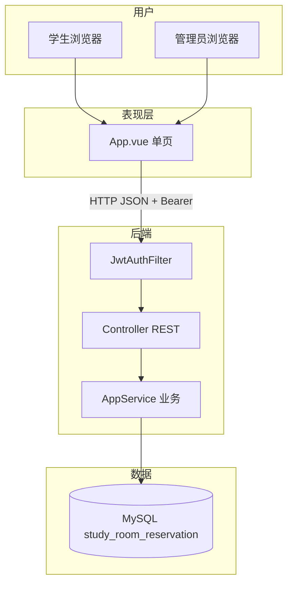
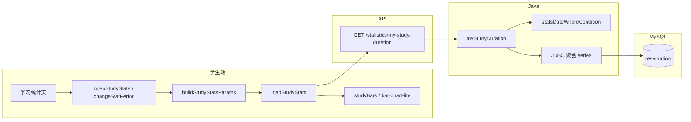
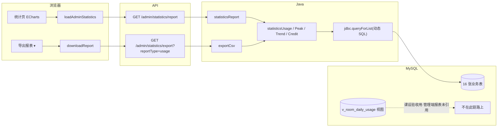

# 02 — 答辩讲解手册

> **演示实体**：小明 `202225220101`/`123456` · 小李（新注册） · 普管 `admin`/`admin123` · 超管 `superadmin`/`super123`  
> **仓库**：https://github.com/CZF312/CampusStudyRoomReservationManagementSystem  
> **演示账号**：学生 `202225220101`/`123456` · 普管 `admin`/`admin123` · 超管 `superadmin`/`super123`  
> **标签**：【演】浏览器操作 · 【讲】口述原理 · 【指】点行号（Lx 首行含 `【Fx-y】` 总体讲解）· **与 [01](01-项目理解指南.md#user-content-toc) 同 F 编号**  
> **说明**：正文由 01 同步生成，删去阅读约定与 AI 套话；定位表与行号与 01 一致。

## <a id="toc"></a>功能架构目录（根）

- **[F1 入门基础](#user-content-f1)**
  - [F1.1 环境启动](#user-content-f1-1)
  - [F1.2 技术概念（8 卡）](#user-content-f1-2)
- **[F2 认证与账号](#user-content-f2)**
  - [F2.1 学生登录](#user-content-f2-1)
  - [F2.2 管理员登录](#user-content-f2-2)
  - [F2.3 注册审核登录](#user-content-f2-3)
  - [F2.4 账号资料与安全](#user-content-f2-4)
- **[F3 自习室与预约](#user-content-f3)**
  - [F3.1 查座预约](#user-content-f3-1)
  - [F3.2 取消预约](#user-content-f3-2)
  - [F3.3 我的预约](#user-content-f3-3)
- **[F4 签到签退与信用](#user-content-f4)**
  - [F4.1 签到（学号 / 拍照 QR）](#user-content-f4-1)
  - [F4.2 签退与信用](#user-content-f4-2)
  - [F4.3 定时维护（无 UI）](#user-content-f4-3)
- **[F5 学生端辅助](#user-content-f5)**
  - [F5.1 学习统计（当期 / 往期）](#user-content-f5-1)
  - [F5.2 公告与通知](#user-content-f5-2)
  - [F5.3 问题反馈](#user-content-f5-3)
- **[F6 管理端](#user-content-f6)**
  - [F6.1 统计与 CSV 导出](#user-content-f6-1)
  - [F6.2 系统配置（超管）](#user-content-f6-2)
  - [F6.3 用户管理](#user-content-f6-3)
  - [F6.4 自习室与座位](#user-content-f6-4)
  - [F6.5 预约监管与违约撤销](#user-content-f6-5)
  - [F6.6 运营看板（实时预约）](#user-content-f6-6)
  - [F6.7 管理员与操作日志](#user-content-f6-7)
- **[F7 第三版与数据](#user-content-f7)**
  - [F7.1 数据库与 Java 分工](#user-content-f7-1)
  - [F7.2 第三版规范化](#user-content-f7-2)
  - [F7.3 前端状态 canonical](#user-content-f7-3)
  - [F7.4 十六张表](#user-content-f7-4)
- **[F8 附录：需求与代码差异](#user-content-f8)**

**页内跳转**：上列 `#user-content-f1-2` 等链接在 **GitHub 网页**可跳到对应节（须先运行 `sync_f_doc_anchors.py` 再推送）。  
**代码跳转**：表中 `blob/master/…/App.vue#L2290` 在 GitHub 打开对应行。

---

## <a id="module-overview"></a>模块总览

本系统按 **F1–F8 八大模块** 组织；每模块含若干 **子项（F x.y）**，各子项用一条 **功能链实例**（演示故事）串起前端 → API → Service → MySQL 全链路。阅读顺序建议：**模块总览（本节）→ 功能架构目录 → 具体 F 节 → 实现定位表 → 点 GitHub 行号看源码**。

### 架构分层（全项目统一）

| 层级 | 目录/技术 | 职责 | 典型 F 节 |
|------|-----------|------|-----------|
| **表现层** | `frontend/src/App.vue` · Element Plus · ECharts | 学生/管理 UI、表单、图表、JWT 存取 | F2–F6 大部分 |
| **静态资源** | `src/main/resources/static/` | Vite 构建产物，Spring Boot 同端口托管 | F1.1 |
| **接口层** | `controller/AppController.java` · `UploadController.java` | REST 路由、鉴权注解、参数绑定 | 各 F 节「Controller」行 |
| **业务层** | `service/AppService.java` · `ScheduledTaskService.java` | 业务规则、JDBC 动态 SQL、CSV 导出 | F3–F6 核心 |
| **配置/安全** | `config/JwtAuthFilter.java` · `application*.properties` | JWT 过滤、跨域、数据源 | F2 · F6.2 |
| **数据层** | `docs/06-部署配置/schema.sql` · MySQL 16 表 | 表结构、字典、视图 | F7 |
| **运维层** | `start.bat` · `scripts/start-system.ps1` | 一键建库、编译、启动 | F1.1 |



### 模块一览

| 模块 | 面向角色 | 核心职责 | 子项链接 |
|------|----------|----------|----------|
| **F1 入门基础** | 全员 / 新手 | 一键启动环境、八卡技术概念扫盲 | [F1.1 环境启动](#user-content-f1-1) · [F1.2 技术概念（8 卡）](#user-content-f1-2) |
| **F2 认证与账号** | 学生、管理员 | 登录注册、JWT 会话、资料改密 | [F2.1 学生登录](#user-content-f2-1) · [F2.2 管理员登录](#user-content-f2-2) · [F2.3 注册审核](#user-content-f2-3) · [F2.4 账号资料与安全](#user-content-f2-4) |
| **F3 自习室与预约** | 学生 | 查座预约、取消、我的预约列表 | [F3.1 查座预约](#user-content-f3-1) · [F3.2 取消预约](#user-content-f3-2) · [F3.3 我的预约](#user-content-f3-3) |
| **F4 签到签退与信用** | 学生、管理员 | 学号/QR 签到、签退、信用流水、定时违约 | [F4.1 签到](#user-content-f4-1) · [F4.2 签退与信用](#user-content-f4-2) · [F4.3 定时维护](#user-content-f4-3) |
| **F5 学生端辅助** | 学生 | 学习统计、公告通知、问题反馈 | [F5.1 学习统计](#user-content-f5-1) · [F5.2 公告与通知](#user-content-f5-2) · [F5.3 问题反馈](#user-content-f5-3) |
| **F6 管理端** | 管理员、超管 | 统计导出、配置、用户/房间/预约监管、看板、日志 | [F6.1](#user-content-f6-1) · [F6.2](#user-content-f6-2) · [F6.3](#user-content-f6-3) · [F6.4](#user-content-f6-4) · [F6.5](#user-content-f6-5) · [F6.6](#user-content-f6-6) · [F6.7](#user-content-f6-7) |
| **F7 第三版与数据** | 开发者 / 答辩 | DB 与 Java 分工、V3 字典、前端状态、16 表 | [F7.1](#user-content-f7-1) · [F7.2](#user-content-f7-2) · [F7.3](#user-content-f7-3) · [F7.4](#user-content-f7-4) |
| **F8 附录** | 答辩 / 验收 | 需求与代码差异、65 端点对照 | [F8 附录](#user-content-f8) |

---

---

## <a id="f1"></a>F1 入门基础

子项：[F1.1 环境启动](#user-content-f1-1) · [F1.2 技术概念](#user-content-f1-2)

---

### <a id="f1-1"></a>F1.1 环境启动

**功能链实例（一条龙）**  
组长双击 `start.bat` → PowerShell 导入 `database-full.sql` 建库 `study_room_reservation` → Spring Boot 监听 8080 → 浏览器打开登录页 → `verify-v3-dictionary.ps1` 输出 **PASS=17**。

#### 实现定位表

| 所属层 Layer | 定位（函数 · 路径 · 行号） | 原理 Principle |
| -------------- | --------------------------- | ---------------- |
| 运维脚本 · Ops | `start.bat` · 启动入口 · [L1-L31](https://github.com/CZF312/CampusStudyRoomReservationManagementSystem/blob/master/start.bat#L1-L31) | **链中位置**：用户双击后的 Windows 入口。**输入**：双击动作。**输出**：调用 `scripts\start-system.ps1` 并传递退出码。**上下游**：无代码上游；下游 PowerShell 建库与 Spring Boot。**设计原因**：bat 封装降低答辩环境差异。**注释导读**：L2–L3 为 `【F1-1】` 总体讲解；L4 起 `REM 【行】` 逐行说明每句 bat 职责。 |
| 运维脚本 · Ops | `start-system.ps1` · 系统启动脚本 · [L1-L15](https://github.com/CZF312/CampusStudyRoomReservationManagementSystem/blob/master/scripts/start-system.ps1#L1-L15) | **链中位置**：承接 `start.bat`，负责检测 Java/MySQL 环境并导入 `database-full.sql`。 **输入输出**：输入为 PowerShell 执行上下文； **上下游**：输出为数据库就绪与 Spring Boot 进程。 **设计原因**：上游来自 bat，下游触发 JDBC 初始化与 8080 监听。 **注释导读**：脚本层隔离环境差异，避免学生手动敲多条命令。 |
| 业务层 · Service | `DatabaseInitializer.run` · 数据库初始化 · [L14-L38](https://github.com/CZF312/CampusStudyRoomReservationManagementSystem/blob/master/src/main/java/com/scau/campusstudyroomreservationmanagementsystem/service/DatabaseInitializer.java#L14-L38) | **链中位置**：在 Spring Boot 首次启动时自动执行，对应故事中「导入 SQL 建库」的后端等价物。 **输入输出**：输入为 classpath 下 schema/seed； **上下游**：输出为 16 张表与初始数据。 **设计原因**：上游为应用启动事件，下游供所有 Service 读写。 **注释导读**：放在 Java 而非纯 SQL 脚本是为支持 V3 迁移与增量补丁。 |
| 应用入口 · Application | `main` · 主函数 · [L14-L16](https://github.com/CZF312/CampusStudyRoomReservationManagementSystem/blob/master/src/main/java/com/scau/campusstudyroomreservationmanagementsystem/CampusStudyRoomReservationManagementSystemApplication.java#L14-L16) | **链中位置**：功能链中「Spring Boot 监听 8080」的代码锚点。 **输入输出**：输入为 JVM 启动参数； **上下游**：输出为内嵌 Tomcat 托管 static 前端与 `/api` REST。 **设计原因**：上游依赖数据库已就绪，下游接受浏览器 HTTP。 **注释导读**：单 jar 部署简化课设验收。 |
| 运维脚本 · Ops | `verify-v3-dictionary.ps1` · 字典验收 · [L1-L20](https://github.com/CZF312/CampusStudyRoomReservationManagementSystem/blob/master/scripts/verify-v3-dictionary.ps1#L1-L20) | **链中位置**：对应故事末尾「PASS=17」验收步骤。 **输入输出**：输入为已运行的 MySQL 实例； **上下游**：输出为终端 PASS/FAIL 计数。 **设计原因**：上游在系统启动后人工执行，下游确认第三版中文枚举与表结构落地。 **注释导读**：独立脚本便于答辩前快速自检而不改业务代码。 |


[↑ 目录](#user-content-toc) · [↑ F1](#user-content-f1)

---

### <a id="f1-2"></a>F1.2 技术概念（8 卡）

**功能链实例**  
小明点「确认预约」→ 浏览器用 **Vue** 发 **HTTP** **JSON** 到 **REST API** → **Controller** 转 **Service** 写 **MySQL** → 返回 **JSON** `code:200`；登录后请求头带 **JWT token**。

#### 实现定位表


| 概念 Concept  | 实例                  | 路径 Path（英 · 中）· 行号跳转（Lx 含注释行）                                                                                                                                                                                                                    |
| ----------- | ------------------- | ------------------------------------------------------------------------------------------------------------------------------------------------------------------------------------------------------------------------------------------------ |
| Browser 浏览器 | 打开 8080 见登录框        | **链中位置**：`static/index.html` 入口页 · [L1-L14](https://github.com/CZF312/CampusStudyRoomReservationManagementSystem/blob/master/src/main/resources/static/index.html#L1-L14) **注释导读**：跳转首行为 `【Fx-y】` 总体讲解，块内每行带 `【行】` 中文注释。 |
| Vue 单页框架    | 点预约不换网址             | **链中位置**：`frontend/src/App.vue` · `studentPage` · [L1172-L1174](https://github.com/CZF312/CampusStudyRoomReservationManagementSystem/blob/master/frontend/src/App.vue#L1178-L1180) **注释导读**：跳转首行为 `【Fx-y】` 总体讲解，块内每行带 `【行】` 中文注释。 |
| HTTP 请求     | 幕后 POST JSON        | **链中位置**：`call` · 通用请求 · [L2452-L2455](https://github.com/CZF312/CampusStudyRoomReservationManagementSystem/blob/master/frontend/src/App.vue#L2452-L2455) **注释导读**：跳转首行为 `【Fx-y】` 总体讲解，块内每行带 `【行】` 中文注释。 |
| JSON 数据格式   | `{"code":200}`      | **链中位置**：`ApiResponse` · 统一响应 · [L4-L10](https://github.com/CZF312/CampusStudyRoomReservationManagementSystem/blob/master/src/main/java/com/scau/campusstudyroomreservationmanagementsystem/support/ApiResponse.java#L4-L10) **注释导读**：跳转首行为 `【Fx-y】` 总体讲解，块内每行带 `【行】` 中文注释。 |
| REST API    | `/api/reservations` | **链中位置**：`AppController.createReservation` · [L100-L105](https://github.com/CZF312/CampusStudyRoomReservationManagementSystem/blob/master/src/main/java/com/scau/campusstudyroomreservationmanagementsystem/controller/AppController.java#L100-L105) **注释导读**：跳转首行为 `【Fx-y】` 总体讲解，块内每行带 `【行】` 中文注释。 |
| Service 业务层 | 算预约规则               | **链中位置**：`AppService.createReservation` · [L316-L390](https://github.com/CZF312/CampusStudyRoomReservationManagementSystem/blob/master/src/main/java/com/scau/campusstudyroomreservationmanagementsystem/service/AppService.java#L316-L390) **注释导读**：跳转首行为 `【Fx-y】` 总体讲解，块内每行带 `【行】` 中文注释。 |
| MySQL 数据库   | reservation 多一行     | **链中位置**：`schema.sql` · `reservation` 表 · [L156-L181](https://github.com/CZF312/CampusStudyRoomReservationManagementSystem/blob/master/docs/06-部署配置/schema.sql#L156-L181) **注释导读**：跳转首行为 `【Fx-y】` 总体讲解，块内每行带 `【行】` 中文注释。 |
| JWT 令牌      | Header Bearer       | **链中位置**：`JwtAuthFilter` · JWT 过滤器 · [L18-L46](https://github.com/CZF312/CampusStudyRoomReservationManagementSystem/blob/master/src/main/java/com/scau/campusstudyroomreservationmanagementsystem/config/JwtAuthFilter.java#L18-L46) **注释导读**：跳转首行为 `【Fx-y】` 总体讲解，块内每行带 `【行】` 中文注释。 |


[↑ 目录](#user-content-toc) · [↑ F1](#user-content-f1)

---

## <a id="f2"></a>F2 认证与账号

子项：[F2.1](#user-content-f2-1) · [F2.2](#user-content-f2-2) · [F2.3](#user-content-f2-3)

---

### <a id="f2-1"></a>F2.1 学生登录

**功能链实例（一条龙）**  
小明在登录页输入 `202225220101` / `123456` → 点「登录」→ 首页显示「你好，小明」→ 再进「我的预约」无需重输密码（`localStorage` 已有 token）。

#### 实现定位表

| 所属层 Layer | 定位（函数 · 路径 · 行号） | 原理 Principle |
| -------------- | --------------------------- | ---------------- |
| 表现层 Presentation | `loginStudent` 模板区 · 学生登录表单 · `frontend/src/App.vue` · [L2457-L2472](https://github.com/CZF312/CampusStudyRoomReservationManagementSystem/blob/master/frontend/src/App.vue#L2457-L2472) | **链中位置**：在小明输入学号密码的功能链起点，Vue 模板绑定 `studentLogin` 对象。 **输入输出**：输入为用户键入的账号密码； **上下游**：输出为可点击的「登录」按钮与表单校验状态。 **设计原因**：上游为未登录态 `index.html` 入口，下游触发 `loginStudent()` 方法。 **注释导读**：表现层负责收集输入而不做密码校验，符合前后端分工。 |
| 表现层 Presentation | `loginStudent` · 学生登录 · `frontend/src/App.vue` · [L2457-L2472](https://github.com/CZF312/CampusStudyRoomReservationManagementSystem/blob/master/frontend/src/App.vue#L2457-L2472) | **链中位置**：小明点「登录」后，此方法组装 JSON 并 POST `/api/auth/login`。 **输入输出**：输入为表单字段； **上下游**：输出为 HTTP 请求与后续 `afterLogin` 回调。 **设计原因**：上游来自模板点击，下游到 Controller `login`。 **注释导读**：封装 `call()` 统一带 Content-Type 与错误 toast。 |
| 接口层 Controller | `login` · 学生登录接口 · `controller/AppController.java` · [L40-L42](https://github.com/CZF312/CampusStudyRoomReservationManagementSystem/blob/master/src/main/java/com/scau/campusstudyroomreservationmanagementsystem/controller/AppController.java#L40-L42) | **链中位置**：REST 入口，将 HTTP 体映射为 DTO 并转发 Service。 **输入输出**：输入为 POST JSON（studentId/password）； **上下游**：输出为 `ApiResponse` 包装的 token 与用户信息。 **设计原因**：上游为前端 POST，下游调用 `loginStudent` 业务。 **注释导读**：Controller 薄层设计便于 Swagger 与单元测试 Mock。 |
| 业务层 Service | `loginStudent` · 学生登录校验 · `service/AppService.java` · [L184-L207](https://github.com/CZF312/CampusStudyRoomReservationManagementSystem/blob/master/src/main/java/com/scau/campusstudyroomreservationmanagementsystem/service/AppService.java#L184-L207) | **链中位置**：故事核心：校验 BCrypt 密码并拒绝待审核/禁用/黑名单账号。 **输入输出**：输入为学号与明文密码； **上下游**：输出为 userId 与 role 或 403/401 异常。 **设计原因**：上游 Controller，下游 JwtService 签发 token。 **注释导读**：业务规则集中于此，避免 SQL 层散落权限判断。 |
| 配置层 Config | `createToken` · 签发令牌 · `config/JwtService.java` · [L28-L41](https://github.com/CZF312/CampusStudyRoomReservationManagementSystem/blob/master/src/main/java/com/scau/campusstudyroomreservationmanagementsystem/config/JwtService.java#L28-L41) | **链中位置**：登录成功后生成 JWT，使小明后续「我的预约」无需重输密码。 **输入输出**：输入为 userId/role 声明； **上下游**：输出为签名字符串 token。 **设计原因**：上游 Service 校验通过，下游返回前端写入 localStorage。 **注释导读**：JWT 无状态会话适合 SPA 单页应用。 |
| 表现层 Presentation | `afterLogin` · 登录后处理 · `frontend/src/App.vue` · [L2491-L2499](https://github.com/CZF312/CampusStudyRoomReservationManagementSystem/blob/master/frontend/src/App.vue#L2491-L2499) | **链中位置**：收到 token 后写入 `localStorage` 并切换 `studentPage` 到首页，对应「你好，小明」。 **输入输出**：输入为登录响应 JSON； **上下游**：输出为持久化 token 与 UI 路由态。 **设计原因**：上游 `loginStudent` 成功回调，下游所有需鉴权 API 的 `call()` 自动带 Bearer。 |
| 配置层 Config | `doFilterInternal` · JWT 过滤 · `config/JwtAuthFilter.java` · [L29-L47](https://github.com/CZF312/CampusStudyRoomReservationManagementSystem/blob/master/src/main/java/com/scau/campusstudyroomreservationmanagementsystem/config/JwtAuthFilter.java#L29-L47) | **链中位置**：小明再进「我的预约」时，每个 API 请求经此过滤器解析 Bearer token。 **输入输出**：输入为 HTTP Header； **上下游**：输出为 SecurityContext 中的 userId。 **设计原因**：上游 localStorage 存 token，下游 Controller 可 `@AuthenticationPrincipal`。 **注释导读**：过滤器统一鉴权，避免每个接口重复解析。 |
| 支撑层 Support | `ok` · 成功响应包装 · `support/ApiResponse.java` · [L7-L10](https://github.com/CZF312/CampusStudyRoomReservationManagementSystem/blob/master/src/main/java/com/scau/campusstudyroomreservationmanagementsystem/support/ApiResponse.java#L7-L10) | **链中位置**：统一 `{code:200, data:{token,...}}` 格式，前端 `call()` 只认 code。 **输入输出**：输入为业务数据对象； **上下游**：输出为 JSON 响应体。 **设计原因**：上游 Service 返回值，下游浏览器解析。 **注释导读**：统一包装简化前端错误处理与 F1.2 概念讲解。 |
| 表现层 Presentation | `bootstrap` · 刷新恢复会话 · `frontend/src/App.vue` · [L2564-L2581](https://github.com/CZF312/CampusStudyRoomReservationManagementSystem/blob/master/frontend/src/App.vue#L2564-L2581) | **链中位置**：页面刷新时用旧 token 调 GET `/auth/me` 恢复「小明仍登录」状态。 **输入输出**：输入为 localStorage token； **上下游**：输出为重新填充 user 对象或清 token 回登录页。 **设计原因**：上游应用 mounted，下游 `me` 接口。 **注释导读**：避免刷新掉线，提升演示体验。 |
| 接口层 Controller | `me` · 当前用户接口 · `controller/AppController.java` · [L52-L54](https://github.com/CZF312/CampusStudyRoomReservationManagementSystem/blob/master/src/main/java/com/scau/campusstudyroomreservationmanagementsystem/controller/AppController.java#L52-L54) | **链中位置**：根据 JWT 中的 userId 返回学生/管理员资料。 **输入输出**：输入为 Bearer token（过滤器已解析）； **上下游**：输出为 profile DTO。 **设计原因**：上游 JwtAuthFilter，下游前端渲染用户名。 **注释导读**：只读接口，安全且轻量。 |


[↑ 目录](#user-content-toc) · [↑ F2](#user-content-f2) · 并列：[F2.2](#user-content-f2-2) · [F2.3](#user-content-f2-3) · [F2.4](#user-content-f2-4)

---

### <a id="f2-2"></a>F2.2 管理员登录

**功能链实例（一条龙）**  
管理员切到「管理员登录」→ 输入 `admin` / `admin123` → 进入管理端签到页；`superadmin` 侧栏额外显示「设置」「管理员管理」。

#### 实现定位表

| 所属层 Layer | 定位（函数 · 路径 · 行号） | 原理 Principle |
| -------------- | --------------------------- | ---------------- |
| 表现层 Presentation | 管理员登录模板 · admin login template · `frontend/src/App.vue` · [L28-L41](https://github.com/CZF312/CampusStudyRoomReservationManagementSystem/blob/master/frontend/src/App.vue#L28-L41) | **链中位置**：管理员切到「管理员登录」Tab 时的表单 UI，绑定 `adminLogin` 与 `loginRole='admin'`。 **输入输出**：输入为 admin 账号密码； **上下游**：输出为登录按钮。 **设计原因**：上游为公共登录页，下游 `loginAdmin()`。 **注释导读**：与学生表单分离，避免混用 API 路径。 |
| 表现层 Presentation | `loginAdmin` · 管理员登录 · `frontend/src/App.vue` · [L2474-L2489](https://github.com/CZF312/CampusStudyRoomReservationManagementSystem/blob/master/frontend/src/App.vue#L2474-L2489) | **链中位置**：输入 `admin`/`admin123` 后 POST `/api/admin/auth/login`。 **输入输出**：输入为管理员凭证； **上下游**：输出为 token 与 admin 资料。 **设计原因**：上游模板提交，下游 `adminLogin` Controller。 **注释导读**：独立端点便于后端区分学生/管理员权限链。 |
| 接口层 Controller | `adminLogin` · 管理员登录接口 · `controller/AppController.java` · [L46-L48](https://github.com/CZF312/CampusStudyRoomReservationManagementSystem/blob/master/src/main/java/com/scau/campusstudyroomreservationmanagementsystem/controller/AppController.java#L46-L48) | **链中位置**：映射 `/admin/auth/login`，转发 `loginAdmin` Service。 **输入输出**：输入 POST JSON； **上下游**：输出含 role（ADMIN/SUPER_ADMIN）的 token。 **设计原因**：上游前端 POST，下游业务校验 `admin_account` 表。 **注释导读**：独立登录入口是管理端安全边界。 |
| 业务层 Service | `loginAdmin` · 管理员校验 · `service/AppService.java` · [L209-L224](https://github.com/CZF312/CampusStudyRoomReservationManagementSystem/blob/master/src/main/java/com/scau/campusstudyroomreservationmanagementsystem/service/AppService.java#L209-L224) | **链中位置**：查 `admin_account` 表校验 BCrypt，区分 SUPER_ADMIN 与普管。 **输入输出**：输入 username/password； **上下游**：输出 adminId 与 role 或 401。 **设计原因**：上游 Controller，下游 JWT 签发。 **注释导读**：角色写入 token 供后续菜单与数据范围控制。 |
| 表现层 Presentation | `isSuperAdmin` · 超管判断 · `frontend/src/App.vue` · [L1612-L1613](https://github.com/CZF312/CampusStudyRoomReservationManagementSystem/blob/master/frontend/src/App.vue#L1618-L1619) | **链中位置**：对应故事中 superadmin 侧栏额外显示「设置」「管理员管理」。 **输入输出**：输入为当前 user.role； **上下游**：输出为布尔控制 `v-if`。 **设计原因**：上游 `afterLogin` 写入 role，下游各超管专属菜单。 **注释导读**：前端按 role 隐藏入口，后端仍须二次校验。 |


[↑ 目录](#user-content-toc) · [↑ F2](#user-content-f2)

---

### <a id="f2-3"></a>F2.3 注册审核登录

**功能链实例（一条龙）**  
小李注册并上传 PDF 材料 → 尝试登录得「注册资料待审核」→ 管理员在用户管理点「通过」→ 小李再登录进入首页。

#### 实现定位表

| 所属层 Layer | 定位（函数 · 路径 · 行号） | 原理 Principle |
| -------------- | --------------------------- | ---------------- |
| 表现层 Presentation | `onRegisterFile` · 注册材料上传 · `frontend/src/App.vue` · [L2435-L2450](https://github.com/CZF312/CampusStudyRoomReservationManagementSystem/blob/master/frontend/src/App.vue#L2435-L2450) | **链中位置**：小李注册链第一步：选择 PDF 材料并暂存 file 对象。 **输入输出**：输入为 `<input type=file>`； **上下游**：输出为 `registerForm.materialPath` 预览名。 **设计原因**：上游注册表单，下游 `register()` 随 Multipart 提交。 **注释导读**：前端先上传再注册，避免大文件塞进 JSON。 |
| 接口层 Controller | `registerUpload` · 注册上传接口 · `controller/UploadController.java` · [L32-L34](https://github.com/CZF312/CampusStudyRoomReservationManagementSystem/blob/master/src/main/java/com/scau/campusstudyroomreservationmanagementsystem/controller/UploadController.java#L32-L34) | **链中位置**：接收 PDF 并存入 `uploads/material/` 目录。 **输入输出**：输入 Multipart 文件； **上下游**：输出相对路径 URL。 **设计原因**：上游前端上传，下游注册时引用该路径。 **注释导读**：独立 UploadController 分离静态文件 IO 与业务 Controller。 |
| 表现层 Presentation | `register` · 提交注册 · `frontend/src/App.vue` · [L2501-L2554](https://github.com/CZF312/CampusStudyRoomReservationManagementSystem/blob/master/frontend/src/App.vue#L2501-L2554) | **链中位置**：小李填完信息点注册，POST `/api/auth/register`。 **输入输出**：输入为学号、密码、学院等 + 材料路径； **上下游**：输出为成功 toast 或错误提示。 **设计原因**：上游表单校验，下游 Controller。 **注释导读**：一次提交完成账号创建请求。 |
| 接口层 Controller | `register` · 注册接口 · `controller/AppController.java` · [L34-L36](https://github.com/CZF312/CampusStudyRoomReservationManagementSystem/blob/master/src/main/java/com/scau/campusstudyroomreservationmanagementsystem/controller/AppController.java#L34-L36) | **链中位置**：REST 入口转发 Service 注册逻辑。 **输入输出**：输入 RegisterDTO； **上下游**：输出 200 或校验错误。 **设计原因**：上游前端 POST，下游 `AppService.register`。 **注释导读**：薄 Controller 保持 DTO 映射单一职责。 |
| 业务层 Service | `register` · 注册入库 · `service/AppService.java` · [L163-L182](https://github.com/CZF312/CampusStudyRoomReservationManagementSystem/blob/master/src/main/java/com/scau/campusstudyroomreservationmanagementsystem/service/AppService.java#L163-L182) | **链中位置**：写入 `user_account` 且 auditStatus=待审核、credit=300。 **输入输出**：输入为注册 DTO； **上下游**：输出为新 userId。 **设计原因**：上游 Controller，下游等待管理员审核。 **注释导读**：初始信用 300 与待审核态是业务规则核心。 |
| 业务层 Service | `loginStudent` 待审核分支 · `service/AppService.java` · [L184-L207](https://github.com/CZF312/CampusStudyRoomReservationManagementSystem/blob/master/src/main/java/com/scau/campusstudyroomreservationmanagementsystem/service/AppService.java#L184-L207) | **链中位置**：小李尝试登录时返回 403「注册资料待审核」。 **输入输出**：输入为正确密码但 auditStatus≠已通过； **上下游**：输出 BusinessException。 **设计原因**：上游登录请求，下游前端 toast。 **注释导读**：在 Service 拦截而非 DB 层，便于返回明确中文提示。 |
| 表现层 Presentation | `approve` · 审核通过 · `frontend/src/App.vue` · [L2938-L2946](https://github.com/CZF312/CampusStudyRoomReservationManagementSystem/blob/master/frontend/src/App.vue#L2938-L2946) | **链中位置**：管理员在用户管理点「通过」，POST `…/approve`。 **输入输出**：输入为 userId； **上下游**：输出为列表刷新。 **设计原因**：上游 F6.3 用户管理页，下游 `auditUser` Service。 **注释导读**：管理端操作触发学生端登录解锁。 |
| 业务层 Service | `auditUser` · 用户审核 · `service/AppService.java` · [L746-L754](https://github.com/CZF312/CampusStudyRoomReservationManagementSystem/blob/master/src/main/java/com/scau/campusstudyroomreservationmanagementsystem/service/AppService.java#L746-L754) | **链中位置**：将 auditStatus 改为已通过、账号状态正常。 **输入输出**：输入 userId + 审核动作； **上下游**：输出更新行数。 **设计原因**：上游管理员 approve，下游小李可走 F2.1 登录链。 **注释导读**：写 operation_log 留痕（见 F6.7）。 |
| — | 同 [F2.1](#user-content-f2-1) 学生登录全链 · `loginStudent` → JWT → `afterLogin` | **链中位置**：小李再次登录时复用 F2.1 完整认证链：校验密码 → 签发 token → 首页「你好，小李」。 **输入输出**：输入输出与 F2.1 相同，差异在于 auditStatus 已通过。 **上下游**：设计为同一登录 API，审核态仅影响 Service 分支。 |


[↑ 目录](#user-content-toc) · [↑ F2](#user-content-f2)

---

### <a id="f2-4"></a>F2.4 账号资料与安全

**功能链实例**  
小明在「我的 → 设置」改密码 → 成功后强制退出 → 用新密码再登录；或在个人资料里改学院/专业。

#### 实现定位表

| 所属层 Layer | 定位（函数 · 路径 · 行号） | 原理 Principle |
| -------------- | --------------------------- | ---------------- |
| 表现层 Presentation | `submitChangePassword` · 提交改密 · `App.vue` · [L2961-L2983](https://github.com/CZF312/CampusStudyRoomReservationManagementSystem/blob/master/frontend/src/App.vue#L2961-L2983) | **链中位置**：小明在「我的 → 设置」输入原密码与新密码并提交。 **输入输出**：输入为表单三字段； **上下游**：输出 POST 请求或前端格式校验 toast。 **设计原因**：上游设置页模板，下游 change-password API。 **注释导读**：前端校验 6–20 位含字母数字，减少无效请求。 |
| 接口层 Controller | `changePassword` · 改密接口 · `AppController.java` · [L58-L62](https://github.com/CZF312/CampusStudyRoomReservationManagementSystem/blob/master/src/main/java/com/scau/campusstudyroomreservationmanagementsystem/controller/AppController.java#L58-L62) | **链中位置**：POST `/auth/change-password`，需 JWT 鉴权。 **输入输出**：输入 old/new password DTO； **上下游**：输出 200。 **设计原因**：上游前端提交，下游 Service BCrypt 校验。 **注释导读**：改密属敏感操作，必须带 token 识别当前用户。 |
| 业务层 Service | `changePassword` · 改密校验 · `AppService.java` · [L623-L653](https://github.com/CZF312/CampusStudyRoomReservationManagementSystem/blob/master/src/main/java/com/scau/campusstudyroomreservationmanagementsystem/service/AppService.java#L623-L653) | **链中位置**：校验原密码 BCrypt 匹配后写入新哈希，成功后故事要求强制退出。 **输入输出**：输入 userId + 密码对； **上下游**：输出 void 或 400。 **设计原因**：上游 Controller，下游前端清 token 重登。 **注释导读**：服务端二次校验原密码防 token 被盗后直接改密。 |
| 表现层 Presentation | `saveProfile` · 保存资料 · `App.vue` · [L2665-L2670](https://github.com/CZF312/CampusStudyRoomReservationManagementSystem/blob/master/frontend/src/App.vue#L2665-L2670) | **链中位置**：小明在个人资料改学院/专业并保存。 **输入输出**：输入 profile 表单； **上下游**：输出 PUT `/auth/profile` 请求。 **设计原因**：上游资料编辑 UI，下游 Controller。 **注释导读**：与改密分离，普通资料变更不需重登。 |
| 接口层 Controller | `profile` PUT · 更新资料 · `AppController.java` · [L65-L67](https://github.com/CZF312/CampusStudyRoomReservationManagementSystem/blob/master/src/main/java/com/scau/campusstudyroomreservationmanagementsystem/controller/AppController.java#L65-L67) | **链中位置**：映射 PUT profile，转发 updateProfile。 **输入输出**：输入 ProfileDTO； **上下游**：输出更新后资料。 **设计原因**：上游 saveProfile，下游 Service 写 student_profile 表。 **注释导读**：RESTful 动词区分读（GET me）与写（PUT profile）。 |
| 业务层 Service | `updateProfile` · 写 profile · `AppService.java` · [L1521-L1537](https://github.com/CZF312/CampusStudyRoomReservationManagementSystem/blob/master/src/main/java/com/scau/campusstudyroomreservationmanagementsystem/service/AppService.java#L1521-L1537) | **链中位置**：更新 `student_profile` 学院/专业/电话等字段。 **输入输出**：输入 userId + DTO； **上下游**：输出持久化行。 **设计原因**：上游 Controller，下游前端刷新展示。 **注释导读**：扩展信息与账号表分离，符合第三版表设计。 |


[↑ 目录](#user-content-toc) · [↑ F2](#user-content-f2)

---

## <a id="f3"></a>F3 自习室与预约

子项：[F3.1](#user-content-f3-1) · [F3.2](#user-content-f3-2) · [F3.3](#user-content-f3-3)

---

### <a id="f3-1"></a>F3.1 查座预约

**功能链实例（一条龙）**  
小明登录 → 预约 Tab → 选明天 **14:00–16:00** → 座位图点绿色 **A-12** → 确认 → 提示成功，状态「待使用」；库中 `reservation` 一行 + 多条 `reservation_slot`（10 分钟一格）。

#### 实现定位表

| 所属层 Layer | 定位（函数 · 路径 · 行号） | 原理 Principle |
| -------------- | --------------------------- | ---------------- |
| 表现层 Presentation | 预约页模板 · reservation template · `frontend/src/App.vue` · [L100-L161](https://github.com/CZF312/CampusStudyRoomReservationManagementSystem/blob/master/frontend/src/App.vue#L100-L161) | **链中位置**：小明登录后进入预约 Tab 的完整 UI：`studentPage='reservation'`。 **输入输出**：输入为用户选室、时段、座位交互； **上下游**：输出为绑定 `reservationForm` 与座位图。 **设计原因**：上游 F2 登录态，下游 loadAvailableSeats/createReservation。 **注释导读**：单页切换不换 URL，符合 F1.2 Vue 讲解。 |
| 接口层 Controller | `rooms` · 自习室列表 · `controller/AppController.java` · [L80-L82](https://github.com/CZF312/CampusStudyRoomReservationManagementSystem/blob/master/src/main/java/com/scau/campusstudyroomreservationmanagementsystem/controller/AppController.java#L80-L82) | **链中位置**：GET `/api/rooms` 返回可选自习室。 **输入输出**：输入为 JWT（可选筛选）； **上下游**：输出 room 列表 JSON。 **设计原因**：上游预约页 mounted，下游前端填充下拉。 **注释导读**：先拉室列表再查座，减少无效座位查询。 |
| 表现层 Presentation | 快捷时段 · quick time slots · `frontend/src/App.vue` · [L113-L117](https://github.com/CZF312/CampusStudyRoomReservationManagementSystem/blob/master/frontend/src/App.vue#L113-L117) | **链中位置**：对应故事「选明天 14:00–16:00」的快捷按钮。 **输入输出**：输入为点击事件； **上下游**：输出写入 start/end 时间字段。 **设计原因**：上游用户选日期，下游触发 loadAvailableSeats。 **注释导读**：快捷项降低手动输入错误。 |
| 表现层 Presentation | `loadAvailableSeats` · 加载可用座 · `frontend/src/App.vue` · [L2588-L2594](https://github.com/CZF312/CampusStudyRoomReservationManagementSystem/blob/master/frontend/src/App.vue#L2588-L2594) | **链中位置**：按 roomId+时段 GET `/seats/available`，刷新绿色可点座位。 **输入输出**：输入为 reservationForm 时间与室； **上下游**：输出 seats 数组渲染座位图。 **设计原因**：上游时段/室变更，下游用户点 A-12。 **注释导读**：前端只展示 available=true 的座，体验直观。 |
| 接口层 Controller | `availableSeats` · 可用座接口 · `controller/AppController.java` · [L96-L101](https://github.com/CZF312/CampusStudyRoomReservationManagementSystem/blob/master/src/main/java/com/scau/campusstudyroomreservationmanagementsystem/controller/AppController.java#L96-L101) | **链中位置**：映射 GET available，转发 Service 聚合查询。 **输入输出**：输入 query 参数 roomId/start/end； **上下游**：输出座位 DTO 列表。 **设计原因**：上游 loadAvailableSeats，下游 availableSeats 业务。 **注释导读**：Controller 只做参数绑定。 |
| 业务层 Service | `availableSeats` · 可用座查询 · `service/AppService.java` · [L283-L313](https://github.com/CZF312/CampusStudyRoomReservationManagementSystem/blob/master/src/main/java/com/scau/campusstudyroomreservationmanagementsystem/service/AppService.java#L283-L313) | **链中位置**：SQL 排除已被 reservation_slot 占用的座位。 **输入输出**：输入 roomId+时间窗； **上下游**：输出每座 available 标记。 **设计原因**：上游 Controller，下游前端座位图着色。 **注释导读**：在 Service 算可用性，规则与 createReservation 一致。 |
| 表现层 Presentation | `createReservation` · 提交预约 · `frontend/src/App.vue` · [L2640-L2650](https://github.com/CZF312/CampusStudyRoomReservationManagementSystem/blob/master/frontend/src/App.vue#L2640-L2650) | **链中位置**：小明点绿色 A-12 后确认，POST `/api/reservations`。 **输入输出**：输入 seatId+时段； **上下游**：输出成功 toast 或错误。 **设计原因**：上游座位点击，下游 Controller。 **注释导读**：一次 POST 完成预约创建请求。 |
| 接口层 Controller | `createReservation` · 创建预约接口 · `controller/AppController.java` · [L105-L108](https://github.com/CZF312/CampusStudyRoomReservationManagementSystem/blob/master/src/main/java/com/scau/campusstudyroomreservationmanagementsystem/controller/AppController.java#L105-L108) | **链中位置**：REST POST 入口，绑定 CreateReservationDTO。 **输入输出**：输入 JSON body； **上下游**：输出 reservationId。 **设计原因**：上游前端 POST，下游 Service 事务写库。 **注释导读**：F1.2 八卡 REST 示例锚点。 |
| 业务层 Service | `createReservation` 校验段 · `service/AppService.java` · [L319-L390](https://github.com/CZF312/CampusStudyRoomReservationManagementSystem/blob/master/src/main/java/com/scau/campusstudyroomreservationmanagementsystem/service/AppService.java#L319-L390) | **链中位置**：校验信用≥阈值、当日次数、时长≤配置、时段不重叠。 **输入输出**：输入 userId+seat+时间； **上下游**：输出 void 或 BusinessException。 **设计原因**：上游 Controller，下游写 reservation。 **注释导读**：规则读 `system_config.json`，见 F6.2。 |
| 业务层 Service | `createReservation` 写 reservation · `service/AppService.java` · [L319-L390](https://github.com/CZF312/CampusStudyRoomReservationManagementSystem/blob/master/src/main/java/com/scau/campusstudyroomreservationmanagementsystem/service/AppService.java#L319-L390) | **链中位置**：INSERT reservation 行，status=待使用。 **输入输出**：输入校验通过的 DTO； **上下游**：输出 reservationId。 **设计原因**：上游校验段，下游写 slot。 **注释导读**：主表存预约元数据，与 slot 分表便于按 10 分钟格防双占。 |
| 业务层 Service | `createReservation` 写 slot · `service/AppService.java` · [L319-L390](https://github.com/CZF312/CampusStudyRoomReservationManagementSystem/blob/master/src/main/java/com/scau/campusstudyroomreservationmanagementsystem/service/AppService.java#L319-L390) | **链中位置**：按 10 分钟切分 INSERT reservation_slot，触发 uk_seat_slot。 **输入输出**：输入 reservationId+时间窗； **上下游**：输出多条 slot 或 DuplicateKeyException。 **设计原因**：上游写主表，下游返回前端/409。 **注释导读**：DB 唯一索引兜底并发双占，见 F7.1。 |
| 业务层 Service | `createReservation` 返回 · `service/AppService.java` · [L319-L390](https://github.com/CZF312/CampusStudyRoomReservationManagementSystem/blob/master/src/main/java/com/scau/campusstudyroomreservationmanagementsystem/service/AppService.java#L319-L390) | **链中位置**：发站内通知并返回 reservation DTO，故事提示成功且状态「待使用」。 **输入输出**：输入 reservationId； **上下游**：输出 ApiResponse data。 **设计原因**：上游 slot 写入成功，下游前端跳签到 Tab。 **注释导读**：notifyUser 衔接 F5.2 通知链。 |


配置：`system_config.json` · [L1-L10](https://github.com/CZF312/CampusStudyRoomReservationManagementSystem/blob/master/system_config.json#L1-L10)

[↑ 目录](#user-content-toc) · [↑ F3](#user-content-f3) · 并列：[F3.2](#user-content-f3-2)

---

### <a id="f3-2"></a>F3.2 取消预约

**功能链实例（一条龙）**  
小明在「我的预约」取消一条「待使用」→ 状态「已取消」→ 信用 **−50**（`credit_cancel_penalty`）→ `reservation_slot` 释放。

#### 实现定位表

| 所属层 Layer | 定位（函数 · 路径 · 行号） | 原理 Principle |
| -------------- | --------------------------- | ---------------- |
| 表现层 Presentation | `cancelReservation` · 取消预约 · `frontend/src/App.vue` · [L2656-L2660](https://github.com/CZF312/CampusStudyRoomReservationManagementSystem/blob/master/frontend/src/App.vue#L2656-L2660) | **链中位置**：小明在「我的预约」对「待使用」条目点取消，POST `…/cancel`。 **输入输出**：输入 reservationId； **上下游**：输出列表刷新与 toast。 **设计原因**：上游 F3.3 列表 UI，下游 cancel API。 **注释导读**：仅待使用可取消，前端按钮与后端校验一致。 |
| 接口层 Controller | `cancel` · 取消接口 · `controller/AppController.java` · [L125-L128](https://github.com/CZF312/CampusStudyRoomReservationManagementSystem/blob/master/src/main/java/com/scau/campusstudyroomreservationmanagementsystem/controller/AppController.java#L125-L128) | **链中位置**：映射 POST cancel，转发 Service。 **输入输出**：输入 path id + JWT userId； **上下游**：输出 200。 **设计原因**：上游 cancelReservation，下游 cancelReservation 业务。 **注释导读**：REST 子资源动词表达取消语义。 |
| 业务层 Service | `cancelReservation` 校验+扣分释放 · `service/AppService.java` · [L432-L445](https://github.com/CZF312/CampusStudyRoomReservationManagementSystem/blob/master/src/main/java/com/scau/campusstudyroomreservationmanagementsystem/service/AppService.java#L432-L445) | **链中位置**：故事结果：status→已取消、信用 **−50**（`credit_cancel_penalty`）、releaseSlots 释放 slot。 **输入输出**：输入 reservationId+userId； **上下游**：输出更新行与 credit_log。 **设计原因**：上游 Controller，下游 F3.3 列表不再显示可签到。 **注释导读**：扣分写 credit_log 衔接 F4.2 信用页。 |


[↑ 目录](#user-content-toc) · [↑ F3](#user-content-f3)

---

### <a id="f3-3"></a>F3.3 我的预约

**功能链实例**  
小明在「我的 → 我的预约」按 Tab 筛「待使用」→ 看到刚约的 A-12；管理员签到后，签到页每 2 秒轮询同一接口，状态自动变「使用中」。

#### 实现定位表

| 所属层 Layer | 定位（函数 · 路径 · 行号） | 原理 Principle |
| -------------- | --------------------------- | ---------------- |
| 表现层 Presentation | 我的预约模板 · myres · `App.vue` · [L232-L237](https://github.com/CZF312/CampusStudyRoomReservationManagementSystem/blob/master/frontend/src/App.vue#L232-L237) | **链中位置**：小明在「我的 → 我的预约」按 Tab 筛「待使用」的列表 UI。 **输入输出**：输入 Tab 切换； **上下游**：输出 filtered 列表与 ReservationCard。 **设计原因**：上游导航 myres，下游 loadReservations。 **注释导读**：Tab 与 status 映射复用 F7.3 canonical。 |
| 表现层 Presentation | `loadReservations` · 加载列表 · `App.vue` · [L2652-L2654](https://github.com/CZF312/CampusStudyRoomReservationManagementSystem/blob/master/frontend/src/App.vue#L2652-L2654) | **链中位置**：GET `/reservations/my` 拉取小明全部预约。 **输入输出**：输入 status/today 查询参数； **上下游**：输出 reservations 数组。 **设计原因**：上游 Tab 变更或页面进入，下游模板渲染 A-12。 **注释导读**：统一列表 API 供学生端与管理端轮询复用。 |
| 接口层 Controller | `myReservations` · 我的预约 API · `AppController.java` · [L112-L116](https://github.com/CZF312/CampusStudyRoomReservationManagementSystem/blob/master/src/main/java/com/scau/campusstudyroomreservationmanagementsystem/controller/AppController.java#L112-L116) | **链中位置**：可按 status/today 过滤返回当前用户预约。 **输入输出**：输入 JWT + query； **上下游**：输出 DTO 列表。 **设计原因**：上游 loadReservations，下游 Service SQL。 **注释导读**：过滤在服务端做，减少前端泄露他人数据风险。 |
| 表现层 Presentation | `syncCheckinStateFromServer` · 签到页轮询 · `App.vue` · [L1985-L2003](https://github.com/CZF312/CampusStudyRoomReservationManagementSystem/blob/master/frontend/src/App.vue#L1985-L2003) | **链中位置**：管理员签到后，学生签到页每 2s 轮询同一 my 接口，状态自动变「使用中」。 **输入输出**：输入 timer； **上下游**：输出 UI 状态刷新。 **设计原因**：上游 F4.1 管理员 scanCheckin，下游 F6.6 看板同源数据。 **注释导读**：轮询简单可靠，课设未上 WebSocket。 |


[↑ 目录](#user-content-toc) · [↑ F3](#user-content-f3)

---

## <a id="f4"></a>F4 签到签退与信用

子项：[F4.1](#user-content-f4-1) · [F4.2](#user-content-f4-2) · [F4.3](#user-content-f4-3)

---

### <a id="f4-1"></a>F4.1 签到（学号 / 拍照 QR）

**功能链实例（一条龙）**  
小明签到 Tab 显示学号 **202225220101** 与 QR → 管理员输入学号（或拍照 jsQR 识别）→ 预约变「使用中」→ 信用 **+5**。

#### 实现定位表

| 所属层 Layer | 定位（函数 · 路径 · 行号） | 原理 Principle |
| -------------- | --------------------------- | ---------------- |
| 表现层 Presentation | 签到页模板 · checkin template · `frontend/src/App.vue` · [L164-L201](https://github.com/CZF312/CampusStudyRoomReservationManagementSystem/blob/master/frontend/src/App.vue#L164-L201) | **链中位置**：小明签到 Tab 展示待使用预约、学号与 QR 区域。 **输入输出**：输入为当前 reservation 列表； **上下游**：输出为签到指引 UI。 **设计原因**：上游 F3.1 预约成功跳转，下游 refreshCheckinQr。 **注释导读**：学生端只展示信息，实际扫码在管理端完成。 |
| 表现层 Presentation | `refreshCheckinQr` · 刷新签到码 · `frontend/src/App.vue` · [L3249-L3260](https://github.com/CZF312/CampusStudyRoomReservationManagementSystem/blob/master/frontend/src/App.vue#L3249-L3260) | **链中位置**：将学号 **202225220101** 渲染为 SVG QR。 **输入输出**：输入 studentId； **上下游**：输出 DOM 内嵌 QR。 **设计原因**：上游签到页 mounted，下游管理员 jsQR/手输识别。 **注释导读**：本地生成 QR 避免额外 API（F8 记 `/checkin/qrcode` 未用）。 |
| 表现层 Presentation | `createQrSvg` · 生成二维码 · `frontend/src/qr.js` · [L10-L18](https://github.com/CZF312/CampusStudyRoomReservationManagementSystem/blob/master/frontend/src/qr.js#L10-L18) | **链中位置**：纯文本学号转 SVG 矩阵，无网络依赖。 **输入输出**：输入字符串； **上下游**：输出 SVG markup。 **设计原因**：上游 refreshCheckinQr，下游浏览器展示。 **注释导读**：轻量 js 模块，符合「拍照/选图识别学号」设计而非视频流。 |
| 表现层 Presentation | `scanCheckin` · 管理员学号签到 · `frontend/src/App.vue` · [L3094-L3120](https://github.com/CZF312/CampusStudyRoomReservationManagementSystem/blob/master/frontend/src/App.vue#L3094-L3120) | **链中位置**：管理员输入学号点签到，POST `/admin/checkin/scan`。 **输入输出**：输入 studentId 字符串； **上下游**：输出成功 toast 与列表刷新。 **设计原因**：上游管理端签到页，下游 scan Controller。 **注释导读**：学号输入与拍照扫码共用同一 API。 |
| 表现层 Presentation | `triggerPhotoScan` / `onScanPhotoSelected` · 拍照扫码 · `frontend/src/App.vue` · [L3211-L3247](https://github.com/CZF312/CampusStudyRoomReservationManagementSystem/blob/master/frontend/src/App.vue#L3211-L3247) · [L3211-L3247](https://github.com/CZF312/CampusStudyRoomReservationManagementSystem/blob/master/frontend/src/App.vue#L3211-L3247) | **链中位置**：管理员选图或拍照，jsQR 解码学号后调 scanCheckin。 **输入输出**：输入图片文件； **上下游**：输出解析出的 studentId。 **设计原因**：上游拍照按钮，下游与手输共用 scan 链。 **注释导读**：选型为静态图解码，降低浏览器权限与课设复杂度。 |
| 接口层 Controller | `scan` · 签到扫描接口 · `controller/AppController.java` · [L332-L335](https://github.com/CZF312/CampusStudyRoomReservationManagementSystem/blob/master/src/main/java/com/scau/campusstudyroomreservationmanagementsystem/controller/AppController.java#L332-L335) | **链中位置**：POST `/admin/checkin/scan`，需管理员 JWT。 **输入输出**：输入 studentId； **上下游**：输出 checkin 结果 DTO。 **设计原因**：上游前端 scanCheckin/拍照，下游 scanCheckin Service。 **注释导读**：管理端专用路径，学生不能自签。 |
| 业务层 Service | `scanCheckin` 找预约+权限 · `service/AppService.java` · [L989-L1057](https://github.com/CZF312/CampusStudyRoomReservationManagementSystem/blob/master/src/main/java/com/scau/campusstudyroomreservationmanagementsystem/service/AppService.java#L989-L1057) | **链中位置**：找当日待使用预约，窗口 ±15min，普管限本室。 **输入输出**：输入 studentId+adminId； **上下游**：输出 reservation 或 404/403。 **设计原因**：上游 Controller，下游写记录。 **注释导读**：时间窗防过早/过晚签到，室权限防跨室代签。 |
| 业务层 Service | `scanCheckin` 写记录+加分 · `service/AppService.java` · [L989-L1057](https://github.com/CZF312/CampusStudyRoomReservationManagementSystem/blob/master/src/main/java/com/scau/campusstudyroomreservationmanagementsystem/service/AppService.java#L989-L1057) | **链中位置**：故事结果：status→使用中、写 checkin_record、信用 **+5**。 **输入输出**：输入 reservationId； **上下游**：输出 checkin DTO。 **设计原因**：上游权限校验通过，下游 F3.3 轮询/F6.6 看板见「使用中」。 **注释导读**：加分写 credit_log 供 F4.2/F5.1 统计。 |


[↑ 目录](#user-content-toc) · [↑ F4](#user-content-f4)

---

### <a id="f4-2"></a>F4.2 签退与信用

**功能链实例（一条龙）**  
小明使用中点「签退」→ 确认 → 预约「已完成」→ 信用页看到签到 +5 流水与当前分数。

#### 实现定位表

| 所属层 Layer | 定位（函数 · 路径 · 行号） | 原理 Principle |
| -------------- | --------------------------- | ---------------- |
| 表现层 Presentation | `confirmCheckout` · 签退确认 · `frontend/src/App.vue` · [L2393-L2397](https://github.com/CZF312/CampusStudyRoomReservationManagementSystem/blob/master/frontend/src/App.vue#L2393-L2397) | **链中位置**：小明「使用中」点签退时弹出确认框。 **输入输出**：输入点击事件； **上下游**：输出 modal 显隐。 **设计原因**：上游签到页/我的预约签退按钮，下游 doCheckout。 **注释导读**：二次确认防误触结束学习。 |
| 表现层 Presentation | `doCheckout` · 执行签退 · `frontend/src/App.vue` · [L2398-L2412](https://github.com/CZF312/CampusStudyRoomReservationManagementSystem/blob/master/frontend/src/App.vue#L2398-L2412) | **链中位置**：确认后 POST `…/checkout`。 **输入输出**：输入 reservationId； **上下游**：输出成功 toast 与状态变「已完成」。 **设计原因**：上游 confirmCheckout，下游 checkout API。 **注释导读**：签退后释放座位 slot 逻辑在 Service。 |
| 接口层 Controller | `checkout` · 签退接口 · `controller/AppController.java` · [L140-L142](https://github.com/CZF312/CampusStudyRoomReservationManagementSystem/blob/master/src/main/java/com/scau/campusstudyroomreservationmanagementsystem/controller/AppController.java#L140-L142) | **链中位置**：学生 JWT 可调 POST checkout。 **输入输出**：输入 id； **上下游**：输出更新后 reservation。 **设计原因**：上游 doCheckout，下游 checkout Service。 **注释导读**：学生自签退，与管理员 scan 对称。 |
| 业务层 Service | `checkout` · 签退业务 · `service/AppService.java` · [L486-L504](https://github.com/CZF312/CampusStudyRoomReservationManagementSystem/blob/master/src/main/java/com/scau/campusstudyroomreservationmanagementsystem/service/AppService.java#L486-L504) | **链中位置**：status→已完成，计算 studyMinutes（sign_in 至 sign_out）。 **输入输出**：输入 reservationId+userId； **上下游**：输出 DTO。 **设计原因**：上游 Controller，下游 F5.1 可统计时长。 **注释导读**：写 sign_out_time 供学习统计 SQL 聚合。 |
| 接口层 Controller | `credit` · 我的信用 · `controller/AppController.java` · [L146-L148](https://github.com/CZF312/CampusStudyRoomReservationManagementSystem/blob/master/src/main/java/com/scau/campusstudyroomreservationmanagementsystem/controller/AppController.java#L146-L148) | **链中位置**：GET `/credits/my` 返回分数与 credit_log 流水。 **输入输出**：输入 JWT； **上下游**：输出 credit DTO。 **设计原因**：上游信用页 loadCredit，下游 Service 查 log。 **注释导读**：独立信用 API 供多处 UI 复用。 |
| 表现层 Presentation | `loadCredit` · 加载信用 · `frontend/src/App.vue` · [L2698-L2700](https://github.com/CZF312/CampusStudyRoomReservationManagementSystem/blob/master/frontend/src/App.vue#L2698-L2700) | **链中位置**：签退后信用页展示签到 +5 流水与当前分数。 **输入输出**：输入无； **上下游**：输出渲染 credit 与 logs。 **设计原因**：上游签退成功或进入信用 Tab，下游用户可见 F4.1 加分记录。 **注释导读**：前端只展示，分数真相在服务端 credit_log。 |


[↑ 目录](#user-content-toc) · [↑ F4](#user-content-f4)

---

### <a id="f4-3"></a>F4.3 定时维护（无 UI）

**功能链实例（一条龙）**  
小明约了 14:00 未到馆 → 14:15 后任务把单标「已违约」扣 50 分；若使用中过 `end_time` 未签退则自动签退。

#### 实现定位表

| 所属层 Layer | 定位（函数 · 路径 · 行号） | 原理 Principle |
| -------------- | --------------------------- | ---------------- |
| 业务层 Service | `runMaintenanceTasks` · 定时入口 · `service/ScheduledTaskService.java` · [L22-L31](https://github.com/CZF312/CampusStudyRoomReservationManagementSystem/blob/master/src/main/java/com/scau/campusstudyroomreservationmanagementsystem/service/ScheduledTaskService.java#L22-L31) | **链中位置**：无 UI 的 cron 每分钟入口，串联四条维护任务。 **输入输出**：输入为 Spring 定时触发； **上下游**：输出为依次调用 AppService 四个方法。 **设计原因**：上游应用启动 @EnableScheduling，下游具体违约/签退逻辑。 **注释导读**：Java 定时替代 MySQL EVENT，见 F7.1。 |
| 业务层 Service | `scheduledProcessInvalidCheckin` · 无效签到纠正 · `service/AppService.java` · [L1630-L1642](https://github.com/CZF312/CampusStudyRoomReservationManagementSystem/blob/master/src/main/java/com/scau/campusstudyroomreservationmanagementsystem/service/AppService.java#L1630-L1642) | **链中位置**：纠正「使用中但无有效 checkin」等异常态。 **输入输出**：输入当前时间； **上下游**：输出 UPDATE 行。 **设计原因**：上游 runMaintenanceTasks 第一条，下游保证数据一致。 **注释导读**：防御性任务，避免人工修库。 |
| 业务层 Service | `scheduledProcessNoShow` · 未签到违约 · `service/AppService.java` · [L1644-L1666](https://github.com/CZF312/CampusStudyRoomReservationManagementSystem/blob/master/src/main/java/com/scau/campusstudyroomreservationmanagementsystem/service/AppService.java#L1644-L1666) | **链中位置**：故事：小明 14:00 约的未到馆，14:15 后标「已违约」扣 50。 **输入输出**：输入超时待使用预约； **上下游**：输出 status+扣分+releaseSlots。 **设计原因**：上游定时入口，下游 F6.5 可撤销。 **注释导读**：grace 分钟读 system_config，与需求文档差异见 F8。 |
| 业务层 Service | `scheduledProcessAutoCheckout` · 自动签退 · `service/AppService.java` · [L1668-L1682](https://github.com/CZF312/CampusStudyRoomReservationManagementSystem/blob/master/src/main/java/com/scau/campusstudyroomreservationmanagementsystem/service/AppService.java#L1668-L1682) | **链中位置**：使用中过 end_time 未签退则自动已完成。 **输入输出**：输入过期使用中预约； **上下游**：输出 sign_out 与 studyMinutes。 **设计原因**：上游 noShow 之后执行，下游 slot 释放。 **注释导读**：避免占座过夜，衔接 F4.2 签退语义。 |
| 业务层 Service | `scheduledProcessBlacklistRelease` · 黑名单解除 · `service/AppService.java` · [L1684-L1698](https://github.com/CZF312/CampusStudyRoomReservationManagementSystem/blob/master/src/main/java/com/scau/campusstudyroomreservationmanagementsystem/service/AppService.java#L1684-L1698) | **链中位置**：信用恢复至阈值时解除黑名单记录。 **输入输出**：输入 blacklist_record； **上下游**：输出更新/删除。 **设计原因**：上游定时第四条，下游学生可再预约。 **注释导读**：与 F4 信用体系闭环，无需管理员手工解封。 |


[↑ 目录](#user-content-toc) · [↑ F4](#user-content-f4)

---

## <a id="f5"></a>F5 学生端辅助

子项：[F5.1](#user-content-f5-1) · [F5.2](#user-content-f5-2) · [F5.3](#user-content-f5-3)

---

### <a id="f5-1"></a>F5.1 学习统计（当期 / 往期）

**功能链实例**  
小明签退后打开「我的 → 学习统计」，默认 **当期 + 周报** 看到近 7 天每日柱图；切 **往期 + 年报** 时，**开始日期**与**结束日期**各用独立单日历选择（避免双面板重叠），也可点「近 30 天 / 近 12 个月 / 今年以来」快捷按钮或「全部历史」查看累计时长。

---

#### 当期 / 往期 与 API 参数

| 维度 | 当期 `rangeMode=current` | 往期 `rangeMode=past` |
|------|--------------------------|------------------------|
| **日** | 今日各时段（按签到小时） | 过去 7 天（不含今日）按日 |
| **周** | 近 7 天含今日，按日 | 上周期窗口，按日 |
| **月** | 本月按「第 N 周」 | 过去 12 个月，按月 |
| **年** | 本年度至今，按月 | 自选日期段 / 全部历史，按月 |
| **请求示例** | `?period=week&rangeMode=current` | `?period=year&rangeMode=past&startDate=2025-01-01&endDate=2025-12-31` |
| **响应扩展字段** | `periodLabel` · `rangeWindowLabel` · `studyDayCount` | 同上；有自选区间时含 `startDate` / `endDate` |

**统计口径**：仅 **使用中 / 已完成** 且已签到的预约；时长 = `sign_in_time` 至 `sign_out_time`（无签退则用预约结束时刻）。

**年报 SQL 注意**：`date_format(...,'%Y-%m')` 写在 Java 文本块里须用 `%%Y-%%m` 转义，否则 `String.formatted()` 会把 `%Y` 当占位符，接口 500 且前端全显示 0（回归测试见 `MyStudyDurationSqlTest`）。

---

#### 全过程链条



---

#### 实现定位表

| 所属层 Layer | 定位（函数 · 路径 · 行号） | 原理 Principle |
| -------------- | --------------------------- | ---------------- |
| 表现层 Presentation | 学习统计页模板 · stats page · `App.vue` · [L266-L330](https://github.com/CZF312/CampusStudyRoomReservationManagementSystem/blob/master/frontend/src/App.vue#L266-L330) | **链中位置**：功能链第 1 步——小明从「我的」进入后看到的整页 UI。**输入**：`studentPage==='stats'`、`studyStatsRangeMode`、`studyStatsStartDate/EndDate`、`statPeriod`、`studyStats` 响应式数据。**输出**：当期/往期 Tab、独立起止日期、快捷按钮、日报～年报 Tab、汇总三卡、`bar-chart-lite` 柱图、学习建议文案。**上下游**：上游 F4.2 签退完成或侧栏菜单 `@click="openStudyStats"`；下游各 `@change`/`@click` 触发 `loadStudyStats`。**设计原因**：学生端弃用 `daterange` 双面板，改两个 `type="date"` + `stats-date-popper-single`，从交互层消除图层重叠。**注释导读**：L267 为 `【F5-1】` 总体讲解；L268 起每行带 `<!-- 【行】… -->` 说明模板节点职责。 |
| 表现层 Presentation | `openStudyStats` · 进入统计 · `App.vue` · [L2743-L2748](https://github.com/CZF312/CampusStudyRoomReservationManagementSystem/blob/master/frontend/src/App.vue#L2743-L2748) | **链中位置**：第 2 步——菜单点击后的入口函数。**输入**：无参（读全局 ref）。**输出**：`studentPage='stats'` + 一次 GET 结果写入 `studyStats` + 柱图刷新。**上下游**：上游「我的」页按钮；下游 `buildStudyStatsParams` → `loadStudyStats` → `studyBars`。**设计原因**：进入页强制拉数，避免展示签退前的旧缓存。**注释导读**：L2743 `【F5-1】` 总体讲解；L2744–L2747 每行 `// 【行】` 对应切换页面、await 拉数、draw 图表三步。 |
| 表现层 Presentation | `buildStudyStatsParams` · 拼查询参数 · `App.vue` · [L2142-L2150](https://github.com/CZF312/CampusStudyRoomReservationManagementSystem/blob/master/frontend/src/App.vue#L2142-L2150) | **链中位置**：第 3 步——把 UI 状态翻译成 REST query。**输入**：`statPeriod`、`studyStatsRangeMode`、`studyStatsStartDate/EndDate`。**输出**：`{ period, rangeMode, startDate?, endDate? }`。**上下游**：上游一切 Tab/日期变更；下游 `call('get', '/statistics/my-study-duration', null, { params })`。**设计原因**：参数名与 F6.1 管理端一致，后端共用 `statsDateWhereCondition`，避免两套日期算法。**注释导读**：L2142 总体讲解；L2144–2149 逐行注释 params 组装与往期附加起止日逻辑。 |
| 表现层 Presentation | `applyStudyStatsShortcut` / 起止日期变更 · `App.vue` · [L2158-L2183](https://github.com/CZF312/CampusStudyRoomReservationManagementSystem/blob/master/frontend/src/App.vue#L2158-L2183) | **链中位置**：第 4 步（往期）——用户改日期或点快捷按钮。**输入**：快捷项 `{ value()=>[start,end] }` 或单日历 change 事件。**输出**：更新起止 ref、`studyStatsRangeTouched=true`、触发 GET。**上下游**：上游往期 Tab 与 L274–298 两个 date-picker；下游 `loadStudyStats`。**设计原因**：`normalizeStudyStatsDateRange` 纠正 start>end；`Touched` 防止 API 回写覆盖用户手选区间。**注释导读**：L2158 总体讲解覆盖 normalize/onChange/apply 整段；各函数体内均有 `// 【行】`。 |
| 表现层 Presentation | `changeStudyStatsRangeMode` · 切换当期往期 · `App.vue` · [L2184-L2194](https://github.com/CZF312/CampusStudyRoomReservationManagementSystem/blob/master/frontend/src/App.vue#L2184-L2194) | **链中位置**：Tab 切换分支。**输入**：`'current'| **链中位置**：'past'`。 **输入输出**：**输出**：更新 `studyStatsRangeMode`； **上下游**：切回当期时清空日期 ref 与 touched 标记。 **设计原因**：**上下游**：上游 L269–270 按钮； **注释导读**：下游 `loadStudyStats`。；**设计原因**：当期不传 startDate/endDate，后端走默认窗口；；往期才启用自定义区间。；**注释导读**：L2184 总体讲解；；L2185–2193 逐行注释 mode 写入与清空逻辑。 **补充**：**设计原因**：当期不传 startDate/endDate，后端走默认窗口；；往期才启用自定义区间。；**注释导读**：L2184 总体讲解；；L2185–2193 逐行注释 mode 写入与清空逻辑。 |
| 表现层 Presentation | `loadStudyStats` · 加载统计 · `App.vue` · [L2701-L2705](https://github.com/CZF312/CampusStudyRoomReservationManagementSystem/blob/master/frontend/src/App.vue#L2701-L2705) | **链中位置**：全链数据枢纽。**输入**：`buildStudyStatsParams()`。**输出**：`studyStats` 含 `series`、`periodLabel`、`rangeWindowLabel`、`studyDayCount`、`startDate/endDate`。**上下游**：上游所有 UI 变更；下游 `studyBars` 计算属性与模板绑定。**设计原因**：统一经 `call()` 带 JWT，与全站 API 错误处理一致。**注释导读**：L2701 总体讲解；L2702–2704 注释 GET 与 sync 起止日期回显。 |
| 表现层 Presentation | `studyBars` / `buildYearStudyBars` · 柱图数据 · `App.vue` · [L1649-L1669](https://github.com/CZF312/CampusStudyRoomReservationManagementSystem/blob/master/frontend/src/App.vue#L1649-L1669) · [L2229-L2262](https://github.com/CZF312/CampusStudyRoomReservationManagementSystem/blob/master/frontend/src/App.vue#L2229-L2262) | **链中位置**：第 5 步——把 API `series` 变成可绘制数组。**输入**：`studyStats.series`、`statPeriod`、`studyStatsRangeMode`。**输出**：`[{label,value}]` 小时数；年报/往期月报补零。**上下游**：上游 `loadStudyStats`；下游 L317 `v-for="b in studyBars"`。**设计原因**：前端补全无数据月份/日期，柱图连续可读，不必改 SQL。**注释导读**：L1649、L2229 各有一处 `【F5-1】` 总体讲解；computed 与补月函数内均有 `// 【行】`。 |
| 表现层 Presentation | `drawStudentChart` · ECharts 渲染 · `App.vue` · [L3386-L3399](https://github.com/CZF312/CampusStudyRoomReservationManagementSystem/blob/master/frontend/src/App.vue#L3386-L3399) | **链中位置**：可选 ECharts 增强（课设主展示为 `bar-chart-lite`）。**输入**：`studentChart` DOM ref、`studyBars`。**输出**：ECharts 实例 setOption。**上下游**：上游 `studyBars`；下游若绑定 ref 则可见 Canvas 柱图。**设计原因**：保留 ECharts 能力便于扩展；演示以 lite 柱图为主减轻依赖。**注释导读**：L3386 总体讲解；L3387–3397 注释 nextTick、init、轴与 series 配置。 |
| 接口层 Controller | `myStudyDuration` · 学习时长接口 · `AppController.java` · [L150-L158](https://github.com/CZF312/CampusStudyRoomReservationManagementSystem/blob/master/src/main/java/com/scau/campusstudyroomreservationmanagementsystem/controller/AppController.java#L150-L158) | **链中位置**：HTTP 入口。**输入**：JWT 当前用户 + query `period/rangeMode/startDate/endDate`。**输出**：`ApiResponse<Map>`。**上下游**：上游 axios GET；下游 `AppService.myStudyDuration`。**设计原因**：Controller 零业务，只做鉴权与参数绑定，便于答辩指行。**注释导读**：方法上方 `【F5-1】` 总体讲解；方法体每行 `// 【行】` 说明转发 Service。 |
| 业务层 Service | `myStudyDuration` · 学习时长统计 · `AppService.java` · [L512-L586](https://github.com/CZF312/CampusStudyRoomReservationManagementSystem/blob/master/src/main/java/com/scau/campusstudyroomreservationmanagementsystem/service/AppService.java#L512-L586) | **链中位置**：服务端聚合核心。**输入**：userId、period、rangeMode、可选日期。**输出**：series + 标签字段。**上下游**：上游 Controller；下游 JDBC 查 `reservation` + checkin 时长。**设计原因**：复用 `statsDateWhereCondition` 与 F6.1 同算法；年报 SQL 须 `%%Y-%%m` 防 `formatted()` 误解析（见 `MyStudyDurationSqlTest`）。**注释导读**：块首 `【F5-1】`；SQL 拼接与结果映射行均有 `// 【行】`。 |
| 样式 · Styles | `stats-date-popper-single` · 学生单日历弹层 · `styles.css` · [L141-L143](https://github.com/CZF312/CampusStudyRoomReservationManagementSystem/blob/master/frontend/src/styles.css#L141-L143) | **链中位置**：UI 辅助——日期弹层样式。**输入**：Element Plus teleported popper DOM。**输出**：fixed 定位、白底、z-index 5000、单面板宽度 322px。**上下游**：上游 L274–298 两个 `el-date-picker`；下游用户只看到一个月历。**设计原因**：与管理端 `stats-date-popper`（daterange 756px）分离，各端各用弹层类。**注释导读**：选择器 `.stats-date-popper-single` 三行 CSS 各控制层级、背景、面板宽度。 |

[↑ 目录](#user-content-toc) · [↑ F5](#user-content-f5) · 管理端同期/往期见 [F6.1](#user-content-f6-1)

---

### <a id="f5-2"></a>F5.2 公告与通知

**功能链实例**  
管理员发布公告 → 小明首页公告卡片可见；预约成功收到站内通知。

#### 实现定位表

| 所属层 Layer | 定位（函数 · 路径 · 行号） | 原理 Principle |
| -------------- | --------------------------- | ---------------- |
| 表现层 Presentation | 首页公告区 · announcement cards · `frontend/src/App.vue` · [L60-L68](https://github.com/CZF312/CampusStudyRoomReservationManagementSystem/blob/master/frontend/src/App.vue#L60-L68) | **链中位置**：小明登录后首页展示管理员已发布公告列表。 **输入输出**：输入为 announcements 数组； **上下游**：输出为卡片 UI。 **设计原因**：上游 load 公告 API，下游用户阅读。 **注释导读**：只读展示，发布链在管理端 F5.2 下半。 |
| 表现层 Presentation | `loadNotifications` · 加载通知 · `frontend/src/App.vue` · [L2717-L2719](https://github.com/CZF312/CampusStudyRoomReservationManagementSystem/blob/master/frontend/src/App.vue#L2717-L2719) | **链中位置**：GET 通知列表并更新铃铛未读数。 **输入输出**：输入 JWT； **上下游**：输出 notifications + unreadCount。 **设计原因**：上游首页/铃铛 mounted，下游通知页。 **注释导读**：预约成功时 Service notifyUser 写入，此处拉取展示。 |
| 表现层 Presentation | 通知页模板 · notifications page · `frontend/src/App.vue` · [L321-L331](https://github.com/CZF312/CampusStudyRoomReservationManagementSystem/blob/master/frontend/src/App.vue#L321-L331) | **链中位置**：`studentPage='notifications'` 的列表 UI。 **输入输出**：输入 Tab 导航； **上下游**：输出 Notification 行与已读态。 **设计原因**：上游侧栏「通知」，下游 readNotification。 **注释导读**：与首页铃铛共用数据源。 |
| 表现层 Presentation | `readNotification` · 单条已读 · `frontend/src/App.vue` · [L2725-L2728](https://github.com/CZF312/CampusStudyRoomReservationManagementSystem/blob/master/frontend/src/App.vue#L2725-L2728) | **链中位置**：点击一条通知 POST `…/notifications/{id}/read`。 **输入输出**：输入 notificationId； **上下游**：输出未读数减一。 **设计原因**：上游列表点击，下游 markRead Service。 **注释导读**：已读态持久化到 notification_message 表。 |
| 表现层 Presentation | `readAllNotifications` · 全部已读 · `frontend/src/App.vue` · [L2730-L2733](https://github.com/CZF312/CampusStudyRoomReservationManagementSystem/blob/master/frontend/src/App.vue#L2730-L2733) | **链中位置**：POST `/notifications/read-all` 一键清空未读。 **输入输出**：输入 userId（JWT）； **上下游**：输出全部 is_read=1。 **设计原因**：上游「全部已读」按钮，下游铃铛归零。 **注释导读**：批量接口减少 N 次单条 read。 |
| 表现层 Presentation | 管理端公告页 · admin announcements · `frontend/src/App.vue` · [L508-L517](https://github.com/CZF312/CampusStudyRoomReservationManagementSystem/blob/master/frontend/src/App.vue#L508-L517) | **链中位置**：管理员发布/编辑公告的表单与列表。 **输入输出**：输入 adminPage； **上下游**：输出编辑 UI。 **设计原因**：上游管理端导航，下游 saveAnnouncement。 **注释导读**：故事前半「管理员发布公告」锚点。 |
| 表现层 Presentation | `saveAnnouncement` · 保存公告 · `frontend/src/App.vue` · [L3266-L3272](https://github.com/CZF312/CampusStudyRoomReservationManagementSystem/blob/master/frontend/src/App.vue#L3266-L3272) | **链中位置**：POST/PUT `/admin/announcements` 提交标题正文。 **输入输出**：输入表单 DTO； **上下游**：输出列表刷新。 **设计原因**：上游管理端表单，下游 saveAnnouncement Service。 **注释导读**：新建与编辑共用方法，靠 id 区分。 |
| 业务层 Service | `saveAnnouncement` · 保存公告 · `service/AppService.java` · [L1071-L1085](https://github.com/CZF312/CampusStudyRoomReservationManagementSystem/blob/master/src/main/java/com/scau/campusstudyroomreservationmanagementsystem/service/AppService.java#L1071-L1085) | **链中位置**：写入 announcement 表，小明首页下轮 load 可见。 **输入输出**：输入 AnnouncementDTO； **上下游**：输出 id。 **设计原因**：上游 Controller，下游学生端首页卡片。 **注释导读**：持久化公告，非仅内存广播。 |
| 业务层 Service | `notifyUser` · 站内通知 · `service/AppService.java` · [L1958-L1962](https://github.com/CZF312/CampusStudyRoomReservationManagementSystem/blob/master/src/main/java/com/scau/campusstudyroomreservationmanagementsystem/service/AppService.java#L1958-L1962) | **链中位置**：F3.1 预约成功等场景 INSERT notification_message。 **输入输出**：输入 userId+标题+内容； **上下游**：输出通知 id。 **设计原因**：上游 createReservation 等业务，下游 loadNotifications。 **注释导读**：站内信与公告分离：公告全员可见，通知定向个人。 |


[↑ 目录](#user-content-toc) · [↑ F5](#user-content-f5)

---

### <a id="f5-3"></a>F5.3 问题反馈

**功能链实例**  
小明提交「A-12 椅子损坏」→ 管理员标记已处理。

#### 实现定位表

| 所属层 Layer | 定位（函数 · 路径 · 行号） | 原理 Principle |
| -------------- | --------------------------- | ---------------- |
| 表现层 Presentation | `submitFeedback` · 提交反馈 · `frontend/src/App.vue` · [L2735-L2742](https://github.com/CZF312/CampusStudyRoomReservationManagementSystem/blob/master/frontend/src/App.vue#L2735-L2742) | **链中位置**：小明在反馈页填写「A-12 椅子损坏」并 POST `/feedback`。 **输入输出**：输入标题+内容+可选 seatId； **上下游**：输出成功 toast。 **设计原因**：上游反馈表单，下游 createFeedback。 **注释导读**：学生端只需提交，处理在管理端。 |
| 业务层 Service | `createFeedback` · 创建反馈 · `service/AppService.java` · [L608-L617](https://github.com/CZF312/CampusStudyRoomReservationManagementSystem/blob/master/src/main/java/com/scau/campusstudyroomreservationmanagementsystem/service/AppService.java#L608-L617) | **链中位置**：INSERT feedback_ticket，status=待处理。 **输入输出**：输入 userId+DTO； **上下游**：输出 ticketId。 **设计原因**：上游 Controller，下游管理员列表可见。 **注释导读**：工单模式便于运营闭环。 |
| 表现层 Presentation | `submitFeedbackHandle` · 处理反馈 · `frontend/src/App.vue` · [L3282-L3293](https://github.com/CZF312/CampusStudyRoomReservationManagementSystem/blob/master/frontend/src/App.vue#L3282-L3293) | **链中位置**：管理员标记已处理，PUT `/admin/feedback/{id}`。 **输入输出**：输入 ticketId+处理备注； **上下游**：输出列表刷新。 **设计原因**：上游管理端反馈页，下游 handleFeedback。 **注释导读**：故事后半「管理员标记已处理」锚点。 |
| 业务层 Service | `handleFeedback` · 处理反馈 · `service/AppService.java` · [L1501-L1519](https://github.com/CZF312/CampusStudyRoomReservationManagementSystem/blob/master/src/main/java/com/scau/campusstudyroomreservationmanagementsystem/service/AppService.java#L1501-L1519) | **链中位置**：更新 status=已处理与处理时间。 **输入输出**：输入 adminId+ticketId+reply； **上下游**：输出 void。 **设计原因**：上游 Controller，下游工单归档。 **注释导读**：F8 记 GET `/feedback/my` 后端有、前端未做列表。 |


[↑ 目录](#user-content-toc) · [↑ F5](#user-content-f5)

---

## <a id="f6"></a>F6 管理端

子项：[F6.1](#user-content-f6-1) · [F6.2](#user-content-f6-2) · [F6.3](#user-content-f6-3) · [F6.4](#user-content-f6-4) · [F6.5](#user-content-f6-5) · [F6.6](#user-content-f6-6) · [F6.7](#user-content-f6-7)（用户审核见 [F2.3](#user-content-f2-3)）

---

### <a id="f6-1"></a>F6.1 统计与 CSV 导出

**功能链实例（一条龙）**  
管理员登录 → 侧栏点「统计」→ 选「周报 + 当期」→ 页面出现饼图（各室使用率）、折线（高峰时段）→ 点「导出报表 ▾ → 座位使用率报表」→ 浏览器下载 `usage-report.csv`；**图表和 CSV 用的是同一套后端算法**，不是从数据库视图里直接 `SELECT` 导出。

---

#### 先搞懂 6 个概念（零基础）

| 概念 | 一句话 | 生活类比 | 在本项目里 |
|------|--------|----------|------------|
| **表 Table** | 存数据的格子本 | 学生名册、预约登记本 | `reservation`、`study_room`、`seat` 等 **16 张表** |
| **视图 View** | 保存好的「查询结果模板」，像虚拟表 | 总务处贴墙上的「**今日**各室上座率一览表」（每天自动按公式刷新） | 只有 **`v_room_daily_usage`**：固定算 **今天** 各室座位数、预约数、使用率 |
| **聚合 Aggregation** | 把多行合成统计数 | 数「A 室今天约了多少次」 | SQL 里 `COUNT`、`GROUP BY`、`ROUND` |
| **JDBC / 动态 SQL** | Java 程序向 MySQL 发 SQL 并读结果 | 服务员按你的要求（周报？月报？只看 B 室？）**临时写单子**去厨房统计 | `AppService.statisticsUsage` 等方法里拼 SQL |
| **Service 业务层** | 写规则、拼 SQL、组装结果的地方 | 报表科：决定算啥、怎么算、谁能看 | `AppService.java` 里 `statisticsReport`、`exportCsv` |
| **CSV 导出** | 逗号分隔文本，Excel 能打开 | 把统计结果另存为表格文件 | `exportCsv` 把 Service 算出的行拼成字符串，Controller 返回文件流 |

**和 F1.2 的关系**：浏览器（Vue）发 **HTTP GET** → **Controller** 转发 → **Service** 执行 SQL → 返回 **JSON**（画图）或 **CSV 字节**（下载）。

---

#### 全过程链条（从点到文件）



**记忆口诀**：**看图表 = report 接口；下 CSV = export 接口；两条路最后都进 AppService 算数，不是 `SELECT * FROM 视图`。**

---

#### 为什么库里有视图，管理端却 mainly 用 Service 算？

| 对比项 | `v_room_daily_usage`（唯一视图） | 管理端统计 / 导出（当前实现） |
|--------|----------------------------------|-------------------------------|
| **定义位置** | [schema.sql L330-L341](https://github.com/CZF312/CampusStudyRoomReservationManagementSystem/blob/master/docs/06-部署配置/schema.sql#L330-L341) | [AppService L1091-L1280](https://github.com/CZF312/CampusStudyRoomReservationManagementSystem/blob/master/src/main/java/com/scau/campusstudyroomreservationmanagementsystem/service/AppService.java#L1091-L1280) |
| **时间范围** | 仅 **当天** `curdate()` | 日 / 周 / 月 / 年 + **当期 / 往期** + 自选日期段 |
| **自习室** | 总是 **全部室** | 可选某一室；普管只看 **自己负责的室** |
| **报表种类** | 仅「使用率」一种 | **6 种**（见下表） |
| **运行时代码是否引用** | **否**（验收脚本检查「视图存在」） | **是**（页面 + 导出全靠这套） |
| **设计意图** | 课设要求「有视图」；演示 DB 能力 | 筛选维度多，规则在 Java 好改（对齐 F7.1：复杂统计不放存储过程） |

**和 `statisticsUsage` 的 SQL 像不像视图？**  
逻辑类似（JOIN `study_room` + `seat` + `reservation`，算使用率），但 Service 里会根据管理员选的「周报/月报…」**动态加 WHERE**，所以不能直接写死一个视图搞定全部报表。

**要不要再加很多视图？**  
**当前课设不必。** 数据量演示级，Service 一次查询足够；若以后数据很大，可对「固定维度」再抽视图或汇总表，那是优化项不是现状。

---

#### 六种导出报表（前端下拉 = 后端 reportType）

| 前端菜单 | reportType | Service 计算方法 | 算什么 |
|----------|------------|------------------|--------|
| 座位使用率报表 | `usage` | `statisticsUsage` | 各室座位数、预约数、实际使用数、使用率 % |
| 预约量趋势报表 | `reservation` | `statisticsTrend` | 按小时/日/周/月的预约条数曲线 |
| 高峰时段分析报表 | `peak` | `statisticsPeak` | 按 **开始时刻的小时** 统计预约次数 |
| 用户活跃度报表 | `activity` | `statisticsStudentActivity` | 每生预约/签到/违约次数、自习分钟 |
| 自习时长排名报表 | `studyDuration` | 同上，导出时按时长排序 | 同上，侧重排名 |
| 信用与违约统计报表 | `credit` | `statisticsCredit` + `statisticsCreditChanges` + `statisticsViolationSummary` | 信用等级人数、周期内加减分、违约汇总 |

图表默认一次拉 **`statisticsReport`**，里面已打包 `usage`、`peak`、`trend`、`credit` 四块 JSON，前端 ECharts 直接画。

---

#### 实现定位表

| 所属层 Layer | 定位（函数 · 路径 · 行号） | 原理 Principle |
| -------------- | --------------------------- | ---------------- |
| 数据层 Data | `v_room_daily_usage` · 当日使用率视图 · [schema.sql L330-L341](https://github.com/CZF312/CampusStudyRoomReservationManagementSystem/blob/master/docs/06-部署配置/schema.sql#L330-L341) | **链中位置**：课设要求的 **唯一视图**，固定算 **当天** 各室使用率。 **输入输出**：输入为 curdate()； **上下游**：输出为虚拟表行。 **设计原因**：验收脚本检查其存在，但本功能链 **运行时未引用**（见上文对比表）。 **注释导读**：保留视图满足 DB 课设项，复杂报表仍走 Service 动态 SQL。 |
| 表现层 Presentation | 统计页模板 + 导出下拉 · `App.vue` · [L518-L581](https://github.com/CZF312/CampusStudyRoomReservationManagementSystem/blob/master/frontend/src/App.vue#L518-L581) | **链中位置**：管理员点「统计」后的 ECharts 容器、当期/往期 Tab 与六种 CSV 导出菜单。 **输入输出**：输入 adminPage='statistics'； **上下游**：输出图表区 + downloadReport 触发点。 **设计原因**：上游 F2.2 管理登录，下游 loadAdminStatistics。 **注释导读**：UI 与 F5.1 共用 rangeMode 语义。 |
| 表现层 Presentation | 往期 `el-date-picker` · 日期区间 · `App.vue` · [L554-L572](https://github.com/CZF312/CampusStudyRoomReservationManagementSystem/blob/master/frontend/src/App.vue#L554-L572) | **链中位置**：往期模式下自选 start/end 日期段。 **输入输出**：输入日期范围； **上下游**：输出绑定 adminPastDateRange。 **设计原因**：上游 Tab 切往期，下游 report/export 带 startDate/endDate。 **注释导读**：teleported 弹层样式见 stats-date-popper。 |
| 样式 · Styles | `stats-date-popper` · 弹层布局 · [styles.css L131-L148](https://github.com/CZF312/CampusStudyRoomReservationManagementSystem/blob/master/frontend/src/styles.css#L131-L148) | **链中位置**：修复双日历重叠与图表穿透。 **输入输出**：输入 popper DOM； **上下游**：输出 fixed/z-index。 **设计原因**：上游 date-picker，下游可选年段报表。 **注释导读**：与 F5.1 共用，一处维护两端。 |
| 表现层 Presentation | `loadAdminStatistics` · 加载图表数据 · `App.vue` · [L3342-L3350](https://github.com/CZF312/CampusStudyRoomReservationManagementSystem/blob/master/frontend/src/App.vue#L3342-L3350) | **链中位置**：GET `/admin/statistics/report` 一次拉 usage/peak/trend/credit 四块 JSON 画饼图/折线。 **输入输出**：输入 period+rangeMode+日期； **上下游**：输出 adminStats 对象。 **设计原因**：上游进入统计页或筛选项变更，下游 ECharts。 **注释导读**：与 CSV 导出 **同算法不同接口**，非读视图。 |
| 接口层 Controller | `statisticsReport` · 聚合报表接口 · `AppController.java` · [L388-L395](https://github.com/CZF312/CampusStudyRoomReservationManagementSystem/blob/master/src/main/java/com/scau/campusstudyroomreservationmanagementsystem/controller/AppController.java#L388-L395) | **链中位置**：管理员 JWT，绑定 query 转发 statisticsReport Service。 **输入输出**：输入 roomId/period/rangeMode 等； **上下游**：输出聚合 Map。 **设计原因**：上游 loadAdminStatistics，下游 JDBC 子方法。 **注释导读**：一次打包减少浏览器四次往返。 |
| 业务层 Service | `statisticsReport` · 拼 summary + 调子方法 · `AppService.java` · [L1239-L1281](https://github.com/CZF312/CampusStudyRoomReservationManagementSystem/blob/master/src/main/java/com/scau/campusstudyroomreservationmanagementsystem/service/AppService.java#L1239-L1281) | **链中位置**：聚合入口：summary + 调 statisticsUsage/Peak/Trend/Credit。 **输入输出**：输入 adminId+筛选； **上下游**：输出完整 report DTO含 rangeWindowLabel。 **设计原因**：上游 Controller，下游各 statisticsXxx。 **注释导读**：普管数据范围在子方法内按 roomId 过滤。 |
| 业务层 Service | `statisticsUsage` · 使用率 SQL · `AppService.java` · [L1103-L1121](https://github.com/CZF312/CampusStudyRoomReservationManagementSystem/blob/master/src/main/java/com/scau/campusstudyroomreservationmanagementsystem/service/AppService.java#L1103-L1121) | **链中位置**：动态 JOIN study_room+seat+reservation 算各室使用率%，逻辑类似 v_room_daily_usage 但 WHERE 随周报/月报变化。 **输入输出**：输入时间窗+roomId； **上下游**：输出行列表。 **设计原因**：上游 statisticsReport/exportCsv，下游饼图/usage CSV。 **注释导读**：Java 拼 SQL 是为多维度筛选，见 F7.1。 |
| 业务层 Service | `statisticsPeak` · 高峰 SQL · `AppService.java` · [L1135-L1146](https://github.com/CZF312/CampusStudyRoomReservationManagementSystem/blob/master/src/main/java/com/scau/campusstudyroomreservationmanagementsystem/service/AppService.java#L1135-L1146) | **链中位置**：按 hour(start_time) GROUP BY 得高峰时段曲线。 **输入输出**：输入同上； **上下游**：输出 hourly counts。 **设计原因**：上游 report 聚合，下游折线图/peak CSV。 **注释导读**：回答「几点最多人约」运营问题。 |
| 表现层 Presentation | `downloadReport` · 下载 CSV · `App.vue` · [L3352-L3371](https://github.com/CZF312/CampusStudyRoomReservationManagementSystem/blob/master/frontend/src/App.vue#L3352-L3371) | **链中位置**：故事：点「导出报表 ▾ → 座位使用率报表」触发 blob 下载 usage-report.csv。 **输入输出**：输入 reportType； **上下游**：输出浏览器保存文件。 **设计原因**：上游下拉菜单，下游 export API。 **注释导读**：前端 blob 避免新开页暴露 token。 |
| 接口层 Controller | `export` · 导出接口 · `AppController.java` · [L402-L410](https://github.com/CZF312/CampusStudyRoomReservationManagementSystem/blob/master/src/main/java/com/scau/campusstudyroomreservationmanagementsystem/controller/AppController.java#L402-L410) | **链中位置**：GET `/admin/statistics/export?reportType=usage` 等，返回 text/csv 流。 **输入输出**：输入 reportType+同 report 筛选； **上下游**：输出字节流。 **设计原因**：上游 downloadReport，下游 exportCsv。 **注释导读**：**图表与 CSV 同 Service 算法**。 |
| 业务层 Service | `exportCsv` · 拼 CSV 字符串 · `AppService.java` · [L1717-L1732](https://github.com/CZF312/CampusStudyRoomReservationManagementSystem/blob/master/src/main/java/com/scau/campusstudyroomreservationmanagementsystem/service/AppService.java#L1717-L1732) | **链中位置**：按 reportType 调对应 statisticsXxx，拼逗号分隔文本。 **输入输出**：输入 reportType+筛选； **上下游**：输出 CSV 字符串。 **设计原因**：上游 export Controller，下游文件下载。 **注释导读**：复用计算逻辑，非 `SELECT * FROM 视图` 直接导出。 |

[↑ 目录](#user-content-toc) · [↑ F6](#user-content-f6) · 分工对照 [F7.1](#user-content-f7-1)

---

### <a id="f6-2"></a>F6.2 系统配置（超管）

**功能链实例**  
superadmin 把单次最长预约改为 4 小时 → 保存 → 写入 `system_config.json` → 下次预约立即按新规则校验。

#### 实现定位表

| 所属层 Layer | 定位（函数 · 路径 · 行号） | 原理 Principle |
| -------------- | --------------------------- | ---------------- |
| 表现层 Presentation | 系统配置表单 · settings form · `frontend/src/App.vue` · [L568-L627](https://github.com/CZF312/CampusStudyRoomReservationManagementSystem/blob/master/frontend/src/App.vue#L573-L632) | **链中位置**：superadmin 侧栏「设置」中的信用/时长/违约等表单项。 **输入输出**：输入 isSuperAdmin； **上下游**：输出绑定 systemConfig 对象。 **设计原因**：上游 F2.2 超管登录，下游 saveSystemConfig。 **注释导读**：普管不可见，防误改全局规则。 |
| 表现层 Presentation | `saveSystemConfig` · 保存配置 · `frontend/src/App.vue` · [L2804-L2821](https://github.com/CZF312/CampusStudyRoomReservationManagementSystem/blob/master/frontend/src/App.vue#L2804-L2821) | **链中位置**：点保存 POST 配置 API。 **输入输出**：输入表单 JSON； **上下游**：输出成功 toast。 **设计原因**：上游 settings 表单，下游 updateSystemConfig。 **注释导读**：故事「改为 4 小时并保存」的提交锚点。 |
| 业务层 Service | `getSystemConfig` · 读取配置 · `service/AppService.java` · [L125-L129](https://github.com/CZF312/CampusStudyRoomReservationManagementSystem/blob/master/src/main/java/com/scau/campusstudyroomreservationmanagementsystem/service/AppService.java#L125-L129) | **链中位置**：读项目根 `system_config.json` 到内存 DTO。 **输入输出**：输入无； **上下游**：输出配置 Map。 **设计原因**：上游页面 mounted/预约校验，下游 createReservation 等读 max_hours。 **注释导读**：文件配置便于答辩演示改规则无需改库。 |
| 业务层 Service | `updateSystemConfig` · 更新配置 · `service/AppService.java` · [L131-L151](https://github.com/CZF312/CampusStudyRoomReservationManagementSystem/blob/master/src/main/java/com/scau/campusstudyroomreservationmanagementsystem/service/AppService.java#L131-L151) | **链中位置**：写回 JSON 文件，下次预约立即生效。 **输入输出**：输入新配置 DTO； **上下游**：输出 void。 **设计原因**：上游 saveSystemConfig Controller，下游 F3.1 校验读新值。 **注释导读**：非 DB 表存储，课设级配置足够；；F8 记默认 4h 非需求 8h。 **补充**：F8 记默认 4h 非需求 8h。 |


[↑ 目录](#user-content-toc) · [↑ F6](#user-content-f6)

---

### <a id="f6-3"></a>F6.3 用户管理（拒绝 / 禁用）

**功能链实例**  
管理员在用户管理拒绝小李注册，或禁用违规学生；可导出 CSV。

#### 实现定位表

| 所属层 Layer | 定位（函数 · 路径 · 行号） | 原理 Principle |
| -------------- | --------------------------- | ---------------- |
| 表现层 Presentation | 用户管理模板 · `App.vue` · [L364-L382](https://github.com/CZF312/CampusStudyRoomReservationManagementSystem/blob/master/frontend/src/App.vue#L364-L382) | **链中位置**：展示用户列表与审核/拒绝/禁用/启用按钮。 **输入输出**：输入 loadUsers 数据； **上下游**：输出操作列 UI。 **设计原因**：上游管理端导航，下游各 POST  handler。 **注释导读**：与 F2.3 审核通过共用此页。 |
| 表现层 Presentation | `confirmReject` · `App.vue` · [L2985-L2993](https://github.com/CZF312/CampusStudyRoomReservationManagementSystem/blob/master/frontend/src/App.vue#L2985-L2993) | **链中位置**：拒绝小李注册，POST reject。 **输入输出**：输入 userId+原因； **上下游**：输出列表刷新。 **设计原因**：上游拒绝按钮，下游 auditUser 分支。 **注释导读**：与 approve（F2.3）对称。 |
| 接口层 Controller | `reject` · `AppController.java` · [L240-L244](https://github.com/CZF312/CampusStudyRoomReservationManagementSystem/blob/master/src/main/java/com/scau/campusstudyroomreservationmanagementsystem/controller/AppController.java#L240-L244) | **链中位置**：映射 reject，auditStatus→已拒绝。 **输入输出**：输入 id+body； **上下游**：输出 200。 **设计原因**：上游 confirmReject，下游 Service。 **注释导读**：REST 子路径表达审核动作。 |
| 表现层 Presentation | `disable` · `App.vue` · [L2995-L3003](https://github.com/CZF312/CampusStudyRoomReservationManagementSystem/blob/master/frontend/src/App.vue#L2995-L3003) | **链中位置**：禁用违规学生 POST disable。 **输入输出**：输入 userId； **上下游**：输出账号不可用。 **设计原因**：上游列表操作，下游 loginStudent 将拒绝登录。 **注释导读**：比删除账号保留审计痕迹。 |
| 接口层 Controller | `disable` · `AppController.java` · [L248-L251](https://github.com/CZF312/CampusStudyRoomReservationManagementSystem/blob/master/src/main/java/com/scau/campusstudyroomreservationmanagementsystem/controller/AppController.java#L248-L251) | **链中位置**：账号 status→禁用。 **输入输出**：输入 userId； **上下游**：输出 void。 **设计原因**：上游 disable 按钮，下游 F2.1 登录拦截。 **注释导读**：管理端专用 API。 |
| 表现层 Presentation | `loadUsers` · `App.vue` · [L2902-L2907](https://github.com/CZF312/CampusStudyRoomReservationManagementSystem/blob/master/frontend/src/App.vue#L2902-L2907) | **链中位置**：GET `/admin/users` 拉列表，可按 auditStatus 筛待审核。 **输入输出**：输入筛选条件； **上下游**：输出 users 数组。 **设计原因**：上游进入用户管理，下游表格渲染。 **注释导读**：F8 记 pending 专用 API 存在但前端用 query 筛。 |
| 表现层 Presentation | `exportUsersCsv` · `App.vue` · [L2909-L2925](https://github.com/CZF312/CampusStudyRoomReservationManagementSystem/blob/master/frontend/src/App.vue#L2909-L2925) | **链中位置**：导出用户 CSV blob 下载。 **输入输出**：输入无； **上下游**：输出文件。 **设计原因**：上游导出按钮，下游 GET export。 **注释导读**：便于教务备份，与 F6.1 CSV 模式一致。 |
| 表现层 Presentation | `enable` · `App.vue` · [L3005-L3013](https://github.com/CZF312/CampusStudyRoomReservationManagementSystem/blob/master/frontend/src/App.vue#L3005-L3013) | **链中位置**：重新启用已禁用账号 POST enable。 **输入输出**：输入 userId； **上下游**：输出可再登录。 **设计原因**：上游 enable 按钮，下游 F2.1 恢复。 **注释导读**：完成禁用—启用闭环。 |


[↑ 目录](#user-content-toc) · [↑ F6](#user-content-f6)

---

### <a id="f6-4"></a>F6.4 自习室与座位

**功能链实例**  
superadmin 新增 B 自习室并保存 → 同步 4×6 座位网格 → 在布局图里改 A-12 为「靠窗」。

#### 实现定位表

| 所属层 Layer | 定位（函数 · 路径 · 行号） | 原理 Principle |
| -------------- | --------------------------- | ---------------- |
| 表现层 Presentation | 自习室管理模板 · `App.vue` · [L412-L434](https://github.com/CZF312/CampusStudyRoomReservationManagementSystem/blob/master/frontend/src/App.vue#L412-L434) | **链中位置**：超管/普管可见的室列表与编辑表单。 **输入输出**：输入 rooms 数据； **上下游**：输出 CRUD UI。 **设计原因**：上游管理端导航，下游 saveRoom/deleteRoom。 **注释导读**：室是座位与预约的顶层容器。 |
| 表现层 Presentation | `saveRoom` · `App.vue` · [L3040-L3071](https://github.com/CZF312/CampusStudyRoomReservationManagementSystem/blob/master/frontend/src/App.vue#L3040-L3071) | **链中位置**：新增 B 室或编辑，POST/PUT `/admin/rooms`。 **输入输出**：输入 RoomDTO含行列数； **上下游**：输出列表刷新。 **设计原因**：上游表单提交，下游 saveRoom Service 同步网格。 **注释导读**：故事「新增 B 自习室」提交点。 |
| 业务层 Service | `saveRoom` · `AppService.java` · [L762-L817](https://github.com/CZF312/CampusStudyRoomReservationManagementSystem/blob/master/src/main/java/com/scau/campusstudyroomreservationmanagementsystem/service/AppService.java#L762-L817) | **链中位置**：写 study_room 并按 rows×cols 同步 seat 表 4×6 网格。 **输入输出**：输入 DTO； **上下游**：输出 roomId。 **设计原因**：上游 Controller，下游 F3.1 可选此室座位。 **注释导读**：自动建座避免手工逐条 INSERT。 |
| 表现层 Presentation | `loadAdminSeats` · `App.vue` · [L3081-L3087](https://github.com/CZF312/CampusStudyRoomReservationManagementSystem/blob/master/frontend/src/App.vue#L3081-L3087) | **链中位置**：GET `/admin/rooms/{id}/seats` 拉布局图数据。 **输入输出**：输入 roomId； **上下游**：输出 seats 数组。 **设计原因**：上游选室编辑布局，下游 saveSeatEdit。 **注释导读**：管理端座位编辑与学生预约图分离。 |
| 表现层 Presentation | `deleteRoom` · `App.vue` · [L3073-L3079](https://github.com/CZF312/CampusStudyRoomReservationManagementSystem/blob/master/frontend/src/App.vue#L3073-L3079) | **链中位置**：DELETE `/admin/rooms/{id}` 删室。 **输入输出**：输入 roomId； **上下游**：输出确认后刷新。 **设计原因**：上游删除按钮，下游 Service 级联约束。 **注释导读**：有预约时 Service 应拒绝，防 orphan 数据。 |
| 表现层 Presentation | `saveSeatEdit` · `App.vue` · [L2063-L2079](https://github.com/CZF312/CampusStudyRoomReservationManagementSystem/blob/master/frontend/src/App.vue#L2063-L2079) | **链中位置**：故事：改 A-12 标签为「靠窗」，PUT `/admin/seats/{id}`。 **输入输出**：输入 seatId+label/status； **上下游**：输出布局图更新。 **设计原因**：上游布局弹窗，下游 updateSeat。 **注释导读**：座位 metadata 不影响 uk_seat_slot。 |
| 表现层 Presentation | `deleteSeatEdit` · `App.vue` · [L3326-L3340](https://github.com/CZF312/CampusStudyRoomReservationManagementSystem/blob/master/frontend/src/App.vue#L3326-L3340) | **链中位置**：DELETE `/admin/seats/{id}` 删单座。 **输入输出**：输入 seatId； **上下游**：输出网格刷新。 **设计原因**：上游布局编辑，下游 Service。 **注释导读**：F8 记 batchSeats API 有后端无前端批量按钮。 |


[↑ 目录](#user-content-toc) · [↑ F6](#user-content-f6)

---

### <a id="f6-5"></a>F6.5 预约监管与违约撤销

**功能链实例**  
小明被标「已违约」→ 管理员在预约管理点「撤销违约」→ 信用分恢复。

#### 实现定位表

| 所属层 Layer | 定位（函数 · 路径 · 行号） | 原理 Principle |
| -------------- | --------------------------- | ---------------- |
| 表现层 Presentation | 预约管理模板 · `App.vue` · [L441-L452](https://github.com/CZF312/CampusStudyRoomReservationManagementSystem/blob/master/frontend/src/App.vue#L441-L452) | **链中位置**：展示全部预约，违约行显示「撤销违约」按钮。 **输入输出**：输入 reservations 列表； **上下游**：输出操作列。 **设计原因**：上游 F4.3 定时违约产生数据，下游 submitRevokeViolation。 **注释导读**：监管入口与 F3 学生视角互补。 |
| 表现层 Presentation | `openAdmin` reservations 分支 · `App.vue` · [L2757-L2784](https://github.com/CZF312/CampusStudyRoomReservationManagementSystem/blob/master/frontend/src/App.vue#L2757-L2784) | **链中位置**：进入预约管理时 GET `/admin/reservations`。 **输入输出**：输入 adminPage； **上下游**：输出 load 列表。 **设计原因**：上游侧栏导航，下游模板。 **注释导读**：普管可能只看本室（Service 过滤）。 |
| 表现层 Presentation | `submitRevokeViolation` · `App.vue` · [L3305-L3315](https://github.com/CZF312/CampusStudyRoomReservationManagementSystem/blob/master/frontend/src/App.vue#L3305-L3315) | **链中位置**：故事：点撤销违约 POST revoke-violation。 **输入输出**：输入 reservationId； **上下游**：输出列表刷新+信用恢复提示。 **设计原因**：上游违约行按钮，下游 revokeViolation Service。 **注释导读**：人工纠正 F4.3 自动违约误判。 |
| 接口层 Controller | `revokeViolation` · `AppController.java` · [L323-L328](https://github.com/CZF312/CampusStudyRoomReservationManagementSystem/blob/master/src/main/java/com/scau/campusstudyroomreservationmanagementsystem/controller/AppController.java#L323-L328) | **链中位置**：转发撤销违约业务。 **输入输出**：输入 id+admin JWT； **上下游**：输出 200。 **设计原因**：上游 submitRevokeViolation，下游 Service。 **注释导读**：管理端专用，学生不能自撤销违约。 |
| 业务层 Service | `revokeViolation` · `AppService.java` · [L931-L983](https://github.com/CZF312/CampusStudyRoomReservationManagementSystem/blob/master/src/main/java/com/scau/campusstudyroomreservationmanagementsystem/service/AppService.java#L931-L983) | **链中位置**：恢复 credit、改 status、写 operation_log。 **输入输出**：输入 reservationId+adminId； **上下游**：输出更新 DTO。 **设计原因**：上游 Controller，下游小明信用分回升。 **注释导读**：与 changeCredit 对称，留 credit_log 可追溯。 |


[↑ 目录](#user-content-toc) · [↑ F6](#user-content-f6)

---

### <a id="f6-6"></a>F6.6 运营看板（实时预约）

**功能链实例**  
管理员打开签到页 → 底部实时列表显示「待签到 / 使用中」预约；学生签到页轮询同步状态。

#### 实现定位表

| 所属层 Layer | 定位（函数 · 路径 · 行号） | 原理 Principle |
| -------------- | --------------------------- | ---------------- |
| 表现层 Presentation | `loadLiveReservations` · `App.vue` · [L2202-L2209](https://github.com/CZF312/CampusStudyRoomReservationManagementSystem/blob/master/frontend/src/App.vue#L2202-L2209) | **链中位置**：进入管理端签到页时拉实时列表。 **输入输出**：输入 adminPage checkin； **上下游**：输出 liveReservations 数组渲染底部。 **设计原因**：上游 openAdmin，下游 liveReservations API。 **注释导读**：故事「底部实时列表」数据源。 |
| 接口层 Controller | `liveReservations` · `AppController.java` · [L206-L208](https://github.com/CZF312/CampusStudyRoomReservationManagementSystem/blob/master/src/main/java/com/scau/campusstudyroomreservationmanagementsystem/controller/AppController.java#L206-L208) | **链中位置**：GET live-reservations，需管理员 JWT。 **输入输出**：输入 optional roomId； **上下游**：输出待签到/使用中 DTO 列表。 **设计原因**：上游 loadLiveReservations，下游 Service SQL。 **注释导读**：专用只读接口，比拉全量 reservations 轻。 |
| 业务层 Service | `liveReservations` · `AppService.java` · [L659-L672](https://github.com/CZF312/CampusStudyRoomReservationManagementSystem/blob/master/src/main/java/com/scau/campusstudyroomreservationmanagementsystem/service/AppService.java#L659-L672) | **链中位置**：查当日待使用+使用中，普管限本室。 **输入输出**：输入 adminId； **上下游**：输出 filtered 列表。 **设计原因**：上游 Controller，下游管理端看板 UI。 **注释导读**：与 F3.3/F4.1 数据同源不同视图。 |
| 表现层 Presentation | `syncCheckinStateFromServer` · `App.vue` · [L1985-L2003](https://github.com/CZF312/CampusStudyRoomReservationManagementSystem/blob/master/frontend/src/App.vue#L1985-L2003) | **链中位置**：学生签到页 2s 轮询 GET `/reservations/my`，管理员 scan 后自动变「使用中」。 **输入输出**：输入 timer； **上下游**：输出学生端 UI 状态。 **设计原因**：上游 F4.1 scanCheckin，下游与 F3.3 同方法。 **注释导读**：轻量轮询实现「实时」感，无需 WebSocket。 |


[↑ 目录](#user-content-toc) · [↑ F6](#user-content-f6)

---

### <a id="f6-7"></a>F6.7 管理员与操作日志

**功能链实例**  
superadmin 在「设置 → 操作日志」查看审核/改密等记录；在「管理员管理」新增普管账号。

#### 实现定位表

| 所属层 Layer | 定位（函数 · 路径 · 行号） | 原理 Principle |
| -------------- | --------------------------- | ---------------- |
| 表现层 Presentation | 管理员管理模板 · `App.vue` · [L388-L406](https://github.com/CZF312/CampusStudyRoomReservationManagementSystem/blob/master/frontend/src/App.vue#L388-L406) | **链中位置**：仅超管可见的 admin 账号列表与表单。 **输入输出**：输入 isSuperAdmin； **上下游**：输出 CRUD UI。 **设计原因**：上游 F2.2 superadmin 登录，下游 saveAdminAccount。 **注释导读**：与普管权限分离。 |
| 表现层 Presentation | `saveAdminAccount` · `App.vue` · [L2844-L2866](https://github.com/CZF312/CampusStudyRoomReservationManagementSystem/blob/master/frontend/src/App.vue#L2844-L2866) | **链中位置**：新增普管 POST/PUT `/admin/admins`。 **输入输出**：输入 username/password/roomId； **上下游**：输出列表刷新。 **设计原因**：上游表单，下游 createAdminAccount。 **注释导读**：故事「新增普管账号」提交点。 |
| 业务层 Service | `createAdminAccount` · `AppService.java` · [L1566-L1585](https://github.com/CZF312/CampusStudyRoomReservationManagementSystem/blob/master/src/main/java/com/scau/campusstudyroomreservationmanagementsystem/service/AppService.java#L1566-L1585) | **链中位置**：BCrypt 写 admin_account，可绑负责室。 **输入输出**：输入 DTO； **上下游**：输出 adminId。 **设计原因**：上游 Controller，下游新普管可走 F2.2 登录。 **注释导读**：roomId 绑定支撑 F4.1 普管限本室。 |
| 接口层 Controller | `operationLogs` · `AppController.java` · [L445-L447](https://github.com/CZF312/CampusStudyRoomReservationManagementSystem/blob/master/src/main/java/com/scau/campusstudyroomreservationmanagementsystem/controller/AppController.java#L445-L447) | **链中位置**：GET operation-logs 分页查日志。 **输入输出**：输入 page/size； **上下游**：输出 log 列表。 **设计原因**：上游设置页日志 Tab，下游 operationLogs Service。 **注释导读**：故事「查看审核/改密记录」API 入口。 |
| 业务层 Service | `operationLogs` · `AppService.java` · [L1539-L1545](https://github.com/CZF312/CampusStudyRoomReservationManagementSystem/blob/master/src/main/java/com/scau/campusstudyroomreservationmanagementsystem/service/AppService.java#L1539-L1545) | **链中位置**：查 operation_log 表，含 F2.3 审核、F2.4 改密、F6.5 撤销等动作。 **输入输出**：输入分页参数； **上下游**：输出 DTO 行。 **设计原因**：上游 Controller，下游超管审计 UI。 **注释导读**：append-only 日志满足 accountability，不在业务表留冗余字段。 |


[↑ 目录](#user-content-toc) · [↑ F6](#user-content-f6)

---

## <a id="f7"></a>F7 第三版与数据

子项：[F7.1](#user-content-f7-1) · [F7.2](#user-content-f7-2) · [F7.3](#user-content-f7-3) · [F7.4](#user-content-f7-4)

---

### <a id="f7-1"></a>F7.1 数据库与 Java 分工

**功能链实例**  
小明与小红同时抢 A-12 同一时段 → 第二个 INSERT `reservation_slot` 触发 `uk_seat_slot` 冲突 → 409；任一步失败则 `@Transactional` 整段回滚。

**MySQL 用了**：16 表、外键、唯一索引、视图 `v_room_daily_usage`（**课设验收用，定义「今日各室使用率」**；管理端多种报表见 [F6.1](#user-content-f6-1)，运行时由 Service 动态 SQL 计算，**不读该视图**）。  
**MySQL 未用**：存储过程、函数、触发器、EVENT。  
**Java 用了**：业务规则、`@Transactional`、唯一索引兜底、定时四条、**统计报表 JDBC 聚合**。

#### 实现定位表

| 所属层 Layer | 定位（函数 · 路径 · 行号） | 原理 Principle |
| -------------- | --------------------------- | ---------------- |
| 数据层 Data | `uk_seat_slot` · 座位时段唯一约束 · `docs/06-部署配置/schema.sql` · [L191-L192](https://github.com/CZF312/CampusStudyRoomReservationManagementSystem/blob/master/docs/06-部署配置/schema.sql#L191-L192) | **链中位置**：功能链并发冲突点：小明与小红同时抢 A-12 同一时段，第二个 INSERT slot 触发唯一约束。 **输入输出**：输入为 (seat_id, slot_start) 组合； **上下游**：输出 DB 拒绝重复行。 **设计原因**：上游 F3.1 createReservation 写 slot，下游 409 响应。 **注释导读**：DB 硬约束兜底，即使 Java 校验竞态仍安全。 |
| 业务层 Service | `createReservation` + `@Transactional` · `service/AppService.java` · [L319-L390](https://github.com/CZF312/CampusStudyRoomReservationManagementSystem/blob/master/src/main/java/com/scau/campusstudyroomreservationmanagementsystem/service/AppService.java#L319-L390) | **链中位置**：预约写 reservation + 多 slot 在同一事务。 **输入输出**：输入 DTO； **上下游**：输出全成功或全回滚。 **设计原因**：上游 Controller，下游 MySQL。 **注释导读**：任一步失败（含 DuplicateKey）整段回滚，不会出现「有主表无 slot」脏数据。；Spring 事务替代 DB 存储过程。 **补充**：Spring 事务替代 DB 存储过程。 |
| 业务层 Service | `DuplicateKeyException` 处理 · `service/AppService.java` · [L384-L386](https://github.com/CZF312/CampusStudyRoomReservationManagementSystem/blob/master/src/main/java/com/scau/campusstudyroomreservationmanagementsystem/service/AppService.java#L384-L386) | **链中位置**：捕获 uk_seat_slot 冲突转 409 友好提示。 **输入输出**：输入 JDBC 异常； **上下游**：输出 BusinessException。 **设计原因**：上游并发 INSERT，下游前端「座位已被占用」。 **注释导读**：不用 SELECT FOR UPDATE 锁行，课设数据量下唯一索引足够。 |
| 业务层 Service | `runMaintenanceTasks` · 定时入口 · `service/ScheduledTaskService.java` · [L22-L31](https://github.com/CZF312/CampusStudyRoomReservationManagementSystem/blob/master/src/main/java/com/scau/campusstudyroomreservationmanagementsystem/service/ScheduledTaskService.java#L22-L31) | **链中位置**：F4.3 四条定时任务入口，证明「MySQL 未用 EVENT/触发器」。 **输入输出**：输入 cron 触发； **上下游**：输出调用 AppService 维护方法。 **设计原因**：上游 @EnableScheduling，下游违约/自动签退。 **注释导读**：业务定时放 Java 便于调试与单测，对齐 F7.1 分工表。 |


**优势**：逻辑集中可调试；与 Spring 课设栈一致；DB 做硬约束；改规则改 Java 即可。

[↑ 目录](#user-content-toc) · [↑ F7](#user-content-f7)

---

### <a id="f7-2"></a>F7.2 第三版规范化

**功能链实例**  
老师查库见 `status='待使用'`、设施在关联表、无 `temp_leave` 表 —— 第三版字典落地，验收 PASS=17。


| 要点            | 路径 Path · 行号跳转（Lx 含注释行）                                                                                                                                                                                                                                                                                                                                                                                                                                        |
| ------------- | -------------------------------------------------------------------------------------------------------------------------------------------------------------------------------------------------------------------------------------------------------------------------------------------------------------------------------------------------------------------------------------------------------------------------------------------------------------- |
| 中文枚举存库        | `schema.sql` · [L4-L5](https://github.com/CZF312/CampusStudyRoomReservationManagementSystem/blob/master/docs/06-部署配置/schema.sql#L4-L5)                                                                                                                                                                                                                                                                                                                    |
| 设施拆表 facility | `schema.sql` · [L115-L131](https://github.com/CZF312/CampusStudyRoomReservationManagementSystem/blob/master/docs/06-部署配置/schema.sql#L115-L131)                                                                                                                                                                                                                                                                                                            |
| Java 迁移脚本     | `DatabaseInitializer.java` · [L327-L336](https://github.com/CZF312/CampusStudyRoomReservationManagementSystem/blob/master/src/main/java/com/scau/campusstudyroomreservationmanagementsystem/service/DatabaseInitializer.java#L327-L336) · [L357-L375](https://github.com/CZF312/CampusStudyRoomReservationManagementSystem/blob/master/src/main/java/com/scau/campusstudyroomreservationmanagementsystem/service/DatabaseInitializer.java#L357-L375) |
| 无暂离           | `schema.sql` · [L19-L20](https://github.com/CZF312/CampusStudyRoomReservationManagementSystem/blob/master/docs/06-部署配置/schema.sql#L19-L20)（DROP temp_leave）                                                                                                                                                                                                                                                                                               |
| 验收            | `scripts/verify-v3-dictionary.ps1` · [L1-L20](https://github.com/CZF312/CampusStudyRoomReservationManagementSystem/blob/master/scripts/verify-v3-dictionary.ps1#L1-L20)                                                                                                                                                                                                                                                                                   |


[↑ 目录](#user-content-toc) · [↑ F7](#user-content-f7)

---

### <a id="f7-3"></a>F7.3 前端状态 canonical

**功能链实例**  
接口返回 `PENDING`，页面仍显示「待使用」，签退按钮逻辑正确。


#### 实现定位表

| 所属层 Layer | 定位（函数 · 路径 · 行号） | 原理 Principle |
| -------------- | --------------------------- | ---------------- |
| 表现层 Presentation | `RES_STATUS_MAP` · 状态映射表 · `frontend/src/App.vue` · [L1205-L1210](https://github.com/CZF312/CampusStudyRoomReservationManagementSystem/blob/master/frontend/src/App.vue#L1205-L1212) | **链中位置**：功能链：接口返回 `PENDING` 等英文码，页面仍显示「待使用」。 **输入输出**：输入为 DB/API 原始 status 字符串； **上下游**：输出为中文展示文案。 **设计原因**：上游 API JSON，下游模板与按钮 v-if。 **注释导读**：集中映射避免散落三元表达式，改文案只改一处。 |
| 表现层 Presentation | `reservationStatusValue` · 状态归一化 · `frontend/src/App.vue` · [L1218-L1225](https://github.com/CZF312/CampusStudyRoomReservationManagementSystem/blob/master/frontend/src/App.vue#L1218-L1225) | **链中位置**：将英/中/别名统一为 canonical 枚举值供签退按钮等逻辑判断。 **输入输出**：输入为 raw status； **上下游**：输出为规范值如「待使用」「使用中」。 **设计原因**：上游 RES_STATUS_MAP，下游 confirmCheckout 等分支。 **注释导读**：逻辑与展示分离：展示可中文，判断用 canonical。 |


[↑ 目录](#user-content-toc) · [↑ F7](#user-content-f7)

---

### <a id="f7-4"></a>F7.4 十六张表


| 分组   | 表名 Tables                                                                                        |
| ---- | ------------------------------------------------------------------------------------------------ |
| 人与账号 | user_account, student_profile, admin_account                                                     |
| 房间座位 | study_room, seat, facility, study_room_facility                                                  |
| 预约签到 | reservation, reservation_slot, checkin_record                                                    |
| 辅助   | credit_log, announcement, feedback_ticket, notification_message, blacklist_record, operation_log |


ER：学生 1:N 预约 → N:1 座位 → 1:1 签到；视图 `v_room_daily_usage`。  
DDL：[schema.sql L1-L351](https://github.com/CZF312/CampusStudyRoomReservationManagementSystem/blob/master/docs/06-部署配置/schema.sql#L1-L351)（首行注释见 [L4-L5](https://github.com/CZF312/CampusStudyRoomReservationManagementSystem/blob/master/docs/06-部署配置/schema.sql#L4-L5)）

[↑ 目录](#user-content-toc) · [↑ F7](#user-content-f7)

---

## <a id="f8"></a>F8 附录：答辩 Q&A


| 来源  | 需求说法                               | 实际实现                                      |
| --- | ---------------------------------- | ----------------------------------------- |
| V3  | 删除暂离                               | 无 temp_leave                              |
| 需求  | 取消 30 分钟内扣 10 分                    | `credit_cancel_penalty` 默认 −50            |
| 需求  | 单次 8 小时                            | 默认 4 小时可配置                                |
| 设计  | 实时摄像头扫码                            | 拍照/选图 + jsQR                              |
| 设计  | 忘记密码                               | 登录页仅 toast，无找回 API                        |
| API | `GET /admin/dashboard`             | 返回 `{ok:true}` 桩；统计用 `statistics/report`  |
| API | `PUT …/seats/batch`                | 后端有 `batchSeats`，前端无按钮                    |
| API | `GET /feedback/my`                 | 后端有，前端未做「我的反馈」列表                          |
| API | `GET /checkin/qrcode`              | 后端有，前端用 `createQrSvg` 本地生成学号 QR           |
| API | `DELETE /admin/announcements/{id}` | 后端有，管理端 UI 仅编辑无删按钮                        |
| API | `GET /admin/users/pending`         | 后端有；前端用 `/admin/users?auditStatus=待审核` 筛选 |


### API 端点 × F 节对照（65 条，与 `AppController` + `UploadController` 一致）

完整矩阵见 [DELIVERY_MATRIX.md](DELIVERY_MATRIX.md)；发布前运行：

```powershell
python scripts/annotate_f_codeblock.py      # 补全 【行】逐行注释
python scripts/sync_github_line_anchors.py  # 同步 GitHub 行号
python scripts/sync_f_doc_anchors.py
python scripts/generate_02_from_01.py         # 01 → 02 答辩手册
python scripts/verify_f_doc_delivery.py
python scripts/scan_f_comment_lines.py
```


| F 节 | 端点数（约） | 代表端点                                                                |
| --- | ------ | ------------------------------------------------------------------- |
| F2  | 9      | login · register · me · change-password · profile                   |
| F3  | 6      | rooms · available · reservations/my · cancel                        |
| F4  | 5      | checkout · credits · scan · checkins                                |
| F5  | 10     | announcements · notifications · feedback · **my-study-duration**（`rangeMode` / 日期区间） |
| F6  | 32     | users · rooms/seats · reservations · statistics · settings · admins |
| F8  | 3+     | dashboard 桩 · batchSeats · feedback/my · qrcode API                 |


详细原理 **[01-项目理解指南](01-项目理解指南.md#user-content-toc) · 本手册即(02-答辩讲解手册.md#user-content-toc)** · 单点问答 **[03-功能问答](03-功能问答-定位环境.md)**