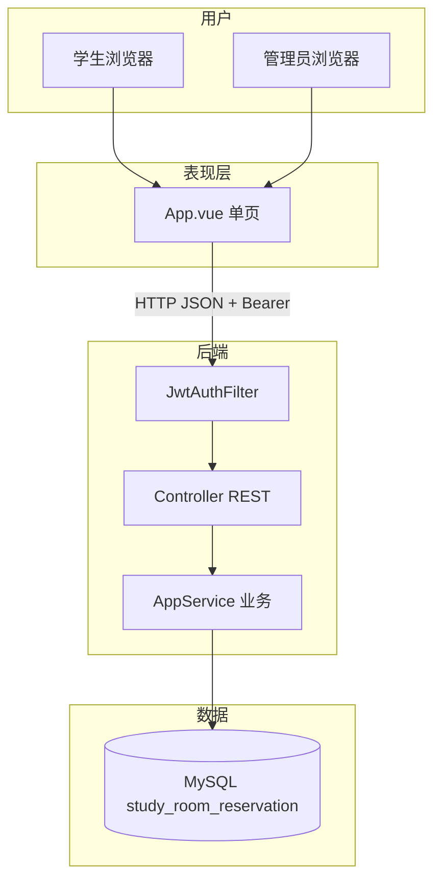
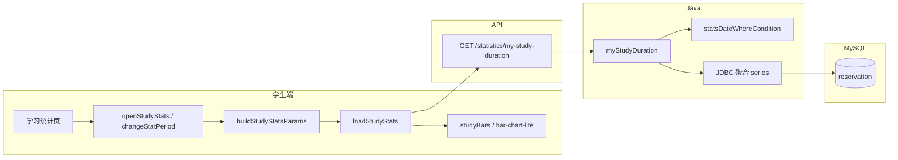
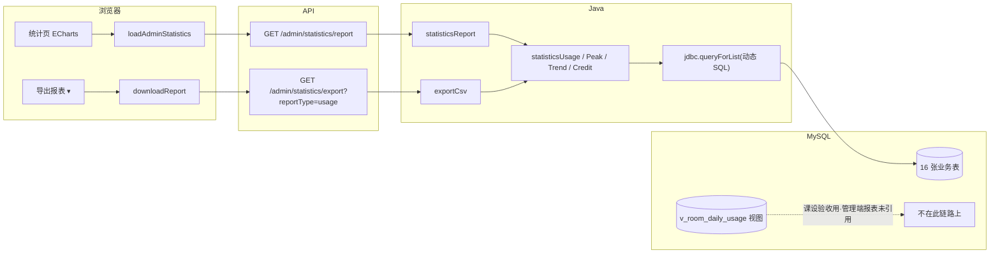

# 02 — 答辩讲解手册

> **演示实体**：小明 `202225220101`/`123456` · 小李（新注册） · 普管 `admin`/`admin123` · 超管 `superadmin`/`super123`  
> **仓库**：https://github.com/CZF312/CampusStudyRoomReservationManagementSystem  
> **演示账号**：学生 `202225220101`/`123456` · 普管 `admin`/`admin123` · 超管 `superadmin`/`super123`  
> **标签**：【演】浏览器操作 · 【讲】口述原理 · 【指】点行号（Lx 首行含 `【Fx-y】` 总体讲解）· **与 [01](01-项目理解指南.md#user-content-toc) 同 F 编号**  
> **说明**：正文由 01 同步生成，删去阅读约定与 AI 套话；定位表与行号与 01 一致。

## <a id="toc"></a>功能架构目录（根）

- **[F1 入门基础](#user-content-f1)**
  - [F1.1 环境启动](#user-content-f1-1)
  - [F1.2 技术概念（8 卡）](#user-content-f1-2)
- **[F2 认证与账号](#user-content-f2)**
  - [F2.1 学生登录](#user-content-f2-1)
  - [F2.2 管理员登录](#user-content-f2-2)
  - [F2.3 注册审核登录](#user-content-f2-3)
  - [F2.4 账号资料与安全](#user-content-f2-4)
- **[F3 自习室与预约](#user-content-f3)**
  - [F3.1 查座预约](#user-content-f3-1)
  - [F3.2 取消预约](#user-content-f3-2)
  - [F3.3 我的预约](#user-content-f3-3)
- **[F4 签到签退与信用](#user-content-f4)**
  - [F4.1 签到（学号 / 拍照 QR）](#user-content-f4-1)
  - [F4.2 签退与信用](#user-content-f4-2)
  - [F4.3 定时维护（无 UI）](#user-content-f4-3)
- **[F5 学生端辅助](#user-content-f5)**
  - [F5.1 学习统计（当期 / 往期）](#user-content-f5-1)
  - [F5.2 公告与通知](#user-content-f5-2)
  - [F5.3 问题反馈](#user-content-f5-3)
- **[F6 管理端](#user-content-f6)**
  - [F6.1 统计与 CSV 导出](#user-content-f6-1)
  - [F6.2 系统配置（超管）](#user-content-f6-2)
  - [F6.3 用户管理](#user-content-f6-3)
  - [F6.4 自习室与座位](#user-content-f6-4)
  - [F6.5 预约监管与违约撤销](#user-content-f6-5)
  - [F6.6 运营看板（实时预约）](#user-content-f6-6)
  - [F6.7 管理员与操作日志](#user-content-f6-7)
- **[F7 第三版与数据](#user-content-f7)**
  - [F7.1 数据库与 Java 分工](#user-content-f7-1)
  - [F7.2 第三版规范化](#user-content-f7-2)
  - [F7.3 前端状态 canonical](#user-content-f7-3)
  - [F7.4 十六张表](#user-content-f7-4)
  - [F7.5 教材知识点对照（第7–11章）](#user-content-f7-5)
- **[F8 附录：需求与代码差异](#user-content-f8)**
- **数据库答辩专章（外键/索引/视图）** → [04-数据库设计答辩专章.md](04-数据库设计答辩专章.md#user-content-db-a)

**页内跳转**：上列 `#user-content-f1-2` 等链接在 **GitHub 网页**可跳到对应节（须先运行 `sync_f_doc_anchors.py` 再推送）。  
**代码跳转**：表中 `blob/master/…/App.vue#L2290` 在 GitHub 打开对应行。

---

## <a id="module-overview"></a>模块总览

本系统按 **F1–F8 八大模块** 组织；每模块含若干 **子项（F x.y）**，各子项用一条 **功能链实例**（演示故事）串起前端 → API → Service → MySQL 全链路。阅读顺序建议：**模块总览（本节）→ 功能架构目录 → 具体 F 节 → 实现定位表 → 点 GitHub 行号看源码**。

### 架构分层（全项目统一）

| 层级 | 目录/技术 | 职责 | 典型 F 节 |
|------|-----------|------|-----------|
| **表现层** | `frontend/src/App.vue` · Element Plus · ECharts | 学生/管理 UI、表单、图表、JWT 存取 | F2–F6 大部分 |
| **静态资源** | `src/main/resources/static/` | Vite 构建产物，Spring Boot 同端口托管 | F1.1 |
| **接口层** | `controller/AppController.java` · `UploadController.java` | REST 路由、鉴权注解、参数绑定 | 各 F 节「Controller」行 |
| **业务层** | `service/AppService.java` · `ScheduledTaskService.java` | 业务规则、JDBC 动态 SQL、CSV 导出 | F3–F6 核心 |
| **配置/安全** | `config/JwtAuthFilter.java` · `application*.properties` | JWT 过滤、跨域、数据源 | F2 · F6.2 |
| **数据层** | `docs/06-部署配置/schema.sql` · MySQL 16 表 | 表结构、字典、视图 | F7 |
| **运维层** | `start.bat` · `scripts/start-system.ps1` | 一键建库、编译、启动 | F1.1 |



### 模块一览

| 模块 | 面向角色 | 核心职责 | 子项链接 |
|------|----------|----------|----------|
| **F1 入门基础** | 全员 / 新手 | 一键启动环境、八卡技术概念扫盲 | [F1.1 环境启动](#user-content-f1-1) · [F1.2 技术概念（8 卡）](#user-content-f1-2) |
| **F2 认证与账号** | 学生、管理员 | 登录注册、JWT 会话、资料改密 | [F2.1 学生登录](#user-content-f2-1) · [F2.2 管理员登录](#user-content-f2-2) · [F2.3 注册审核](#user-content-f2-3) · [F2.4 账号资料与安全](#user-content-f2-4) |
| **F3 自习室与预约** | 学生 | 查座预约、取消、我的预约列表 | [F3.1 查座预约](#user-content-f3-1) · [F3.2 取消预约](#user-content-f3-2) · [F3.3 我的预约](#user-content-f3-3) |
| **F4 签到签退与信用** | 学生、管理员 | 学号/QR 签到、签退、信用流水、定时违约 | [F4.1 签到](#user-content-f4-1) · [F4.2 签退与信用](#user-content-f4-2) · [F4.3 定时维护](#user-content-f4-3) |
| **F5 学生端辅助** | 学生 | 学习统计、公告通知、问题反馈 | [F5.1 学习统计](#user-content-f5-1) · [F5.2 公告与通知](#user-content-f5-2) · [F5.3 问题反馈](#user-content-f5-3) |
| **F6 管理端** | 管理员、超管 | 统计导出、配置、用户/房间/预约监管、看板、日志 | [F6.1](#user-content-f6-1) · [F6.2](#user-content-f6-2) · [F6.3](#user-content-f6-3) · [F6.4](#user-content-f6-4) · [F6.5](#user-content-f6-5) · [F6.6](#user-content-f6-6) · [F6.7](#user-content-f6-7) |
| **F7 第三版与数据** | 开发者 / 答辩 | DB 与 Java 分工、V3 字典、前端状态、16 表 | [F7.1](#user-content-f7-1) · [F7.2](#user-content-f7-2) · [F7.3](#user-content-f7-3) · [F7.4](#user-content-f7-4) |
| **F8 附录** | 答辩 / 验收 | 需求与代码差异、65 端点对照 | [F8 附录](#user-content-f8) |

---

---

## <a id="f1"></a>F1 入门基础

子项：[F1.1 环境启动](#user-content-f1-1) · [F1.2 技术概念](#user-content-f1-2)

---

### <a id="f1-1"></a>F1.1 环境启动

**功能链实例（一条龙）**  
组长双击 `start.bat` → PowerShell 导入 `database-full.sql` 建库 `study_room_reservation` → Spring Boot 监听 8080 → 浏览器打开登录页 → `verify-v3-dictionary.ps1` 输出 **PASS=17**。

#### 实现定位表

<table class="impl-loc-table" style="table-layout:fixed;width:100%;border-collapse:collapse;">
<colgroup>
  <col style="width:18%" />
  <col style="width:28%" />
  <col style="width:54%" />
</colgroup>
  <thead>
    <tr>
      <th scope="col" style="text-align:left;vertical-align:bottom;padding:6px 8px;border-bottom:1px solid #ccc;">所属层</th>
      <th scope="col" style="text-align:left;vertical-align:bottom;padding:6px 8px;border-bottom:1px solid #ccc;">链路中位置与代码地址</th>
      <th scope="col" style="text-align:left;vertical-align:bottom;padding:6px 8px;border-bottom:1px solid #ccc;">实现讲解</th>
    </tr>
  </thead>
  <tbody>
    <tr>
      <td style="vertical-align:top;word-break:break-word;">运维脚本 · Ops<br>相关概念：`@echo off`=关闭命令回显；`%~dp0`=bat 所在目录即项目根；`pom.xml`=Maven 项目标志，防在错误目录启动；`PowerShell`=执行 .ps1 的 Windows 脚本引擎；`ERRORLEVEL`=透传 ps1 退出码给 pause；`pause`=答辩时保留窗口看 PASS/FAIL</td>
      <td style="vertical-align:top;word-break:break-word;">`start.bat` · 启动入口 · [L1-L31](https://github.com/CZF312/CampusStudyRoomReservationManagementSystem/blob/master/start.bat#L1-L31)<br>链中位置：<br>1. cd 到 bat 所在项目根，设 UTF-8 与窗口标题<br>&amp;nbsp;&amp;nbsp;&amp;nbsp;输入：用户双击 start.bat<br>&amp;nbsp;&amp;nbsp;&amp;nbsp;输出：工作目录=项目根；`CSRRM_SCRIPT_ROOT=%~dp0scripts`<br>2. 校验 pom.xml 存在<br>&amp;nbsp;&amp;nbsp;&amp;nbsp;输入：当前目录<br>&amp;nbsp;&amp;nbsp;&amp;nbsp;输出：有 pom.xml 继续；无则 echo ERROR 并 exit /b 1<br>3. Bypass 执行策略调用 start-system.ps1<br>&amp;nbsp;&amp;nbsp;&amp;nbsp;输入：`scripts\start-system.ps1`<br>&amp;nbsp;&amp;nbsp;&amp;nbsp;输出：PowerShell 五步链运行；`ERRORLEVEL` 写入 ERR<br>4. pause 并透传退出码<br>&amp;nbsp;&amp;nbsp;&amp;nbsp;输入：ps1 的 `%ERRORLEVEL%`<br>&amp;nbsp;&amp;nbsp;&amp;nbsp;输出：窗口保留供答辩看 PASS/FAIL；`exit /b %ERR%`<br>总输入：双击 bat 或 cmd 调用。<br>总输出：调用 start-system.ps1，exit code 原样返回。<br>失败时：无 pom.xml 或 ps1 非 0 → ERROR + pause。</td>
      <td style="vertical-align:top;word-break:break-word;line-height:1.45;">③ 底层实现：1（L1-L9）：@echo off；chcp 65001；`cd /d %~dp0` 固定项目根；首行 REM 含 `【F1-1】` 总体讲解。<br>2（L12-L16）：if not exist pom.xml → 错误提示 + pause + exit，防止在错误目录启动。<br>3（L18-L22）：`powershell -ExecutionPolicy Bypass -File ...\start-system.ps1`；重活交给 ps1。<br>4（L24-L32）：根据 ERR 打印 Setup finished 或 ERROR；pause 防窗口闪退。<br><br>④ 设计取舍：为何放在运维脚本：部署与业务生命周期不同，脚本不进 jar，clone 后不改 Java 也能重建环境。<br>bat 兼容双击与答辩机无 IDE；重活交给 PowerShell（MySQL 检测、导入 SQL、mvnw）。<br>若不这样做：若只给 README 文字步骤，答辩机易漏装 MySQL/忘导库；脚本把多步合成双击，降低人为失误。<br><br>⑤ 答辩要点：问：为什么不用纯 PowerShell？答：双击 `.bat` 是 Windows 用户零学习成本入口；`.ps1` 默认策略可能拦截。</td>
    </tr>
    <tr>
      <td style="vertical-align:top;word-break:break-word;">运维脚本 · Ops<br>相关概念：`Java/JDK`=运行 Spring Boot 后端的程序；`MySQL`=关系型数据库，存预约与用户；`index.html`=static 下预构建的前端登录页（HTML）；`Spring Boot`=`mvnw spring-boot:run` 启动的内嵌 Tomcat Web 框架；`application-local.properties`=本地 MySQL 密码配置文件；`setup-after-clone.ps1`=DROP 库并导入 database-full.sql 的子脚本；`database-full.sql`=整库演示数据快照；`PASS=17`=第三版字典 17 项验收</td>
      <td style="vertical-align:top;word-break:break-word;">`start-system.ps1` · 系统启动脚本 · [L1-L15](https://github.com/CZF312/CampusStudyRoomReservationManagementSystem/blob/master/scripts/start-system.ps1#L1-L15)<br>链中位置：<br>1. 检 Java、mysql 客户端与 static/index.html<br>&amp;nbsp;&amp;nbsp;&amp;nbsp;输入：PATH 中 java/mysql；预构建 `static/index.html`<br>&amp;nbsp;&amp;nbsp;&amp;nbsp;输出：打印版本与 [OK] Frontend；缺依赖 exit 1<br>2. 检查并启动 MySQL Windows 服务<br>&amp;nbsp;&amp;nbsp;&amp;nbsp;输入：本机 MySQL/MariaDB 服务<br>&amp;nbsp;&amp;nbsp;&amp;nbsp;输出：服务 Status=Running（必要时 Start-Service）<br>3. 读/写 application-local.properties 中的 root 密码<br>&amp;nbsp;&amp;nbsp;&amp;nbsp;输入：可选 `CSRRM_MYSQL_PASSWORD`；或已保存密码；或交互 Read-Host<br>&amp;nbsp;&amp;nbsp;&amp;nbsp;输出：Test-MysqlLogin 通过；密码可写回 local 配置<br>4. 调用 setup-after-clone.ps1 导库并验 PASS=17<br>&amp;nbsp;&amp;nbsp;&amp;nbsp;输入：上步 root 密码<br>&amp;nbsp;&amp;nbsp;&amp;nbsp;输出：DROP+导入 database-full.sql；verify-v3-dictionary PASS=17<br>5. 新窗口 mvnw spring-boot:run 并轮询 8080<br>&amp;nbsp;&amp;nbsp;&amp;nbsp;输入：8080 空闲或已有实例返回 200<br>&amp;nbsp;&amp;nbsp;&amp;nbsp;输出：CSRRMS-Backend 窗口；http://localhost:8080 可访问<br>总输入：bat 调用；可选环境变量 CSRRM_MYSQL_PASSWORD。<br>总输出：导库 PASS=17、新窗口 mvnw、8080 可访问。<br>失败时：Java/MySQL/static 缺失或 verify 失败 → exit 1。</td>
      <td style="vertical-align:top;word-break:break-word;line-height:1.45;">③ 底层实现：1（L85-L99）：Write-Step [1/5]；Require-Command java/mysql；Test-Path staticIndex；JDK 版本提示。<br>2（L109-L129）：Get-Service 匹配 mysql；未 Running 则 Start-Service + Sleep；失败 exit 1。<br>3（L131-L147）：Get-ConfiguredMysqlPassword → 空密码/已保存/循环 Read-Host 直至 mysql SELECT 1 成功。<br>4（L149-L152）：调用 setup-after-clone.ps1 -MySqlPassword $password -SkipStart；非 0 则 exit。<br>5（L154-L191）：netstat 查 8080；`Start-Process cmd /k mvnw spring-boot:run`；Invoke-WebRequest 最多 60 秒轮询。<br><br>④ 设计取舍：为何放在运维脚本：部署与业务生命周期不同，脚本不进 jar，clone 后不改 Java 也能重建环境。<br>导入与启动解耦：库坏了可只跑 setup；8080 已在线则跳过第二实例。<br>若不这样做：若只给 README 文字步骤，答辩机易漏装 MySQL/忘导库；脚本把多步合成双击，降低人为失误。<br><br>⑤ 答辩要点：问：克隆后没 Node 能跑吗？答：可以，仓库已带 `src/main/resources/static` 预构建前端。</td>
    </tr>
    <tr>
      <td style="vertical-align:top;word-break:break-word;">业务层 · Service<br>相关概念：`@PostConstruct`=Spring Boot 启动后自动执行；`JdbcTemplate`=Java 里执行 SQL 的工具；`classpath` SQL=jar 内补丁脚本；与 database-full.sql 全量导入互补；`database-full.sql`=整库演示数据快照；`Spring Boot`=Java Web 后端框架；`Java`=后端运行时</td>
      <td style="vertical-align:top;word-break:break-word;">`DatabaseInitializer.run` · 数据库初始化 · [L14-L38](https://github.com/CZF312/CampusStudyRoomReservationManagementSystem/blob/master/src/main/java/com/scau/campusstudyroomreservationmanagementsystem/service/DatabaseInitializer.java#L14-L38)<br>链中位置：<br>1. Spring 容器启动后触发 @PostConstruct<br>&amp;nbsp;&amp;nbsp;&amp;nbsp;输入：Boot 完成组件扫描<br>&amp;nbsp;&amp;nbsp;&amp;nbsp;输出：进入 run() 方法<br>2. 检测缺表并执行 classpath 补丁 SQL<br>&amp;nbsp;&amp;nbsp;&amp;nbsp;输入：当前 MySQL 表结构<br>&amp;nbsp;&amp;nbsp;&amp;nbsp;输出：缺表时 DDL/DML 补丁；与 ps1 全量导入互补<br>总输入：Spring 容器启动完成（无 HTTP）。<br>总输出：缺表时执行 classpath 补丁 SQL。<br>失败时：SQL 异常 → Boot 启动失败，8080 不起。</td>
      <td style="vertical-align:top;word-break:break-word;line-height:1.45;">③ 底层实现：1（L14-L20）：@PostConstruct 标注；JdbcTemplate 已注入。<br>2（L21-L38）：读 resources SQL；JdbcTemplate.execute；失败则 Boot 启动失败。<br><br>④ 设计取舍：为何放在业务层：业务规则 + SQL 是系统「真相来源」，放一层便于单元测试与答辩时打开 AppService 指 SQL。<br>Java 侧可版本化补丁，不必每次手动改 SQL 文件。<br>若不这样做：若用 JPA 全自动 SQL，动态报表（F6.1）与复杂 WHERE（F5.1 时间窗）难写难讲，故课选用 JdbcTemplate 显式 SQL 便于答辩指行。<br><br>⑤ 答辩要点：问：数据从哪来？答：答辩机以 start.bat 导入 database-full.sql 为主；Initializer 防表缺失。<br>问：SQL 在哪看？答：AppService.java 搜方法名，或 GitHub 定位列 L 行 【行】 注释旁。</td>
    </tr>
    <tr>
      <td style="vertical-align:top;word-break:break-word;">运维脚本 · Ops<br>相关概念：`information_schema`=MySQL 系统库，查表数/外键；`Test-Check`=脚本内 PASS/FAIL 计数；`PASS=17`=第三版验收标准；`mysql.exe`=命令行连库执行 SQL；`application-local.properties`=本地数据源密码配置；`setup-after-clone.ps1`=导库子脚本；`MySQL`=关系型数据库</td>
      <td style="vertical-align:top;word-break:break-word;">`verify-v3-dictionary.ps1` · 字典验收 · [L1-L20](https://github.com/CZF312/CampusStudyRoomReservationManagementSystem/blob/master/scripts/verify-v3-dictionary.ps1#L1-L20)<br>链中位置：<br>1. 连接 MySQL 并读取密码<br>&amp;nbsp;&amp;nbsp;&amp;nbsp;输入：mysql 在 PATH；database-full.sql 已导入<br>&amp;nbsp;&amp;nbsp;&amp;nbsp;输出：mysql 客户端就绪；$env:MYSQL_PWD 设置<br>2. 验库存在、16 表、外键与字典<br>&amp;nbsp;&amp;nbsp;&amp;nbsp;输入：study_room_reservation 库<br>&amp;nbsp;&amp;nbsp;&amp;nbsp;输出：information_schema 查询 PASS/FAIL 计数<br>3. 抽样演示账号与 uploads 并汇总<br>&amp;nbsp;&amp;nbsp;&amp;nbsp;输入：上步 SQL 结果<br>&amp;nbsp;&amp;nbsp;&amp;nbsp;输出：控制台 PASS=n FAIL=m；PASS=17 则 exit 0<br>总输入：MySQL 已导入 database-full.sql；root 密码。<br>总输出：控制台 PASS=17 / FAIL=n；exit 0 或 1。<br>失败时：表数/外键/字典不符 → 红色 FAIL，需重跑 setup。</td>
      <td style="vertical-align:top;word-break:break-word;line-height:1.45;">③ 底层实现：1（L18-L39）：检 mysql 命令；从 application-local.properties 或 Read-Host 取密码。<br>2（L68-L120）：Test-Check 包装：表数、temp_leave 不存在、status 中文字典、外键数等。<br>3（L121-L176）：查演示学号/管理员；验 uploads 文件；打印 PASS=17 或 exit 1。<br><br>④ 设计取舍：为何放在运维脚本：部署与业务生命周期不同，脚本不进 jar，clone 后不改 Java 也能重建环境。<br>答辩前一条命令验第三版规范，不需打开数据库客户端。<br>若不这样做：若只给 README 文字步骤，答辩机易漏装 MySQL/忘导库；脚本把多步合成双击，降低人为失误。<br><br>⑤ 答辩要点：问：PASS=17 是什么？答：第三版字典 17 条验收，见脚本内注释与 F7.2。</td>
    </tr>
  </tbody>
</table>

[↑ 目录](#user-content-toc) · [↑ F1](#user-content-f1)

---

### <a id="f1-2"></a>F1.2 技术概念（8 卡）

**功能链实例**  
小明点「确认预约」→ 浏览器用 **Vue** 发 **HTTP** **JSON** 到 **REST API** → **Controller** 转 **Service** 写 **MySQL** → 返回 **JSON** `code:200`；登录后请求头带 **JWT token**。

#### 实现定位表


<table class="impl-loc-table" style="table-layout:fixed;width:100%;border-collapse:collapse;">
<colgroup>
  <col style="width:14%" />
  <col style="width:12%" />
  <col style="width:26%" />
  <col style="width:48%" />
</colgroup>
  <thead>
    <tr>
      <th scope="col" style="text-align:left;vertical-align:bottom;padding:6px 8px;border-bottom:1px solid #ccc;">概念</th>
      <th scope="col" style="text-align:left;vertical-align:bottom;padding:6px 8px;border-bottom:1px solid #ccc;">实例</th>
      <th scope="col" style="text-align:left;vertical-align:bottom;padding:6px 8px;border-bottom:1px solid #ccc;">链路中位置与代码地址</th>
      <th scope="col" style="text-align:left;vertical-align:bottom;padding:6px 8px;border-bottom:1px solid #ccc;">实现讲解</th>
    </tr>
  </thead>
  <tbody>
    <tr>
      <td style="vertical-align:top;word-break:break-word;">Browser 浏览器<br>相关概念：浏览器=Chrome/Edge 等看网页的程序；HTTP=浏览器向服务器「要页面/要数据」的协议；localhost:8080=本机 Spring Boot 地址。<br></td>
      <td style="vertical-align:top;word-break:break-word;">打开 8080 见登录框</td>
      <td style="vertical-align:top;word-break:break-word;">`static/index.html` · 浏览器入口 · [L1-L8](https://github.com/CZF312/CampusStudyRoomReservationManagementSystem/blob/master/src/main/resources/static/index.html#L1-L8)<br>链中位置：F1.2 八卡串起「小明点确认预约」全链路，本卡实例「打开 8080 见登录框」为其中一环。</td>
      <td style="vertical-align:top;word-break:break-word;line-height:1.45;">③ 底层实现：静态资源在 `src/main/resources/static/`；`/` 映射到 index.html。<br>Vite 打包的 `assets/index-*.js` 含整个 Vue；与 `/api` 同源无需 CORS。<br><br>④ 设计取舍：为何同端口 8080：答辩只开一个端口；clone 后无需 Node 也能跑预构建 static。<br>若不这样做：前后端 dev 需 5173+8080 两端口，答辩易忘开前端。<br><br>⑤ 答辩要点：问：怎么访问？答：浏览器打开 8080。<br>问：为什么要浏览器？答：Web 系统，所有交互经 HTTP，浏览器是客户端。</td>
    </tr>
    <tr>
      <td style="vertical-align:top;word-break:break-word;">Vue 单页框架<br>相关概念：Vue=数据 ref 变则页面自动变；SPA=切换子页不整页刷新；ref/computed=响应式变量。<br></td>
      <td style="vertical-align:top;word-break:break-word;">点预约不换网址</td>
      <td style="vertical-align:top;word-break:break-word;">`App.vue` · 单页根组件 · [L1-L120](https://github.com/CZF312/CampusStudyRoomReservationManagementSystem/blob/master/frontend/src/App.vue#L1-L120)<br>链中位置：F1.2 八卡串起「小明点确认预约」全链路，本卡实例「点预约不换网址」为其中一环。</td>
      <td style="vertical-align:top;word-break:break-word;line-height:1.45;">③ 底层实现：读 `frontend/src/App.vue`；搜 studentPage 看子页切换；Element Plus 组件库。<br>Vue3 Composition API；课设用字符串路由未上 Vue Router。<br><br>④ 设计取舍：为何单文件 App.vue：子页有限，答辩找代码快；字符串路由比 Router 配置直观。<br>若不这样做：多文件跳转讲解预约链路过散。<br><br>⑤ 答辩要点：问：为何叫单页？答：只加载一次 HTML，之后 Vue 改 DOM。<br>问：Vue 与后端分工？答：Vue 管界面；算信用写库在后端。</td>
    </tr>
    <tr>
      <td style="vertical-align:top;word-break:break-word;">HTTP 请求<br>相关概念：GET=取数据；POST=提交；Header=如 Authorization Bearer token；axios=发 HTTP 的库。<br></td>
      <td style="vertical-align:top;word-break:break-word;">幕后 POST JSON</td>
      <td style="vertical-align:top;word-break:break-word;">`App.vue` · call() 封装 · [L2380-L2420](https://github.com/CZF312/CampusStudyRoomReservationManagementSystem/blob/master/frontend/src/App.vue#L2380-L2420)<br>链中位置：F1.2 八卡串起「小明点确认预约」全链路，本卡实例「幕后 POST JSON」为其中一环。</td>
      <td style="vertical-align:top;word-break:break-word;line-height:1.45;">③ 底层实现：App.vue 搜 function call；baseURL `/api`；自动加 Bearer。<br>Content-Type application/json；Spring @RequestBody 转 DTO。<br><br>④ 设计取舍：为何封装 call()：统一 token、统一解析 code、统一 toast。<br>若不这样做：漏 JWT 会已登录仍 401。<br><br>⑤ 答辩要点：问：API 前缀？答 `/api`，例 `http://localhost:8080/api/auth/login`。<br>问：GET vs POST？答：GET 查，POST 改状态/创建。</td>
    </tr>
    <tr>
      <td style="vertical-align:top;word-break:break-word;">JSON 数据格式<br>相关概念：JSON=`{"键":值}` 文本；DTO=传输结构；Jackson=Java 自动转 JSON。<br></td>
      <td style="vertical-align:top;word-break:break-word;">`{"code":200}`</td>
      <td style="vertical-align:top;word-break:break-word;">`ApiResponse.java` · 统一响应 · [L1-L40](https://github.com/CZF312/CampusStudyRoomReservationManagementSystem/blob/master/src/main/java/com/scau/campusstudyroomreservationmanagementsystem/dto/ApiResponse.java#L1-L40)<br>链中位置：F1.2 八卡串起「小明点确认预约」全链路，本卡实例「`{"code":200}`」为其中一环。</td>
      <td style="vertical-align:top;word-break:break-word;line-height:1.45;">③ 底层实现：Java `ApiResponse.java`；Controller return ApiResponse.ok(...)。<br>camelCase 字段名；中文 status 为字符串。<br><br>④ 设计取舍：为何统一包装：前端只判 code===200；message 人类可读。<br>若不这样做：各接口返回形态不一，前端难维护。<br><br>⑤ 答辩要点：问：成功标志？答：JSON 的 code=200，非仅 HTTP 200。<br>问：密码会回传吗？答：不会，仅 token 与摘要。</td>
    </tr>
    <tr>
      <td style="vertical-align:top;word-break:break-word;">REST API<br>相关概念：REST=URL 表资源、HTTP 动词表操作；如 POST /reservations 创建。<br></td>
      <td style="vertical-align:top;word-break:break-word;">`/api/reservations`</td>
      <td style="vertical-align:top;word-break:break-word;">`AppController.java` · REST 映射 · [L1-L80](https://github.com/CZF312/CampusStudyRoomReservationManagementSystem/blob/master/src/main/java/com/scau/campusstudyroomreservationmanagementsystem/controller/AppController.java#L1-L80)<br>链中位置：F1.2 八卡串起「小明点确认预约」全链路，本卡实例「`/api/reservations`」为其中一环。</td>
      <td style="vertical-align:top;word-break:break-word;line-height:1.45;">③ 底层实现：AppController.java 搜 @PostMapping；方法常一行 return service.xxx()。<br>/auth/login 白名单免 JWT。<br><br>④ 设计取舍：Controller 极薄：证明有接口；规则在 Service。<br>若不这样做：Controller 写 SQL 定时任务无法复用。<br><br>⑤ 答辩要点：问：是 REST 吗？答：资源风格 URL+动词，课设级足够。<br>问：取消为何 POST 非 DELETE？答：课设统一 POST 改状态，与 call 封装一致。</td>
    </tr>
    <tr>
      <td style="vertical-align:top;word-break:break-word;">Service 业务层<br>相关概念：Service=业务规则；JdbcTemplate=执行 SQL；BusinessException=业务失败中文提示。<br></td>
      <td style="vertical-align:top;word-break:break-word;">算预约规则</td>
      <td style="vertical-align:top;word-break:break-word;">`AppService.java` · 业务规则 · [L1-L120](https://github.com/CZF312/CampusStudyRoomReservationManagementSystem/blob/master/src/main/java/com/scau/campusstudyroomreservationmanagementsystem/service/AppService.java#L1-L120)<br>链中位置：F1.2 八卡串起「小明点确认预约」全链路，本卡实例「算预约规则」为其中一环。</td>
      <td style="vertical-align:top;word-break:break-word;line-height:1.45;">③ 底层实现：AppService.java 按方法名搜；SQL 用 ? 占位防注入。<br>credit_log 流水；中文 status。<br><br>④ 设计取舍：为何 JDBC 非 JPA：动态报表 SQL 多，答辩可指字符串（F7.1）。<br>若不这样做：复杂统计难讲清 SQL。<br><br>⑤ 答辩要点：问：SQL 在哪？答：AppService 对应方法或 GitHub【行】注释旁。<br>问：定时任务也用 Service？答：是，F4.3 与 Controller 共用规则。</td>
    </tr>
    <tr>
      <td style="vertical-align:top;word-break:break-word;">MySQL 数据库<br>相关概念：表=数据集合；行=一条记录；外键=引用完整性；InnoDB=事务引擎。<br></td>
      <td style="vertical-align:top;word-break:break-word;">reservation 多一行</td>
      <td style="vertical-align:top;word-break:break-word;">`schema.sql` · 表结构 · [L1-L80](https://github.com/CZF312/CampusStudyRoomReservationManagementSystem/blob/master/src/main/resources/schema.sql#L1-L80)<br>链中位置：F1.2 八卡串起「小明点确认预约」全链路，本卡实例「reservation 多一行」为其中一环。</td>
      <td style="vertical-align:top;word-break:break-word;line-height:1.45;">③ 底层实现：schema.sql 看 DDL；database-full.sql 看演示数据。<br>16 表；reservation+reservation_slot 防双占。<br><br>④ 设计取舍：中文 status：SQL 结果答辩可直接读（F7.2）。<br>若不这样做：英文 ENUM 答辩易口误。<br><br>⑤ 答辩要点：问：几表？答：16 业务表 + 1 验收视图。<br>问：数据从哪来？答：start.bat 导入 + DatabaseInitializer 补丁。</td>
    </tr>
    <tr>
      <td style="vertical-align:top;word-break:break-word;">JWT 令牌<br>相关概念：JWT=三段 Base64；Bearer=Authorization Header；无 Session=服务端不存会话表。<br></td>
      <td style="vertical-align:top;word-break:break-word;">Header Bearer</td>
      <td style="vertical-align:top;word-break:break-word;">`JwtService.java` · 签发解析 · [L1-L60](https://github.com/CZF312/CampusStudyRoomReservationManagementSystem/blob/master/src/main/java/com/scau/campusstudyroomreservationmanagementsystem/service/JwtService.java#L1-L60)<br>链中位置：F1.2 八卡串起「小明点确认预约」全链路，本卡实例「Header Bearer」为其中一环。</td>
      <td style="vertical-align:top;word-break:break-word;line-height:1.45;">③ 底层实现：JwtService 签发/解析；JwtAuthFilter；jwt.secret 在 properties。<br>HS256；payload 无密码；默认 24h 过期。<br><br>④ 设计取舍：JWT 非 Session：SPA 友好、Tomcat 无状态。<br>若不这样做：Session 需 sticky/Redis，答辩配置重。<br><br>⑤ 答辩要点：问：token 存哪？答：localStorage。<br>问：logout？答：前端删 token；无黑名单则到期前仍有效。</td>
    </tr>
  </tbody>
</table>

[↑ 目录](#user-content-toc) · [↑ F1](#user-content-f1)

---

## <a id="f2"></a>F2 认证与账号

子项：[F2.1](#user-content-f2-1) · [F2.2](#user-content-f2-2) · [F2.3](#user-content-f2-3)

---

### <a id="f2-1"></a>F2.1 学生登录

**功能链实例（一条龙）**  
小明在登录页输入 `202225220101` / `123456` → 点「登录」→ 首页显示「你好，小明」→ 再进「我的预约」无需重输密码（`localStorage` 已有 token）。

#### 实现定位表

<table class="impl-loc-table" style="table-layout:fixed;width:100%;border-collapse:collapse;">
<colgroup>
  <col style="width:18%" />
  <col style="width:28%" />
  <col style="width:54%" />
</colgroup>
  <thead>
    <tr>
      <th scope="col" style="text-align:left;vertical-align:bottom;padding:6px 8px;border-bottom:1px solid #ccc;">所属层</th>
      <th scope="col" style="text-align:left;vertical-align:bottom;padding:6px 8px;border-bottom:1px solid #ccc;">链路中位置与代码地址</th>
      <th scope="col" style="text-align:left;vertical-align:bottom;padding:6px 8px;border-bottom:1px solid #ccc;">实现讲解</th>
    </tr>
  </thead>
  <tbody>
    <tr>
      <td style="vertical-align:top;word-break:break-word;">表现层 Presentation<br>相关概念：`BCrypt`=密码单向哈希，库中不存明文；`JWT`=登录成功后的 token；`localStorage`=浏览器存 token；`user_account`=学生账号表；`auditStatus`=待审核/已通过；`Vue`=前端单页框架</td>
      <td style="vertical-align:top;word-break:break-word;">`loginStudent` 模板区 · 学生登录表单 · `frontend/src/App.vue` · [L2457-L2472](https://github.com/CZF312/CampusStudyRoomReservationManagementSystem/blob/master/frontend/src/App.vue#L2457-L2472)<br>链中位置：<br>1. 模板 v-model 绑定 studentLogin<br>&amp;nbsp;&amp;nbsp;&amp;nbsp;输入：用户点击/表单输入（ref 绑定值）<br>&amp;nbsp;&amp;nbsp;&amp;nbsp;输出：触发本层 JS 函数或更新 computed<br>2. @click 调 loginStudent()。<br>&amp;nbsp;&amp;nbsp;&amp;nbsp;输入：上一步 ref/表单已就绪<br>&amp;nbsp;&amp;nbsp;&amp;nbsp;输出：调用本层 JS 函数，进入同链下一表行<br>总输入：用户在页面的点击/表单（ref 里的值）。<br>总输出：更新 Vue 的 ref/computed 让页面变样，或发 HTTP 等 JSON 回来。<br>失败时：notify()/ElMessage 弹中文错误，不崩溃整页。</td>
      <td style="vertical-align:top;word-break:break-word;line-height:1.45;">③ 底层实现：1（L2457–L2464）：见 `App.vue` L2457–L2464 内 【行】 注释逐步跟读。<br>2（L2465–L2472）：见 `App.vue` L2465–L2472 内 【行】 注释逐步跟读。<br><br>④ 设计取舍：为何放在表现层 Presentation：交互密集、改 UI 频繁，放 Vue 模板/JS 最快；与后端通过 REST 解耦，前端可独立 npm run build。<br>表现层零业务：密码强度/审核状态全在后端 Service。<br>若不这样做：若在前端 `loginStudent` 里算信用/写 SQL，换浏览器结果可能不一致，且规则易泄露，故必须只展示后端返回值。<br><br>⑤ 答辩要点：问：前端校验什么？答：非空与格式；密码对错由 BCrypt 在后端比对。<br>问：数据存在浏览器吗？答：仅 token 与 UI 状态在 localStorage/ref；预约/信用等权威数据每次从 API 拉。<br>问：忘记密码怎么办？答：课设演示账号固定；真实系统应做找回流程，本项未实现。</td>
    </tr>
    <tr>
      <td style="vertical-align:top;word-break:break-word;">表现层 Presentation<br>相关概念：`BCrypt`=密码单向哈希，库中不存明文；`JWT`=登录成功后的 token；`localStorage`=浏览器存 token；`user_account`=学生账号表；`auditStatus`=待审核/已通过；`Vue`=前端单页框架</td>
      <td style="vertical-align:top;word-break:break-word;">`loginStudent` · 学生登录 · `frontend/src/App.vue` · [L2457-L2472](https://github.com/CZF312/CampusStudyRoomReservationManagementSystem/blob/master/frontend/src/App.vue#L2457-L2472)<br>链中位置：<br>1. 读 studentLogin ref<br>&amp;nbsp;&amp;nbsp;&amp;nbsp;输入：用户点击/表单输入（ref 绑定值）<br>&amp;nbsp;&amp;nbsp;&amp;nbsp;输出：触发本层 JS 函数或更新 computed<br>2. call('post','/auth/login')<br>&amp;nbsp;&amp;nbsp;&amp;nbsp;输入：上一步输出<br>&amp;nbsp;&amp;nbsp;&amp;nbsp;输出：本步 `call('post','/auth/login')` 处理结果交给下一步<br>3. afterLogin(token,'STUDENT',data)。<br>&amp;nbsp;&amp;nbsp;&amp;nbsp;输入：前面 API 返回的 JSON<br>&amp;nbsp;&amp;nbsp;&amp;nbsp;输出：页面 ref/computed 更新，用户可见结果<br>总输入：用户在页面的点击/表单（ref 里的值）。<br>总输出：更新 Vue 的 ref/computed 让页面变样，或发 HTTP 等 JSON 回来。<br>失败时：notify()/ElMessage 弹中文错误，不崩溃整页。</td>
      <td style="vertical-align:top;word-break:break-word;line-height:1.45;">③ 底层实现：1（L2457–L2461）：见 `App.vue` L2457–L2461 内 【行】 注释逐步跟读。<br>2（L2462–L2466）：见 `App.vue` L2462–L2466 内 【行】 注释逐步跟读。<br>3（L2467–L2472）：见 `App.vue` L2467–L2472 内 【行】 注释逐步跟读。<br><br>④ 设计取舍：为何放在表现层 Presentation：交互密集、改 UI 频繁，放 Vue 模板/JS 最快；与后端通过 REST 解耦，前端可独立 npm run build。<br>JS 不解析 JWT，只存字符串；角色由 login 响应 role 字段决定。<br>若不这样做：若在前端 `loginStudent` 里算信用/写 SQL，换浏览器结果可能不一致，且规则易泄露，故必须只展示后端返回值。<br><br>⑤ 答辩要点：问：remember me？答：课设未做，token 存 localStorage 即持久登录。<br>问：数据存在浏览器吗？答：仅 token 与 UI 状态在 localStorage/ref；预约/信用等权威数据每次从 API 拉。<br>问：忘记密码怎么办？答：课设演示账号固定；真实系统应做找回流程，本项未实现。</td>
    </tr>
    <tr>
      <td style="vertical-align:top;word-break:break-word;">接口层 Controller<br>相关概念：`Java`=后端运行时；POST /api/auth/login；LoginRequest DTO；ApiResponse.ok(tokenDto)</td>
      <td style="vertical-align:top;word-break:break-word;">`login` · 学生登录接口 · `controller/AppController.java` · [L40-L42](https://github.com/CZF312/CampusStudyRoomReservationManagementSystem/blob/master/src/main/java/com/scau/campusstudyroomreservationmanagementsystem/controller/AppController.java#L40-L42)<br>链中位置：<br>1. @RequestBody LoginRequest<br>&amp;nbsp;&amp;nbsp;&amp;nbsp;输入：HTTP 请求到达 Tomcat（路径/JSON/ Bearer JWT）<br>&amp;nbsp;&amp;nbsp;&amp;nbsp;输出：参数绑定完成，可转发 Service<br>2. service.loginStudent<br>&amp;nbsp;&amp;nbsp;&amp;nbsp;输入：上一步 HTTP/调用参数<br>&amp;nbsp;&amp;nbsp;&amp;nbsp;输出：转发至下一层或返回 DTO<br>3. 返回 token DTO。<br>&amp;nbsp;&amp;nbsp;&amp;nbsp;输入：Service 返回 DTO/void<br>&amp;nbsp;&amp;nbsp;&amp;nbsp;输出：ApiResponse JSON 写回 HTTP 响应<br>总输入：HTTP 请求（路径 `/api/...（见 `login`）`、JSON body、Header 里 Bearer JWT）。<br>总输出：ApiResponse JSON，前端 call() 读 data 字段。<br>失败时：Service 抛 BusinessException → 全局处理器转 {code,message}，或 Filter 直接 401。</td>
      <td style="vertical-align:top;word-break:break-word;line-height:1.45;">③ 底层实现：1（L40–L40）：见 `AppController.java` L40–L40 内 【行】 注释逐步跟读。<br>2（L41–L41）：见 `AppController.java` L41–L41 内 【行】 注释逐步跟读。<br>3（L42–L42）：见 `AppController.java` L42–L42 内 【行】 注释逐步跟读。<br><br>④ 设计取舍：为何放在接口层 Controller：HTTP 形态（路径、动词、状态码）集中在一层，Service 可被 Controller、定时任务、脚本测试共用。<br>登录端点独立白名单；与学生/管理员分路径见 F2.2。<br>若不这样做：若在 `login` 写 JDBC，则定时任务、导出、多处入口要复制 SQL，一改规则漏改一处就出 bug，故只做 HTTP 适配。<br><br>⑤ 答辩要点：问：登录失败 HTTP 码？答：多数仍 200，message 中文说明；403 待审核见 Service 抛错。<br>问：这行会访问数据库吗？答：Controller 层一般不写 SQL，查表在下一行 Service 同名方法。<br>问：忘记密码怎么办？答：课设演示账号固定；真实系统应做找回流程，本项未实现。</td>
    </tr>
    <tr>
      <td style="vertical-align:top;word-break:break-word;">业务层 Service<br>相关概念：`BCrypt`=密码单向哈希，库中不存明文；`JWT`=登录成功后的 token；`localStorage`=浏览器存 token；`user_account`=学生账号表；`auditStatus`=待审核/已通过；`Java`=后端运行时</td>
      <td style="vertical-align:top;word-break:break-word;">`loginStudent` · 学生登录校验 · `service/AppService.java` · [L184-L207](https://github.com/CZF312/CampusStudyRoomReservationManagementSystem/blob/master/src/main/java/com/scau/campusstudyroomreservationmanagementsystem/service/AppService.java#L184-L207)<br>链中位置：<br>1. SELECT user_account BY student_no<br>&amp;nbsp;&amp;nbsp;&amp;nbsp;输入：Controller 传入 DTO/基本类型<br>&amp;nbsp;&amp;nbsp;&amp;nbsp;输出：业务校验通过，可读写 MySQL<br>2. 校验 auditStatus=已通过、非禁用、非黑名单<br>&amp;nbsp;&amp;nbsp;&amp;nbsp;输入：上一步输出<br>&amp;nbsp;&amp;nbsp;&amp;nbsp;输出：本步 `校验 auditStatus=已通过、非禁用、非黑名单` 处理结果交给下一步<br>3. BCrypt.matches<br>&amp;nbsp;&amp;nbsp;&amp;nbsp;输入：上一步输出<br>&amp;nbsp;&amp;nbsp;&amp;nbsp;输出：本步 `BCrypt.matches` 处理结果交给下一步<br>4. createToken。<br>&amp;nbsp;&amp;nbsp;&amp;nbsp;输入：累积 SQL/校验结果<br>&amp;nbsp;&amp;nbsp;&amp;nbsp;输出：返回 DTO 或抛 BusinessException<br>总输入：Controller 传入的 DTO/基本类型（userId、seatId、时间段等）。<br>总输出：Map/DTO 或 void；副作用为 UPDATE/INSERT MySQL 表。<br>失败时：throw new BusinessException("中文原因")，事务回滚，前端看到 message。</td>
      <td style="vertical-align:top;word-break:break-word;line-height:1.45;">③ 底层实现：1（L184–L189）：见 `AppService.java` L184–L189 内 【行】 注释逐步跟读。<br>2（L190–L195）：见 `AppService.java` L190–L195 内 【行】 注释逐步跟读。<br>3（L196–L201）：见 `AppService.java` L196–L201 内 【行】 注释逐步跟读。<br>4（L202–L207）：见 `AppService.java` L202–L207 内 【行】 注释逐步跟读。<br><br>④ 设计取舍：为何放在业务层 Service：业务规则 + SQL 是系统「真相来源」，放一层便于单元测试与答辩时打开 AppService 指 SQL。<br>所有登录安全策略集中 Service，Controller 与 adminLogin 共用 JwtService。<br>若不这样做：若用 JPA 全自动 SQL，动态报表（F6.1）与复杂 WHERE（F5.1 时间窗）难写难讲，故课选用 JdbcTemplate 显式 SQL 便于答辩指行。<br><br>⑤ 答辩要点：问：密码怎么存？答：user_account.password_hash BCrypt，永不回传明文。<br>问：SQL 在哪看？答：AppService.java 搜方法名，或 GitHub 定位列 L 行 【行】 注释旁。<br>问：忘记密码怎么办？答：课设演示账号固定；真实系统应做找回流程，本项未实现。</td>
    </tr>
    <tr>
      <td style="vertical-align:top;word-break:break-word;">配置层 Config<br>相关概念：`JWT`=登录通行证 token；`Java`=后端运行时；`createToken`=JWT/安全配置</td>
      <td style="vertical-align:top;word-break:break-word;">`createToken` · 签发令牌 · `config/JwtService.java` · [L28-L41](https://github.com/CZF312/CampusStudyRoomReservationManagementSystem/blob/master/src/main/java/com/scau/campusstudyroomreservationmanagementsystem/config/JwtService.java#L28-L41)<br>链中位置：<br>1. loginStudent 校验通过后：Service 调 JwtService.createToken(userId, role) 生成 HS256 签名字符串。<br>&amp;nbsp;&amp;nbsp;&amp;nbsp;输入：功能链起点：用户操作或上游表行输出<br>&amp;nbsp;&amp;nbsp;&amp;nbsp;输出：进入本步处理<br>总输入：每个 /api/** 请求的 Header 与路径。<br>总输出：放行并注入 SecurityContext（userId/role），或 401 JSON 拦截。<br>失败时：token 过期/伪造 → 401，前端 bootstrap 清 localStorage。</td>
      <td style="vertical-align:top;word-break:break-word;line-height:1.45;">③ 底层实现：1（L28–L41）：claims 含 sub=userId、role=STUDENT；secret 来自 application.properties jwt.secret；exp 默认 24h；返回 compact JWT 字符串给 Controller 包装进 data.token。<br><br>④ 设计取舍：为何放在配置层 Config：鉴权、CORS、JWT 密钥与所有接口相关，放 config 包一处维护。<br>签发集中在一处，Filter 与 Service 共用同一 JwtService 解析/验证逻辑。<br>若不这样做：若每个 Controller 手写 if(token)，漏写一个接口就裸奔；抽成 Filter 后新增接口默认受保护。<br><br>⑤ 答辩要点：问：token 里存密码吗？答：不存，只存 userId 与 role 等非敏感 claims。<br>问：忘记密码怎么办？答：课设演示账号固定；真实系统应做找回流程，本项未实现。</td>
    </tr>
    <tr>
      <td style="vertical-align:top;word-break:break-word;">表现层 Presentation<br>相关概念：`localStorage`=浏览器存 token；`Vue`=前端单页框架；`afterLogin`=前端 UI/事件</td>
      <td style="vertical-align:top;word-break:break-word;">`afterLogin` · 登录后处理 · `frontend/src/App.vue` · [L2491-L2499](https://github.com/CZF312/CampusStudyRoomReservationManagementSystem/blob/master/frontend/src/App.vue#L2491-L2499)<br>链中位置：<br>1. 写 token/role ref 与 localStorage<br>&amp;nbsp;&amp;nbsp;&amp;nbsp;输入：用户点击/表单输入（ref 绑定值）<br>&amp;nbsp;&amp;nbsp;&amp;nbsp;输出：触发本层 JS 函数或更新 computed<br>2. toast<br>&amp;nbsp;&amp;nbsp;&amp;nbsp;输入：上一步输出<br>&amp;nbsp;&amp;nbsp;&amp;nbsp;输出：本步 `toast` 处理结果交给下一步<br>3. bootstrap(false) 拉 /auth/me 补全用户信息<br>&amp;nbsp;&amp;nbsp;&amp;nbsp;输入：上一步输出<br>&amp;nbsp;&amp;nbsp;&amp;nbsp;输出：本步 `bootstrap(false) 拉 /auth/me 补全用户信息` 处理结果交给下一步<br>4. 切 studentPage。<br>&amp;nbsp;&amp;nbsp;&amp;nbsp;输入：前面 API 返回的 JSON<br>&amp;nbsp;&amp;nbsp;&amp;nbsp;输出：页面 ref/computed 更新，用户可见结果<br>总输入：用户在页面的点击/表单（ref 里的值）。<br>总输出：更新 Vue 的 ref/computed 让页面变样，或发 HTTP 等 JSON 回来。<br>失败时：notify()/ElMessage 弹中文错误，不崩溃整页。</td>
      <td style="vertical-align:top;word-break:break-word;line-height:1.45;">③ 底层实现：1（L2491–L2492）：见 `App.vue` L2491–L2492 内 【行】 注释逐步跟读。<br>2（L2493–L2494）：见 `App.vue` L2493–L2494 内 【行】 注释逐步跟读。<br>3（L2495–L2496）：见 `App.vue` L2495–L2496 内 【行】 注释逐步跟读。<br>4（L2497–L2499）：见 `App.vue` L2497–L2499 内 【行】 注释逐步跟读。<br><br>④ 设计取舍：为何放在表现层 Presentation：交互密集、改 UI 频繁，放 Vue 模板/JS 最快；与后端通过 REST 解耦，前端可独立 npm run build。<br>前端会话状态双写 ref+localStorage，刷新时 bootstrap 读 localStorage 恢复。<br>若不这样做：若在前端 `afterLogin` 里算信用/写 SQL，换浏览器结果可能不一致，且规则易泄露，故必须只展示后端返回值。<br><br>⑤ 答辩要点：问：为何还要 bootstrap？答：token 只含 id/role，展示名等从 /auth/me 拉最新 profile。<br>问：数据存在浏览器吗？答：仅 token 与 UI 状态在 localStorage/ref；预约/信用等权威数据每次从 API 拉。<br>问：忘记密码怎么办？答：课设演示账号固定；真实系统应做找回流程，本项未实现。</td>
    </tr>
    <tr>
      <td style="vertical-align:top;word-break:break-word;">配置层 Config<br>相关概念：`JSON`={键:值} 文本格式；`JWT`=登录通行证 token；`Java`=后端运行时</td>
      <td style="vertical-align:top;word-break:break-word;">`doFilterInternal` · JWT 过滤 · `config/JwtAuthFilter.java` · [L29-L47](https://github.com/CZF312/CampusStudyRoomReservationManagementSystem/blob/master/src/main/java/com/scau/campusstudyroomreservationmanagementsystem/config/JwtAuthFilter.java#L29-L47)<br>链中位置：<br>1. 除 login/register 外，每个 `/api/**` 请求先经此过滤器解析 Bearer，再进 Controller。<br>&amp;nbsp;&amp;nbsp;&amp;nbsp;输入：功能链起点：用户操作或上游表行输出<br>&amp;nbsp;&amp;nbsp;&amp;nbsp;输出：进入本步处理<br>总输入：每个 /api/** 请求的 Header 与路径。<br>总输出：放行并注入 SecurityContext（userId/role），或 401 JSON 拦截。<br>失败时：token 过期/伪造 → 401，前端 bootstrap 清 localStorage。</td>
      <td style="vertical-align:top;word-break:break-word;line-height:1.45;">③ 底层实现：1（L29–L47）：读 Header Authorization；JwtService.parse；设 SecurityContext userId/role；失败 401 JSON。<br><br>④ 设计取舍：为何放在配置层 Config：鉴权、CORS、JWT 密钥与所有接口相关，放 config 包一处维护。<br>统一鉴权，Controller 用 @AuthenticationPrincipal 取当前用户。<br>若不这样做：若每个 Controller 手写 if(token)，漏写一个接口就裸奔；抽成 Filter 后新增接口默认受保护。<br><br>⑤ 答辩要点：问：哪些接口免鉴权？答：登录注册与 static 资源，见 SecurityConfig 白名单。<br>问：忘记密码怎么办？答：课设演示账号固定；真实系统应做找回流程，本项未实现。</td>
    </tr>
    <tr>
      <td style="vertical-align:top;word-break:break-word;">表现层 Presentation<br>相关概念：`localStorage`=浏览器存 token；`Vue`=前端单页框架；GET /auth/me；localStorage token 恢复会话</td>
      <td style="vertical-align:top;word-break:break-word;">`bootstrap` · 刷新恢复会话 · `frontend/src/App.vue` · [L2564-L2581](https://github.com/CZF312/CampusStudyRoomReservationManagementSystem/blob/master/frontend/src/App.vue#L2564-L2581)<br>链中位置：<br>1. 页面 mounted：若 localStorage 有 token 则 GET `/auth/me` 恢复 user，否则回登录页。<br>&amp;nbsp;&amp;nbsp;&amp;nbsp;输入：用户点击/表单输入（ref 绑定值）<br>&amp;nbsp;&amp;nbsp;&amp;nbsp;输出：触发本层 JS 函数或更新 computed<br>总输入：用户在页面的点击/表单（ref 里的值）。<br>总输出：更新 Vue 的 ref/computed 让页面变样，或发 HTTP 等 JSON 回来。<br>失败时：notify()/ElMessage 弹中文错误，不崩溃整页。</td>
      <td style="vertical-align:top;word-break:break-word;line-height:1.45;">③ 底层实现：1（L2564–L2581）：`call('get','/auth/me')`；成功则填充 user/studentPage；401 则 clearToken。<br><br>④ 设计取舍：为何放在表现层 Presentation：交互密集、改 UI 频繁，放 Vue 模板/JS 最快；与后端通过 REST 解耦，前端可独立 npm run build。<br>刷新不掉线，演示体验好；token 无效必须清本地缓存。<br>若不这样做：若在前端 `bootstrap` 里算信用/写 SQL，换浏览器结果可能不一致，且规则易泄露，故必须只展示后端返回值。<br><br>⑤ 答辩要点：问：Session 存在哪？答：无服务端 Session，仅 JWT+localStorage。<br>问：数据存在浏览器吗？答：仅 token 与 UI 状态在 localStorage/ref；预约/信用等权威数据每次从 API 拉。<br>问：忘记密码怎么办？答：课设演示账号固定；真实系统应做找回流程，本项未实现。</td>
    </tr>
    <tr>
      <td style="vertical-align:top;word-break:break-word;">接口层 Controller<br>相关概念：`Java`=后端运行时；`me`=REST 接口转发</td>
      <td style="vertical-align:top;word-break:break-word;">`me` · 当前用户接口 · `controller/AppController.java` · [L52-L54](https://github.com/CZF312/CampusStudyRoomReservationManagementSystem/blob/master/src/main/java/com/scau/campusstudyroomreservationmanagementsystem/controller/AppController.java#L52-L54)<br>链中位置：<br>1. GET `/auth/me`（Bearer）<br>&amp;nbsp;&amp;nbsp;&amp;nbsp;输入：HTTP 请求到达 Tomcat（路径/JSON/ Bearer JWT）<br>&amp;nbsp;&amp;nbsp;&amp;nbsp;输出：参数绑定完成，可转发 Service<br>2. 本方法取 SecurityContext userId<br>&amp;nbsp;&amp;nbsp;&amp;nbsp;输入：上一步输出<br>&amp;nbsp;&amp;nbsp;&amp;nbsp;输出：本步 `本方法取 SecurityContext userId` 处理结果交给下一步<br>3. Service 查 user_account 返回 DTO。<br>&amp;nbsp;&amp;nbsp;&amp;nbsp;输入：Service 返回 DTO/void<br>&amp;nbsp;&amp;nbsp;&amp;nbsp;输出：ApiResponse JSON 写回 HTTP 响应<br>总输入：HTTP 请求（路径 `/api/...（见 `me`）`、JSON body、Header 里 Bearer JWT）。<br>总输出：ApiResponse JSON，前端 call() 读 data 字段。<br>失败时：Service 抛 BusinessException → 全局处理器转 {code,message}，或 Filter 直接 401。</td>
      <td style="vertical-align:top;word-break:break-word;line-height:1.45;">③ 底层实现：1（L52–L52）：见 `AppController.java` L52–L52 内 【行】 注释逐步跟读。<br>2（L53–L53）：见 `AppController.java` L53–L53 内 【行】 注释逐步跟读。<br>3（L54–L54）：见 `AppController.java` L54–L54 内 【行】 注释逐步跟读。<br><br>④ 设计取舍：为何放在接口层 Controller：HTTP 形态（路径、动词、状态码）集中在一层，Service 可被 Controller、定时任务、脚本测试共用。<br>「我是谁」只读接口，支撑刷新恢复与 header 展示，不写库。<br>若不这样做：若在 `me` 写 JDBC，则定时任务、导出、多处入口要复制 SQL，一改规则漏改一处就出 bug，故只做 HTTP 适配。<br><br>⑤ 答辩要点：问：与 login 区别？答：login 验密签发 token；me 只解析已有 token 返回资料。<br>问：这行会访问数据库吗？答：Controller 层一般不写 SQL，查表在下一行 Service 同名方法。<br>问：忘记密码怎么办？答：课设演示账号固定；真实系统应做找回流程，本项未实现。</td>
    </tr>
  </tbody>
</table>

[↑ 目录](#user-content-toc) · [↑ F2](#user-content-f2) · 并列：[F2.2](#user-content-f2-2) · [F2.3](#user-content-f2-3) · [F2.4](#user-content-f2-4)

---

### <a id="f2-2"></a>F2.2 管理员登录

**功能链实例（一条龙）**  
管理员切到「管理员登录」→ 输入 `admin` / `admin123` → 进入管理端签到页；`superadmin` 侧栏额外显示「设置」「管理员管理」。

#### 实现定位表

<table class="impl-loc-table" style="table-layout:fixed;width:100%;border-collapse:collapse;">
<colgroup>
  <col style="width:18%" />
  <col style="width:28%" />
  <col style="width:54%" />
</colgroup>
  <thead>
    <tr>
      <th scope="col" style="text-align:left;vertical-align:bottom;padding:6px 8px;border-bottom:1px solid #ccc;">所属层</th>
      <th scope="col" style="text-align:left;vertical-align:bottom;padding:6px 8px;border-bottom:1px solid #ccc;">链路中位置与代码地址</th>
      <th scope="col" style="text-align:left;vertical-align:bottom;padding:6px 8px;border-bottom:1px solid #ccc;">实现讲解</th>
    </tr>
  </thead>
  <tbody>
    <tr>
      <td style="vertical-align:top;word-break:break-word;">表现层 Presentation<br>相关概念：`Vue`=前端单页框架；v-model；el-form；@click → loginStudent</td>
      <td style="vertical-align:top;word-break:break-word;">管理员登录模板 · admin login template · `frontend/src/App.vue` · [L28-L41](https://github.com/CZF312/CampusStudyRoomReservationManagementSystem/blob/master/frontend/src/App.vue#L28-L41)<br>链中位置：<br>1. 模板 v-model 绑定 studentLogin<br>&amp;nbsp;&amp;nbsp;&amp;nbsp;输入：用户点击/表单输入（ref 绑定值）<br>&amp;nbsp;&amp;nbsp;&amp;nbsp;输出：触发本层 JS 函数或更新 computed<br>2. @click 调 loginStudent()。<br>&amp;nbsp;&amp;nbsp;&amp;nbsp;输入：上一步 ref/表单已就绪<br>&amp;nbsp;&amp;nbsp;&amp;nbsp;输出：调用本层 JS 函数，进入同链下一表行<br>总输入：用户在页面的点击/表单（ref 里的值）。<br>总输出：更新 Vue 的 ref/computed 让页面变样，或发 HTTP 等 JSON 回来。<br>失败时：notify()/ElMessage 弹中文错误，不崩溃整页。</td>
      <td style="vertical-align:top;word-break:break-word;line-height:1.45;">③ 底层实现：1（L28–L34）：见 `App.vue` L28–L34 内 【行】 注释逐步跟读。<br>2（L35–L41）：见 `App.vue` L35–L41 内 【行】 注释逐步跟读。<br><br>④ 设计取舍：为何放在表现层 Presentation：交互密集、改 UI 频繁，放 Vue 模板/JS 最快；与后端通过 REST 解耦，前端可独立 npm run build。<br>表现层零业务：密码强度/审核状态全在后端 Service。<br>若不这样做：若在前端 `App.vue` 里算信用/写 SQL，换浏览器结果可能不一致，且规则易泄露，故必须只展示后端返回值。<br><br>⑤ 答辩要点：问：前端校验什么？答：非空与格式；密码对错由 BCrypt 在后端比对。<br>问：数据存在浏览器吗？答：仅 token 与 UI 状态在 localStorage/ref；预约/信用等权威数据每次从 API 拉。</td>
    </tr>
    <tr>
      <td style="vertical-align:top;word-break:break-word;">表现层 Presentation<br>相关概念：`Vue`=前端单页框架；admin_account；/admin/auth/login</td>
      <td style="vertical-align:top;word-break:break-word;">`loginAdmin` · 管理员登录 · `frontend/src/App.vue` · [L2474-L2489](https://github.com/CZF312/CampusStudyRoomReservationManagementSystem/blob/master/frontend/src/App.vue#L2474-L2489)<br>链中位置：<br>1. 管理员 tab 输入账号密码<br>&amp;nbsp;&amp;nbsp;&amp;nbsp;输入：用户点击/表单输入（ref 绑定值）<br>&amp;nbsp;&amp;nbsp;&amp;nbsp;输出：触发本层 JS 函数或更新 computed<br>2. POST `/admin/auth/login`<br>&amp;nbsp;&amp;nbsp;&amp;nbsp;输入：上一步产出 + HTTP 参数（见本步 `POST `/admin/auth/login``）<br>&amp;nbsp;&amp;nbsp;&amp;nbsp;输出：请求发出或 JSON 返回给下一步<br>3. afterLogin(token,'ADMIN',info)<br>&amp;nbsp;&amp;nbsp;&amp;nbsp;输入：上一步输出<br>&amp;nbsp;&amp;nbsp;&amp;nbsp;输出：本步 `afterLogin(token,'ADMIN',info)` 处理结果交给下一步<br>4. adminPage 切 dashboard。<br>&amp;nbsp;&amp;nbsp;&amp;nbsp;输入：前面 API 返回的 JSON<br>&amp;nbsp;&amp;nbsp;&amp;nbsp;输出：页面 ref/computed 更新，用户可见结果<br>总输入：用户在页面的点击/表单（ref 里的值）。<br>总输出：更新 Vue 的 ref/computed 让页面变样，或发 HTTP 等 JSON 回来。<br>失败时：notify()/ElMessage 弹中文错误，不崩溃整页。</td>
      <td style="vertical-align:top;word-break:break-word;line-height:1.45;">③ 底层实现：1（L2474–L2477）：见 `App.vue` L2474–L2477 内 【行】 注释逐步跟读。<br>2（L2478–L2481）：见 `App.vue` L2478–L2481 内 【行】 注释逐步跟读。<br>3（L2482–L2485）：见 `App.vue` L2482–L2485 内 【行】 注释逐步跟读。<br>4（L2486–L2489）：见 `App.vue` L2486–L2489 内 【行】 注释逐步跟读。<br><br>④ 设计取舍：为何放在表现层 Presentation：交互密集、改 UI 频繁，放 Vue 模板/JS 最快；与后端通过 REST 解耦，前端可独立 npm run build。<br>学生与管理员 JWT role 不同，后端 Security 可限制 /admin/** 仅 ADMIN。<br>若不这样做：若在前端 `loginAdmin` 里算信用/写 SQL，换浏览器结果可能不一致，且规则易泄露，故必须只展示后端返回值。<br><br>⑤ 答辩要点：问：同一浏览器能同时登学生和管理员吗？答：会覆盖 localStorage token，演示时分开浏览器或先 logout。<br>问：数据存在浏览器吗？答：仅 token 与 UI 状态在 localStorage/ref；预约/信用等权威数据每次从 API 拉。</td>
    </tr>
    <tr>
      <td style="vertical-align:top;word-break:break-word;">接口层 Controller<br>相关概念：`BCrypt`=密码哈希；`JWT`=登录通行证 token；`Java`=后端运行时</td>
      <td style="vertical-align:top;word-break:break-word;">`adminLogin` · 管理员登录接口 · `controller/AppController.java` · [L46-L48](https://github.com/CZF312/CampusStudyRoomReservationManagementSystem/blob/master/src/main/java/com/scau/campusstudyroomreservationmanagementsystem/controller/AppController.java#L46-L48)<br>链中位置：<br>1. 查 admin_account 表 BCrypt 比对<br>&amp;nbsp;&amp;nbsp;&amp;nbsp;输入：HTTP 请求到达 Tomcat（路径/JSON/ Bearer JWT）<br>&amp;nbsp;&amp;nbsp;&amp;nbsp;输出：参数绑定完成，可转发 Service<br>2. 签发 role=ADMIN 的 JWT。<br>&amp;nbsp;&amp;nbsp;&amp;nbsp;输入：Service 返回 DTO/void<br>&amp;nbsp;&amp;nbsp;&amp;nbsp;输出：ApiResponse JSON 写回 HTTP 响应<br>总输入：HTTP 请求（路径 `/api/...（见 `adminlogin`）`、JSON body、Header 里 Bearer JWT）。<br>总输出：ApiResponse JSON，前端 call() 读 data 字段。<br>失败时：Service 抛 BusinessException → 全局处理器转 {code,message}，或 Filter 直接 401。</td>
      <td style="vertical-align:top;word-break:break-word;line-height:1.45;">③ 底层实现：1（L46–L46）：见 `AppController.java` L46–L46 内 【行】 注释逐步跟读。<br>2（L47–L48）：见 `AppController.java` L47–L48 内 【行】 注释逐步跟读。<br><br>④ 设计取舍：为何放在接口层 Controller：HTTP 形态（路径、动词、状态码）集中在一层，Service 可被 Controller、定时任务、脚本测试共用。<br>与学生 user_account 分表，避免学号与工号混用同一 login SQL。<br>若不这样做：若在 `adminLogin` 写 JDBC，则定时任务、导出、多处入口要复制 SQL，一改规则漏改一处就出 bug，故只做 HTTP 适配。<br><br>⑤ 答辩要点：问：superadmin 怎么区分？答：admin_account.role=SUPER_ADMIN，前端部分菜单 v-if 控制。<br>问：这行会访问数据库吗？答：Controller 层一般不写 SQL，查表在下一行 Service 同名方法。</td>
    </tr>
    <tr>
      <td style="vertical-align:top;word-break:break-word;">业务层 Service<br>相关概念：`Java`=后端运行时；admin_account；/admin/auth/login</td>
      <td style="vertical-align:top;word-break:break-word;">`loginAdmin` · 管理员校验 · `service/AppService.java` · [L209-L224](https://github.com/CZF312/CampusStudyRoomReservationManagementSystem/blob/master/src/main/java/com/scau/campusstudyroomreservationmanagementsystem/service/AppService.java#L209-L224)<br>链中位置：<br>1. 管理员 tab 输入账号密码<br>&amp;nbsp;&amp;nbsp;&amp;nbsp;输入：Controller 传入 DTO/基本类型<br>&amp;nbsp;&amp;nbsp;&amp;nbsp;输出：业务校验通过，可读写 MySQL<br>2. POST `/admin/auth/login`<br>&amp;nbsp;&amp;nbsp;&amp;nbsp;输入：上一步产出 + HTTP 参数（见本步 `POST `/admin/auth/login``）<br>&amp;nbsp;&amp;nbsp;&amp;nbsp;输出：请求发出或 JSON 返回给下一步<br>3. afterLogin(token,'ADMIN',info)<br>&amp;nbsp;&amp;nbsp;&amp;nbsp;输入：上一步输出<br>&amp;nbsp;&amp;nbsp;&amp;nbsp;输出：本步 `afterLogin(token,'ADMIN',info)` 处理结果交给下一步<br>4. adminPage 切 dashboard。<br>&amp;nbsp;&amp;nbsp;&amp;nbsp;输入：累积 SQL/校验结果<br>&amp;nbsp;&amp;nbsp;&amp;nbsp;输出：返回 DTO 或抛 BusinessException<br>总输入：Controller 传入的 DTO/基本类型（userId、seatId、时间段等）。<br>总输出：Map/DTO 或 void；副作用为 UPDATE/INSERT MySQL 表。<br>失败时：throw new BusinessException("中文原因")，事务回滚，前端看到 message。</td>
      <td style="vertical-align:top;word-break:break-word;line-height:1.45;">③ 底层实现：1（L209–L212）：见 `AppService.java` L209–L212 内 【行】 注释逐步跟读。<br>2（L213–L216）：见 `AppService.java` L213–L216 内 【行】 注释逐步跟读。<br>3（L217–L220）：见 `AppService.java` L217–L220 内 【行】 注释逐步跟读。<br>4（L221–L224）：见 `AppService.java` L221–L224 内 【行】 注释逐步跟读。<br><br>④ 设计取舍：为何放在业务层 Service：业务规则 + SQL 是系统「真相来源」，放一层便于单元测试与答辩时打开 AppService 指 SQL。<br>学生与管理员 JWT role 不同，后端 Security 可限制 /admin/** 仅 ADMIN。<br>若不这样做：若用 JPA 全自动 SQL，动态报表（F6.1）与复杂 WHERE（F5.1 时间窗）难写难讲，故课选用 JdbcTemplate 显式 SQL 便于答辩指行。<br><br>⑤ 答辩要点：问：同一浏览器能同时登学生和管理员吗？答：会覆盖 localStorage token，演示时分开浏览器或先 logout。<br>问：SQL 在哪看？答：AppService.java 搜方法名，或 GitHub 定位列 L 行 【行】 注释旁。</td>
    </tr>
    <tr>
      <td style="vertical-align:top;word-break:break-word;">表现层 Presentation<br>相关概念：`MySQL`=关系型数据库；`Vue`=前端单页框架；`JSON`={键:值} 文本格式</td>
      <td style="vertical-align:top;word-break:break-word;">`isSuperAdmin` · 超管判断 · `frontend/src/App.vue` · [L1612-L1613](https://github.com/CZF312/CampusStudyRoomReservationManagementSystem/blob/master/frontend/src/App.vue#L1618-L1619)<br>链中位置：<br>1. 用户操作（点击/切换 Tab/提交表单）触发 `isSuperAdmin`<br>&amp;nbsp;&amp;nbsp;&amp;nbsp;输入：用户点击/表单输入（ref 绑定值）<br>&amp;nbsp;&amp;nbsp;&amp;nbsp;输出：触发本层 JS 函数或更新 computed<br>2. 改 Vue ref（如 loading=true）<br>&amp;nbsp;&amp;nbsp;&amp;nbsp;输入：上一步输出<br>&amp;nbsp;&amp;nbsp;&amp;nbsp;输出：本步 `改 Vue ref（如 loading=true）` 处理结果交给下一步<br>3. `await call('post/put', '/api/...', ...)` 发 HTTP<br>&amp;nbsp;&amp;nbsp;&amp;nbsp;输入：上一步输出<br>&amp;nbsp;&amp;nbsp;&amp;nbsp;输出：本步 ``await call('post/put', '/api/...', ...)` 处理结果交给下一步<br>4. 收到 JSON 后写入 ref/computed<br>&amp;nbsp;&amp;nbsp;&amp;nbsp;输入：上一步输出<br>&amp;nbsp;&amp;nbsp;&amp;nbsp;输出：本步 `收到 JSON 后写入 ref/computed` 处理结果交给下一步<br>5. 模板自动刷新 DOM；全程不直连 MySQL。<br>&amp;nbsp;&amp;nbsp;&amp;nbsp;输入：前面 API 返回的 JSON<br>&amp;nbsp;&amp;nbsp;&amp;nbsp;输出：页面 ref/computed 更新，用户可见结果<br>总输入：用户在页面的点击/表单（ref 里的值）。<br>总输出：更新 Vue 的 ref/computed 让页面变样，或发 HTTP 等 JSON 回来。<br>失败时：notify()/ElMessage 弹中文错误，不崩溃整页。</td>
      <td style="vertical-align:top;word-break:break-word;line-height:1.45;">③ 底层实现：1（L1612–L1612）：见 `App.vue` L1612–L1612 内 【行】 注释逐步跟读。<br>2（L1613–L1613）：见 `App.vue` L1613–L1613 内 【行】 注释逐步跟读。<br>3（L1614–L1614）：见 `App.vue` L1614–L1614 内 【行】 注释逐步跟读。<br>4（L1615–L1615）：见 `App.vue` L1615–L1615 内 【行】 注释逐步跟读。<br>5（L1616–L1613）：见 `App.vue` L1616–L1613 内 【行】 注释逐步跟读。<br><br>④ 设计取舍：为何放在表现层 Presentation：交互密集、改 UI 频繁，放 Vue 模板/JS 最快；与后端通过 REST 解耦，前端可独立 npm run build。<br>前端是「遥控器」：只发请求和展示；信用、时长、status 权威值以后端为准，避免换浏览器结果不一致。<br>若不这样做：若在前端 `isSuperAdmin` 里算信用/写 SQL，换浏览器结果可能不一致，且规则易泄露，故必须只展示后端返回值。<br><br>⑤ 答辩要点：问：为何 `isSuperAdmin` 不算信用/时长？答：安全与一致性；分数在 user_account，由 Service 改，前端只 GET 展示。<br>问：数据存在浏览器吗？答：仅 token 与 UI 状态在 localStorage/ref；预约/信用等权威数据每次从 API 拉。</td>
    </tr>
  </tbody>
</table>

[↑ 目录](#user-content-toc) · [↑ F2](#user-content-f2)

---

### <a id="f2-3"></a>F2.3 注册审核登录

**功能链实例（一条龙）**  
小李注册并上传 PDF 材料 → 尝试登录得「注册资料待审核」→ 管理员在用户管理点「通过」→ 小李再登录进入首页。

#### 实现定位表

<table class="impl-loc-table" style="table-layout:fixed;width:100%;border-collapse:collapse;">
<colgroup>
  <col style="width:18%" />
  <col style="width:28%" />
  <col style="width:54%" />
</colgroup>
  <thead>
    <tr>
      <th scope="col" style="text-align:left;vertical-align:bottom;padding:6px 8px;border-bottom:1px solid #ccc;">所属层</th>
      <th scope="col" style="text-align:left;vertical-align:bottom;padding:6px 8px;border-bottom:1px solid #ccc;">链路中位置与代码地址</th>
      <th scope="col" style="text-align:left;vertical-align:bottom;padding:6px 8px;border-bottom:1px solid #ccc;">实现讲解</th>
    </tr>
  </thead>
  <tbody>
    <tr>
      <td style="vertical-align:top;word-break:break-word;">表现层 Presentation<br>相关概念：`MySQL`=关系型数据库；`Vue`=前端单页框架；`JSON`={键:值} 文本格式</td>
      <td style="vertical-align:top;word-break:break-word;">`onRegisterFile` · 注册材料上传 · `frontend/src/App.vue` · [L2435-L2450](https://github.com/CZF312/CampusStudyRoomReservationManagementSystem/blob/master/frontend/src/App.vue#L2435-L2450)<br>链中位置：<br>1. 用户操作（点击/切换 Tab/提交表单）触发 `onRegisterFile`<br>&amp;nbsp;&amp;nbsp;&amp;nbsp;输入：用户点击/表单输入（ref 绑定值）<br>&amp;nbsp;&amp;nbsp;&amp;nbsp;输出：触发本层 JS 函数或更新 computed<br>2. 改 Vue ref（如 loading=true）<br>&amp;nbsp;&amp;nbsp;&amp;nbsp;输入：上一步输出<br>&amp;nbsp;&amp;nbsp;&amp;nbsp;输出：本步 `改 Vue ref（如 loading=true）` 处理结果交给下一步<br>3. `await call('post/put', '/api/...', ...)` 发 HTTP<br>&amp;nbsp;&amp;nbsp;&amp;nbsp;输入：上一步输出<br>&amp;nbsp;&amp;nbsp;&amp;nbsp;输出：本步 ``await call('post/put', '/api/...', ...)` 处理结果交给下一步<br>4. 收到 JSON 后写入 ref/computed<br>&amp;nbsp;&amp;nbsp;&amp;nbsp;输入：上一步输出<br>&amp;nbsp;&amp;nbsp;&amp;nbsp;输出：本步 `收到 JSON 后写入 ref/computed` 处理结果交给下一步<br>5. 模板自动刷新 DOM；全程不直连 MySQL。<br>&amp;nbsp;&amp;nbsp;&amp;nbsp;输入：前面 API 返回的 JSON<br>&amp;nbsp;&amp;nbsp;&amp;nbsp;输出：页面 ref/computed 更新，用户可见结果<br>总输入：用户在页面的点击/表单（ref 里的值）。<br>总输出：更新 Vue 的 ref/computed 让页面变样，或发 HTTP 等 JSON 回来。<br>失败时：notify()/ElMessage 弹中文错误，不崩溃整页。</td>
      <td style="vertical-align:top;word-break:break-word;line-height:1.45;">③ 底层实现：1（L2435–L2437）：见 `App.vue` L2435–L2437 内 【行】 注释逐步跟读。<br>2（L2438–L2440）：见 `App.vue` L2438–L2440 内 【行】 注释逐步跟读。<br>3（L2441–L2443）：见 `App.vue` L2441–L2443 内 【行】 注释逐步跟读。<br>4（L2444–L2446）：见 `App.vue` L2444–L2446 内 【行】 注释逐步跟读。<br>5（L2447–L2450）：见 `App.vue` L2447–L2450 内 【行】 注释逐步跟读。<br><br>④ 设计取舍：为何放在表现层 Presentation：交互密集、改 UI 频繁，放 Vue 模板/JS 最快；与后端通过 REST 解耦，前端可独立 npm run build。<br>前端是「遥控器」：只发请求和展示；信用、时长、status 权威值以后端为准，避免换浏览器结果不一致。<br>若不这样做：若在前端 `onRegisterFile` 里算信用/写 SQL，换浏览器结果可能不一致，且规则易泄露，故必须只展示后端返回值。<br><br>⑤ 答辩要点：问：为何 `onRegisterFile` 不算信用/时长？答：安全与一致性；分数在 user_account，由 Service 改，前端只 GET 展示。<br>问：数据存在浏览器吗？答：仅 token 与 UI 状态在 localStorage/ref；预约/信用等权威数据每次从 API 拉。</td>
    </tr>
    <tr>
      <td style="vertical-align:top;word-break:break-word;">接口层 Controller<br>相关概念：`Java`=后端运行时；`registerUpload`=REST 接口转发</td>
      <td style="vertical-align:top;word-break:break-word;">`registerUpload` · 注册上传接口 · `controller/UploadController.java` · [L32-L34](https://github.com/CZF312/CampusStudyRoomReservationManagementSystem/blob/master/src/main/java/com/scau/campusstudyroomreservationmanagementsystem/controller/UploadController.java#L32-L34)<br>链中位置：<br>1. 小李填表+上传 PDF<br>&amp;nbsp;&amp;nbsp;&amp;nbsp;输入：HTTP 请求到达 Tomcat（路径/JSON/ Bearer JWT）<br>&amp;nbsp;&amp;nbsp;&amp;nbsp;输出：参数绑定完成，可转发 Service<br>2. POST `/auth/register` Multipart<br>&amp;nbsp;&amp;nbsp;&amp;nbsp;输入：上一步产出 + HTTP 参数（见本步 `POST `/auth/register` Multipart`）<br>&amp;nbsp;&amp;nbsp;&amp;nbsp;输出：请求发出或 JSON 返回给下一步<br>3. auditStatus=待审核<br>&amp;nbsp;&amp;nbsp;&amp;nbsp;输入：上一步输出<br>&amp;nbsp;&amp;nbsp;&amp;nbsp;输出：本步 `auditStatus=待审核` 处理结果交给下一步<br>4. 尝试 login 得 403 待审核提示。<br>&amp;nbsp;&amp;nbsp;&amp;nbsp;输入：Service 返回 DTO/void<br>&amp;nbsp;&amp;nbsp;&amp;nbsp;输出：ApiResponse JSON 写回 HTTP 响应<br>总输入：HTTP 请求（路径 `/api/...（见 `registerupload`）`、JSON body、Header 里 Bearer JWT）。<br>总输出：ApiResponse JSON，前端 call() 读 data 字段。<br>失败时：Service 抛 BusinessException → 全局处理器转 {code,message}，或 Filter 直接 401。</td>
      <td style="vertical-align:top;word-break:break-word;line-height:1.45;">③ 底层实现：1（L32–L32）：见 `controller/UploadController.java` L32–L32 内 【行】 注释逐步跟读。<br>2（L33–L33）：见 `controller/UploadController.java` L33–L33 内 【行】 注释逐步跟读。<br>3（L34–L34）：见 `controller/UploadController.java` L34–L34 内 【行】 注释逐步跟读。<br>4（L35–L34）：见 `controller/UploadController.java` L35–L34 内 【行】 注释逐步跟读。<br><br>④ 设计取舍：为何放在接口层 Controller：HTTP 形态（路径、动词、状态码）集中在一层，Service 可被 Controller、定时任务、脚本测试共用。<br>注册成功不等于可登录，须 F2.3 管理员 approve。<br>若不这样做：若在 `registerUpload` 写 JDBC，则定时任务、导出、多处入口要复制 SQL，一改规则漏改一处就出 bug，故只做 HTTP 适配。<br><br>⑤ 答辩要点：问：PDF 存哪？答：UploadController 存 uploads/ 目录，路径写 student_profile 字段。<br>问：这行会访问数据库吗？答：Controller 层一般不写 SQL，查表在下一行 Service 同名方法。</td>
    </tr>
    <tr>
      <td style="vertical-align:top;word-break:break-word;">表现层 Presentation<br>相关概念：`Vue`=前端单页框架；POST /auth/register；BCrypt 哈希入库</td>
      <td style="vertical-align:top;word-break:break-word;">`register` · 提交注册 · `frontend/src/App.vue` · [L2501-L2554](https://github.com/CZF312/CampusStudyRoomReservationManagementSystem/blob/master/frontend/src/App.vue#L2501-L2554)<br>链中位置：<br>1. 小李填表+上传 PDF<br>&amp;nbsp;&amp;nbsp;&amp;nbsp;输入：用户点击/表单输入（ref 绑定值）<br>&amp;nbsp;&amp;nbsp;&amp;nbsp;输出：触发本层 JS 函数或更新 computed<br>2. POST `/auth/register` Multipart<br>&amp;nbsp;&amp;nbsp;&amp;nbsp;输入：上一步产出 + HTTP 参数（见本步 `POST `/auth/register` Multipart`）<br>&amp;nbsp;&amp;nbsp;&amp;nbsp;输出：请求发出或 JSON 返回给下一步<br>3. auditStatus=待审核<br>&amp;nbsp;&amp;nbsp;&amp;nbsp;输入：上一步输出<br>&amp;nbsp;&amp;nbsp;&amp;nbsp;输出：本步 `auditStatus=待审核` 处理结果交给下一步<br>4. 尝试 login 得 403 待审核提示。<br>&amp;nbsp;&amp;nbsp;&amp;nbsp;输入：前面 API 返回的 JSON<br>&amp;nbsp;&amp;nbsp;&amp;nbsp;输出：页面 ref/computed 更新，用户可见结果<br>总输入：用户在页面的点击/表单（ref 里的值）。<br>总输出：更新 Vue 的 ref/computed 让页面变样，或发 HTTP 等 JSON 回来。<br>失败时：notify()/ElMessage 弹中文错误，不崩溃整页。</td>
      <td style="vertical-align:top;word-break:break-word;line-height:1.45;">③ 底层实现：1（L2501–L2513）：见 `App.vue` L2501–L2513 内 【行】 注释逐步跟读。<br>2（L2514–L2526）：见 `App.vue` L2514–L2526 内 【行】 注释逐步跟读。<br>3（L2527–L2539）：见 `App.vue` L2527–L2539 内 【行】 注释逐步跟读。<br>4（L2540–L2554）：见 `App.vue` L2540–L2554 内 【行】 注释逐步跟读。<br><br>④ 设计取舍：为何放在表现层 Presentation：交互密集、改 UI 频繁，放 Vue 模板/JS 最快；与后端通过 REST 解耦，前端可独立 npm run build。<br>注册成功不等于可登录，须 F2.3 管理员 approve。<br>若不这样做：若在前端 `register` 里算信用/写 SQL，换浏览器结果可能不一致，且规则易泄露，故必须只展示后端返回值。<br><br>⑤ 答辩要点：问：PDF 存哪？答：UploadController 存 uploads/ 目录，路径写 student_profile 字段。<br>问：数据存在浏览器吗？答：仅 token 与 UI 状态在 localStorage/ref；预约/信用等权威数据每次从 API 拉。</td>
    </tr>
    <tr>
      <td style="vertical-align:top;word-break:break-word;">接口层 Controller<br>相关概念：`Java`=后端运行时；POST /auth/register；BCrypt 哈希入库</td>
      <td style="vertical-align:top;word-break:break-word;">`register` · 注册接口 · `controller/AppController.java` · [L34-L36](https://github.com/CZF312/CampusStudyRoomReservationManagementSystem/blob/master/src/main/java/com/scau/campusstudyroomreservationmanagementsystem/controller/AppController.java#L34-L36)<br>链中位置：<br>1. 小李填表+上传 PDF<br>&amp;nbsp;&amp;nbsp;&amp;nbsp;输入：HTTP 请求到达 Tomcat（路径/JSON/ Bearer JWT）<br>&amp;nbsp;&amp;nbsp;&amp;nbsp;输出：参数绑定完成，可转发 Service<br>2. POST `/auth/register` Multipart<br>&amp;nbsp;&amp;nbsp;&amp;nbsp;输入：上一步产出 + HTTP 参数（见本步 `POST `/auth/register` Multipart`）<br>&amp;nbsp;&amp;nbsp;&amp;nbsp;输出：请求发出或 JSON 返回给下一步<br>3. auditStatus=待审核<br>&amp;nbsp;&amp;nbsp;&amp;nbsp;输入：上一步输出<br>&amp;nbsp;&amp;nbsp;&amp;nbsp;输出：本步 `auditStatus=待审核` 处理结果交给下一步<br>4. 尝试 login 得 403 待审核提示。<br>&amp;nbsp;&amp;nbsp;&amp;nbsp;输入：Service 返回 DTO/void<br>&amp;nbsp;&amp;nbsp;&amp;nbsp;输出：ApiResponse JSON 写回 HTTP 响应<br>总输入：HTTP 请求（路径 `/api/...（见 `register`）`、JSON body、Header 里 Bearer JWT）。<br>总输出：ApiResponse JSON，前端 call() 读 data 字段。<br>失败时：Service 抛 BusinessException → 全局处理器转 {code,message}，或 Filter 直接 401。</td>
      <td style="vertical-align:top;word-break:break-word;line-height:1.45;">③ 底层实现：1（L34–L34）：见 `AppController.java` L34–L34 内 【行】 注释逐步跟读。<br>2（L35–L35）：见 `AppController.java` L35–L35 内 【行】 注释逐步跟读。<br>3（L36–L36）：见 `AppController.java` L36–L36 内 【行】 注释逐步跟读。<br>4（L37–L36）：见 `AppController.java` L37–L36 内 【行】 注释逐步跟读。<br><br>④ 设计取舍：为何放在接口层 Controller：HTTP 形态（路径、动词、状态码）集中在一层，Service 可被 Controller、定时任务、脚本测试共用。<br>注册成功不等于可登录，须 F2.3 管理员 approve。<br>若不这样做：若在 `register` 写 JDBC，则定时任务、导出、多处入口要复制 SQL，一改规则漏改一处就出 bug，故只做 HTTP 适配。<br><br>⑤ 答辩要点：问：PDF 存哪？答：UploadController 存 uploads/ 目录，路径写 student_profile 字段。<br>问：这行会访问数据库吗？答：Controller 层一般不写 SQL，查表在下一行 Service 同名方法。</td>
    </tr>
    <tr>
      <td style="vertical-align:top;word-break:break-word;">业务层 Service<br>相关概念：`Java`=后端运行时；POST /auth/register；BCrypt 哈希入库</td>
      <td style="vertical-align:top;word-break:break-word;">`register` · 注册入库 · `service/AppService.java` · [L163-L182](https://github.com/CZF312/CampusStudyRoomReservationManagementSystem/blob/master/src/main/java/com/scau/campusstudyroomreservationmanagementsystem/service/AppService.java#L163-L182)<br>链中位置：<br>1. 模板填表<br>&amp;nbsp;&amp;nbsp;&amp;nbsp;输入：Controller 传入 DTO/基本类型<br>&amp;nbsp;&amp;nbsp;&amp;nbsp;输出：业务校验通过，可读写 MySQL<br>2. POST `/auth/register` + Multipart 证件<br>&amp;nbsp;&amp;nbsp;&amp;nbsp;输入：上一步产出 + HTTP 参数（见本步 `POST `/auth/register` + Multipart 证件`）<br>&amp;nbsp;&amp;nbsp;&amp;nbsp;输出：请求发出或 JSON 返回给下一步<br>3. auditStatus=待审核<br>&amp;nbsp;&amp;nbsp;&amp;nbsp;输入：上一步输出<br>&amp;nbsp;&amp;nbsp;&amp;nbsp;输出：本步 `auditStatus=待审核` 处理结果交给下一步<br>4. 不可 F2.1 登录直至 F2.3 审核。<br>&amp;nbsp;&amp;nbsp;&amp;nbsp;输入：累积 SQL/校验结果<br>&amp;nbsp;&amp;nbsp;&amp;nbsp;输出：返回 DTO 或抛 BusinessException<br>总输入：Controller 传入的 DTO/基本类型（userId、seatId、时间段等）。<br>总输出：Map/DTO 或 void；副作用为 UPDATE/INSERT MySQL 表。<br>失败时：throw new BusinessException("中文原因")，事务回滚，前端看到 message。</td>
      <td style="vertical-align:top;word-break:break-word;line-height:1.45;">③ 底层实现：1（L163–L167）：见 `AppService.java` L163–L167 内 【行】 注释逐步跟读。<br>2（L168–L172）：见 `AppService.java` L168–L172 内 【行】 注释逐步跟读。<br>3（L173–L177）：见 `AppService.java` L173–L177 内 【行】 注释逐步跟读。<br>4（L178–L182）：见 `AppService.java` L178–L182 内 【行】 注释逐步跟读。<br><br>④ 设计取舍：为何放在业务层 Service：业务规则 + SQL 是系统「真相来源」，放一层便于单元测试与答辩时打开 AppService 指 SQL。<br>注册与登录分离，人工审核符合课设流程。<br>若不这样做：若用 JPA 全自动 SQL，动态报表（F6.1）与复杂 WHERE（F5.1 时间窗）难写难讲，故课选用 JdbcTemplate 显式 SQL 便于答辩指行。<br><br>⑤ 答辩要点：问：待审核能登录吗？答：不能，Service 抛 BusinessException 403 中文提示。<br>问：SQL 在哪看？答：AppService.java 搜方法名，或 GitHub 定位列 L 行 【行】 注释旁。</td>
    </tr>
    <tr>
      <td style="vertical-align:top;word-break:break-word;">业务层 Service<br>相关概念：`BCrypt`=密码单向哈希，库中不存明文；`JWT`=登录成功后的 token；`localStorage`=浏览器存 token；`user_account`=学生账号表；`auditStatus`=待审核/已通过；`Java`=后端运行时</td>
      <td style="vertical-align:top;word-break:break-word;">`loginStudent` 待审核分支 · `service/AppService.java` · [L184-L207](https://github.com/CZF312/CampusStudyRoomReservationManagementSystem/blob/master/src/main/java/com/scau/campusstudyroomreservationmanagementsystem/service/AppService.java#L184-L207)<br>链中位置：<br>1. SELECT user_account BY student_no<br>&amp;nbsp;&amp;nbsp;&amp;nbsp;输入：Controller 传入 DTO/基本类型<br>&amp;nbsp;&amp;nbsp;&amp;nbsp;输出：业务校验通过，可读写 MySQL<br>2. 校验 auditStatus=已通过、非禁用、非黑名单<br>&amp;nbsp;&amp;nbsp;&amp;nbsp;输入：上一步输出<br>&amp;nbsp;&amp;nbsp;&amp;nbsp;输出：本步 `校验 auditStatus=已通过、非禁用、非黑名单` 处理结果交给下一步<br>3. BCrypt.matches<br>&amp;nbsp;&amp;nbsp;&amp;nbsp;输入：上一步输出<br>&amp;nbsp;&amp;nbsp;&amp;nbsp;输出：本步 `BCrypt.matches` 处理结果交给下一步<br>4. createToken。<br>&amp;nbsp;&amp;nbsp;&amp;nbsp;输入：累积 SQL/校验结果<br>&amp;nbsp;&amp;nbsp;&amp;nbsp;输出：返回 DTO 或抛 BusinessException<br>总输入：Controller 传入的 DTO/基本类型（userId、seatId、时间段等）。<br>总输出：Map/DTO 或 void；副作用为 UPDATE/INSERT MySQL 表。<br>失败时：throw new BusinessException("中文原因")，事务回滚，前端看到 message。</td>
      <td style="vertical-align:top;word-break:break-word;line-height:1.45;">③ 底层实现：1（L184–L189）：见 `AppService.java` L184–L189 内 【行】 注释逐步跟读。<br>2（L190–L195）：见 `AppService.java` L190–L195 内 【行】 注释逐步跟读。<br>3（L196–L201）：见 `AppService.java` L196–L201 内 【行】 注释逐步跟读。<br>4（L202–L207）：见 `AppService.java` L202–L207 内 【行】 注释逐步跟读。<br><br>④ 设计取舍：为何放在业务层 Service：业务规则 + SQL 是系统「真相来源」，放一层便于单元测试与答辩时打开 AppService 指 SQL。<br>所有登录安全策略集中 Service，Controller 与 adminLogin 共用 JwtService。<br>若不这样做：若用 JPA 全自动 SQL，动态报表（F6.1）与复杂 WHERE（F5.1 时间窗）难写难讲，故课选用 JdbcTemplate 显式 SQL 便于答辩指行。<br><br>⑤ 答辩要点：问：密码怎么存？答：user_account.password_hash BCrypt，永不回传明文。<br>问：SQL 在哪看？答：AppService.java 搜方法名，或 GitHub 定位列 L 行 【行】 注释旁。</td>
    </tr>
    <tr>
      <td style="vertical-align:top;word-break:break-word;">表现层 Presentation<br>相关概念：`MySQL`=关系型数据库；`Vue`=前端单页框架；`JSON`={键:值} 文本格式</td>
      <td style="vertical-align:top;word-break:break-word;">`approve` · 审核通过 · `frontend/src/App.vue` · [L2938-L2946](https://github.com/CZF312/CampusStudyRoomReservationManagementSystem/blob/master/frontend/src/App.vue#L2938-L2946)<br>链中位置：<br>1. 用户操作（点击/切换 Tab/提交表单）触发 `approve`<br>&amp;nbsp;&amp;nbsp;&amp;nbsp;输入：用户点击/表单输入（ref 绑定值）<br>&amp;nbsp;&amp;nbsp;&amp;nbsp;输出：触发本层 JS 函数或更新 computed<br>2. 改 Vue ref（如 loading=true）<br>&amp;nbsp;&amp;nbsp;&amp;nbsp;输入：上一步输出<br>&amp;nbsp;&amp;nbsp;&amp;nbsp;输出：本步 `改 Vue ref（如 loading=true）` 处理结果交给下一步<br>3. `await call('post/put', 'POST /api/admin/users/{id}/approve', ...)` 发 HTTP<br>&amp;nbsp;&amp;nbsp;&amp;nbsp;输入：上一步产出 + HTTP 参数（见本步 ``await call('post/put', 'POST /api/a`）<br>&amp;nbsp;&amp;nbsp;&amp;nbsp;输出：请求发出或 JSON 返回给下一步<br>4. 收到 JSON 后写入 ref/computed<br>&amp;nbsp;&amp;nbsp;&amp;nbsp;输入：上一步输出<br>&amp;nbsp;&amp;nbsp;&amp;nbsp;输出：本步 `收到 JSON 后写入 ref/computed` 处理结果交给下一步<br>5. 模板自动刷新 DOM；全程不直连 MySQL。<br>&amp;nbsp;&amp;nbsp;&amp;nbsp;输入：前面 API 返回的 JSON<br>&amp;nbsp;&amp;nbsp;&amp;nbsp;输出：页面 ref/computed 更新，用户可见结果<br>总输入：用户在页面的点击/表单（ref 里的值）。<br>总输出：更新 Vue 的 ref/computed 让页面变样，或发 HTTP 等 JSON 回来。<br>失败时：notify()/ElMessage 弹中文错误，不崩溃整页。</td>
      <td style="vertical-align:top;word-break:break-word;line-height:1.45;">③ 底层实现：1（L2938–L2938）：见 `App.vue` L2938–L2938 内 【行】 注释逐步跟读。<br>2（L2939–L2939）：见 `App.vue` L2939–L2939 内 【行】 注释逐步跟读。<br>3（L2940–L2940）：见 `App.vue` L2940–L2940 内 【行】 注释逐步跟读。<br>4（L2941–L2941）：见 `App.vue` L2941–L2941 内 【行】 注释逐步跟读。<br>5（L2942–L2946）：见 `App.vue` L2942–L2946 内 【行】 注释逐步跟读。<br><br>④ 设计取舍：为何放在表现层 Presentation：交互密集、改 UI 频繁，放 Vue 模板/JS 最快；与后端通过 REST 解耦，前端可独立 npm run build。<br>前端是「遥控器」：只发请求和展示；信用、时长、status 权威值以后端为准，避免换浏览器结果不一致。<br>若不这样做：若在前端 `approve` 里算信用/写 SQL，换浏览器结果可能不一致，且规则易泄露，故必须只展示后端返回值。<br><br>⑤ 答辩要点：问：为何 `approve` 不算信用/时长？答：安全与一致性；分数在 user_account，由 Service 改，前端只 GET 展示。<br>问：数据存在浏览器吗？答：仅 token 与 UI 状态在 localStorage/ref；预约/信用等权威数据每次从 API 拉。</td>
    </tr>
    <tr>
      <td style="vertical-align:top;word-break:break-word;">业务层 Service<br>相关概念：`Java`=后端运行时；auditStatus 已通过；operation_log</td>
      <td style="vertical-align:top;word-break:break-word;">`auditUser` · 用户审核 · `service/AppService.java` · [L746-L754](https://github.com/CZF312/CampusStudyRoomReservationManagementSystem/blob/master/src/main/java/com/scau/campusstudyroomreservationmanagementsystem/service/AppService.java#L746-L754)<br>链中位置：<br>1. POST `/admin/users/{id}/approve`<br>&amp;nbsp;&amp;nbsp;&amp;nbsp;输入：Controller 传入 DTO/基本类型<br>&amp;nbsp;&amp;nbsp;&amp;nbsp;输出：业务校验通过，可读写 MySQL<br>2. auditStatus=已通过<br>&amp;nbsp;&amp;nbsp;&amp;nbsp;输入：上一步输出<br>&amp;nbsp;&amp;nbsp;&amp;nbsp;输出：本步 `auditStatus=已通过` 处理结果交给下一步<br>3. 小李可走 F2.1 登录。<br>&amp;nbsp;&amp;nbsp;&amp;nbsp;输入：累积 SQL/校验结果<br>&amp;nbsp;&amp;nbsp;&amp;nbsp;输出：返回 DTO 或抛 BusinessException<br>总输入：Controller 传入的 DTO/基本类型（userId、seatId、时间段等）。<br>总输出：Map/DTO 或 void；副作用为 UPDATE/INSERT MySQL 表。<br>失败时：throw new BusinessException("中文原因")，事务回滚，前端看到 message。</td>
      <td style="vertical-align:top;word-break:break-word;line-height:1.45;">③ 底层实现：1（L746–L748）：见 `AppService.java` L746–L748 内 【行】 注释逐步跟读。<br>2（L749–L751）：见 `AppService.java` L749–L751 内 【行】 注释逐步跟读。<br>3（L752–L754）：见 `AppService.java` L752–L754 内 【行】 注释逐步跟读。<br><br>④ 设计取舍：为何放在业务层 Service：业务规则 + SQL 是系统「真相来源」，放一层便于单元测试与答辩时打开 AppService 指 SQL。<br>注册与登录解耦，人工审核合规课设流程。<br>若不这样做：若用 JPA 全自动 SQL，动态报表（F6.1）与复杂 WHERE（F5.1 时间窗）难写难讲，故课选用 JdbcTemplate 显式 SQL 便于答辩指行。<br><br>⑤ 答辩要点：问：待审核能登录吗？答：不能，loginStudent 抛 403 中文提示。<br>问：SQL 在哪看？答：AppService.java 搜方法名，或 GitHub 定位列 L 行 【行】 注释旁。</td>
    </tr>
  </tbody>
</table>

[↑ 目录](#user-content-toc) · [↑ F2](#user-content-f2)

---

### <a id="f2-4"></a>F2.4 账号资料与安全

**功能链实例**  
小明在「我的 → 设置」改密码 → 成功后强制退出 → 用新密码再登录；或在个人资料里改学院/专业。

#### 实现定位表

<table class="impl-loc-table" style="table-layout:fixed;width:100%;border-collapse:collapse;">
<colgroup>
  <col style="width:18%" />
  <col style="width:28%" />
  <col style="width:54%" />
</colgroup>
  <thead>
    <tr>
      <th scope="col" style="text-align:left;vertical-align:bottom;padding:6px 8px;border-bottom:1px solid #ccc;">所属层</th>
      <th scope="col" style="text-align:left;vertical-align:bottom;padding:6px 8px;border-bottom:1px solid #ccc;">链路中位置与代码地址</th>
      <th scope="col" style="text-align:left;vertical-align:bottom;padding:6px 8px;border-bottom:1px solid #ccc;">实现讲解</th>
    </tr>
  </thead>
  <tbody>
    <tr>
      <td style="vertical-align:top;word-break:break-word;">表现层 Presentation<br>相关概念：`MySQL`=关系型数据库；`Vue`=前端单页框架；`JSON`={键:值} 文本格式</td>
      <td style="vertical-align:top;word-break:break-word;">`submitChangePassword` · 提交改密 · `App.vue` · [L2961-L2983](https://github.com/CZF312/CampusStudyRoomReservationManagementSystem/blob/master/frontend/src/App.vue#L2961-L2983)<br>链中位置：<br>1. 用户操作（点击/切换 Tab/提交表单）触发 `submitChangePassword`<br>&amp;nbsp;&amp;nbsp;&amp;nbsp;输入：用户点击/表单输入（ref 绑定值）<br>&amp;nbsp;&amp;nbsp;&amp;nbsp;输出：触发本层 JS 函数或更新 computed<br>2. 改 Vue ref（如 loading=true）<br>&amp;nbsp;&amp;nbsp;&amp;nbsp;输入：上一步输出<br>&amp;nbsp;&amp;nbsp;&amp;nbsp;输出：本步 `改 Vue ref（如 loading=true）` 处理结果交给下一步<br>3. `await call('post/put', '/api/...', ...)` 发 HTTP<br>&amp;nbsp;&amp;nbsp;&amp;nbsp;输入：上一步输出<br>&amp;nbsp;&amp;nbsp;&amp;nbsp;输出：本步 ``await call('post/put', '/api/...', ...)` 处理结果交给下一步<br>4. 收到 JSON 后写入 ref/computed<br>&amp;nbsp;&amp;nbsp;&amp;nbsp;输入：上一步输出<br>&amp;nbsp;&amp;nbsp;&amp;nbsp;输出：本步 `收到 JSON 后写入 ref/computed` 处理结果交给下一步<br>5. 模板自动刷新 DOM；全程不直连 MySQL。<br>&amp;nbsp;&amp;nbsp;&amp;nbsp;输入：前面 API 返回的 JSON<br>&amp;nbsp;&amp;nbsp;&amp;nbsp;输出：页面 ref/computed 更新，用户可见结果<br>总输入：用户在页面的点击/表单（ref 里的值）。<br>总输出：更新 Vue 的 ref/computed 让页面变样，或发 HTTP 等 JSON 回来。<br>失败时：notify()/ElMessage 弹中文错误，不崩溃整页。</td>
      <td style="vertical-align:top;word-break:break-word;line-height:1.45;">③ 底层实现：1（L2961–L2964）：见 `App.vue` L2961–L2964 内 【行】 注释逐步跟读。<br>2（L2965–L2968）：见 `App.vue` L2965–L2968 内 【行】 注释逐步跟读。<br>3（L2969–L2972）：见 `App.vue` L2969–L2972 内 【行】 注释逐步跟读。<br>4（L2973–L2976）：见 `App.vue` L2973–L2976 内 【行】 注释逐步跟读。<br>5（L2977–L2983）：见 `App.vue` L2977–L2983 内 【行】 注释逐步跟读。<br><br>④ 设计取舍：为何放在表现层 Presentation：交互密集、改 UI 频繁，放 Vue 模板/JS 最快；与后端通过 REST 解耦，前端可独立 npm run build。<br>前端是「遥控器」：只发请求和展示；信用、时长、status 权威值以后端为准，避免换浏览器结果不一致。<br>若不这样做：若在前端 `submitChangePassword` 里算信用/写 SQL，换浏览器结果可能不一致，且规则易泄露，故必须只展示后端返回值。<br><br>⑤ 答辩要点：问：为何 `submitChangePassword` 不算信用/时长？答：安全与一致性；分数在 user_account，由 Service 改，前端只 GET 展示。<br>问：数据存在浏览器吗？答：仅 token 与 UI 状态在 localStorage/ref；预约/信用等权威数据每次从 API 拉。</td>
    </tr>
    <tr>
      <td style="vertical-align:top;word-break:break-word;">接口层 Controller<br>相关概念：`JSON`={键:值} 文本格式；`JWT`=登录通行证 token；`ApiResponse`={code,data,message} 统一响应；`Java`=后端运行时</td>
      <td style="vertical-align:top;word-break:break-word;">`changePassword` · 改密接口 · `AppController.java` · [L58-L62](https://github.com/CZF312/CampusStudyRoomReservationManagementSystem/blob/master/src/main/java/com/scau/campusstudyroomreservationmanagementsystem/controller/AppController.java#L58-L62)<br>链中位置：<br>1. 浏览器已带 JWT 发 HTTP 到 `POST /api/auth/change-password`<br>&amp;nbsp;&amp;nbsp;&amp;nbsp;输入：HTTP 请求到达 Tomcat（路径/JSON/ Bearer JWT）<br>&amp;nbsp;&amp;nbsp;&amp;nbsp;输出：参数绑定完成，可转发 Service<br>2. 进入 `changePassword` 方法<br>&amp;nbsp;&amp;nbsp;&amp;nbsp;输入：上一步输出<br>&amp;nbsp;&amp;nbsp;&amp;nbsp;输出：本步 `进入 `changePassword` 方法` 处理结果交给下一步<br>3. Spring 自动把 JSON/query 绑成 Java 参数<br>&amp;nbsp;&amp;nbsp;&amp;nbsp;输入：上一步输出<br>&amp;nbsp;&amp;nbsp;&amp;nbsp;输出：本步 `Spring 自动把 JSON/query 绑成 Java 参数` 处理结果交给下一步<br>4. 调用 `service.changePassword(...)`<br>&amp;nbsp;&amp;nbsp;&amp;nbsp;输入：上一步 HTTP/调用参数<br>&amp;nbsp;&amp;nbsp;&amp;nbsp;输出：转发至下一层或返回 DTO<br>5. 把 Service 返回值包进 ApiResponse 写回浏览器。<br>&amp;nbsp;&amp;nbsp;&amp;nbsp;输入：Service 返回 DTO/void<br>&amp;nbsp;&amp;nbsp;&amp;nbsp;输出：ApiResponse JSON 写回 HTTP 响应<br>总输入：HTTP 请求（路径 `POST /api/auth/change-password`、JSON body、Header 里 Bearer JWT）。<br>总输出：ApiResponse JSON，前端 call() 读 data 字段。<br>失败时：Service 抛 BusinessException → 全局处理器转 {code,message}，或 Filter 直接 401。</td>
      <td style="vertical-align:top;word-break:break-word;line-height:1.45;">③ 底层实现：1（L58–L58）：见 `AppController.java` L58–L58 内 【行】 注释逐步跟读。<br>2（L59–L59）：见 `AppController.java` L59–L59 内 【行】 注释逐步跟读。<br>3（L60–L60）：见 `AppController.java` L60–L60 内 【行】 注释逐步跟读。<br>4（L61–L61）：见 `AppController.java` L61–L61 内 【行】 注释逐步跟读。<br>5（L62–L62）：见 `AppController.java` L62–L62 内 【行】 注释逐步跟读。<br><br>④ 设计取舍：为何放在接口层 Controller：HTTP 形态（路径、动词、状态码）集中在一层，Service 可被 Controller、定时任务、脚本测试共用。<br>Controller 像「前台接待」：只懂 HTTP，不懂预约规则；所有 if/else 与 SQL 在 Service，定时任务也能调同一 Service。<br>若不这样做：若在 `changePassword` 写 JDBC，则定时任务、导出、多处入口要复制 SQL，一改规则漏改一处就出 bug，故只做 HTTP 适配。<br><br>⑤ 答辩要点：问：`changePassword` 有多厚？答：答辩可指行号证明几乎只有一行 return service；问：会做鉴权吗？答：JwtAuthFilter 在进 Controller 前已完成，本方法只取已解析的 userId。<br>问：这行会访问数据库吗？答：Controller 层一般不写 SQL，查表在下一行 Service 同名方法。</td>
    </tr>
    <tr>
      <td style="vertical-align:top;word-break:break-word;">业务层 Service<br>相关概念：`JdbcTemplate`=Spring 执行 SQL；`Java`=后端运行时；`changePassword`=业务规则与 SQL</td>
      <td style="vertical-align:top;word-break:break-word;">`changePassword` · 改密校验 · `AppService.java` · [L623-L653](https://github.com/CZF312/CampusStudyRoomReservationManagementSystem/blob/master/src/main/java/com/scau/campusstudyroomreservationmanagementsystem/service/AppService.java#L623-L653)<br>链中位置：<br>1. Controller 把参数传入 `changePassword`<br>&amp;nbsp;&amp;nbsp;&amp;nbsp;输入：Controller 传入 DTO/基本类型<br>&amp;nbsp;&amp;nbsp;&amp;nbsp;输出：业务校验通过，可读写 MySQL<br>2. 本方法先业务校验（状态对不对、是不是本人、信用够不够）<br>&amp;nbsp;&amp;nbsp;&amp;nbsp;输入：上一步输出<br>&amp;nbsp;&amp;nbsp;&amp;nbsp;输出：本步 `本方法先业务校验（状态对不对、是不是本人、信用够不够）` 处理结果交给下一步<br>3. 通过则 JdbcTemplate 执行 INSERT/UPDATE/SELECT<br>&amp;nbsp;&amp;nbsp;&amp;nbsp;输入：上一步输出<br>&amp;nbsp;&amp;nbsp;&amp;nbsp;输出：本步 `通过则 JdbcTemplate 执行 INSERT/UPDATE/SELECT` 处理结果交给下一步<br>4. 必要时写 credit_log 或 notifyUser<br>&amp;nbsp;&amp;nbsp;&amp;nbsp;输入：上一步输出<br>&amp;nbsp;&amp;nbsp;&amp;nbsp;输出：本步 `必要时写 credit_log 或 notifyUser` 处理结果交给下一步<br>5. 返回 Map/DTO 给 Controller。<br>&amp;nbsp;&amp;nbsp;&amp;nbsp;输入：累积 SQL/校验结果<br>&amp;nbsp;&amp;nbsp;&amp;nbsp;输出：返回 DTO 或抛 BusinessException<br>总输入：Controller 传入的 DTO/基本类型（userId、seatId、时间段等）。<br>总输出：Map/DTO 或 void；副作用为 UPDATE/INSERT MySQL 表。<br>失败时：throw new BusinessException("中文原因")，事务回滚，前端看到 message。</td>
      <td style="vertical-align:top;word-break:break-word;line-height:1.45;">③ 底层实现：1（L623–L628）：见 `AppService.java` L623–L628 内 【行】 注释逐步跟读。<br>2（L629–L634）：见 `AppService.java` L629–L634 内 【行】 注释逐步跟读。<br>3（L635–L640）：见 `AppService.java` L635–L640 内 【行】 注释逐步跟读。<br>4（L641–L646）：见 `AppService.java` L641–L646 内 【行】 注释逐步跟读。<br>5（L647–L653）：见 `AppService.java` L647–L653 内 【行】 注释逐步跟读。<br><br>④ 设计取舍：为何放在业务层 Service：业务规则 + SQL 是系统「真相来源」，放一层便于单元测试与答辩时打开 AppService 指 SQL。<br>业务规则只写一份在 Service：Controller、@Scheduled、导出 CSV 都调这里，改规则不会漏改某一层。<br>若不这样做：若用 JPA 全自动 SQL，动态报表（F6.1）与复杂 WHERE（F5.1 时间窗）难写难讲，故课选用 JdbcTemplate 显式 SQL 便于答辩指行。<br><br>⑤ 答辩要点：问：为何不用 JPA？答：F6.1/F5.1 动态 SQL 多，JDBC 字符串答辩时可逐行指；问：`changePassword` 会事务回滚吗？答：关键写操作在 Spring @Transactional 边界内（见方法注解）。<br>问：SQL 在哪看？答：AppService.java 搜方法名，或 GitHub 定位列 L 行 【行】 注释旁。</td>
    </tr>
    <tr>
      <td style="vertical-align:top;word-break:break-word;">表现层 Presentation<br>相关概念：`MySQL`=关系型数据库；`Vue`=前端单页框架；`JSON`={键:值} 文本格式</td>
      <td style="vertical-align:top;word-break:break-word;">`saveProfile` · 保存资料 · `App.vue` · [L2665-L2670](https://github.com/CZF312/CampusStudyRoomReservationManagementSystem/blob/master/frontend/src/App.vue#L2665-L2670)<br>链中位置：<br>1. 用户操作（点击/切换 Tab/提交表单）触发 `saveProfile`<br>&amp;nbsp;&amp;nbsp;&amp;nbsp;输入：用户点击/表单输入（ref 绑定值）<br>&amp;nbsp;&amp;nbsp;&amp;nbsp;输出：触发本层 JS 函数或更新 computed<br>2. 改 Vue ref（如 loading=true）<br>&amp;nbsp;&amp;nbsp;&amp;nbsp;输入：上一步输出<br>&amp;nbsp;&amp;nbsp;&amp;nbsp;输出：本步 `改 Vue ref（如 loading=true）` 处理结果交给下一步<br>3. `await call('post/put', '/api/...', ...)` 发 HTTP<br>&amp;nbsp;&amp;nbsp;&amp;nbsp;输入：上一步输出<br>&amp;nbsp;&amp;nbsp;&amp;nbsp;输出：本步 ``await call('post/put', '/api/...', ...)` 处理结果交给下一步<br>4. 收到 JSON 后写入 ref/computed<br>&amp;nbsp;&amp;nbsp;&amp;nbsp;输入：上一步输出<br>&amp;nbsp;&amp;nbsp;&amp;nbsp;输出：本步 `收到 JSON 后写入 ref/computed` 处理结果交给下一步<br>5. 模板自动刷新 DOM；全程不直连 MySQL。<br>&amp;nbsp;&amp;nbsp;&amp;nbsp;输入：前面 API 返回的 JSON<br>&amp;nbsp;&amp;nbsp;&amp;nbsp;输出：页面 ref/computed 更新，用户可见结果<br>总输入：用户在页面的点击/表单（ref 里的值）。<br>总输出：更新 Vue 的 ref/computed 让页面变样，或发 HTTP 等 JSON 回来。<br>失败时：notify()/ElMessage 弹中文错误，不崩溃整页。</td>
      <td style="vertical-align:top;word-break:break-word;line-height:1.45;">③ 底层实现：1（L2665–L2665）：见 `App.vue` L2665–L2665 内 【行】 注释逐步跟读。<br>2（L2666–L2666）：见 `App.vue` L2666–L2666 内 【行】 注释逐步跟读。<br>3（L2667–L2667）：见 `App.vue` L2667–L2667 内 【行】 注释逐步跟读。<br>4（L2668–L2668）：见 `App.vue` L2668–L2668 内 【行】 注释逐步跟读。<br>5（L2669–L2670）：见 `App.vue` L2669–L2670 内 【行】 注释逐步跟读。<br><br>④ 设计取舍：为何放在表现层 Presentation：交互密集、改 UI 频繁，放 Vue 模板/JS 最快；与后端通过 REST 解耦，前端可独立 npm run build。<br>前端是「遥控器」：只发请求和展示；信用、时长、status 权威值以后端为准，避免换浏览器结果不一致。<br>若不这样做：若在前端 `saveProfile` 里算信用/写 SQL，换浏览器结果可能不一致，且规则易泄露，故必须只展示后端返回值。<br><br>⑤ 答辩要点：问：为何 `saveProfile` 不算信用/时长？答：安全与一致性；分数在 user_account，由 Service 改，前端只 GET 展示。<br>问：数据存在浏览器吗？答：仅 token 与 UI 状态在 localStorage/ref；预约/信用等权威数据每次从 API 拉。</td>
    </tr>
    <tr>
      <td style="vertical-align:top;word-break:break-word;">接口层 Controller<br>相关概念：`JSON`={键:值} 文本格式；`JWT`=登录通行证 token；`ApiResponse`={code,data,message} 统一响应；`Java`=后端运行时</td>
      <td style="vertical-align:top;word-break:break-word;">`profile` PUT · 更新资料 · `AppController.java` · [L65-L67](https://github.com/CZF312/CampusStudyRoomReservationManagementSystem/blob/master/src/main/java/com/scau/campusstudyroomreservationmanagementsystem/controller/AppController.java#L65-L67)<br>链中位置：<br>1. 浏览器已带 JWT 发 HTTP 到 `PUT /api/student/profile`<br>&amp;nbsp;&amp;nbsp;&amp;nbsp;输入：HTTP 请求到达 Tomcat（路径/JSON/ Bearer JWT）<br>&amp;nbsp;&amp;nbsp;&amp;nbsp;输出：参数绑定完成，可转发 Service<br>2. 进入 `profile` 方法<br>&amp;nbsp;&amp;nbsp;&amp;nbsp;输入：上一步输出<br>&amp;nbsp;&amp;nbsp;&amp;nbsp;输出：本步 `进入 `profile` 方法` 处理结果交给下一步<br>3. Spring 自动把 JSON/query 绑成 Java 参数<br>&amp;nbsp;&amp;nbsp;&amp;nbsp;输入：上一步输出<br>&amp;nbsp;&amp;nbsp;&amp;nbsp;输出：本步 `Spring 自动把 JSON/query 绑成 Java 参数` 处理结果交给下一步<br>4. 调用 `service.updateProfile(...)`<br>&amp;nbsp;&amp;nbsp;&amp;nbsp;输入：上一步 HTTP/调用参数<br>&amp;nbsp;&amp;nbsp;&amp;nbsp;输出：转发至下一层或返回 DTO<br>5. 把 Service 返回值包进 ApiResponse 写回浏览器。<br>&amp;nbsp;&amp;nbsp;&amp;nbsp;输入：Service 返回 DTO/void<br>&amp;nbsp;&amp;nbsp;&amp;nbsp;输出：ApiResponse JSON 写回 HTTP 响应<br>总输入：HTTP 请求（路径 `PUT /api/student/profile`、JSON body、Header 里 Bearer JWT）。<br>总输出：ApiResponse JSON，前端 call() 读 data 字段。<br>失败时：Service 抛 BusinessException → 全局处理器转 {code,message}，或 Filter 直接 401。</td>
      <td style="vertical-align:top;word-break:break-word;line-height:1.45;">③ 底层实现：1（L65–L65）：见 `AppController.java` L65–L65 内 【行】 注释逐步跟读。<br>2（L66–L66）：见 `AppController.java` L66–L66 内 【行】 注释逐步跟读。<br>3（L67–L67）：见 `AppController.java` L67–L67 内 【行】 注释逐步跟读。<br>4（L68–L68）：见 `AppController.java` L68–L68 内 【行】 注释逐步跟读。<br>5（L69–L67）：见 `AppController.java` L69–L67 内 【行】 注释逐步跟读。<br><br>④ 设计取舍：为何放在接口层 Controller：HTTP 形态（路径、动词、状态码）集中在一层，Service 可被 Controller、定时任务、脚本测试共用。<br>Controller 像「前台接待」：只懂 HTTP，不懂预约规则；所有 if/else 与 SQL 在 Service，定时任务也能调同一 Service。<br>若不这样做：若在 `profile` 写 JDBC，则定时任务、导出、多处入口要复制 SQL，一改规则漏改一处就出 bug，故只做 HTTP 适配。<br><br>⑤ 答辩要点：问：`profile` 有多厚？答：答辩可指行号证明几乎只有一行 return service；问：会做鉴权吗？答：JwtAuthFilter 在进 Controller 前已完成，本方法只取已解析的 userId。<br>问：这行会访问数据库吗？答：Controller 层一般不写 SQL，查表在下一行 Service 同名方法。</td>
    </tr>
    <tr>
      <td style="vertical-align:top;word-break:break-word;">业务层 Service<br>相关概念：`JdbcTemplate`=Spring 执行 SQL；`Java`=后端运行时；`updateProfile`=业务规则与 SQL</td>
      <td style="vertical-align:top;word-break:break-word;">`updateProfile` · 写 profile · `AppService.java` · [L1521-L1537](https://github.com/CZF312/CampusStudyRoomReservationManagementSystem/blob/master/src/main/java/com/scau/campusstudyroomreservationmanagementsystem/service/AppService.java#L1521-L1537)<br>链中位置：<br>1. Controller 把参数传入 `updateProfile`<br>&amp;nbsp;&amp;nbsp;&amp;nbsp;输入：Controller 传入 DTO/基本类型<br>&amp;nbsp;&amp;nbsp;&amp;nbsp;输出：业务校验通过，可读写 MySQL<br>2. 本方法先业务校验（状态对不对、是不是本人、信用够不够）<br>&amp;nbsp;&amp;nbsp;&amp;nbsp;输入：上一步输出<br>&amp;nbsp;&amp;nbsp;&amp;nbsp;输出：本步 `本方法先业务校验（状态对不对、是不是本人、信用够不够）` 处理结果交给下一步<br>3. 通过则 JdbcTemplate 执行 INSERT/UPDATE/SELECT<br>&amp;nbsp;&amp;nbsp;&amp;nbsp;输入：上一步输出<br>&amp;nbsp;&amp;nbsp;&amp;nbsp;输出：本步 `通过则 JdbcTemplate 执行 INSERT/UPDATE/SELECT` 处理结果交给下一步<br>4. 必要时写 credit_log 或 notifyUser<br>&amp;nbsp;&amp;nbsp;&amp;nbsp;输入：上一步输出<br>&amp;nbsp;&amp;nbsp;&amp;nbsp;输出：本步 `必要时写 credit_log 或 notifyUser` 处理结果交给下一步<br>5. 返回 Map/DTO 给 Controller。<br>&amp;nbsp;&amp;nbsp;&amp;nbsp;输入：累积 SQL/校验结果<br>&amp;nbsp;&amp;nbsp;&amp;nbsp;输出：返回 DTO 或抛 BusinessException<br>总输入：Controller 传入的 DTO/基本类型（userId、seatId、时间段等）。<br>总输出：Map/DTO 或 void；副作用为 UPDATE/INSERT MySQL 表。<br>失败时：throw new BusinessException("中文原因")，事务回滚，前端看到 message。</td>
      <td style="vertical-align:top;word-break:break-word;line-height:1.45;">③ 底层实现：1（L1521–L1523）：见 `AppService.java` L1521–L1523 内 【行】 注释逐步跟读。<br>2（L1524–L1526）：见 `AppService.java` L1524–L1526 内 【行】 注释逐步跟读。<br>3（L1527–L1529）：见 `AppService.java` L1527–L1529 内 【行】 注释逐步跟读。<br>4（L1530–L1532）：见 `AppService.java` L1530–L1532 内 【行】 注释逐步跟读。<br>5（L1533–L1537）：见 `AppService.java` L1533–L1537 内 【行】 注释逐步跟读。<br><br>④ 设计取舍：为何放在业务层 Service：业务规则 + SQL 是系统「真相来源」，放一层便于单元测试与答辩时打开 AppService 指 SQL。<br>业务规则只写一份在 Service：Controller、@Scheduled、导出 CSV 都调这里，改规则不会漏改某一层。<br>若不这样做：若用 JPA 全自动 SQL，动态报表（F6.1）与复杂 WHERE（F5.1 时间窗）难写难讲，故课选用 JdbcTemplate 显式 SQL 便于答辩指行。<br><br>⑤ 答辩要点：问：为何不用 JPA？答：F6.1/F5.1 动态 SQL 多，JDBC 字符串答辩时可逐行指；问：`updateProfile` 会事务回滚吗？答：关键写操作在 Spring @Transactional 边界内（见方法注解）。<br>问：SQL 在哪看？答：AppService.java 搜方法名，或 GitHub 定位列 L 行 【行】 注释旁。</td>
    </tr>
  </tbody>
</table>

[↑ 目录](#user-content-toc) · [↑ F2](#user-content-f2)

---

## <a id="f3"></a>F3 自习室与预约

子项：[F3.1](#user-content-f3-1) · [F3.2](#user-content-f3-2) · [F3.3](#user-content-f3-3)

---

### <a id="f3-1"></a>F3.1 查座预约

**功能链实例（一条龙）**  
小明登录 → 预约 Tab → 选明天 **14:00–16:00** → 座位图点绿色 **A-12** → 确认 → 提示成功，状态「待使用」；库中 `reservation` 一行 + 多条 `reservation_slot`（10 分钟一格）。

#### 实现定位表

<table class="impl-loc-table" style="table-layout:fixed;width:100%;border-collapse:collapse;">
<colgroup>
  <col style="width:18%" />
  <col style="width:28%" />
  <col style="width:54%" />
</colgroup>
  <thead>
    <tr>
      <th scope="col" style="text-align:left;vertical-align:bottom;padding:6px 8px;border-bottom:1px solid #ccc;">所属层</th>
      <th scope="col" style="text-align:left;vertical-align:bottom;padding:6px 8px;border-bottom:1px solid #ccc;">链路中位置与代码地址</th>
      <th scope="col" style="text-align:left;vertical-align:bottom;padding:6px 8px;border-bottom:1px solid #ccc;">实现讲解</th>
    </tr>
  </thead>
  <tbody>
    <tr>
      <td style="vertical-align:top;word-break:break-word;">表现层 Presentation<br>相关概念：`Vue`=前端单页框架；studentPage='reserve'；seat 网格；loadAvailableSeats</td>
      <td style="vertical-align:top;word-break:break-word;">预约页模板 · reservation template · `frontend/src/App.vue` · [L100-L161](https://github.com/CZF312/CampusStudyRoomReservationManagementSystem/blob/master/frontend/src/App.vue#L100-L161)<br>链中位置：<br>1. 小明选自习室/时段/座位：`studentPage='reserve'` 模板展示 room 列表、快捷时段按钮、座位网格，@click 触发 loadAvailableSeats / submitReservation。<br>&amp;nbsp;&amp;nbsp;&amp;nbsp;输入：用户点击/表单输入（ref 绑定值）<br>&amp;nbsp;&amp;nbsp;&amp;nbsp;输出：触发本层 JS 函数或更新 computed<br>总输入：用户在页面的点击/表单（ref 里的值）。<br>总输出：更新 Vue 的 ref/computed 让页面变样，或发 HTTP 等 JSON 回来。<br>失败时：notify()/ElMessage 弹中文错误，不崩溃整页。</td>
      <td style="vertical-align:top;word-break:break-word;line-height:1.45;">③ 底层实现：1（L100–L161）：L100–161 `【F3-1】`；v-model reservationForm；seat 网格 :class 绑定可用/占用/维修；确认弹窗后 POST /reservations。<br><br>④ 设计取舍：为何放在表现层 Presentation：交互密集、改 UI 频繁，放 Vue 模板/JS 最快；与后端通过 REST 解耦，前端可独立 npm run build。<br>预约 UI 与 F3.3 我的预约分离 studentPage，减少单页状态交叉。<br>若不这样做：若在前端 `App.vue` 里算信用/写 SQL，换浏览器结果可能不一致，且规则易泄露，故必须只展示后端返回值。<br><br>⑤ 答辩要点：问：灰色座位什么意思？答：维修/禁用或已被 reservation_slot 占用，Service availableSeats 过滤。<br>问：数据存在浏览器吗？答：仅 token 与 UI 状态在 localStorage/ref；预约/信用等权威数据每次从 API 拉。<br>问：两人同时抢一座？答：reservation_slot 唯一键 uk_seat_slot，后插入者 API 报错「已被预约」。</td>
    </tr>
    <tr>
      <td style="vertical-align:top;word-break:break-word;">接口层 Controller<br>相关概念：`JSON`={键:值} 文本格式；`JWT`=登录通行证 token；`ApiResponse`={code,data,message} 统一响应；`Java`=后端运行时</td>
      <td style="vertical-align:top;word-break:break-word;">`rooms` · 自习室列表 · `controller/AppController.java` · [L80-L82](https://github.com/CZF312/CampusStudyRoomReservationManagementSystem/blob/master/src/main/java/com/scau/campusstudyroomreservationmanagementsystem/controller/AppController.java#L80-L82)<br>链中位置：<br>1. 浏览器已带 JWT 发 HTTP 到 `GET /api/rooms`<br>&amp;nbsp;&amp;nbsp;&amp;nbsp;输入：HTTP 请求到达 Tomcat（路径/JSON/ Bearer JWT）<br>&amp;nbsp;&amp;nbsp;&amp;nbsp;输出：参数绑定完成，可转发 Service<br>2. 进入 `rooms` 方法<br>&amp;nbsp;&amp;nbsp;&amp;nbsp;输入：上一步输出<br>&amp;nbsp;&amp;nbsp;&amp;nbsp;输出：本步 `进入 `rooms` 方法` 处理结果交给下一步<br>3. Spring 自动把 JSON/query 绑成 Java 参数<br>&amp;nbsp;&amp;nbsp;&amp;nbsp;输入：上一步输出<br>&amp;nbsp;&amp;nbsp;&amp;nbsp;输出：本步 `Spring 自动把 JSON/query 绑成 Java 参数` 处理结果交给下一步<br>4. 调用 `service.rooms(...)`<br>&amp;nbsp;&amp;nbsp;&amp;nbsp;输入：上一步 HTTP/调用参数<br>&amp;nbsp;&amp;nbsp;&amp;nbsp;输出：转发至下一层或返回 DTO<br>5. 把 Service 返回值包进 ApiResponse 写回浏览器。<br>&amp;nbsp;&amp;nbsp;&amp;nbsp;输入：Service 返回 DTO/void<br>&amp;nbsp;&amp;nbsp;&amp;nbsp;输出：ApiResponse JSON 写回 HTTP 响应<br>总输入：HTTP 请求（路径 `GET /api/rooms`、JSON body、Header 里 Bearer JWT）。<br>总输出：ApiResponse JSON，前端 call() 读 data 字段。<br>失败时：Service 抛 BusinessException → 全局处理器转 {code,message}，或 Filter 直接 401。</td>
      <td style="vertical-align:top;word-break:break-word;line-height:1.45;">③ 底层实现：1（L80–L80）：见 `AppController.java` L80–L80 内 【行】 注释逐步跟读。<br>2（L81–L81）：见 `AppController.java` L81–L81 内 【行】 注释逐步跟读。<br>3（L82–L82）：见 `AppController.java` L82–L82 内 【行】 注释逐步跟读。<br>4（L83–L83）：见 `AppController.java` L83–L83 内 【行】 注释逐步跟读。<br>5（L84–L82）：见 `AppController.java` L84–L82 内 【行】 注释逐步跟读。<br><br>④ 设计取舍：为何放在接口层 Controller：HTTP 形态（路径、动词、状态码）集中在一层，Service 可被 Controller、定时任务、脚本测试共用。<br>Controller 像「前台接待」：只懂 HTTP，不懂预约规则；所有 if/else 与 SQL 在 Service，定时任务也能调同一 Service。<br>若不这样做：若在 `rooms` 写 JDBC，则定时任务、导出、多处入口要复制 SQL，一改规则漏改一处就出 bug，故只做 HTTP 适配。<br><br>⑤ 答辩要点：问：`rooms` 有多厚？答：答辩可指行号证明几乎只有一行 return service；问：会做鉴权吗？答：JwtAuthFilter 在进 Controller 前已完成，本方法只取已解析的 userId。<br>问：这行会访问数据库吗？答：Controller 层一般不写 SQL，查表在下一行 Service 同名方法。<br>问：两人同时抢一座？答：reservation_slot 唯一键 uk_seat_slot，后插入者 API 报错「已被预约」。</td>
    </tr>
    <tr>
      <td style="vertical-align:top;word-break:break-word;">表现层 Presentation<br>相关概念：`MySQL`=关系型数据库；`Vue`=前端单页框架；`JSON`={键:值} 文本格式</td>
      <td style="vertical-align:top;word-break:break-word;">快捷时段 · quick time slots · `frontend/src/App.vue` · [L113-L117](https://github.com/CZF312/CampusStudyRoomReservationManagementSystem/blob/master/frontend/src/App.vue#L113-L117)<br>链中位置：<br>1. 用户操作（点击/切换 Tab/提交表单）触发 `App.vue`<br>&amp;nbsp;&amp;nbsp;&amp;nbsp;输入：用户点击/表单输入（ref 绑定值）<br>&amp;nbsp;&amp;nbsp;&amp;nbsp;输出：触发本层 JS 函数或更新 computed<br>2. 改 Vue ref（如 loading=true）<br>&amp;nbsp;&amp;nbsp;&amp;nbsp;输入：上一步输出<br>&amp;nbsp;&amp;nbsp;&amp;nbsp;输出：本步 `改 Vue ref（如 loading=true）` 处理结果交给下一步<br>3. `await call('post/put', '/api/...', ...)` 发 HTTP<br>&amp;nbsp;&amp;nbsp;&amp;nbsp;输入：上一步输出<br>&amp;nbsp;&amp;nbsp;&amp;nbsp;输出：本步 ``await call('post/put', '/api/...', ...)` 处理结果交给下一步<br>4. 收到 JSON 后写入 ref/computed<br>&amp;nbsp;&amp;nbsp;&amp;nbsp;输入：上一步输出<br>&amp;nbsp;&amp;nbsp;&amp;nbsp;输出：本步 `收到 JSON 后写入 ref/computed` 处理结果交给下一步<br>5. 模板自动刷新 DOM；全程不直连 MySQL。<br>&amp;nbsp;&amp;nbsp;&amp;nbsp;输入：前面 API 返回的 JSON<br>&amp;nbsp;&amp;nbsp;&amp;nbsp;输出：页面 ref/computed 更新，用户可见结果<br>总输入：用户在页面的点击/表单（ref 里的值）。<br>总输出：更新 Vue 的 ref/computed 让页面变样，或发 HTTP 等 JSON 回来。<br>失败时：notify()/ElMessage 弹中文错误，不崩溃整页。</td>
      <td style="vertical-align:top;word-break:break-word;line-height:1.45;">③ 底层实现：1（L113–L113）：见 `App.vue` L113–L113 内 【行】 注释逐步跟读。<br>2（L114–L114）：见 `App.vue` L114–L114 内 【行】 注释逐步跟读。<br>3（L115–L115）：见 `App.vue` L115–L115 内 【行】 注释逐步跟读。<br>4（L116–L116）：见 `App.vue` L116–L116 内 【行】 注释逐步跟读。<br>5（L117–L117）：见 `App.vue` L117–L117 内 【行】 注释逐步跟读。<br><br>④ 设计取舍：为何放在表现层 Presentation：交互密集、改 UI 频繁，放 Vue 模板/JS 最快；与后端通过 REST 解耦，前端可独立 npm run build。<br>前端是「遥控器」：只发请求和展示；信用、时长、status 权威值以后端为准，避免换浏览器结果不一致。<br>若不这样做：若在前端 `App.vue` 里算信用/写 SQL，换浏览器结果可能不一致，且规则易泄露，故必须只展示后端返回值。<br><br>⑤ 答辩要点：问：为何 `App.vue` 不算信用/时长？答：安全与一致性；分数在 user_account，由 Service 改，前端只 GET 展示。<br>问：数据存在浏览器吗？答：仅 token 与 UI 状态在 localStorage/ref；预约/信用等权威数据每次从 API 拉。<br>问：两人同时抢一座？答：reservation_slot 唯一键 uk_seat_slot，后插入者 API 报错「已被预约」。</td>
    </tr>
    <tr>
      <td style="vertical-align:top;word-break:break-word;">表现层 Presentation<br>相关概念：`MySQL`=关系型数据库；`Vue`=前端单页框架；`JSON`={键:值} 文本格式</td>
      <td style="vertical-align:top;word-break:break-word;">`loadAvailableSeats` · 加载可用座 · `frontend/src/App.vue` · [L2588-L2594](https://github.com/CZF312/CampusStudyRoomReservationManagementSystem/blob/master/frontend/src/App.vue#L2588-L2594)<br>链中位置：<br>1. 用户操作（点击/切换 Tab/提交表单）触发 `loadAvailableSeats`<br>&amp;nbsp;&amp;nbsp;&amp;nbsp;输入：用户点击/表单输入（ref 绑定值）<br>&amp;nbsp;&amp;nbsp;&amp;nbsp;输出：触发本层 JS 函数或更新 computed<br>2. 改 Vue ref（如 loading=true）<br>&amp;nbsp;&amp;nbsp;&amp;nbsp;输入：上一步输出<br>&amp;nbsp;&amp;nbsp;&amp;nbsp;输出：本步 `改 Vue ref（如 loading=true）` 处理结果交给下一步<br>3. `await call('get', '/api/...', ...)` 发 HTTP<br>&amp;nbsp;&amp;nbsp;&amp;nbsp;输入：上一步输出<br>&amp;nbsp;&amp;nbsp;&amp;nbsp;输出：本步 ``await call('get', '/api/...', ...)` 发 H` 处理结果交给下一步<br>4. 收到 JSON 后写入 ref/computed<br>&amp;nbsp;&amp;nbsp;&amp;nbsp;输入：上一步输出<br>&amp;nbsp;&amp;nbsp;&amp;nbsp;输出：本步 `收到 JSON 后写入 ref/computed` 处理结果交给下一步<br>5. 模板自动刷新 DOM；全程不直连 MySQL。<br>&amp;nbsp;&amp;nbsp;&amp;nbsp;输入：前面 API 返回的 JSON<br>&amp;nbsp;&amp;nbsp;&amp;nbsp;输出：页面 ref/computed 更新，用户可见结果<br>总输入：用户在页面的点击/表单（ref 里的值）。<br>总输出：更新 Vue 的 ref/computed 让页面变样，或发 HTTP 等 JSON 回来。<br>失败时：notify()/ElMessage 弹中文错误，不崩溃整页。</td>
      <td style="vertical-align:top;word-break:break-word;line-height:1.45;">③ 底层实现：1（L2588–L2588）：见 `App.vue` L2588–L2588 内 【行】 注释逐步跟读。<br>2（L2589–L2589）：见 `App.vue` L2589–L2589 内 【行】 注释逐步跟读。<br>3（L2590–L2590）：见 `App.vue` L2590–L2590 内 【行】 注释逐步跟读。<br>4（L2591–L2591）：见 `App.vue` L2591–L2591 内 【行】 注释逐步跟读。<br>5（L2592–L2594）：见 `App.vue` L2592–L2594 内 【行】 注释逐步跟读。<br><br>④ 设计取舍：为何放在表现层 Presentation：交互密集、改 UI 频繁，放 Vue 模板/JS 最快；与后端通过 REST 解耦，前端可独立 npm run build。<br>前端是「遥控器」：只发请求和展示；信用、时长、status 权威值以后端为准，避免换浏览器结果不一致。<br>若不这样做：若在前端 `loadAvailableSeats` 里算信用/写 SQL，换浏览器结果可能不一致，且规则易泄露，故必须只展示后端返回值。<br><br>⑤ 答辩要点：问：为何 `loadAvailableSeats` 不算信用/时长？答：安全与一致性；分数在 user_account，由 Service 改，前端只 GET 展示。<br>问：数据存在浏览器吗？答：仅 token 与 UI 状态在 localStorage/ref；预约/信用等权威数据每次从 API 拉。<br>问：两人同时抢一座？答：reservation_slot 唯一键 uk_seat_slot，后插入者 API 报错「已被预约」。</td>
    </tr>
    <tr>
      <td style="vertical-align:top;word-break:break-word;">接口层 Controller<br>相关概念：`JSON`={键:值} 文本格式；`JWT`=登录通行证 token；`ApiResponse`={code,data,message} 统一响应；`Java`=后端运行时</td>
      <td style="vertical-align:top;word-break:break-word;">`availableSeats` · 可用座接口 · `controller/AppController.java` · [L96-L101](https://github.com/CZF312/CampusStudyRoomReservationManagementSystem/blob/master/src/main/java/com/scau/campusstudyroomreservationmanagementsystem/controller/AppController.java#L96-L101)<br>链中位置：<br>1. 浏览器已带 JWT 发 HTTP 到 `GET /api/seats/available`<br>&amp;nbsp;&amp;nbsp;&amp;nbsp;输入：HTTP 请求到达 Tomcat（路径/JSON/ Bearer JWT）<br>&amp;nbsp;&amp;nbsp;&amp;nbsp;输出：参数绑定完成，可转发 Service<br>2. 进入 `availableSeats` 方法<br>&amp;nbsp;&amp;nbsp;&amp;nbsp;输入：上一步输出<br>&amp;nbsp;&amp;nbsp;&amp;nbsp;输出：本步 `进入 `availableSeats` 方法` 处理结果交给下一步<br>3. Spring 自动把 JSON/query 绑成 Java 参数<br>&amp;nbsp;&amp;nbsp;&amp;nbsp;输入：上一步输出<br>&amp;nbsp;&amp;nbsp;&amp;nbsp;输出：本步 `Spring 自动把 JSON/query 绑成 Java 参数` 处理结果交给下一步<br>4. 调用 `service.availableSeats(...)`<br>&amp;nbsp;&amp;nbsp;&amp;nbsp;输入：上一步 HTTP/调用参数<br>&amp;nbsp;&amp;nbsp;&amp;nbsp;输出：转发至下一层或返回 DTO<br>5. 把 Service 返回值包进 ApiResponse 写回浏览器。<br>&amp;nbsp;&amp;nbsp;&amp;nbsp;输入：Service 返回 DTO/void<br>&amp;nbsp;&amp;nbsp;&amp;nbsp;输出：ApiResponse JSON 写回 HTTP 响应<br>总输入：HTTP 请求（路径 `GET /api/seats/available`、JSON body、Header 里 Bearer JWT）。<br>总输出：ApiResponse JSON，前端 call() 读 data 字段。<br>失败时：Service 抛 BusinessException → 全局处理器转 {code,message}，或 Filter 直接 401。</td>
      <td style="vertical-align:top;word-break:break-word;line-height:1.45;">③ 底层实现：1（L96–L96）：见 `AppController.java` L96–L96 内 【行】 注释逐步跟读。<br>2（L97–L97）：见 `AppController.java` L97–L97 内 【行】 注释逐步跟读。<br>3（L98–L98）：见 `AppController.java` L98–L98 内 【行】 注释逐步跟读。<br>4（L99–L99）：见 `AppController.java` L99–L99 内 【行】 注释逐步跟读。<br>5（L100–L101）：见 `AppController.java` L100–L101 内 【行】 注释逐步跟读。<br><br>④ 设计取舍：为何放在接口层 Controller：HTTP 形态（路径、动词、状态码）集中在一层，Service 可被 Controller、定时任务、脚本测试共用。<br>Controller 像「前台接待」：只懂 HTTP，不懂预约规则；所有 if/else 与 SQL 在 Service，定时任务也能调同一 Service。<br>若不这样做：若在 `availableSeats` 写 JDBC，则定时任务、导出、多处入口要复制 SQL，一改规则漏改一处就出 bug，故只做 HTTP 适配。<br><br>⑤ 答辩要点：问：`availableSeats` 有多厚？答：答辩可指行号证明几乎只有一行 return service；问：会做鉴权吗？答：JwtAuthFilter 在进 Controller 前已完成，本方法只取已解析的 userId。<br>问：这行会访问数据库吗？答：Controller 层一般不写 SQL，查表在下一行 Service 同名方法。<br>问：两人同时抢一座？答：reservation_slot 唯一键 uk_seat_slot，后插入者 API 报错「已被预约」。</td>
    </tr>
    <tr>
      <td style="vertical-align:top;word-break:break-word;">业务层 Service<br>相关概念：`JdbcTemplate`=Spring 执行 SQL；`Java`=后端运行时；seat 状态 过滤；reservation_slot 占用查询</td>
      <td style="vertical-align:top;word-break:break-word;">`availableSeats` · 可用座查询 · `service/AppService.java` · [L283-L313](https://github.com/CZF312/CampusStudyRoomReservationManagementSystem/blob/master/src/main/java/com/scau/campusstudyroomreservationmanagementsystem/service/AppService.java#L283-L313)<br>链中位置：<br>1. Controller 把参数传入 `availableSeats`<br>&amp;nbsp;&amp;nbsp;&amp;nbsp;输入：Controller 传入 DTO/基本类型<br>&amp;nbsp;&amp;nbsp;&amp;nbsp;输出：业务校验通过，可读写 MySQL<br>2. 本方法先业务校验（状态对不对、是不是本人、信用够不够）<br>&amp;nbsp;&amp;nbsp;&amp;nbsp;输入：上一步输出<br>&amp;nbsp;&amp;nbsp;&amp;nbsp;输出：本步 `本方法先业务校验（状态对不对、是不是本人、信用够不够）` 处理结果交给下一步<br>3. 通过则 JdbcTemplate 执行 INSERT/UPDATE/SELECT<br>&amp;nbsp;&amp;nbsp;&amp;nbsp;输入：上一步输出<br>&amp;nbsp;&amp;nbsp;&amp;nbsp;输出：本步 `通过则 JdbcTemplate 执行 INSERT/UPDATE/SELECT` 处理结果交给下一步<br>4. 必要时写 credit_log 或 notifyUser<br>&amp;nbsp;&amp;nbsp;&amp;nbsp;输入：上一步输出<br>&amp;nbsp;&amp;nbsp;&amp;nbsp;输出：本步 `必要时写 credit_log 或 notifyUser` 处理结果交给下一步<br>5. 返回 Map/DTO 给 Controller。<br>&amp;nbsp;&amp;nbsp;&amp;nbsp;输入：累积 SQL/校验结果<br>&amp;nbsp;&amp;nbsp;&amp;nbsp;输出：返回 DTO 或抛 BusinessException<br>总输入：Controller 传入的 DTO/基本类型（userId、seatId、时间段等）。<br>总输出：Map/DTO 或 void；副作用为 UPDATE/INSERT MySQL 表。<br>失败时：throw new BusinessException("中文原因")，事务回滚，前端看到 message。</td>
      <td style="vertical-align:top;word-break:break-word;line-height:1.45;">③ 底层实现：1（L283–L288）：见 `AppService.java` L283–L288 内 【行】 注释逐步跟读。<br>2（L289–L294）：见 `AppService.java` L289–L294 内 【行】 注释逐步跟读。<br>3（L295–L300）：见 `AppService.java` L295–L300 内 【行】 注释逐步跟读。<br>4（L301–L306）：见 `AppService.java` L301–L306 内 【行】 注释逐步跟读。<br>5（L307–L313）：见 `AppService.java` L307–L313 内 【行】 注释逐步跟读。<br><br>④ 设计取舍：为何放在业务层 Service：业务规则 + SQL 是系统「真相来源」，放一层便于单元测试与答辩时打开 AppService 指 SQL。<br>业务规则只写一份在 Service：Controller、@Scheduled、导出 CSV 都调这里，改规则不会漏改某一层。<br>若不这样做：若用 JPA 全自动 SQL，动态报表（F6.1）与复杂 WHERE（F5.1 时间窗）难写难讲，故课选用 JdbcTemplate 显式 SQL 便于答辩指行。<br><br>⑤ 答辩要点：问：为何不用 JPA？答：F6.1/F5.1 动态 SQL 多，JDBC 字符串答辩时可逐行指；问：`availableSeats` 会事务回滚吗？答：关键写操作在 Spring @Transactional 边界内（见方法注解）。<br>问：SQL 在哪看？答：AppService.java 搜方法名，或 GitHub 定位列 L 行 【行】 注释旁。<br>问：两人同时抢一座？答：reservation_slot 唯一键 uk_seat_slot，后插入者 API 报错「已被预约」。</td>
    </tr>
    <tr>
      <td style="vertical-align:top;word-break:break-word;">表现层 Presentation<br>相关概念：`reservation`=预约主表；`reservation_slot`=10 分钟占位表；`uk_seat_slot`=唯一索引防两人同座同时段；`reservation_no`=16 位预约号；`Vue`=前端单页框架</td>
      <td style="vertical-align:top;word-break:break-word;">`createReservation` · 提交预约 · `frontend/src/App.vue` · [L2640-L2650](https://github.com/CZF312/CampusStudyRoomReservationManagementSystem/blob/master/frontend/src/App.vue#L2640-L2650)<br>链中位置：<br>1. 前端 POST `/reservations`（seatId+slotStart/End）<br>&amp;nbsp;&amp;nbsp;&amp;nbsp;输入：用户点击/表单输入（ref 绑定值）<br>&amp;nbsp;&amp;nbsp;&amp;nbsp;输出：触发本层 JS 函数或更新 computed<br>2. Service 校验信用/黑名单/时长上限<br>&amp;nbsp;&amp;nbsp;&amp;nbsp;输入：上一步 HTTP/调用参数<br>&amp;nbsp;&amp;nbsp;&amp;nbsp;输出：转发至下一层或返回 DTO<br>3. 写 reservation + 占用 reservation_slot<br>&amp;nbsp;&amp;nbsp;&amp;nbsp;输入：上一步输出<br>&amp;nbsp;&amp;nbsp;&amp;nbsp;输出：本步 `写 reservation + 占用 reservation_slot` 处理结果交给下一步<br>4. notifyUser 发通知<br>&amp;nbsp;&amp;nbsp;&amp;nbsp;输入：上一步输出<br>&amp;nbsp;&amp;nbsp;&amp;nbsp;输出：本步 `notifyUser 发通知` 处理结果交给下一步<br>5. 返回 reservationNo。<br>&amp;nbsp;&amp;nbsp;&amp;nbsp;输入：前面 API 返回的 JSON<br>&amp;nbsp;&amp;nbsp;&amp;nbsp;输出：页面 ref/computed 更新，用户可见结果<br>总输入：用户在页面的点击/表单（ref 里的值）。<br>总输出：更新 Vue 的 ref/computed 让页面变样，或发 HTTP 等 JSON 回来。<br>失败时：notify()/ElMessage 弹中文错误，不崩溃整页。</td>
      <td style="vertical-align:top;word-break:break-word;line-height:1.45;">③ 底层实现：1（L2640–L2641）：见 `App.vue` L2640–L2641 内 【行】 注释逐步跟读。<br>2（L2642–L2643）：见 `App.vue` L2642–L2643 内 【行】 注释逐步跟读。<br>3（L2644–L2645）：见 `App.vue` L2644–L2645 内 【行】 注释逐步跟读。<br>4（L2646–L2647）：见 `App.vue` L2646–L2647 内 【行】 注释逐步跟读。<br>5（L2648–L2650）：见 `App.vue` L2648–L2650 内 【行】 注释逐步跟读。<br><br>④ 设计取舍：为何放在表现层 Presentation：交互密集、改 UI 频繁，放 Vue 模板/JS 最快；与后端通过 REST 解耦，前端可独立 npm run build。<br>时间片表实现并发互斥，比仅应用层锁可靠；预约号独立生成规则见 schema 注释。<br>若不这样做：若在前端 `createReservation` 里算信用/写 SQL，换浏览器结果可能不一致，且规则易泄露，故必须只展示后端返回值。<br><br>⑤ 答辩要点：问：如何防两人同座同时段？答：插入 reservation_slot 时唯一键冲突即失败。<br>问：数据存在浏览器吗？答：仅 token 与 UI 状态在 localStorage/ref；预约/信用等权威数据每次从 API 拉。<br>问：两人同时抢一座？答：reservation_slot 唯一键 uk_seat_slot，后插入者 API 报错「已被预约」。</td>
    </tr>
    <tr>
      <td style="vertical-align:top;word-break:break-word;">接口层 Controller<br>相关概念：`reservation`=预约主表；`reservation_slot`=10 分钟占位表；`uk_seat_slot`=唯一索引防两人同座同时段；`reservation_no`=16 位预约号；`Java`=后端运行时</td>
      <td style="vertical-align:top;word-break:break-word;">`createReservation` · 创建预约接口 · `controller/AppController.java` · [L105-L108](https://github.com/CZF312/CampusStudyRoomReservationManagementSystem/blob/master/src/main/java/com/scau/campusstudyroomreservationmanagementsystem/controller/AppController.java#L105-L108)<br>链中位置：<br>1. 前端 POST `/reservations`（seatId+slotStart/End）<br>&amp;nbsp;&amp;nbsp;&amp;nbsp;输入：HTTP 请求到达 Tomcat（路径/JSON/ Bearer JWT）<br>&amp;nbsp;&amp;nbsp;&amp;nbsp;输出：参数绑定完成，可转发 Service<br>2. Service 校验信用/黑名单/时长上限<br>&amp;nbsp;&amp;nbsp;&amp;nbsp;输入：上一步 HTTP/调用参数<br>&amp;nbsp;&amp;nbsp;&amp;nbsp;输出：转发至下一层或返回 DTO<br>3. 写 reservation + 占用 reservation_slot<br>&amp;nbsp;&amp;nbsp;&amp;nbsp;输入：上一步输出<br>&amp;nbsp;&amp;nbsp;&amp;nbsp;输出：本步 `写 reservation + 占用 reservation_slot` 处理结果交给下一步<br>4. notifyUser 发通知<br>&amp;nbsp;&amp;nbsp;&amp;nbsp;输入：上一步输出<br>&amp;nbsp;&amp;nbsp;&amp;nbsp;输出：本步 `notifyUser 发通知` 处理结果交给下一步<br>5. 返回 reservationNo。<br>&amp;nbsp;&amp;nbsp;&amp;nbsp;输入：Service 返回 DTO/void<br>&amp;nbsp;&amp;nbsp;&amp;nbsp;输出：ApiResponse JSON 写回 HTTP 响应<br>总输入：HTTP 请求（路径 `POST /api/reservations`、JSON body、Header 里 Bearer JWT）。<br>总输出：ApiResponse JSON，前端 call() 读 data 字段。<br>失败时：Service 抛 BusinessException → 全局处理器转 {code,message}，或 Filter 直接 401。</td>
      <td style="vertical-align:top;word-break:break-word;line-height:1.45;">③ 底层实现：1（L105–L105）：见 `AppController.java` L105–L105 内 【行】 注释逐步跟读。<br>2（L106–L106）：见 `AppController.java` L106–L106 内 【行】 注释逐步跟读。<br>3（L107–L107）：见 `AppController.java` L107–L107 内 【行】 注释逐步跟读。<br>4（L108–L108）：见 `AppController.java` L108–L108 内 【行】 注释逐步跟读。<br>5（L109–L108）：见 `AppController.java` L109–L108 内 【行】 注释逐步跟读。<br><br>④ 设计取舍：为何放在接口层 Controller：HTTP 形态（路径、动词、状态码）集中在一层，Service 可被 Controller、定时任务、脚本测试共用。<br>时间片表实现并发互斥，比仅应用层锁可靠；预约号独立生成规则见 schema 注释。<br>若不这样做：若在 `createReservation` 写 JDBC，则定时任务、导出、多处入口要复制 SQL，一改规则漏改一处就出 bug，故只做 HTTP 适配。<br><br>⑤ 答辩要点：问：如何防两人同座同时段？答：插入 reservation_slot 时唯一键冲突即失败。<br>问：这行会访问数据库吗？答：Controller 层一般不写 SQL，查表在下一行 Service 同名方法。<br>问：两人同时抢一座？答：reservation_slot 唯一键 uk_seat_slot，后插入者 API 报错「已被预约」。</td>
    </tr>
    <tr>
      <td style="vertical-align:top;word-break:break-word;">业务层 Service<br>相关概念：`reservation`=预约主表；`reservation_slot`=10 分钟占位表；`uk_seat_slot`=唯一索引防两人同座同时段；`reservation_no`=16 位预约号；`Java`=后端运行时</td>
      <td style="vertical-align:top;word-break:break-word;">`createReservation` 校验段 · `service/AppService.java` · [L319-L390](https://github.com/CZF312/CampusStudyRoomReservationManagementSystem/blob/master/src/main/java/com/scau/campusstudyroomreservationmanagementsystem/service/AppService.java#L319-L390)<br>链中位置：<br>1. 前端 POST `/reservations`（seatId+slotStart/End）<br>&amp;nbsp;&amp;nbsp;&amp;nbsp;输入：Controller 传入 DTO/基本类型<br>&amp;nbsp;&amp;nbsp;&amp;nbsp;输出：业务校验通过，可读写 MySQL<br>2. Service 校验信用/黑名单/时长上限<br>&amp;nbsp;&amp;nbsp;&amp;nbsp;输入：上一步 HTTP/调用参数<br>&amp;nbsp;&amp;nbsp;&amp;nbsp;输出：转发至下一层或返回 DTO<br>3. 写 reservation + 占用 reservation_slot<br>&amp;nbsp;&amp;nbsp;&amp;nbsp;输入：上一步输出<br>&amp;nbsp;&amp;nbsp;&amp;nbsp;输出：本步 `写 reservation + 占用 reservation_slot` 处理结果交给下一步<br>4. notifyUser 发通知<br>&amp;nbsp;&amp;nbsp;&amp;nbsp;输入：上一步输出<br>&amp;nbsp;&amp;nbsp;&amp;nbsp;输出：本步 `notifyUser 发通知` 处理结果交给下一步<br>5. 返回 reservationNo。<br>&amp;nbsp;&amp;nbsp;&amp;nbsp;输入：累积 SQL/校验结果<br>&amp;nbsp;&amp;nbsp;&amp;nbsp;输出：返回 DTO 或抛 BusinessException<br>总输入：Controller 传入的 DTO/基本类型（userId、seatId、时间段等）。<br>总输出：Map/DTO 或 void；副作用为 UPDATE/INSERT MySQL 表。<br>失败时：throw new BusinessException("中文原因")，事务回滚，前端看到 message。</td>
      <td style="vertical-align:top;word-break:break-word;line-height:1.45;">③ 底层实现：1（L319–L332）：见 `AppService.java` L319–L332 内 【行】 注释逐步跟读。<br>2（L333–L346）：见 `AppService.java` L333–L346 内 【行】 注释逐步跟读。<br>3（L347–L360）：见 `AppService.java` L347–L360 内 【行】 注释逐步跟读。<br>4（L361–L374）：见 `AppService.java` L361–L374 内 【行】 注释逐步跟读。<br>5（L375–L390）：见 `AppService.java` L375–L390 内 【行】 注释逐步跟读。<br><br>④ 设计取舍：为何放在业务层 Service：业务规则 + SQL 是系统「真相来源」，放一层便于单元测试与答辩时打开 AppService 指 SQL。<br>时间片表实现并发互斥，比仅应用层锁可靠；预约号独立生成规则见 schema 注释。<br>若不这样做：若用 JPA 全自动 SQL，动态报表（F6.1）与复杂 WHERE（F5.1 时间窗）难写难讲，故课选用 JdbcTemplate 显式 SQL 便于答辩指行。<br><br>⑤ 答辩要点：问：如何防两人同座同时段？答：插入 reservation_slot 时唯一键冲突即失败。<br>问：SQL 在哪看？答：AppService.java 搜方法名，或 GitHub 定位列 L 行 【行】 注释旁。<br>问：两人同时抢一座？答：reservation_slot 唯一键 uk_seat_slot，后插入者 API 报错「已被预约」。</td>
    </tr>
    <tr>
      <td style="vertical-align:top;word-break:break-word;">业务层 Service<br>相关概念：`reservation`=预约主表；`reservation_slot`=10 分钟占位表；`uk_seat_slot`=唯一索引防两人同座同时段；`reservation_no`=16 位预约号；`Java`=后端运行时</td>
      <td style="vertical-align:top;word-break:break-word;">`createReservation` 写 reservation · `service/AppService.java` · [L319-L390](https://github.com/CZF312/CampusStudyRoomReservationManagementSystem/blob/master/src/main/java/com/scau/campusstudyroomreservationmanagementsystem/service/AppService.java#L319-L390)<br>链中位置：<br>1. 前端 POST `/reservations`（seatId+slotStart/End）<br>&amp;nbsp;&amp;nbsp;&amp;nbsp;输入：Controller 传入 DTO/基本类型<br>&amp;nbsp;&amp;nbsp;&amp;nbsp;输出：业务校验通过，可读写 MySQL<br>2. Service 校验信用/黑名单/时长上限<br>&amp;nbsp;&amp;nbsp;&amp;nbsp;输入：上一步 HTTP/调用参数<br>&amp;nbsp;&amp;nbsp;&amp;nbsp;输出：转发至下一层或返回 DTO<br>3. 写 reservation + 占用 reservation_slot<br>&amp;nbsp;&amp;nbsp;&amp;nbsp;输入：上一步输出<br>&amp;nbsp;&amp;nbsp;&amp;nbsp;输出：本步 `写 reservation + 占用 reservation_slot` 处理结果交给下一步<br>4. notifyUser 发通知<br>&amp;nbsp;&amp;nbsp;&amp;nbsp;输入：上一步输出<br>&amp;nbsp;&amp;nbsp;&amp;nbsp;输出：本步 `notifyUser 发通知` 处理结果交给下一步<br>5. 返回 reservationNo。<br>&amp;nbsp;&amp;nbsp;&amp;nbsp;输入：累积 SQL/校验结果<br>&amp;nbsp;&amp;nbsp;&amp;nbsp;输出：返回 DTO 或抛 BusinessException<br>总输入：Controller 传入的 DTO/基本类型（userId、seatId、时间段等）。<br>总输出：Map/DTO 或 void；副作用为 UPDATE/INSERT MySQL 表。<br>失败时：throw new BusinessException("中文原因")，事务回滚，前端看到 message。</td>
      <td style="vertical-align:top;word-break:break-word;line-height:1.45;">③ 底层实现：1（L319–L332）：见 `AppService.java` L319–L332 内 【行】 注释逐步跟读。<br>2（L333–L346）：见 `AppService.java` L333–L346 内 【行】 注释逐步跟读。<br>3（L347–L360）：见 `AppService.java` L347–L360 内 【行】 注释逐步跟读。<br>4（L361–L374）：见 `AppService.java` L361–L374 内 【行】 注释逐步跟读。<br>5（L375–L390）：见 `AppService.java` L375–L390 内 【行】 注释逐步跟读。<br><br>④ 设计取舍：为何放在业务层 Service：业务规则 + SQL 是系统「真相来源」，放一层便于单元测试与答辩时打开 AppService 指 SQL。<br>时间片表实现并发互斥，比仅应用层锁可靠；预约号独立生成规则见 schema 注释。<br>若不这样做：若用 JPA 全自动 SQL，动态报表（F6.1）与复杂 WHERE（F5.1 时间窗）难写难讲，故课选用 JdbcTemplate 显式 SQL 便于答辩指行。<br><br>⑤ 答辩要点：问：如何防两人同座同时段？答：插入 reservation_slot 时唯一键冲突即失败。<br>问：SQL 在哪看？答：AppService.java 搜方法名，或 GitHub 定位列 L 行 【行】 注释旁。<br>问：两人同时抢一座？答：reservation_slot 唯一键 uk_seat_slot，后插入者 API 报错「已被预约」。</td>
    </tr>
    <tr>
      <td style="vertical-align:top;word-break:break-word;">业务层 Service<br>相关概念：`reservation`=预约主表；`reservation_slot`=10 分钟占位表；`uk_seat_slot`=唯一索引防两人同座同时段；`reservation_no`=16 位预约号；`Java`=后端运行时</td>
      <td style="vertical-align:top;word-break:break-word;">`createReservation` 写 slot · `service/AppService.java` · [L319-L390](https://github.com/CZF312/CampusStudyRoomReservationManagementSystem/blob/master/src/main/java/com/scau/campusstudyroomreservationmanagementsystem/service/AppService.java#L319-L390)<br>链中位置：<br>1. 前端 POST `/reservations`（seatId+slotStart/End）<br>&amp;nbsp;&amp;nbsp;&amp;nbsp;输入：Controller 传入 DTO/基本类型<br>&amp;nbsp;&amp;nbsp;&amp;nbsp;输出：业务校验通过，可读写 MySQL<br>2. Service 校验信用/黑名单/时长上限<br>&amp;nbsp;&amp;nbsp;&amp;nbsp;输入：上一步 HTTP/调用参数<br>&amp;nbsp;&amp;nbsp;&amp;nbsp;输出：转发至下一层或返回 DTO<br>3. 写 reservation + 占用 reservation_slot<br>&amp;nbsp;&amp;nbsp;&amp;nbsp;输入：上一步输出<br>&amp;nbsp;&amp;nbsp;&amp;nbsp;输出：本步 `写 reservation + 占用 reservation_slot` 处理结果交给下一步<br>4. notifyUser 发通知<br>&amp;nbsp;&amp;nbsp;&amp;nbsp;输入：上一步输出<br>&amp;nbsp;&amp;nbsp;&amp;nbsp;输出：本步 `notifyUser 发通知` 处理结果交给下一步<br>5. 返回 reservationNo。<br>&amp;nbsp;&amp;nbsp;&amp;nbsp;输入：累积 SQL/校验结果<br>&amp;nbsp;&amp;nbsp;&amp;nbsp;输出：返回 DTO 或抛 BusinessException<br>总输入：Controller 传入的 DTO/基本类型（userId、seatId、时间段等）。<br>总输出：Map/DTO 或 void；副作用为 UPDATE/INSERT MySQL 表。<br>失败时：throw new BusinessException("中文原因")，事务回滚，前端看到 message。</td>
      <td style="vertical-align:top;word-break:break-word;line-height:1.45;">③ 底层实现：1（L319–L332）：见 `AppService.java` L319–L332 内 【行】 注释逐步跟读。<br>2（L333–L346）：见 `AppService.java` L333–L346 内 【行】 注释逐步跟读。<br>3（L347–L360）：见 `AppService.java` L347–L360 内 【行】 注释逐步跟读。<br>4（L361–L374）：见 `AppService.java` L361–L374 内 【行】 注释逐步跟读。<br>5（L375–L390）：见 `AppService.java` L375–L390 内 【行】 注释逐步跟读。<br><br>④ 设计取舍：为何放在业务层 Service：业务规则 + SQL 是系统「真相来源」，放一层便于单元测试与答辩时打开 AppService 指 SQL。<br>时间片表实现并发互斥，比仅应用层锁可靠；预约号独立生成规则见 schema 注释。<br>若不这样做：若用 JPA 全自动 SQL，动态报表（F6.1）与复杂 WHERE（F5.1 时间窗）难写难讲，故课选用 JdbcTemplate 显式 SQL 便于答辩指行。<br><br>⑤ 答辩要点：问：如何防两人同座同时段？答：插入 reservation_slot 时唯一键冲突即失败。<br>问：SQL 在哪看？答：AppService.java 搜方法名，或 GitHub 定位列 L 行 【行】 注释旁。<br>问：两人同时抢一座？答：reservation_slot 唯一键 uk_seat_slot，后插入者 API 报错「已被预约」。</td>
    </tr>
    <tr>
      <td style="vertical-align:top;word-break:break-word;">业务层 Service<br>相关概念：`reservation`=预约主表；`reservation_slot`=10 分钟占位表；`uk_seat_slot`=唯一索引防两人同座同时段；`reservation_no`=16 位预约号；`Java`=后端运行时</td>
      <td style="vertical-align:top;word-break:break-word;">`createReservation` 返回 · `service/AppService.java` · [L319-L390](https://github.com/CZF312/CampusStudyRoomReservationManagementSystem/blob/master/src/main/java/com/scau/campusstudyroomreservationmanagementsystem/service/AppService.java#L319-L390)<br>链中位置：<br>1. 前端 POST `/reservations`（seatId+slotStart/End）<br>&amp;nbsp;&amp;nbsp;&amp;nbsp;输入：Controller 传入 DTO/基本类型<br>&amp;nbsp;&amp;nbsp;&amp;nbsp;输出：业务校验通过，可读写 MySQL<br>2. Service 校验信用/黑名单/时长上限<br>&amp;nbsp;&amp;nbsp;&amp;nbsp;输入：上一步 HTTP/调用参数<br>&amp;nbsp;&amp;nbsp;&amp;nbsp;输出：转发至下一层或返回 DTO<br>3. 写 reservation + 占用 reservation_slot<br>&amp;nbsp;&amp;nbsp;&amp;nbsp;输入：上一步输出<br>&amp;nbsp;&amp;nbsp;&amp;nbsp;输出：本步 `写 reservation + 占用 reservation_slot` 处理结果交给下一步<br>4. notifyUser 发通知<br>&amp;nbsp;&amp;nbsp;&amp;nbsp;输入：上一步输出<br>&amp;nbsp;&amp;nbsp;&amp;nbsp;输出：本步 `notifyUser 发通知` 处理结果交给下一步<br>5. 返回 reservationNo。<br>&amp;nbsp;&amp;nbsp;&amp;nbsp;输入：累积 SQL/校验结果<br>&amp;nbsp;&amp;nbsp;&amp;nbsp;输出：返回 DTO 或抛 BusinessException<br>总输入：Controller 传入的 DTO/基本类型（userId、seatId、时间段等）。<br>总输出：Map/DTO 或 void；副作用为 UPDATE/INSERT MySQL 表。<br>失败时：throw new BusinessException("中文原因")，事务回滚，前端看到 message。</td>
      <td style="vertical-align:top;word-break:break-word;line-height:1.45;">③ 底层实现：1（L319–L332）：见 `AppService.java` L319–L332 内 【行】 注释逐步跟读。<br>2（L333–L346）：见 `AppService.java` L333–L346 内 【行】 注释逐步跟读。<br>3（L347–L360）：见 `AppService.java` L347–L360 内 【行】 注释逐步跟读。<br>4（L361–L374）：见 `AppService.java` L361–L374 内 【行】 注释逐步跟读。<br>5（L375–L390）：见 `AppService.java` L375–L390 内 【行】 注释逐步跟读。<br><br>④ 设计取舍：为何放在业务层 Service：业务规则 + SQL 是系统「真相来源」，放一层便于单元测试与答辩时打开 AppService 指 SQL。<br>时间片表实现并发互斥，比仅应用层锁可靠；预约号独立生成规则见 schema 注释。<br>若不这样做：若用 JPA 全自动 SQL，动态报表（F6.1）与复杂 WHERE（F5.1 时间窗）难写难讲，故课选用 JdbcTemplate 显式 SQL 便于答辩指行。<br><br>⑤ 答辩要点：问：如何防两人同座同时段？答：插入 reservation_slot 时唯一键冲突即失败。<br>问：SQL 在哪看？答：AppService.java 搜方法名，或 GitHub 定位列 L 行 【行】 注释旁。<br>问：两人同时抢一座？答：reservation_slot 唯一键 uk_seat_slot，后插入者 API 报错「已被预约」。</td>
    </tr>
  </tbody>
</table>

配置：`system_config.json` · [L1-L10](https://github.com/CZF312/CampusStudyRoomReservationManagementSystem/blob/master/system_config.json#L1-L10)

[↑ 目录](#user-content-toc) · [↑ F3](#user-content-f3) · 并列：[F3.2](#user-content-f3-2)

---

### <a id="f3-2"></a>F3.2 取消预约

**功能链实例（一条龙）**  
小明在「我的预约」取消一条「待使用」→ 状态「已取消」→ 信用 **−50**（`credit_cancel_penalty`）→ `reservation_slot` 释放。

#### 实现定位表

<table class="impl-loc-table" style="table-layout:fixed;width:100%;border-collapse:collapse;">
<colgroup>
  <col style="width:18%" />
  <col style="width:28%" />
  <col style="width:54%" />
</colgroup>
  <thead>
    <tr>
      <th scope="col" style="text-align:left;vertical-align:bottom;padding:6px 8px;border-bottom:1px solid #ccc;">所属层</th>
      <th scope="col" style="text-align:left;vertical-align:bottom;padding:6px 8px;border-bottom:1px solid #ccc;">链路中位置与代码地址</th>
      <th scope="col" style="text-align:left;vertical-align:bottom;padding:6px 8px;border-bottom:1px solid #ccc;">实现讲解</th>
    </tr>
  </thead>
  <tbody>
    <tr>
      <td style="vertical-align:top;word-break:break-word;">表现层 Presentation<br>相关概念：`Vue`=前端单页框架；credit_cancel_penalty；releaseSlots；status 已取消</td>
      <td style="vertical-align:top;word-break:break-word;">`cancelReservation` · 取消预约 · `frontend/src/App.vue` · [L2656-L2660](https://github.com/CZF312/CampusStudyRoomReservationManagementSystem/blob/master/frontend/src/App.vue#L2656-L2660)<br>链中位置：<br>1. POST `/reservations/{id}/cancel`<br>&amp;nbsp;&amp;nbsp;&amp;nbsp;输入：用户点击/表单输入（ref 绑定值）<br>&amp;nbsp;&amp;nbsp;&amp;nbsp;输出：触发本层 JS 函数或更新 computed<br>2. 校验状态与时间窗<br>&amp;nbsp;&amp;nbsp;&amp;nbsp;输入：上一步输出<br>&amp;nbsp;&amp;nbsp;&amp;nbsp;输出：本步 `校验状态与时间窗` 处理结果交给下一步<br>3. 扣分写 credit_log<br>&amp;nbsp;&amp;nbsp;&amp;nbsp;输入：上一步输出<br>&amp;nbsp;&amp;nbsp;&amp;nbsp;输出：本步 `扣分写 credit_log` 处理结果交给下一步<br>4. releaseSlots。<br>&amp;nbsp;&amp;nbsp;&amp;nbsp;输入：前面 API 返回的 JSON<br>&amp;nbsp;&amp;nbsp;&amp;nbsp;输出：页面 ref/computed 更新，用户可见结果<br>总输入：用户在页面的点击/表单（ref 里的值）。<br>总输出：更新 Vue 的 ref/computed 让页面变样，或发 HTTP 等 JSON 回来。<br>失败时：notify()/ElMessage 弹中文错误，不崩溃整页。</td>
      <td style="vertical-align:top;word-break:break-word;line-height:1.45;">③ 底层实现：1（L2656–L2656）：见 `App.vue` L2656–L2656 内 【行】 注释逐步跟读。<br>2（L2657–L2657）：见 `App.vue` L2657–L2657 内 【行】 注释逐步跟读。<br>3（L2658–L2658）：见 `App.vue` L2658–L2658 内 【行】 注释逐步跟读。<br>4（L2659–L2660）：见 `App.vue` L2659–L2660 内 【行】 注释逐步跟读。<br><br>④ 设计取舍：为何放在表现层 Presentation：交互密集、改 UI 频繁，放 Vue 模板/JS 最快；与后端通过 REST 解耦，前端可独立 npm run build。<br>取消惩罚在 Service 可读配置，非写死 SQL。<br>若不这样做：若在前端 `cancelReservation` 里算信用/写 SQL，换浏览器结果可能不一致，且规则易泄露，故必须只展示后端返回值。<br><br>⑤ 答辩要点：问：30 分钟内扣 10 分？答：代码默认 50，以 system_config 为准（F8 对照表）。<br>问：数据存在浏览器吗？答：仅 token 与 UI 状态在 localStorage/ref；预约/信用等权威数据每次从 API 拉。</td>
    </tr>
    <tr>
      <td style="vertical-align:top;word-break:break-word;">接口层 Controller<br>相关概念：`JSON`={键:值} 文本格式；`JWT`=登录通行证 token；`ApiResponse`={code,data,message} 统一响应；`Java`=后端运行时</td>
      <td style="vertical-align:top;word-break:break-word;">`cancel` · 取消接口 · `controller/AppController.java` · [L125-L128](https://github.com/CZF312/CampusStudyRoomReservationManagementSystem/blob/master/src/main/java/com/scau/campusstudyroomreservationmanagementsystem/controller/AppController.java#L125-L128)<br>链中位置：<br>1. 浏览器已带 JWT 发 HTTP 到 `POST /api/reservations/{id}/cancel`<br>&amp;nbsp;&amp;nbsp;&amp;nbsp;输入：HTTP 请求到达 Tomcat（路径/JSON/ Bearer JWT）<br>&amp;nbsp;&amp;nbsp;&amp;nbsp;输出：参数绑定完成，可转发 Service<br>2. 进入 `cancel` 方法<br>&amp;nbsp;&amp;nbsp;&amp;nbsp;输入：上一步输出<br>&amp;nbsp;&amp;nbsp;&amp;nbsp;输出：本步 `进入 `cancel` 方法` 处理结果交给下一步<br>3. Spring 自动把 JSON/query 绑成 Java 参数<br>&amp;nbsp;&amp;nbsp;&amp;nbsp;输入：上一步输出<br>&amp;nbsp;&amp;nbsp;&amp;nbsp;输出：本步 `Spring 自动把 JSON/query 绑成 Java 参数` 处理结果交给下一步<br>4. 调用 `service.cancelReservation(...)`<br>&amp;nbsp;&amp;nbsp;&amp;nbsp;输入：上一步 HTTP/调用参数<br>&amp;nbsp;&amp;nbsp;&amp;nbsp;输出：转发至下一层或返回 DTO<br>5. 把 Service 返回值包进 ApiResponse 写回浏览器。<br>&amp;nbsp;&amp;nbsp;&amp;nbsp;输入：Service 返回 DTO/void<br>&amp;nbsp;&amp;nbsp;&amp;nbsp;输出：ApiResponse JSON 写回 HTTP 响应<br>总输入：HTTP 请求（路径 `POST /api/reservations/{id}/cancel`、JSON body、Header 里 Bearer JWT）。<br>总输出：ApiResponse JSON，前端 call() 读 data 字段。<br>失败时：Service 抛 BusinessException → 全局处理器转 {code,message}，或 Filter 直接 401。</td>
      <td style="vertical-align:top;word-break:break-word;line-height:1.45;">③ 底层实现：1（L125–L125）：见 `AppController.java` L125–L125 内 【行】 注释逐步跟读。<br>2（L126–L126）：见 `AppController.java` L126–L126 内 【行】 注释逐步跟读。<br>3（L127–L127）：见 `AppController.java` L127–L127 内 【行】 注释逐步跟读。<br>4（L128–L128）：见 `AppController.java` L128–L128 内 【行】 注释逐步跟读。<br>5（L129–L128）：见 `AppController.java` L129–L128 内 【行】 注释逐步跟读。<br><br>④ 设计取舍：为何放在接口层 Controller：HTTP 形态（路径、动词、状态码）集中在一层，Service 可被 Controller、定时任务、脚本测试共用。<br>Controller 像「前台接待」：只懂 HTTP，不懂预约规则；所有 if/else 与 SQL 在 Service，定时任务也能调同一 Service。<br>若不这样做：若在 `cancel` 写 JDBC，则定时任务、导出、多处入口要复制 SQL，一改规则漏改一处就出 bug，故只做 HTTP 适配。<br><br>⑤ 答辩要点：问：`cancel` 有多厚？答：答辩可指行号证明几乎只有一行 return service；问：会做鉴权吗？答：JwtAuthFilter 在进 Controller 前已完成，本方法只取已解析的 userId。<br>问：这行会访问数据库吗？答：Controller 层一般不写 SQL，查表在下一行 Service 同名方法。</td>
    </tr>
    <tr>
      <td style="vertical-align:top;word-break:break-word;">业务层 Service<br>相关概念：`Java`=后端运行时；credit_cancel_penalty；releaseSlots；status 已取消</td>
      <td style="vertical-align:top;word-break:break-word;">`cancelReservation` 校验+扣分释放 · `service/AppService.java` · [L432-L445](https://github.com/CZF312/CampusStudyRoomReservationManagementSystem/blob/master/src/main/java/com/scau/campusstudyroomreservationmanagementsystem/service/AppService.java#L432-L445)<br>链中位置：<br>1. POST `/reservations/{id}/cancel`<br>&amp;nbsp;&amp;nbsp;&amp;nbsp;输入：Controller 传入 DTO/基本类型<br>&amp;nbsp;&amp;nbsp;&amp;nbsp;输出：业务校验通过，可读写 MySQL<br>2. 校验状态与时间窗<br>&amp;nbsp;&amp;nbsp;&amp;nbsp;输入：上一步输出<br>&amp;nbsp;&amp;nbsp;&amp;nbsp;输出：本步 `校验状态与时间窗` 处理结果交给下一步<br>3. 扣分写 credit_log<br>&amp;nbsp;&amp;nbsp;&amp;nbsp;输入：上一步输出<br>&amp;nbsp;&amp;nbsp;&amp;nbsp;输出：本步 `扣分写 credit_log` 处理结果交给下一步<br>4. releaseSlots。<br>&amp;nbsp;&amp;nbsp;&amp;nbsp;输入：累积 SQL/校验结果<br>&amp;nbsp;&amp;nbsp;&amp;nbsp;输出：返回 DTO 或抛 BusinessException<br>总输入：Controller 传入的 DTO/基本类型（userId、seatId、时间段等）。<br>总输出：Map/DTO 或 void；副作用为 UPDATE/INSERT MySQL 表。<br>失败时：throw new BusinessException("中文原因")，事务回滚，前端看到 message。</td>
      <td style="vertical-align:top;word-break:break-word;line-height:1.45;">③ 底层实现：1（L432–L434）：见 `AppService.java` L432–L434 内 【行】 注释逐步跟读。<br>2（L435–L437）：见 `AppService.java` L435–L437 内 【行】 注释逐步跟读。<br>3（L438–L440）：见 `AppService.java` L438–L440 内 【行】 注释逐步跟读。<br>4（L441–L445）：见 `AppService.java` L441–L445 内 【行】 注释逐步跟读。<br><br>④ 设计取舍：为何放在业务层 Service：业务规则 + SQL 是系统「真相来源」，放一层便于单元测试与答辩时打开 AppService 指 SQL。<br>取消惩罚在 Service 可读配置，非写死 SQL。<br>若不这样做：若用 JPA 全自动 SQL，动态报表（F6.1）与复杂 WHERE（F5.1 时间窗）难写难讲，故课选用 JdbcTemplate 显式 SQL 便于答辩指行。<br><br>⑤ 答辩要点：问：30 分钟内扣 10 分？答：代码默认 50，以 system_config 为准（F8 对照表）。<br>问：SQL 在哪看？答：AppService.java 搜方法名，或 GitHub 定位列 L 行 【行】 注释旁。</td>
    </tr>
  </tbody>
</table>

[↑ 目录](#user-content-toc) · [↑ F3](#user-content-f3)

---

### <a id="f3-3"></a>F3.3 我的预约

**功能链实例**  
小明在「我的 → 我的预约」按 Tab 筛「待使用」→ 看到刚约的 A-12；管理员签到后，签到页每 2 秒轮询同一接口，状态自动变「使用中」。

#### 实现定位表

<table class="impl-loc-table" style="table-layout:fixed;width:100%;border-collapse:collapse;">
<colgroup>
  <col style="width:18%" />
  <col style="width:28%" />
  <col style="width:54%" />
</colgroup>
  <thead>
    <tr>
      <th scope="col" style="text-align:left;vertical-align:bottom;padding:6px 8px;border-bottom:1px solid #ccc;">所属层</th>
      <th scope="col" style="text-align:left;vertical-align:bottom;padding:6px 8px;border-bottom:1px solid #ccc;">链路中位置与代码地址</th>
      <th scope="col" style="text-align:left;vertical-align:bottom;padding:6px 8px;border-bottom:1px solid #ccc;">实现讲解</th>
    </tr>
  </thead>
  <tbody>
    <tr>
      <td style="vertical-align:top;word-break:break-word;">表现层 Presentation<br>相关概念：`Vue`=前端单页框架；studentPage='reserve'；seat 网格；loadAvailableSeats</td>
      <td style="vertical-align:top;word-break:break-word;">我的预约模板 · myres · `App.vue` · [L232-L237](https://github.com/CZF312/CampusStudyRoomReservationManagementSystem/blob/master/frontend/src/App.vue#L232-L237)<br>链中位置：<br>1. 小明选自习室/时段/座位：`studentPage='reserve'` 模板展示 room 列表、快捷时段按钮、座位网格，@click 触发 loadAvailableSeats / submitReservation。<br>&amp;nbsp;&amp;nbsp;&amp;nbsp;输入：用户点击/表单输入（ref 绑定值）<br>&amp;nbsp;&amp;nbsp;&amp;nbsp;输出：触发本层 JS 函数或更新 computed<br>总输入：用户在页面的点击/表单（ref 里的值）。<br>总输出：更新 Vue 的 ref/computed 让页面变样，或发 HTTP 等 JSON 回来。<br>失败时：notify()/ElMessage 弹中文错误，不崩溃整页。</td>
      <td style="vertical-align:top;word-break:break-word;line-height:1.45;">③ 底层实现：1（L232–L237）：L100–161 `【F3-1】`；v-model reservationForm；seat 网格 :class 绑定可用/占用/维修；确认弹窗后 POST /reservations。<br><br>④ 设计取舍：为何放在表现层 Presentation：交互密集、改 UI 频繁，放 Vue 模板/JS 最快；与后端通过 REST 解耦，前端可独立 npm run build。<br>预约 UI 与 F3.3 我的预约分离 studentPage，减少单页状态交叉。<br>若不这样做：若在前端 `App.vue` 里算信用/写 SQL，换浏览器结果可能不一致，且规则易泄露，故必须只展示后端返回值。<br><br>⑤ 答辩要点：问：灰色座位什么意思？答：维修/禁用或已被 reservation_slot 占用，Service availableSeats 过滤。<br>问：数据存在浏览器吗？答：仅 token 与 UI 状态在 localStorage/ref；预约/信用等权威数据每次从 API 拉。</td>
    </tr>
    <tr>
      <td style="vertical-align:top;word-break:break-word;">表现层 Presentation<br>相关概念：`MySQL`=关系型数据库；`Vue`=前端单页框架；`JSON`={键:值} 文本格式</td>
      <td style="vertical-align:top;word-break:break-word;">`loadReservations` · 加载列表 · `App.vue` · [L2652-L2654](https://github.com/CZF312/CampusStudyRoomReservationManagementSystem/blob/master/frontend/src/App.vue#L2652-L2654)<br>链中位置：<br>1. 用户操作（点击/切换 Tab/提交表单）触发 `loadReservations`<br>&amp;nbsp;&amp;nbsp;&amp;nbsp;输入：用户点击/表单输入（ref 绑定值）<br>&amp;nbsp;&amp;nbsp;&amp;nbsp;输出：触发本层 JS 函数或更新 computed<br>2. 改 Vue ref（如 loading=true）<br>&amp;nbsp;&amp;nbsp;&amp;nbsp;输入：上一步输出<br>&amp;nbsp;&amp;nbsp;&amp;nbsp;输出：本步 `改 Vue ref（如 loading=true）` 处理结果交给下一步<br>3. `await call('get', '/api/...', ...)` 发 HTTP<br>&amp;nbsp;&amp;nbsp;&amp;nbsp;输入：上一步输出<br>&amp;nbsp;&amp;nbsp;&amp;nbsp;输出：本步 ``await call('get', '/api/...', ...)` 发 H` 处理结果交给下一步<br>4. 收到 JSON 后写入 ref/computed<br>&amp;nbsp;&amp;nbsp;&amp;nbsp;输入：上一步输出<br>&amp;nbsp;&amp;nbsp;&amp;nbsp;输出：本步 `收到 JSON 后写入 ref/computed` 处理结果交给下一步<br>5. 模板自动刷新 DOM；全程不直连 MySQL。<br>&amp;nbsp;&amp;nbsp;&amp;nbsp;输入：前面 API 返回的 JSON<br>&amp;nbsp;&amp;nbsp;&amp;nbsp;输出：页面 ref/computed 更新，用户可见结果<br>总输入：用户在页面的点击/表单（ref 里的值）。<br>总输出：更新 Vue 的 ref/computed 让页面变样，或发 HTTP 等 JSON 回来。<br>失败时：notify()/ElMessage 弹中文错误，不崩溃整页。</td>
      <td style="vertical-align:top;word-break:break-word;line-height:1.45;">③ 底层实现：1（L2652–L2652）：见 `App.vue` L2652–L2652 内 【行】 注释逐步跟读。<br>2（L2653–L2653）：见 `App.vue` L2653–L2653 内 【行】 注释逐步跟读。<br>3（L2654–L2654）：见 `App.vue` L2654–L2654 内 【行】 注释逐步跟读。<br>4（L2655–L2655）：见 `App.vue` L2655–L2655 内 【行】 注释逐步跟读。<br>5（L2656–L2654）：见 `App.vue` L2656–L2654 内 【行】 注释逐步跟读。<br><br>④ 设计取舍：为何放在表现层 Presentation：交互密集、改 UI 频繁，放 Vue 模板/JS 最快；与后端通过 REST 解耦，前端可独立 npm run build。<br>前端是「遥控器」：只发请求和展示；信用、时长、status 权威值以后端为准，避免换浏览器结果不一致。<br>若不这样做：若在前端 `loadReservations` 里算信用/写 SQL，换浏览器结果可能不一致，且规则易泄露，故必须只展示后端返回值。<br><br>⑤ 答辩要点：问：为何 `loadReservations` 不算信用/时长？答：安全与一致性；分数在 user_account，由 Service 改，前端只 GET 展示。<br>问：数据存在浏览器吗？答：仅 token 与 UI 状态在 localStorage/ref；预约/信用等权威数据每次从 API 拉。</td>
    </tr>
    <tr>
      <td style="vertical-align:top;word-break:break-word;">接口层 Controller<br>相关概念：`JSON`={键:值} 文本格式；`JWT`=登录通行证 token；`ApiResponse`={code,data,message} 统一响应；`Java`=后端运行时</td>
      <td style="vertical-align:top;word-break:break-word;">`myReservations` · 我的预约 API · `AppController.java` · [L112-L116](https://github.com/CZF312/CampusStudyRoomReservationManagementSystem/blob/master/src/main/java/com/scau/campusstudyroomreservationmanagementsystem/controller/AppController.java#L112-L116)<br>链中位置：<br>1. 浏览器已带 JWT 发 HTTP 到 `GET /api/reservations/my`<br>&amp;nbsp;&amp;nbsp;&amp;nbsp;输入：HTTP 请求到达 Tomcat（路径/JSON/ Bearer JWT）<br>&amp;nbsp;&amp;nbsp;&amp;nbsp;输出：参数绑定完成，可转发 Service<br>2. 进入 `myReservations` 方法<br>&amp;nbsp;&amp;nbsp;&amp;nbsp;输入：上一步输出<br>&amp;nbsp;&amp;nbsp;&amp;nbsp;输出：本步 `进入 `myReservations` 方法` 处理结果交给下一步<br>3. Spring 自动把 JSON/query 绑成 Java 参数<br>&amp;nbsp;&amp;nbsp;&amp;nbsp;输入：上一步输出<br>&amp;nbsp;&amp;nbsp;&amp;nbsp;输出：本步 `Spring 自动把 JSON/query 绑成 Java 参数` 处理结果交给下一步<br>4. 调用 `service.myReservations(...)`<br>&amp;nbsp;&amp;nbsp;&amp;nbsp;输入：上一步 HTTP/调用参数<br>&amp;nbsp;&amp;nbsp;&amp;nbsp;输出：转发至下一层或返回 DTO<br>5. 把 Service 返回值包进 ApiResponse 写回浏览器。<br>&amp;nbsp;&amp;nbsp;&amp;nbsp;输入：Service 返回 DTO/void<br>&amp;nbsp;&amp;nbsp;&amp;nbsp;输出：ApiResponse JSON 写回 HTTP 响应<br>总输入：HTTP 请求（路径 `GET /api/reservations/my`、JSON body、Header 里 Bearer JWT）。<br>总输出：ApiResponse JSON，前端 call() 读 data 字段。<br>失败时：Service 抛 BusinessException → 全局处理器转 {code,message}，或 Filter 直接 401。</td>
      <td style="vertical-align:top;word-break:break-word;line-height:1.45;">③ 底层实现：1（L112–L112）：见 `AppController.java` L112–L112 内 【行】 注释逐步跟读。<br>2（L113–L113）：见 `AppController.java` L113–L113 内 【行】 注释逐步跟读。<br>3（L114–L114）：见 `AppController.java` L114–L114 内 【行】 注释逐步跟读。<br>4（L115–L115）：见 `AppController.java` L115–L115 内 【行】 注释逐步跟读。<br>5（L116–L116）：见 `AppController.java` L116–L116 内 【行】 注释逐步跟读。<br><br>④ 设计取舍：为何放在接口层 Controller：HTTP 形态（路径、动词、状态码）集中在一层，Service 可被 Controller、定时任务、脚本测试共用。<br>Controller 像「前台接待」：只懂 HTTP，不懂预约规则；所有 if/else 与 SQL 在 Service，定时任务也能调同一 Service。<br>若不这样做：若在 `myReservations` 写 JDBC，则定时任务、导出、多处入口要复制 SQL，一改规则漏改一处就出 bug，故只做 HTTP 适配。<br><br>⑤ 答辩要点：问：`myReservations` 有多厚？答：答辩可指行号证明几乎只有一行 return service；问：会做鉴权吗？答：JwtAuthFilter 在进 Controller 前已完成，本方法只取已解析的 userId。<br>问：这行会访问数据库吗？答：Controller 层一般不写 SQL，查表在下一行 Service 同名方法。</td>
    </tr>
    <tr>
      <td style="vertical-align:top;word-break:break-word;">表现层 Presentation<br>相关概念：`MySQL`=关系型数据库；`Vue`=前端单页框架；`JSON`={键:值} 文本格式</td>
      <td style="vertical-align:top;word-break:break-word;">`syncCheckinStateFromServer` · 签到页轮询 · `App.vue` · [L1985-L2003](https://github.com/CZF312/CampusStudyRoomReservationManagementSystem/blob/master/frontend/src/App.vue#L1985-L2003)<br>链中位置：<br>1. 用户操作（点击/切换 Tab/提交表单）触发 `syncCheckinStateFromServer`<br>&amp;nbsp;&amp;nbsp;&amp;nbsp;输入：用户点击/表单输入（ref 绑定值）<br>&amp;nbsp;&amp;nbsp;&amp;nbsp;输出：触发本层 JS 函数或更新 computed<br>2. 改 Vue ref（如 loading=true）<br>&amp;nbsp;&amp;nbsp;&amp;nbsp;输入：上一步输出<br>&amp;nbsp;&amp;nbsp;&amp;nbsp;输出：本步 `改 Vue ref（如 loading=true）` 处理结果交给下一步<br>3. `await call('post/put', '/api/...', ...)` 发 HTTP<br>&amp;nbsp;&amp;nbsp;&amp;nbsp;输入：上一步输出<br>&amp;nbsp;&amp;nbsp;&amp;nbsp;输出：本步 ``await call('post/put', '/api/...', ...)` 处理结果交给下一步<br>4. 收到 JSON 后写入 ref/computed<br>&amp;nbsp;&amp;nbsp;&amp;nbsp;输入：上一步输出<br>&amp;nbsp;&amp;nbsp;&amp;nbsp;输出：本步 `收到 JSON 后写入 ref/computed` 处理结果交给下一步<br>5. 模板自动刷新 DOM；全程不直连 MySQL。<br>&amp;nbsp;&amp;nbsp;&amp;nbsp;输入：前面 API 返回的 JSON<br>&amp;nbsp;&amp;nbsp;&amp;nbsp;输出：页面 ref/computed 更新，用户可见结果<br>总输入：用户在页面的点击/表单（ref 里的值）。<br>总输出：更新 Vue 的 ref/computed 让页面变样，或发 HTTP 等 JSON 回来。<br>失败时：notify()/ElMessage 弹中文错误，不崩溃整页。</td>
      <td style="vertical-align:top;word-break:break-word;line-height:1.45;">③ 底层实现：1（L1985–L1987）：见 `App.vue` L1985–L1987 内 【行】 注释逐步跟读。<br>2（L1988–L1990）：见 `App.vue` L1988–L1990 内 【行】 注释逐步跟读。<br>3（L1991–L1993）：见 `App.vue` L1991–L1993 内 【行】 注释逐步跟读。<br>4（L1994–L1996）：见 `App.vue` L1994–L1996 内 【行】 注释逐步跟读。<br>5（L1997–L2003）：见 `App.vue` L1997–L2003 内 【行】 注释逐步跟读。<br><br>④ 设计取舍：为何放在表现层 Presentation：交互密集、改 UI 频繁，放 Vue 模板/JS 最快；与后端通过 REST 解耦，前端可独立 npm run build。<br>前端是「遥控器」：只发请求和展示；信用、时长、status 权威值以后端为准，避免换浏览器结果不一致。<br>若不这样做：若在前端 `syncCheckinStateFromServer` 里算信用/写 SQL，换浏览器结果可能不一致，且规则易泄露，故必须只展示后端返回值。<br><br>⑤ 答辩要点：问：为何 `syncCheckinStateFromServer` 不算信用/时长？答：安全与一致性；分数在 user_account，由 Service 改，前端只 GET 展示。<br>问：数据存在浏览器吗？答：仅 token 与 UI 状态在 localStorage/ref；预约/信用等权威数据每次从 API 拉。</td>
    </tr>
  </tbody>
</table>

[↑ 目录](#user-content-toc) · [↑ F3](#user-content-f3)

---

## <a id="f4"></a>F4 签到签退与信用

子项：[F4.1](#user-content-f4-1) · [F4.2](#user-content-f4-2) · [F4.3](#user-content-f4-3)

---

### <a id="f4-1"></a>F4.1 签到（学号 / 拍照 QR）

**功能链实例（一条龙）**  
小明签到 Tab 显示学号 **202225220101** 与 QR → 管理员输入学号（或拍照 jsQR 识别）→ 预约变「使用中」→ 信用 **+5**。

#### 实现定位表

<table class="impl-loc-table" style="table-layout:fixed;width:100%;border-collapse:collapse;">
<colgroup>
  <col style="width:18%" />
  <col style="width:28%" />
  <col style="width:54%" />
</colgroup>
  <thead>
    <tr>
      <th scope="col" style="text-align:left;vertical-align:bottom;padding:6px 8px;border-bottom:1px solid #ccc;">所属层</th>
      <th scope="col" style="text-align:left;vertical-align:bottom;padding:6px 8px;border-bottom:1px solid #ccc;">链路中位置与代码地址</th>
      <th scope="col" style="text-align:left;vertical-align:bottom;padding:6px 8px;border-bottom:1px solid #ccc;">实现讲解</th>
    </tr>
  </thead>
  <tbody>
    <tr>
      <td style="vertical-align:top;word-break:break-word;">表现层 Presentation<br>相关概念：`Vue`=前端单页框架；Vue 模板 + Element Plus（本块 UI 结构）</td>
      <td style="vertical-align:top;word-break:break-word;">签到页模板 · checkin template · `frontend/src/App.vue` · [L164-L201](https://github.com/CZF312/CampusStudyRoomReservationManagementSystem/blob/master/frontend/src/App.vue#L164-L201)<br>链中位置：<br>1. 小明选自习室/时段/座位：`studentPage='reserve'` 模板展示 room 列表、快捷时段按钮、座位网格，@click 触发 loadAvailableSeats / submitReservation。<br>&amp;nbsp;&amp;nbsp;&amp;nbsp;输入：用户点击/表单输入（ref 绑定值）<br>&amp;nbsp;&amp;nbsp;&amp;nbsp;输出：触发本层 JS 函数或更新 computed<br>总输入：用户在页面的点击/表单（ref 里的值）。<br>总输出：更新 Vue 的 ref/computed 让页面变样，或发 HTTP 等 JSON 回来。<br>失败时：notify()/ElMessage 弹中文错误，不崩溃整页。</td>
      <td style="vertical-align:top;word-break:break-word;line-height:1.45;">③ 底层实现：1（L164–L201）：L100–161 `【F3-1】`；v-model reservationForm；seat 网格 :class 绑定可用/占用/维修；确认弹窗后 POST /reservations。<br><br>④ 设计取舍：为何放在表现层 Presentation：交互密集、改 UI 频繁，放 Vue 模板/JS 最快；与后端通过 REST 解耦，前端可独立 npm run build。<br>预约 UI 与 F3.3 我的预约分离 studentPage，减少单页状态交叉。<br>若不这样做：若在前端 `App.vue` 里算信用/写 SQL，换浏览器结果可能不一致，且规则易泄露，故必须只展示后端返回值。<br><br>⑤ 答辩要点：问：灰色座位什么意思？答：维修/禁用或已被 reservation_slot 占用，Service availableSeats 过滤。<br>问：数据存在浏览器吗？答：仅 token 与 UI 状态在 localStorage/ref；预约/信用等权威数据每次从 API 拉。</td>
    </tr>
    <tr>
      <td style="vertical-align:top;word-break:break-word;">表现层 Presentation<br>相关概念：`MySQL`=关系型数据库；`Vue`=前端单页框架；`JSON`={键:值} 文本格式</td>
      <td style="vertical-align:top;word-break:break-word;">`refreshCheckinQr` · 刷新签到码 · `frontend/src/App.vue` · [L3249-L3260](https://github.com/CZF312/CampusStudyRoomReservationManagementSystem/blob/master/frontend/src/App.vue#L3249-L3260)<br>链中位置：<br>1. 用户操作（点击/切换 Tab/提交表单）触发 `refreshCheckinQr`<br>&amp;nbsp;&amp;nbsp;&amp;nbsp;输入：用户点击/表单输入（ref 绑定值）<br>&amp;nbsp;&amp;nbsp;&amp;nbsp;输出：触发本层 JS 函数或更新 computed<br>2. 改 Vue ref（如 loading=true）<br>&amp;nbsp;&amp;nbsp;&amp;nbsp;输入：上一步输出<br>&amp;nbsp;&amp;nbsp;&amp;nbsp;输出：本步 `改 Vue ref（如 loading=true）` 处理结果交给下一步<br>3. `await call('post/put', '/api/...', ...)` 发 HTTP<br>&amp;nbsp;&amp;nbsp;&amp;nbsp;输入：上一步输出<br>&amp;nbsp;&amp;nbsp;&amp;nbsp;输出：本步 ``await call('post/put', '/api/...', ...)` 处理结果交给下一步<br>4. 收到 JSON 后写入 ref/computed<br>&amp;nbsp;&amp;nbsp;&amp;nbsp;输入：上一步输出<br>&amp;nbsp;&amp;nbsp;&amp;nbsp;输出：本步 `收到 JSON 后写入 ref/computed` 处理结果交给下一步<br>5. 模板自动刷新 DOM；全程不直连 MySQL。<br>&amp;nbsp;&amp;nbsp;&amp;nbsp;输入：前面 API 返回的 JSON<br>&amp;nbsp;&amp;nbsp;&amp;nbsp;输出：页面 ref/computed 更新，用户可见结果<br>总输入：用户在页面的点击/表单（ref 里的值）。<br>总输出：更新 Vue 的 ref/computed 让页面变样，或发 HTTP 等 JSON 回来。<br>失败时：notify()/ElMessage 弹中文错误，不崩溃整页。</td>
      <td style="vertical-align:top;word-break:break-word;line-height:1.45;">③ 底层实现：1（L3249–L3250）：见 `App.vue` L3249–L3250 内 【行】 注释逐步跟读。<br>2（L3251–L3252）：见 `App.vue` L3251–L3252 内 【行】 注释逐步跟读。<br>3（L3253–L3254）：见 `App.vue` L3253–L3254 内 【行】 注释逐步跟读。<br>4（L3255–L3256）：见 `App.vue` L3255–L3256 内 【行】 注释逐步跟读。<br>5（L3257–L3260）：见 `App.vue` L3257–L3260 内 【行】 注释逐步跟读。<br><br>④ 设计取舍：为何放在表现层 Presentation：交互密集、改 UI 频繁，放 Vue 模板/JS 最快；与后端通过 REST 解耦，前端可独立 npm run build。<br>前端是「遥控器」：只发请求和展示；信用、时长、status 权威值以后端为准，避免换浏览器结果不一致。<br>若不这样做：若在前端 `refreshCheckinQr` 里算信用/写 SQL，换浏览器结果可能不一致，且规则易泄露，故必须只展示后端返回值。<br><br>⑤ 答辩要点：问：为何 `refreshCheckinQr` 不算信用/时长？答：安全与一致性；分数在 user_account，由 Service 改，前端只 GET 展示。<br>问：数据存在浏览器吗？答：仅 token 与 UI 状态在 localStorage/ref；预约/信用等权威数据每次从 API 拉。</td>
    </tr>
    <tr>
      <td style="vertical-align:top;word-break:break-word;">表现层 Presentation<br>相关概念：`MySQL`=关系型数据库；`Vue`=前端单页框架；`JSON`={键:值} 文本格式</td>
      <td style="vertical-align:top;word-break:break-word;">`createQrSvg` · 生成二维码 · `frontend/src/qr.js` · [L10-L18](https://github.com/CZF312/CampusStudyRoomReservationManagementSystem/blob/master/frontend/src/qr.js#L10-L18)<br>链中位置：<br>1. 用户操作（点击/切换 Tab/提交表单）触发 `createQrSvg`<br>&amp;nbsp;&amp;nbsp;&amp;nbsp;输入：用户点击/表单输入（ref 绑定值）<br>&amp;nbsp;&amp;nbsp;&amp;nbsp;输出：触发本层 JS 函数或更新 computed<br>2. 改 Vue ref（如 loading=true）<br>&amp;nbsp;&amp;nbsp;&amp;nbsp;输入：上一步输出<br>&amp;nbsp;&amp;nbsp;&amp;nbsp;输出：本步 `改 Vue ref（如 loading=true）` 处理结果交给下一步<br>3. `await call('post/put', '/api/...', ...)` 发 HTTP<br>&amp;nbsp;&amp;nbsp;&amp;nbsp;输入：上一步输出<br>&amp;nbsp;&amp;nbsp;&amp;nbsp;输出：本步 ``await call('post/put', '/api/...', ...)` 处理结果交给下一步<br>4. 收到 JSON 后写入 ref/computed<br>&amp;nbsp;&amp;nbsp;&amp;nbsp;输入：上一步输出<br>&amp;nbsp;&amp;nbsp;&amp;nbsp;输出：本步 `收到 JSON 后写入 ref/computed` 处理结果交给下一步<br>5. 模板自动刷新 DOM；全程不直连 MySQL。<br>&amp;nbsp;&amp;nbsp;&amp;nbsp;输入：前面 API 返回的 JSON<br>&amp;nbsp;&amp;nbsp;&amp;nbsp;输出：页面 ref/computed 更新，用户可见结果<br>总输入：用户在页面的点击/表单（ref 里的值）。<br>总输出：更新 Vue 的 ref/computed 让页面变样，或发 HTTP 等 JSON 回来。<br>失败时：notify()/ElMessage 弹中文错误，不崩溃整页。</td>
      <td style="vertical-align:top;word-break:break-word;line-height:1.45;">③ 底层实现：1（L10–L10）：见 `createQrSvg` L10–L10 内 【行】 注释逐步跟读。<br>2（L11–L11）：见 `createQrSvg` L11–L11 内 【行】 注释逐步跟读。<br>3（L12–L12）：见 `createQrSvg` L12–L12 内 【行】 注释逐步跟读。<br>4（L13–L13）：见 `createQrSvg` L13–L13 内 【行】 注释逐步跟读。<br>5（L14–L18）：见 `createQrSvg` L14–L18 内 【行】 注释逐步跟读。<br><br>④ 设计取舍：为何放在表现层 Presentation：交互密集、改 UI 频繁，放 Vue 模板/JS 最快；与后端通过 REST 解耦，前端可独立 npm run build。<br>前端是「遥控器」：只发请求和展示；信用、时长、status 权威值以后端为准，避免换浏览器结果不一致。<br>若不这样做：若在前端 `createQrSvg` 里算信用/写 SQL，换浏览器结果可能不一致，且规则易泄露，故必须只展示后端返回值。<br><br>⑤ 答辩要点：问：为何 `createQrSvg` 不算信用/时长？答：安全与一致性；分数在 user_account，由 Service 改，前端只 GET 展示。<br>问：数据存在浏览器吗？答：仅 token 与 UI 状态在 localStorage/ref；预约/信用等权威数据每次从 API 拉。</td>
    </tr>
    <tr>
      <td style="vertical-align:top;word-break:break-word;">表现层 Presentation<br>相关概念：`Vue`=前端单页框架；checkin_record.sign_in_time；status 使用中；credit +5</td>
      <td style="vertical-align:top;word-break:break-word;">`scanCheckin` · 管理员学号签到 · `frontend/src/App.vue` · [L3094-L3120](https://github.com/CZF312/CampusStudyRoomReservationManagementSystem/blob/master/frontend/src/App.vue#L3094-L3120)<br>链中位置：<br>1. POST `/admin/checkin/scan`（reservationId+studentNo）<br>&amp;nbsp;&amp;nbsp;&amp;nbsp;输入：用户点击/表单输入（ref 绑定值）<br>&amp;nbsp;&amp;nbsp;&amp;nbsp;输出：触发本层 JS 函数或更新 computed<br>2. 校验预约归属与状态=待使用<br>&amp;nbsp;&amp;nbsp;&amp;nbsp;输入：上一步输出<br>&amp;nbsp;&amp;nbsp;&amp;nbsp;输出：本步 `校验预约归属与状态=待使用` 处理结果交给下一步<br>3. 写 checkin_record<br>&amp;nbsp;&amp;nbsp;&amp;nbsp;输入：上一步输出<br>&amp;nbsp;&amp;nbsp;&amp;nbsp;输出：本步 `写 checkin_record` 处理结果交给下一步<br>4. reservation.status=使用中<br>&amp;nbsp;&amp;nbsp;&amp;nbsp;输入：上一步输出<br>&amp;nbsp;&amp;nbsp;&amp;nbsp;输出：本步 `reservation.status=使用中` 处理结果交给下一步<br>5. credit +5。<br>&amp;nbsp;&amp;nbsp;&amp;nbsp;输入：前面 API 返回的 JSON<br>&amp;nbsp;&amp;nbsp;&amp;nbsp;输出：页面 ref/computed 更新，用户可见结果<br>总输入：用户在页面的点击/表单（ref 里的值）。<br>总输出：更新 Vue 的 ref/computed 让页面变样，或发 HTTP 等 JSON 回来。<br>失败时：notify()/ElMessage 弹中文错误，不崩溃整页。</td>
      <td style="vertical-align:top;word-break:break-word;line-height:1.45;">③ 底层实现：1（L3094–L3098）：见 `App.vue` L3094–L3098 内 【行】 注释逐步跟读。<br>2（L3099–L3103）：见 `App.vue` L3099–L3103 内 【行】 注释逐步跟读。<br>3（L3104–L3108）：见 `App.vue` L3104–L3108 内 【行】 注释逐步跟读。<br>4（L3109–L3113）：见 `App.vue` L3109–L3113 内 【行】 注释逐步跟读。<br>5（L3114–L3120）：见 `App.vue` L3114–L3120 内 【行】 注释逐步跟读。<br><br>④ 设计取舍：为何放在表现层 Presentation：交互密集、改 UI 频繁，放 Vue 模板/JS 最快；与后端通过 REST 解耦，前端可独立 npm run build。<br>签到仅管理员端操作，防学生远程伪造 GPS；信用即时写入可 F4.2/F5 统计。<br>若不这样做：若在前端 `scanCheckin` 里算信用/写 SQL，换浏览器结果可能不一致，且规则易泄露，故必须只展示后端返回值。<br><br>⑤ 答辩要点：问：为何不用摄像头实时扫？答：课设采用拍照/选图+jsQR，降低浏览器权限复杂度（见 F8）。<br>问：数据存在浏览器吗？答：仅 token 与 UI 状态在 localStorage/ref；预约/信用等权威数据每次从 API 拉。</td>
    </tr>
    <tr>
      <td style="vertical-align:top;word-break:break-word;">表现层 Presentation<br>相关概念：`MySQL`=关系型数据库；`Vue`=前端单页框架；`JSON`={键:值} 文本格式</td>
      <td style="vertical-align:top;word-break:break-word;">`triggerPhotoScan` / `onScanPhotoSelected` · 拍照扫码 · `frontend/src/App.vue` · [L3211-L3247](https://github.com/CZF312/CampusStudyRoomReservationManagementSystem/blob/master/frontend/src/App.vue#L3211-L3247) · [L3211-L3247](https://github.com/CZF312/CampusStudyRoomReservationManagementSystem/blob/master/frontend/src/App.vue#L3211-L3247)<br>链中位置：<br>1. 用户操作（点击/切换 Tab/提交表单）触发 `triggerPhotoScan`<br>&amp;nbsp;&amp;nbsp;&amp;nbsp;输入：用户点击/表单输入（ref 绑定值）<br>&amp;nbsp;&amp;nbsp;&amp;nbsp;输出：触发本层 JS 函数或更新 computed<br>2. 改 Vue ref（如 loading=true）<br>&amp;nbsp;&amp;nbsp;&amp;nbsp;输入：上一步输出<br>&amp;nbsp;&amp;nbsp;&amp;nbsp;输出：本步 `改 Vue ref（如 loading=true）` 处理结果交给下一步<br>3. `await call('post/put', '/api/...', ...)` 发 HTTP<br>&amp;nbsp;&amp;nbsp;&amp;nbsp;输入：上一步输出<br>&amp;nbsp;&amp;nbsp;&amp;nbsp;输出：本步 ``await call('post/put', '/api/...', ...)` 处理结果交给下一步<br>4. 收到 JSON 后写入 ref/computed<br>&amp;nbsp;&amp;nbsp;&amp;nbsp;输入：上一步输出<br>&amp;nbsp;&amp;nbsp;&amp;nbsp;输出：本步 `收到 JSON 后写入 ref/computed` 处理结果交给下一步<br>5. 模板自动刷新 DOM；全程不直连 MySQL。<br>&amp;nbsp;&amp;nbsp;&amp;nbsp;输入：前面 API 返回的 JSON<br>&amp;nbsp;&amp;nbsp;&amp;nbsp;输出：页面 ref/computed 更新，用户可见结果<br>总输入：用户在页面的点击/表单（ref 里的值）。<br>总输出：更新 Vue 的 ref/computed 让页面变样，或发 HTTP 等 JSON 回来。<br>失败时：notify()/ElMessage 弹中文错误，不崩溃整页。</td>
      <td style="vertical-align:top;word-break:break-word;line-height:1.45;">③ 底层实现：1（L3211–L3217）：见 `App.vue` L3211–L3217 内 【行】 注释逐步跟读。<br>2（L3218–L3224）：见 `App.vue` L3218–L3224 内 【行】 注释逐步跟读。<br>3（L3225–L3231）：见 `App.vue` L3225–L3231 内 【行】 注释逐步跟读。<br>4（L3232–L3238）：见 `App.vue` L3232–L3238 内 【行】 注释逐步跟读。<br>5（L3239–L3247）：见 `App.vue` L3239–L3247 内 【行】 注释逐步跟读。<br><br>④ 设计取舍：为何放在表现层 Presentation：交互密集、改 UI 频繁，放 Vue 模板/JS 最快；与后端通过 REST 解耦，前端可独立 npm run build。<br>前端是「遥控器」：只发请求和展示；信用、时长、status 权威值以后端为准，避免换浏览器结果不一致。<br>若不这样做：若在前端 `triggerPhotoScan` 里算信用/写 SQL，换浏览器结果可能不一致，且规则易泄露，故必须只展示后端返回值。<br><br>⑤ 答辩要点：问：为何 `triggerPhotoScan` 不算信用/时长？答：安全与一致性；分数在 user_account，由 Service 改，前端只 GET 展示。<br>问：数据存在浏览器吗？答：仅 token 与 UI 状态在 localStorage/ref；预约/信用等权威数据每次从 API 拉。</td>
    </tr>
    <tr>
      <td style="vertical-align:top;word-break:break-word;">接口层 Controller<br>相关概念：`JSON`={键:值} 文本格式；`JWT`=登录通行证 token；`ApiResponse`={code,data,message} 统一响应；`Java`=后端运行时</td>
      <td style="vertical-align:top;word-break:break-word;">`scan` · 签到扫描接口 · `controller/AppController.java` · [L332-L335](https://github.com/CZF312/CampusStudyRoomReservationManagementSystem/blob/master/src/main/java/com/scau/campusstudyroomreservationmanagementsystem/controller/AppController.java#L332-L335)<br>链中位置：<br>1. 浏览器已带 JWT 发 HTTP 到 `/api/...（见 AppController `scan`）`<br>&amp;nbsp;&amp;nbsp;&amp;nbsp;输入：HTTP 请求到达 Tomcat（路径/JSON/ Bearer JWT）<br>&amp;nbsp;&amp;nbsp;&amp;nbsp;输出：参数绑定完成，可转发 Service<br>2. 进入 `scan` 方法<br>&amp;nbsp;&amp;nbsp;&amp;nbsp;输入：上一步输出<br>&amp;nbsp;&amp;nbsp;&amp;nbsp;输出：本步 `进入 `scan` 方法` 处理结果交给下一步<br>3. Spring 自动把 JSON/query 绑成 Java 参数<br>&amp;nbsp;&amp;nbsp;&amp;nbsp;输入：上一步输出<br>&amp;nbsp;&amp;nbsp;&amp;nbsp;输出：本步 `Spring 自动把 JSON/query 绑成 Java 参数` 处理结果交给下一步<br>4. 调用 `service.scan(...)`<br>&amp;nbsp;&amp;nbsp;&amp;nbsp;输入：上一步 HTTP/调用参数<br>&amp;nbsp;&amp;nbsp;&amp;nbsp;输出：转发至下一层或返回 DTO<br>5. 把 Service 返回值包进 ApiResponse 写回浏览器。<br>&amp;nbsp;&amp;nbsp;&amp;nbsp;输入：Service 返回 DTO/void<br>&amp;nbsp;&amp;nbsp;&amp;nbsp;输出：ApiResponse JSON 写回 HTTP 响应<br>总输入：HTTP 请求（路径 `/api/...（见 `scan`）`、JSON body、Header 里 Bearer JWT）。<br>总输出：ApiResponse JSON，前端 call() 读 data 字段。<br>失败时：Service 抛 BusinessException → 全局处理器转 {code,message}，或 Filter 直接 401。</td>
      <td style="vertical-align:top;word-break:break-word;line-height:1.45;">③ 底层实现：1（L332–L332）：见 `AppController.java` L332–L332 内 【行】 注释逐步跟读。<br>2（L333–L333）：见 `AppController.java` L333–L333 内 【行】 注释逐步跟读。<br>3（L334–L334）：见 `AppController.java` L334–L334 内 【行】 注释逐步跟读。<br>4（L335–L335）：见 `AppController.java` L335–L335 内 【行】 注释逐步跟读。<br>5（L336–L335）：见 `AppController.java` L336–L335 内 【行】 注释逐步跟读。<br><br>④ 设计取舍：为何放在接口层 Controller：HTTP 形态（路径、动词、状态码）集中在一层，Service 可被 Controller、定时任务、脚本测试共用。<br>Controller 像「前台接待」：只懂 HTTP，不懂预约规则；所有 if/else 与 SQL 在 Service，定时任务也能调同一 Service。<br>若不这样做：若在 `scan` 写 JDBC，则定时任务、导出、多处入口要复制 SQL，一改规则漏改一处就出 bug，故只做 HTTP 适配。<br><br>⑤ 答辩要点：问：`scan` 有多厚？答：答辩可指行号证明几乎只有一行 return service；问：会做鉴权吗？答：JwtAuthFilter 在进 Controller 前已完成，本方法只取已解析的 userId。<br>问：这行会访问数据库吗？答：Controller 层一般不写 SQL，查表在下一行 Service 同名方法。</td>
    </tr>
    <tr>
      <td style="vertical-align:top;word-break:break-word;">业务层 Service<br>相关概念：`Java`=后端运行时；checkin_record.sign_in_time；status 使用中；credit +5</td>
      <td style="vertical-align:top;word-break:break-word;">`scanCheckin` 找预约+权限 · `service/AppService.java` · [L989-L1057](https://github.com/CZF312/CampusStudyRoomReservationManagementSystem/blob/master/src/main/java/com/scau/campusstudyroomreservationmanagementsystem/service/AppService.java#L989-L1057)<br>链中位置：<br>1. 按 reservationId+studentNo 查预约<br>&amp;nbsp;&amp;nbsp;&amp;nbsp;输入：Controller 传入 DTO/基本类型<br>&amp;nbsp;&amp;nbsp;&amp;nbsp;输出：业务校验通过，可读写 MySQL<br>2. 校验 status=待使用、学号匹配、时间窗<br>&amp;nbsp;&amp;nbsp;&amp;nbsp;输入：上一步输出<br>&amp;nbsp;&amp;nbsp;&amp;nbsp;输出：本步 `校验 status=待使用、学号匹配、时间窗` 处理结果交给下一步<br>3. 写 checkin_record<br>&amp;nbsp;&amp;nbsp;&amp;nbsp;输入：上一步输出<br>&amp;nbsp;&amp;nbsp;&amp;nbsp;输出：本步 `写 checkin_record` 处理结果交给下一步<br>4. UPDATE 使用中<br>&amp;nbsp;&amp;nbsp;&amp;nbsp;输入：上一步输出<br>&amp;nbsp;&amp;nbsp;&amp;nbsp;输出：本步 `UPDATE 使用中` 处理结果交给下一步<br>5. credit+5。<br>&amp;nbsp;&amp;nbsp;&amp;nbsp;输入：累积 SQL/校验结果<br>&amp;nbsp;&amp;nbsp;&amp;nbsp;输出：返回 DTO 或抛 BusinessException<br>总输入：Controller 传入的 DTO/基本类型（userId、seatId、时间段等）。<br>总输出：Map/DTO 或 void；副作用为 UPDATE/INSERT MySQL 表。<br>失败时：throw new BusinessException("中文原因")，事务回滚，前端看到 message。</td>
      <td style="vertical-align:top;word-break:break-word;line-height:1.45;">③ 底层实现：1（L989–L1001）：见 `AppService.java` L989–L1001 内 【行】 注释逐步跟读。<br>2（L1002–L1014）：见 `AppService.java` L1002–L1014 内 【行】 注释逐步跟读。<br>3（L1015–L1027）：见 `AppService.java` L1015–L1027 内 【行】 注释逐步跟读。<br>4（L1028–L1040）：见 `AppService.java` L1028–L1040 内 【行】 注释逐步跟读。<br>5（L1041–L1057）：见 `AppService.java` L1041–L1057 内 【行】 注释逐步跟读。<br><br>④ 设计取舍：为何放在业务层 Service：业务规则 + SQL 是系统「真相来源」，放一层便于单元测试与答辩时打开 AppService 指 SQL。<br>全部业务规则与 SQL 在 Service，管理员 UI 只传 id 与学号。<br>若不这样做：若用 JPA 全自动 SQL，动态报表（F6.1）与复杂 WHERE（F5.1 时间窗）难写难讲，故课选用 JdbcTemplate 显式 SQL 便于答辩指行。<br><br>⑤ 答辩要点：问：能替别人签到吗？答：Service 校验 studentNo 与预约 user_id 一致。<br>问：SQL 在哪看？答：AppService.java 搜方法名，或 GitHub 定位列 L 行 【行】 注释旁。</td>
    </tr>
    <tr>
      <td style="vertical-align:top;word-break:break-word;">业务层 Service<br>相关概念：`Java`=后端运行时；checkin_record.sign_in_time；status 使用中；credit +5</td>
      <td style="vertical-align:top;word-break:break-word;">`scanCheckin` 写记录+加分 · `service/AppService.java` · [L989-L1057](https://github.com/CZF312/CampusStudyRoomReservationManagementSystem/blob/master/src/main/java/com/scau/campusstudyroomreservationmanagementsystem/service/AppService.java#L989-L1057)<br>链中位置：<br>1. 按 reservationId+studentNo 查预约<br>&amp;nbsp;&amp;nbsp;&amp;nbsp;输入：Controller 传入 DTO/基本类型<br>&amp;nbsp;&amp;nbsp;&amp;nbsp;输出：业务校验通过，可读写 MySQL<br>2. 校验 status=待使用、学号匹配、时间窗<br>&amp;nbsp;&amp;nbsp;&amp;nbsp;输入：上一步输出<br>&amp;nbsp;&amp;nbsp;&amp;nbsp;输出：本步 `校验 status=待使用、学号匹配、时间窗` 处理结果交给下一步<br>3. 写 checkin_record<br>&amp;nbsp;&amp;nbsp;&amp;nbsp;输入：上一步输出<br>&amp;nbsp;&amp;nbsp;&amp;nbsp;输出：本步 `写 checkin_record` 处理结果交给下一步<br>4. UPDATE 使用中<br>&amp;nbsp;&amp;nbsp;&amp;nbsp;输入：上一步输出<br>&amp;nbsp;&amp;nbsp;&amp;nbsp;输出：本步 `UPDATE 使用中` 处理结果交给下一步<br>5. credit+5。<br>&amp;nbsp;&amp;nbsp;&amp;nbsp;输入：累积 SQL/校验结果<br>&amp;nbsp;&amp;nbsp;&amp;nbsp;输出：返回 DTO 或抛 BusinessException<br>总输入：Controller 传入的 DTO/基本类型（userId、seatId、时间段等）。<br>总输出：Map/DTO 或 void；副作用为 UPDATE/INSERT MySQL 表。<br>失败时：throw new BusinessException("中文原因")，事务回滚，前端看到 message。</td>
      <td style="vertical-align:top;word-break:break-word;line-height:1.45;">③ 底层实现：1（L989–L1001）：见 `AppService.java` L989–L1001 内 【行】 注释逐步跟读。<br>2（L1002–L1014）：见 `AppService.java` L1002–L1014 内 【行】 注释逐步跟读。<br>3（L1015–L1027）：见 `AppService.java` L1015–L1027 内 【行】 注释逐步跟读。<br>4（L1028–L1040）：见 `AppService.java` L1028–L1040 内 【行】 注释逐步跟读。<br>5（L1041–L1057）：见 `AppService.java` L1041–L1057 内 【行】 注释逐步跟读。<br><br>④ 设计取舍：为何放在业务层 Service：业务规则 + SQL 是系统「真相来源」，放一层便于单元测试与答辩时打开 AppService 指 SQL。<br>全部业务规则与 SQL 在 Service，管理员 UI 只传 id 与学号。<br>若不这样做：若用 JPA 全自动 SQL，动态报表（F6.1）与复杂 WHERE（F5.1 时间窗）难写难讲，故课选用 JdbcTemplate 显式 SQL 便于答辩指行。<br><br>⑤ 答辩要点：问：能替别人签到吗？答：Service 校验 studentNo 与预约 user_id 一致。<br>问：SQL 在哪看？答：AppService.java 搜方法名，或 GitHub 定位列 L 行 【行】 注释旁。</td>
    </tr>
  </tbody>
</table>

[↑ 目录](#user-content-toc) · [↑ F4](#user-content-f4)

---

### <a id="f4-2"></a>F4.2 签退与信用

**功能链实例（一条龙）**  
小明使用中点「签退」→ 确认 → 预约「已完成」→ 信用页看到签到 +5 流水与当前分数。

#### 实现定位表

<table class="impl-loc-table" style="table-layout:fixed;width:100%;border-collapse:collapse;">
<colgroup>
  <col style="width:18%" />
  <col style="width:28%" />
  <col style="width:54%" />
</colgroup>
  <thead>
    <tr>
      <th scope="col" style="text-align:left;vertical-align:bottom;padding:6px 8px;border-bottom:1px solid #ccc;">所属层</th>
      <th scope="col" style="text-align:left;vertical-align:bottom;padding:6px 8px;border-bottom:1px solid #ccc;">链路中位置与代码地址</th>
      <th scope="col" style="text-align:left;vertical-align:bottom;padding:6px 8px;border-bottom:1px solid #ccc;">实现讲解</th>
    </tr>
  </thead>
  <tbody>
    <tr>
      <td style="vertical-align:top;word-break:break-word;">表现层 Presentation<br>相关概念：`Vue`=前端单页框架；确认弹窗；使用中才可签退</td>
      <td style="vertical-align:top;word-break:break-word;">`confirmCheckout` · 签退确认 · `frontend/src/App.vue` · [L2393-L2397](https://github.com/CZF312/CampusStudyRoomReservationManagementSystem/blob/master/frontend/src/App.vue#L2393-L2397)<br>链中位置：<br>1. 小明「使用中」点签退：若无 activeReservation 则 return；否则 openModalConfirm 弹窗，确认后调 doCheckout。<br>&amp;nbsp;&amp;nbsp;&amp;nbsp;输入：用户点击/表单输入（ref 绑定值）<br>&amp;nbsp;&amp;nbsp;&amp;nbsp;输出：触发本层 JS 函数或更新 computed<br>总输入：用户在页面的点击/表单（ref 里的值）。<br>总输出：更新 Vue 的 ref/computed 让页面变样，或发 HTTP 等 JSON 回来。<br>失败时：notify()/ElMessage 弹中文错误，不崩溃整页。</td>
      <td style="vertical-align:top;word-break:break-word;line-height:1.45;">③ 底层实现：1（L2393–L2397）：L2393–2397 `【F4-2】`；genericModal 复用确认框；onConfirm=doCheckout；不直接 POST。<br><br>④ 设计取舍：为何放在表现层 Presentation：交互密集、改 UI 频繁，放 Vue 模板/JS 最快；与后端通过 REST 解耦，前端可独立 npm run build。<br>二次确认防误触释放座位；表现层只弹窗+回调，不算时长。<br>若不这样做：若在前端 `confirmCheckout` 里算信用/写 SQL，换浏览器结果可能不一致，且规则易泄露，故必须只展示后端返回值。<br><br>⑤ 答辩要点：问：为何分 confirm 与 do？答：UI 确认与 HTTP 提交分离，逻辑清晰可测。<br>问：数据存在浏览器吗？答：仅 token 与 UI 状态在 localStorage/ref；预约/信用等权威数据每次从 API 拉。</td>
    </tr>
    <tr>
      <td style="vertical-align:top;word-break:break-word;">表现层 Presentation<br>相关概念：`Vue`=前端单页框架；POST checkout；call() 触发</td>
      <td style="vertical-align:top;word-break:break-word;">`doCheckout` · 执行签退 · `frontend/src/App.vue` · [L2398-L2412](https://github.com/CZF312/CampusStudyRoomReservationManagementSystem/blob/master/frontend/src/App.vue#L2398-L2412)<br>链中位置：<br>1. 确认后 POST `/reservations/${id}/checkout`<br>&amp;nbsp;&amp;nbsp;&amp;nbsp;输入：用户点击/表单输入（ref 绑定值）<br>&amp;nbsp;&amp;nbsp;&amp;nbsp;输出：触发本层 JS 函数或更新 computed<br>2. 弹 checkoutSummary（分钟数）<br>&amp;nbsp;&amp;nbsp;&amp;nbsp;输入：上一步输出<br>&amp;nbsp;&amp;nbsp;&amp;nbsp;输出：本步 `弹 checkoutSummary（分钟数）` 处理结果交给下一步<br>3. loadReservations + loadCredit 刷新列表与分数。<br>&amp;nbsp;&amp;nbsp;&amp;nbsp;输入：前面 API 返回的 JSON<br>&amp;nbsp;&amp;nbsp;&amp;nbsp;输出：页面 ref/computed 更新，用户可见结果<br>总输入：用户在页面的点击/表单（ref 里的值）。<br>总输出：更新 Vue 的 ref/computed 让页面变样，或发 HTTP 等 JSON 回来。<br>失败时：notify()/ElMessage 弹中文错误，不崩溃整页。</td>
      <td style="vertical-align:top;word-break:break-word;line-height:1.45;">③ 底层实现：1（L2398–L2402）：见 `App.vue` L2398–L2402 内 【行】 注释逐步跟读。<br>2（L2403–L2407）：见 `App.vue` L2403–L2407 内 【行】 注释逐步跟读。<br>3（L2408–L2412）：见 `App.vue` L2408–L2412 内 【行】 注释逐步跟读。<br><br>④ 设计取舍：为何放在表现层 Presentation：交互密集、改 UI 频繁，放 Vue 模板/JS 最快；与后端通过 REST 解耦，前端可独立 npm run build。<br>签退后立即刷新 F3.3 我的预约与 F4.2 信用，用户可见「已完成」。<br>若不这样做：若在前端 `doCheckout` 里算信用/写 SQL，换浏览器结果可能不一致，且规则易泄露，故必须只展示后端返回值。<br><br>⑤ 答辩要点：问：creditChange 写死 +5？答：展示文案；实际签到 +5 已在 F4.1 写入 credit_log。<br>问：数据存在浏览器吗？答：仅 token 与 UI 状态在 localStorage/ref；预约/信用等权威数据每次从 API 拉。</td>
    </tr>
    <tr>
      <td style="vertical-align:top;word-break:break-word;">接口层 Controller<br>相关概念：`JWT`=登录通行证 token；`Java`=后端运行时；POST /reservations/{id}/checkout；sign_out_time；studyMinutes；status 已完成</td>
      <td style="vertical-align:top;word-break:break-word;">`checkout` · 签退接口 · `controller/AppController.java` · [L140-L142](https://github.com/CZF312/CampusStudyRoomReservationManagementSystem/blob/master/src/main/java/com/scau/campusstudyroomreservationmanagementsystem/controller/AppController.java#L140-L142)<br>链中位置：<br>1. 前端 POST `/api/reservations/{id}/checkout`（JWT）<br>&amp;nbsp;&amp;nbsp;&amp;nbsp;输入：HTTP 请求到达 Tomcat（路径/JSON/ Bearer JWT）<br>&amp;nbsp;&amp;nbsp;&amp;nbsp;输出：参数绑定完成，可转发 Service<br>2. 本方法取 path id + CurrentUser<br>&amp;nbsp;&amp;nbsp;&amp;nbsp;输入：上一步输出<br>&amp;nbsp;&amp;nbsp;&amp;nbsp;输出：本步 `本方法取 path id + CurrentUser` 处理结果交给下一步<br>3. 一行转发 Service.checkout。<br>&amp;nbsp;&amp;nbsp;&amp;nbsp;输入：Service 返回 DTO/void<br>&amp;nbsp;&amp;nbsp;&amp;nbsp;输出：ApiResponse JSON 写回 HTTP 响应<br>总输入：HTTP 请求（路径 `/api/...（见 `checkout`）`、JSON body、Header 里 Bearer JWT）。<br>总输出：ApiResponse JSON，前端 call() 读 data 字段。<br>失败时：Service 抛 BusinessException → 全局处理器转 {code,message}，或 Filter 直接 401。</td>
      <td style="vertical-align:top;word-break:break-word;line-height:1.45;">③ 底层实现：1（L140–L140）：见 `AppController.java` L140–L140 内 【行】 注释逐步跟读。<br>2（L141–L141）：见 `AppController.java` L141–L141 内 【行】 注释逐步跟读。<br>3（L142–L142）：见 `AppController.java` L142–L142 内 【行】 注释逐步跟读。<br><br>④ 设计取舍：为何放在接口层 Controller：HTTP 形态（路径、动词、状态码）集中在一层，Service 可被 Controller、定时任务、脚本测试共用。<br>REST 资源动词 checkout 挂在预约 id 下；鉴权在 Filter，Controller 不重复验归属。<br>若不这样做：若在 `checkout` 写 JDBC，则定时任务、导出、多处入口要复制 SQL，一改规则漏改一处就出 bug，故只做 HTTP 适配。<br><br>⑤ 答辩要点：问：为何 path 带 id？答：REST 风格，一条预约一次签退，Service 内再验 userId 归属。<br>问：这行会访问数据库吗？答：Controller 层一般不写 SQL，查表在下一行 Service 同名方法。</td>
    </tr>
    <tr>
      <td style="vertical-align:top;word-break:break-word;">业务层 Service<br>相关概念：`Java`=后端运行时；POST /reservations/{id}/checkout；sign_out_time；studyMinutes；status 已完成</td>
      <td style="vertical-align:top;word-break:break-word;">`checkout` · 签退业务 · `service/AppService.java` · [L486-L504](https://github.com/CZF312/CampusStudyRoomReservationManagementSystem/blob/master/src/main/java/com/scau/campusstudyroomreservationmanagementsystem/service/AppService.java#L486-L504)<br>链中位置：<br>1. POST `/reservations/{id}/checkout`<br>&amp;nbsp;&amp;nbsp;&amp;nbsp;输入：Controller 传入 DTO/基本类型<br>&amp;nbsp;&amp;nbsp;&amp;nbsp;输出：业务校验通过，可读写 MySQL<br>2. Service 写 sign_out_time、status=已完成、算 studyMinutes<br>&amp;nbsp;&amp;nbsp;&amp;nbsp;输入：上一步 HTTP/调用参数<br>&amp;nbsp;&amp;nbsp;&amp;nbsp;输出：转发至下一层或返回 DTO<br>3. 前端刷新信用与预约列表。<br>&amp;nbsp;&amp;nbsp;&amp;nbsp;输入：累积 SQL/校验结果<br>&amp;nbsp;&amp;nbsp;&amp;nbsp;输出：返回 DTO 或抛 BusinessException<br>总输入：Controller 传入的 DTO/基本类型（userId、seatId、时间段等）。<br>总输出：Map/DTO 或 void；副作用为 UPDATE/INSERT MySQL 表。<br>失败时：throw new BusinessException("中文原因")，事务回滚，前端看到 message。</td>
      <td style="vertical-align:top;word-break:break-word;line-height:1.45;">③ 底层实现：1（L486–L491）：见 `AppService.java` L486–L491 内 【行】 注释逐步跟读。<br>2（L492–L497）：见 `AppService.java` L492–L497 内 【行】 注释逐步跟读。<br>3（L498–L504）：见 `AppService.java` L498–L504 内 【行】 注释逐步跟读。<br><br>④ 设计取舍：为何放在业务层 Service：业务规则 + SQL 是系统「真相来源」，放一层便于单元测试与答辩时打开 AppService 指 SQL。<br>签退才计入学习统计；仅待使用不算时长，答辩常考点。<br>若不这样做：若用 JPA 全自动 SQL，动态报表（F6.1）与复杂 WHERE（F5.1 时间窗）难写难讲，故课选用 JdbcTemplate 显式 SQL 便于答辩指行。<br><br>⑤ 答辩要点：问：不签退会怎样？答：F4.3 定时 autoCheckout 过 end_time 自动已完成。<br>问：SQL 在哪看？答：AppService.java 搜方法名，或 GitHub 定位列 L 行 【行】 注释旁。</td>
    </tr>
    <tr>
      <td style="vertical-align:top;word-break:break-word;">接口层 Controller<br>相关概念：`Java`=后端运行时；GET /credit/my；credit_score 字段；credit_log 流水表</td>
      <td style="vertical-align:top;word-break:break-word;">`credit` · 我的信用 · `controller/AppController.java` · [L146-L148](https://github.com/CZF312/CampusStudyRoomReservationManagementSystem/blob/master/src/main/java/com/scau/campusstudyroomreservationmanagementsystem/controller/AppController.java#L146-L148)<br>链中位置：<br>1. 前端 GET `/credit/my`<br>&amp;nbsp;&amp;nbsp;&amp;nbsp;输入：HTTP 请求到达 Tomcat（路径/JSON/ Bearer JWT）<br>&amp;nbsp;&amp;nbsp;&amp;nbsp;输出：参数绑定完成，可转发 Service<br>2. 本方法取 CurrentUser<br>&amp;nbsp;&amp;nbsp;&amp;nbsp;输入：上一步输出<br>&amp;nbsp;&amp;nbsp;&amp;nbsp;输出：本步 `本方法取 CurrentUser` 处理结果交给下一步<br>3. 返回当前 credit_score 与近期流水摘要。<br>&amp;nbsp;&amp;nbsp;&amp;nbsp;输入：Service 返回 DTO/void<br>&amp;nbsp;&amp;nbsp;&amp;nbsp;输出：ApiResponse JSON 写回 HTTP 响应<br>总输入：HTTP 请求（路径 `/api/...（见 `credit`）`、JSON body、Header 里 Bearer JWT）。<br>总输出：ApiResponse JSON，前端 call() 读 data 字段。<br>失败时：Service 抛 BusinessException → 全局处理器转 {code,message}，或 Filter 直接 401。</td>
      <td style="vertical-align:top;word-break:break-word;line-height:1.45;">③ 底层实现：1（L146–L146）：见 `AppController.java` L146–L146 内 【行】 注释逐步跟读。<br>2（L147–L147）：见 `AppController.java` L147–L147 内 【行】 注释逐步跟读。<br>3（L148–L148）：见 `AppController.java` L148–L148 内 【行】 注释逐步跟读。<br><br>④ 设计取舍：为何放在接口层 Controller：HTTP 形态（路径、动词、状态码）集中在一层，Service 可被 Controller、定时任务、脚本测试共用。<br>读操作无 side effect，适合 GET；分数变更只在签退/取消/违约等 POST 业务里发生。<br>若不这样做：若在 `credit` 写 JDBC，则定时任务、导出、多处入口要复制 SQL，一改规则漏改一处就出 bug，故只做 HTTP 适配。<br><br>⑤ 答辩要点：问：信用存在哪张表？答：user_account.credit_score 权威值，credit_log 存每次变动流水。<br>问：这行会访问数据库吗？答：Controller 层一般不写 SQL，查表在下一行 Service 同名方法。</td>
    </tr>
    <tr>
      <td style="vertical-align:top;word-break:break-word;">表现层 Presentation<br>相关概念：`Vue`=前端单页框架；credit ref；call('get','/credit/my')；签退/违约后刷新展示</td>
      <td style="vertical-align:top;word-break:break-word;">`loadCredit` · 加载信用 · `frontend/src/App.vue` · [L2698-L2700](https://github.com/CZF312/CampusStudyRoomReservationManagementSystem/blob/master/frontend/src/App.vue#L2698-L2700)<br>链中位置：<br>1. GET `/credit/my`<br>&amp;nbsp;&amp;nbsp;&amp;nbsp;输入：用户点击/表单输入（ref 绑定值）<br>&amp;nbsp;&amp;nbsp;&amp;nbsp;输出：触发本层 JS 函数或更新 computed<br>2. credit ref<br>&amp;nbsp;&amp;nbsp;&amp;nbsp;输入：上一步输出<br>&amp;nbsp;&amp;nbsp;&amp;nbsp;输出：本步 `credit ref` 处理结果交给下一步<br>3. 首页/我的页展示分数。<br>&amp;nbsp;&amp;nbsp;&amp;nbsp;输入：前面 API 返回的 JSON<br>&amp;nbsp;&amp;nbsp;&amp;nbsp;输出：页面 ref/computed 更新，用户可见结果<br>总输入：用户在页面的点击/表单（ref 里的值）。<br>总输出：更新 Vue 的 ref/computed 让页面变样，或发 HTTP 等 JSON 回来。<br>失败时：notify()/ElMessage 弹中文错误，不崩溃整页。</td>
      <td style="vertical-align:top;word-break:break-word;line-height:1.45;">③ 底层实现：1（L2698–L2698）：见 `App.vue` L2698–L2698 内 【行】 注释逐步跟读。<br>2（L2699–L2699）：见 `App.vue` L2699–L2699 内 【行】 注释逐步跟读。<br>3（L2700–L2700）：见 `App.vue` L2700–L2700 内 【行】 注释逐步跟读。<br><br>④ 设计取舍：为何放在表现层 Presentation：交互密集、改 UI 频繁，放 Vue 模板/JS 最快；与后端通过 REST 解耦，前端可独立 npm run build。<br>信用权威在后端 user_account.credit_score，前端只展示不计算。<br>若不这样做：若在前端 `loadCredit` 里算信用/写 SQL，换浏览器结果可能不一致，且规则易泄露，故必须只展示后端返回值。<br><br>⑤ 答辩要点：问：分数怎么变？答：签到+5、取消扣分、违约扣分等见 credit_log reason 字段。<br>问：数据存在浏览器吗？答：仅 token 与 UI 状态在 localStorage/ref；预约/信用等权威数据每次从 API 拉。</td>
    </tr>
  </tbody>
</table>

[↑ 目录](#user-content-toc) · [↑ F4](#user-content-f4)

---

### <a id="f4-3"></a>F4.3 定时维护（无 UI）

**功能链实例（一条龙）**  
小明约了 14:00 未到馆 → 14:15 后任务把单标「已违约」扣 50 分；若使用中过 `end_time` 未签退则自动签退。

#### 实现定位表

<table class="impl-loc-table" style="table-layout:fixed;width:100%;border-collapse:collapse;">
<colgroup>
  <col style="width:18%" />
  <col style="width:28%" />
  <col style="width:54%" />
</colgroup>
  <thead>
    <tr>
      <th scope="col" style="text-align:left;vertical-align:bottom;padding:6px 8px;border-bottom:1px solid #ccc;">所属层</th>
      <th scope="col" style="text-align:left;vertical-align:bottom;padding:6px 8px;border-bottom:1px solid #ccc;">链路中位置与代码地址</th>
      <th scope="col" style="text-align:left;vertical-align:bottom;padding:6px 8px;border-bottom:1px solid #ccc;">实现讲解</th>
    </tr>
  </thead>
  <tbody>
    <tr>
      <td style="vertical-align:top;word-break:break-word;">业务层 Service<br>相关概念：`@Scheduled`=Java 定时任务；`Java`=后端运行时；@Scheduled 总入口；串联 markNoShow/autoCheckout 等</td>
      <td style="vertical-align:top;word-break:break-word;">`runMaintenanceTasks` · 定时入口 · `service/ScheduledTaskService.java` · [L22-L31](https://github.com/CZF312/CampusStudyRoomReservationManagementSystem/blob/master/src/main/java/com/scau/campusstudyroomreservationmanagementsystem/service/ScheduledTaskService.java#L22-L31)<br>链中位置：<br>1. Spring @Scheduled 定时（如每分钟）：依次 markNoShow、autoCheckout、解除过期黑名单等 F4.3 维护。<br>&amp;nbsp;&amp;nbsp;&amp;nbsp;输入：Controller 传入 DTO/基本类型<br>&amp;nbsp;&amp;nbsp;&amp;nbsp;输出：业务校验通过，可读写 MySQL<br>总输入：@Scheduled 定时触发，无 HTTP 参数。<br>总输出：依次调用 markNoShow/autoCheckout 等维护方法。<br>失败时：单任务异常记日志，下次调度继续。</td>
      <td style="vertical-align:top;word-break:break-word;line-height:1.45;">③ 底层实现：1（L22–L31）：ScheduledTaskService 类；cron/fixedRate 见注解；每项调 AppService package-private 方法；无 UI。<br><br>④ 设计取舍：为何放在业务层 Service：业务规则 + SQL 是系统「真相来源」，放一层便于单元测试与答辩时打开 AppService 指 SQL。<br>用 Java 定时替代 MySQL EVENT，逻辑可调试、与业务 Service 复用 SQL。<br>若不这样做：若用 JPA 全自动 SQL，动态报表（F6.1）与复杂 WHERE（F5.1 时间窗）难写难讲，故课选用 JdbcTemplate 显式 SQL 便于答辩指行。<br><br>⑤ 答辩要点：问：服务停掉定时还跑吗？答：不跑，必须 Boot 进程在线；答辩说明演示机需保持 8080 运行。<br>问：SQL 在哪看？答：AppService.java 搜方法名，或 GitHub 定位列 L 行 【行】 注释旁。<br>问：关掉 8080 定时还跑吗？答：不跑，@Scheduled 随 JVM 进程，答辩演示需保持服务在线。</td>
    </tr>
    <tr>
      <td style="vertical-align:top;word-break:break-word;">业务层 Service<br>相关概念：`JdbcTemplate`=Spring 执行 SQL；`Java`=后端运行时；异常 checkin 数据纠正</td>
      <td style="vertical-align:top;word-break:break-word;">`scheduledProcessInvalidCheckin` · 无效签到纠正 · `service/AppService.java` · [L1630-L1642](https://github.com/CZF312/CampusStudyRoomReservationManagementSystem/blob/master/src/main/java/com/scau/campusstudyroomreservationmanagementsystem/service/AppService.java#L1630-L1642)<br>链中位置：<br>1. 纠正无效/异常 checkin_record 与预约状态不一致。<br>&amp;nbsp;&amp;nbsp;&amp;nbsp;输入：Controller 传入 DTO/基本类型<br>&amp;nbsp;&amp;nbsp;&amp;nbsp;输出：业务校验通过，可读写 MySQL<br>总输入：@Scheduled 触发，无 HTTP。<br>总输出：JdbcTemplate UPDATE 预约/信用/黑名单表。<br>失败时：记录日志，不弹前端（无 UI）。</td>
      <td style="vertical-align:top;word-break:break-word;line-height:1.45;">③ 底层实现：1（L1630–L1642）：GitHub L1630 起 `【Fx-y】`+`【行】`：`AppService.scheduledProcessInvalidCheckin` 或 ScheduledTaskService；JdbcTemplate UPDATE/INSERT；status 须为 schema 中文枚举。<br><br>④ 设计取舍：为何放在业务层 Service：业务规则 + SQL 是系统「真相来源」，放一层便于单元测试与答辩时打开 AppService 指 SQL。<br>Java @Scheduled 替代 MySQL EVENT/触发器，逻辑可调试、答辩可指 AppService 行号。<br>若不这样做：若用 JPA 全自动 SQL，动态报表（F6.1）与复杂 WHERE（F5.1 时间窗）难写难讲，故课选用 JdbcTemplate 显式 SQL 便于答辩指行。<br><br>⑤ 答辩要点：问：关掉 8080 还跑吗？答：不跑，定时随 JVM；演示需保持 CSRRMS-Backend 窗口在线。<br>问：SQL 在哪看？答：AppService.java 搜方法名，或 GitHub 定位列 L 行 【行】 注释旁。<br>问：关掉 8080 定时还跑吗？答：不跑，@Scheduled 随 JVM 进程，答辩演示需保持服务在线。</td>
    </tr>
    <tr>
      <td style="vertical-align:top;word-break:break-word;">业务层 Service<br>相关概念：`Java`=后端运行时；noShow grace 宽限；status 已违约；credit 扣分</td>
      <td style="vertical-align:top;word-break:break-word;">`scheduledProcessNoShow` · 未签到违约 · `service/AppService.java` · [L1644-L1666](https://github.com/CZF312/CampusStudyRoomReservationManagementSystem/blob/master/src/main/java/com/scau/campusstudyroomreservationmanagementsystem/service/AppService.java#L1644-L1666)<br>链中位置：<br>1. 扫「待使用且过 grace 未签到」<br>&amp;nbsp;&amp;nbsp;&amp;nbsp;输入：Controller 传入 DTO/基本类型<br>&amp;nbsp;&amp;nbsp;&amp;nbsp;输出：业务校验通过，可读写 MySQL<br>2. status=已违约<br>&amp;nbsp;&amp;nbsp;&amp;nbsp;输入：上一步输出<br>&amp;nbsp;&amp;nbsp;&amp;nbsp;输出：本步 `status=已违约` 处理结果交给下一步<br>3. 扣分写 credit_log。<br>&amp;nbsp;&amp;nbsp;&amp;nbsp;输入：累积 SQL/校验结果<br>&amp;nbsp;&amp;nbsp;&amp;nbsp;输出：返回 DTO 或抛 BusinessException<br>总输入：@Scheduled 触发，无 HTTP。<br>总输出：JdbcTemplate UPDATE 预约/信用/黑名单表。<br>失败时：记录日志，不弹前端（无 UI）。</td>
      <td style="vertical-align:top;word-break:break-word;line-height:1.45;">③ 底层实现：1（L1644–L1650）：见 `AppService.java` L1644–L1650 内 【行】 注释逐步跟读。<br>2（L1651–L1657）：见 `AppService.java` L1651–L1657 内 【行】 注释逐步跟读。<br>3（L1658–L1666）：见 `AppService.java` L1658–L1666 内 【行】 注释逐步跟读。<br><br>④ 设计取舍：为何放在业务层 Service：业务规则 + SQL 是系统「真相来源」，放一层便于单元测试与答辩时打开 AppService 指 SQL。<br>Java @Scheduled 替代 MySQL EVENT/触发器，逻辑可调试、答辩可指 AppService 行号。<br>若不这样做：若用 JPA 全自动 SQL，动态报表（F6.1）与复杂 WHERE（F5.1 时间窗）难写难讲，故课选用 JdbcTemplate 显式 SQL 便于答辩指行。<br><br>⑤ 答辩要点：问：关掉 8080 还跑吗？答：不跑，定时随 JVM；演示需保持 CSRRMS-Backend 窗口在线。<br>问：SQL 在哪看？答：AppService.java 搜方法名，或 GitHub 定位列 L 行 【行】 注释旁。<br>问：关掉 8080 定时还跑吗？答：不跑，@Scheduled 随 JVM 进程，答辩演示需保持服务在线。</td>
    </tr>
    <tr>
      <td style="vertical-align:top;word-break:break-word;">业务层 Service<br>相关概念：`Java`=后端运行时；过 end_time 自动签退；status 已完成</td>
      <td style="vertical-align:top;word-break:break-word;">`scheduledProcessAutoCheckout` · 自动签退 · `service/AppService.java` · [L1668-L1682](https://github.com/CZF312/CampusStudyRoomReservationManagementSystem/blob/master/src/main/java/com/scau/campusstudyroomreservationmanagementsystem/service/AppService.java#L1668-L1682)<br>链中位置：<br>1. 扫「使用中且已过 end_time」<br>&amp;nbsp;&amp;nbsp;&amp;nbsp;输入：Controller 传入 DTO/基本类型<br>&amp;nbsp;&amp;nbsp;&amp;nbsp;输出：业务校验通过，可读写 MySQL<br>2. 写 sign_out_time<br>&amp;nbsp;&amp;nbsp;&amp;nbsp;输入：上一步输出<br>&amp;nbsp;&amp;nbsp;&amp;nbsp;输出：本步 `写 sign_out_time` 处理结果交给下一步<br>3. status=已完成。<br>&amp;nbsp;&amp;nbsp;&amp;nbsp;输入：累积 SQL/校验结果<br>&amp;nbsp;&amp;nbsp;&amp;nbsp;输出：返回 DTO 或抛 BusinessException<br>总输入：@Scheduled 触发，无 HTTP。<br>总输出：JdbcTemplate UPDATE 预约/信用/黑名单表。<br>失败时：记录日志，不弹前端（无 UI）。</td>
      <td style="vertical-align:top;word-break:break-word;line-height:1.45;">③ 底层实现：1（L1668–L1672）：见 `AppService.java` L1668–L1672 内 【行】 注释逐步跟读。<br>2（L1673–L1677）：见 `AppService.java` L1673–L1677 内 【行】 注释逐步跟读。<br>3（L1678–L1682）：见 `AppService.java` L1678–L1682 内 【行】 注释逐步跟读。<br><br>④ 设计取舍：为何放在业务层 Service：业务规则 + SQL 是系统「真相来源」，放一层便于单元测试与答辩时打开 AppService 指 SQL。<br>Java @Scheduled 替代 MySQL EVENT/触发器，逻辑可调试、答辩可指 AppService 行号。<br>若不这样做：若用 JPA 全自动 SQL，动态报表（F6.1）与复杂 WHERE（F5.1 时间窗）难写难讲，故课选用 JdbcTemplate 显式 SQL 便于答辩指行。<br><br>⑤ 答辩要点：问：关掉 8080 还跑吗？答：不跑，定时随 JVM；演示需保持 CSRRMS-Backend 窗口在线。<br>问：SQL 在哪看？答：AppService.java 搜方法名，或 GitHub 定位列 L 行 【行】 注释旁。<br>问：关掉 8080 定时还跑吗？答：不跑，@Scheduled 随 JVM 进程，答辩演示需保持服务在线。</td>
    </tr>
    <tr>
      <td style="vertical-align:top;word-break:break-word;">业务层 Service<br>相关概念：`Java`=后端运行时；blacklist_record 到期解除</td>
      <td style="vertical-align:top;word-break:break-word;">`scheduledProcessBlacklistRelease` · 黑名单解除 · `service/AppService.java` · [L1684-L1698](https://github.com/CZF312/CampusStudyRoomReservationManagementSystem/blob/master/src/main/java/com/scau/campusstudyroomreservationmanagementsystem/service/AppService.java#L1684-L1698)<br>链中位置：<br>1. 扫 blacklist_record 到期行<br>&amp;nbsp;&amp;nbsp;&amp;nbsp;输入：Controller 传入 DTO/基本类型<br>&amp;nbsp;&amp;nbsp;&amp;nbsp;输出：业务校验通过，可读写 MySQL<br>2. 解除限制。<br>&amp;nbsp;&amp;nbsp;&amp;nbsp;输入：累积 SQL/校验结果<br>&amp;nbsp;&amp;nbsp;&amp;nbsp;输出：返回 DTO 或抛 BusinessException<br>总输入：@Scheduled 触发，无 HTTP。<br>总输出：JdbcTemplate UPDATE 预约/信用/黑名单表。<br>失败时：记录日志，不弹前端（无 UI）。</td>
      <td style="vertical-align:top;word-break:break-word;line-height:1.45;">③ 底层实现：1（L1684–L1690）：见 `AppService.java` L1684–L1690 内 【行】 注释逐步跟读。<br>2（L1691–L1698）：见 `AppService.java` L1691–L1698 内 【行】 注释逐步跟读。<br><br>④ 设计取舍：为何放在业务层 Service：业务规则 + SQL 是系统「真相来源」，放一层便于单元测试与答辩时打开 AppService 指 SQL。<br>Java @Scheduled 替代 MySQL EVENT/触发器，逻辑可调试、答辩可指 AppService 行号。<br>若不这样做：若用 JPA 全自动 SQL，动态报表（F6.1）与复杂 WHERE（F5.1 时间窗）难写难讲，故课选用 JdbcTemplate 显式 SQL 便于答辩指行。<br><br>⑤ 答辩要点：问：关掉 8080 还跑吗？答：不跑，定时随 JVM；演示需保持 CSRRMS-Backend 窗口在线。<br>问：SQL 在哪看？答：AppService.java 搜方法名，或 GitHub 定位列 L 行 【行】 注释旁。<br>问：关掉 8080 定时还跑吗？答：不跑，@Scheduled 随 JVM 进程，答辩演示需保持服务在线。</td>
    </tr>
  </tbody>
</table>

[↑ 目录](#user-content-toc) · [↑ F4](#user-content-f4)

---

## <a id="f5"></a>F5 学生端辅助

子项：[F5.1](#user-content-f5-1) · [F5.2](#user-content-f5-2) · [F5.3](#user-content-f5-3)

---

### <a id="f5-1"></a>F5.1 学习统计（当期 / 往期）

**功能链实例**  
小明签退后打开「我的 → 学习统计」，默认 **当期 + 周报** 看到近 7 天每日柱图；切 **往期 + 年报** 时，**开始日期**与**结束日期**各用独立单日历选择（避免双面板重叠），也可点「近 30 天 / 近 12 个月 / 今年以来」快捷按钮或「全部历史」查看累计时长。

---

#### 当期 / 往期 与 API 参数

| 维度 | 当期 `rangeMode=current` | 往期 `rangeMode=past` |
|------|--------------------------|------------------------|
| **日** | 今日各时段（按签到小时） | 过去 7 天（不含今日）按日 |
| **周** | 近 7 天含今日，按日 | 上周期窗口，按日 |
| **月** | 本月按「第 N 周」 | 过去 12 个月，按月 |
| **年** | 本年度至今，按月 | 自选日期段 / 全部历史，按月 |
| **请求示例** | `?period=week&rangeMode=current` | `?period=year&rangeMode=past&startDate=2025-01-01&endDate=2025-12-31` |
| **响应扩展字段** | `periodLabel` · `rangeWindowLabel` · `studyDayCount` | 同上；有自选区间时含 `startDate` / `endDate` |

**统计口径**：仅 **使用中 / 已完成** 且已签到的预约；时长 = `sign_in_time` 至 `sign_out_time`（无签退则用预约结束时刻）。

**年报 SQL 注意**：`date_format(...,'%Y-%m')` 写在 Java 文本块里须用 `%%Y-%%m` 转义，否则 `String.formatted()` 会把 `%Y` 当占位符，接口 500 且前端全显示 0（回归测试见 `MyStudyDurationSqlTest`）。

---

#### 全过程链条



---

#### 实现定位表

<table class="impl-loc-table" style="table-layout:fixed;width:100%;border-collapse:collapse;">
<colgroup>
  <col style="width:18%" />
  <col style="width:28%" />
  <col style="width:54%" />
</colgroup>
  <thead>
    <tr>
      <th scope="col" style="text-align:left;vertical-align:bottom;padding:6px 8px;border-bottom:1px solid #ccc;">所属层</th>
      <th scope="col" style="text-align:left;vertical-align:bottom;padding:6px 8px;border-bottom:1px solid #ccc;">链路中位置与代码地址</th>
      <th scope="col" style="text-align:left;vertical-align:bottom;padding:6px 8px;border-bottom:1px solid #ccc;">实现讲解</th>
    </tr>
  </thead>
  <tbody>
    <tr>
      <td style="vertical-align:top;word-break:break-word;">表现层 Presentation<br>相关概念：`Vue`=前端单页框架；v-if；el-radio-group（当期/往期）；type=date；bar-chart-lite</td>
      <td style="vertical-align:top;word-break:break-word;">学习统计页模板 · stats page · `App.vue` · [L266-L330](https://github.com/CZF312/CampusStudyRoomReservationManagementSystem/blob/master/frontend/src/App.vue#L266-L330)<br>链中位置：<br>1. 小明 `studentPage='stats'` 时渲染的唯一页面：当期/往期 Tab、往期双单日历与快捷按钮、日报～年报 Tab、汇总三卡与 bar-chart-lite。<br>&amp;nbsp;&amp;nbsp;&amp;nbsp;输入：用户点击/表单输入（ref 绑定值）<br>&amp;nbsp;&amp;nbsp;&amp;nbsp;输出：触发本层 JS 函数或更新 computed<br>总输入：用户在页面的点击/表单（ref 里的值）。<br>总输出：更新 Vue 的 ref/computed 让页面变样，或发 HTTP 等 JSON 回来。<br>失败时：notify()/ElMessage 弹中文错误，不崩溃整页。</td>
      <td style="vertical-align:top;word-break:break-word;line-height:1.45;">③ 底层实现：1（L266–L330）：模板 L266–330：`v-if="studentPage==='stats'"`；绑定 studyStatsRangeMode/statPeriod/studyStats；`@change` 触发 loadStudyStats；L267 `【F5-1】` 总体讲解。<br><br>④ 设计取舍：为何放在表现层 Presentation：交互密集、改 UI 频繁，放 Vue 模板/JS 最快；与后端通过 REST 解耦，前端可独立 npm run build。<br>弃用 daterange，两个 type=date + stats-date-popper-single，从 UI 层消除图层重叠。<br>若不这样做：若在前端 `App.vue` 里算信用/写 SQL，换浏览器结果可能不一致，且规则易泄露，故必须只展示后端返回值。<br><br>⑤ 答辩要点：问：为何柱图不用 ECharts 为主？答：lite 柱图 CSS 足够答辩；drawStudentChart 保留扩展。<br>问：数据存在浏览器吗？答：仅 token 与 UI 状态在 localStorage/ref；预约/信用等权威数据每次从 API 拉。</td>
    </tr>
    <tr>
      <td style="vertical-align:top;word-break:break-word;">表现层 Presentation<br>相关概念：`Vue`=前端单页框架；studentPage（字符串路由，如 `'stats'` 表示学习统计子页，不刷新整页）· loadStudyStats（发 GET 拉统计数据）· drawStudentChart（可选 ECharts 重绘）</td>
      <td style="vertical-align:top;word-break:break-word;">`openStudyStats` · 进入统计 · `App.vue` · [L2743-L2748](https://github.com/CZF312/CampusStudyRoomReservationManagementSystem/blob/master/frontend/src/App.vue#L2743-L2748)<br>链中位置：<br>1. `studentPage='stats'`<br>&amp;nbsp;&amp;nbsp;&amp;nbsp;输入：用户点击/表单输入（ref 绑定值）<br>&amp;nbsp;&amp;nbsp;&amp;nbsp;输出：触发本层 JS 函数或更新 computed<br>2. await `loadStudyStats()`<br>&amp;nbsp;&amp;nbsp;&amp;nbsp;输入：上一步输出<br>&amp;nbsp;&amp;nbsp;&amp;nbsp;输出：本步 `await `loadStudyStats()`` 处理结果交给下一步<br>3. `drawStudentChart()`。<br>&amp;nbsp;&amp;nbsp;&amp;nbsp;输入：前面 API 返回的 JSON<br>&amp;nbsp;&amp;nbsp;&amp;nbsp;输出：页面 ref/computed 更新，用户可见结果<br>总输入：用户在页面的点击/表单（ref 里的值）。<br>总输出：更新 Vue 的 ref/computed 让页面变样，或发 HTTP 等 JSON 回来。<br>失败时：notify()/ElMessage 弹中文错误，不崩溃整页。</td>
      <td style="vertical-align:top;word-break:break-word;line-height:1.45;">③ 底层实现：1（L2743–L2744）：见 `App.vue` L2743–L2744 内 【行】 注释逐步跟读。<br>2（L2745–L2746）：见 `App.vue` L2745–L2746 内 【行】 注释逐步跟读。<br>3（L2747–L2748）：见 `App.vue` L2747–L2748 内 【行】 注释逐步跟读。<br><br>④ 设计取舍：为何放在表现层 Presentation：交互密集、改 UI 频繁，放 Vue 模板/JS 最快；与后端通过 REST 解耦，前端可独立 npm run build。<br>每次进入强制拉数，避免签退前旧缓存。<br>若不这样做：若在前端 `openStudyStats` 里算信用/写 SQL，换浏览器结果可能不一致，且规则易泄露，故必须只展示后端返回值。<br><br>⑤ 答辩要点：问：为何不缓存上次统计？答：签退后时长变化，必须重新 GET。<br>问：数据存在浏览器吗？答：仅 token 与 UI 状态在 localStorage/ref；预约/信用等权威数据每次从 API 拉。<br>问：为什么有预约但统计为 0？答：统计只计「已签到且使用中/已完成」的时长，仅「待使用」不算。</td>
    </tr>
    <tr>
      <td style="vertical-align:top;word-break:break-word;">表现层 Presentation<br>相关概念：`Vue`=前端单页框架；statPeriod（day/week/month/year 统计粒度）· rangeMode（current 当期默认窗 / past 往期自选）· startDate/endDate（往期才带的 query 参数）</td>
      <td style="vertical-align:top;word-break:break-word;">`buildStudyStatsParams` · 拼查询参数 · `App.vue` · [L2142-L2150](https://github.com/CZF312/CampusStudyRoomReservationManagementSystem/blob/master/frontend/src/App.vue#L2142-L2150)<br>链中位置：<br>1. 把 `statPeriod`、`studyStatsRangeMode`、可选起止日期 ref 组装为 axios params。<br>&amp;nbsp;&amp;nbsp;&amp;nbsp;输入：用户点击/表单输入（ref 绑定值）<br>&amp;nbsp;&amp;nbsp;&amp;nbsp;输出：触发本层 JS 函数或更新 computed<br>总输入：用户在页面的点击/表单（ref 里的值）。<br>总输出：更新 Vue 的 ref/computed 让页面变样，或发 HTTP 等 JSON 回来。<br>失败时：notify()/ElMessage 弹中文错误，不崩溃整页。</td>
      <td style="vertical-align:top;word-break:break-word;line-height:1.45;">③ 底层实现：1（L2142–L2150）：返回 `{period, rangeMode}`；往期且两端日期齐全时附加 startDate/endDate；L2144–2149 逐行 `// 【行】`。<br><br>④ 设计取舍：为何放在表现层 Presentation：交互密集、改 UI 频繁，放 Vue 模板/JS 最快；与后端通过 REST 解耦，前端可独立 npm run build。<br>参数名与 F6.1、后端 statsDateWhereCondition 一致。<br>若不这样做：若在前端 `buildStudyStatsParams` 里算信用/写 SQL，换浏览器结果可能不一致，且规则易泄露，故必须只展示后端返回值。<br><br>⑤ 答辩要点：问：当期为何不带日期？答：后端按默认时间窗计算，无需 query。<br>问：数据存在浏览器吗？答：仅 token 与 UI 状态在 localStorage/ref；预约/信用等权威数据每次从 API 拉。<br>问：为什么有预约但统计为 0？答：统计只计「已签到且使用中/已完成」的时长，仅「待使用」不算。</td>
    </tr>
    <tr>
      <td style="vertical-align:top;word-break:break-word;">表现层 Presentation<br>相关概念：`Vue`=前端单页框架；rangeMode；statPeriod；studyStats ref；studyBars</td>
      <td style="vertical-align:top;word-break:break-word;">`applyStudyStatsShortcut` / 起止日期变更 · `App.vue` · [L2158-L2183](https://github.com/CZF312/CampusStudyRoomReservationManagementSystem/blob/master/frontend/src/App.vue#L2158-L2183)<br>链中位置：<br>1. 快捷按钮或 `onStudyStatsStartDateChange`/`onStudyStatsEndDateChange` 写入 ref<br>&amp;nbsp;&amp;nbsp;&amp;nbsp;输入：用户点击/表单输入（ref 绑定值）<br>&amp;nbsp;&amp;nbsp;&amp;nbsp;输出：触发本层 JS 函数或更新 computed<br>2. `normalizeStudyStatsDateRange`<br>&amp;nbsp;&amp;nbsp;&amp;nbsp;输入：上一步输出<br>&amp;nbsp;&amp;nbsp;&amp;nbsp;输出：本步 ``normalizeStudyStatsDateRange`` 处理结果交给下一步<br>3. `loadStudyStats`。<br>&amp;nbsp;&amp;nbsp;&amp;nbsp;输入：前面 API 返回的 JSON<br>&amp;nbsp;&amp;nbsp;&amp;nbsp;输出：页面 ref/computed 更新，用户可见结果<br>总输入：用户在页面的点击/表单（ref 里的值）。<br>总输出：更新 Vue 的 ref/computed 让页面变样，或发 HTTP 等 JSON 回来。<br>失败时：notify()/ElMessage 弹中文错误，不崩溃整页。</td>
      <td style="vertical-align:top;word-break:break-word;line-height:1.45;">③ 底层实现：1（L2158–L2165）：见 `App.vue` L2158–L2165 内 【行】 注释逐步跟读。<br>2（L2166–L2173）：见 `App.vue` L2166–L2173 内 【行】 注释逐步跟读。<br>3（L2174–L2183）：见 `App.vue` L2174–L2183 内 【行】 注释逐步跟读。<br><br>④ 设计取舍：为何放在表现层 Presentation：交互密集、改 UI 频繁，放 Vue 模板/JS 最快；与后端通过 REST 解耦，前端可独立 npm run build。<br>起止分离选择器，各弹单月历，配合 normalize 纠正逆序。<br>若不这样做：若在前端 `applyStudyStatsShortcut` 里算信用/写 SQL，换浏览器结果可能不一致，且规则易泄露，故必须只展示后端返回值。<br><br>⑤ 答辩要点：问：为何要 Touched 标记？答：防止 API 回写 startDate 覆盖用户手选区间。<br>问：数据存在浏览器吗？答：仅 token 与 UI 状态在 localStorage/ref；预约/信用等权威数据每次从 API 拉。<br>问：为什么有预约但统计为 0？答：统计只计「已签到且使用中/已完成」的时长，仅「待使用」不算。</td>
    </tr>
    <tr>
      <td style="vertical-align:top;word-break:break-word;">表现层 Presentation<br>相关概念：`Vue`=前端单页框架；rangeMode；statPeriod；studyStats ref；studyBars</td>
      <td style="vertical-align:top;word-break:break-word;">`changeStudyStatsRangeMode` · 切换当期往期 · `App.vue` · [L2184-L2194](https://github.com/CZF312/CampusStudyRoomReservationManagementSystem/blob/master/frontend/src/App.vue#L2184-L2194)<br>链中位置：<br>1. Tab 点击切换 current/past：past 可保留日期；切回 current 清空起止日与 Touched。<br>&amp;nbsp;&amp;nbsp;&amp;nbsp;输入：用户点击/表单输入（ref 绑定值）<br>&amp;nbsp;&amp;nbsp;&amp;nbsp;输出：触发本层 JS 函数或更新 computed<br>总输入：用户在页面的点击/表单（ref 里的值）。<br>总输出：更新 Vue 的 ref/computed 让页面变样，或发 HTTP 等 JSON 回来。<br>失败时：notify()/ElMessage 弹中文错误，不崩溃整页。</td>
      <td style="vertical-align:top;word-break:break-word;line-height:1.45;">③ 底层实现：1（L2184–L2194）：L2184 `【F5-1】`；await loadStudyStats + drawStudentChart；mode 写入 studyStatsRangeMode ref。<br><br>④ 设计取舍：为何放在表现层 Presentation：交互密集、改 UI 频繁，放 Vue 模板/JS 最快；与后端通过 REST 解耦，前端可独立 npm run build。<br>当期不传 startDate/endDate，后端走默认窗；往期才启用自定义区间。<br>若不这样做：若在前端 `changeStudyStatsRangeMode` 里算信用/写 SQL，换浏览器结果可能不一致，且规则易泄露，故必须只展示后端返回值。<br><br>⑤ 答辩要点：问：切当期会丢往期日期吗？答：ref 清空，但可再通过快捷按钮选区间。<br>问：数据存在浏览器吗？答：仅 token 与 UI 状态在 localStorage/ref；预约/信用等权威数据每次从 API 拉。<br>问：为什么有预约但统计为 0？答：统计只计「已签到且使用中/已完成」的时长，仅「待使用」不算。</td>
    </tr>
    <tr>
      <td style="vertical-align:top;word-break:break-word;">表现层 Presentation<br>相关概念：`Vue`=前端单页框架；call()（项目统一 HTTP 封装，自动加 JWT）· studyStats（ref 对象，存 API 返回的 series 等）· GET /statistics/my-study-duration</td>
      <td style="vertical-align:top;word-break:break-word;">`loadStudyStats` · 加载统计 · `App.vue` · [L2701-L2705](https://github.com/CZF312/CampusStudyRoomReservationManagementSystem/blob/master/frontend/src/App.vue#L2701-L2705)<br>链中位置：<br>1. `call('get','/statistics/my-study-duration',{params: buildStudyStatsParams()})`<br>&amp;nbsp;&amp;nbsp;&amp;nbsp;输入：用户点击/表单输入（ref 绑定值）<br>&amp;nbsp;&amp;nbsp;&amp;nbsp;输出：触发本层 JS 函数或更新 computed<br>2. 写入 studyStats<br>&amp;nbsp;&amp;nbsp;&amp;nbsp;输入：上一步输出<br>&amp;nbsp;&amp;nbsp;&amp;nbsp;输出：本步 `写入 studyStats` 处理结果交给下一步<br>3. sync 起止日回显。<br>&amp;nbsp;&amp;nbsp;&amp;nbsp;输入：前面 API 返回的 JSON<br>&amp;nbsp;&amp;nbsp;&amp;nbsp;输出：页面 ref/computed 更新，用户可见结果<br>总输入：用户在页面的点击/表单（ref 里的值）。<br>总输出：更新 Vue 的 ref/computed 让页面变样，或发 HTTP 等 JSON 回来。<br>失败时：notify()/ElMessage 弹中文错误，不崩溃整页。</td>
      <td style="vertical-align:top;word-break:break-word;line-height:1.45;">③ 底层实现：1（L2701–L2701）：见 `App.vue` L2701–L2701 内 【行】 注释逐步跟读。<br>2（L2702–L2702）：见 `App.vue` L2702–L2702 内 【行】 注释逐步跟读。<br>3（L2703–L2705）：见 `App.vue` L2703–L2705 内 【行】 注释逐步跟读。<br><br>④ 设计取舍：为何放在表现层 Presentation：交互密集、改 UI 频繁，放 Vue 模板/JS 最快；与后端通过 REST 解耦，前端可独立 npm run build。<br>统一 call() 带 JWT 与全局错误 toast。<br>若不这样做：若在前端 `loadStudyStats` 里算信用/写 SQL，换浏览器结果可能不一致，且规则易泄露，故必须只展示后端返回值。<br><br>⑤ 答辩要点：问：统计含哪些预约？答：使用中/已完成且已签到，见 Service SQL 口径。<br>问：数据存在浏览器吗？答：仅 token 与 UI 状态在 localStorage/ref；预约/信用等权威数据每次从 API 拉。<br>问：为什么有预约但统计为 0？答：统计只计「已签到且使用中/已完成」的时长，仅「待使用」不算。</td>
    </tr>
    <tr>
      <td style="vertical-align:top;word-break:break-word;">表现层 Presentation<br>相关概念：`Vue`=前端单页框架；computed（依赖 studyStats.series）；buildYearStudyBars（年报补零月份）；bar-chart-lite（CSS 柱高）</td>
      <td style="vertical-align:top;word-break:break-word;">`studyBars` / `buildYearStudyBars` · 柱图数据 · `App.vue` · [L1649-L1669](https://github.com/CZF312/CampusStudyRoomReservationManagementSystem/blob/master/frontend/src/App.vue#L1649-L1669) · [L2229-L2262](https://github.com/CZF312/CampusStudyRoomReservationManagementSystem/blob/master/frontend/src/App.vue#L2229-L2262)<br>链中位置：<br>1. computed `studyBars`：把 series.minutes 转小时；年报/往期月报走 buildYearStudyBars 补零月份。<br>&amp;nbsp;&amp;nbsp;&amp;nbsp;输入：用户点击/表单输入（ref 绑定值）<br>&amp;nbsp;&amp;nbsp;&amp;nbsp;输出：触发本层 JS 函数或更新 computed<br>总输入：用户在页面的点击/表单（ref 里的值）。<br>总输出：更新 Vue 的 ref/computed 让页面变样，或发 HTTP 等 JSON 回来。<br>失败时：notify()/ElMessage 弹中文错误，不崩溃整页。</td>
      <td style="vertical-align:top;word-break:break-word;line-height:1.45;">③ 底层实现：1（L1649–L1669）：L1649 computed；L2229 buildYearStudyBars 按 startDate/endDate 或默认年窗循环月份；模板 L317 v-for。<br><br>④ 设计取舍：为何放在表现层 Presentation：交互密集、改 UI 频繁，放 Vue 模板/JS 最快；与后端通过 REST 解耦，前端可独立 npm run build。<br>前端补零使柱图连续，SQL 不必 LEFT JOIN 日历表。<br>若不这样做：若在前端 `studyBars` 里算信用/写 SQL，换浏览器结果可能不一致，且规则易泄露，故必须只展示后端返回值。<br><br>⑤ 答辩要点：问：为何 API 不补零？答：减少 payload，展示层补全更灵活。<br>问：数据存在浏览器吗？答：仅 token 与 UI 状态在 localStorage/ref；预约/信用等权威数据每次从 API 拉。<br>问：为什么有预约但统计为 0？答：统计只计「已签到且使用中/已完成」的时长，仅「待使用」不算。</td>
    </tr>
    <tr>
      <td style="vertical-align:top;word-break:break-word;">表现层 Presentation<br>相关概念：`Vue`=前端单页框架；`ECharts`=图表库；ECharts（echarts.init）；studentChart ref（DOM 容器，课设主展示为 lite 柱图）</td>
      <td style="vertical-align:top;word-break:break-word;">`drawStudentChart` · ECharts 渲染 · `App.vue` · [L3386-L3399](https://github.com/CZF312/CampusStudyRoomReservationManagementSystem/blob/master/frontend/src/App.vue#L3386-L3399)<br>链中位置：<br>1. 可选 ECharts：nextTick 后 init studentChart ref，setOption 用 studyBars 的 label/value。<br>&amp;nbsp;&amp;nbsp;&amp;nbsp;输入：用户点击/表单输入（ref 绑定值）<br>&amp;nbsp;&amp;nbsp;&amp;nbsp;输出：触发本层 JS 函数或更新 computed<br>总输入：用户在页面的点击/表单（ref 里的值）。<br>总输出：更新 Vue 的 ref/computed 让页面变样，或发 HTTP 等 JSON 回来。<br>失败时：notify()/ElMessage 弹中文错误，不崩溃整页。</td>
      <td style="vertical-align:top;word-break:break-word;line-height:1.45;">③ 底层实现：1（L3386–L3399）：L3386–3397；课设主展示为 bar-chart-lite，本函数为扩展预留。<br><br>④ 设计取舍：为何放在表现层 Presentation：交互密集、改 UI 频繁，放 Vue 模板/JS 最快；与后端通过 REST 解耦，前端可独立 npm run build。<br>演示以 CSS 柱图为主，降低 ECharts 依赖讲解成本。<br>若不这样做：若在前端 `drawStudentChart` 里算信用/写 SQL，换浏览器结果可能不一致，且规则易泄露，故必须只展示后端返回值。<br><br>⑤ 答辩要点：问：页面上看不到 ECharts？答：可能未绑 ref，lite 柱图仍正常显示数据。<br>问：数据存在浏览器吗？答：仅 token 与 UI 状态在 localStorage/ref；预约/信用等权威数据每次从 API 拉。</td>
    </tr>
    <tr>
      <td style="vertical-align:top;word-break:break-word;">接口层 Controller<br>相关概念：`statsDateWhereCondition`=统计时间窗 SQL 条件；`TIMESTAMPDIFF`=MySQL 算学习分钟；`rangeMode`=当期 current / 往期 past；`JWT`=登录通行证 token；`ApiResponse`={code,data,message} 统一响应；`Java`=后端运行时</td>
      <td style="vertical-align:top;word-break:break-word;">`myStudyDuration` · 学习时长接口 · `AppController.java` · [L150-L158](https://github.com/CZF312/CampusStudyRoomReservationManagementSystem/blob/master/src/main/java/com/scau/campusstudyroomreservationmanagementsystem/controller/AppController.java#L150-L158)<br>链中位置：<br>1. JWT 鉴权通过后，Controller 将 query 参数 `period`、`rangeMode`、`startDate`、`endDate` 原样传入 Service，返回 `ApiResponse.ok(Map)`。<br>&amp;nbsp;&amp;nbsp;&amp;nbsp;输入：HTTP 请求到达 Tomcat（路径/JSON/ Bearer JWT）<br>&amp;nbsp;&amp;nbsp;&amp;nbsp;输出：参数绑定完成，可转发 Service<br>总输入：HTTP 请求（路径 `/api/...（见 `mystudyduration`）`、JSON body、Header 里 Bearer JWT）。<br>总输出：ApiResponse JSON，前端 call() 读 data 字段。<br>失败时：Service 抛 BusinessException → 全局处理器转 {code,message}，或 Filter 直接 401。</td>
      <td style="vertical-align:top;word-break:break-word;line-height:1.45;">③ 底层实现：1（L150–L158）：`@GetMapping("/statistics/my-study-duration")`；方法签名绑定 CurrentUser + 四个 query；无业务 if，一行 return service.myStudyDuration(...)。<br><br>④ 设计取舍：为何放在接口层 Controller：HTTP 形态（路径、动词、状态码）集中在一层，Service 可被 Controller、定时任务、脚本测试共用。<br>HTTP 适配与业务分离；参数名与前端 buildStudyStatsParams、管理端 F6.1 完全一致。<br>若不这样做：若在 `myStudyDuration` 写 JDBC，则定时任务、导出、多处入口要复制 SQL，一改规则漏改一处就出 bug，故只做 HTTP 适配。<br><br>⑤ 答辩要点：问：为何不在 Controller 写 SQL？答：统计口径复杂且 F6.1 复用，必须集中在 AppService.statsDateWhereCondition。<br>问：这行会访问数据库吗？答：Controller 层一般不写 SQL，查表在下一行 Service 同名方法。<br>问：为什么有预约但统计为 0？答：统计只计「已签到且使用中/已完成」的时长，仅「待使用」不算。</td>
    </tr>
    <tr>
      <td style="vertical-align:top;word-break:break-word;">业务层 Service<br>相关概念：`statsDateWhereCondition`=统计时间窗 SQL 条件；`TIMESTAMPDIFF`=MySQL 算学习分钟；`rangeMode`=当期 current / 往期 past；`Java`=后端运行时</td>
      <td style="vertical-align:top;word-break:break-word;">`myStudyDuration` · 学习时长统计 · `AppService.java` · [L512-L586](https://github.com/CZF312/CampusStudyRoomReservationManagementSystem/blob/master/src/main/java/com/scau/campusstudyroomreservationmanagementsystem/service/AppService.java#L512-L586)<br>链中位置：<br>1. `openStudyStats`<br>&amp;nbsp;&amp;nbsp;&amp;nbsp;输入：Controller 传入 DTO/基本类型<br>&amp;nbsp;&amp;nbsp;&amp;nbsp;输出：业务校验通过，可读写 MySQL<br>2. `buildStudyStatsParams`（period+rangeMode+可选起止日）<br>&amp;nbsp;&amp;nbsp;&amp;nbsp;输入：上一步输出<br>&amp;nbsp;&amp;nbsp;&amp;nbsp;输出：本步 ``buildStudyStatsParams`（period+rangeMode` 处理结果交给下一步<br>3. GET `/statistics/my-study-duration`<br>&amp;nbsp;&amp;nbsp;&amp;nbsp;输入：上一步产出 + HTTP 参数（见本步 `GET `/statistics/my-study-duration``）<br>&amp;nbsp;&amp;nbsp;&amp;nbsp;输出：请求发出或 JSON 返回给下一步<br>4. Service 按 `statsDateWhereCondition` 拼 WHERE<br>&amp;nbsp;&amp;nbsp;&amp;nbsp;输入：上一步 HTTP/调用参数<br>&amp;nbsp;&amp;nbsp;&amp;nbsp;输出：转发至下一层或返回 DTO<br>5. JDBC 聚合 `series`<br>&amp;nbsp;&amp;nbsp;&amp;nbsp;输入：上一步输出<br>&amp;nbsp;&amp;nbsp;&amp;nbsp;输出：本步 `JDBC 聚合 `series`` 处理结果交给下一步<br>6. `studyBars` 转小时<br>&amp;nbsp;&amp;nbsp;&amp;nbsp;输入：上一步输出<br>&amp;nbsp;&amp;nbsp;&amp;nbsp;输出：本步 ``studyBars` 转小时` 处理结果交给下一步<br>7. `bar-chart-lite` 渲染。<br>&amp;nbsp;&amp;nbsp;&amp;nbsp;输入：累积 SQL/校验结果<br>&amp;nbsp;&amp;nbsp;&amp;nbsp;输出：返回 DTO 或抛 BusinessException<br>总输入：Controller 传入的 DTO/基本类型（userId、seatId、时间段等）。<br>总输出：Map/DTO 或 void；副作用为 UPDATE/INSERT MySQL 表。<br>失败时：throw new BusinessException("中文原因")，事务回滚，前端看到 message。</td>
      <td style="vertical-align:top;word-break:break-word;line-height:1.45;">③ 底层实现：1（L512–L521）：见 `AppService.java` L512–L521 内 【行】 注释逐步跟读。<br>2（L522–L531）：见 `AppService.java` L522–L531 内 【行】 注释逐步跟读。<br>3（L532–L541）：见 `AppService.java` L532–L541 内 【行】 注释逐步跟读。<br>4（L542–L551）：见 `AppService.java` L542–L551 内 【行】 注释逐步跟读。<br>5（L552–L561）：见 `AppService.java` L552–L561 内 【行】 注释逐步跟读。<br>6（L562–L571）：见 `AppService.java` L562–L571 内 【行】 注释逐步跟读。<br>7（L572–L586）：见 `AppService.java` L572–L586 内 【行】 注释逐步跟读。<br><br>④ 设计取舍：为何放在业务层 Service：业务规则 + SQL 是系统「真相来源」，放一层便于单元测试与答辩时打开 AppService 指 SQL。<br>学生端两个 `type=date` + `stats-date-popper-single`，避免 daterange 双面板重叠；与管理端共用日期算法。<br>若不这样做：若用 JPA 全自动 SQL，动态报表（F6.1）与复杂 WHERE（F5.1 时间窗）难写难讲，故课选用 JdbcTemplate 显式 SQL 便于答辩指行。<br><br>⑤ 答辩要点：问：有预约但年报全 0？答：查是否仅「待使用」未签到；或接口 500 看 SQL 转义；问：当期和往期区别？答：current 含今日默认窗，past 查历史自选区间。<br>问：SQL 在哪看？答：AppService.java 搜方法名，或 GitHub 定位列 L 行 【行】 注释旁。<br>问：为什么有预约但统计为 0？答：统计只计「已签到且使用中/已完成」的时长，仅「待使用」不算。</td>
    </tr>
    <tr>
      <td style="vertical-align:top;word-break:break-word;">样式 · Styles<br>相关概念：teleported popper（弹层挂 body）；z-index（高于柱图）；el-date-picker type=date</td>
      <td style="vertical-align:top;word-break:break-word;">`stats-date-popper-single` · 学生单日历弹层 · `styles.css` · [L141-L143](https://github.com/CZF312/CampusStudyRoomReservationManagementSystem/blob/master/frontend/src/styles.css#L141-L143)<br>链中位置：<br>1. 两个 el-date-picker 的 teleported 弹层挂载到 body，本 CSS 类保证只显示单月历且 z-index 高于柱图。<br>&amp;nbsp;&amp;nbsp;&amp;nbsp;输入：功能链起点：用户操作或上游表行输出<br>&amp;nbsp;&amp;nbsp;&amp;nbsp;输出：进入本步处理<br>总输入：Element Plus 渲染出的 DOM 类名（如 popper-class）。<br>总输出：CSS 规则改变宽度/z-index/背景，弹层与柱图对齐。<br>失败时：仅 UI 错位，不影响 API 数据正确性。</td>
      <td style="vertical-align:top;word-break:break-word;line-height:1.45;">③ 底层实现：1（L141–L143）：`.stats-date-popper-single{z-index:5000;background:#fff}`；`.el-date-picker{width:322px}`；与 `.stats-date-popper`（756px daterange）分离。<br><br>④ 设计取舍：为何放在样式：全局 popper/布局问题用 CSS 统一修，避免在每个 Vue 组件 inline style 重复补丁。<br>学生端起止分离选型下的样式配套，避免再出现双面板重叠。<br>若不这样做：本行 `stats-date-popper-single` 的替代方案见 F1.2 八卡分层：职责错层是答辩常见扣分点。<br><br>⑤ 答辩要点：问：为何不用 Element 默认样式？答：默认 teleported 弹层会与 bar-chart 层叠穿透，需 fixed+白底。<br>问：为什么有预约但统计为 0？答：统计只计「已签到且使用中/已完成」的时长，仅「待使用」不算。</td>
    </tr>
  </tbody>
</table>

[↑ 目录](#user-content-toc) · [↑ F5](#user-content-f5) · 管理端同期/往期见 [F6.1](#user-content-f6-1)

---

### <a id="f5-2"></a>F5.2 公告与通知

**功能链实例**  
管理员发布公告 → 小明首页公告卡片可见；预约成功收到站内通知。

#### 实现定位表

<table class="impl-loc-table" style="table-layout:fixed;width:100%;border-collapse:collapse;">
<colgroup>
  <col style="width:18%" />
  <col style="width:28%" />
  <col style="width:54%" />
</colgroup>
  <thead>
    <tr>
      <th scope="col" style="text-align:left;vertical-align:bottom;padding:6px 8px;border-bottom:1px solid #ccc;">所属层</th>
      <th scope="col" style="text-align:left;vertical-align:bottom;padding:6px 8px;border-bottom:1px solid #ccc;">链路中位置与代码地址</th>
      <th scope="col" style="text-align:left;vertical-align:bottom;padding:6px 8px;border-bottom:1px solid #ccc;">实现讲解</th>
    </tr>
  </thead>
  <tbody>
    <tr>
      <td style="vertical-align:top;word-break:break-word;">表现层 Presentation<br>相关概念：`Vue`=前端单页框架；`App.vue`=前端 UI/事件</td>
      <td style="vertical-align:top;word-break:break-word;">首页公告区 · announcement cards · `frontend/src/App.vue` · [L60-L68](https://github.com/CZF312/CampusStudyRoomReservationManagementSystem/blob/master/frontend/src/App.vue#L60-L68)<br>链中位置：<br>1. mounted loadAnnouncements<br>&amp;nbsp;&amp;nbsp;&amp;nbsp;输入：用户点击/表单输入（ref 绑定值）<br>&amp;nbsp;&amp;nbsp;&amp;nbsp;输出：触发本层 JS 函数或更新 computed<br>2. v-for 展示最新公告卡片，点击可看详情。<br>&amp;nbsp;&amp;nbsp;&amp;nbsp;输入：前面 API 返回的 JSON<br>&amp;nbsp;&amp;nbsp;&amp;nbsp;输出：页面 ref/computed 更新，用户可见结果<br>总输入：用户在页面的点击/表单（ref 里的值）。<br>总输出：更新 Vue 的 ref/computed 让页面变样，或发 HTTP 等 JSON 回来。<br>失败时：notify()/ElMessage 弹中文错误，不崩溃整页。</td>
      <td style="vertical-align:top;word-break:break-word;line-height:1.45;">③ 底层实现：1（L60–L63）：见 `App.vue` L60–L63 内 【行】 注释逐步跟读。<br>2（L64–L68）：见 `App.vue` L64–L68 内 【行】 注释逐步跟读。<br><br>④ 设计取舍：为何放在表现层 Presentation：交互密集、改 UI 频繁，放 Vue 模板/JS 最快；与后端通过 REST 解耦，前端可独立 npm run build。<br>全员公告区与 personal notification 分区展示，降低认知负担。<br>若不这样做：若在前端 `App.vue` 里算信用/写 SQL，换浏览器结果可能不一致，且规则易泄露，故必须只展示后端返回值。<br><br>⑤ 答辩要点：问：未登录能看公告吗？答：视 Security 白名单，通常首页需登录后进入。<br>问：数据存在浏览器吗？答：仅 token 与 UI 状态在 localStorage/ref；预约/信用等权威数据每次从 API 拉。</td>
    </tr>
    <tr>
      <td style="vertical-align:top;word-break:break-word;">表现层 Presentation<br>相关概念：`Vue`=前端单页框架；notification_message 表；is_read；GET /notifications/my</td>
      <td style="vertical-align:top;word-break:break-word;">`loadNotifications` · 加载通知 · `frontend/src/App.vue` · [L2717-L2719](https://github.com/CZF312/CampusStudyRoomReservationManagementSystem/blob/master/frontend/src/App.vue#L2717-L2719)<br>链中位置：<br>1. `loadNotifications` GET `/notifications/my`<br>&amp;nbsp;&amp;nbsp;&amp;nbsp;输入：用户点击/表单输入（ref 绑定值）<br>&amp;nbsp;&amp;nbsp;&amp;nbsp;输出：触发本层 JS 函数或更新 computed<br>2. 写入 notifications ref<br>&amp;nbsp;&amp;nbsp;&amp;nbsp;输入：上一步输出<br>&amp;nbsp;&amp;nbsp;&amp;nbsp;输出：本步 `写入 notifications ref` 处理结果交给下一步<br>3. 模板 v-for 展示未读角标。<br>&amp;nbsp;&amp;nbsp;&amp;nbsp;输入：前面 API 返回的 JSON<br>&amp;nbsp;&amp;nbsp;&amp;nbsp;输出：页面 ref/computed 更新，用户可见结果<br>总输入：用户在页面的点击/表单（ref 里的值）。<br>总输出：更新 Vue 的 ref/computed 让页面变样，或发 HTTP 等 JSON 回来。<br>失败时：notify()/ElMessage 弹中文错误，不崩溃整页。</td>
      <td style="vertical-align:top;word-break:break-word;line-height:1.45;">③ 底层实现：1（L2717–L2717）：见 `App.vue` L2717–L2717 内 【行】 注释逐步跟读。<br>2（L2718–L2718）：见 `App.vue` L2718–L2718 内 【行】 注释逐步跟读。<br>3（L2719–L2719）：见 `App.vue` L2719–L2719 内 【行】 注释逐步跟读。<br><br>④ 设计取舍：为何放在表现层 Presentation：交互密集、改 UI 频繁，放 Vue 模板/JS 最快；与后端通过 REST 解耦，前端可独立 npm run build。<br>公告（全员）与通知（个人）分表分接口，避免一条 SQL 混读权限。<br>若不这样做：若在前端 `loadNotifications` 里算信用/写 SQL，换浏览器结果可能不一致，且规则易泄露，故必须只展示后端返回值。<br><br>⑤ 答辩要点：问：预约成功怎么收到通知？答：Service createReservation 内调 notifyUser INSERT notification_message。<br>问：数据存在浏览器吗？答：仅 token 与 UI 状态在 localStorage/ref；预约/信用等权威数据每次从 API 拉。</td>
    </tr>
    <tr>
      <td style="vertical-align:top;word-break:break-word;">表现层 Presentation<br>相关概念：`Vue`=前端单页框架；Vue 模板 + Element Plus（本块 UI 结构）</td>
      <td style="vertical-align:top;word-break:break-word;">通知页模板 · notifications page · `frontend/src/App.vue` · [L321-L331](https://github.com/CZF312/CampusStudyRoomReservationManagementSystem/blob/master/frontend/src/App.vue#L321-L331)<br>链中位置：<br>1. 小明 `studentPage='notifications'`：v-for 渲染 notifications ref，点击单条调 readNotification，顶部按钮 readAllNotifications。<br>&amp;nbsp;&amp;nbsp;&amp;nbsp;输入：用户点击/表单输入（ref 绑定值）<br>&amp;nbsp;&amp;nbsp;&amp;nbsp;输出：触发本层 JS 函数或更新 computed<br>总输入：用户在页面的点击/表单（ref 里的值）。<br>总输出：更新 Vue 的 ref/computed 让页面变样，或发 HTTP 等 JSON 回来。<br>失败时：notify()/ElMessage 弹中文错误，不崩溃整页。</td>
      <td style="vertical-align:top;word-break:break-word;line-height:1.45;">③ 底层实现：1（L321–L331）：模板 L321–331；mounted 时 loadNotifications；el-badge 未读角标；`【F5-2】` 总体讲解。<br><br>④ 设计取舍：为何放在表现层 Presentation：交互密集、改 UI 频繁，放 Vue 模板/JS 最快；与后端通过 REST 解耦，前端可独立 npm run build。<br>列表 UI 与已读逻辑分离到 JS 函数，模板只绑事件。<br>若不这样做：若在前端 `App.vue` 里算信用/写 SQL，换浏览器结果可能不一致，且规则易泄露，故必须只展示后端返回值。<br><br>⑤ 答辩要点：问：公告在哪看？答：首页 L60–68 公告卡片，与本通知页不同数据源。<br>问：数据存在浏览器吗？答：仅 token 与 UI 状态在 localStorage/ref；预约/信用等权威数据每次从 API 拉。</td>
    </tr>
    <tr>
      <td style="vertical-align:top;word-break:break-word;">表现层 Presentation<br>相关概念：`Vue`=前端单页框架；notification_message；is_read</td>
      <td style="vertical-align:top;word-break:break-word;">`readNotification` · 单条已读 · `frontend/src/App.vue` · [L2725-L2728](https://github.com/CZF312/CampusStudyRoomReservationManagementSystem/blob/master/frontend/src/App.vue#L2725-L2728)<br>链中位置：<br>1. PUT `/notifications/{id}/read`<br>&amp;nbsp;&amp;nbsp;&amp;nbsp;输入：用户点击/表单输入（ref 绑定值）<br>&amp;nbsp;&amp;nbsp;&amp;nbsp;输出：触发本层 JS 函数或更新 computed<br>2. 本地 isRead=true<br>&amp;nbsp;&amp;nbsp;&amp;nbsp;输入：上一步输出<br>&amp;nbsp;&amp;nbsp;&amp;nbsp;输出：本步 `本地 isRead=true` 处理结果交给下一步<br>3. 角标减一。<br>&amp;nbsp;&amp;nbsp;&amp;nbsp;输入：前面 API 返回的 JSON<br>&amp;nbsp;&amp;nbsp;&amp;nbsp;输出：页面 ref/computed 更新，用户可见结果<br>总输入：用户在页面的点击/表单（ref 里的值）。<br>总输出：更新 Vue 的 ref/computed 让页面变样，或发 HTTP 等 JSON 回来。<br>失败时：notify()/ElMessage 弹中文错误，不崩溃整页。</td>
      <td style="vertical-align:top;word-break:break-word;line-height:1.45;">③ 底层实现：1（L2725–L2725）：见 `App.vue` L2725–L2725 内 【行】 注释逐步跟读。<br>2（L2726–L2726）：见 `App.vue` L2726–L2726 内 【行】 注释逐步跟读。<br>3（L2727–L2728）：见 `App.vue` L2727–L2728 内 【行】 注释逐步跟读。<br><br>④ 设计取舍：为何放在表现层 Presentation：交互密集、改 UI 频繁，放 Vue 模板/JS 最快；与后端通过 REST 解耦，前端可独立 npm run build。<br>已读状态持久化，刷新后仍显示已读样式。<br>若不这样做：若在前端 `readNotification` 里算信用/写 SQL，换浏览器结果可能不一致，且规则易泄露，故必须只展示后端返回值。<br><br>⑤ 答辩要点：问：公告需要已读吗？答：announcement 全员公告无 is_read per user；notification 才 per user。<br>问：数据存在浏览器吗？答：仅 token 与 UI 状态在 localStorage/ref；预约/信用等权威数据每次从 API 拉。</td>
    </tr>
    <tr>
      <td style="vertical-align:top;word-break:break-word;">表现层 Presentation<br>相关概念：`Vue`=前端单页框架；notification_message；is_read</td>
      <td style="vertical-align:top;word-break:break-word;">`readAllNotifications` · 全部已读 · `frontend/src/App.vue` · [L2730-L2733](https://github.com/CZF312/CampusStudyRoomReservationManagementSystem/blob/master/frontend/src/App.vue#L2730-L2733)<br>链中位置：<br>1. PUT `/notifications/read-all`<br>&amp;nbsp;&amp;nbsp;&amp;nbsp;输入：用户点击/表单输入（ref 绑定值）<br>&amp;nbsp;&amp;nbsp;&amp;nbsp;输出：触发本层 JS 函数或更新 computed<br>2. 批量 UPDATE is_read=1<br>&amp;nbsp;&amp;nbsp;&amp;nbsp;输入：上一步输出<br>&amp;nbsp;&amp;nbsp;&amp;nbsp;输出：本步 `批量 UPDATE is_read=1` 处理结果交给下一步<br>3. 刷新列表。<br>&amp;nbsp;&amp;nbsp;&amp;nbsp;输入：前面 API 返回的 JSON<br>&amp;nbsp;&amp;nbsp;&amp;nbsp;输出：页面 ref/computed 更新，用户可见结果<br>总输入：用户在页面的点击/表单（ref 里的值）。<br>总输出：更新 Vue 的 ref/computed 让页面变样，或发 HTTP 等 JSON 回来。<br>失败时：notify()/ElMessage 弹中文错误，不崩溃整页。</td>
      <td style="vertical-align:top;word-break:break-word;line-height:1.45;">③ 底层实现：1（L2730–L2730）：见 `App.vue` L2730–L2730 内 【行】 注释逐步跟读。<br>2（L2731–L2731）：见 `App.vue` L2731–L2731 内 【行】 注释逐步跟读。<br>3（L2732–L2733）：见 `App.vue` L2732–L2733 内 【行】 注释逐步跟读。<br><br>④ 设计取舍：为何放在表现层 Presentation：交互密集、改 UI 频繁，放 Vue 模板/JS 最快；与后端通过 REST 解耦，前端可独立 npm run build。<br>批量操作减少逐条点击，课设 UX 基本需求。<br>若不这样做：若在前端 `readAllNotifications` 里算信用/写 SQL，换浏览器结果可能不一致，且规则易泄露，故必须只展示后端返回值。<br><br>⑤ 答辩要点：问：未读数怎么算？答：前端 computed 过滤 isRead=false 或接口返回 unreadCount。<br>问：数据存在浏览器吗？答：仅 token 与 UI 状态在 localStorage/ref；预约/信用等权威数据每次从 API 拉。</td>
    </tr>
    <tr>
      <td style="vertical-align:top;word-break:break-word;">表现层 Presentation<br>相关概念：`MySQL`=关系型数据库；`Vue`=前端单页框架；`JSON`={键:值} 文本格式</td>
      <td style="vertical-align:top;word-break:break-word;">管理端公告页 · admin announcements · `frontend/src/App.vue` · [L508-L517](https://github.com/CZF312/CampusStudyRoomReservationManagementSystem/blob/master/frontend/src/App.vue#L508-L517)<br>链中位置：<br>1. 用户操作（点击/切换 Tab/提交表单）触发 `App.vue`<br>&amp;nbsp;&amp;nbsp;&amp;nbsp;输入：用户点击/表单输入（ref 绑定值）<br>&amp;nbsp;&amp;nbsp;&amp;nbsp;输出：触发本层 JS 函数或更新 computed<br>2. 改 Vue ref（如 loading=true）<br>&amp;nbsp;&amp;nbsp;&amp;nbsp;输入：上一步输出<br>&amp;nbsp;&amp;nbsp;&amp;nbsp;输出：本步 `改 Vue ref（如 loading=true）` 处理结果交给下一步<br>3. `await call('post/put', '/api/...', ...)` 发 HTTP<br>&amp;nbsp;&amp;nbsp;&amp;nbsp;输入：上一步输出<br>&amp;nbsp;&amp;nbsp;&amp;nbsp;输出：本步 ``await call('post/put', '/api/...', ...)` 处理结果交给下一步<br>4. 收到 JSON 后写入 ref/computed<br>&amp;nbsp;&amp;nbsp;&amp;nbsp;输入：上一步输出<br>&amp;nbsp;&amp;nbsp;&amp;nbsp;输出：本步 `收到 JSON 后写入 ref/computed` 处理结果交给下一步<br>5. 模板自动刷新 DOM；全程不直连 MySQL。<br>&amp;nbsp;&amp;nbsp;&amp;nbsp;输入：前面 API 返回的 JSON<br>&amp;nbsp;&amp;nbsp;&amp;nbsp;输出：页面 ref/computed 更新，用户可见结果<br>总输入：用户在页面的点击/表单（ref 里的值）。<br>总输出：更新 Vue 的 ref/computed 让页面变样，或发 HTTP 等 JSON 回来。<br>失败时：notify()/ElMessage 弹中文错误，不崩溃整页。</td>
      <td style="vertical-align:top;word-break:break-word;line-height:1.45;">③ 底层实现：1（L508–L509）：见 `App.vue` L508–L509 内 【行】 注释逐步跟读。<br>2（L510–L511）：见 `App.vue` L510–L511 内 【行】 注释逐步跟读。<br>3（L512–L513）：见 `App.vue` L512–L513 内 【行】 注释逐步跟读。<br>4（L514–L515）：见 `App.vue` L514–L515 内 【行】 注释逐步跟读。<br>5（L516–L517）：见 `App.vue` L516–L517 内 【行】 注释逐步跟读。<br><br>④ 设计取舍：为何放在表现层 Presentation：交互密集、改 UI 频繁，放 Vue 模板/JS 最快；与后端通过 REST 解耦，前端可独立 npm run build。<br>前端是「遥控器」：只发请求和展示；信用、时长、status 权威值以后端为准，避免换浏览器结果不一致。<br>若不这样做：若在前端 `App.vue` 里算信用/写 SQL，换浏览器结果可能不一致，且规则易泄露，故必须只展示后端返回值。<br><br>⑤ 答辩要点：问：为何 `App.vue` 不算信用/时长？答：安全与一致性；分数在 user_account，由 Service 改，前端只 GET 展示。<br>问：数据存在浏览器吗？答：仅 token 与 UI 状态在 localStorage/ref；预约/信用等权威数据每次从 API 拉。</td>
    </tr>
    <tr>
      <td style="vertical-align:top;word-break:break-word;">表现层 Presentation<br>相关概念：`Vue`=前端单页框架；INSERT/UPDATE announcement</td>
      <td style="vertical-align:top;word-break:break-word;">`saveAnnouncement` · 保存公告 · `frontend/src/App.vue` · [L3266-L3272](https://github.com/CZF312/CampusStudyRoomReservationManagementSystem/blob/master/frontend/src/App.vue#L3266-L3272)<br>链中位置：<br>1. POST/PUT `/admin/announcements`<br>&amp;nbsp;&amp;nbsp;&amp;nbsp;输入：用户点击/表单输入（ref 绑定值）<br>&amp;nbsp;&amp;nbsp;&amp;nbsp;输出：触发本层 JS 函数或更新 computed<br>2. INSERT/UPDATE announcement 表<br>&amp;nbsp;&amp;nbsp;&amp;nbsp;输入：上一步输出<br>&amp;nbsp;&amp;nbsp;&amp;nbsp;输出：本步 `INSERT/UPDATE announcement 表` 处理结果交给下一步<br>3. 学生首页 loadAnnouncements 可见。<br>&amp;nbsp;&amp;nbsp;&amp;nbsp;输入：前面 API 返回的 JSON<br>&amp;nbsp;&amp;nbsp;&amp;nbsp;输出：页面 ref/computed 更新，用户可见结果<br>总输入：用户在页面的点击/表单（ref 里的值）。<br>总输出：更新 Vue 的 ref/computed 让页面变样，或发 HTTP 等 JSON 回来。<br>失败时：notify()/ElMessage 弹中文错误，不崩溃整页。</td>
      <td style="vertical-align:top;word-break:break-word;line-height:1.45;">③ 底层实现：1（L3266–L3267）：见 `App.vue` L3266–L3267 内 【行】 注释逐步跟读。<br>2（L3268–L3269）：见 `App.vue` L3268–L3269 内 【行】 注释逐步跟读。<br>3（L3270–L3272）：见 `App.vue` L3270–L3272 内 【行】 注释逐步跟读。<br><br>④ 设计取舍：为何放在表现层 Presentation：交互密集、改 UI 频繁，放 Vue 模板/JS 最快；与后端通过 REST 解耦，前端可独立 npm run build。<br>公告写 admin 端、读 student 端 GET `/announcements` 公开列表，无 JWT 或学生 JWT 均可读。<br>若不这样做：若在前端 `saveAnnouncement` 里算信用/写 SQL，换浏览器结果可能不一致，且规则易泄露，故必须只展示后端返回值。<br><br>⑤ 答辩要点：问：会推送到 notification 吗？答：本课设公告与站内信分表，发布公告不自动 notifyUser 全员。<br>问：数据存在浏览器吗？答：仅 token 与 UI 状态在 localStorage/ref；预约/信用等权威数据每次从 API 拉。</td>
    </tr>
    <tr>
      <td style="vertical-align:top;word-break:break-word;">业务层 Service<br>相关概念：`Java`=后端运行时；INSERT/UPDATE announcement</td>
      <td style="vertical-align:top;word-break:break-word;">`saveAnnouncement` · 保存公告 · `service/AppService.java` · [L1071-L1085](https://github.com/CZF312/CampusStudyRoomReservationManagementSystem/blob/master/src/main/java/com/scau/campusstudyroomreservationmanagementsystem/service/AppService.java#L1071-L1085)<br>链中位置：<br>1. POST/PUT `/admin/announcements`<br>&amp;nbsp;&amp;nbsp;&amp;nbsp;输入：Controller 传入 DTO/基本类型<br>&amp;nbsp;&amp;nbsp;&amp;nbsp;输出：业务校验通过，可读写 MySQL<br>2. INSERT/UPDATE announcement 表<br>&amp;nbsp;&amp;nbsp;&amp;nbsp;输入：上一步输出<br>&amp;nbsp;&amp;nbsp;&amp;nbsp;输出：本步 `INSERT/UPDATE announcement 表` 处理结果交给下一步<br>3. 学生首页 loadAnnouncements 可见。<br>&amp;nbsp;&amp;nbsp;&amp;nbsp;输入：累积 SQL/校验结果<br>&amp;nbsp;&amp;nbsp;&amp;nbsp;输出：返回 DTO 或抛 BusinessException<br>总输入：Controller 传入的 DTO/基本类型（userId、seatId、时间段等）。<br>总输出：Map/DTO 或 void；副作用为 UPDATE/INSERT MySQL 表。<br>失败时：throw new BusinessException("中文原因")，事务回滚，前端看到 message。</td>
      <td style="vertical-align:top;word-break:break-word;line-height:1.45;">③ 底层实现：1（L1071–L1075）：见 `AppService.java` L1071–L1075 内 【行】 注释逐步跟读。<br>2（L1076–L1080）：见 `AppService.java` L1076–L1080 内 【行】 注释逐步跟读。<br>3（L1081–L1085）：见 `AppService.java` L1081–L1085 内 【行】 注释逐步跟读。<br><br>④ 设计取舍：为何放在业务层 Service：业务规则 + SQL 是系统「真相来源」，放一层便于单元测试与答辩时打开 AppService 指 SQL。<br>公告写 admin 端、读 student 端 GET `/announcements` 公开列表，无 JWT 或学生 JWT 均可读。<br>若不这样做：若用 JPA 全自动 SQL，动态报表（F6.1）与复杂 WHERE（F5.1 时间窗）难写难讲，故课选用 JdbcTemplate 显式 SQL 便于答辩指行。<br><br>⑤ 答辩要点：问：会推送到 notification 吗？答：本课设公告与站内信分表，发布公告不自动 notifyUser 全员。<br>问：SQL 在哪看？答：AppService.java 搜方法名，或 GitHub 定位列 L 行 【行】 注释旁。</td>
    </tr>
    <tr>
      <td style="vertical-align:top;word-break:break-word;">业务层 Service<br>相关概念：`Java`=后端运行时；INSERT notification_message；业务侧触发（预约成功等）</td>
      <td style="vertical-align:top;word-break:break-word;">`notifyUser` · 站内通知 · `service/AppService.java` · [L1958-L1962](https://github.com/CZF312/CampusStudyRoomReservationManagementSystem/blob/master/src/main/java/com/scau/campusstudyroomreservationmanagementsystem/service/AppService.java#L1958-L1962)<br>链中位置：<br>1. 业务事件（预约成功/审核通过等）在 Service 内调用，向指定 userId 写一条站内信。<br>&amp;nbsp;&amp;nbsp;&amp;nbsp;输入：Controller 传入 DTO/基本类型<br>&amp;nbsp;&amp;nbsp;&amp;nbsp;输出：业务校验通过，可读写 MySQL<br>总输入：Controller 传入的 DTO/基本类型（userId、seatId、时间段等）。<br>总输出：Map/DTO 或 void；副作用为 UPDATE/INSERT MySQL 表。<br>失败时：throw new BusinessException("中文原因")，事务回滚，前端看到 message。</td>
      <td style="vertical-align:top;word-break:break-word;line-height:1.45;">③ 底层实现：1（L1958–L1962）：INSERT INTO notification_message(user_id,title,content,is_read,created_at) VALUES(...,0,NOW())；无 WebSocket，前端轮询或进入页时 loadNotifications。<br><br>④ 设计取舍：为何放在业务层 Service：业务规则 + SQL 是系统「真相来源」，放一层便于单元测试与答辩时打开 AppService 指 SQL。<br>同步写入，课设规模够用；未做推送以降低复杂度。<br>若不这样做：若用 JPA 全自动 SQL，动态报表（F6.1）与复杂 WHERE（F5.1 时间窗）难写难讲，故课选用 JdbcTemplate 显式 SQL 便于答辩指行。<br><br>⑤ 答辩要点：问：实时吗？答：非实时；我的预约页 2 分钟 refresh 或手动刷新可见新通知。<br>问：SQL 在哪看？答：AppService.java 搜方法名，或 GitHub 定位列 L 行 【行】 注释旁。</td>
    </tr>
  </tbody>
</table>

[↑ 目录](#user-content-toc) · [↑ F5](#user-content-f5)

---

### <a id="f5-3"></a>F5.3 问题反馈

**功能链实例**  
小明提交「A-12 椅子损坏」→ 管理员标记已处理。

#### 实现定位表

<table class="impl-loc-table" style="table-layout:fixed;width:100%;border-collapse:collapse;">
<colgroup>
  <col style="width:18%" />
  <col style="width:28%" />
  <col style="width:54%" />
</colgroup>
  <thead>
    <tr>
      <th scope="col" style="text-align:left;vertical-align:bottom;padding:6px 8px;border-bottom:1px solid #ccc;">所属层</th>
      <th scope="col" style="text-align:left;vertical-align:bottom;padding:6px 8px;border-bottom:1px solid #ccc;">链路中位置与代码地址</th>
      <th scope="col" style="text-align:left;vertical-align:bottom;padding:6px 8px;border-bottom:1px solid #ccc;">实现讲解</th>
    </tr>
  </thead>
  <tbody>
    <tr>
      <td style="vertical-align:top;word-break:break-word;">表现层 Presentation<br>相关概念：`MySQL`=关系型数据库；`Vue`=前端单页框架；`JSON`={键:值} 文本格式</td>
      <td style="vertical-align:top;word-break:break-word;">`submitFeedback` · 提交反馈 · `frontend/src/App.vue` · [L2735-L2742](https://github.com/CZF312/CampusStudyRoomReservationManagementSystem/blob/master/frontend/src/App.vue#L2735-L2742)<br>链中位置：<br>1. 用户操作（点击/切换 Tab/提交表单）触发 `submitFeedback`<br>&amp;nbsp;&amp;nbsp;&amp;nbsp;输入：用户点击/表单输入（ref 绑定值）<br>&amp;nbsp;&amp;nbsp;&amp;nbsp;输出：触发本层 JS 函数或更新 computed<br>2. 改 Vue ref（如 loading=true）<br>&amp;nbsp;&amp;nbsp;&amp;nbsp;输入：上一步输出<br>&amp;nbsp;&amp;nbsp;&amp;nbsp;输出：本步 `改 Vue ref（如 loading=true）` 处理结果交给下一步<br>3. `await call('post/put', '/api/...', ...)` 发 HTTP<br>&amp;nbsp;&amp;nbsp;&amp;nbsp;输入：上一步输出<br>&amp;nbsp;&amp;nbsp;&amp;nbsp;输出：本步 ``await call('post/put', '/api/...', ...)` 处理结果交给下一步<br>4. 收到 JSON 后写入 ref/computed<br>&amp;nbsp;&amp;nbsp;&amp;nbsp;输入：上一步输出<br>&amp;nbsp;&amp;nbsp;&amp;nbsp;输出：本步 `收到 JSON 后写入 ref/computed` 处理结果交给下一步<br>5. 模板自动刷新 DOM；全程不直连 MySQL。<br>&amp;nbsp;&amp;nbsp;&amp;nbsp;输入：前面 API 返回的 JSON<br>&amp;nbsp;&amp;nbsp;&amp;nbsp;输出：页面 ref/computed 更新，用户可见结果<br>总输入：用户在页面的点击/表单（ref 里的值）。<br>总输出：更新 Vue 的 ref/computed 让页面变样，或发 HTTP 等 JSON 回来。<br>失败时：notify()/ElMessage 弹中文错误，不崩溃整页。</td>
      <td style="vertical-align:top;word-break:break-word;line-height:1.45;">③ 底层实现：1（L2735–L2735）：见 `App.vue` L2735–L2735 内 【行】 注释逐步跟读。<br>2（L2736–L2736）：见 `App.vue` L2736–L2736 内 【行】 注释逐步跟读。<br>3（L2737–L2737）：见 `App.vue` L2737–L2737 内 【行】 注释逐步跟读。<br>4（L2738–L2738）：见 `App.vue` L2738–L2738 内 【行】 注释逐步跟读。<br>5（L2739–L2742）：见 `App.vue` L2739–L2742 内 【行】 注释逐步跟读。<br><br>④ 设计取舍：为何放在表现层 Presentation：交互密集、改 UI 频繁，放 Vue 模板/JS 最快；与后端通过 REST 解耦，前端可独立 npm run build。<br>前端是「遥控器」：只发请求和展示；信用、时长、status 权威值以后端为准，避免换浏览器结果不一致。<br>若不这样做：若在前端 `submitFeedback` 里算信用/写 SQL，换浏览器结果可能不一致，且规则易泄露，故必须只展示后端返回值。<br><br>⑤ 答辩要点：问：为何 `submitFeedback` 不算信用/时长？答：安全与一致性；分数在 user_account，由 Service 改，前端只 GET 展示。<br>问：数据存在浏览器吗？答：仅 token 与 UI 状态在 localStorage/ref；预约/信用等权威数据每次从 API 拉。</td>
    </tr>
    <tr>
      <td style="vertical-align:top;word-break:break-word;">业务层 Service<br>相关概念：`JdbcTemplate`=Spring 执行 SQL；`Java`=后端运行时；`createFeedback`=业务规则与 SQL</td>
      <td style="vertical-align:top;word-break:break-word;">`createFeedback` · 创建反馈 · `service/AppService.java` · [L608-L617](https://github.com/CZF312/CampusStudyRoomReservationManagementSystem/blob/master/src/main/java/com/scau/campusstudyroomreservationmanagementsystem/service/AppService.java#L608-L617)<br>链中位置：<br>1. Controller 把参数传入 `createFeedback`<br>&amp;nbsp;&amp;nbsp;&amp;nbsp;输入：Controller 传入 DTO/基本类型<br>&amp;nbsp;&amp;nbsp;&amp;nbsp;输出：业务校验通过，可读写 MySQL<br>2. 本方法先业务校验（状态对不对、是不是本人、信用够不够）<br>&amp;nbsp;&amp;nbsp;&amp;nbsp;输入：上一步输出<br>&amp;nbsp;&amp;nbsp;&amp;nbsp;输出：本步 `本方法先业务校验（状态对不对、是不是本人、信用够不够）` 处理结果交给下一步<br>3. 通过则 JdbcTemplate 执行 INSERT/UPDATE/SELECT<br>&amp;nbsp;&amp;nbsp;&amp;nbsp;输入：上一步输出<br>&amp;nbsp;&amp;nbsp;&amp;nbsp;输出：本步 `通过则 JdbcTemplate 执行 INSERT/UPDATE/SELECT` 处理结果交给下一步<br>4. 必要时写 credit_log 或 notifyUser<br>&amp;nbsp;&amp;nbsp;&amp;nbsp;输入：上一步输出<br>&amp;nbsp;&amp;nbsp;&amp;nbsp;输出：本步 `必要时写 credit_log 或 notifyUser` 处理结果交给下一步<br>5. 返回 Map/DTO 给 Controller。<br>&amp;nbsp;&amp;nbsp;&amp;nbsp;输入：累积 SQL/校验结果<br>&amp;nbsp;&amp;nbsp;&amp;nbsp;输出：返回 DTO 或抛 BusinessException<br>总输入：Controller 传入的 DTO/基本类型（userId、seatId、时间段等）。<br>总输出：Map/DTO 或 void；副作用为 UPDATE/INSERT MySQL 表。<br>失败时：throw new BusinessException("中文原因")，事务回滚，前端看到 message。</td>
      <td style="vertical-align:top;word-break:break-word;line-height:1.45;">③ 底层实现：1（L608–L609）：见 `AppService.java` L608–L609 内 【行】 注释逐步跟读。<br>2（L610–L611）：见 `AppService.java` L610–L611 内 【行】 注释逐步跟读。<br>3（L612–L613）：见 `AppService.java` L612–L613 内 【行】 注释逐步跟读。<br>4（L614–L615）：见 `AppService.java` L614–L615 内 【行】 注释逐步跟读。<br>5（L616–L617）：见 `AppService.java` L616–L617 内 【行】 注释逐步跟读。<br><br>④ 设计取舍：为何放在业务层 Service：业务规则 + SQL 是系统「真相来源」，放一层便于单元测试与答辩时打开 AppService 指 SQL。<br>业务规则只写一份在 Service：Controller、@Scheduled、导出 CSV 都调这里，改规则不会漏改某一层。<br>若不这样做：若用 JPA 全自动 SQL，动态报表（F6.1）与复杂 WHERE（F5.1 时间窗）难写难讲，故课选用 JdbcTemplate 显式 SQL 便于答辩指行。<br><br>⑤ 答辩要点：问：为何不用 JPA？答：F6.1/F5.1 动态 SQL 多，JDBC 字符串答辩时可逐行指；问：`createFeedback` 会事务回滚吗？答：关键写操作在 Spring @Transactional 边界内（见方法注解）。<br>问：SQL 在哪看？答：AppService.java 搜方法名，或 GitHub 定位列 L 行 【行】 注释旁。</td>
    </tr>
    <tr>
      <td style="vertical-align:top;word-break:break-word;">表现层 Presentation<br>相关概念：`MySQL`=关系型数据库；`Vue`=前端单页框架；`JSON`={键:值} 文本格式</td>
      <td style="vertical-align:top;word-break:break-word;">`submitFeedbackHandle` · 处理反馈 · `frontend/src/App.vue` · [L3282-L3293](https://github.com/CZF312/CampusStudyRoomReservationManagementSystem/blob/master/frontend/src/App.vue#L3282-L3293)<br>链中位置：<br>1. 用户操作（点击/切换 Tab/提交表单）触发 `submitFeedbackHandle`<br>&amp;nbsp;&amp;nbsp;&amp;nbsp;输入：用户点击/表单输入（ref 绑定值）<br>&amp;nbsp;&amp;nbsp;&amp;nbsp;输出：触发本层 JS 函数或更新 computed<br>2. 改 Vue ref（如 loading=true）<br>&amp;nbsp;&amp;nbsp;&amp;nbsp;输入：上一步输出<br>&amp;nbsp;&amp;nbsp;&amp;nbsp;输出：本步 `改 Vue ref（如 loading=true）` 处理结果交给下一步<br>3. `await call('post/put', '/api/...', ...)` 发 HTTP<br>&amp;nbsp;&amp;nbsp;&amp;nbsp;输入：上一步输出<br>&amp;nbsp;&amp;nbsp;&amp;nbsp;输出：本步 ``await call('post/put', '/api/...', ...)` 处理结果交给下一步<br>4. 收到 JSON 后写入 ref/computed<br>&amp;nbsp;&amp;nbsp;&amp;nbsp;输入：上一步输出<br>&amp;nbsp;&amp;nbsp;&amp;nbsp;输出：本步 `收到 JSON 后写入 ref/computed` 处理结果交给下一步<br>5. 模板自动刷新 DOM；全程不直连 MySQL。<br>&amp;nbsp;&amp;nbsp;&amp;nbsp;输入：前面 API 返回的 JSON<br>&amp;nbsp;&amp;nbsp;&amp;nbsp;输出：页面 ref/computed 更新，用户可见结果<br>总输入：用户在页面的点击/表单（ref 里的值）。<br>总输出：更新 Vue 的 ref/computed 让页面变样，或发 HTTP 等 JSON 回来。<br>失败时：notify()/ElMessage 弹中文错误，不崩溃整页。</td>
      <td style="vertical-align:top;word-break:break-word;line-height:1.45;">③ 底层实现：1（L3282–L3283）：见 `App.vue` L3282–L3283 内 【行】 注释逐步跟读。<br>2（L3284–L3285）：见 `App.vue` L3284–L3285 内 【行】 注释逐步跟读。<br>3（L3286–L3287）：见 `App.vue` L3286–L3287 内 【行】 注释逐步跟读。<br>4（L3288–L3289）：见 `App.vue` L3288–L3289 内 【行】 注释逐步跟读。<br>5（L3290–L3293）：见 `App.vue` L3290–L3293 内 【行】 注释逐步跟读。<br><br>④ 设计取舍：为何放在表现层 Presentation：交互密集、改 UI 频繁，放 Vue 模板/JS 最快；与后端通过 REST 解耦，前端可独立 npm run build。<br>前端是「遥控器」：只发请求和展示；信用、时长、status 权威值以后端为准，避免换浏览器结果不一致。<br>若不这样做：若在前端 `submitFeedbackHandle` 里算信用/写 SQL，换浏览器结果可能不一致，且规则易泄露，故必须只展示后端返回值。<br><br>⑤ 答辩要点：问：为何 `submitFeedbackHandle` 不算信用/时长？答：安全与一致性；分数在 user_account，由 Service 改，前端只 GET 展示。<br>问：数据存在浏览器吗？答：仅 token 与 UI 状态在 localStorage/ref；预约/信用等权威数据每次从 API 拉。</td>
    </tr>
    <tr>
      <td style="vertical-align:top;word-break:break-word;">业务层 Service<br>相关概念：`JdbcTemplate`=Spring 执行 SQL；`Java`=后端运行时；`handleFeedback`=业务规则与 SQL</td>
      <td style="vertical-align:top;word-break:break-word;">`handleFeedback` · 处理反馈 · `service/AppService.java` · [L1501-L1519](https://github.com/CZF312/CampusStudyRoomReservationManagementSystem/blob/master/src/main/java/com/scau/campusstudyroomreservationmanagementsystem/service/AppService.java#L1501-L1519)<br>链中位置：<br>1. Controller 把参数传入 `handleFeedback`<br>&amp;nbsp;&amp;nbsp;&amp;nbsp;输入：Controller 传入 DTO/基本类型<br>&amp;nbsp;&amp;nbsp;&amp;nbsp;输出：业务校验通过，可读写 MySQL<br>2. 本方法先业务校验（状态对不对、是不是本人、信用够不够）<br>&amp;nbsp;&amp;nbsp;&amp;nbsp;输入：上一步输出<br>&amp;nbsp;&amp;nbsp;&amp;nbsp;输出：本步 `本方法先业务校验（状态对不对、是不是本人、信用够不够）` 处理结果交给下一步<br>3. 通过则 JdbcTemplate 执行 INSERT/UPDATE/SELECT<br>&amp;nbsp;&amp;nbsp;&amp;nbsp;输入：上一步输出<br>&amp;nbsp;&amp;nbsp;&amp;nbsp;输出：本步 `通过则 JdbcTemplate 执行 INSERT/UPDATE/SELECT` 处理结果交给下一步<br>4. 必要时写 credit_log 或 notifyUser<br>&amp;nbsp;&amp;nbsp;&amp;nbsp;输入：上一步输出<br>&amp;nbsp;&amp;nbsp;&amp;nbsp;输出：本步 `必要时写 credit_log 或 notifyUser` 处理结果交给下一步<br>5. 返回 Map/DTO 给 Controller。<br>&amp;nbsp;&amp;nbsp;&amp;nbsp;输入：累积 SQL/校验结果<br>&amp;nbsp;&amp;nbsp;&amp;nbsp;输出：返回 DTO 或抛 BusinessException<br>总输入：Controller 传入的 DTO/基本类型（userId、seatId、时间段等）。<br>总输出：Map/DTO 或 void；副作用为 UPDATE/INSERT MySQL 表。<br>失败时：throw new BusinessException("中文原因")，事务回滚，前端看到 message。</td>
      <td style="vertical-align:top;word-break:break-word;line-height:1.45;">③ 底层实现：1（L1501–L1503）：见 `AppService.java` L1501–L1503 内 【行】 注释逐步跟读。<br>2（L1504–L1506）：见 `AppService.java` L1504–L1506 内 【行】 注释逐步跟读。<br>3（L1507–L1509）：见 `AppService.java` L1507–L1509 内 【行】 注释逐步跟读。<br>4（L1510–L1512）：见 `AppService.java` L1510–L1512 内 【行】 注释逐步跟读。<br>5（L1513–L1519）：见 `AppService.java` L1513–L1519 内 【行】 注释逐步跟读。<br><br>④ 设计取舍：为何放在业务层 Service：业务规则 + SQL 是系统「真相来源」，放一层便于单元测试与答辩时打开 AppService 指 SQL。<br>业务规则只写一份在 Service：Controller、@Scheduled、导出 CSV 都调这里，改规则不会漏改某一层。<br>若不这样做：若用 JPA 全自动 SQL，动态报表（F6.1）与复杂 WHERE（F5.1 时间窗）难写难讲，故课选用 JdbcTemplate 显式 SQL 便于答辩指行。<br><br>⑤ 答辩要点：问：为何不用 JPA？答：F6.1/F5.1 动态 SQL 多，JDBC 字符串答辩时可逐行指；问：`handleFeedback` 会事务回滚吗？答：关键写操作在 Spring @Transactional 边界内（见方法注解）。<br>问：SQL 在哪看？答：AppService.java 搜方法名，或 GitHub 定位列 L 行 【行】 注释旁。</td>
    </tr>
  </tbody>
</table>

[↑ 目录](#user-content-toc) · [↑ F5](#user-content-f5)

---

## <a id="f6"></a>F6 管理端

子项：[F6.1](#user-content-f6-1) · [F6.2](#user-content-f6-2) · [F6.3](#user-content-f6-3) · [F6.4](#user-content-f6-4) · [F6.5](#user-content-f6-5) · [F6.6](#user-content-f6-6) · [F6.7](#user-content-f6-7)（用户审核见 [F2.3](#user-content-f2-3)）

---

### <a id="f6-1"></a>F6.1 统计与 CSV 导出

**功能链实例（一条龙）**  
管理员登录 → 侧栏点「统计」→ 选「周报 + 当期」→ 页面出现饼图（各室使用率）、折线（高峰时段）→ 点「导出报表 ▾ → 座位使用率报表」→ 浏览器下载 `usage-report.csv`；**图表和 CSV 用的是同一套后端算法**，不是从数据库视图里直接 `SELECT` 导出。

---

#### 先搞懂 6 个概念（零基础）

| 概念 | 一句话 | 生活类比 | 在本项目里 |
|------|--------|----------|------------|
| **表 Table** | 存数据的格子本 | 学生名册、预约登记本 | `reservation`、`study_room`、`seat` 等 **16 张表** |
| **视图 View** | 保存好的「查询结果模板」，像虚拟表 | 总务处贴墙上的「**今日**各室上座率一览表」（每天自动按公式刷新） | 只有 **`v_room_daily_usage`**：固定算 **今天** 各室座位数、预约数、使用率 |
| **聚合 Aggregation** | 把多行合成统计数 | 数「A 室今天约了多少次」 | SQL 里 `COUNT`、`GROUP BY`、`ROUND` |
| **JDBC / 动态 SQL** | Java 程序向 MySQL 发 SQL 并读结果 | 服务员按你的要求（周报？月报？只看 B 室？）**临时写单子**去厨房统计 | `AppService.statisticsUsage` 等方法里拼 SQL |
| **Service 业务层** | 写规则、拼 SQL、组装结果的地方 | 报表科：决定算啥、怎么算、谁能看 | `AppService.java` 里 `statisticsReport`、`exportCsv` |
| **CSV 导出** | 逗号分隔文本，Excel 能打开 | 把统计结果另存为表格文件 | `exportCsv` 把 Service 算出的行拼成字符串，Controller 返回文件流 |

**和 F1.2 的关系**：浏览器（Vue）发 **HTTP GET** → **Controller** 转发 → **Service** 执行 SQL → 返回 **JSON**（画图）或 **CSV 字节**（下载）。

---

#### 全过程链条（从点到文件）



**记忆口诀**：**看图表 = report 接口；下 CSV = export 接口；两条路最后都进 AppService 算数，不是 `SELECT * FROM 视图`。**

---

#### 为什么库里有视图，管理端却 mainly 用 Service 算？

| 对比项 | `v_room_daily_usage`（唯一视图） | 管理端统计 / 导出（当前实现） |
|--------|----------------------------------|-------------------------------|
| **定义位置** | [schema.sql L330-L341](https://github.com/CZF312/CampusStudyRoomReservationManagementSystem/blob/master/docs/06-部署配置/schema.sql#L330-L341) | [AppService L1091-L1280](https://github.com/CZF312/CampusStudyRoomReservationManagementSystem/blob/master/src/main/java/com/scau/campusstudyroomreservationmanagementsystem/service/AppService.java#L1091-L1280) |
| **时间范围** | 仅 **当天** `curdate()` | 日 / 周 / 月 / 年 + **当期 / 往期** + 自选日期段 |
| **自习室** | 总是 **全部室** | 可选某一室；普管只看 **自己负责的室** |
| **报表种类** | 仅「使用率」一种 | **6 种**（见下表） |
| **运行时代码是否引用** | **否**（验收脚本检查「视图存在」） | **是**（页面 + 导出全靠这套） |
| **设计意图** | 课设要求「有视图」；演示 DB 能力 | 筛选维度多，规则在 Java 好改（对齐 F7.1：复杂统计不放存储过程） |

**和 `statisticsUsage` 的 SQL 像不像视图？**  
逻辑类似（JOIN `study_room` + `seat` + `reservation`，算使用率），但 Service 里会根据管理员选的「周报/月报…」**动态加 WHERE**，所以不能直接写死一个视图搞定全部报表。

**要不要再加很多视图？**  
**当前课设不必。** 数据量演示级，Service 一次查询足够；若以后数据很大，可对「固定维度」再抽视图或汇总表，那是优化项不是现状。

---

#### 六种导出报表（前端下拉 = 后端 reportType）

| 前端菜单 | reportType | Service 计算方法 | 算什么 |
|----------|------------|------------------|--------|
| 座位使用率报表 | `usage` | `statisticsUsage` | 各室座位数、预约数、实际使用数、使用率 % |
| 预约量趋势报表 | `reservation` | `statisticsTrend` | 按小时/日/周/月的预约条数曲线 |
| 高峰时段分析报表 | `peak` | `statisticsPeak` | 按 **开始时刻的小时** 统计预约次数 |
| 用户活跃度报表 | `activity` | `statisticsStudentActivity` | 每生预约/签到/违约次数、自习分钟 |
| 自习时长排名报表 | `studyDuration` | 同上，导出时按时长排序 | 同上，侧重排名 |
| 信用与违约统计报表 | `credit` | `statisticsCredit` + `statisticsCreditChanges` + `statisticsViolationSummary` | 信用等级人数、周期内加减分、违约汇总 |

图表默认一次拉 **`statisticsReport`**，里面已打包 `usage`、`peak`、`trend`、`credit` 四块 JSON，前端 ECharts 直接画。

---

#### 实现定位表

<table class="impl-loc-table" style="table-layout:fixed;width:100%;border-collapse:collapse;">
<colgroup>
  <col style="width:18%" />
  <col style="width:28%" />
  <col style="width:54%" />
</colgroup>
  <thead>
    <tr>
      <th scope="col" style="text-align:left;vertical-align:bottom;padding:6px 8px;border-bottom:1px solid #ccc;">所属层</th>
      <th scope="col" style="text-align:left;vertical-align:bottom;padding:6px 8px;border-bottom:1px solid #ccc;">链路中位置与代码地址</th>
      <th scope="col" style="text-align:left;vertical-align:bottom;padding:6px 8px;border-bottom:1px solid #ccc;">实现讲解</th>
    </tr>
  </thead>
  <tbody>
    <tr>
      <td style="vertical-align:top;word-break:break-word;">表现层 Presentation<br>相关概念：`Vue`=前端单页框架；v-if；el-radio-group（当期/往期）；type=date；bar-chart-lite</td>
      <td style="vertical-align:top;word-break:break-word;">统计页模板 + 导出下拉 · `App.vue` · [L518-L581](https://github.com/CZF312/CampusStudyRoomReservationManagementSystem/blob/master/frontend/src/App.vue#L518-L581)<br>链中位置：<br>1. 小明 `studentPage='stats'` 时渲染的唯一页面：当期/往期 Tab、往期双单日历与快捷按钮、日报～年报 Tab、汇总三卡与 bar-chart-lite。<br>&amp;nbsp;&amp;nbsp;&amp;nbsp;输入：用户点击/表单输入（ref 绑定值）<br>&amp;nbsp;&amp;nbsp;&amp;nbsp;输出：触发本层 JS 函数或更新 computed<br>总输入：用户在页面的点击/表单（ref 里的值）。<br>总输出：更新 Vue 的 ref/computed 让页面变样，或发 HTTP 等 JSON 回来。<br>失败时：notify()/ElMessage 弹中文错误，不崩溃整页。</td>
      <td style="vertical-align:top;word-break:break-word;line-height:1.45;">③ 底层实现：1（L518–L581）：模板 L266–330：`v-if="studentPage==='stats'"`；绑定 studyStatsRangeMode/statPeriod/studyStats；`@change` 触发 loadStudyStats；L267 `【F5-1】` 总体讲解。<br><br>④ 设计取舍：为何放在表现层 Presentation：交互密集、改 UI 频繁，放 Vue 模板/JS 最快；与后端通过 REST 解耦，前端可独立 npm run build。<br>弃用 daterange，两个 type=date + stats-date-popper-single，从 UI 层消除图层重叠。<br>若不这样做：若在前端 `App.vue` 里算信用/写 SQL，换浏览器结果可能不一致，且规则易泄露，故必须只展示后端返回值。<br><br>⑤ 答辩要点：问：为何柱图不用 ECharts 为主？答：lite 柱图 CSS 足够答辩；drawStudentChart 保留扩展。<br>问：数据存在浏览器吗？答：仅 token 与 UI 状态在 localStorage/ref；预约/信用等权威数据每次从 API 拉。</td>
    </tr>
    <tr>
      <td style="vertical-align:top;word-break:break-word;">表现层 Presentation<br>相关概念：`MySQL`=关系型数据库；`Vue`=前端单页框架；`JSON`={键:值} 文本格式</td>
      <td style="vertical-align:top;word-break:break-word;">往期 `el-date-picker` · 日期区间 · `App.vue` · [L554-L572](https://github.com/CZF312/CampusStudyRoomReservationManagementSystem/blob/master/frontend/src/App.vue#L554-L572)<br>链中位置：<br>1. 用户操作（点击/切换 Tab/提交表单）触发 `el-date-picker`<br>&amp;nbsp;&amp;nbsp;&amp;nbsp;输入：用户点击/表单输入（ref 绑定值）<br>&amp;nbsp;&amp;nbsp;&amp;nbsp;输出：触发本层 JS 函数或更新 computed<br>2. 改 Vue ref（如 loading=true）<br>&amp;nbsp;&amp;nbsp;&amp;nbsp;输入：上一步输出<br>&amp;nbsp;&amp;nbsp;&amp;nbsp;输出：本步 `改 Vue ref（如 loading=true）` 处理结果交给下一步<br>3. `await call('post/put', '/api/...', ...)` 发 HTTP<br>&amp;nbsp;&amp;nbsp;&amp;nbsp;输入：上一步输出<br>&amp;nbsp;&amp;nbsp;&amp;nbsp;输出：本步 ``await call('post/put', '/api/...', ...)` 处理结果交给下一步<br>4. 收到 JSON 后写入 ref/computed<br>&amp;nbsp;&amp;nbsp;&amp;nbsp;输入：上一步输出<br>&amp;nbsp;&amp;nbsp;&amp;nbsp;输出：本步 `收到 JSON 后写入 ref/computed` 处理结果交给下一步<br>5. 模板自动刷新 DOM；全程不直连 MySQL。<br>&amp;nbsp;&amp;nbsp;&amp;nbsp;输入：前面 API 返回的 JSON<br>&amp;nbsp;&amp;nbsp;&amp;nbsp;输出：页面 ref/computed 更新，用户可见结果<br>总输入：用户在页面的点击/表单（ref 里的值）。<br>总输出：更新 Vue 的 ref/computed 让页面变样，或发 HTTP 等 JSON 回来。<br>失败时：notify()/ElMessage 弹中文错误，不崩溃整页。</td>
      <td style="vertical-align:top;word-break:break-word;line-height:1.45;">③ 底层实现：1（L554–L556）：见 `App.vue` L554–L556 内 【行】 注释逐步跟读。<br>2（L557–L559）：见 `App.vue` L557–L559 内 【行】 注释逐步跟读。<br>3（L560–L562）：见 `App.vue` L560–L562 内 【行】 注释逐步跟读。<br>4（L563–L565）：见 `App.vue` L563–L565 内 【行】 注释逐步跟读。<br>5（L566–L572）：见 `App.vue` L566–L572 内 【行】 注释逐步跟读。<br><br>④ 设计取舍：为何放在表现层 Presentation：交互密集、改 UI 频繁，放 Vue 模板/JS 最快；与后端通过 REST 解耦，前端可独立 npm run build。<br>前端是「遥控器」：只发请求和展示；信用、时长、status 权威值以后端为准，避免换浏览器结果不一致。<br>若不这样做：若在前端 `el-date-picker` 里算信用/写 SQL，换浏览器结果可能不一致，且规则易泄露，故必须只展示后端返回值。<br><br>⑤ 答辩要点：问：为何 `el-date-picker` 不算信用/时长？答：安全与一致性；分数在 user_account，由 Service 改，前端只 GET 展示。<br>问：数据存在浏览器吗？答：仅 token 与 UI 状态在 localStorage/ref；预约/信用等权威数据每次从 API 拉。</td>
    </tr>
    <tr>
      <td style="vertical-align:top;word-break:break-word;">样式 · Styles<br>相关概念：rangeMode；statPeriod；studyStats ref；studyBars</td>
      <td style="vertical-align:top;word-break:break-word;">`stats-date-popper` · 弹层布局 · [styles.css L131-L148](https://github.com/CZF312/CampusStudyRoomReservationManagementSystem/blob/master/frontend/src/styles.css#L131-L148)<br>链中位置：<br>1. 「管理员登录 → 侧栏点「统计」→ 选「周报 + 当期」→ 页面出现饼图（各室使用率）、折线（高峰时段）→ 点「导出报表 ▾ → 座位使用率报表」→ 浏览器下载 `usage-report.csv`；…」→ `stats-date-popper`（样式）：见 定位列 GitHub 链接 与上下表行衔接。<br>&amp;nbsp;&amp;nbsp;&amp;nbsp;输入：功能链起点：用户操作或上游表行输出<br>&amp;nbsp;&amp;nbsp;&amp;nbsp;输出：进入本步处理<br>总输入：Element Plus 渲染出的 DOM 类名（如 popper-class）。<br>总输出：CSS 规则改变宽度/z-index/背景，弹层与柱图对齐。<br>失败时：仅 UI 错位，不影响 API 数据正确性。</td>
      <td style="vertical-align:top;word-break:break-word;line-height:1.45;">③ 底层实现：1：定位列 GitHub 链接：首行 `【Fx-y】` 总体讲解，随后每 executable 行 `【行】` 中文注释。<br><br>④ 设计取舍：为何放在样式：全局 popper/布局问题用 CSS 统一修，避免在每个 Vue 组件 inline style 重复补丁。<br>与 F1.2 分层一致，职责边界见模块总览表。<br>若不这样做：本行 `stats-date-popper` 的替代方案见 F1.2 八卡分层：职责错层是答辩常见扣分点。<br><br>⑤ 答辩要点：问：这一行在故事哪步？答：对照本节功能链实例顺序，符号 `stats-date-popper` 所在行。</td>
    </tr>
    <tr>
      <td style="vertical-align:top;word-break:break-word;">表现层 Presentation<br>相关概念：`MySQL`=关系型数据库；`Vue`=前端单页框架；`JSON`={键:值} 文本格式</td>
      <td style="vertical-align:top;word-break:break-word;">`loadAdminStatistics` · 加载图表数据 · `App.vue` · [L3342-L3350](https://github.com/CZF312/CampusStudyRoomReservationManagementSystem/blob/master/frontend/src/App.vue#L3342-L3350)<br>链中位置：<br>1. 用户操作（点击/切换 Tab/提交表单）触发 `loadAdminStatistics`<br>&amp;nbsp;&amp;nbsp;&amp;nbsp;输入：用户点击/表单输入（ref 绑定值）<br>&amp;nbsp;&amp;nbsp;&amp;nbsp;输出：触发本层 JS 函数或更新 computed<br>2. 改 Vue ref（如 loading=true）<br>&amp;nbsp;&amp;nbsp;&amp;nbsp;输入：上一步输出<br>&amp;nbsp;&amp;nbsp;&amp;nbsp;输出：本步 `改 Vue ref（如 loading=true）` 处理结果交给下一步<br>3. `await call('get', '/api/admin/statistics/report', ...)` 发 HTTP<br>&amp;nbsp;&amp;nbsp;&amp;nbsp;输入：上一步输出<br>&amp;nbsp;&amp;nbsp;&amp;nbsp;输出：本步 ``await call('get', '/api/admin/statistic` 处理结果交给下一步<br>4. 收到 JSON 后写入 ref/computed<br>&amp;nbsp;&amp;nbsp;&amp;nbsp;输入：上一步输出<br>&amp;nbsp;&amp;nbsp;&amp;nbsp;输出：本步 `收到 JSON 后写入 ref/computed` 处理结果交给下一步<br>5. 模板自动刷新 DOM；全程不直连 MySQL。<br>&amp;nbsp;&amp;nbsp;&amp;nbsp;输入：前面 API 返回的 JSON<br>&amp;nbsp;&amp;nbsp;&amp;nbsp;输出：页面 ref/computed 更新，用户可见结果<br>总输入：用户在页面的点击/表单（ref 里的值）。<br>总输出：更新 Vue 的 ref/computed 让页面变样，或发 HTTP 等 JSON 回来。<br>失败时：notify()/ElMessage 弹中文错误，不崩溃整页。</td>
      <td style="vertical-align:top;word-break:break-word;line-height:1.45;">③ 底层实现：1（L3342–L3342）：见 `App.vue` L3342–L3342 内 【行】 注释逐步跟读。<br>2（L3343–L3343）：见 `App.vue` L3343–L3343 内 【行】 注释逐步跟读。<br>3（L3344–L3344）：见 `App.vue` L3344–L3344 内 【行】 注释逐步跟读。<br>4（L3345–L3345）：见 `App.vue` L3345–L3345 内 【行】 注释逐步跟读。<br>5（L3346–L3350）：见 `App.vue` L3346–L3350 内 【行】 注释逐步跟读。<br><br>④ 设计取舍：为何放在表现层 Presentation：交互密集、改 UI 频繁，放 Vue 模板/JS 最快；与后端通过 REST 解耦，前端可独立 npm run build。<br>前端是「遥控器」：只发请求和展示；信用、时长、status 权威值以后端为准，避免换浏览器结果不一致。<br>若不这样做：若在前端 `loadAdminStatistics` 里算信用/写 SQL，换浏览器结果可能不一致，且规则易泄露，故必须只展示后端返回值。<br><br>⑤ 答辩要点：问：为何 `loadAdminStatistics` 不算信用/时长？答：安全与一致性；分数在 user_account，由 Service 改，前端只 GET 展示。<br>问：数据存在浏览器吗？答：仅 token 与 UI 状态在 localStorage/ref；预约/信用等权威数据每次从 API 拉。</td>
    </tr>
    <tr>
      <td style="vertical-align:top;word-break:break-word;">接口层 Controller<br>相关概念：`JDBC 动态 SQL`=Java 字符串拼 SELECT，非查视图；`statisticsUsage`=各室使用率；`exportCsv`=与报表同 SQL 导出；`ECharts`=图表库；`Java`=后端运行时</td>
      <td style="vertical-align:top;word-break:break-word;">`statisticsReport` · 聚合报表接口 · `AppController.java` · [L388-L395](https://github.com/CZF312/CampusStudyRoomReservationManagementSystem/blob/master/src/main/java/com/scau/campusstudyroomreservationmanagementsystem/controller/AppController.java#L388-L395)<br>链中位置：<br>1. `loadAdminStatistics` GET `/admin/statistics/report`<br>&amp;nbsp;&amp;nbsp;&amp;nbsp;输入：HTTP 请求到达 Tomcat（路径/JSON/ Bearer JWT）<br>&amp;nbsp;&amp;nbsp;&amp;nbsp;输出：参数绑定完成，可转发 Service<br>2. `statisticsReport` 一次调 usage/peak/trend/credit 四段 JDBC<br>&amp;nbsp;&amp;nbsp;&amp;nbsp;输入：上一步输出<br>&amp;nbsp;&amp;nbsp;&amp;nbsp;输出：本步 ``statisticsReport` 一次调 usage/peak/trend/` 处理结果交给下一步<br>3. ECharts 渲染；导出走 `/admin/statistics/export?reportType=` 同一 Service 方法拼 CSV。<br>&amp;nbsp;&amp;nbsp;&amp;nbsp;输入：Service 返回 DTO/void<br>&amp;nbsp;&amp;nbsp;&amp;nbsp;输出：ApiResponse JSON 写回 HTTP 响应<br>总输入：HTTP 请求（路径 `GET /api/admin/statistics/report`、JSON body、Header 里 Bearer JWT）。<br>总输出：ApiResponse JSON，前端 call() 读 data 字段。<br>失败时：Service 抛 BusinessException → 全局处理器转 {code,message}，或 Filter 直接 401。</td>
      <td style="vertical-align:top;word-break:break-word;line-height:1.45;">③ 底层实现：1（L388–L389）：见 `AppController.java` L388–L389 内 【行】 注释逐步跟读。<br>2（L390–L391）：见 `AppController.java` L390–L391 内 【行】 注释逐步跟读。<br>3（L392–L395）：见 `AppController.java` L392–L395 内 【行】 注释逐步跟读。<br><br>④ 设计取舍：为何放在接口层 Controller：HTTP 形态（路径、动词、状态码）集中在一层，Service 可被 Controller、定时任务、脚本测试共用。<br>report 与 export 共用算法，避免「图一套数、CSV 另一套数」；视图仅验收展示今日使用率。<br>若不这样做：若在 `statisticsReport` 写 JDBC，则定时任务、导出、多处入口要复制 SQL，一改规则漏改一处就出 bug，故只做 HTTP 适配。<br><br>⑤ 答辩要点：问：报表从视图来吗？答：不是，AppService JDBC 现算；视图只有 v_room_daily_usage 且管理端报表链未引用。<br>问：这行会访问数据库吗？答：Controller 层一般不写 SQL，查表在下一行 Service 同名方法。</td>
    </tr>
    <tr>
      <td style="vertical-align:top;word-break:break-word;">业务层 Service<br>相关概念：`JDBC 动态 SQL`=Java 字符串拼 SELECT，非查视图；`statisticsUsage`=各室使用率；`exportCsv`=与报表同 SQL 导出；`ECharts`=图表库；`Java`=后端运行时</td>
      <td style="vertical-align:top;word-break:break-word;">`statisticsReport` · 拼 summary + 调子方法 · `AppService.java` · [L1239-L1281](https://github.com/CZF312/CampusStudyRoomReservationManagementSystem/blob/master/src/main/java/com/scau/campusstudyroomreservationmanagementsystem/service/AppService.java#L1239-L1281)<br>链中位置：<br>1. `loadAdminStatistics` GET `/admin/statistics/report`<br>&amp;nbsp;&amp;nbsp;&amp;nbsp;输入：Controller 传入 DTO/基本类型<br>&amp;nbsp;&amp;nbsp;&amp;nbsp;输出：业务校验通过，可读写 MySQL<br>2. `statisticsReport` 一次调 usage/peak/trend/credit 四段 JDBC<br>&amp;nbsp;&amp;nbsp;&amp;nbsp;输入：上一步输出<br>&amp;nbsp;&amp;nbsp;&amp;nbsp;输出：本步 ``statisticsReport` 一次调 usage/peak/trend/` 处理结果交给下一步<br>3. ECharts 渲染；导出走 `/admin/statistics/export?reportType=` 同一 Service 方法拼 CSV。<br>&amp;nbsp;&amp;nbsp;&amp;nbsp;输入：累积 SQL/校验结果<br>&amp;nbsp;&amp;nbsp;&amp;nbsp;输出：返回 DTO 或抛 BusinessException<br>总输入：Controller 传入的 DTO/基本类型（userId、seatId、时间段等）。<br>总输出：Map/DTO 或 void；副作用为 UPDATE/INSERT MySQL 表。<br>失败时：throw new BusinessException("中文原因")，事务回滚，前端看到 message。</td>
      <td style="vertical-align:top;word-break:break-word;line-height:1.45;">③ 底层实现：1（L1239–L1252）：见 `AppService.java` L1239–L1252 内 【行】 注释逐步跟读。<br>2（L1253–L1266）：见 `AppService.java` L1253–L1266 内 【行】 注释逐步跟读。<br>3（L1267–L1281）：见 `AppService.java` L1267–L1281 内 【行】 注释逐步跟读。<br><br>④ 设计取舍：为何放在业务层 Service：业务规则 + SQL 是系统「真相来源」，放一层便于单元测试与答辩时打开 AppService 指 SQL。<br>report 与 export 共用算法，避免「图一套数、CSV 另一套数」；视图仅验收展示今日使用率。<br>若不这样做：若用 JPA 全自动 SQL，动态报表（F6.1）与复杂 WHERE（F5.1 时间窗）难写难讲，故课选用 JdbcTemplate 显式 SQL 便于答辩指行。<br><br>⑤ 答辩要点：问：报表从视图来吗？答：不是，AppService JDBC 现算；视图只有 v_room_daily_usage 且管理端报表链未引用。<br>问：SQL 在哪看？答：AppService.java 搜方法名，或 GitHub 定位列 L 行 【行】 注释旁。</td>
    </tr>
    <tr>
      <td style="vertical-align:top;word-break:break-word;">业务层 Service<br>相关概念：`JdbcTemplate`=Spring 执行 SQL；`Java`=后端运行时；rangeMode；statPeriod；studyStats ref；studyBars</td>
      <td style="vertical-align:top;word-break:break-word;">`statisticsUsage` · 使用率 SQL · `AppService.java` · [L1103-L1121](https://github.com/CZF312/CampusStudyRoomReservationManagementSystem/blob/master/src/main/java/com/scau/campusstudyroomreservationmanagementsystem/service/AppService.java#L1103-L1121)<br>链中位置：<br>1. Controller 把参数传入 `statisticsUsage`<br>&amp;nbsp;&amp;nbsp;&amp;nbsp;输入：Controller 传入 DTO/基本类型<br>&amp;nbsp;&amp;nbsp;&amp;nbsp;输出：业务校验通过，可读写 MySQL<br>2. 本方法先业务校验（状态对不对、是不是本人、信用够不够）<br>&amp;nbsp;&amp;nbsp;&amp;nbsp;输入：上一步输出<br>&amp;nbsp;&amp;nbsp;&amp;nbsp;输出：本步 `本方法先业务校验（状态对不对、是不是本人、信用够不够）` 处理结果交给下一步<br>3. 通过则 JdbcTemplate 执行 INSERT/UPDATE/SELECT<br>&amp;nbsp;&amp;nbsp;&amp;nbsp;输入：上一步输出<br>&amp;nbsp;&amp;nbsp;&amp;nbsp;输出：本步 `通过则 JdbcTemplate 执行 INSERT/UPDATE/SELECT` 处理结果交给下一步<br>4. 必要时写 credit_log 或 notifyUser<br>&amp;nbsp;&amp;nbsp;&amp;nbsp;输入：上一步输出<br>&amp;nbsp;&amp;nbsp;&amp;nbsp;输出：本步 `必要时写 credit_log 或 notifyUser` 处理结果交给下一步<br>5. 返回 Map/DTO 给 Controller。<br>&amp;nbsp;&amp;nbsp;&amp;nbsp;输入：累积 SQL/校验结果<br>&amp;nbsp;&amp;nbsp;&amp;nbsp;输出：返回 DTO 或抛 BusinessException<br>总输入：Controller 传入的 DTO/基本类型（userId、seatId、时间段等）。<br>总输出：Map/DTO 或 void；副作用为 UPDATE/INSERT MySQL 表。<br>失败时：throw new BusinessException("中文原因")，事务回滚，前端看到 message。</td>
      <td style="vertical-align:top;word-break:break-word;line-height:1.45;">③ 底层实现：1（L1103–L1105）：见 `AppService.java` L1103–L1105 内 【行】 注释逐步跟读。<br>2（L1106–L1108）：见 `AppService.java` L1106–L1108 内 【行】 注释逐步跟读。<br>3（L1109–L1111）：见 `AppService.java` L1109–L1111 内 【行】 注释逐步跟读。<br>4（L1112–L1114）：见 `AppService.java` L1112–L1114 内 【行】 注释逐步跟读。<br>5（L1115–L1121）：见 `AppService.java` L1115–L1121 内 【行】 注释逐步跟读。<br><br>④ 设计取舍：为何放在业务层 Service：业务规则 + SQL 是系统「真相来源」，放一层便于单元测试与答辩时打开 AppService 指 SQL。<br>业务规则只写一份在 Service：Controller、@Scheduled、导出 CSV 都调这里，改规则不会漏改某一层。<br>若不这样做：若用 JPA 全自动 SQL，动态报表（F6.1）与复杂 WHERE（F5.1 时间窗）难写难讲，故课选用 JdbcTemplate 显式 SQL 便于答辩指行。<br><br>⑤ 答辩要点：问：为何不用 JPA？答：F6.1/F5.1 动态 SQL 多，JDBC 字符串答辩时可逐行指；问：`statisticsUsage` 会事务回滚吗？答：关键写操作在 Spring @Transactional 边界内（见方法注解）。<br>问：SQL 在哪看？答：AppService.java 搜方法名，或 GitHub 定位列 L 行 【行】 注释旁。</td>
    </tr>
    <tr>
      <td style="vertical-align:top;word-break:break-word;">业务层 Service<br>相关概念：`JdbcTemplate`=Spring 执行 SQL；`Java`=后端运行时；rangeMode；statPeriod；studyStats ref；studyBars</td>
      <td style="vertical-align:top;word-break:break-word;">`statisticsPeak` · 高峰 SQL · `AppService.java` · [L1135-L1146](https://github.com/CZF312/CampusStudyRoomReservationManagementSystem/blob/master/src/main/java/com/scau/campusstudyroomreservationmanagementsystem/service/AppService.java#L1135-L1146)<br>链中位置：<br>1. Controller 把参数传入 `statisticsPeak`<br>&amp;nbsp;&amp;nbsp;&amp;nbsp;输入：Controller 传入 DTO/基本类型<br>&amp;nbsp;&amp;nbsp;&amp;nbsp;输出：业务校验通过，可读写 MySQL<br>2. 本方法先业务校验（状态对不对、是不是本人、信用够不够）<br>&amp;nbsp;&amp;nbsp;&amp;nbsp;输入：上一步输出<br>&amp;nbsp;&amp;nbsp;&amp;nbsp;输出：本步 `本方法先业务校验（状态对不对、是不是本人、信用够不够）` 处理结果交给下一步<br>3. 通过则 JdbcTemplate 执行 INSERT/UPDATE/SELECT<br>&amp;nbsp;&amp;nbsp;&amp;nbsp;输入：上一步输出<br>&amp;nbsp;&amp;nbsp;&amp;nbsp;输出：本步 `通过则 JdbcTemplate 执行 INSERT/UPDATE/SELECT` 处理结果交给下一步<br>4. 必要时写 credit_log 或 notifyUser<br>&amp;nbsp;&amp;nbsp;&amp;nbsp;输入：上一步输出<br>&amp;nbsp;&amp;nbsp;&amp;nbsp;输出：本步 `必要时写 credit_log 或 notifyUser` 处理结果交给下一步<br>5. 返回 Map/DTO 给 Controller。<br>&amp;nbsp;&amp;nbsp;&amp;nbsp;输入：累积 SQL/校验结果<br>&amp;nbsp;&amp;nbsp;&amp;nbsp;输出：返回 DTO 或抛 BusinessException<br>总输入：Controller 传入的 DTO/基本类型（userId、seatId、时间段等）。<br>总输出：Map/DTO 或 void；副作用为 UPDATE/INSERT MySQL 表。<br>失败时：throw new BusinessException("中文原因")，事务回滚，前端看到 message。</td>
      <td style="vertical-align:top;word-break:break-word;line-height:1.45;">③ 底层实现：1（L1135–L1136）：见 `AppService.java` L1135–L1136 内 【行】 注释逐步跟读。<br>2（L1137–L1138）：见 `AppService.java` L1137–L1138 内 【行】 注释逐步跟读。<br>3（L1139–L1140）：见 `AppService.java` L1139–L1140 内 【行】 注释逐步跟读。<br>4（L1141–L1142）：见 `AppService.java` L1141–L1142 内 【行】 注释逐步跟读。<br>5（L1143–L1146）：见 `AppService.java` L1143–L1146 内 【行】 注释逐步跟读。<br><br>④ 设计取舍：为何放在业务层 Service：业务规则 + SQL 是系统「真相来源」，放一层便于单元测试与答辩时打开 AppService 指 SQL。<br>业务规则只写一份在 Service：Controller、@Scheduled、导出 CSV 都调这里，改规则不会漏改某一层。<br>若不这样做：若用 JPA 全自动 SQL，动态报表（F6.1）与复杂 WHERE（F5.1 时间窗）难写难讲，故课选用 JdbcTemplate 显式 SQL 便于答辩指行。<br><br>⑤ 答辩要点：问：为何不用 JPA？答：F6.1/F5.1 动态 SQL 多，JDBC 字符串答辩时可逐行指；问：`statisticsPeak` 会事务回滚吗？答：关键写操作在 Spring @Transactional 边界内（见方法注解）。<br>问：SQL 在哪看？答：AppService.java 搜方法名，或 GitHub 定位列 L 行 【行】 注释旁。</td>
    </tr>
    <tr>
      <td style="vertical-align:top;word-break:break-word;">表现层 Presentation<br>相关概念：`MySQL`=关系型数据库；`Vue`=前端单页框架；`JSON`={键:值} 文本格式</td>
      <td style="vertical-align:top;word-break:break-word;">`downloadReport` · 下载 CSV · `App.vue` · [L3352-L3371](https://github.com/CZF312/CampusStudyRoomReservationManagementSystem/blob/master/frontend/src/App.vue#L3352-L3371)<br>链中位置：<br>1. 用户操作（点击/切换 Tab/提交表单）触发 `downloadReport`<br>&amp;nbsp;&amp;nbsp;&amp;nbsp;输入：用户点击/表单输入（ref 绑定值）<br>&amp;nbsp;&amp;nbsp;&amp;nbsp;输出：触发本层 JS 函数或更新 computed<br>2. 改 Vue ref（如 loading=true）<br>&amp;nbsp;&amp;nbsp;&amp;nbsp;输入：上一步输出<br>&amp;nbsp;&amp;nbsp;&amp;nbsp;输出：本步 `改 Vue ref（如 loading=true）` 处理结果交给下一步<br>3. `await call('post/put', '/api/...', ...)` 发 HTTP<br>&amp;nbsp;&amp;nbsp;&amp;nbsp;输入：上一步输出<br>&amp;nbsp;&amp;nbsp;&amp;nbsp;输出：本步 ``await call('post/put', '/api/...', ...)` 处理结果交给下一步<br>4. 收到 JSON 后写入 ref/computed<br>&amp;nbsp;&amp;nbsp;&amp;nbsp;输入：上一步输出<br>&amp;nbsp;&amp;nbsp;&amp;nbsp;输出：本步 `收到 JSON 后写入 ref/computed` 处理结果交给下一步<br>5. 模板自动刷新 DOM；全程不直连 MySQL。<br>&amp;nbsp;&amp;nbsp;&amp;nbsp;输入：前面 API 返回的 JSON<br>&amp;nbsp;&amp;nbsp;&amp;nbsp;输出：页面 ref/computed 更新，用户可见结果<br>总输入：用户在页面的点击/表单（ref 里的值）。<br>总输出：更新 Vue 的 ref/computed 让页面变样，或发 HTTP 等 JSON 回来。<br>失败时：notify()/ElMessage 弹中文错误，不崩溃整页。</td>
      <td style="vertical-align:top;word-break:break-word;line-height:1.45;">③ 底层实现：1（L3352–L3355）：见 `App.vue` L3352–L3355 内 【行】 注释逐步跟读。<br>2（L3356–L3359）：见 `App.vue` L3356–L3359 内 【行】 注释逐步跟读。<br>3（L3360–L3363）：见 `App.vue` L3360–L3363 内 【行】 注释逐步跟读。<br>4（L3364–L3367）：见 `App.vue` L3364–L3367 内 【行】 注释逐步跟读。<br>5（L3368–L3371）：见 `App.vue` L3368–L3371 内 【行】 注释逐步跟读。<br><br>④ 设计取舍：为何放在表现层 Presentation：交互密集、改 UI 频繁，放 Vue 模板/JS 最快；与后端通过 REST 解耦，前端可独立 npm run build。<br>前端是「遥控器」：只发请求和展示；信用、时长、status 权威值以后端为准，避免换浏览器结果不一致。<br>若不这样做：若在前端 `downloadReport` 里算信用/写 SQL，换浏览器结果可能不一致，且规则易泄露，故必须只展示后端返回值。<br><br>⑤ 答辩要点：问：为何 `downloadReport` 不算信用/时长？答：安全与一致性；分数在 user_account，由 Service 改，前端只 GET 展示。<br>问：数据存在浏览器吗？答：仅 token 与 UI 状态在 localStorage/ref；预约/信用等权威数据每次从 API 拉。</td>
    </tr>
    <tr>
      <td style="vertical-align:top;word-break:break-word;">接口层 Controller<br>相关概念：`JSON`={键:值} 文本格式；`JWT`=登录通行证 token；`ApiResponse`={code,data,message} 统一响应；`Java`=后端运行时</td>
      <td style="vertical-align:top;word-break:break-word;">`export` · 导出接口 · `AppController.java` · [L402-L410](https://github.com/CZF312/CampusStudyRoomReservationManagementSystem/blob/master/src/main/java/com/scau/campusstudyroomreservationmanagementsystem/controller/AppController.java#L402-L410)<br>链中位置：<br>1. 浏览器已带 JWT 发 HTTP 到 `/api/...（见 AppController `export`）`<br>&amp;nbsp;&amp;nbsp;&amp;nbsp;输入：HTTP 请求到达 Tomcat（路径/JSON/ Bearer JWT）<br>&amp;nbsp;&amp;nbsp;&amp;nbsp;输出：参数绑定完成，可转发 Service<br>2. 进入 `export` 方法<br>&amp;nbsp;&amp;nbsp;&amp;nbsp;输入：上一步输出<br>&amp;nbsp;&amp;nbsp;&amp;nbsp;输出：本步 `进入 `export` 方法` 处理结果交给下一步<br>3. Spring 自动把 JSON/query 绑成 Java 参数<br>&amp;nbsp;&amp;nbsp;&amp;nbsp;输入：上一步输出<br>&amp;nbsp;&amp;nbsp;&amp;nbsp;输出：本步 `Spring 自动把 JSON/query 绑成 Java 参数` 处理结果交给下一步<br>4. 调用 `service.export(...)`<br>&amp;nbsp;&amp;nbsp;&amp;nbsp;输入：上一步 HTTP/调用参数<br>&amp;nbsp;&amp;nbsp;&amp;nbsp;输出：转发至下一层或返回 DTO<br>5. 把 Service 返回值包进 ApiResponse 写回浏览器。<br>&amp;nbsp;&amp;nbsp;&amp;nbsp;输入：Service 返回 DTO/void<br>&amp;nbsp;&amp;nbsp;&amp;nbsp;输出：ApiResponse JSON 写回 HTTP 响应<br>总输入：HTTP 请求（路径 `/api/...（见 `export`）`、JSON body、Header 里 Bearer JWT）。<br>总输出：ApiResponse JSON，前端 call() 读 data 字段。<br>失败时：Service 抛 BusinessException → 全局处理器转 {code,message}，或 Filter 直接 401。</td>
      <td style="vertical-align:top;word-break:break-word;line-height:1.45;">③ 底层实现：1（L402–L402）：见 `AppController.java` L402–L402 内 【行】 注释逐步跟读。<br>2（L403–L403）：见 `AppController.java` L403–L403 内 【行】 注释逐步跟读。<br>3（L404–L404）：见 `AppController.java` L404–L404 内 【行】 注释逐步跟读。<br>4（L405–L405）：见 `AppController.java` L405–L405 内 【行】 注释逐步跟读。<br>5（L406–L410）：见 `AppController.java` L406–L410 内 【行】 注释逐步跟读。<br><br>④ 设计取舍：为何放在接口层 Controller：HTTP 形态（路径、动词、状态码）集中在一层，Service 可被 Controller、定时任务、脚本测试共用。<br>Controller 像「前台接待」：只懂 HTTP，不懂预约规则；所有 if/else 与 SQL 在 Service，定时任务也能调同一 Service。<br>若不这样做：若在 `export` 写 JDBC，则定时任务、导出、多处入口要复制 SQL，一改规则漏改一处就出 bug，故只做 HTTP 适配。<br><br>⑤ 答辩要点：问：`export` 有多厚？答：答辩可指行号证明几乎只有一行 return service；问：会做鉴权吗？答：JwtAuthFilter 在进 Controller 前已完成，本方法只取已解析的 userId。<br>问：这行会访问数据库吗？答：Controller 层一般不写 SQL，查表在下一行 Service 同名方法。</td>
    </tr>
    <tr>
      <td style="vertical-align:top;word-break:break-word;">业务层 Service<br>相关概念：`Java`=后端运行时；与 report 同 SQL；text/csv 响应</td>
      <td style="vertical-align:top;word-break:break-word;">`exportCsv` · 拼 CSV 字符串 · `AppService.java` · [L1717-L1732](https://github.com/CZF312/CampusStudyRoomReservationManagementSystem/blob/master/src/main/java/com/scau/campusstudyroomreservationmanagementsystem/service/AppService.java#L1717-L1732)<br>链中位置：<br>1. GET `/admin/statistics/export?reportType=&amp;period=&amp;rangeMode=`<br>&amp;nbsp;&amp;nbsp;&amp;nbsp;输入：Controller 传入 DTO/基本类型<br>&amp;nbsp;&amp;nbsp;&amp;nbsp;输出：业务校验通过，可读写 MySQL<br>2. 与 statisticsReport 同 SQL<br>&amp;nbsp;&amp;nbsp;&amp;nbsp;输入：上一步输出<br>&amp;nbsp;&amp;nbsp;&amp;nbsp;输出：本步 `与 statisticsReport 同 SQL` 处理结果交给下一步<br>3. text/csv 流。<br>&amp;nbsp;&amp;nbsp;&amp;nbsp;输入：累积 SQL/校验结果<br>&amp;nbsp;&amp;nbsp;&amp;nbsp;输出：返回 DTO 或抛 BusinessException<br>总输入：Controller 传入的 DTO/基本类型（userId、seatId、时间段等）。<br>总输出：Map/DTO 或 void；副作用为 UPDATE/INSERT MySQL 表。<br>失败时：throw new BusinessException("中文原因")，事务回滚，前端看到 message。</td>
      <td style="vertical-align:top;word-break:break-word;line-height:1.45;">③ 底层实现：1（L1717–L1721）：见 `AppService.java` L1717–L1721 内 【行】 注释逐步跟读。<br>2（L1722–L1726）：见 `AppService.java` L1722–L1726 内 【行】 注释逐步跟读。<br>3（L1727–L1732）：见 `AppService.java` L1727–L1732 内 【行】 注释逐步跟读。<br><br>④ 设计取舍：为何放在业务层 Service：业务规则 + SQL 是系统「真相来源」，放一层便于单元测试与答辩时打开 AppService 指 SQL。<br>导出与图表共用算法，答辩「数和图对不上」不成立。<br>若不这样做：若用 JPA 全自动 SQL，动态报表（F6.1）与复杂 WHERE（F5.1 时间窗）难写难讲，故课选用 JdbcTemplate 显式 SQL 便于答辩指行。<br><br>⑤ 答辩要点：问：CSV 从视图来吗？答：否，与 F6.1 一样现算 JDBC。<br>问：SQL 在哪看？答：AppService.java 搜方法名，或 GitHub 定位列 L 行 【行】 注释旁。</td>
    </tr>
  </tbody>
</table>

[↑ 目录](#user-content-toc) · [↑ F6](#user-content-f6) · 分工对照 [F7.1](#user-content-f7-1)

---

### <a id="f6-2"></a>F6.2 系统配置（超管）

**功能链实例**  
superadmin 把单次最长预约改为 4 小时 → 保存 → 写入 `system_config.json` → 下次预约立即按新规则校验。

#### 实现定位表

<table class="impl-loc-table" style="table-layout:fixed;width:100%;border-collapse:collapse;">
<colgroup>
  <col style="width:18%" />
  <col style="width:28%" />
  <col style="width:54%" />
</colgroup>
  <thead>
    <tr>
      <th scope="col" style="text-align:left;vertical-align:bottom;padding:6px 8px;border-bottom:1px solid #ccc;">所属层</th>
      <th scope="col" style="text-align:left;vertical-align:bottom;padding:6px 8px;border-bottom:1px solid #ccc;">链路中位置与代码地址</th>
      <th scope="col" style="text-align:left;vertical-align:bottom;padding:6px 8px;border-bottom:1px solid #ccc;">实现讲解</th>
    </tr>
  </thead>
  <tbody>
    <tr>
      <td style="vertical-align:top;word-break:break-word;">表现层 Presentation<br>相关概念：`MySQL`=关系型数据库；`Vue`=前端单页框架；`JSON`={键:值} 文本格式</td>
      <td style="vertical-align:top;word-break:break-word;">系统配置表单 · settings form · `frontend/src/App.vue` · [L568-L627](https://github.com/CZF312/CampusStudyRoomReservationManagementSystem/blob/master/frontend/src/App.vue#L573-L632)<br>链中位置：<br>1. 用户操作（点击/切换 Tab/提交表单）触发 `App.vue`<br>&amp;nbsp;&amp;nbsp;&amp;nbsp;输入：用户点击/表单输入（ref 绑定值）<br>&amp;nbsp;&amp;nbsp;&amp;nbsp;输出：触发本层 JS 函数或更新 computed<br>2. 改 Vue ref（如 loading=true）<br>&amp;nbsp;&amp;nbsp;&amp;nbsp;输入：上一步输出<br>&amp;nbsp;&amp;nbsp;&amp;nbsp;输出：本步 `改 Vue ref（如 loading=true）` 处理结果交给下一步<br>3. `await call('post/put', '/api/...', ...)` 发 HTTP<br>&amp;nbsp;&amp;nbsp;&amp;nbsp;输入：上一步输出<br>&amp;nbsp;&amp;nbsp;&amp;nbsp;输出：本步 ``await call('post/put', '/api/...', ...)` 处理结果交给下一步<br>4. 收到 JSON 后写入 ref/computed<br>&amp;nbsp;&amp;nbsp;&amp;nbsp;输入：上一步输出<br>&amp;nbsp;&amp;nbsp;&amp;nbsp;输出：本步 `收到 JSON 后写入 ref/computed` 处理结果交给下一步<br>5. 模板自动刷新 DOM；全程不直连 MySQL。<br>&amp;nbsp;&amp;nbsp;&amp;nbsp;输入：前面 API 返回的 JSON<br>&amp;nbsp;&amp;nbsp;&amp;nbsp;输出：页面 ref/computed 更新，用户可见结果<br>总输入：用户在页面的点击/表单（ref 里的值）。<br>总输出：更新 Vue 的 ref/computed 让页面变样，或发 HTTP 等 JSON 回来。<br>失败时：notify()/ElMessage 弹中文错误，不崩溃整页。</td>
      <td style="vertical-align:top;word-break:break-word;line-height:1.45;">③ 底层实现：1（L568–L579）：见 `App.vue` L568–L579 内 【行】 注释逐步跟读。<br>2（L580–L591）：见 `App.vue` L580–L591 内 【行】 注释逐步跟读。<br>3（L592–L603）：见 `App.vue` L592–L603 内 【行】 注释逐步跟读。<br>4（L604–L615）：见 `App.vue` L604–L615 内 【行】 注释逐步跟读。<br>5（L616–L627）：见 `App.vue` L616–L627 内 【行】 注释逐步跟读。<br><br>④ 设计取舍：为何放在表现层 Presentation：交互密集、改 UI 频繁，放 Vue 模板/JS 最快；与后端通过 REST 解耦，前端可独立 npm run build。<br>前端是「遥控器」：只发请求和展示；信用、时长、status 权威值以后端为准，避免换浏览器结果不一致。<br>若不这样做：若在前端 `App.vue` 里算信用/写 SQL，换浏览器结果可能不一致，且规则易泄露，故必须只展示后端返回值。<br><br>⑤ 答辩要点：问：为何 `App.vue` 不算信用/时长？答：安全与一致性；分数在 user_account，由 Service 改，前端只 GET 展示。<br>问：数据存在浏览器吗？答：仅 token 与 UI 状态在 localStorage/ref；预约/信用等权威数据每次从 API 拉。</td>
    </tr>
    <tr>
      <td style="vertical-align:top;word-break:break-word;">表现层 Presentation<br>相关概念：`MySQL`=关系型数据库；`Vue`=前端单页框架；`JSON`={键:值} 文本格式</td>
      <td style="vertical-align:top;word-break:break-word;">`saveSystemConfig` · 保存配置 · `frontend/src/App.vue` · [L2804-L2821](https://github.com/CZF312/CampusStudyRoomReservationManagementSystem/blob/master/frontend/src/App.vue#L2804-L2821)<br>链中位置：<br>1. 用户操作（点击/切换 Tab/提交表单）触发 `saveSystemConfig`<br>&amp;nbsp;&amp;nbsp;&amp;nbsp;输入：用户点击/表单输入（ref 绑定值）<br>&amp;nbsp;&amp;nbsp;&amp;nbsp;输出：触发本层 JS 函数或更新 computed<br>2. 改 Vue ref（如 loading=true）<br>&amp;nbsp;&amp;nbsp;&amp;nbsp;输入：上一步输出<br>&amp;nbsp;&amp;nbsp;&amp;nbsp;输出：本步 `改 Vue ref（如 loading=true）` 处理结果交给下一步<br>3. `await call('post/put', '/api/...', ...)` 发 HTTP<br>&amp;nbsp;&amp;nbsp;&amp;nbsp;输入：上一步输出<br>&amp;nbsp;&amp;nbsp;&amp;nbsp;输出：本步 ``await call('post/put', '/api/...', ...)` 处理结果交给下一步<br>4. 收到 JSON 后写入 ref/computed<br>&amp;nbsp;&amp;nbsp;&amp;nbsp;输入：上一步输出<br>&amp;nbsp;&amp;nbsp;&amp;nbsp;输出：本步 `收到 JSON 后写入 ref/computed` 处理结果交给下一步<br>5. 模板自动刷新 DOM；全程不直连 MySQL。<br>&amp;nbsp;&amp;nbsp;&amp;nbsp;输入：前面 API 返回的 JSON<br>&amp;nbsp;&amp;nbsp;&amp;nbsp;输出：页面 ref/computed 更新，用户可见结果<br>总输入：用户在页面的点击/表单（ref 里的值）。<br>总输出：更新 Vue 的 ref/computed 让页面变样，或发 HTTP 等 JSON 回来。<br>失败时：notify()/ElMessage 弹中文错误，不崩溃整页。</td>
      <td style="vertical-align:top;word-break:break-word;line-height:1.45;">③ 底层实现：1（L2804–L2806）：见 `App.vue` L2804–L2806 内 【行】 注释逐步跟读。<br>2（L2807–L2809）：见 `App.vue` L2807–L2809 内 【行】 注释逐步跟读。<br>3（L2810–L2812）：见 `App.vue` L2810–L2812 内 【行】 注释逐步跟读。<br>4（L2813–L2815）：见 `App.vue` L2813–L2815 内 【行】 注释逐步跟读。<br>5（L2816–L2821）：见 `App.vue` L2816–L2821 内 【行】 注释逐步跟读。<br><br>④ 设计取舍：为何放在表现层 Presentation：交互密集、改 UI 频繁，放 Vue 模板/JS 最快；与后端通过 REST 解耦，前端可独立 npm run build。<br>前端是「遥控器」：只发请求和展示；信用、时长、status 权威值以后端为准，避免换浏览器结果不一致。<br>若不这样做：若在前端 `saveSystemConfig` 里算信用/写 SQL，换浏览器结果可能不一致，且规则易泄露，故必须只展示后端返回值。<br><br>⑤ 答辩要点：问：为何 `saveSystemConfig` 不算信用/时长？答：安全与一致性；分数在 user_account，由 Service 改，前端只 GET 展示。<br>问：数据存在浏览器吗？答：仅 token 与 UI 状态在 localStorage/ref；预约/信用等权威数据每次从 API 拉。</td>
    </tr>
    <tr>
      <td style="vertical-align:top;word-break:break-word;">业务层 Service<br>相关概念：`JdbcTemplate`=Spring 执行 SQL；`Java`=后端运行时；`getSystemConfig`=业务规则与 SQL</td>
      <td style="vertical-align:top;word-break:break-word;">`getSystemConfig` · 读取配置 · `service/AppService.java` · [L125-L129](https://github.com/CZF312/CampusStudyRoomReservationManagementSystem/blob/master/src/main/java/com/scau/campusstudyroomreservationmanagementsystem/service/AppService.java#L125-L129)<br>链中位置：<br>1. Controller 把参数传入 `getSystemConfig`<br>&amp;nbsp;&amp;nbsp;&amp;nbsp;输入：Controller 传入 DTO/基本类型<br>&amp;nbsp;&amp;nbsp;&amp;nbsp;输出：业务校验通过，可读写 MySQL<br>2. 本方法先业务校验（状态对不对、是不是本人、信用够不够）<br>&amp;nbsp;&amp;nbsp;&amp;nbsp;输入：上一步输出<br>&amp;nbsp;&amp;nbsp;&amp;nbsp;输出：本步 `本方法先业务校验（状态对不对、是不是本人、信用够不够）` 处理结果交给下一步<br>3. 通过则 JdbcTemplate 执行 INSERT/UPDATE/SELECT<br>&amp;nbsp;&amp;nbsp;&amp;nbsp;输入：上一步输出<br>&amp;nbsp;&amp;nbsp;&amp;nbsp;输出：本步 `通过则 JdbcTemplate 执行 INSERT/UPDATE/SELECT` 处理结果交给下一步<br>4. 必要时写 credit_log 或 notifyUser<br>&amp;nbsp;&amp;nbsp;&amp;nbsp;输入：上一步输出<br>&amp;nbsp;&amp;nbsp;&amp;nbsp;输出：本步 `必要时写 credit_log 或 notifyUser` 处理结果交给下一步<br>5. 返回 Map/DTO 给 Controller。<br>&amp;nbsp;&amp;nbsp;&amp;nbsp;输入：累积 SQL/校验结果<br>&amp;nbsp;&amp;nbsp;&amp;nbsp;输出：返回 DTO 或抛 BusinessException<br>总输入：Controller 传入的 DTO/基本类型（userId、seatId、时间段等）。<br>总输出：Map/DTO 或 void；副作用为 UPDATE/INSERT MySQL 表。<br>失败时：throw new BusinessException("中文原因")，事务回滚，前端看到 message。</td>
      <td style="vertical-align:top;word-break:break-word;line-height:1.45;">③ 底层实现：1（L125–L125）：见 `AppService.java` L125–L125 内 【行】 注释逐步跟读。<br>2（L126–L126）：见 `AppService.java` L126–L126 内 【行】 注释逐步跟读。<br>3（L127–L127）：见 `AppService.java` L127–L127 内 【行】 注释逐步跟读。<br>4（L128–L128）：见 `AppService.java` L128–L128 内 【行】 注释逐步跟读。<br>5（L129–L129）：见 `AppService.java` L129–L129 内 【行】 注释逐步跟读。<br><br>④ 设计取舍：为何放在业务层 Service：业务规则 + SQL 是系统「真相来源」，放一层便于单元测试与答辩时打开 AppService 指 SQL。<br>业务规则只写一份在 Service：Controller、@Scheduled、导出 CSV 都调这里，改规则不会漏改某一层。<br>若不这样做：若用 JPA 全自动 SQL，动态报表（F6.1）与复杂 WHERE（F5.1 时间窗）难写难讲，故课选用 JdbcTemplate 显式 SQL 便于答辩指行。<br><br>⑤ 答辩要点：问：为何不用 JPA？答：F6.1/F5.1 动态 SQL 多，JDBC 字符串答辩时可逐行指；问：`getSystemConfig` 会事务回滚吗？答：关键写操作在 Spring @Transactional 边界内（见方法注解）。<br>问：SQL 在哪看？答：AppService.java 搜方法名，或 GitHub 定位列 L 行 【行】 注释旁。</td>
    </tr>
    <tr>
      <td style="vertical-align:top;word-break:break-word;">业务层 Service<br>相关概念：`JdbcTemplate`=Spring 执行 SQL；`Java`=后端运行时；`updateSystemConfig`=业务规则与 SQL</td>
      <td style="vertical-align:top;word-break:break-word;">`updateSystemConfig` · 更新配置 · `service/AppService.java` · [L131-L151](https://github.com/CZF312/CampusStudyRoomReservationManagementSystem/blob/master/src/main/java/com/scau/campusstudyroomreservationmanagementsystem/service/AppService.java#L131-L151)<br>链中位置：<br>1. Controller 把参数传入 `updateSystemConfig`<br>&amp;nbsp;&amp;nbsp;&amp;nbsp;输入：Controller 传入 DTO/基本类型<br>&amp;nbsp;&amp;nbsp;&amp;nbsp;输出：业务校验通过，可读写 MySQL<br>2. 本方法先业务校验（状态对不对、是不是本人、信用够不够）<br>&amp;nbsp;&amp;nbsp;&amp;nbsp;输入：上一步输出<br>&amp;nbsp;&amp;nbsp;&amp;nbsp;输出：本步 `本方法先业务校验（状态对不对、是不是本人、信用够不够）` 处理结果交给下一步<br>3. 通过则 JdbcTemplate 执行 INSERT/UPDATE/SELECT<br>&amp;nbsp;&amp;nbsp;&amp;nbsp;输入：上一步输出<br>&amp;nbsp;&amp;nbsp;&amp;nbsp;输出：本步 `通过则 JdbcTemplate 执行 INSERT/UPDATE/SELECT` 处理结果交给下一步<br>4. 必要时写 credit_log 或 notifyUser<br>&amp;nbsp;&amp;nbsp;&amp;nbsp;输入：上一步输出<br>&amp;nbsp;&amp;nbsp;&amp;nbsp;输出：本步 `必要时写 credit_log 或 notifyUser` 处理结果交给下一步<br>5. 返回 Map/DTO 给 Controller。<br>&amp;nbsp;&amp;nbsp;&amp;nbsp;输入：累积 SQL/校验结果<br>&amp;nbsp;&amp;nbsp;&amp;nbsp;输出：返回 DTO 或抛 BusinessException<br>总输入：Controller 传入的 DTO/基本类型（userId、seatId、时间段等）。<br>总输出：Map/DTO 或 void；副作用为 UPDATE/INSERT MySQL 表。<br>失败时：throw new BusinessException("中文原因")，事务回滚，前端看到 message。</td>
      <td style="vertical-align:top;word-break:break-word;line-height:1.45;">③ 底层实现：1（L131–L134）：见 `AppService.java` L131–L134 内 【行】 注释逐步跟读。<br>2（L135–L138）：见 `AppService.java` L135–L138 内 【行】 注释逐步跟读。<br>3（L139–L142）：见 `AppService.java` L139–L142 内 【行】 注释逐步跟读。<br>4（L143–L146）：见 `AppService.java` L143–L146 内 【行】 注释逐步跟读。<br>5（L147–L151）：见 `AppService.java` L147–L151 内 【行】 注释逐步跟读。<br><br>④ 设计取舍：为何放在业务层 Service：业务规则 + SQL 是系统「真相来源」，放一层便于单元测试与答辩时打开 AppService 指 SQL。<br>业务规则只写一份在 Service：Controller、@Scheduled、导出 CSV 都调这里，改规则不会漏改某一层。<br>若不这样做：若用 JPA 全自动 SQL，动态报表（F6.1）与复杂 WHERE（F5.1 时间窗）难写难讲，故课选用 JdbcTemplate 显式 SQL 便于答辩指行。<br><br>⑤ 答辩要点：问：为何不用 JPA？答：F6.1/F5.1 动态 SQL 多，JDBC 字符串答辩时可逐行指；问：`updateSystemConfig` 会事务回滚吗？答：关键写操作在 Spring @Transactional 边界内（见方法注解）。<br>问：SQL 在哪看？答：AppService.java 搜方法名，或 GitHub 定位列 L 行 【行】 注释旁。</td>
    </tr>
  </tbody>
</table>

[↑ 目录](#user-content-toc) · [↑ F6](#user-content-f6)

---

### <a id="f6-3"></a>F6.3 用户管理（拒绝 / 禁用）

**功能链实例**  
管理员在用户管理拒绝小李注册，或禁用违规学生；可导出 CSV。

#### 实现定位表

<table class="impl-loc-table" style="table-layout:fixed;width:100%;border-collapse:collapse;">
<colgroup>
  <col style="width:18%" />
  <col style="width:28%" />
  <col style="width:54%" />
</colgroup>
  <thead>
    <tr>
      <th scope="col" style="text-align:left;vertical-align:bottom;padding:6px 8px;border-bottom:1px solid #ccc;">所属层</th>
      <th scope="col" style="text-align:left;vertical-align:bottom;padding:6px 8px;border-bottom:1px solid #ccc;">链路中位置与代码地址</th>
      <th scope="col" style="text-align:left;vertical-align:bottom;padding:6px 8px;border-bottom:1px solid #ccc;">实现讲解</th>
    </tr>
  </thead>
  <tbody>
    <tr>
      <td style="vertical-align:top;word-break:break-word;">表现层 Presentation<br>相关概念：`Vue`=前端单页框架；Vue 模板 + Element Plus（本块 UI 结构）</td>
      <td style="vertical-align:top;word-break:break-word;">用户管理模板 · `App.vue` · [L364-L382](https://github.com/CZF312/CampusStudyRoomReservationManagementSystem/blob/master/frontend/src/App.vue#L364-L382)<br>链中位置：<br>1. 小明选自习室/时段/座位：`studentPage='reserve'` 模板展示 room 列表、快捷时段按钮、座位网格，@click 触发 loadAvailableSeats / submitReservation。<br>&amp;nbsp;&amp;nbsp;&amp;nbsp;输入：用户点击/表单输入（ref 绑定值）<br>&amp;nbsp;&amp;nbsp;&amp;nbsp;输出：触发本层 JS 函数或更新 computed<br>总输入：用户在页面的点击/表单（ref 里的值）。<br>总输出：更新 Vue 的 ref/computed 让页面变样，或发 HTTP 等 JSON 回来。<br>失败时：notify()/ElMessage 弹中文错误，不崩溃整页。</td>
      <td style="vertical-align:top;word-break:break-word;line-height:1.45;">③ 底层实现：1（L364–L382）：L100–161 `【F3-1】`；v-model reservationForm；seat 网格 :class 绑定可用/占用/维修；确认弹窗后 POST /reservations。<br><br>④ 设计取舍：为何放在表现层 Presentation：交互密集、改 UI 频繁，放 Vue 模板/JS 最快；与后端通过 REST 解耦，前端可独立 npm run build。<br>预约 UI 与 F3.3 我的预约分离 studentPage，减少单页状态交叉。<br>若不这样做：若在前端 `App.vue` 里算信用/写 SQL，换浏览器结果可能不一致，且规则易泄露，故必须只展示后端返回值。<br><br>⑤ 答辩要点：问：灰色座位什么意思？答：维修/禁用或已被 reservation_slot 占用，Service availableSeats 过滤。<br>问：数据存在浏览器吗？答：仅 token 与 UI 状态在 localStorage/ref；预约/信用等权威数据每次从 API 拉。</td>
    </tr>
    <tr>
      <td style="vertical-align:top;word-break:break-word;">表现层 Presentation<br>相关概念：`MySQL`=关系型数据库；`Vue`=前端单页框架；`JSON`={键:值} 文本格式</td>
      <td style="vertical-align:top;word-break:break-word;">`confirmReject` · `App.vue` · [L2985-L2993](https://github.com/CZF312/CampusStudyRoomReservationManagementSystem/blob/master/frontend/src/App.vue#L2985-L2993)<br>链中位置：<br>1. 用户操作（点击/切换 Tab/提交表单）触发 `confirmReject`<br>&amp;nbsp;&amp;nbsp;&amp;nbsp;输入：用户点击/表单输入（ref 绑定值）<br>&amp;nbsp;&amp;nbsp;&amp;nbsp;输出：触发本层 JS 函数或更新 computed<br>2. 改 Vue ref（如 loading=true）<br>&amp;nbsp;&amp;nbsp;&amp;nbsp;输入：上一步输出<br>&amp;nbsp;&amp;nbsp;&amp;nbsp;输出：本步 `改 Vue ref（如 loading=true）` 处理结果交给下一步<br>3. `await call('post/put', '/api/...', ...)` 发 HTTP<br>&amp;nbsp;&amp;nbsp;&amp;nbsp;输入：上一步输出<br>&amp;nbsp;&amp;nbsp;&amp;nbsp;输出：本步 ``await call('post/put', '/api/...', ...)` 处理结果交给下一步<br>4. 收到 JSON 后写入 ref/computed<br>&amp;nbsp;&amp;nbsp;&amp;nbsp;输入：上一步输出<br>&amp;nbsp;&amp;nbsp;&amp;nbsp;输出：本步 `收到 JSON 后写入 ref/computed` 处理结果交给下一步<br>5. 模板自动刷新 DOM；全程不直连 MySQL。<br>&amp;nbsp;&amp;nbsp;&amp;nbsp;输入：前面 API 返回的 JSON<br>&amp;nbsp;&amp;nbsp;&amp;nbsp;输出：页面 ref/computed 更新，用户可见结果<br>总输入：用户在页面的点击/表单（ref 里的值）。<br>总输出：更新 Vue 的 ref/computed 让页面变样，或发 HTTP 等 JSON 回来。<br>失败时：notify()/ElMessage 弹中文错误，不崩溃整页。</td>
      <td style="vertical-align:top;word-break:break-word;line-height:1.45;">③ 底层实现：1（L2985–L2985）：见 `App.vue` L2985–L2985 内 【行】 注释逐步跟读。<br>2（L2986–L2986）：见 `App.vue` L2986–L2986 内 【行】 注释逐步跟读。<br>3（L2987–L2987）：见 `App.vue` L2987–L2987 内 【行】 注释逐步跟读。<br>4（L2988–L2988）：见 `App.vue` L2988–L2988 内 【行】 注释逐步跟读。<br>5（L2989–L2993）：见 `App.vue` L2989–L2993 内 【行】 注释逐步跟读。<br><br>④ 设计取舍：为何放在表现层 Presentation：交互密集、改 UI 频繁，放 Vue 模板/JS 最快；与后端通过 REST 解耦，前端可独立 npm run build。<br>前端是「遥控器」：只发请求和展示；信用、时长、status 权威值以后端为准，避免换浏览器结果不一致。<br>若不这样做：若在前端 `confirmReject` 里算信用/写 SQL，换浏览器结果可能不一致，且规则易泄露，故必须只展示后端返回值。<br><br>⑤ 答辩要点：问：为何 `confirmReject` 不算信用/时长？答：安全与一致性；分数在 user_account，由 Service 改，前端只 GET 展示。<br>问：数据存在浏览器吗？答：仅 token 与 UI 状态在 localStorage/ref；预约/信用等权威数据每次从 API 拉。</td>
    </tr>
    <tr>
      <td style="vertical-align:top;word-break:break-word;">接口层 Controller<br>相关概念：`JSON`={键:值} 文本格式；`JWT`=登录通行证 token；`ApiResponse`={code,data,message} 统一响应；`Java`=后端运行时</td>
      <td style="vertical-align:top;word-break:break-word;">`reject` · `AppController.java` · [L240-L244](https://github.com/CZF312/CampusStudyRoomReservationManagementSystem/blob/master/src/main/java/com/scau/campusstudyroomreservationmanagementsystem/controller/AppController.java#L240-L244)<br>链中位置：<br>1. 浏览器已带 JWT 发 HTTP 到 `/api/...（见 AppController `reject`）`<br>&amp;nbsp;&amp;nbsp;&amp;nbsp;输入：HTTP 请求到达 Tomcat（路径/JSON/ Bearer JWT）<br>&amp;nbsp;&amp;nbsp;&amp;nbsp;输出：参数绑定完成，可转发 Service<br>2. 进入 `reject` 方法<br>&amp;nbsp;&amp;nbsp;&amp;nbsp;输入：上一步输出<br>&amp;nbsp;&amp;nbsp;&amp;nbsp;输出：本步 `进入 `reject` 方法` 处理结果交给下一步<br>3. Spring 自动把 JSON/query 绑成 Java 参数<br>&amp;nbsp;&amp;nbsp;&amp;nbsp;输入：上一步输出<br>&amp;nbsp;&amp;nbsp;&amp;nbsp;输出：本步 `Spring 自动把 JSON/query 绑成 Java 参数` 处理结果交给下一步<br>4. 调用 `service.reject(...)`<br>&amp;nbsp;&amp;nbsp;&amp;nbsp;输入：上一步 HTTP/调用参数<br>&amp;nbsp;&amp;nbsp;&amp;nbsp;输出：转发至下一层或返回 DTO<br>5. 把 Service 返回值包进 ApiResponse 写回浏览器。<br>&amp;nbsp;&amp;nbsp;&amp;nbsp;输入：Service 返回 DTO/void<br>&amp;nbsp;&amp;nbsp;&amp;nbsp;输出：ApiResponse JSON 写回 HTTP 响应<br>总输入：HTTP 请求（路径 `/api/...（见 `reject`）`、JSON body、Header 里 Bearer JWT）。<br>总输出：ApiResponse JSON，前端 call() 读 data 字段。<br>失败时：Service 抛 BusinessException → 全局处理器转 {code,message}，或 Filter 直接 401。</td>
      <td style="vertical-align:top;word-break:break-word;line-height:1.45;">③ 底层实现：1（L240–L240）：见 `AppController.java` L240–L240 内 【行】 注释逐步跟读。<br>2（L241–L241）：见 `AppController.java` L241–L241 内 【行】 注释逐步跟读。<br>3（L242–L242）：见 `AppController.java` L242–L242 内 【行】 注释逐步跟读。<br>4（L243–L243）：见 `AppController.java` L243–L243 内 【行】 注释逐步跟读。<br>5（L244–L244）：见 `AppController.java` L244–L244 内 【行】 注释逐步跟读。<br><br>④ 设计取舍：为何放在接口层 Controller：HTTP 形态（路径、动词、状态码）集中在一层，Service 可被 Controller、定时任务、脚本测试共用。<br>Controller 像「前台接待」：只懂 HTTP，不懂预约规则；所有 if/else 与 SQL 在 Service，定时任务也能调同一 Service。<br>若不这样做：若在 `reject` 写 JDBC，则定时任务、导出、多处入口要复制 SQL，一改规则漏改一处就出 bug，故只做 HTTP 适配。<br><br>⑤ 答辩要点：问：`reject` 有多厚？答：答辩可指行号证明几乎只有一行 return service；问：会做鉴权吗？答：JwtAuthFilter 在进 Controller 前已完成，本方法只取已解析的 userId。<br>问：这行会访问数据库吗？答：Controller 层一般不写 SQL，查表在下一行 Service 同名方法。</td>
    </tr>
    <tr>
      <td style="vertical-align:top;word-break:break-word;">表现层 Presentation<br>相关概念：`MySQL`=关系型数据库；`Vue`=前端单页框架；`JSON`={键:值} 文本格式</td>
      <td style="vertical-align:top;word-break:break-word;">`disable` · `App.vue` · [L2995-L3003](https://github.com/CZF312/CampusStudyRoomReservationManagementSystem/blob/master/frontend/src/App.vue#L2995-L3003)<br>链中位置：<br>1. 用户操作（点击/切换 Tab/提交表单）触发 `disable`<br>&amp;nbsp;&amp;nbsp;&amp;nbsp;输入：用户点击/表单输入（ref 绑定值）<br>&amp;nbsp;&amp;nbsp;&amp;nbsp;输出：触发本层 JS 函数或更新 computed<br>2. 改 Vue ref（如 loading=true）<br>&amp;nbsp;&amp;nbsp;&amp;nbsp;输入：上一步输出<br>&amp;nbsp;&amp;nbsp;&amp;nbsp;输出：本步 `改 Vue ref（如 loading=true）` 处理结果交给下一步<br>3. `await call('post/put', '/api/...', ...)` 发 HTTP<br>&amp;nbsp;&amp;nbsp;&amp;nbsp;输入：上一步输出<br>&amp;nbsp;&amp;nbsp;&amp;nbsp;输出：本步 ``await call('post/put', '/api/...', ...)` 处理结果交给下一步<br>4. 收到 JSON 后写入 ref/computed<br>&amp;nbsp;&amp;nbsp;&amp;nbsp;输入：上一步输出<br>&amp;nbsp;&amp;nbsp;&amp;nbsp;输出：本步 `收到 JSON 后写入 ref/computed` 处理结果交给下一步<br>5. 模板自动刷新 DOM；全程不直连 MySQL。<br>&amp;nbsp;&amp;nbsp;&amp;nbsp;输入：前面 API 返回的 JSON<br>&amp;nbsp;&amp;nbsp;&amp;nbsp;输出：页面 ref/computed 更新，用户可见结果<br>总输入：用户在页面的点击/表单（ref 里的值）。<br>总输出：更新 Vue 的 ref/computed 让页面变样，或发 HTTP 等 JSON 回来。<br>失败时：notify()/ElMessage 弹中文错误，不崩溃整页。</td>
      <td style="vertical-align:top;word-break:break-word;line-height:1.45;">③ 底层实现：1（L2995–L2995）：见 `App.vue` L2995–L2995 内 【行】 注释逐步跟读。<br>2（L2996–L2996）：见 `App.vue` L2996–L2996 内 【行】 注释逐步跟读。<br>3（L2997–L2997）：见 `App.vue` L2997–L2997 内 【行】 注释逐步跟读。<br>4（L2998–L2998）：见 `App.vue` L2998–L2998 内 【行】 注释逐步跟读。<br>5（L2999–L3003）：见 `App.vue` L2999–L3003 内 【行】 注释逐步跟读。<br><br>④ 设计取舍：为何放在表现层 Presentation：交互密集、改 UI 频繁，放 Vue 模板/JS 最快；与后端通过 REST 解耦，前端可独立 npm run build。<br>前端是「遥控器」：只发请求和展示；信用、时长、status 权威值以后端为准，避免换浏览器结果不一致。<br>若不这样做：若在前端 `disable` 里算信用/写 SQL，换浏览器结果可能不一致，且规则易泄露，故必须只展示后端返回值。<br><br>⑤ 答辩要点：问：为何 `disable` 不算信用/时长？答：安全与一致性；分数在 user_account，由 Service 改，前端只 GET 展示。<br>问：数据存在浏览器吗？答：仅 token 与 UI 状态在 localStorage/ref；预约/信用等权威数据每次从 API 拉。</td>
    </tr>
    <tr>
      <td style="vertical-align:top;word-break:break-word;">接口层 Controller<br>相关概念：`JSON`={键:值} 文本格式；`JWT`=登录通行证 token；`ApiResponse`={code,data,message} 统一响应；`Java`=后端运行时</td>
      <td style="vertical-align:top;word-break:break-word;">`disable` · `AppController.java` · [L248-L251](https://github.com/CZF312/CampusStudyRoomReservationManagementSystem/blob/master/src/main/java/com/scau/campusstudyroomreservationmanagementsystem/controller/AppController.java#L248-L251)<br>链中位置：<br>1. 浏览器已带 JWT 发 HTTP 到 `/api/...（见 AppController `disable`）`<br>&amp;nbsp;&amp;nbsp;&amp;nbsp;输入：HTTP 请求到达 Tomcat（路径/JSON/ Bearer JWT）<br>&amp;nbsp;&amp;nbsp;&amp;nbsp;输出：参数绑定完成，可转发 Service<br>2. 进入 `disable` 方法<br>&amp;nbsp;&amp;nbsp;&amp;nbsp;输入：上一步输出<br>&amp;nbsp;&amp;nbsp;&amp;nbsp;输出：本步 `进入 `disable` 方法` 处理结果交给下一步<br>3. Spring 自动把 JSON/query 绑成 Java 参数<br>&amp;nbsp;&amp;nbsp;&amp;nbsp;输入：上一步输出<br>&amp;nbsp;&amp;nbsp;&amp;nbsp;输出：本步 `Spring 自动把 JSON/query 绑成 Java 参数` 处理结果交给下一步<br>4. 调用 `service.disable(...)`<br>&amp;nbsp;&amp;nbsp;&amp;nbsp;输入：上一步 HTTP/调用参数<br>&amp;nbsp;&amp;nbsp;&amp;nbsp;输出：转发至下一层或返回 DTO<br>5. 把 Service 返回值包进 ApiResponse 写回浏览器。<br>&amp;nbsp;&amp;nbsp;&amp;nbsp;输入：Service 返回 DTO/void<br>&amp;nbsp;&amp;nbsp;&amp;nbsp;输出：ApiResponse JSON 写回 HTTP 响应<br>总输入：HTTP 请求（路径 `/api/...（见 `disable`）`、JSON body、Header 里 Bearer JWT）。<br>总输出：ApiResponse JSON，前端 call() 读 data 字段。<br>失败时：Service 抛 BusinessException → 全局处理器转 {code,message}，或 Filter 直接 401。</td>
      <td style="vertical-align:top;word-break:break-word;line-height:1.45;">③ 底层实现：1（L248–L248）：见 `AppController.java` L248–L248 内 【行】 注释逐步跟读。<br>2（L249–L249）：见 `AppController.java` L249–L249 内 【行】 注释逐步跟读。<br>3（L250–L250）：见 `AppController.java` L250–L250 内 【行】 注释逐步跟读。<br>4（L251–L251）：见 `AppController.java` L251–L251 内 【行】 注释逐步跟读。<br>5（L252–L251）：见 `AppController.java` L252–L251 内 【行】 注释逐步跟读。<br><br>④ 设计取舍：为何放在接口层 Controller：HTTP 形态（路径、动词、状态码）集中在一层，Service 可被 Controller、定时任务、脚本测试共用。<br>Controller 像「前台接待」：只懂 HTTP，不懂预约规则；所有 if/else 与 SQL 在 Service，定时任务也能调同一 Service。<br>若不这样做：若在 `disable` 写 JDBC，则定时任务、导出、多处入口要复制 SQL，一改规则漏改一处就出 bug，故只做 HTTP 适配。<br><br>⑤ 答辩要点：问：`disable` 有多厚？答：答辩可指行号证明几乎只有一行 return service；问：会做鉴权吗？答：JwtAuthFilter 在进 Controller 前已完成，本方法只取已解析的 userId。<br>问：这行会访问数据库吗？答：Controller 层一般不写 SQL，查表在下一行 Service 同名方法。</td>
    </tr>
    <tr>
      <td style="vertical-align:top;word-break:break-word;">表现层 Presentation<br>相关概念：`MySQL`=关系型数据库；`Vue`=前端单页框架；`JSON`={键:值} 文本格式</td>
      <td style="vertical-align:top;word-break:break-word;">`loadUsers` · `App.vue` · [L2902-L2907](https://github.com/CZF312/CampusStudyRoomReservationManagementSystem/blob/master/frontend/src/App.vue#L2902-L2907)<br>链中位置：<br>1. 用户操作（点击/切换 Tab/提交表单）触发 `loadUsers`<br>&amp;nbsp;&amp;nbsp;&amp;nbsp;输入：用户点击/表单输入（ref 绑定值）<br>&amp;nbsp;&amp;nbsp;&amp;nbsp;输出：触发本层 JS 函数或更新 computed<br>2. 改 Vue ref（如 loading=true）<br>&amp;nbsp;&amp;nbsp;&amp;nbsp;输入：上一步输出<br>&amp;nbsp;&amp;nbsp;&amp;nbsp;输出：本步 `改 Vue ref（如 loading=true）` 处理结果交给下一步<br>3. `await call('get', '/api/...', ...)` 发 HTTP<br>&amp;nbsp;&amp;nbsp;&amp;nbsp;输入：上一步输出<br>&amp;nbsp;&amp;nbsp;&amp;nbsp;输出：本步 ``await call('get', '/api/...', ...)` 发 H` 处理结果交给下一步<br>4. 收到 JSON 后写入 ref/computed<br>&amp;nbsp;&amp;nbsp;&amp;nbsp;输入：上一步输出<br>&amp;nbsp;&amp;nbsp;&amp;nbsp;输出：本步 `收到 JSON 后写入 ref/computed` 处理结果交给下一步<br>5. 模板自动刷新 DOM；全程不直连 MySQL。<br>&amp;nbsp;&amp;nbsp;&amp;nbsp;输入：前面 API 返回的 JSON<br>&amp;nbsp;&amp;nbsp;&amp;nbsp;输出：页面 ref/computed 更新，用户可见结果<br>总输入：用户在页面的点击/表单（ref 里的值）。<br>总输出：更新 Vue 的 ref/computed 让页面变样，或发 HTTP 等 JSON 回来。<br>失败时：notify()/ElMessage 弹中文错误，不崩溃整页。</td>
      <td style="vertical-align:top;word-break:break-word;line-height:1.45;">③ 底层实现：1（L2902–L2902）：见 `App.vue` L2902–L2902 内 【行】 注释逐步跟读。<br>2（L2903–L2903）：见 `App.vue` L2903–L2903 内 【行】 注释逐步跟读。<br>3（L2904–L2904）：见 `App.vue` L2904–L2904 内 【行】 注释逐步跟读。<br>4（L2905–L2905）：见 `App.vue` L2905–L2905 内 【行】 注释逐步跟读。<br>5（L2906–L2907）：见 `App.vue` L2906–L2907 内 【行】 注释逐步跟读。<br><br>④ 设计取舍：为何放在表现层 Presentation：交互密集、改 UI 频繁，放 Vue 模板/JS 最快；与后端通过 REST 解耦，前端可独立 npm run build。<br>前端是「遥控器」：只发请求和展示；信用、时长、status 权威值以后端为准，避免换浏览器结果不一致。<br>若不这样做：若在前端 `loadUsers` 里算信用/写 SQL，换浏览器结果可能不一致，且规则易泄露，故必须只展示后端返回值。<br><br>⑤ 答辩要点：问：为何 `loadUsers` 不算信用/时长？答：安全与一致性；分数在 user_account，由 Service 改，前端只 GET 展示。<br>问：数据存在浏览器吗？答：仅 token 与 UI 状态在 localStorage/ref；预约/信用等权威数据每次从 API 拉。</td>
    </tr>
    <tr>
      <td style="vertical-align:top;word-break:break-word;">表现层 Presentation<br>相关概念：`MySQL`=关系型数据库；`Vue`=前端单页框架；`JSON`={键:值} 文本格式</td>
      <td style="vertical-align:top;word-break:break-word;">`exportUsersCsv` · `App.vue` · [L2909-L2925](https://github.com/CZF312/CampusStudyRoomReservationManagementSystem/blob/master/frontend/src/App.vue#L2909-L2925)<br>链中位置：<br>1. 用户操作（点击/切换 Tab/提交表单）触发 `exportUsersCsv`<br>&amp;nbsp;&amp;nbsp;&amp;nbsp;输入：用户点击/表单输入（ref 绑定值）<br>&amp;nbsp;&amp;nbsp;&amp;nbsp;输出：触发本层 JS 函数或更新 computed<br>2. 改 Vue ref（如 loading=true）<br>&amp;nbsp;&amp;nbsp;&amp;nbsp;输入：上一步输出<br>&amp;nbsp;&amp;nbsp;&amp;nbsp;输出：本步 `改 Vue ref（如 loading=true）` 处理结果交给下一步<br>3. `await call('post/put', '/api/...', ...)` 发 HTTP<br>&amp;nbsp;&amp;nbsp;&amp;nbsp;输入：上一步输出<br>&amp;nbsp;&amp;nbsp;&amp;nbsp;输出：本步 ``await call('post/put', '/api/...', ...)` 处理结果交给下一步<br>4. 收到 JSON 后写入 ref/computed<br>&amp;nbsp;&amp;nbsp;&amp;nbsp;输入：上一步输出<br>&amp;nbsp;&amp;nbsp;&amp;nbsp;输出：本步 `收到 JSON 后写入 ref/computed` 处理结果交给下一步<br>5. 模板自动刷新 DOM；全程不直连 MySQL。<br>&amp;nbsp;&amp;nbsp;&amp;nbsp;输入：前面 API 返回的 JSON<br>&amp;nbsp;&amp;nbsp;&amp;nbsp;输出：页面 ref/computed 更新，用户可见结果<br>总输入：用户在页面的点击/表单（ref 里的值）。<br>总输出：更新 Vue 的 ref/computed 让页面变样，或发 HTTP 等 JSON 回来。<br>失败时：notify()/ElMessage 弹中文错误，不崩溃整页。</td>
      <td style="vertical-align:top;word-break:break-word;line-height:1.45;">③ 底层实现：1（L2909–L2911）：见 `App.vue` L2909–L2911 内 【行】 注释逐步跟读。<br>2（L2912–L2914）：见 `App.vue` L2912–L2914 内 【行】 注释逐步跟读。<br>3（L2915–L2917）：见 `App.vue` L2915–L2917 内 【行】 注释逐步跟读。<br>4（L2918–L2920）：见 `App.vue` L2918–L2920 内 【行】 注释逐步跟读。<br>5（L2921–L2925）：见 `App.vue` L2921–L2925 内 【行】 注释逐步跟读。<br><br>④ 设计取舍：为何放在表现层 Presentation：交互密集、改 UI 频繁，放 Vue 模板/JS 最快；与后端通过 REST 解耦，前端可独立 npm run build。<br>前端是「遥控器」：只发请求和展示；信用、时长、status 权威值以后端为准，避免换浏览器结果不一致。<br>若不这样做：若在前端 `exportUsersCsv` 里算信用/写 SQL，换浏览器结果可能不一致，且规则易泄露，故必须只展示后端返回值。<br><br>⑤ 答辩要点：问：为何 `exportUsersCsv` 不算信用/时长？答：安全与一致性；分数在 user_account，由 Service 改，前端只 GET 展示。<br>问：数据存在浏览器吗？答：仅 token 与 UI 状态在 localStorage/ref；预约/信用等权威数据每次从 API 拉。</td>
    </tr>
    <tr>
      <td style="vertical-align:top;word-break:break-word;">表现层 Presentation<br>相关概念：`MySQL`=关系型数据库；`Vue`=前端单页框架；`JSON`={键:值} 文本格式</td>
      <td style="vertical-align:top;word-break:break-word;">`enable` · `App.vue` · [L3005-L3013](https://github.com/CZF312/CampusStudyRoomReservationManagementSystem/blob/master/frontend/src/App.vue#L3005-L3013)<br>链中位置：<br>1. 用户操作（点击/切换 Tab/提交表单）触发 `enable`<br>&amp;nbsp;&amp;nbsp;&amp;nbsp;输入：用户点击/表单输入（ref 绑定值）<br>&amp;nbsp;&amp;nbsp;&amp;nbsp;输出：触发本层 JS 函数或更新 computed<br>2. 改 Vue ref（如 loading=true）<br>&amp;nbsp;&amp;nbsp;&amp;nbsp;输入：上一步输出<br>&amp;nbsp;&amp;nbsp;&amp;nbsp;输出：本步 `改 Vue ref（如 loading=true）` 处理结果交给下一步<br>3. `await call('post/put', '/api/...', ...)` 发 HTTP<br>&amp;nbsp;&amp;nbsp;&amp;nbsp;输入：上一步输出<br>&amp;nbsp;&amp;nbsp;&amp;nbsp;输出：本步 ``await call('post/put', '/api/...', ...)` 处理结果交给下一步<br>4. 收到 JSON 后写入 ref/computed<br>&amp;nbsp;&amp;nbsp;&amp;nbsp;输入：上一步输出<br>&amp;nbsp;&amp;nbsp;&amp;nbsp;输出：本步 `收到 JSON 后写入 ref/computed` 处理结果交给下一步<br>5. 模板自动刷新 DOM；全程不直连 MySQL。<br>&amp;nbsp;&amp;nbsp;&amp;nbsp;输入：前面 API 返回的 JSON<br>&amp;nbsp;&amp;nbsp;&amp;nbsp;输出：页面 ref/computed 更新，用户可见结果<br>总输入：用户在页面的点击/表单（ref 里的值）。<br>总输出：更新 Vue 的 ref/computed 让页面变样，或发 HTTP 等 JSON 回来。<br>失败时：notify()/ElMessage 弹中文错误，不崩溃整页。</td>
      <td style="vertical-align:top;word-break:break-word;line-height:1.45;">③ 底层实现：1（L3005–L3005）：见 `App.vue` L3005–L3005 内 【行】 注释逐步跟读。<br>2（L3006–L3006）：见 `App.vue` L3006–L3006 内 【行】 注释逐步跟读。<br>3（L3007–L3007）：见 `App.vue` L3007–L3007 内 【行】 注释逐步跟读。<br>4（L3008–L3008）：见 `App.vue` L3008–L3008 内 【行】 注释逐步跟读。<br>5（L3009–L3013）：见 `App.vue` L3009–L3013 内 【行】 注释逐步跟读。<br><br>④ 设计取舍：为何放在表现层 Presentation：交互密集、改 UI 频繁，放 Vue 模板/JS 最快；与后端通过 REST 解耦，前端可独立 npm run build。<br>前端是「遥控器」：只发请求和展示；信用、时长、status 权威值以后端为准，避免换浏览器结果不一致。<br>若不这样做：若在前端 `enable` 里算信用/写 SQL，换浏览器结果可能不一致，且规则易泄露，故必须只展示后端返回值。<br><br>⑤ 答辩要点：问：为何 `enable` 不算信用/时长？答：安全与一致性；分数在 user_account，由 Service 改，前端只 GET 展示。<br>问：数据存在浏览器吗？答：仅 token 与 UI 状态在 localStorage/ref；预约/信用等权威数据每次从 API 拉。</td>
    </tr>
  </tbody>
</table>

[↑ 目录](#user-content-toc) · [↑ F6](#user-content-f6)

---

### <a id="f6-4"></a>F6.4 自习室与座位

**功能链实例**  
superadmin 新增 B 自习室并保存 → 同步 4×6 座位网格 → 在布局图里改 A-12 为「靠窗」。

#### 实现定位表

<table class="impl-loc-table" style="table-layout:fixed;width:100%;border-collapse:collapse;">
<colgroup>
  <col style="width:18%" />
  <col style="width:28%" />
  <col style="width:54%" />
</colgroup>
  <thead>
    <tr>
      <th scope="col" style="text-align:left;vertical-align:bottom;padding:6px 8px;border-bottom:1px solid #ccc;">所属层</th>
      <th scope="col" style="text-align:left;vertical-align:bottom;padding:6px 8px;border-bottom:1px solid #ccc;">链路中位置与代码地址</th>
      <th scope="col" style="text-align:left;vertical-align:bottom;padding:6px 8px;border-bottom:1px solid #ccc;">实现讲解</th>
    </tr>
  </thead>
  <tbody>
    <tr>
      <td style="vertical-align:top;word-break:break-word;">表现层 Presentation<br>相关概念：`Vue`=前端单页框架；Vue 模板 + Element Plus（本块 UI 结构）</td>
      <td style="vertical-align:top;word-break:break-word;">自习室管理模板 · `App.vue` · [L412-L434](https://github.com/CZF312/CampusStudyRoomReservationManagementSystem/blob/master/frontend/src/App.vue#L412-L434)<br>链中位置：<br>1. 小明选自习室/时段/座位：`studentPage='reserve'` 模板展示 room 列表、快捷时段按钮、座位网格，@click 触发 loadAvailableSeats / submitReservation。<br>&amp;nbsp;&amp;nbsp;&amp;nbsp;输入：用户点击/表单输入（ref 绑定值）<br>&amp;nbsp;&amp;nbsp;&amp;nbsp;输出：触发本层 JS 函数或更新 computed<br>总输入：用户在页面的点击/表单（ref 里的值）。<br>总输出：更新 Vue 的 ref/computed 让页面变样，或发 HTTP 等 JSON 回来。<br>失败时：notify()/ElMessage 弹中文错误，不崩溃整页。</td>
      <td style="vertical-align:top;word-break:break-word;line-height:1.45;">③ 底层实现：1（L412–L434）：L100–161 `【F3-1】`；v-model reservationForm；seat 网格 :class 绑定可用/占用/维修；确认弹窗后 POST /reservations。<br><br>④ 设计取舍：为何放在表现层 Presentation：交互密集、改 UI 频繁，放 Vue 模板/JS 最快；与后端通过 REST 解耦，前端可独立 npm run build。<br>预约 UI 与 F3.3 我的预约分离 studentPage，减少单页状态交叉。<br>若不这样做：若在前端 `App.vue` 里算信用/写 SQL，换浏览器结果可能不一致，且规则易泄露，故必须只展示后端返回值。<br><br>⑤ 答辩要点：问：灰色座位什么意思？答：维修/禁用或已被 reservation_slot 占用，Service availableSeats 过滤。<br>问：数据存在浏览器吗？答：仅 token 与 UI 状态在 localStorage/ref；预约/信用等权威数据每次从 API 拉。</td>
    </tr>
    <tr>
      <td style="vertical-align:top;word-break:break-word;">表现层 Presentation<br>相关概念：`MySQL`=关系型数据库；`Vue`=前端单页框架；`JSON`={键:值} 文本格式</td>
      <td style="vertical-align:top;word-break:break-word;">`saveRoom` · `App.vue` · [L3040-L3071](https://github.com/CZF312/CampusStudyRoomReservationManagementSystem/blob/master/frontend/src/App.vue#L3040-L3071)<br>链中位置：<br>1. 用户操作（点击/切换 Tab/提交表单）触发 `saveRoom`<br>&amp;nbsp;&amp;nbsp;&amp;nbsp;输入：用户点击/表单输入（ref 绑定值）<br>&amp;nbsp;&amp;nbsp;&amp;nbsp;输出：触发本层 JS 函数或更新 computed<br>2. 改 Vue ref（如 loading=true）<br>&amp;nbsp;&amp;nbsp;&amp;nbsp;输入：上一步输出<br>&amp;nbsp;&amp;nbsp;&amp;nbsp;输出：本步 `改 Vue ref（如 loading=true）` 处理结果交给下一步<br>3. `await call('post/put', '/api/...', ...)` 发 HTTP<br>&amp;nbsp;&amp;nbsp;&amp;nbsp;输入：上一步输出<br>&amp;nbsp;&amp;nbsp;&amp;nbsp;输出：本步 ``await call('post/put', '/api/...', ...)` 处理结果交给下一步<br>4. 收到 JSON 后写入 ref/computed<br>&amp;nbsp;&amp;nbsp;&amp;nbsp;输入：上一步输出<br>&amp;nbsp;&amp;nbsp;&amp;nbsp;输出：本步 `收到 JSON 后写入 ref/computed` 处理结果交给下一步<br>5. 模板自动刷新 DOM；全程不直连 MySQL。<br>&amp;nbsp;&amp;nbsp;&amp;nbsp;输入：前面 API 返回的 JSON<br>&amp;nbsp;&amp;nbsp;&amp;nbsp;输出：页面 ref/computed 更新，用户可见结果<br>总输入：用户在页面的点击/表单（ref 里的值）。<br>总输出：更新 Vue 的 ref/computed 让页面变样，或发 HTTP 等 JSON 回来。<br>失败时：notify()/ElMessage 弹中文错误，不崩溃整页。</td>
      <td style="vertical-align:top;word-break:break-word;line-height:1.45;">③ 底层实现：1（L3040–L3045）：见 `App.vue` L3040–L3045 内 【行】 注释逐步跟读。<br>2（L3046–L3051）：见 `App.vue` L3046–L3051 内 【行】 注释逐步跟读。<br>3（L3052–L3057）：见 `App.vue` L3052–L3057 内 【行】 注释逐步跟读。<br>4（L3058–L3063）：见 `App.vue` L3058–L3063 内 【行】 注释逐步跟读。<br>5（L3064–L3071）：见 `App.vue` L3064–L3071 内 【行】 注释逐步跟读。<br><br>④ 设计取舍：为何放在表现层 Presentation：交互密集、改 UI 频繁，放 Vue 模板/JS 最快；与后端通过 REST 解耦，前端可独立 npm run build。<br>前端是「遥控器」：只发请求和展示；信用、时长、status 权威值以后端为准，避免换浏览器结果不一致。<br>若不这样做：若在前端 `saveRoom` 里算信用/写 SQL，换浏览器结果可能不一致，且规则易泄露，故必须只展示后端返回值。<br><br>⑤ 答辩要点：问：为何 `saveRoom` 不算信用/时长？答：安全与一致性；分数在 user_account，由 Service 改，前端只 GET 展示。<br>问：数据存在浏览器吗？答：仅 token 与 UI 状态在 localStorage/ref；预约/信用等权威数据每次从 API 拉。</td>
    </tr>
    <tr>
      <td style="vertical-align:top;word-break:break-word;">业务层 Service<br>相关概念：`JdbcTemplate`=Spring 执行 SQL；`Java`=后端运行时；`saveRoom`=业务规则与 SQL</td>
      <td style="vertical-align:top;word-break:break-word;">`saveRoom` · `AppService.java` · [L762-L817](https://github.com/CZF312/CampusStudyRoomReservationManagementSystem/blob/master/src/main/java/com/scau/campusstudyroomreservationmanagementsystem/service/AppService.java#L762-L817)<br>链中位置：<br>1. Controller 把参数传入 `saveRoom`<br>&amp;nbsp;&amp;nbsp;&amp;nbsp;输入：Controller 传入 DTO/基本类型<br>&amp;nbsp;&amp;nbsp;&amp;nbsp;输出：业务校验通过，可读写 MySQL<br>2. 本方法先业务校验（状态对不对、是不是本人、信用够不够）<br>&amp;nbsp;&amp;nbsp;&amp;nbsp;输入：上一步输出<br>&amp;nbsp;&amp;nbsp;&amp;nbsp;输出：本步 `本方法先业务校验（状态对不对、是不是本人、信用够不够）` 处理结果交给下一步<br>3. 通过则 JdbcTemplate 执行 INSERT/UPDATE/SELECT<br>&amp;nbsp;&amp;nbsp;&amp;nbsp;输入：上一步输出<br>&amp;nbsp;&amp;nbsp;&amp;nbsp;输出：本步 `通过则 JdbcTemplate 执行 INSERT/UPDATE/SELECT` 处理结果交给下一步<br>4. 必要时写 credit_log 或 notifyUser<br>&amp;nbsp;&amp;nbsp;&amp;nbsp;输入：上一步输出<br>&amp;nbsp;&amp;nbsp;&amp;nbsp;输出：本步 `必要时写 credit_log 或 notifyUser` 处理结果交给下一步<br>5. 返回 Map/DTO 给 Controller。<br>&amp;nbsp;&amp;nbsp;&amp;nbsp;输入：累积 SQL/校验结果<br>&amp;nbsp;&amp;nbsp;&amp;nbsp;输出：返回 DTO 或抛 BusinessException<br>总输入：Controller 传入的 DTO/基本类型（userId、seatId、时间段等）。<br>总输出：Map/DTO 或 void；副作用为 UPDATE/INSERT MySQL 表。<br>失败时：throw new BusinessException("中文原因")，事务回滚，前端看到 message。</td>
      <td style="vertical-align:top;word-break:break-word;line-height:1.45;">③ 底层实现：1（L762–L772）：见 `AppService.java` L762–L772 内 【行】 注释逐步跟读。<br>2（L773–L783）：见 `AppService.java` L773–L783 内 【行】 注释逐步跟读。<br>3（L784–L794）：见 `AppService.java` L784–L794 内 【行】 注释逐步跟读。<br>4（L795–L805）：见 `AppService.java` L795–L805 内 【行】 注释逐步跟读。<br>5（L806–L817）：见 `AppService.java` L806–L817 内 【行】 注释逐步跟读。<br><br>④ 设计取舍：为何放在业务层 Service：业务规则 + SQL 是系统「真相来源」，放一层便于单元测试与答辩时打开 AppService 指 SQL。<br>业务规则只写一份在 Service：Controller、@Scheduled、导出 CSV 都调这里，改规则不会漏改某一层。<br>若不这样做：若用 JPA 全自动 SQL，动态报表（F6.1）与复杂 WHERE（F5.1 时间窗）难写难讲，故课选用 JdbcTemplate 显式 SQL 便于答辩指行。<br><br>⑤ 答辩要点：问：为何不用 JPA？答：F6.1/F5.1 动态 SQL 多，JDBC 字符串答辩时可逐行指；问：`saveRoom` 会事务回滚吗？答：关键写操作在 Spring @Transactional 边界内（见方法注解）。<br>问：SQL 在哪看？答：AppService.java 搜方法名，或 GitHub 定位列 L 行 【行】 注释旁。</td>
    </tr>
    <tr>
      <td style="vertical-align:top;word-break:break-word;">表现层 Presentation<br>相关概念：`MySQL`=关系型数据库；`Vue`=前端单页框架；`JSON`={键:值} 文本格式</td>
      <td style="vertical-align:top;word-break:break-word;">`loadAdminSeats` · `App.vue` · [L3081-L3087](https://github.com/CZF312/CampusStudyRoomReservationManagementSystem/blob/master/frontend/src/App.vue#L3081-L3087)<br>链中位置：<br>1. 用户操作（点击/切换 Tab/提交表单）触发 `loadAdminSeats`<br>&amp;nbsp;&amp;nbsp;&amp;nbsp;输入：用户点击/表单输入（ref 绑定值）<br>&amp;nbsp;&amp;nbsp;&amp;nbsp;输出：触发本层 JS 函数或更新 computed<br>2. 改 Vue ref（如 loading=true）<br>&amp;nbsp;&amp;nbsp;&amp;nbsp;输入：上一步输出<br>&amp;nbsp;&amp;nbsp;&amp;nbsp;输出：本步 `改 Vue ref（如 loading=true）` 处理结果交给下一步<br>3. `await call('get', '/api/...', ...)` 发 HTTP<br>&amp;nbsp;&amp;nbsp;&amp;nbsp;输入：上一步输出<br>&amp;nbsp;&amp;nbsp;&amp;nbsp;输出：本步 ``await call('get', '/api/...', ...)` 发 H` 处理结果交给下一步<br>4. 收到 JSON 后写入 ref/computed<br>&amp;nbsp;&amp;nbsp;&amp;nbsp;输入：上一步输出<br>&amp;nbsp;&amp;nbsp;&amp;nbsp;输出：本步 `收到 JSON 后写入 ref/computed` 处理结果交给下一步<br>5. 模板自动刷新 DOM；全程不直连 MySQL。<br>&amp;nbsp;&amp;nbsp;&amp;nbsp;输入：前面 API 返回的 JSON<br>&amp;nbsp;&amp;nbsp;&amp;nbsp;输出：页面 ref/computed 更新，用户可见结果<br>总输入：用户在页面的点击/表单（ref 里的值）。<br>总输出：更新 Vue 的 ref/computed 让页面变样，或发 HTTP 等 JSON 回来。<br>失败时：notify()/ElMessage 弹中文错误，不崩溃整页。</td>
      <td style="vertical-align:top;word-break:break-word;line-height:1.45;">③ 底层实现：1（L3081–L3081）：见 `App.vue` L3081–L3081 内 【行】 注释逐步跟读。<br>2（L3082–L3082）：见 `App.vue` L3082–L3082 内 【行】 注释逐步跟读。<br>3（L3083–L3083）：见 `App.vue` L3083–L3083 内 【行】 注释逐步跟读。<br>4（L3084–L3084）：见 `App.vue` L3084–L3084 内 【行】 注释逐步跟读。<br>5（L3085–L3087）：见 `App.vue` L3085–L3087 内 【行】 注释逐步跟读。<br><br>④ 设计取舍：为何放在表现层 Presentation：交互密集、改 UI 频繁，放 Vue 模板/JS 最快；与后端通过 REST 解耦，前端可独立 npm run build。<br>前端是「遥控器」：只发请求和展示；信用、时长、status 权威值以后端为准，避免换浏览器结果不一致。<br>若不这样做：若在前端 `loadAdminSeats` 里算信用/写 SQL，换浏览器结果可能不一致，且规则易泄露，故必须只展示后端返回值。<br><br>⑤ 答辩要点：问：为何 `loadAdminSeats` 不算信用/时长？答：安全与一致性；分数在 user_account，由 Service 改，前端只 GET 展示。<br>问：数据存在浏览器吗？答：仅 token 与 UI 状态在 localStorage/ref；预约/信用等权威数据每次从 API 拉。</td>
    </tr>
    <tr>
      <td style="vertical-align:top;word-break:break-word;">表现层 Presentation<br>相关概念：`MySQL`=关系型数据库；`Vue`=前端单页框架；`JSON`={键:值} 文本格式</td>
      <td style="vertical-align:top;word-break:break-word;">`deleteRoom` · `App.vue` · [L3073-L3079](https://github.com/CZF312/CampusStudyRoomReservationManagementSystem/blob/master/frontend/src/App.vue#L3073-L3079)<br>链中位置：<br>1. 用户操作（点击/切换 Tab/提交表单）触发 `deleteRoom`<br>&amp;nbsp;&amp;nbsp;&amp;nbsp;输入：用户点击/表单输入（ref 绑定值）<br>&amp;nbsp;&amp;nbsp;&amp;nbsp;输出：触发本层 JS 函数或更新 computed<br>2. 改 Vue ref（如 loading=true）<br>&amp;nbsp;&amp;nbsp;&amp;nbsp;输入：上一步输出<br>&amp;nbsp;&amp;nbsp;&amp;nbsp;输出：本步 `改 Vue ref（如 loading=true）` 处理结果交给下一步<br>3. `await call('post/put', '/api/...', ...)` 发 HTTP<br>&amp;nbsp;&amp;nbsp;&amp;nbsp;输入：上一步输出<br>&amp;nbsp;&amp;nbsp;&amp;nbsp;输出：本步 ``await call('post/put', '/api/...', ...)` 处理结果交给下一步<br>4. 收到 JSON 后写入 ref/computed<br>&amp;nbsp;&amp;nbsp;&amp;nbsp;输入：上一步输出<br>&amp;nbsp;&amp;nbsp;&amp;nbsp;输出：本步 `收到 JSON 后写入 ref/computed` 处理结果交给下一步<br>5. 模板自动刷新 DOM；全程不直连 MySQL。<br>&amp;nbsp;&amp;nbsp;&amp;nbsp;输入：前面 API 返回的 JSON<br>&amp;nbsp;&amp;nbsp;&amp;nbsp;输出：页面 ref/computed 更新，用户可见结果<br>总输入：用户在页面的点击/表单（ref 里的值）。<br>总输出：更新 Vue 的 ref/computed 让页面变样，或发 HTTP 等 JSON 回来。<br>失败时：notify()/ElMessage 弹中文错误，不崩溃整页。</td>
      <td style="vertical-align:top;word-break:break-word;line-height:1.45;">③ 底层实现：1（L3073–L3073）：见 `App.vue` L3073–L3073 内 【行】 注释逐步跟读。<br>2（L3074–L3074）：见 `App.vue` L3074–L3074 内 【行】 注释逐步跟读。<br>3（L3075–L3075）：见 `App.vue` L3075–L3075 内 【行】 注释逐步跟读。<br>4（L3076–L3076）：见 `App.vue` L3076–L3076 内 【行】 注释逐步跟读。<br>5（L3077–L3079）：见 `App.vue` L3077–L3079 内 【行】 注释逐步跟读。<br><br>④ 设计取舍：为何放在表现层 Presentation：交互密集、改 UI 频繁，放 Vue 模板/JS 最快；与后端通过 REST 解耦，前端可独立 npm run build。<br>前端是「遥控器」：只发请求和展示；信用、时长、status 权威值以后端为准，避免换浏览器结果不一致。<br>若不这样做：若在前端 `deleteRoom` 里算信用/写 SQL，换浏览器结果可能不一致，且规则易泄露，故必须只展示后端返回值。<br><br>⑤ 答辩要点：问：为何 `deleteRoom` 不算信用/时长？答：安全与一致性；分数在 user_account，由 Service 改，前端只 GET 展示。<br>问：数据存在浏览器吗？答：仅 token 与 UI 状态在 localStorage/ref；预约/信用等权威数据每次从 API 拉。</td>
    </tr>
    <tr>
      <td style="vertical-align:top;word-break:break-word;">表现层 Presentation<br>相关概念：`MySQL`=关系型数据库；`Vue`=前端单页框架；`JSON`={键:值} 文本格式</td>
      <td style="vertical-align:top;word-break:break-word;">`saveSeatEdit` · `App.vue` · [L2063-L2079](https://github.com/CZF312/CampusStudyRoomReservationManagementSystem/blob/master/frontend/src/App.vue#L2063-L2079)<br>链中位置：<br>1. 用户操作（点击/切换 Tab/提交表单）触发 `saveSeatEdit`<br>&amp;nbsp;&amp;nbsp;&amp;nbsp;输入：用户点击/表单输入（ref 绑定值）<br>&amp;nbsp;&amp;nbsp;&amp;nbsp;输出：触发本层 JS 函数或更新 computed<br>2. 改 Vue ref（如 loading=true）<br>&amp;nbsp;&amp;nbsp;&amp;nbsp;输入：上一步输出<br>&amp;nbsp;&amp;nbsp;&amp;nbsp;输出：本步 `改 Vue ref（如 loading=true）` 处理结果交给下一步<br>3. `await call('post/put', '/api/...', ...)` 发 HTTP<br>&amp;nbsp;&amp;nbsp;&amp;nbsp;输入：上一步输出<br>&amp;nbsp;&amp;nbsp;&amp;nbsp;输出：本步 ``await call('post/put', '/api/...', ...)` 处理结果交给下一步<br>4. 收到 JSON 后写入 ref/computed<br>&amp;nbsp;&amp;nbsp;&amp;nbsp;输入：上一步输出<br>&amp;nbsp;&amp;nbsp;&amp;nbsp;输出：本步 `收到 JSON 后写入 ref/computed` 处理结果交给下一步<br>5. 模板自动刷新 DOM；全程不直连 MySQL。<br>&amp;nbsp;&amp;nbsp;&amp;nbsp;输入：前面 API 返回的 JSON<br>&amp;nbsp;&amp;nbsp;&amp;nbsp;输出：页面 ref/computed 更新，用户可见结果<br>总输入：用户在页面的点击/表单（ref 里的值）。<br>总输出：更新 Vue 的 ref/computed 让页面变样，或发 HTTP 等 JSON 回来。<br>失败时：notify()/ElMessage 弹中文错误，不崩溃整页。</td>
      <td style="vertical-align:top;word-break:break-word;line-height:1.45;">③ 底层实现：1（L2063–L2065）：见 `App.vue` L2063–L2065 内 【行】 注释逐步跟读。<br>2（L2066–L2068）：见 `App.vue` L2066–L2068 内 【行】 注释逐步跟读。<br>3（L2069–L2071）：见 `App.vue` L2069–L2071 内 【行】 注释逐步跟读。<br>4（L2072–L2074）：见 `App.vue` L2072–L2074 内 【行】 注释逐步跟读。<br>5（L2075–L2079）：见 `App.vue` L2075–L2079 内 【行】 注释逐步跟读。<br><br>④ 设计取舍：为何放在表现层 Presentation：交互密集、改 UI 频繁，放 Vue 模板/JS 最快；与后端通过 REST 解耦，前端可独立 npm run build。<br>前端是「遥控器」：只发请求和展示；信用、时长、status 权威值以后端为准，避免换浏览器结果不一致。<br>若不这样做：若在前端 `saveSeatEdit` 里算信用/写 SQL，换浏览器结果可能不一致，且规则易泄露，故必须只展示后端返回值。<br><br>⑤ 答辩要点：问：为何 `saveSeatEdit` 不算信用/时长？答：安全与一致性；分数在 user_account，由 Service 改，前端只 GET 展示。<br>问：数据存在浏览器吗？答：仅 token 与 UI 状态在 localStorage/ref；预约/信用等权威数据每次从 API 拉。</td>
    </tr>
    <tr>
      <td style="vertical-align:top;word-break:break-word;">表现层 Presentation<br>相关概念：`MySQL`=关系型数据库；`Vue`=前端单页框架；`JSON`={键:值} 文本格式</td>
      <td style="vertical-align:top;word-break:break-word;">`deleteSeatEdit` · `App.vue` · [L3326-L3340](https://github.com/CZF312/CampusStudyRoomReservationManagementSystem/blob/master/frontend/src/App.vue#L3326-L3340)<br>链中位置：<br>1. 用户操作（点击/切换 Tab/提交表单）触发 `deleteSeatEdit`<br>&amp;nbsp;&amp;nbsp;&amp;nbsp;输入：用户点击/表单输入（ref 绑定值）<br>&amp;nbsp;&amp;nbsp;&amp;nbsp;输出：触发本层 JS 函数或更新 computed<br>2. 改 Vue ref（如 loading=true）<br>&amp;nbsp;&amp;nbsp;&amp;nbsp;输入：上一步输出<br>&amp;nbsp;&amp;nbsp;&amp;nbsp;输出：本步 `改 Vue ref（如 loading=true）` 处理结果交给下一步<br>3. `await call('post/put', '/api/...', ...)` 发 HTTP<br>&amp;nbsp;&amp;nbsp;&amp;nbsp;输入：上一步输出<br>&amp;nbsp;&amp;nbsp;&amp;nbsp;输出：本步 ``await call('post/put', '/api/...', ...)` 处理结果交给下一步<br>4. 收到 JSON 后写入 ref/computed<br>&amp;nbsp;&amp;nbsp;&amp;nbsp;输入：上一步输出<br>&amp;nbsp;&amp;nbsp;&amp;nbsp;输出：本步 `收到 JSON 后写入 ref/computed` 处理结果交给下一步<br>5. 模板自动刷新 DOM；全程不直连 MySQL。<br>&amp;nbsp;&amp;nbsp;&amp;nbsp;输入：前面 API 返回的 JSON<br>&amp;nbsp;&amp;nbsp;&amp;nbsp;输出：页面 ref/computed 更新，用户可见结果<br>总输入：用户在页面的点击/表单（ref 里的值）。<br>总输出：更新 Vue 的 ref/computed 让页面变样，或发 HTTP 等 JSON 回来。<br>失败时：notify()/ElMessage 弹中文错误，不崩溃整页。</td>
      <td style="vertical-align:top;word-break:break-word;line-height:1.45;">③ 底层实现：1（L3326–L3328）：见 `App.vue` L3326–L3328 内 【行】 注释逐步跟读。<br>2（L3329–L3331）：见 `App.vue` L3329–L3331 内 【行】 注释逐步跟读。<br>3（L3332–L3334）：见 `App.vue` L3332–L3334 内 【行】 注释逐步跟读。<br>4（L3335–L3337）：见 `App.vue` L3335–L3337 内 【行】 注释逐步跟读。<br>5（L3338–L3340）：见 `App.vue` L3338–L3340 内 【行】 注释逐步跟读。<br><br>④ 设计取舍：为何放在表现层 Presentation：交互密集、改 UI 频繁，放 Vue 模板/JS 最快；与后端通过 REST 解耦，前端可独立 npm run build。<br>前端是「遥控器」：只发请求和展示；信用、时长、status 权威值以后端为准，避免换浏览器结果不一致。<br>若不这样做：若在前端 `deleteSeatEdit` 里算信用/写 SQL，换浏览器结果可能不一致，且规则易泄露，故必须只展示后端返回值。<br><br>⑤ 答辩要点：问：为何 `deleteSeatEdit` 不算信用/时长？答：安全与一致性；分数在 user_account，由 Service 改，前端只 GET 展示。<br>问：数据存在浏览器吗？答：仅 token 与 UI 状态在 localStorage/ref；预约/信用等权威数据每次从 API 拉。</td>
    </tr>
  </tbody>
</table>

[↑ 目录](#user-content-toc) · [↑ F6](#user-content-f6)

---

### <a id="f6-5"></a>F6.5 预约监管与违约撤销

**功能链实例**  
小明被标「已违约」→ 管理员在预约管理点「撤销违约」→ 信用分恢复。

#### 实现定位表

<table class="impl-loc-table" style="table-layout:fixed;width:100%;border-collapse:collapse;">
<colgroup>
  <col style="width:18%" />
  <col style="width:28%" />
  <col style="width:54%" />
</colgroup>
  <thead>
    <tr>
      <th scope="col" style="text-align:left;vertical-align:bottom;padding:6px 8px;border-bottom:1px solid #ccc;">所属层</th>
      <th scope="col" style="text-align:left;vertical-align:bottom;padding:6px 8px;border-bottom:1px solid #ccc;">链路中位置与代码地址</th>
      <th scope="col" style="text-align:left;vertical-align:bottom;padding:6px 8px;border-bottom:1px solid #ccc;">实现讲解</th>
    </tr>
  </thead>
  <tbody>
    <tr>
      <td style="vertical-align:top;word-break:break-word;">表现层 Presentation<br>相关概念：`Vue`=前端单页框架；studentPage='reserve'；seat 网格；loadAvailableSeats</td>
      <td style="vertical-align:top;word-break:break-word;">预约管理模板 · `App.vue` · [L441-L452](https://github.com/CZF312/CampusStudyRoomReservationManagementSystem/blob/master/frontend/src/App.vue#L441-L452)<br>链中位置：<br>1. 小明选自习室/时段/座位：`studentPage='reserve'` 模板展示 room 列表、快捷时段按钮、座位网格，@click 触发 loadAvailableSeats / submitReservation。<br>&amp;nbsp;&amp;nbsp;&amp;nbsp;输入：用户点击/表单输入（ref 绑定值）<br>&amp;nbsp;&amp;nbsp;&amp;nbsp;输出：触发本层 JS 函数或更新 computed<br>总输入：用户在页面的点击/表单（ref 里的值）。<br>总输出：更新 Vue 的 ref/computed 让页面变样，或发 HTTP 等 JSON 回来。<br>失败时：notify()/ElMessage 弹中文错误，不崩溃整页。</td>
      <td style="vertical-align:top;word-break:break-word;line-height:1.45;">③ 底层实现：1（L441–L452）：L100–161 `【F3-1】`；v-model reservationForm；seat 网格 :class 绑定可用/占用/维修；确认弹窗后 POST /reservations。<br><br>④ 设计取舍：为何放在表现层 Presentation：交互密集、改 UI 频繁，放 Vue 模板/JS 最快；与后端通过 REST 解耦，前端可独立 npm run build。<br>预约 UI 与 F3.3 我的预约分离 studentPage，减少单页状态交叉。<br>若不这样做：若在前端 `App.vue` 里算信用/写 SQL，换浏览器结果可能不一致，且规则易泄露，故必须只展示后端返回值。<br><br>⑤ 答辩要点：问：灰色座位什么意思？答：维修/禁用或已被 reservation_slot 占用，Service availableSeats 过滤。<br>问：数据存在浏览器吗？答：仅 token 与 UI 状态在 localStorage/ref；预约/信用等权威数据每次从 API 拉。</td>
    </tr>
    <tr>
      <td style="vertical-align:top;word-break:break-word;">表现层 Presentation<br>相关概念：`MySQL`=关系型数据库；`Vue`=前端单页框架；`JSON`={键:值} 文本格式</td>
      <td style="vertical-align:top;word-break:break-word;">`openAdmin` reservations 分支 · `App.vue` · [L2757-L2784](https://github.com/CZF312/CampusStudyRoomReservationManagementSystem/blob/master/frontend/src/App.vue#L2757-L2784)<br>链中位置：<br>1. 用户操作（点击/切换 Tab/提交表单）触发 `openAdmin`<br>&amp;nbsp;&amp;nbsp;&amp;nbsp;输入：用户点击/表单输入（ref 绑定值）<br>&amp;nbsp;&amp;nbsp;&amp;nbsp;输出：触发本层 JS 函数或更新 computed<br>2. 改 Vue ref（如 loading=true）<br>&amp;nbsp;&amp;nbsp;&amp;nbsp;输入：上一步输出<br>&amp;nbsp;&amp;nbsp;&amp;nbsp;输出：本步 `改 Vue ref（如 loading=true）` 处理结果交给下一步<br>3. `await call('post/put', '/api/...', ...)` 发 HTTP<br>&amp;nbsp;&amp;nbsp;&amp;nbsp;输入：上一步输出<br>&amp;nbsp;&amp;nbsp;&amp;nbsp;输出：本步 ``await call('post/put', '/api/...', ...)` 处理结果交给下一步<br>4. 收到 JSON 后写入 ref/computed<br>&amp;nbsp;&amp;nbsp;&amp;nbsp;输入：上一步输出<br>&amp;nbsp;&amp;nbsp;&amp;nbsp;输出：本步 `收到 JSON 后写入 ref/computed` 处理结果交给下一步<br>5. 模板自动刷新 DOM；全程不直连 MySQL。<br>&amp;nbsp;&amp;nbsp;&amp;nbsp;输入：前面 API 返回的 JSON<br>&amp;nbsp;&amp;nbsp;&amp;nbsp;输出：页面 ref/computed 更新，用户可见结果<br>总输入：用户在页面的点击/表单（ref 里的值）。<br>总输出：更新 Vue 的 ref/computed 让页面变样，或发 HTTP 等 JSON 回来。<br>失败时：notify()/ElMessage 弹中文错误，不崩溃整页。</td>
      <td style="vertical-align:top;word-break:break-word;line-height:1.45;">③ 底层实现：1（L2757–L2761）：见 `App.vue` L2757–L2761 内 【行】 注释逐步跟读。<br>2（L2762–L2766）：见 `App.vue` L2762–L2766 内 【行】 注释逐步跟读。<br>3（L2767–L2771）：见 `App.vue` L2767–L2771 内 【行】 注释逐步跟读。<br>4（L2772–L2776）：见 `App.vue` L2772–L2776 内 【行】 注释逐步跟读。<br>5（L2777–L2784）：见 `App.vue` L2777–L2784 内 【行】 注释逐步跟读。<br><br>④ 设计取舍：为何放在表现层 Presentation：交互密集、改 UI 频繁，放 Vue 模板/JS 最快；与后端通过 REST 解耦，前端可独立 npm run build。<br>前端是「遥控器」：只发请求和展示；信用、时长、status 权威值以后端为准，避免换浏览器结果不一致。<br>若不这样做：若在前端 `openAdmin` 里算信用/写 SQL，换浏览器结果可能不一致，且规则易泄露，故必须只展示后端返回值。<br><br>⑤ 答辩要点：问：为何 `openAdmin` 不算信用/时长？答：安全与一致性；分数在 user_account，由 Service 改，前端只 GET 展示。<br>问：数据存在浏览器吗？答：仅 token 与 UI 状态在 localStorage/ref；预约/信用等权威数据每次从 API 拉。</td>
    </tr>
    <tr>
      <td style="vertical-align:top;word-break:break-word;">表现层 Presentation<br>相关概念：`MySQL`=关系型数据库；`Vue`=前端单页框架；`JSON`={键:值} 文本格式</td>
      <td style="vertical-align:top;word-break:break-word;">`submitRevokeViolation` · `App.vue` · [L3305-L3315](https://github.com/CZF312/CampusStudyRoomReservationManagementSystem/blob/master/frontend/src/App.vue#L3305-L3315)<br>链中位置：<br>1. 用户操作（点击/切换 Tab/提交表单）触发 `submitRevokeViolation`<br>&amp;nbsp;&amp;nbsp;&amp;nbsp;输入：用户点击/表单输入（ref 绑定值）<br>&amp;nbsp;&amp;nbsp;&amp;nbsp;输出：触发本层 JS 函数或更新 computed<br>2. 改 Vue ref（如 loading=true）<br>&amp;nbsp;&amp;nbsp;&amp;nbsp;输入：上一步输出<br>&amp;nbsp;&amp;nbsp;&amp;nbsp;输出：本步 `改 Vue ref（如 loading=true）` 处理结果交给下一步<br>3. `await call('post/put', '/api/...', ...)` 发 HTTP<br>&amp;nbsp;&amp;nbsp;&amp;nbsp;输入：上一步输出<br>&amp;nbsp;&amp;nbsp;&amp;nbsp;输出：本步 ``await call('post/put', '/api/...', ...)` 处理结果交给下一步<br>4. 收到 JSON 后写入 ref/computed<br>&amp;nbsp;&amp;nbsp;&amp;nbsp;输入：上一步输出<br>&amp;nbsp;&amp;nbsp;&amp;nbsp;输出：本步 `收到 JSON 后写入 ref/computed` 处理结果交给下一步<br>5. 模板自动刷新 DOM；全程不直连 MySQL。<br>&amp;nbsp;&amp;nbsp;&amp;nbsp;输入：前面 API 返回的 JSON<br>&amp;nbsp;&amp;nbsp;&amp;nbsp;输出：页面 ref/computed 更新，用户可见结果<br>总输入：用户在页面的点击/表单（ref 里的值）。<br>总输出：更新 Vue 的 ref/computed 让页面变样，或发 HTTP 等 JSON 回来。<br>失败时：notify()/ElMessage 弹中文错误，不崩溃整页。</td>
      <td style="vertical-align:top;word-break:break-word;line-height:1.45;">③ 底层实现：1（L3305–L3306）：见 `App.vue` L3305–L3306 内 【行】 注释逐步跟读。<br>2（L3307–L3308）：见 `App.vue` L3307–L3308 内 【行】 注释逐步跟读。<br>3（L3309–L3310）：见 `App.vue` L3309–L3310 内 【行】 注释逐步跟读。<br>4（L3311–L3312）：见 `App.vue` L3311–L3312 内 【行】 注释逐步跟读。<br>5（L3313–L3315）：见 `App.vue` L3313–L3315 内 【行】 注释逐步跟读。<br><br>④ 设计取舍：为何放在表现层 Presentation：交互密集、改 UI 频繁，放 Vue 模板/JS 最快；与后端通过 REST 解耦，前端可独立 npm run build。<br>前端是「遥控器」：只发请求和展示；信用、时长、status 权威值以后端为准，避免换浏览器结果不一致。<br>若不这样做：若在前端 `submitRevokeViolation` 里算信用/写 SQL，换浏览器结果可能不一致，且规则易泄露，故必须只展示后端返回值。<br><br>⑤ 答辩要点：问：为何 `submitRevokeViolation` 不算信用/时长？答：安全与一致性；分数在 user_account，由 Service 改，前端只 GET 展示。<br>问：数据存在浏览器吗？答：仅 token 与 UI 状态在 localStorage/ref；预约/信用等权威数据每次从 API 拉。</td>
    </tr>
    <tr>
      <td style="vertical-align:top;word-break:break-word;">接口层 Controller<br>相关概念：`Java`=后端运行时；恢复 credit；撤销违约标记</td>
      <td style="vertical-align:top;word-break:break-word;">`revokeViolation` · `AppController.java` · [L323-L328](https://github.com/CZF312/CampusStudyRoomReservationManagementSystem/blob/master/src/main/java/com/scau/campusstudyroomreservationmanagementsystem/controller/AppController.java#L323-L328)<br>链中位置：<br>1. POST `/admin/reservations/{id}/revoke-violation`<br>&amp;nbsp;&amp;nbsp;&amp;nbsp;输入：HTTP 请求到达 Tomcat（路径/JSON/ Bearer JWT）<br>&amp;nbsp;&amp;nbsp;&amp;nbsp;输出：参数绑定完成，可转发 Service<br>2. 恢复信用<br>&amp;nbsp;&amp;nbsp;&amp;nbsp;输入：上一步输出<br>&amp;nbsp;&amp;nbsp;&amp;nbsp;输出：本步 `恢复信用` 处理结果交给下一步<br>3. status 回待使用或已取消视规则。<br>&amp;nbsp;&amp;nbsp;&amp;nbsp;输入：Service 返回 DTO/void<br>&amp;nbsp;&amp;nbsp;&amp;nbsp;输出：ApiResponse JSON 写回 HTTP 响应<br>总输入：HTTP 请求（路径 `/api/...（见 `revokeviolation`）`、JSON body、Header 里 Bearer JWT）。<br>总输出：ApiResponse JSON，前端 call() 读 data 字段。<br>失败时：Service 抛 BusinessException → 全局处理器转 {code,message}，或 Filter 直接 401。</td>
      <td style="vertical-align:top;word-break:break-word;line-height:1.45;">③ 底层实现：1（L323–L324）：见 `AppController.java` L323–L324 内 【行】 注释逐步跟读。<br>2（L325–L326）：见 `AppController.java` L325–L326 内 【行】 注释逐步跟读。<br>3（L327–L328）：见 `AppController.java` L327–L328 内 【行】 注释逐步跟读。<br><br>④ 设计取舍：为何放在接口层 Controller：HTTP 形态（路径、动词、状态码）集中在一层，Service 可被 Controller、定时任务、脚本测试共用。<br>人工纠错通道，避免误违约永久黑。<br>若不这样做：若在 `revokeViolation` 写 JDBC，则定时任务、导出、多处入口要复制 SQL，一改规则漏改一处就出 bug，故只做 HTTP 适配。<br><br>⑤ 答辩要点：问：谁可操作？答：管理端 F6.5，需 ADMIN JWT。<br>问：这行会访问数据库吗？答：Controller 层一般不写 SQL，查表在下一行 Service 同名方法。</td>
    </tr>
    <tr>
      <td style="vertical-align:top;word-break:break-word;">业务层 Service<br>相关概念：`Java`=后端运行时；恢复 credit；撤销违约标记</td>
      <td style="vertical-align:top;word-break:break-word;">`revokeViolation` · `AppService.java` · [L931-L983](https://github.com/CZF312/CampusStudyRoomReservationManagementSystem/blob/master/src/main/java/com/scau/campusstudyroomreservationmanagementsystem/service/AppService.java#L931-L983)<br>链中位置：<br>1. POST `/admin/reservations/{id}/revoke-violation`<br>&amp;nbsp;&amp;nbsp;&amp;nbsp;输入：Controller 传入 DTO/基本类型<br>&amp;nbsp;&amp;nbsp;&amp;nbsp;输出：业务校验通过，可读写 MySQL<br>2. 恢复信用<br>&amp;nbsp;&amp;nbsp;&amp;nbsp;输入：上一步输出<br>&amp;nbsp;&amp;nbsp;&amp;nbsp;输出：本步 `恢复信用` 处理结果交给下一步<br>3. status 回待使用或已取消视规则。<br>&amp;nbsp;&amp;nbsp;&amp;nbsp;输入：累积 SQL/校验结果<br>&amp;nbsp;&amp;nbsp;&amp;nbsp;输出：返回 DTO 或抛 BusinessException<br>总输入：Controller 传入的 DTO/基本类型（userId、seatId、时间段等）。<br>总输出：Map/DTO 或 void；副作用为 UPDATE/INSERT MySQL 表。<br>失败时：throw new BusinessException("中文原因")，事务回滚，前端看到 message。</td>
      <td style="vertical-align:top;word-break:break-word;line-height:1.45;">③ 底层实现：1（L931–L947）：见 `AppService.java` L931–L947 内 【行】 注释逐步跟读。<br>2（L948–L964）：见 `AppService.java` L948–L964 内 【行】 注释逐步跟读。<br>3（L965–L983）：见 `AppService.java` L965–L983 内 【行】 注释逐步跟读。<br><br>④ 设计取舍：为何放在业务层 Service：业务规则 + SQL 是系统「真相来源」，放一层便于单元测试与答辩时打开 AppService 指 SQL。<br>人工纠错通道，避免误违约永久黑。<br>若不这样做：若用 JPA 全自动 SQL，动态报表（F6.1）与复杂 WHERE（F5.1 时间窗）难写难讲，故课选用 JdbcTemplate 显式 SQL 便于答辩指行。<br><br>⑤ 答辩要点：问：谁可操作？答：管理端 F6.5，需 ADMIN JWT。<br>问：SQL 在哪看？答：AppService.java 搜方法名，或 GitHub 定位列 L 行 【行】 注释旁。</td>
    </tr>
  </tbody>
</table>

[↑ 目录](#user-content-toc) · [↑ F6](#user-content-f6)

---

### <a id="f6-6"></a>F6.6 运营看板（实时预约）

**功能链实例**  
管理员打开签到页 → 底部实时列表显示「待签到 / 使用中」预约；学生签到页轮询同步状态。

#### 实现定位表

<table class="impl-loc-table" style="table-layout:fixed;width:100%;border-collapse:collapse;">
<colgroup>
  <col style="width:18%" />
  <col style="width:28%" />
  <col style="width:54%" />
</colgroup>
  <thead>
    <tr>
      <th scope="col" style="text-align:left;vertical-align:bottom;padding:6px 8px;border-bottom:1px solid #ccc;">所属层</th>
      <th scope="col" style="text-align:left;vertical-align:bottom;padding:6px 8px;border-bottom:1px solid #ccc;">链路中位置与代码地址</th>
      <th scope="col" style="text-align:left;vertical-align:bottom;padding:6px 8px;border-bottom:1px solid #ccc;">实现讲解</th>
    </tr>
  </thead>
  <tbody>
    <tr>
      <td style="vertical-align:top;word-break:break-word;">表现层 Presentation<br>相关概念：`MySQL`=关系型数据库；`Vue`=前端单页框架；`JSON`={键:值} 文本格式</td>
      <td style="vertical-align:top;word-break:break-word;">`loadLiveReservations` · `App.vue` · [L2202-L2209](https://github.com/CZF312/CampusStudyRoomReservationManagementSystem/blob/master/frontend/src/App.vue#L2202-L2209)<br>链中位置：<br>1. 用户操作（点击/切换 Tab/提交表单）触发 `loadLiveReservations`<br>&amp;nbsp;&amp;nbsp;&amp;nbsp;输入：用户点击/表单输入（ref 绑定值）<br>&amp;nbsp;&amp;nbsp;&amp;nbsp;输出：触发本层 JS 函数或更新 computed<br>2. 改 Vue ref（如 loading=true）<br>&amp;nbsp;&amp;nbsp;&amp;nbsp;输入：上一步输出<br>&amp;nbsp;&amp;nbsp;&amp;nbsp;输出：本步 `改 Vue ref（如 loading=true）` 处理结果交给下一步<br>3. `await call('get', '/api/...', ...)` 发 HTTP<br>&amp;nbsp;&amp;nbsp;&amp;nbsp;输入：上一步输出<br>&amp;nbsp;&amp;nbsp;&amp;nbsp;输出：本步 ``await call('get', '/api/...', ...)` 发 H` 处理结果交给下一步<br>4. 收到 JSON 后写入 ref/computed<br>&amp;nbsp;&amp;nbsp;&amp;nbsp;输入：上一步输出<br>&amp;nbsp;&amp;nbsp;&amp;nbsp;输出：本步 `收到 JSON 后写入 ref/computed` 处理结果交给下一步<br>5. 模板自动刷新 DOM；全程不直连 MySQL。<br>&amp;nbsp;&amp;nbsp;&amp;nbsp;输入：前面 API 返回的 JSON<br>&amp;nbsp;&amp;nbsp;&amp;nbsp;输出：页面 ref/computed 更新，用户可见结果<br>总输入：用户在页面的点击/表单（ref 里的值）。<br>总输出：更新 Vue 的 ref/computed 让页面变样，或发 HTTP 等 JSON 回来。<br>失败时：notify()/ElMessage 弹中文错误，不崩溃整页。</td>
      <td style="vertical-align:top;word-break:break-word;line-height:1.45;">③ 底层实现：1（L2202–L2202）：见 `App.vue` L2202–L2202 内 【行】 注释逐步跟读。<br>2（L2203–L2203）：见 `App.vue` L2203–L2203 内 【行】 注释逐步跟读。<br>3（L2204–L2204）：见 `App.vue` L2204–L2204 内 【行】 注释逐步跟读。<br>4（L2205–L2205）：见 `App.vue` L2205–L2205 内 【行】 注释逐步跟读。<br>5（L2206–L2209）：见 `App.vue` L2206–L2209 内 【行】 注释逐步跟读。<br><br>④ 设计取舍：为何放在表现层 Presentation：交互密集、改 UI 频繁，放 Vue 模板/JS 最快；与后端通过 REST 解耦，前端可独立 npm run build。<br>前端是「遥控器」：只发请求和展示；信用、时长、status 权威值以后端为准，避免换浏览器结果不一致。<br>若不这样做：若在前端 `loadLiveReservations` 里算信用/写 SQL，换浏览器结果可能不一致，且规则易泄露，故必须只展示后端返回值。<br><br>⑤ 答辩要点：问：为何 `loadLiveReservations` 不算信用/时长？答：安全与一致性；分数在 user_account，由 Service 改，前端只 GET 展示。<br>问：数据存在浏览器吗？答：仅 token 与 UI 状态在 localStorage/ref；预约/信用等权威数据每次从 API 拉。</td>
    </tr>
    <tr>
      <td style="vertical-align:top;word-break:break-word;">接口层 Controller<br>相关概念：`JSON`={键:值} 文本格式；`JWT`=登录通行证 token；`ApiResponse`={code,data,message} 统一响应；`Java`=后端运行时</td>
      <td style="vertical-align:top;word-break:break-word;">`liveReservations` · `AppController.java` · [L206-L208](https://github.com/CZF312/CampusStudyRoomReservationManagementSystem/blob/master/src/main/java/com/scau/campusstudyroomreservationmanagementsystem/controller/AppController.java#L206-L208)<br>链中位置：<br>1. 浏览器已带 JWT 发 HTTP 到 `/api/...（见 AppController `liveReservations`）`<br>&amp;nbsp;&amp;nbsp;&amp;nbsp;输入：HTTP 请求到达 Tomcat（路径/JSON/ Bearer JWT）<br>&amp;nbsp;&amp;nbsp;&amp;nbsp;输出：参数绑定完成，可转发 Service<br>2. 进入 `liveReservations` 方法<br>&amp;nbsp;&amp;nbsp;&amp;nbsp;输入：上一步输出<br>&amp;nbsp;&amp;nbsp;&amp;nbsp;输出：本步 `进入 `liveReservations` 方法` 处理结果交给下一步<br>3. Spring 自动把 JSON/query 绑成 Java 参数<br>&amp;nbsp;&amp;nbsp;&amp;nbsp;输入：上一步输出<br>&amp;nbsp;&amp;nbsp;&amp;nbsp;输出：本步 `Spring 自动把 JSON/query 绑成 Java 参数` 处理结果交给下一步<br>4. 调用 `service.liveReservations(...)`<br>&amp;nbsp;&amp;nbsp;&amp;nbsp;输入：上一步 HTTP/调用参数<br>&amp;nbsp;&amp;nbsp;&amp;nbsp;输出：转发至下一层或返回 DTO<br>5. 把 Service 返回值包进 ApiResponse 写回浏览器。<br>&amp;nbsp;&amp;nbsp;&amp;nbsp;输入：Service 返回 DTO/void<br>&amp;nbsp;&amp;nbsp;&amp;nbsp;输出：ApiResponse JSON 写回 HTTP 响应<br>总输入：HTTP 请求（路径 `/api/...（见 `livereservations`）`、JSON body、Header 里 Bearer JWT）。<br>总输出：ApiResponse JSON，前端 call() 读 data 字段。<br>失败时：Service 抛 BusinessException → 全局处理器转 {code,message}，或 Filter 直接 401。</td>
      <td style="vertical-align:top;word-break:break-word;line-height:1.45;">③ 底层实现：1（L206–L206）：见 `AppController.java` L206–L206 内 【行】 注释逐步跟读。<br>2（L207–L207）：见 `AppController.java` L207–L207 内 【行】 注释逐步跟读。<br>3（L208–L208）：见 `AppController.java` L208–L208 内 【行】 注释逐步跟读。<br>4（L209–L209）：见 `AppController.java` L209–L209 内 【行】 注释逐步跟读。<br>5（L210–L208）：见 `AppController.java` L210–L208 内 【行】 注释逐步跟读。<br><br>④ 设计取舍：为何放在接口层 Controller：HTTP 形态（路径、动词、状态码）集中在一层，Service 可被 Controller、定时任务、脚本测试共用。<br>Controller 像「前台接待」：只懂 HTTP，不懂预约规则；所有 if/else 与 SQL 在 Service，定时任务也能调同一 Service。<br>若不这样做：若在 `liveReservations` 写 JDBC，则定时任务、导出、多处入口要复制 SQL，一改规则漏改一处就出 bug，故只做 HTTP 适配。<br><br>⑤ 答辩要点：问：`liveReservations` 有多厚？答：答辩可指行号证明几乎只有一行 return service；问：会做鉴权吗？答：JwtAuthFilter 在进 Controller 前已完成，本方法只取已解析的 userId。<br>问：这行会访问数据库吗？答：Controller 层一般不写 SQL，查表在下一行 Service 同名方法。</td>
    </tr>
    <tr>
      <td style="vertical-align:top;word-break:break-word;">业务层 Service<br>相关概念：`JdbcTemplate`=Spring 执行 SQL；`Java`=后端运行时；`liveReservations`=业务规则与 SQL</td>
      <td style="vertical-align:top;word-break:break-word;">`liveReservations` · `AppService.java` · [L659-L672](https://github.com/CZF312/CampusStudyRoomReservationManagementSystem/blob/master/src/main/java/com/scau/campusstudyroomreservationmanagementsystem/service/AppService.java#L659-L672)<br>链中位置：<br>1. Controller 把参数传入 `liveReservations`<br>&amp;nbsp;&amp;nbsp;&amp;nbsp;输入：Controller 传入 DTO/基本类型<br>&amp;nbsp;&amp;nbsp;&amp;nbsp;输出：业务校验通过，可读写 MySQL<br>2. 本方法先业务校验（状态对不对、是不是本人、信用够不够）<br>&amp;nbsp;&amp;nbsp;&amp;nbsp;输入：上一步输出<br>&amp;nbsp;&amp;nbsp;&amp;nbsp;输出：本步 `本方法先业务校验（状态对不对、是不是本人、信用够不够）` 处理结果交给下一步<br>3. 通过则 JdbcTemplate 执行 INSERT/UPDATE/SELECT<br>&amp;nbsp;&amp;nbsp;&amp;nbsp;输入：上一步输出<br>&amp;nbsp;&amp;nbsp;&amp;nbsp;输出：本步 `通过则 JdbcTemplate 执行 INSERT/UPDATE/SELECT` 处理结果交给下一步<br>4. 必要时写 credit_log 或 notifyUser<br>&amp;nbsp;&amp;nbsp;&amp;nbsp;输入：上一步输出<br>&amp;nbsp;&amp;nbsp;&amp;nbsp;输出：本步 `必要时写 credit_log 或 notifyUser` 处理结果交给下一步<br>5. 返回 Map/DTO 给 Controller。<br>&amp;nbsp;&amp;nbsp;&amp;nbsp;输入：累积 SQL/校验结果<br>&amp;nbsp;&amp;nbsp;&amp;nbsp;输出：返回 DTO 或抛 BusinessException<br>总输入：Controller 传入的 DTO/基本类型（userId、seatId、时间段等）。<br>总输出：Map/DTO 或 void；副作用为 UPDATE/INSERT MySQL 表。<br>失败时：throw new BusinessException("中文原因")，事务回滚，前端看到 message。</td>
      <td style="vertical-align:top;word-break:break-word;line-height:1.45;">③ 底层实现：1（L659–L660）：见 `AppService.java` L659–L660 内 【行】 注释逐步跟读。<br>2（L661–L662）：见 `AppService.java` L661–L662 内 【行】 注释逐步跟读。<br>3（L663–L664）：见 `AppService.java` L663–L664 内 【行】 注释逐步跟读。<br>4（L665–L666）：见 `AppService.java` L665–L666 内 【行】 注释逐步跟读。<br>5（L667–L672）：见 `AppService.java` L667–L672 内 【行】 注释逐步跟读。<br><br>④ 设计取舍：为何放在业务层 Service：业务规则 + SQL 是系统「真相来源」，放一层便于单元测试与答辩时打开 AppService 指 SQL。<br>业务规则只写一份在 Service：Controller、@Scheduled、导出 CSV 都调这里，改规则不会漏改某一层。<br>若不这样做：若用 JPA 全自动 SQL，动态报表（F6.1）与复杂 WHERE（F5.1 时间窗）难写难讲，故课选用 JdbcTemplate 显式 SQL 便于答辩指行。<br><br>⑤ 答辩要点：问：为何不用 JPA？答：F6.1/F5.1 动态 SQL 多，JDBC 字符串答辩时可逐行指；问：`liveReservations` 会事务回滚吗？答：关键写操作在 Spring @Transactional 边界内（见方法注解）。<br>问：SQL 在哪看？答：AppService.java 搜方法名，或 GitHub 定位列 L 行 【行】 注释旁。</td>
    </tr>
    <tr>
      <td style="vertical-align:top;word-break:break-word;">表现层 Presentation<br>相关概念：`MySQL`=关系型数据库；`Vue`=前端单页框架；`JSON`={键:值} 文本格式</td>
      <td style="vertical-align:top;word-break:break-word;">`syncCheckinStateFromServer` · `App.vue` · [L1985-L2003](https://github.com/CZF312/CampusStudyRoomReservationManagementSystem/blob/master/frontend/src/App.vue#L1985-L2003)<br>链中位置：<br>1. 用户操作（点击/切换 Tab/提交表单）触发 `syncCheckinStateFromServer`<br>&amp;nbsp;&amp;nbsp;&amp;nbsp;输入：用户点击/表单输入（ref 绑定值）<br>&amp;nbsp;&amp;nbsp;&amp;nbsp;输出：触发本层 JS 函数或更新 computed<br>2. 改 Vue ref（如 loading=true）<br>&amp;nbsp;&amp;nbsp;&amp;nbsp;输入：上一步输出<br>&amp;nbsp;&amp;nbsp;&amp;nbsp;输出：本步 `改 Vue ref（如 loading=true）` 处理结果交给下一步<br>3. `await call('post/put', '/api/...', ...)` 发 HTTP<br>&amp;nbsp;&amp;nbsp;&amp;nbsp;输入：上一步输出<br>&amp;nbsp;&amp;nbsp;&amp;nbsp;输出：本步 ``await call('post/put', '/api/...', ...)` 处理结果交给下一步<br>4. 收到 JSON 后写入 ref/computed<br>&amp;nbsp;&amp;nbsp;&amp;nbsp;输入：上一步输出<br>&amp;nbsp;&amp;nbsp;&amp;nbsp;输出：本步 `收到 JSON 后写入 ref/computed` 处理结果交给下一步<br>5. 模板自动刷新 DOM；全程不直连 MySQL。<br>&amp;nbsp;&amp;nbsp;&amp;nbsp;输入：前面 API 返回的 JSON<br>&amp;nbsp;&amp;nbsp;&amp;nbsp;输出：页面 ref/computed 更新，用户可见结果<br>总输入：用户在页面的点击/表单（ref 里的值）。<br>总输出：更新 Vue 的 ref/computed 让页面变样，或发 HTTP 等 JSON 回来。<br>失败时：notify()/ElMessage 弹中文错误，不崩溃整页。</td>
      <td style="vertical-align:top;word-break:break-word;line-height:1.45;">③ 底层实现：1（L1985–L1987）：见 `App.vue` L1985–L1987 内 【行】 注释逐步跟读。<br>2（L1988–L1990）：见 `App.vue` L1988–L1990 内 【行】 注释逐步跟读。<br>3（L1991–L1993）：见 `App.vue` L1991–L1993 内 【行】 注释逐步跟读。<br>4（L1994–L1996）：见 `App.vue` L1994–L1996 内 【行】 注释逐步跟读。<br>5（L1997–L2003）：见 `App.vue` L1997–L2003 内 【行】 注释逐步跟读。<br><br>④ 设计取舍：为何放在表现层 Presentation：交互密集、改 UI 频繁，放 Vue 模板/JS 最快；与后端通过 REST 解耦，前端可独立 npm run build。<br>前端是「遥控器」：只发请求和展示；信用、时长、status 权威值以后端为准，避免换浏览器结果不一致。<br>若不这样做：若在前端 `syncCheckinStateFromServer` 里算信用/写 SQL，换浏览器结果可能不一致，且规则易泄露，故必须只展示后端返回值。<br><br>⑤ 答辩要点：问：为何 `syncCheckinStateFromServer` 不算信用/时长？答：安全与一致性；分数在 user_account，由 Service 改，前端只 GET 展示。<br>问：数据存在浏览器吗？答：仅 token 与 UI 状态在 localStorage/ref；预约/信用等权威数据每次从 API 拉。</td>
    </tr>
  </tbody>
</table>

[↑ 目录](#user-content-toc) · [↑ F6](#user-content-f6)

---

### <a id="f6-7"></a>F6.7 管理员与操作日志

**功能链实例**  
superadmin 在「设置 → 操作日志」查看审核/改密等记录；在「管理员管理」新增普管账号。

#### 实现定位表

<table class="impl-loc-table" style="table-layout:fixed;width:100%;border-collapse:collapse;">
<colgroup>
  <col style="width:18%" />
  <col style="width:28%" />
  <col style="width:54%" />
</colgroup>
  <thead>
    <tr>
      <th scope="col" style="text-align:left;vertical-align:bottom;padding:6px 8px;border-bottom:1px solid #ccc;">所属层</th>
      <th scope="col" style="text-align:left;vertical-align:bottom;padding:6px 8px;border-bottom:1px solid #ccc;">链路中位置与代码地址</th>
      <th scope="col" style="text-align:left;vertical-align:bottom;padding:6px 8px;border-bottom:1px solid #ccc;">实现讲解</th>
    </tr>
  </thead>
  <tbody>
    <tr>
      <td style="vertical-align:top;word-break:break-word;">表现层 Presentation<br>相关概念：`Vue`=前端单页框架；Vue 模板 + Element Plus（本块 UI 结构）</td>
      <td style="vertical-align:top;word-break:break-word;">管理员管理模板 · `App.vue` · [L388-L406](https://github.com/CZF312/CampusStudyRoomReservationManagementSystem/blob/master/frontend/src/App.vue#L388-L406)<br>链中位置：<br>1. 小明选自习室/时段/座位：`studentPage='reserve'` 模板展示 room 列表、快捷时段按钮、座位网格，@click 触发 loadAvailableSeats / submitReservation。<br>&amp;nbsp;&amp;nbsp;&amp;nbsp;输入：用户点击/表单输入（ref 绑定值）<br>&amp;nbsp;&amp;nbsp;&amp;nbsp;输出：触发本层 JS 函数或更新 computed<br>总输入：用户在页面的点击/表单（ref 里的值）。<br>总输出：更新 Vue 的 ref/computed 让页面变样，或发 HTTP 等 JSON 回来。<br>失败时：notify()/ElMessage 弹中文错误，不崩溃整页。</td>
      <td style="vertical-align:top;word-break:break-word;line-height:1.45;">③ 底层实现：1（L388–L406）：L100–161 `【F3-1】`；v-model reservationForm；seat 网格 :class 绑定可用/占用/维修；确认弹窗后 POST /reservations。<br><br>④ 设计取舍：为何放在表现层 Presentation：交互密集、改 UI 频繁，放 Vue 模板/JS 最快；与后端通过 REST 解耦，前端可独立 npm run build。<br>预约 UI 与 F3.3 我的预约分离 studentPage，减少单页状态交叉。<br>若不这样做：若在前端 `App.vue` 里算信用/写 SQL，换浏览器结果可能不一致，且规则易泄露，故必须只展示后端返回值。<br><br>⑤ 答辩要点：问：灰色座位什么意思？答：维修/禁用或已被 reservation_slot 占用，Service availableSeats 过滤。<br>问：数据存在浏览器吗？答：仅 token 与 UI 状态在 localStorage/ref；预约/信用等权威数据每次从 API 拉。</td>
    </tr>
    <tr>
      <td style="vertical-align:top;word-break:break-word;">表现层 Presentation<br>相关概念：`MySQL`=关系型数据库；`Vue`=前端单页框架；`JSON`={键:值} 文本格式</td>
      <td style="vertical-align:top;word-break:break-word;">`saveAdminAccount` · `App.vue` · [L2844-L2866](https://github.com/CZF312/CampusStudyRoomReservationManagementSystem/blob/master/frontend/src/App.vue#L2844-L2866)<br>链中位置：<br>1. 用户操作（点击/切换 Tab/提交表单）触发 `saveAdminAccount`<br>&amp;nbsp;&amp;nbsp;&amp;nbsp;输入：用户点击/表单输入（ref 绑定值）<br>&amp;nbsp;&amp;nbsp;&amp;nbsp;输出：触发本层 JS 函数或更新 computed<br>2. 改 Vue ref（如 loading=true）<br>&amp;nbsp;&amp;nbsp;&amp;nbsp;输入：上一步输出<br>&amp;nbsp;&amp;nbsp;&amp;nbsp;输出：本步 `改 Vue ref（如 loading=true）` 处理结果交给下一步<br>3. `await call('post/put', '/api/...', ...)` 发 HTTP<br>&amp;nbsp;&amp;nbsp;&amp;nbsp;输入：上一步输出<br>&amp;nbsp;&amp;nbsp;&amp;nbsp;输出：本步 ``await call('post/put', '/api/...', ...)` 处理结果交给下一步<br>4. 收到 JSON 后写入 ref/computed<br>&amp;nbsp;&amp;nbsp;&amp;nbsp;输入：上一步输出<br>&amp;nbsp;&amp;nbsp;&amp;nbsp;输出：本步 `收到 JSON 后写入 ref/computed` 处理结果交给下一步<br>5. 模板自动刷新 DOM；全程不直连 MySQL。<br>&amp;nbsp;&amp;nbsp;&amp;nbsp;输入：前面 API 返回的 JSON<br>&amp;nbsp;&amp;nbsp;&amp;nbsp;输出：页面 ref/computed 更新，用户可见结果<br>总输入：用户在页面的点击/表单（ref 里的值）。<br>总输出：更新 Vue 的 ref/computed 让页面变样，或发 HTTP 等 JSON 回来。<br>失败时：notify()/ElMessage 弹中文错误，不崩溃整页。</td>
      <td style="vertical-align:top;word-break:break-word;line-height:1.45;">③ 底层实现：1（L2844–L2847）：见 `App.vue` L2844–L2847 内 【行】 注释逐步跟读。<br>2（L2848–L2851）：见 `App.vue` L2848–L2851 内 【行】 注释逐步跟读。<br>3（L2852–L2855）：见 `App.vue` L2852–L2855 内 【行】 注释逐步跟读。<br>4（L2856–L2859）：见 `App.vue` L2856–L2859 内 【行】 注释逐步跟读。<br>5（L2860–L2866）：见 `App.vue` L2860–L2866 内 【行】 注释逐步跟读。<br><br>④ 设计取舍：为何放在表现层 Presentation：交互密集、改 UI 频繁，放 Vue 模板/JS 最快；与后端通过 REST 解耦，前端可独立 npm run build。<br>前端是「遥控器」：只发请求和展示；信用、时长、status 权威值以后端为准，避免换浏览器结果不一致。<br>若不这样做：若在前端 `saveAdminAccount` 里算信用/写 SQL，换浏览器结果可能不一致，且规则易泄露，故必须只展示后端返回值。<br><br>⑤ 答辩要点：问：为何 `saveAdminAccount` 不算信用/时长？答：安全与一致性；分数在 user_account，由 Service 改，前端只 GET 展示。<br>问：数据存在浏览器吗？答：仅 token 与 UI 状态在 localStorage/ref；预约/信用等权威数据每次从 API 拉。</td>
    </tr>
    <tr>
      <td style="vertical-align:top;word-break:break-word;">业务层 Service<br>相关概念：`JdbcTemplate`=Spring 执行 SQL；`Java`=后端运行时；`createAdminAccount`=业务规则与 SQL</td>
      <td style="vertical-align:top;word-break:break-word;">`createAdminAccount` · `AppService.java` · [L1566-L1585](https://github.com/CZF312/CampusStudyRoomReservationManagementSystem/blob/master/src/main/java/com/scau/campusstudyroomreservationmanagementsystem/service/AppService.java#L1566-L1585)<br>链中位置：<br>1. Controller 把参数传入 `createAdminAccount`<br>&amp;nbsp;&amp;nbsp;&amp;nbsp;输入：Controller 传入 DTO/基本类型<br>&amp;nbsp;&amp;nbsp;&amp;nbsp;输出：业务校验通过，可读写 MySQL<br>2. 本方法先业务校验（状态对不对、是不是本人、信用够不够）<br>&amp;nbsp;&amp;nbsp;&amp;nbsp;输入：上一步输出<br>&amp;nbsp;&amp;nbsp;&amp;nbsp;输出：本步 `本方法先业务校验（状态对不对、是不是本人、信用够不够）` 处理结果交给下一步<br>3. 通过则 JdbcTemplate 执行 INSERT/UPDATE/SELECT<br>&amp;nbsp;&amp;nbsp;&amp;nbsp;输入：上一步输出<br>&amp;nbsp;&amp;nbsp;&amp;nbsp;输出：本步 `通过则 JdbcTemplate 执行 INSERT/UPDATE/SELECT` 处理结果交给下一步<br>4. 必要时写 credit_log 或 notifyUser<br>&amp;nbsp;&amp;nbsp;&amp;nbsp;输入：上一步输出<br>&amp;nbsp;&amp;nbsp;&amp;nbsp;输出：本步 `必要时写 credit_log 或 notifyUser` 处理结果交给下一步<br>5. 返回 Map/DTO 给 Controller。<br>&amp;nbsp;&amp;nbsp;&amp;nbsp;输入：累积 SQL/校验结果<br>&amp;nbsp;&amp;nbsp;&amp;nbsp;输出：返回 DTO 或抛 BusinessException<br>总输入：Controller 传入的 DTO/基本类型（userId、seatId、时间段等）。<br>总输出：Map/DTO 或 void；副作用为 UPDATE/INSERT MySQL 表。<br>失败时：throw new BusinessException("中文原因")，事务回滚，前端看到 message。</td>
      <td style="vertical-align:top;word-break:break-word;line-height:1.45;">③ 底层实现：1（L1566–L1569）：见 `AppService.java` L1566–L1569 内 【行】 注释逐步跟读。<br>2（L1570–L1573）：见 `AppService.java` L1570–L1573 内 【行】 注释逐步跟读。<br>3（L1574–L1577）：见 `AppService.java` L1574–L1577 内 【行】 注释逐步跟读。<br>4（L1578–L1581）：见 `AppService.java` L1578–L1581 内 【行】 注释逐步跟读。<br>5（L1582–L1585）：见 `AppService.java` L1582–L1585 内 【行】 注释逐步跟读。<br><br>④ 设计取舍：为何放在业务层 Service：业务规则 + SQL 是系统「真相来源」，放一层便于单元测试与答辩时打开 AppService 指 SQL。<br>业务规则只写一份在 Service：Controller、@Scheduled、导出 CSV 都调这里，改规则不会漏改某一层。<br>若不这样做：若用 JPA 全自动 SQL，动态报表（F6.1）与复杂 WHERE（F5.1 时间窗）难写难讲，故课选用 JdbcTemplate 显式 SQL 便于答辩指行。<br><br>⑤ 答辩要点：问：为何不用 JPA？答：F6.1/F5.1 动态 SQL 多，JDBC 字符串答辩时可逐行指；问：`createAdminAccount` 会事务回滚吗？答：关键写操作在 Spring @Transactional 边界内（见方法注解）。<br>问：SQL 在哪看？答：AppService.java 搜方法名，或 GitHub 定位列 L 行 【行】 注释旁。</td>
    </tr>
    <tr>
      <td style="vertical-align:top;word-break:break-word;">接口层 Controller<br>相关概念：`JSON`={键:值} 文本格式；`JWT`=登录通行证 token；`ApiResponse`={code,data,message} 统一响应；`Java`=后端运行时</td>
      <td style="vertical-align:top;word-break:break-word;">`operationLogs` · `AppController.java` · [L445-L447](https://github.com/CZF312/CampusStudyRoomReservationManagementSystem/blob/master/src/main/java/com/scau/campusstudyroomreservationmanagementsystem/controller/AppController.java#L445-L447)<br>链中位置：<br>1. 浏览器已带 JWT 发 HTTP 到 `/api/...（见 AppController `operationLogs`）`<br>&amp;nbsp;&amp;nbsp;&amp;nbsp;输入：HTTP 请求到达 Tomcat（路径/JSON/ Bearer JWT）<br>&amp;nbsp;&amp;nbsp;&amp;nbsp;输出：参数绑定完成，可转发 Service<br>2. 进入 `operationLogs` 方法<br>&amp;nbsp;&amp;nbsp;&amp;nbsp;输入：上一步输出<br>&amp;nbsp;&amp;nbsp;&amp;nbsp;输出：本步 `进入 `operationLogs` 方法` 处理结果交给下一步<br>3. Spring 自动把 JSON/query 绑成 Java 参数<br>&amp;nbsp;&amp;nbsp;&amp;nbsp;输入：上一步输出<br>&amp;nbsp;&amp;nbsp;&amp;nbsp;输出：本步 `Spring 自动把 JSON/query 绑成 Java 参数` 处理结果交给下一步<br>4. 调用 `service.operationLogs(...)`<br>&amp;nbsp;&amp;nbsp;&amp;nbsp;输入：上一步 HTTP/调用参数<br>&amp;nbsp;&amp;nbsp;&amp;nbsp;输出：转发至下一层或返回 DTO<br>5. 把 Service 返回值包进 ApiResponse 写回浏览器。<br>&amp;nbsp;&amp;nbsp;&amp;nbsp;输入：Service 返回 DTO/void<br>&amp;nbsp;&amp;nbsp;&amp;nbsp;输出：ApiResponse JSON 写回 HTTP 响应<br>总输入：HTTP 请求（路径 `/api/...（见 `operationlogs`）`、JSON body、Header 里 Bearer JWT）。<br>总输出：ApiResponse JSON，前端 call() 读 data 字段。<br>失败时：Service 抛 BusinessException → 全局处理器转 {code,message}，或 Filter 直接 401。</td>
      <td style="vertical-align:top;word-break:break-word;line-height:1.45;">③ 底层实现：1（L445–L445）：见 `AppController.java` L445–L445 内 【行】 注释逐步跟读。<br>2（L446–L446）：见 `AppController.java` L446–L446 内 【行】 注释逐步跟读。<br>3（L447–L447）：见 `AppController.java` L447–L447 内 【行】 注释逐步跟读。<br>4（L448–L448）：见 `AppController.java` L448–L448 内 【行】 注释逐步跟读。<br>5（L449–L447）：见 `AppController.java` L449–L447 内 【行】 注释逐步跟读。<br><br>④ 设计取舍：为何放在接口层 Controller：HTTP 形态（路径、动词、状态码）集中在一层，Service 可被 Controller、定时任务、脚本测试共用。<br>Controller 像「前台接待」：只懂 HTTP，不懂预约规则；所有 if/else 与 SQL 在 Service，定时任务也能调同一 Service。<br>若不这样做：若在 `operationLogs` 写 JDBC，则定时任务、导出、多处入口要复制 SQL，一改规则漏改一处就出 bug，故只做 HTTP 适配。<br><br>⑤ 答辩要点：问：`operationLogs` 有多厚？答：答辩可指行号证明几乎只有一行 return service；问：会做鉴权吗？答：JwtAuthFilter 在进 Controller 前已完成，本方法只取已解析的 userId。<br>问：这行会访问数据库吗？答：Controller 层一般不写 SQL，查表在下一行 Service 同名方法。</td>
    </tr>
    <tr>
      <td style="vertical-align:top;word-break:break-word;">业务层 Service<br>相关概念：`JdbcTemplate`=Spring 执行 SQL；`Java`=后端运行时；`operationLogs`=业务规则与 SQL</td>
      <td style="vertical-align:top;word-break:break-word;">`operationLogs` · `AppService.java` · [L1539-L1545](https://github.com/CZF312/CampusStudyRoomReservationManagementSystem/blob/master/src/main/java/com/scau/campusstudyroomreservationmanagementsystem/service/AppService.java#L1539-L1545)<br>链中位置：<br>1. Controller 把参数传入 `operationLogs`<br>&amp;nbsp;&amp;nbsp;&amp;nbsp;输入：Controller 传入 DTO/基本类型<br>&amp;nbsp;&amp;nbsp;&amp;nbsp;输出：业务校验通过，可读写 MySQL<br>2. 本方法先业务校验（状态对不对、是不是本人、信用够不够）<br>&amp;nbsp;&amp;nbsp;&amp;nbsp;输入：上一步输出<br>&amp;nbsp;&amp;nbsp;&amp;nbsp;输出：本步 `本方法先业务校验（状态对不对、是不是本人、信用够不够）` 处理结果交给下一步<br>3. 通过则 JdbcTemplate 执行 INSERT/UPDATE/SELECT<br>&amp;nbsp;&amp;nbsp;&amp;nbsp;输入：上一步输出<br>&amp;nbsp;&amp;nbsp;&amp;nbsp;输出：本步 `通过则 JdbcTemplate 执行 INSERT/UPDATE/SELECT` 处理结果交给下一步<br>4. 必要时写 credit_log 或 notifyUser<br>&amp;nbsp;&amp;nbsp;&amp;nbsp;输入：上一步输出<br>&amp;nbsp;&amp;nbsp;&amp;nbsp;输出：本步 `必要时写 credit_log 或 notifyUser` 处理结果交给下一步<br>5. 返回 Map/DTO 给 Controller。<br>&amp;nbsp;&amp;nbsp;&amp;nbsp;输入：累积 SQL/校验结果<br>&amp;nbsp;&amp;nbsp;&amp;nbsp;输出：返回 DTO 或抛 BusinessException<br>总输入：Controller 传入的 DTO/基本类型（userId、seatId、时间段等）。<br>总输出：Map/DTO 或 void；副作用为 UPDATE/INSERT MySQL 表。<br>失败时：throw new BusinessException("中文原因")，事务回滚，前端看到 message。</td>
      <td style="vertical-align:top;word-break:break-word;line-height:1.45;">③ 底层实现：1（L1539–L1539）：见 `AppService.java` L1539–L1539 内 【行】 注释逐步跟读。<br>2（L1540–L1540）：见 `AppService.java` L1540–L1540 内 【行】 注释逐步跟读。<br>3（L1541–L1541）：见 `AppService.java` L1541–L1541 内 【行】 注释逐步跟读。<br>4（L1542–L1542）：见 `AppService.java` L1542–L1542 内 【行】 注释逐步跟读。<br>5（L1543–L1545）：见 `AppService.java` L1543–L1545 内 【行】 注释逐步跟读。<br><br>④ 设计取舍：为何放在业务层 Service：业务规则 + SQL 是系统「真相来源」，放一层便于单元测试与答辩时打开 AppService 指 SQL。<br>业务规则只写一份在 Service：Controller、@Scheduled、导出 CSV 都调这里，改规则不会漏改某一层。<br>若不这样做：若用 JPA 全自动 SQL，动态报表（F6.1）与复杂 WHERE（F5.1 时间窗）难写难讲，故课选用 JdbcTemplate 显式 SQL 便于答辩指行。<br><br>⑤ 答辩要点：问：为何不用 JPA？答：F6.1/F5.1 动态 SQL 多，JDBC 字符串答辩时可逐行指；问：`operationLogs` 会事务回滚吗？答：关键写操作在 Spring @Transactional 边界内（见方法注解）。<br>问：SQL 在哪看？答：AppService.java 搜方法名，或 GitHub 定位列 L 行 【行】 注释旁。</td>
    </tr>
  </tbody>
</table>

[↑ 目录](#user-content-toc) · [↑ F6](#user-content-f6)

---

## <a id="f7"></a>F7 第三版与数据

子项：[F7.1](#user-content-f7-1) · [F7.2](#user-content-f7-2) · [F7.3](#user-content-f7-3) · [F7.4](#user-content-f7-4)

---

### <a id="f7-1"></a>F7.1 数据库与 Java 分工

**功能链实例**  
小明与小红同时抢 A-12 同一时段 → 第二个 INSERT `reservation_slot` 触发 `uk_seat_slot` 冲突 → 409；任一步失败则 `@Transactional` 整段回滚。

**MySQL 用了**：16 表、外键、唯一索引、视图 `v_room_daily_usage`（**课设验收用，定义「今日各室使用率」**；管理端多种报表见 [F6.1](#user-content-f6-1)，运行时由 Service 动态 SQL 计算，**不读该视图**）。  
**MySQL 未用**：存储过程、函数、触发器、EVENT。  
**Java 用了**：业务规则、`@Transactional`、唯一索引兜底、定时四条、**统计报表 JDBC 聚合**。

#### 实现定位表

<table class="impl-loc-table" style="table-layout:fixed;width:100%;border-collapse:collapse;">
<colgroup>
  <col style="width:18%" />
  <col style="width:28%" />
  <col style="width:54%" />
</colgroup>
  <thead>
    <tr>
      <th scope="col" style="text-align:left;vertical-align:bottom;padding:6px 8px;border-bottom:1px solid #ccc;">所属层</th>
      <th scope="col" style="text-align:left;vertical-align:bottom;padding:6px 8px;border-bottom:1px solid #ccc;">链路中位置与代码地址</th>
      <th scope="col" style="text-align:left;vertical-align:bottom;padding:6px 8px;border-bottom:1px solid #ccc;">实现讲解</th>
    </tr>
  </thead>
  <tbody>
    <tr>
      <td style="vertical-align:top;word-break:break-word;">业务层 Service<br>相关概念：`reservation`=预约主表；`reservation_slot`=10 分钟占位表；`uk_seat_slot`=唯一索引防两人同座同时段；`reservation_no`=16 位预约号；`@Transactional`=事务，失败整组回滚；`Java`=后端运行时</td>
      <td style="vertical-align:top;word-break:break-word;">`createReservation` + `@Transactional` · `service/AppService.java` · [L319-L390](https://github.com/CZF312/CampusStudyRoomReservationManagementSystem/blob/master/src/main/java/com/scau/campusstudyroomreservationmanagementsystem/service/AppService.java#L319-L390)<br>链中位置：<br>1. 前端 POST `/reservations`（seatId+slotStart/End）<br>&amp;nbsp;&amp;nbsp;&amp;nbsp;输入：Controller 传入 DTO/基本类型<br>&amp;nbsp;&amp;nbsp;&amp;nbsp;输出：业务校验通过，可读写 MySQL<br>2. Service 校验信用/黑名单/时长上限<br>&amp;nbsp;&amp;nbsp;&amp;nbsp;输入：上一步 HTTP/调用参数<br>&amp;nbsp;&amp;nbsp;&amp;nbsp;输出：转发至下一层或返回 DTO<br>3. 写 reservation + 占用 reservation_slot<br>&amp;nbsp;&amp;nbsp;&amp;nbsp;输入：上一步输出<br>&amp;nbsp;&amp;nbsp;&amp;nbsp;输出：本步 `写 reservation + 占用 reservation_slot` 处理结果交给下一步<br>4. notifyUser 发通知<br>&amp;nbsp;&amp;nbsp;&amp;nbsp;输入：上一步输出<br>&amp;nbsp;&amp;nbsp;&amp;nbsp;输出：本步 `notifyUser 发通知` 处理结果交给下一步<br>5. 返回 reservationNo。<br>&amp;nbsp;&amp;nbsp;&amp;nbsp;输入：累积 SQL/校验结果<br>&amp;nbsp;&amp;nbsp;&amp;nbsp;输出：返回 DTO 或抛 BusinessException<br>总输入：Controller 传入的 DTO/基本类型（userId、seatId、时间段等）。<br>总输出：Map/DTO 或 void；副作用为 UPDATE/INSERT MySQL 表。<br>失败时：throw new BusinessException("中文原因")，事务回滚，前端看到 message。</td>
      <td style="vertical-align:top;word-break:break-word;line-height:1.45;">③ 底层实现：1（L319–L332）：见 `AppService.java` L319–L332 内 【行】 注释逐步跟读。<br>2（L333–L346）：见 `AppService.java` L333–L346 内 【行】 注释逐步跟读。<br>3（L347–L360）：见 `AppService.java` L347–L360 内 【行】 注释逐步跟读。<br>4（L361–L374）：见 `AppService.java` L361–L374 内 【行】 注释逐步跟读。<br>5（L375–L390）：见 `AppService.java` L375–L390 内 【行】 注释逐步跟读。<br><br>④ 设计取舍：为何放在业务层 Service：业务规则 + SQL 是系统「真相来源」，放一层便于单元测试与答辩时打开 AppService 指 SQL。<br>时间片表实现并发互斥，比仅应用层锁可靠；预约号独立生成规则见 schema 注释。<br>若不这样做：若用 JPA 全自动 SQL，动态报表（F6.1）与复杂 WHERE（F5.1 时间窗）难写难讲，故课选用 JdbcTemplate 显式 SQL 便于答辩指行。<br><br>⑤ 答辩要点：问：如何防两人同座同时段？答：插入 reservation_slot 时唯一键冲突即失败。<br>问：SQL 在哪看？答：AppService.java 搜方法名，或 GitHub 定位列 L 行 【行】 注释旁。</td>
    </tr>
    <tr>
      <td style="vertical-align:top;word-break:break-word;">业务层 Service<br>相关概念：`JdbcTemplate`=Spring 执行 SQL；`Java`=后端运行时；`DuplicateKeyException`=业务规则与 SQL</td>
      <td style="vertical-align:top;word-break:break-word;">`DuplicateKeyException` 处理 · `service/AppService.java` · [L384-L386](https://github.com/CZF312/CampusStudyRoomReservationManagementSystem/blob/master/src/main/java/com/scau/campusstudyroomreservationmanagementsystem/service/AppService.java#L384-L386)<br>链中位置：<br>1. Controller 把参数传入 `DuplicateKeyException`<br>&amp;nbsp;&amp;nbsp;&amp;nbsp;输入：Controller 传入 DTO/基本类型<br>&amp;nbsp;&amp;nbsp;&amp;nbsp;输出：业务校验通过，可读写 MySQL<br>2. 本方法先业务校验（状态对不对、是不是本人、信用够不够）<br>&amp;nbsp;&amp;nbsp;&amp;nbsp;输入：上一步输出<br>&amp;nbsp;&amp;nbsp;&amp;nbsp;输出：本步 `本方法先业务校验（状态对不对、是不是本人、信用够不够）` 处理结果交给下一步<br>3. 通过则 JdbcTemplate 执行 INSERT/UPDATE/SELECT<br>&amp;nbsp;&amp;nbsp;&amp;nbsp;输入：上一步输出<br>&amp;nbsp;&amp;nbsp;&amp;nbsp;输出：本步 `通过则 JdbcTemplate 执行 INSERT/UPDATE/SELECT` 处理结果交给下一步<br>4. 必要时写 credit_log 或 notifyUser<br>&amp;nbsp;&amp;nbsp;&amp;nbsp;输入：上一步输出<br>&amp;nbsp;&amp;nbsp;&amp;nbsp;输出：本步 `必要时写 credit_log 或 notifyUser` 处理结果交给下一步<br>5. 返回 Map/DTO 给 Controller。<br>&amp;nbsp;&amp;nbsp;&amp;nbsp;输入：累积 SQL/校验结果<br>&amp;nbsp;&amp;nbsp;&amp;nbsp;输出：返回 DTO 或抛 BusinessException<br>总输入：Controller 传入的 DTO/基本类型（userId、seatId、时间段等）。<br>总输出：Map/DTO 或 void；副作用为 UPDATE/INSERT MySQL 表。<br>失败时：throw new BusinessException("中文原因")，事务回滚，前端看到 message。</td>
      <td style="vertical-align:top;word-break:break-word;line-height:1.45;">③ 底层实现：1（L384–L384）：见 `AppService.java` L384–L384 内 【行】 注释逐步跟读。<br>2（L385–L385）：见 `AppService.java` L385–L385 内 【行】 注释逐步跟读。<br>3（L386–L386）：见 `AppService.java` L386–L386 内 【行】 注释逐步跟读。<br>4（L387–L387）：见 `AppService.java` L387–L387 内 【行】 注释逐步跟读。<br>5（L388–L386）：见 `AppService.java` L388–L386 内 【行】 注释逐步跟读。<br><br>④ 设计取舍：为何放在业务层 Service：业务规则 + SQL 是系统「真相来源」，放一层便于单元测试与答辩时打开 AppService 指 SQL。<br>业务规则只写一份在 Service：Controller、@Scheduled、导出 CSV 都调这里，改规则不会漏改某一层。<br>若不这样做：若用 JPA 全自动 SQL，动态报表（F6.1）与复杂 WHERE（F5.1 时间窗）难写难讲，故课选用 JdbcTemplate 显式 SQL 便于答辩指行。<br><br>⑤ 答辩要点：问：为何不用 JPA？答：F6.1/F5.1 动态 SQL 多，JDBC 字符串答辩时可逐行指；问：`DuplicateKeyException` 会事务回滚吗？答：关键写操作在 Spring @Transactional 边界内（见方法注解）。<br>问：SQL 在哪看？答：AppService.java 搜方法名，或 GitHub 定位列 L 行 【行】 注释旁。</td>
    </tr>
    <tr>
      <td style="vertical-align:top;word-break:break-word;">业务层 Service<br>相关概念：`@Scheduled`=Java 定时任务；`Java`=后端运行时；@Scheduled 总入口；串联 markNoShow/autoCheckout 等</td>
      <td style="vertical-align:top;word-break:break-word;">`runMaintenanceTasks` · 定时入口 · `service/ScheduledTaskService.java` · [L22-L31](https://github.com/CZF312/CampusStudyRoomReservationManagementSystem/blob/master/src/main/java/com/scau/campusstudyroomreservationmanagementsystem/service/ScheduledTaskService.java#L22-L31)<br>链中位置：<br>1. Spring @Scheduled 定时（如每分钟）：依次 markNoShow、autoCheckout、解除过期黑名单等 F4.3 维护。<br>&amp;nbsp;&amp;nbsp;&amp;nbsp;输入：Controller 传入 DTO/基本类型<br>&amp;nbsp;&amp;nbsp;&amp;nbsp;输出：业务校验通过，可读写 MySQL<br>总输入：@Scheduled 定时触发，无 HTTP 参数。<br>总输出：依次调用 markNoShow/autoCheckout 等维护方法。<br>失败时：单任务异常记日志，下次调度继续。</td>
      <td style="vertical-align:top;word-break:break-word;line-height:1.45;">③ 底层实现：1（L22–L31）：ScheduledTaskService 类；cron/fixedRate 见注解；每项调 AppService package-private 方法；无 UI。<br><br>④ 设计取舍：为何放在业务层 Service：业务规则 + SQL 是系统「真相来源」，放一层便于单元测试与答辩时打开 AppService 指 SQL。<br>用 Java 定时替代 MySQL EVENT，逻辑可调试、与业务 Service 复用 SQL。<br>若不这样做：若用 JPA 全自动 SQL，动态报表（F6.1）与复杂 WHERE（F5.1 时间窗）难写难讲，故课选用 JdbcTemplate 显式 SQL 便于答辩指行。<br><br>⑤ 答辩要点：问：服务停掉定时还跑吗？答：不跑，必须 Boot 进程在线；答辩说明演示机需保持 8080 运行。<br>问：SQL 在哪看？答：AppService.java 搜方法名，或 GitHub 定位列 L 行 【行】 注释旁。</td>
    </tr>
  </tbody>
</table>

**优势**：逻辑集中可调试；与 Spring 课设栈一致；DB 做硬约束；改规则改 Java 即可。

[↑ 目录](#user-content-toc) · [↑ F7](#user-content-f7)

---

### <a id="f7-2"></a>F7.2 第三版规范化

**功能链实例**  
老师查库见 `status='待使用'`、设施在关联表、无 `temp_leave` 表 —— 第三版字典落地，验收 PASS=17。


| 要点            | 路径 Path · 行号跳转（Lx 含注释行）                                                                                                                                                                                                                                                                                                                                                                                                                                        |
| ------------- | -------------------------------------------------------------------------------------------------------------------------------------------------------------------------------------------------------------------------------------------------------------------------------------------------------------------------------------------------------------------------------------------------------------------------------------------------------------- |
| 中文枚举存库        | `schema.sql` · [L4-L5](https://github.com/CZF312/CampusStudyRoomReservationManagementSystem/blob/master/docs/06-部署配置/schema.sql#L4-L5)                                                                                                                                                                                                                                                                                                                    |
| 设施拆表 facility | `schema.sql` · [L115-L131](https://github.com/CZF312/CampusStudyRoomReservationManagementSystem/blob/master/docs/06-部署配置/schema.sql#L115-L131)                                                                                                                                                                                                                                                                                                            |
| Java 迁移脚本     | `DatabaseInitializer.java` · [L327-L336](https://github.com/CZF312/CampusStudyRoomReservationManagementSystem/blob/master/src/main/java/com/scau/campusstudyroomreservationmanagementsystem/service/DatabaseInitializer.java#L327-L336) · [L357-L375](https://github.com/CZF312/CampusStudyRoomReservationManagementSystem/blob/master/src/main/java/com/scau/campusstudyroomreservationmanagementsystem/service/DatabaseInitializer.java#L357-L375) |
| 无暂离           | `schema.sql` · [L19-L20](https://github.com/CZF312/CampusStudyRoomReservationManagementSystem/blob/master/docs/06-部署配置/schema.sql#L19-L20)（DROP temp_leave）                                                                                                                                                                                                                                                                                               |
| 验收            | `scripts/verify-v3-dictionary.ps1` · [L1-L20](https://github.com/CZF312/CampusStudyRoomReservationManagementSystem/blob/master/scripts/verify-v3-dictionary.ps1#L1-L20)                                                                                                                                                                                                                                                                                   |

**3NF / 视图 / 报表答辩**：组长标准答法见 [04 §B.1–B.2（第三范式）](04-数据库设计答辩专章.md#user-content-db-b1) · [04 §6（视图 vs statisticsUsage）](04-数据库设计答辩专章.md#user-content-db-6)。

[↑ 目录](#user-content-toc) · [↑ F7](#user-content-f7)

---

### <a id="f7-3"></a>F7.3 前端状态 canonical

**功能链实例**  
接口返回 `PENDING`，页面仍显示「待使用」，签退按钮逻辑正确。


#### 实现定位表

<table class="impl-loc-table" style="table-layout:fixed;width:100%;border-collapse:collapse;">
<colgroup>
  <col style="width:18%" />
  <col style="width:28%" />
  <col style="width:54%" />
</colgroup>
  <thead>
    <tr>
      <th scope="col" style="text-align:left;vertical-align:bottom;padding:6px 8px;border-bottom:1px solid #ccc;">所属层</th>
      <th scope="col" style="text-align:left;vertical-align:bottom;padding:6px 8px;border-bottom:1px solid #ccc;">链路中位置与代码地址</th>
      <th scope="col" style="text-align:left;vertical-align:bottom;padding:6px 8px;border-bottom:1px solid #ccc;">实现讲解</th>
    </tr>
  </thead>
  <tbody>
    <tr>
      <td style="vertical-align:top;word-break:break-word;">表现层 Presentation<br>相关概念：`MySQL`=关系型数据库；`Vue`=前端单页框架；`JSON`={键:值} 文本格式</td>
      <td style="vertical-align:top;word-break:break-word;">`RES_STATUS_MAP` · 状态映射表 · `frontend/src/App.vue` · [L1205-L1210](https://github.com/CZF312/CampusStudyRoomReservationManagementSystem/blob/master/frontend/src/App.vue#L1205-L1212)<br>链中位置：<br>1. 用户操作（点击/切换 Tab/提交表单）触发 `RES_STATUS_MAP`<br>&amp;nbsp;&amp;nbsp;&amp;nbsp;输入：用户点击/表单输入（ref 绑定值）<br>&amp;nbsp;&amp;nbsp;&amp;nbsp;输出：触发本层 JS 函数或更新 computed<br>2. 改 Vue ref（如 loading=true）<br>&amp;nbsp;&amp;nbsp;&amp;nbsp;输入：上一步输出<br>&amp;nbsp;&amp;nbsp;&amp;nbsp;输出：本步 `改 Vue ref（如 loading=true）` 处理结果交给下一步<br>3. `await call('post/put', '/api/...', ...)` 发 HTTP<br>&amp;nbsp;&amp;nbsp;&amp;nbsp;输入：上一步输出<br>&amp;nbsp;&amp;nbsp;&amp;nbsp;输出：本步 ``await call('post/put', '/api/...', ...)` 处理结果交给下一步<br>4. 收到 JSON 后写入 ref/computed<br>&amp;nbsp;&amp;nbsp;&amp;nbsp;输入：上一步输出<br>&amp;nbsp;&amp;nbsp;&amp;nbsp;输出：本步 `收到 JSON 后写入 ref/computed` 处理结果交给下一步<br>5. 模板自动刷新 DOM；全程不直连 MySQL。<br>&amp;nbsp;&amp;nbsp;&amp;nbsp;输入：前面 API 返回的 JSON<br>&amp;nbsp;&amp;nbsp;&amp;nbsp;输出：页面 ref/computed 更新，用户可见结果<br>总输入：用户在页面的点击/表单（ref 里的值）。<br>总输出：更新 Vue 的 ref/computed 让页面变样，或发 HTTP 等 JSON 回来。<br>失败时：notify()/ElMessage 弹中文错误，不崩溃整页。</td>
      <td style="vertical-align:top;word-break:break-word;line-height:1.45;">③ 底层实现：1（L1205–L1205）：见 `App.vue` L1205–L1205 内 【行】 注释逐步跟读。<br>2（L1206–L1206）：见 `App.vue` L1206–L1206 内 【行】 注释逐步跟读。<br>3（L1207–L1207）：见 `App.vue` L1207–L1207 内 【行】 注释逐步跟读。<br>4（L1208–L1208）：见 `App.vue` L1208–L1208 内 【行】 注释逐步跟读。<br>5（L1209–L1210）：见 `App.vue` L1209–L1210 内 【行】 注释逐步跟读。<br><br>④ 设计取舍：为何放在表现层 Presentation：交互密集、改 UI 频繁，放 Vue 模板/JS 最快；与后端通过 REST 解耦，前端可独立 npm run build。<br>前端是「遥控器」：只发请求和展示；信用、时长、status 权威值以后端为准，避免换浏览器结果不一致。<br>若不这样做：若在前端 `RES_STATUS_MAP` 里算信用/写 SQL，换浏览器结果可能不一致，且规则易泄露，故必须只展示后端返回值。<br><br>⑤ 答辩要点：问：为何 `RES_STATUS_MAP` 不算信用/时长？答：安全与一致性；分数在 user_account，由 Service 改，前端只 GET 展示。<br>问：数据存在浏览器吗？答：仅 token 与 UI 状态在 localStorage/ref；预约/信用等权威数据每次从 API 拉。</td>
    </tr>
    <tr>
      <td style="vertical-align:top;word-break:break-word;">表现层 Presentation<br>相关概念：`Vue`=前端单页框架；`reservationStatusValue`=前端 UI/事件</td>
      <td style="vertical-align:top;word-break:break-word;">`reservationStatusValue` · 状态归一化 · `frontend/src/App.vue` · [L1218-L1225](https://github.com/CZF312/CampusStudyRoomReservationManagementSystem/blob/master/frontend/src/App.vue#L1218-L1225)<br>链中位置：<br>1. DB 中文 status ↔ 页面展示/筛选枚举（PENDING<br>&amp;nbsp;&amp;nbsp;&amp;nbsp;输入：用户点击/表单输入（ref 绑定值）<br>&amp;nbsp;&amp;nbsp;&amp;nbsp;输出：触发本层 JS 函数或更新 computed<br>2. 待使用、USING<br>&amp;nbsp;&amp;nbsp;&amp;nbsp;输入：上一步输出<br>&amp;nbsp;&amp;nbsp;&amp;nbsp;输出：本步 `待使用、USING` 处理结果交给下一步<br>3. 使用中）。<br>&amp;nbsp;&amp;nbsp;&amp;nbsp;输入：前面 API 返回的 JSON<br>&amp;nbsp;&amp;nbsp;&amp;nbsp;输出：页面 ref/computed 更新，用户可见结果<br>总输入：用户在页面的点击/表单（ref 里的值）。<br>总输出：更新 Vue 的 ref/computed 让页面变样，或发 HTTP 等 JSON 回来。<br>失败时：notify()/ElMessage 弹中文错误，不崩溃整页。</td>
      <td style="vertical-align:top;word-break:break-word;line-height:1.45;">③ 底层实现：1（L1218–L1219）：见 `App.vue` L1218–L1219 内 【行】 注释逐步跟读。<br>2（L1220–L1221）：见 `App.vue` L1220–L1221 内 【行】 注释逐步跟读。<br>3（L1222–L1225）：见 `App.vue` L1222–L1225 内 【行】 注释逐步跟读。<br><br>④ 设计取舍：为何放在表现层 Presentation：交互密集、改 UI 频繁，放 Vue 模板/JS 最快；与后端通过 REST 解耦，前端可独立 npm run build。<br>第三版存中文 VARCHAR，前端映射便于 Element tag 颜色。<br>若不这样做：若在前端 `reservationStatusValue` 里算信用/写 SQL，换浏览器结果可能不一致，且规则易泄露，故必须只展示后端返回值。<br><br>⑤ 答辩要点：问：为何不全用英文 enum？答：第三版规范要求中文状态便于 SQL 肉读与答辩。<br>问：数据存在浏览器吗？答：仅 token 与 UI 状态在 localStorage/ref；预约/信用等权威数据每次从 API 拉。</td>
    </tr>
  </tbody>
</table>

[↑ 目录](#user-content-toc) · [↑ F7](#user-content-f7)

---

### <a id="f7-4"></a>F7.4 十六张表


| 分组   | 表名 Tables                                                                                        |
| ---- | ------------------------------------------------------------------------------------------------ |
| 人与账号 | user_account, student_profile, admin_account                                                     |
| 房间座位 | study_room, seat, facility, study_room_facility                                                  |
| 预约签到 | reservation, reservation_slot, checkin_record                                                    |
| 辅助   | credit_log, announcement, feedback_ticket, notification_message, blacklist_record, operation_log |


ER：学生 1:N 预约 → N:1 座位 → 1:1 签到；视图 `v_room_daily_usage`。  
DDL：[schema.sql L1-L351](https://github.com/CZF312/CampusStudyRoomReservationManagementSystem/blob/master/docs/06-部署配置/schema.sql#L1-L351)（首行注释见 [L4-L5](https://github.com/CZF312/CampusStudyRoomReservationManagementSystem/blob/master/docs/06-部署配置/schema.sql#L4-L5)）

[↑ 目录](#user-content-toc) · [↑ F7](#user-content-f7)

---

### <a id="f7-5"></a>F7.5 教材知识点对照（第7–11章）

> **零基础读法**：教材里的「规范化、JDBC、索引、事务」不是抽象名词——每一项在下面都有 **教材说什么 → 本项目怎么做 → 答辩怎么说**。完整展开见 **[04-数据库设计答辩专章.md](04-数据库设计答辩专章.md#user-content-db-a)**。

| 教材节 | 核心概念 | 本项目落地 | 详细讲解 |
|--------|----------|-----------|----------|
| 7.6 规范化 | 第三范式 3NF：拆表、消重复 | 16 表、设施拆表、无冗余 seat_count | [04 §B](04-数据库设计答辩专章.md#user-content-db-b) |
| 8.2 存储过程 | DB 内封装 SQL | **无** → `AppService` 方法 | [04 §C.2](04-数据库设计答辩专章.md#user-content-db-c) |
| 8.3 触发器 | 自动触发 SQL | **无** → Java + 唯一索引 | [04 §C.3](04-数据库设计答辩专章.md#user-content-db-c) |
| 8.4 JDBC/框架 | 程序连数据库 | Spring **JdbcTemplate** | [04 §C.4](04-数据库设计答辩专章.md#user-content-db-c) · F7.1 |
| 9.1 存储引擎 | InnoDB 事务/外键 | 全表 `ENGINE=InnoDB` | [04 §D.1](04-数据库设计答辩专章.md#user-content-db-d) |
| 9.2 索引 / B 树 | 加快查询、唯一约束 | `uk_seat_slot` 防抢座 | [04 §D.2](04-数据库设计答辩专章.md#user-content-db-d) · [§5](04-数据库设计答辩专章.md#user-content-db-5) |
| 10 查询 / JOIN | 选择、连接、优化 | `statisticsReport`、`myStudyDuration` | [04 §E](04-数据库设计答辩专章.md#user-content-db-e) |
| 11 事务 ACID | 原子性、隔离、并发 | `@Transactional` + 唯一键 | [04 §F](04-数据库设计答辩专章.md#user-content-db-f) |
| — 外键 24 条 | 引用完整性 | schema.sql `CONSTRAINT fk_` | [04 §4](04-数据库设计答辩专章.md#user-content-db-4) |
| — 视图 1 个 | 虚拟表 | `v_room_daily_usage` | [04 §6](04-数据库设计答辩专章.md#user-content-db-6) |

**答辩顺序建议**：先背 [04 §A 总地图](04-数据库设计答辩专章.md#user-content-db-a) → 再练 [04 §9 口述模板](04-数据库设计答辩专章.md#user-content-db-9) → 演示被打断用 [04 §1](04-数据库设计答辩专章.md#user-content-db-1) + 01 对应 F 节定位表。

[↑ 目录](#user-content-toc) · [↑ F7](#user-content-f7)

---

## <a id="f8"></a>F8 附录：答辩 Q&A


| 来源  | 需求说法                               | 实际实现                                      |
| --- | ---------------------------------- | ----------------------------------------- |
| V3  | 删除暂离                               | 无 temp_leave                              |
| 需求  | 取消 30 分钟内扣 10 分                    | `credit_cancel_penalty` 默认 −50            |
| 需求  | 单次 8 小时                            | 默认 4 小时可配置                                |
| 设计  | 实时摄像头扫码                            | 拍照/选图 + jsQR                              |
| 设计  | 忘记密码                               | 登录页仅 toast，无找回 API                        |
| API | `GET /admin/dashboard`             | 返回 `{ok:true}` 桩；统计用 `statistics/report`  |
| API | `PUT …/seats/batch`                | 后端有 `batchSeats`，前端无按钮                    |
| API | `GET /feedback/my`                 | 后端有，前端未做「我的反馈」列表                          |
| API | `GET /checkin/qrcode`              | 后端有，前端用 `createQrSvg` 本地生成学号 QR           |
| API | `DELETE /admin/announcements/{id}` | 后端有，管理端 UI 仅编辑无删按钮                        |
| API | `GET /admin/users/pending`         | 后端有；前端用 `/admin/users?auditStatus=待审核` 筛选 |


### API 端点 × F 节对照（65 条，与 `AppController` + `UploadController` 一致）

完整矩阵见 [DELIVERY_MATRIX.md](DELIVERY_MATRIX.md)；发布前运行：

```powershell
python scripts/annotate_f_codeblock.py      # 补全 【行】逐行注释
python scripts/sync_github_line_anchors.py  # 同步 GitHub 行号
python scripts/sync_f_doc_anchors.py
python scripts/generate_02_from_01.py         # 01 → 02 答辩手册
python scripts/verify_f_doc_delivery.py
python scripts/scan_f_comment_lines.py
```


| F 节 | 端点数（约） | 代表端点                                                                |
| --- | ------ | ------------------------------------------------------------------- |
| F2  | 9      | login · register · me · change-password · profile                   |
| F3  | 6      | rooms · available · reservations/my · cancel                        |
| F4  | 5      | checkout · credits · scan · checkins                                |
| F5  | 10     | announcements · notifications · feedback · **my-study-duration**（`rangeMode` / 日期区间） |
| F6  | 32     | users · rooms/seats · reservations · statistics · settings · admins |
| F8  | 3+     | dashboard 桩 · batchSeats · feedback/my · qrcode API                 |


详细原理 **[01-项目理解指南](01-项目理解指南.md#user-content-toc) · 本手册即(02-答辩讲解手册.md#user-content-toc)** · 单点问答 **[03-功能问答](03-功能问答-定位环境.md)**
