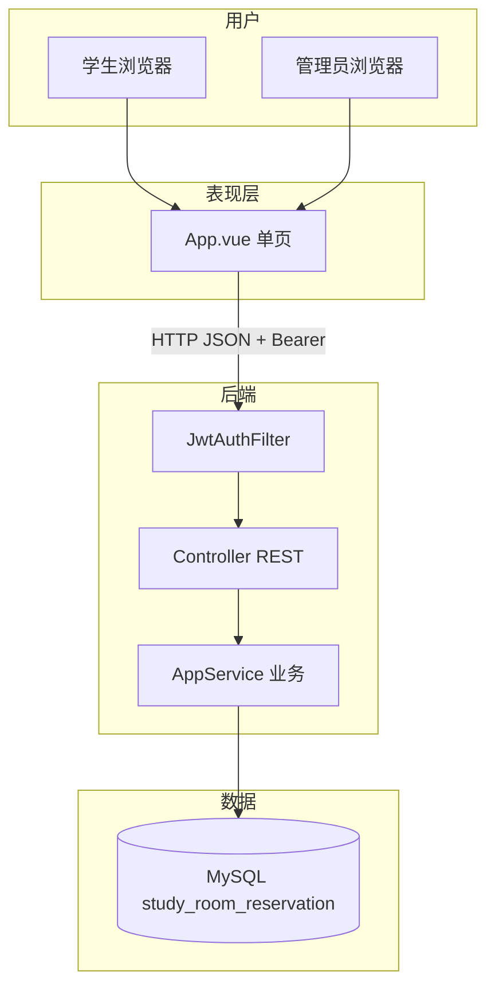
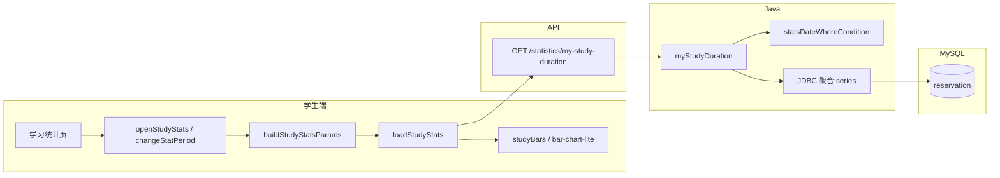
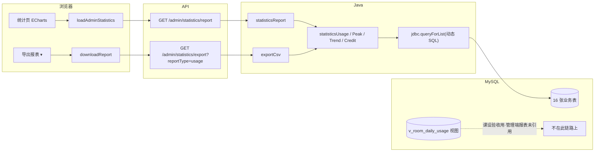

# 02 — 答辩讲解手册

> **演示实体**：小明 `202225220101`/`123456` · 小李（新注册） · 普管 `admin`/`admin123` · 超管 `superadmin`/`super123`  
> **仓库**：https://github.com/CZF312/CampusStudyRoomReservationManagementSystem  
> **演示账号**：学生 `202225220101`/`123456` · 普管 `admin`/`admin123` · 超管 `superadmin`/`super123`  
> **标签**：【演】浏览器操作 · 【讲】口述原理 · 【指】点行号（Lx 首行含 `【Fx-y】` 总体讲解）· **与 [01](01-项目理解指南.md#user-content-toc) 同 F 编号**  
> **说明**：正文由 01 同步生成，删去阅读约定与 AI 套话；定位表与行号与 01 一致。

## <a id="toc"></a>功能架构目录（根）

- **[F1 入门基础](#user-content-f1)**
  - [F1.1 环境启动](#user-content-f1-1)
  - [F1.2 技术概念（8 卡）](#user-content-f1-2)
- **[F2 认证与账号](#user-content-f2)**
  - [F2.1 学生登录](#user-content-f2-1)
  - [F2.2 管理员登录](#user-content-f2-2)
  - [F2.3 注册审核登录](#user-content-f2-3)
  - [F2.4 账号资料与安全](#user-content-f2-4)
- **[F3 自习室与预约](#user-content-f3)**
  - [F3.1 查座预约](#user-content-f3-1)
  - [F3.2 取消预约](#user-content-f3-2)
  - [F3.3 我的预约](#user-content-f3-3)
- **[F4 签到签退与信用](#user-content-f4)**
  - [F4.1 签到（学号 / 拍照 QR）](#user-content-f4-1)
  - [F4.2 签退与信用](#user-content-f4-2)
  - [F4.3 定时维护（无 UI）](#user-content-f4-3)
- **[F5 学生端辅助](#user-content-f5)**
  - [F5.1 学习统计（当期 / 往期）](#user-content-f5-1)
  - [F5.2 公告与通知](#user-content-f5-2)
  - [F5.3 问题反馈](#user-content-f5-3)
- **[F6 管理端](#user-content-f6)**
  - [F6.1 统计与 CSV 导出](#user-content-f6-1)
  - [F6.2 系统配置（超管）](#user-content-f6-2)
  - [F6.3 用户管理](#user-content-f6-3)
  - [F6.4 自习室与座位](#user-content-f6-4)
  - [F6.5 预约监管与违约撤销](#user-content-f6-5)
  - [F6.6 运营看板（实时预约）](#user-content-f6-6)
  - [F6.7 管理员与操作日志](#user-content-f6-7)
- **[F7 第三版与数据](#user-content-f7)**
  - [F7.1 数据库与 Java 分工](#user-content-f7-1)
  - [F7.2 第三版规范化](#user-content-f7-2)
  - [F7.3 前端状态 canonical](#user-content-f7-3)
  - [F7.4 十六张表](#user-content-f7-4)
- **[F8 附录：需求与代码差异](#user-content-f8)**

**页内跳转**：上列 `#user-content-f1-2` 等链接在 **GitHub 网页**可跳到对应节（须先运行 `sync_f_doc_anchors.py` 再推送）。  
**代码跳转**：表中 `blob/master/…/App.vue#L2290` 在 GitHub 打开对应行。

---

## <a id="module-overview"></a>模块总览

本系统按 **F1–F8 八大模块** 组织；每模块含若干 **子项（F x.y）**，各子项用一条 **功能链实例**（演示故事）串起前端 → API → Service → MySQL 全链路。阅读顺序建议：**模块总览（本节）→ 功能架构目录 → 具体 F 节 → 实现定位表 → 点 GitHub 行号看源码**。

### 架构分层（全项目统一）

| 层级 | 目录/技术 | 职责 | 典型 F 节 |
|------|-----------|------|-----------|
| **表现层** | `frontend/src/App.vue` · Element Plus · ECharts | 学生/管理 UI、表单、图表、JWT 存取 | F2–F6 大部分 |
| **静态资源** | `src/main/resources/static/` | Vite 构建产物，Spring Boot 同端口托管 | F1.1 |
| **接口层** | `controller/AppController.java` · `UploadController.java` | REST 路由、鉴权注解、参数绑定 | 各 F 节「Controller」行 |
| **业务层** | `service/AppService.java` · `ScheduledTaskService.java` | 业务规则、JDBC 动态 SQL、CSV 导出 | F3–F6 核心 |
| **配置/安全** | `config/JwtAuthFilter.java` · `application*.properties` | JWT 过滤、跨域、数据源 | F2 · F6.2 |
| **数据层** | `docs/06-部署配置/schema.sql` · MySQL 16 表 | 表结构、字典、视图 | F7 |
| **运维层** | `start.bat` · `scripts/start-system.ps1` | 一键建库、编译、启动 | F1.1 |



### 模块一览

| 模块 | 面向角色 | 核心职责 | 子项链接 |
|------|----------|----------|----------|
| **F1 入门基础** | 全员 / 新手 | 一键启动环境、八卡技术概念扫盲 | [F1.1 环境启动](#user-content-f1-1) · [F1.2 技术概念（8 卡）](#user-content-f1-2) |
| **F2 认证与账号** | 学生、管理员 | 登录注册、JWT 会话、资料改密 | [F2.1 学生登录](#user-content-f2-1) · [F2.2 管理员登录](#user-content-f2-2) · [F2.3 注册审核](#user-content-f2-3) · [F2.4 账号资料与安全](#user-content-f2-4) |
| **F3 自习室与预约** | 学生 | 查座预约、取消、我的预约列表 | [F3.1 查座预约](#user-content-f3-1) · [F3.2 取消预约](#user-content-f3-2) · [F3.3 我的预约](#user-content-f3-3) |
| **F4 签到签退与信用** | 学生、管理员 | 学号/QR 签到、签退、信用流水、定时违约 | [F4.1 签到](#user-content-f4-1) · [F4.2 签退与信用](#user-content-f4-2) · [F4.3 定时维护](#user-content-f4-3) |
| **F5 学生端辅助** | 学生 | 学习统计、公告通知、问题反馈 | [F5.1 学习统计](#user-content-f5-1) · [F5.2 公告与通知](#user-content-f5-2) · [F5.3 问题反馈](#user-content-f5-3) |
| **F6 管理端** | 管理员、超管 | 统计导出、配置、用户/房间/预约监管、看板、日志 | [F6.1](#user-content-f6-1) · [F6.2](#user-content-f6-2) · [F6.3](#user-content-f6-3) · [F6.4](#user-content-f6-4) · [F6.5](#user-content-f6-5) · [F6.6](#user-content-f6-6) · [F6.7](#user-content-f6-7) |
| **F7 第三版与数据** | 开发者 / 答辩 | DB 与 Java 分工、V3 字典、前端状态、16 表 | [F7.1](#user-content-f7-1) · [F7.2](#user-content-f7-2) · [F7.3](#user-content-f7-3) · [F7.4](#user-content-f7-4) |
| **F8 附录** | 答辩 / 验收 | 需求与代码差异、65 端点对照 | [F8 附录](#user-content-f8) |

---

---

## <a id="f1"></a>F1 入门基础

子项：[F1.1 环境启动](#user-content-f1-1) · [F1.2 技术概念](#user-content-f1-2)

---

### <a id="f1-1"></a>F1.1 环境启动

**功能链实例（一条龙）**  
组长双击 `start.bat` → PowerShell 导入 `database-full.sql` 建库 `study_room_reservation` → Spring Boot 监听 8080 → 浏览器打开登录页 → `verify-v3-dictionary.ps1` 输出 **PASS=17**。

#### 实现定位表

<table class="impl-loc-table">
<colgroup>
  <col width="11%" />
  <col width="27%" />
  <col width="62%" />
</colgroup>
  <tbody>
    <tr>
      <td>运维脚本 · Ops</td>
      <td>`start.bat` · 启动入口 · [L1-L31](https://github.com/CZF312/CampusStudyRoomReservationManagementSystem/blob/master/start.bat#L1-L31)</td>
      <td>**① 相关概念**：**start.bat**=Windows 双击启动脚本；**PowerShell**=微软脚本语言，负责检 Java/MySQL、导入 SQL、启动 Spring Boot；**database-full.sql**=删库后整库导入的演示数据快照；**8080**=浏览器访问端口；**PASS=17**=第三版字典 17 条自动验收。<br><br>**② 链路与职责**：用户双击后，bat 只做三件事：`cd` 到项目根、设置 `CSRRM_SCRIPT_ROOT`、以 `-ExecutionPolicy Bypass` 调用 `scripts\start-system.ps1`，最后把 PowerShell 退出码原样返回。<br><br>**③ 底层实现**：L2–L3 为 `【F1-1】` 总体讲解；L12–16 校验 `pom.xml`；L21 启动 ps1。不含业务逻辑，避免 Windows 同学手动敲 5 条命令。<br><br>**④ 设计取舍**：bat 兼容双击与答辩机无 IDE；重活交给 PowerShell（MySQL 检测、导入 SQL、mvnw）。<br><br>**⑤ 答辩要点**：问：为什么不用纯 PowerShell？答：双击 `.bat` 是 Windows 用户零学习成本入口；`.ps1` 默认策略可能拦截。</td>
    </tr>
    <tr>
      <td>运维脚本 · Ops</td>
      <td>`start-system.ps1` · 系统启动脚本 · [L1-L15](https://github.com/CZF312/CampusStudyRoomReservationManagementSystem/blob/master/scripts/start-system.ps1#L1-L15)</td>
      <td>**① 相关概念**：**start.bat**=Windows 双击启动脚本；**PowerShell**=微软脚本语言，负责检 Java/MySQL、导入 SQL、启动 Spring Boot；**database-full.sql**=删库后整库导入的演示数据快照；**8080**=浏览器访问端口；**PASS=17**=第三版字典 17 条自动验收。<br><br>**② 链路与职责**：承接 bat：[1/5] 检 Java/mysql 与 static/index.html → [2/5] 启 MySQL 服务 → [3/5] 读/写 application-local.properties 密码 → [4/5] 调 setup-after-clone.ps1（DROP+导入 database-full.sql+verify PASS=17）→ [5/5] 新窗口 `mvnw spring-boot:run` 并轮询 8080。<br><br>**③ 底层实现**：关键调用：`setup-after-clone.ps1 -SkipStart`；`Start-Process cmd /k mvnw spring-boot:run`；`Invoke-WebRequest http://localhost:8080` 最多 60 秒。环境变量 `CSRRM_MYSQL_PASSWORD` 可跳过交互。<br><br>**④ 设计取舍**：导入与启动解耦：库坏了可只跑 setup；8080 已在线则跳过第二实例。<br><br>**⑤ 答辩要点**：问：克隆后没 Node 能跑吗？答：可以，仓库已带 `src/main/resources/static` 预构建前端。</td>
    </tr>
    <tr>
      <td>业务层 · Service</td>
      <td>`DatabaseInitializer.run` · 数据库初始化 · [L14-L38](https://github.com/CZF312/CampusStudyRoomReservationManagementSystem/blob/master/src/main/java/com/scau/campusstudyroomreservationmanagementsystem/service/DatabaseInitializer.java#L14-L38)</td>
      <td>**① 相关概念**：**@PostConstruct**、**JdbcTemplate.execute**、classpath schema 补丁<br><br>**② 链路与职责**：Spring Boot 启动后 @PostConstruct/run：若表不存在则执行 classpath schema 补丁（与 database-full.sql 导入互补）。<br><br>**③ 底层实现**：读 resources 下 SQL；JdbcTemplate 执行 DDL/DML；与 clone 后 ps1 全量导入分工：ps1 负责演示数据，Initializer 负责增量迁移。<br><br>**④ 设计取舍**：Java 侧可版本化补丁，不必每次手动改 SQL 文件。<br><br>**⑤ 答辩要点**：问：数据从哪来？答：答辩机以 start.bat 导入 database-full.sql 为主；Initializer 防表缺失。</td>
    </tr>
    <tr>
      <td>应用入口 · Application</td>
      <td>`main` · 主函数 · [L14-L16](https://github.com/CZF312/CampusStudyRoomReservationManagementSystem/blob/master/src/main/java/com/scau/campusstudyroomreservationmanagementsystem/CampusStudyRoomReservationManagementSystemApplication.java#L14-L16)</td>
      <td>**① 相关概念**：**SpringApplication.run**、**@SpringBootApplication**、内嵌 Tomcat 监听 8080<br><br>**② 链路与职责**：mvnw spring-boot:run 入口：SpringApplication.run 启动内嵌 Tomcat、扫描 @Component、挂载 static 与 /api。<br><br>**③ 底层实现**：CampusStudyRoomReservationManagementSystemApplication.main；@SpringBootApplication 含 @EnableScheduling（F4.3 定时）；默认 port 8080。<br><br>**④ 设计取舍**：标准 Boot 单 jar 部署，答辩机只需 Java+MySQL。<br><br>**⑤ 答辩要点**：问：前端怎么访问？答：同端口 8080，/ 返回 index.html，/api 进 Controller。</td>
    </tr>
    <tr>
      <td>运维脚本 · Ops</td>
      <td>`verify-v3-dictionary.ps1` · 字典验收 · [L1-L20](https://github.com/CZF312/CampusStudyRoomReservationManagementSystem/blob/master/scripts/verify-v3-dictionary.ps1#L1-L20)</td>
      <td>**① 相关概念**：**start.bat**=Windows 双击启动脚本；**PowerShell**=微软脚本语言，负责检 Java/MySQL、导入 SQL、启动 Spring Boot；**database-full.sql**=删库后整库导入的演示数据快照；**8080**=浏览器访问端口；**PASS=17**=第三版字典 17 条自动验收。<br><br>**② 链路与职责**：setup-after-clone 导入后自动调用：17 项 CHECK（16 表、无 temp_leave、中文字典、演示账号、uploads 文件等）。<br><br>**③ 底层实现**：mysql 客户端执行 information_schema 与抽样 SELECT；输出 PASS/FAIL 计数；失败 exit 1。<br><br>**④ 设计取舍**：答辩前一条命令验第三版规范，不需打开数据库客户端。<br><br>**⑤ 答辩要点**：问：PASS=17 是什么？答：第三版字典 17 条验收，见脚本内注释与 F7.2。</td>
    </tr>
  </tbody>
</table>


[↑ 目录](#user-content-toc) · [↑ F1](#user-content-f1)

---

### <a id="f1-2"></a>F1.2 技术概念（8 卡）

**功能链实例**  
小明点「确认预约」→ 浏览器用 **Vue** 发 **HTTP** **JSON** 到 **REST API** → **Controller** 转 **Service** 写 **MySQL** → 返回 **JSON** `code:200`；登录后请求头带 **JWT token**。

#### 实现定位表


<table class="impl-loc-table">
<colgroup>
  <col width="12%" />
  <col width="18%" />
  <col width="22%" />
  <col width="48%" />
</colgroup>
  <tbody>
    <tr>
      <td>Browser 浏览器</td>
      <td>打开 8080 见登录框</td>
      <td>**① 相关概念**：**浏览器**=看网页的程序；**Vue**=把数据绑到页面、点按钮不发整页刷新；**HTTP**=浏览器与服务器对话的规则；**JSON**= `{键:值}` 文本格式；**REST**=用 URL 表资源、用 GET/POST 表操作；**JWT**=登录后发的加密通行证；**MySQL**=存数据的库。<br><br>**② 链路与职责**：「小明点「确认预约」→ 浏览器用 **Vue** 发 **HTTP** **JSON** 到 **REST API** → **Controller** 转 **Service** 写 **MySQL…」→ `打开 8080 见登录框`（Browser 浏览器）：见 定位列 GitHub 链接 与上下表行衔接。<br><br>**③ 底层实现**：定位列 GitHub 链接：首行 `【Fx-y】` 总体讲解，随后每 executable 行 `【行】` 中文注释。<br><br>**④ 设计取舍**：与 F1.2 分层一致，职责边界见模块总览表。<br><br>**⑤ 答辩要点**：问：这一行在故事哪步？答：对照本节功能链实例顺序，符号 `打开 8080 见登录框` 所在行。</td>
      <td></td>
    </tr>
    <tr>
      <td>Vue 单页框架</td>
      <td>点预约不换网址</td>
      <td>**① 相关概念**：**浏览器**=看网页的程序；**Vue**=把数据绑到页面、点按钮不发整页刷新；**HTTP**=浏览器与服务器对话的规则；**JSON**= `{键:值}` 文本格式；**REST**=用 URL 表资源、用 GET/POST 表操作；**JWT**=登录后发的加密通行证；**MySQL**=存数据的库。<br><br>**② 链路与职责**：「小明点「确认预约」→ 浏览器用 **Vue** 发 **HTTP** **JSON** 到 **REST API** → **Controller** 转 **Service** 写 **MySQL…」→ `点预约不换网址`（Vue 单页框架）：见 定位列 GitHub 链接 与上下表行衔接。<br><br>**③ 底层实现**：定位列 GitHub 链接：首行 `【Fx-y】` 总体讲解，随后每 executable 行 `【行】` 中文注释。<br><br>**④ 设计取舍**：与 F1.2 分层一致，职责边界见模块总览表。<br><br>**⑤ 答辩要点**：问：这一行在故事哪步？答：对照本节功能链实例顺序，符号 `点预约不换网址` 所在行。</td>
      <td></td>
    </tr>
    <tr>
      <td>HTTP 请求</td>
      <td>幕后 POST JSON</td>
      <td>**① 相关概念**：**浏览器**=看网页的程序；**Vue**=把数据绑到页面、点按钮不发整页刷新；**HTTP**=浏览器与服务器对话的规则；**JSON**= `{键:值}` 文本格式；**REST**=用 URL 表资源、用 GET/POST 表操作；**JWT**=登录后发的加密通行证；**MySQL**=存数据的库。<br><br>**② 链路与职责**：「小明点「确认预约」→ 浏览器用 **Vue** 发 **HTTP** **JSON** 到 **REST API** → **Controller** 转 **Service** 写 **MySQL…」→ `幕后 POST JSON`（HTTP 请求）：见 定位列 GitHub 链接 与上下表行衔接。<br><br>**③ 底层实现**：定位列 GitHub 链接：首行 `【Fx-y】` 总体讲解，随后每 executable 行 `【行】` 中文注释。<br><br>**④ 设计取舍**：与 F1.2 分层一致，职责边界见模块总览表。<br><br>**⑤ 答辩要点**：问：这一行在故事哪步？答：对照本节功能链实例顺序，符号 `幕后 POST JSON` 所在行。</td>
      <td></td>
    </tr>
    <tr>
      <td>JSON 数据格式</td>
      <td>`{"code":200}`</td>
      <td>**① 相关概念**：**浏览器**=看网页的程序；**Vue**=把数据绑到页面、点按钮不发整页刷新；**HTTP**=浏览器与服务器对话的规则；**JSON**= `{键:值}` 文本格式；**REST**=用 URL 表资源、用 GET/POST 表操作；**JWT**=登录后发的加密通行证；**MySQL**=存数据的库。<br><br>**② 链路与职责**：「小明点「确认预约」→ 浏览器用 **Vue** 发 **HTTP** **JSON** 到 **REST API** → **Controller** 转 **Service** 写 **MySQL…」→ `{"code":200}`（JSON 数据格式）：见 定位列 GitHub 链接 与上下表行衔接。<br><br>**③ 底层实现**：定位列 GitHub 链接：首行 `【Fx-y】` 总体讲解，随后每 executable 行 `【行】` 中文注释。<br><br>**④ 设计取舍**：与 F1.2 分层一致，职责边界见模块总览表。<br><br>**⑤ 答辩要点**：问：这一行在故事哪步？答：对照本节功能链实例顺序，符号 `{"code":200}` 所在行。</td>
      <td></td>
    </tr>
    <tr>
      <td>REST API</td>
      <td>`/api/reservations`</td>
      <td>**① 相关概念**：**reservation_slot**（10 分钟片）、**uk_seat_slot**、**reservation.status**、**reservation_no**<br><br>**② 链路与职责**：「小明点「确认预约」→ 浏览器用 **Vue** 发 **HTTP** **JSON** 到 **REST API** → **Controller** 转 **Service** 写 **MySQL…」→ `reservations`（REST API）：见 定位列 GitHub 链接 与上下表行衔接。<br><br>**③ 底层实现**：定位列 GitHub 链接：首行 `【Fx-y】` 总体讲解，随后每 executable 行 `【行】` 中文注释。<br><br>**④ 设计取舍**：与 F1.2 分层一致，职责边界见模块总览表。<br><br>**⑤ 答辩要点**：问：这一行在故事哪步？答：对照本节功能链实例顺序，符号 `reservations` 所在行。</td>
      <td></td>
    </tr>
    <tr>
      <td>Service 业务层</td>
      <td>算预约规则</td>
      <td>**① 相关概念**：**浏览器**=看网页的程序；**Vue**=把数据绑到页面、点按钮不发整页刷新；**HTTP**=浏览器与服务器对话的规则；**JSON**= `{键:值}` 文本格式；**REST**=用 URL 表资源、用 GET/POST 表操作；**JWT**=登录后发的加密通行证；**MySQL**=存数据的库。；**JdbcTemplate**<br><br>**② 链路与职责**：「小明点「确认预约」→ 浏览器用 **Vue** 发 **HTTP** **JSON** 到 **REST API** → **Controller** 转 **Service** 写 **MySQL…」→ `算预约规则`：JdbcTemplate 参数化 SQL + 业务校验（BusinessException 中文 message）+ 必要时写 credit_log/notifyUser。<br><br>**③ 底层实现**：定位列 GitHub 链接：`AppService.算预约规则`；涉及表 **SPA 单页应用**、**REST**（资源风格 URL + HTTP 动词）、**JSON**（键值文本交换格式）；status 枚举与 schema.sql 第三版中文 CHECK 一致。<br><br>**④ 设计取舍**：规则集中 Service，Controller 与 @Scheduled 复用，避免双份逻辑。<br><br>**⑤ 答辩要点**：问：为何不用 JPA？答：动态报表 SQL 多，JDBC 便于答辩展示 SQL 字符串（F7.1）。</td>
      <td></td>
    </tr>
    <tr>
      <td>MySQL 数据库</td>
      <td>reservation 多一行</td>
      <td>**① 相关概念**：**reservation_slot**（10 分钟片）、**uk_seat_slot**、**reservation.status**、**reservation_no**<br><br>**② 链路与职责**：「小明点「确认预约」→ 浏览器用 **Vue** 发 **HTTP** **JSON** 到 **REST API** → **Controller** 转 **Service** 写 **MySQL…」→ `reservation 多一行`（MySQL 数据库）：见 定位列 GitHub 链接 与上下表行衔接。<br><br>**③ 底层实现**：定位列 GitHub 链接：首行 `【Fx-y】` 总体讲解，随后每 executable 行 `【行】` 中文注释。<br><br>**④ 设计取舍**：与 F1.2 分层一致，职责边界见模块总览表。<br><br>**⑤ 答辩要点**：问：这一行在故事哪步？答：对照本节功能链实例顺序，符号 `reservation 多一行` 所在行。</td>
      <td></td>
    </tr>
    <tr>
      <td>JWT 令牌</td>
      <td>Header Bearer</td>
      <td>**① 相关概念**：**浏览器**=看网页的程序；**Vue**=把数据绑到页面、点按钮不发整页刷新；**HTTP**=浏览器与服务器对话的规则；**JSON**= `{键:值}` 文本格式；**REST**=用 URL 表资源、用 GET/POST 表操作；**JWT**=登录后发的加密通行证；**MySQL**=存数据的库。<br><br>**② 链路与职责**：「小明点「确认预约」→ 浏览器用 **Vue** 发 **HTTP** **JSON** 到 **REST API** → **Controller** 转 **Service** 写 **MySQL…」→ `Header Bearer`（JWT 令牌）：见 定位列 GitHub 链接 与上下表行衔接。<br><br>**③ 底层实现**：定位列 GitHub 链接：首行 `【Fx-y】` 总体讲解，随后每 executable 行 `【行】` 中文注释。<br><br>**④ 设计取舍**：与 F1.2 分层一致，职责边界见模块总览表。<br><br>**⑤ 答辩要点**：问：这一行在故事哪步？答：对照本节功能链实例顺序，符号 `Header Bearer` 所在行。</td>
      <td></td>
    </tr>
  </tbody>
</table>


[↑ 目录](#user-content-toc) · [↑ F1](#user-content-f1)

---

## <a id="f2"></a>F2 认证与账号

子项：[F2.1](#user-content-f2-1) · [F2.2](#user-content-f2-2) · [F2.3](#user-content-f2-3)

---

### <a id="f2-1"></a>F2.1 学生登录

**功能链实例（一条龙）**  
小明在登录页输入 `202225220101` / `123456` → 点「登录」→ 首页显示「你好，小明」→ 再进「我的预约」无需重输密码（`localStorage` 已有 token）。

#### 实现定位表

<table class="impl-loc-table">
<colgroup>
  <col width="11%" />
  <col width="27%" />
  <col width="62%" />
</colgroup>
  <tbody>
    <tr>
      <td>表现层 Presentation</td>
      <td>`loginStudent` 模板区 · 学生登录表单 · `frontend/src/App.vue` · [L2457-L2472](https://github.com/CZF312/CampusStudyRoomReservationManagementSystem/blob/master/frontend/src/App.vue#L2457-L2472)</td>
      <td>**① 相关概念**：**v-model**（双向绑定）、**el-form**（表单校验）、**@click**（触发 loginStudent）<br><br>**② 链路与职责**：小明输入学号密码点登录：模板 v-model 绑定 studentLogin → @click 调 loginStudent()。<br><br>**③ 底层实现**：el-form + el-input；L2457–2472 `【F2-1】`；不含 BCrypt，仅收集 studentId/password 字段。<br><br>**④ 设计取舍**：表现层零业务：密码强度/审核状态全在后端 Service。<br><br>**⑤ 答辩要点**：问：前端校验什么？答：非空与格式；密码对错由 BCrypt 在后端比对。</td>
    </tr>
    <tr>
      <td>表现层 Presentation</td>
      <td>`loginStudent` · 学生登录 · `frontend/src/App.vue` · [L2457-L2472](https://github.com/CZF312/CampusStudyRoomReservationManagementSystem/blob/master/frontend/src/App.vue#L2457-L2472)</td>
      <td>**① 相关概念**：**BCrypt.matches**、**JwtService.createToken**、**afterLogin**（写 token + 切页）<br><br>**② 链路与职责**：async loginStudent()：读 studentLogin ref → call('post','/auth/login') → afterLogin(token,'STUDENT',data)。<br><br>**③ 底层实现**：L2457+ JS 函数；authLoading 防重复提交；catch notify(e.message) 显示待审核等后端文案。<br><br>**④ 设计取舍**：JS 不解析 JWT，只存字符串；角色由 login 响应 role 字段决定。<br><br>**⑤ 答辩要点**：问：remember me？答：课设未做，token 存 localStorage 即持久登录。</td>
    </tr>
    <tr>
      <td>接口层 Controller</td>
      <td>`login` · 学生登录接口 · `controller/AppController.java` · [L40-L42](https://github.com/CZF312/CampusStudyRoomReservationManagementSystem/blob/master/src/main/java/com/scau/campusstudyroomreservationmanagementsystem/controller/AppController.java#L40-L42)</td>
      <td>**① 相关概念**：**POST /api/auth/login**、**LoginRequest DTO**、**ApiResponse.ok(tokenDto)**<br><br>**② 链路与职责**：POST `/api/auth/login`：@RequestBody LoginRequest → service.loginStudent → 返回 token DTO。<br><br>**③ 底层实现**：`@PostMapping("/auth/login")`；白名单免 JWT；return ApiResponse.ok(jwtService...)；HTTP 200 即使业务 403 也在 body.code。<br><br>**④ 设计取舍**：登录端点独立白名单；与学生/管理员分路径见 F2.2。<br><br>**⑤ 答辩要点**：问：登录失败 HTTP 码？答：多数仍 200，message 中文说明；403 待审核见 Service 抛错。</td>
    </tr>
    <tr>
      <td>业务层 Service</td>
      <td>`loginStudent` · 学生登录校验 · `service/AppService.java` · [L184-L207](https://github.com/CZF312/CampusStudyRoomReservationManagementSystem/blob/master/src/main/java/com/scau/campusstudyroomreservationmanagementsystem/service/AppService.java#L184-L207)</td>
      <td>**① 相关概念**：**BCrypt.matches**、**JwtService.createToken**、**afterLogin**（写 token + 切页）<br><br>**② 链路与职责**：Controller 传入 LoginRequest：SELECT user_account BY student_no → 校验 auditStatus=已通过、非禁用、非黑名单 → BCrypt.matches → createToken。<br><br>**③ 底层实现**：L184–207 AppService；失败抛 BusinessException(403/401) 中文 message；成功 Map 含 token 与 user 摘要。<br><br>**④ 设计取舍**：所有登录安全策略集中 Service，Controller 与 adminLogin 共用 JwtService。<br><br>**⑤ 答辩要点**：问：密码怎么存？答：user_account.password_hash BCrypt，永不回传明文。</td>
    </tr>
    <tr>
      <td>配置层 Config</td>
      <td>`createToken` · 签发令牌 · `config/JwtService.java` · [L28-L41](https://github.com/CZF312/CampusStudyRoomReservationManagementSystem/blob/master/src/main/java/com/scau/campusstudyroomreservationmanagementsystem/config/JwtService.java#L28-L41)</td>
      <td>**① 相关概念**：**BCrypt**=密码单向加密，库中不存明文；**JWT**=登录成功后的一串 token，以后请求 Header 带上即可证明身份；**localStorage**=浏览器本地小仓库，刷新页面 token 仍在；**user_account**=学生账号表；**auditStatus**=待审核/已通过，待审核不能登录。<br><br>**② 链路与职责**：loginStudent 校验通过后：Service 调 JwtService.createToken(userId, role) 生成 HS256 签名字符串。<br><br>**③ 底层实现**：claims 含 sub=userId、role=STUDENT；secret 来自 application.properties jwt.secret；exp 默认 24h；返回 compact JWT 字符串给 Controller 包装进 data.token。<br><br>**④ 设计取舍**：签发集中在一处，Filter 与 Service 共用同一 JwtService 解析/验证逻辑。<br><br>**⑤ 答辩要点**：问：token 里存密码吗？答：不存，只存 userId 与 role 等非敏感 claims。</td>
    </tr>
    <tr>
      <td>表现层 Presentation</td>
      <td>`afterLogin` · 登录后处理 · `frontend/src/App.vue` · [L2491-L2499](https://github.com/CZF312/CampusStudyRoomReservationManagementSystem/blob/master/frontend/src/App.vue#L2491-L2499)</td>
      <td>**① 相关概念**：**BCrypt**、**JWT Bearer**、**localStorage**、**user_account.auditStatus**<br><br>**② 链路与职责**：loginStudent 收到 token 后：写 token/role ref 与 localStorage → toast → bootstrap(false) 拉 /auth/me 补全用户信息 → 切 studentPage。<br><br>**③ 底层实现**：L2491–2498：`localStorage.setItem('token',t)`；`await bootstrap(false)` 不再跳登录页；me ref 存昵称/学号等展示字段。<br><br>**④ 设计取舍**：前端会话状态双写 ref+localStorage，刷新时 bootstrap 读 localStorage 恢复。<br><br>**⑤ 答辩要点**：问：为何还要 bootstrap？答：token 只含 id/role，展示名等从 /auth/me 拉最新 profile。</td>
    </tr>
    <tr>
      <td>配置层 Config</td>
      <td>`doFilterInternal` · JWT 过滤 · `config/JwtAuthFilter.java` · [L29-L47](https://github.com/CZF312/CampusStudyRoomReservationManagementSystem/blob/master/src/main/java/com/scau/campusstudyroomreservationmanagementsystem/config/JwtAuthFilter.java#L29-L47)</td>
      <td>**① 相关概念**：**BCrypt**=密码单向加密，库中不存明文；**JWT**=登录成功后的一串 token，以后请求 Header 带上即可证明身份；**localStorage**=浏览器本地小仓库，刷新页面 token 仍在；**user_account**=学生账号表；**auditStatus**=待审核/已通过，待审核不能登录。<br><br>**② 链路与职责**：除 login/register 外，每个 `/api/**` 请求先经此过滤器解析 Bearer，再进 Controller。<br><br>**③ 底层实现**：读 Header Authorization；JwtService.parse；设 SecurityContext userId/role；失败 401 JSON。<br><br>**④ 设计取舍**：统一鉴权，Controller 用 @AuthenticationPrincipal 取当前用户。<br><br>**⑤ 答辩要点**：问：哪些接口免鉴权？答：登录注册与 static 资源，见 SecurityConfig 白名单。</td>
    </tr>
    <tr>
      <td>支撑层 Support</td>
      <td>`ok` · 成功响应包装 · `support/ApiResponse.java` · [L7-L10](https://github.com/CZF312/CampusStudyRoomReservationManagementSystem/blob/master/src/main/java/com/scau/campusstudyroomreservationmanagementsystem/support/ApiResponse.java#L7-L10)</td>
      <td>**① 相关概念**：**BCrypt**=密码单向加密，库中不存明文；**JWT**=登录成功后的一串 token，以后请求 Header 带上即可证明身份；**localStorage**=浏览器本地小仓库，刷新页面 token 仍在；**user_account**=学生账号表；**auditStatus**=待审核/已通过，待审核不能登录。<br><br>**② 链路与职责**：几乎所有 Controller 成功路径：`return ApiResponse.ok(data)` 统一 `{code:200, message:'ok', data:...}`。<br><br>**③ 底层实现**：静态工厂 `ApiResponse.ok(T data)` 设 code=200；Jackson 序列化为 JSON；前端 call() 判断 res.code===200 取 data。<br><br>**④ 设计取舍**：业务错误也常用 200+code≠200 或 BusinessExceptionHandler，login 失败 message 中文可读。<br><br>**⑤ 答辩要点**：问：为何不用 HTTP 4xx 表示业务失败？答：课设统一 JSON 包装，前端只解析 body.code/message。</td>
    </tr>
    <tr>
      <td>表现层 Presentation</td>
      <td>`bootstrap` · 刷新恢复会话 · `frontend/src/App.vue` · [L2564-L2581](https://github.com/CZF312/CampusStudyRoomReservationManagementSystem/blob/master/frontend/src/App.vue#L2564-L2581)</td>
      <td>**① 相关概念**：**BCrypt**=密码单向加密，库中不存明文；**JWT**=登录成功后的一串 token，以后请求 Header 带上即可证明身份；**localStorage**=浏览器本地小仓库，刷新页面 token 仍在；**user_account**=学生账号表；**auditStatus**=待审核/已通过，待审核不能登录。；**Vue ref/computed**<br><br>**② 链路与职责**：页面 mounted：若 localStorage 有 token 则 GET `/auth/me` 恢复 user，否则回登录页。<br><br>**③ 底层实现**：`call('get','/auth/me')`；成功则填充 user/studentPage；401 则 clearToken。<br><br>**④ 设计取舍**：刷新不掉线，演示体验好；token 无效必须清本地缓存。<br><br>**⑤ 答辩要点**：问：Session 存在哪？答：无服务端 Session，仅 JWT+localStorage。</td>
    </tr>
    <tr>
      <td>接口层 Controller</td>
      <td>`me` · 当前用户接口 · `controller/AppController.java` · [L52-L54](https://github.com/CZF312/CampusStudyRoomReservationManagementSystem/blob/master/src/main/java/com/scau/campusstudyroomreservationmanagementsystem/controller/AppController.java#L52-L54)</td>
      <td>**① 相关概念**：**BCrypt**=密码单向加密，库中不存明文；**JWT**=登录成功后的一串 token，以后请求 Header 带上即可证明身份；**localStorage**=浏览器本地小仓库，刷新页面 token 仍在；**user_account**=学生账号表；**auditStatus**=待审核/已通过，待审核不能登录。；**@RestController**<br><br>**② 链路与职责**：bootstrap 或登录后：GET `/auth/me`（Bearer）→ 本方法取 SecurityContext userId → Service 查 user_account 返回 DTO。<br><br>**③ 底层实现**：`@GetMapping("/auth/me")`；需 JWT；return ApiResponse.ok(service.getCurrentUser(userId))；含 studentNo/name/creditScore/auditStatus 等。<br><br>**④ 设计取舍**：「我是谁」只读接口，支撑刷新恢复与 header 展示，不写库。<br><br>**⑤ 答辩要点**：问：与 login 区别？答：login 验密签发 token；me 只解析已有 token 返回资料。</td>
    </tr>
  </tbody>
</table>


[↑ 目录](#user-content-toc) · [↑ F2](#user-content-f2) · 并列：[F2.2](#user-content-f2-2) · [F2.3](#user-content-f2-3) · [F2.4](#user-content-f2-4)

---

### <a id="f2-2"></a>F2.2 管理员登录

**功能链实例（一条龙）**  
管理员切到「管理员登录」→ 输入 `admin` / `admin123` → 进入管理端签到页；`superadmin` 侧栏额外显示「设置」「管理员管理」。

#### 实现定位表

<table class="impl-loc-table">
<colgroup>
  <col width="11%" />
  <col width="27%" />
  <col width="62%" />
</colgroup>
  <tbody>
    <tr>
      <td>表现层 Presentation</td>
      <td>管理员登录模板 · admin login template · `frontend/src/App.vue` · [L28-L41](https://github.com/CZF312/CampusStudyRoomReservationManagementSystem/blob/master/frontend/src/App.vue#L28-L41)</td>
      <td>**① 相关概念**：**v-model**（双向绑定）、**el-form**（表单校验）、**@click**（触发 loginStudent）<br><br>**② 链路与职责**：小明输入学号密码点登录：模板 v-model 绑定 studentLogin → @click 调 loginStudent()。<br><br>**③ 底层实现**：el-form + el-input；L2457–2472 `【F2-1】`；不含 BCrypt，仅收集 studentId/password 字段。<br><br>**④ 设计取舍**：表现层零业务：密码强度/审核状态全在后端 Service。<br><br>**⑤ 答辩要点**：问：前端校验什么？答：非空与格式；密码对错由 BCrypt 在后端比对。</td>
    </tr>
    <tr>
      <td>表现层 Presentation</td>
      <td>`loginAdmin` · 管理员登录 · `frontend/src/App.vue` · [L2474-L2489](https://github.com/CZF312/CampusStudyRoomReservationManagementSystem/blob/master/frontend/src/App.vue#L2474-L2489)</td>
      <td>**① 相关概念**：**BCrypt**、**JWT Bearer**、**localStorage**、**user_account.auditStatus**<br><br>**② 链路与职责**：管理员 tab 输入账号密码 → POST `/admin/auth/login` → afterLogin(token,'ADMIN',info) → adminPage 切 dashboard。<br><br>**③ 底层实现**：L2474–2489 `【F2-2】`；adminLoginForm ref；与学生 loginStudent 分表单分 endpoint；role 写 ADMIN/SUPER_ADMIN。<br><br>**④ 设计取舍**：学生与管理员 JWT role 不同，后端 Security 可限制 /admin/** 仅 ADMIN。<br><br>**⑤ 答辩要点**：问：同一浏览器能同时登学生和管理员吗？答：会覆盖 localStorage token，演示时分开浏览器或先 logout。</td>
    </tr>
    <tr>
      <td>接口层 Controller</td>
      <td>`adminLogin` · 管理员登录接口 · `controller/AppController.java` · [L46-L48](https://github.com/CZF312/CampusStudyRoomReservationManagementSystem/blob/master/src/main/java/com/scau/campusstudyroomreservationmanagementsystem/controller/AppController.java#L46-L48)</td>
      <td>**① 相关概念**：**BCrypt**、**JWT Bearer**、**localStorage**、**user_account.auditStatus**<br><br>**② 链路与职责**：POST `/admin/auth/login`：查 admin_account 表 BCrypt 比对 → 签发 role=ADMIN 的 JWT。<br><br>**③ 底层实现**：`@PostMapping("/admin/auth/login")`；Service.loginAdmin；白名单免 JWT；返回 token+admin 信息。<br><br>**④ 设计取舍**：与学生 user_account 分表，避免学号与工号混用同一 login SQL。<br><br>**⑤ 答辩要点**：问：superadmin 怎么区分？答：admin_account.role=SUPER_ADMIN，前端部分菜单 v-if 控制。</td>
    </tr>
    <tr>
      <td>业务层 Service</td>
      <td>`loginAdmin` · 管理员校验 · `service/AppService.java` · [L209-L224](https://github.com/CZF312/CampusStudyRoomReservationManagementSystem/blob/master/src/main/java/com/scau/campusstudyroomreservationmanagementsystem/service/AppService.java#L209-L224)</td>
      <td>**① 相关概念**：**BCrypt**、**JWT Bearer**、**localStorage**、**user_account.auditStatus**<br><br>**② 链路与职责**：管理员 tab 输入账号密码 → POST `/admin/auth/login` → afterLogin(token,'ADMIN',info) → adminPage 切 dashboard。<br><br>**③ 底层实现**：L2474–2489 `【F2-2】`；adminLoginForm ref；与学生 loginStudent 分表单分 endpoint；role 写 ADMIN/SUPER_ADMIN。<br><br>**④ 设计取舍**：学生与管理员 JWT role 不同，后端 Security 可限制 /admin/** 仅 ADMIN。<br><br>**⑤ 答辩要点**：问：同一浏览器能同时登学生和管理员吗？答：会覆盖 localStorage token，演示时分开浏览器或先 logout。</td>
    </tr>
    <tr>
      <td>表现层 Presentation</td>
      <td>`isSuperAdmin` · 超管判断 · `frontend/src/App.vue` · [L1612-L1613](https://github.com/CZF312/CampusStudyRoomReservationManagementSystem/blob/master/frontend/src/App.vue#L1618-L1619)</td>
      <td>**① 相关概念**：**admin_account**=管理员账号表（与学生表分开）；**role**=ADMIN 普管 / SUPER_ADMIN 超管，决定能进哪些菜单；**独立登录接口**=`/admin/auth/login` 与学生 `/auth/login` 分离。；**Vue ref/computed**<br><br>**② 链路与职责**：「管理员切到「管理员登录」→ 输入 `admin` / `admin123` → 进入管理端签到页；`superadmin` 侧栏额外显示「设置」「管理员管理」。」→ `isSuperAdmin`：改 ref/弹窗 → `call('post/put', '/api/...')` → 更新 UI；不直连 MySQL。<br><br>**③ 底层实现**：GitHub L1612 起 `【Fx-y】`+`【行】`：`App.vue` 中 async 函数或模板 `@click`；JWT 由 call() 从 localStorage 注入 Authorization。<br><br>**④ 设计取舍**：表现层只交互与展示，权威数据与计算在后端 Service。<br><br>**⑤ 答辩要点**：问：前端为何不算信用/时长？答：`isSuperAdmin` 只发 HTTP，分数与 status 以 API 响应为准。</td>
    </tr>
  </tbody>
</table>


[↑ 目录](#user-content-toc) · [↑ F2](#user-content-f2)

---

### <a id="f2-3"></a>F2.3 注册审核登录

**功能链实例（一条龙）**  
小李注册并上传 PDF 材料 → 尝试登录得「注册资料待审核」→ 管理员在用户管理点「通过」→ 小李再登录进入首页。

#### 实现定位表

<table class="impl-loc-table">
<colgroup>
  <col width="11%" />
  <col width="27%" />
  <col width="62%" />
</colgroup>
  <tbody>
    <tr>
      <td>表现层 Presentation</td>
      <td>`onRegisterFile` · 注册材料上传 · `frontend/src/App.vue` · [L2435-L2450](https://github.com/CZF312/CampusStudyRoomReservationManagementSystem/blob/master/frontend/src/App.vue#L2435-L2450)</td>
      <td>**① 相关概念**：**BCrypt**、**JWT Bearer**、**localStorage**、**user_account.auditStatus**<br><br>**② 链路与职责**：「小李注册并上传 PDF 材料 → 尝试登录得「注册资料待审核」→ 管理员在用户管理点「通过」→ 小李再登录进入首页。」→ `onRegisterFile`：改 ref/弹窗 → `call('post/put', '/api/...')` → 更新 UI；不直连 MySQL。<br><br>**③ 底层实现**：GitHub L2435 起 `【Fx-y】`+`【行】`：`App.vue` 中 async 函数或模板 `@click`；JWT 由 call() 从 localStorage 注入 Authorization。<br><br>**④ 设计取舍**：表现层只交互与展示，权威数据与计算在后端 Service。<br><br>**⑤ 答辩要点**：问：前端为何不算信用/时长？答：`onRegisterFile` 只发 HTTP，分数与 status 以 API 响应为准。</td>
    </tr>
    <tr>
      <td>接口层 Controller</td>
      <td>`registerUpload` · 注册上传接口 · `controller/UploadController.java` · [L32-L34](https://github.com/CZF312/CampusStudyRoomReservationManagementSystem/blob/master/src/main/java/com/scau/campusstudyroomreservationmanagementsystem/controller/UploadController.java#L32-L34)</td>
      <td>**① 相关概念**：**BCrypt**、**JWT Bearer**、**localStorage**、**user_account.auditStatus**<br><br>**② 链路与职责**：小李填表+上传 PDF → POST `/auth/register` Multipart → auditStatus=待审核 → 尝试 login 得 403 待审核提示。<br><br>**③ 底层实现**：前端 L2501+ 校验 12 位学号；FormData 含 registerUpload；Service INSERT user_account+profile；密码 BCrypt 哈希。<br><br>**④ 设计取舍**：注册成功不等于可登录，须 F2.3 管理员 approve。<br><br>**⑤ 答辩要点**：问：PDF 存哪？答：UploadController 存 uploads/ 目录，路径写 student_profile 字段。</td>
    </tr>
    <tr>
      <td>表现层 Presentation</td>
      <td>`register` · 提交注册 · `frontend/src/App.vue` · [L2501-L2554](https://github.com/CZF312/CampusStudyRoomReservationManagementSystem/blob/master/frontend/src/App.vue#L2501-L2554)</td>
      <td>**① 相关概念**：**BCrypt**、**JWT Bearer**、**localStorage**、**user_account.auditStatus**<br><br>**② 链路与职责**：小李填表+上传 PDF → POST `/auth/register` Multipart → auditStatus=待审核 → 尝试 login 得 403 待审核提示。<br><br>**③ 底层实现**：前端 L2501+ 校验 12 位学号；FormData 含 registerUpload；Service INSERT user_account+profile；密码 BCrypt 哈希。<br><br>**④ 设计取舍**：注册成功不等于可登录，须 F2.3 管理员 approve。<br><br>**⑤ 答辩要点**：问：PDF 存哪？答：UploadController 存 uploads/ 目录，路径写 student_profile 字段。</td>
    </tr>
    <tr>
      <td>接口层 Controller</td>
      <td>`register` · 注册接口 · `controller/AppController.java` · [L34-L36](https://github.com/CZF312/CampusStudyRoomReservationManagementSystem/blob/master/src/main/java/com/scau/campusstudyroomreservationmanagementsystem/controller/AppController.java#L34-L36)</td>
      <td>**① 相关概念**：**BCrypt**、**JWT Bearer**、**localStorage**、**user_account.auditStatus**<br><br>**② 链路与职责**：小李填表+上传 PDF → POST `/auth/register` Multipart → auditStatus=待审核 → 尝试 login 得 403 待审核提示。<br><br>**③ 底层实现**：前端 L2501+ 校验 12 位学号；FormData 含 registerUpload；Service INSERT user_account+profile；密码 BCrypt 哈希。<br><br>**④ 设计取舍**：注册成功不等于可登录，须 F2.3 管理员 approve。<br><br>**⑤ 答辩要点**：问：PDF 存哪？答：UploadController 存 uploads/ 目录，路径写 student_profile 字段。</td>
    </tr>
    <tr>
      <td>业务层 Service</td>
      <td>`register` · 注册入库 · `service/AppService.java` · [L163-L182](https://github.com/CZF312/CampusStudyRoomReservationManagementSystem/blob/master/src/main/java/com/scau/campusstudyroomreservationmanagementsystem/service/AppService.java#L163-L182)</td>
      <td>**① 相关概念**：**BCrypt**、**JWT Bearer**、**localStorage**、**user_account.auditStatus**<br><br>**② 链路与职责**：小李注册：模板填表 → POST `/auth/register` + Multipart 证件 → auditStatus=待审核 → 不可 F2.1 登录直至 F2.3 审核。<br><br>**③ 底层实现**：INSERT user_account + student_profile；BCrypt 哈希密码；registerUpload 存 uploads/；login 时 auditStatus≠已通过抛 403。<br><br>**④ 设计取舍**：注册与登录分离，人工审核符合课设流程。<br><br>**⑤ 答辩要点**：问：待审核能登录吗？答：不能，Service 抛 BusinessException 403 中文提示。</td>
    </tr>
    <tr>
      <td>业务层 Service</td>
      <td>`loginStudent` 待审核分支 · `service/AppService.java` · [L184-L207](https://github.com/CZF312/CampusStudyRoomReservationManagementSystem/blob/master/src/main/java/com/scau/campusstudyroomreservationmanagementsystem/service/AppService.java#L184-L207)</td>
      <td>**① 相关概念**：**BCrypt.matches**、**JwtService.createToken**、**afterLogin**（写 token + 切页）<br><br>**② 链路与职责**：Controller 传入 LoginRequest：SELECT user_account BY student_no → 校验 auditStatus=已通过、非禁用、非黑名单 → BCrypt.matches → createToken。<br><br>**③ 底层实现**：L184–207 AppService；失败抛 BusinessException(403/401) 中文 message；成功 Map 含 token 与 user 摘要。<br><br>**④ 设计取舍**：所有登录安全策略集中 Service，Controller 与 adminLogin 共用 JwtService。<br><br>**⑤ 答辩要点**：问：密码怎么存？答：user_account.password_hash BCrypt，永不回传明文。</td>
    </tr>
    <tr>
      <td>表现层 Presentation</td>
      <td>`approve` · 审核通过 · `frontend/src/App.vue` · [L2938-L2946](https://github.com/CZF312/CampusStudyRoomReservationManagementSystem/blob/master/frontend/src/App.vue#L2938-L2946)</td>
      <td>**① 相关概念**：**注册**=INSERT 新账号且 auditStatus=待审核；**Multipart**=表单里夹 PDF 图片上传；**审核通过**=管理员改状态后小李才能 F2.1 登录。；**Vue ref/computed**<br><br>**② 链路与职责**：「小李注册并上传 PDF 材料 → 尝试登录得「注册资料待审核」→ 管理员在用户管理点「通过」→ 小李再登录进入首页。」→ `approve`：改 ref/弹窗 → `call('post/put', 'POST /api/admin/users/{id}/approve')` → 更新 UI；不直连 MySQL。<br><br>**③ 底层实现**：GitHub L2938 起 `【Fx-y】`+`【行】`：`App.vue` 中 async 函数或模板 `@click`；JWT 由 call() 从 localStorage 注入 Authorization。<br><br>**④ 设计取舍**：表现层只交互与展示，权威数据与计算在后端 Service。<br><br>**⑤ 答辩要点**：问：前端为何不算信用/时长？答：`approve` 只发 HTTP，分数与 status 以 API 响应为准。</td>
    </tr>
    <tr>
      <td>业务层 Service</td>
      <td>`auditUser` · 用户审核 · `service/AppService.java` · [L746-L754](https://github.com/CZF312/CampusStudyRoomReservationManagementSystem/blob/master/src/main/java/com/scau/campusstudyroomreservationmanagementsystem/service/AppService.java#L746-L754)</td>
      <td>**① 相关概念**：**注册**=INSERT 新账号且 auditStatus=待审核；**Multipart**=表单里夹 PDF 图片上传；**审核通过**=管理员改状态后小李才能 F2.1 登录。；**JdbcTemplate**<br><br>**② 链路与职责**：管理员点通过：POST `/admin/users/{id}/approve` → auditStatus=已通过 → 小李可走 F2.1 登录。<br><br>**③ 底层实现**：UPDATE user_account SET audit_status='已通过'；写 operation_log；拒绝/禁用走 reject/disable 分支。<br><br>**④ 设计取舍**：注册与登录解耦，人工审核合规课设流程。<br><br>**⑤ 答辩要点**：问：待审核能登录吗？答：不能，loginStudent 抛 403 中文提示。</td>
    </tr>
    <tr>
      <td>—</td>
      <td>同 [F2.1](#user-content-f2-1) 学生登录全链 · `loginStudent` → JWT → `afterLogin`</td>
      <td>**① 相关概念**：**BCrypt.matches**、**JwtService.createToken**、**afterLogin**（写 token + 切页）<br><br>**② 链路与职责**：小明点登录：模板收集 `studentLogin` → JS `loginStudent()` POST `/api/auth/login` → Controller `login` → Service 查 `user_account`（student_no）→ BCrypt 比对 → JwtService 签发 → `afterLogin` 写 localStorage 与 `studentPage='home'`。<br><br>**③ 底层实现**：Service：`SELECT * FROM user_account WHERE student_no=?`；拦截 auditStatus≠已通过、status=禁用、blacklist；密码 `BCrypt.matches`；返回 token 载荷含 userId/role。后续请求：`call()` 自动加 `Authorization: Bearer`。<br><br>**④ 设计取舍**：密码绝不明文存库；待审核在 Service 抛 403 中文 message，前端 toast。<br><br>**⑤ 答辩要点**：问：JWT 存在哪？答：localStorage；问：刷新为何不掉线？答：`bootstrap()` 调 GET `/auth/me` 用旧 token 恢复。</td>
    </tr>
  </tbody>
</table>


[↑ 目录](#user-content-toc) · [↑ F2](#user-content-f2)

---

### <a id="f2-4"></a>F2.4 账号资料与安全

**功能链实例**  
小明在「我的 → 设置」改密码 → 成功后强制退出 → 用新密码再登录；或在个人资料里改学院/专业。

#### 实现定位表

<table class="impl-loc-table">
<colgroup>
  <col width="11%" />
  <col width="27%" />
  <col width="62%" />
</colgroup>
  <tbody>
    <tr>
      <td>表现层 Presentation</td>
      <td>`submitChangePassword` · 提交改密 · `App.vue` · [L2961-L2983](https://github.com/CZF312/CampusStudyRoomReservationManagementSystem/blob/master/frontend/src/App.vue#L2961-L2983)</td>
      <td>**① 相关概念**：**student_profile**=学号以外的扩展资料表；**改密**=BCrypt 换新哈希且前端清 token 强制重新登录。；**Vue ref/computed**<br><br>**② 链路与职责**：「小明在「我的 → 设置」改密码 → 成功后强制退出 → 用新密码再登录；或在个人资料里改学院/专业。」→ `submitChangePassword`：改 ref/弹窗 → `call('post/put', '/api/...')` → 更新 UI；不直连 MySQL。<br><br>**③ 底层实现**：GitHub L2961 起 `【Fx-y】`+`【行】`：`App.vue` 中 async 函数或模板 `@click`；JWT 由 call() 从 localStorage 注入 Authorization。<br><br>**④ 设计取舍**：表现层只交互与展示，权威数据与计算在后端 Service。<br><br>**⑤ 答辩要点**：问：前端为何不算信用/时长？答：`submitChangePassword` 只发 HTTP，分数与 status 以 API 响应为准。</td>
    </tr>
    <tr>
      <td>接口层 Controller</td>
      <td>`changePassword` · 改密接口 · `AppController.java` · [L58-L62](https://github.com/CZF312/CampusStudyRoomReservationManagementSystem/blob/master/src/main/java/com/scau/campusstudyroomreservationmanagementsystem/controller/AppController.java#L58-L62)</td>
      <td>**① 相关概念**：**student_profile**=学号以外的扩展资料表；**改密**=BCrypt 换新哈希且前端清 token 强制重新登录。；**@RestController**<br><br>**② 链路与职责**：「小明在「我的 → 设置」改密码 → 成功后强制退出 → 用新密码再登录；或在个人资料里改学院/专业。」→ 前端 call `POST /api/auth/change-password`（Bearer JWT）→ `changePassword` 绑定参数/CurrentUser → `return ApiResponse.ok(service.changePassword(...))`。<br><br>**③ 底层实现**：GitHub L58 起 `【Fx-y】`+`【行】`：`@RestController`；无 SQL；鉴权由 JwtAuthFilter 前置完成。<br><br>**④ 设计取舍**：HTTP 适配与业务分离；答辩指本行「一行 return service」即可。<br><br>**⑤ 答辩要点**：问：`changePassword` 有多厚？答：仅路由+转发，业务在 AppService 同名字符串 SQL 处。</td>
    </tr>
    <tr>
      <td>业务层 Service</td>
      <td>`changePassword` · 改密校验 · `AppService.java` · [L623-L653](https://github.com/CZF312/CampusStudyRoomReservationManagementSystem/blob/master/src/main/java/com/scau/campusstudyroomreservationmanagementsystem/service/AppService.java#L623-L653)</td>
      <td>**① 相关概念**：**student_profile**=学号以外的扩展资料表；**改密**=BCrypt 换新哈希且前端清 token 强制重新登录。；**JdbcTemplate**<br><br>**② 链路与职责**：「小明在「我的 → 设置」改密码 → 成功后强制退出 → 用新密码再登录；或在个人资料里改学院/专业。」→ `changePassword`：JdbcTemplate 参数化 SQL + 业务校验（BusinessException 中文 message）+ 必要时写 credit_log/notifyUser。<br><br>**③ 底层实现**：GitHub L623 起 `【Fx-y】`+`【行】`：`AppService.changePassword`；涉及表 **student_profile**（扩展资料表）、**PUT 更新语义**、**改密强制登出**（防 token 继续可用）；status 枚举与 schema.sql 第三版中文 CHECK 一致。<br><br>**④ 设计取舍**：规则集中 Service，Controller 与 @Scheduled 复用，避免双份逻辑。<br><br>**⑤ 答辩要点**：问：为何不用 JPA？答：动态报表 SQL 多，JDBC 便于答辩展示 SQL 字符串（F7.1）。</td>
    </tr>
    <tr>
      <td>表现层 Presentation</td>
      <td>`saveProfile` · 保存资料 · `App.vue` · [L2665-L2670](https://github.com/CZF312/CampusStudyRoomReservationManagementSystem/blob/master/frontend/src/App.vue#L2665-L2670)</td>
      <td>**① 相关概念**：**student_profile**=学号以外的扩展资料表；**改密**=BCrypt 换新哈希且前端清 token 强制重新登录。；**Vue ref/computed**<br><br>**② 链路与职责**：「小明在「我的 → 设置」改密码 → 成功后强制退出 → 用新密码再登录；或在个人资料里改学院/专业。」→ `saveProfile`：改 ref/弹窗 → `call('post/put', '/api/...')` → 更新 UI；不直连 MySQL。<br><br>**③ 底层实现**：GitHub L2665 起 `【Fx-y】`+`【行】`：`App.vue` 中 async 函数或模板 `@click`；JWT 由 call() 从 localStorage 注入 Authorization。<br><br>**④ 设计取舍**：表现层只交互与展示，权威数据与计算在后端 Service。<br><br>**⑤ 答辩要点**：问：前端为何不算信用/时长？答：`saveProfile` 只发 HTTP，分数与 status 以 API 响应为准。</td>
    </tr>
    <tr>
      <td>接口层 Controller</td>
      <td>`profile` PUT · 更新资料 · `AppController.java` · [L65-L67](https://github.com/CZF312/CampusStudyRoomReservationManagementSystem/blob/master/src/main/java/com/scau/campusstudyroomreservationmanagementsystem/controller/AppController.java#L65-L67)</td>
      <td>**① 相关概念**：**student_profile**=学号以外的扩展资料表；**改密**=BCrypt 换新哈希且前端清 token 强制重新登录。；**@RestController**<br><br>**② 链路与职责**：「小明在「我的 → 设置」改密码 → 成功后强制退出 → 用新密码再登录；或在个人资料里改学院/专业。」→ 前端 call `PUT /api/student/profile`（Bearer JWT）→ `profile` 绑定参数/CurrentUser → `return ApiResponse.ok(service.updateProfile(...))`。<br><br>**③ 底层实现**：GitHub L65 起 `【Fx-y】`+`【行】`：`@RestController`；无 SQL；鉴权由 JwtAuthFilter 前置完成。<br><br>**④ 设计取舍**：HTTP 适配与业务分离；答辩指本行「一行 return service」即可。<br><br>**⑤ 答辩要点**：问：`profile` 有多厚？答：仅路由+转发，业务在 AppService 同名字符串 SQL 处。</td>
    </tr>
    <tr>
      <td>业务层 Service</td>
      <td>`updateProfile` · 写 profile · `AppService.java` · [L1521-L1537](https://github.com/CZF312/CampusStudyRoomReservationManagementSystem/blob/master/src/main/java/com/scau/campusstudyroomreservationmanagementsystem/service/AppService.java#L1521-L1537)</td>
      <td>**① 相关概念**：**student_profile**=学号以外的扩展资料表；**改密**=BCrypt 换新哈希且前端清 token 强制重新登录。；**JdbcTemplate**<br><br>**② 链路与职责**：「小明在「我的 → 设置」改密码 → 成功后强制退出 → 用新密码再登录；或在个人资料里改学院/专业。」→ `updateProfile`：JdbcTemplate 参数化 SQL + 业务校验（BusinessException 中文 message）+ 必要时写 credit_log/notifyUser。<br><br>**③ 底层实现**：GitHub L1521 起 `【Fx-y】`+`【行】`：`AppService.updateProfile`；涉及表 **student_profile**（扩展资料表）、**PUT 更新语义**、**改密强制登出**（防 token 继续可用）；status 枚举与 schema.sql 第三版中文 CHECK 一致。<br><br>**④ 设计取舍**：规则集中 Service，Controller 与 @Scheduled 复用，避免双份逻辑。<br><br>**⑤ 答辩要点**：问：为何不用 JPA？答：动态报表 SQL 多，JDBC 便于答辩展示 SQL 字符串（F7.1）。</td>
    </tr>
  </tbody>
</table>


[↑ 目录](#user-content-toc) · [↑ F2](#user-content-f2)

---

## <a id="f3"></a>F3 自习室与预约

子项：[F3.1](#user-content-f3-1) · [F3.2](#user-content-f3-2) · [F3.3](#user-content-f3-3)

---

### <a id="f3-1"></a>F3.1 查座预约

**功能链实例（一条龙）**  
小明登录 → 预约 Tab → 选明天 **14:00–16:00** → 座位图点绿色 **A-12** → 确认 → 提示成功，状态「待使用」；库中 `reservation` 一行 + 多条 `reservation_slot`（10 分钟一格）。

#### 实现定位表

<table class="impl-loc-table">
<colgroup>
  <col width="11%" />
  <col width="27%" />
  <col width="62%" />
</colgroup>
  <tbody>
    <tr>
      <td>表现层 Presentation</td>
      <td>预约页模板 · reservation template · `frontend/src/App.vue` · [L100-L161](https://github.com/CZF312/CampusStudyRoomReservationManagementSystem/blob/master/frontend/src/App.vue#L100-L161)</td>
      <td>**① 相关概念**：**Vue 模板**（HTML + 指令 + 插值）、**Element Plus 组件**<br><br>**② 链路与职责**：小明选自习室/时段/座位：`studentPage='reserve'` 模板展示 room 列表、快捷时段按钮、座位网格，@click 触发 loadAvailableSeats / submitReservation。<br><br>**③ 底层实现**：L100–161 `【F3-1】`；v-model reservationForm；seat 网格 :class 绑定可用/占用/维修；确认弹窗后 POST /reservations。<br><br>**④ 设计取舍**：预约 UI 与 F3.3 我的预约分离 studentPage，减少单页状态交叉。<br><br>**⑤ 答辩要点**：问：灰色座位什么意思？答：维修/禁用或已被 reservation_slot 占用，Service availableSeats 过滤。</td>
    </tr>
    <tr>
      <td>接口层 Controller</td>
      <td>`rooms` · 自习室列表 · `controller/AppController.java` · [L80-L82](https://github.com/CZF312/CampusStudyRoomReservationManagementSystem/blob/master/src/main/java/com/scau/campusstudyroomreservationmanagementsystem/controller/AppController.java#L80-L82)</td>
      <td>**① 相关概念**：**reservation_slot**=每 10 分钟一片的座位占位，防两人同座同时段；**reservation**=预约主表，status 从待使用→使用中→已完成；**reservation_no**=16 位预约号。；**@RestController**<br><br>**② 链路与职责**：「小明登录 → 预约 Tab → 选明天 **14:00–16:00** → 座位图点绿色 **A-12** → 确认 → 提示成功，状态「待使用」；库中 `reservation` 一行 + 多条 …」→ 前端 call `GET /api/rooms`（Bearer JWT）→ `rooms` 绑定参数/CurrentUser → `return ApiResponse.ok(service.rooms(...))`。<br><br>**③ 底层实现**：GitHub L80 起 `【Fx-y】`+`【行】`：`@RestController`；无 SQL；鉴权由 JwtAuthFilter 前置完成。<br><br>**④ 设计取舍**：HTTP 适配与业务分离；答辩指本行「一行 return service」即可。<br><br>**⑤ 答辩要点**：问：`rooms` 有多厚？答：仅路由+转发，业务在 AppService 同名字符串 SQL 处。</td>
    </tr>
    <tr>
      <td>表现层 Presentation</td>
      <td>快捷时段 · quick time slots · `frontend/src/App.vue` · [L113-L117](https://github.com/CZF312/CampusStudyRoomReservationManagementSystem/blob/master/frontend/src/App.vue#L113-L117)</td>
      <td>**① 相关概念**：**reservation_slot**=每 10 分钟一片的座位占位，防两人同座同时段；**reservation**=预约主表，status 从待使用→使用中→已完成；**reservation_no**=16 位预约号。；**Vue ref/computed**<br><br>**② 链路与职责**：「小明登录 → 预约 Tab → 选明天 **14:00–16:00** → 座位图点绿色 **A-12** → 确认 → 提示成功，状态「待使用」；库中 `reservation` 一行 + 多条 …」→ `快捷时段`：改 ref/弹窗 → `call('post/put', '/api/...')` → 更新 UI；不直连 MySQL。<br><br>**③ 底层实现**：GitHub L113 起 `【Fx-y】`+`【行】`：`App.vue` 中 async 函数或模板 `@click`；JWT 由 call() 从 localStorage 注入 Authorization。<br><br>**④ 设计取舍**：表现层只交互与展示，权威数据与计算在后端 Service。<br><br>**⑤ 答辩要点**：问：前端为何不算信用/时长？答：`快捷时段` 只发 HTTP，分数与 status 以 API 响应为准。</td>
    </tr>
    <tr>
      <td>表现层 Presentation</td>
      <td>`loadAvailableSeats` · 加载可用座 · `frontend/src/App.vue` · [L2588-L2594](https://github.com/CZF312/CampusStudyRoomReservationManagementSystem/blob/master/frontend/src/App.vue#L2588-L2594)</td>
      <td>**① 相关概念**：**reservation_slot**（10 分钟片）、**uk_seat_slot**、**reservation.status**、**reservation_no**<br><br>**② 链路与职责**：「小明登录 → 预约 Tab → 选明天 **14:00–16:00** → 座位图点绿色 **A-12** → 确认 → 提示成功，状态「待使用」；库中 `reservation` 一行 + 多条 …」→ `loadAvailableSeats`：改 ref/弹窗 → `call('get', '/api/...')` → 更新 UI；不直连 MySQL。<br><br>**③ 底层实现**：GitHub L2588 起 `【Fx-y】`+`【行】`：`App.vue` 中 async 函数或模板 `@click`；JWT 由 call() 从 localStorage 注入 Authorization。<br><br>**④ 设计取舍**：表现层只交互与展示，权威数据与计算在后端 Service。<br><br>**⑤ 答辩要点**：问：前端为何不算信用/时长？答：`loadAvailableSeats` 只发 HTTP，分数与 status 以 API 响应为准。</td>
    </tr>
    <tr>
      <td>接口层 Controller</td>
      <td>`availableSeats` · 可用座接口 · `controller/AppController.java` · [L96-L101](https://github.com/CZF312/CampusStudyRoomReservationManagementSystem/blob/master/src/main/java/com/scau/campusstudyroomreservationmanagementsystem/controller/AppController.java#L96-L101)</td>
      <td>**① 相关概念**：**reservation_slot**（10 分钟片）、**uk_seat_slot**、**reservation.status**、**reservation_no**<br><br>**② 链路与职责**：「小明登录 → 预约 Tab → 选明天 **14:00–16:00** → 座位图点绿色 **A-12** → 确认 → 提示成功，状态「待使用」；库中 `reservation` 一行 + 多条 …」→ 前端 call `GET /api/seats/available`（Bearer JWT）→ `availableSeats` 绑定参数/CurrentUser → `return ApiResponse.ok(service.availableSeats(...))`。<br><br>**③ 底层实现**：GitHub L96 起 `【Fx-y】`+`【行】`：`@RestController`；无 SQL；鉴权由 JwtAuthFilter 前置完成。<br><br>**④ 设计取舍**：HTTP 适配与业务分离；答辩指本行「一行 return service」即可。<br><br>**⑤ 答辩要点**：问：`availableSeats` 有多厚？答：仅路由+转发，业务在 AppService 同名字符串 SQL 处。</td>
    </tr>
    <tr>
      <td>业务层 Service</td>
      <td>`availableSeats` · 可用座查询 · `service/AppService.java` · [L283-L313](https://github.com/CZF312/CampusStudyRoomReservationManagementSystem/blob/master/src/main/java/com/scau/campusstudyroomreservationmanagementsystem/service/AppService.java#L283-L313)</td>
      <td>**① 相关概念**：**reservation_slot**（10 分钟片）、**uk_seat_slot**、**reservation.status**、**reservation_no**<br><br>**② 链路与职责**：「小明登录 → 预约 Tab → 选明天 **14:00–16:00** → 座位图点绿色 **A-12** → 确认 → 提示成功，状态「待使用」；库中 `reservation` 一行 + 多条 …」→ `availableSeats`：JdbcTemplate 参数化 SQL + 业务校验（BusinessException 中文 message）+ 必要时写 credit_log/notifyUser。<br><br>**③ 底层实现**：GitHub L283 起 `【Fx-y】`+`【行】`：`AppService.availableSeats`；涉及表 **reservation_slot**（10 分钟时间片占位）、**uk_seat_slot**（同座同片唯一）、**seat 状态**（可用/维修/禁用）；status 枚举与 schema.sql 第三版中文 CHECK 一致。<br><br>**④ 设计取舍**：规则集中 Service，Controller 与 @Scheduled 复用，避免双份逻辑。<br><br>**⑤ 答辩要点**：问：为何不用 JPA？答：动态报表 SQL 多，JDBC 便于答辩展示 SQL 字符串（F7.1）。</td>
    </tr>
    <tr>
      <td>表现层 Presentation</td>
      <td>`createReservation` · 提交预约 · `frontend/src/App.vue` · [L2640-L2650](https://github.com/CZF312/CampusStudyRoomReservationManagementSystem/blob/master/frontend/src/App.vue#L2640-L2650)</td>
      <td>**① 相关概念**：**reservation_no**（16 位）、**reservation_slot** 占位、**uk_seat_slot** 唯一<br><br>**② 链路与职责**：小明选座时段确认：前端 POST `/reservations`（seatId+slotStart/End）→ Service 校验信用/黑名单/时长上限 → 写 reservation + 占用 reservation_slot → notifyUser 发通知 → 返回 reservationNo。<br><br>**③ 底层实现**：表：`reservation`（reservation_no 16 位、status=待使用）、`reservation_slot`（uk_seat_slot 防双占）；冲突则 BusinessException；读 `system_config` 最长时长与可预约天数。<br><br>**④ 设计取舍**：时间片表实现并发互斥，比仅应用层锁可靠；预约号独立生成规则见 schema 注释。<br><br>**⑤ 答辩要点**：问：如何防两人同座同时段？答：插入 reservation_slot 时唯一键冲突即失败。</td>
    </tr>
    <tr>
      <td>接口层 Controller</td>
      <td>`createReservation` · 创建预约接口 · `controller/AppController.java` · [L105-L108](https://github.com/CZF312/CampusStudyRoomReservationManagementSystem/blob/master/src/main/java/com/scau/campusstudyroomreservationmanagementsystem/controller/AppController.java#L105-L108)</td>
      <td>**① 相关概念**：**reservation_no**（16 位）、**reservation_slot** 占位、**uk_seat_slot** 唯一<br><br>**② 链路与职责**：小明选座时段确认：前端 POST `/reservations`（seatId+slotStart/End）→ Service 校验信用/黑名单/时长上限 → 写 reservation + 占用 reservation_slot → notifyUser 发通知 → 返回 reservationNo。<br><br>**③ 底层实现**：表：`reservation`（reservation_no 16 位、status=待使用）、`reservation_slot`（uk_seat_slot 防双占）；冲突则 BusinessException；读 `system_config` 最长时长与可预约天数。<br><br>**④ 设计取舍**：时间片表实现并发互斥，比仅应用层锁可靠；预约号独立生成规则见 schema 注释。<br><br>**⑤ 答辩要点**：问：如何防两人同座同时段？答：插入 reservation_slot 时唯一键冲突即失败。</td>
    </tr>
    <tr>
      <td>业务层 Service</td>
      <td>`createReservation` 校验段 · `service/AppService.java` · [L319-L390](https://github.com/CZF312/CampusStudyRoomReservationManagementSystem/blob/master/src/main/java/com/scau/campusstudyroomreservationmanagementsystem/service/AppService.java#L319-L390)</td>
      <td>**① 相关概念**：**reservation_no**（16 位）、**reservation_slot** 占位、**uk_seat_slot** 唯一<br><br>**② 链路与职责**：小明选座时段确认：前端 POST `/reservations`（seatId+slotStart/End）→ Service 校验信用/黑名单/时长上限 → 写 reservation + 占用 reservation_slot → notifyUser 发通知 → 返回 reservationNo。<br><br>**③ 底层实现**：表：`reservation`（reservation_no 16 位、status=待使用）、`reservation_slot`（uk_seat_slot 防双占）；冲突则 BusinessException；读 `system_config` 最长时长与可预约天数。<br><br>**④ 设计取舍**：时间片表实现并发互斥，比仅应用层锁可靠；预约号独立生成规则见 schema 注释。<br><br>**⑤ 答辩要点**：问：如何防两人同座同时段？答：插入 reservation_slot 时唯一键冲突即失败。</td>
    </tr>
    <tr>
      <td>业务层 Service</td>
      <td>`createReservation` 写 reservation · `service/AppService.java` · [L319-L390](https://github.com/CZF312/CampusStudyRoomReservationManagementSystem/blob/master/src/main/java/com/scau/campusstudyroomreservationmanagementsystem/service/AppService.java#L319-L390)</td>
      <td>**① 相关概念**：**reservation_no**（16 位）、**reservation_slot** 占位、**uk_seat_slot** 唯一<br><br>**② 链路与职责**：小明选座时段确认：前端 POST `/reservations`（seatId+slotStart/End）→ Service 校验信用/黑名单/时长上限 → 写 reservation + 占用 reservation_slot → notifyUser 发通知 → 返回 reservationNo。<br><br>**③ 底层实现**：表：`reservation`（reservation_no 16 位、status=待使用）、`reservation_slot`（uk_seat_slot 防双占）；冲突则 BusinessException；读 `system_config` 最长时长与可预约天数。<br><br>**④ 设计取舍**：时间片表实现并发互斥，比仅应用层锁可靠；预约号独立生成规则见 schema 注释。<br><br>**⑤ 答辩要点**：问：如何防两人同座同时段？答：插入 reservation_slot 时唯一键冲突即失败。</td>
    </tr>
    <tr>
      <td>业务层 Service</td>
      <td>`createReservation` 写 slot · `service/AppService.java` · [L319-L390](https://github.com/CZF312/CampusStudyRoomReservationManagementSystem/blob/master/src/main/java/com/scau/campusstudyroomreservationmanagementsystem/service/AppService.java#L319-L390)</td>
      <td>**① 相关概念**：**reservation_no**（16 位）、**reservation_slot** 占位、**uk_seat_slot** 唯一<br><br>**② 链路与职责**：小明选座时段确认：前端 POST `/reservations`（seatId+slotStart/End）→ Service 校验信用/黑名单/时长上限 → 写 reservation + 占用 reservation_slot → notifyUser 发通知 → 返回 reservationNo。<br><br>**③ 底层实现**：表：`reservation`（reservation_no 16 位、status=待使用）、`reservation_slot`（uk_seat_slot 防双占）；冲突则 BusinessException；读 `system_config` 最长时长与可预约天数。<br><br>**④ 设计取舍**：时间片表实现并发互斥，比仅应用层锁可靠；预约号独立生成规则见 schema 注释。<br><br>**⑤ 答辩要点**：问：如何防两人同座同时段？答：插入 reservation_slot 时唯一键冲突即失败。</td>
    </tr>
    <tr>
      <td>业务层 Service</td>
      <td>`createReservation` 返回 · `service/AppService.java` · [L319-L390](https://github.com/CZF312/CampusStudyRoomReservationManagementSystem/blob/master/src/main/java/com/scau/campusstudyroomreservationmanagementsystem/service/AppService.java#L319-L390)</td>
      <td>**① 相关概念**：**reservation_no**（16 位）、**reservation_slot** 占位、**uk_seat_slot** 唯一<br><br>**② 链路与职责**：小明选座时段确认：前端 POST `/reservations`（seatId+slotStart/End）→ Service 校验信用/黑名单/时长上限 → 写 reservation + 占用 reservation_slot → notifyUser 发通知 → 返回 reservationNo。<br><br>**③ 底层实现**：表：`reservation`（reservation_no 16 位、status=待使用）、`reservation_slot`（uk_seat_slot 防双占）；冲突则 BusinessException；读 `system_config` 最长时长与可预约天数。<br><br>**④ 设计取舍**：时间片表实现并发互斥，比仅应用层锁可靠；预约号独立生成规则见 schema 注释。<br><br>**⑤ 答辩要点**：问：如何防两人同座同时段？答：插入 reservation_slot 时唯一键冲突即失败。</td>
    </tr>
  </tbody>
</table>


配置：`system_config.json` · [L1-L10](https://github.com/CZF312/CampusStudyRoomReservationManagementSystem/blob/master/system_config.json#L1-L10)

[↑ 目录](#user-content-toc) · [↑ F3](#user-content-f3) · 并列：[F3.2](#user-content-f3-2)

---

### <a id="f3-2"></a>F3.2 取消预约

**功能链实例（一条龙）**  
小明在「我的预约」取消一条「待使用」→ 状态「已取消」→ 信用 **−50**（`credit_cancel_penalty`）→ `reservation_slot` 释放。

#### 实现定位表

<table class="impl-loc-table">
<colgroup>
  <col width="11%" />
  <col width="27%" />
  <col width="62%" />
</colgroup>
  <tbody>
    <tr>
      <td>表现层 Presentation</td>
      <td>`cancelReservation` · 取消预约 · `frontend/src/App.vue` · [L2656-L2660](https://github.com/CZF312/CampusStudyRoomReservationManagementSystem/blob/master/frontend/src/App.vue#L2656-L2660)</td>
      <td>**① 相关概念**：**credit_cancel_penalty**、**releaseSlots**、**status 已取消**<br><br>**② 链路与职责**：小明取消待使用预约：POST `/reservations/{id}/cancel` → 校验状态与时间窗 → 扣分写 credit_log → releaseSlots。<br><br>**③ 底层实现**：status 改已取消；读 system_config 的 credit_cancel_penalty（默认 -50，见 F8 与需求差异）；仅待使用可取消。<br><br>**④ 设计取舍**：取消惩罚在 Service 可读配置，非写死 SQL。<br><br>**⑤ 答辩要点**：问：30 分钟内扣 10 分？答：代码默认 50，以 system_config 为准（F8 对照表）。</td>
    </tr>
    <tr>
      <td>接口层 Controller</td>
      <td>`cancel` · 取消接口 · `controller/AppController.java` · [L125-L128](https://github.com/CZF312/CampusStudyRoomReservationManagementSystem/blob/master/src/main/java/com/scau/campusstudyroomreservationmanagementsystem/controller/AppController.java#L125-L128)</td>
      <td>**① 相关概念**：**取消**=仅待使用可取消；**credit_cancel_penalty**=取消扣分，默认 -50 可读 system_config；**releaseSlots**=释放时间片给他人预约。；**@RestController**<br><br>**② 链路与职责**：「小明在「我的预约」取消一条「待使用」→ 状态「已取消」→ 信用 **−50**（`credit_cancel_penalty`）→ `reservation_slot` 释放。」→ 前端 call `POST /api/reservations/{id}/cancel`（Bearer JWT）→ `cancel` 绑定参数/CurrentUser → `return ApiResponse.ok(service.cancelReservation(...))`。<br><br>**③ 底层实现**：GitHub L125 起 `【Fx-y】`+`【行】`：`@RestController`；无 SQL；鉴权由 JwtAuthFilter 前置完成。<br><br>**④ 设计取舍**：HTTP 适配与业务分离；答辩指本行「一行 return service」即可。<br><br>**⑤ 答辩要点**：问：`cancel` 有多厚？答：仅路由+转发，业务在 AppService 同名字符串 SQL 处。</td>
    </tr>
    <tr>
      <td>业务层 Service</td>
      <td>`cancelReservation` 校验+扣分释放 · `service/AppService.java` · [L432-L445](https://github.com/CZF312/CampusStudyRoomReservationManagementSystem/blob/master/src/main/java/com/scau/campusstudyroomreservationmanagementsystem/service/AppService.java#L432-L445)</td>
      <td>**① 相关概念**：**credit_cancel_penalty**、**releaseSlots**、**status 已取消**<br><br>**② 链路与职责**：小明取消待使用预约：POST `/reservations/{id}/cancel` → 校验状态与时间窗 → 扣分写 credit_log → releaseSlots。<br><br>**③ 底层实现**：status 改已取消；读 system_config 的 credit_cancel_penalty（默认 -50，见 F8 与需求差异）；仅待使用可取消。<br><br>**④ 设计取舍**：取消惩罚在 Service 可读配置，非写死 SQL。<br><br>**⑤ 答辩要点**：问：30 分钟内扣 10 分？答：代码默认 50，以 system_config 为准（F8 对照表）。</td>
    </tr>
  </tbody>
</table>


[↑ 目录](#user-content-toc) · [↑ F3](#user-content-f3)

---

### <a id="f3-3"></a>F3.3 我的预约

**功能链实例**  
小明在「我的 → 我的预约」按 Tab 筛「待使用」→ 看到刚约的 A-12；管理员签到后，签到页每 2 秒轮询同一接口，状态自动变「使用中」。

#### 实现定位表

<table class="impl-loc-table">
<colgroup>
  <col width="11%" />
  <col width="27%" />
  <col width="62%" />
</colgroup>
  <tbody>
    <tr>
      <td>表现层 Presentation</td>
      <td>我的预约模板 · myres · `App.vue` · [L232-L237](https://github.com/CZF312/CampusStudyRoomReservationManagementSystem/blob/master/frontend/src/App.vue#L232-L237)</td>
      <td>**① 相关概念**：**Vue 模板**（HTML + 指令 + 插值）、**Element Plus 组件**<br><br>**② 链路与职责**：小明选自习室/时段/座位：`studentPage='reserve'` 模板展示 room 列表、快捷时段按钮、座位网格，@click 触发 loadAvailableSeats / submitReservation。<br><br>**③ 底层实现**：L100–161 `【F3-1】`；v-model reservationForm；seat 网格 :class 绑定可用/占用/维修；确认弹窗后 POST /reservations。<br><br>**④ 设计取舍**：预约 UI 与 F3.3 我的预约分离 studentPage，减少单页状态交叉。<br><br>**⑤ 答辩要点**：问：灰色座位什么意思？答：维修/禁用或已被 reservation_slot 占用，Service availableSeats 过滤。</td>
    </tr>
    <tr>
      <td>表现层 Presentation</td>
      <td>`loadReservations` · 加载列表 · `App.vue` · [L2652-L2654](https://github.com/CZF312/CampusStudyRoomReservationManagementSystem/blob/master/frontend/src/App.vue#L2652-L2654)</td>
      <td>**① 相关概念**：**reservation_slot**（10 分钟片）、**uk_seat_slot**、**reservation.status**、**reservation_no**<br><br>**② 链路与职责**：「小明在「我的 → 我的预约」按 Tab 筛「待使用」→ 看到刚约的 A-12；管理员签到后，签到页每 2 秒轮询同一接口，状态自动变「使用中」。」→ `loadReservations`：改 ref/弹窗 → `call('get', '/api/...')` → 更新 UI；不直连 MySQL。<br><br>**③ 底层实现**：GitHub L2652 起 `【Fx-y】`+`【行】`：`App.vue` 中 async 函数或模板 `@click`；JWT 由 call() 从 localStorage 注入 Authorization。<br><br>**④ 设计取舍**：表现层只交互与展示，权威数据与计算在后端 Service。<br><br>**⑤ 答辩要点**：问：前端为何不算信用/时长？答：`loadReservations` 只发 HTTP，分数与 status 以 API 响应为准。</td>
    </tr>
    <tr>
      <td>接口层 Controller</td>
      <td>`myReservations` · 我的预约 API · `AppController.java` · [L112-L116](https://github.com/CZF312/CampusStudyRoomReservationManagementSystem/blob/master/src/main/java/com/scau/campusstudyroomreservationmanagementsystem/controller/AppController.java#L112-L116)</td>
      <td>**① 相关概念**：**reservation_slot**（10 分钟片）、**uk_seat_slot**、**reservation.status**、**reservation_no**<br><br>**② 链路与职责**：「小明在「我的 → 我的预约」按 Tab 筛「待使用」→ 看到刚约的 A-12；管理员签到后，签到页每 2 秒轮询同一接口，状态自动变「使用中」。」→ 前端 call `GET /api/reservations/my`（Bearer JWT）→ `myReservations` 绑定参数/CurrentUser → `return ApiResponse.ok(service.myReservations(...))`。<br><br>**③ 底层实现**：GitHub L112 起 `【Fx-y】`+`【行】`：`@RestController`；无 SQL；鉴权由 JwtAuthFilter 前置完成。<br><br>**④ 设计取舍**：HTTP 适配与业务分离；答辩指本行「一行 return service」即可。<br><br>**⑤ 答辩要点**：问：`myReservations` 有多厚？答：仅路由+转发，业务在 AppService 同名字符串 SQL 处。</td>
    </tr>
    <tr>
      <td>表现层 Presentation</td>
      <td>`syncCheckinStateFromServer` · 签到页轮询 · `App.vue` · [L1985-L2003](https://github.com/CZF312/CampusStudyRoomReservationManagementSystem/blob/master/frontend/src/App.vue#L1985-L2003)</td>
      <td>**① 相关概念**：**checkin_record**、**sign_in_time**、**status 使用中**、**credit +5**<br><br>**② 链路与职责**：「小明在「我的 → 我的预约」按 Tab 筛「待使用」→ 看到刚约的 A-12；管理员签到后，签到页每 2 秒轮询同一接口，状态自动变「使用中」。」→ `syncCheckinStateFromServer`：改 ref/弹窗 → `call('post/put', '/api/...')` → 更新 UI；不直连 MySQL。<br><br>**③ 底层实现**：GitHub L1985 起 `【Fx-y】`+`【行】`：`App.vue` 中 async 函数或模板 `@click`；JWT 由 call() 从 localStorage 注入 Authorization。<br><br>**④ 设计取舍**：表现层只交互与展示，权威数据与计算在后端 Service。<br><br>**⑤ 答辩要点**：问：前端为何不算信用/时长？答：`syncCheckinStateFromServer` 只发 HTTP，分数与 status 以 API 响应为准。</td>
    </tr>
  </tbody>
</table>


[↑ 目录](#user-content-toc) · [↑ F3](#user-content-f3)

---

## <a id="f4"></a>F4 签到签退与信用

子项：[F4.1](#user-content-f4-1) · [F4.2](#user-content-f4-2) · [F4.3](#user-content-f4-3)

---

### <a id="f4-1"></a>F4.1 签到（学号 / 拍照 QR）

**功能链实例（一条龙）**  
小明签到 Tab 显示学号 **202225220101** 与 QR → 管理员输入学号（或拍照 jsQR 识别）→ 预约变「使用中」→ 信用 **+5**。

#### 实现定位表

<table class="impl-loc-table">
<colgroup>
  <col width="11%" />
  <col width="27%" />
  <col width="62%" />
</colgroup>
  <tbody>
    <tr>
      <td>表现层 Presentation</td>
      <td>签到页模板 · checkin template · `frontend/src/App.vue` · [L164-L201](https://github.com/CZF312/CampusStudyRoomReservationManagementSystem/blob/master/frontend/src/App.vue#L164-L201)</td>
      <td>**① 相关概念**：**Vue 模板**（HTML + 指令 + 插值）、**Element Plus 组件**<br><br>**② 链路与职责**：小明选自习室/时段/座位：`studentPage='reserve'` 模板展示 room 列表、快捷时段按钮、座位网格，@click 触发 loadAvailableSeats / submitReservation。<br><br>**③ 底层实现**：L100–161 `【F3-1】`；v-model reservationForm；seat 网格 :class 绑定可用/占用/维修；确认弹窗后 POST /reservations。<br><br>**④ 设计取舍**：预约 UI 与 F3.3 我的预约分离 studentPage，减少单页状态交叉。<br><br>**⑤ 答辩要点**：问：灰色座位什么意思？答：维修/禁用或已被 reservation_slot 占用，Service availableSeats 过滤。</td>
    </tr>
    <tr>
      <td>表现层 Presentation</td>
      <td>`refreshCheckinQr` · 刷新签到码 · `frontend/src/App.vue` · [L3249-L3260](https://github.com/CZF312/CampusStudyRoomReservationManagementSystem/blob/master/frontend/src/App.vue#L3249-L3260)</td>
      <td>**① 相关概念**：**checkin_record**、**sign_in_time**、**status 使用中**、**credit +5**<br><br>**② 链路与职责**：「小明签到 Tab 显示学号 **202225220101** 与 QR → 管理员输入学号（或拍照 jsQR 识别）→ 预约变「使用中」→ 信用 **+5**。」→ `refreshCheckinQr`：改 ref/弹窗 → `call('post/put', '/api/...')` → 更新 UI；不直连 MySQL。<br><br>**③ 底层实现**：GitHub L3249 起 `【Fx-y】`+`【行】`：`App.vue` 中 async 函数或模板 `@click`；JWT 由 call() 从 localStorage 注入 Authorization。<br><br>**④ 设计取舍**：表现层只交互与展示，权威数据与计算在后端 Service。<br><br>**⑤ 答辩要点**：问：前端为何不算信用/时长？答：`refreshCheckinQr` 只发 HTTP，分数与 status 以 API 响应为准。</td>
    </tr>
    <tr>
      <td>表现层 Presentation</td>
      <td>`createQrSvg` · 生成二维码 · `frontend/src/qr.js` · [L10-L18](https://github.com/CZF312/CampusStudyRoomReservationManagementSystem/blob/master/frontend/src/qr.js#L10-L18)</td>
      <td>**① 相关概念**：**签到**=管理员扫 QR/输学号，写 checkin_record，预约变使用中，信用 +5；**QR**=12 位学号编码，非 GPS。；**Vue ref/computed**<br><br>**② 链路与职责**：「小明签到 Tab 显示学号 **202225220101** 与 QR → 管理员输入学号（或拍照 jsQR 识别）→ 预约变「使用中」→ 信用 **+5**。」→ `createQrSvg`：改 ref/弹窗 → `call('post/put', '/api/...')` → 更新 UI；不直连 MySQL。<br><br>**③ 底层实现**：GitHub L10 起 `【Fx-y】`+`【行】`：`App.vue` 中 async 函数或模板 `@click`；JWT 由 call() 从 localStorage 注入 Authorization。<br><br>**④ 设计取舍**：表现层只交互与展示，权威数据与计算在后端 Service。<br><br>**⑤ 答辩要点**：问：前端为何不算信用/时长？答：`createQrSvg` 只发 HTTP，分数与 status 以 API 响应为准。</td>
    </tr>
    <tr>
      <td>表现层 Presentation</td>
      <td>`scanCheckin` · 管理员学号签到 · `frontend/src/App.vue` · [L3094-L3120](https://github.com/CZF312/CampusStudyRoomReservationManagementSystem/blob/master/frontend/src/App.vue#L3094-L3120)</td>
      <td>**① 相关概念**：**checkin_record.sign_in_time**、**status 使用中**、**credit +5**<br><br>**② 链路与职责**：管理员扫 QR/输学号：POST `/admin/checkin/scan`（reservationId+studentNo）→ 校验预约归属与状态=待使用 → 写 checkin_record → reservation.status=使用中 → credit +5。<br><br>**③ 底层实现**：QR 内容为 12 位学号（前端 `createQrSvg` 本地生成，非后端 qrcode 接口）；`checkin_record.sign_in_time=NOW()`；INSERT credit_log reason=签到奖励。<br><br>**④ 设计取舍**：签到仅管理员端操作，防学生远程伪造 GPS；信用即时写入可 F4.2/F5 统计。<br><br>**⑤ 答辩要点**：问：为何不用摄像头实时扫？答：课设采用拍照/选图+jsQR，降低浏览器权限复杂度（见 F8）。</td>
    </tr>
    <tr>
      <td>表现层 Presentation</td>
      <td>`triggerPhotoScan` / `onScanPhotoSelected` · 拍照扫码 · `frontend/src/App.vue` · [L3211-L3247](https://github.com/CZF312/CampusStudyRoomReservationManagementSystem/blob/master/frontend/src/App.vue#L3211-L3247) · [L3211-L3247](https://github.com/CZF312/CampusStudyRoomReservationManagementSystem/blob/master/frontend/src/App.vue#L3211-L3247)</td>
      <td>**① 相关概念**：**checkin_record**、**sign_in_time**、**status 使用中**、**credit +5**<br><br>**② 链路与职责**：「小明签到 Tab 显示学号 **202225220101** 与 QR → 管理员输入学号（或拍照 jsQR 识别）→ 预约变「使用中」→ 信用 **+5**。」→ `triggerPhotoScan`：改 ref/弹窗 → `call('post/put', '/api/...')` → 更新 UI；不直连 MySQL。<br><br>**③ 底层实现**：GitHub L3211 起 `【Fx-y】`+`【行】`：`App.vue` 中 async 函数或模板 `@click`；JWT 由 call() 从 localStorage 注入 Authorization。<br><br>**④ 设计取舍**：表现层只交互与展示，权威数据与计算在后端 Service。<br><br>**⑤ 答辩要点**：问：前端为何不算信用/时长？答：`triggerPhotoScan` 只发 HTTP，分数与 status 以 API 响应为准。</td>
    </tr>
    <tr>
      <td>接口层 Controller</td>
      <td>`scan` · 签到扫描接口 · `controller/AppController.java` · [L332-L335](https://github.com/CZF312/CampusStudyRoomReservationManagementSystem/blob/master/src/main/java/com/scau/campusstudyroomreservationmanagementsystem/controller/AppController.java#L332-L335)</td>
      <td>**① 相关概念**：**checkin_record**、**sign_in_time**、**status 使用中**、**credit +5**<br><br>**② 链路与职责**：「小明签到 Tab 显示学号 **202225220101** 与 QR → 管理员输入学号（或拍照 jsQR 识别）→ 预约变「使用中」→ 信用 **+5**。」→ 前端 call `/api/...（见 AppController `scan`）`（Bearer JWT）→ `scan` 绑定参数/CurrentUser → `return ApiResponse.ok(service.scan(...))`。<br><br>**③ 底层实现**：GitHub L332 起 `【Fx-y】`+`【行】`：`@RestController`；无 SQL；鉴权由 JwtAuthFilter 前置完成。<br><br>**④ 设计取舍**：HTTP 适配与业务分离；答辩指本行「一行 return service」即可。<br><br>**⑤ 答辩要点**：问：`scan` 有多厚？答：仅路由+转发，业务在 AppService 同名字符串 SQL 处。</td>
    </tr>
    <tr>
      <td>业务层 Service</td>
      <td>`scanCheckin` 找预约+权限 · `service/AppService.java` · [L989-L1057](https://github.com/CZF312/CampusStudyRoomReservationManagementSystem/blob/master/src/main/java/com/scau/campusstudyroomreservationmanagementsystem/service/AppService.java#L989-L1057)</td>
      <td>**① 相关概念**：**checkin_record.sign_in_time**、**status 使用中**、**credit +5**<br><br>**② 链路与职责**：Controller 转发后：按 reservationId+studentNo 查预约 → 校验 status=待使用、学号匹配、时间窗 → 写 checkin_record → UPDATE 使用中 → credit+5。<br><br>**③ 底层实现**：L989–1057 AppService；INSERT checkin_record；UPDATE reservation SET status='使用中'；UPDATE user_account credit_score+=5；INSERT credit_log。<br><br>**④ 设计取舍**：全部业务规则与 SQL 在 Service，管理员 UI 只传 id 与学号。<br><br>**⑤ 答辩要点**：问：能替别人签到吗？答：Service 校验 studentNo 与预约 user_id 一致。</td>
    </tr>
    <tr>
      <td>业务层 Service</td>
      <td>`scanCheckin` 写记录+加分 · `service/AppService.java` · [L989-L1057](https://github.com/CZF312/CampusStudyRoomReservationManagementSystem/blob/master/src/main/java/com/scau/campusstudyroomreservationmanagementsystem/service/AppService.java#L989-L1057)</td>
      <td>**① 相关概念**：**checkin_record.sign_in_time**、**status 使用中**、**credit +5**<br><br>**② 链路与职责**：Controller 转发后：按 reservationId+studentNo 查预约 → 校验 status=待使用、学号匹配、时间窗 → 写 checkin_record → UPDATE 使用中 → credit+5。<br><br>**③ 底层实现**：L989–1057 AppService；INSERT checkin_record；UPDATE reservation SET status='使用中'；UPDATE user_account credit_score+=5；INSERT credit_log。<br><br>**④ 设计取舍**：全部业务规则与 SQL 在 Service，管理员 UI 只传 id 与学号。<br><br>**⑤ 答辩要点**：问：能替别人签到吗？答：Service 校验 studentNo 与预约 user_id 一致。</td>
    </tr>
  </tbody>
</table>


[↑ 目录](#user-content-toc) · [↑ F4](#user-content-f4)

---

### <a id="f4-2"></a>F4.2 签退与信用

**功能链实例（一条龙）**  
小明使用中点「签退」→ 确认 → 预约「已完成」→ 信用页看到签到 +5 流水与当前分数。

#### 实现定位表

<table class="impl-loc-table">
<colgroup>
  <col width="11%" />
  <col width="27%" />
  <col width="62%" />
</colgroup>
  <tbody>
    <tr>
      <td>表现层 Presentation</td>
      <td>`confirmCheckout` · 签退确认 · `frontend/src/App.vue` · [L2393-L2397](https://github.com/CZF312/CampusStudyRoomReservationManagementSystem/blob/master/frontend/src/App.vue#L2393-L2397)</td>
      <td>**① 相关概念**：**POST /reservations/{id}/checkout**、**sign_out_time**、**studyMinutes**、**status 已完成**<br><br>**② 链路与职责**：小明「使用中」点签退：若无 activeReservation 则 return；否则 openModalConfirm 弹窗，确认后调 doCheckout。<br><br>**③ 底层实现**：L2393–2397 `【F4-2】`；genericModal 复用确认框；onConfirm=doCheckout；不直接 POST。<br><br>**④ 设计取舍**：二次确认防误触释放座位；表现层只弹窗+回调，不算时长。<br><br>**⑤ 答辩要点**：问：为何分 confirm 与 do？答：UI 确认与 HTTP 提交分离，逻辑清晰可测。</td>
    </tr>
    <tr>
      <td>表现层 Presentation</td>
      <td>`doCheckout` · 执行签退 · `frontend/src/App.vue` · [L2398-L2412](https://github.com/CZF312/CampusStudyRoomReservationManagementSystem/blob/master/frontend/src/App.vue#L2398-L2412)</td>
      <td>**① 相关概念**：**POST /reservations/{id}/checkout**、**sign_out_time**、**studyMinutes**、**status 已完成**<br><br>**② 链路与职责**：确认后 POST `/reservations/${id}/checkout` → 弹 checkoutSummary（分钟数）→ loadReservations + loadCredit 刷新列表与分数。<br><br>**③ 底层实现**：L2399–2411；data.actualMinutes 来自 Service TIMESTAMPDIFF；checkoutModalOpen 展示 room/seat；catch 用 notify 显示 message。<br><br>**④ 设计取舍**：签退后立即刷新 F3.3 我的预约与 F4.2 信用，用户可见「已完成」。<br><br>**⑤ 答辩要点**：问：creditChange 写死 +5？答：展示文案；实际签到 +5 已在 F4.1 写入 credit_log。</td>
    </tr>
    <tr>
      <td>接口层 Controller</td>
      <td>`checkout` · 签退接口 · `controller/AppController.java` · [L140-L142](https://github.com/CZF312/CampusStudyRoomReservationManagementSystem/blob/master/src/main/java/com/scau/campusstudyroomreservationmanagementsystem/controller/AppController.java#L140-L142)</td>
      <td>**① 相关概念**：**POST /reservations/{id}/checkout**、**sign_out_time**、**studyMinutes**、**status 已完成**<br><br>**② 链路与职责**：小明点签退：前端 POST `/api/reservations/{id}/checkout`（JWT）→ 本方法取 path id + CurrentUser → 一行转发 Service.checkout。<br><br>**③ 底层实现**：`@PostMapping("/reservations/{id}/checkout")`；参数 reservationId + @AuthenticationPrincipal userId；return ApiResponse.ok(service.checkout(id, userId))；无 SQL。<br><br>**④ 设计取舍**：REST 资源动词 checkout 挂在预约 id 下；鉴权在 Filter，Controller 不重复验归属。<br><br>**⑤ 答辩要点**：问：为何 path 带 id？答：REST 风格，一条预约一次签退，Service 内再验 userId 归属。</td>
    </tr>
    <tr>
      <td>业务层 Service</td>
      <td>`checkout` · 签退业务 · `service/AppService.java` · [L486-L504](https://github.com/CZF312/CampusStudyRoomReservationManagementSystem/blob/master/src/main/java/com/scau/campusstudyroomreservationmanagementsystem/service/AppService.java#L486-L504)</td>
      <td>**① 相关概念**：**POST /reservations/{id}/checkout**、**sign_out_time**、**studyMinutes**、**status 已完成**<br><br>**② 链路与职责**：小明使用中点签退：POST `/reservations/{id}/checkout` → Service 写 sign_out_time、status=已完成、算 studyMinutes → 前端刷新信用与预约列表。<br><br>**③ 底层实现**：UPDATE reservation SET status='已完成', sign_out_time=NOW()；TIMESTAMPDIFF 分钟写入返回 DTO；releaseSlots 释放 reservation_slot；可触发 F5.1 可统计时长。<br><br>**④ 设计取舍**：签退才计入学习统计；仅待使用不算时长，答辩常考点。<br><br>**⑤ 答辩要点**：问：不签退会怎样？答：F4.3 定时 autoCheckout 过 end_time 自动已完成。</td>
    </tr>
    <tr>
      <td>接口层 Controller</td>
      <td>`credit` · 我的信用 · `controller/AppController.java` · [L146-L148](https://github.com/CZF312/CampusStudyRoomReservationManagementSystem/blob/master/src/main/java/com/scau/campusstudyroomreservationmanagementsystem/controller/AppController.java#L146-L148)</td>
      <td>**① 相关概念**：**GET /credit/my**、**credit_score** 字段、**credit_log** 流水表<br><br>**② 链路与职责**：前端 GET `/credit/my` → 本方法取 CurrentUser → 返回当前 credit_score 与近期流水摘要。<br><br>**③ 底层实现**：`@GetMapping("/credit/my")`；return service.getMyCredit(userId)；DTO 含 score 与 logs 列表。<br><br>**④ 设计取舍**：读操作无 side effect，适合 GET；分数变更只在签退/取消/违约等 POST 业务里发生。<br><br>**⑤ 答辩要点**：问：信用存在哪张表？答：user_account.credit_score 权威值，credit_log 存每次变动流水。</td>
    </tr>
    <tr>
      <td>表现层 Presentation</td>
      <td>`loadCredit` · 加载信用 · `frontend/src/App.vue` · [L2698-L2700](https://github.com/CZF312/CampusStudyRoomReservationManagementSystem/blob/master/frontend/src/App.vue#L2698-L2700)</td>
      <td>**① 相关概念**：**GET /credit/my**、**credit_score** 字段、**credit_log** 流水表<br><br>**② 链路与职责**：签退/违约/取消后前端刷新：GET `/credit/my` → credit ref → 首页/我的页展示分数。<br><br>**③ 底层实现**：L2698–2700；SELECT credit_score FROM user_account WHERE id=?；与 credit_log 流水展示可分开接口。<br><br>**④ 设计取舍**：信用权威在后端 user_account.credit_score，前端只展示不计算。<br><br>**⑤ 答辩要点**：问：分数怎么变？答：签到+5、取消扣分、违约扣分等见 credit_log reason 字段。</td>
    </tr>
  </tbody>
</table>


[↑ 目录](#user-content-toc) · [↑ F4](#user-content-f4)

---

### <a id="f4-3"></a>F4.3 定时维护（无 UI）

**功能链实例（一条龙）**  
小明约了 14:00 未到馆 → 14:15 后任务把单标「已违约」扣 50 分；若使用中过 `end_time` 未签退则自动签退。

#### 实现定位表

<table class="impl-loc-table">
<colgroup>
  <col width="11%" />
  <col width="27%" />
  <col width="62%" />
</colgroup>
  <tbody>
    <tr>
      <td>业务层 Service</td>
      <td>`runMaintenanceTasks` · 定时入口 · `service/ScheduledTaskService.java` · [L22-L31](https://github.com/CZF312/CampusStudyRoomReservationManagementSystem/blob/master/src/main/java/com/scau/campusstudyroomreservationmanagementsystem/service/ScheduledTaskService.java#L22-L31)</td>
      <td>**① 相关概念**：**定时任务**=Java @Scheduled 每分钟扫库，自动违约/自动签退/解黑名单，无页面。；**JdbcTemplate**<br><br>**② 链路与职责**：Spring @Scheduled 定时（如每分钟）：依次 markNoShow、autoCheckout、解除过期黑名单等 F4.3 维护。<br><br>**③ 底层实现**：ScheduledTaskService 类；cron/fixedRate 见注解；每项调 AppService  package-private 方法；无 UI。<br><br>**④ 设计取舍**：用 Java 定时替代 MySQL EVENT，逻辑可调试、与业务 Service 复用 SQL。<br><br>**⑤ 答辩要点**：问：服务停掉定时还跑吗？答：不跑，必须 Boot 进程在线；答辩说明演示机需保持 8080 运行。</td>
    </tr>
    <tr>
      <td>业务层 Service</td>
      <td>`scheduledProcessInvalidCheckin` · 无效签到纠正 · `service/AppService.java` · [L1630-L1642](https://github.com/CZF312/CampusStudyRoomReservationManagementSystem/blob/master/src/main/java/com/scau/campusstudyroomreservationmanagementsystem/service/AppService.java#L1630-L1642)</td>
      <td>**① 相关概念**：**checkin_record**、**sign_in_time**、**status 使用中**、**credit +5**<br><br>**② 链路与职责**：「小明约了 14:00 未到馆 → 14:15 后任务把单标「已违约」扣 50 分；若使用中过 `end_time` 未签退则自动签退。」→ `scheduledProcessInvalidCheckin`：JdbcTemplate 参数化 SQL + 业务校验（BusinessException 中文 message）+ 必要时写 credit_log/notifyUser。<br><br>**③ 底层实现**：GitHub L1630 起 `【Fx-y】`+`【行】`：`AppService.scheduledProcessInvalidCheckin`；涉及表 **@Scheduled**（Java 定时，替代 MySQL EVENT）、**已违约**、**noShow grace**；status 枚举与 schema.sql 第三版中文 CHECK 一致。<br><br>**④ 设计取舍**：规则集中 Service，Controller 与 @Scheduled 复用，避免双份逻辑。<br><br>**⑤ 答辩要点**：问：为何不用 JPA？答：动态报表 SQL 多，JDBC 便于答辩展示 SQL 字符串（F7.1）。</td>
    </tr>
    <tr>
      <td>业务层 Service</td>
      <td>`scheduledProcessNoShow` · 未签到违约 · `service/AppService.java` · [L1644-L1666](https://github.com/CZF312/CampusStudyRoomReservationManagementSystem/blob/master/src/main/java/com/scau/campusstudyroomreservationmanagementsystem/service/AppService.java#L1644-L1666)</td>
      <td>**① 相关概念**：**定时任务**=Java @Scheduled 每分钟扫库，自动违约/自动签退/解黑名单，无页面。；**JdbcTemplate**<br><br>**② 链路与职责**：「小明约了 14:00 未到馆 → 14:15 后任务把单标「已违约」扣 50 分；若使用中过 `end_time` 未签退则自动签退。」→ `scheduledProcessNoShow`：JdbcTemplate 参数化 SQL + 业务校验（BusinessException 中文 message）+ 必要时写 credit_log/notifyUser。<br><br>**③ 底层实现**：GitHub L1644 起 `【Fx-y】`+`【行】`：`AppService.scheduledProcessNoShow`；涉及表 **@Scheduled**（Java 定时，替代 MySQL EVENT）、**已违约**、**noShow grace**；status 枚举与 schema.sql 第三版中文 CHECK 一致。<br><br>**④ 设计取舍**：规则集中 Service，Controller 与 @Scheduled 复用，避免双份逻辑。<br><br>**⑤ 答辩要点**：问：为何不用 JPA？答：动态报表 SQL 多，JDBC 便于答辩展示 SQL 字符串（F7.1）。</td>
    </tr>
    <tr>
      <td>业务层 Service</td>
      <td>`scheduledProcessAutoCheckout` · 自动签退 · `service/AppService.java` · [L1668-L1682](https://github.com/CZF312/CampusStudyRoomReservationManagementSystem/blob/master/src/main/java/com/scau/campusstudyroomreservationmanagementsystem/service/AppService.java#L1668-L1682)</td>
      <td>**① 相关概念**：**POST /reservations/{id}/checkout**、**sign_out_time**、**studyMinutes**、**status 已完成**<br><br>**② 链路与职责**：「小明约了 14:00 未到馆 → 14:15 后任务把单标「已违约」扣 50 分；若使用中过 `end_time` 未签退则自动签退。」→ `scheduledProcessAutoCheckout`：JdbcTemplate 参数化 SQL + 业务校验（BusinessException 中文 message）+ 必要时写 credit_log/notifyUser。<br><br>**③ 底层实现**：GitHub L1668 起 `【Fx-y】`+`【行】`：`AppService.scheduledProcessAutoCheckout`；涉及表 **@Scheduled**（Java 定时，替代 MySQL EVENT）、**已违约**、**noShow grace**；status 枚举与 schema.sql 第三版中文 CHECK 一致。<br><br>**④ 设计取舍**：规则集中 Service，Controller 与 @Scheduled 复用，避免双份逻辑。<br><br>**⑤ 答辩要点**：问：为何不用 JPA？答：动态报表 SQL 多，JDBC 便于答辩展示 SQL 字符串（F7.1）。</td>
    </tr>
    <tr>
      <td>业务层 Service</td>
      <td>`scheduledProcessBlacklistRelease` · 黑名单解除 · `service/AppService.java` · [L1684-L1698](https://github.com/CZF312/CampusStudyRoomReservationManagementSystem/blob/master/src/main/java/com/scau/campusstudyroomreservationmanagementsystem/service/AppService.java#L1684-L1698)</td>
      <td>**① 相关概念**：**定时任务**=Java @Scheduled 每分钟扫库，自动违约/自动签退/解黑名单，无页面。；**JdbcTemplate**<br><br>**② 链路与职责**：「小明约了 14:00 未到馆 → 14:15 后任务把单标「已违约」扣 50 分；若使用中过 `end_time` 未签退则自动签退。」→ `scheduledProcessBlacklistRelease`：JdbcTemplate 参数化 SQL + 业务校验（BusinessException 中文 message）+ 必要时写 credit_log/notifyUser。<br><br>**③ 底层实现**：GitHub L1684 起 `【Fx-y】`+`【行】`：`AppService.scheduledProcessBlacklistRelease`；涉及表 **@Scheduled**（Java 定时，替代 MySQL EVENT）、**已违约**、**noShow grace**；status 枚举与 schema.sql 第三版中文 CHECK 一致。<br><br>**④ 设计取舍**：规则集中 Service，Controller 与 @Scheduled 复用，避免双份逻辑。<br><br>**⑤ 答辩要点**：问：为何不用 JPA？答：动态报表 SQL 多，JDBC 便于答辩展示 SQL 字符串（F7.1）。</td>
    </tr>
  </tbody>
</table>


[↑ 目录](#user-content-toc) · [↑ F4](#user-content-f4)

---

## <a id="f5"></a>F5 学生端辅助

子项：[F5.1](#user-content-f5-1) · [F5.2](#user-content-f5-2) · [F5.3](#user-content-f5-3)

---

### <a id="f5-1"></a>F5.1 学习统计（当期 / 往期）

**功能链实例**  
小明签退后打开「我的 → 学习统计」，默认 **当期 + 周报** 看到近 7 天每日柱图；切 **往期 + 年报** 时，**开始日期**与**结束日期**各用独立单日历选择（避免双面板重叠），也可点「近 30 天 / 近 12 个月 / 今年以来」快捷按钮或「全部历史」查看累计时长。

---

#### 当期 / 往期 与 API 参数

| 维度 | 当期 `rangeMode=current` | 往期 `rangeMode=past` |
|------|--------------------------|------------------------|
| **日** | 今日各时段（按签到小时） | 过去 7 天（不含今日）按日 |
| **周** | 近 7 天含今日，按日 | 上周期窗口，按日 |
| **月** | 本月按「第 N 周」 | 过去 12 个月，按月 |
| **年** | 本年度至今，按月 | 自选日期段 / 全部历史，按月 |
| **请求示例** | `?period=week&rangeMode=current` | `?period=year&rangeMode=past&startDate=2025-01-01&endDate=2025-12-31` |
| **响应扩展字段** | `periodLabel` · `rangeWindowLabel` · `studyDayCount` | 同上；有自选区间时含 `startDate` / `endDate` |

**统计口径**：仅 **使用中 / 已完成** 且已签到的预约；时长 = `sign_in_time` 至 `sign_out_time`（无签退则用预约结束时刻）。

**年报 SQL 注意**：`date_format(...,'%Y-%m')` 写在 Java 文本块里须用 `%%Y-%%m` 转义，否则 `String.formatted()` 会把 `%Y` 当占位符，接口 500 且前端全显示 0（回归测试见 `MyStudyDurationSqlTest`）。

---

#### 全过程链条



---

#### 实现定位表

<table class="impl-loc-table">
<colgroup>
  <col width="11%" />
  <col width="27%" />
  <col width="62%" />
</colgroup>
  <tbody>
    <tr>
      <td>表现层 Presentation</td>
      <td>学习统计页模板 · stats page · `App.vue` · [L266-L330](https://github.com/CZF312/CampusStudyRoomReservationManagementSystem/blob/master/frontend/src/App.vue#L266-L330)</td>
      <td>**① 相关概念**：**v-if**（条件渲染）、**el-radio-group**（当期/往期 Tab）、**type=date**（起止分离单日历）、**bar-chart-lite**<br><br>**② 链路与职责**：小明 `studentPage='stats'` 时渲染的唯一页面：当期/往期 Tab、往期双单日历与快捷按钮、日报～年报 Tab、汇总三卡与 bar-chart-lite。<br><br>**③ 底层实现**：模板 L266–330：`v-if="studentPage==='stats'"`；绑定 studyStatsRangeMode/statPeriod/studyStats；`@change` 触发 loadStudyStats；L267 `【F5-1】` 总体讲解。<br><br>**④ 设计取舍**：弃用 daterange，两个 type=date + stats-date-popper-single，从 UI 层消除图层重叠。<br><br>**⑤ 答辩要点**：问：为何柱图不用 ECharts 为主？答：lite 柱图 CSS 足够答辩；drawStudentChart 保留扩展。</td>
    </tr>
    <tr>
      <td>表现层 Presentation</td>
      <td>`openStudyStats` · 进入统计 · `App.vue` · [L2743-L2748](https://github.com/CZF312/CampusStudyRoomReservationManagementSystem/blob/master/frontend/src/App.vue#L2743-L2748)</td>
      <td>**① 相关概念**：**studentPage**（字符串路由，如 `'stats'` 表示学习统计子页，不刷新整页）· **loadStudyStats**（发 GET 拉统计数据）· **drawStudentChart**（可选 ECharts 重绘）<br><br>**② 链路与职责**：侧栏/我的页点击后：`studentPage='stats'` → await `loadStudyStats()` → `drawStudentChart()`。<br><br>**③ 底层实现**：L2743 `【F5-1】`；L2744 改 studentPage；L2745 GET；L2746 重绘。无参，读全局 ref。<br><br>**④ 设计取舍**：每次进入强制拉数，避免签退前旧缓存。<br><br>**⑤ 答辩要点**：问：为何不缓存上次统计？答：签退后时长变化，必须重新 GET。</td>
    </tr>
    <tr>
      <td>表现层 Presentation</td>
      <td>`buildStudyStatsParams` · 拼查询参数 · `App.vue` · [L2142-L2150](https://github.com/CZF312/CampusStudyRoomReservationManagementSystem/blob/master/frontend/src/App.vue#L2142-L2150)</td>
      <td>**① 相关概念**：**statPeriod**（day/week/month/year 统计粒度）· **rangeMode**（current 当期默认窗 / past 往期自选）· **startDate/endDate**（往期才带的 query 参数）<br><br>**② 链路与职责**：把 `statPeriod`、`studyStatsRangeMode`、可选起止日期 ref 组装为 axios params。<br><br>**③ 底层实现**：返回 `{period, rangeMode}`；往期且两端日期齐全时附加 startDate/endDate；L2144–2149 逐行 `// 【行】`。<br><br>**④ 设计取舍**：参数名与 F6.1、后端 statsDateWhereCondition 一致。<br><br>**⑤ 答辩要点**：问：当期为何不带日期？答：后端按默认时间窗计算，无需 query。</td>
    </tr>
    <tr>
      <td>表现层 Presentation</td>
      <td>`applyStudyStatsShortcut` / 起止日期变更 · `App.vue` · [L2158-L2183](https://github.com/CZF312/CampusStudyRoomReservationManagementSystem/blob/master/frontend/src/App.vue#L2158-L2183)</td>
      <td>**① 相关概念**：**rangeMode**（current/past）、**statPeriod**（day/week/month/year）、**studyStats ref**、**studyBars computed**<br><br>**② 链路与职责**：往期下：快捷按钮或 `onStudyStatsStartDateChange`/`onStudyStatsEndDateChange` 写入 ref → `normalizeStudyStatsDateRange` → `loadStudyStats`。<br><br>**③ 底层实现**：`studyStatsRangeTouched=true` 防 sync 覆盖；shortcut.value() 返回 [start,end]；L2158–2182。<br><br>**④ 设计取舍**：起止分离选择器，各弹单月历，配合 normalize 纠正逆序。<br><br>**⑤ 答辩要点**：问：为何要 Touched 标记？答：防止 API 回写 startDate 覆盖用户手选区间。</td>
    </tr>
    <tr>
      <td>表现层 Presentation</td>
      <td>`changeStudyStatsRangeMode` · 切换当期往期 · `App.vue` · [L2184-L2194](https://github.com/CZF312/CampusStudyRoomReservationManagementSystem/blob/master/frontend/src/App.vue#L2184-L2194)</td>
      <td>**① 相关概念**：**rangeMode**（current/past）、**statPeriod**（day/week/month/year）、**studyStats ref**、**studyBars computed**<br><br>**② 链路与职责**：Tab 点击切换 current/past：past 可保留日期；切回 current 清空起止日与 Touched。<br><br>**③ 底层实现**：L2184 `【F5-1】`；await loadStudyStats + drawStudentChart；mode 写入 studyStatsRangeMode ref。<br><br>**④ 设计取舍**：当期不传 startDate/endDate，后端走默认窗；往期才启用自定义区间。<br><br>**⑤ 答辩要点**：问：切当期会丢往期日期吗？答：ref 清空，但可再通过快捷按钮选区间。</td>
    </tr>
    <tr>
      <td>表现层 Presentation</td>
      <td>`loadStudyStats` · 加载统计 · `App.vue` · [L2701-L2705](https://github.com/CZF312/CampusStudyRoomReservationManagementSystem/blob/master/frontend/src/App.vue#L2701-L2705)</td>
      <td>**① 相关概念**：**call()**（项目统一 HTTP 封装，自动加 JWT）· **studyStats**（ref 对象，存 API 返回的 series 等）· **GET /statistics/my-study-duration**<br><br>**② 链路与职责**：全链数据枢纽：`call('get','/statistics/my-study-duration',{params: buildStudyStatsParams()})` → 写入 studyStats → sync 起止日回显。<br><br>**③ 底层实现**：响应字段 series/periodLabel/rangeWindowLabel/studyDayCount/startDate/endDate；L2701–2704。<br><br>**④ 设计取舍**：统一 call() 带 JWT 与全局错误 toast。<br><br>**⑤ 答辩要点**：问：统计含哪些预约？答：使用中/已完成且已签到，见 Service SQL 口径。</td>
    </tr>
    <tr>
      <td>表现层 Presentation</td>
      <td>`studyBars` / `buildYearStudyBars` · 柱图数据 · `App.vue` · [L1649-L1669](https://github.com/CZF312/CampusStudyRoomReservationManagementSystem/blob/master/frontend/src/App.vue#L1649-L1669) · [L2229-L2262](https://github.com/CZF312/CampusStudyRoomReservationManagementSystem/blob/master/frontend/src/App.vue#L2229-L2262)</td>
      <td>**① 相关概念**：**computed**（依赖 studyStats.series）、**buildYearStudyBars**（年报补零月份）、**bar-chart-lite**（CSS 柱高）<br><br>**② 链路与职责**：computed `studyBars`：把 series.minutes 转小时；年报/往期月报走 buildYearStudyBars 补零月份。<br><br>**③ 底层实现**：L1649 computed；L2229 buildYearStudyBars 按 startDate/endDate 或默认年窗循环月份；模板 L317 v-for。<br><br>**④ 设计取舍**：前端补零使柱图连续，SQL 不必 LEFT JOIN 日历表。<br><br>**⑤ 答辩要点**：问：为何 API 不补零？答：减少 payload，展示层补全更灵活。</td>
    </tr>
    <tr>
      <td>表现层 Presentation</td>
      <td>`drawStudentChart` · ECharts 渲染 · `App.vue` · [L3386-L3399](https://github.com/CZF312/CampusStudyRoomReservationManagementSystem/blob/master/frontend/src/App.vue#L3386-L3399)</td>
      <td>**① 相关概念**：**ECharts**（echarts.init）、**studentChart ref**（DOM 容器，课设主展示为 lite 柱图）<br><br>**② 链路与职责**：可选 ECharts：nextTick 后 init studentChart ref，setOption 用 studyBars 的 label/value。<br><br>**③ 底层实现**：L3386–3397；课设主展示为 bar-chart-lite，本函数为扩展预留。<br><br>**④ 设计取舍**：演示以 CSS 柱图为主，降低 ECharts 依赖讲解成本。<br><br>**⑤ 答辩要点**：问：页面上看不到 ECharts？答：可能未绑 ref，lite 柱图仍正常显示数据。</td>
    </tr>
    <tr>
      <td>接口层 Controller</td>
      <td>`myStudyDuration` · 学习时长接口 · `AppController.java` · [L150-L158](https://github.com/CZF312/CampusStudyRoomReservationManagementSystem/blob/master/src/main/java/com/scau/campusstudyroomreservationmanagementsystem/controller/AppController.java#L150-L158)</td>
      <td>**① 相关概念**：**statsDateWhereCondition**、**TIMESTAMPDIFF 分钟**、**series[]**、**date_format(%%Y-%%m)**<br><br>**② 链路与职责**：JWT 鉴权通过后，Controller 将 query 参数 `period`、`rangeMode`、`startDate`、`endDate` 原样传入 Service，返回 `ApiResponse.ok(Map)`。<br><br>**③ 底层实现**：`@GetMapping("/statistics/my-study-duration")`；方法签名绑定 CurrentUser + 四个 query；无业务 if，一行 return service.myStudyDuration(...)。<br><br>**④ 设计取舍**：HTTP 适配与业务分离；参数名与前端 buildStudyStatsParams、管理端 F6.1 完全一致。<br><br>**⑤ 答辩要点**：问：为何不在 Controller 写 SQL？答：统计口径复杂且 F6.1 复用，必须集中在 AppService.statsDateWhereCondition。</td>
    </tr>
    <tr>
      <td>业务层 Service</td>
      <td>`myStudyDuration` · 学习时长统计 · `AppService.java` · [L512-L586](https://github.com/CZF312/CampusStudyRoomReservationManagementSystem/blob/master/src/main/java/com/scau/campusstudyroomreservationmanagementsystem/service/AppService.java#L512-L586)</td>
      <td>**① 相关概念**：**statsDateWhereCondition**、**TIMESTAMPDIFF 分钟**、**series[]**、**date_format(%%Y-%%m)**<br><br>**② 链路与职责**：小明打开学习统计：`openStudyStats` → `buildStudyStatsParams`（period+rangeMode+可选起止日）→ GET `/statistics/my-study-duration` → Service 按 `statsDateWhereCondition` 拼 WHERE → JDBC 聚合 `series` → `studyBars` 转小时 → `bar-chart-lite` 渲染。<br><br>**③ 底层实现**：统计口径：`reservation.status IN ('使用中','已完成')` 且存在签到；时长=TIMESTAMPDIFF(sign_in, sign_out 或 slot_end)。年报 GROUP BY 须写 `date_format(...,'%%Y-%%m')` 防 Java `formatted()` 把 `%Y` 当占位符（`MyStudyDurationSqlTest`）。往期 `rangeMode=past` 可带 startDate/endDate。<br><br>**④ 设计取舍**：学生端两个 `type=date` + `stats-date-popper-single`，避免 daterange 双面板重叠；与管理端共用日期算法。<br><br>**⑤ 答辩要点**：问：有预约但年报全 0？答：查是否仅「待使用」未签到；或接口 500 看 SQL 转义；问：当期和往期区别？答：current 含今日默认窗，past 查历史自选区间。</td>
    </tr>
    <tr>
      <td>样式 · Styles</td>
      <td>`stats-date-popper-single` · 学生单日历弹层 · `styles.css` · [L141-L143](https://github.com/CZF312/CampusStudyRoomReservationManagementSystem/blob/master/frontend/src/styles.css#L141-L143)</td>
      <td>**① 相关概念**：**teleported popper**（弹层挂 body）、**z-index**（高于柱图）、**el-date-picker type=date**<br><br>**② 链路与职责**：两个 el-date-picker 的 teleported 弹层挂载到 body，本 CSS 类保证只显示单月历且 z-index 高于柱图。<br><br>**③ 底层实现**：`.stats-date-popper-single{z-index:5000;background:#fff}`；`.el-date-picker{width:322px}`；与 `.stats-date-popper`（756px daterange）分离。<br><br>**④ 设计取舍**：学生端起止分离选型下的样式配套，避免再出现双面板重叠。<br><br>**⑤ 答辩要点**：问：为何不用 Element 默认样式？答：默认 teleported 弹层会与 bar-chart 层叠穿透，需 fixed+白底。</td>
    </tr>
  </tbody>
</table>


[↑ 目录](#user-content-toc) · [↑ F5](#user-content-f5) · 管理端同期/往期见 [F6.1](#user-content-f6-1)

---

### <a id="f5-2"></a>F5.2 公告与通知

**功能链实例**  
管理员发布公告 → 小明首页公告卡片可见；预约成功收到站内通知。

#### 实现定位表

<table class="impl-loc-table">
<colgroup>
  <col width="11%" />
  <col width="27%" />
  <col width="62%" />
</colgroup>
  <tbody>
    <tr>
      <td>表现层 Presentation</td>
      <td>首页公告区 · announcement cards · `frontend/src/App.vue` · [L60-L68](https://github.com/CZF312/CampusStudyRoomReservationManagementSystem/blob/master/frontend/src/App.vue#L60-L68)</td>
      <td>**① 相关概念**：**announcement**（全员公告表）、**v-for**（卡片列表）、**loadAnnouncements**<br><br>**② 链路与职责**：学生首页顶部：mounted loadAnnouncements → v-for 展示最新公告卡片，点击可看详情。<br><br>**③ 底层实现**：L60–68；announcements ref；GET `/announcements` 无 user 过滤。<br><br>**④ 设计取舍**：全员公告区与 personal notification 分区展示，降低认知负担。<br><br>**⑤ 答辩要点**：问：未登录能看公告吗？答：视 Security 白名单，通常首页需登录后进入。</td>
    </tr>
    <tr>
      <td>表现层 Presentation</td>
      <td>`loadNotifications` · 加载通知 · `frontend/src/App.vue` · [L2717-L2719](https://github.com/CZF312/CampusStudyRoomReservationManagementSystem/blob/master/frontend/src/App.vue#L2717-L2719)</td>
      <td>**① 相关概念**：**notification_message** 表、**is_read**、**GET /notifications/my**<br><br>**② 链路与职责**：小明打开通知：`loadNotifications` GET `/notifications/my` → 写入 notifications ref → 模板 v-for 展示未读角标。<br><br>**③ 底层实现**：L2717–2719 `call('get','/notifications/my')`；响应含 id/title/content/isRead/createdAt；首页 L60–68 公告区另走 announcement 接口。<br><br>**④ 设计取舍**：公告（全员）与通知（个人）分表分接口，避免一条 SQL 混读权限。<br><br>**⑤ 答辩要点**：问：预约成功怎么收到通知？答：Service createReservation 内调 notifyUser INSERT notification_message。</td>
    </tr>
    <tr>
      <td>表现层 Presentation</td>
      <td>通知页模板 · notifications page · `frontend/src/App.vue` · [L321-L331](https://github.com/CZF312/CampusStudyRoomReservationManagementSystem/blob/master/frontend/src/App.vue#L321-L331)</td>
      <td>**① 相关概念**：**Vue 模板**（HTML + 指令 + 插值）、**Element Plus 组件**<br><br>**② 链路与职责**：小明 `studentPage='notifications'`：v-for 渲染 notifications ref，点击单条调 readNotification，顶部按钮 readAllNotifications。<br><br>**③ 底层实现**：模板 L321–331；mounted 时 loadNotifications；el-badge 未读角标；`【F5-2】` 总体讲解。<br><br>**④ 设计取舍**：列表 UI 与已读逻辑分离到 JS 函数，模板只绑事件。<br><br>**⑤ 答辩要点**：问：公告在哪看？答：首页 L60–68 公告卡片，与本通知页不同数据源。</td>
    </tr>
    <tr>
      <td>表现层 Presentation</td>
      <td>`readNotification` · 单条已读 · `frontend/src/App.vue` · [L2725-L2728](https://github.com/CZF312/CampusStudyRoomReservationManagementSystem/blob/master/frontend/src/App.vue#L2725-L2728)</td>
      <td>**① 相关概念**：**announcement**=全员公告，所有人看同一份；**notification_message**=给某个 userId 的站内信，有 is_read。；**Vue ref/computed**<br><br>**② 链路与职责**：小明点一条通知：PUT `/notifications/{id}/read` → 本地 isRead=true → 角标减一。<br><br>**③ 底层实现**：L2725–2728；call('put',...)；UPDATE notification_message SET is_read=1 WHERE id=? AND user_id=?。<br><br>**④ 设计取舍**：已读状态持久化，刷新后仍显示已读样式。<br><br>**⑤ 答辩要点**：问：公告需要已读吗？答：announcement 全员公告无 is_read  per user；notification 才 per user。</td>
    </tr>
    <tr>
      <td>表现层 Presentation</td>
      <td>`readAllNotifications` · 全部已读 · `frontend/src/App.vue` · [L2730-L2733](https://github.com/CZF312/CampusStudyRoomReservationManagementSystem/blob/master/frontend/src/App.vue#L2730-L2733)</td>
      <td>**① 相关概念**：**announcement**=全员公告，所有人看同一份；**notification_message**=给某个 userId 的站内信，有 is_read。；**Vue ref/computed**<br><br>**② 链路与职责**：通知页点「全部已读」：PUT `/notifications/read-all` → 批量 UPDATE is_read=1 → 刷新列表。<br><br>**③ 底层实现**：L2730–2733；一条 SQL WHERE user_id=?；前端 notifications ref 全置 isRead。<br><br>**④ 设计取舍**：批量操作减少逐条点击，课设 UX 基本需求。<br><br>**⑤ 答辩要点**：问：未读数怎么算？答：前端 computed 过滤 isRead=false 或接口返回 unreadCount。</td>
    </tr>
    <tr>
      <td>表现层 Presentation</td>
      <td>管理端公告页 · admin announcements · `frontend/src/App.vue` · [L508-L517](https://github.com/CZF312/CampusStudyRoomReservationManagementSystem/blob/master/frontend/src/App.vue#L508-L517)</td>
      <td>**① 相关概念**：**announcement**=全员公告，所有人看同一份；**notification_message**=给某个 userId 的站内信，有 is_read。；**Vue ref/computed**<br><br>**② 链路与职责**：「管理员发布公告 → 小明首页公告卡片可见；预约成功收到站内通知。」→ `管理端公告页`：改 ref/弹窗 → `call('post/put', '/api/...')` → 更新 UI；不直连 MySQL。<br><br>**③ 底层实现**：GitHub L508 起 `【Fx-y】`+`【行】`：`App.vue` 中 async 函数或模板 `@click`；JWT 由 call() 从 localStorage 注入 Authorization。<br><br>**④ 设计取舍**：表现层只交互与展示，权威数据与计算在后端 Service。<br><br>**⑤ 答辩要点**：问：前端为何不算信用/时长？答：`管理端公告页` 只发 HTTP，分数与 status 以 API 响应为准。</td>
    </tr>
    <tr>
      <td>表现层 Presentation</td>
      <td>`saveAnnouncement` · 保存公告 · `frontend/src/App.vue` · [L3266-L3272](https://github.com/CZF312/CampusStudyRoomReservationManagementSystem/blob/master/frontend/src/App.vue#L3266-L3272)</td>
      <td>**① 相关概念**：**announcement**=全员公告，所有人看同一份；**notification_message**=给某个 userId 的站内信，有 is_read。；**Vue ref/computed**<br><br>**② 链路与职责**：管理员编辑公告点保存：POST/PUT `/admin/announcements` → INSERT/UPDATE announcement 表 → 学生首页 loadAnnouncements 可见。<br><br>**③ 底层实现**：前端 L3266–3272 收集 title/content/priority；Service L1071–1085 JDBC 写 announcement(published_at, author_id)；status=已发布。<br><br>**④ 设计取舍**：公告写 admin 端、读 student 端 GET `/announcements` 公开列表，无 JWT 或学生 JWT 均可读。<br><br>**⑤ 答辩要点**：问：会推送到 notification 吗？答：本课设公告与站内信分表，发布公告不自动 notifyUser 全员。</td>
    </tr>
    <tr>
      <td>业务层 Service</td>
      <td>`saveAnnouncement` · 保存公告 · `service/AppService.java` · [L1071-L1085](https://github.com/CZF312/CampusStudyRoomReservationManagementSystem/blob/master/src/main/java/com/scau/campusstudyroomreservationmanagementsystem/service/AppService.java#L1071-L1085)</td>
      <td>**① 相关概念**：**announcement**=全员公告，所有人看同一份；**notification_message**=给某个 userId 的站内信，有 is_read。；**JdbcTemplate**<br><br>**② 链路与职责**：管理员编辑公告点保存：POST/PUT `/admin/announcements` → INSERT/UPDATE announcement 表 → 学生首页 loadAnnouncements 可见。<br><br>**③ 底层实现**：Service L1071–1085：INSERT/UPDATE announcement(title,content,priority,status,author_id,published_at)；JdbcTemplate；写 operation_log。<br><br>**④ 设计取舍**：公告写 admin 端、读 student 端 GET `/announcements` 公开列表，无 JWT 或学生 JWT 均可读。<br><br>**⑤ 答辩要点**：问：会推送到 notification 吗？答：本课设公告与站内信分表，发布公告不自动 notifyUser 全员。</td>
    </tr>
    <tr>
      <td>业务层 Service</td>
      <td>`notifyUser` · 站内通知 · `service/AppService.java` · [L1958-L1962](https://github.com/CZF312/CampusStudyRoomReservationManagementSystem/blob/master/src/main/java/com/scau/campusstudyroomreservationmanagementsystem/service/AppService.java#L1958-L1962)</td>
      <td>**① 相关概念**：**INSERT notification_message**、业务侧触发（预约成功等）<br><br>**② 链路与职责**：业务事件（预约成功/审核通过等）在 Service 内调用，向指定 userId 写一条站内信。<br><br>**③ 底层实现**：INSERT INTO notification_message(user_id,title,content,is_read,created_at) VALUES(...,0,NOW())；无 WebSocket，前端轮询或进入页时 loadNotifications。<br><br>**④ 设计取舍**：同步写入，课设规模够用；未做推送以降低复杂度。<br><br>**⑤ 答辩要点**：问：实时吗？答：非实时；我的预约页 2 分钟 refresh 或手动刷新可见新通知。</td>
    </tr>
  </tbody>
</table>


[↑ 目录](#user-content-toc) · [↑ F5](#user-content-f5)

---

### <a id="f5-3"></a>F5.3 问题反馈

**功能链实例**  
小明提交「A-12 椅子损坏」→ 管理员标记已处理。

#### 实现定位表

<table class="impl-loc-table">
<colgroup>
  <col width="11%" />
  <col width="27%" />
  <col width="62%" />
</colgroup>
  <tbody>
    <tr>
      <td>表现层 Presentation</td>
      <td>`submitFeedback` · 提交反馈 · `frontend/src/App.vue` · [L2735-L2742](https://github.com/CZF312/CampusStudyRoomReservationManagementSystem/blob/master/frontend/src/App.vue#L2735-L2742)</td>
      <td>**① 相关概念**：**feedback_ticket**=学生提交问题，管理员处理改 status。；**Vue ref/computed**<br><br>**② 链路与职责**：「小明提交「A-12 椅子损坏」→ 管理员标记已处理。」→ `submitFeedback`：改 ref/弹窗 → `call('post/put', '/api/...')` → 更新 UI；不直连 MySQL。<br><br>**③ 底层实现**：GitHub L2735 起 `【Fx-y】`+`【行】`：`App.vue` 中 async 函数或模板 `@click`；JWT 由 call() 从 localStorage 注入 Authorization。<br><br>**④ 设计取舍**：表现层只交互与展示，权威数据与计算在后端 Service。<br><br>**⑤ 答辩要点**：问：前端为何不算信用/时长？答：`submitFeedback` 只发 HTTP，分数与 status 以 API 响应为准。</td>
    </tr>
    <tr>
      <td>业务层 Service</td>
      <td>`createFeedback` · 创建反馈 · `service/AppService.java` · [L608-L617](https://github.com/CZF312/CampusStudyRoomReservationManagementSystem/blob/master/src/main/java/com/scau/campusstudyroomreservationmanagementsystem/service/AppService.java#L608-L617)</td>
      <td>**① 相关概念**：**feedback_ticket**=学生提交问题，管理员处理改 status。；**JdbcTemplate**<br><br>**② 链路与职责**：「小明提交「A-12 椅子损坏」→ 管理员标记已处理。」→ `createFeedback`：JdbcTemplate 参数化 SQL + 业务校验（BusinessException 中文 message）+ 必要时写 credit_log/notifyUser。<br><br>**③ 底层实现**：GitHub L608 起 `【Fx-y】`+`【行】`：`AppService.createFeedback`；涉及表 **feedback_ticket**（工单表）、**status 待处理/已处理**；status 枚举与 schema.sql 第三版中文 CHECK 一致。<br><br>**④ 设计取舍**：规则集中 Service，Controller 与 @Scheduled 复用，避免双份逻辑。<br><br>**⑤ 答辩要点**：问：为何不用 JPA？答：动态报表 SQL 多，JDBC 便于答辩展示 SQL 字符串（F7.1）。</td>
    </tr>
    <tr>
      <td>表现层 Presentation</td>
      <td>`submitFeedbackHandle` · 处理反馈 · `frontend/src/App.vue` · [L3282-L3293](https://github.com/CZF312/CampusStudyRoomReservationManagementSystem/blob/master/frontend/src/App.vue#L3282-L3293)</td>
      <td>**① 相关概念**：**feedback_ticket**=学生提交问题，管理员处理改 status。；**Vue ref/computed**<br><br>**② 链路与职责**：「小明提交「A-12 椅子损坏」→ 管理员标记已处理。」→ `submitFeedbackHandle`：改 ref/弹窗 → `call('post/put', '/api/...')` → 更新 UI；不直连 MySQL。<br><br>**③ 底层实现**：GitHub L3282 起 `【Fx-y】`+`【行】`：`App.vue` 中 async 函数或模板 `@click`；JWT 由 call() 从 localStorage 注入 Authorization。<br><br>**④ 设计取舍**：表现层只交互与展示，权威数据与计算在后端 Service。<br><br>**⑤ 答辩要点**：问：前端为何不算信用/时长？答：`submitFeedbackHandle` 只发 HTTP，分数与 status 以 API 响应为准。</td>
    </tr>
    <tr>
      <td>业务层 Service</td>
      <td>`handleFeedback` · 处理反馈 · `service/AppService.java` · [L1501-L1519](https://github.com/CZF312/CampusStudyRoomReservationManagementSystem/blob/master/src/main/java/com/scau/campusstudyroomreservationmanagementsystem/service/AppService.java#L1501-L1519)</td>
      <td>**① 相关概念**：**feedback_ticket**=学生提交问题，管理员处理改 status。；**JdbcTemplate**<br><br>**② 链路与职责**：「小明提交「A-12 椅子损坏」→ 管理员标记已处理。」→ `handleFeedback`：JdbcTemplate 参数化 SQL + 业务校验（BusinessException 中文 message）+ 必要时写 credit_log/notifyUser。<br><br>**③ 底层实现**：GitHub L1501 起 `【Fx-y】`+`【行】`：`AppService.handleFeedback`；涉及表 **feedback_ticket**（工单表）、**status 待处理/已处理**；status 枚举与 schema.sql 第三版中文 CHECK 一致。<br><br>**④ 设计取舍**：规则集中 Service，Controller 与 @Scheduled 复用，避免双份逻辑。<br><br>**⑤ 答辩要点**：问：为何不用 JPA？答：动态报表 SQL 多，JDBC 便于答辩展示 SQL 字符串（F7.1）。</td>
    </tr>
  </tbody>
</table>


[↑ 目录](#user-content-toc) · [↑ F5](#user-content-f5)

---

## <a id="f6"></a>F6 管理端

子项：[F6.1](#user-content-f6-1) · [F6.2](#user-content-f6-2) · [F6.3](#user-content-f6-3) · [F6.4](#user-content-f6-4) · [F6.5](#user-content-f6-5) · [F6.6](#user-content-f6-6) · [F6.7](#user-content-f6-7)（用户审核见 [F2.3](#user-content-f2-3)）

---

### <a id="f6-1"></a>F6.1 统计与 CSV 导出

**功能链实例（一条龙）**  
管理员登录 → 侧栏点「统计」→ 选「周报 + 当期」→ 页面出现饼图（各室使用率）、折线（高峰时段）→ 点「导出报表 ▾ → 座位使用率报表」→ 浏览器下载 `usage-report.csv`；**图表和 CSV 用的是同一套后端算法**，不是从数据库视图里直接 `SELECT` 导出。

---

#### 先搞懂 6 个概念（零基础）

| 概念 | 一句话 | 生活类比 | 在本项目里 |
|------|--------|----------|------------|
| **表 Table** | 存数据的格子本 | 学生名册、预约登记本 | `reservation`、`study_room`、`seat` 等 **16 张表** |
| **视图 View** | 保存好的「查询结果模板」，像虚拟表 | 总务处贴墙上的「**今日**各室上座率一览表」（每天自动按公式刷新） | 只有 **`v_room_daily_usage`**：固定算 **今天** 各室座位数、预约数、使用率 |
| **聚合 Aggregation** | 把多行合成统计数 | 数「A 室今天约了多少次」 | SQL 里 `COUNT`、`GROUP BY`、`ROUND` |
| **JDBC / 动态 SQL** | Java 程序向 MySQL 发 SQL 并读结果 | 服务员按你的要求（周报？月报？只看 B 室？）**临时写单子**去厨房统计 | `AppService.statisticsUsage` 等方法里拼 SQL |
| **Service 业务层** | 写规则、拼 SQL、组装结果的地方 | 报表科：决定算啥、怎么算、谁能看 | `AppService.java` 里 `statisticsReport`、`exportCsv` |
| **CSV 导出** | 逗号分隔文本，Excel 能打开 | 把统计结果另存为表格文件 | `exportCsv` 把 Service 算出的行拼成字符串，Controller 返回文件流 |

**和 F1.2 的关系**：浏览器（Vue）发 **HTTP GET** → **Controller** 转发 → **Service** 执行 SQL → 返回 **JSON**（画图）或 **CSV 字节**（下载）。

---

#### 全过程链条（从点到文件）



**记忆口诀**：**看图表 = report 接口；下 CSV = export 接口；两条路最后都进 AppService 算数，不是 `SELECT * FROM 视图`。**

---

#### 为什么库里有视图，管理端却 mainly 用 Service 算？

| 对比项 | `v_room_daily_usage`（唯一视图） | 管理端统计 / 导出（当前实现） |
|--------|----------------------------------|-------------------------------|
| **定义位置** | [schema.sql L330-L341](https://github.com/CZF312/CampusStudyRoomReservationManagementSystem/blob/master/docs/06-部署配置/schema.sql#L330-L341) | [AppService L1091-L1280](https://github.com/CZF312/CampusStudyRoomReservationManagementSystem/blob/master/src/main/java/com/scau/campusstudyroomreservationmanagementsystem/service/AppService.java#L1091-L1280) |
| **时间范围** | 仅 **当天** `curdate()` | 日 / 周 / 月 / 年 + **当期 / 往期** + 自选日期段 |
| **自习室** | 总是 **全部室** | 可选某一室；普管只看 **自己负责的室** |
| **报表种类** | 仅「使用率」一种 | **6 种**（见下表） |
| **运行时代码是否引用** | **否**（验收脚本检查「视图存在」） | **是**（页面 + 导出全靠这套） |
| **设计意图** | 课设要求「有视图」；演示 DB 能力 | 筛选维度多，规则在 Java 好改（对齐 F7.1：复杂统计不放存储过程） |

**和 `statisticsUsage` 的 SQL 像不像视图？**  
逻辑类似（JOIN `study_room` + `seat` + `reservation`，算使用率），但 Service 里会根据管理员选的「周报/月报…」**动态加 WHERE**，所以不能直接写死一个视图搞定全部报表。

**要不要再加很多视图？**  
**当前课设不必。** 数据量演示级，Service 一次查询足够；若以后数据很大，可对「固定维度」再抽视图或汇总表，那是优化项不是现状。

---

#### 六种导出报表（前端下拉 = 后端 reportType）

| 前端菜单 | reportType | Service 计算方法 | 算什么 |
|----------|------------|------------------|--------|
| 座位使用率报表 | `usage` | `statisticsUsage` | 各室座位数、预约数、实际使用数、使用率 % |
| 预约量趋势报表 | `reservation` | `statisticsTrend` | 按小时/日/周/月的预约条数曲线 |
| 高峰时段分析报表 | `peak` | `statisticsPeak` | 按 **开始时刻的小时** 统计预约次数 |
| 用户活跃度报表 | `activity` | `statisticsStudentActivity` | 每生预约/签到/违约次数、自习分钟 |
| 自习时长排名报表 | `studyDuration` | 同上，导出时按时长排序 | 同上，侧重排名 |
| 信用与违约统计报表 | `credit` | `statisticsCredit` + `statisticsCreditChanges` + `statisticsViolationSummary` | 信用等级人数、周期内加减分、违约汇总 |

图表默认一次拉 **`statisticsReport`**，里面已打包 `usage`、`peak`、`trend`、`credit` 四块 JSON，前端 ECharts 直接画。

---

#### 实现定位表

<table class="impl-loc-table">
<colgroup>
  <col width="11%" />
  <col width="27%" />
  <col width="62%" />
</colgroup>
  <tbody>
    <tr>
      <td>数据层 Data</td>
      <td>`v_room_daily_usage` · 当日使用率视图 · [schema.sql L330-L341](https://github.com/CZF312/CampusStudyRoomReservationManagementSystem/blob/master/docs/06-部署配置/schema.sql#L330-L341)</td>
      <td>**① 相关概念**：**statisticsReport**=一次 JDBC 算多图数据；**exportCsv**=与报表同 SQL 导出 CSV，避免数和图不一致。<br><br>**② 链路与职责**：「管理员登录 → 侧栏点「统计」→ 选「周报 + 当期」→ 页面出现饼图（各室使用率）、折线（高峰时段）→ 点「导出报表 ▾ → 座位使用率报表」→ 浏览器下载 `usage-report.csv`；…」→ `v_room_daily_usage`（数据层 Data）：见 定位列 GitHub 链接 与上下表行衔接。<br><br>**③ 底层实现**：定位列 GitHub 链接：首行 `【Fx-y】` 总体讲解，随后每 executable 行 `【行】` 中文注释。<br><br>**④ 设计取舍**：与 F1.2 分层一致，职责边界见模块总览表。<br><br>**⑤ 答辩要点**：问：这一行在故事哪步？答：对照本节功能链实例顺序，符号 `v_room_daily_usage` 所在行。</td>
    </tr>
    <tr>
      <td>表现层 Presentation</td>
      <td>统计页模板 + 导出下拉 · `App.vue` · [L518-L581](https://github.com/CZF312/CampusStudyRoomReservationManagementSystem/blob/master/frontend/src/App.vue#L518-L581)</td>
      <td>**① 相关概念**：**v-if**（条件渲染）、**el-radio-group**（当期/往期 Tab）、**type=date**（起止分离单日历）、**bar-chart-lite**<br><br>**② 链路与职责**：小明 `studentPage='stats'` 时渲染的唯一页面：当期/往期 Tab、往期双单日历与快捷按钮、日报～年报 Tab、汇总三卡与 bar-chart-lite。<br><br>**③ 底层实现**：模板 L266–330：`v-if="studentPage==='stats'"`；绑定 studyStatsRangeMode/statPeriod/studyStats；`@change` 触发 loadStudyStats；L267 `【F5-1】` 总体讲解。<br><br>**④ 设计取舍**：弃用 daterange，两个 type=date + stats-date-popper-single，从 UI 层消除图层重叠。<br><br>**⑤ 答辩要点**：问：为何柱图不用 ECharts 为主？答：lite 柱图 CSS 足够答辩；drawStudentChart 保留扩展。</td>
    </tr>
    <tr>
      <td>表现层 Presentation</td>
      <td>往期 `el-date-picker` · 日期区间 · `App.vue` · [L554-L572](https://github.com/CZF312/CampusStudyRoomReservationManagementSystem/blob/master/frontend/src/App.vue#L554-L572)</td>
      <td>**① 相关概念**：**statisticsReport**=一次 JDBC 算多图数据；**exportCsv**=与报表同 SQL 导出 CSV，避免数和图不一致。；**Vue ref/computed**<br><br>**② 链路与职责**：「管理员登录 → 侧栏点「统计」→ 选「周报 + 当期」→ 页面出现饼图（各室使用率）、折线（高峰时段）→ 点「导出报表 ▾ → 座位使用率报表」→ 浏览器下载 `usage-report.csv`；…」→ `el-date-picker`：改 ref/弹窗 → `call('post/put', '/api/...')` → 更新 UI；不直连 MySQL。<br><br>**③ 底层实现**：GitHub L554 起 `【Fx-y】`+`【行】`：`App.vue` 中 async 函数或模板 `@click`；JWT 由 call() 从 localStorage 注入 Authorization。<br><br>**④ 设计取舍**：表现层只交互与展示，权威数据与计算在后端 Service。<br><br>**⑤ 答辩要点**：问：前端为何不算信用/时长？答：`el-date-picker` 只发 HTTP，分数与 status 以 API 响应为准。</td>
    </tr>
    <tr>
      <td>样式 · Styles</td>
      <td>`stats-date-popper` · 弹层布局 · [styles.css L131-L148](https://github.com/CZF312/CampusStudyRoomReservationManagementSystem/blob/master/frontend/src/styles.css#L131-L148)</td>
      <td>**① 相关概念**：**rangeMode**（current/past）、**statPeriod**（day/week/month/year）、**studyStats ref**、**studyBars computed**<br><br>**② 链路与职责**：「管理员登录 → 侧栏点「统计」→ 选「周报 + 当期」→ 页面出现饼图（各室使用率）、折线（高峰时段）→ 点「导出报表 ▾ → 座位使用率报表」→ 浏览器下载 `usage-report.csv`；…」→ `stats-date-popper`（样式）：见 定位列 GitHub 链接 与上下表行衔接。<br><br>**③ 底层实现**：定位列 GitHub 链接：首行 `【Fx-y】` 总体讲解，随后每 executable 行 `【行】` 中文注释。<br><br>**④ 设计取舍**：与 F1.2 分层一致，职责边界见模块总览表。<br><br>**⑤ 答辩要点**：问：这一行在故事哪步？答：对照本节功能链实例顺序，符号 `stats-date-popper` 所在行。</td>
    </tr>
    <tr>
      <td>表现层 Presentation</td>
      <td>`loadAdminStatistics` · 加载图表数据 · `App.vue` · [L3342-L3350](https://github.com/CZF312/CampusStudyRoomReservationManagementSystem/blob/master/frontend/src/App.vue#L3342-L3350)</td>
      <td>**① 相关概念**：**JDBC 动态 SQL**（Java 里拼接 SELECT，非 ORM）· **statisticsReport/exportCsv**（报表与导出共用 SQL）· **statsDateWhereCondition**（统计时间窗）<br><br>**② 链路与职责**：「管理员登录 → 侧栏点「统计」→ 选「周报 + 当期」→ 页面出现饼图（各室使用率）、折线（高峰时段）→ 点「导出报表 ▾ → 座位使用率报表」→ 浏览器下载 `usage-report.csv`；…」→ `loadAdminStatistics`：改 ref/弹窗 → `call('get', '/api/admin/statistics/report')` → 更新 UI；不直连 MySQL。<br><br>**③ 底层实现**：GitHub L3342 起 `【Fx-y】`+`【行】`：`App.vue` 中 async 函数或模板 `@click`；JWT 由 call() 从 localStorage 注入 Authorization。<br><br>**④ 设计取舍**：表现层只交互与展示，权威数据与计算在后端 Service。<br><br>**⑤ 答辩要点**：问：前端为何不算信用/时长？答：`loadAdminStatistics` 只发 HTTP，分数与 status 以 API 响应为准。</td>
    </tr>
    <tr>
      <td>接口层 Controller</td>
      <td>`statisticsReport` · 聚合报表接口 · `AppController.java` · [L388-L395](https://github.com/CZF312/CampusStudyRoomReservationManagementSystem/blob/master/src/main/java/com/scau/campusstudyroomreservationmanagementsystem/controller/AppController.java#L388-L395)</td>
      <td>**① 相关概念**：**reportType** 六种、**exportCsv** 共用 SQL、**rangeMode** 与 F5.1 对齐<br><br>**② 链路与职责**：管理员统计页：`loadAdminStatistics` GET `/admin/statistics/report` → `statisticsReport` 一次调 usage/peak/trend/credit 四段 JDBC → ECharts 渲染；导出走 `/admin/statistics/export?reportType=` 同一 Service 方法拼 CSV。<br><br>**③ 底层实现**：非 `SELECT * FROM v_room_daily_usage`；动态 SQL 按 period、rangeMode、roomId（普管仅本室）拼接；6 种 reportType：usage/peak/reservation/activity/studyDuration/credit。<br><br>**④ 设计取舍**：report 与 export 共用算法，避免「图一套数、CSV 另一套数」；视图仅验收展示今日使用率。<br><br>**⑤ 答辩要点**：问：报表从视图来吗？答：不是，AppService JDBC 现算；视图只有 v_room_daily_usage 且管理端报表链未引用。</td>
    </tr>
    <tr>
      <td>业务层 Service</td>
      <td>`statisticsReport` · 拼 summary + 调子方法 · `AppService.java` · [L1239-L1281](https://github.com/CZF312/CampusStudyRoomReservationManagementSystem/blob/master/src/main/java/com/scau/campusstudyroomreservationmanagementsystem/service/AppService.java#L1239-L1281)</td>
      <td>**① 相关概念**：**reportType** 六种、**exportCsv** 共用 SQL、**rangeMode** 与 F5.1 对齐<br><br>**② 链路与职责**：管理员统计页：`loadAdminStatistics` GET `/admin/statistics/report` → `statisticsReport` 一次调 usage/peak/trend/credit 四段 JDBC → ECharts 渲染；导出走 `/admin/statistics/export?reportType=` 同一 Service 方法拼 CSV。<br><br>**③ 底层实现**：非 `SELECT * FROM v_room_daily_usage`；动态 SQL 按 period、rangeMode、roomId（普管仅本室）拼接；6 种 reportType：usage/peak/reservation/activity/studyDuration/credit。<br><br>**④ 设计取舍**：report 与 export 共用算法，避免「图一套数、CSV 另一套数」；视图仅验收展示今日使用率。<br><br>**⑤ 答辩要点**：问：报表从视图来吗？答：不是，AppService JDBC 现算；视图只有 v_room_daily_usage 且管理端报表链未引用。</td>
    </tr>
    <tr>
      <td>业务层 Service</td>
      <td>`statisticsUsage` · 使用率 SQL · `AppService.java` · [L1103-L1121](https://github.com/CZF312/CampusStudyRoomReservationManagementSystem/blob/master/src/main/java/com/scau/campusstudyroomreservationmanagementsystem/service/AppService.java#L1103-L1121)</td>
      <td>**① 相关概念**：**JDBC 动态 SQL**（Java 里拼接 SELECT，非 ORM）· **statisticsReport/exportCsv**（报表与导出共用 SQL）· **statsDateWhereCondition**（统计时间窗）<br><br>**② 链路与职责**：「管理员登录 → 侧栏点「统计」→ 选「周报 + 当期」→ 页面出现饼图（各室使用率）、折线（高峰时段）→ 点「导出报表 ▾ → 座位使用率报表」→ 浏览器下载 `usage-report.csv`；…」→ `statisticsUsage`：JdbcTemplate 参数化 SQL + 业务校验（BusinessException 中文 message）+ 必要时写 credit_log/notifyUser。<br><br>**③ 底层实现**：GitHub L1103 起 `【Fx-y】`+`【行】`：`AppService.statisticsUsage`；涉及表 **JDBC 动态 SQL**（非 SELECT * FROM 视图）、**statisticsReport**、**exportCsv**；status 枚举与 schema.sql 第三版中文 CHECK 一致。<br><br>**④ 设计取舍**：规则集中 Service，Controller 与 @Scheduled 复用，避免双份逻辑。<br><br>**⑤ 答辩要点**：问：为何不用 JPA？答：动态报表 SQL 多，JDBC 便于答辩展示 SQL 字符串（F7.1）。</td>
    </tr>
    <tr>
      <td>业务层 Service</td>
      <td>`statisticsPeak` · 高峰 SQL · `AppService.java` · [L1135-L1146](https://github.com/CZF312/CampusStudyRoomReservationManagementSystem/blob/master/src/main/java/com/scau/campusstudyroomreservationmanagementsystem/service/AppService.java#L1135-L1146)</td>
      <td>**① 相关概念**：**JDBC 动态 SQL**（Java 里拼接 SELECT，非 ORM）· **statisticsReport/exportCsv**（报表与导出共用 SQL）· **statsDateWhereCondition**（统计时间窗）<br><br>**② 链路与职责**：「管理员登录 → 侧栏点「统计」→ 选「周报 + 当期」→ 页面出现饼图（各室使用率）、折线（高峰时段）→ 点「导出报表 ▾ → 座位使用率报表」→ 浏览器下载 `usage-report.csv`；…」→ `statisticsPeak`：JdbcTemplate 参数化 SQL + 业务校验（BusinessException 中文 message）+ 必要时写 credit_log/notifyUser。<br><br>**③ 底层实现**：GitHub L1135 起 `【Fx-y】`+`【行】`：`AppService.statisticsPeak`；涉及表 **JDBC 动态 SQL**（非 SELECT * FROM 视图）、**statisticsReport**、**exportCsv**；status 枚举与 schema.sql 第三版中文 CHECK 一致。<br><br>**④ 设计取舍**：规则集中 Service，Controller 与 @Scheduled 复用，避免双份逻辑。<br><br>**⑤ 答辩要点**：问：为何不用 JPA？答：动态报表 SQL 多，JDBC 便于答辩展示 SQL 字符串（F7.1）。</td>
    </tr>
    <tr>
      <td>表现层 Presentation</td>
      <td>`downloadReport` · 下载 CSV · `App.vue` · [L3352-L3371](https://github.com/CZF312/CampusStudyRoomReservationManagementSystem/blob/master/frontend/src/App.vue#L3352-L3371)</td>
      <td>**① 相关概念**：**JDBC 动态 SQL**（Java 里拼接 SELECT，非 ORM）· **statisticsReport/exportCsv**（报表与导出共用 SQL）· **statsDateWhereCondition**（统计时间窗）<br><br>**② 链路与职责**：「管理员登录 → 侧栏点「统计」→ 选「周报 + 当期」→ 页面出现饼图（各室使用率）、折线（高峰时段）→ 点「导出报表 ▾ → 座位使用率报表」→ 浏览器下载 `usage-report.csv`；…」→ `downloadReport`：改 ref/弹窗 → `call('post/put', '/api/...')` → 更新 UI；不直连 MySQL。<br><br>**③ 底层实现**：GitHub L3352 起 `【Fx-y】`+`【行】`：`App.vue` 中 async 函数或模板 `@click`；JWT 由 call() 从 localStorage 注入 Authorization。<br><br>**④ 设计取舍**：表现层只交互与展示，权威数据与计算在后端 Service。<br><br>**⑤ 答辩要点**：问：前端为何不算信用/时长？答：`downloadReport` 只发 HTTP，分数与 status 以 API 响应为准。</td>
    </tr>
    <tr>
      <td>接口层 Controller</td>
      <td>`export` · 导出接口 · `AppController.java` · [L402-L410](https://github.com/CZF312/CampusStudyRoomReservationManagementSystem/blob/master/src/main/java/com/scau/campusstudyroomreservationmanagementsystem/controller/AppController.java#L402-L410)</td>
      <td>**① 相关概念**：**JDBC 动态 SQL**（Java 里拼接 SELECT，非 ORM）· **statisticsReport/exportCsv**（报表与导出共用 SQL）· **statsDateWhereCondition**（统计时间窗）<br><br>**② 链路与职责**：「管理员登录 → 侧栏点「统计」→ 选「周报 + 当期」→ 页面出现饼图（各室使用率）、折线（高峰时段）→ 点「导出报表 ▾ → 座位使用率报表」→ 浏览器下载 `usage-report.csv`；…」→ 前端 call `/api/...（见 AppController `export`）`（Bearer JWT）→ `export` 绑定参数/CurrentUser → `return ApiResponse.ok(service.export(...))`。<br><br>**③ 底层实现**：GitHub L402 起 `【Fx-y】`+`【行】`：`@RestController`；无 SQL；鉴权由 JwtAuthFilter 前置完成。<br><br>**④ 设计取舍**：HTTP 适配与业务分离；答辩指本行「一行 return service」即可。<br><br>**⑤ 答辩要点**：问：`export` 有多厚？答：仅路由+转发，业务在 AppService 同名字符串 SQL 处。</td>
    </tr>
    <tr>
      <td>业务层 Service</td>
      <td>`exportCsv` · 拼 CSV 字符串 · `AppService.java` · [L1717-L1732](https://github.com/CZF312/CampusStudyRoomReservationManagementSystem/blob/master/src/main/java/com/scau/campusstudyroomreservationmanagementsystem/service/AppService.java#L1717-L1732)</td>
      <td>**① 相关概念**：**JDBC 动态 SQL**（Java 里拼接 SELECT，非 ORM）· **statisticsReport/exportCsv**（报表与导出共用 SQL）· **statsDateWhereCondition**（统计时间窗）<br><br>**② 链路与职责**：管理端点导出：GET `/admin/statistics/export?reportType=&amp;period=&amp;rangeMode=` → 与 statisticsReport 同 SQL → text/csv 流。<br><br>**③ 底层实现**：AppService.exportCsv 调 statisticsReport 同源 JDBC；HttpServletResponse 写 BOM+header；6 种 reportType 与图表一致。<br><br>**④ 设计取舍**：导出与图表共用算法，答辩「数和图对不上」不成立。<br><br>**⑤ 答辩要点**：问：CSV 从视图来吗？答：否，与 F6.1 一样现算 JDBC。</td>
    </tr>
  </tbody>
</table>


[↑ 目录](#user-content-toc) · [↑ F6](#user-content-f6) · 分工对照 [F7.1](#user-content-f7-1)

---

### <a id="f6-2"></a>F6.2 系统配置（超管）

**功能链实例**  
superadmin 把单次最长预约改为 4 小时 → 保存 → 写入 `system_config.json` → 下次预约立即按新规则校验。

#### 实现定位表

<table class="impl-loc-table">
<colgroup>
  <col width="11%" />
  <col width="27%" />
  <col width="62%" />
</colgroup>
  <tbody>
    <tr>
      <td>表现层 Presentation</td>
      <td>系统配置表单 · settings form · `frontend/src/App.vue` · [L568-L627](https://github.com/CZF312/CampusStudyRoomReservationManagementSystem/blob/master/frontend/src/App.vue#L573-L632)</td>
      <td>**① 相关概念**：**system_config**=JSON 键值，如最长预约时长，超管可改。；**Vue ref/computed**<br><br>**② 链路与职责**：「superadmin 把单次最长预约改为 4 小时 → 保存 → 写入 `system_config.json` → 下次预约立即按新规则校验。」→ `系统配置表单`：改 ref/弹窗 → `call('post/put', '/api/...')` → 更新 UI；不直连 MySQL。<br><br>**③ 底层实现**：GitHub L568 起 `【Fx-y】`+`【行】`：`App.vue` 中 async 函数或模板 `@click`；JWT 由 call() 从 localStorage 注入 Authorization。<br><br>**④ 设计取舍**：表现层只交互与展示，权威数据与计算在后端 Service。<br><br>**⑤ 答辩要点**：问：前端为何不算信用/时长？答：`系统配置表单` 只发 HTTP，分数与 status 以 API 响应为准。</td>
    </tr>
    <tr>
      <td>表现层 Presentation</td>
      <td>`saveSystemConfig` · 保存配置 · `frontend/src/App.vue` · [L2804-L2821](https://github.com/CZF312/CampusStudyRoomReservationManagementSystem/blob/master/frontend/src/App.vue#L2804-L2821)</td>
      <td>**① 相关概念**：**system_config**=JSON 键值，如最长预约时长，超管可改。；**Vue ref/computed**<br><br>**② 链路与职责**：「superadmin 把单次最长预约改为 4 小时 → 保存 → 写入 `system_config.json` → 下次预约立即按新规则校验。」→ `saveSystemConfig`：改 ref/弹窗 → `call('post/put', '/api/...')` → 更新 UI；不直连 MySQL。<br><br>**③ 底层实现**：GitHub L2804 起 `【Fx-y】`+`【行】`：`App.vue` 中 async 函数或模板 `@click`；JWT 由 call() 从 localStorage 注入 Authorization。<br><br>**④ 设计取舍**：表现层只交互与展示，权威数据与计算在后端 Service。<br><br>**⑤ 答辩要点**：问：前端为何不算信用/时长？答：`saveSystemConfig` 只发 HTTP，分数与 status 以 API 响应为准。</td>
    </tr>
    <tr>
      <td>业务层 Service</td>
      <td>`getSystemConfig` · 读取配置 · `service/AppService.java` · [L125-L129](https://github.com/CZF312/CampusStudyRoomReservationManagementSystem/blob/master/src/main/java/com/scau/campusstudyroomreservationmanagementsystem/service/AppService.java#L125-L129)</td>
      <td>**① 相关概念**：**system_config**=JSON 键值，如最长预约时长，超管可改。；**JdbcTemplate**<br><br>**② 链路与职责**：「superadmin 把单次最长预约改为 4 小时 → 保存 → 写入 `system_config.json` → 下次预约立即按新规则校验。」→ `getSystemConfig`：JdbcTemplate 参数化 SQL + 业务校验（BusinessException 中文 message）+ 必要时写 credit_log/notifyUser。<br><br>**③ 底层实现**：GitHub L125 起 `【Fx-y】`+`【行】`：`AppService.getSystemConfig`；涉及表 **system_config.json**（超管可改 JSON 配置）、**最长预约时长** 等键值；status 枚举与 schema.sql 第三版中文 CHECK 一致。<br><br>**④ 设计取舍**：规则集中 Service，Controller 与 @Scheduled 复用，避免双份逻辑。<br><br>**⑤ 答辩要点**：问：为何不用 JPA？答：动态报表 SQL 多，JDBC 便于答辩展示 SQL 字符串（F7.1）。</td>
    </tr>
    <tr>
      <td>业务层 Service</td>
      <td>`updateSystemConfig` · 更新配置 · `service/AppService.java` · [L131-L151](https://github.com/CZF312/CampusStudyRoomReservationManagementSystem/blob/master/src/main/java/com/scau/campusstudyroomreservationmanagementsystem/service/AppService.java#L131-L151)</td>
      <td>**① 相关概念**：**system_config**=JSON 键值，如最长预约时长，超管可改。；**JdbcTemplate**<br><br>**② 链路与职责**：「superadmin 把单次最长预约改为 4 小时 → 保存 → 写入 `system_config.json` → 下次预约立即按新规则校验。」→ `updateSystemConfig`：JdbcTemplate 参数化 SQL + 业务校验（BusinessException 中文 message）+ 必要时写 credit_log/notifyUser。<br><br>**③ 底层实现**：GitHub L131 起 `【Fx-y】`+`【行】`：`AppService.updateSystemConfig`；涉及表 **system_config.json**（超管可改 JSON 配置）、**最长预约时长** 等键值；status 枚举与 schema.sql 第三版中文 CHECK 一致。<br><br>**④ 设计取舍**：规则集中 Service，Controller 与 @Scheduled 复用，避免双份逻辑。<br><br>**⑤ 答辩要点**：问：为何不用 JPA？答：动态报表 SQL 多，JDBC 便于答辩展示 SQL 字符串（F7.1）。</td>
    </tr>
  </tbody>
</table>


[↑ 目录](#user-content-toc) · [↑ F6](#user-content-f6)

---

### <a id="f6-3"></a>F6.3 用户管理（拒绝 / 禁用）

**功能链实例**  
管理员在用户管理拒绝小李注册，或禁用违规学生；可导出 CSV。

#### 实现定位表

<table class="impl-loc-table">
<colgroup>
  <col width="11%" />
  <col width="27%" />
  <col width="62%" />
</colgroup>
  <tbody>
    <tr>
      <td>表现层 Presentation</td>
      <td>用户管理模板 · `App.vue` · [L364-L382](https://github.com/CZF312/CampusStudyRoomReservationManagementSystem/blob/master/frontend/src/App.vue#L364-L382)</td>
      <td>**① 相关概念**：**Vue 模板**（HTML + 指令 + 插值）、**Element Plus 组件**<br><br>**② 链路与职责**：小明选自习室/时段/座位：`studentPage='reserve'` 模板展示 room 列表、快捷时段按钮、座位网格，@click 触发 loadAvailableSeats / submitReservation。<br><br>**③ 底层实现**：L100–161 `【F3-1】`；v-model reservationForm；seat 网格 :class 绑定可用/占用/维修；确认弹窗后 POST /reservations。<br><br>**④ 设计取舍**：预约 UI 与 F3.3 我的预约分离 studentPage，减少单页状态交叉。<br><br>**⑤ 答辩要点**：问：灰色座位什么意思？答：维修/禁用或已被 reservation_slot 占用，Service availableSeats 过滤。</td>
    </tr>
    <tr>
      <td>表现层 Presentation</td>
      <td>`confirmReject` · `App.vue` · [L2985-L2993](https://github.com/CZF312/CampusStudyRoomReservationManagementSystem/blob/master/frontend/src/App.vue#L2985-L2993)</td>
      <td>**① 相关概念**：**用户管理**=审核/禁用/导出 CSV；**disable**=禁后无法登录。；**Vue ref/computed**<br><br>**② 链路与职责**：「管理员在用户管理拒绝小李注册，或禁用违规学生；可导出 CSV。」→ `confirmReject`：改 ref/弹窗 → `call('post/put', '/api/...')` → 更新 UI；不直连 MySQL。<br><br>**③ 底层实现**：GitHub L2985 起 `【Fx-y】`+`【行】`：`App.vue` 中 async 函数或模板 `@click`；JWT 由 call() 从 localStorage 注入 Authorization。<br><br>**④ 设计取舍**：表现层只交互与展示，权威数据与计算在后端 Service。<br><br>**⑤ 答辩要点**：问：前端为何不算信用/时长？答：`confirmReject` 只发 HTTP，分数与 status 以 API 响应为准。</td>
    </tr>
    <tr>
      <td>接口层 Controller</td>
      <td>`reject` · `AppController.java` · [L240-L244](https://github.com/CZF312/CampusStudyRoomReservationManagementSystem/blob/master/src/main/java/com/scau/campusstudyroomreservationmanagementsystem/controller/AppController.java#L240-L244)</td>
      <td>**① 相关概念**：**用户管理**=审核/禁用/导出 CSV；**disable**=禁后无法登录。；**@RestController**<br><br>**② 链路与职责**：「管理员在用户管理拒绝小李注册，或禁用违规学生；可导出 CSV。」→ 前端 call `/api/...（见 AppController `reject`）`（Bearer JWT）→ `reject` 绑定参数/CurrentUser → `return ApiResponse.ok(service.reject(...))`。<br><br>**③ 底层实现**：GitHub L240 起 `【Fx-y】`+`【行】`：`@RestController`；无 SQL；鉴权由 JwtAuthFilter 前置完成。<br><br>**④ 设计取舍**：HTTP 适配与业务分离；答辩指本行「一行 return service」即可。<br><br>**⑤ 答辩要点**：问：`reject` 有多厚？答：仅路由+转发，业务在 AppService 同名字符串 SQL 处。</td>
    </tr>
    <tr>
      <td>表现层 Presentation</td>
      <td>`disable` · `App.vue` · [L2995-L3003](https://github.com/CZF312/CampusStudyRoomReservationManagementSystem/blob/master/frontend/src/App.vue#L2995-L3003)</td>
      <td>**① 相关概念**：**用户管理**=审核/禁用/导出 CSV；**disable**=禁后无法登录。；**Vue ref/computed**<br><br>**② 链路与职责**：「管理员在用户管理拒绝小李注册，或禁用违规学生；可导出 CSV。」→ `disable`：改 ref/弹窗 → `call('post/put', '/api/...')` → 更新 UI；不直连 MySQL。<br><br>**③ 底层实现**：GitHub L2995 起 `【Fx-y】`+`【行】`：`App.vue` 中 async 函数或模板 `@click`；JWT 由 call() 从 localStorage 注入 Authorization。<br><br>**④ 设计取舍**：表现层只交互与展示，权威数据与计算在后端 Service。<br><br>**⑤ 答辩要点**：问：前端为何不算信用/时长？答：`disable` 只发 HTTP，分数与 status 以 API 响应为准。</td>
    </tr>
    <tr>
      <td>接口层 Controller</td>
      <td>`disable` · `AppController.java` · [L248-L251](https://github.com/CZF312/CampusStudyRoomReservationManagementSystem/blob/master/src/main/java/com/scau/campusstudyroomreservationmanagementsystem/controller/AppController.java#L248-L251)</td>
      <td>**① 相关概念**：**用户管理**=审核/禁用/导出 CSV；**disable**=禁后无法登录。；**@RestController**<br><br>**② 链路与职责**：「管理员在用户管理拒绝小李注册，或禁用违规学生；可导出 CSV。」→ 前端 call `/api/...（见 AppController `disable`）`（Bearer JWT）→ `disable` 绑定参数/CurrentUser → `return ApiResponse.ok(service.disable(...))`。<br><br>**③ 底层实现**：GitHub L248 起 `【Fx-y】`+`【行】`：`@RestController`；无 SQL；鉴权由 JwtAuthFilter 前置完成。<br><br>**④ 设计取舍**：HTTP 适配与业务分离；答辩指本行「一行 return service」即可。<br><br>**⑤ 答辩要点**：问：`disable` 有多厚？答：仅路由+转发，业务在 AppService 同名字符串 SQL 处。</td>
    </tr>
    <tr>
      <td>表现层 Presentation</td>
      <td>`loadUsers` · `App.vue` · [L2902-L2907](https://github.com/CZF312/CampusStudyRoomReservationManagementSystem/blob/master/frontend/src/App.vue#L2902-L2907)</td>
      <td>**① 相关概念**：**用户管理**=审核/禁用/导出 CSV；**disable**=禁后无法登录。；**Vue ref/computed**<br><br>**② 链路与职责**：「管理员在用户管理拒绝小李注册，或禁用违规学生；可导出 CSV。」→ `loadUsers`：改 ref/弹窗 → `call('get', '/api/...')` → 更新 UI；不直连 MySQL。<br><br>**③ 底层实现**：GitHub L2902 起 `【Fx-y】`+`【行】`：`App.vue` 中 async 函数或模板 `@click`；JWT 由 call() 从 localStorage 注入 Authorization。<br><br>**④ 设计取舍**：表现层只交互与展示，权威数据与计算在后端 Service。<br><br>**⑤ 答辩要点**：问：前端为何不算信用/时长？答：`loadUsers` 只发 HTTP，分数与 status 以 API 响应为准。</td>
    </tr>
    <tr>
      <td>表现层 Presentation</td>
      <td>`exportUsersCsv` · `App.vue` · [L2909-L2925](https://github.com/CZF312/CampusStudyRoomReservationManagementSystem/blob/master/frontend/src/App.vue#L2909-L2925)</td>
      <td>**① 相关概念**：**JDBC 动态 SQL**（Java 里拼接 SELECT，非 ORM）· **statisticsReport/exportCsv**（报表与导出共用 SQL）· **statsDateWhereCondition**（统计时间窗）<br><br>**② 链路与职责**：「管理员在用户管理拒绝小李注册，或禁用违规学生；可导出 CSV。」→ `exportUsersCsv`：改 ref/弹窗 → `call('post/put', '/api/...')` → 更新 UI；不直连 MySQL。<br><br>**③ 底层实现**：GitHub L2909 起 `【Fx-y】`+`【行】`：`App.vue` 中 async 函数或模板 `@click`；JWT 由 call() 从 localStorage 注入 Authorization。<br><br>**④ 设计取舍**：表现层只交互与展示，权威数据与计算在后端 Service。<br><br>**⑤ 答辩要点**：问：前端为何不算信用/时长？答：`exportUsersCsv` 只发 HTTP，分数与 status 以 API 响应为准。</td>
    </tr>
    <tr>
      <td>表现层 Presentation</td>
      <td>`enable` · `App.vue` · [L3005-L3013](https://github.com/CZF312/CampusStudyRoomReservationManagementSystem/blob/master/frontend/src/App.vue#L3005-L3013)</td>
      <td>**① 相关概念**：**用户管理**=审核/禁用/导出 CSV；**disable**=禁后无法登录。；**Vue ref/computed**<br><br>**② 链路与职责**：「管理员在用户管理拒绝小李注册，或禁用违规学生；可导出 CSV。」→ `enable`：改 ref/弹窗 → `call('post/put', '/api/...')` → 更新 UI；不直连 MySQL。<br><br>**③ 底层实现**：GitHub L3005 起 `【Fx-y】`+`【行】`：`App.vue` 中 async 函数或模板 `@click`；JWT 由 call() 从 localStorage 注入 Authorization。<br><br>**④ 设计取舍**：表现层只交互与展示，权威数据与计算在后端 Service。<br><br>**⑤ 答辩要点**：问：前端为何不算信用/时长？答：`enable` 只发 HTTP，分数与 status 以 API 响应为准。</td>
    </tr>
  </tbody>
</table>


[↑ 目录](#user-content-toc) · [↑ F6](#user-content-f6)

---

### <a id="f6-4"></a>F6.4 自习室与座位

**功能链实例**  
superadmin 新增 B 自习室并保存 → 同步 4×6 座位网格 → 在布局图里改 A-12 为「靠窗」。

#### 实现定位表

<table class="impl-loc-table">
<colgroup>
  <col width="11%" />
  <col width="27%" />
  <col width="62%" />
</colgroup>
  <tbody>
    <tr>
      <td>表现层 Presentation</td>
      <td>自习室管理模板 · `App.vue` · [L412-L434](https://github.com/CZF312/CampusStudyRoomReservationManagementSystem/blob/master/frontend/src/App.vue#L412-L434)</td>
      <td>**① 相关概念**：**Vue 模板**（HTML + 指令 + 插值）、**Element Plus 组件**<br><br>**② 链路与职责**：小明选自习室/时段/座位：`studentPage='reserve'` 模板展示 room 列表、快捷时段按钮、座位网格，@click 触发 loadAvailableSeats / submitReservation。<br><br>**③ 底层实现**：L100–161 `【F3-1】`；v-model reservationForm；seat 网格 :class 绑定可用/占用/维修；确认弹窗后 POST /reservations。<br><br>**④ 设计取舍**：预约 UI 与 F3.3 我的预约分离 studentPage，减少单页状态交叉。<br><br>**⑤ 答辩要点**：问：灰色座位什么意思？答：维修/禁用或已被 reservation_slot 占用，Service availableSeats 过滤。</td>
    </tr>
    <tr>
      <td>表现层 Presentation</td>
      <td>`saveRoom` · `App.vue` · [L3040-L3071](https://github.com/CZF312/CampusStudyRoomReservationManagementSystem/blob/master/frontend/src/App.vue#L3040-L3071)</td>
      <td>**① 相关概念**：**study_room/seat**=自习室与座位；**uploads**=布局图文件目录。；**Vue ref/computed**<br><br>**② 链路与职责**：「superadmin 新增 B 自习室并保存 → 同步 4×6 座位网格 → 在布局图里改 A-12 为「靠窗」。」→ `saveRoom`：改 ref/弹窗 → `call('post/put', '/api/...')` → 更新 UI；不直连 MySQL。<br><br>**③ 底层实现**：GitHub L3040 起 `【Fx-y】`+`【行】`：`App.vue` 中 async 函数或模板 `@click`；JWT 由 call() 从 localStorage 注入 Authorization。<br><br>**④ 设计取舍**：表现层只交互与展示，权威数据与计算在后端 Service。<br><br>**⑤ 答辩要点**：问：前端为何不算信用/时长？答：`saveRoom` 只发 HTTP，分数与 status 以 API 响应为准。</td>
    </tr>
    <tr>
      <td>业务层 Service</td>
      <td>`saveRoom` · `AppService.java` · [L762-L817](https://github.com/CZF312/CampusStudyRoomReservationManagementSystem/blob/master/src/main/java/com/scau/campusstudyroomreservationmanagementsystem/service/AppService.java#L762-L817)</td>
      <td>**① 相关概念**：**study_room/seat**=自习室与座位；**uploads**=布局图文件目录。；**JdbcTemplate**<br><br>**② 链路与职责**：「superadmin 新增 B 自习室并保存 → 同步 4×6 座位网格 → 在布局图里改 A-12 为「靠窗」。」→ `saveRoom`：JdbcTemplate 参数化 SQL + 业务校验（BusinessException 中文 message）+ 必要时写 credit_log/notifyUser。<br><br>**③ 底层实现**：GitHub L762 起 `【Fx-y】`+`【行】`：`AppService.saveRoom`；涉及表 **study_room / seat**、**布局图 uploads**、**batchSeats**（后端有前端无）；status 枚举与 schema.sql 第三版中文 CHECK 一致。<br><br>**④ 设计取舍**：规则集中 Service，Controller 与 @Scheduled 复用，避免双份逻辑。<br><br>**⑤ 答辩要点**：问：为何不用 JPA？答：动态报表 SQL 多，JDBC 便于答辩展示 SQL 字符串（F7.1）。</td>
    </tr>
    <tr>
      <td>表现层 Presentation</td>
      <td>`loadAdminSeats` · `App.vue` · [L3081-L3087](https://github.com/CZF312/CampusStudyRoomReservationManagementSystem/blob/master/frontend/src/App.vue#L3081-L3087)</td>
      <td>**① 相关概念**：**reservation_slot**（10 分钟片）、**uk_seat_slot**、**reservation.status**、**reservation_no**<br><br>**② 链路与职责**：「superadmin 新增 B 自习室并保存 → 同步 4×6 座位网格 → 在布局图里改 A-12 为「靠窗」。」→ `loadAdminSeats`：改 ref/弹窗 → `call('get', '/api/...')` → 更新 UI；不直连 MySQL。<br><br>**③ 底层实现**：GitHub L3081 起 `【Fx-y】`+`【行】`：`App.vue` 中 async 函数或模板 `@click`；JWT 由 call() 从 localStorage 注入 Authorization。<br><br>**④ 设计取舍**：表现层只交互与展示，权威数据与计算在后端 Service。<br><br>**⑤ 答辩要点**：问：前端为何不算信用/时长？答：`loadAdminSeats` 只发 HTTP，分数与 status 以 API 响应为准。</td>
    </tr>
    <tr>
      <td>表现层 Presentation</td>
      <td>`deleteRoom` · `App.vue` · [L3073-L3079](https://github.com/CZF312/CampusStudyRoomReservationManagementSystem/blob/master/frontend/src/App.vue#L3073-L3079)</td>
      <td>**① 相关概念**：**study_room/seat**=自习室与座位；**uploads**=布局图文件目录。；**Vue ref/computed**<br><br>**② 链路与职责**：「superadmin 新增 B 自习室并保存 → 同步 4×6 座位网格 → 在布局图里改 A-12 为「靠窗」。」→ `deleteRoom`：改 ref/弹窗 → `call('post/put', '/api/...')` → 更新 UI；不直连 MySQL。<br><br>**③ 底层实现**：GitHub L3073 起 `【Fx-y】`+`【行】`：`App.vue` 中 async 函数或模板 `@click`；JWT 由 call() 从 localStorage 注入 Authorization。<br><br>**④ 设计取舍**：表现层只交互与展示，权威数据与计算在后端 Service。<br><br>**⑤ 答辩要点**：问：前端为何不算信用/时长？答：`deleteRoom` 只发 HTTP，分数与 status 以 API 响应为准。</td>
    </tr>
    <tr>
      <td>表现层 Presentation</td>
      <td>`saveSeatEdit` · `App.vue` · [L2063-L2079](https://github.com/CZF312/CampusStudyRoomReservationManagementSystem/blob/master/frontend/src/App.vue#L2063-L2079)</td>
      <td>**① 相关概念**：**reservation_slot**（10 分钟片）、**uk_seat_slot**、**reservation.status**、**reservation_no**<br><br>**② 链路与职责**：「superadmin 新增 B 自习室并保存 → 同步 4×6 座位网格 → 在布局图里改 A-12 为「靠窗」。」→ `saveSeatEdit`：改 ref/弹窗 → `call('post/put', '/api/...')` → 更新 UI；不直连 MySQL。<br><br>**③ 底层实现**：GitHub L2063 起 `【Fx-y】`+`【行】`：`App.vue` 中 async 函数或模板 `@click`；JWT 由 call() 从 localStorage 注入 Authorization。<br><br>**④ 设计取舍**：表现层只交互与展示，权威数据与计算在后端 Service。<br><br>**⑤ 答辩要点**：问：前端为何不算信用/时长？答：`saveSeatEdit` 只发 HTTP，分数与 status 以 API 响应为准。</td>
    </tr>
    <tr>
      <td>表现层 Presentation</td>
      <td>`deleteSeatEdit` · `App.vue` · [L3326-L3340](https://github.com/CZF312/CampusStudyRoomReservationManagementSystem/blob/master/frontend/src/App.vue#L3326-L3340)</td>
      <td>**① 相关概念**：**reservation_slot**（10 分钟片）、**uk_seat_slot**、**reservation.status**、**reservation_no**<br><br>**② 链路与职责**：「superadmin 新增 B 自习室并保存 → 同步 4×6 座位网格 → 在布局图里改 A-12 为「靠窗」。」→ `deleteSeatEdit`：改 ref/弹窗 → `call('post/put', '/api/...')` → 更新 UI；不直连 MySQL。<br><br>**③ 底层实现**：GitHub L3326 起 `【Fx-y】`+`【行】`：`App.vue` 中 async 函数或模板 `@click`；JWT 由 call() 从 localStorage 注入 Authorization。<br><br>**④ 设计取舍**：表现层只交互与展示，权威数据与计算在后端 Service。<br><br>**⑤ 答辩要点**：问：前端为何不算信用/时长？答：`deleteSeatEdit` 只发 HTTP，分数与 status 以 API 响应为准。</td>
    </tr>
  </tbody>
</table>


[↑ 目录](#user-content-toc) · [↑ F6](#user-content-f6)

---

### <a id="f6-5"></a>F6.5 预约监管与违约撤销

**功能链实例**  
小明被标「已违约」→ 管理员在预约管理点「撤销违约」→ 信用分恢复。

#### 实现定位表

<table class="impl-loc-table">
<colgroup>
  <col width="11%" />
  <col width="27%" />
  <col width="62%" />
</colgroup>
  <tbody>
    <tr>
      <td>表现层 Presentation</td>
      <td>预约管理模板 · `App.vue` · [L441-L452](https://github.com/CZF312/CampusStudyRoomReservationManagementSystem/blob/master/frontend/src/App.vue#L441-L452)</td>
      <td>**① 相关概念**：**Vue 模板**（HTML + 指令 + 插值）、**Element Plus 组件**<br><br>**② 链路与职责**：小明选自习室/时段/座位：`studentPage='reserve'` 模板展示 room 列表、快捷时段按钮、座位网格，@click 触发 loadAvailableSeats / submitReservation。<br><br>**③ 底层实现**：L100–161 `【F3-1】`；v-model reservationForm；seat 网格 :class 绑定可用/占用/维修；确认弹窗后 POST /reservations。<br><br>**④ 设计取舍**：预约 UI 与 F3.3 我的预约分离 studentPage，减少单页状态交叉。<br><br>**⑤ 答辩要点**：问：灰色座位什么意思？答：维修/禁用或已被 reservation_slot 占用，Service availableSeats 过滤。</td>
    </tr>
    <tr>
      <td>表现层 Presentation</td>
      <td>`openAdmin` reservations 分支 · `App.vue` · [L2757-L2784](https://github.com/CZF312/CampusStudyRoomReservationManagementSystem/blob/master/frontend/src/App.vue#L2757-L2784)</td>
      <td>**① 相关概念**：**revokeViolation**=撤销误违约，恢复信用。；**Vue ref/computed**<br><br>**② 链路与职责**：「小明被标「已违约」→ 管理员在预约管理点「撤销违约」→ 信用分恢复。」→ `openAdmin`：改 ref/弹窗 → `call('post/put', '/api/...')` → 更新 UI；不直连 MySQL。<br><br>**③ 底层实现**：GitHub L2757 起 `【Fx-y】`+`【行】`：`App.vue` 中 async 函数或模板 `@click`；JWT 由 call() 从 localStorage 注入 Authorization。<br><br>**④ 设计取舍**：表现层只交互与展示，权威数据与计算在后端 Service。<br><br>**⑤ 答辩要点**：问：前端为何不算信用/时长？答：`openAdmin` 只发 HTTP，分数与 status 以 API 响应为准。</td>
    </tr>
    <tr>
      <td>表现层 Presentation</td>
      <td>`submitRevokeViolation` · `App.vue` · [L3305-L3315](https://github.com/CZF312/CampusStudyRoomReservationManagementSystem/blob/master/frontend/src/App.vue#L3305-L3315)</td>
      <td>**① 相关概念**：**revokeViolation**=撤销误违约，恢复信用。；**Vue ref/computed**<br><br>**② 链路与职责**：「小明被标「已违约」→ 管理员在预约管理点「撤销违约」→ 信用分恢复。」→ `submitRevokeViolation`：改 ref/弹窗 → `call('post/put', '/api/...')` → 更新 UI；不直连 MySQL。<br><br>**③ 底层实现**：GitHub L3305 起 `【Fx-y】`+`【行】`：`App.vue` 中 async 函数或模板 `@click`；JWT 由 call() 从 localStorage 注入 Authorization。<br><br>**④ 设计取舍**：表现层只交互与展示，权威数据与计算在后端 Service。<br><br>**⑤ 答辩要点**：问：前端为何不算信用/时长？答：`submitRevokeViolation` 只发 HTTP，分数与 status 以 API 响应为准。</td>
    </tr>
    <tr>
      <td>接口层 Controller</td>
      <td>`revokeViolation` · `AppController.java` · [L323-L328](https://github.com/CZF312/CampusStudyRoomReservationManagementSystem/blob/master/src/main/java/com/scau/campusstudyroomreservationmanagementsystem/controller/AppController.java#L323-L328)</td>
      <td>**① 相关概念**：**revokeViolation**=撤销误违约，恢复信用。；**@RestController**<br><br>**② 链路与职责**：超管/普管撤销违约：POST `/admin/reservations/{id}/revoke-violation` → 恢复信用 → status 回待使用或已取消视规则。<br><br>**③ 底层实现**：UPDATE reservation + user_account.credit_score + INSERT credit_log reason=撤销违约；写 operation_log。<br><br>**④ 设计取舍**：人工纠错通道，避免误违约永久黑。<br><br>**⑤ 答辩要点**：问：谁可操作？答：管理端 F6.5，需 ADMIN JWT。</td>
    </tr>
    <tr>
      <td>业务层 Service</td>
      <td>`revokeViolation` · `AppService.java` · [L931-L983](https://github.com/CZF312/CampusStudyRoomReservationManagementSystem/blob/master/src/main/java/com/scau/campusstudyroomreservationmanagementsystem/service/AppService.java#L931-L983)</td>
      <td>**① 相关概念**：**revokeViolation**=撤销误违约，恢复信用。；**JdbcTemplate**<br><br>**② 链路与职责**：超管/普管撤销违约：POST `/admin/reservations/{id}/revoke-violation` → 恢复信用 → status 回待使用或已取消视规则。<br><br>**③ 底层实现**：UPDATE reservation + user_account.credit_score + INSERT credit_log reason=撤销违约；写 operation_log。<br><br>**④ 设计取舍**：人工纠错通道，避免误违约永久黑。<br><br>**⑤ 答辩要点**：问：谁可操作？答：管理端 F6.5，需 ADMIN JWT。</td>
    </tr>
  </tbody>
</table>


[↑ 目录](#user-content-toc) · [↑ F6](#user-content-f6)

---

### <a id="f6-6"></a>F6.6 运营看板（实时预约）

**功能链实例**  
管理员打开签到页 → 底部实时列表显示「待签到 / 使用中」预约；学生签到页轮询同步状态。

#### 实现定位表

<table class="impl-loc-table">
<colgroup>
  <col width="11%" />
  <col width="27%" />
  <col width="62%" />
</colgroup>
  <tbody>
    <tr>
      <td>表现层 Presentation</td>
      <td>`loadLiveReservations` · `App.vue` · [L2202-L2209](https://github.com/CZF312/CampusStudyRoomReservationManagementSystem/blob/master/frontend/src/App.vue#L2202-L2209)</td>
      <td>**① 相关概念**：**reservation_slot**（10 分钟片）、**uk_seat_slot**、**reservation.status**、**reservation_no**<br><br>**② 链路与职责**：「管理员打开签到页 → 底部实时列表显示「待签到 / 使用中」预约；学生签到页轮询同步状态。」→ `loadLiveReservations`：改 ref/弹窗 → `call('get', '/api/...')` → 更新 UI；不直连 MySQL。<br><br>**③ 底层实现**：GitHub L2202 起 `【Fx-y】`+`【行】`：`App.vue` 中 async 函数或模板 `@click`；JWT 由 call() 从 localStorage 注入 Authorization。<br><br>**④ 设计取舍**：表现层只交互与展示，权威数据与计算在后端 Service。<br><br>**⑤ 答辩要点**：问：前端为何不算信用/时长？答：`loadLiveReservations` 只发 HTTP，分数与 status 以 API 响应为准。</td>
    </tr>
    <tr>
      <td>接口层 Controller</td>
      <td>`liveReservations` · `AppController.java` · [L206-L208](https://github.com/CZF312/CampusStudyRoomReservationManagementSystem/blob/master/src/main/java/com/scau/campusstudyroomreservationmanagementsystem/controller/AppController.java#L206-L208)</td>
      <td>**① 相关概念**：**reservation_slot**（10 分钟片）、**uk_seat_slot**、**reservation.status**、**reservation_no**<br><br>**② 链路与职责**：「管理员打开签到页 → 底部实时列表显示「待签到 / 使用中」预约；学生签到页轮询同步状态。」→ 前端 call `/api/...（见 AppController `liveReservations`）`（Bearer JWT）→ `liveReservations` 绑定参数/CurrentUser → `return ApiResponse.ok(service.liveReservations(...))`。<br><br>**③ 底层实现**：GitHub L206 起 `【Fx-y】`+`【行】`：`@RestController`；无 SQL；鉴权由 JwtAuthFilter 前置完成。<br><br>**④ 设计取舍**：HTTP 适配与业务分离；答辩指本行「一行 return service」即可。<br><br>**⑤ 答辩要点**：问：`liveReservations` 有多厚？答：仅路由+转发，业务在 AppService 同名字符串 SQL 处。</td>
    </tr>
    <tr>
      <td>业务层 Service</td>
      <td>`liveReservations` · `AppService.java` · [L659-L672](https://github.com/CZF312/CampusStudyRoomReservationManagementSystem/blob/master/src/main/java/com/scau/campusstudyroomreservationmanagementsystem/service/AppService.java#L659-L672)</td>
      <td>**① 相关概念**：**reservation_slot**（10 分钟片）、**uk_seat_slot**、**reservation.status**、**reservation_no**<br><br>**② 链路与职责**：「管理员打开签到页 → 底部实时列表显示「待签到 / 使用中」预约；学生签到页轮询同步状态。」→ `liveReservations`：JdbcTemplate 参数化 SQL + 业务校验（BusinessException 中文 message）+ 必要时写 credit_log/notifyUser。<br><br>**③ 底层实现**：GitHub L659 起 `【Fx-y】`+`【行】`：`AppService.liveReservations`；涉及表 **live-reservations**（实时列表）、**使用中/待使用** 混合看板；status 枚举与 schema.sql 第三版中文 CHECK 一致。<br><br>**④ 设计取舍**：规则集中 Service，Controller 与 @Scheduled 复用，避免双份逻辑。<br><br>**⑤ 答辩要点**：问：为何不用 JPA？答：动态报表 SQL 多，JDBC 便于答辩展示 SQL 字符串（F7.1）。</td>
    </tr>
    <tr>
      <td>表现层 Presentation</td>
      <td>`syncCheckinStateFromServer` · `App.vue` · [L1985-L2003](https://github.com/CZF312/CampusStudyRoomReservationManagementSystem/blob/master/frontend/src/App.vue#L1985-L2003)</td>
      <td>**① 相关概念**：**checkin_record**、**sign_in_time**、**status 使用中**、**credit +5**<br><br>**② 链路与职责**：「管理员打开签到页 → 底部实时列表显示「待签到 / 使用中」预约；学生签到页轮询同步状态。」→ `syncCheckinStateFromServer`：改 ref/弹窗 → `call('post/put', '/api/...')` → 更新 UI；不直连 MySQL。<br><br>**③ 底层实现**：GitHub L1985 起 `【Fx-y】`+`【行】`：`App.vue` 中 async 函数或模板 `@click`；JWT 由 call() 从 localStorage 注入 Authorization。<br><br>**④ 设计取舍**：表现层只交互与展示，权威数据与计算在后端 Service。<br><br>**⑤ 答辩要点**：问：前端为何不算信用/时长？答：`syncCheckinStateFromServer` 只发 HTTP，分数与 status 以 API 响应为准。</td>
    </tr>
  </tbody>
</table>


[↑ 目录](#user-content-toc) · [↑ F6](#user-content-f6)

---

### <a id="f6-7"></a>F6.7 管理员与操作日志

**功能链实例**  
superadmin 在「设置 → 操作日志」查看审核/改密等记录；在「管理员管理」新增普管账号。

#### 实现定位表

<table class="impl-loc-table">
<colgroup>
  <col width="11%" />
  <col width="27%" />
  <col width="62%" />
</colgroup>
  <tbody>
    <tr>
      <td>表现层 Presentation</td>
      <td>管理员管理模板 · `App.vue` · [L388-L406](https://github.com/CZF312/CampusStudyRoomReservationManagementSystem/blob/master/frontend/src/App.vue#L388-L406)</td>
      <td>**① 相关概念**：**Vue 模板**（HTML + 指令 + 插值）、**Element Plus 组件**<br><br>**② 链路与职责**：小明选自习室/时段/座位：`studentPage='reserve'` 模板展示 room 列表、快捷时段按钮、座位网格，@click 触发 loadAvailableSeats / submitReservation。<br><br>**③ 底层实现**：L100–161 `【F3-1】`；v-model reservationForm；seat 网格 :class 绑定可用/占用/维修；确认弹窗后 POST /reservations。<br><br>**④ 设计取舍**：预约 UI 与 F3.3 我的预约分离 studentPage，减少单页状态交叉。<br><br>**⑤ 答辩要点**：问：灰色座位什么意思？答：维修/禁用或已被 reservation_slot 占用，Service availableSeats 过滤。</td>
    </tr>
    <tr>
      <td>表现层 Presentation</td>
      <td>`saveAdminAccount` · `App.vue` · [L2844-L2866](https://github.com/CZF312/CampusStudyRoomReservationManagementSystem/blob/master/frontend/src/App.vue#L2844-L2866)</td>
      <td>**① 相关概念**：**operation_log**=管理员操作审计；**admin CRUD**=超管管管理员账号。；**Vue ref/computed**<br><br>**② 链路与职责**：「superadmin 在「设置 → 操作日志」查看审核/改密等记录；在「管理员管理」新增普管账号。」→ `saveAdminAccount`：改 ref/弹窗 → `call('post/put', '/api/...')` → 更新 UI；不直连 MySQL。<br><br>**③ 底层实现**：GitHub L2844 起 `【Fx-y】`+`【行】`：`App.vue` 中 async 函数或模板 `@click`；JWT 由 call() 从 localStorage 注入 Authorization。<br><br>**④ 设计取舍**：表现层只交互与展示，权威数据与计算在后端 Service。<br><br>**⑤ 答辩要点**：问：前端为何不算信用/时长？答：`saveAdminAccount` 只发 HTTP，分数与 status 以 API 响应为准。</td>
    </tr>
    <tr>
      <td>业务层 Service</td>
      <td>`createAdminAccount` · `AppService.java` · [L1566-L1585](https://github.com/CZF312/CampusStudyRoomReservationManagementSystem/blob/master/src/main/java/com/scau/campusstudyroomreservationmanagementsystem/service/AppService.java#L1566-L1585)</td>
      <td>**① 相关概念**：**operation_log**=管理员操作审计；**admin CRUD**=超管管管理员账号。；**JdbcTemplate**<br><br>**② 链路与职责**：「superadmin 在「设置 → 操作日志」查看审核/改密等记录；在「管理员管理」新增普管账号。」→ `createAdminAccount`：JdbcTemplate 参数化 SQL + 业务校验（BusinessException 中文 message）+ 必要时写 credit_log/notifyUser。<br><br>**③ 底层实现**：GitHub L1566 起 `【Fx-y】`+`【行】`：`AppService.createAdminAccount`；涉及表 **operation_log**、**admin_account CRUD**、**superadmin 专属**；status 枚举与 schema.sql 第三版中文 CHECK 一致。<br><br>**④ 设计取舍**：规则集中 Service，Controller 与 @Scheduled 复用，避免双份逻辑。<br><br>**⑤ 答辩要点**：问：为何不用 JPA？答：动态报表 SQL 多，JDBC 便于答辩展示 SQL 字符串（F7.1）。</td>
    </tr>
    <tr>
      <td>接口层 Controller</td>
      <td>`operationLogs` · `AppController.java` · [L445-L447](https://github.com/CZF312/CampusStudyRoomReservationManagementSystem/blob/master/src/main/java/com/scau/campusstudyroomreservationmanagementsystem/controller/AppController.java#L445-L447)</td>
      <td>**① 相关概念**：**operation_log**=管理员操作审计；**admin CRUD**=超管管管理员账号。；**@RestController**<br><br>**② 链路与职责**：「superadmin 在「设置 → 操作日志」查看审核/改密等记录；在「管理员管理」新增普管账号。」→ 前端 call `/api/...（见 AppController `operationLogs`）`（Bearer JWT）→ `operationLogs` 绑定参数/CurrentUser → `return ApiResponse.ok(service.operationLogs(...))`。<br><br>**③ 底层实现**：GitHub L445 起 `【Fx-y】`+`【行】`：`@RestController`；无 SQL；鉴权由 JwtAuthFilter 前置完成。<br><br>**④ 设计取舍**：HTTP 适配与业务分离；答辩指本行「一行 return service」即可。<br><br>**⑤ 答辩要点**：问：`operationLogs` 有多厚？答：仅路由+转发，业务在 AppService 同名字符串 SQL 处。</td>
    </tr>
    <tr>
      <td>业务层 Service</td>
      <td>`operationLogs` · `AppService.java` · [L1539-L1545](https://github.com/CZF312/CampusStudyRoomReservationManagementSystem/blob/master/src/main/java/com/scau/campusstudyroomreservationmanagementsystem/service/AppService.java#L1539-L1545)</td>
      <td>**① 相关概念**：**operation_log**=管理员操作审计；**admin CRUD**=超管管管理员账号。；**JdbcTemplate**<br><br>**② 链路与职责**：「superadmin 在「设置 → 操作日志」查看审核/改密等记录；在「管理员管理」新增普管账号。」→ `operationLogs`：JdbcTemplate 参数化 SQL + 业务校验（BusinessException 中文 message）+ 必要时写 credit_log/notifyUser。<br><br>**③ 底层实现**：GitHub L1539 起 `【Fx-y】`+`【行】`：`AppService.operationLogs`；涉及表 **operation_log**、**admin_account CRUD**、**superadmin 专属**；status 枚举与 schema.sql 第三版中文 CHECK 一致。<br><br>**④ 设计取舍**：规则集中 Service，Controller 与 @Scheduled 复用，避免双份逻辑。<br><br>**⑤ 答辩要点**：问：为何不用 JPA？答：动态报表 SQL 多，JDBC 便于答辩展示 SQL 字符串（F7.1）。</td>
    </tr>
  </tbody>
</table>


[↑ 目录](#user-content-toc) · [↑ F6](#user-content-f6)

---

## <a id="f7"></a>F7 第三版与数据

子项：[F7.1](#user-content-f7-1) · [F7.2](#user-content-f7-2) · [F7.3](#user-content-f7-3) · [F7.4](#user-content-f7-4)

---

### <a id="f7-1"></a>F7.1 数据库与 Java 分工

**功能链实例**  
小明与小红同时抢 A-12 同一时段 → 第二个 INSERT `reservation_slot` 触发 `uk_seat_slot` 冲突 → 409；任一步失败则 `@Transactional` 整段回滚。

**MySQL 用了**：16 表、外键、唯一索引、视图 `v_room_daily_usage`（**课设验收用，定义「今日各室使用率」**；管理端多种报表见 [F6.1](#user-content-f6-1)，运行时由 Service 动态 SQL 计算，**不读该视图**）。  
**MySQL 未用**：存储过程、函数、触发器、EVENT。  
**Java 用了**：业务规则、`@Transactional`、唯一索引兜底、定时四条、**统计报表 JDBC 聚合**。

#### 实现定位表

<table class="impl-loc-table">
<colgroup>
  <col width="11%" />
  <col width="27%" />
  <col width="62%" />
</colgroup>
  <tbody>
    <tr>
      <td>数据层 Data</td>
      <td>`uk_seat_slot` · 座位时段唯一约束 · `docs/06-部署配置/schema.sql` · [L191-L192](https://github.com/CZF312/CampusStudyRoomReservationManagementSystem/blob/master/docs/06-部署配置/schema.sql#L191-L192)</td>
      <td>**① 相关概念**：**reservation_slot**（10 分钟片）、**uk_seat_slot**、**reservation.status**、**reservation_no**<br><br>**② 链路与职责**：「小明与小红同时抢 A-12 同一时段 → 第二个 INSERT `reservation_slot` 触发 `uk_seat_slot` 冲突 → 409；任一步失败则 `@Transactiona…」→ `uk_seat_slot`（数据层 Data）：见 GitHub L191 起 `【Fx-y】`+`【行】` 与上下表行衔接。<br><br>**③ 底层实现**：GitHub L191 起 `【Fx-y】`+`【行】`：首行 `【Fx-y】` 总体讲解，随后每 executable 行 `【行】` 中文注释。<br><br>**④ 设计取舍**：与 F1.2 分层一致，职责边界见模块总览表。<br><br>**⑤ 答辩要点**：问：这一行在故事哪步？答：对照本节功能链实例顺序，符号 `uk_seat_slot` 所在行。</td>
    </tr>
    <tr>
      <td>业务层 Service</td>
      <td>`createReservation` + `@Transactional` · `service/AppService.java` · [L319-L390](https://github.com/CZF312/CampusStudyRoomReservationManagementSystem/blob/master/src/main/java/com/scau/campusstudyroomreservationmanagementsystem/service/AppService.java#L319-L390)</td>
      <td>**① 相关概念**：**reservation_no**（16 位）、**reservation_slot** 占位、**uk_seat_slot** 唯一<br><br>**② 链路与职责**：小明选座时段确认：前端 POST `/reservations`（seatId+slotStart/End）→ Service 校验信用/黑名单/时长上限 → 写 reservation + 占用 reservation_slot → notifyUser 发通知 → 返回 reservationNo。<br><br>**③ 底层实现**：表：`reservation`（reservation_no 16 位、status=待使用）、`reservation_slot`（uk_seat_slot 防双占）；冲突则 BusinessException；读 `system_config` 最长时长与可预约天数。<br><br>**④ 设计取舍**：时间片表实现并发互斥，比仅应用层锁可靠；预约号独立生成规则见 schema 注释。<br><br>**⑤ 答辩要点**：问：如何防两人同座同时段？答：插入 reservation_slot 时唯一键冲突即失败。</td>
    </tr>
    <tr>
      <td>业务层 Service</td>
      <td>`DuplicateKeyException` 处理 · `service/AppService.java` · [L384-L386](https://github.com/CZF312/CampusStudyRoomReservationManagementSystem/blob/master/src/main/java/com/scau/campusstudyroomreservationmanagementsystem/service/AppService.java#L384-L386)</td>
      <td>**① 相关概念**：**JDBC**=Java 里直接写 SQL 字符串，灵活适合报表；**JPA**=对象映射 ORM，本项目未用。；**JdbcTemplate**<br><br>**② 链路与职责**：「小明与小红同时抢 A-12 同一时段 → 第二个 INSERT `reservation_slot` 触发 `uk_seat_slot` 冲突 → 409；任一步失败则 `@Transactiona…」→ `DuplicateKeyException`：JdbcTemplate 参数化 SQL + 业务校验（BusinessException 中文 message）+ 必要时写 credit_log/notifyUser。<br><br>**③ 底层实现**：GitHub L384 起 `【Fx-y】`+`【行】`：`AppService.DuplicateKeyException`；涉及表 **JDBC vs JPA**（本项目选 JDBC 动态 SQL）、**DatabaseInitializer**；status 枚举与 schema.sql 第三版中文 CHECK 一致。<br><br>**④ 设计取舍**：规则集中 Service，Controller 与 @Scheduled 复用，避免双份逻辑。<br><br>**⑤ 答辩要点**：问：为何不用 JPA？答：动态报表 SQL 多，JDBC 便于答辩展示 SQL 字符串（F7.1）。</td>
    </tr>
    <tr>
      <td>业务层 Service</td>
      <td>`runMaintenanceTasks` · 定时入口 · `service/ScheduledTaskService.java` · [L22-L31](https://github.com/CZF312/CampusStudyRoomReservationManagementSystem/blob/master/src/main/java/com/scau/campusstudyroomreservationmanagementsystem/service/ScheduledTaskService.java#L22-L31)</td>
      <td>**① 相关概念**：**JDBC**=Java 里直接写 SQL 字符串，灵活适合报表；**JPA**=对象映射 ORM，本项目未用。；**JdbcTemplate**<br><br>**② 链路与职责**：Spring @Scheduled 定时（如每分钟）：依次 markNoShow、autoCheckout、解除过期黑名单等 F4.3 维护。<br><br>**③ 底层实现**：ScheduledTaskService 类；cron/fixedRate 见注解；每项调 AppService  package-private 方法；无 UI。<br><br>**④ 设计取舍**：用 Java 定时替代 MySQL EVENT，逻辑可调试、与业务 Service 复用 SQL。<br><br>**⑤ 答辩要点**：问：服务停掉定时还跑吗？答：不跑，必须 Boot 进程在线；答辩说明演示机需保持 8080 运行。</td>
    </tr>
  </tbody>
</table>


**优势**：逻辑集中可调试；与 Spring 课设栈一致；DB 做硬约束；改规则改 Java 即可。

[↑ 目录](#user-content-toc) · [↑ F7](#user-content-f7)

---

### <a id="f7-2"></a>F7.2 第三版规范化

**功能链实例**  
老师查库见 `status='待使用'`、设施在关联表、无 `temp_leave` 表 —— 第三版字典落地，验收 PASS=17。


| 要点            | 路径 Path · 行号跳转（Lx 含注释行）                                                                                                                                                                                                                                                                                                                                                                                                                                        |
| ------------- | -------------------------------------------------------------------------------------------------------------------------------------------------------------------------------------------------------------------------------------------------------------------------------------------------------------------------------------------------------------------------------------------------------------------------------------------------------------- |
| 中文枚举存库        | `schema.sql` · [L4-L5](https://github.com/CZF312/CampusStudyRoomReservationManagementSystem/blob/master/docs/06-部署配置/schema.sql#L4-L5)                                                                                                                                                                                                                                                                                                                    |
| 设施拆表 facility | `schema.sql` · [L115-L131](https://github.com/CZF312/CampusStudyRoomReservationManagementSystem/blob/master/docs/06-部署配置/schema.sql#L115-L131)                                                                                                                                                                                                                                                                                                            |
| Java 迁移脚本     | `DatabaseInitializer.java` · [L327-L336](https://github.com/CZF312/CampusStudyRoomReservationManagementSystem/blob/master/src/main/java/com/scau/campusstudyroomreservationmanagementsystem/service/DatabaseInitializer.java#L327-L336) · [L357-L375](https://github.com/CZF312/CampusStudyRoomReservationManagementSystem/blob/master/src/main/java/com/scau/campusstudyroomreservationmanagementsystem/service/DatabaseInitializer.java#L357-L375) |
| 无暂离           | `schema.sql` · [L19-L20](https://github.com/CZF312/CampusStudyRoomReservationManagementSystem/blob/master/docs/06-部署配置/schema.sql#L19-L20)（DROP temp_leave）                                                                                                                                                                                                                                                                                               |
| 验收            | `scripts/verify-v3-dictionary.ps1` · [L1-L20](https://github.com/CZF312/CampusStudyRoomReservationManagementSystem/blob/master/scripts/verify-v3-dictionary.ps1#L1-L20)                                                                                                                                                                                                                                                                                   |


[↑ 目录](#user-content-toc) · [↑ F7](#user-content-f7)

---

### <a id="f7-3"></a>F7.3 前端状态 canonical

**功能链实例**  
接口返回 `PENDING`，页面仍显示「待使用」，签退按钮逻辑正确。


#### 实现定位表

<table class="impl-loc-table">
<colgroup>
  <col width="11%" />
  <col width="27%" />
  <col width="62%" />
</colgroup>
  <tbody>
    <tr>
      <td>表现层 Presentation</td>
      <td>`RES_STATUS_MAP` · 状态映射表 · `frontend/src/App.vue` · [L1205-L1210](https://github.com/CZF312/CampusStudyRoomReservationManagementSystem/blob/master/frontend/src/App.vue#L1205-L1212)</td>
      <td>**① 相关概念**：**reservationStatusValue**=前端工具函数，DB「待使用」↔ 页面展示文案。；**Vue ref/computed**<br><br>**② 链路与职责**：「接口返回 `PENDING`，页面仍显示「待使用」，签退按钮逻辑正确。」→ `RES_STATUS_MAP`：改 ref/弹窗 → `call('post/put', '/api/...')` → 更新 UI；不直连 MySQL。<br><br>**③ 底层实现**：GitHub L1205 起 `【Fx-y】`+`【行】`：`App.vue` 中 async 函数或模板 `@click`；JWT 由 call() 从 localStorage 注入 Authorization。<br><br>**④ 设计取舍**：表现层只交互与展示，权威数据与计算在后端 Service。<br><br>**⑤ 答辩要点**：问：前端为何不算信用/时长？答：`RES_STATUS_MAP` 只发 HTTP，分数与 status 以 API 响应为准。</td>
    </tr>
    <tr>
      <td>表现层 Presentation</td>
      <td>`reservationStatusValue` · 状态归一化 · `frontend/src/App.vue` · [L1218-L1225](https://github.com/CZF312/CampusStudyRoomReservationManagementSystem/blob/master/frontend/src/App.vue#L1218-L1225)</td>
      <td>**① 相关概念**：**reservation_slot**（10 分钟片）、**uk_seat_slot**、**reservation.status**、**reservation_no**<br><br>**② 链路与职责**：前端 canonical：DB 中文 status ↔ 页面展示/筛选枚举（PENDING→待使用、USING→使用中）。<br><br>**③ 底层实现**：App.vue 工具函数 reservationStatusValue/toReservationStatus；F7.3 字典与 schema CHECK 一致。<br><br>**④ 设计取舍**：第三版存中文 VARCHAR，前端映射便于 Element tag 颜色。<br><br>**⑤ 答辩要点**：问：为何不全用英文 enum？答：第三版规范要求中文状态便于 SQL 肉读与答辩。</td>
    </tr>
  </tbody>
</table>


[↑ 目录](#user-content-toc) · [↑ F7](#user-content-f7)

---

### <a id="f7-4"></a>F7.4 十六张表


| 分组   | 表名 Tables                                                                                        |
| ---- | ------------------------------------------------------------------------------------------------ |
| 人与账号 | user_account, student_profile, admin_account                                                     |
| 房间座位 | study_room, seat, facility, study_room_facility                                                  |
| 预约签到 | reservation, reservation_slot, checkin_record                                                    |
| 辅助   | credit_log, announcement, feedback_ticket, notification_message, blacklist_record, operation_log |


ER：学生 1:N 预约 → N:1 座位 → 1:1 签到；视图 `v_room_daily_usage`。  
DDL：[schema.sql L1-L351](https://github.com/CZF312/CampusStudyRoomReservationManagementSystem/blob/master/docs/06-部署配置/schema.sql#L1-L351)（首行注释见 [L4-L5](https://github.com/CZF312/CampusStudyRoomReservationManagementSystem/blob/master/docs/06-部署配置/schema.sql#L4-L5)）

[↑ 目录](#user-content-toc) · [↑ F7](#user-content-f7)

---

## <a id="f8"></a>F8 附录：答辩 Q&A


| 来源  | 需求说法                               | 实际实现                                      |
| --- | ---------------------------------- | ----------------------------------------- |
| V3  | 删除暂离                               | 无 temp_leave                              |
| 需求  | 取消 30 分钟内扣 10 分                    | `credit_cancel_penalty` 默认 −50            |
| 需求  | 单次 8 小时                            | 默认 4 小时可配置                                |
| 设计  | 实时摄像头扫码                            | 拍照/选图 + jsQR                              |
| 设计  | 忘记密码                               | 登录页仅 toast，无找回 API                        |
| API | `GET /admin/dashboard`             | 返回 `{ok:true}` 桩；统计用 `statistics/report`  |
| API | `PUT …/seats/batch`                | 后端有 `batchSeats`，前端无按钮                    |
| API | `GET /feedback/my`                 | 后端有，前端未做「我的反馈」列表                          |
| API | `GET /checkin/qrcode`              | 后端有，前端用 `createQrSvg` 本地生成学号 QR           |
| API | `DELETE /admin/announcements/{id}` | 后端有，管理端 UI 仅编辑无删按钮                        |
| API | `GET /admin/users/pending`         | 后端有；前端用 `/admin/users?auditStatus=待审核` 筛选 |


### API 端点 × F 节对照（65 条，与 `AppController` + `UploadController` 一致）

完整矩阵见 [DELIVERY_MATRIX.md](DELIVERY_MATRIX.md)；发布前运行：

```powershell
python scripts/annotate_f_codeblock.py      # 补全 【行】逐行注释
python scripts/sync_github_line_anchors.py  # 同步 GitHub 行号
python scripts/sync_f_doc_anchors.py
python scripts/generate_02_from_01.py         # 01 → 02 答辩手册
python scripts/verify_f_doc_delivery.py
python scripts/scan_f_comment_lines.py
```


| F 节 | 端点数（约） | 代表端点                                                                |
| --- | ------ | ------------------------------------------------------------------- |
| F2  | 9      | login · register · me · change-password · profile                   |
| F3  | 6      | rooms · available · reservations/my · cancel                        |
| F4  | 5      | checkout · credits · scan · checkins                                |
| F5  | 10     | announcements · notifications · feedback · **my-study-duration**（`rangeMode` / 日期区间） |
| F6  | 32     | users · rooms/seats · reservations · statistics · settings · admins |
| F8  | 3+     | dashboard 桩 · batchSeats · feedback/my · qrcode API                 |


详细原理 **[01-项目理解指南](01-项目理解指南.md#user-content-toc) · 本手册即(02-答辩讲解手册.md#user-content-toc)** · 单点问答 **[03-功能问答](03-功能问答-定位环境.md)**